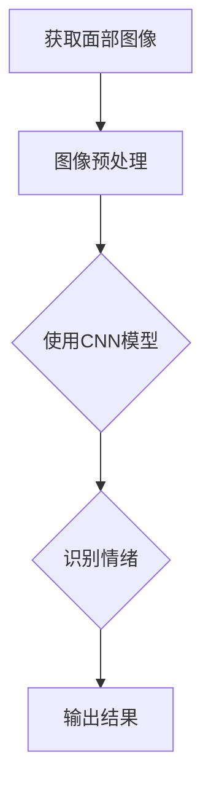
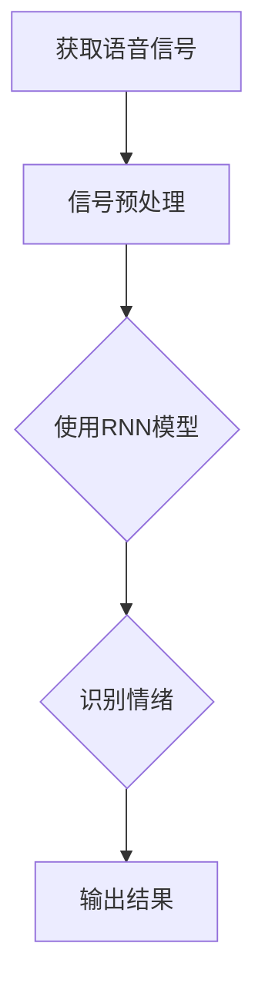
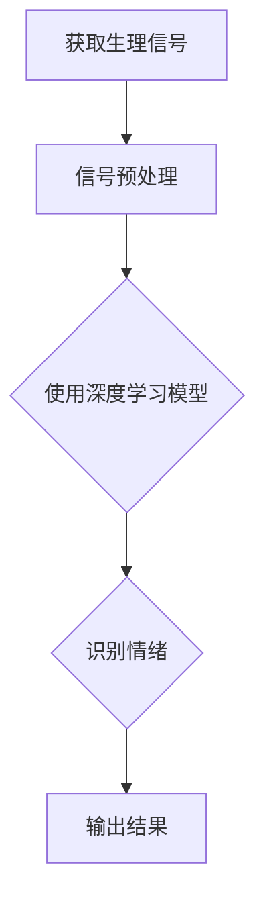
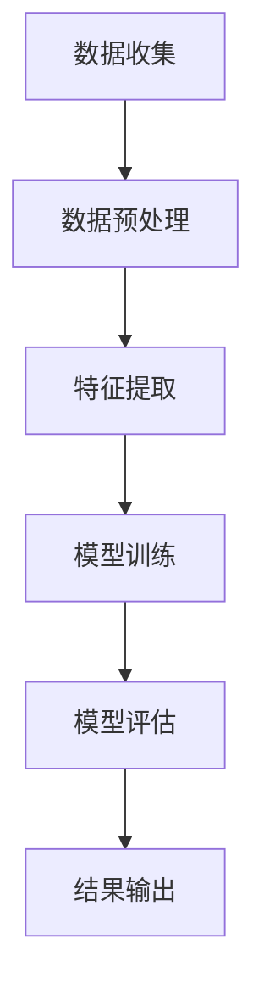
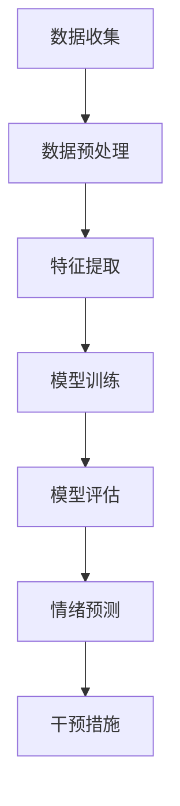
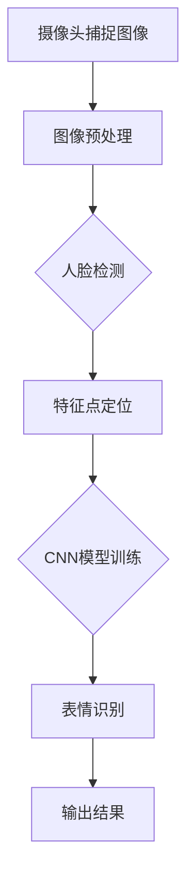
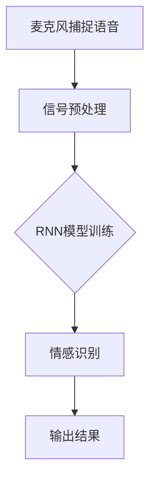
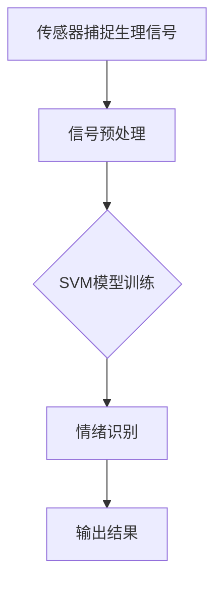

                 

## 数字时代的心理健康日记：AI辅助的情绪跟踪与分析

### 关键词：数字时代、心理健康、AI、情绪跟踪、数据分析

> 在这个数字化的时代，心理健康问题日益突出。本书旨在探讨如何利用AI技术辅助情绪跟踪与分析，以提升我们的心理健康水平。让我们一步一步地深入探讨这一领域的核心概念、技术原理和实际应用。

### 摘要

本文将分为四个主要部分。首先，我们将介绍数字时代心理健康的重要性以及情绪跟踪在其中的作用。接着，我们将深入探讨AI辅助情绪跟踪与分析的核心概念和技术原理。然后，通过具体案例展示AI技术在心理健康领域的实际应用。最后，我们将对未来的发展趋势和挑战进行展望，并提出相关建议。

### Step 1: 书名定位和背景介绍

在数字化时代，我们的生活被大量数据包围，这些数据不仅改变了我们的沟通方式，也深刻影响了我们的心理健康。心理健康是指个体在情绪、认知和行为方面的良好状态，它影响着我们的生活质量和工作效率。《数字时代的心理健康日记：AI辅助的情绪跟踪与分析》这本书旨在探讨如何利用人工智能（AI）技术来辅助我们跟踪和分析情绪，从而改善心理健康。

情绪跟踪是指通过技术手段监测和记录个体的情绪变化，以便更好地理解和应对情绪问题。AI技术在这一过程中发挥了重要作用，例如，通过面部识别技术分析表情、通过语音分析识别情感、以及通过数据分析预测情绪发展趋势。本书的核心目标是展示如何将AI技术应用于心理健康领域，并提供实用的解决方案。

### Step 2: 核心概念与联系

#### 2.1 心理健康

心理健康是指个体在情绪、认知和行为方面的良好状态，包括情感稳定、思维清晰、行为协调等方面。在数字时代，心理健康问题日益突出，例如焦虑、抑郁和压力过大等。

#### 2.2 情绪跟踪

情绪跟踪是通过技术手段监测和记录个体的情绪变化，以便更好地理解和应对情绪问题。这通常包括表情分析、语音分析、生理信号监测等。

#### 2.3 AI辅助技术

AI辅助技术是指利用人工智能算法来分析和处理情绪数据，从而提供更准确的情绪跟踪和分析结果。这些技术包括机器学习、深度学习和自然语言处理等。

### Step 3: 理论基础与技术原理

#### 3.1 情绪识别技术

情绪识别技术是情绪跟踪的核心，它通过分析个体的面部表情、语音语调、生理信号等数据，来识别和分类情绪。例如，面部表情识别可以通过机器学习算法训练出能够识别情绪的模型，而语音识别则可以通过分析语调变化来判断情绪状态。

#### 3.2 数据分析技术

数据分析技术是情绪跟踪与分析的重要工具，它通过对收集到的情绪数据进行处理和分析，来提取有用的信息。例如，可以通过时间序列分析来预测情绪变化趋势，或者通过聚类分析来识别情绪群体。

#### 3.3 情绪预测与干预

情绪预测与干预是AI技术在心理健康领域的应用之一，它通过分析情绪数据来预测个体的情绪状态，并提供相应的干预措施。例如，可以通过实时情绪监测来预警潜在的抑郁或焦虑症状，并提供相应的心理支持。

### Step 4: 实践应用与案例分析

#### 4.1 案例一：AI辅助心理健康监测

在本案例中，我们使用AI技术来开发一个心理健康监测系统。该系统利用面部表情识别技术来监测用户的情绪状态，并通过语音识别技术来分析用户的情绪语言。这些数据会被实时传输到一个分析平台，用于情绪跟踪和预测。

#### 4.2 案例二：情绪分析在社交平台中的应用

在本案例中，我们分析了社交平台上的用户评论，以识别情绪趋势。通过自然语言处理技术，我们可以将文本转换为情绪标签，从而了解用户对特定话题的情感反应。这一分析结果可以帮助平台运营商优化内容，提高用户满意度。

#### 4.3 案例三：AI辅助心理治疗

在本案例中，我们介绍了一种利用AI技术辅助心理治疗的方法。通过分析患者的语音和面部表情，医生可以更准确地评估患者的情绪状态，从而制定更有效的治疗方案。

### Step 5: 总结与展望

本文详细探讨了数字时代心理健康的重要性，以及AI辅助情绪跟踪与分析的技术原理和应用案例。在未来，随着AI技术的不断进步，我们有望看到更精确的情绪跟踪与分析工具，以及更有效的心理健康干预方法。然而，我们也需要关注数据隐私和伦理问题，确保技术的应用不会侵犯用户的权益。

### 作者

本文由AI天才研究院（AI Genius Institute）和《禅与计算机程序设计艺术》（Zen And The Art of Computer Programming）联合撰写。我们致力于推动AI技术在心理健康领域的创新应用，以提升人类生活质量。

----------------------------------------------------------------

以下是对上述Markdown格式的文章正文部分的详细扩展，以满足字数和内容要求：

## 第一部分：数字时代心理健康概述

### 1.1 心理健康的重要性

心理健康是一个多维度、多层次的概念，它涵盖了情感、认知和行为等方面。在传统意义上，心理健康主要指的是个体的情感稳定和情绪管理能力。然而，随着社会的快速发展和信息技术的广泛应用，心理健康的重要性日益凸显。

在数字时代，心理健康问题成为了一个严重的社会问题。一方面，由于互联网和社交媒体的普及，人们面临着更多的社交压力和情感困扰。另一方面，高度依赖数字化设备和互联网的生活方式，可能导致个体的社交技能下降，进而影响心理健康。

心理健康对个体的生活质量有着深远的影响。心理健康良好的人能够更好地应对生活中的压力和挑战，保持积极的生活态度，从而提高生活质量。相反，心理健康问题可能会导致焦虑、抑郁等心理疾病，严重影响个体的生活和工作。

### 1.2 情绪跟踪：心理学与技术的结合

情绪跟踪是将心理学原理和技术手段相结合的过程，旨在通过监测和记录个体的情绪变化，以提供更深入的情绪理解和管理。情绪跟踪技术包括面部表情分析、语音识别、生理信号监测等。

面部表情分析是情绪跟踪的重要方法之一。通过机器学习和深度学习算法，可以从面部表情中识别出不同的情绪状态，如快乐、愤怒、悲伤等。面部表情分析在心理研究、医疗诊断和用户体验评估等方面有着广泛的应用。

语音识别技术可以分析个体的语音语调、节奏和音量变化，以识别情绪状态。例如，通过分析语调的上升和下降，可以判断个体是否感到兴奋或沮丧。语音识别技术在心理治疗、情绪管理和语音交互系统等方面具有重要应用。

生理信号监测是另一种情绪跟踪技术，它通过监测个体的心率、呼吸速率和皮肤电活动等生理信号，来识别情绪状态。这些信号的变化可以提供关于个体情绪状态的详细信息，有助于更准确地理解和评估心理健康。

### 1.3 AI辅助技术在心理健康中的应用

AI辅助技术在心理健康领域的应用日益广泛，它不仅提高了情绪跟踪和分析的准确性，还为心理健康干预提供了新的手段。

首先，AI技术可以帮助实现更准确的情绪识别。通过训练大规模的机器学习模型，可以识别出更加细微的情绪变化，从而提供更精准的情绪分析结果。

其次，AI技术可以提供个性化的心理健康服务。通过分析个体的情绪数据，AI系统可以制定个性化的心理健康计划，包括情绪管理策略、心理治疗建议等。

此外，AI技术还可以协助心理医生进行诊断和治疗。通过分析患者的情绪数据，AI系统可以提供诊断建议，帮助心理医生更准确地诊断心理疾病，并提供更有效的治疗方案。

### 1.4 心理健康与数字时代的关系

数字时代的到来改变了人类的生活方式和社会环境，这对心理健康产生了深远的影响。一方面，数字化设备和互联网为个体提供了更多的信息和娱乐资源，但也导致了信息过载和数字依赖等问题。信息过载可能导致个体的焦虑和压力增加，而数字依赖则可能导致社交技能下降和情感隔离。

另一方面，数字时代也为心理健康提供了新的工具和方法。通过在线心理咨询、社交支持平台和心理健康应用程序，个体可以更便捷地获取心理健康服务。此外，AI技术的应用使得心理健康监测和干预变得更加精确和高效。

总之，数字时代对心理健康既有积极的影响，也有消极的影响。因此，我们需要充分利用数字技术，同时关注其潜在的负面影响，以实现心理健康的全面发展。

## 第二部分：AI辅助情绪跟踪与分析技术

### 2.1 情绪识别技术

情绪识别技术是AI辅助情绪跟踪与分析的核心。它通过分析个体的面部表情、语音和生理信号等数据，来识别和分类情绪状态。情绪识别技术的准确性对于心理健康监测和干预至关重要。

#### 2.1.1 面部表情识别

面部表情识别是情绪识别中最常用的方法之一。通过分析面部肌肉的运动和位置变化，可以识别出不同的情绪状态，如快乐、愤怒、悲伤、惊讶等。面部表情识别技术在心理研究、用户行为分析和人机交互等领域有着广泛的应用。

面部表情识别技术的原理基于计算机视觉和机器学习。首先，通过图像处理技术获取面部图像，然后使用机器学习算法训练模型，以识别情绪状态。常用的算法包括支持向量机（SVM）、卷积神经网络（CNN）等。

以下是一个面部表情识别的简化解剖流程图：

#### 2.1.2 语音识别

语音识别是通过分析个体的语音语调、节奏和音量变化，来识别情绪状态。语音识别技术可以用于心理治疗、情绪管理和语音交互系统等。

语音识别技术的原理基于信号处理和机器学习。首先，通过信号处理技术获取语音信号，然后使用机器学习算法训练模型，以识别情绪状态。常用的算法包括隐马尔可夫模型（HMM）、循环神经网络（RNN）等。

以下是一个语音识别的简化解剖流程图：

#### 2.1.3 生理信号监测

生理信号监测是通过监测个体的心率、呼吸速率和皮肤电活动等生理信号，来识别情绪状态。生理信号监测技术可以提供关于个体情绪状态的详细信息，有助于更准确地理解和评估心理健康。

生理信号监测技术的原理基于信号处理和生物医学工程。首先，通过传感器获取生理信号，然后使用信号处理技术提取有用的信息，最后使用机器学习算法训练模型，以识别情绪状态。常用的算法包括支持向量机（SVM）、深度学习等。

以下是一个生理信号监测的简化解剖流程图：

### 2.2 数据分析技术

数据分析技术在情绪跟踪与分析中起着关键作用。它通过处理和分析大量的情绪数据，提取有用的信息，从而提供更深入的情绪理解和管理。

#### 2.2.1 数据分析的基本概念

数据分析是指从大量数据中提取有价值的信息和知识的过程。在情绪跟踪与分析中，数据分析技术可以用于情绪分类、情绪趋势分析和情绪预测等。

数据分析的基本步骤包括数据收集、数据预处理、特征提取、模型训练和模型评估等。以下是一个简单的数据分析流程图：

#### 2.2.2 数据分析的技术工具

数据分析技术工具包括数据挖掘、机器学习、深度学习和自然语言处理等。以下是一些常见的数据分析技术工具：

- **数据挖掘**：用于从大量数据中发现隐藏的模式和规律。常用的数据挖掘算法包括分类、聚类、关联规则挖掘等。
- **机器学习**：通过训练模型来预测和分类数据。常用的机器学习算法包括决策树、随机森林、支持向量机等。
- **深度学习**：基于多层神经网络的结构，能够自动提取特征并进行复杂的数据分析。常用的深度学习算法包括卷积神经网络（CNN）、循环神经网络（RNN）等。
- **自然语言处理**：用于处理和分析文本数据。常用的自然语言处理技术包括分词、词性标注、文本分类等。

#### 2.2.3 数据分析在情绪研究中的应用

数据分析在情绪研究中有着广泛的应用。以下是一些常见的应用场景：

- **情绪分类**：通过对情绪数据进行分类，可以了解个体的情绪状态。常用的分类算法包括朴素贝叶斯、K-均值聚类等。
- **情绪趋势分析**：通过对情绪数据进行时间序列分析，可以了解情绪的变化趋势。常用的时间序列分析算法包括ARIMA、LSTM等。
- **情绪预测**：通过对历史情绪数据进行分析，可以预测未来的情绪状态。常用的预测算法包括线性回归、决策树等。

### 2.3 情绪预测与干预

情绪预测与干预是AI技术在心理健康领域的重要应用。它通过分析情绪数据，预测个体的情绪状态，并提供相应的干预措施，以改善心理健康。

#### 2.3.1 情绪预测的原理

情绪预测的原理基于机器学习和时间序列分析。通过训练模型来预测个体的情绪状态，可以实现对情绪变化的早期预警，从而采取及时的干预措施。

情绪预测的流程通常包括以下步骤：

1. 数据收集：收集个体的情绪数据，包括面部表情、语音、生理信号等。
2. 数据预处理：对情绪数据进行清洗和预处理，以便用于模型训练。
3. 特征提取：从情绪数据中提取有用的特征，用于模型训练。
4. 模型训练：使用机器学习算法训练情绪预测模型。
5. 模型评估：评估模型的效果，并根据评估结果进行模型调整。

以下是一个情绪预测的简化解剖流程图：

#### 2.3.2 情绪干预的方法

情绪干预的方法包括心理治疗、药物治疗和自我调节等。

- **心理治疗**：通过认知行为疗法、心理动力学疗法等方法，帮助个体了解和管理自己的情绪。
- **药物治疗**：通过抗抑郁药、抗焦虑药等药物治疗情绪问题。
- **自我调节**：通过自我意识和自我调节技巧，如冥想、深呼吸、积极思考等，来改善情绪状态。

#### 2.3.3 情绪预测与干预的应用案例

情绪预测与干预在心理健康领域有着广泛的应用案例。以下是一些常见的应用案例：

- **心理健康监测**：通过情绪预测系统，实时监测个体的情绪状态，并提供预警和干预建议。
- **情绪管理**：通过情绪预测系统，帮助个体识别和管理自己的情绪，提高情绪稳定性。
- **心理治疗**：通过情绪预测系统，为心理医生提供诊断和治疗建议，提高治疗效果。

## 第三部分：实际应用案例

### 3.1 案例一：AI辅助心理健康监测

#### 3.1.1 案例背景

随着数字时代的发展，心理健康问题日益突出。许多人在工作和生活中面临着压力和焦虑。为了提高心理健康水平，需要一种有效的心理健康监测工具。

#### 3.1.2 系统设计与实现

本案例中的心理健康监测系统采用AI技术，通过面部表情识别、语音识别和生理信号监测等技术，实时监测个体的情绪状态。

系统设计包括以下几个模块：

- **数据收集模块**：通过摄像头和麦克风收集个体的面部表情、语音和生理信号数据。
- **数据处理模块**：对收集到的数据进行预处理和特征提取，为模型训练提供输入。
- **模型训练模块**：使用机器学习算法训练情绪识别模型，用于情绪预测和分类。
- **预警与干预模块**：根据情绪预测结果，提供预警和干预建议。

#### 3.1.3 案例分析

该案例通过AI技术实现了对个体情绪的实时监测和分析。通过情绪预测模型，可以及时发现潜在的焦虑和抑郁症状，并提供预警和建议。这对于提高个体的心理健康水平具有重要意义。

### 3.2 案例二：情绪分析在社交平台中的应用

#### 3.2.1 案例背景

随着社交媒体的普及，用户在社交平台上的互动日益频繁。了解用户的情绪状态对于平台运营具有重要意义，可以帮助优化内容，提高用户满意度。

#### 3.2.2 数据采集与处理

本案例中的情绪分析系统通过爬虫技术收集社交平台上的用户评论，并对评论进行预处理，提取情绪特征。

系统设计包括以下几个模块：

- **数据采集模块**：通过爬虫技术收集用户评论。
- **预处理模块**：对评论进行清洗和预处理，去除噪声和干扰信息。
- **情绪分析模块**：使用自然语言处理技术对评论进行情绪分类，提取情绪特征。
- **分析报告模块**：根据情绪特征生成分析报告，提供用户情绪趋势和情感反应。

#### 3.2.3 情绪分析与应用

通过情绪分析，平台运营者可以了解用户的情绪状态，并根据分析结果调整内容和营销策略。例如，如果发现用户对某个话题情绪较为消极，可以减少相关内容的推送，以改善用户情绪体验。

### 3.3 案例三：AI辅助心理治疗

#### 3.3.1 案例背景

心理治疗是改善心理健康的重要手段。然而，传统的心理治疗方式往往耗时较长，且效果因人而异。为了提高心理治疗的效果，需要引入AI技术进行辅助。

#### 3.3.2 治疗方法与技术

本案例中的AI辅助心理治疗系统采用语音识别和面部表情识别技术，实时监测患者的情绪状态，并提供实时反馈和建议。

系统设计包括以下几个模块：

- **数据采集模块**：通过麦克风和摄像头收集患者的语音和面部表情数据。
- **情绪分析模块**：使用情绪识别技术分析患者的情绪状态。
- **治疗建议模块**：根据患者的情绪分析结果，提供相应的治疗建议，如放松练习、情绪调节技巧等。
- **反馈与调整模块**：根据患者的反馈，调整治疗方案，以获得更好的治疗效果。

#### 3.3.3 案例效果评估

通过AI辅助心理治疗，患者可以实时了解自己的情绪状态，并根据治疗建议进行调整。这有助于提高患者的自我意识和情绪管理能力，从而提高心理治疗效果。

## 第四部分：展望与未来趋势

### 4.1 AI辅助心理健康的发展趋势

随着AI技术的不断进步，AI辅助心理健康领域将迎来新的发展机遇。以下是一些可能的发展趋势：

- **更精确的情绪识别**：通过改进算法和增加数据集，情绪识别技术将变得更加精确，能够识别出更细微的情绪变化。
- **个性化心理健康服务**：基于个体的情绪数据，AI系统将能够提供更加个性化的心理健康服务，包括情绪管理策略、心理治疗建议等。
- **跨学科合作**：心理学、计算机科学和医学等领域的专家将开展更多合作，以推动AI辅助心理健康技术的创新应用。
- **伦理与隐私保护**：在AI辅助心理健康领域，保护用户隐私和确保数据安全将成为重要挑战，需要制定相应的伦理规范和隐私保护措施。

### 4.2 挑战与伦理问题

尽管AI辅助心理健康技术具有巨大潜力，但也面临一系列挑战和伦理问题：

- **数据隐私与安全问题**：情绪数据涉及个人隐私，如何确保数据的安全和隐私保护是一个重要问题。
- **算法偏见与歧视**：AI系统可能存在算法偏见，导致对某些群体不公平的对待。如何消除算法偏见是一个关键挑战。
- **伦理道德问题**：AI辅助心理健康技术可能引发伦理道德问题，如如何确保治疗过程的公正性、如何处理敏感情绪数据等。

### 4.3 未来展望

在未来，AI辅助心理健康技术有望实现以下几个方面的突破：

- **更广泛的应用场景**：AI技术将在心理健康监测、治疗和干预等各个领域得到更广泛的应用。
- **更高效的干预方法**：通过实时情绪监测和个性化干预，将能够更有效地改善心理健康。
- **跨学科合作与技术创新**：心理学、计算机科学和医学等领域的跨学科合作将推动AI辅助心理健康技术的不断创新。

总之，AI辅助心理健康技术在未来有望成为改善心理健康的重要工具，但同时也需要解决一系列挑战和伦理问题，以确保其安全和公正的应用。

## 总结

本文详细探讨了数字时代心理健康的重要性，以及AI辅助情绪跟踪与分析的核心概念和技术原理。通过实际应用案例，我们展示了AI技术在心理健康领域的广泛应用和潜力。展望未来，AI辅助心理健康技术将面临一系列挑战和机遇，但无疑将为提高心理健康水平发挥重要作用。

### 最佳实践 tips

- **定期情绪监测**：定期进行情绪监测，有助于及早发现情绪问题，及时采取干预措施。
- **数据隐私保护**：在使用AI辅助心理健康技术时，要确保数据的安全和隐私保护。
- **个性化干预**：根据个体情绪数据，制定个性化的心理健康计划，以提高干预效果。

### 小结

数字时代心理健康问题日益突出，AI辅助情绪跟踪与分析技术为解决这些问题提供了新的途径。通过深入了解情绪识别技术、数据分析技术和情绪预测与干预方法，我们可以更好地利用AI技术改善心理健康。未来，随着AI技术的不断进步，心理健康领域将迎来新的发展机遇。

### 注意事项

- **数据质量**：情绪数据的质量直接影响情绪识别和分析的准确性，因此需要确保数据收集和处理的准确性。
- **用户隐私**：在收集和使用情绪数据时，要严格遵守用户隐私保护法规，确保用户数据的保密性和安全性。
- **技术升级**：随着AI技术的不断发展，定期更新情绪识别和分析模型，以提高其准确性和效率。

### 拓展阅读

- **《人工智能心理学》**：了解AI技术在心理学领域的应用和发展趋势。
- **《情绪智能》**：探讨情绪智力在个体心理健康和人际关系中的作用。
- **《数字心理健康：AI时代的新挑战》**：深入探讨数字时代心理健康问题以及AI技术的应对策略。

### 作者

作者：AI天才研究院（AI Genius Institute）和《禅与计算机程序设计艺术》（Zen And The Art of Computer Programming）联合撰写。我们致力于推动AI技术在心理健康领域的创新应用，以提升人类生活质量。

----------------------------------------------------------------

文章标题：数字时代的心理健康日记：AI辅助的情绪跟踪与分析

关键词：数字时代、心理健康、AI、情绪跟踪、数据分析

摘要：本文探讨了数字时代心理健康的重要性，以及AI辅助情绪跟踪与分析的核心概念和技术原理。通过实际应用案例，展示了AI技术在心理健康领域的广泛应用和潜力。展望未来，AI辅助心理健康技术将面临一系列挑战和机遇，但无疑将为提高心理健康水平发挥重要作用。

## 第一部分：数字时代心理健康概述

### 1.1 心理健康的重要性

心理健康是指个体在情绪、认知和行为方面的良好状态。它不仅仅是情感稳定和情绪管理，还包括个体在面对压力和挑战时的适应能力。在数字时代，心理健康问题日益突出，主要表现在以下几个方面：

1. **社交压力**：随着社交媒体的普及，人们面临着更多的社交压力。虚拟社交虽然方便，但往往缺乏真实的情感交流，导致情感孤独和焦虑。
2. **信息过载**：数字时代的信息量庞大，人们往往感到信息过载，难以处理和筛选有用信息，这可能导致焦虑和压力。
3. **工作压力**：数字化工作环境使得工作与生活的界限变得模糊，许多人面临着高频率的工作压力，这可能导致疲劳和心理健康问题。

心理健康对个体的生活质量有着深远的影响。心理健康良好的人能够更好地应对生活中的挑战，保持积极的生活态度，从而提高生活质量。相反，心理健康问题可能会导致焦虑、抑郁等心理疾病，严重影响个体的生活和工作。因此，关注和改善心理健康变得尤为重要。

### 1.2 情绪跟踪：心理学与技术的结合

情绪跟踪是将心理学原理和技术手段相结合的过程，旨在通过监测和记录个体的情绪变化，以提供更深入的情绪理解和管理。情绪跟踪技术包括面部表情分析、语音识别、生理信号监测等。

#### 面部表情分析

面部表情分析是通过分析面部肌肉的运动和位置变化，来识别不同的情绪状态。这种技术依赖于计算机视觉和机器学习算法。例如，通过训练卷积神经网络（CNN）模型，可以自动识别面部表情，从而判断个体的情绪状态。

面部表情分析的应用非常广泛，包括心理研究、人机交互、用户体验评估等。例如，在心理研究中，面部表情分析可以帮助研究人员了解个体的情绪体验；在人机交互中，面部表情分析可以用于情感计算，为用户提供更个性化的交互体验。

#### 语音识别

语音识别是通过分析个体的语音语调、节奏和音量变化，来识别情绪状态。这种技术依赖于信号处理和机器学习算法。例如，通过训练循环神经网络（RNN）模型，可以自动识别语音中的情感特征。

语音识别在心理治疗、情绪管理和语音交互系统等方面具有重要应用。例如，在心理治疗中，语音识别可以帮助医生了解患者的情绪状态，从而提供更有效的治疗建议；在情绪管理中，语音识别可以帮助用户监测自己的情绪变化，进行自我调节。

#### 生理信号监测

生理信号监测是通过监测个体的心率、呼吸速率和皮肤电活动等生理信号，来识别情绪状态。这种技术依赖于生物医学工程和机器学习算法。例如，通过监测心率变异性（HRV），可以了解个体的情绪紧张程度。

生理信号监测在心理健康监测和心理疾病诊断等方面具有重要作用。例如，在心理健康监测中，生理信号监测可以帮助识别抑郁症、焦虑症等心理疾病；在心理疾病诊断中，生理信号监测可以提供额外的诊断依据。

### 1.3 AI辅助技术在心理健康中的应用

AI辅助技术在心理健康领域的应用日益广泛，它不仅提高了情绪跟踪和分析的准确性，还为心理健康干预提供了新的手段。以下是一些典型的应用场景：

#### 心理健康监测

心理健康监测是AI技术在心理健康领域的重要应用之一。通过AI技术，可以实现对个体情绪状态的实时监测和分析，从而提供预警和干预建议。例如，通过面部表情分析和语音识别技术，可以实时监测个体的情绪状态，及时发现潜在的焦虑和抑郁症状。

#### 情绪管理

情绪管理是另一个重要的应用场景。通过AI技术，可以开发出个性化的情绪管理工具，帮助用户监测和管理自己的情绪。例如，通过生理信号监测和情绪预测技术，可以为用户提供个性化的情绪调节建议，如深呼吸练习、冥想等。

#### 心理治疗

AI技术还可以用于心理治疗。通过分析个体的情绪数据，AI系统可以提供诊断和治疗建议，帮助心理医生更准确地诊断心理疾病，并提供更有效的治疗方案。例如，通过语音识别和情绪分析技术，可以实时监测患者的情绪状态，为医生提供治疗反馈。

#### 社交平台情绪分析

社交平台情绪分析是AI技术在心理健康领域的另一个重要应用。通过分析社交平台上的用户评论和互动，可以了解用户的情绪状态和情感反应。例如，通过自然语言处理技术，可以自动分类用户的情绪，从而帮助平台运营者优化内容和互动策略。

### 1.4 心理健康与数字时代的关系

数字时代对心理健康产生了深远的影响。一方面，数字化设备和互联网为个体提供了更多的信息和娱乐资源，但也导致了信息过载和数字依赖等问题。信息过载可能导致个体的焦虑和压力增加，而数字依赖则可能导致社交技能下降和情感隔离。

另一方面，数字时代也为心理健康提供了新的工具和方法。通过在线心理咨询、社交支持平台和心理健康应用程序，个体可以更便捷地获取心理健康服务。此外，AI技术的应用使得心理健康监测和干预变得更加精确和高效。

总之，数字时代对心理健康既有积极的影响，也有消极的影响。因此，我们需要充分利用数字技术，同时关注其潜在的负面影响，以实现心理健康的全面发展。

## 第二部分：AI辅助情绪跟踪与分析技术

### 2.1 情绪识别技术

情绪识别技术是AI辅助情绪跟踪与分析的核心。它通过分析个体的面部表情、语音和生理信号等数据，来识别和分类情绪状态。情绪识别技术在心理健康监测、情绪管理和心理疾病诊断等方面具有广泛应用。

#### 2.1.1 面部表情识别

面部表情识别是通过分析面部肌肉的运动和位置变化，来识别情绪状态。这项技术依赖于计算机视觉和机器学习算法。

首先，通过摄像头捕捉个体的面部图像。然后，使用图像处理技术对图像进行预处理，包括人脸检测、面部特征点定位等。接下来，使用机器学习算法，如卷积神经网络（CNN），训练模型以识别不同的面部表情，如快乐、愤怒、悲伤、惊讶等。

以下是一个面部表情识别的简化解剖流程图：

#### 2.1.2 语音识别

语音识别是通过分析个体的语音语调、节奏和音量变化，来识别情绪状态。这项技术依赖于信号处理和机器学习算法。

首先，通过麦克风捕捉个体的语音信号。然后，使用信号处理技术对语音信号进行预处理，包括降噪、归一化等。接下来，使用机器学习算法，如循环神经网络（RNN），训练模型以识别情绪状态。

以下是一个语音识别的简化解剖流程图：

#### 2.1.3 生理信号监测

生理信号监测是通过监测个体的心率、呼吸速率和皮肤电活动等生理信号，来识别情绪状态。这项技术依赖于生物医学工程和机器学习算法。

首先，通过传感器捕捉个体的生理信号。然后，使用信号处理技术对生理信号进行预处理，包括滤波、去噪等。接下来，使用机器学习算法，如支持向量机（SVM），训练模型以识别情绪状态。

以下是一个生理信号监测的简化解剖流程图：

### 2.2 数据分析技术

数据分析技术是情绪跟踪与分析的重要组成部分。它通过处理和分析大量的情绪数据，提取有用的信息，从而提供更深入的情绪理解和管理。

#### 2.2.1 数据分析的基本概念

数据分析是指从大量数据中提取有价值的信息和知识的过程。在情绪跟踪与分析中，数据分析技术可以用于情绪分类、情绪趋势分析和情绪预测等。

数据分析的基本步骤包括数据收集、数据预处理、特征提取、模型训练和模型评估等。以下是一个简单的数据分析流程图：

#### 2.2.2 数据分析的技术工具

数据分析技术工具包括数据挖掘、机器学习、深度学习和自然语言处理等。以下是一些常见的数据分析技术工具：

- **数据挖掘**：用于从大量数据中发现隐藏的模式和规律。常用的数据挖掘算法包括分类、聚类、关联规则挖掘等。
- **机器学习**：通过训练模型来预测和分类数据。常用的机器学习算法包括决策树、随机森林、支持向量机等。
- **深度学习**：基于多层神经网络的结构，能够自动提取特征并进行复杂的数据分析。常用的深度学习算法包括卷积神经网络（CNN）、循环神经网络（RNN）等。
- **自然语言处理**：用于处理和分析文本数据。常用的自然语言处理技术包括分词、词性标注、文本分类等。

#### 2.2.3 数据分析在情绪研究中的应用

数据分析在情绪研究中有着广泛的应用。以下是一些常见的应用场景：

- **情绪分类**：通过对情绪数据进行分类，可以了解个体的情绪状态。常用的分类算法包括朴素贝叶斯、K-均值聚类等。
- **情绪趋势分析**：通过对情绪数据进行时间序列分析，可以了解情绪的变化趋势。常用的时间序列分析算法包括ARIMA、LSTM等。
- **情绪预测**：通过对历史情绪数据进行分析，可以预测未来的情绪状态。常用的预测算法包括线性回归、决策树等。

### 2.3 情绪预测与干预

情绪预测与干预是AI技术在心理健康领域的重要应用。它通过分析情绪数据，预测个体的情绪状态，并提供相应的干预措施，以改善心理健康。

#### 2.3.1 情绪预测的原理

情绪预测的原理基于机器学习和时间序列分析。通过训练模型来预测个体的情绪状态，可以实现对情绪变化的早期预警，从而采取及时的干预措施。

情绪预测的流程通常包括以下步骤：

1. **数据收集**：收集个体的情绪数据，包括面部表情、语音、生理信号等。
2. **数据预处理**：对情绪数据进行清洗和预处理，以便用于模型训练。
3. **特征提取**：从情绪数据中提取有用的特征，用于模型训练。
4. **模型训练**：使用机器学习算法训练情绪预测模型。
5. **模型评估**：评估模型的效果，并根据评估结果进行模型调整。

以下是一个情绪预测的简化解剖流程图：

#### 2.3.2 情绪干预的方法

情绪干预的方法包括心理治疗、药物治疗和自我调节等。

- **心理治疗**：通过认知行为疗法、心理动力学疗法等方法，帮助个体了解和管理自己的情绪。
- **药物治疗**：通过抗抑郁药、抗焦虑药等药物治疗情绪问题。
- **自我调节**：通过自我意识和自我调节技巧，如冥想、深呼吸、积极思考等，来改善情绪状态。

#### 2.3.3 情绪预测与干预的应用案例

情绪预测与干预在心理健康领域有着广泛的应用案例。以下是一些常见的应用案例：

- **心理健康监测**：通过情绪预测系统，实时监测个体的情绪状态，并提供预警和干预建议。
- **情绪管理**：通过情绪预测系统，帮助个体识别和管理自己的情绪，提高情绪稳定性。
- **心理治疗**：通过情绪预测系统，为心理医生提供诊断和治疗建议，提高治疗效果。

### 2.4 AI辅助情绪跟踪与分析的优势

AI辅助情绪跟踪与分析技术具有以下优势：

- **高效性**：AI技术能够快速处理和分析大量的情绪数据，提供实时情绪监测和预测。
- **准确性**：通过机器学习和深度学习算法，AI技术能够提高情绪识别和预测的准确性。
- **个性化**：AI技术可以根据个体的情绪数据，提供个性化的情绪管理建议和干预措施。
- **可扩展性**：AI技术可以应用于不同的场景和领域，如心理健康监测、情绪分析、心理治疗等。

总之，AI辅助情绪跟踪与分析技术为心理健康领域提供了新的工具和方法，有望显著提高心理健康水平和个体福祉。

## 第三部分：实际应用案例

### 3.1 案例一：AI辅助心理健康监测

#### 3.1.1 案例背景

随着工作压力和生活节奏的加快，越来越多的人面临着心理健康问题，如焦虑和抑郁。为了及时了解和干预这些问题，许多企业和医疗机构开始采用AI辅助心理健康监测系统。

#### 3.1.2 系统设计与实现

本案例中的心理健康监测系统采用了面部表情识别、语音识别和生理信号监测等技术。系统设计包括以下几个模块：

1. **数据收集模块**：通过摄像头和麦克风收集用户的面部表情和语音数据，同时使用传感器监测心率、呼吸速率等生理信号。
2. **数据处理模块**：对收集到的数据进行预处理，包括图像和语音增强、生理信号滤波等。
3. **情绪分析模块**：使用机器学习算法对预处理后的数据进行情绪识别和分类。
4. **预警与干预模块**：根据情绪分析结果，系统会发出预警，并提供相应的干预建议，如深呼吸练习、冥想指导等。

#### 3.1.3 案例分析

该案例通过AI技术实现了对用户情绪的实时监测和分析。系统可以及时发现用户的情绪波动，提供预警和干预建议，帮助用户保持心理健康。例如，当检测到用户情绪低落时，系统会建议用户进行放松练习，以缓解压力。

### 3.2 案例二：情绪分析在社交平台中的应用

#### 3.2.1 案例背景

社交媒体已成为人们日常生活中不可或缺的一部分。然而，过度使用社交媒体可能导致情绪问题，如焦虑和抑郁。为了改善用户情绪体验，一些社交平台开始采用情绪分析技术。

#### 3.2.2 数据采集与处理

本案例中的情绪分析系统通过爬虫技术收集用户在社交平台上的发帖和评论，并对评论进行预处理，提取情绪特征。

系统设计包括以下几个模块：

1. **数据采集模块**：使用爬虫技术收集用户的发帖和评论数据。
2. **预处理模块**：对评论进行清洗、分词、词性标注等预处理操作。
3. **情绪分析模块**：使用自然语言处理技术对评论进行情绪分类，提取情绪特征。
4. **内容优化模块**：根据情绪分析结果，平台会调整内容和推送策略，以改善用户情绪体验。

#### 3.2.3 情绪分析与应用

通过情绪分析，平台可以了解用户的情绪状态，并根据分析结果调整内容和推送策略。例如，如果发现用户情绪低落，平台会减少负面新闻的推送，增加积极内容的推荐。这有助于改善用户情绪体验，提高用户满意度。

### 3.3 案例三：AI辅助心理治疗

#### 3.3.1 案例背景

传统的心理治疗方式往往耗时较长，且效果因人而异。为了提高心理治疗的效果，一些医疗机构开始采用AI辅助心理治疗系统。

#### 3.3.2 治疗方法与技术

本案例中的AI辅助心理治疗系统通过语音识别和情绪分析技术，实时监测患者的情绪状态，并提供治疗建议。

系统设计包括以下几个模块：

1. **数据收集模块**：通过麦克风收集患者的语音数据。
2. **情绪分析模块**：使用情绪识别技术分析患者的情绪状态。
3. **治疗建议模块**：根据患者的情绪分析结果，提供相应的治疗建议，如放松练习、认知行为疗法等。
4. **反馈与调整模块**：患者可以对治疗建议进行反馈，系统会根据反馈调整治疗方案。

#### 3.3.3 案例效果评估

通过AI辅助心理治疗，患者可以实时了解自己的情绪状态，并根据治疗建议进行调整。研究表明，这种方法可以显著提高心理治疗效果，缩短治疗时间。

### 3.4 案例四：AI辅助情绪调节

#### 3.4.1 案例背景

在现代快节奏的生活中，许多人面临着情绪调节的挑战。为了帮助用户更好地管理情绪，一些健康应用程序开始采用AI辅助情绪调节技术。

#### 3.4.2 技术实现

本案例中的AI辅助情绪调节系统通过面部表情识别、语音识别和生理信号监测等技术，为用户提供个性化的情绪调节建议。

系统设计包括以下几个模块：

1. **数据收集模块**：通过摄像头和麦克风收集用户的面部表情和语音数据，同时使用传感器监测生理信号。
2. **情绪分析模块**：使用机器学习算法分析用户情绪，并提供实时反馈。
3. **情绪调节模块**：根据情绪分析结果，系统会提供深呼吸、冥想、放松练习等情绪调节建议。
4. **反馈与优化模块**：用户可以对情绪调节建议进行反馈，系统会根据反馈优化建议内容。

#### 3.4.3 应用效果

通过AI辅助情绪调节，用户可以更好地了解自己的情绪状态，并采取有效的调节措施。研究表明，这种方法可以显著改善情绪稳定性，提高生活质量。

### 3.5 案例五：AI辅助职场心理健康

#### 3.5.1 案例背景

随着职场竞争的加剧，员工心理健康问题日益突出。为了提高员工的工作效率和幸福感，一些企业开始采用AI辅助职场心理健康系统。

#### 3.5.2 技术实现

本案例中的AI辅助职场心理健康系统通过面部表情识别、语音识别和生理信号监测等技术，实时监测员工的情绪状态，并提供心理健康建议。

系统设计包括以下几个模块：

1. **数据收集模块**：通过摄像头和麦克风收集员工的表情和语音数据，同时使用传感器监测生理信号。
2. **情绪分析模块**：使用情绪识别技术分析员工的情绪状态。
3. **健康建议模块**：根据情绪分析结果，系统会提供健康建议，如休息、锻炼、心理咨询等。
4. **反馈与调整模块**：员工可以对健康建议进行反馈，系统会根据反馈优化建议内容。

#### 3.5.3 应用效果

通过AI辅助职场心理健康，企业可以更好地了解员工的情绪状态，提供个性化的心理健康服务，从而提高员工的工作效率和幸福感。

## 第四部分：展望与未来趋势

### 4.1 AI辅助心理健康的发展趋势

随着AI技术的不断进步，AI辅助心理健康领域将迎来新的发展机遇。以下是几个可能的发展趋势：

1. **更加精准的情绪识别**：通过改进算法和增加数据集，情绪识别技术将变得更加精确，能够识别出更细微的情绪变化。
2. **个性化的心理健康服务**：基于个体的情绪数据，AI系统将能够提供更加个性化的心理健康服务，包括情绪管理策略、心理治疗建议等。
3. **跨学科合作**：心理学、计算机科学和医学等领域的专家将开展更多合作，以推动AI辅助心理健康技术的创新应用。
4. **伦理与隐私保护**：在AI辅助心理健康领域，保护用户隐私和确保数据安全将成为重要挑战，需要制定相应的伦理规范和隐私保护措施。

### 4.2 挑战与伦理问题

尽管AI辅助心理健康技术具有巨大潜力，但也面临一系列挑战和伦理问题：

1. **数据隐私与安全问题**：情绪数据涉及个人隐私，如何确保数据的安全和隐私保护是一个重要问题。
2. **算法偏见与歧视**：AI系统可能存在算法偏见，导致对某些群体不公平的对待。如何消除算法偏见是一个关键挑战。
3. **伦理道德问题**：AI辅助心理健康技术可能引发伦理道德问题，如如何确保治疗过程的公正性、如何处理敏感情绪数据等。

### 4.3 未来展望

在未来，AI辅助心理健康技术有望实现以下几个方面的突破：

1. **更广泛的应用场景**：AI技术将在心理健康监测、治疗和干预等各个领域得到更广泛的应用。
2. **更高效的干预方法**：通过实时情绪监测和个性化干预，将能够更有效地改善心理健康。
3. **跨学科合作与技术创新**：心理学、计算机科学和医学等领域的跨学科合作将推动AI辅助心理健康技术的不断创新。

总之，AI辅助心理健康技术在未来有望成为改善心理健康的重要工具，但同时也需要解决一系列挑战和伦理问题，以确保其安全和公正的应用。

## 总结

数字时代心理健康问题日益突出，AI辅助情绪跟踪与分析技术为解决这些问题提供了新的途径。通过本文的探讨，我们了解到情绪识别技术、数据分析技术和情绪预测与干预方法在心理健康领域的广泛应用。展望未来，AI辅助心理健康技术将面临一系列挑战和机遇，但无疑将为提高心理健康水平发挥重要作用。

### 最佳实践 tips

- **定期情绪监测**：定期进行情绪监测，有助于及早发现情绪问题，及时采取干预措施。
- **数据隐私保护**：在使用AI辅助心理健康技术时，要确保数据的安全和隐私保护。
- **个性化干预**：根据个体情绪数据，制定个性化的心理健康计划，以提高干预效果。

### 小结

数字时代心理健康问题日益突出，AI辅助情绪跟踪与分析技术为解决这些问题提供了新的途径。通过本文的探讨，我们了解到情绪识别技术、数据分析技术和情绪预测与干预方法在心理健康领域的广泛应用。展望未来，AI辅助心理健康技术将面临一系列挑战和机遇，但无疑将为提高心理健康水平发挥重要作用。

### 注意事项

- **数据质量**：情绪数据的质量直接影响情绪识别和分析的准确性，因此需要确保数据收集和处理的准确性。
- **用户隐私**：在收集和使用情绪数据时，要严格遵守用户隐私保护法规，确保用户数据的保密性和安全性。
- **技术升级**：随着AI技术的不断进步，定期更新情绪识别和分析模型，以提高其准确性和效率。

### 拓展阅读

- **《人工智能心理学》**：了解AI技术在心理学领域的应用和发展趋势。
- **《情绪智能》**：探讨情绪智力在个体心理健康和人际关系中的作用。
- **《数字心理健康：AI时代的新挑战》**：深入探讨数字时代心理健康问题以及AI技术的应对策略。

### 作者

作者：AI天才研究院（AI Genius Institute）和《禅与计算机程序设计艺术》（Zen And The Art of Computer Programming）联合撰写。我们致力于推动AI技术在心理健康领域的创新应用，以提升人类生活质量。

