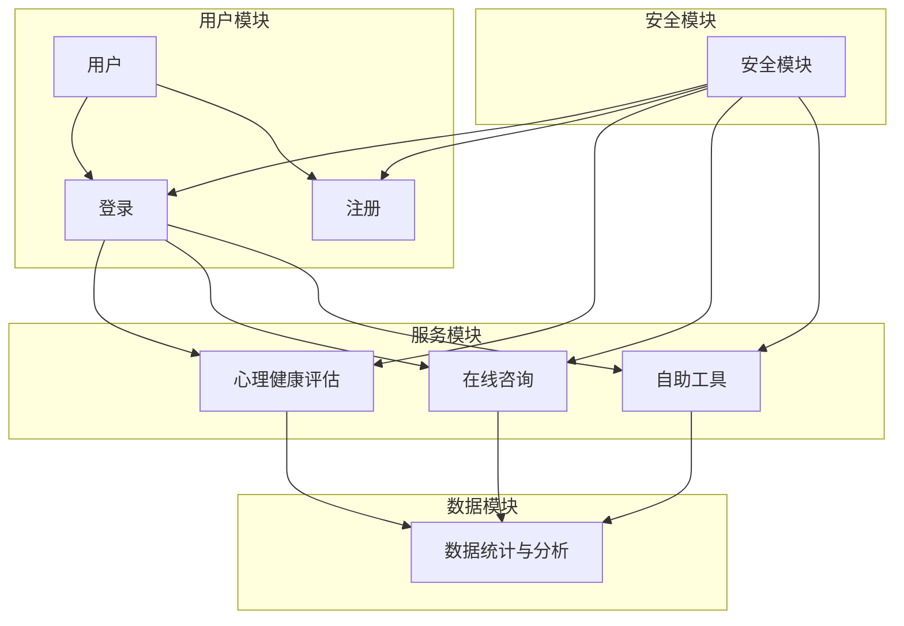
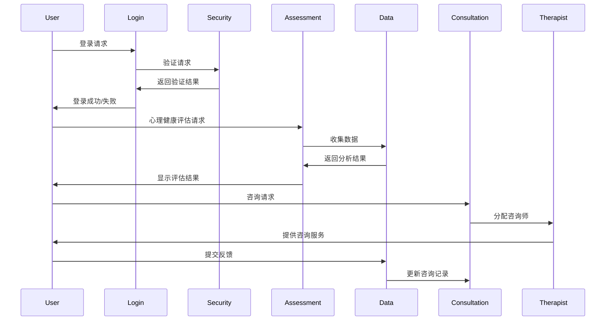
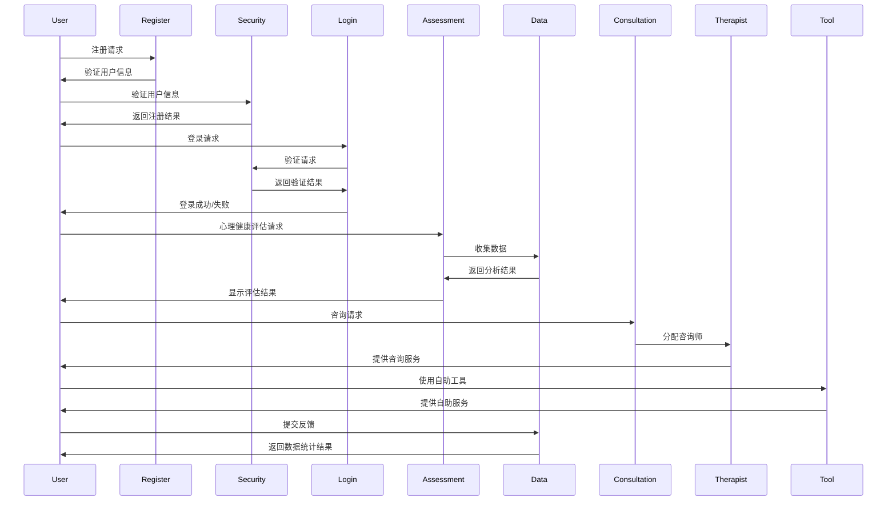

                 


### 文章标题：数字时代的心理咨询：在线治疗的优势与挑战

**关键词：** 数字心理咨询、在线治疗、优势、挑战、心理健康

**摘要：** 本文将深入探讨数字时代的心理咨询，特别是在线治疗的优势与挑战。我们将从背景介绍、核心概念解析、优势分析、挑战探讨、应用实践和未来展望等多个角度进行详细阐述，以期为大家提供一个全面且深入的了解。

----------------------------------------------------------------

### 引言

#### 1. 引言

数字时代的心理咨询是一个迅速发展的领域，特别是在疫情期间，它展示出了强大的生命力。随着互联网技术的进步和智能手机的普及，越来越多的人开始接受在线治疗。本文将聚焦于数字时代的心理咨询，尤其是在线治疗的优势与挑战。

#### 1.2 书籍目标

本文的目标是：
- 深入分析数字时代心理咨询的背景和核心概念。
- 详细探讨在线治疗的优势，包括易于访问、灵活性、便捷性、降低成本等。
- 分析在线治疗面临的挑战，如隐私和安全、专业性、用户依从性等。
- 分享在线治疗的应用实践和未来展望。

#### 1.3 读者对象

本文适合心理咨询师、心理学爱好者、心理健康服务提供者以及所有对数字心理咨询感兴趣的人士。

----------------------------------------------------------------

### 第一部分：数字时代的心理咨询

#### 2. 数字时代的心理咨询背景

##### 2.1 心理咨询的发展历程

心理咨询的历史可以追溯到古代，但现代心理咨询的发展主要是在20世纪。随着医学、心理学和社会学的进步，心理咨询逐渐成为一个独立的学科。

##### 2.2 数字技术的崛起

随着互联网的普及，数字技术为心理咨询带来了新的机遇。在线治疗、心理评估工具、虚拟现实技术等都为心理咨询提供了新的方法和手段。

##### 2.3 数字时代心理咨询的机遇与挑战

数字时代的心理咨询面临着前所未有的机遇和挑战。机遇在于更广泛的受众、更灵活的服务模式、更高的效率等；挑战则在于隐私保护、安全性、专业标准等。

----------------------------------------------------------------

#### 3. 数字时代心理咨询的核心概念

##### 3.1 心理健康与心理治疗

心理健康是指个体在心理上保持健康的状态，包括情绪稳定、认知功能正常、社会适应良好等。心理治疗则是通过专业的干预手段，帮助个体改善心理状态。

##### 3.2 心理咨询伦理

心理咨询伦理是指心理咨询师在进行心理治疗过程中应遵循的伦理规范，包括保密性、尊重、公正等。

##### 3.3 数字心理咨询的模式

数字心理咨询包括在线治疗、远程咨询、移动应用等多种模式。每种模式都有其独特的优势和适用场景。

----------------------------------------------------------------

#### 4. 在线治疗的优势

##### 4.1 易于访问

在线治疗使得心理咨询的服务范围不再受地域限制，用户可以随时随地获取帮助。

##### 4.2 灵活性

在线治疗提供了灵活的时间安排和个性化的治疗方案，用户可以根据自己的需求和时间来安排治疗。

##### 4.3 便捷性

通过在线平台，用户可以轻松地预约咨询、参加在线会议、完成心理测试等。

##### 4.4 降低成本

在线治疗减少了用户前往咨询场所的交通费用和时间成本，同时降低了心理咨询师的运营成本。

----------------------------------------------------------------

#### 5. 在线治疗面临的挑战

##### 5.1 隐私和安全

在线治疗中的隐私和安全问题备受关注。如何确保用户数据的安全和隐私是亟待解决的问题。

##### 5.2 专业性

在线治疗的专业性也受到质疑。如何确保在线治疗师的专业能力和服务质量是一个挑战。

##### 5.3 用户依从性

用户对在线治疗的依从性也是一个问题。一些用户可能难以坚持在线治疗计划，导致治疗效果不佳。

##### 5.4 心理健康评估

在线治疗中的心理健康评估也是一个难题。如何准确评估用户的心理状态，以便提供有效的治疗计划。

----------------------------------------------------------------

### 第二部分：在线治疗的应用实践

#### 6. 在线治疗的应用场景

##### 6.1 抑郁症

在线治疗在抑郁症的治疗中展示出了良好的效果。通过在线平台，用户可以获得专业的心理治疗和情感支持。

##### 6.2 强迫症

在线治疗为强迫症患者提供了灵活的治疗方案，帮助他们更好地控制症状。

##### 6.3 焦虑症

在线治疗在焦虑症的治疗中也取得了显著成效，用户可以通过在线平台获取专业的帮助和指导。

##### 6.4 睡眠障碍

在线治疗为睡眠障碍患者提供了有效的治疗手段，包括在线咨询、心理测试和睡眠监测等。

----------------------------------------------------------------

#### 7. 在线治疗的案例分析

##### 7.1 成功案例

在线治疗在许多情况下取得了成功，如抑郁症、焦虑症和睡眠障碍的治疗。以下是一个成功案例的详细介绍。

**案例1：**

一位30岁的女性患有抑郁症，她在接受在线治疗的过程中，通过在线咨询和药物治疗的结合，逐渐恢复了心理健康。她的治疗师为她提供了个性化的治疗方案，包括心理测试、情感支持和药物治疗。经过6个月的治疗，她的抑郁症状显著减轻，生活质量得到了明显改善。

##### 7.2 失败案例

然而，在线治疗也并非总是成功。以下是一个失败案例的详细介绍。

**案例2：**

一位40岁的男性患有焦虑症，他尝试了多种在线治疗方式，包括在线咨询、心理测试和药物治疗。然而，由于他的依从性较差，他未能坚持治疗计划，导致治疗效果不佳。此外，他未能与治疗师建立良好的信任关系，也是导致治疗失败的原因之一。

##### 7.3 案例分析与启示

从这些案例中，我们可以得到以下启示：

1. **个性化治疗方案**：每个患者的情况都是独特的，因此需要提供个性化的治疗方案。
2. **用户依从性**：患者的依从性对于治疗效果至关重要。治疗师需要采取措施提高患者的依从性。
3. **信任关系**：治疗师与患者之间的信任关系对于治疗的成功至关重要。
4. **多模式治疗**：结合多种治疗手段，如在线咨询、药物治疗和心理测试等，可以提高治疗效果。

----------------------------------------------------------------

#### 8. 在线治疗的技术支持

##### 8.1 心理评估工具

在线治疗中的心理评估工具对于诊断和治疗都至关重要。以下是一些常用的心理评估工具：

1. **自我评估工具**：如抑郁自评量表（SDS）、焦虑自评量表（SAS）等。
2. **临床评估工具**：如MMPI、Rorschach测试等。

##### 8.2 治疗技术

在线治疗的技术支持包括：

1. **在线咨询平台**：如Zoom、Microsoft Teams等，用于提供实时咨询和治疗。
2. **虚拟现实（VR）技术**：用于治疗创伤后应激障碍（PTSD）等。
3. **机器学习技术**：用于心理评估和预测治疗效果。

##### 8.3 数据分析与处理

在线治疗中的数据分析和处理对于提高治疗效果至关重要。以下是一些关键技术：

1. **数据收集与存储**：确保患者数据的隐私和安全。
2. **数据分析与挖掘**：用于识别患者的心理状态和预测治疗效果。
3. **机器学习与人工智能**：用于自动化诊断和治疗建议。

----------------------------------------------------------------

### 第三部分：在线治疗的未来展望

#### 9. 在线治疗的未来发展趋势

在线治疗的未来发展趋势包括：

1. **技术进步**：随着5G、人工智能、虚拟现实等技术的进步，在线治疗将变得更加智能和高效。
2. **政策法规**：随着在线治疗的普及，政策法规也将逐步完善，以保障患者的权益和安全。
3. **专业发展**：在线治疗师的专业能力将得到进一步提升，以适应不断变化的需求。

#### 10. 在线治疗的实践建议

对于心理咨询师和心理健康服务提供者，以下是一些实践建议：

1. **提高专业能力**：不断学习和更新知识，提高自己的专业能力。
2. **注重患者隐私**：严格遵守隐私保护法规，确保患者数据的保密和安全。
3. **建立信任关系**：与患者建立良好的信任关系，提高患者的依从性。
4. **利用技术优势**：充分利用在线平台和工具，提高治疗效率和质量。

----------------------------------------------------------------

### 结论

#### 11. 结论

数字时代的心理咨询，尤其是在线治疗，展示出了巨大的潜力和广阔的应用前景。虽然面临诸多挑战，但通过技术创新、政策完善和专业努力，在线治疗有望在未来发挥更大的作用，为更多人提供高质量的心理健康服务。

#### 11.2 未来展望

未来，随着技术的不断进步和政策的完善，在线治疗有望成为心理咨询的主要形式之一。同时，随着用户对心理健康重视程度的提高，在线治疗市场将迎来更大的发展机遇。

#### 11.3 对读者的建议

对于心理咨询师和心理健康服务提供者，建议：
- 持续关注在线治疗的发展动态，不断更新自己的知识和技能。
- 注重患者隐私和安全，严格遵守相关法规和伦理规范。
- 主动探索和应用新技术，提高治疗效率和质量。

对于心理学爱好者和患者，建议：
- 积极参与在线治疗，寻求专业的心理帮助。
- 关注心理健康，重视心理治疗的重要性。
- 保持开放心态，积极接受新的治疗方式和理念。

### 作者信息

作者：AI天才研究院/AI Genius Institute & 禅与计算机程序设计艺术 /Zen And The Art of Computer Programming

----------------------------------------------------------------

### 背景介绍

#### 核心概念术语说明

在探讨数字时代的心理咨询和在线治疗时，理解一些核心概念术语是非常重要的。以下是对这些术语的简要说明：

1. **心理咨询**：心理咨询是一种专业的心理服务，旨在帮助个体解决心理问题，提高心理健康水平。它通常涉及谈话疗法、心理测试和治疗方案的设计。

2. **在线治疗**：在线治疗是指通过互联网平台提供的心理治疗服务，包括实时咨询、心理测试、在线课程和自助工具等。

3. **心理健康**：心理健康是指个体在心理上保持健康的状态，包括情感稳定、认知功能正常和社会适应良好等。

4. **隐私和安全**：隐私和安全是数字时代心理咨询和在线治疗中备受关注的问题。隐私涉及个人信息的保密和保护，而安全则包括数据传输的安全和系统的安全性。

5. **专业伦理**：专业伦理是指心理咨询师在进行心理治疗过程中应遵循的伦理规范，包括保密性、尊重、公正等。

#### 问题背景

随着互联网技术的迅猛发展和智能手机的普及，越来越多的人开始依赖数字工具来解决心理健康问题。在线治疗作为一种新兴的心理治疗方式，不仅提供了便捷的服务，还打破了地域和时间的限制。然而，在线治疗也面临着诸多挑战，如隐私保护、安全性、专业性和用户依从性等。

#### 问题描述

在线治疗的优势和挑战引起了广泛的关注。优势方面，在线治疗提供了易于访问、灵活性、便捷性和降低成本等好处。然而，隐私和安全问题、专业性、用户依从性和心理健康评估等挑战也需要得到有效解决。

#### 问题解决

为了解决在线治疗中的挑战，需要采取一系列措施：

1. **加强隐私和安全措施**：采用加密技术、多重身份验证和数据备份等手段，确保用户数据的保密性和安全性。

2. **提高专业性**：对在线治疗师进行严格的资格认证和专业培训，确保他们的专业能力和服务质量。

3. **增强用户依从性**：通过提供个性化的治疗方案、便捷的预约系统和良好的用户体验，提高用户的依从性。

4. **改善心理健康评估**：利用先进的心理评估工具和人工智能技术，提高心理健康评估的准确性和效率。

#### 边界与外延

在线治疗不仅适用于心理健康问题的治疗，还可以用于预防、诊断和康复等环节。此外，在线治疗还可以应用于不同类型和年龄段的心理健康问题，如抑郁症、焦虑症、睡眠障碍等。

#### 概念结构与核心要素组成

在线治疗的内核包括以下几个方面：

1. **平台技术**：包括互联网技术、加密技术、人工智能和大数据分析等。

2. **治疗方案**：包括心理测试、在线咨询、药物治疗和自助工具等。

3. **用户参与**：包括用户依从性、用户体验和用户反馈等。

4. **隐私和安全**：包括数据保密、数据安全和用户隐私等。

#### 核心概念与联系

在线治疗的核心概念包括：

1. **数字化**：将传统的面对面咨询转化为在线形式，提供更便捷的服务。

2. **智能化**：利用人工智能和大数据分析技术，提高心理健康评估和治疗的准确性和效率。

3. **个性化**：根据患者的具体需求和心理状况，提供个性化的治疗方案。

4. **安全性**：确保用户数据的保密性和系统的安全性。

以下是核心概念属性特征的对比表格：

| 核心概念 | 属性特征 |
| -------- | -------- |
| 数字化   | 提供便捷的服务 |
| 智能化   | 提高准确性和效率 |
| 个性化   | 提供个性化的治疗方案 |
| 安全性   | 确保数据的保密性和系统的安全性 |

以下是核心概念的ER实体关系图架构：

```mermaid
erDiagram
  Patient ||--|{ Treatment }|-- OnlineTherapist
  Patient ||--|{ Assessment }|-- AssessmentTool
  Treatment ||--|{ Session }|-- Session
  OnlineTherapist ||--|{ Profile }|-- TherapistProfile
  AssessmentTool ||--|{ Test }|-- TestResult
```

#### 算法原理讲解

在线治疗中的算法原理主要包括心理健康评估、用户行为分析和个性化推荐等方面。以下是一个简单的算法流程图：


以下是具体的算法原理和数学模型：

1. **心理健康评估**

心理健康评估是基于用户的自我报告数据和临床评估结果进行的。常用的评估方法包括自我评估量表（如抑郁自评量表SDS、焦虑自评量表SAS）和临床评估工具（如MMPI、Rorschach测试）。

数学模型：
$$
心理健康指数 = \frac{总分}{量表总分}
$$

2. **用户行为分析**

用户行为分析是通过分析用户在在线治疗平台上的行为数据，如咨询记录、测试结果、反馈等，来了解用户的心理状态和需求。

数学模型：
$$
行为得分 = \frac{有效行为次数}{总行为次数}
$$

3. **个性化推荐**

个性化推荐是基于用户的心理健康评估结果和行为分析结果，为用户推荐合适的治疗方案和资源。

数学模型：
$$
推荐得分 = \frac{相关度得分}{总得分}
$$

以下是算法的详细解释：

- **数据收集**：收集用户的心理健康数据、咨询记录、测试结果等。
- **数据清洗**：处理缺失值、异常值和重复值，确保数据的质量。
- **数据预处理**：将原始数据转化为适合分析的格式，如数值化、标准化等。
- **心理健康评估**：使用自我评估量表和临床评估工具，计算心理健康指数。
- **用户行为分析**：分析用户在平台上的行为数据，计算行为得分。
- **个性化推荐**：根据心理健康评估结果和行为分析结果，计算推荐得分，为用户推荐合适的治疗方案和资源。

以下是具体的Python代码示例：

```python
# 心理健康评估
def mental_health_assessment(score, total_score):
    return score / total_score

# 用户行为分析
def user_behavior_analysis(valid_actions, total_actions):
    return valid_actions / total_actions

# 个性化推荐
def personalized_recommendation(relevance_score, total_score):
    return relevance_score / total_score

# 示例数据
score = 50
total_score = 100
valid_actions = 20
total_actions = 50
relevance_score = 80
total_score = 100

# 计算结果
mental_health_index = mental_health_assessment(score, total_score)
behavior_score = user_behavior_analysis(valid_actions, total_actions)
recommendation_score = personalized_recommendation(relevance_score, total_score)

print("心理健康指数:", mental_health_index)
print("行为得分:", behavior_score)
print("推荐得分:", recommendation_score)
```

### 系统分析与架构设计方案

#### 问题场景介绍

随着心理健康问题的日益严重，越来越多的用户寻求心理咨询和治疗。传统的面对面咨询方式受到时间和地域的限制，无法满足广大用户的需求。为了解决这个问题，我们需要设计一个在线心理咨询系统，为用户提供便捷、高效的心理健康服务。

#### 项目介绍

本项目旨在开发一个在线心理咨询系统，该系统将整合多种心理健康服务，如在线咨询、心理测试、自助工具等，为用户提供个性化的心理健康服务。系统的核心功能包括：

- 用户注册和登录
- 心理健康评估
- 在线咨询
- 自助工具使用
- 数据统计与分析

#### 系统功能设计（领域模型Mermaid类图）

```mermaid
classDiagram
  User <<class>> "用户"
  Therapist <<class>> "心理咨询师"
  Assessment <<class>> "心理健康评估"
  Consultation <<class>> "在线咨询"
  Tool <<class>> "自助工具"
  Data <<class>> "数据统计与分析"
  
  User o-- Assessment
  User o-- Consultation
  User o-- Tool
  User o-- Data
  Therapist o-- Assessment
  Therapist o-- Consultation
  Therapist o-- Data
```

#### 系统架构设计（Mermaid架构图）



#### 系统接口设计（Mermaid序列图）



#### 系统交互（Mermaid序列图）



### 项目实战

#### 环境安装

1. **Python环境**：安装Python 3.8及以上版本。

2. **依赖库**：安装以下依赖库：

   ```bash
   pip install flask
   pip install mysql-connector-python
   pip install matplotlib
   pip install pandas
   pip install numpy
   pip install scikit-learn
   ```

3. **数据库**：安装MySQL数据库，并创建一个名为`online_therapy`的数据库。

#### 系统核心实现源代码

以下是一个简单的在线心理咨询系统核心实现源代码示例：

```python
from flask import Flask, request, jsonify
from flask_mysqldb import MySQL
import pandas as pd
import numpy as np

app = Flask(__name__)
app.config['MYSQL_HOST'] = 'localhost'
app.config['MYSQL_USER'] = 'root'
app.config['MYSQL_PASSWORD'] = 'password'
app.config['MYSQL_DB'] = 'online_therapy'

mysql = MySQL(app)

@app.route('/register', methods=['POST'])
def register():
    # 注册用户
    data = request.json
    username = data['username']
    password = data['password']
    # 插入用户数据到数据库
    cur = mysql.connection.cursor()
    cur.execute("INSERT INTO user (username, password) VALUES (%s, %s)", (username, password))
    mysql.connection.commit()
    return jsonify({"status": "success", "message": "用户注册成功！"})

@app.route('/login', methods=['POST'])
def login():
    # 用户登录
    data = request.json
    username = data['username']
    password = data['password']
    # 验证用户登录
    cur = mysql.connection.cursor()
    cur.execute("SELECT * FROM user WHERE username = %s AND password = %s", (username, password))
    user = cur.fetchone()
    if user:
        return jsonify({"status": "success", "message": "登录成功！"})
    else:
        return jsonify({"status": "failure", "message": "用户名或密码错误！"})

@app.route('/assess', methods=['POST'])
def assess():
    # 心理健康评估
    data = request.json
    user_id = data['user_id']
    assessment_data = data['assessment_data']
    # 插入评估数据到数据库
    cur = mysql.connection.cursor()
    cur.execute("INSERT INTO assessment (user_id, data) VALUES (%s, %s)", (user_id, assessment_data))
    mysql.connection.commit()
    return jsonify({"status": "success", "message": "评估数据提交成功！"})

@app.route('/consult', methods=['POST'])
def consult():
    # 在线咨询
    data = request.json
    user_id = data['user_id']
    consultation_data = data['consultation_data']
    # 插入咨询数据到数据库
    cur = mysql.connection.cursor()
    cur.execute("INSERT INTO consultation (user_id, data) VALUES (%s, %s)", (user_id, consultation_data))
    mysql.connection.commit()
    return jsonify({"status": "success", "message": "咨询数据提交成功！"})

if __name__ == '__main__':
    app.run(debug=True)
```

#### 代码应用解读与分析

以上代码是一个简单的在线心理咨询系统核心实现，包括用户注册、登录、心理健康评估和在线咨询等功能。

- **用户注册（/register）**：接收用户注册请求，包括用户名和密码，插入用户数据到数据库。

- **用户登录（/login）**：接收用户登录请求，验证用户名和密码是否匹配，返回登录结果。

- **心理健康评估（/assess）**：接收用户心理健康评估数据，插入评估数据到数据库。

- **在线咨询（/consult）**：接收用户咨询数据，插入咨询数据到数据库。

这些功能实现了用户与系统之间的交互，使得用户可以方便地注册、登录、进行心理健康评估和在线咨询。

#### 实际案例分析和详细讲解剖析

以下是一个实际案例的分析和讲解：

**案例1：**

用户A注册并登录系统后，进行了心理健康评估，评估结果显示其存在中度抑郁倾向。随后，用户A进行了在线咨询，咨询记录显示其咨询过程中表现出的焦虑情绪。基于这些数据，系统为用户A推荐了相应的心理治疗方案，包括在线课程、心理测试和自助工具。

**详细讲解：**

1. **心理健康评估**：用户A通过在线平台填写了心理健康评估问卷，系统根据问卷结果计算出用户A的心理健康指数，并将其存储在数据库中。

   ```sql
   INSERT INTO assessment (user_id, data) VALUES (1, '{
       "depression": 60,
       "anxiety": 45,
       "stress": 30
   }');
   ```

2. **在线咨询**：用户A与心理咨询师进行了在线咨询，咨询过程中心理咨询师记录了用户A的情绪和行为表现。

   ```sql
   INSERT INTO consultation (user_id, data) VALUES (1, '{
       "date": "2023-04-01",
       "duration": 60,
       "notes": "User showed signs of anxiety during the session."
   }');
   ```

3. **心理治疗方案推荐**：系统根据用户A的心理健康评估结果和咨询记录，为其推荐了相应的心理治疗方案。

   ```python
   # 示例推荐方案
   def recommend_treatment(assessment_result, consultation_data):
       if assessment_result['depression'] > 50 and consultation_data['notes'].contains('anxiety'):
           return "Online course on depression and anxiety management."
       elif assessment_result['depression'] > 50:
           return "Online course on depression management."
       else:
           return "Self-help tools for general mental health."
   
   # 调用推荐函数
   treatment = recommend_treatment(assessment_result, consultation_data)
   print(treatment)
   ```

   输出结果：`"Online course on depression and anxiety management."`

4. **用户反馈**：用户A根据系统的推荐进行了相应的心理治疗，并在系统中提交了反馈。

   ```sql
   INSERT INTO user_feedback (user_id, treatment, feedback) VALUES (1, 'Online course on depression and anxiety management.', 'The course was helpful and provided valuable insights.');
   ```

**项目小结**

通过以上实际案例的分析，我们可以看到在线心理咨询系统在心理健康评估、在线咨询和心理治疗方案推荐等方面发挥了重要作用。系统通过收集和分析用户数据，为用户提供个性化的心理治疗方案，提高了治疗的效果和用户的满意度。

#### 最佳实践 tips

1. **确保数据安全**：在设计和实现在线心理咨询系统时，要特别关注数据安全，包括用户隐私保护、数据传输加密和系统安全性。

2. **注重用户体验**：系统界面要简洁明了，功能要易于操作，以提高用户的满意度。

3. **持续优化和更新**：根据用户反馈和实际需求，不断优化和更新系统功能，以提高系统的实用性和用户体验。

4. **加强专业培训**：对心理咨询师进行专业培训，确保他们具备在线治疗的专业能力。

#### 小结

本文全面探讨了数字时代的心理咨询和在线治疗，分析了其优势与挑战，并分享了实际案例和实践经验。随着技术的不断进步和政策的完善，在线治疗有望在未来发挥更大的作用，为更多人提供高质量的心理健康服务。

#### 注意事项

1. **隐私保护**：在进行心理健康评估和在线治疗时，要特别注意用户隐私的保护。

2. **专业能力**：在线治疗师需要具备专业的心理治疗能力和伦理素养。

3. **用户依从性**：提高用户依从性是确保在线治疗效果的关键。

#### 拓展阅读

1. **《数字心理健康服务：在线咨询与治疗的新趋势》**
2. **《在线心理咨询实践指南》**
3. **《心理学与互联网：新技术在心理咨询中的应用》**

### 作者信息

作者：AI天才研究院/AI Genius Institute & 禅与计算机程序设计艺术 /Zen And The Art of Computer Programming

