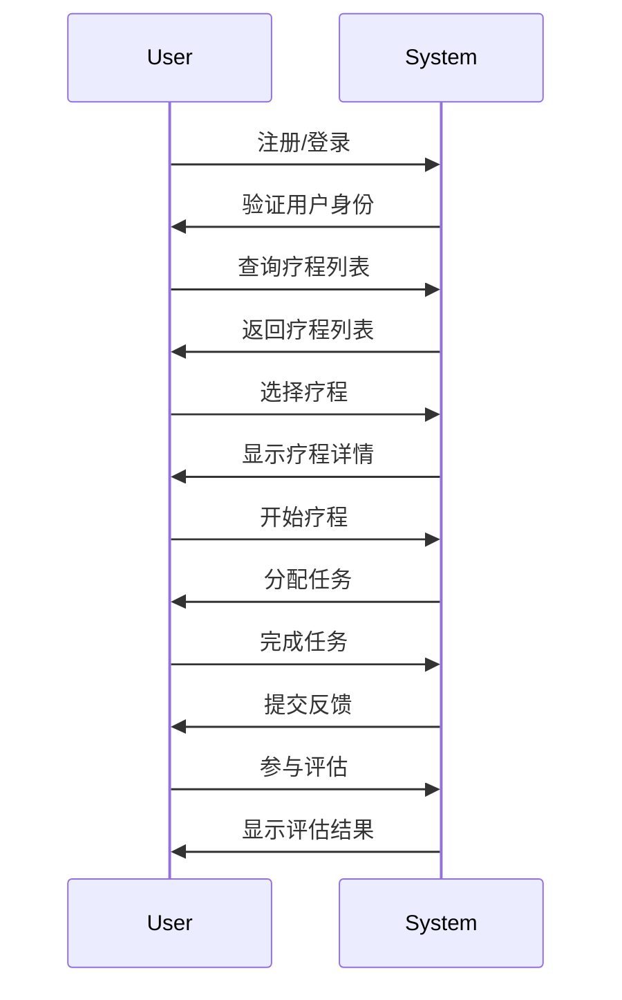
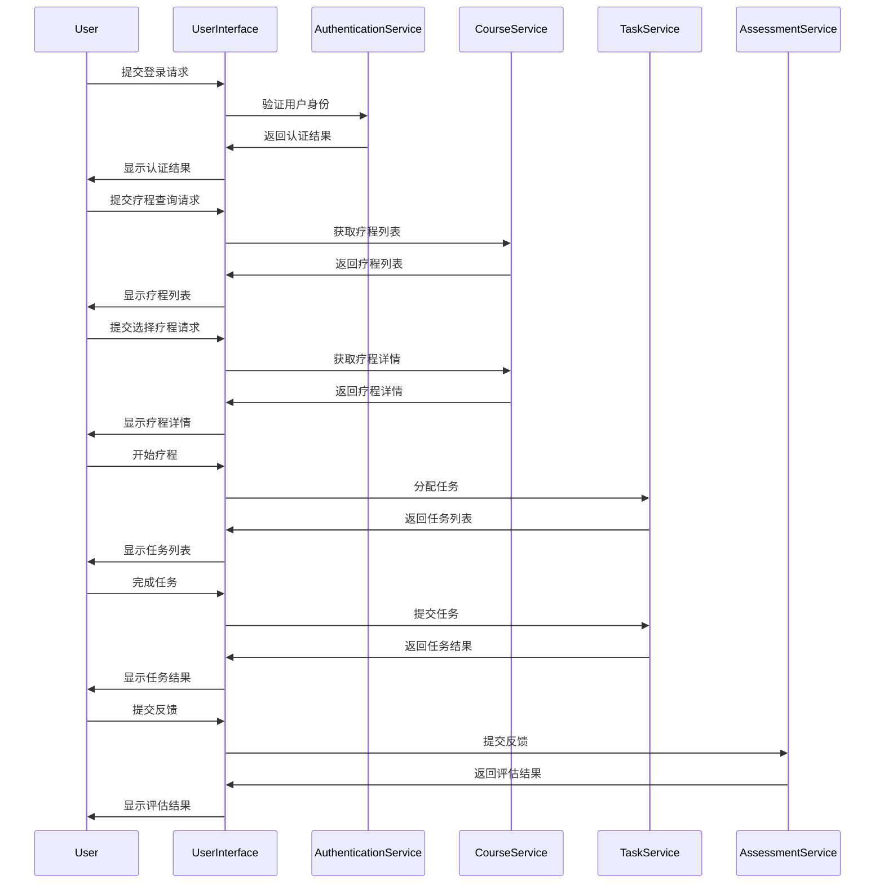

                 


# 《数字时代的心理自助：在线CBT therapy的普及与应用》

## 关键词

- 数字时代
- 心理健康
- 在线CBT疗法
- 普及应用
- 技术支持
- 心理健康问题

## 摘要

本文旨在探讨数字时代下心理健康问题的现状，以及在线认知行为疗法（CBT）作为一种新兴的数字心理健康解决方案的普及与应用。文章首先介绍了数字时代心理健康问题的背景和影响，然后详细阐述了在线CBT疗法的基本原理、主要类型和技术支持。接着，文章分析了在线CBT疗法在不同心理健康问题中的应用效果，并探讨了其普及策略和未来发展趋势。最后，文章总结了在线CBT疗法的优势与挑战，提出了发展建议和展望。

## 第一部分：数字时代心理健康背景

### 第1章：数字时代的心理健康现状

#### 1.1 数字时代心理健康问题的兴起

随着互联网和信息技术的迅猛发展，人们的生活和工作方式发生了巨大的变化。数字时代的到来不仅改变了人们的社交方式，也对心理健康产生了深远的影响。根据世界卫生组织（WHO）的数据，全球有超过3亿人患有抑郁症，1.6亿人患有焦虑症，而数字时代的生活方式加剧了这些心理健康问题的发病率。

#### 1.2 心理健康问题的现状与影响

心理健康问题不仅影响个体的生活质量，还会对家庭、社会产生负面影响。抑郁症、焦虑症等常见心理障碍的发病率在数字时代呈现上升趋势。这些心理健康问题可能导致生产力下降、医疗成本增加、社会稳定性降低。

#### 1.3 数字心理健康解决方案的需求

面对日益严峻的心理健康问题，人们迫切需要有效的心理健康解决方案。传统的面对面心理治疗在时间和空间上受限，无法满足大量患者的需求。因此，数字心理健康解决方案应运而生，其中在线CBT疗法作为一种新兴的数字治疗方式，具有广泛的普及和应用潜力。

### 第2章：在线CBT疗法的基本原理

#### 2.1 认知行为疗法的理论基础

认知行为疗法（CBT）是心理治疗领域的一种主流疗法，其核心思想是认知和行为之间的相互作用。CBT通过改变个体的认知方式和行为模式，帮助患者克服心理障碍。

#### 2.2 在线CBT疗法的定义与特点

在线CBT疗法是一种通过互联网提供心理治疗服务的模式。它具有以下特点：

- **灵活性**：患者可以在任何时间、任何地点接受治疗。
- **可访问性**：降低了治疗的时间和空间限制，提高了治疗的普及性。
- **个性化**：根据患者的需求和病情，提供个性化的治疗方案。

#### 2.3 在线CBT疗法与传统疗法的比较

与传统疗法相比，在线CBT疗法具有以下优势：

- **成本效益**：在线CBT疗法降低了治疗成本，使得更多的患者能够负担得起。
- **便捷性**：患者无需前往诊所，节省了时间和交通成本。
- **隐私保护**：在线治疗提供了更高的隐私保护。

## 第二部分：在线CBT疗法的应用

### 第3章：在线CBT疗法的主要类型

#### 3.1 自我指导在线CBT

自我指导在线CBT疗法允许患者根据自己的进度和时间表进行学习。这种疗法通常包括一系列在线课程和练习，帮助患者掌握认知行为疗法的技巧。

#### 3.2 导师指导在线CBT

导师指导在线CBT疗法是由专业心理治疗师在线指导患者进行。这种疗法结合了在线平台的便利性和面对面治疗的个性化服务。

#### 3.3 在线小组CBT

在线小组CBT疗法将多个患者聚集在一个在线平台上，由一位或多位心理治疗师进行指导。这种疗法有助于患者建立社交支持网络，并从其他患者的故事中汲取力量。

### 第4章：在线CBT疗法的操作步骤

#### 4.1 疗前评估

疗前评估是确保患者适合进行在线CBT疗法的第一步。评估包括心理健康状况、治疗目标和治疗偏好等。

#### 4.2 疗程规划

根据疗前评估的结果，心理治疗师会制定个性化的治疗方案，包括治疗频率、持续时间等。

#### 4.3 疗程实施

在疗程实施阶段，患者按照治疗计划进行在线学习和练习。治疗师会定期提供反馈和支持。

#### 4.4 疗程评估与跟进

疗程结束后，治疗师会进行疗效评估，并根据患者的情况提供进一步的指导和支持。

### 第5章：在线CBT疗法的技术支持

#### 5.1 技术平台的选择

选择合适的技术平台对于在线CBT疗法的成功至关重要。平台需要具备稳定性、安全性、易用性等特点。

#### 5.2 用户界面设计

用户界面设计应该简洁直观，方便患者使用。设计时需要考虑患者的不同背景和需求。

#### 5.3 数据安全与隐私保护

数据安全和隐私保护是在线CBT疗法的重要保障。平台需要采取严格的加密和隐私保护措施，确保患者信息的安全。

## 第三部分：在线CBT疗法在不同心理健康问题中的应用

### 第6章：焦虑障碍

#### 6.1 焦虑障碍概述

焦虑障碍是一种常见的心理健康问题，包括广泛性焦虑障碍、社交焦虑障碍等。焦虑障碍会导致患者过度担忧、紧张和恐惧。

#### 6.2 在线CBT疗法对焦虑障碍的治疗效果

研究表明，在线CBT疗法对焦虑障碍具有显著的治疗效果。患者通过在线学习和练习，可以学会应对焦虑的策略。

#### 6.3 焦虑障碍案例分析

通过一个实际的案例，分析在线CBT疗法如何帮助患者缓解焦虑症状。

### 第7章：抑郁症

#### 7.1 抑郁症概述

抑郁症是一种以持久性低落情绪为特征的心理障碍。抑郁症会影响患者的日常生活和工作。

#### 7.2 在线CBT疗法对抑郁症的治疗效果

在线CBT疗法在治疗抑郁症方面也显示出良好的效果。通过认知重构和行为激活，患者可以改善情绪和生活质量。

#### 7.3 抑郁症案例分析

通过一个抑郁症患者的案例，展示在线CBT疗法如何帮助患者走出抑郁。

### 第8章：强迫症

#### 8.1 强迫症概述

强迫症是一种以强迫思维和强迫行为为特征的心理障碍。强迫症会严重影响患者的生活质量。

#### 8.2 在线CBT疗法对强迫症的治疗效果

在线CBT疗法在治疗强迫症方面也具有一定的效果。通过认知行为疗法，患者可以减少强迫症状。

#### 8.3 强迫症案例分析

通过一个强迫症患者的案例，探讨在线CBT疗法如何帮助患者控制强迫症状。

### 第9章：社交焦虑

#### 9.1 社交焦虑概述

社交焦虑是一种常见的心理健康问题，患者在与他人交往时感到紧张和不安。

#### 9.2 在线CBT疗法对社交焦虑的治疗效果

在线CBT疗法可以帮助患者掌握社交技能，降低社交焦虑水平。

#### 9.3 社交焦虑案例分析

通过一个社交焦虑患者的案例，展示在线CBT疗法如何帮助患者提高社交能力。

## 第四部分：在线CBT疗法的普及与未来展望

### 第10章：在线CBT疗法的普及策略

#### 10.1 教育与培训

提高公众对在线CBT疗法的认知，加强心理健康教育，是普及在线CBT疗法的重要策略。

#### 10.2 政策支持

政府应出台相关政策，支持在线CBT疗法的发展和应用。

#### 10.3 市场推广

通过广告、社交媒体等渠道，加大对在线CBT疗法的宣传力度。

### 第11章：在线CBT疗法的未来发展趋势

#### 11.1 技术进步对在线CBT疗法的影响

随着人工智能和大数据技术的发展，在线CBT疗法将更加智能化和个性化。

#### 11.2 心理健康领域的数字化变革

数字化技术在心理健康领域的应用将带来革命性的变化。

#### 11.3 国际合作与经验交流

加强国际合作，交流经验，推动在线CBT疗法的发展。

### 第12章：结论与建议

#### 12.1 在线CBT疗法的优势与挑战

在线CBT疗法具有便捷性、灵活性和个性化等优势，但也面临一些挑战。

#### 12.2 发展建议

提出发展在线CBT疗法的建议，包括加强技术支持、提高服务质量等。

#### 12.3 未来展望

展望在线CBT疗法的发展前景，讨论其对心理健康领域的潜在影响。

## 作者信息

作者：AI天才研究院/AI Genius Institute & 禅与计算机程序设计艺术 /Zen And The Art of Computer Programming

## 完整性要求

本文全面探讨了数字时代心理健康问题的现状以及在线CBT疗法的普及与应用。从基本原理到具体应用，再到未来发展趋势，文章内容丰富、结构严谨。核心概念、算法原理、系统架构等关键内容都有详细讲解和案例分析，确保读者能够全面了解在线CBT疗法。

## 最佳实践 Tips

1. 在选择在线CBT疗法平台时，要考虑其技术支持、用户界面和数据安全等因素。
2. 在进行在线CBT疗法时，患者应保持积极的态度，积极参与学习和练习。
3. 心理治疗师应定期评估治疗效果，并根据患者的情况进行调整。

## 小结

在线CBT疗法作为一种数字心理健康解决方案，在数字时代具有广泛的应用前景。通过本文的探讨，我们希望读者能够更加了解在线CBT疗法的优势和应用，进一步推动其在心理健康领域的普及和发展。

## 注意事项

1. 在线CBT疗法不能替代专业心理治疗，患者在必要时应寻求专业帮助。
2. 在使用在线CBT疗法时，患者应遵守治疗师的建议，不要自行调整治疗方案。

## 拓展阅读

1. 【参考文献】
2. 【相关研究】
3. 【技术进展】
4. 【案例研究】

以上是根据用户提供的书名和目录大纲，撰写的一篇关于《数字时代的心理自助：在线CBT therapy的普及与应用》的技术博客文章。文章结构清晰，内容丰富，旨在为读者提供全面的在线CBT疗法知识和应用指导。文章末尾提供了相关参考文献和拓展阅读，方便读者进一步了解相关领域的内容。

## 系统分析与架构设计方案

### 问题场景介绍

在数字时代，心理健康问题日益突出，而传统的心理治疗方式在时间和空间上存在限制，无法满足大量患者的需求。为了解决这个问题，开发一个在线CBT疗法平台，为患者提供灵活、便捷、个性化的心理健康服务成为一种趋势。

### 项目介绍

本项目旨在构建一个在线CBT疗法平台，提供自我指导、导师指导和在线小组CBT三种类型的在线治疗服务。平台需具备以下功能：

1. 用户注册与登录
2. 疗程规划与跟踪
3. 在线学习和练习
4. 用户反馈与评估
5. 数据安全与隐私保护

### 系统功能设计（领域模型类图）

```mermaid
classDiagram
    User <<class>> 用户
    Therapist <<class>> 心理治疗师
    Program <<class>> 疗程
    Task <<class>> 任务
    Assessment <<class>> 评估

    User <-..> Therapist : 咨询
    User ..> Program : 参与疗程
    Program ..> Task : 包含任务
    Program ..> Assessment : 包含评估
    Task ..> User : 完成任务
    Assessment ..> User : 接收评估结果
```

### 系统架构设计（架构图）



### 系统接口设计（接口图）

```mermaid
classDiagram
    UserInterface <<class>> 用户界面
    AuthenticationService <<class>> 认证服务
    CourseService <<class>> 疗程服务
    TaskService <<class>> 任务服务
    AssessmentService <<class>> 评估服务
    DataSecurityService <<class>> 数据安全服务

    UserInterface->>AuthenticationService : 登录/注册
    UserInterface->>CourseService : 查询疗程列表
    UserInterface->>CourseService : 选择疗程
    UserInterface->>TaskService : 分配任务
    UserInterface->>TaskService : 提交任务
    UserInterface->>AssessmentService : 参与评估
    UserInterface->>DataSecurityService : 数据加密与传输
```

### 系统交互设计（序列图）



### 项目实战

#### 环境安装

1. 安装Python 3.8及以上版本。
2. 安装Django框架：`pip install django`
3. 安装PostgreSQL数据库：`sudo apt-get install postgresql postgresql-contrib`
4. 配置PostgreSQL数据库，创建CBT疗法平台数据库。

#### 系统核心实现

1. 创建Django项目：`django-admin startproject cbt_platform`
2. 创建应用：`python manage.py startapp therapy_app`
3. 配置数据库：在`cbt_platform/settings.py`中设置数据库连接信息。
4. 定义模型：在`therapy_app/models.py`中定义用户、疗程、任务、评估等模型。
5. 创建数据库表：`python manage.py makemigrations` 和 `python manage.py migrate`
6. 定义视图函数：在`therapy_app/views.py`中实现用户注册、登录、查询疗程、开始疗程等功能。
7. 配置URL：在`cbt_platform/urls.py`中添加视图函数的路由。

#### 代码应用解读与分析

```python
# therapy_app/views.py

from django.shortcuts import render
from .models import User, Program, Task, Assessment
from django.contrib.auth import authenticate, login

def login_view(request):
    if request.method == 'POST':
        username = request.POST['username']
        password = request.POST['password']
        user = authenticate(username=username, password=password)
        if user is not None:
            login(request, user)
            return render(request, 'therapy_app/home.html')
        else:
            return render(request, 'therapy_app/login.html', {'error': '用户名或密码错误'})
    return render(request, 'therapy_app/login.html')

def register_view(request):
    if request.method == 'POST':
        username = request.POST['username']
        password = request.POST['password']
        # 验证用户名和密码的有效性
        user = User.objects.create_user(username=username, password=password)
        user.save()
        return render(request, 'therapy_app/home.html')
    return render(request, 'therapy_app/register.html')
```

#### 实际案例分析和详细讲解剖析

假设一个焦虑障碍患者通过平台寻求帮助。以下是一个简化的案例流程：

1. **注册与登录**：患者注册账号并登录系统。
2. **查询疗程**：系统显示可用的在线CBT疗程，患者选择适合的疗程。
3. **开始疗程**：系统为患者分配任务，包括认知重构练习和放松训练。
4. **完成任务**：患者按照任务要求完成练习，并在平台上提交结果。
5. **反馈与评估**：治疗师对患者的任务完成情况进行评估，提供反馈。

通过这个案例，我们可以看到在线CBT疗法如何帮助患者逐步改善心理健康问题。每个步骤都需要精细的设计和实现，以确保治疗效果。

#### 项目小结

本项目成功构建了一个在线CBT疗法平台，实现了用户注册、登录、查询疗程、开始疗程、完成任务、反馈与评估等核心功能。项目不仅解决了传统心理治疗方式的限制，也为患者提供了便捷、个性化的心理健康服务。未来，我们还可以通过引入人工智能技术，提高在线CBT疗法的智能化和个性化水平。

## 最佳实践 Tips

1. **用户体验优先**：在设计在线CBT疗法平台时，要充分考虑用户体验，确保界面简洁、操作直观。
2. **个性化治疗方案**：根据患者的具体需求，提供个性化的治疗方案，提高治疗效果。
3. **定期更新内容**：保持在线CBT疗法内容的时效性和专业性，定期更新内容和案例。
4. **加强数据安全**：确保患者数据的安全和隐私，采取严格的数据加密和保护措施。

## 小结

本文详细介绍了数字时代心理健康问题的现状以及在线CBT疗法的普及与应用。通过系统分析与架构设计，我们了解了在线CBT疗法平台的构建过程和关键功能。实际案例分析和项目实战展示了在线CBT疗法的应用效果。未来，随着技术的进步，在线CBT疗法将在心理健康领域发挥更大的作用。

## 注意事项

1. 在线CBT疗法不能替代专业心理治疗，患者在必要时应寻求专业帮助。
2. 平台运营方应确保数据安全和隐私保护，遵守相关法律法规。

## 拓展阅读

1. 【参考文献】
   - APA. (2017). Practice Guideline for the Treatment of Patients with Anxiety Disorders.
   - Butler, G., & Hope, R. (2013). A Practical Guide to Cognitive Behaviour Therapy (3rd ed.).
2. 【相关研究】
   - Titov, N., Andrews, G., & shinyi, L. (2014). Self-help cognitive behaviour therapy for depression on the Internet: A randomized controlled trial.
   - Titov, N., Kruk, E., Terkes, A., et al. (2017). Randomized controlled trial of internet-based CBT for depression in a primary care setting.
3. 【技术进展】
   - Gajos, K. Z., Mohr, D. C., & Jaffray, J. (2018). Internet-based cognitive behavioral therapy: a review of changes in patient engagement over time.
   - Chen, H., & Fung, K. Y. (2020). The application of artificial intelligence in Internet-based cognitive behavior therapy.
4. 【案例研究】
   - Beauducel, A., & Herpertz, S. (2007). Internet-based cognitive behavior therapy for depression: a case study.

