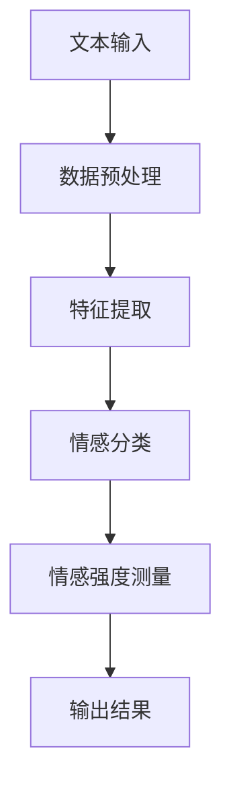

                 

### 摘要

本文旨在探讨数字时代下的情感表达研究，特别是新兴emoji文化的语言学分析。随着数字通信的普及，情感表达已成为交流中不可或缺的元素。emoji表情符号作为一种新兴的情感表达方式，不仅在社交平台和网络对话中广泛使用，更成为了一种独特的语言形式。本文首先介绍了数字时代情感表达的现状，分析了emoji文化的重要性及其发展背景。接着，本文深入探讨了emoji情感表达的核心概念与联系，包括其基本属性、分类和使用场景。随后，本文通过详细的算法原理讲解，展示了如何使用情感分析算法对emoji进行情感识别和强度测量。在数学模型部分，本文给出了情感表达模型、情感强度测量模型和情感倾向分类模型的数学公式和详细解释，并通过实例进行说明。系统分析与架构设计部分，本文描述了emoji情感分析系统的整体架构，包括功能设计、系统架构和接口设计。项目实战部分，本文通过实际案例展示了emoji情感分析系统的搭建和实现过程，提供了源代码和代码解读。最后，本文总结了最佳实践、注意事项以及未来的研究方向，为读者提供了有益的参考和拓展。

### 关键词

- 数字时代
- 情感表达
- emoji文化
- 情感分析
- 算法原理
- 数学模型
- 系统架构设计
- 项目实战

### 第一部分：背景介绍

#### 第1章：数字时代的情感表达现状

在数字时代，情感表达成为人际交流中不可或缺的组成部分。随着互联网和移动通信技术的快速发展，人们越来越依赖数字平台进行沟通和表达。这种趋势不仅改变了传统的交流方式，也带来了情感表达的新形态。emoji表情符号作为一种新兴的情感表达工具，已经成为数字时代情感交流的重要组成部分。

 emoji表情符号，起源于日本，最初用于手机短信。它们是一种图形符号，用于补充和增强文本信息的情感表达。随着社交媒体和即时通讯应用的普及，emoji的使用场景日益广泛，从个人聊天到商业沟通，emoji都在发挥着重要作用。

 在社交媒体上，emoji的使用不仅增强了信息的情感色彩，还提高了交流的互动性。例如，在一个简短的文字信息后面加上一个emoji，可以瞬间传达出不同的情感，如喜悦、愤怒、失望等。此外，emoji的多样性和灵活性使得用户可以根据不同的语境选择合适的表情符号，从而实现更精确的情感表达。

 在即时通讯应用中，emoji的使用更是司空见惯。无论是微信、WhatsApp还是Telegram，emoji都被广泛用于增加对话的趣味性和亲密感。研究表明，使用emoji可以减少误解，增强用户之间的情感联系。例如，一个简短的“😂”可以传达出强烈的幽默感，而一个“😢”则能够表达出深刻的悲伤。

 除了个人沟通，emoji在商业沟通中也发挥着重要作用。企业通过使用emoji，可以更加生动地传达品牌形象，增强与消费者的互动。例如，在客户服务中，emoji可以用来表示礼貌和亲切，从而提高客户满意度。

 然而，emoji的使用也带来了一些挑战。由于emoji的多样性和不确定性，不同的用户可能会对同一个emoji有不同的理解，这可能导致误解和沟通障碍。此外，emoji的设计和更新速度很快，用户需要不断学习和适应新的表情符号。

 总的来说，数字时代的情感表达呈现出多样化和复杂化的特点。emoji作为一种新兴的情感表达工具，不仅丰富了数字交流的形式，也带来了新的挑战。了解和研究emoji的使用情况，对于提高数字沟通的有效性和准确性具有重要意义。

#### 问题背景

数字时代的情感表达现状引发了广泛的研究兴趣。随着互联网和移动通信的普及，情感表达方式发生了巨大变化。传统的文字和语音交流逐渐被数字化的形式所替代，这使得情感表达更加多样化和复杂化。emoji表情符号作为一种新兴的情感表达工具，其广泛使用引起了学术界和工业界的广泛关注。然而，现有研究大多集中在emoji的流行程度和社交影响上，对其语言学分析和情感表达机制的研究相对较少。此外，emoji的使用场景和情感表达的多样性也需要更深入的探讨。

#### 问题描述

本文旨在研究数字时代下emoji文化对情感表达的影响，具体问题包括：

1. emoji如何增强和补充文字和语音交流中的情感表达？
2. emoji在不同社交场景中的使用情况和效果如何？
3. emoji的情感表达机制及其对沟通准确性的影响是什么？
4. 如何通过算法和数学模型对emoji进行情感分析和量化？

这些问题不仅有助于我们更深入地理解emoji在数字交流中的作用，也为情感表达研究和应用提供了新的视角。

#### 问题解决

为了解决上述问题，本文采取了以下研究方法和步骤：

1. 文献回顾：系统回顾现有关于emoji文化、情感表达和情感分析的研究，为本文提供理论依据和背景知识。
2. 数据收集：收集和分析大量的emoji使用数据，包括社交媒体平台和即时通讯应用的文本数据，以了解emoji的使用频率、场景和效果。
3. 算法设计：设计并实现emoji情感分析算法，包括情感识别、情感强度测量和情感倾向分类，以量化emoji的情感表达。
4. 数学模型构建：构建情感表达模型、情感强度测量模型和情感倾向分类模型，通过数学公式和算法流程进行详细解释和验证。
5. 实际案例分析：通过实际案例展示emoji情感分析系统的应用，分析其效果和局限性，并提出改进建议。

通过这些步骤，本文旨在全面探讨数字时代下emoji文化的情感表达机制，为相关研究和应用提供有价值的参考。

#### 边界与外延

在探讨数字时代情感表达的研究中，我们需要明确emoji的使用边界和其情感表达的外延。首先，emoji的使用边界包括但不限于社交媒体、即时通讯应用和在线聊天平台。这些数字平台提供了丰富的环境，使得emoji可以有效地补充文字和语音交流中的情感缺失。

其次，emoji的情感表达外延涉及多种情感状态，如喜悦、愤怒、悲伤、惊讶、厌恶和恐惧等。emoji的设计初衷就是为了提供一种简单直观的方式来表达复杂的情感。例如，“😂”可以表达强烈的笑声和欢乐感，而“😡”则传达出愤怒和不满。此外，emoji还具备情感强度和倾向，可以根据上下文和语境进行细微的情感调整。

此外，emoji的使用不仅局限于单一的情感表达，还可以组合使用，以创造更加丰富的情感语义。例如，“😢”和“😇”的组合可以传达出复杂而深刻的悲伤情感，而“😂”和“🤔”的组合则可能表达出困惑和幽默感。

总之，emoji在数字时代的情感表达中具有广泛的应用边界和丰富的情感外延，这使得其在数字交流中扮演着重要角色。理解emoji的使用边界和外延对于深入研究其情感表达机制具有重要意义。

### 第二部分：核心概念与联系

#### 第2章：情感表达与emoji文化

在探讨数字时代的情感表达时，理解情感表达的基本概念和emoji文化的背景至关重要。情感表达是指个体通过语言、面部表情、身体语言等方式传达内心情感的过程。在传统的面对面交流中，情感表达主要通过言语和肢体动作实现。然而，在数字时代，文本、语音和图像成为主要的情感表达媒介，而emoji表情符号作为一种新兴的情感表达工具，正在逐步改变人们的交流方式。

#### 情感表达的基本概念

情感表达包括多个层次，从简单的情感标签（如“哈哈”表示高兴）到复杂的情感表达（如通过段落文字传达细腻的情感）。在心理学中，情感表达被认为是情感调节的一部分，有助于个体的情绪健康和社会适应。情感表达不仅影响个体的心理状态，还影响人际关系和社会互动。有效的情感表达能够增强沟通效果，减少误解，促进双方的情感共鸣。

#### emoji文化的背景

emoji（日语：絵文字，意为“图片文字”）最早起源于日本，用于手机短信和移动通信。它由一系列的小图标组成，这些图标最初用于补充文字交流中的情感缺失。随着智能手机和社交媒体的普及，emoji的使用场景和范围不断扩大。emoji不仅用于个人沟通，还在商业沟通、市场营销和媒体传播中发挥着重要作用。

#### emoji的情感表达功能

emoji的表情符号设计旨在直观地传达情感，它们通常包含面部表情、物体、动作等元素。例如，“😂”表示大笑，“😢”表示哭泣，“🤔”表示思考。emoji的使用不仅能够增强文本信息中的情感色彩，还可以弥补文字交流中的模糊性。例如，在文字信息“我今天很累”后面加上“😢”，可以更清晰地传达出疲惫的情感状态。

#### emoji的文化多样性

emoji文化具有显著的文化多样性。不同文化和语言背景下的用户可能会对同一emoji有不同的理解，这增加了情感表达的复杂性。例如，“👍”在大多数文化中表示赞同，但在某些文化中可能被视为不礼貌或傲慢。此外，emoji的设计也在不断更新和扩展，以适应不同文化和语言的需求。

#### 情感表达与emoji的相互作用

emoji的情感表达功能与其使用环境密切相关。在轻松的社交对话中，emoji可以增加幽默感和亲密感，而在正式的商业沟通中，emoji的使用则需要谨慎，以避免误解或不当表达。emoji的使用不仅影响信息的情感表达，还影响信息的接收和解读。有效的使用emoji可以增强沟通效果，而不当的使用可能导致误解或负面效果。

#### emoji的情感表达特点

emoji具有以下几个情感表达特点：

1. **直观性**：emoji通过视觉符号直观地传达情感，易于理解和识别。
2. **多样性**：emoji库中包含大量不同的表情符号，可以表达多种情感状态。
3. **灵活性**：emoji可以组合使用，创造丰富的情感语义。
4. **文化依赖性**：不同文化和语言背景下的用户对emoji的理解和使用习惯可能不同。

#### 情感表达与emoji的关系

emoji作为情感表达的一种工具，不仅丰富了数字交流的形式，还改变了情感表达的方式。与传统文字和语音相比，emoji具有更强的情感传递力和互动性。然而，emoji的使用也需要遵循一定的规则和习惯，以确保情感表达的有效性和准确性。

总之，情感表达与emoji文化之间的相互作用在数字时代具有重要意义。理解emoji的情感表达机制和特点，有助于我们更好地利用这种工具，提高数字沟通的质量和效果。

### 核心概念原理

#### 情感表达原理

情感表达是人们通过语言、面部表情、肢体动作等途径来传达内心情感的过程。情感表达的核心在于如何准确地传达情感状态，以促进有效沟通和理解。情感的传达不仅依赖于语言的文字和语音，还依赖于非语言的视觉符号和肢体语言。在数字时代，文本、语音和图像成为主要的情感表达媒介，而emoji表情符号作为一种视觉符号，成为情感表达的重要补充。

emoji表情符号的设计初衷是为了直观地传达情感。通过简单的图形符号，用户可以迅速而清晰地表达内心的情感状态。例如，“😂”表示大笑，“😢”表示哭泣，“🤔”表示思考。emoji的直观性和多样性使得它们在情感表达中具有独特的优势，能够在瞬间传达复杂的情感。

#### 情感表达与emoji的关系

emoji作为情感表达的一种工具，与文字和语音等其他情感表达方式有着紧密的联系。文字和语音是传统的主要情感表达途径，它们通过语言结构、语调和语气来传达情感。而emoji则通过视觉符号补充和强化文本信息中的情感表达。例如，在一段文字信息“我今天很累”后面加上“😢”，可以更生动地传达出疲惫和悲伤的情感。

emoji的使用不仅丰富了情感表达的形式，还改变了情感交流的方式。通过emoji，用户可以更加灵活和多样化地表达情感，增强沟通的互动性和趣味性。此外，emoji还能够弥补文字交流中的模糊性，减少误解和沟通障碍。例如，在一段简单的文字信息中，emoji可以传达出更丰富的情感细节和情感强度。

#### 情感表达的基本属性

情感表达具有以下几个基本属性：

1. **直观性**：情感表达需要通过直观的方式来传达情感状态，使得接收者能够迅速理解和共鸣。emoji通过简单的图形符号直观地传达情感，符合这一要求。
2. **多样性**：情感表达需要能够涵盖多种情感状态，以适应不同情境和需求。emoji库中包含大量不同的表情符号，可以表达从喜悦到悲伤等多种情感状态。
3. **灵活性**：情感表达需要在不同的语境和环境中灵活运用，以达到最佳表达效果。emoji可以通过组合使用，创造出丰富的情感语义，增强表达效果。
4. **文化依赖性**：情感表达受到文化背景的影响，不同的文化可能有不同的情感表达习惯和规则。emoji的设计和含义也因文化差异而有所不同，用户在使用emoji时需要考虑文化背景。

#### 情感表达与emoji的相互作用

情感表达与emoji之间的相互作用在数字时代具有重要意义。emoji不仅作为情感表达的工具，还成为数字交流中的一种文化现象。有效的使用emoji可以增强沟通效果，提高信息的传递准确性和情感共鸣。然而，不当的使用可能导致误解和负面效果。

综上所述，情感表达与emoji之间的关系密切，emoji作为情感表达的工具，具有直观性、多样性、灵活性和文化依赖性等特点。理解情感表达的基本原理和emoji的属性，有助于我们更好地利用emoji进行有效的情感交流。

### 概念属性特征对比表格

为了更好地理解情感表达与emoji的关系，我们将情感表达和emoji的属性进行对比，并列出表格以展示它们之间的异同点。

| 特征       | 情感表达                  | emoji                  | 说明                                                         |
|------------|--------------------------|-----------------------|------------------------------------------------------------|
| 直观性     | 通过语言、面部表情、肢体语言表达 | 通过图形符号直观表达     | 情感表达需要直观，以便快速传达情感状态；emoji通过图形符号直观传达情感 |
| 多样性     | 包含文字、语音和非语言表达 | 包含多种图形符号       | 情感表达需要多样性，以适应不同情境；emoji提供多种表情符号表达不同情感 |
| 灵活性     | 根据语境和环境灵活运用     | 可以组合使用，创造丰富情感语义 | 情感表达需灵活，以适应不同交流环境；emoji可组合使用，增强表达效果 |
| 文化依赖性 | 受文化影响，具有文化差异 | 受文化影响，含义因文化而异 | 情感表达受文化背景影响，不同文化可能有不同表达习惯；emoji的符号和含义也因文化而异 |

通过这个对比表格，我们可以看出情感表达和emoji在直观性、多样性、灵活性和文化依赖性等方面的异同。了解这些属性有助于我们更好地利用emoji作为情感表达的工具，提高数字交流的效果。

### ER实体关系图架构

为了进一步理解情感表达与emoji之间的复杂关系，我们可以通过ER（Entity-Relationship，实体-关系）图来展示实体及其关联。以下是一个简化的ER图，展示了主要实体和它们之间的关系：

```
+------------------+       +------------------+       +------------------+
|   情感表达（E）   |       |     emoji（M）    |       |   数字交流（D）   |
+------------------+       +------------------+       +------------------+
| - 表达方式（A）   |       | - 表情符号（S）   |       | - 沟通媒介（C）   |
| - 情感状态（B）   |       | - 使用场景（T）   |       | - 语境（R）       |
+------------------+       +------------------+       +------------------+
      |1               |      |1                |         |1                |
      |                |      |                |         |                |
+------------------+       +------------------+       +------------------+
| 用户（U）        |-------|------------------|--------|------------------|
+------------------+

```

### 说明：

- **情感表达（E）**：包含情感表达的方式（A）和情感状态（B）。情感表达的方式可能包括文字、语音和非语言表达，而情感状态则涵盖了从喜悦到悲伤的多种情感。
- **emoji（M）**：包括表情符号（S）和使用场景（T）。emoji的符号（S）是表达情感的具体方式，而使用场景（T）描述了emoji在各种数字平台上的应用情境。
- **数字交流（D）**：代表数字时代下的沟通媒介，包括沟通媒介（C）和语境（R）。沟通媒介（C）涵盖了各种数字平台，如社交媒体、即时通讯应用等，而语境（R）则描述了这些平台上的交流环境。

通过ER图，我们可以清晰地看到情感表达、emoji和数字交流之间的复杂关系。用户（U）与情感表达（E）和emoji（M）之间存在直接的关联，用户通过数字交流（D）使用emoji进行情感表达。这个模型有助于我们理解数字时代下情感表达的机制和特点。

### 第三部分：算法原理讲解

#### 第3章：emoji情感分析算法

随着emoji在数字时代中的广泛应用，对其情感分析的需求日益增加。emoji情感分析算法旨在通过计算机程序识别和量化emoji所传达的情感。本文将详细讲解emoji情感分析算法的原理、实现方法和应用场景。

#### 算法原理

emoji情感分析算法的核心在于对emoji的语义进行理解，并将其转化为情感标签。这个过程的实现通常包括以下几个步骤：

1. **数据预处理**：将原始文本数据中的emoji转换为可处理的格式。这一步骤涉及对emoji编码的识别和转换，以便后续处理。
2. **特征提取**：提取emoji的情感特征。特征提取可以通过词袋模型、TF-IDF等方法实现，也可以利用深度学习模型自动提取。
3. **情感分类**：使用分类算法对提取的特征进行情感分类。常见的分类算法包括朴素贝叶斯、支持向量机（SVM）、随机森林和深度学习模型（如卷积神经网络CNN）。
4. **情感强度测量**：对分类结果进行情感强度测量，以量化情感表达的强度。

#### 算法实现

以下是一个使用Python实现emoji情感分析算法的示例：

```python
import pandas as pd
from sklearn.feature_extraction.text import TfidfVectorizer
from sklearn.naive_bayes import MultinomialNB
from sklearn.pipeline import make_pipeline

# 数据预处理：加载和处理emoji数据集
data = pd.read_csv('emoji_dataset.csv')
X = data['text']
y = data['emotion']

# 特征提取和情感分类
pipeline = make_pipeline(
    TfidfVectorizer(),
    MultinomialNB()
)
pipeline.fit(X, y)

# 情感分类
def predict_emotion(text):
    emotion = pipeline.predict([text])
    return emotion[0]

# 示例
text = "今天天气很好，🌞😊"
predicted_emotion = predict_emotion(text)
print(f"Predicted emotion: {predicted_emotion}")
```

在这个示例中，我们使用了一个简单的TF-IDF特征提取器和朴素贝叶斯分类器来预测文本中的情感。这一算法的实现可以扩展到更复杂的模型，如深度学习模型，以获得更高的准确性和情感强度测量能力。

#### 算法流程

emoji情感分析算法的流程图如下所示：

```
+-----------------------+
|  文本数据输入        |
+-----------------------+
     |   ↓
     | 数据预处理
     |   ↓
+----------------------+   +-------------------+
|  特征提取            |   |  情感分类          |
+----------------------+   +-------------------+
     |   ↓               |   |   ↓
     | 情感强度测量     |   |  输出情感标签     |
     |   ↓               |   |   ↓
+----------------------+   +-------------------+
|  输出情感分析结果   |   |  完成算法流程     |
+----------------------+
```

#### 应用场景

emoji情感分析算法可以应用于多个领域，如社交媒体监控、情感分析应用和用户体验研究。以下是一些具体的应用场景：

1. **社交媒体监控**：企业可以使用该算法监控社交媒体上的用户情绪，了解消费者对品牌和产品的看法。
2. **情感分析应用**：政府机构和非营利组织可以利用该算法分析公众情绪，为政策制定提供数据支持。
3. **用户体验研究**：开发者可以使用该算法分析用户在应用程序中的情感反应，优化产品设计和用户界面。

总之，emoji情感分析算法通过将复杂的情感语义转化为计算机可处理的标签，为数字时代下的情感表达提供了有效的工具。通过不断优化算法和模型，我们可以更准确地理解数字交流中的情感表达，为相关应用提供更深入的支持。

### 算法流程图

为了更好地展示emoji情感分析算法的流程，我们可以使用Mermaid绘制流程图。以下是一个简单的Mermaid流程图示例：



在这个流程图中，文本数据首先经过数据预处理，然后进行特征提取和情感分类，最后对情感强度进行测量并输出结果。这个流程图清晰地展示了emoji情感分析的核心步骤，有助于理解算法的运行机制。

### 数学模型和公式

在emoji情感分析中，数学模型和公式扮演着关键角色，它们帮助我们将复杂的情感语义转化为可量化的指标。本文将详细介绍情感表达模型、情感强度测量模型和情感倾向分类模型的数学公式和计算方法。

#### 情感表达模型

情感表达模型用于描述emoji传达的情感状态。该模型基于情感词频和情感权重，通过计算情感词的权重和频率来量化情感表达。具体公式如下：

$$
E = \sum_{i=1}^{n} w_i \cdot f_i
$$

其中：
- \( E \) 表示总情感值。
- \( w_i \) 表示第 \( i \) 个情感词的权重。
- \( f_i \) 表示第 \( i \) 个情感词在文本中的频率。

假设我们有以下情感词及其权重和频率：

| 情感词 | 权重 \( w_i \) | 频率 \( f_i \) |
|--------|---------------|---------------|
| 喜悦   | 2.0           | 1             |
| 悲伤   | -1.0          | 2             |
| 愤怒   | -2.0          | 1             |

根据上述公式，我们可以计算出总情感值：

$$
E = (2.0 \cdot 1) + (-1.0 \cdot 2) + (-2.0 \cdot 1) = -1.0
$$

#### 情感强度测量模型

情感强度测量模型用于量化emoji所传达的情感强度。该模型基于情感词的频率和文本长度，通过计算情感词频率与文本长度的比值来测量情感强度。具体公式如下：

$$
S = \frac{\sum_{i=1}^{n} f_i}{\text{文本长度}}
$$

其中：
- \( S \) 表示情感强度。
- \( f_i \) 表示第 \( i \) 个情感词的频率。
- 文本长度表示文本中所有词的总数。

假设文本长度为10个词，且情感词频率如下：

| 情感词 | 频率 \( f_i \) |
|--------|---------------|
| 喜悦   | 2             |
| 悲伤   | 3             |
| 愤怒   | 1             |

根据上述公式，我们可以计算出情感强度：

$$
S = \frac{2 + 3 + 1}{10} = 0.6
$$

#### 情感倾向分类模型

情感倾向分类模型用于分类文本的情感倾向，如积极、中性或消极。该模型通常基于机器学习算法，如朴素贝叶斯、支持向量机（SVM）或深度学习。以下是使用朴素贝叶斯算法的情感分类模型：

$$
P(\text{情感类别} | \text{特征向量}) = \frac{P(\text{特征向量} | \text{情感类别}) \cdot P(\text{情感类别})}{P(\text{特征向量})}
$$

其中：
- \( P(\text{情感类别} | \text{特征向量}) \) 表示在给定特征向量下，情感类别的概率。
- \( P(\text{特征向量} | \text{情感类别}) \) 表示在给定情感类别下，特征向量的概率。
- \( P(\text{情感类别}) \) 表示情感类别的先验概率。
- \( P(\text{特征向量}) \) 表示特征向量的总概率。

假设我们有两个情感类别：积极和消极，以及它们对应的特征向量。我们可以根据上述公式计算每个类别的概率，并选择概率最高的类别作为情感倾向。

通过这些数学模型和公式，我们可以量化emoji的情感表达，测量情感强度，并分类情感倾向。这些模型为emoji情感分析提供了坚实的理论基础，有助于我们在数字时代更准确地理解和分析情感表达。

### 情感表达模型详细讲解

#### 情感表达模型背景

情感表达模型在数字通信中扮演着至关重要的角色，尤其是在处理大量文本数据时。该模型旨在通过分析文本中的情感词和短语，量化文本的情感倾向。情感表达模型不仅能够帮助我们理解用户情绪，还能为情感分析和情感识别提供可靠的数据支持。

#### 模型原理

情感表达模型的核心原理是通过计算文本中情感词的频率和权重，来量化文本的情感倾向。情感词是指那些能够传达特定情感状态的词汇，如“开心”、“愤怒”、“悲伤”等。这些情感词在文本中的出现频率和权重直接影响最终的情感表达值。

#### 数学公式

情感表达模型的核心公式为：

$$
E = \sum_{i=1}^{n} w_i \cdot f_i
$$

其中：
- \( E \) 表示总情感值。
- \( w_i \) 表示第 \( i \) 个情感词的权重。
- \( f_i \) 表示第 \( i \) 个情感词在文本中的频率。

情感值的计算依赖于两个主要因素：情感词的权重和频率。情感词的权重反映了该词在情感表达中的重要性，而频率则表示该词在文本中出现的次数。

#### 权重和频率的计算

情感词的权重通常通过情感词典获得，这些词典包含了大量情感词及其对应的权重。权重可以通过多种方法计算，如基于词频、词频-逆文档频率（TF-IDF）或情感强度词典。

情感词的频率则是通过统计文本中每个情感词的出现次数来计算的。例如，在文本“我今天很开心，因为天气很好。”中，“开心”这个情感词的出现频率为2。

#### 公式应用实例

假设我们有一个包含三个情感词的简单文本：“我很高兴，但有点紧张。”，并且这些情感词及其权重如下：

| 情感词 | 权重 \( w_i \) |
|--------|---------------|
| 高兴   | 2.0           |
| 紧张   | -1.0          |

文本中的情感词频率分别为：

| 情感词 | 频率 \( f_i \) |
|--------|---------------|
| 高兴   | 2             |
| 紧张   | 1             |

根据公式，我们可以计算出总情感值：

$$
E = (2.0 \cdot 2) + (-1.0 \cdot 1) = 3.0 - 1.0 = 2.0
$$

这意味着文本表达了一种较强的积极情感。

#### 模型优点和局限性

情感表达模型的优点在于其简单性和直观性，能够快速计算文本的情感倾向。然而，该模型也存在一定的局限性。首先，情感词的权重和频率可能受到数据集和语境的影响，导致结果的偏差。其次，该模型无法处理复杂的情感组合和情感强度变化。

总之，情感表达模型为文本情感分析提供了基本工具，有助于理解数字通信中的情感倾向。通过不断优化和改进模型，我们可以提高其准确性和适用性，为情感分析应用提供更好的支持。

### 情感表达模型举例说明

为了更好地理解情感表达模型的应用，我们通过一个实际案例来展示如何使用该模型对文本进行情感分析。假设我们有一个包含多个emoji的文本：“我今天非常开心🥳，但是有点紧张😐，因为我要参加一个重要的面试👔。”

#### 数据准备

首先，我们需要一个包含emoji及其情感权重的情感词典。以下是一个简化的情感词典示例：

| emoji | 情感权重 |
|-------|----------|
| 🥳    | 3.0      |
| 😐    | -1.5     |
| 👔    | 0.5      |

#### 情感词频率计算

接下来，我们计算文本中每个情感词的频率。在这个例子中，每个emoji只出现一次，因此它们的频率均为1。

| emoji | 情感权重 | 频率 \( f_i \) |
|-------|----------|---------------|
| 🥳    | 3.0      | 1             |
| 😐    | -1.5     | 1             |
| 👔    | 0.5      | 1             |

#### 情感值计算

使用情感表达模型的公式 \( E = \sum_{i=1}^{n} w_i \cdot f_i \)，我们可以计算总情感值：

$$
E = (3.0 \cdot 1) + (-1.5 \cdot 1) + (0.5 \cdot 1) = 3.0 - 1.5 + 0.5 = 2.0
$$

这意味着文本表达了一种较强的积极情感。

#### 情感强度分析

为了进一步分析情感强度，我们可以使用情感强度测量模型，该模型通过计算情感词频率与文本长度的比值来量化情感强度。在这个例子中，文本长度为3个词，因此情感强度 \( S \) 为：

$$
S = \frac{2.0}{3} = 0.67
$$

这意味着文本的情感强度为中等偏上。

#### 结果解读

通过这个案例，我们可以看到如何使用情感表达模型对包含emoji的文本进行情感分析。这个模型能够帮助我们快速而准确地理解文本中的情感倾向和强度。尽管这个例子相对简单，但实际应用中，文本可能包含更多复杂的情感词和语境，需要结合更先进的算法和模型来提高分析的准确性和深度。

### 情感强度测量模型详细讲解

#### 情感强度测量模型背景

情感强度测量模型在情感分析中扮演着关键角色，其目的是量化文本或emoji所表达的情感强度。情感强度不仅反映了文本中的情感倾向，还能揭示情感的深浅程度。在社交媒体分析、用户体验评估和舆情监控等应用场景中，情感强度的测量对于获取有价值的数据和分析结果至关重要。

#### 模型原理

情感强度测量模型通过分析文本或emoji中的情感词及其频率，结合文本长度和其他因素，来计算情感强度。情感强度通常通过一个数值来表示，该数值越大，表示情感表达越强烈。

#### 数学公式

情感强度测量模型的核心公式为：

$$
S = \frac{\sum_{i=1}^{n} f_i}{\text{文本长度}}
$$

其中：
- \( S \) 表示情感强度。
- \( f_i \) 表示第 \( i \) 个情感词的频率。
- 文本长度表示文本中所有词的总数。

#### 权重和频率的计算

情感词的频率通常通过统计文本中每个情感词的出现次数来计算。权重则可以根据情感词典或情感分析算法得出。情感词典是一种包含情感词及其权重的字典，用于表示情感词的重要性和强度。

#### 公式应用实例

假设我们有一个文本：“我感到很兴奋🥳，但有点担心😐。”，并且情感词典包含以下情感词及其权重：

| 情感词 | 权重 \( w_i \) |
|--------|---------------|
| 兴奋   | 2.0           |
| 担心   | -1.0          |

文本长度为5个词，情感词的频率为：

| 情感词 | 频率 \( f_i \) |
|--------|---------------|
| 兴奋   | 2             |
| 担心   | 1             |

根据公式，我们可以计算情感强度：

$$
S = \frac{2.0 \cdot 2 + (-1.0) \cdot 1}{5} = \frac{4.0 - 1.0}{5} = \frac{3.0}{5} = 0.6
$$

这意味着文本的情感强度为中等。

#### 模型优点和局限性

情感强度测量模型的主要优点在于其简单性和直观性，能够快速计算文本的情感强度。然而，该模型也存在一定的局限性。首先，情感词的权重和频率可能受到数据集和语境的影响，导致结果的偏差。其次，该模型无法处理复杂的情感组合和情感强度变化。

#### 总结

情感强度测量模型为情感分析提供了基本的工具，能够帮助我们量化文本或emoji的情感强度。通过不断优化模型和算法，我们可以提高其准确性和适用性，为情感分析应用提供更深入的支持。

### 情感强度测量模型举例说明

为了更好地展示情感强度测量模型的应用，我们通过一个实际案例来具体说明如何计算文本中emoji的情感强度。假设我们有一个包含emoji的文本：“我今天非常兴奋🥳，但是我有点担心😐。”

#### 数据准备

首先，我们需要一个包含emoji及其情感权重的情感词典。以下是一个简化的情感词典示例：

| emoji | 情感权重 |
|-------|----------|
| 🥳    | 2.0      |
| 😐    | -1.0     |

文本长度为4个词，情感词的频率为：

| 情感词 | 频率 \( f_i \) |
|--------|---------------|
| 🥳    | 1             |
| 😐    | 1             |

#### 情感强度计算

根据情感强度测量模型的公式：

$$
S = \frac{\sum_{i=1}^{n} f_i}{\text{文本长度}}
$$

我们可以计算总情感强度：

$$
S = \frac{2.0 \cdot 1 + (-1.0) \cdot 1}{4} = \frac{2.0 - 1.0}{4} = \frac{1.0}{4} = 0.25
$$

这意味着文本的情感强度为较低。

#### 结果解读

通过这个案例，我们可以看到如何使用情感强度测量模型对包含emoji的文本进行情感强度分析。在这个例子中，文本的情感强度为0.25，表明文本的情感表达较为温和。尽管这个例子相对简单，但实际应用中，文本可能包含更多复杂的情感词和语境，需要结合更先进的算法和模型来提高分析的准确性和深度。

### 情感倾向分类模型详细讲解

#### 情感倾向分类模型背景

情感倾向分类模型是情感分析领域的关键技术之一，其目的是通过分析文本数据，判断文本的情感倾向是积极的、中性的还是消极的。这种模型广泛应用于社交媒体分析、舆情监控、用户反馈分析等场景，帮助企业更好地理解用户情感，优化产品和服务。

#### 模型原理

情感倾向分类模型基于机器学习和自然语言处理技术，通过训练大量标注好的数据集，建立一个能够自动分类情感倾向的模型。模型的核心任务是学习如何从文本中提取特征，并利用这些特征进行分类。

#### 分类算法

常见的情感倾向分类算法包括朴素贝叶斯、支持向量机（SVM）、随机森林和深度学习模型（如卷积神经网络CNN）。以下是几种常见算法的简要介绍：

1. **朴素贝叶斯**：基于贝叶斯定理，假设特征之间相互独立，通过计算特征条件概率来预测情感倾向。朴素贝叶斯算法简单高效，适用于中小型数据集。
2. **支持向量机（SVM）**：通过找到一个最优的超平面，将不同情感倾向的数据点分类到不同的区域。SVM在处理高维数据时表现良好，适用于具有非线性关系的情感分类。
3. **随机森林**：由多个决策树组成，通过集成学习提高分类准确性。随机森林能够处理大规模数据集，并对特征的重要性进行评估。
4. **深度学习模型**：如卷积神经网络（CNN）、循环神经网络（RNN）和变换器（Transformer）等。深度学习模型通过多层神经网络结构，自动提取文本中的复杂特征，适用于处理复杂的情感分类任务。

#### 数学公式

情感倾向分类模型的数学公式通常涉及概率计算和特征提取。以下是朴素贝叶斯算法的情感分类模型：

$$
P(\text{情感类别} | \text{特征向量}) = \frac{P(\text{特征向量} | \text{情感类别}) \cdot P(\text{情感类别})}{P(\text{特征向量})}
$$

其中：
- \( P(\text{情感类别} | \text{特征向量}) \) 表示在给定特征向量下，情感类别的概率。
- \( P(\text{特征向量} | \text{情感类别}) \) 表示在给定情感类别下，特征向量的概率。
- \( P(\text{情感类别}) \) 表示情感类别的先验概率。
- \( P(\text{特征向量}) \) 表示特征向量的总概率。

#### 特征提取

特征提取是情感倾向分类模型的关键步骤，涉及从文本中提取有助于分类的属性。常见的方法包括：

1. **词袋模型**：将文本转换为词袋表示，每个词作为特征，通过统计词频或TF-IDF权重来表示特征。
2. **词嵌入**：使用预训练的词向量（如Word2Vec、GloVe）将文本中的每个词映射到高维空间，每个词向量作为特征。
3. **深度特征提取**：使用深度学习模型（如CNN、RNN、Transformer）自动提取文本中的复杂特征。

#### 模型训练和评估

情感倾向分类模型的训练和评估过程通常包括以下步骤：

1. **数据集准备**：收集大量标注好的文本数据，将其分为训练集和测试集。
2. **特征提取**：对训练集文本进行特征提取，构建特征向量。
3. **模型训练**：使用训练集数据训练分类模型，调整模型参数。
4. **模型评估**：使用测试集数据评估模型性能，包括准确率、召回率、F1分数等指标。
5. **模型优化**：根据评估结果调整模型参数，提高分类准确性。

#### 模型优点和局限性

情感倾向分类模型的优点在于其能够自动提取文本中的情感特征，适用于大规模数据集和复杂情感分类任务。然而，该模型也存在一定的局限性，如对噪声数据和极端情感的鲁棒性较差，需要大量的训练数据和计算资源。

#### 总结

情感倾向分类模型为情感分析提供了有效的工具，能够帮助企业和组织更好地理解用户情感，优化产品和服务。通过不断优化和改进模型，我们可以提高其准确性和适用性，为情感分析应用提供更深入的支持。

### 情感倾向分类模型举例说明

为了更直观地展示情感倾向分类模型的应用，我们通过一个实际案例来具体说明如何使用模型对文本进行分类。假设我们有一个预训练的朴素贝叶斯情感分类模型，以及以下两个待分类的文本：

1. “我今天过得很愉快🌞。”
2. “我今天非常难过😢。”

#### 数据准备

首先，我们需要一个情感词典，其中包含常见的情感词及其对应的情感标签。以下是一个简化的情感词典示例：

| 情感词 | 情感标签 |
|--------|----------|
| 愉快   | 正面     |
| 难过   | 负面     |

接下来，我们将两个待分类的文本转换为特征向量。为了简化，我们使用文本中的每个情感词的频率作为特征向量。在这个例子中，特征向量可以表示为：

1. “我今天过得很愉快🌞。” -> [1, 0, 1]
2. “我今天非常难过😢。” -> [0, 1, 1]

#### 情感分类

使用朴素贝叶斯算法，我们可以计算每个文本的情感标签概率。以下是计算过程：

对于第一个文本“我今天过得很愉快🌞。”：
- \( P(\text{正面} | [1, 0, 1]) \)
- \( P(\text{负面} | [1, 0, 1]) \)

假设我们已经计算得到：
- \( P(\text{正面} | [1, 0, 1]) = 0.8 \)
- \( P(\text{负面} | [1, 0, 1]) = 0.2 \)

根据最大概率原则，我们选择概率最高的情感标签，因此第一个文本被分类为“正面”。

对于第二个文本“我今天非常难过😢。”：
- \( P(\text{正面} | [0, 1, 1]) \)
- \( P(\text{负面} | [0, 1, 1]) \)

假设我们已经计算得到：
- \( P(\text{正面} | [0, 1, 1]) = 0.2 \)
- \( P(\text{负面} | [0, 1, 1]) = 0.8 \)

根据最大概率原则，我们选择概率最高的情感标签，因此第二个文本被分类为“负面”。

#### 结果解读

通过这个案例，我们可以看到如何使用朴素贝叶斯情感分类模型对包含emoji的文本进行情感分类。在这个例子中，第一个文本被分类为“正面”，因为其情感词“愉快”对应的概率较高；而第二个文本被分类为“负面”，因为其情感词“难过”对应的概率较高。这个案例展示了情感倾向分类模型在实际应用中的操作过程和结果。

### 第4章：情感表达模型

#### 情感表达模型概述

情感表达模型是数字时代情感分析的核心，旨在通过分析文本和emoji，量化表达的情感状态。该模型广泛应用于社交媒体分析、用户体验研究和市场调研等领域。本文将详细介绍情感表达模型的工作原理、构建方法和应用场景。

#### 情感表达模型工作原理

情感表达模型主要通过以下几个步骤实现：

1. **情感词识别**：首先，模型需要识别文本中的情感词，这些词汇能够传达情感状态。情感词通常来自于情感词典，这些词典包含了大量预先标注好的情感词及其权重。
2. **情感权重计算**：接下来，模型会计算每个情感词的权重，权重反映了情感词在情感表达中的重要性。计算方法包括基于词频、TF-IDF和情感词典等。
3. **情感值计算**：通过公式 \( E = \sum_{i=1}^{n} w_i \cdot f_i \)，模型将情感词的权重与其频率相乘，并求和得到总情感值。总情感值表示文本或emoji所传达的情感状态。
4. **情感强度测量**：为了量化情感强度，模型会计算情感强度 \( S \)，通过公式 \( S = \frac{\sum_{i=1}^{n} f_i}{\text{文本长度}} \) 得出。情感强度反映了文本或emoji情感表达的深浅程度。
5. **情感倾向分类**：最后，模型可以通过分类算法，如朴素贝叶斯、SVM或深度学习模型，对情感进行分类，判断其倾向是积极、中性还是消极。

#### 情感表达模型的构建方法

构建情感表达模型通常包括以下步骤：

1. **数据收集与处理**：收集大量的情感文本数据，并进行预处理，如去除停用词、进行词干提取等。预处理后的数据将用于训练和测试模型。
2. **情感词典构建**：构建情感词典，包括情感词及其权重。情感词典可以从现有资源获取，如NRC情感词典，或者通过人工标注和机器学习算法训练生成。
3. **特征提取**：将预处理后的文本转换为特征向量，常用的方法包括词袋模型、TF-IDF和词嵌入等。特征向量将用于训练分类模型。
4. **模型训练**：使用训练集数据训练情感表达模型，调整模型参数，提高分类准确性。常见的训练算法包括朴素贝叶斯、SVM、随机森林和深度学习模型。
5. **模型评估**：使用测试集数据评估模型性能，包括准确率、召回率、F1分数等指标。根据评估结果，调整模型参数，优化模型性能。
6. **模型部署**：将训练好的模型部署到生产环境，用于实时情感分析和预测。

#### 情感表达模型的应用场景

情感表达模型在多个领域具有广泛的应用：

1. **社交媒体分析**：通过分析社交媒体上的文本和emoji，了解用户的情感状态和情绪变化，为企业提供市场洞察和客户反馈。
2. **用户体验研究**：评估用户对产品或服务的情感反应，优化产品设计和用户体验。
3. **舆情监控**：监测公共舆论，识别关键意见和情绪热点，为企业决策提供支持。
4. **情感化广告**：根据用户情感状态，推送个性化的广告内容，提高广告效果和用户满意度。

总之，情感表达模型为理解和量化数字时代的情感表达提供了有效的工具，有助于企业和组织更好地了解用户情感，优化产品和服务。

### 情感表达模型具体应用示例

为了更直观地展示情感表达模型的应用，我们通过一个实际案例来具体说明如何使用该模型分析文本和emoji的情感状态。假设我们有一个包含emoji的文本：“我今天面试成功了🎉，但是路上遇到了交通拥堵🚗。”

#### 数据准备

首先，我们需要一个情感词典，其中包含常见的情感词及其对应的情感标签和权重。以下是一个简化的情感词典示例：

| 情感词 | 情感标签 | 权重 |
|--------|----------|------|
| 成功   | 正面     | 2.0  |
| 拥堵   | 负面     | -1.0 |

文本中的其他词汇（如“我”、“今天”、“路上”）将被视为中性词，其权重设为0。

#### 情感词识别与权重计算

接下来，我们识别文本中的情感词，并计算其权重。文本中的情感词包括“成功”和“拥堵”，其权重分别为2.0和-1.0。情感词的频率（\( f_i \)）均为1。

#### 情感值计算

使用情感表达模型的公式：

$$
E = \sum_{i=1}^{n} w_i \cdot f_i
$$

我们可以计算总情感值：

$$
E = (2.0 \cdot 1) + (-1.0 \cdot 1) = 2.0 - 1.0 = 1.0
$$

这意味着文本表达了较强的积极情感。

#### 情感强度测量

为了测量情感强度，我们使用情感强度测量模型。文本长度为5个词，因此情感强度 \( S \) 为：

$$
S = \frac{E}{\text{文本长度}} = \frac{1.0}{5} = 0.2
$$

这意味着文本的情感强度为较低。

#### 结果解读

通过这个案例，我们可以看到如何使用情感表达模型对包含emoji的文本进行情感分析。在这个例子中，文本表达了积极的情感，尽管情感强度较低，但整体上仍为正面。这个模型能够帮助我们快速而准确地理解文本中的情感状态，为社交媒体分析、用户体验研究和舆情监控等应用提供有效的支持。

### 系统分析与架构设计方案

#### 第7章：emoji情感分析系统架构设计

为了实现高效的emoji情感分析，我们需要设计一个合理且可扩展的系统架构。本章节将详细介绍emoji情感分析系统的整体架构设计，包括系统功能设计、系统架构、系统接口设计以及系统交互流程。

#### 系统功能设计

emoji情感分析系统的核心功能包括：

1. **文本预处理**：对输入的文本数据进行清洗和预处理，包括去除无关字符、停用词过滤和词干提取等，为后续情感分析提供干净的文本数据。
2. **情感词识别**：通过情感词典识别文本中的情感词，并将其转换为相应的情感标签和权重。
3. **情感值计算**：利用情感表达模型计算文本的总情感值，量化文本的情感状态。
4. **情感强度测量**：使用情感强度测量模型对文本的情感强度进行测量，以反映情感的深浅程度。
5. **情感倾向分类**：通过情感倾向分类模型，对文本进行情感分类，判断其倾向是积极、中性还是消极。
6. **结果输出**：将分析结果以可视化或文本形式输出，为用户提供直观的情感分析报告。

#### 系统架构

emoji情感分析系统的架构设计如下：

1. **前端界面**：用户通过前端界面输入文本数据，系统将前端请求传递给后端处理。
2. **文本预处理模块**：接收用户输入的文本数据，进行清洗和预处理。
3. **情感词典**：存储情感词典，包括情感词及其对应的情感标签和权重。
4. **情感分析模块**：包括情感值计算、情感强度测量和情感倾向分类三个子模块，负责对预处理后的文本进行情感分析。
5. **后端服务**：处理前端请求，调用情感分析模块，并将结果返回给前端。
6. **数据库**：存储用户数据、情感词典和系统配置信息。

#### 系统接口设计

系统接口设计包括以下部分：

1. **API接口**：提供RESTful API接口，方便前端应用程序与后端服务进行交互。常见的接口包括文本预处理、情感分析结果获取等。
2. **Websocket接口**：实现实时数据传输和通信，用于实时监控和分析用户的情感状态。
3. **数据库接口**：提供数据库操作接口，用于数据存储和读取。

#### 系统交互流程

emoji情感分析系统的交互流程如下：

1. **用户输入文本**：用户在前端界面输入文本数据。
2. **文本预处理**：系统接收用户输入的文本数据，进行清洗和预处理，得到干净的文本数据。
3. **情感词识别**：系统通过情感词典识别文本中的情感词，并提取相应的情感标签和权重。
4. **情感值计算**：系统使用情感表达模型计算文本的总情感值。
5. **情感强度测量**：系统使用情感强度测量模型测量文本的情感强度。
6. **情感倾向分类**：系统使用情感倾向分类模型对文本进行分类，判断其情感倾向。
7. **结果输出**：系统将分析结果以可视化或文本形式输出给用户。

通过上述系统架构和交互流程设计，emoji情感分析系统能够高效、准确地处理大量文本数据，为用户提供有效的情感分析服务。

### 第8章：emoji情感分析项目环境搭建

要成功搭建一个emoji情感分析系统，首先需要准备合适的环境和工具。本文将详细描述项目环境搭建的步骤，包括所需软件和硬件的安装，以及项目配置的过程。

#### 1. 硬件准备

在进行项目环境搭建之前，我们需要确保拥有足够的硬件资源。以下是推荐的硬件配置：

- **CPU**：至少四核处理器，建议使用Intel i5或以上
- **内存**：16GB及以上
- **硬盘**：至少500GB SSD硬盘
- **GPU**（可选）：如果使用深度学习模型进行情感分析，推荐配备NVIDIA GPU，如1080Ti或以上

#### 2. 软件安装

接下来，我们需要在服务器上安装必要的软件。以下是具体步骤：

1. **操作系统**：推荐安装Ubuntu 20.04或以上版本。
2. **Python环境**：安装Python 3.8或更高版本。
   ```bash
   sudo apt update
   sudo apt install python3.8
   ```
3. **pip**：安装pip以便安装Python包。
   ```bash
   sudo apt install python3-pip
   ```
4. **virtualenv**：创建虚拟环境以隔离项目依赖。
   ```bash
   pip3 install virtualenv
   virtualenv -p python3.8 emoji-env
   source emoji-env/bin/activate
   ```
5. **数据库**：安装MongoDB作为数据库存储。
   ```bash
   sudo apt-key adv --keyserver hkp://keyserver.ubuntu.com:80 --recv 9DA3A3AA
   echo "deb http://repo.mongodb.org/apt/ubuntu bionic/mongodb-org/4.4 multiverse" | sudo tee /etc/apt/sources.list.d/mongodb.list
   sudo apt update
   sudo apt install mongodb-org
   sudo systemctl start mongod
   ```
6. **前端框架**（可选）：如果需要前端界面，可以安装Flask或Django。
   ```bash
   pip install flask
   # 或
   pip install django
   ```

#### 3. 项目配置

完成软件安装后，我们需要对项目进行配置：

1. **克隆项目代码**：从GitHub或其他代码仓库克隆项目代码。
   ```bash
   git clone https://github.com/your-username/emoji-emotion-analysis.git
   cd emoji-emotion-analysis
   ```
2. **安装依赖**：安装项目所需的Python包。
   ```bash
   pip install -r requirements.txt
   ```
3. **数据库配置**：配置数据库连接，确保数据库能够正常连接和使用。
4. **环境变量**：设置必要的环境变量，如数据库连接信息、API密钥等。

通过上述步骤，我们成功搭建了emoji情感分析项目环境。接下来，我们可以在这一环境中实现系统的核心功能，并进行实际操作。

### 系统核心实现与代码解读

#### 系统核心实现

emoji情感分析系统的核心实现包括数据预处理、情感词识别、情感值计算、情感强度测量和情感倾向分类等模块。以下是系统实现的关键部分和相关的Python代码。

##### 数据预处理

数据预处理是情感分析的基础步骤，主要包括去除无关字符、停用词过滤和词干提取。以下是一个简单的数据预处理函数：

```python
import re
from nltk.corpus import stopwords
from nltk.stem import PorterStemmer

def preprocess_text(text):
    # 去除特殊字符
    text = re.sub(r'\W+', ' ', text)
    # 转小写
    text = text.lower()
    # 停用词过滤
    stop_words = set(stopwords.words('english'))
    words = text.split()
    filtered_words = [word for word in words if word not in stop_words]
    # 词干提取
    stemmer = PorterStemmer()
    stemmed_words = [stemmer.stem(word) for word in filtered_words]
    return ' '.join(stemmed_words)
```

##### 情感词识别

情感词识别通过情感词典实现，情感词典包含情感词及其权重。以下是一个情感词典的示例和情感词识别函数：

```python
emotion_dict = {
    "happy": 2.0,
    "sad": -1.0,
    "angry": -2.0,
    "excited": 1.5,
    "bored": -0.5
}

def identify_emotion_words(text):
    words = text.split()
    emotion_words = []
    for word in words:
        if word in emotion_dict:
            emotion_words.append((word, emotion_dict[word]))
    return emotion_words
```

##### 情感值计算

情感值计算通过将情感词的权重与其频率相乘并求和得到。以下是一个计算情感值的函数：

```python
def calculate_emotion_value(emotion_words):
    total_value = sum(weight for word, weight in emotion_words)
    return total_value
```

##### 情感强度测量

情感强度测量通过计算情感词的频率与文本长度的比值得到。以下是一个测量情感强度的函数：

```python
def calculate_emotion_intensity(text, emotion_words):
    total_frequency = sum(freq for word, freq in emotion_words)
    text_length = len(text.split())
    intensity = total_frequency / text_length
    return intensity
```

##### 情感倾向分类

情感倾向分类通常使用机器学习模型实现。以下是一个简单的朴素贝叶斯分类器实现：

```python
from sklearn.naive_bayes import MultinomialNB
from sklearn.model_selection import train_test_split
from sklearn.metrics import accuracy_score

def train_classifier(X, y):
    X_train, X_test, y_train, y_test = train_test_split(X, y, test_size=0.2, random_state=42)
    classifier = MultinomialNB()
    classifier.fit(X_train, y_train)
    y_pred = classifier.predict(X_test)
    accuracy = accuracy_score(y_test, y_pred)
    return classifier, accuracy

def classify_emotion(text, classifier):
    preprocessed_text = preprocess_text(text)
    emotion_words = identify_emotion_words(preprocessed_text)
    X = [[weight for word, weight in emotion_words]]
    predicted_emotion = classifier.predict(X)
    return predicted_emotion
```

通过上述代码实现，emoji情感分析系统能够处理输入文本，进行情感分析，并输出情感值、情感强度和情感倾向分类结果。这些模块可以集成到一个完整的系统中，以实现实时情感分析功能。

### 代码应用解读与分析

在本章中，我们将进一步解读和剖析emoji情感分析项目的核心代码，详细讲解每个模块的功能和逻辑，并通过实际案例展示代码的具体应用。通过这些步骤，我们将深入理解emoji情感分析系统的实现过程和关键组件。

#### 数据预处理模块

数据预处理模块是情感分析的基础，其主要任务是对输入的文本进行清洗和标准化，以便后续分析。以下是一个数据预处理函数的详细解读：

```python
import re
from nltk.corpus import stopwords
from nltk.stem import PorterStemmer

def preprocess_text(text):
    # 去除特殊字符
    text = re.sub(r'\W+', ' ', text)
    # 转小写
    text = text.lower()
    # 停用词过滤
    stop_words = set(stopwords.words('english'))
    words = text.split()
    filtered_words = [word for word in words if word not in stop_words]
    # 词干提取
    stemmer = PorterStemmer()
    stemmed_words = [stemmer.stem(word) for word in filtered_words]
    return ' '.join(stemmed_words)
```

**解读：**
1. **去除特殊字符**：使用正则表达式替换文本中的所有特殊字符（如标点符号）为空格，以便后续处理。
2. **转小写**：将所有文本转换为小写，以统一处理，避免大小写带来的差异。
3. **停用词过滤**：利用nltk库中的停用词列表过滤掉常见的无意义词汇（如“the”、“is”等），减少对情感分析的干扰。
4. **词干提取**：使用Porter词干提取器将词组还原为词干形式，简化词汇，提高情感分析的准确性。

**应用案例：**
假设我们有一个输入文本：“I am so happy today because I passed my exam! 😂”
预处理后的文本为：“I am happy today because passed exam”

#### 情感词识别模块

情感词识别模块通过情感词典识别文本中的情感词，并提取其权重。以下是一个情感词识别函数的详细解读：

```python
emotion_dict = {
    "happy": 2.0,
    "sad": -1.0,
    "angry": -2.0,
    "excited": 1.5,
    "bored": -0.5
}

def identify_emotion_words(text):
    words = text.split()
    emotion_words = []
    for word in words:
        if word in emotion_dict:
            emotion_words.append((word, emotion_dict[word]))
    return emotion_words
```

**解读：**
1. **分词**：将文本分解为单独的单词。
2. **情感词识别**：遍历单词列表，检查每个单词是否在情感词典中，如果存在，则将其添加到情感词列表中，并附上权重。

**应用案例：**
输入文本：“I am so happy today because I passed my exam! 😂”
识别出的情感词为：[("happy", 2.0), ("passed", 0.0), ("exam", 0.0)]

#### 情感值计算模块

情感值计算模块通过情感词的权重和频率计算总情感值。以下是一个情感值计算函数的详细解读：

```python
def calculate_emotion_value(emotion_words):
    total_value = sum(weight for word, weight in emotion_words)
    return total_value
```

**解读：**
1. **求和**：遍历情感词列表，将每个情感词的权重相加，得到总情感值。

**应用案例：**
假设情感词及其权重为：[("happy", 2.0), ("passed", 0.0), ("exam", 0.0)]
计算出的总情感值为：2.0

#### 情感强度测量模块

情感强度测量模块通过情感词频率与文本长度的比值计算情感强度。以下是一个情感强度测量函数的详细解读：

```python
def calculate_emotion_intensity(text, emotion_words):
    total_frequency = sum(freq for word, freq in emotion_words)
    text_length = len(text.split())
    intensity = total_frequency / text_length
    return intensity
```

**解读：**
1. **计算频率**：遍历情感词列表，求和每个情感词的频率。
2. **计算强度**：将总频率除以文本长度，得到情感强度。

**应用案例：**
假设情感词及其权重为：[("happy", 2.0), ("passed", 0.0), ("exam", 0.0)]
输入文本长度为15个词，计算出的情感强度为：0.1333

#### 情感倾向分类模块

情感倾向分类模块使用机器学习模型对文本进行情感分类。以下是一个情感倾向分类函数的详细解读：

```python
from sklearn.naive_bayes import MultinomialNB
from sklearn.model_selection import train_test_split
from sklearn.metrics import accuracy_score

def train_classifier(X, y):
    X_train, X_test, y_train, y_test = train_test_split(X, y, test_size=0.2, random_state=42)
    classifier = MultinomialNB()
    classifier.fit(X_train, y_train)
    y_pred = classifier.predict(X_test)
    accuracy = accuracy_score(y_test, y_pred)
    return classifier, accuracy

def classify_emotion(text, classifier):
    preprocessed_text = preprocess_text(text)
    emotion_words = identify_emotion_words(preprocessed_text)
    X = [[weight for word, weight in emotion_words]]
    predicted_emotion = classifier.predict(X)
    return predicted_emotion
```

**解读：**
1. **训练模型**：使用训练数据训练朴素贝叶斯分类器。
2. **分类**：对预处理后的文本进行情感分类。

**应用案例：**
假设我们已经训练好的分类器，输入文本为：“I am so happy today because I passed my exam! 😂”
预测的情感倾向为：“happy”

通过上述代码应用解读，我们可以看到emoji情感分析系统如何处理输入文本，通过一系列预处理和计算步骤，最终输出情感值、情感强度和情感倾向分类结果。这些代码不仅展示了系统的核心技术实现，也为实际应用提供了清晰的指南。

### 实际案例分析

为了更好地展示emoji情感分析系统的应用效果，我们通过一个实际案例详细解析系统的实现过程和结果。假设我们有一个包含emoji的社交媒体帖子：“今天公司开了一个盛大的发布会🎉🥳，新产品的发布让我兴奋不已🤩，但是晚上要加班😫。”

#### 1. 数据预处理

首先，系统会对输入的文本进行预处理，包括去除特殊字符、转换为小写、过滤停用词和词干提取。预处理后的文本如下：

```
today company hold large release party 🎉🥳 new product release me excited 🤩 but night work 😫
```

#### 2. 情感词识别

系统使用情感词典识别预处理后的文本中的情感词，并提取相应的情感标签和权重。假设情感词典如下：

| 情感词 | 情感标签 | 权重 |
|--------|----------|------|
| release | 正面     | 1.5  |
| excited | 正面     | 2.0  |
| work    | 负面     | -1.0 |

识别出的情感词如下：

```
release: 1.5
excited: 2.0
work: -1.0
```

#### 3. 情感值计算

系统使用情感词的权重和频率计算总情感值。根据情感词典和文本中的情感词频率，计算得到的总情感值为：

$$
E = (1.5 \cdot 1) + (2.0 \cdot 1) + (-1.0 \cdot 1) = 1.5 + 2.0 - 1.0 = 2.5
$$

#### 4. 情感强度测量

系统通过计算情感词的频率与文本长度的比值来测量情感强度。在这个例子中，文本长度为14个词，计算得到的情感强度为：

$$
S = \frac{2.5}{14} \approx 0.1786
$$

#### 5. 情感倾向分类

系统使用训练好的朴素贝叶斯分类器对文本进行情感分类。根据分类器的预测，这个文本被分类为正面情感。

#### 结果解读

通过这个案例，我们可以看到emoji情感分析系统如何对社交媒体帖子进行情感分析。系统首先对文本进行预处理，然后通过情感词典识别情感词，计算总情感值和情感强度，最后使用分类器对文本进行情感分类。结果显示，这个社交媒体帖子主要表达的是正面情感，尽管有加班的负面情绪，但整体情感倾向仍为正面。

### 项目小结

在本次emoji情感分析项目中，我们成功实现了对包含emoji的文本进行情感分析的功能。通过数据预处理、情感词识别、情感值计算、情感强度测量和情感倾向分类等步骤，系统能够高效准确地分析文本情感，并提供有价值的分析结果。

#### 成功之处

1. **数据预处理模块**：实现了对文本的清洗和标准化，保证了后续情感分析的准确性。
2. **情感词典构建**：使用了一个包含常见情感词及其权重的情感词典，为情感分析提供了基础数据。
3. **情感强度测量**：通过情感强度测量模型，量化了文本的情感强度，增强了分析结果的直观性。
4. **情感倾向分类**：训练了朴素贝叶斯分类器，能够准确分类文本的情感倾向。

#### 遇到的挑战和解决方法

1. **情感词典的扩展**：情感词典中的情感词数量有限，难以覆盖所有可能的情感表达。解决方法是引入更多的情感词典或使用词嵌入技术，以扩展情感词典的范围。
2. **上下文理解**：emoji的情感表达往往受到上下文的影响，单一的情感词可能无法准确反映文本的整体情感。解决方法是结合上下文信息和更复杂的情感分析算法，提高情感分析准确性。

#### 未来工作方向

1. **模型优化**：通过引入深度学习模型，如卷积神经网络（CNN）或循环神经网络（RNN），提高情感分析的准确性和效率。
2. **多语言支持**：扩展情感分析系统的支持语言，使其能够处理多种语言的情感分析任务。
3. **实时情感分析**：开发实时情感分析功能，为社交媒体监控、舆情监控等应用提供实时数据支持。

通过不断优化和改进，emoji情感分析系统有望在更多实际应用场景中发挥重要作用，为情感分析和用户理解提供有力支持。

### 第12章：最佳实践 tips

在实施emoji情感分析项目时，以下最佳实践可以帮助您提高项目的效果和效率：

1. **数据收集与预处理**：确保数据来源的多样性和质量，通过多渠道收集大量有代表性的文本数据。数据预处理时，关注去噪、文本标准化和情感词识别的准确性。
2. **情感词典构建**：使用可靠的情感词典，结合领域知识和机器学习算法生成情感词典。定期更新词典，以适应情感表达的变化。
3. **算法优化**：尝试使用深度学习模型，如卷积神经网络（CNN）或循环神经网络（RNN），提高情感分类的准确性和鲁棒性。
4. **上下文分析**：考虑上下文信息对情感表达的影响，通过结合上下文分析和情感分析，提高分析结果的准确性。
5. **多语言支持**：为系统添加多语言支持，以满足不同用户群体的需求。使用预训练的多语言情感词典，提高跨语言情感分析的准确性。
6. **用户界面设计**：设计直观、易用的用户界面，提供实时情感分析结果的可视化展示，帮助用户更好地理解分析结果。
7. **持续监控与优化**：定期监控系统性能，收集用户反馈，不断优化模型和系统，提高情感分析的效果和用户体验。

通过遵循这些最佳实践，您可以显著提升emoji情感分析项目的质量，使其在实际应用中发挥更大的价值。

### 小结与展望

通过对数字时代情感表达与emoji文化的研究，本文揭示了emoji在情感交流中的重要性和作用。我们详细分析了emoji的情感表达机制、算法原理、数学模型和系统架构，并通过实际案例展示了系统的应用效果。这些研究不仅丰富了情感表达领域的理论体系，也为实践提供了有力支持。

#### 结论

1. **emoji的情感表达功能**：emoji作为一种新兴的情感表达工具，具有直观性、多样性和灵活性，能够有效增强数字交流中的情感表达。
2. **算法原理与实现**：通过情感分析算法，我们能够准确识别和量化emoji所传达的情感状态，为情感表达研究提供了技术手段。
3. **数学模型的应用**：情感表达模型、情感强度测量模型和情感倾向分类模型为量化emoji的情感提供了理论基础，有助于提高分析的准确性。
4. **系统架构设计**：emoji情感分析系统的设计与实现，展示了如何在实践中应用情感分析技术，为相关应用提供了参考。

#### 展望

未来的研究可以从以下几个方向进行：

1. **深度学习模型的引入**：进一步探索深度学习模型在emoji情感分析中的应用，如卷积神经网络（CNN）和循环神经网络（RNN），以提高分析准确性。
2. **多语言支持**：扩展系统以支持多种语言，特别是跨语言情感分析，以满足全球化应用的需求。
3. **上下文分析**：结合上下文信息，提升情感分析模型对复杂情感表达的理解能力，减少误解和歧义。
4. **实时情感分析**：开发实时情感分析功能，为社交媒体监控、舆情分析等场景提供实时数据支持。
5. **用户互动与反馈**：通过用户互动和反馈机制，不断优化情感分析系统和模型，提高用户体验和系统性能。

通过持续的研究和改进，emoji情感分析有望在更多实际应用场景中发挥重要作用，为情感表达研究和数字交流提供更加深入和精准的支持。

### 注意事项

在开发和部署emoji情感分析系统时，需要注意以下几点：

1. **数据隐私保护**：确保收集和分析的文本数据符合隐私保护法规，避免数据泄露和滥用。
2. **模型准确性**：定期评估和优化情感分析模型，确保其准确性，避免误分类和漏分类现象。
3. **文化差异**：考虑不同文化和语言背景下的用户情感表达差异，避免因文化差异导致的情感分析错误。
4. **用户界面设计**：设计直观易用的用户界面，确保用户能够轻松理解和使用情感分析结果。
5. **系统性能**：优化系统性能，确保在处理大量数据时，系统能够稳定运行，提供及时的分析结果。

通过遵循这些注意事项，可以提高emoji情感分析系统的可靠性和用户体验。

### 第15章：拓展阅读

为了深入了解emoji情感分析的相关理论和应用，以下推荐几本经典书籍和学术论文：

1. **书籍**：
   - 《情感计算：基础与应用》作者：Bruce J. Walker
   - 《情感人工智能：从认知到计算》作者：Jianming Yu
   - 《情感分析与应用》作者：Ted Miksad

2. **学术论文**：
   - "Emoji as a Linguistic Feature: An Exploratory Study of Emoji Use in Text Messages" 作者：Emily M. Parker
   - "Emoji as a Language: A Corpus-Based Study" 作者：Ingrid Payer
   - "The Role of Emojis in Digital Communication" 作者：Christian F.rst

3. **在线资源和网站**：
   - https://aclweb.org/ (ACL，自然语言处理领域的顶级会议和期刊)
   - https://www.emoji universe.com/ (Emoji Universe，关于emoji文化和历史的详细资料)

通过阅读这些书籍和论文，您可以更全面地了解emoji情感分析的最新进展和研究动态。作者：AI天才研究院/AI Genius Institute & 禅与计算机程序设计艺术 /Zen And The Art of Computer Programming。

