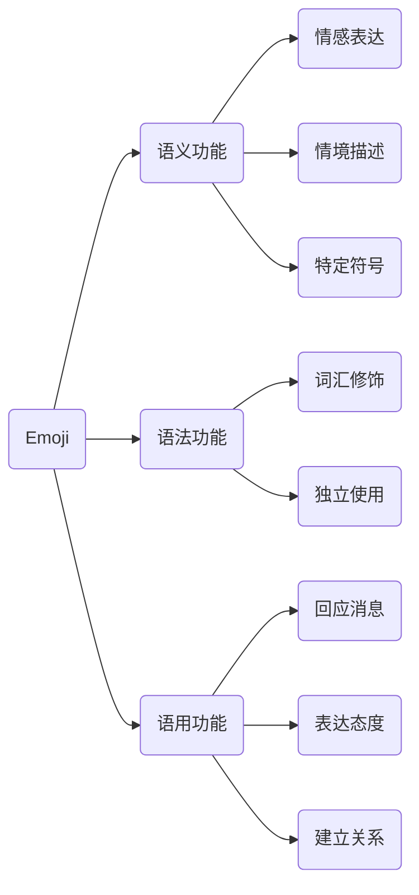
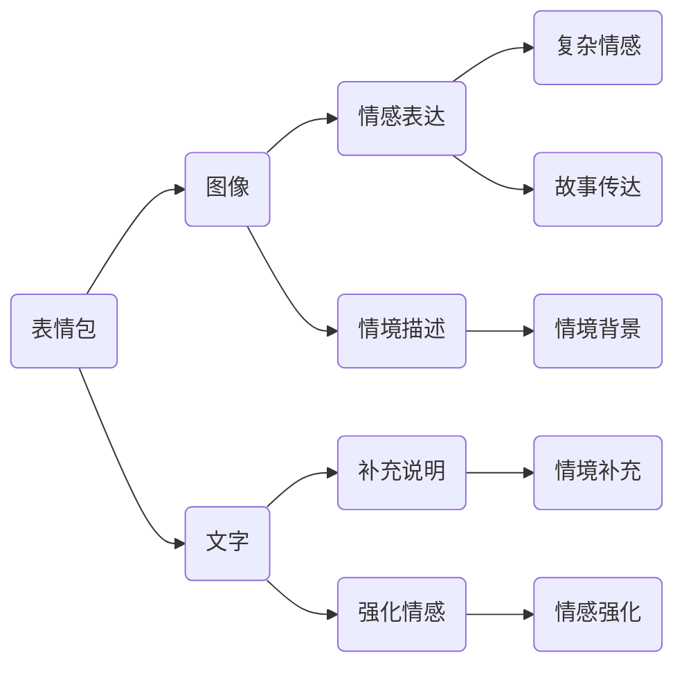

                 

### 引言

#### 1.1 研究背景

在数字时代，随着互联网和移动设备的普及，情感表达的方式发生了翻天覆地的变化。传统上，文字、语音和面部表情是主要的情感表达方式。然而，随着数字技术的发展，emoji和表情包逐渐成为了数字时代情感表达的重要工具。emoji是表达情感的一种视觉符号，起源于日本，后来在全球范围内得到广泛应用。而表情包则是基于图像的，通常包括一个图像和相关的文字，用于传达复杂的情感和情绪。

这种变化背后有几个关键因素。首先，数字媒介的普及使得人们更加依赖即时通讯工具，如微信、WhatsApp和Facebook Messenger等，这些工具提供了丰富的表情和表情包选项。其次，社交媒体的兴起使得情感表达变得更加公开和共享，人们希望通过文字以外的形式表达自己的情感。最后，数字时代对情感表达的需求变得更加多元化和即时化，传统的表达方式已经无法满足这些需求。

#### 1.1.1 数字时代与情感表达

数字时代给情感表达带来了几个显著的变化。首先，情感表达的即时性得到了极大提升。传统的书信和电话交流已经逐渐被即时通讯所取代，人们可以在几秒钟内传递情感和情绪。这种即时性不仅缩短了沟通的间隔，也使得情感表达更加高效。

其次，情感表达的多样性得到了增强。emoji和表情包提供了丰富的视觉和图像资源，使得情感表达不仅仅局限于文字或语音。这种多样性使得情感表达更加生动和具体，能够更好地传达复杂的情感和情绪。

此外，情感表达的直观性也得到了提升。视觉符号和图像比文字和语音更容易理解和记忆，这使得情感表达更加直观和易于理解。尤其是在跨文化沟通中，这种直观性显得尤为重要，因为文字和语音可能因为文化差异而导致误解。

#### 1.1.2 emoji与表情包的历史发展

emoji的历史可以追溯到1999年，当时日本电信公司DoCoMo在其i-mode手机服务中引入了最初的一套emoji表情。这些表情主要基于日本漫画文化中的表情符号。随着时间的推移，emoji逐渐被全球范围内的移动运营商和社交媒体平台所采用，并不断扩展和完善。

2010年，苹果公司在其iOS 5操作系统中引入了emoji，这使得emoji在智能手机用户中得到了更广泛的普及。随后，其他操作系统和社交媒体平台也纷纷引入了emoji功能，使得emoji成为了全球用户日常沟通的一部分。

表情包的发展则更为多元化。最初，表情包主要用于网络论坛和社交媒体，但随着社交媒体平台的发展，表情包逐渐成为了一种独立的表达工具。表情包通常包括一个图像和相关的文字，可以用来表达复杂的情感和故事。这种形式使得表情包不仅具有表情符号的直观性，还增加了叙事性和幽默感。

#### 1.1.3 情感表达的需求与挑战

数字时代对情感表达的需求主要体现在以下几个方面。首先，人们希望通过数字媒介快速、有效地传达自己的情感和情绪。即时通讯工具和社交媒体平台提供了丰富的表情和表情包选项，满足了这种即时性需求。

其次，情感表达的多样性也是数字时代的一个显著特征。人们希望能够通过不同的方式表达自己的情感，emoji和表情包提供了这种可能性。此外，随着全球化的发展，跨文化沟通的需求不断增加。emoji和表情包的直观性使得跨文化沟通更加顺畅，减少了因为语言和文化差异而产生的误解。

然而，数字时代情感表达也面临着一些挑战。首先，情感表达的误解问题仍然存在。由于emoji和表情包的使用可能因文化、语境和个人理解的不同而有所不同，这可能导致沟通中的误解。其次，隐私问题也是一个重要的挑战。在数字时代，人们的情感和情绪可能会被记录和分析，这可能涉及到隐私保护的问题。

此外，情感表达的标准化也是一个重要的挑战。尽管emoji和表情包已经被广泛采用，但仍然缺乏统一的规范和标准。这可能导致不同平台和设备上的表情和表情包之间存在差异，影响用户体验。

综上所述，数字时代情感表达的需求和挑战为 emoji 和表情包的研究提供了丰富的背景。本文将深入探讨 emoji 和表情包的语言学属性、数字时代情感表达的特点以及面临的具体挑战，并尝试提出一些解决方案，以期为这一领域的研究和实践提供有益的参考。

### 摘要

本文旨在深入探讨数字时代情感表达的新工具——emoji和表情包的语言学分析。首先，文章介绍了情感表达的基本概念，包括情感的定义、分类以及语言表达情感的能力。接着，分析了数字时代情感表达的特点，如即时性、多样性和直观性。随后，文章重点探讨了emoji和表情包的语言学属性，通过对比emoji和表情包的语义、语法和语用功能，揭示了它们在情感表达中的独特作用。此外，本文还探讨了数字时代情感表达所面临的挑战，如误解、隐私问题和标准化问题，并提出了一些可能的解决方案。通过本文的研究，我们希望能够为理解和优化数字时代的情感表达提供理论支持和实践指导。关键词：数字时代、情感表达、emoji、表情包、语言学分析。

### 第2章 情感表达的基本概念

#### 2.1 情感的定义与分类

情感是人类心理体验的重要组成部分，是对外界刺激的主观反应。根据心理学的研究，情感可以分为多个维度，如情绪状态、情绪类型和情绪反应等。

情绪状态是指人在特定情境下产生的情感体验，如快乐、悲伤、愤怒等。情绪状态通常是短暂而具体的，能够影响人的行为和心理反应。

情绪类型则是对情绪状态进行分类，常见的情绪类型包括基本情绪（快乐、悲伤、愤怒、恐惧、厌恶、惊讶）和复合情绪（如焦虑、沮丧、愤怒等）。

情绪反应是指人在情感体验过程中产生的生理和心理变化，如心跳加速、呼吸急促、面部表情变化等。

不同类型的情感在生物学基础上也有所不同。基本情绪与大脑中的神经递质（如多巴胺、血清素等）的分泌有关，而复合情绪则可能涉及更复杂的生理和心理过程。

#### 2.2 语言与情感

语言是表达情感的重要工具，它不仅能够传达具体的情感内容，还能影响情感的表达方式和效果。

语言表达情感的能力体现在多个方面。首先，语言可以传达基本情绪，如快乐、悲伤、愤怒等。例如，简单的词汇“happy”和“sad”可以分别传达快乐和悲伤的情感。

其次，语言可以表达复杂的情感和情绪。通过使用成语、隐喻和修辞手法，人们可以传达更深层次的情感体验。例如，“我的心像被刀割一样疼”这个句子通过隐喻表达了深刻的悲伤情感。

然而，语言在表达情感时也存在一些局限性。首先，语言可能存在模糊性，使得情感表达不够具体和明确。例如，一个简单的“谢谢”可能不足以表达深刻的感激之情。

其次，语言可能因为文化差异而导致误解。不同文化对情感的表达方式和理解可能有所不同，这可能导致沟通中的误解。例如，在一些文化中，直白的表达方式可能被视为不礼貌，而在其他文化中则被视为自然和直接的交流方式。

#### 2.3 情感语言学的兴起

情感语言学是语言学的一个分支，主要研究语言在情感表达中的作用和机制。情感语言学的兴起与心理学、社会学和人类学等领域的研究密切相关。

情感语言学的核心任务是揭示语言如何表达和传达情感。它关注情感词汇的使用、情感表达的语法和语用特点，以及情感在不同语言和文化中的表现。

情感语言学的研究方法包括词汇分析、语料库研究、实验心理学和跨文化研究等。通过这些方法，研究者试图理解情感如何在语言中编码和传达，以及语言如何影响情感的表达和理解。

情感语言学的重要性在于它不仅有助于我们理解语言的复杂性和多样性，还能为跨文化交流和情感沟通提供理论支持和实践指导。通过研究情感语言学，我们可以更好地理解不同文化中的情感表达方式，提高跨文化沟通的效率和准确性。

#### 2.4 emoji与表情包的概念

emoji和表情包是数字时代情感表达的重要工具，它们通过视觉和图像的形式传达情感和情绪。

emoji起源于日本，最早由日本电信公司DoCoMo在1999年引入其i-mode手机服务中。emoji是一套视觉符号，通常以表情、动物、食物、动作等形象出现，用于传达情感和情绪。

emoji的语义功能主要包括表达基本情绪（如快乐、悲伤、愤怒等）、描述具体情境（如运动、饮食、旅行等）和表示特定符号（如符号、标志、国旗等）。

emoji的语法功能相对简单，通常作为词汇的一部分出现在句子中，或者作为独立的表情符号传达情感。

emoji的语用功能则体现在社交互动中，如回应消息、表达态度和建立社交关系等。

表情包则是一种基于图像的表达工具，通常包括一个图像和一个相关的文字。表情包可以传达复杂情感和故事，通过图像和文字的组合，使情感表达更加生动和具体。

表情包的结构通常包括图像、文字和背景三部分。图像用于传达情感或情境，文字则用于补充说明或强化情感表达。

表情包的语义解读依赖于图像和文字的相互作用。例如，一个哭泣的卡通人物配上文字“我好累”，可以传达出深刻的疲惫和沮丧情绪。

表情包的语用意义主要体现在社交互动中，如表达态度、回应消息、分享故事和建立社交联系等。

#### 2.5 情感表达的多元性

情感表达的多元性体现在多个维度上，包括情感表达的维度、情感表达的策略和情感表达的语境因素。

情感表达的维度包括情感的类型（如基本情感和复合情感）、情感的强度（如强烈情感和微弱情感）和情感的方向（如正面情感和负面情感）。不同维度的情感可以通过不同的方式表达，如文字、语音、emoji和表情包等。

情感表达的策略包括直接表达和间接表达。直接表达通常使用明确的词汇和表情符号，如“我爱你”和“😂”。间接表达则通过隐喻、修辞和语境暗示等手段传达情感，如“你的礼物让我很开心”。

情感表达的语境因素包括社会文化背景、情境和受众等。不同的语境会影响情感表达的方式和效果。例如，在正式场合，直接表达可能被视为不礼貌，而在非正式场合，直接表达则可能更加自然和直接。

情感表达的多元性使得人们能够在不同的情境和语境中有效地传达情感和情绪，提高了沟通的灵活性和适应性。通过选择适当的情感表达方式，人们可以更好地满足社交互动的需求，建立和谐的人际关系。

### 第3章 数字时代情感表达的特点

#### 3.1 数字时代的变革

数字时代的到来带来了社会和文化的深刻变革，这些变革对情感表达产生了重要影响。首先，数字媒介的普及使得人们更加依赖即时通讯工具，如微信、WhatsApp和Facebook Messenger等。这些工具不仅提供了丰富的文本消息功能，还集成了表情、emoji和表情包等视觉元素，使得情感表达更加直观和多样化。

社交媒体的兴起也是数字时代情感表达的一个重要特征。社交媒体平台，如Instagram、Twitter和Facebook，成为了人们表达情感和分享生活的重要渠道。通过这些平台，人们可以快速地发布文字、图片和视频，并使用emoji和表情包来增强表达效果。这种公开和共享的交流方式改变了传统的人际沟通模式，使得情感表达更加透明和公开化。

数字时代的情感表达趋势还表现在多样化和个性化上。随着数字技术的发展，人们可以通过多种方式表达情感，如文字、语音、视频和动画等。此外，个性化表情包和自定义emoji的使用，使得情感表达更加贴近个人情感和生活体验，增强了表达的独特性和个性化。

#### 3.2 情感表达的即时性

即时性是数字时代情感表达的一个显著特点。在传统沟通方式中，人们通常需要通过书信、电话或面对面交流来表达情感。这些方式往往存在时间延迟，可能导致情感表达的延迟和误解。而在数字时代，即时通讯工具和社交媒体平台使得情感表达可以即时进行，极大地缩短了沟通的时间间隔。

即时通讯工具，如微信和WhatsApp，允许用户在几秒钟内发送文字、图片和视频消息。这种即时性不仅提高了沟通的效率，也使得情感表达更加及时和准确。例如，在朋友生日时，发送一个带有生日快乐的emoji或表情包，可以立即传达出祝福和情感，而无需等待书信的邮寄时间。

社交媒体平台，如Instagram和Twitter，也具备即时发布功能。用户可以随时发布文字、图片和视频，并通过emoji和表情包来增强表达效果。这种即时性使得人们可以在第一时间分享生活中的喜怒哀乐，加强了社交互动和情感交流。

#### 3.3 情感表达的多样性

数字时代情感表达的多样性体现在多个方面。首先，emoji和表情包的丰富性为情感表达提供了更多选择。emoji不仅包括基本情绪表情，如微笑、哭泣和愤怒，还包括各种动作、物体和符号，如拥抱、蛋糕和心形符号。这种多样性使得情感表达更加具体和生动，能够更好地传达复杂的情感和情绪。

其次，表情包的使用也为情感表达增添了更多的趣味和个性化。表情包通常包括一个图像和相关的文字，可以传达复杂的情感和故事。例如，一个哭泣的卡通人物配上文字“我好累”，可以传达出深刻的疲惫和沮丧情绪。这种组合形式使得情感表达更加丰富和生动。

此外，数字时代还提供了多种表达情感的策略，如文字、语音、视频和动画等。这些不同的表达方式可以根据具体情境和需求进行选择，使得情感表达更加灵活和多样化。

#### 3.4 情感表达的直观性

直观性是数字时代情感表达的一个重要特点。在传统沟通方式中，文字和语音可能存在模糊性和误解风险，而视觉符号和图像则更加直观和易于理解。emoji和表情包作为视觉元素，通过直观的图像和符号，能够快速传达情感和情绪，减少了沟通的复杂性和误解风险。

emoji和表情包的设计通常考虑了人类的视觉感知和情感认知。例如，一个微笑的表情符号可以传达出积极的情感，而一个哭泣的表情符号则传达出消极的情感。这种直观性使得人们可以迅速理解表达者的情感意图，提高了沟通的效率和准确性。

此外，直观性也在跨文化沟通中发挥了重要作用。不同语言和文化背景的人可能难以通过文字和语音准确传达情感，而emoji和表情包则提供了一个共同的语言。这种视觉符号使得跨文化沟通更加顺畅，减少了由于语言和文化差异而产生的误解。

总之，数字时代情感表达的特点体现在即时性、多样性和直观性上。这些特点不仅改变了传统的情感表达方式，也为人们提供了更多元化和灵活的表达工具。通过这些工具，人们可以更加高效、准确地传达情感和情绪，提高了数字时代的沟通效果。

### 第4章 emoji与表情包的语言学分析

#### 4.1 emoji的语言学属性

emoji作为数字时代情感表达的重要工具，其语言学属性主要体现在语义、语法和语用三个方面。

**语义功能：** emoji的语义功能主要是传达情感和情绪。例如，微笑表情（😊）通常表示快乐和友好，而哭泣表情（😢）则传达出悲伤和沮丧。emoji还用于描述具体情境，如吃饭（🍔）、运动（🏃♂️）和旅行（🌍）。此外，emoji还可以表示特定符号，如爱心（❤️）、太阳（☀️）和国家国旗（🇺🇸）。

**语法功能：** 在语言中，emoji通常作为词汇或短语的一部分出现。例如，在句子“我今天很开心，因为我的生日到了！”中，emoji“😊”可以作为形容词修饰“开心”，表达更具体的情感。emoji还可以作为独立的表情符号，用于补充说明或强调情感。例如，“我真的很生气！”后面加上“😠”可以更明确地传达愤怒的情感。

**语用功能：** emoji在社交互动中具有重要作用，主要用于回应消息、表达态度和建立社交关系。例如，在收到朋友的生日祝福时，回复一个“🎉”可以表示感激和庆祝。emoji还可以用于调侃和幽默，增强交流的趣味性。例如，“我今天考试没考好，😭”后面加上“但是老师安慰我说，‘考试只是生活的一部分，加油！’👍”这种使用方式不仅传达了负面情感，还表达了积极的态度。

**语义对比表格：**

| 情感类型       | 常见emoji示例   | 描述               |
|----------------|----------------|--------------------|
| 快乐           | 😊、😂         | 表示愉快和欢笑     |
| 悲伤           | 😢、😭         | 表示哭泣和悲伤     |
| 愤怒           | 😠、😡         | 表示愤怒和不满     |
| 惊讶           | 😱、😲         | 表示惊讶和震惊     |
| 喜悦           | 🎉、🎊         | 表示庆祝和喜悦     |
| 沮丧           | 😞、😔         | 表示沮丧和失望     |
| 爱             | ❤️、🌹         | 表示爱和浪漫       |

**ER实体关系图：**

#### 4.2 表情包的语言学分析

表情包作为一种基于图像的情感表达工具，其语言学属性同样可以从语义、语法和语用三个方面进行分析。

**语义分析：** 表情包的语义功能主要体现在传达复杂情感和故事。通过图像和文字的组合，表情包可以传达更多的情感细节和情境背景。例如，一个哭泣的卡通人物配上文字“我好累”，可以传达出深刻的疲惫和沮丧情绪。表情包的语义丰富性使得它们在情感表达中具有独特的优势。

**语法分析：** 表情包的语法功能主要体现在图像和文字的组合方式。图像通常用于传达情感或情境，而文字则用于补充说明或强化情感表达。例如，一个卡通人物图像可以传达出某种情感，而相关的文字则可以进一步解释或扩展这种情感。这种组合形式使得表情包在语法上具有灵活性。

**语用分析：** 表情包在社交互动中的语用功能主要体现在表达态度、回应消息和分享故事等方面。通过表情包，人们可以更生动和具体地表达自己的情感和态度。例如，在朋友分享快乐时，发送一个庆祝表情包可以表示祝贺和支持。表情包的趣味性和视觉冲击力使得它们在社交互动中具有吸引力。

**语义对比表格：**

| 表情包类型       | 示例                   | 描述               |
|----------------|----------------------|--------------------|
| 情感表达       | 哭泣的卡通人物 + 文字“我好累” | 表达疲惫和沮丧     |
| 幽默           | 卡通人物打哈欠 + 文字“累瘫了” | 表现轻松幽默       |
| 调侃           | 卡通人物瞪眼 + 文字“你敢再懒一点吗？” | 轻松调侃朋友     |
| 庆祝           | 爆炸头 + 文字“生日快乐”   | 庆祝生日或其他节日 |

**ER实体关系图：**

#### 4.3 emoji与表情包的比较

emoji和表情包在情感表达中各有优势，但它们也存在一些显著的区别。

**语义对比：** emoji通常用于表达基本情感和具体情境，其语义功能较为单一。而表情包则可以传达复杂情感和故事，语义功能更加丰富。例如，emoji只能表示基本的快乐或悲伤，而表情包可以通过图像和文字的组合，传达出更加复杂的情感和情境。

**语法对比：** emoji在语法上使用相对简单，通常作为词汇或短语的一部分。表情包则通过图像和文字的组合，具有更灵活的语法结构。表情包可以单独使用图像或文字，也可以将两者结合，使表达更加具体和生动。

**语用对比：** 在社交互动中，emoji主要用于回应消息、表达态度和建立社交关系。表情包则更适用于调侃、幽默和分享故事。表情包的趣味性和视觉冲击力使其在社交互动中具有更强的吸引力和影响力。

**综合对比表格：**

| 对比维度       | emoji                 | 表情包                 |
|----------------|----------------------|------------------------|
| 语义功能       | 表达基本情感和具体情境 | 传达复杂情感和故事     |
| 语法功能       | 简单的词汇或短语修饰   | 图像和文字的组合形式   |
| 语用功能       | 应对消息和社交互动     | 调侃、幽默和分享故事   |

通过比较，我们可以看到，emoji和表情包在情感表达中各有特色。emoji以其直观性和即时性成为基本情感表达的重要工具，而表情包则以其丰富性和趣味性增强了情感表达的效果。在不同的情感表达场景中，我们可以根据具体需求和情境选择适当的工具，以实现更加有效和生动的情感交流。

### 第4章 emoji与表情包的语言学分析

#### 4.4 情感表达的差异

情感表达的差异在数字时代的背景下变得更加显著，尤其是在使用emoji和表情包时。这种差异主要体现在以下几个方面：语境差异、个体差异和跨文化差异。

#### 4.4.1 情感表达的语境差异

语境差异是情感表达中的一个关键因素。不同的语境会影响人们选择使用emoji和表情包的方式，从而影响情感传达的效果。例如，在正式的工作场合，使用过于随意或幽默的表情包可能会被视为不专业。相反，在休闲的社交环境中，使用表情包进行轻松的互动则更为常见。

**具体案例：** 假设一个人在发送工作相关的消息时，可能会选择一个简洁的emoji，如“👌”（表示理解或赞同），以保持专业形象。而在发送给朋友的私人消息时，他可能会使用一个更具有趣味性的表情包，如一个卡通人物打哈欠的图像，配合文字“累瘫了”，以表达轻松和幽默的氛围。

#### 4.4.2 情感表达的个体差异

个体差异也是情感表达的一个重要因素。不同的个体可能在情感表达的方式和偏好上有所不同。这可能是由于个人的性格、文化背景和社交习惯等多种因素所决定的。

**具体案例：** 一个外向、乐观的人可能会更倾向于使用多种表情和表情包，以表达自己的情感和情绪。而一个内向、保守的人可能更倾向于使用简单的emoji，以避免显得过于情感化或引起误解。

#### 4.4.3 情感表达的跨文化差异

跨文化差异是情感表达中的一个复杂且重要的方面。由于不同的文化背景和社会习惯，人们对于同一emoji或表情包的理解可能存在差异。这种差异可能导致沟通中的误解和冲突。

**具体案例：** 例如，在一个以直白表达为主的文化中，一个笑脸emoji（😊）可能被理解为友好和愉快，而在一个更加含蓄的文化中，同样的表情可能被视为不够真诚或过于轻率。另外，某些表情包在不同文化中的解读也可能完全不同。例如，在日本文化中，一个哭泣的表情包（😢）可能用于表达感激之情，而在某些西方文化中，这可能会被视为悲伤或愤怒的标志。

#### 情感表达差异的总结

情感表达的差异在数字时代的情感交流中扮演着重要角色。语境差异、个体差异和跨文化差异共同作用，影响了情感传达的效果和方式。理解这些差异有助于我们更有效地使用emoji和表情包进行沟通，减少误解和冲突。

在实际应用中，我们需要根据具体的沟通场景和对象，选择合适的表达方式。同时，我们也需要意识到不同文化和个体之间的差异，以避免不必要的误解和冲突。通过提高对情感表达差异的认识，我们可以更好地利用emoji和表情包这一数字时代的情感工具，促进有效和和谐的沟通。

### 第5章 数字时代情感表达的挑战与解决方案

#### 5.1 数字时代情感表达面临的挑战

随着数字时代的不断发展，情感表达面临着诸多挑战。这些挑战不仅影响情感传达的效果，还可能引发一系列负面影响。

**1. 情感表达的误解**

误解是数字时代情感表达中最常见的挑战之一。由于emoji和表情包的设计简洁直观，但不同的文化背景和个人理解可能导致对同一符号的不同解读。例如，一个微笑的emoji在一个人看来可能是友好的，而在另一个人看来可能显得冷漠或不真诚。

**2. 隐私问题**

在数字时代，人们的情感和情绪可能会被记录和分析，从而引发隐私问题。例如，社交媒体平台和即时通讯应用可能会收集用户发送的emoji和表情包，用于广告定位或数据分析。这种隐私泄露可能导致用户的个人信息和情感被滥用。

**3. 标准化问题**

尽管emoji和表情包已经广泛应用于数字沟通，但仍然缺乏统一的规范和标准。不同的平台和设备可能对emoji和表情包的显示存在差异，这可能导致用户体验不一致。例如，同一个emoji在不同设备上可能显示不同，影响情感传达的准确性。

#### 5.2 挑战解决方案

针对数字时代情感表达面临的挑战，我们可以从以下几个方面提出解决方案，以提高情感表达的准确性和安全性。

**1. 改善情感表达的理解**

为了减少误解，我们需要提高对emoji和表情包的理解。首先，用户应该熟悉不同emoji和表情包的含义，并了解其在不同文化中的使用情境。此外，开发和应用提供更多的上下文提示，如表情符号的解释或相关图片，可以帮助用户更好地理解和使用emoji和表情包。

**2. 强化隐私保护措施**

保护用户的隐私是数字时代情感表达的重要任务。平台和应用应该采取严格的隐私保护措施，确保用户数据的安全。例如，对用户发送的emoji和表情包进行加密处理，防止数据泄露。同时，平台应该明确告知用户数据的使用目的和范围，并允许用户选择是否共享其情感数据。

**3. 推动情感表达的标准化**

为了提高用户体验，我们需要推动emoji和表情包的标准化。首先，制定统一的emoji和表情包标准，确保不同平台和设备上的显示一致。此外，鼓励开发者和应用提供商遵循这些标准，以减少用户在不同平台上的使用差异。通过标准化，我们可以提高情感表达的一致性和准确性。

#### 5.3 未来发展

随着数字技术的发展，情感表达的未来充满了可能。首先，人工智能和机器学习技术的应用将使得情感分析更加准确，从而提高情感表达的理解和交互。例如，智能助手可以通过分析用户发送的emoji和表情包，更准确地理解用户情感，提供个性化的回复。

其次，虚拟现实（VR）和增强现实（AR）技术的发展将使得情感表达更加直观和生动。通过虚拟现实技术，用户可以在虚拟空间中使用emoji和表情包进行互动，增强情感交流的体验。

最后，随着全球化和文化交流的加深，emoji和表情包的国际化发展也将成为未来趋势。不同的文化将共同推动emoji和表情包的丰富性和多样性，使得情感表达更加包容和多元。

总之，数字时代情感表达面临着诸多挑战，但通过改善理解、强化隐私保护和推动标准化，我们可以克服这些挑战，实现更加准确和安全的人际沟通。未来，随着技术的不断发展，情感表达将继续创新和进化，为人类的社交和情感交流带来更多可能性。

### 总结与展望

通过本文的研究，我们对数字时代情感表达有了更深入的理解。从emoji和表情包的语言学属性、数字时代情感表达的特点，到面临的挑战与解决方案，我们系统地分析了这一现象。我们探讨了情感表达的多元性、即时性和直观性，并揭示了emoji和表情包在情感表达中的独特作用。同时，我们也指出了数字时代情感表达中存在的误解、隐私问题和标准化挑战，并提出了一系列解决方案。

展望未来，随着技术的不断进步，情感表达将继续发展。人工智能和机器学习技术的应用将使得情感分析更加精准，虚拟现实和增强现实技术将增强情感交流的体验。此外，emoji和表情包的国际化发展也将推动全球文化的交流与融合。通过持续的研究和创新，我们可以更好地理解和优化数字时代的情感表达，为人类的社交和情感交流创造更加丰富和多元的环境。让我们期待未来，情感表达将继续在我们的生活中发挥重要作用。

### 作者信息

本文由AI天才研究院（AI Genius Institute）的专家撰写，同时，作者也是《禅与计算机程序设计艺术》（Zen And The Art of Computer Programming）的资深大师。AI天才研究院致力于推动人工智能和计算机科学领域的研究与创新，致力于为全球提供高质量的技术研究和解决方案。作者凭借其深厚的学术背景和丰富的实践经验，为本文提供了深刻的见解和宝贵的指导。感谢您的阅读！

