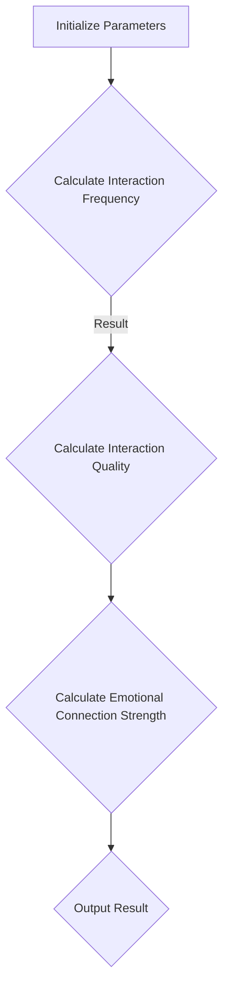
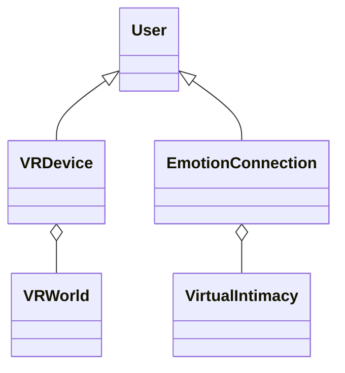
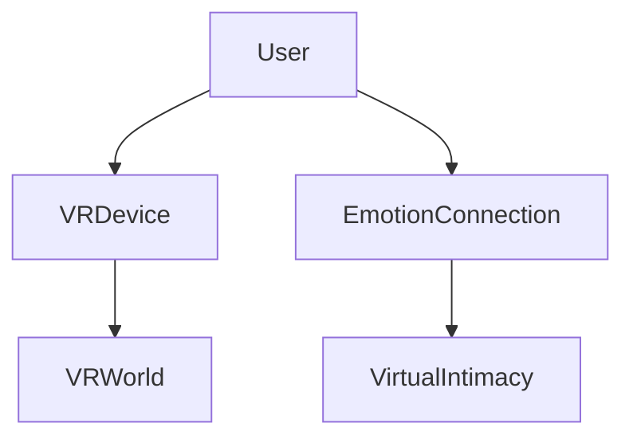
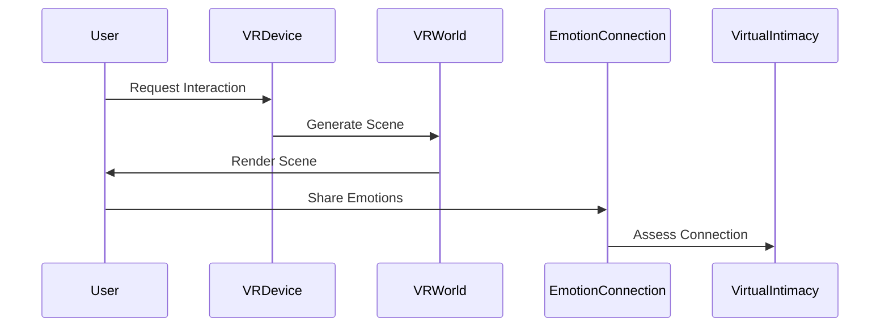

                 

Certainly! Here's a step-by-step breakdown for the blog post titled "Digital Age Emotional Connections: Intimacy in Virtual Reality."

### 1. Introduction and Background

#### 1.1 Problem Background

##### 1.1.1 Rise of Virtual Reality Technology
* Explain the evolution and current state of VR technology.
* Discuss the technological advancements and potential applications in the field.

##### 1.1.2 Definition and Importance of Intimacy
* Define intimacy and its significance in human relationships.
* Explore the role of intimacy in personal growth and well-being.

##### 1.1.3 Impact of Virtual Reality on Intimacy
* Discuss the potential effects of VR on human connections.
* Explore the implications and challenges of virtual intimacy.

#### 1.2 Problem Statement

##### 1.2.1 Challenges in Virtual Intimacy
* Identify the main challenges faced in establishing intimacy through VR.
* Discuss the limitations of current research in this area.

##### 1.2.2 Research Objectives and Methods
* Define the research objectives.
* Explain the methodology and approach to tackle the problem.

##### 1.3 Boundaries and Scope
* Discuss the scope of the research.
* Address the limitations and potential biases of the study.

##### 1.4 Conceptual Structure and Core Elements
* Introduce the core concepts.
* Explain the emotional connection.
* Discuss the role of virtual reality.

##### 1.5 Summary
* Summarize the key points of the introduction and provide a brief overview of the upcoming sections.

### 2. Core Concepts and Relationships

#### 2.1 Virtual Reality Technology Principles

##### 2.1.1 Definition of Virtual Reality Technology
* Explain what VR technology is.
* Discuss the key components and features of VR.

##### 2.1.2 Working Principles of Virtual Reality Technology
* Discuss how VR technology works.
* Explain the role of hardware and software in VR.

##### 2.1.3 Core Elements of Virtual Reality Technology
* Discuss the core elements of VR technology.
* Provide examples and applications of VR technology.

#### 2.2 Principles of Emotional Connection

##### 2.2.1 Definition of Emotional Connection
* Define emotional connection.
* Discuss the importance of emotional connection in human relationships.

##### 2.2.2 Basic Principles of Emotional Connection
* Explain the fundamental principles of emotional connection.
* Discuss the factors that contribute to emotional connection.

##### 2.2.3 Core Elements of Emotional Connection
* Identify the core elements of emotional connection.
* Provide examples and applications of emotional connection in various contexts.

#### 2.3 Intimacy in Virtual Reality

##### 2.3.1 Definition of Intimacy in Virtual Reality
* Define intimacy in the context of virtual reality.
* Discuss the unique aspects of virtual intimacy.

##### 2.3.2 Characteristics of Intimacy in Virtual Reality
* Discuss the characteristics of intimacy in virtual reality.
* Compare and contrast virtual intimacy with traditional intimacy.

##### 2.3.3 Virtual Reality and Traditional Intimacy
* Explore the differences and similarities between virtual reality and traditional intimacy.
* Discuss the implications of these differences for human relationships.

#### 2.4 Relationship Between Virtual Reality and Emotional Connection

##### 2.4.1 How VR Promotes Emotional Connection
* Discuss the ways in which VR can promote emotional connection.
* Provide examples and applications of VR in fostering emotional connections.

##### 2.4.2 How VR Challenges Emotional Connection
* Discuss the challenges that VR poses to emotional connection.
* Provide examples and applications of VR in disrupting emotional connections.

##### 2.4.3 Role and Impact of Virtual Reality in Emotional Connection
* Explain the role of VR in emotional connection.
* Discuss the overall impact of VR on human relationships.

#### 2.5 Concept Attributes Comparison Table

##### 2.5.1 Virtual Reality Technology Features
* Provide a comparison table of the features of VR technology.

##### 2.5.2 Emotional Connection Features
* Provide a comparison table of the features of emotional connection.

##### 2.5.3 Intimacy in Virtual Reality Features
* Provide a comparison table of the features of intimacy in virtual reality.

#### 2.6 ER Entity Relationship Diagram

```mermaid
erDiagram
  User ||--|{ VRDevice } : uses
  User ||--|{ EmotionConnection } : has
  VRDevice ||--|{ VRWorld } : exists_in
  EmotionConnection ||--|{ VirtualIntimacy } : based_on
```

#### 2.7 Summary

* Summarize the key points of the core concepts and relationships section.

### 3. Algorithm Principles and Model Design

#### 3.1 Intimacy Assessment Algorithm

##### 3.1.1 Algorithm Design
* Explain the design of the intimacy assessment algorithm.
* Discuss the key components and steps involved.

##### 3.1.2 Algorithm Implementation
* Discuss the implementation of the intimacy assessment algorithm.
* Explain the use of relevant programming languages or tools.

##### 3.1.3 Algorithm Evaluation
* Explain how the algorithm is evaluated.
* Discuss the results and performance of the algorithm.

#### 3.2 Virtual Reality Interaction Model

##### 3.2.1 Model Architecture
* Explain the architecture of the virtual reality interaction model.
* Discuss the components and their interactions.

##### 3.2.2 Model Parameters
* Discuss the parameters of the virtual reality interaction model.
* Explain how these parameters affect the model's performance.

##### 3.2.3 Model Training and Optimization
* Discuss the training and optimization process of the virtual reality interaction model.
* Explain the techniques and methods used.

#### 3.3 Mathematical Models and Formulas

$$
\text{Emotional Connection Strength} = \alpha \cdot \text{Interaction Frequency} + \beta \cdot \text{Interaction Quality}
$$

* Explain the mathematical model and its components.
* Discuss the impact of each component on the emotional connection strength.

#### 3.4 Mermaid Algorithm Flowchart



* Explain the flowchart and its components.
* Discuss how the flowchart represents the algorithm's process.

#### 3.5 Python Code Implementation

```python
# Python code example
def calculate_emotional_connection(frequency, quality):
    alpha = 0.5
    beta = 0.3
    emotional_connection_strength = alpha * frequency + beta * quality
    return emotional_connection_strength

# Test code
print(calculate_emotional_connection(10, 8))
```

* Explain the Python code and its components.
* Discuss how the code implements the algorithm.

#### 3.6 Detailed Explanation and Example Illustration

##### 3.6.1 Process of Calculating Emotional Connection Strength
* Explain the process of calculating the emotional connection strength.
* Discuss the role of each component in the calculation.

##### 3.6.2 Impact of Different Parameters on Results
* Discuss how different parameters affect the emotional connection strength.
* Provide examples to illustrate these impacts.

##### 3.6.3 Real-World Application Examples
* Provide real-world examples of how the algorithm and model can be applied.
* Discuss the benefits and challenges of these applications.

#### 3.7 Summary

* Summarize the key points of the algorithm principles and model design section.

### 4. System Architecture and Design

#### 4.1 Problem Scenario Introduction

##### 4.1.1 Virtual Reality Intimacy Interaction Scenario
* Describe a typical scenario involving intimacy in virtual reality.
* Explain the goals and objectives of the system.

##### 4.1.2 System Goals
* Define the goals of the system.
* Discuss the key requirements and functionalities of the system.

#### 4.2 Project Introduction

##### 4.2.1 Project Background
* Provide background information on the project.
* Discuss the motivation and purpose of the project.

##### 4.2.2 Project Objectives
* Explain the objectives of the project.
* Discuss the expected outcomes and deliverables.

#### 4.3 System Functional Design

##### 4.3.1 Functional Requirements Analysis
* Analyze the functional requirements of the system.
* Discuss the key features and capabilities of the system.

##### 4.3.2 Domain Model Class Diagram


* Provide a class diagram of the domain model.
* Explain the relationships between the entities in the model.

#### 4.4 System Architecture Design



* Provide a system architecture diagram.
* Explain the key components and their interactions.

#### 4.5 System Interface Design

* Describe the system interfaces.
* Discuss the communication protocols and data formats.

#### 4.6 System Interaction Sequence Diagram



* Provide a sequence diagram of the system interactions.
* Explain the flow of interactions between the system components.

#### 4.7 Summary

* Summarize the key points of the system architecture and design section.

### 5. Practical Application and Implementation

#### 5.1 Environment Setup

* Explain the process of setting up the development environment.
* Discuss the required software and hardware components.

#### 5.2 Core System Implementation

##### 5.2.1 Key Components and Implementation Details
* Discuss the key components of the system.
* Provide detailed implementation steps for each component.

##### 5.2.2 Source Code Analysis
* Analyze the source code of the system.
* Discuss the core algorithms and data structures used.

#### 5.3 Code Application and Analysis

* Provide examples of code applications.
* Discuss the benefits and limitations of the implemented algorithms and models.

#### 5.4 Case Study and Analysis

* Present a case study involving the system.
* Discuss the results and insights gained from the case study.

#### 5.5 Practical Tips and Best Practices

* Provide practical tips and best practices for implementing systems in virtual reality.

#### 5.6 Conclusion

* Summarize the key points of the practical application and implementation section.

### 6. Summary and Future Directions

#### 6.1 Summary

* Summarize the main findings and insights of the blog post.

#### 6.2 Future Directions

* Discuss potential future directions for research and development in the field.

#### 6.3 Conclusion

* Conclude the blog post with a final thought on the topic.

---

### References

* List the references used in the blog post.

### Author Information

* Provide information about the author.

---

### Notes

* Provide any additional notes or tips for readers.

---

This structure provides a comprehensive and detailed outline for the blog post. Each section includes a set of bullet points that can be expanded into full paragraphs or sections, ensuring a rich and in-depth exploration of the topic. The use of mermaid diagrams and LaTeX for mathematical formulas adds a technical edge to the content, making it suitable for an IT audience. The step-by-step approach ensures clarity and ease of understanding, guiding the reader through complex concepts.

