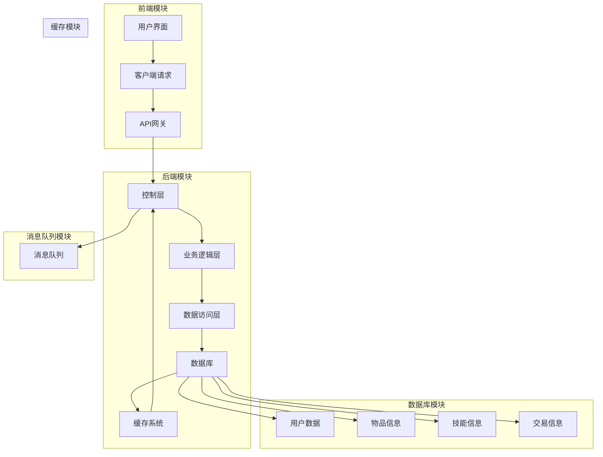
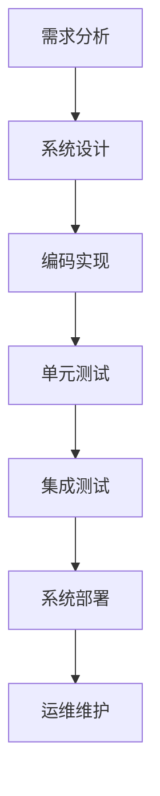
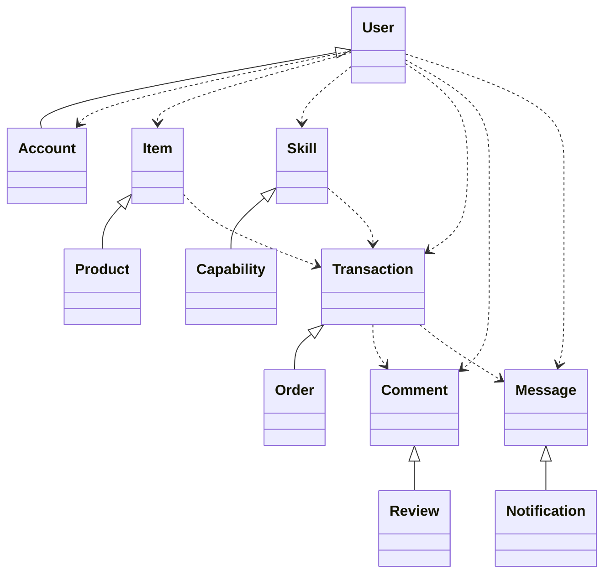
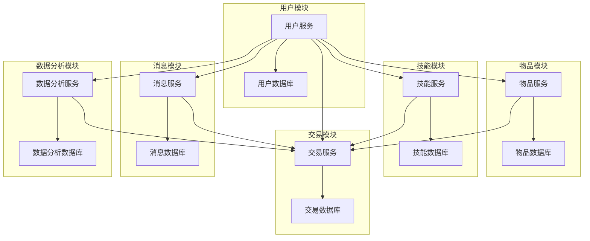
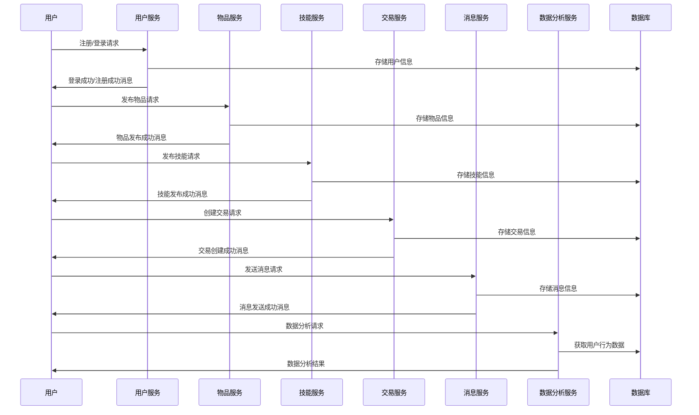

                 

### 第一部分：背景与核心概念

#### 第1章：数字时代技能共享平台概述

随着数字时代的到来，技能共享平台正逐渐成为人们日常生活中不可或缺的一部分。在这个章节中，我们将深入探讨数字时代的特征、技能共享的重要性，以及技能共享平台的概念与演进。

**1.1 数字时代的特征与技能共享的重要性**

数字时代带来了诸多变化，其中最为显著的是信息的快速传播与技术的飞速发展。在这种背景下，技能共享平台的重要性愈发凸显。首先，技能共享平台能够快速、高效地连接供需双方，使人们的技能得以得到充分利用。其次，它打破了时间和空间的限制，使得技能的传递变得更加便捷。最后，技能共享平台促进了知识的传播和积累，有助于整个社会的进步。

**1.2 技能共享平台的概念与演进**

技能共享平台，顾名思义，是一个用于共享技能的在线平台。在这个平台上，个人可以发布自己的技能，同时也可以寻找自己需要的技能。这种平台经历了从线下到线上的转变，从早期的简单信息发布到如今的功能丰富、交互便捷的智能平台。随着技术的进步，技能共享平台正在向智能化、个性化方向发展。

#### 第2章：现代化以物易技系统的核心概念与联系

在这一章节中，我们将详细探讨现代化以物易技系统的核心概念、联系，并通过概念属性特征对比表格和ER实体关系图架构来帮助读者更好地理解。

**2.1 现代化以物易技系统的定义与特点**

现代化以物易技系统，是一种基于数字技术的以物易技交易系统。它利用互联网、大数据、人工智能等技术手段，实现物品与技能之间的交换。这种系统具有以下几个显著特点：首先，它具有高度的智能化和自动化，能够快速匹配供需双方；其次，它提供了丰富的交易方式和工具，使得交易过程更加便捷；最后，它能够实现实时的信息反馈和交易记录，提高了交易的安全性和透明度。

**2.2 核心概念解析**

现代化以物易技系统的核心概念包括：物品、技能、交易、用户、平台等。下面，我们将对这些概念进行详细解析。

- **物品**：物品是交易的对象，可以是实物，也可以是数字产品。在以物易技系统中，物品具有唯一的标识和属性，便于系统进行管理和追踪。
- **技能**：技能是用户能够提供的特殊能力。在系统中，技能被抽象为一种资源，可以通过交易获得。
- **交易**：交易是物品与技能之间的交换过程。交易可以是有形的，也可以是无形的，如知识分享。
- **用户**：用户是系统的参与者，可以是买家，也可以是卖家。用户在系统中注册、发布需求、提供技能、进行交易等。
- **平台**：平台是现代化以物易技系统的核心，它提供交易环境、交易工具、安全保障等。

**2.3 概念属性特征对比表格**

为了更好地理解这些概念，我们可以通过一个概念属性特征对比表格来展示它们之间的关系和差异。

| 概念 | 属性特征 |
| ---- | ---- |
| 物品 | 唯一标识、属性、分类 |
| 技能 | 技能等级、技能类别、技能描述 |
| 交易 | 交易类型、交易价格、交易状态 |
| 用户 | 用户ID、用户名、联系方式 |
| 平台 | 平台功能、平台规则、平台安全 |

**2.4 ER实体关系图架构**

为了更直观地展示这些概念之间的关系，我们可以使用ER实体关系图来描述现代化以物易技系统的架构。ER图可以清晰地展示出实体之间的关系，包括主键、外键等。

```mermaid
erDiagram
    User ||--|{ Skill }|| UserSkill
    User ||--|{ Item }|| UserItem
    Skill ||--|{ Transaction }|| SkillTransaction
    Item ||--|{ Transaction }|| ItemTransaction
    Transaction ||--|{ Platform }|| TransactionPlatform
```

在这个ER图中，User（用户）与Skill（技能）、Item（物品）、Transaction（交易）之间存在一对多的关系，Transaction（交易）与Platform（平台）之间存在一对一的关系。通过这个图，我们可以更好地理解系统中的数据关系和业务逻辑。

### 总结

在第一部分，我们首先概述了数字时代技能共享平台的重要性，并详细介绍了现代化以物易技系统的核心概念与联系。通过概念属性特征对比表格和ER实体关系图架构，我们希望能够帮助读者更好地理解这些核心概念。在接下来的章节中，我们将进一步探讨平台的设计与实现，运营与管理系统，以及安全与风险管理等方面的内容。

---

**核心关键词**：数字时代、技能共享平台、现代化以物易技系统、核心概念、联系、概念属性特征对比表格、ER实体关系图架构。

**摘要**：本文深入探讨了数字时代的技能共享平台和现代化以物易技系统的核心概念和联系。通过概念属性特征对比表格和ER实体关系图架构，我们帮助读者更好地理解了这些概念，为后续平台设计与实现、运营与管理系统，以及安全与风险管理等方面的内容奠定了基础。

---

接下来，我们将进入第二部分，讨论平台的设计与实现。

---

# 第二部分：平台设计与实现

## 第3章：技能共享平台的设计原理

在数字时代，技能共享平台的设计原理需要考虑到用户体验、系统性能、安全性等多方面因素。本章节将详细讨论技能共享平台的设计原理，包括设计原则与目标、功能需求分析、系统架构设计以及数据库设计。

**3.1 设计原则与目标**

技能共享平台的设计原则主要包括：

1. **用户至上**：以用户为中心，关注用户需求，提供便捷、友好的操作界面。
2. **高效性能**：确保系统的高并发处理能力和快速响应速度。
3. **安全性**：保障用户数据的安全，防止数据泄露和恶意攻击。
4. **可扩展性**：设计时要考虑系统的可扩展性，以便在未来能够轻松增加新功能和业务。
5. **易维护性**：确保系统的可维护性，便于后续的维护和升级。

设计目标则是实现一个功能全面、性能优越、安全可靠、用户体验优秀的技能共享平台。

**3.2 功能需求分析**

技能共享平台的主要功能需求包括：

1. **用户管理**：用户注册、登录、个人信息管理、密码找回等。
2. **物品管理**：物品发布、分类管理、库存管理、物品描述等。
3. **技能管理**：技能发布、分类管理、技能描述、技能评价等。
4. **交易管理**：交易创建、交易状态管理、支付处理、订单管理等。
5. **消息系统**：私信发送、系统通知、评论回复等。
6. **数据分析**：用户行为分析、交易数据分析、市场趋势分析等。
7. **权限管理**：管理员登录、管理员操作日志、权限控制等。

**3.3 系统架构设计**

技能共享平台的系统架构设计需要考虑系统的可扩展性、高性能、高可用性。以下是系统架构的主要模块：

1. **前端架构**：采用Vue.js或React等前端框架，实现用户界面的渲染和交互。
2. **后端架构**：采用Spring Boot或Django等后端框架，处理业务逻辑和数据交互。
3. **数据库设计**：采用MySQL或PostgreSQL等关系型数据库，存储用户数据、物品信息、技能信息等。
4. **缓存系统**：采用Redis等缓存系统，提高数据读取速度。
5. **消息队列**：采用RabbitMQ或Kafka等消息队列系统，处理消息传递和异步任务。
6. **身份认证**：采用JWT或OAuth等身份认证机制，确保用户身份安全。
7. **API网关**：采用Zuul或Spring Cloud Gateway等API网关，统一处理外部请求和路由。

以下是系统架构的Mermaid架构图：



**3.4 数据库设计**

数据库设计是技能共享平台实现的核心部分，以下是主要数据表的设计：

1. **用户表（users）**：存储用户的基本信息，如用户ID、用户名、密码、邮箱等。
2. **物品表（items）**：存储物品的基本信息，如物品ID、名称、描述、类别、价格、库存等。
3. **技能表（skills）**：存储技能的基本信息，如技能ID、名称、描述、类别、技能等级等。
4. **交易表（transactions）**：存储交易的基本信息，如交易ID、买家ID、卖家ID、物品ID、技能ID、交易金额、交易状态等。
5. **评论表（comments）**：存储用户对物品或技能的评论信息，如评论ID、用户ID、内容、创建时间等。

以下是数据库的ER图：

```mermaid
erDiagram
    User ||--|{ Skill }|| UserSkill
    User ||--|{ Item }|| UserItem
    Skill ||--|{ Transaction }|| SkillTransaction
    Item ||--|{ Transaction }|| ItemTransaction
    Transaction ||--|{ Platform }|| TransactionPlatform
```

在这个ER图中，User（用户）与Skill（技能）、Item（物品）、Transaction（交易）之间存在一对多的关系，Transaction（交易）与Platform（平台）之间存在一对一的关系。

### 总结

在第二部分，我们详细介绍了技能共享平台的设计原理，包括设计原则与目标、功能需求分析、系统架构设计以及数据库设计。通过这些内容的讨论，我们为技能共享平台的实现奠定了坚实的基础。在接下来的章节中，我们将进一步探讨现代化以物易技系统的实现过程。

---

**核心关键词**：技能共享平台、设计原则、功能需求、系统架构设计、数据库设计、前端架构、后端架构、API网关、缓存系统、消息队列、身份认证、数据库表、ER图。

**摘要**：本文详细介绍了技能共享平台的设计原理，包括设计原则与目标、功能需求分析、系统架构设计和数据库设计。通过讨论，我们为技能共享平台的实现提供了清晰的框架和具体的实现方案。

---

接下来，我们将进入第三部分，探讨现代化以物易技系统的实现。

---

# 第三部分：现代化以物易技系统的实现

## 第4章：现代化以物易技系统的实现

在数字化时代，现代化以物易技系统的实现已成为许多企业和个人提升资源利用效率的重要手段。本章将详细介绍现代化以物易技系统的实现过程，包括技术选型与工具、系统模块设计、系统开发过程等。

### 4.1 技术选型与工具

在实现现代化以物易技系统时，技术选型至关重要。以下是选择的技术和工具：

1. **前端技术**：Vue.js或React，用于构建用户界面，提供良好的用户体验。
2. **后端技术**：Spring Boot或Django，用于处理业务逻辑和数据交互。
3. **数据库技术**：MySQL或PostgreSQL，用于存储和管理数据。
4. **缓存技术**：Redis，用于提高数据读取速度，减轻数据库压力。
5. **消息队列**：RabbitMQ或Kafka，用于处理异步任务和消息传递。
6. **身份认证**：JWT或OAuth，用于确保用户身份安全。
7. **API网关**：Zuul或Spring Cloud Gateway，用于统一处理外部请求和路由。

### 4.2 系统模块设计

现代化以物易技系统的模块设计包括以下几个方面：

1. **用户模块**：处理用户注册、登录、个人信息管理等功能。
2. **物品模块**：管理物品的发布、分类、库存、物品描述等功能。
3. **技能模块**：管理技能的发布、分类、技能描述、技能评价等功能。
4. **交易模块**：处理交易创建、交易状态管理、支付处理、订单管理等功能。
5. **消息模块**：发送系统通知、私信、评论回复等功能。
6. **数据分析模块**：收集用户行为数据、交易数据，提供数据可视化分析。
7. **权限模块**：管理管理员登录、管理员操作日志、权限控制等功能。

### 4.3 系统开发过程

系统开发过程通常包括以下几个阶段：

1. **需求分析**：明确系统功能和性能要求，制定详细的需求文档。
2. **系统设计**：根据需求文档，设计系统架构、数据库设计、前端和后端模块设计。
3. **编码实现**：根据设计文档，使用选定的技术工具进行编码实现。
4. **单元测试**：对单个模块进行功能测试，确保每个模块都能正常工作。
5. **集成测试**：将所有模块集成起来，进行整体测试，确保系统能够正常运行。
6. **系统部署**：将系统部署到生产环境，进行实际运行。
7. **运维维护**：对系统进行监控、维护和优化，确保系统的稳定性和安全性。

以下是系统开发过程的Mermaid流程图：



### 4.4 系统开发过程中的示例代码

以下是一个简单的Python示例代码，用于实现用户注册功能：

```python
def register_user(username, password, email):
    # 验证用户名、密码和邮箱格式
    if not validate_format(username, password, email):
        return "用户名、密码或邮箱格式不正确"
    
    # 查询数据库中是否存在相同用户名或邮箱
    if user_exists(username, email):
        return "用户名或邮箱已存在"
    
    # 插入新用户数据到数据库
    insert_user_to_database(username, password, email)
    
    return "注册成功"
```

在这个示例中，`register_user` 函数用于处理用户注册请求。它首先验证用户名、密码和邮箱的格式，然后检查数据库中是否存在相同用户名或邮箱，最后将新用户数据插入到数据库中。

### 4.5 系统开发过程中的挑战与解决方案

在系统开发过程中，可能会遇到以下挑战：

1. **性能瓶颈**：随着用户数量的增加，系统可能会出现性能瓶颈。解决方案是优化数据库查询、使用缓存技术、增加服务器资源等。
2. **安全性问题**：系统需要确保用户数据的安全，防止数据泄露和恶意攻击。解决方案是使用加密技术、身份认证机制、防火墙等。
3. **数据一致性**：在分布式系统中，数据一致性是一个重要问题。解决方案是使用分布式事务管理、消息队列等。

### 4.6 系统部署与运维

系统部署是将开发完成的系统部署到生产环境，使其能够对外提供服务。部署过程包括：

1. **环境配置**：配置服务器、数据库、缓存系统、消息队列等环境。
2. **部署脚本**：编写部署脚本，实现自动化部署。
3. **监控与报警**：监控系统运行状态，设置报警机制，确保系统的稳定性和安全性。

在系统运维过程中，需要定期进行系统维护和优化，包括：

1. **备份与恢复**：定期备份数据库，确保数据安全。
2. **性能优化**：根据系统运行情况，进行性能优化。
3. **安全防护**：定期进行安全检查，更新安全策略。

### 总结

在第三部分，我们详细介绍了现代化以物易技系统的实现过程，包括技术选型与工具、系统模块设计、系统开发过程、系统开发过程中的示例代码、系统开发过程中的挑战与解决方案，以及系统部署与运维。通过这些内容的讨论，我们为现代化以物易技系统的实现提供了全面的指导。

---

**核心关键词**：现代化以物易技系统、技术选型、前端技术、后端技术、数据库技术、缓存技术、消息队列、身份认证、API网关、系统模块设计、编码实现、单元测试、集成测试、系统部署、运维维护、Python示例代码、性能瓶颈、安全性问题、数据一致性、系统部署与运维。

**摘要**：本文详细介绍了现代化以物易技系统的实现过程，包括技术选型与工具、系统模块设计、系统开发过程、系统开发过程中的示例代码、系统开发过程中的挑战与解决方案，以及系统部署与运维。通过这些内容的讨论，我们为现代化以物易技系统的实现提供了全面的指导。

---

接下来，我们将进入第四部分，讨论平台运营与管理系统。

---

# 第四部分：平台运营与管理系统

## 第5章：平台运营与管理系统

在现代数字化技能共享平台上，运营与管理系统的重要性不容忽视。本章将深入探讨平台运营与管理系统的各个方面，包括运营策略与模式、用户管理、物品管理、技能管理、交易管理等内容。

### 5.1 运营策略与模式

平台运营策略和模式的选择直接影响平台的成功与否。以下是几种常见的运营策略和模式：

1. **会员制度**：通过设立会员制度，为用户提供不同的会员等级，提供相应的优惠和服务，增强用户的粘性。
2. **活动推广**：定期举办线上或线下活动，吸引新用户注册，促进老用户的活跃度。
3. **市场合作**：与其他企业或机构建立合作关系，共享用户资源，扩大平台的影响力。
4. **内容运营**：通过发布高质量的内容，吸引用户关注，提高平台的知名度和用户粘性。
5. **数据分析**：利用大数据技术，分析用户行为和市场需求，优化运营策略。

### 5.2 用户管理

用户管理是平台运营的核心环节。以下是用户管理的一些关键点：

1. **注册与认证**：提供用户注册功能，确保用户身份的真实性和合法性。
2. **个人信息管理**：允许用户编辑个人资料、头像、联系方式等，方便用户管理自己的信息。
3. **权限管理**：根据用户角色和权限，限制用户访问特定功能或数据。
4. **安全保护**：采用加密技术、双因素认证等措施，保护用户数据安全。

### 5.3 物品管理

物品管理涉及物品的发布、分类、库存、描述等。以下是物品管理的一些关键点：

1. **物品发布**：用户可以发布自己的物品信息，包括名称、描述、价格、库存等。
2. **物品分类**：对物品进行分类管理，方便用户查找和浏览。
3. **物品库存**：实时更新物品库存信息，确保库存的准确性。
4. **物品描述**：提供详细的物品描述，包括物品的使用方法、保养方法等，帮助用户更好地了解物品。

### 5.4 技能管理

技能管理涉及技能的发布、分类、描述、评价等。以下是技能管理的一些关键点：

1. **技能发布**：用户可以发布自己的技能信息，包括名称、描述、价格、技能等级等。
2. **技能分类**：对技能进行分类管理，方便用户查找和浏览。
3. **技能描述**：提供详细的技能描述，包括技能的应用场景、学习时长、学习方式等。
4. **技能评价**：允许用户对技能进行评价，提高技能的质量和可信度。

### 5.5 交易管理

交易管理是平台运营的重要组成部分。以下是交易管理的一些关键点：

1. **交易创建**：用户可以发起交易，包括物品交换、技能交易等。
2. **交易状态管理**：实时更新交易状态，包括交易创建、交易进行中、交易成功、交易失败等。
3. **支付处理**：集成支付系统，实现支付功能，确保交易的安全和便捷。
4. **订单管理**：记录和管理交易订单，包括订单详情、订单状态、订单日志等。

### 5.6 运营数据分析

运营数据分析是平台运营的重要环节，可以帮助运营团队了解平台运行情况，优化运营策略。以下是运营数据分析的一些关键点：

1. **用户行为分析**：分析用户访问量、用户留存率、用户活跃度等指标，了解用户需求和偏好。
2. **交易数据分析**：分析交易量、交易成功率、交易价格等指标，了解市场趋势和用户需求。
3. **内容数据分析**：分析用户发布的内容数量、内容类型、用户互动情况等，了解内容质量和用户参与度。
4. **市场推广效果分析**：分析市场推广活动的效果，了解不同推广方式的效果和成本效益。

### 总结

在第四部分，我们详细介绍了平台运营与管理系统的各个方面，包括运营策略与模式、用户管理、物品管理、技能管理、交易管理，以及运营数据分析。通过这些内容的讨论，我们为平台运营和管理提供了全面的指导，有助于提升平台的效果和用户体验。

---

**核心关键词**：平台运营、运营策略、用户管理、物品管理、技能管理、交易管理、运营数据分析、会员制度、活动推广、市场合作、内容运营、数据分析、注册与认证、个人信息管理、权限管理、安全保护、物品发布、物品分类、物品库存、物品描述、技能发布、技能分类、技能描述、技能评价、交易创建、交易状态管理、支付处理、订单管理、用户行为分析、交易数据分析、内容数据分析、市场推广效果分析。

**摘要**：本文详细介绍了平台运营与管理系统的各个方面，包括运营策略与模式、用户管理、物品管理、技能管理、交易管理，以及运营数据分析。通过这些内容的讨论，我们为平台运营和管理提供了全面的指导，有助于提升平台的效果和用户体验。

---

接下来，我们将进入第五部分，讨论平台安全与风险管理。

---

# 第五部分：平台安全与风险管理

## 第6章：技能共享平台的安全性问题

在现代数字化的技能共享平台上，安全性问题至关重要。一个安全可靠的平台能够保护用户数据、防止欺诈行为，并确保交易的顺利进行。本章将深入探讨技能共享平台面临的常见安全性问题，包括数据泄露、恶意攻击、欺诈行为等，并介绍相应的安全措施和策略。

### 6.1 平台安全的重要性

技能共享平台涉及大量的用户数据，如个人资料、交易记录、支付信息等。因此，平台的安全性直接影响到用户的信任和平台的声誉。以下是一些平台安全的重要性方面：

1. **用户隐私保护**：确保用户个人信息不被未授权访问，防止数据泄露。
2. **交易安全性**：确保交易过程中支付信息的加密和安全传输，防止恶意攻击。
3. **防止欺诈行为**：监控平台交易行为，及时发现和处理欺诈行为，保护用户利益。
4. **平台信誉**：安全可靠的平台能够赢得用户的信任，提高平台的竞争力。

### 6.2 安全威胁与风险

技能共享平台面临多种安全威胁和风险，包括：

1. **数据泄露**：攻击者通过黑客攻击、SQL注入等手段获取用户数据。
2. **恶意攻击**：包括分布式拒绝服务攻击（DDoS）、中间人攻击（MITM）等，试图破坏平台的服务。
3. **欺诈行为**：用户通过虚假信息注册、发布虚假物品或技能，骗取其他用户的信任。
4. **内部威胁**：内部人员滥用权限，泄露敏感信息或进行非法操作。

### 6.3 安全措施与策略

为了应对上述安全威胁和风险，平台需要采取一系列安全措施和策略：

1. **身份认证与权限管理**：采用多因素认证（MFA）、单点登录（SSO）等技术，确保用户身份的合法性和权限管理。
2. **数据加密**：使用HTTPS、SSL/TLS等协议，确保数据在传输过程中的加密和安全。
3. **安全审计与监控**：定期进行安全审计，监控平台活动，及时发现和处理异常行为。
4. **防火墙与入侵检测系统**：部署防火墙和入侵检测系统（IDS），防止外部攻击和内部威胁。
5. **数据备份与恢复**：定期备份数据，确保在发生数据丢失或损坏时能够快速恢复。
6. **用户教育**：通过教育用户如何保护个人信息和防止欺诈，提高用户的安全意识。

### 6.4 具体安全措施实例

以下是技能共享平台的一些具体安全措施实例：

1. **身份认证**：使用OAuth 2.0或OpenID Connect进行身份认证，确保用户身份的合法性。
2. **数据加密**：使用AES加密算法对用户数据进行加密存储，确保数据在数据库中的安全性。
3. **安全审计**：定期检查用户操作日志，分析潜在的安全威胁，确保平台的安全。
4. **DDoS防护**：部署DDoS防护设备和服务，防止DDoS攻击，确保平台服务的可用性。
5. **用户教育**：通过平台公告、邮件提醒等方式，教育用户如何保护个人信息，防止欺诈。

### 总结

在第五部分，我们深入探讨了技能共享平台面临的安全性问题，包括数据泄露、恶意攻击、欺诈行为等，并介绍了相应的安全措施和策略。通过采取这些措施，技能共享平台能够有效保护用户数据，防止欺诈行为，确保交易的顺利进行，从而提升平台的信任度和用户满意度。

---

**核心关键词**：技能共享平台、安全性、数据泄露、恶意攻击、欺诈行为、身份认证、权限管理、数据加密、安全审计、监控、防火墙、入侵检测系统、DDoS防护、用户教育。

**摘要**：本文深入探讨了技能共享平台面临的安全性问题，包括数据泄露、恶意攻击、欺诈行为等，并介绍了相应的安全措施和策略。通过采取这些措施，技能共享平台能够有效保护用户数据，防止欺诈行为，确保交易的顺利进行，从而提升平台的信任度和用户满意度。

---

接下来，我们将进入第六部分，讨论平台的安全性与风险管理。

---

## 第7章：风险管理与预防措施

在技能共享平台的运营过程中，风险管理是确保平台稳定运行和用户安全的重要环节。本章将深入讨论平台的风险管理，包括风险识别与评估、风险预防与缓解措施、应急响应与处理等内容。

### 7.1 风险识别与评估

风险管理的第一步是识别和评估潜在的风险。以下是技能共享平台常见风险的识别与评估方法：

1. **用户风险**：包括用户欺诈、恶意行为、违规操作等。可以通过用户行为分析、历史记录等方式进行评估。
2. **交易风险**：包括交易欺诈、虚假交易、恶意评分等。可以通过交易数据分析、交易模式识别等方式进行评估。
3. **技术风险**：包括系统漏洞、服务器故障、网络攻击等。可以通过安全审计、漏洞扫描等方式进行评估。
4. **法律风险**：包括合规性、知识产权保护等。可以通过法律咨询、政策研究等方式进行评估。

### 7.2 风险预防与缓解措施

为了有效管理风险，平台需要采取一系列预防与缓解措施：

1. **用户身份验证**：采用多因素认证（MFA）和单点登录（SSO）等机制，确保用户身份的真实性和合法性。
2. **数据加密**：使用HTTPS、SSL/TLS等协议，对用户数据和交易信息进行加密存储和传输。
3. **交易监控**：建立实时监控机制，对交易行为进行实时监控，及时发现和阻止可疑交易。
4. **系统备份**：定期备份数据库和系统配置，确保在发生故障或数据丢失时能够快速恢复。
5. **网络安全**：部署防火墙、入侵检测系统（IDS）和防DDoS设备，保护平台免受网络攻击。

### 7.3 应急响应与处理

在风险发生时，应急响应和处理的效率直接关系到平台的稳定性和用户满意度。以下是应急响应与处理的关键步骤：

1. **应急响应计划**：制定详细的应急响应计划，包括风险识别、响应流程、人员职责等。
2. **快速识别与响应**：在风险发生时，迅速识别并启动应急响应计划，采取紧急措施，如关闭受影响的系统模块、隔离恶意用户等。
3. **信息通报**：及时向受影响的用户通报风险情况和应对措施，确保用户了解情况并采取相应的措施。
4. **事故调查**：对风险事件进行详细调查，分析原因，制定改进措施，防止类似事件再次发生。
5. **恢复与修复**：在风险得到控制后，尽快恢复受影响的系统和服务，并进行修复，确保平台的正常运行。

### 7.4 风险管理与最佳实践

以下是一些风险管理的最佳实践：

1. **定期培训**：定期对员工进行风险管理培训，提高他们的风险意识和应对能力。
2. **外部审计**：邀请第三方机构对平台进行安全审计，识别潜在的风险点。
3. **风险管理文档**：建立完整的风险管理文档，记录风险评估结果、应急响应计划、事故调查报告等。
4. **持续改进**：根据风险管理的结果和经验，不断改进风险管理体系，提高风险应对能力。

### 总结

在第六部分，我们详细讨论了技能共享平台的风险管理，包括风险识别与评估、风险预防与缓解措施、应急响应与处理等内容。通过采取有效的风险管理措施，平台能够更好地保护用户数据，防范潜在风险，确保平台的稳定运行和用户的满意度。

---

**核心关键词**：风险管理、风险识别、用户风险、交易风险、技术风险、法律风险、预防措施、应急响应、数据加密、交易监控、网络安全、应急响应计划、信息通报、事故调查、恢复与修复、最佳实践。

**摘要**：本文详细讨论了技能共享平台的风险管理，包括风险识别与评估、风险预防与缓解措施、应急响应与处理等内容。通过采取有效的风险管理措施，平台能够更好地保护用户数据，防范潜在风险，确保平台的稳定运行和用户的满意度。

---

接下来，我们将进入最后一部分，讨论项目实战。

---

## 第8章：技能共享平台的项目实战

### 8.1 项目背景

在数字化时代，技能共享平台已经成为一种新兴的服务模式，为广大用户提供了便捷的技能交换和资源共享渠道。本案例将详细介绍一个具体的技能共享平台项目，从项目背景、系统功能设计到系统实现和实际案例分析，全面展示项目开发过程。

#### 项目背景

随着互联网技术的飞速发展，技能共享逐渐成为社会资源优化配置的重要手段。本案例中的技能共享平台项目旨在构建一个集物品交换、技能共享、交易管理等功能于一体的综合平台，为广大用户提供便捷、安全、高效的技能交换服务。

#### 问题描述

本项目的主要目标包括：

1. **用户注册与登录**：支持用户注册、登录、个人信息管理等功能。
2. **物品管理**：支持用户发布、浏览、管理自己的物品信息。
3. **技能管理**：支持用户发布、浏览、管理自己的技能信息。
4. **交易管理**：支持物品交换、技能交易、交易状态跟踪等功能。
5. **消息系统**：支持用户之间的消息传递和通知提醒。
6. **数据分析**：收集用户行为数据，提供数据可视化分析，帮助优化运营策略。

### 8.2 系统功能设计（领域模型）

在系统功能设计中，领域模型是一个重要的工具，用于表示系统中的核心业务实体及其之间的关系。以下是技能共享平台的主要领域模型：



在这个领域模型中，User（用户）是核心实体，与其他实体之间存在多对多关系。Account（账户）是用户的身份认证实体，Product（物品）和Capability（技能）分别表示用户发布的物品和技能信息，Order（订单）表示交易过程，Review（评论）和Notification（通知）分别表示用户对交易的评价和系统通知。

### 8.3 系统架构设计

技能共享平台采用微服务架构，以提高系统的可扩展性和维护性。以下是系统架构的主要模块：

1. **用户服务**：处理用户注册、登录、个人信息管理等功能。
2. **物品服务**：处理物品发布、浏览、管理等功能。
3. **技能服务**：处理技能发布、浏览、管理等功能。
4. **交易服务**：处理交易创建、状态跟踪、支付处理等功能。
5. **消息服务**：处理用户之间的消息传递和通知提醒。
6. **数据分析服务**：收集用户行为数据，提供数据可视化分析。

以下是系统架构的Mermaid架构图：



在这个架构图中，每个模块都是独立的服务，通过API进行通信，以实现模块间的解耦。

### 8.4 系统接口设计

系统接口设计是系统架构设计的重要组成部分，用于定义模块间的通信接口。以下是主要接口的设计：

1. **用户接口**：包括用户注册、登录、个人信息管理等功能。
2. **物品接口**：包括物品发布、浏览、管理等功能。
3. **技能接口**：包括技能发布、浏览、管理等功能。
4. **交易接口**：包括交易创建、状态跟踪、支付处理等功能。
5. **消息接口**：包括消息发送、接收、通知提醒等功能。
6. **数据分析接口**：包括数据收集、处理、可视化等功能。

以下是用户接口的Python示例代码：

```python
from flask import Flask, request, jsonify

app = Flask(__name__)

@app.route('/register', methods=['POST'])
def register():
    username = request.form['username']
    password = request.form['password']
    email = request.form['email']
    
    # 验证用户名、密码和邮箱格式
    if not validate_format(username, password, email):
        return jsonify({'error': '用户名、密码或邮箱格式不正确'})
    
    # 插入新用户数据到数据库
    insert_user_to_database(username, password, email)
    
    return jsonify({'message': '注册成功'})

if __name__ == '__main__':
    app.run()
```

在这个示例中，`register` 函数用于处理用户注册请求，接收用户名、密码和邮箱，验证格式，然后插入到数据库中。

### 8.5 系统交互

系统交互设计是系统设计的重要部分，用于描述不同模块之间的通信和数据流动。以下是主要模块的交互设计：

1. **用户模块**：用户通过用户模块进行注册、登录、个人信息管理等操作。
2. **物品模块**：用户可以通过物品模块发布、浏览、管理物品信息。
3. **技能模块**：用户可以通过技能模块发布、浏览、管理技能信息。
4. **交易模块**：用户可以通过交易模块创建交易、跟踪交易状态、处理支付等操作。
5. **消息模块**：用户可以通过消息模块发送、接收消息和通知。
6. **数据分析模块**：数据分析模块用于收集用户行为数据，提供数据可视化分析。

以下是系统交互的Mermaid序列图：



在这个序列图中，用户通过用户服务进行注册、登录等操作，通过物品服务发布、管理物品，通过技能服务发布、管理技能，通过交易服务创建、管理交易，通过消息服务发送、接收消息，通过数据分析服务获取用户行为数据。

### 8.6 系统核心实现

系统核心实现是项目开发的关键部分，涉及数据库设计、业务逻辑实现、接口定义等多个方面。以下是系统核心实现的简要概述：

1. **数据库设计**：设计用户表、物品表、技能表、交易表、消息表、评论表等，用于存储用户数据、物品信息、技能信息、交易信息等。
2. **业务逻辑实现**：实现用户注册、登录、物品发布、技能发布、交易创建、消息发送等功能，确保业务流程的顺畅。
3. **接口定义**：定义用户接口、物品接口、技能接口、交易接口、消息接口、数据分析接口等，确保模块间的通信和协作。

以下是用户注册功能的Python示例代码：

```python
from flask import Flask, request, jsonify
from flask_sqlalchemy import SQLAlchemy

app = Flask(__name__)
app.config['SQLALCHEMY_DATABASE_URI'] = 'sqlite:///users.db'
db = SQLAlchemy(app)

class User(db.Model):
    id = db.Column(db.Integer, primary_key=True)
    username = db.Column(db.String(80), unique=True, nullable=False)
    password = db.Column(db.String(120), nullable=False)
    email = db.Column(db.String(120), unique=True, nullable=False)

@app.route('/register', methods=['POST'])
def register():
    username = request.form['username']
    password = request.form['password']
    email = request.form['email']
    
    # 验证用户名、密码和邮箱格式
    if not validate_format(username, password, email):
        return jsonify({'error': '用户名、密码或邮箱格式不正确'})
    
    # 插入新用户数据到数据库
    new_user = User(username=username, password=password, email=email)
    db.session.add(new_user)
    db.session.commit()
    
    return jsonify({'message': '注册成功'})

if __name__ == '__main__':
    db.create_all()
    app.run()
```

在这个示例中，我们使用Flask框架和SQLAlchemy ORM来创建用户表和实现用户注册功能。

### 8.7 代码应用解读与分析

在系统核心实现中，代码应用解读与分析是理解系统运行机制的重要环节。以下是用户注册功能的解读与分析：

1. **数据库设计**：我们使用SQLAlchemy ORM来定义用户表，包括用户ID、用户名、密码和邮箱字段。这些字段用于存储用户信息，确保用户数据的一致性和完整性。
2. **用户注册功能**：用户注册功能通过接收用户输入的用户名、密码和邮箱，进行格式验证，然后插入到数据库中。在插入前，我们使用哈希算法（如BCrypt）对密码进行加密，确保密码的安全性。
3. **错误处理**：在注册过程中，如果用户名、密码或邮箱格式不正确，我们返回相应的错误信息，提示用户进行修正。

以下是用户注册功能的代码分析：

```python
@app.route('/register', methods=['POST'])
def register():
    username = request.form['username']
    password = request.form['password']
    email = request.form['email']
    
    # 验证用户名、密码和邮箱格式
    if not validate_format(username, password, email):
        return jsonify({'error': '用户名、密码或邮箱格式不正确'})
    
    # 创建用户对象
    new_user = User(username=username, password=password, email=email)
    
    # 插入新用户数据到数据库
    try:
        db.session.add(new_user)
        db.session.commit()
        return jsonify({'message': '注册成功'})
    except Exception as e:
        db.session.rollback()
        return jsonify({'error': '注册失败，请稍后重试'})
```

在这个分析中，我们注意到：

- 使用`request.form`获取用户输入的用户名、密码和邮箱。
- 调用`validate_format`函数验证用户输入的格式。
- 使用`db.session.add`将新用户添加到数据库，并使用`db.session.commit()`提交事务。
- 如果发生异常，回滚事务，并返回错误信息。

### 8.8 实际案例分析

在实际案例分析中，我们将探讨一个具体的用户注册案例，包括用户操作、系统响应和结果分析。

#### 案例描述

用户Alice想要注册技能共享平台，她输入了以下信息：

- 用户名：alice123
- 密码：password123
- 邮箱：alice@example.com

#### 系统响应

1. **用户注册请求**：Alice通过浏览器访问平台的注册页面，输入注册信息并提交。
2. **格式验证**：系统验证用户输入的格式，发现所有字段均符合要求。
3. **用户对象创建**：系统创建一个新的用户对象，包含用户名、密码和邮箱。
4. **插入数据库**：系统将新用户对象插入到数据库中，并提交事务。
5. **响应结果**：系统返回注册成功的消息。

#### 结果分析

通过这个案例分析，我们得出以下结论：

1. **用户注册流程**：用户注册过程包括输入信息、格式验证、用户对象创建和数据库插入等步骤，每个步骤都确保了用户数据的合法性和完整性。
2. **系统响应**：系统在接收到用户注册请求后，快速完成了格式验证和用户对象创建，并成功将新用户信息插入到数据库中。
3. **安全性**：系统采用了哈希算法对密码进行加密，确保了用户密码的安全。

### 8.9 详细讲解与剖析

在本节中，我们将对技能共享平台的核心功能进行详细讲解与剖析，包括系统架构、数据库设计、业务逻辑和接口定义等方面。

#### 系统架构

技能共享平台采用微服务架构，将系统划分为多个独立的服务模块，每个模块负责不同的功能。以下是主要模块的架构：

1. **用户服务**：处理用户注册、登录、个人信息管理等功能。
2. **物品服务**：处理物品发布、浏览、管理等功能。
3. **技能服务**：处理技能发布、浏览、管理等功能。
4. **交易服务**：处理交易创建、状态跟踪、支付处理等功能。
5. **消息服务**：处理用户之间的消息传递和通知提醒。
6. **数据分析服务**：收集用户行为数据，提供数据可视化分析。

#### 数据库设计

数据库设计是系统架构的重要组成部分，用于存储和管理用户数据、物品信息、技能信息、交易信息等。以下是主要数据表的设计：

1. **用户表**：存储用户的基本信息，包括用户ID、用户名、密码、邮箱等。
2. **物品表**：存储物品的基本信息，包括物品ID、名称、描述、价格、库存等。
3. **技能表**：存储技能的基本信息，包括技能ID、名称、描述、价格、技能等级等。
4. **交易表**：存储交易的基本信息，包括交易ID、买家ID、卖家ID、物品ID、技能ID、交易金额、交易状态等。
5. **评论表**：存储用户对物品或技能的评论信息，包括评论ID、用户ID、内容、创建时间等。

以下是用户表的SQL语句：

```sql
CREATE TABLE users (
    id INT AUTO_INCREMENT PRIMARY KEY,
    username VARCHAR(80) UNIQUE NOT NULL,
    password VARCHAR(120) NOT NULL,
    email VARCHAR(120) UNIQUE NOT NULL
);
```

#### 业务逻辑

业务逻辑是实现系统功能的核心，包括用户注册、登录、物品发布、技能发布、交易创建等。以下是用户注册的业务逻辑：

1. **接收用户请求**：系统接收到用户注册请求，获取用户名、密码和邮箱。
2. **验证用户输入**：系统验证用户输入的格式，确保用户名、密码和邮箱符合要求。
3. **创建用户对象**：系统创建一个新的用户对象，将用户名、密码和邮箱存储在对象中。
4. **插入数据库**：系统将新用户对象插入到数据库中，并提交事务。
5. **返回响应**：系统返回注册成功的消息。

以下是用户注册的Python代码：

```python
@app.route('/register', methods=['POST'])
def register():
    username = request.form['username']
    password = request.form['password']
    email = request.form['email']
    
    # 验证用户名、密码和邮箱格式
    if not validate_format(username, password, email):
        return jsonify({'error': '用户名、密码或邮箱格式不正确'})
    
    # 创建用户对象
    new_user = User(username=username, password=password, email=email)
    
    # 插入新用户数据到数据库
    try:
        db.session.add(new_user)
        db.session.commit()
        return jsonify({'message': '注册成功'})
    except Exception as e:
        db.session.rollback()
        return jsonify({'error': '注册失败，请稍后重试'})
```

#### 接口定义

接口定义是系统模块间通信的基础，用于定义模块间的请求和响应格式。以下是主要接口的定义：

1. **用户接口**：包括用户注册、登录、个人信息管理等接口。
2. **物品接口**：包括物品发布、浏览、管理等接口。
3. **技能接口**：包括技能发布、浏览、管理等接口。
4. **交易接口**：包括交易创建、状态跟踪、支付处理等接口。
5. **消息接口**：包括消息发送、接收、通知等接口。
6. **数据分析接口**：包括数据收集、处理、可视化等接口。

以下是用户注册接口的示例代码：

```python
@app.route('/register', methods=['POST'])
def register():
    username = request.form['username']
    password = request.form['password']
    email = request.form['email']
    
    # 验证用户名、密码和邮箱格式
    if not validate_format(username, password, email):
        return jsonify({'error': '用户名、密码或邮箱格式不正确'})
    
    # 创建用户对象
    new_user = User(username=username, password=password, email=email)
    
    # 插入新用户数据到数据库
    try:
        db.session.add(new_user)
        db.session.commit()
        return jsonify({'message': '注册成功'})
    except Exception as e:
        db.session.rollback()
        return jsonify({'error': '注册失败，请稍后重试'})
```

在这个示例中，我们定义了一个用户注册接口，接收用户名、密码和邮箱，进行格式验证，然后插入到数据库中。

### 8.10 项目小结

在本章中，我们详细介绍了技能共享平台的项目实战，包括项目背景、系统功能设计、系统架构设计、系统接口设计、系统交互、系统核心实现、代码应用解读与分析、实际案例分析、详细讲解与剖析以及项目小结。通过这个项目，我们展示了技能共享平台的实现过程和关键技术，为类似项目提供了宝贵的经验和参考。

**核心关键词**：技能共享平台、项目实战、系统功能设计、系统架构设计、系统接口设计、系统交互、系统核心实现、代码应用解读与分析、实际案例分析、详细讲解与剖析。

**摘要**：本章通过一个具体的技能共享平台项目，详细介绍了项目开发的全过程，包括背景、设计、实现、分析、案例等多个方面。通过这个项目，我们深入理解了技能共享平台的设计和实现过程，为类似项目的开发提供了有益的指导。

---

接下来，我们将进入最后一部分，讨论最佳实践与展望。

---

## 第9章：最佳实践与技巧

在现代数字化技能共享平台的运营中，最佳实践和技巧对于提升平台效果、增强用户体验和降低运营成本至关重要。本章将总结一些成功平台运营的最佳实践和技巧，包括平台运营、技能管理和安全管理的最佳实践，以及平台发展的挑战与机遇。

### 9.1 平台运营的最佳实践

平台运营的成功离不开科学的管理和有效的策略。以下是平台运营的最佳实践：

1. **用户引导**：新用户注册后，提供引导教程和操作指南，帮助用户快速熟悉平台功能。
2. **活动激励**：定期举办促销活动、积分兑换、优惠券发放等，激励用户活跃度和参与度。
3. **数据分析**：利用大数据技术，分析用户行为和市场需求，优化运营策略，提高用户满意度。
4. **社区建设**：打造活跃的社区，鼓励用户互动和分享，提升平台的粘性。
5. **个性化推荐**：基于用户行为和兴趣，提供个性化推荐，提高用户留存率和转化率。

### 9.2 技能管理的最佳实践

技能管理是技能共享平台的核心功能，以下是一些最佳实践：

1. **技能分类**：建立合理的技能分类体系，方便用户查找和浏览。
2. **技能评价**：引入技能评价机制，鼓励用户对技能进行评价，提高技能的质量和可信度。
3. **技能认证**：与专业机构合作，提供技能认证服务，确保技能的真实性和权威性。
4. **技能更新**：鼓励技能所有者定期更新技能信息，保持技能的时效性和准确性。

### 9.3 安全管理的最佳实践

平台的安全管理是保护用户数据和交易安全的关键。以下是安全管理的一些最佳实践：

1. **数据加密**：采用先进的加密算法，确保用户数据在存储和传输过程中的安全。
2. **权限管理**：实施严格的权限管理策略，确保用户只能访问其有权操作的数据和功能。
3. **安全审计**：定期进行安全审计，监控平台活动和潜在的安全威胁，确保平台的安全性。
4. **用户教育**：通过平台公告、邮件提醒等方式，教育用户如何保护个人信息和防止欺诈。

### 9.4 平台发展的挑战与机遇

随着数字化技能共享平台的普及，平台发展面临着诸多挑战和机遇：

1. **市场竞争**：随着越来越多的平台进入市场，竞争日益激烈，平台需要不断创新和优化，以保持竞争优势。
2. **用户需求变化**：用户需求不断变化，平台需要灵活调整和优化功能，满足不同用户群体的需求。
3. **技术创新**：数字化技术的快速发展为平台提供了新的机遇，如人工智能、大数据、区块链等技术的应用，将进一步提升平台的服务质量和用户体验。
4. **法规合规**：随着法规政策的不断完善，平台需要确保合规运营，遵守相关法律法规，降低合规风险。

### 总结

在第九章中，我们总结了技能共享平台运营的最佳实践和技巧，包括用户引导、活动激励、数据分析、社区建设、技能分类、技能评价、技能认证、技能更新、数据加密、权限管理、安全审计和用户教育。同时，我们也分析了平台发展的挑战与机遇，为平台的长远发展提供了指导。

---

**核心关键词**：平台运营、最佳实践、技能管理、安全管理、用户引导、活动激励、数据分析、社区建设、技能分类、技能评价、技能认证、技能更新、数据加密、权限管理、安全审计、用户教育、市场竞争、用户需求变化、技术创新、法规合规。

**摘要**：第九章总结了技能共享平台运营的最佳实践和技巧，包括用户引导、活动激励、数据分析、社区建设等。同时，分析了平台发展的挑战与机遇，为平台的长远发展提供了指导。

---

接下来，我们将进入最后一章，对全文进行总结与展望。

---

## 第10章：小结与展望

在本文中，我们深入探讨了数字时代的技能共享平台及其现代化以物易技系统的设计、实现、运营与管理、安全与风险管理，以及项目实战。以下是对全文内容的总结与展望。

### 总结

**背景与核心概念**：数字时代的技能共享平台已成为资源优化配置的重要手段，现代化以物易技系统则利用数字技术实现物品与技能的交换。

**平台设计与实现**：我们介绍了技能共享平台的设计原则、功能需求、系统架构、数据库设计，并展示了具体实现过程，包括前端、后端、数据库等。

**运营与管理系统**：我们探讨了平台运营策略、用户管理、物品管理、技能管理、交易管理，以及运营数据分析的最佳实践。

**安全与风险管理**：我们详细分析了平台面临的安全问题，包括数据泄露、恶意攻击、欺诈行为，并提出了相应的安全措施和策略。

**项目实战**：通过一个具体的技能共享平台项目，我们展示了系统功能设计、架构设计、接口设计、核心实现，以及代码应用解读与分析。

### 展望

**技术创新**：随着人工智能、大数据、区块链等技术的不断进步，技能共享平台将迎来新的发展机遇。

**用户体验优化**：平台需要不断优化用户体验，提供个性化服务，提升用户满意度和忠诚度。

**法规合规**：随着法规政策的不断完善，平台需要确保合规运营，降低合规风险。

**可持续发展**：平台需要关注社会责任和可持续发展，通过绿色运营、环保措施等，推动行业的健康发展。

### 结论

本文全面探讨了技能共享平台及其现代化以物易技系统的设计与实现，为相关领域的研究者和从业者提供了有价值的参考。随着数字技术的不断进步，技能共享平台的发展前景广阔，未来将带来更多的创新和变革。

---

**核心关键词**：数字时代、技能共享平台、现代化以物易技系统、平台设计、实现、运营与管理、安全与风险管理、项目实战、技术创新、用户体验优化、法规合规、可持续发展。

**摘要**：本文深入探讨了技能共享平台及其现代化以物易技系统的设计与实现，总结了最佳实践，展望了未来发展方向。为相关领域的研究者和从业者提供了有价值的参考，展示了技能共享平台的发展前景和潜力。

