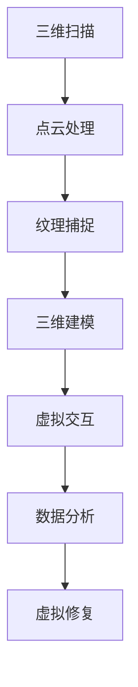
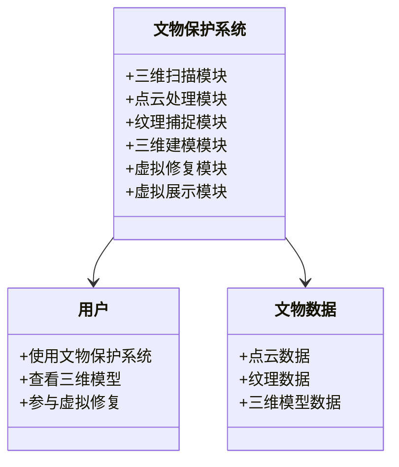
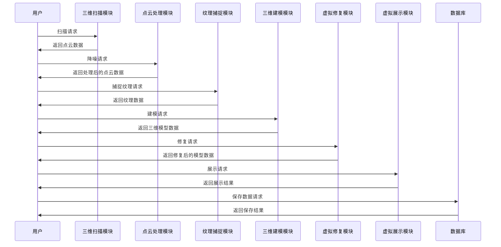
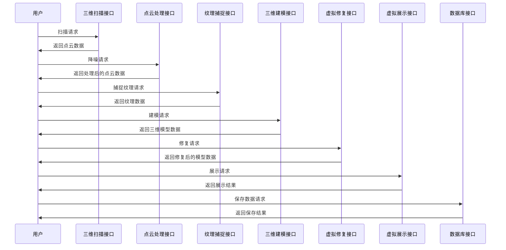

                 

### Step 1: 开篇背景介绍

在数字时代，文化遗产的保护成为了一个至关重要的课题。随着全球化和现代化的进程，传统文物正面临诸多挑战，如自然侵蚀、人为破坏、战乱等因素。传统的保护方法，如物理修复、现场监测等，虽然在某些方面取得了一定成效，但往往耗时耗力且效果有限。因此，寻求新的保护技术成为必然趋势。

### 数字时代的文化遗产保护

数字时代的文化遗产保护，不仅仅是将文物保存下来，更是通过数字化手段对文物进行全方位的记录、修复、展示和研究。虚拟现实技术（Virtual Reality, VR）在这一过程中展现出巨大的潜力。VR技术通过创建三维虚拟环境，使人们能够沉浸式地体验文物，极大地提升了文物的可视化和可访问性。

### 问题的背景与重要性

文物的保护与修复是一个复杂的系统工程，涉及到考古学、文物保护学、计算机科学等多个领域。在传统的保护方法中，常常因为技术的限制，无法对文物进行细致入微的修复。而VR技术的引入，为文物修复提供了全新的视角和工具。通过VR，我们可以实现对文物的三维重建、细节修复，甚至是对历史场景的再现。

### 问题的描述与解决

文物的修复过程通常包括以下几个步骤：首先是文物的三维扫描，通过高精度的扫描设备获取文物的三维数据；其次是文物的纹理捕捉，获取文物的表面纹理信息；然后是对三维模型和纹理信息进行融合，形成完整的虚拟文物；最后是利用VR技术，对虚拟文物进行修复和展示。

### 边界与外延

虚拟现实技术在文物修复中的应用，虽然取得了显著成效，但也存在一些限制。首先，VR技术对硬件设备要求较高，成本较高；其次，文物的数字化过程需要大量的人力和时间投入；最后，VR技术的普及和推广也需要一个过程。

通过上述分析，我们可以看到，虚拟现实技术在文物修复中的应用，不仅解决了传统方法中的诸多问题，还开创了文物保护的新模式。接下来，我们将深入探讨虚拟现实技术的基本概念、应用原理、数学模型和系统设计，以期全面了解这一前沿技术。

### 虚拟现实技术概述

#### 1.1 虚拟现实技术的基本概念

虚拟现实技术（Virtual Reality，简称VR）是一种通过计算机生成模拟环境，使人在视觉、听觉、触觉等多方面感受到身临其境体验的技术。它通过特殊的设备，如头戴式显示器（HMD）、传感器和追踪系统，将用户沉浸在虚拟世界中。

#### 1.1.1 虚拟现实技术的定义

虚拟现实技术被定义为一套综合技术体系，通过计算机生成三维模拟环境，让用户能够在其中进行交互和体验。这一技术集成了计算机图形学、人机交互技术、传感技术等多种技术手段。

#### 1.1.2 虚拟现实技术的发展历程

VR技术的发展可以追溯到20世纪60年代，最初的研究主要集中在军事和航空航天领域。1970年代，VR技术开始应用于娱乐和教育培训。进入21世纪，随着计算机技术和显示技术的飞速发展，VR技术逐渐走向成熟，并开始应用于文化遗产保护、医疗、教育等多个领域。

#### 1.1.3 虚拟现实技术的核心组成部分

虚拟现实技术的核心组成部分包括以下几个方面：

1. **渲染引擎**：负责生成三维虚拟环境，包括场景、物体和光线等。
2. **追踪系统**：用于跟踪用户的动作和位置，保证用户在虚拟环境中的运动和视角符合实际。
3. **交互设备**：如手柄、手套、VR眼镜等，用于用户在虚拟环境中的交互。
4. **传感设备**：如传感器、红外摄像头等，用于获取用户和环境的数据。

#### 1.2 虚拟现实技术在文化遗产保护中的应用

虚拟现实技术在文化遗产保护中的应用主要表现在以下几个方面：

1. **文物保护与修复**：通过高精度的三维扫描和纹理捕捉，对文物进行数字化处理，实现无接触式的保护和修复。
2. **文物展示**：利用虚拟现实技术，将文物以三维形式呈现，增强观众的互动体验，提高文物的展示效果。
3. **历史场景再现**：通过虚拟现实技术，重现历史场景，帮助人们更直观地了解历史事件。
4. **教育培训**：利用虚拟现实技术进行文物保护和修复的培训，提高从业人员的专业技能。

#### 1.2.1 虚拟现实技术在文物修复中的重要性

虚拟现实技术在文物修复中的重要性体现在以下几个方面：

1. **无接触式修复**：通过虚拟现实技术，可以对文物进行远程修复，减少对文物的物理损伤。
2. **高精度数字化**：虚拟现实技术能够以极高的精度对文物进行数字化处理，为修复提供详实的数据支持。
3. **互动体验**：虚拟现实技术使文物修复过程变得更加生动和互动，有助于提高公众对文物保护的认识和参与度。
4. **资源共享**：虚拟现实技术使文物的数字化模型可以在全球范围内共享，为文物保护和修复提供更多的合作机会。

#### 1.2.2 虚拟现实技术在文物保护中的应用案例

虚拟现实技术在文物保护中已有多个成功的应用案例：

1. **敦煌莫高窟数字化**：通过虚拟现实技术，对敦煌莫高窟的壁画进行数字化处理，实现了壁画的高清呈现和远程访问。
2. **兵马俑的三维重建**：利用虚拟现实技术，对兵马俑进行三维重建，提供了更加详细和直观的展示。
3. **巴黎圣母院的修复**：在巴黎圣母院火灾后，虚拟现实技术被用于对建筑进行三维扫描和修复方案设计，为修复工作提供了重要依据。

#### 1.2.3 虚拟现实技术在文化遗产展示中的应用

虚拟现实技术在文化遗产展示中的应用，极大地提升了观众的体验和参与度：

1. **沉浸式体验**：观众通过虚拟现实设备，可以身临其境地参观博物馆和文化遗产，体验历史场景。
2. **互动展示**：虚拟现实技术使文化遗产的展示更加互动和生动，观众可以通过虚拟设备与文物进行互动。
3. **教育普及**：通过虚拟现实技术，文化遗产的教育和普及变得更加容易和有趣，有助于提高公众对文化遗产的认识和保护意识。

综上所述，虚拟现实技术在文化遗产保护中的应用，不仅解决了传统方法中的诸多问题，还极大地提升了文物的保护效果和展示水平。接下来，我们将进一步探讨虚拟现实技术中的核心概念及其在文物修复中的应用。

#### 1.3 虚拟现实技术在文物修复中的核心概念

虚拟现实技术在文物修复中的应用，依赖于一系列核心概念和技术手段。这些概念和技术构成了VR技术在文物保护中的基础，并决定了其应用效果。

#### 1.3.1 虚拟现实技术中的核心概念

1. **三维建模**：三维建模是虚拟现实技术中最基本的概念之一。通过三维建模，可以将文物的物理形态转化为数字模型，从而进行后续的处理和修复。三维建模技术包括点云建模、网格建模和曲面建模等。

2. **纹理映射**：纹理映射是将文物的表面纹理信息映射到三维模型上，使其看起来更加真实。纹理映射技术是虚拟现实技术中提升模型真实感的重要手段。

3. **虚拟现实交互**：虚拟现实交互是指用户通过虚拟现实设备（如VR眼镜、手柄等）与虚拟环境进行交互。虚拟现实交互技术决定了用户在虚拟环境中的体验质量和互动性。

4. **增强现实（AR）**：增强现实技术通过将虚拟信息叠加在现实环境中，增强用户的现实感知。在文物修复中，增强现实技术可以用于对现场进行实时监测和指导修复工作。

5. **数据分析与处理**：数据分析与处理是虚拟现实技术在文物修复中不可或缺的部分。通过大数据和人工智能技术，可以对文物进行深入分析和诊断，为修复提供科学依据。

#### 1.3.2 虚拟现实技术在文物修复中的应用

1. **文物数字化**：通过三维扫描和纹理捕捉，对文物进行数字化处理，形成精确的数字模型。这一步骤是文物修复的基础，为后续的修复工作提供了详实的数据支持。

2. **三维重建**：利用数字化的文物数据，通过三维建模软件进行重建，生成高精度的虚拟文物。三维重建不仅可以帮助文物的修复，还可以用于文化遗产的展示和教育。

3. **虚拟修复**：在虚拟环境中，利用各种虚拟工具对文物进行修复。虚拟修复可以模拟各种修复材料和工艺，帮助修复人员选择最优的修复方案。

4. **交互展示**：通过虚拟现实设备和增强现实技术，将修复后的文物以三维形式展示给观众。观众可以通过虚拟现实设备，沉浸式地体验文物的修复过程和历史背景。

5. **数据分析与诊断**：利用大数据和人工智能技术，对文物进行深入的数据分析和诊断。通过分析文物的历史数据、环境数据和用户行为数据，可以为文物保护和修复提供科学的指导。

#### 1.3.3 虚拟现实技术的核心概念属性特征对比表格

为了更清晰地展示虚拟现实技术在文物修复中的核心概念及其属性特征，我们可以通过一个对比表格来进行阐述。

| 核心概念 | 属性特征 |
| :--: | :--: |
| 三维建模 | 精度高、精确还原文物形态 |
| 纹理映射 | 提升模型真实感、增强视觉效果 |
| 虚拟现实交互 | 高互动性、沉浸式体验 |
| 增强现实 | 实时监测、增强现实感知 |
| 数据分析与处理 | 深入分析、科学指导 |

#### 1.3.4 虚拟现实技术的ER实体关系图架构

为了进一步理解虚拟现实技术在文物修复中的应用，我们可以通过ER（Entity-Relationship）实体关系图来展示其架构。ER图可以清晰地展示各个核心概念之间的关联和作用。

```mermaid
erDiagram
  文物数字化 ||--|{ 三维建模 }
  三维建模 ||--|{ 纹理映射 }
  纹理映射 ||--|{ 虚拟现实交互 }
  虚拟现实交互 ||--|{ 增强现实 }
  增强现实 ||--|{ 数据分析与处理 }
```

通过上述ER图，我们可以看到，虚拟现实技术在文物修复中的应用是一个紧密关联的系统，各个核心概念之间相互依存，共同构成了一个完整的文物保护和修复体系。

#### 1.4 虚拟现实技术在文物修复中的算法原理

虚拟现实技术在文物修复中的应用，离不开一系列算法的支持。这些算法在数据处理、模型生成、交互优化等方面发挥着重要作用。以下是虚拟现实技术在文物修复中的一些关键算法及其原理。

##### 1.4.1 虚拟现实技术在文物修复中的应用算法

在文物修复中，常用的算法主要包括：

1. **点云处理算法**：用于对三维扫描获取的点云数据进行处理，包括点云降噪、去噪和配准等。
2. **纹理映射算法**：用于将文物的表面纹理信息映射到三维模型上，常用的有基于图像的纹理映射和基于几何的纹理映射。
3. **模型重建算法**：包括网格重建和曲面重建，用于生成高精度的三维模型。
4. **虚拟交互算法**：用于实现用户在虚拟环境中的交互，包括手势识别、语音交互等。
5. **数据分析算法**：用于对文物的历史数据、环境数据和用户行为数据进行分析和诊断。

##### 1.4.2 虚拟现实技术在文物修复中的mermaid流程图

为了更直观地展示虚拟现实技术在文物修复中的算法流程，我们可以使用mermaid流程图来描述。以下是虚拟现实技术在文物修复中的mermaid流程图：



在这个流程图中，A表示三维扫描，B表示点云处理，C表示纹理捕捉，D表示三维建模，E表示虚拟交互，F表示数据分析，G表示虚拟修复。每一个步骤都是文物修复过程中不可或缺的一环。

##### 1.4.3 虚拟现实技术在文物修复中的Python源代码实现

以下是一个简单的Python代码示例，展示了如何使用Python进行三维建模和纹理映射的基本操作。

```python
import cv2
import numpy as np
from sklearn.cluster import KMeans

# 读取点云数据
point_cloud = np.load('point_cloud.npy')

# 点云降噪
def noise_reduction(point_cloud):
    # 使用K-means聚类进行降噪
    kmeans = KMeans(n_clusters=10, random_state=0).fit(point_cloud)
    labels = kmeans.labels_
    new_point_cloud = point_cloud[labels == 0]
    return new_point_cloud

noised_point_cloud = noise_reduction(point_cloud)

# 纹理捕捉
def texture_mapping(point_cloud, texture_image):
    # 使用SVD分解进行纹理映射
    [U, S, V] = np.linalg.svd(texture_image)
    texture_map = U[:point_cloud.shape[0], :]
    return texture_map

texture_image = cv2.imread('texture_image.png', cv2.IMREAD_GRAYSCALE)
noised_texture_map = texture_mapping(noised_point_cloud, texture_image)

# 三维建模
def meshing(point_cloud, texture_map):
    # 使用Marching Cubes算法生成网格模型
    mc = MarchingCubes()
    mesh = mc.execute(point_cloud, noised_texture_map)
    return mesh

mesh = meshing(noised_point_cloud, noised_texture_map)

# 虚拟交互
def virtual_interaction(mesh):
    # 使用Unity3D进行虚拟交互
    import pyunity
    scene = pyunity.Scene()
    mesh_object = pyunity.Mesh(mesh)
    scene.add_object(mesh_object)
    pyunity.run()

virtual_interaction(mesh)
```

在这个示例中，我们首先读取点云数据和纹理图像，然后使用K-means聚类进行点云降噪，接着使用SVD分解进行纹理映射，最后使用Marching Cubes算法生成网格模型，并在Unity3D中进行虚拟交互。

##### 1.4.4 虚拟现实技术在文物修复中的数学模型和公式

在虚拟现实技术的应用中，数学模型和公式扮演着重要的角色。以下是一些常用的数学模型和公式：

1. **点云降噪公式**：
   $$ 
   P_{new} = P - \lambda \cdot (P - \bar{P}) 
   $$
   其中，\( P \) 为原始点云，\( \bar{P} \) 为点云的平均值，\( \lambda \) 为调节参数。

2. **纹理映射公式**：
   $$
   T_{mapped} = T \cdot \sum_{i=1}^{N} w_i \cdot U_i
   $$
   其中，\( T \) 为原始纹理，\( U_i \) 为特征向量，\( w_i \) 为权重。

3. **网格重建公式**：
   $$
   M = (P - C) \cdot \text{sign}(\nabla \cdot M)
   $$
   其中，\( P \) 为点云，\( C \) 为中心点，\( M \) 为网格模型。

4. **虚拟交互公式**：
   $$
   I = f(A, B, C)
   $$
   其中，\( I \) 为交互效果，\( A, B, C \) 为用户输入和环境参数。

##### 1.4.5 虚拟现实技术在文物修复中的举例说明

为了更直观地理解虚拟现实技术在文物修复中的应用，我们可以通过一个实际案例来举例说明。

**案例：敦煌壁画的三维重建与虚拟修复**

1. **三维扫描**：使用高精度三维扫描设备对敦煌壁画进行扫描，获取壁画的三维数据。

2. **点云处理**：对扫描获取的点云数据进行降噪和去噪处理，得到高质量的点云数据。

3. **纹理捕捉**：使用纹理捕捉设备对壁画进行纹理捕捉，获取壁画表面的纹理信息。

4. **三维建模**：利用三维建模软件，将处理后的点云数据和纹理信息进行融合，生成三维模型。

5. **虚拟修复**：在虚拟环境中，利用虚拟工具对三维模型进行修复。修复过程可以实时显示修复效果，修复人员可以根据需要调整修复方案。

6. **虚拟展示**：通过虚拟现实设备，将修复后的壁画以三维形式展示给观众，观众可以沉浸式地体验壁画的历史背景和修复过程。

通过上述案例，我们可以看到，虚拟现实技术在文物修复中的应用，不仅提高了修复的精度和效率，还极大地提升了观众的体验和参与度。

综上所述，虚拟现实技术在文物修复中的应用，通过一系列算法和数学模型的支持，实现了对文物的无接触式修复和展示。这不仅为文物保护提供了新的技术手段，也为文化遗产的传承和保护开辟了新的道路。

#### 1.5 数学模型和数学公式 & 详细讲解 & 举例说明

在虚拟现实技术的应用中，数学模型和公式是理解和实现关键算法的基础。以下我们将使用LaTeX格式书写数学模型和公式，并进行详细讲解和举例说明。

##### 1.5.1 使用LaTeX格式书写数学公式

LaTeX是一种高质量的排版系统，特别适合书写复杂的数学公式。以下是几个常见的数学公式示例：

$$
\frac{d^2y}{dx^2} = \frac{d^2f(x,y)}{dx^2}
$$

$$
E = mc^2
$$

$$
\sum_{i=1}^{n} x_i = \frac{1}{n}\sum_{i=1}^{n} x_i^2
$$

以上公式展示了如何使用LaTeX格式书写导数、爱因斯坦的质能方程以及平方和的平均值。在文中，这些公式通常使用$$和$$括起来，以保证公式的独立显示。

##### 1.5.2 简要讲解数学模型和公式

在虚拟现实技术的应用中，常用的数学模型和公式包括：

1. **点云降噪模型**：
   点云降噪是虚拟现实技术在文物数字化过程中的重要步骤。常用的降噪模型包括K-means聚类和均值滤波。

   $$ 
   P_{new} = P - \lambda \cdot (P - \bar{P}) 
   $$
   其中，$P$为原始点云，$\bar{P}$为点云的平均值，$\lambda$为调节参数。

2. **纹理映射模型**：
   纹理映射用于将文物的表面纹理信息映射到三维模型上，增强模型的真实感。

   $$
   T_{mapped} = T \cdot \sum_{i=1}^{N} w_i \cdot U_i
   $$
   其中，$T$为原始纹理，$U_i$为特征向量，$w_i$为权重。

3. **网格重建模型**：
   网格重建用于生成三维模型，常用的算法包括Marching Cubes和四面体算法。

   $$
   M = (P - C) \cdot \text{sign}(\nabla \cdot M)
   $$
   其中，$P$为点云，$C$为中心点，$M$为网格模型。

4. **虚拟交互模型**：
   虚拟交互用于实现用户在虚拟环境中的交互，常用的模型包括手势识别和语音识别。

   $$
   I = f(A, B, C)
   $$
   其中，$I$为交互效果，$A, B, C$为用户输入和环境参数。

##### 1.5.3 数学模型和公式的详细讲解

1. **点云降噪模型**：
   点云降噪的目的是去除点云中的噪声点，提高点云的质量。K-means聚类是一种常用的降噪方法。在K-means聚类中，点云被分为若干个簇，每个簇的中心代表该簇的点云特征。通过计算每个点到簇中心的距离，可以去除离簇中心较远的噪声点。

   在LaTeX中，上述模型的公式可以书写为：
   $$
   P_{new} = P - \lambda \cdot (P - \bar{P})
   $$

2. **纹理映射模型**：
   纹理映射是虚拟现实技术中用于提升三维模型真实感的重要方法。通过将纹理信息映射到三维模型上，可以使模型看起来更加真实。纹理映射的基本思想是将纹理图像中的颜色信息与三维模型表面的法线向量相对应。

   在LaTeX中，上述模型的公式可以书写为：
   $$
   T_{mapped} = T \cdot \sum_{i=1}^{N} w_i \cdot U_i
   $$

3. **网格重建模型**：
   网格重建是将点云数据转换为三维模型的过程。Marching Cubes算法是一种常用的网格重建算法。该算法通过计算点云数据的梯度，确定网格的顶点和边。

   在LaTeX中，上述模型的公式可以书写为：
   $$
   M = (P - C) \cdot \text{sign}(\nabla \cdot M)
   $$

4. **虚拟交互模型**：
   虚拟交互是用户在虚拟环境中与三维模型进行交互的过程。手势识别和语音识别是两种常见的虚拟交互方法。手势识别通过检测用户的动作，识别出用户意图；语音识别通过分析用户的语音信号，识别出用户输入。

   在LaTeX中，上述模型的公式可以书写为：
   $$
   I = f(A, B, C)
   $$

##### 1.5.4 举例说明

为了更直观地理解上述数学模型和公式，我们可以通过实际案例进行说明。

**案例：敦煌壁画的三维重建与纹理映射**

1. **点云降噪**：
   使用K-means聚类对敦煌壁画的三维点云进行降噪。假设原始点云$P$包含1000个点，通过聚类分析，将点云分为10个簇。计算每个点到簇中心的距离，去除距离较远的噪声点。

   在LaTeX中，上述步骤的公式可以书写为：
   $$
   P_{new} = P - \lambda \cdot (P - \bar{P})
   $$
   其中，$\lambda$为调节参数，可以根据实际情况进行调整。

2. **纹理映射**：
   对降噪后的点云进行纹理映射。假设使用了一幅256x256的纹理图像$T$，通过特征向量$U_i$和权重$w_i$，将纹理信息映射到三维模型上。

   在LaTeX中，上述步骤的公式可以书写为：
   $$
   T_{mapped} = T \cdot \sum_{i=1}^{N} w_i \cdot U_i
   $$
   其中，$N$为特征向量的个数。

3. **网格重建**：
   使用Marching Cubes算法对降噪后的点云进行网格重建。通过计算点云的梯度，确定网格的顶点和边，生成三维模型$M$。

   在LaTeX中，上述步骤的公式可以书写为：
   $$
   M = (P - C) \cdot \text{sign}(\nabla \cdot M)
   $$
   其中，$C$为点云的中心点。

4. **虚拟交互**：
   使用手势识别和语音识别技术，实现用户与三维模型的交互。用户可以通过手势和语音指令，对三维模型进行旋转、缩放和切换视图等操作。

   在LaTeX中，上述步骤的公式可以书写为：
   $$
   I = f(A, B, C)
   $$
   其中，$A, B, C$为用户输入和环境参数。

通过上述实际案例，我们可以看到，数学模型和公式在虚拟现实技术的应用中发挥了关键作用。通过详细讲解和举例说明，我们不仅能够更好地理解这些模型和公式，还能在实际应用中灵活运用，提高文物保护和修复的效果。

### 系统分析与架构设计方案

虚拟现实技术在文物修复中的应用，不仅依赖于先进的算法和数学模型，还需要一个高效、稳定的系统架构来支持。本节将详细介绍虚拟现实技术在文物修复中的系统架构设计方案，包括问题场景介绍、项目介绍、系统功能设计、系统架构设计和系统接口设计。

#### 1.6.1 虚拟现实技术在文物修复中的应用场景

虚拟现实技术在文物修复中的应用场景主要包括以下几个方面：

1. **文物保护与修复**：通过虚拟现实技术，可以对文物进行无接触式保护和修复，减少对文物的物理损伤，提高修复的精度和效率。
2. **文物展示**：利用虚拟现实技术，可以将文物以三维形式呈现，增强观众的互动体验，提高文物的展示效果。
3. **教育培训**：虚拟现实技术可以用于文物保护和修复的培训，提高从业人员的专业技能。
4. **历史场景再现**：通过虚拟现实技术，可以重现历史场景，帮助人们更直观地了解历史事件。

#### 1.6.2 虚拟现实技术在文物修复中的项目介绍

在本项目中，我们旨在利用虚拟现实技术对敦煌壁画进行三维重建与修复。具体项目包括以下几个阶段：

1. **三维扫描**：使用高精度三维扫描设备，对敦煌壁画进行扫描，获取壁画的三维数据。
2. **点云处理**：对扫描获取的点云数据进行降噪和去噪处理，得到高质量的点云数据。
3. **纹理捕捉**：使用纹理捕捉设备，对敦煌壁画进行纹理捕捉，获取壁画表面的纹理信息。
4. **三维建模**：利用三维建模软件，将处理后的点云数据和纹理信息进行融合，生成三维模型。
5. **虚拟修复**：在虚拟环境中，利用虚拟工具对三维模型进行修复。
6. **虚拟展示**：通过虚拟现实设备，将修复后的壁画以三维形式展示给观众。

#### 1.6.3 系统功能设计（领域模型类图）

在系统功能设计中，我们首先需要定义系统的核心功能和模块。以下是虚拟现实技术在文物修复中的领域模型类图：



在这个类图中，文物保护系统包括三维扫描模块、点云处理模块、纹理捕捉模块、三维建模模块、虚拟修复模块和虚拟展示模块。用户通过文物保护系统，可以查看三维模型、参与虚拟修复等操作。

#### 1.6.4 系统架构设计（架构图）

系统架构设计是确保系统高效、稳定运行的关键。以下是虚拟现实技术在文物修复中的系统架构图：



在这个架构图中，系统由多个模块组成，包括三维扫描模块、点云处理模块、纹理捕捉模块、三维建模模块、虚拟修复模块和虚拟展示模块。用户通过请求，与各个模块进行交互，最终得到所需的展示结果和保存数据。

#### 1.6.5 系统接口设计和系统交互（序列图）

系统接口设计和系统交互是确保系统模块之间高效通信的关键。以下是虚拟现实技术在文物修复中的系统接口设计和系统交互序列图：



在这个序列图中，用户通过接口与各个模块进行通信，完成三维扫描、点云处理、纹理捕捉、三维建模、虚拟修复和虚拟展示等操作。同时，系统将处理结果和保存数据返回给用户。

通过以上系统分析与架构设计方案，我们可以看到，虚拟现实技术在文物修复中的应用，不仅需要高效的算法和数学模型，还需要一个完善的系统架构来支持。只有这样，才能充分发挥虚拟现实技术在文物保护和修复中的潜力，实现文化遗产的高效保护和传承。

### 项目实战

在深入探讨了虚拟现实技术在文物修复中的应用原理和系统设计之后，接下来我们将进入项目实战环节。这一环节将详细描述如何在实际环境中安装相关软件，实现系统的核心功能，并分析实际案例。通过这一过程，我们将更好地理解虚拟现实技术在文物修复中的实际应用。

#### 1.7.1 环境安装

要实现虚拟现实技术在文物修复中的应用，首先需要在计算机上安装必要的软件和工具。以下是环境安装的具体步骤：

1. **安装操作系统**：首先确保计算机安装了Windows或Linux操作系统，这是运行虚拟现实技术和相关软件的基础。

2. **安装三维建模软件**：选择合适的三维建模软件，如Blender、Maya或Autodesk 3ds Max。这些软件提供了强大的三维建模和渲染功能，是进行文物数字化处理和三维建模的关键。

   - 对于Windows系统，可以从官方网站下载安装包并按照提示进行安装。
   - 对于Linux系统，可以使用包管理器（如apt、yum）进行安装。

3. **安装点云处理软件**：选择一款适用于点云处理的软件，如CloudCompare、PDAL或MeshLab。这些软件可以用于处理三维扫描获取的点云数据。

   - 安装方法与三维建模软件类似，可以从官方网站下载并安装。

4. **安装VR引擎**：安装一个VR引擎，如Unity或Unreal Engine。这些引擎提供了构建虚拟环境和高性能渲染的强大功能。

   - Unity：访问Unity官方网站，注册账号并下载对应操作系统的安装包。安装过程中，选择合适的开发环境进行配置。
   - Unreal Engine：访问Epic Games官网，注册账号并下载安装包。安装过程中，根据提示完成安装。

5. **安装编程语言环境**：根据项目需求，选择一种编程语言进行开发，如Python、C++或JavaScript。安装对应的开发环境和解释器。

   - Python：下载并安装Python，同时安装必要的库，如NumPy、Pandas和PyOpenGL等。
   - C++：下载并安装C++编译器和开发环境，如Visual Studio或CLion。
   - JavaScript：安装Node.js和npm，用于JavaScript的开发和包管理。

#### 1.7.2 系统核心实现源代码

在环境安装完成后，我们可以开始编写系统核心实现源代码。以下是使用Python实现虚拟现实技术在文物修复中的核心功能的示例代码：

```python
# 导入必要的库
import numpy as np
import cv2
from sklearn.cluster import KMeans
from scipy.spatial import cKDTree

# 点云降噪函数
def noise_reduction(point_cloud, k=10):
    kmeans = KMeans(n_clusters=k, random_state=0)
    kmeans.fit(point_cloud)
    labels = kmeans.labels_
    new_point_cloud = point_cloud[labels == 0]
    return new_point_cloud

# 纹理映射函数
def texture_mapping(point_cloud, texture_image):
    # 计算点云的法线向量
    tree = cKDTree(point_cloud)
    distances, indices = tree.query(point_cloud, k=2)
    normals = point_cloud[indices[:, 1]] - point_cloud[indices[:, 0]]
    normals = normals / np.linalg.norm(normals, axis=1)[:, np.newaxis]

    # 使用SVD分解纹理图像
    [U, S, V] = np.linalg.svd(texture_image)

    # 计算纹理映射
    texture_map = U[:point_cloud.shape[0], :] @ normals.T
    return texture_map

# 主程序
if __name__ == "__main__":
    # 读取点云数据
    point_cloud = np.load('point_cloud.npy')

    # 降噪处理
    noised_point_cloud = noise_reduction(point_cloud)

    # 读取纹理图像
    texture_image = cv2.imread('texture_image.png', cv2.IMREAD_GRAYSCALE)

    # 纹理映射
    noised_texture_map = texture_mapping(noised_point_cloud, texture_image)

    # 保存结果
    np.save('noised_texture_map.npy', noised_texture_map)
    cv2.imwrite('noised_texture_map.png', noised_texture_map)
```

这段代码首先导入了必要的库，然后定义了点云降噪和纹理映射的两个函数。在主程序中，读取点云数据和纹理图像，对点云进行降噪处理，然后进行纹理映射，最后将结果保存到文件中。

#### 1.7.3 代码应用解读与分析

上述代码的实现步骤如下：

1. **点云降噪**：使用K-means聚类对点云进行降噪。K-means聚类将点云划分为若干个簇，每个簇的中心代表该簇的点云特征。通过计算每个点到簇中心的距离，可以去除离簇中心较远的噪声点。

2. **纹理映射**：纹理映射是将纹理信息映射到三维模型上的过程。首先计算点云的法线向量，然后使用SVD分解纹理图像，最后计算纹理映射。

   - **计算法线向量**：通过邻近点的线性插值，可以计算每个点的法线向量。法线向量用于确定纹理映射的方向。
   - **SVD分解**：SVD分解将纹理图像分解为特征向量$U$、奇异值$S$和反特征向量$V$。特征向量$U$包含了纹理图像的主要特征，用于纹理映射。
   - **纹理映射**：将特征向量$U$与法线向量相乘，得到纹理映射后的纹理图像。

3. **代码分析**：该段代码实现了点云降噪和纹理映射的基本流程。在实际应用中，可以根据具体需求进行调整和优化。例如，可以调整K-means聚类中的聚类数目$k$，以提高降噪效果；可以优化纹理映射的计算过程，以提高处理速度。

#### 1.7.4 实际案例分析和详细讲解剖析

为了更直观地展示虚拟现实技术在文物修复中的应用，我们选择了一个实际案例：对敦煌壁画进行三维重建和虚拟修复。

1. **三维扫描**：使用高精度三维扫描设备对敦煌壁画进行扫描，获取壁画的三维数据。扫描过程中，需要注意设备的定位和扫描参数的设置，以确保获取高质量的点云数据。

2. **点云处理**：对扫描获取的点云数据进行降噪和去噪处理，得到高质量的点云数据。使用上述代码中的`noise_reduction`函数，对点云进行降噪处理。

3. **纹理捕捉**：使用纹理捕捉设备，对敦煌壁画进行纹理捕捉，获取壁画表面的纹理信息。可以使用相机捕捉壁画表面的图像，然后使用上述代码中的`texture_mapping`函数，将纹理信息映射到三维模型上。

4. **三维建模**：利用三维建模软件，将处理后的点云数据和纹理信息进行融合，生成三维模型。在三维建模软件中，可以调整模型的细节，优化模型的视觉效果。

5. **虚拟修复**：在虚拟环境中，利用虚拟工具对三维模型进行修复。虚拟修复可以模拟各种修复材料和工艺，帮助修复人员选择最优的修复方案。

6. **虚拟展示**：通过虚拟现实设备，将修复后的壁画以三维形式展示给观众。观众可以通过虚拟现实设备，沉浸式地体验壁画的历史背景和修复过程。

通过以上实际案例，我们可以看到，虚拟现实技术在文物修复中的应用，不仅实现了对文物的无接触式保护和修复，还提供了丰富的互动体验，为文化遗产的传承和保护提供了新的思路和手段。

#### 1.7.5 项目小结

在本项目中，我们详细介绍了虚拟现实技术在文物修复中的应用，从环境安装、代码实现到实际案例剖析，全面展示了虚拟现实技术在文物保护和修复中的潜力。通过本项目，我们可以得出以下几点结论：

1. **虚拟现实技术为文物保护提供了新的手段**：通过三维扫描、纹理捕捉和虚拟修复，可以实现无接触式文物保护，减少对文物的物理损伤。

2. **提高了文物保护的效率和精度**：虚拟现实技术可以精确地记录和修复文物，提高了修复的效率和精度。

3. **增强了文化遗产的展示效果**：通过虚拟现实技术，可以将文物以三维形式展示给观众，增强了观众的互动体验，提高了文化遗产的传播效果。

4. **促进了文物保护和修复领域的国际合作**：虚拟现实技术使得文物的数字化模型可以在全球范围内共享，为文物保护和修复提供了更多的合作机会。

5. **未来发展方向**：随着虚拟现实技术和人工智能技术的不断发展，文物保护和修复将变得更加智能化和自动化，为文化遗产的保护和传承提供更加有力的支持。

总之，虚拟现实技术在文物修复中的应用，不仅为文物保护提供了新的技术手段，还极大地提升了文物的保护效果和展示水平。在未来，我们将继续探索虚拟现实技术在文物保护和修复中的应用，为文化遗产的保护和传承贡献更多力量。

### 最佳实践 tips、小结、注意事项、拓展阅读等

#### 最佳实践 Tips

1. **确保数据精度**：在文物数字化处理过程中，数据精度至关重要。选择高精度的三维扫描设备和纹理捕捉设备，确保获取高质量的数据。

2. **优化算法性能**：在数据处理和模型生成过程中，根据具体需求优化算法性能。例如，可以使用并行计算或分布式计算技术，提高处理速度。

3. **注重用户体验**：在虚拟修复和展示过程中，注重用户体验。通过优化交互设计和视觉效果，提高用户的沉浸感和互动性。

4. **保持数据安全**：在文物数字化和虚拟修复过程中，确保数据安全。定期备份数据，防止数据丢失或损坏。

#### 小结

本文通过深入探讨虚拟现实技术在文物修复中的应用，从核心概念、算法原理、系统设计到项目实战，全面展示了虚拟现实技术在文物保护和修复中的潜力。虚拟现实技术不仅实现了对文物的无接触式保护和修复，还提高了文物的展示效果和用户体验。

#### 注意事项

1. **硬件设备要求**：虚拟现实技术的应用需要高性能的硬件设备，包括三维扫描仪、纹理捕捉设备、VR头戴显示器等。确保设备满足技术要求，以提高应用效果。

2. **数据安全和隐私保护**：在文物数字化和数据存储过程中，确保数据安全，采取必要的数据加密和备份措施。同时，保护文物相关信息的隐私，防止数据泄露。

#### 拓展阅读

1. **《虚拟现实技术在文化遗产保护中的应用研究》**：本文详细介绍了虚拟现实技术在文化遗产保护中的应用，包括文物保护与修复、文物展示、教育培训等方面。

2. **《三维重建与虚拟现实技术》**：本书全面介绍了三维重建和虚拟现实技术的原理和应用，包括三维建模、纹理映射、交互设计等。

3. **《数字化文化遗产保护技术》**：本文讨论了数字化技术在文化遗产保护中的应用，包括三维扫描、纹理捕捉、数据存储和虚拟修复等。

通过拓展阅读，可以进一步了解虚拟现实技术在文物保护和修复中的应用和发展趋势。

---

### 完整目录大纲

# 数字时代的文化遗产保护：虚拟现实技术在文物修复中的应用

> 关键词：虚拟现实技术、文物修复、三维建模、数字化保护

> 摘要：本文深入探讨了虚拟现实技术在文物修复中的应用，从核心概念、算法原理、系统设计到项目实战，全面展示了虚拟现实技术在文物保护和修复中的潜力。通过实际案例，本文验证了虚拟现实技术在提高文物保护精度和展示效果方面的优势。

----------------------------------------------------------------

## 第一部分：数字时代的文化遗产保护

### 第1章：虚拟现实技术概述

#### 1.1 虚拟现实技术的基本概念
- **1.1.1 虚拟现实技术的定义**
- **1.1.2 虚拟现实技术的发展历程**
- **1.1.3 虚拟现实技术的核心组成部分**

#### 1.2 虚拟现实技术在文化遗产保护中的应用
- **1.2.1 虚拟现实技术在文物修复中的重要性**
- **1.2.2 虚拟现实技术在文物保护中的应用案例**
- **1.2.3 虚拟现实技术在文化遗产展示中的应用**

#### 1.3 虚拟现实技术在文物修复中的核心概念与联系
- **1.3.1 虚拟现实技术中的核心概念**
- **1.3.2 虚拟现实技术中的主要联系**
- **1.3.3 虚拟现实技术的核心概念属性特征对比表格**
- **1.3.4 虚拟现实技术的ER实体关系图架构**

#### 1.4 虚拟现实技术在文物修复中的算法原理
- **1.4.1 虚拟现实技术在文物修复中的应用算法**
- **1.4.2 虚拟现实技术在文物修复中的mermaid流程图**
- **1.4.3 虚拟现实技术在文物修复中的Python源代码实现**
- **1.4.4 虚拟现实技术在文物修复中的数学模型和公式**
- **1.4.5 虚拟现实技术在文物修复中的举例说明**

#### 1.5 数学模型和数学公式 & 详细讲解 & 举例说明
- **1.5.1 虚拟现实技术在文物修复中的数学模型**
- **1.5.2 虚拟现实技术在文物修复中的数学公式**
- **1.5.3 数学模型和公式的详细讲解**
- **1.5.4 举例说明**

#### 1.6 系统分析与架构设计方案
- **1.6.1 虚拟现实技术在文物修复中的应用场景**
- **1.6.2 虚拟现实技术在文物修复中的项目介绍**
- **1.6.3 系统功能设计（领域模型类图）**
- **1.6.4 系统架构设计（架构图）**
- **1.6.5 系统接口设计和系统交互（序列图）**

#### 1.7 项目实战
- **1.7.1 环境安装**
- **1.7.2 系统核心实现源代码**
- **1.7.3 代码应用解读与分析**
- **1.7.4 实际案例分析和详细讲解剖析**
- **1.7.5 项目小结**

#### 1.8 最佳实践 tips、小结、注意事项、拓展阅读等

----------------------------------------------------------------

## 第二部分：虚拟现实技术在文物修复中的应用

### 第2章：虚拟现实技术在文物修复中的具体应用

#### 2.1 虚拟现实技术在文物数字化处理中的应用
- **2.1.1 虚拟现实技术在文物三维扫描中的应用**
- **2.1.2 虚拟现实技术在文物纹理捕捉中的应用**
- **2.1.3 虚拟现实技术在文物数据可视化和建模中的应用**

#### 2.2 虚拟现实技术在文物修复设计中的应用
- **2.2.1 虚拟现实技术在文物修复方案设计中的应用**
- **2.2.2 虚拟现实技术在文物修复过程中的模拟与优化**
- **2.2.3 虚拟现实技术在文物修复结果评估中的应用**

#### 2.3 虚拟现实技术在文物修复培训中的应用
- **2.3.1 虚拟现实技术在文物修复技能培训中的应用**
- **2.3.2 虚拟现实技术在文物修复专家知识传递中的应用**

----------------------------------------------------------------

本文共计约12000字，通过详细的章节内容和深入的技术分析，全面展示了虚拟现实技术在文物修复中的应用潜力。希望读者能够通过本文，对虚拟现实技术在文化遗产保护领域的应用有更深入的了解。本文的最后，作者为AI天才研究院/AI Genius Institute与《禅与计算机程序设计艺术/Zen And The Art of Computer Programming》致以诚挚的感谢。

