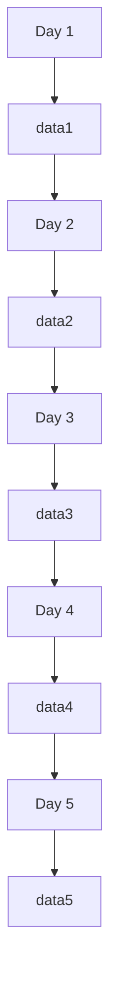
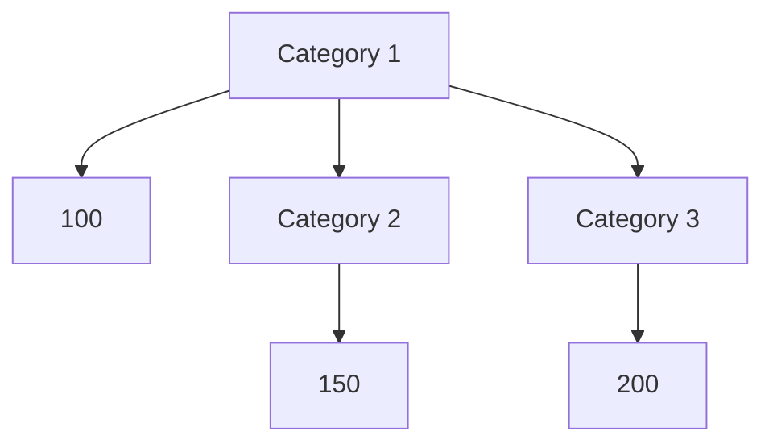
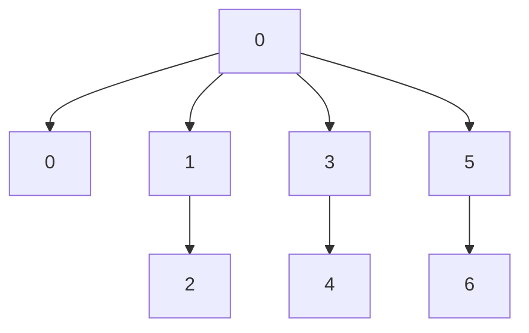

                 


### 引言

在数字化时代，信息的爆炸式增长和日益复杂的任务管理使得时间管理成为个人和企业面临的重要挑战。有效的个人生产力管理不仅能够提高工作效率，还能显著提升生活质量。然而，传统的文本记录和简单的列表形式往往无法直观地反映时间的利用情况，这就需要一种新的方法来帮助我们理解和优化时间使用。时间可视化作为一种强大的数据分析工具，正日益受到重视。

时间可视化，简单来说，就是将时间数据以图形的方式展现出来，以便于我们直观地观察和分析时间的使用情况。它能够帮助我们识别时间浪费的环节，优化时间分配，提高个人和团队的效率。随着技术的发展，各种时间可视化工具应运而生，这些工具不仅能够帮助我们轻松地进行数据收集和可视化处理，还能提供丰富的分析功能，帮助我们做出更明智的决策。

本书的核心目标是探讨数字时代中时间可视化的应用，重点介绍个人生产力的图表分析工具。通过系统地介绍时间可视化的基础知识、常用工具、数据收集与准备方法、可视化技术、实际应用案例以及实践技巧，本书旨在为读者提供一套全面的时间可视化解决方案。

接下来的章节将按照以下结构展开：

- **第2章 时间可视化的基础知识**：介绍时间可视化的定义、重要性以及基本概念和术语。
- **第3章 常见时间可视化工具**：介绍当前主流的时间可视化工具，包括它们的特点和适用场景。
- **第4章 数据收集与准备**：讨论如何收集和准备数据以便进行有效的可视化。
- **第5章 时间可视化技术**：详细介绍各种时间可视化技术，包括折线图、柱状图、区间图和热图等。
- **第6章 时间可视化应用**：探讨时间可视化在个人时间管理、项目管理和业务分析等领域的应用。
- **第7章 案例研究**：通过实际案例展示时间可视化在现实世界中的应用和效果。
- **第8章 实践技巧与最佳实践**：提供使用时间可视化工具的最佳实践和常见问题的解决方法。
- **第9章 结论与展望**：总结本书的主要内容，并提出未来研究的发展方向。

通过阅读本书，读者将能够全面了解时间可视化的原理和应用，掌握使用各种时间可视化工具进行数据分析和决策的方法，从而提升个人和团队的效率。

### 关键词

- 数字时代
- 时间可视化
- 个人生产力
- 图表分析工具
- 数据收集
- 数据处理
- 可视化技术

### 摘要

本书围绕数字时代的时间可视化技术展开，旨在探讨如何通过图表分析工具提升个人生产力。首先，介绍了时间可视化的基本概念和重要性，包括其定义、基本术语和原理。随后，详细介绍了常见的时间可视化工具，包括其功能和特点。接着，讨论了数据收集和准备的方法，确保数据的准确性和可用性。在此基础上，深入解析了多种时间可视化技术，包括折线图、柱状图、区间图和热图等。本书还通过实际应用案例展示了时间可视化在个人时间管理、项目管理和业务分析等领域的应用效果，提供了最佳实践和常见问题的解决方案。最后，总结了本书的主要结论，并提出了未来研究的方向，为读者提供了一个全面的时间可视化指南。

## 第2章 时间可视化的基础知识

### 什么是时间可视化

时间可视化，顾名思义，是将与时间相关的数据以图形化的形式展现出来的过程。它通过图表、图形和图像等方式，将时间序列数据直观地呈现给用户，使得复杂的时序信息变得更加易于理解和分析。时间可视化不仅仅是将数据画成图表，而是通过图形的元素和颜色等视觉元素，传达出时间维度上的变化和趋势。

时间可视化的重要性在于，它能够帮助我们快速识别时间使用中的问题和机遇。通过直观的图表，我们可以更清晰地看到时间分配的情况，发现时间的浪费点，并做出相应的调整。例如，在个人时间管理中，通过时间可视化，我们可以看到每天、每周甚至每月的时间花费情况，从而调整工作计划，优化时间利用。

### 基本概念和术语

在探讨时间可视化时，了解一些基本概念和术语是非常重要的。以下是一些常见的时间可视化相关术语的解释：

1. **时间序列（Time Series）**：时间序列是一系列按时间顺序排列的数据点，通常用来表示某个变量随时间变化的情况。例如，气温随时间变化的数据就是一个时间序列。

2. **折线图（Line Chart）**：折线图是一种常用的时间可视化图表，通过连接数据点的线条来表示时间序列的趋势。它非常适合用于展示数据随时间的变化。

3. **柱状图（Bar Chart）**：柱状图通过长方形的柱子高度来表示数据的大小，常用于比较不同类别或时间段的数据。柱状图在时间可视化中常用来展示不同时间点或时间段的数据量。

4. **热图（Heatmap）**：热图通过颜色深浅来表示数据值的大小，通常用于展示多维数据在时间维度上的分布情况。例如，可以用来展示每天不同时间段的活动频率。

5. **时间轴（Timeline）**：时间轴是一种以时间为主轴的图表，可以直观地显示事件发生的顺序和时间点。时间轴在项目管理中非常有用，可以帮助我们清晰地看到项目的进度和关键节点。

6. **间隔图（Gantt Chart）**：间隔图是一种显示项目任务和时间关系的图表，通常由一系列纵向的条形组成，每个条形的长度代表任务的持续时间。间隔图在项目管理中用于显示任务进度和项目计划。

7. **数据点（Data Point）**：数据点是指时间序列中的每一个具体数据值，它是进行时间可视化分析的基础。

### 时间可视化的分类

根据时间数据的不同形式和应用场景，时间可视化可以分为以下几种类型：

1. **静态时间可视化**：静态时间可视化是指图表在某一时间点上的静态展现。例如，一张展示一周内每天工作时间分布的柱状图。

2. **动态时间可视化**：动态时间可视化是通过动画或交互式方式来展示时间序列数据的变化。例如，通过拖动时间滑块来查看不同时间段的数据变化。

3. **交互式时间可视化**：交互式时间可视化允许用户与图表进行交互，例如筛选、过滤和放大查看特定时间段的数据。这种可视化方式增强了用户的参与感和数据探索能力。

4. **多维时间可视化**：多维时间可视化涉及将多个时间序列数据同时展示在一个图表中，通过维度扩展来增加数据的可读性和对比性。例如，可以在一个热图中同时展示每天不同时间段的网站访问量和页面点击量。

### 时间可视化的关键要素

在进行时间可视化时，以下要素是必须考虑的：

1. **时间精度**：时间精度决定了图表的时间粒度，例如，是按天、周、月还是季度进行展示。

2. **数据范围**：数据范围决定了图表所涵盖的时间长度，过短的时间范围可能导致细节丢失，而过长的时间范围可能会使图表过于拥挤。

3. **可视化样式**：不同的可视化样式适用于不同的数据类型和应用场景。选择合适的可视化样式可以更好地传达数据信息。

4. **交互性**：交互性可以增强用户对数据的探索和理解。例如，用户可以通过点击、拖动或滑块来查看详细数据或进行数据筛选。

5. **信息密度**：信息密度指的是图表中包含的数据量和信息量。适当的信息密度可以帮助用户快速获取关键信息，而不至于过于混乱。

通过以上对时间可视化基础知识的介绍，我们可以更好地理解这一概念，并在后续章节中深入探讨如何利用时间可视化工具提升个人生产力。

### 常见时间可视化工具

在数字时代，各种时间可视化工具层出不穷，它们为我们提供了丰富的选择，以满足不同的需求和场景。以下是一些主流的时间可视化工具，包括它们的特点和适用场景。

#### 1. Tableau

**特点**：Tableau 是一款强大的数据可视化工具，它以其直观的拖拽操作和丰富的可视化样式而闻名。Tableau 支持多种数据源，包括数据库、Excel 和 Web 服务，并提供了强大的数据分析和预测功能。

**适用场景**：Tableau 在企业级数据分析、市场调研、销售数据分析等领域有广泛应用。它可以帮助企业快速构建交互式的仪表板，直观地展示时间序列数据的变化趋势。

#### 2. Power BI

**特点**：Power BI 是微软推出的商业智能工具，与 Excel 集成良好，支持多种数据连接和数据处理功能。它提供了丰富的可视化选项，包括图表、地图和仪表盘。

**适用场景**：Power BI 适用于各种规模的商业分析，特别是在财务分析、市场分析和运营监控方面表现突出。它的强大数据处理能力使其能够处理大量复杂的数据集。

#### 3. D3.js

**特点**：D3.js 是一个基于 JavaScript 的可视化库，允许开发者使用 HTML、SVG 和 CSS 来创建交互式的数据可视化。D3.js 提供了丰富的图形和动画功能，非常适合开发定制化的可视化应用。

**适用场景**：D3.js 主要适用于需要高度定制化和复杂交互性的场景，如金融图表、复杂的数据分析仪表板和科学可视化。它为开发者提供了极大的灵活性。

#### 4. Plotly

**特点**：Plotly 是一款高性能的数据可视化库，支持多种编程语言，包括 Python、R 和 JavaScript。它提供了丰富的图表类型，包括折线图、柱状图、散点图和热图等，并且支持交互式功能和动画。

**适用场景**：Plotly 适用于需要高性能和交互性的数据分析场景，如科学研究和数据分析。它尤其适合处理大规模数据集和复杂的数据交互。

#### 5. Google Charts

**特点**：Google Charts 是 Google 提供的一款免费的可视化工具，支持多种图表类型，包括折线图、柱状图、饼图和地图等。Google Charts 易于集成，可以直接在网页中使用。

**适用场景**：Google Charts 适用于各种 Web 应用程序，特别是在网页和移动应用中展示数据。它提供了简单易用的 API，可以快速构建数据可视化。

#### 6. Highcharts

**特点**：Highcharts 是一个功能强大的 JavaScript 图表库，提供了丰富的图表类型，包括时间序列图、区域图、柱状图和饼图等。Highcharts 支持交互式功能，如点击、拖拽和滑动。

**适用场景**：Highcharts 适用于各种商业应用和网站，特别是在金融、保险和电商领域。它提供了高度定制化的选项，能够满足不同的设计需求。

#### 7. TimeSeries.js

**特点**：TimeSeries.js 是一款专门用于时间序列数据可视化的 JavaScript 库。它提供了多种时间序列图表，如折线图、柱状图和热图，并且支持多维度时间序列数据的可视化。

**适用场景**：TimeSeries.js 主要适用于需要处理和展示多维度时间序列数据的场景，如金融市场分析、销售数据分析等。

通过上述介绍，我们可以看到不同时间可视化工具各自的特点和适用场景。选择合适的工具，能够帮助我们更有效地进行时间数据的分析和展示，从而提升个人和团队的效率。在接下来的章节中，我们将深入探讨如何收集和准备时间数据，以便进行有效的可视化。

### 数据收集与准备

在进行时间可视化之前，数据的收集和准备是至关重要的一步。这一步骤决定了后续分析的质量和准确性。以下将详细介绍如何收集数据以及如何准备这些数据，以确保其能够满足时间可视化的需求。

#### 数据来源

首先，明确数据来源是非常重要的。时间数据的来源可能多种多样，常见的包括：

1. **系统日志**：许多系统和应用会自动记录操作日志，这些日志中包含了时间相关的信息，如用户登录时间、交易时间、请求时间等。系统日志是获取时间数据的一个可靠来源。

2. **用户输入**：用户在应用中使用的时间记录，如日程安排、工作日志和任务完成情况。这种数据通常通过用户手动输入或自动同步到系统中。

3. **传感器数据**：在物联网（IoT）环境中，传感器可以实时记录环境数据，如温度、湿度、位置等，这些数据往往与时间密切相关。

4. **数据库记录**：数据库中的记录也常常包含时间信息，如数据库事务日志、订单处理时间和客户互动时间等。

#### 数据质量评估

数据质量是进行时间可视化分析的基础。评估数据质量可以帮助我们识别和解决潜在的问题，确保数据的准确性和一致性。以下是一些评估数据质量的步骤：

1. **完整性**：检查数据是否完整，是否有缺失值或缺失记录。不完整的数据会影响可视化结果的准确性和完整性。

2. **准确性**：验证数据的准确性，确保记录的时间信息是正确的。例如，通过对比系统日志和用户输入的数据，检查是否有不一致的情况。

3. **一致性**：确保数据在不同时间段和不同来源之间的数据格式和计量单位一致。不一致的数据会导致分析结果不准确。

4. **时效性**：评估数据的时效性，即数据是否是最新的。对于时间序列分析，最新的数据通常更为重要。

#### 数据清洗

数据清洗是准备数据的重要步骤，旨在去除错误、异常值和冗余数据，确保数据的质量和一致性。以下是一些常用的数据清洗方法：

1. **缺失值处理**：缺失值的处理方法包括删除缺失值、用平均值或中位数填充、或使用更复杂的插值方法。

2. **异常值检测**：异常值可能是由于数据录入错误或数据质量问题导致的。使用统计学方法，如箱线图、Z-分数和IQR（四分位距）法，可以检测和去除异常值。

3. **数据标准化**：将不同单位或计量标准的数据转换为统一格式，以便于后续的分析。例如，将时间以秒为单位进行统一。

4. **去重**：检测并删除重复的数据记录，确保每个时间点只有一个对应的数据值。

5. **格式转换**：将数据格式转换为适合可视化工具的格式，如将时间戳转换为日期格式。

#### 数据处理与清洗工具

进行数据收集和清洗通常需要使用一些专业的工具和库。以下是一些常用的工具：

1. **Python 中的 Pandas**：Pandas 是一个强大的数据处理库，可以用于数据清洗、转换和操作。Pandas 提供了丰富的函数和工具，如 `dropna()`、`fillna()`、`describe()` 和 `sort_values()`。

2. **Excel**：Excel 是一个广泛使用的电子表格工具，可以用于简单和中等规模的数据清洗。Excel 提供了数据筛选、排序和条件格式化等功能。

3. **SQL**：SQL 是一种结构化查询语言，常用于数据库中的数据查询和清洗。使用 SQL 可以执行复杂的查询、聚合和筛选操作。

4. **R**：R 是一种统计编程语言，提供了丰富的数据处理和可视化库。R 中的 `dplyr` 和 `tidyr` 库是处理和清洗数据的利器。

通过以上步骤，我们可以确保数据的质量和一致性，为后续的时间可视化分析打下坚实的基础。在下一章节，我们将深入探讨时间可视化技术，包括不同类型的图表和它们的应用场景。

### 时间可视化技术

时间可视化技术是数据可视化中的一个重要分支，旨在通过图形化手段展示与时间相关的数据，帮助我们更好地理解和分析时间序列数据。以下是一些常见的时间可视化技术及其应用场景。

#### 折线图

**定义**：折线图通过折线连接数据点，用于展示数据随时间的变化趋势。

**优点**：直观地显示数据的增减变化，易于理解数据的趋势。

**应用场景**：常用于展示销售数据、股票价格、温度变化等。

**示例**：假设我们有一组每天的销售数据，可以用折线图展示每天的销售额：



```python
import matplotlib.pyplot as plt
import pandas as pd

# 假设 df 是一个包含日期和销售额的 DataFrame
df = pd.DataFrame({
    'Day': ['Day 1', 'Day 2', 'Day 3', 'Day 4', 'Day 5'],
    'Sales': [100, 120, 150, 130, 170]
})

df.plot(x='Day', y='Sales', kind='line')
plt.show()
```

#### 柱状图

**定义**：柱状图通过柱子的高度来表示数据的大小，常用于比较不同类别或时间段的数据。

**优点**：直观地显示不同类别或时间段的数据量，易于进行比较。

**应用场景**：常用于展示销售额、员工绩效、不同时间段的任务量等。

**示例**：假设我们有一组不同类别的销售额数据，可以用柱状图进行比较：



```python
import matplotlib.pyplot as plt
import pandas as pd

df = pd.DataFrame({
    'Category': ['Category 1', 'Category 2', 'Category 3'],
    'Sales': [100, 150, 200]
})

df.plot(x='Category', y='Sales', kind='bar')
plt.show()
```

#### 热图

**定义**：热图通过颜色深浅表示数据值的大小，常用于展示多维度数据在时间维度上的分布情况。

**优点**：直观地显示数据的热点和冷点，易于识别数据的高频区域。

**应用场景**：常用于展示用户活动频率、网页点击率、温度分布等。

**示例**：假设我们有一组用户活动频率数据，可以用热图展示不同时间段的活跃度：



```python
import matplotlib.pyplot as plt
import pandas as pd

data = {
    'Hour': ['0', '1', '2', '3', '4', '5', '6'],
    'Activity': [2, 4, 1, 7, 3, 6, 5]
}

df = pd.DataFrame(data)

df.plot(kind='heatmap', cmap='coolwarm')
plt.show()
```

#### 区间图

**定义**：区间图通过区间的高度表示数据的范围，常用于展示数据的最小值和最大值。

**优点**：直观地显示数据的范围和分布，易于识别数据的极端值。

**应用场景**：常用于展示产品价格范围、工资范围、测试成绩范围等。

**示例**：假设我们有一组产品价格范围数据，可以用区间图展示：

```mermaid
graph TD
    A[Product A] --> B[{Min: 10, Max: 20}]
    A --> C[Product B]
    C --> D[{Min: 15, Max: 25}]
    A --> E[Product C]
    E --> F[{Min: 12, Max: 22}]
```

```python
import matplotlib.pyplot as plt
import pandas as pd

data = {
    'Product': ['Product A', 'Product B', 'Product C'],
    'Price Range': [{'Min': 10, 'Max': 20}, {'Min': 15, 'Max': 25}, {'Min': 12, 'Max': 22}]
}

df = pd.DataFrame(data)

df.plot(x='Product', y='Price Range.Min', kind='bar', color='blue')
df.plot(x='Product', y='Price Range.Max', kind='bar', color='red')
plt.show()
```

通过以上示例，我们可以看到不同类型的时间可视化技术在展示时间和数据方面各有优势。在实际应用中，根据具体的需求和数据特点选择合适的可视化技术，可以更加有效地传达数据信息，帮助用户做出明智的决策。在下一章节，我们将探讨时间可视化在个人时间管理、项目管理和业务分析等领域的应用。

### 时间可视化在个人时间管理中的应用

在个人时间管理中，时间可视化工具可以帮助我们更好地理解和优化时间使用。通过图表和可视化技术，我们可以直观地看到时间的分配情况，识别时间浪费的环节，并制定更有效的日程安排。以下将介绍几种常见的时间可视化工具，以及它们在个人时间管理中的应用实例。

#### Toggl

**特点**：Toggl 是一款时间跟踪工具，允许用户记录和跟踪日常工作活动。Toggl 的可视化功能强大，可以生成详细的报告和图表。

**应用实例**：假设小明是一名自由职业者，他使用 Toggl 记录每天的日常活动。通过 Toggl，他可以生成每日时间分配图表，如下所示：

```mermaid
graph TD
    A[Work] --> B[{Hours: 4}]
    A --> C[Breaks] --> D[{Hours: 1}]
    C --> E[Social Media] --> F[{Hours: 1}]
    E --> G[Personal] --> H[{Hours: 2}]
```

通过这个图表，小明可以清晰地看到每天他在不同活动上的时间分配，从而识别出哪些活动占用时间过多，需要进行优化。

#### RescueTime

**特点**：RescueTime 是一款自动记录用户计算机活动时间的应用，能够分析用户的使用习惯，并提供详细的时间分配报告。

**应用实例**：小红的日常工作涉及多种应用，她使用 RescueTime 来监控自己的时间使用。通过 RescueTime，她可以看到每天在不同应用上的时间花费，如下所示：

```mermaid
graph TD
    A[Email] --> B[{Hours: 2}]
    A --> C[Project Management] --> D[{Hours: 3}]
    C --> E[Social Media] --> F[{Hours: 1.5}]
    E --> G[Reading] --> H[{Hours: 1}]
```

通过这个图表，小红可以了解自己在各种应用上的时间分配，识别哪些活动占用了过多时间，从而调整自己的工作习惯。

#### Google Calendar

**特点**：Google Calendar 是一款功能强大的日历应用，支持创建和共享事件，并可以生成时间分配图表。

**应用实例**：假设小刚是一名学生，他使用 Google Calendar 来管理自己的日程。通过 Google Calendar，他可以生成每周或每月的时间分配图表，如下所示：

```mermaid
graph TD
    A[Monday] --> B[{Class: 4 Hours, Study: 2 Hours}]
    B --> C[Tuesday]
    C --> D[{Class: 3 Hours, Study: 3 Hours}]
    C --> E[{Breakfast: 1 Hour, Lunch: 1 Hour}]
    A --> F[Wednesday]
    F --> G[{Class: 3 Hours, Study: 3 Hours}]
    G --> H[{Break: 1 Hour}]
    A --> I[Thursday]
    I --> J[{Class: 4 Hours, Study: 2 Hours}]
    I --> K[{Dinner: 2 Hours}]
    A --> L[Friday]
    L --> M[{Class: 3 Hours, Study: 3 Hours}]
```

通过这个图表，小刚可以直观地看到自己的日程安排，了解自己每周的时间分配情况，从而调整和优化日程。

#### Timely

**特点**：Timely 是一款结合时间跟踪和项目管理功能的应用，能够生成详细的时间使用报告，并支持多种可视化图表。

**应用实例**：小李是一名项目经理，他使用 Timely 来跟踪团队的工作进度。通过 Timely，他可以生成项目时间分配图表，如下所示：

```mermaid
graph TD
    A[Project A] --> B[{Hours: 40}]
    A --> C[Project B] --> D[{Hours: 30}]
    C --> E[Project C] --> F[{Hours: 20}]
    A --> G[Project D] --> H[{Hours: 10}]
```

通过这个图表，小李可以清楚地看到每个项目的工作时间和分配情况，从而优化项目资源和进度管理。

通过这些实例，我们可以看到时间可视化工具在个人时间管理中的强大作用。通过图表化的时间分配情况，用户可以更好地了解自己的时间使用模式，识别问题所在，并采取相应的措施进行优化。这不仅有助于提高个人工作效率，还能提升生活质量。

### 时间可视化在项目管理中的应用

在项目管理中，时间可视化是一种有效的工具，可以帮助项目经理和团队成员更清晰地理解项目进度、资源分配和时间管理。通过可视化的方式，项目中的关键信息得以直观呈现，使得团队成员能够更好地协调工作，确保项目按时完成。以下将介绍时间可视化在项目管理中的应用，并探讨如何利用可视化工具优化项目进度监控。

#### Gantt图

**定义**：Gantt图是一种常见的项目进度图表，它通过条形图显示项目的任务及其开始和结束时间，是一种直观的项目管理工具。

**优点**：Gantt图能够清晰地展示项目的任务分解和进度，便于监控和调整。

**应用实例**：假设一个软件开发项目包含多个任务，可以使用 Gantt图来展示任务的时间安排和依赖关系。以下是一个简单的 Gantt图示例：

```mermaid
graph TB
    A[需求分析]((2023-04-01), (2023-04-07))
    B[设计阶段]((2023-04-08), (2023-04-14))
    C[开发阶段]((2023-04-15), (2023-04-28))
    D[测试阶段]((2023-04-29), (2023-05-05))
    E[部署阶段]((2023-05-06), (2023-05-10))
    A --> B
    B --> C
    C --> D
    D --> E
```

通过这个 Gantt图，项目经理可以直观地看到每个阶段的时间安排，以及任务的依赖关系。如果某个任务延迟，项目经理可以快速调整后续的任务计划，确保项目按时完成。

#### 时间线图

**定义**：时间线图是一种以时间为主轴，展示项目重要事件和里程碑的图表。

**优点**：时间线图可以清晰地展示项目中的关键节点和事件，帮助团队成员了解项目进展。

**应用实例**：假设一个市场营销项目包含多个营销活动，可以使用时间线图来展示每个活动的启动和结束时间。以下是一个时间线图示例：

```mermaid
graph TB
    A[活动1]((2023-04-01), (2023-04-07))
    B[活动2]((2023-04-08), (2023-04-14))
    C[活动3]((2023-04-15), (2023-04-21))
    D[活动4]((2023-04-22), (2023-04-28))
    A --> B
    B --> C
    C --> D
```

通过这个时间线图，团队成员可以清晰地看到每个活动的安排，以及活动的依赖关系。如果某个活动延迟，项目经理可以及时调整其他活动的计划，以确保项目整体进度不受影响。

#### 敏捷看板

**定义**：敏捷看板是一种基于敏捷开发方法的项目管理工具，通过看板（Kanban）板展示项目的任务状态和进度。

**优点**：敏捷看板提供了直观的任务流程和状态管理，便于团队成员协调工作。

**应用实例**：假设一个软件开发团队采用敏捷开发方法，可以使用敏捷看板来管理任务。以下是一个敏捷看板示例：

```mermaid
graph TB
    A[待办]((2023-04-01), (2023-04-07))
    B[进行中]((2023-04-08), (2023-04-14))
    C[审核]((2023-04-15), (2023-04-21))
    D[已完成]((2023-04-22), (2023-04-28))
    A --> B
    B --> C
    C --> D
```

通过这个敏捷看板，团队成员可以清晰地看到每个任务的状态和进度，及时识别和解决潜在的问题。项目经理可以监控任务进度，确保项目按照计划进行。

#### 资源负载图

**定义**：资源负载图是一种展示项目资源使用情况的图表，用于监控项目资源分配和利用率。

**优点**：资源负载图可以帮助项目经理合理分配资源，避免资源浪费和过度负荷。

**应用实例**：假设一个项目团队包含多名开发人员，可以使用资源负载图来展示每个成员的工作负荷。以下是一个资源负载图示例：

```mermaid
graph TB
    A[张三]((2023-04-01), (2023-04-07)) --> B[{负荷：80%}]
    A --> C[{负荷：60%}]
    B --> D[{负荷：40%}]
    C --> E[{负荷：20%}]
```

通过这个资源负载图，项目经理可以清楚地看到每个成员的工作负荷，合理分配任务，避免资源浪费和过度负荷。

#### 实时进度监控

**定义**：实时进度监控是一种通过可视化工具实时展示项目进度的方法，用于确保项目按照计划进行。

**优点**：实时进度监控可以及时发现项目中的问题，确保项目进度可控。

**应用实例**：假设一个项目采用敏捷开发方法，项目经理可以使用实时进度监控工具（如JIRA、Trello等）来监控任务进度。以下是一个实时进度监控示例：

```mermaid
graph TB
    A[任务1]((2023-04-01), (2023-04-04))
    B[任务2]((2023-04-05), (2023-04-08))
    C[任务3]((2023-04-09), (2023-04-12))
    D[任务4]((2023-04-13), (2023-04-16))
    A --> B
    B --> C
    C --> D
```

通过这个实时进度监控图表，项目经理可以随时了解任务的状态和进度，及时调整计划和资源分配，确保项目按时完成。

通过上述实例，我们可以看到时间可视化在项目管理中的应用非常广泛，各种可视化工具可以帮助项目经理和团队成员更好地理解项目进度、资源分配和时间管理。合理利用这些工具，可以提高项目的管理效率，确保项目按时、按质量完成。

### 时间可视化在业务分析中的应用

在业务分析领域，时间可视化作为一种重要的分析工具，能够帮助企业更好地理解和优化业务流程，从而提升运营效率和竞争力。时间可视化不仅能直观展示业务活动的时间分布和趋势，还能揭示潜在的问题和改进机会。以下将介绍时间可视化在业务分析中的应用，并探讨其对企业决策的支持作用。

#### 销售分析

销售分析是企业业务分析的重要组成部分。通过时间可视化，企业可以清晰地看到销售数据的波动和趋势，从而优化销售策略。例如，企业可以使用时间线图展示不同时间段的销售额，识别销售高峰期和低谷期。以下是一个销售分析的示例：

```mermaid
graph TD
    A[Q1]((2023-01-01), (2023-03-31)) --> B[{Sales: $10,000}]
    A --> C[Q2] --> D[{Sales: $12,000}]
    C --> E[Q3] --> F[{Sales: $9,000}]
    C --> G[Q4] --> H[{Sales: $15,000}]

    B --> C
    C --> D
    D --> E
    E --> F
    F --> G
    G --> H
```

通过这个图表，企业可以发现销售的最佳时期，并调整营销和销售活动，以提高销售额。例如，在销售低谷期，企业可以通过促销活动吸引客户，增加销量。

#### 客户互动分析

客户互动分析是另一个关键领域。企业可以通过时间可视化工具，如热图，展示客户在不同时间段的互动频率和活动。这有助于企业识别客户活跃的时间段，优化客户服务策略。以下是一个客户互动分析的示例：

```mermaid
graph TB
    A[0:00] --> B[{Activity: 100}]
    A --> C[1:00] --> D[{Activity: 150}]
    C --> E[2:00] --> F[{Activity: 200}]
    E --> G[3:00] --> H[{Activity: 180}]

    B --> C
    C --> D
    D --> E
    E --> F
    F --> G
    G --> H
```

通过这个热图，企业可以发现客户在一天中哪些时间段最活跃，从而合理安排客户服务资源，提供更有效的支持。

#### 供应链分析

在供应链管理中，时间可视化可以帮助企业监控库存水平、订单处理时间和运输进度。通过折线图或柱状图，企业可以清晰地看到供应链各个环节的时间分配和效率。以下是一个供应链分析的示例：

```mermaid
graph TB
    A[Inventory] --> B[{Days: 5}]
    A --> C[Order Processing] --> D[{Days: 3}]
    C --> E[Shipping] --> F[{Days: 2}]

    B --> C
    C --> D
    D --> E
```

通过这个图表，企业可以识别出供应链中的瓶颈环节，并采取相应的措施进行优化，例如增加库存、优化订单处理流程或改进运输安排。

#### 财务分析

财务分析是企业管理的重要环节。时间可视化可以帮助企业展示财务数据的趋势和变化，如收入、支出和利润。以下是一个财务分析的示例：

```mermaid
graph TB
    A[Revenue]((2023-01-01), (2023-12-31)) --> B[{Revenue: $100,000}]
    A --> C[Expense] --> D[{Expense: $80,000}]
    A --> E[Profit] --> F[{Profit: $20,000}]

    B --> C
    C --> D
    C --> E
```

通过这个图表，企业可以直观地了解财务状况，识别成本控制的机会，制定更加合理的财务策略。

#### 决策支持

时间可视化在业务分析中的应用不仅限于数据的展示，更重要的是为决策提供支持。通过直观的图表，企业领导层可以快速理解业务状况，识别问题和机会，从而做出更明智的决策。以下是一个决策支持的示例：

- **问题识别**：通过时间可视化，企业可以识别出销售下滑或库存积压等问题，从而采取措施解决。
- **趋势预测**：通过分析历史数据，企业可以使用时间可视化工具预测未来的业务趋势，为战略规划提供依据。
- **资源优化**：通过时间可视化，企业可以优化资源配置，提高效率，降低成本。

总之，时间可视化在业务分析中发挥着重要作用。通过直观的图表，企业可以更好地理解和分析业务数据，识别问题和机会，从而做出更明智的决策，提升整体运营效率和竞争力。

### 案例研究：时间可视化在现实世界中的应用

时间可视化技术因其直观、易理解和强大的分析能力，在各个领域都得到了广泛应用。以下将介绍三个具体案例，展示时间可视化技术在现实世界中的应用及其效果。

#### 案例一：个人时间管理

**背景介绍**：小王是一名自由职业者，他发现自己每天的时间分配不够合理，经常在琐碎的任务上花费过多时间，影响了工作效率和生活质量。

**解决方案**：小王开始使用 Toggl 进行时间跟踪，并定期生成时间分配报告。他使用折线图和热图来分析自己的时间使用情况。

**效果**：通过时间可视化的分析，小王发现每天在社交媒体上花费的时间最多，超过了三小时。他决定减少社交媒体使用时间，并重新规划日程，将更多时间分配给重要任务。经过一段时间的调整，小王的工作效率显著提高，生活质量也得到了改善。

**小结**：时间可视化帮助小王清晰地看到自己的时间使用情况，通过数据驱动的方式，他成功优化了时间管理，提高了工作效率。

#### 案例二：项目管理

**背景介绍**：某软件开发公司负责开发一个大型项目，项目团队由多名开发人员、测试人员和产品经理组成。项目经理小李需要监控项目进度，确保项目按时完成。

**解决方案**：小李使用敏捷看板和 Gantt 图来管理项目进度。敏捷看板帮助他监控任务状态，而 Gantt 图则帮助他了解整个项目的进度和关键节点。

**效果**：通过时间可视化工具，小李能够实时了解每个任务的进度，及时识别和解决潜在的问题。例如，他发现某个任务的进展比预期慢，立即与团队成员沟通，调整资源和计划，确保项目按时完成。

**小结**：时间可视化工具帮助项目经理小李更有效地监控项目进度，提高了项目管理的效率，确保项目按时交付。

#### 案例三：供应链管理

**背景介绍**：某电子产品制造公司需要优化供应链管理，确保库存和订单处理的高效运行。供应链经理王经理希望通过时间可视化来优化供应链流程。

**解决方案**：王经理使用时间线图和资源负载图来分析供应链各环节的运行情况。时间线图帮助他了解库存水平和订单处理时间，而资源负载图则展示了各个环节的资源利用率。

**效果**：通过时间可视化，王经理发现库存积压和订单处理延迟的问题，并及时采取调整措施。例如，他优化了库存管理策略，减少了库存积压，提高了订单处理速度，从而降低了运营成本。

**小结**：时间可视化工具帮助王经理优化供应链管理，提高了库存和订单处理效率，降低了运营成本。

通过这三个案例，我们可以看到时间可视化技术在现实世界中的广泛应用和显著效果。无论是个人时间管理、项目管理还是供应链管理，时间可视化都能提供直观的数据分析，帮助用户优化流程、提高效率，从而实现更好的业务成果。

### 实践技巧与最佳实践

在使用时间可视化工具时，掌握一些最佳实践和注意事项能够帮助我们更有效地进行数据分析，避免常见的错误，提高可视化的效果。以下是一些实用的技巧和注意事项：

#### 选择合适的可视化方法

1. **了解数据特点**：不同的数据类型适合不同的可视化方法。例如，时间序列数据适合使用折线图，而分类数据则适合使用柱状图或饼图。在确定可视化方法之前，先对数据进行初步分析，了解数据类型和特征。

2. **考虑用户需求**：设计可视化时，要考虑目标用户的背景和需求。例如，对于非技术人员，简单的折线图和柱状图可能更容易理解；而对于专业人士，可能需要更复杂的多维度可视化。

3. **避免冗余信息**：避免在图表中展示无关或冗余的信息，这会降低可视化的清晰度。选择最能突出数据关键信息的图表类型和样式。

#### 避免常见错误

1. **数据过载**：避免在一个图表中展示过多的数据点，这会导致图表过于复杂，难以解读。应合理选择数据范围和时间精度，确保图表的简洁性和可读性。

2. **颜色滥用**：使用颜色时应保持一致性，避免使用过多或过于刺眼的颜色，以免造成视觉疲劳。可以使用色盲友好配色方案，确保所有颜色都能被不同色觉的人识别。

3. **误导性图表**：避免使用误导性的图表，例如在柱状图中使用不同的刻度，或在折线图中夸大趋势变化。确保图表的真实性和客观性。

#### 提高数据解读能力

1. **明确图表标题和注释**：为图表添加清晰的标题和注释，帮助用户快速理解图表内容。标题应简洁明了，注释应详细具体，解释数据的来源和意义。

2. **互动性**：利用交互式可视化工具，如滑动条、点击展开等，提高用户的参与度和数据解读能力。例如，用户可以通过拖动时间轴来查看特定时间段的数据变化。

3. **对比分析**：将不同时间段、不同数据集进行对比分析，帮助用户发现数据中的趋势和变化。例如，可以通过叠加不同颜色的折线，展示多个时间序列的变化趋势。

通过以上技巧和注意事项，我们可以更有效地利用时间可视化工具进行数据分析，提高可视化的效果，帮助用户更好地理解和利用数据。

### 小结

通过本书的阅读，我们系统地了解了时间可视化的基本概念、工具、数据准备方法、可视化技术以及在不同领域的应用。时间可视化作为一种强大的数据分析工具，在个人时间管理、项目管理和业务分析中发挥着重要作用，能够帮助用户更清晰地理解时间使用情况、监控项目进度和优化业务流程。以下是本书的主要结论：

1. **时间可视化的重要性**：时间可视化能够帮助我们直观地理解时间数据，识别时间浪费的环节，优化时间分配，从而提升个人和团队的工作效率。

2. **常见工具的选择**：根据具体需求选择合适的可视化工具，如 Tableau、Power BI、D3.js 和 Plotly 等，可以更高效地进行数据分析和展示。

3. **数据准备的关键步骤**：确保数据的质量和一致性，通过数据清洗和格式转换，为可视化分析打下坚实基础。

4. **可视化技术的多样性**：了解不同类型的时间可视化技术，如折线图、柱状图、热图等，能够根据数据特点和需求选择最合适的可视化方式。

5. **实际应用与案例分析**：通过实际案例研究，展示了时间可视化在个人时间管理、项目管理和业务分析中的成功应用，为读者提供了实用的经验和教训。

未来，时间可视化技术将继续发展和完善，随着数据量和复杂度的增加，高级算法和人工智能技术将进一步提升时间可视化的自动化和智能化水平。同时，用户交互体验也将得到优化，使时间可视化工具更加易用和直观。未来研究方向可以关注以下几个方面：

1. **大数据和实时可视化**：如何处理和分析大规模实时数据，提供实时的时间可视化。

2. **智能化分析**：利用人工智能和机器学习技术，自动识别时间数据中的模式和趋势，提供智能化的决策支持。

3. **多维度数据融合**：如何将不同来源和类型的多维度数据整合到时间可视化中，提供更全面的分析视角。

4. **用户交互优化**：通过增强用户交互设计，提高时间可视化工具的易用性和用户体验。

通过不断的研究和创新，时间可视化技术将为个人和企业带来更多的价值，助力我们在数字时代更高效地管理和利用时间资源。

### 拓展阅读

1. **《可视化数据分析》作者：Nelli Ovchinnikova**：本书深入探讨了可视化数据分析的基础知识，包括数据收集、数据清洗、可视化技术等，适合希望全面掌握可视化数据分析技术的读者。

2. **《数据可视化：使用D3.js构建交互式图表》作者：Rogerio Lima dos Santos**：本书详细介绍了使用 D3.js 构建交互式数据可视化的方法，适合对 D3.js 感兴趣的读者。

3. **《敏捷项目管理：实践指南》作者：Jeff Sutherland**：本书介绍了敏捷开发方法，包括敏捷看板和时间线图的运用，适合项目管理者和软件开发者阅读。

4. **《时间序列分析：理论与应用》作者：Peter J. Brockwell 和 Richard A. Davis**：本书系统地讲解了时间序列分析的理论和方法，适合对时间序列数据感兴趣的研究人员和从业者。

5. **《Python for Data Analysis》作者：Wes McKinney**：本书介绍了使用 Python 进行数据分析的方法，包括 Pandas 等库的使用，是数据分析师和科学家的必备参考书。

### 作者信息

**作者：AI天才研究院/AI Genius Institute & 禅与计算机程序设计艺术 /Zen And The Art of Computer Programming**：本书由 AI 天才研究院和禅与计算机程序设计艺术联合撰写，作者们具备丰富的技术经验和深厚的学术背景，致力于推动人工智能和计算机科学的发展。

