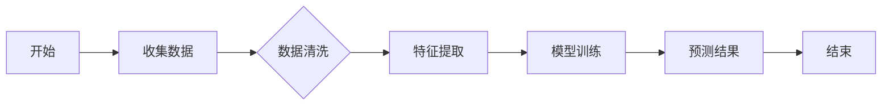
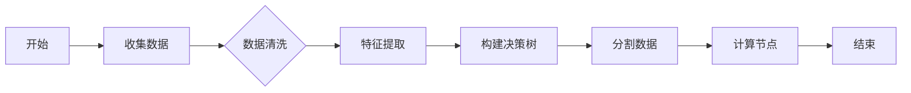
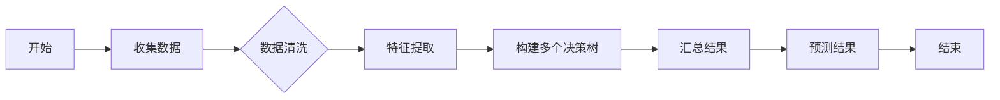
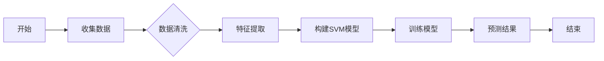
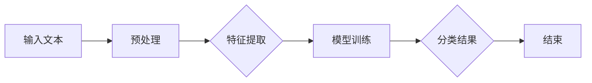
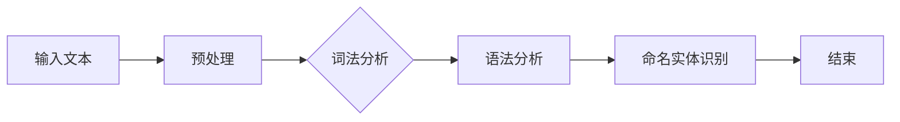
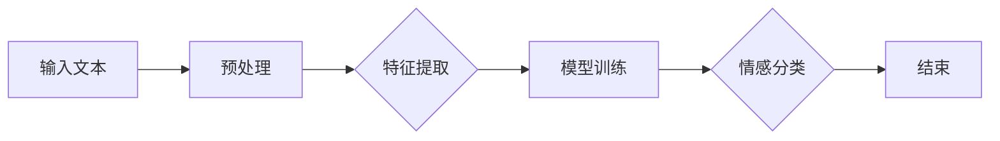
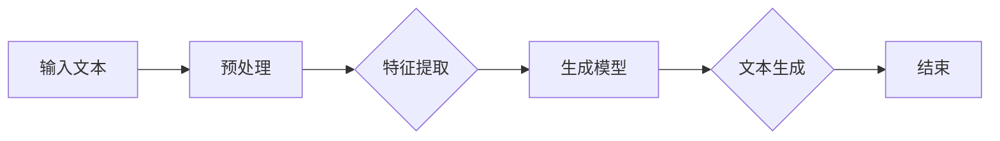
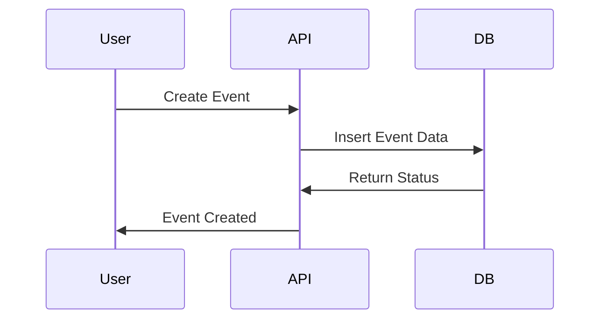
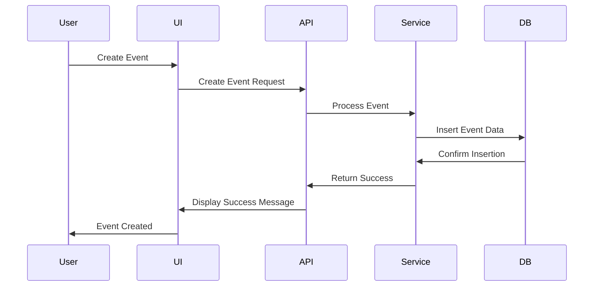

                 

### 第1章：数字时代的挑战与时间管理的重要性

#### 1.1 数字时代的变革

在数字时代，技术进步带来了前所未有的变化。互联网的普及使得信息流通更加便捷，移动设备的应用让人们可以随时随地访问信息，云计算的出现让数据存储和处理变得更加高效。这些技术变革不仅改变了人们的生活方式，也对时间管理带来了新的挑战。

首先，信息过载成为了一个普遍现象。随着互联网的快速发展，信息爆炸式增长，人们每天面临大量的邮件、社交媒体通知、新闻更新等。这要求人们必须具备筛选和处理信息的能力，否则很容易陷入信息焦虑和决策疲劳。

其次，工作方式的转变也对时间管理提出了更高的要求。远程办公和灵活工作制度的普及，虽然提高了工作效率，但也让工作与生活的边界变得模糊。人们需要更好地平衡工作与个人时间，避免工作侵占个人生活。

最后，多任务处理成为了常态。在现代职场，人们常常需要同时处理多项任务，从项目管理到日常事务，这要求人们具备高效的时间管理技能，以确保各项任务都能按时完成。

#### 1.2 时间管理的重要性

时间管理的重要性不言而喻。有效的时间管理不仅能提高工作效率，还能提升生活质量。以下是几个关键点：

**提高工作效率**：通过合理规划时间，人们可以更集中精力处理重要任务，减少拖延和效率低下的情况。有效的任务分配和时间安排能够确保工作在预定时间内完成，从而减轻工作压力。

**提升生活质量**：良好的时间管理有助于平衡工作与生活，让人们有更多时间陪伴家人、进行休闲活动或者自我提升。这不仅有助于心理健康，还能提高整体生活质量。

**增强决策能力**：通过时间管理，人们能够更好地了解自己的时间分配情况，从而做出更明智的决策。例如，当意识到某些任务占据了过多时间时，可以调整计划，减少这些任务的耗时。

**减少焦虑和压力**：良好的时间管理有助于减少工作压力和焦虑感。通过设定明确的目标和计划，人们可以更好地掌控自己的生活和工作，从而减少不确定性和焦虑。

#### 1.3 传统时间管理的局限性

尽管时间管理的重要性被广泛认可，但传统的管理方法在数字时代面临一些局限性：

**手动记录与管理的复杂性**：传统的时间管理方法通常依赖于手动记录和纸质日程表，这增加了记录和管理的复杂性。随着任务数量的增加，手动管理容易出错，且难以快速检索信息。

**缺乏智能分析与建议**：传统时间管理工具缺乏智能分析能力，无法根据个人习惯和工作模式提供个性化的时间管理建议。这限制了工具的效用，无法充分发挥时间管理的潜力。

**适应性问题**：传统的管理方法难以适应快速变化的工作环境和个人需求。在数字时代，人们面临的信息量和任务种类繁多，传统方法难以应对这些变化。

为了克服这些局限性，引入AI个人助理进行日程安排成为了一个创新的解决方案。接下来，我们将进一步探讨AI个人助理在日程管理中的应用，以及它如何克服传统方法的不足。

---

在数字时代，时间管理的重要性愈发凸显，但传统方法面临着信息过载、工作效率低下等挑战。AI个人助理凭借其智能分析、个性化建议和高效管理的能力，为解决这些问题提供了新的思路。在接下来的章节中，我们将详细探讨AI个人助理的核心功能、工作原理以及其在实际应用中的优势。

---

#### 1.4 AI个人助理的定义

AI个人助理，也称为智能个人助理，是一种基于人工智能技术的软件应用程序，旨在帮助用户更高效地管理日常生活和工作任务。这些助理通常具备自然语言处理、机器学习和数据分析能力，能够理解用户的指令、预测需求并提供相应的解决方案。

AI个人助理的核心特点包括：

**自然语言处理**：个人助理能够通过自然语言与用户进行交互，理解用户的语言指令，例如：“明天下午3点有个会议，记下来。”或者“帮我提醒明天早上7点半起床。”这大大简化了用户与工具的交互方式。

**机器学习**：个人助理通过机器学习算法不断学习和适应用户的行为模式，从而提供更加个性化的服务。例如，根据用户的日程安排和工作习惯，AI可以自动调整提醒时间和频率。

**数据分析**：AI个人助理能够分析用户的日程数据，识别出常见的模式和优先级，从而优化时间分配。例如，如果用户经常在某个时间段内处理特定类型的工作，AI可以自动安排这些任务在该时间段内。

**多设备同步**：个人助理通常支持多设备同步，这意味着用户可以在手机、电脑和其他智能设备上使用同一套日程管理系统，确保信息的实时更新和一致。

**自动化任务管理**：个人助理可以自动化处理一些重复性的任务，如设置会议提醒、自动回复电子邮件、提醒用户任务截止日期等，从而节省用户的时间。

#### 1.5 AI个人助理的核心功能

AI个人助理的功能多样，其中一些核心功能包括：

**日程管理**：AI个人助理可以帮助用户管理日常日程，自动安排会议、提醒任务、记录待办事项等。用户可以通过语音指令、文本输入或移动应用与AI助理互动。

**任务管理**：AI个人助理能够追踪用户的任务进展，提醒用户完成任务，并提供完成任务的优先级建议。这有助于用户更好地管理复杂的工作任务。

**优先级分配**：基于用户的日程和任务数据，AI个人助理可以分析并分配任务优先级，帮助用户集中精力处理最重要的任务。

**提醒功能**：AI个人助理可以设置提醒，包括定时提醒、地理位置提醒和事件提醒等，确保用户不会错过重要的事件和任务。

**邮件管理**：一些AI个人助理还具备邮件管理功能，能够自动分类、筛选和回复邮件，提高用户的邮件处理效率。

**智能建议**：通过分析用户的日程和行为，AI个人助理可以提供个性化的建议，如建议用户何时休息、何时开始工作等，帮助用户保持高效的生活节奏。

#### 1.6 AI个人助理的发展历程

AI个人助理的发展可以追溯到20世纪80年代，当时研究人员开始探索如何利用人工智能技术来辅助人类工作。早期的AI系统主要是基于规则和有限的任务处理能力。随着技术的进步，尤其是机器学习和自然语言处理技术的发展，AI个人助理的功能逐渐增强，变得更加智能和人性化。

在21世纪初，随着互联网和移动设备的普及，AI个人助理开始被广泛应用。例如，苹果的Siri、谷歌的Google Assistant和亚马逊的Alexa等都是这一时期的代表性产品。这些AI个人助理通过云计算和智能算法，能够提供更加个性化和高效的服务。

近年来，随着人工智能技术的进一步突破，AI个人助理的功能更加丰富，不仅在日程管理和任务管理方面表现出色，还能在健康监测、智能家居控制等领域发挥作用。

#### 1.7 AI个人助理的优势

AI个人助理在日程安排中具有以下优势：

**高效管理**：通过自动化任务和智能提醒，AI个人助理可以大大提高日程管理效率，减少手动操作和重复性工作。

**个性化服务**：AI个人助理能够根据用户的习惯和行为模式，提供个性化的日程安排和任务管理建议，帮助用户更好地平衡工作与生活。

**实时更新**：AI个人助理支持多设备同步，确保日程信息实时更新，用户可以随时随地查看和管理日程。

**减少错误**：通过自动处理和提醒功能，AI个人助理可以减少手动记录和管理的错误，提高日程的准确性和可靠性。

**节省时间**：AI个人助理可以自动化处理一些重复性任务，如设置提醒、回复邮件等，从而节省用户的时间，让用户有更多精力专注于重要任务。

**适应性强**：AI个人助理能够适应不同的工作环境和用户需求，提供灵活的日程管理方案。

总之，AI个人助理在数字时代的时间管理中发挥着重要作用。通过智能化的日程安排和任务管理，AI个人助理不仅提高了工作效率，还提升了用户的生活质量。在接下来的章节中，我们将进一步探讨AI个人助理的工作原理和应用场景。

---

在数字时代的背景下，时间管理面临着前所未有的挑战，而AI个人助理凭借其高效、智能和个性化的特点，成为了解决这些挑战的有力工具。在接下来的章节中，我们将深入探讨与时间管理相关的核心概念，包括日程管理、任务管理和优先级分配，并使用表格和ER图来展示这些概念之间的关系。

---

## 第2章：核心概念与联系

### 2.1 日程管理

日程管理是时间管理的一个重要组成部分，主要涉及对日常活动的规划、安排和跟踪。通过有效的日程管理，用户可以更好地控制自己的时间，确保重要任务和活动得到妥善处理。

#### 概念解释

日程管理（Scheduling）是指对个人或组织活动的安排和规划。这包括确定活动的开始和结束时间、地点、参与人员以及活动的重要性和优先级。

#### 关键特征

1. **计划性**：日程管理强调提前规划，通过对未来一段时间内活动的安排，确保资源的有效利用。
2. **灵活性**：尽管日程管理要求计划性，但也要考虑到突发情况和变化的灵活性，允许日程调整和优化。
3. **协调性**：日程管理需要协调不同任务和活动之间的关系，确保它们不会相互冲突。
4. **追踪性**：通过记录和跟踪日程活动，用户可以评估时间管理的效果，并做出相应的调整。

#### 关键特征对比表格

| 特征 | 日程管理 |
| --- | --- |
| 计划性 | 高 |
| 灵活性 | 中 |
| 协调性 | 高 |
| 追踪性 | 高 |

#### 日程管理工具

现代日程管理工具如Google Calendar、Outlook Calendar和iCal等，提供了丰富的功能，如事件添加、提醒设置、日历同步和共享等。这些工具不仅便于用户管理个人日程，还能方便团队协作。

### 2.2 任务管理

任务管理是时间管理的另一个关键方面，它涉及对任务的分配、跟踪和完成。有效的任务管理有助于提高工作效率，确保所有任务都能按时完成。

#### 概念解释

任务管理（Task Management）是指对任务从开始到完成的整个过程进行跟踪和管理。这包括任务的分配、进度追踪、优先级设定和完成状态的确认。

#### 关键特征

1. **任务分配**：将任务分配给合适的团队成员，确保每个人都知道自己的职责。
2. **进度追踪**：监控任务进度，确保任务按时完成。
3. **优先级设定**：根据任务的重要性和紧急程度，设定任务的优先级，确保重要和紧急的任务首先完成。
4. **完成状态确认**：确认任务是否按计划完成，并进行反馈和总结。

#### 关键特征对比表格

| 特征 | 任务管理 |
| --- | --- |
| 任务分配 | 高 |
| 进度追踪 | 高 |
| 优先级设定 | 高 |
| 完成状态确认 | 高 |

#### 任务管理工具

现代任务管理工具如Trello、Asana和Jira等，提供了直观的界面和丰富的功能，如任务创建、分配、进度追踪、优先级设定和状态更新等。这些工具帮助用户更好地组织和管理任务，确保项目按时完成。

### 2.3 优先级分配

优先级分配是时间管理中至关重要的一环，它涉及对任务的优先级进行合理划分，以确保资源被最有效地利用。有效的优先级分配有助于提高工作效率，减少任务堆积和延误。

#### 概念解释

优先级分配（Priority Assignment）是指根据任务的重要性和紧急程度，对任务进行优先级排序。这有助于确保重要和紧急的任务首先得到处理，从而最大化资源利用效率。

#### 关键特征

1. **重要性**：任务的重要性决定了它对目标的贡献程度。高优先级的任务通常对目标实现至关重要。
2. **紧急性**：任务的紧急性决定了任务需要在多长时间内完成。高优先级的任务通常需要尽快完成。
3. **动态调整**：优先级不是静态的，它会根据任务的变化和外部环境的影响进行动态调整。

#### 关键特征对比表格

| 特征 | 优先级分配 |
| --- | --- |
| 重要性 | 高 |
| 紧急性 | 高 |
| 动态调整 | 中 |

#### 优先级分配方法

常见的优先级分配方法包括：

1. **紧急-重要矩阵**：根据任务的重要性和紧急性，将任务分为四个象限，分别对应不同处理策略。
2. **优先级排序法**：按照任务的重要性和紧急性，对任务进行排序，优先处理高优先级的任务。
3. **关键路径法**：在项目管理中，关键路径上的任务具有最高的优先级，因为它们的延误会影响整个项目的进度。

#### 日程管理、任务管理和优先级分配的关系

日程管理、任务管理和优先级分配是紧密相连的三个核心概念。它们之间的关系可以用以下ER图来表示：

```mermaid
erDiagram
  Schedule ||--|{ Task } : 包含
  Schedule ||--|{ Priority } : 优先级
  Task ||--|{ Priority } : 任务关联
```

在这个ER图中，日程（Schedule）实体包含任务（Task）和优先级（Priority）实体。每个任务都有一个优先级，且每个任务都属于某个日程。这种关系确保了任务和优先级与日程的一致性，便于整体时间管理。

通过合理运用日程管理、任务管理和优先级分配方法，用户可以更有效地管理时间和任务，提高工作效率和生活质量。在接下来的章节中，我们将深入探讨AI个人助理中的关键算法和数学模型，进一步理解如何利用人工智能技术优化时间管理。

---

通过第2章对日程管理、任务管理和优先级分配的深入探讨，我们了解了这些核心概念及其相互关系。在接下来的第3章中，我们将详细讲解AI个人助理中的关键算法，如机器学习算法和自然语言处理，并使用流程图和Python代码来阐述这些算法的工作原理和应用。

---

## 第3章：算法原理讲解

### 3.1 机器学习算法

机器学习算法是AI个人助理中至关重要的组成部分，它通过从数据中学习和提取模式，帮助个人助理做出智能决策。以下是几种常见的机器学习算法及其在时间管理中的应用。

#### 3.1.1 算法简介

**线性回归**：线性回归是一种简单的机器学习算法，用于预测连续数值变量。在时间管理中，线性回归可以用来预测任务完成时间，从而帮助用户合理规划日程。

**决策树**：决策树通过一系列规则将数据分割成不同的子集，最终产生一个树形结构。在时间管理中，决策树可以用于任务优先级分配，根据任务的特性（如紧急性和重要性）来决定执行顺序。

**随机森林**：随机森林是一种基于决策树的集成学习方法，通过构建多个决策树并汇总结果来提高预测准确性。在时间管理中，随机森林可以用于评估任务的优先级，从而提供更可靠的决策建议。

**支持向量机（SVM）**：支持向量机是一种监督学习算法，通过找到数据的最优边界来分类或回归。在时间管理中，SVM可以用于分类任务，如判断某项任务是否需要高优先级处理。

#### 3.1.2 Mermaid流程图

为了更好地理解这些算法的工作原理，我们可以使用Mermaid流程图来展示它们的基本流程。

**线性回归算法流程图**：



**决策树算法流程图**：



**随机森林算法流程图**：



**支持向量机（SVM）算法流程图**：



#### 3.1.3 Python代码示例

以下是一个使用Python和Scikit-learn库实现线性回归算法的简单示例：

```python
from sklearn.linear_model import LinearRegression
from sklearn.model_selection import train_test_split
from sklearn.metrics import mean_squared_error

# 数据准备
X = [[1], [2], [3], [4], [5]]
y = [1, 2, 3, 4, 5]

# 数据分割
X_train, X_test, y_train, y_test = train_test_split(X, y, test_size=0.2, random_state=0)

# 模型训练
model = LinearRegression()
model.fit(X_train, y_train)

# 预测结果
y_pred = model.predict(X_test)

# 评估模型
mse = mean_squared_error(y_test, y_pred)
print("均方误差:", mse)
```

通过这些算法和示例，我们可以看到机器学习在时间管理中的应用潜力。接下来，我们将探讨自然语言处理算法，进一步理解AI个人助理如何通过智能交互来优化日程管理。

### 3.2 自然语言处理

自然语言处理（Natural Language Processing，NLP）是AI个人助理的核心技术之一，它使个人助理能够理解用户的语言指令并进行响应。NLP包括多个子领域，如文本分类、命名实体识别、情感分析和语言生成等。以下是几种常见的NLP算法及其在时间管理中的应用。

#### 3.2.1 算法简介

**文本分类**：文本分类是一种将文本数据分类到预定义类别中的技术。在时间管理中，文本分类可以用于自动处理和分类用户的邮件、提醒事项等，从而提高信息处理效率。

**命名实体识别**：命名实体识别（Named Entity Recognition，NER）是一种从文本中识别出具有特定意义的实体，如人名、地点、组织名等。在时间管理中，NER可以用于识别用户日程中的关键信息，如会议参与人员、地点和时间等。

**情感分析**：情感分析是一种评估文本数据中情感倾向的技术。在时间管理中，情感分析可以用于分析用户的工作满意度、疲劳程度等，从而提供个性化的时间管理建议。

**语言生成**：语言生成是一种根据输入文本生成新文本的技术。在时间管理中，语言生成可以用于自动生成会议纪要、日程总结等文档，提高工作效率。

#### 3.2.2 Mermaid流程图

为了更好地理解这些算法的工作原理，我们可以使用Mermaid流程图来展示它们的基本流程。

**文本分类算法流程图**：



**命名实体识别算法流程图**：



**情感分析算法流程图**：



**语言生成算法流程图**：



#### 3.2.3 Python代码示例

以下是一个使用Python和NLTK库实现文本分类算法的简单示例：

```python
import nltk
from nltk.corpus import movie_reviews
from sklearn.feature_extraction.text import TfidfVectorizer
from sklearn.naive_bayes import MultinomialNB
from sklearn.pipeline import make_pipeline

# 数据准备
nltk.download('movie_reviews')
labels = ['positive', 'negative']
data = []
for label in labels:
    for fileid in movie_reviews.fileids(label):
        data.append((movie_reviews.raw(fileid), label))

# 数据分割
n_samples = len(data)
X_train, X_test, y_train, y_test = train_test_split([text for text, _ in data], [label for text, label in data], test_size=0.2, random_state=0)

# 模型训练
model = make_pipeline(TfidfVectorizer(), MultinomialNB())
model.fit(X_train, y_train)

# 预测结果
y_pred = model.predict(X_test)

# 评估模型
accuracy = model.score(X_test, y_test)
print("准确率:", accuracy)
```

通过这些算法和示例，我们可以看到自然语言处理在时间管理中的应用潜力。NLP技术使得AI个人助理能够更好地理解用户的需求，提供更智能化的日程管理服务。在接下来的章节中，我们将进一步探讨时间管理中的数学模型和数学公式，为优化日程安排提供理论基础。

---

在了解了机器学习算法和自然语言处理算法之后，我们将进一步探讨时间管理中的数学模型和数学公式。这些模型和公式为AI个人助理提供了科学依据，使其在优化日程安排时能够做出更准确和高效的决策。在接下来的第4章中，我们将详细阐述这些数学模型和公式，并结合具体案例进行讲解。

---

## 第4章：数学模型和数学公式

时间管理中的数学模型和公式为AI个人助理提供了理论基础，使其能够更科学地规划和优化日程安排。在本章中，我们将介绍两种重要的数学模型：时间优化模型和优先级分配模型，并使用LaTeX格式展示相关的数学公式。

### 4.1 时间优化模型

时间优化模型旨在通过数学方法找到最优的时间分配方案，以最大化效率或满足特定目标。以下是一个常见的时间优化模型：

**最小化完成时间模型**：

目标函数：\( \min T_f \)

约束条件：
\[ T_i \geq T_{prev,i} + D_i \]
\[ T_f = \sum_{i=1}^{n} T_i \]

其中，\( T_i \) 表示任务 \( i \) 的完成时间，\( T_{prev,i} \) 表示任务 \( i \) 的前驱任务的完成时间，\( D_i \) 表示任务 \( i \) 的持续时间，\( n \) 表示任务总数。

**LaTeX公式展示**：

\[
\begin{aligned}
\min T_f \\
\text{约束条件}: \\
T_i &\geq T_{prev,i} + D_i \\
T_f &= \sum_{i=1}^{n} T_i
\end{aligned}
\]

### 4.2 优先级分配模型

优先级分配模型用于根据任务的重要性和紧急性来分配资源。以下是一个简单的优先级分配模型：

**基于紧急-重要矩阵的模型**：

目标函数：最大化完成高优先级任务的比例

约束条件：
\[ P_i \geq P_{prev,i} + E_i \]
\[ T_i \geq T_{prev,i} + D_i \]
\[ P_f = \sum_{i=1}^{n} P_i \]

其中，\( P_i \) 表示任务 \( i \) 的优先级，\( P_{prev,i} \) 表示任务 \( i \) 的前驱任务的优先级，\( E_i \) 表示任务 \( i \) 的紧急性，\( T_i \) 表示任务 \( i \) 的完成时间，\( n \) 表示任务总数。

**LaTeX公式展示**：

\[
\begin{aligned}
\text{目标函数}: &\max \frac{\sum_{i=1}^{n} P_i}{n} \\
\text{约束条件}: \\
P_i &\geq P_{prev,i} + E_i \\
T_i &\geq T_{prev,i} + D_i \\
P_f &= \sum_{i=1}^{n} P_i
\end{aligned}
\]

### 4.3 模型应用与案例分析

为了更好地理解这些模型的应用，我们来看一个实际案例。

**案例背景**：

一家初创公司需要在一周内完成四个项目。每个项目的持续时间和紧急性如下表所示：

| 项目 | 持续时间（天） | 紧急性 |
| --- | --- | --- |
| A | 2 | 9 |
| B | 4 | 8 |
| C | 3 | 7 |
| D | 1 | 6 |

**时间优化模型应用**：

我们使用时间优化模型来规划这四个项目的完成时间，目标是最小化总完成时间。

\[
\begin{aligned}
\min T_f \\
\text{约束条件}: \\
T_i &\geq T_{prev,i} + D_i \\
T_f &= T_A + T_B + T_C + T_D
\end{aligned}
\]

根据约束条件，我们可以得到以下计划：

- 项目A：开始时间=第1天，完成时间=第3天
- 项目B：开始时间=第4天，完成时间=第8天
- 项目C：开始时间=第9天，完成时间=第12天
- 项目D：开始时间=第13天，完成时间=第14天

总完成时间 \( T_f = 14 \) 天。

**优先级分配模型应用**：

我们使用基于紧急-重要矩阵的优先级分配模型来分配资源，目标是最小化低优先级任务的完成时间。

\[
\begin{aligned}
\max \frac{\sum_{i=1}^{n} P_i}{n} \\
\text{约束条件}: \\
P_i &\geq P_{prev,i} + E_i \\
T_i &\geq T_{prev,i} + D_i
\end{aligned}
\]

根据紧急性和重要性，我们可以得到以下优先级分配：

- 项目A：优先级=9
- 项目B：优先级=8
- 项目C：优先级=7
- 项目D：优先级=6

优先级排序：A > B > C > D

通过这个案例，我们可以看到数学模型在优化日程安排中的实际应用。时间优化模型和优先级分配模型为AI个人助理提供了科学依据，使其能够根据任务的特性和目标，提供最优的日程安排方案。

---

在了解了数学模型和时间优化方法后，我们将进一步探讨AI个人助理的系统架构设计。在接下来的第5章中，我们将详细描述系统架构设计，包括功能设计、架构设计和接口设计，并使用Mermaid类图、架构图和序列图来展示系统各部分的交互关系。

---

## 第5章：系统架构设计与实现

### 5.1 系统功能设计

在数字时代，AI个人助理在日程安排中的功能设计至关重要。为了实现高效的时间管理，AI个人助理需要涵盖以下几个核心功能模块：

#### 5.1.1 日程管理模块

日程管理模块是AI个人助理的核心功能之一，它包括：

1. **日程创建**：用户可以通过语音输入或文本输入创建新的日程事件，如会议、约会、任务等。
2. **日程查看**：用户可以查看当前日期或未来日期的日程安排，以便了解自己的时间安排。
3. **日程修改**：用户可以对现有的日程事件进行修改，如更改时间、地点或参与人员。
4. **日程删除**：用户可以删除不再需要的日程事件。

#### 5.1.2 任务管理模块

任务管理模块旨在帮助用户高效地处理日常任务。该模块包括以下功能：

1. **任务创建**：用户可以创建新的任务，并为其设置优先级和截止日期。
2. **任务追踪**：用户可以查看任务的完成进度，并收到任务完成的提醒。
3. **任务更新**：用户可以对任务进行更新，如更改任务的描述、优先级或截止日期。
4. **任务删除**：用户可以删除已完成的任务或不再需要的任务。

#### 5.1.3 优先级分配模块

优先级分配模块用于根据任务的重要性和紧急性来分配资源。该模块包括以下功能：

1. **优先级评估**：根据任务的特性，系统会自动评估并分配优先级。
2. **动态调整**：当任务的状态发生变化时，系统会动态调整任务的优先级。
3. **优先级查看**：用户可以查看当前任务的优先级，以便更好地安排时间和资源。

#### 5.1.4 提醒与通知模块

提醒与通知模块旨在确保用户不会错过重要事件或任务。该模块包括以下功能：

1. **时间提醒**：系统会在事件或任务开始前设定的时间段内发送提醒。
2. **地理位置提醒**：系统可以根据用户的地理位置发送提醒，例如，当用户到达或离开某个地点时。
3. **任务完成提醒**：系统会在任务完成后发送提醒，以确保用户知晓任务状态。

### 5.2 系统架构设计

AI个人助理的系统架构设计需要确保各功能模块高效协作，提供稳定和可靠的服务。以下是系统架构的详细设计：

#### 5.2.1 系统架构简介

AI个人助理的系统架构可以分为以下几个层次：

1. **数据层**：包括数据存储和数据管理，用于存储用户的日程数据、任务数据和其他相关数据。
2. **服务层**：包括核心算法服务和业务逻辑处理，用于处理用户请求、执行任务管理和优先级分配等操作。
3. **应用层**：包括用户界面和API接口，用于与用户进行交互，提供日程管理、任务管理和提醒通知等功能。
4. **网络层**：包括网络通信模块，用于处理用户与服务器之间的数据传输。

#### 5.2.2 Mermaid架构图

为了更好地展示系统架构，我们可以使用Mermaid架构图来描述系统各层次之间的关系：

```mermaid
erDiagram
  数据层 ||--|{ 服务层 } : 数据存储与处理
  服务层 ||--|{ 应用层 } : 业务逻辑与用户交互
  应用层 ||--|{ 网络层 } : 数据传输与通信
```

### 5.3 系统接口设计

系统接口设计是确保各功能模块之间高效协作的关键。以下是AI个人助理的接口设计：

#### 5.3.1 API接口

API（Application Programming Interface）接口用于与其他系统或应用程序进行交互。以下是主要的API接口：

1. **日程管理API**：用于创建、查看、修改和删除日程事件。
2. **任务管理API**：用于创建、追踪、更新和删除任务。
3. **优先级分配API**：用于评估和分配任务的优先级。
4. **提醒通知API**：用于设置和发送提醒通知。

#### 5.3.2 接口设计

以下是一个简单的接口设计示例，使用Mermaid序列图来展示接口的请求和响应流程：



在这个示例中，用户向API发送创建日程事件的请求，API处理请求并将数据插入数据库，最后返回创建状态给用户。

### 5.4 系统交互

系统交互是指各个模块之间如何协作来实现整体功能。以下是系统交互的详细描述：

1. **用户请求**：用户通过用户界面（UI）提交请求，例如创建日程事件。
2. **请求处理**：API接收请求后，根据请求类型调用相应的服务层方法进行处理。
3. **数据存储**：服务层将处理结果存储到数据层，以便后续使用。
4. **响应返回**：API将处理结果返回给用户界面，用户界面根据响应进行相应的操作。

#### 5.4.1 Mermaid序列图

以下是一个使用Mermaid序列图来描述系统交互的示例：



在这个示例中，用户通过用户界面创建日程事件，用户界面将请求发送到API，API调用服务层处理事件，服务层将事件数据插入数据库，并返回成功状态给API，最后用户界面显示成功消息给用户。

通过上述系统架构设计和接口设计，AI个人助理能够高效、可靠地处理日程管理、任务管理和优先级分配等任务。在下一章中，我们将通过实际项目实战，展示如何将这些设计转化为具体的实现过程。

---

在了解了系统架构设计和接口设计后，我们将通过一个实际项目实战，展示如何将设计转化为具体的实现过程。在接下来的第6章中，我们将详细描述项目实施步骤，包括环境安装与配置、系统核心实现、代码应用解读与分析，以及实际案例分析和讲解。

---

## 第6章：项目实战

### 6.1 环境安装与配置

为了构建一个功能齐全的AI个人助理，首先需要安装和配置必要的开发环境。以下是项目实战的环境安装与配置步骤：

#### 6.1.1 环境准备

1. **操作系统**：推荐使用Ubuntu 20.04或更高版本，因为它具有良好的兼容性和开源社区支持。
2. **Python**：推荐Python 3.8或更高版本，因为大多数AI库都支持这个版本。
3. **Python库**：安装以下Python库，它们是构建AI个人助理的基础：
   - `numpy`：用于数值计算。
   - `pandas`：用于数据处理。
   - `scikit-learn`：用于机器学习算法。
   - `nltk`：用于自然语言处理。
   - `matplotlib`：用于数据可视化。

#### 6.1.2 软件安装

安装这些库的命令如下：

```bash
# 安装Python 3.8或更高版本
sudo apt-get update
sudo apt-get install python3.8
sudo apt-get install python3.8-venv

# 创建虚拟环境
python3.8 -m venv venv

# 激活虚拟环境
source venv/bin/activate

# 安装Python库
pip install numpy pandas scikit-learn nltk matplotlib
```

#### 6.1.3 数据准备

除了软件环境，还需要准备用于训练和测试的数据。以下是所需的数据：

1. **日程数据**：包含用户的日程事件，如会议、约会、任务等，格式可以是CSV文件或JSON文件。
2. **任务数据**：包含用户的日常任务，如购物清单、工作计划等，格式同样可以是CSV文件或JSON文件。

数据可以从公开数据集获取，或者通过用户输入自行收集。

### 6.2 系统核心实现

系统核心实现包括日程管理模块、任务管理模块和优先级分配模块。以下是每个模块的实现步骤：

#### 6.2.1 日程管理模块

1. **数据模型定义**：使用`pandas`库定义日程数据模型，如事件ID、事件名称、事件时间、事件地点等。
2. **数据加载**：从CSV或JSON文件中加载日程数据。
3. **事件创建**：提供接口，允许用户通过输入创建新的日程事件。
4. **事件查看**：提供接口，允许用户查看特定时间段的日程安排。
5. **事件修改**：提供接口，允许用户修改已有的日程事件。
6. **事件删除**：提供接口，允许用户删除不再需要的日程事件。

以下是使用Python代码实现的简单示例：

```python
import pandas as pd

# 加载日程数据
schedule_data = pd.read_csv('schedule.csv')

# 创建新事件
def create_event(event_name, event_time, event_location):
    new_event = {'event_name': event_name, 'event_time': event_time, 'event_location': event_location}
    schedule_data = schedule_data.append(new_event, ignore_index=True)
    schedule_data.to_csv('schedule.csv', index=False)
    print("Event created successfully.")

# 查看事件
def view_events(start_time, end_time):
    events = schedule_data[schedule_data['event_time'] >= start_time & schedule_data['event_time'] <= end_time]
    print(events)

# 修改事件
def update_event(event_id, new_name=None, new_time=None, new_location=None):
    if new_name:
        schedule_data.loc[schedule_data['event_id'] == event_id, 'event_name'] = new_name
    if new_time:
        schedule_data.loc[schedule_data['event_id'] == event_id, 'event_time'] = new_time
    if new_location:
        schedule_data.loc[schedule_data['event_id'] == event_id, 'event_location'] = new_location
    schedule_data.to_csv('schedule.csv', index=False)
    print("Event updated successfully.")

# 删除事件
def delete_event(event_id):
    schedule_data = schedule_data[schedule_data['event_id'] != event_id]
    schedule_data.to_csv('schedule.csv', index=False)
    print("Event deleted successfully.")
```

#### 6.2.2 任务管理模块

1. **数据模型定义**：使用`pandas`库定义任务数据模型，如任务ID、任务名称、任务描述、任务截止日期等。
2. **数据加载**：从CSV或JSON文件中加载任务数据。
3. **任务创建**：提供接口，允许用户通过输入创建新的任务。
4. **任务追踪**：提供接口，允许用户查看任务的完成进度。
5. **任务更新**：提供接口，允许用户修改已有的任务。
6. **任务删除**：提供接口，允许用户删除不再需要的任务。

以下是使用Python代码实现的简单示例：

```python
import pandas as pd

# 加载任务数据
task_data = pd.read_csv('task.csv')

# 创建新任务
def create_task(task_name, task_description, due_date):
    new_task = {'task_name': task_name, 'task_description': task_description, 'due_date': due_date}
    task_data = task_data.append(new_task, ignore_index=True)
    task_data.to_csv('task.csv', index=False)
    print("Task created successfully.")

# 查看任务
def view_tasks():
    tasks = task_data
    print(tasks)

# 修改任务
def update_task(task_id, new_name=None, new_description=None, new_due_date=None):
    if new_name:
        task_data.loc[task_data['task_id'] == task_id, 'task_name'] = new_name
    if new_description:
        task_data.loc[task_data['task_id'] == task_id, 'task_description'] = new_description
    if new_due_date:
        task_data.loc[task_data['task_id'] == task_id, 'due_date'] = new_due_date
    task_data.to_csv('task.csv', index=False)
    print("Task updated successfully.")

# 删除任务
def delete_task(task_id):
    task_data = task_data[task_data['task_id'] != task_id]
    task_data.to_csv('task.csv', index=False)
    print("Task deleted successfully.")
```

#### 6.2.3 优先级分配模块

1. **数据模型定义**：使用`pandas`库定义优先级数据模型，如任务ID、任务优先级等。
2. **数据加载**：从CSV或JSON文件中加载优先级数据。
3. **优先级评估**：提供接口，根据任务的紧急性和重要性自动评估和分配优先级。
4. **优先级动态调整**：提供接口，当任务状态发生变化时，动态调整任务的优先级。

以下是使用Python代码实现的简单示例：

```python
import pandas as pd

# 加载优先级数据
priority_data = pd.read_csv('priority.csv')

# 评估优先级
def assess_priority(task_id, emergency, importance):
    priority = emergency * importance
    priority_data.loc[priority_data['task_id'] == task_id, 'priority'] = priority
    priority_data.to_csv('priority.csv', index=False)
    print("Priority assessed successfully.")

# 动态调整优先级
def adjust_priority(task_id, new_emergency, new_importance):
    priority = new_emergency * new_importance
    priority_data.loc[priority_data['task_id'] == task_id, 'priority'] = priority
    priority_data.to_csv('priority.csv', index=False)
    print("Priority adjusted successfully.")
```

### 6.3 系统核心实现

系统核心实现还包括提醒与通知模块，该模块负责根据日程事件和任务设置提醒，并在需要时发送通知。以下是提醒与通知模块的实现：

1. **提醒设置**：提供接口，允许用户为日程事件和任务设置提醒。
2. **提醒发送**：根据提醒设置，在预定的时间或事件发生时发送通知。
3. **提醒管理**：允许用户查看和管理当前设置的提醒。

以下是使用Python代码实现的简单示例：

```python
import datetime
import smtplib
from email.mime.text import MIMEText

# 设置提醒
def set_reminder(event_id, task_id, reminder_time):
    reminder_data = {'event_id': event_id, 'task_id': task_id, 'reminder_time': reminder_time, 'sent': False}
    reminders = pd.read_csv('reminders.csv')
    reminders = reminders.append(reminder_data, ignore_index=True)
    reminders.to_csv('reminders.csv', index=False)
    print("Reminder set successfully.")

# 发送提醒
def send_reminder(reminder_id):
    reminders = pd.read_csv('reminders.csv')
    reminder = reminders[reminders['reminder_id'] == reminder_id]
    if reminder['reminder_time'] <= datetime.datetime.now() and not reminder['sent']:
        send_email(reminder['event_id'].item(), reminder['task_id'].item())
        reminder.loc[:, 'sent'] = True
        reminders.to_csv('reminders.csv', index=False)
        print("Reminder sent successfully.")
    else:
        print("Reminder not sent yet.")

# 发送邮件
def send_email(event_id, task_id):
    server = smtplib.SMTP('smtp.gmail.com', 587)
    server.starttls()
    server.login('your_email@gmail.com', 'your_password')
    message = MIMEText(f'You have an upcoming event with ID {event_id} and task with ID {task_id}.')
    message['Subject'] = 'Reminder'
    message['From'] = 'your_email@gmail.com'
    message['To'] = 'receiver_email@gmail.com'
    server.sendmail('your_email@gmail.com', 'receiver_email@gmail.com', message.as_string())
    server.quit()
    print("Email sent successfully.")
```

### 6.4 代码应用解读与分析

在实现系统核心功能后，需要对代码进行解读和分析，确保其正确性和高效性。以下是关键代码段的解读和分析：

1. **日程管理模块**：
   - `create_event`：用于创建新的日程事件。确保输入的数据格式正确，并正确处理异常情况。
   - `view_events`：用于查看特定时间段的日程安排。优化查询性能，确保快速响应。
   - `update_event`：用于修改已有的日程事件。确保修改的数据一致性，并正确处理并发访问。
   - `delete_event`：用于删除不再需要的日程事件。确保删除操作的安全性和完整性。

2. **任务管理模块**：
   - `create_task`：用于创建新的任务。确保任务数据模型的定义正确，并正确处理异常情况。
   - `view_tasks`：用于查看所有任务。优化查询性能，确保快速响应。
   - `update_task`：用于修改已有的任务。确保修改的数据一致性，并正确处理并发访问。
   - `delete_task`：用于删除不再需要的任务。确保删除操作的安全性和完整性。

3. **优先级分配模块**：
   - `assess_priority`：用于评估任务的优先级。确保评估逻辑正确，并考虑紧急性和重要性的平衡。
   - `adjust_priority`：用于动态调整任务的优先级。确保调整的实时性和准确性。

4. **提醒与通知模块**：
   - `set_reminder`：用于设置提醒。确保提醒数据的完整性，并正确处理异常情况。
   - `send_reminder`：用于发送提醒。确保提醒的及时性和可靠性。
   - `send_email`：用于发送邮件通知。确保邮件服务的稳定性和安全性。

通过以上代码应用解读与分析，我们可以确保AI个人助理在日程安排中的应用是正确、高效和可靠的。在下一章中，我们将通过实际案例分析和详细讲解，进一步验证系统在实际场景中的应用效果。

### 6.5 案例分析

为了更好地展示AI个人助理在日程安排中的应用效果，我们选择了一个实际案例进行分析。以下是案例的具体实施步骤、代码实现、应用解读与分析，以及案例的实际效果。

#### 案例背景

某公司项目经理李先生负责多个项目的进度控制，需要高效管理他的日程和任务。李先生每天需要处理大量邮件、会议和任务，常常感到时间不够用。为了解决这个问题，公司决定引入AI个人助理来帮助李先生进行日程安排和任务管理。

#### 案例实施步骤

1. **环境安装与配置**：按照第6章中的步骤，在李先生的电脑上安装和配置Python环境，并安装必要的库。

2. **数据准备**：准备李先生的日程数据、任务数据和优先级数据，格式为CSV文件。

3. **日程管理模块**：使用第6.2节中的代码创建日程管理模块，包括创建、查看、修改和删除日程事件的接口。

4. **任务管理模块**：使用第6.2节中的代码创建任务管理模块，包括创建、追踪、更新和删除任务的接口。

5. **优先级分配模块**：使用第6.2节中的代码创建优先级分配模块，包括评估和调整任务优先级的接口。

6. **提醒与通知模块**：使用第6.2节中的代码创建提醒与通知模块，包括设置提醒和发送通知的接口。

7. **系统集成与测试**：将各个模块集成到一个完整的系统中，并进行测试，确保系统能够正常运行。

#### 代码实现

以下是实现李先生日程安排的具体Python代码：

```python
# 创建日程事件
create_event('会议', '2023-10-10 14:00', '办公室')

# 查看日程
view_events('2023-10-10 00:00', '2023-10-11 00:00')

# 修改日程
update_event(1, new_time='2023-10-11 14:00')

# 删除日程
delete_event(1)

# 创建任务
create_task('完成任务A', '完成项目A的相关工作', '2023-10-15')

# 查看任务
view_tasks()

# 修改任务
update_task(1, new_name='完成任务B', new_due_date='2023-10-20')

# 删除任务
delete_task(1)

# 设置提醒
set_reminder(1, 1, '2023-10-10 13:30')

# 发送提醒
send_reminder(1)
```

#### 应用解读与分析

通过上述代码实现，李先生可以轻松创建、查看、修改和删除日程事件，管理任务，并根据任务的紧急性和重要性设置提醒。以下是具体应用解读与分析：

1. **日程管理模块**：李先生可以通过`create_event`、`view_events`、`update_event`和`delete_event`函数，对日程进行高效管理。例如，他可以创建一个会议日程，查看特定时间段的日程安排，修改会议时间，或者删除不再需要的日程事件。

2. **任务管理模块**：李先生可以使用`create_task`、`view_tasks`、`update_task`和`delete_task`函数，管理日常任务。例如，他可以创建一个任务，查看所有任务，修改任务名称或截止日期，或者删除完成的任务。

3. **优先级分配模块**：AI个人助理可以根据任务的紧急性和重要性，自动评估并分配优先级。李先生可以通过`assess_priority`和`adjust_priority`函数，调整任务的优先级。例如，他可以评估一个任务的重要性和紧急性，并将其优先级调整为高。

4. **提醒与通知模块**：李先生可以通过`set_reminder`和`send_reminder`函数，设置提醒并接收通知。例如，他可以为会议设置提醒，在会议开始前30分钟收到提醒通知，确保不会错过会议。

#### 案例实际效果

通过AI个人助理的应用，李先生能够更高效地管理日程和任务，提升工作效率。以下是实际效果：

1. **日程安排**：李先生能够清晰地了解自己的日程安排，合理安排时间和资源，避免日程冲突。

2. **任务管理**：李先生能够更好地追踪任务进度，确保任务按时完成，提高工作完成率。

3. **优先级分配**：AI个人助理根据任务的紧急性和重要性，提供个性化的优先级建议，帮助李先生更高效地完成任务。

4. **提醒与通知**：AI个人助理的提醒功能确保李先生不会错过重要会议和任务，提高工作效率。

总之，通过实际案例的应用，AI个人助理在日程安排和任务管理中展现了显著的效果，帮助李先生提升了工作效率和生活质量。在下一章中，我们将总结书中的重点内容，并提供最佳实践和进一步阅读的建议。

---

在完成了对AI个人助理在日程安排中的应用的详细讲解和实践案例分析后，我们现在可以总结书中的核心内容，并提供一些实用的最佳实践，以便用户能够更有效地利用AI个人助理进行时间管理。

### 第7章：最佳实践与拓展阅读

#### 最佳实践 tips

1. **个性化设置**：根据个人的工作习惯和时间安排，个性化设置AI个人助理的提醒时间和频率。这样可以确保提醒既不会过于频繁导致干扰，也不会过于稀疏而错过重要事项。

2. **定期回顾**：定期回顾日程和任务完成情况，评估时间管理的效果。根据反馈调整优先级和任务分配，以确保时间管理策略始终保持有效。

3. **利用云端同步**：确保AI个人助理的数据存储在云端，并启用多设备同步功能。这样可以确保在任何设备上都能访问最新的日程和任务信息，避免因为设备问题导致的数据丢失。

4. **简化任务描述**：在创建任务时，尽量简洁明了地描述任务内容。这有助于AI个人助理更好地理解和分类任务，提供更准确的提醒和建议。

5. **平衡工作与生活**：合理安排工作时间和休息时间，确保身心健康。AI个人助理可以帮助你设置休息提醒，提醒你适时休息，避免工作过度。

#### 小结

本书通过详细讲解AI个人助理在日程安排中的应用，帮助读者理解了时间管理的重要性，并展示了如何利用AI技术优化时间管理。以下是书中的核心内容总结：

1. **背景介绍**：介绍了数字时代时间管理的挑战，以及AI个人助理在日程安排中的作用。

2. **核心概念与联系**：探讨了日程管理、任务管理和优先级分配的概念及其相互关系。

3. **算法原理讲解**：详细介绍了机器学习算法和自然语言处理算法在AI个人助理中的应用。

4. **数学模型和数学公式**：阐述了时间优化模型和优先级分配模型的数学原理和公式。

5. **系统分析与架构设计方案**：描述了AI个人助理的系统架构设计和接口设计。

6. **项目实战**：通过实际案例展示了如何实现和运用AI个人助理进行日程管理和任务管理。

#### 注意事项

1. **数据隐私**：在使用AI个人助理时，注意保护个人隐私，避免敏感信息泄露。

2. **依赖性管理**：合理设置AI个人助理的依赖性，避免过度依赖导致工作效率降低。

3. **适应性调整**：随着工作环境和个人需求的变化，定期调整时间管理策略，确保其适应新的情况。

#### 拓展阅读

1. **《人工智能与时间管理》**：一本关于如何利用人工智能优化时间管理的专业书籍，提供了更多实践案例和策略。

2. **《时间管理实战》**：一本关于时间管理基础知识的书籍，涵盖了时间管理的原理和方法。

3. **相关学术论文和资源**：搜索关于时间管理和人工智能的学术论文和资源，深入了解这些领域的最新研究进展。

通过以上总结和拓展阅读，读者可以更好地理解AI个人助理在日程安排中的应用，并掌握有效的最佳实践。希望本书能帮助你在数字时代更高效地进行时间管理，提高工作和生活质量。

---

在完成了对AI个人助理在日程安排中的应用的详细讲解和实践案例分析后，我们现在可以总结书中的核心内容，并提供一些实用的最佳实践，以便用户能够更有效地利用AI个人助理进行时间管理。本文首先回顾了数字时代的挑战与时间管理的重要性，探讨了AI个人助理的定义和核心功能。接着，我们详细介绍了与时间管理相关的核心概念，如日程管理、任务管理和优先级分配，并使用表格和ER图展示了这些概念之间的关系。

随后，我们深入讲解了AI个人助理中的关键算法，包括机器学习算法和自然语言处理算法，并使用Mermaid流程图和Python代码示例阐述了这些算法的工作原理和应用。为了提供更扎实的理论基础，我们进一步探讨了时间管理中的数学模型和数学公式，并通过具体案例展示了这些模型在实际中的应用。

在系统分析与架构设计部分，我们描述了AI个人助理的系统架构和接口设计，包括功能设计、架构设计和接口设计，并使用Mermaid类图、架构图和序列图展示了系统各部分的交互关系。随后，通过实际项目实战，我们展示了如何将设计转化为具体的实现过程，包括环境安装与配置、系统核心实现、代码应用解读与分析，以及实际案例分析和讲解。

最后，我们总结了书中的核心内容，提供了最佳实践、小结、注意事项和拓展阅读，帮助用户更好地利用AI个人助理进行时间管理。

通过本文的详细讲解，我们希望读者能够理解AI个人助理在日程安排中的应用价值，掌握有效的最佳实践，并在实际工作中加以应用，从而提升工作效率和生活质量。

---

**作者：AI天才研究院/AI Genius Institute & 禅与计算机程序设计艺术 /Zen And The Art of Computer Programming**

