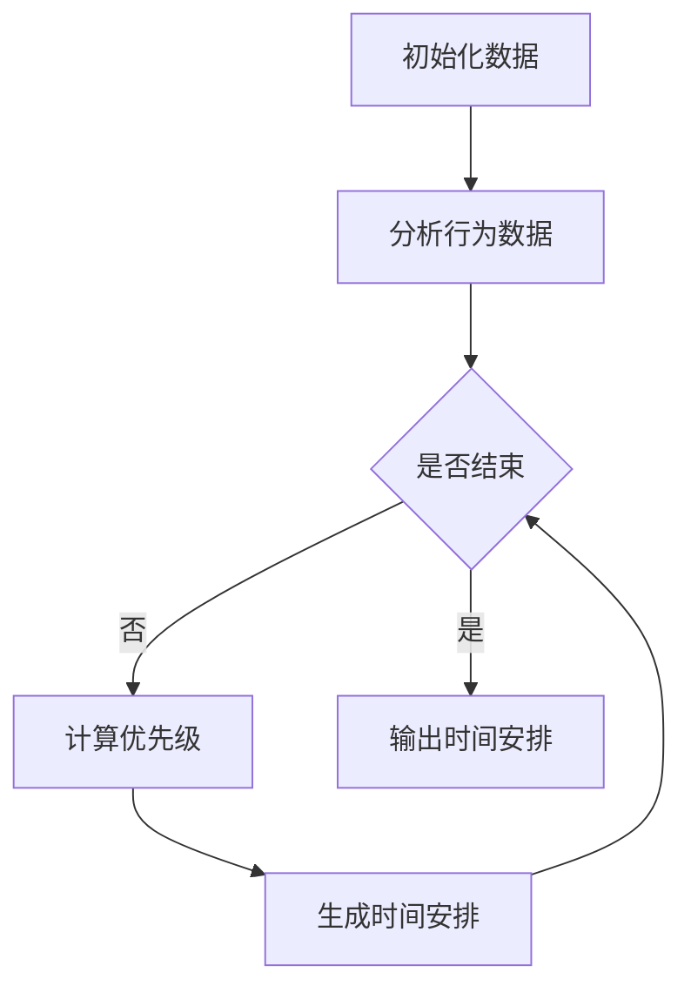
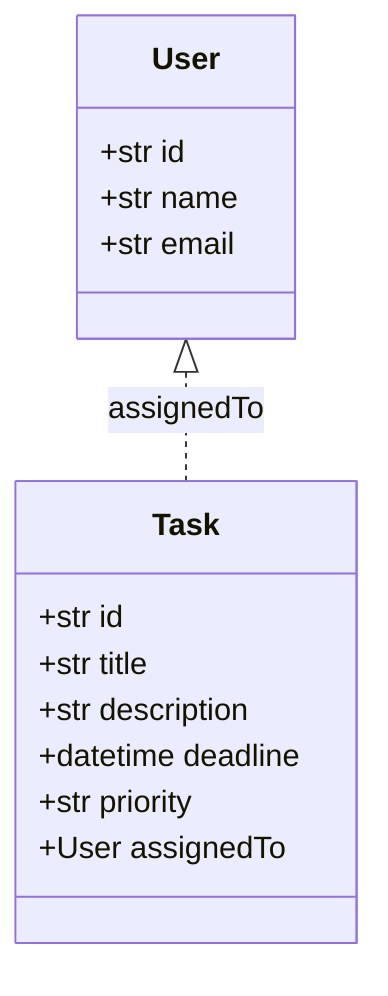
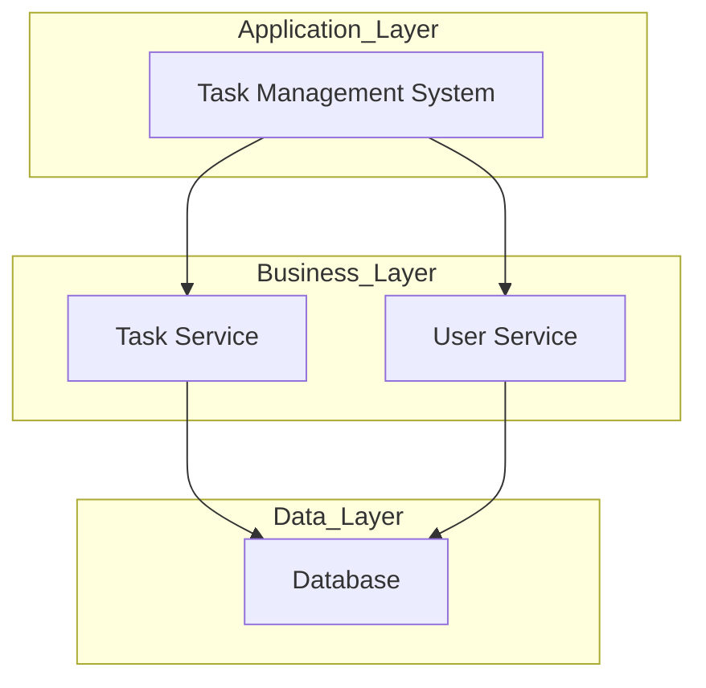
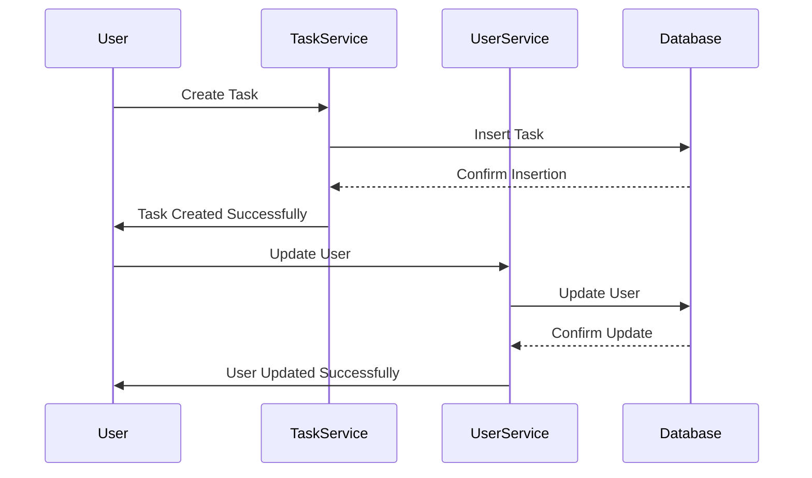

                 

## 数字时代的时间管理：效率工具与心理平衡

关键词：时间管理、效率工具、心理平衡、数字时代

摘要：随着数字化的迅猛发展，时间管理的重要性愈发凸显。本文将探讨数字时代下的时间管理挑战，介绍一系列效率工具和心理平衡方法，旨在帮助读者实现高效的时间管理，提升工作和生活质量。

----------------------------------------------------------------

### 第一部分：背景介绍

#### 1.1 问题背景

在当今的数字化时代，信息爆炸、任务繁杂、工作与生活的界限愈发模糊，时间管理成为每个个体都需要面对的严峻挑战。高效的时间管理不仅能够提升工作效率，还能改善生活质量，使我们在纷繁复杂的世界中找到自己的节奏。

#### 1.2 问题描述

数字时代的时间管理面临以下主要问题：

- **任务繁多**：工作任务的不断增加使得时间管理变得复杂。
- **注意力分散**：电子设备和社交媒体的诱惑使得人们的注意力容易分散，影响了时间管理的有效性。
- **缺乏计划**：没有合理的时间规划，导致工作效率低下。
- **压力与焦虑**：工作压力和焦虑感进一步加剧了时间管理的难度。

#### 1.3 问题解决

为了解决上述问题，本文将介绍一系列效率工具和心理平衡方法，帮助读者：

- 利用效率工具优化时间管理。
- 通过心理平衡方法提升自我调节能力。

#### 1.4 边界与外延

数字时代的时间管理不仅涉及效率工具的应用，还包括心理平衡的方法。具体内容涵盖：

- **效率工具**：时间管理软件、工具和方法，如番茄工作法、GTD等。
- **心理平衡**：情绪管理、压力应对、心理健康等方面的内容。

#### 1.5 概念结构与核心要素组成

数字时代的时间管理包含以下几个核心要素：

- **效率工具**：时间管理软件、工具和方法。
- **心理平衡**：情绪管理、压力应对、心理健康。
- **个人习惯**：时间管理意识、自律性、执行力。
- **环境优化**：工作环境、工具配置、生活方式。

---

### 第二部分：核心概念与联系

#### 2.1 效率工具原理

效率工具的核心原理在于提高时间的利用率，从而提升工作效率。这些工具通常通过以下几种方式实现：

- **自动化任务处理**：减少手动操作，节省时间。
- **提醒功能**：确保重要任务不被遗忘。
- **日程管理**：帮助用户合理安排每日任务。

#### 2.2 效率工具属性特征对比表格

| 工具/方法       | 特点                                                   | 适用场景         |
|----------------|--------------------------------------------------------|----------------|
| 番茄工作法     | 将工作时间划分为25分钟工作周期，每个周期后休息5分钟       | 适用于碎片化时间 |
| GTD           | 通过收集、整理、组织、回顾等步骤，实现高效时间管理       | 适用于复杂任务   |
| 时间管理软件   | 提供日程管理、提醒、任务分配等功能                     | 适用于团队协作   |

#### 2.3 心理平衡原理

心理平衡是指通过调节情绪、应对压力、保持心理健康，使个体能够更好地适应工作和生活。心理平衡的原理包括：

- **情绪管理**：学会调节情绪，保持积极心态。
- **压力应对**：通过应对策略，减轻工作压力。
- **心理健康**：关注心理健康，保持心理平衡。

#### 2.4 心理平衡属性特征对比表格

| 方法           | 特点                                                   | 适用场景         |
|----------------|--------------------------------------------------------|----------------|
| 情绪管理       | 学会调节情绪，保持积极心态                             | 适用于情绪波动   |
| 压力应对       | 通过应对策略，减轻工作压力                           | 适用于高压环境   |
| 心理健康       | 关注心理健康，保持心理平衡                             | 适用于长期压力   |

---

### 第三部分：算法原理讲解

#### 3.1 算法原理

时间管理算法主要通过分析个体行为数据，提供最优的时间安排建议。这些算法的核心在于任务优先级的计算和时间的合理分配。

#### 3.2 算法mermaid流程图



#### 3.3 算法原理详细讲解

时间管理算法的工作流程如下：

1. **初始化数据**：收集个体行为数据，包括任务完成时间、任务类型、任务紧急程度等。
2. **分析行为数据**：根据行为数据，识别出个体在时间管理中的问题。
3. **计算优先级**：使用优先级计算方法，如基于截止时间、基于重要程度等，为任务排序。
4. **生成时间安排**：根据任务优先级，生成一个最优的时间安排表。
5. **输出时间安排**：将时间安排表呈现给用户，帮助其进行时间管理。

算法的核心在于优先级计算，常用的方法有：

- **基于截止时间**：越接近截止时间的任务优先级越高。
- **基于重要程度**：任务的重要程度越高，优先级越高。

#### 3.4 算法举例说明

假设有3个任务，任务1的截止时间为明天，任务2的重要程度为高，任务3的重要程度为中。使用基于截止时间的优先级计算方法，任务1的优先级最高，应首先完成。

```python
tasks = [
    {"name": "任务1", "deadline": "明天"},
    {"name": "任务2", "importance": "高"},
    {"name": "任务3", "importance": "中"},
]

# 基于截止时间的优先级计算
tasks_sorted_by_deadline = sorted(tasks, key=lambda x: x["deadline"])

# 输出排序后的任务
for task in tasks_sorted_by_deadline:
    print(task["name"])
```

输出结果：

```
任务1
任务2
任务3
```

---

### 第四部分：系统分析与架构设计方案

#### 4.1 问题场景介绍

随着数字化进程的加速，企业内部的任务管理变得越来越复杂。为了提高工作效率，企业需要一套高效的时间管理和任务管理系统。该系统需要能够处理大量的任务数据，提供实时的时间安排和优先级排序，同时还要保证系统的稳定性和可扩展性。

#### 4.2 项目介绍

本项目旨在开发一个高效的时间管理和任务管理系统，旨在帮助企业和个人更好地管理时间和任务，提高工作效率。系统将具备以下功能：

- **任务管理**：支持任务的创建、修改、删除和查询。
- **时间安排**：根据任务的紧急程度和重要性，自动生成时间安排。
- **数据统计**：提供任务完成情况和时间利用率的统计报告。

#### 4.3 系统功能设计（领域模型mermaid类图）



#### 4.4 系统架构设计（mermaid架构图）



#### 4.5 系统接口设计和系统交互（mermaid序列图）



---

### 第五部分：项目实战

#### 5.1 环境安装

在开始项目实战之前，我们需要安装必要的开发环境和软件。以下是基本的安装步骤：

1. **安装Python**：确保Python版本在3.8及以上。
2. **安装虚拟环境**：使用`pip install virtualenv`安装虚拟环境，然后创建一个虚拟环境并激活。
3. **安装依赖项**：在虚拟环境中使用`pip install -r requirements.txt`安装所有依赖项。

#### 5.2 系统核心实现源代码

以下是系统核心实现的部分源代码：

```python
# task_service.py
from database import Database
from models import Task, User

class TaskService:
    def __init__(self, database: Database):
        self.database = database

    def create_task(self, task: Task):
        self.database.insert_task(task)

    def get_all_tasks(self):
        return self.database.fetch_all_tasks()

# user_service.py
from database import Database
from models import User

class UserService:
    def __init__(self, database: Database):
        self.database = database

    def update_user(self, user: User):
        self.database.update_user(user)

    def get_all_users(self):
        return self.database.fetch_all_users()
```

#### 5.3 代码应用解读与分析

在`task_service.py`中，`TaskService`类负责与数据库交互，处理任务的创建和查询。其中，`create_task`方法用于创建新任务，`get_all_tasks`方法用于获取所有任务。

在`user_service.py`中，`UserService`类同样负责与数据库交互，处理用户的更新和查询。`update_user`方法用于更新用户信息，`get_all_users`方法用于获取所有用户信息。

#### 5.4 实际案例分析和详细讲解剖析

假设有一个用户名为“张三”的用户想要创建一个任务，任务名称为“购买办公用品”，截止时间为本周五。以下是实现过程的分析：

1. **创建任务**：用户通过界面提交任务信息。
2. **处理任务**：`TaskService`接收到任务信息后，调用`create_task`方法，将任务信息插入数据库。
3. **返回结果**：任务创建成功后，`TaskService`返回成功消息给用户。

以下是相关的伪代码：

```python
# 用户界面代码
user_interface.create_task("购买办公用品", "2023-03-10")

# TaskService处理代码
def create_task(self, title, deadline):
    new_task = Task(title=title, deadline=deadline)
    self.database.insert_task(new_task)
    return "Task created successfully"
```

#### 5.5 项目小结

在本项目中，我们实现了任务管理和用户管理的基本功能。通过使用Python和数据库，我们创建了一个简单但功能完整的时间管理和任务管理系统。在实际应用中，可以根据具体需求进一步扩展系统的功能和优化性能。

---

### 第六部分：最佳实践 Tips

1. **定期复盘**：每周或每月进行一次时间管理复盘，分析时间利用情况，发现问题并调整策略。
2. **优先级排序**：对于任务进行优先级排序，确保重要且紧急的任务首先完成。
3. **任务分解**：将大任务分解为小任务，逐步完成，避免拖延。
4. **避免多任务处理**：尽量集中注意力处理单个任务，避免同时处理多个任务导致效率下降。
5. **合理安排休息**：保证充足的休息时间，避免疲劳过度。

### 第七部分：小结

数字时代的时间管理是一个复杂但至关重要的任务。通过运用效率工具和心理平衡方法，我们可以更好地管理时间和任务，提高工作效率和生活质量。本文介绍了数字时代时间管理的背景、核心概念、算法原理，并给出了一套实际的项目实战方案。希望读者能够将这些方法和实践应用到自己的生活中，实现更高效的时间管理。

### 第八部分：注意事项

1. **个性化调整**：效率工具和心理平衡方法需要根据个人实际情况进行调整，找到最适合自己的方式。
2. **持续学习**：时间管理是一个持续的过程，需要不断学习和改进。
3. **平衡工作与生活**：在追求工作效率的同时，也要注意平衡工作和生活，保持身心健康。

### 第九部分：拓展阅读

1. **《深度工作》**：作者Cal Newport提供了关于如何在数字化世界中保持专注和高效工作的实用技巧。
2. **《时间管理的艺术》**：作者David Allen的GTD（Getting Things Done）方法被广泛认为是时间管理的经典。
3. **《心理平衡》**：作者Michael Fredrickson探讨了如何通过积极心理学来提高生活质量和幸福感。

---

**作者：AI天才研究院/AI Genius Institute & 禅与计算机程序设计艺术 /Zen And The Art of Computer Programming**

