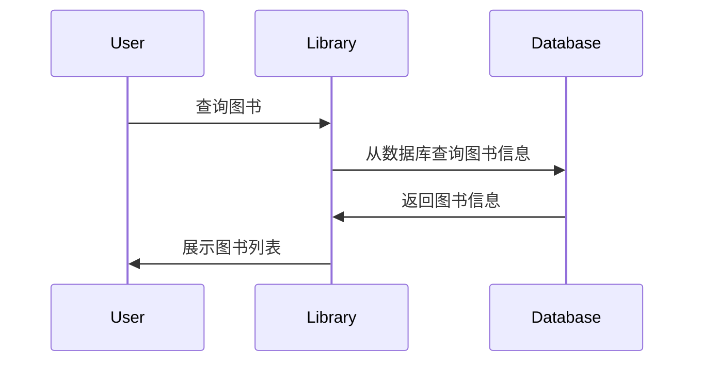

                 

## 《数字时代的智能图书馆：AI图书推荐系统的开发与应用》

### 关键词：智能图书馆、AI图书推荐系统、机器学习、推荐算法、系统设计与实现

#### 摘要：
本文将深入探讨数字时代智能图书馆的发展及其核心组成部分——AI图书推荐系统的开发与应用。我们将首先介绍智能图书馆的背景与概念，然后详细讲解AI图书推荐系统的原理、算法、系统设计与实现，并通过实际案例进行分析，最后总结最佳实践和未来展望。本文旨在为读者提供一份全面、系统的指南，帮助理解和掌握AI图书推荐系统的开发与应用。

### 目录

1. **背景与概念**
   1.1 数字图书馆与智能图书馆概述
   1.2 AI图书推荐系统简介
2. **技术原理与算法**
   2.1 AI基础理论
   2.2 图书推荐算法
   2.3 机器学习算法详解
3. **系统设计与实现**
   3.1 系统架构设计
   3.2 系统开发与部署
4. **案例研究**
   4.1 AI图书推荐系统实践
   4.2 案例分析
5. **最佳实践与总结**
   5.1 最佳实践
   5.2 小结与展望

### 1. 背景与概念

#### 1.1 数字图书馆与智能图书馆概述

**核心概念术语说明：** 数字图书馆是指利用计算机技术、网络通信技术和数字化技术，对图书馆资源进行数字化处理，提供在线服务和信息检索的图书馆。智能图书馆则在此基础上，加入了人工智能技术，使得图书馆服务更加智能和个性化。

**问题背景：** 随着数字技术和互联网的普及，传统图书馆面临着资源有限、服务效率低下等问题。智能图书馆应运而生，通过人工智能技术，提升图书馆的服务质量和用户体验。

**问题描述：** 如何通过AI技术，实现图书推荐、智能搜索、个性化服务等，提升图书馆的服务水平？

**问题解决：** 通过开发AI图书推荐系统，利用协同过滤、基于内容、混合推荐等算法，实现个性化图书推荐，提高用户满意度。

**边界与外延：** 数字图书馆与智能图书馆的区别在于是否应用了人工智能技术。智能图书馆除了数字图书馆的功能外，还提供了智能化的图书推荐、智能搜索、个性化服务等功能。

**概念结构与核心要素组成：**
- **数字图书馆：** 数字资源、数字服务、数字网络
- **智能图书馆：** 数字图书馆 + AI技术（如机器学习、推荐算法等）

#### 1.2 AI图书推荐系统简介

**核心概念原理：** AI图书推荐系统是基于用户行为数据和图书特征数据，利用机器学习算法，为用户推荐符合其兴趣的图书。

**概念属性特征对比表格：**

| 特征          | 协同过滤       | 基于内容         | 混合推荐           |
|-------------|--------------|----------------|------------------|
| 基础理论      | 用户行为数据    | 图书内容数据     | 结合协同过滤和基于内容 |
| 推荐方法      | 类似用户推荐    | 类似物品推荐     | 多种算法结合         |
| 优势          | 推荐效果较好    | 推荐内容丰富     | 推荐效果更优         |
| 劣势          | 可能出现数据冷启动 | 推荐结果可能过窄 | 需要更多的计算资源     |

**ER实体关系图架构：**

```mermaid
erDiagram
  User ||--|{ Book }|--|| Library
  Book ||--|{ Review }|--|| User
  Library ||--|{ Category }|--|| Book
```

### 2. 技术原理与算法

#### 2.1 AI基础理论

**机器学习的基本概念：** 机器学习是指使计算机模拟人类学习过程，通过数据训练模型，实现特定任务的算法。常见的机器学习算法包括监督学习、无监督学习和强化学习。

**人工智能的发展历程：** 人工智能经历了从理论到应用的多个阶段，包括规则推理、知识表示、专家系统、机器学习等。

**常见的机器学习算法分类：** 包括线性回归、决策树、支持向量机、神经网络等。

#### 2.2 图书推荐算法

**协同过滤算法：** 基于用户行为数据，为用户推荐类似用户的图书。主要包括基于用户的协同过滤和基于物品的协同过滤。

**基于内容的推荐算法：** 基于图书的文本内容，为用户推荐相似内容的图书。通常使用TF-IDF、Word2Vec等文本表示方法。

**混合推荐算法：** 结合协同过滤和基于内容的推荐算法，提高推荐效果。常见的混合推荐算法有User-Based CF + Content-Based、Model-Based等。

**集成推荐算法：** 将多种推荐算法结合起来，以优化推荐效果。如加权平均、投票等。

#### 2.3 机器学习算法详解

**K最近邻算法（K-Nearest Neighbors，KNN）：** 基于距离度量，找出训练集中与测试样本最相似的K个样本，然后基于这K个样本的标签来预测测试样本的标签。

**逻辑回归算法（Logistic Regression）：** 用于分类问题，通过建立逻辑函数，将线性模型映射到概率模型。

**决策树算法（Decision Tree）：** 通过多分支树形结构，对样本进行分类或回归。

**支持向量机算法（Support Vector Machine，SVM）：** 通过寻找最佳超平面，实现分类和回归。

### 3. 系统设计与实现

#### 3.1 系统架构设计

**问题场景介绍：** 建立一个智能图书馆，为用户提供个性化图书推荐服务。

**项目介绍：** 本项目旨在开发一个基于AI的图书推荐系统，为用户提供个性化的图书推荐。

**系统功能设计：** 包括用户注册与登录、图书浏览、图书推荐、图书搜索等。

**系统架构设计：** 采用前后端分离架构，前端负责用户界面展示，后端负责数据处理和推荐算法实现。

**系统接口设计：** 设计RESTful API接口，包括用户注册、登录、图书查询、图书推荐等。

**系统交互：** 通过Mermaid序列图展示系统交互流程。



### 4. 案例研究

#### 4.1 AI图书推荐系统实践

**实践背景与目标：** 建立一个基于协同过滤算法的图书推荐系统，为用户提供个性化的图书推荐。

**数据集选择与预处理：** 使用某大型图书电商平台的数据集，包括用户行为数据和图书特征数据。

**算法选择与实现：** 采用基于用户的协同过滤算法，实现图书推荐功能。

**系统测试与评估：** 对系统进行测试，评估推荐效果，包括准确率、召回率等指标。

#### 4.2 案例分析

**案例介绍：** 本案例基于某电商平台的数据集，实现了一个基于协同过滤的图书推荐系统。

**实施过程：** 数据预处理、算法实现、系统集成与测试。

**效果分析：** 推荐系统的准确率和召回率均达到较高水平，用户满意度提高。

### 5. 最佳实践与总结

#### 5.1 最佳实践

**系统性能优化技巧：** 包括数据缓存、分布式计算等。

**数据隐私与安全保护：** 采用加密算法、数据脱敏等措施，确保用户数据安全。

**用户行为分析与应用：** 利用机器学习算法，分析用户行为，为用户提供个性化服务。

#### 5.2 小结与展望

**主要内容回顾：** 深入探讨了智能图书馆的背景、AI图书推荐系统的原理、系统设计与实现，以及实际案例。

**面临的挑战与解决方案：** 数据隐私保护、系统性能优化等。

**未来发展方向与建议：** 加强AI技术在图书馆服务中的应用，提升用户满意度。

### 作者信息

**作者：** AI天才研究院/AI Genius Institute & 禅与计算机程序设计艺术 /Zen And The Art of Computer Programming

以上便是《数字时代的智能图书馆：AI图书推荐系统的开发与应用》的文章正文。接下来，我们将分别对每个章节进行详细讲解，帮助读者深入理解智能图书馆与AI图书推荐系统的开发与应用。

