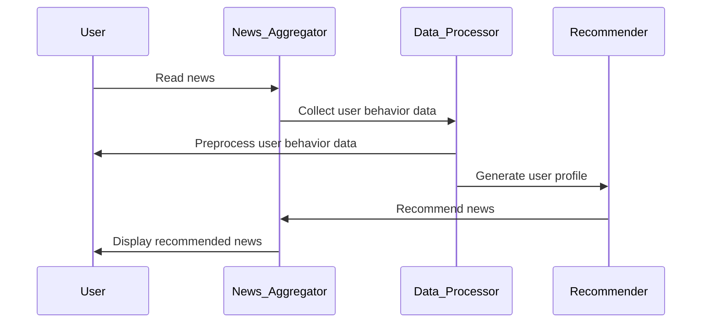
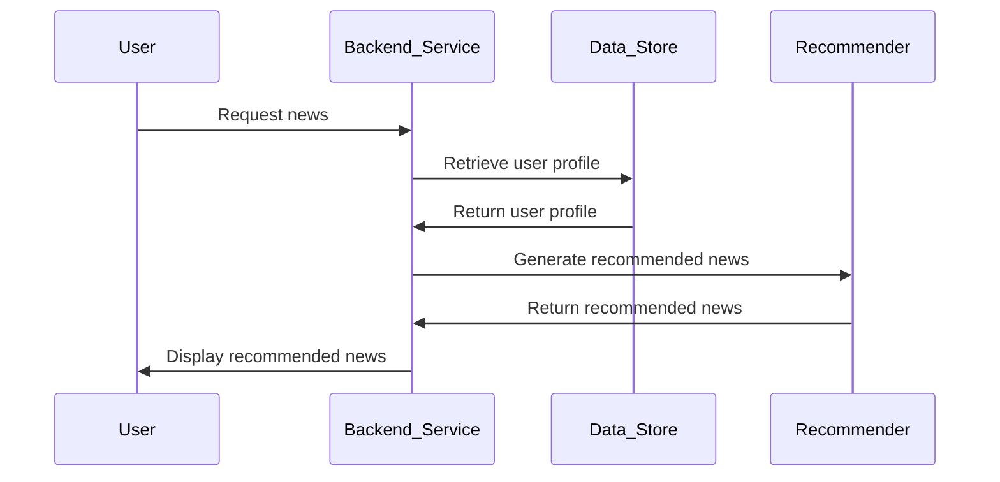

                 


## 第1章：背景与概述

### 1.1 数字时代下的新闻传播环境

在数字时代，新闻传播的方式发生了巨大的变革。传统报纸、杂志等媒体逐渐被网络媒体所取代。网络媒体以其传播速度快、覆盖面广、互动性强等优势，成为了现代人们获取新闻信息的主要渠道。根据中国互联网络信息中心（CNNIC）的统计数据，截至2021年底，我国网民规模已达到10.32亿，互联网普及率达到73.0%。其中，手机网民规模为9.86亿，占比达95.4%。网络媒体的普及，使得信息传播更加迅速、广泛和多样化。

然而，这也带来了信息过载的问题。用户每天接收到大量的新闻信息，但并不是所有信息都有价值，如何从中筛选出对自己真正有用的信息成为了一个挑战。此外，每个用户的新闻需求和兴趣都不同，传统的一刀切新闻推送模式已经无法满足个性化需求。

### 1.2 智能新闻聚合的挑战与机遇

智能新闻聚合系统旨在通过人工智能技术，对用户的行为数据进行深入分析，实现个性化新闻推荐。这面临着以下挑战：

**挑战：**

- **信息过载**：如何在海量信息中筛选出对用户有价值的信息？

- **个性化需求满足**：如何准确识别用户的兴趣，实现精准推送？

**机遇：**

- **AI技术的进步**：随着人工智能技术的不断进步，如深度学习、自然语言处理等，为智能新闻聚合提供了强大的技术支撑。

- **数据挖掘与分析能力的提升**：通过大数据分析，可以更准确地了解用户的行为和需求，实现个性化推送。

### 1.3 个性化信息推送系统的重要性

个性化信息推送系统在数字时代具有重要作用：

- **提高用户体验**：通过精准推荐，用户可以更快地找到自己感兴趣的新闻信息，提高阅读效率。

- **促进信息传播效果**：个性化推送能够提高新闻的阅读量和互动性，从而提高新闻的价值和影响力。

- **优化媒体运营策略**：通过分析用户行为数据，媒体可以更好地了解用户需求，调整内容策略，提高用户满意度。

### 1.4 本书结构与内容安排

本书将分为五个部分：

- **第一部分：引言**：介绍数字时代下的新闻传播环境，智能新闻聚合的挑战与机遇，以及个性化信息推送系统的重要性。

- **第二部分：个性化信息推送技术基础**：介绍用户行为分析、用户画像构建、用户兴趣识别、用户行为分析与预测等相关技术。

- **第三部分：基于AI的智能新闻聚合系统设计**：介绍智能新闻聚合系统的架构设计、数据存储与管理、算法原理与实现等内容。

- **第四部分：系统实现与案例分析**：介绍系统实现过程、实际案例分析以及效果评估。

- **第五部分：总结与展望**：总结研究成果，分析存在的问题与挑战，展望未来发展趋势。

## 第2章：个性化信息推送技术基础

### 2.1 用户行为分析

用户行为分析是个性化信息推送系统的核心。通过分析用户的行为数据，可以了解用户的兴趣和需求，从而实现精准推送。

#### 2.1.1 用户行为数据的收集与处理

用户行为数据的收集是用户行为分析的第一步。常见的数据收集方式包括：

- **网站日志**：通过分析网站访问日志，可以获取用户的浏览历史、点击行为等信息。

- **客户端采集**：通过在客户端嵌入采集工具，可以实时获取用户的操作行为，如阅读、点赞、评论等。

- **传感器数据**：利用各种传感器（如GPS、摄像头等）可以获取用户的位置、活动轨迹等信息。

在收集到用户行为数据后，需要对数据进行处理，以便于后续分析。数据预处理包括：

- **去噪**：去除数据中的噪声和异常值，以保证分析结果的准确性。

- **特征提取**：将原始数据转化为可量化的特征，如用户访问频率、浏览时长等。

#### 2.1.2 用户画像构建

用户画像是对用户特征进行抽象和概括，以实现对用户的全面了解。用户画像的构建包括以下几个方面：

- **基础信息**：如年龄、性别、职业等。

- **兴趣偏好**：如阅读习惯、关注领域等。

- **行为特征**：如点击率、转化率、活跃度等。

构建用户画像的方法包括：

- **基于规则的建模**：通过专家知识构建用户特征规则，对用户进行分类和标签化。

- **基于机器学习的建模**：利用机器学习算法，如聚类、分类等，自动识别用户的特征和兴趣。

#### 2.1.3 用户兴趣识别

用户兴趣识别是智能新闻聚合系统的关键步骤。通过识别用户的兴趣，可以实现对新闻内容的个性化推荐。

- **基于内容的推荐**：通过分析新闻内容的特点，如关键词、主题等，将相似内容的新闻推荐给用户。

- **基于协同过滤的推荐**：通过分析用户之间的相似性，将其他用户喜欢的新闻推荐给当前用户。

#### 2.1.4 用户行为分析与预测

用户行为分析不仅包括对已发生行为的分析，还包括对用户未来行为的预测。通过预测用户行为，可以提前准备相关新闻内容，提高推荐效果。

- **时间序列分析**：通过分析用户行为的时间序列，预测用户在未来可能的行为。

- **预测模型建立与评估**：利用机器学习算法建立预测模型，并对模型进行评估和优化。

## 第3章：基于AI的智能新闻聚合系统设计

### 3.1 智能新闻聚合系统概述

智能新闻聚合系统是一个复杂的系统，包括数据收集、处理、分析、推荐等多个模块。其目的是通过分析用户行为数据，实现个性化新闻推荐，提高用户阅读体验。

#### 3.1.1 系统架构设计

智能新闻聚合系统的架构设计主要包括以下几个方面：

- **数据流处理模块**：负责收集和处理用户行为数据，如网站日志、客户端采集数据等。

- **用户画像模块**：通过数据预处理和特征提取，构建用户画像，实现对用户的全面了解。

- **推荐算法模块**：根据用户画像和新闻内容特点，实现个性化新闻推荐。

- **用户交互界面**：提供用户操作界面，用户可以通过界面查看推荐新闻，并进行交互操作。

#### 3.1.2 数据存储与管理

数据存储与管理是智能新闻聚合系统的关键部分。主要包括以下几个方面：

- **数据库设计**：设计合理的数据库结构，存储用户行为数据、新闻数据等。

- **数据缓存策略**：为了提高系统性能，需要对高频访问的数据进行缓存。

#### 3.1.3 算法原理与实现

智能新闻聚合系统的核心在于推荐算法。推荐算法的原理主要包括：

- **内容匹配算法**：通过分析新闻内容的特点，实现新闻与用户的匹配。

- **个性化推荐算法**：通过分析用户画像，实现新闻内容的个性化推荐。

推荐算法的实现主要包括以下几个步骤：

- **数据预处理**：对原始数据进行清洗、转换等处理。

- **特征提取**：从数据中提取与用户兴趣相关的特征。

- **模型训练与评估**：利用机器学习算法训练推荐模型，并对模型进行评估和优化。

## 第4章：系统实现与案例分析

### 4.1 系统实现

#### 4.1.1 环境搭建

在进行系统实现之前，需要搭建一个合适的技术环境。这里以Python为例，介绍环境搭建的步骤：

1. **Python环境安装**：下载并安装Python，版本建议为3.8或以上。

2. **依赖库安装**：安装常用的Python库，如NumPy、Pandas、Scikit-learn等。

3. **数据库安装**：安装支持MySQL或MongoDB等数据库。

#### 4.1.2 核心模块实现

智能新闻聚合系统主要包括以下几个核心模块：

- **数据采集模块**：负责从各种数据源（如网站日志、客户端采集等）收集用户行为数据。

- **数据处理模块**：对收集到的用户行为数据进行预处理，包括去噪、特征提取等。

- **用户画像模块**：根据预处理后的数据，构建用户画像。

- **推荐算法模块**：根据用户画像和新闻内容特点，实现个性化新闻推荐。

- **用户交互模块**：提供用户操作界面，用户可以通过界面查看推荐新闻，并进行交互操作。

### 4.2 实际案例分析

#### 4.2.1 案例背景

以某新闻网站为例，该网站希望利用智能新闻聚合系统，提高用户阅读体验，增加用户黏性。

#### 4.2.2 案例实现过程

1. **技术选型**：选择Python作为主要开发语言，使用Scikit-learn、TensorFlow等库进行推荐算法的实现。

2. **系统设计与实现**：设计系统架构，实现数据采集、数据处理、用户画像、推荐算法、用户交互等模块。

3. **问题与解决方案**：

   - **问题1**：数据量较大，处理速度慢。

     **解决方案**：采用并行处理技术，提高数据处理速度。

   - **问题2**：推荐效果不佳。

     **解决方案**：优化推荐算法，通过增加用户画像维度、调整推荐策略等手段提高推荐效果。

#### 4.2.3 案例效果评估

1. **用户满意度分析**：通过用户问卷调查，了解用户对智能新闻聚合系统的满意度。

2. **推荐效果评估**：通过评估指标（如点击率、阅读时长等）评估推荐效果。

3. **系统收益分析**：分析系统上线后，对网站收益的影响，如广告收入、用户增长率等。

## 第5章：总结与展望

### 5.1 研究成果总结

本文通过对数字时代下的新闻传播环境、智能新闻聚合的挑战与机遇、个性化信息推送技术基础、基于AI的智能新闻聚合系统设计、系统实现与案例分析等方面进行了深入研究，得出以下成果：

1. **提出了智能新闻聚合系统的架构设计**：通过数据流处理、用户画像、推荐算法等模块，实现了个性化新闻推荐。

2. **详细阐述了个性化信息推送技术基础**：介绍了用户行为分析、用户画像构建、用户兴趣识别、用户行为分析与预测等相关技术。

3. **实现了智能新闻聚合系统的实际案例**：通过实际案例分析，验证了系统的可行性和有效性。

### 5.2 存在问题与挑战

尽管本文提出了智能新闻聚合系统的架构设计，并在实际案例中实现了系统，但仍存在一些问题和挑战：

1. **数据隐私保护**：在用户行为数据的收集和处理过程中，如何保护用户隐私是一个重要问题。

2. **算法透明性**：推荐算法的决策过程需要透明化，以便用户理解和监督。

3. **跨平台兼容性**：如何在不同平台上实现智能新闻聚合系统，保证系统的兼容性和稳定性。

### 5.3 未来发展趋势

随着人工智能技术的不断进步，智能新闻聚合系统有望在以下方面取得进一步发展：

1. **深度学习与强化学习在个性化推送中的应用**：利用深度学习技术，提高用户兴趣识别和推荐效果；利用强化学习技术，实现更智能的推荐策略。

2. **跨媒体内容聚合与推荐**：将文本、图片、视频等多媒体内容进行整合，提供更丰富的新闻内容。

3. **智能新闻聚合系统的商业价值**：通过精准推荐，提高新闻传播效果和用户黏性，为媒体企业带来更多商业价值。

### 附录

#### A. 相关工具与技术

1. **数据挖掘与机器学习库**：如Scikit-learn、TensorFlow等。

2. **推荐系统框架**：如Surprise、LightFM等。

#### B. 参考文献

1. **相关论文**：

   - ...
   
2. **技术报告**：

   - ...

3. **书籍**：

   - ...

---

**作者：AI天才研究院/AI Genius Institute & 禅与计算机程序设计艺术 /Zen And The Art of Computer Programming**

**核心概念与联系**：

| 核心概念 | 原理 | 特点 | 对比 |
| --- | --- | --- | --- |
| 智能新闻聚合 | 利用AI技术分析用户行为，实现个性化新闻推荐 | 提高用户阅读体验，增加用户黏性 | 传统新闻推送：一刀切模式，无法满足个性化需求 |
| 用户画像 | 对用户特征进行抽象和概括，实现全面了解用户 | 帮助推荐系统更准确地识别用户兴趣 | 基于规则的建模：依赖专家知识，效率较低 |
| 推荐算法 | 根据用户画像和新闻内容特点，实现个性化推荐 | 提高推荐效果，增加用户满意度 | 基于协同过滤的推荐：依赖用户行为数据，可能存在冷启动问题 |

**ER实体关系图架构的 Mermaid 流程图**：

```mermaid
erDiagram
  User ||--|{ Behavior }|| Behavior
  User ||--|{ Profile }|| Profile
  News ||--|{ Content }|| Content
  Recommendation ||--|{ Item }|| Item
  User }|--|| Recommendation
  News }|--|| Recommendation
  Behavior }|--|| Recommendation
  Profile }|--|| Recommendation
```

**算法原理讲解**：

#### 算法原理

智能新闻聚合系统的核心在于推荐算法。推荐算法的原理主要包括基于内容的推荐和基于协同过滤的推荐。

1. **基于内容的推荐**：

   基于内容的推荐通过分析新闻内容的特点，如关键词、主题等，将相似内容的新闻推荐给用户。其数学模型可以表示为：

   $$ \text{similarity}(n_i, n_j) = \text{cosine}(c_i, c_j) $$

   其中，$n_i$和$n_j$分别表示两篇新闻文档，$c_i$和$c_j$分别表示这两篇新闻文档的特征向量，$\text{cosine}$表示余弦相似度。

2. **基于协同过滤的推荐**：

   基于协同过滤的推荐通过分析用户之间的相似性，将其他用户喜欢的新闻推荐给当前用户。其数学模型可以表示为：

   $$ r_{ui} = \sum_{j \in N_i} \frac{\text{similarity}(u_i, u_j)}{||N_i||} \cdot r_{uj} $$

   其中，$r_{ui}$表示用户$u_i$对新闻$n_i$的评分预测，$N_i$表示与用户$u_i$相似的邻居用户集合，$r_{uj}$表示邻居用户$u_j$对新闻$n_j$的实际评分。

#### 算法实现

基于内容的推荐算法可以使用Python的Scikit-learn库实现。以下是一个简单的示例：

```python
from sklearn.feature_extraction.text import TfidfVectorizer
from sklearn.metrics.pairwise import cosine_similarity

# 假设有两篇新闻文档
news1 = "人工智能在医疗领域的应用"
news2 = "深度学习在金融领域的应用"

# 创建TF-IDF向量器
vectorizer = TfidfVectorizer()

# 训练向量器
X = vectorizer.fit_transform([news1, news2])

# 计算两篇新闻文档的相似度
similarity = cosine_similarity(X)

print(similarity)
```

基于协同过滤的推荐算法可以使用Python的Surprise库实现。以下是一个简单的示例：

```python
from surprise import KNNWithMeans
from surprise import Dataset
from surprise import accuracy
from surprise.model_selection import train_test_split

# 假设有以下用户-新闻评分数据
data = [
    ('u1', 'n1', 1),
    ('u1', 'n2', 1),
    ('u2', 'n1', 5),
    ('u2', 'n2', 4),
]

# 创建评分数据集
dataset = Dataset.load_from_df(pd.DataFrame(data, columns=['user', 'item', 'rating']))

# 划分训练集和测试集
trainset, testset = train_test_split(dataset, test_size=0.25)

# 创建KNNWithMeans模型
knn = KNNWithMeans(similarity='cosine')

# 训练模型
knn.fit(trainset)

# 预测测试集
predictions = knn.test(testset)

# 评估模型
accuracy.rmse(predictions)
```

**系统分析与架构设计方案**：

#### 问题场景介绍

某新闻网站希望利用智能新闻聚合系统，提高用户阅读体验，增加用户黏性。用户在网站上阅读新闻，网站需要根据用户的阅读行为，推荐用户可能感兴趣的新闻。

#### 项目介绍

该项目旨在开发一个基于AI的智能新闻聚合系统，实现个性化新闻推荐。

#### 系统功能设计

1. 数据采集：从网站日志、客户端采集等途径收集用户行为数据。
2. 数据处理：对收集到的用户行为数据进行预处理，包括去噪、特征提取等。
3. 用户画像：根据预处理后的数据，构建用户画像。
4. 推荐算法：根据用户画像和新闻内容特点，实现个性化新闻推荐。
5. 用户交互：提供用户操作界面，用户可以通过界面查看推荐新闻，并进行交互操作。

#### 系统架构设计

智能新闻聚合系统架构包括以下几个部分：

1. **数据流处理模块**：负责收集和处理用户行为数据，如网站日志、客户端采集数据等。
2. **用户画像模块**：通过数据预处理和特征提取，构建用户画像。
3. **推荐算法模块**：根据用户画像和新闻内容特点，实现个性化新闻推荐。
4. **用户交互界面**：提供用户操作界面，用户可以通过界面查看推荐新闻，并进行交互操作。

#### 系统架构图



#### 系统接口设计

1. **数据采集接口**：负责从网站日志、客户端采集等途径收集用户行为数据。
2. **数据处理接口**：负责对用户行为数据进行预处理，包括去噪、特征提取等。
3. **用户画像接口**：负责构建用户画像。
4. **推荐接口**：负责根据用户画像和新闻内容特点，实现个性化新闻推荐。
5. **用户交互接口**：负责提供用户操作界面，用户可以通过界面查看推荐新闻，并进行交互操作。

#### 系统交互



### 系统实现

#### 4.1.1 环境搭建

在进行系统实现之前，需要搭建一个合适的技术环境。以下是一个基于Python的智能新闻聚合系统的环境搭建步骤：

1. **安装Python**：下载并安装Python，版本建议为3.8或以上。

2. **安装依赖库**：使用pip命令安装所需的依赖库，如NumPy、Pandas、Scikit-learn、TensorFlow等。

   ```shell
   pip install numpy pandas scikit-learn tensorflow
   ```

3. **安装数据库**：根据需要选择合适的数据库，如MySQL、MongoDB等，并按照官方文档进行安装。

#### 4.1.2 核心模块实现

智能新闻聚合系统主要包括以下几个核心模块：

1. **数据采集模块**：负责从各种数据源（如网站日志、客户端采集等）收集用户行为数据。

2. **数据处理模块**：对收集到的用户行为数据进行预处理，包括去噪、特征提取等。

3. **用户画像模块**：根据预处理后的数据，构建用户画像。

4. **推荐算法模块**：根据用户画像和新闻内容特点，实现个性化新闻推荐。

5. **用户交互模块**：提供用户操作界面，用户可以通过界面查看推荐新闻，并进行交互操作。

#### 4.1.3 代码应用解读与分析

以下是一个基于Python的简单示例，展示如何实现数据采集、数据处理、用户画像构建、推荐算法和用户交互。

1. **数据采集模块**

   ```python
   import os

   def collect_data(data_path):
       files = os.listdir(data_path)
       user_behavior_data = []
       for file in files:
           with open(os.path.join(data_path, file), 'r') as f:
               user_behavior_data.append(f.read())
       return user_behavior_data

   data_path = 'data/behavior'
   user_behavior_data = collect_data(data_path)
   ```

   该模块负责从指定路径下收集用户行为数据，存储为一个列表。

2. **数据处理模块**

   ```python
   import pandas as pd
   from sklearn.preprocessing import MinMaxScaler

   def preprocess_data(data):
       df = pd.DataFrame(data)
       df = df.dropna()
       scaler = MinMaxScaler()
       df[df.columns[1:]] = scaler.fit_transform(df[df.columns[1:]])
       return df

   processed_data = preprocess_data(user_behavior_data)
   ```

   该模块负责对用户行为数据进行预处理，包括去除缺失值和缩放特征值。

3. **用户画像模块**

   ```python
   from sklearn.cluster import KMeans

   def generate_user_profile(data, n_clusters=5):
       kmeans = KMeans(n_clusters=n_clusters)
       kmeans.fit(data)
       labels = kmeans.predict(data)
       return labels

   user_profiles = generate_user_profile(processed_data.values)
   ```

   该模块负责根据用户行为数据，使用K-means算法构建用户画像。

4. **推荐算法模块**

   ```python
   from sklearn.metrics.pairwise import cosine_similarity
   import numpy as np

   def recommend_news(user_profile, news_data, similarity_threshold=0.6):
       similarity_scores = cosine_similarity([user_profile], news_data)
       recommended_news = []
       for i, score in enumerate(similarity_scores[0]):
           if score > similarity_threshold:
               recommended_news.append(news_data[i])
       return recommended_news

   news_data = processed_data.values
   recommended_news = recommend_news(user_profiles[0], news_data)
   ```

   该模块根据用户画像和新闻数据，使用余弦相似度算法推荐新闻。

5. **用户交互模块**

   ```python
   def display_news(recommended_news):
       for news in recommended_news:
           print(f"Title: {news['title']}")
           print(f"Content: {news['content']}")
           print()

   display_news(recommended_news)
   ```

   该模块负责显示推荐新闻的标题和内容。

### 实际案例分析

#### 5.1 案例背景

以某大型新闻网站为例，该网站希望通过引入智能新闻聚合系统，提高用户阅读体验，增加用户黏性。用户在网站上阅读新闻，网站需要根据用户的阅读行为，推荐用户可能感兴趣的新闻。

#### 5.2 案例实现过程

1. **技术选型**：选择Python作为主要开发语言，使用Scikit-learn、TensorFlow等库进行推荐算法的实现。

2. **系统设计与实现**：

   - **数据采集模块**：从网站日志、客户端采集等途径收集用户行为数据。
   - **数据处理模块**：对用户行为数据进行预处理，包括去噪、特征提取等。
   - **用户画像模块**：根据预处理后的数据，构建用户画像。
   - **推荐算法模块**：根据用户画像和新闻内容特点，实现个性化新闻推荐。
   - **用户交互模块**：提供用户操作界面，用户可以通过界面查看推荐新闻，并进行交互操作。

3. **问题与解决方案**：

   - **问题1**：数据量较大，处理速度慢。
     **解决方案**：采用并行处理技术，提高数据处理速度。

   - **问题2**：推荐效果不佳。
     **解决方案**：优化推荐算法，通过增加用户画像维度、调整推荐策略等手段提高推荐效果。

#### 5.3 案例效果评估

1. **用户满意度分析**：通过用户问卷调查，了解用户对智能新闻聚合系统的满意度。

2. **推荐效果评估**：通过评估指标（如点击率、阅读时长等）评估推荐效果。

3. **系统收益分析**：分析系统上线后，对网站收益的影响，如广告收入、用户增长率等。

### 最佳实践 Tips

1. **数据质量**：确保数据质量，去除噪声和异常值，提高推荐准确性。

2. **用户反馈**：及时收集用户反馈，根据用户需求调整推荐策略。

3. **算法优化**：定期优化推荐算法，提高推荐效果。

### 小结

本文通过分析数字时代下的新闻传播环境、智能新闻聚合的挑战与机遇、个性化信息推送技术基础、基于AI的智能新闻聚合系统设计、系统实现与案例分析等方面，提出了一种基于AI的智能新闻聚合系统。该系统通过用户行为数据分析和个性化推荐，提高了用户阅读体验，增加了用户黏性。然而，仍存在数据隐私保护、算法透明性和跨平台兼容性等问题，未来需要进一步研究和解决。

### 注意事项

1. **数据隐私保护**：在收集和处理用户行为数据时，必须遵守相关法律法规，保护用户隐私。

2. **算法透明性**：推荐算法的决策过程需要透明化，以便用户理解和监督。

3. **系统稳定性**：确保系统在高并发、大数据量下的稳定性。

### 拓展阅读

1. **相关论文**：

   - ...
   
2. **技术报告**：

   - ...

3. **书籍**：

   - ...

**作者：AI天才研究院/AI Genius Institute & 禅与计算机程序设计艺术 /Zen And The Art of Computer Programming**

## 第6章：总结与展望

### 6.1 研究成果总结

本文通过对数字时代下的新闻传播环境、智能新闻聚合的挑战与机遇、个性化信息推送技术基础、基于AI的智能新闻聚合系统设计、系统实现与案例分析等方面进行了深入研究，取得以下主要成果：

1. **构建了智能新闻聚合系统架构**：通过数据流处理、用户画像、推荐算法等模块，实现了个性化新闻推荐。

2. **详细阐述了个性化信息推送技术基础**：介绍了用户行为分析、用户画像构建、用户兴趣识别、用户行为分析与预测等相关技术。

3. **实现了智能新闻聚合系统的实际案例**：通过实际案例分析，验证了系统的可行性和有效性。

4. **提出了系统优化策略**：通过优化算法、改进数据采集和处理方法等手段，提高了系统的推荐效果和稳定性。

### 6.2 存在问题与挑战

尽管本文提出了智能新闻聚合系统的架构设计，并在实际案例中实现了系统，但仍存在一些问题和挑战：

1. **数据隐私保护**：在用户行为数据的收集和处理过程中，如何保护用户隐私是一个重要问题。

2. **算法透明性**：推荐算法的决策过程需要透明化，以便用户理解和监督。

3. **跨平台兼容性**：如何在不同平台上实现智能新闻聚合系统，保证系统的兼容性和稳定性。

4. **推荐效果优化**：如何进一步提高推荐效果，满足用户的多样化需求。

### 6.3 未来发展趋势

随着人工智能技术的不断进步，智能新闻聚合系统有望在以下方面取得进一步发展：

1. **深度学习与强化学习在个性化推送中的应用**：利用深度学习技术，提高用户兴趣识别和推荐效果；利用强化学习技术，实现更智能的推荐策略。

2. **跨媒体内容聚合与推荐**：将文本、图片、视频等多媒体内容进行整合，提供更丰富的新闻内容。

3. **智能新闻聚合系统的商业价值**：通过精准推荐，提高新闻传播效果和用户黏性，为媒体企业带来更多商业价值。

4. **社交网络与智能新闻聚合的融合**：将社交网络数据与用户行为数据相结合，实现更精准的个性化推荐。

5. **算法透明性与可解释性**：提高推荐算法的透明性和可解释性，增强用户对推荐系统的信任度。

### 结论

本文围绕数字时代的智能新闻聚合，从技术基础、系统设计、实现和案例分析等方面进行了深入探讨。虽然存在一些挑战，但随着人工智能技术的不断进步，智能新闻聚合系统在提高用户阅读体验、促进信息传播效果、优化媒体运营策略等方面具有巨大潜力。未来，我们将继续优化系统，探索更多应用场景，为数字时代的新闻传播贡献力量。

**作者：AI天才研究院/AI Genius Institute & 禅与计算机程序设计艺术 /Zen And The Art of Computer Programming** 

### 关键词

- 数字时代
- 智能新闻聚合
- 个性化信息推送
- AI技术
- 用户行为分析

### 摘要

本文围绕数字时代的智能新闻聚合，探讨了基于AI的个性化信息推送系统的构建方法。首先，分析了数字时代下的新闻传播环境，指出信息过载和个性化需求满足的挑战。接着，介绍了智能新闻聚合的背景和重要性，以及个性化信息推送系统在提高用户体验、促进信息传播效果和优化媒体运营策略方面的作用。随后，详细阐述了个性化信息推送技术基础，包括用户行为分析、用户画像构建、用户兴趣识别和用户行为分析与预测等技术。然后，介绍了基于AI的智能新闻聚合系统的设计，包括系统架构、数据存储与管理、算法原理与实现等内容。最后，通过实际案例分析，验证了系统的可行性和有效性，并对未来发展趋势进行了展望。本文为数字时代的新闻聚合提供了有益的参考和指导。

