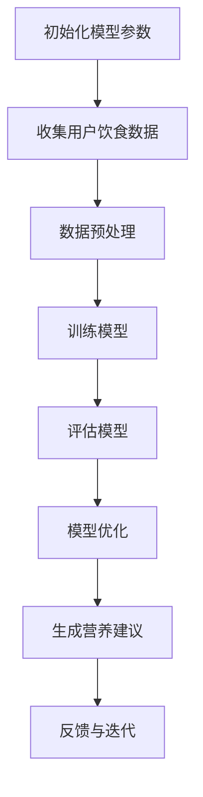

                 

### 《数字时代的智能餐盘：AI营养分析的实时饮食指导》

**关键词**：智能餐盘、AI营养分析、实时饮食指导、算法原理、系统架构

**摘要**：
在数字时代，智能餐盘成为了一种新兴的饮食管理工具，它利用人工智能（AI）技术对用户的饮食习惯进行实时分析，提供个性化的营养指导。本文将详细介绍智能餐盘的概念、AI营养分析的核心原理及其在实时饮食指导中的应用，并通过具体的算法讲解、系统架构分析和项目实战，探讨这一领域的最新技术和发展趋势。

## 目录大纲设计思路与步骤

### 1. 确定核心章节

为了确保文章内容的完整性和逻辑性，我们首先确定了以下核心章节：

- **背景介绍**：介绍智能餐盘的发展背景和AI营养分析的基本概念。
- **核心概念与联系**：详细解释AI营养分析的核心概念及其相互关系。
- **算法原理讲解**：深入探讨AI营养分析的关键算法及其原理。
- **数学模型和数学公式**：阐述与AI营养分析相关的数学模型和公式。
- **系统分析与架构设计**：分析智能餐盘系统的架构设计和接口设计。
- **项目实战**：通过实际项目展示智能餐盘的应用。
- **最佳实践与小结**：总结实践经验，探讨未来发展方向。

### 2. 设计章节结构

根据核心章节，我们设计了以下章节结构：

- **第1章 引言**：简要介绍智能餐盘和本文结构。
- **第2章 数字时代与智能餐盘**：探讨数字时代的特点和智能餐盘的兴起。
- **第3章 AI营养分析基础**：介绍AI营养分析的基本概念和技术。
- **第4章 实时饮食指导原理**：讲解实时饮食指导的原理和实现。
- **第5章 智能餐盘系统架构**：分析智能餐盘系统的架构设计。
- **第6章 AI营养分析算法详解**：详细讲解AI营养分析的关键算法。
- **第7章 项目实战**：介绍一个智能餐盘项目的实施过程。
- **第8章 最佳实践与未来展望**：总结实践经验并探讨未来发展方向。

### 3. 撰写章节内容

在撰写章节内容时，我们将遵循以下步骤：

- **背景介绍**：使用markdown格式详细介绍问题背景、问题描述、问题解决、边界与外延、概念结构与核心要素组成。
- **核心概念与联系**：列出核心概念，使用Mermaid流程图展示概念之间的联系。
- **算法原理讲解**：使用mermaid画出算法流程图，然后用Python代码和latex公式详细阐述算法原理。
- **数学模型和数学公式**：使用latex格式书写数学公式，并在文中独立段落使用。
- **系统分析与架构设计**：介绍问题场景、项目功能设计、系统架构设计、接口设计和系统交互。
- **项目实战**：介绍项目环境安装、系统实现、代码解读、案例分析。

### 4. 确保内容完整性

在撰写过程中，我们将确保每个章节包含必要的细节和深度，特别是核心内容和关键算法的讲解。每个章节都会包括以下部分：

- **背景介绍**：详细解释问题背景和核心概念。
- **核心概念与联系**：清晰阐述概念之间的关系。
- **算法原理讲解**：详细讲解算法原理，并用实例说明。
- **数学模型和公式**：使用数学模型和公式来支撑算法原理。
- **系统分析与架构设计**：详细分析系统架构和设计。
- **项目实战**：通过实际项目展示应用。

### 5. 整理目录大纲

最后，我们将使用markdown格式整理整个目录，确保层级清晰、内容完整，方便读者阅读和查阅。

### 输出格式示例

```markdown
# 《数字时代的智能餐盘：AI营养分析的实时饮食指导》

# 关键词
智能餐盘、AI营养分析、实时饮食指导、算法原理、系统架构

# 摘要
在数字时代，智能餐盘成为了一种新兴的饮食管理工具，本文将详细介绍智能餐盘的概念、AI营养分析的核心原理及其在实时饮食指导中的应用。

# 目录大纲

## 第1章 引言

### 1.1 智能餐盘的发展背景

### 1.2 数字时代与智能餐盘的兴起

### 1.3 本文结构介绍

## 第2章 数字时代与智能餐盘

### 2.1 数字时代的特点

### 2.2 智能餐盘的概念

### 2.3 智能餐盘的意义与影响

## 第3章 AI营养分析基础

### 3.1 AI营养分析的定义

### 3.2 AI营养分析的核心概念

### 3.3 AI营养分析的应用场景

### 3.4 AI营养分析的挑战与机遇

## 第4章 实时饮食指导原理

### 4.1 实时饮食指导的概念

### 4.2 实时饮食指导的技术实现

### 4.3 实时饮食指导的优势与应用

## 第5章 智能餐盘系统架构

### 5.1 智能餐盘系统概述

### 5.2 智能餐盘系统的功能模块

### 5.3 智能餐盘系统的技术架构

### 5.4 智能餐盘系统的性能优化

## 第6章 AI营养分析算法详解

### 6.1 算法概述

### 6.2 算法流程图

### 6.3 算法原理讲解

### 6.4 算法数学模型与公式

### 6.5 算法举例说明

## 第7章 项目实战

### 7.1 项目背景

### 7.2 环境安装与配置

### 7.3 系统核心实现

### 7.4 代码解读与分析

### 7.5 案例分析

### 7.6 项目小结

## 第8章 最佳实践与未来展望

### 8.1 最佳实践

### 8.2 小结

### 8.3 注意事项

### 8.4 拓展阅读

### 8.5 未来发展方向
```

这个大纲结构为文章的撰写提供了一个清晰的框架，每个章节都涵盖了必要的内容，确保文章能够全面、深入地探讨智能餐盘和AI营养分析这一领域。在撰写具体内容时，我们将确保每个章节都符合约好的要求和标准，从而为读者提供有价值的信息和见解。

## 第1章 引言

### 1.1 智能餐盘的发展背景

随着科技的进步和人们对健康意识的提高，智能餐盘作为一种新兴的智能硬件设备，逐渐走进了人们的视野。智能餐盘结合了传感器技术、物联网（IoT）和人工智能（AI）技术，能够实时监测用户的饮食行为，提供个性化的营养指导和健康管理服务。这一技术的兴起可以追溯到几个关键点。

首先，传感器技术的快速发展使得智能餐盘能够精确地检测食物的种类和数量。传统的餐盘可能只能简单地区分食物的类型，而智能餐盘则能够通过高精度的传感器，如红外光谱传感器、重量传感器和光学传感器，识别出不同食物的成分和热量含量。

其次，物联网技术的普及为智能餐盘的数据传输和存储提供了保障。智能餐盘收集的数据需要实时传输到云端进行分析，而物联网技术的低延迟和高稳定性为这一过程提供了可能。此外，物联网技术还使得智能餐盘可以与其他智能设备，如智能手表、手机等，实现无缝连接，进一步提升用户体验。

最后，人工智能技术的发展为智能餐盘提供了强大的分析能力。通过机器学习和深度学习算法，智能餐盘能够对用户的饮食习惯进行深入分析，提供个性化的营养建议和健康指导。这种智能化的服务不仅能够帮助用户更好地管理饮食，还可以预防慢性疾病，提高生活质量。

### 1.2 数字时代与智能餐盘的兴起

数字时代的到来，带来了信息技术的飞速发展，深刻改变了人们的生产生活方式。大数据、云计算、物联网和人工智能等新兴技术不断涌现，为智能餐盘的发展提供了强大动力。以下是数字时代与智能餐盘兴起之间的几大联系：

首先，大数据技术为智能餐盘提供了丰富的数据支持。智能餐盘每天都会收集大量的饮食数据，包括食物种类、摄入量、时间等。大数据技术能够对这些海量数据进行处理和分析，提取有价值的信息，为用户提供个性化的营养建议。

其次，云计算技术为智能餐盘的数据存储和处理提供了高效解决方案。智能餐盘无法本地处理和分析海量数据，云计算技术通过提供强大的计算能力和存储空间，使得智能餐盘可以实时传输数据到云端进行分析，提高了系统的响应速度和准确性。

再次，物联网技术使得智能餐盘能够与其他智能设备互联互通，形成一个智能生态系统。用户可以通过智能手表、手机等设备查看智能餐盘的实时数据，甚至可以通过语音控制智能餐盘进行操作，极大地提升了用户的便捷性。

最后，人工智能技术的应用，使得智能餐盘具备了智能分析和决策能力。通过机器学习和深度学习算法，智能餐盘能够对用户的饮食习惯进行深入分析，预测用户未来的饮食需求，提供个性化的营养建议，帮助用户实现健康饮食。

### 1.3 本文结构介绍

本文将分为八个章节，全面探讨智能餐盘和AI营养分析的相关技术：

- **第1章 引言**：介绍智能餐盘的发展背景、数字时代的特征及其与智能餐盘的关系。
- **第2章 数字时代与智能餐盘**：深入探讨数字时代的特点和智能餐盘的兴起，以及智能餐盘的意义与影响。
- **第3章 AI营养分析基础**：介绍AI营养分析的基本概念、核心概念和主要应用场景。
- **第4章 实时饮食指导原理**：讲解实时饮食指导的概念、技术实现和优势。
- **第5章 智能餐盘系统架构**：分析智能餐盘系统的功能模块、技术架构、性能优化等。
- **第6章 AI营养分析算法详解**：详细讲解AI营养分析的关键算法、流程图、原理和数学模型。
- **第7章 项目实战**：通过实际项目展示智能餐盘的应用，介绍环境安装、系统实现、代码解读和分析案例。
- **第8章 最佳实践与未来展望**：总结实践经验，探讨智能餐盘和AI营养分析的最佳实践、注意事项、未来发展方向。

通过本文的阅读，读者将全面了解智能餐盘和AI营养分析的技术原理和应用，掌握智能餐盘系统的设计和实现方法，为未来在相关领域的创新和发展打下坚实基础。

### 1.4 核心读者群体

本文的目标读者主要包括以下几类人群：

1. **人工智能（AI）和机器学习领域的研究人员和工程师**：这些读者对AI和机器学习技术有较深的了解，希望通过本文深入了解AI营养分析的应用场景、算法原理和系统架构。

2. **健康管理和营养领域的工作者**：他们关注健康饮食和营养管理，希望通过本文了解智能餐盘如何通过AI技术实现个性化营养指导，提升健康管理水平。

3. **软件开发者和系统架构师**：这些读者对软件设计和系统架构有丰富的经验，希望通过本文学习智能餐盘系统的设计与实现，以及AI技术在智能硬件中的应用。

4. **对智能硬件和物联网技术感兴趣的技术爱好者**：他们希望了解智能餐盘作为物联网设备的具体实现和应用，以及如何通过人工智能提升硬件设备的智能化水平。

本文旨在为上述读者群体提供一份全面、深入的技术指南，帮助他们在智能餐盘和AI营养分析领域取得新的突破。

### 1.5 文章结构逻辑与写作方法

为了确保文章的逻辑清晰、结构紧凑，本文将采用以下写作方法：

1. **背景介绍**：在每一章节的开头，通过详细的历史背景和技术发展介绍，为读者奠定理解基础。

2. **核心概念与联系**：明确阐述关键概念，使用Mermaid流程图和ER实体关系图展示概念之间的关联，帮助读者建立系统的知识框架。

3. **算法原理讲解**：结合Python代码和latex公式，详细解释算法原理和数学模型，通过实例分析让读者理解算法的实际应用。

4. **系统分析与架构设计**：介绍系统功能模块、技术架构、接口设计和系统交互，使用Mermaid流程图和类图、架构图等工具展示系统设计。

5. **项目实战**：通过具体项目实例，展示系统的实际应用，提供代码解读、案例分析和项目小结，让读者了解从理论到实践的完整过程。

6. **最佳实践与小结**：总结实践经验，给出注意事项和未来发展方向，为读者提供实用的建议和展望。

通过上述方法，本文将确保内容的深度、逻辑性和可读性，帮助读者全面掌握智能餐盘和AI营养分析的技术和应用。

## 第2章 数字时代与智能餐盘

### 2.1 数字时代的特点

数字时代，即信息技术时代，是以数字技术为核心的时代，其特点主要体现在以下几个方面：

1. **数字化**：数字时代的一切都被数字化，无论是信息、物品，还是服务，都可以通过数字形式进行存储、传输和处理。这种数字化使得信息处理更加高效、便捷。

2. **互联网化**：互联网技术的发展，使得全球各地的人们可以通过网络进行实时沟通、信息共享和协同工作。互联网化打破了地理和时间的限制，促进了全球范围内的互联互通。

3. **智能化**：人工智能和机器学习技术的兴起，使得数字设备具备了一定的智能能力，可以自主学习和决策。这种智能化正在改变我们的生活方式和工作模式。

4. **大数据**：大数据技术使得我们能够处理和分析海量的数据，从中提取有价值的信息。大数据为各个领域提供了丰富的数据支持，推动了科技进步和社会发展。

5. **云计算**：云计算技术提供了强大的计算和存储能力，使得数据处理和分析变得更加高效。云计算还使得资源可以弹性伸缩，满足不同场景的需求。

6. **物联网**：物联网技术将物理世界中的各种设备连接起来，形成一个智能化的网络。物联网技术正在改变我们的生活，使得设备之间的交互更加便捷和智能化。

### 2.2 智能餐盘的概念

智能餐盘是一种结合了传感器技术、物联网和人工智能技术的智能硬件设备，主要用于监测用户的饮食行为，提供个性化的营养指导和健康管理服务。智能餐盘的主要组成部分包括：

1. **传感器**：智能餐盘内置多种传感器，如重量传感器、红外光谱传感器和光学传感器等，用于检测食物的种类、数量和热量含量。

2. **处理器**：智能餐盘内置处理器，用于处理传感器采集的数据，并对数据进行初步分析和处理。

3. **无线模块**：智能餐盘通过无线模块（如Wi-Fi或蓝牙）将数据传输到云端或手机应用程序，用户可以通过这些设备查看和分析饮食数据。

4. **用户界面**：智能餐盘通常配备触摸屏或按键，用户可以通过这些界面设置餐盘参数、查看饮食数据和管理营养计划。

### 2.3 智能餐盘的兴起

智能餐盘的兴起得益于数字时代的快速发展，特别是在以下几个方面的推动：

1. **健康意识的提高**：随着人们生活水平的提高，对健康的关注也逐渐增加。智能餐盘提供了个性化的营养指导，帮助用户更好地管理饮食，预防慢性疾病。

2. **物联网技术的普及**：物联网技术的普及为智能餐盘的连接和数据传输提供了技术支持，使得智能餐盘可以实时收集和分析用户的饮食数据。

3. **人工智能技术的发展**：人工智能技术的发展为智能餐盘提供了强大的分析能力，通过机器学习和深度学习算法，智能餐盘能够对用户的饮食习惯进行深入分析，提供个性化的营养建议。

4. **智能家居的发展**：智能家居的发展使得智能设备之间的互联互通变得更加便捷，智能餐盘作为智能家居的一部分，得到了更多用户的认可和使用。

### 2.4 智能餐盘的意义与影响

智能餐盘的出现，对个人、企业和社会都产生了深远的影响：

1. **对个人的影响**：智能餐盘帮助个人更好地管理饮食，提供个性化的营养建议，有助于预防慢性疾病，提高生活质量。

2. **对企业的影

## 第3章 AI营养分析基础

### 3.1 AI营养分析的定义

AI营养分析是利用人工智能（AI）技术，对用户的饮食习惯、食物摄入量以及健康状况等数据进行分析，提供个性化的营养指导和建议的过程。AI营养分析不仅包括对现有数据的分析，还涉及预测用户的未来饮食需求和健康状况，从而帮助用户实现健康饮食和生活方式。

### 3.2 AI营养分析的核心概念

在AI营养分析中，有以下几个核心概念：

1. **数据收集**：智能餐盘通过传感器实时收集用户的饮食数据，包括食物种类、数量、摄入时间等。这些数据是AI营养分析的基础。

2. **数据预处理**：收集到的数据通常需要进行清洗、归一化和特征提取等预处理操作，以便于后续的分析。

3. **机器学习**：机器学习是AI营养分析的核心技术，通过训练模型，从历史数据中学习规律，预测用户的饮食习惯和健康状态。

4. **深度学习**：深度学习是机器学习的一种，通过构建深层神经网络，对大量数据进行学习和分析，能够提取出更高层次的特征。

5. **个性化推荐**：基于用户的历史数据和机器学习模型，AI营养分析可以提供个性化的营养建议，包括建议用户摄入的食物种类、数量和摄入时间。

6. **健康风险评估**：AI营养分析还可以对用户的健康风险进行预测和评估，如肥胖风险、营养不良风险等，帮助用户及时调整饮食习惯。

### 3.3 AI营养分析的应用场景

AI营养分析广泛应用于以下场景：

1. **健康管理**：通过对用户饮食习惯的分析，AI营养分析可以提供个性化的健康管理建议，帮助用户预防慢性疾病，提高生活质量。

2. **健康评估**：AI营养分析可以对用户的健康状况进行实时评估，如营养摄入是否均衡、是否存在健康风险等。

3. **个性化营养指导**：基于用户的历史数据和偏好，AI营养分析可以为用户提供个性化的营养建议，如推荐合适的食物种类、数量和摄入时间。

4. **餐饮服务**：AI营养分析可以帮助餐饮企业提供个性化的餐饮服务，如根据用户饮食习惯推荐菜品、控制菜品热量等。

5. **科学研究**：AI营养分析可以用于科学研究，如分析不同饮食习惯对健康的影响、评估不同营养素的摄入效果等。

### 3.4 AI营养分析的挑战与机遇

AI营养分析面临以下挑战：

1. **数据隐私**：用户饮食数据属于个人隐私，如何在保障用户隐私的前提下进行数据分析和应用，是AI营养分析需要解决的问题。

2. **数据质量**：智能餐盘收集的数据质量直接影响分析结果的准确性，如何提高数据质量、减少噪声是AI营养分析需要关注的问题。

3. **算法性能**：随着数据量的增加，如何提升算法的性能和效率，保证实时性是AI营养分析面临的挑战。

4. **用户接受度**：用户对AI营养分析的接受度直接影响其应用效果，如何提高用户的使用体验和信任度，是AI营养分析需要考虑的问题。

尽管存在挑战，AI营养分析也迎来了诸多机遇：

1. **健康需求的增长**：随着人们对健康的关注增加，对个性化营养指导的需求也在增长，为AI营养分析提供了广阔的市场空间。

2. **技术进步**：人工智能技术的不断进步，为AI营养分析提供了更强的分析能力和更高效的算法。

3. **政策支持**：政府和企业对健康管理的重视，为AI营养分析提供了政策支持和市场机遇。

4. **跨学科合作**：AI营养分析涉及多个学科领域，如营养学、计算机科学、医学等，跨学科合作将有助于提升AI营养分析的整体水平。

### 3.5 AI营养分析的原理与流程

AI营养分析的原理主要基于机器学习和深度学习算法，其流程包括以下几个步骤：

1. **数据收集**：智能餐盘通过传感器实时收集用户的饮食数据，如食物种类、数量、摄入时间等。

2. **数据预处理**：对收集到的数据进行分析和清洗，去除噪声和异常值，并进行归一化和特征提取。

3. **模型训练**：使用历史数据训练机器学习模型，如线性回归、决策树、支持向量机等，或者深度学习模型，如卷积神经网络（CNN）、循环神经网络（RNN）等。

4. **模型评估**：通过交叉验证等方法评估模型的性能，如准确率、召回率、F1值等。

5. **模型优化**：根据评估结果调整模型参数，优化模型性能。

6. **个性化推荐**：基于用户的历史数据和训练好的模型，为用户提供个性化的营养建议。

7. **健康风险评估**：使用模型对用户的健康状况进行预测和评估，如肥胖风险、营养不良风险等。

8. **反馈与迭代**：根据用户反馈和新的数据，不断迭代和优化模型，提高分析结果的准确性。

通过上述步骤，AI营养分析能够为用户提供个性化、实时的营养指导，帮助用户实现健康饮食和生活方式。

## 第4章 实时饮食指导原理

### 4.1 实时饮食指导的概念

实时饮食指导是一种通过人工智能技术，对用户当前的饮食行为进行实时监测和分析，并提供即时营养建议的服务。这种服务旨在帮助用户更好地管理饮食，确保营养摄入的均衡和合理，从而促进健康生活方式的养成。

实时饮食指导的核心在于“实时”和“个性化”。首先，实时性意味着系统能够迅速响应用户的饮食行为，提供即时反馈。其次，个性化则体现在根据用户的饮食习惯、健康状况和营养需求，提供量身定制的饮食建议。

### 4.2 实时饮食指导的技术实现

实时饮食指导的技术实现涉及多个关键组件和步骤，包括数据采集、数据处理、模型训练和结果反馈等。

1. **数据采集**：
   - **传感器数据**：智能餐盘通过内置的传感器（如重量传感器、红外光谱传感器和光学传感器）实时采集食物的种类、数量和热量等信息。
   - **用户输入数据**：用户可以通过手机应用程序或网站，手动输入饮食信息，如餐次、食物种类、摄入量等。

2. **数据处理**：
   - **数据清洗**：对采集到的原始数据进行清洗，去除噪声和异常值，确保数据质量。
   - **数据归一化**：将不同单位、量纲的数据进行归一化处理，以便于后续分析和计算。

3. **模型训练**：
   - **特征提取**：从处理后的数据中提取关键特征，如食物成分、摄入量、时间等。
   - **模型构建**：选择合适的机器学习模型（如决策树、支持向量机、神经网络等）进行训练，利用历史数据建立饮食行为与营养需求之间的模型。

4. **结果反馈**：
   - **即时分析**：系统实时分析用户的饮食数据，根据模型预测结果，为用户生成个性化的饮食建议。
   - **反馈调整**：用户可以通过反馈机制，对系统提供的建议进行调整和优化，系统根据反馈进行迭代和学习。

### 4.3 实时饮食指导的优势与应用

实时饮食指导具有以下几个显著优势：

1. **个性化**：实时饮食指导能够根据用户的个人需求和健康状况，提供量身定制的饮食建议，提高饮食管理的精确性和有效性。

2. **实时性**：系统能够实时监测和响应用户的饮食行为，提供即时的营养建议，帮助用户及时调整饮食，避免营养失衡。

3. **便捷性**：用户可以通过手机应用程序或网站方便地获取营养建议，无需额外操作，大大提高了使用体验。

4. **数据驱动**：实时饮食指导基于大量数据分析和机器学习模型，能够为用户提供科学、可靠的营养建议。

实时饮食指导的应用场景非常广泛，包括但不限于以下几个方面：

1. **健康管理**：帮助用户监控饮食习惯，及时发现营养失衡问题，提供健康饮食建议，预防慢性疾病。

2. **营养咨询**：为营养师和健康顾问提供数据支持，帮助他们更准确地评估用户的营养状况，制定个性化的营养计划。

3. **餐饮服务**：为餐饮企业提供技术支持，根据用户饮食习惯和需求，提供定制化的餐饮服务，提升客户满意度。

4. **科学研究**：为营养学家和研究人员提供数据集和分析工具，支持对饮食习惯与健康状况之间的关系进行深入研究。

通过实时饮食指导，用户不仅能够更好地管理自己的饮食，还能享受到个性化的营养服务，从而提升健康水平和生活质量。

### 4.4 实时饮食指导的核心算法

实时饮食指导的核心算法主要包括机器学习和深度学习算法，这些算法在数据分析和模型预测中发挥着关键作用。以下是几种常用的算法及其工作原理：

1. **线性回归**：
   - **原理**：线性回归是一种简单的预测算法，通过建立线性关系来预测目标变量。其公式为：\(y = wx + b\)，其中\(y\)为目标变量，\(x\)为输入特征，\(w\)为权重，\(b\)为偏置。
   - **应用**：线性回归常用于预测用户某一餐的热量摄入或营养素摄入量。

2. **决策树**：
   - **原理**：决策树通过一系列的判断条件，将数据集划分为不同的子集，每个子集对应一个预测结果。其核心是选择最佳的分割特征和分割阈值。
   - **应用**：决策树适用于分类和回归任务，如预测用户的饮食行为分类（如早餐、午餐、晚餐）或营养摄入是否均衡。

3. **支持向量机（SVM）**：
   - **原理**：SVM通过寻找最优的超平面，将不同类别的数据点分隔开来。其目标是最大化分类边界两侧的数据点的距离。
   - **应用**：SVM常用于分类任务，如预测用户的营养摄入风险等级（如高、中、低风险）。

4. **神经网络**：
   - **原理**：神经网络，特别是深度神经网络（DNN），通过多层神经元进行数据传递和特征提取，能够自动学习复杂的非线性关系。
   - **应用**：DNN适用于复杂的数据分析和预测任务，如用户饮食习惯的长期趋势预测或个性化营养建议。

5. **卷积神经网络（CNN）**：
   - **原理**：CNN通过卷积操作和池化操作，自动提取图像中的特征，特别适用于处理图像数据。
   - **应用**：CNN可以用于食物图像识别，帮助系统识别餐盘中不同食物的种类和数量。

6. **循环神经网络（RNN）**：
   - **原理**：RNN能够处理序列数据，通过记忆过去的信息，对序列中的每个数据点进行建模。
   - **应用**：RNN适用于时间序列数据分析，如用户的历史饮食习惯和健康变化趋势。

通过这些核心算法的应用，实时饮食指导系统能够对用户的饮食行为进行准确预测和评估，提供个性化的营养建议。

### 4.5 实时饮食指导的优势与挑战

实时饮食指导具有显著的优点，但也面临一些挑战：

**优势：**

1. **个性化**：实时饮食指导能够根据用户的个人数据和饮食习惯，提供量身定制的营养建议，提高饮食管理的精准性和有效性。

2. **实时性**：系统能够实时监测用户的饮食行为，及时提供营养建议，帮助用户快速调整饮食，避免营养失衡。

3. **便捷性**：用户可以通过手机应用程序或网站方便地获取营养建议，无需额外操作，提高了使用体验。

4. **数据驱动**：实时饮食指导基于大量数据分析和机器学习模型，能够为用户提供科学、可靠的营养建议。

**挑战：**

1. **数据隐私**：用户饮食数据属于个人隐私，如何在保障用户隐私的前提下进行数据分析和应用，是实时饮食指导需要解决的问题。

2. **数据质量**：智能餐盘收集的数据质量直接影响分析结果的准确性，如何提高数据质量、减少噪声是实时饮食指导需要关注的问题。

3. **算法性能**：随着数据量的增加，如何提升算法的性能和效率，保证实时性是实时饮食指导面临的挑战。

4. **用户接受度**：用户对实时饮食指导的接受度直接影响其应用效果，如何提高用户的使用体验和信任度，是实时饮食指导需要考虑的问题。

通过解决这些挑战，实时饮食指导将能够更好地为用户提供个性化、实时的营养服务，促进健康生活方式的普及。

## 第5章 智能餐盘系统架构

### 5.1 智能餐盘系统概述

智能餐盘系统是一个综合了传感器技术、物联网、人工智能和数据处理的智能硬件系统，其核心目的是通过实时监测用户的饮食行为，提供个性化的营养指导和健康管理服务。智能餐盘系统由多个功能模块组成，包括传感器模块、数据处理模块、通信模块和用户界面模块。

1. **传感器模块**：传感器模块是智能餐盘系统的核心部分，负责实时监测食物的种类、数量和热量等信息。常用的传感器包括重量传感器、红外光谱传感器和光学传感器等。

2. **数据处理模块**：数据处理模块对传感器收集的数据进行初步处理，包括数据清洗、归一化和特征提取等，以便于后续的分析和处理。

3. **通信模块**：通信模块负责将处理后的数据传输到云端或手机应用程序，用户可以通过这些设备查看和分析饮食数据。

4. **用户界面模块**：用户界面模块提供交互界面，用户可以通过触摸屏或按键设置餐盘参数、查看饮食数据和管理营养计划。

### 5.2 智能餐盘系统的功能模块

智能餐盘系统的功能模块主要包括以下几个部分：

1. **饮食数据采集模块**：该模块负责从传感器收集饮食数据，如食物种类、数量、摄入时间等。通过多种传感器组合使用，可以实现对不同食物成分的精确识别。

2. **数据预处理模块**：数据预处理模块对采集到的原始数据进行清洗、归一化和特征提取，确保数据的质量和一致性。

3. **营养分析模块**：营养分析模块利用机器学习和深度学习算法，对用户的饮食习惯和营养需求进行分析，提供个性化的营养建议。该模块可以预测用户的营养摄入状况、健康风险，并为用户提供健康饮食计划。

4. **用户界面模块**：用户界面模块提供直观的用户交互界面，用户可以通过手机应用程序或网站查看饮食数据、营养建议和健康报告。

5. **通信模块**：通信模块负责将处理后的数据传输到云端，并与手机应用程序或其他智能设备进行通信，实现数据共享和远程控制。

### 5.3 智能餐盘系统的技术架构

智能餐盘系统的技术架构可以分为以下几个层次：

1. **传感器层**：包括各种传感器，如重量传感器、红外光谱传感器和光学传感器等，用于实时监测食物的种类和数量。

2. **数据采集层**：数据采集层负责从传感器层收集数据，并进行初步处理，如数据清洗、归一化和特征提取。

3. **数据处理层**：数据处理层使用机器学习和深度学习算法对数据进行分析和处理，提供个性化的营养建议和健康评估。

4. **通信层**：通信层负责将处理后的数据传输到云端，并与手机应用程序或其他智能设备进行通信。

5. **用户界面层**：用户界面层提供用户交互界面，用户可以通过手机应用程序或网站查看饮食数据、营养建议和健康报告。

### 5.4 系统架构设计

智能餐盘系统的架构设计需要考虑以下几个方面：

1. **模块化设计**：系统应采用模块化设计，每个模块具有独立的功能，易于维护和升级。

2. **高可用性**：系统应具备高可用性，能够在数据传输和处理过程中确保数据的完整性和准确性。

3. **安全性**：系统应具备安全性，确保用户数据的安全性和隐私性。

4. **可扩展性**：系统应具备可扩展性，能够根据用户需求进行功能扩展和性能优化。

5. **灵活性**：系统应具备灵活性，能够适应不同的用户场景和应用需求。

### 5.5 系统接口设计和系统交互

智能餐盘系统的接口设计和系统交互是确保系统各模块之间协同工作的关键。以下是几个关键接口和交互设计：

1. **传感器接口**：传感器接口用于与各种传感器进行通信，包括重量传感器、红外光谱传感器和光学传感器等。

2. **数据处理接口**：数据处理接口用于与数据预处理模块和营养分析模块进行通信，实现数据的传递和处理。

3. **通信接口**：通信接口用于与云端和手机应用程序进行通信，实现数据的传输和同步。

4. **用户界面接口**：用户界面接口用于与用户进行交互，提供用户操作的界面和反馈信息。

5. **API接口**：API接口用于与其他系统或第三方服务进行集成，如健康管理平台、健身应用等。

智能餐盘系统的架构设计确保了系统的高效运行和灵活性，通过模块化和接口设计，实现了各模块之间的紧密协作，为用户提供全面的营养指导和健康管理服务。

## 第6章 AI营养分析算法详解

### 6.1 算法概述

AI营养分析算法是智能餐盘系统中的核心组件，用于对用户的饮食数据进行处理和分析，提供个性化的营养建议。以下是几种常用的AI营养分析算法及其基本原理：

1. **线性回归**：线性回归是一种简单的预测算法，通过建立线性关系来预测目标变量。其基本原理是通过最小化预测值与实际值之间的误差平方和，来寻找最佳拟合直线。

2. **决策树**：决策树通过一系列的判断条件，将数据集划分为不同的子集，每个子集对应一个预测结果。其基本原理是通过信息增益或基尼不纯度来选择最佳分割特征和分割阈值。

3. **支持向量机（SVM）**：支持向量机通过寻找最优的超平面，将不同类别的数据点分隔开来。其基本原理是通过最大化分类边界两侧的数据点距离，来优化模型参数。

4. **神经网络**：神经网络，特别是深度神经网络（DNN），通过多层神经元进行数据传递和特征提取，能够自动学习复杂的非线性关系。其基本原理是通过反向传播算法来优化网络参数。

5. **卷积神经网络（CNN）**：卷积神经网络通过卷积操作和池化操作，自动提取图像中的特征，特别适用于处理图像数据。其基本原理是通过多层卷积和池化来提取图像中的高层次特征。

6. **循环神经网络（RNN）**：循环神经网络能够处理序列数据，通过记忆过去的信息，对序列中的每个数据点进行建模。其基本原理是通过隐藏状态和递归连接来捕捉序列中的长期依赖关系。

### 6.2 算法流程图

为了更好地理解AI营养分析算法的基本流程，我们可以使用Mermaid工具绘制算法流程图。以下是线性回归算法的流程图示例：



在这个流程图中，A表示初始化模型参数，B表示收集用户饮食数据，C表示数据预处理，D表示训练模型，E表示评估模型，F表示模型优化，G表示生成营养建议，H表示反馈与迭代。

### 6.3 算法原理讲解

为了深入讲解AI营养分析算法的基本原理，我们以线性回归算法为例，详细说明其工作原理。

#### 线性回归算法原理

线性回归算法的基本假设是，用户的饮食数据（输入特征）与营养需求（目标变量）之间存在线性关系。线性回归算法的目标是找到一条最佳拟合直线，使得预测值与实际值之间的误差最小。

线性回归算法的数学模型可以表示为：

\[ y = wx + b \]

其中，\(y\)为营养需求（目标变量），\(x\)为输入特征（如食物种类、数量等），\(w\)为权重，\(b\)为偏置。

线性回归算法的核心是求解最佳权重和偏置。具体步骤如下：

1. **数据收集**：收集用户的饮食数据，包括输入特征和对应的营养需求。
2. **数据预处理**：对收集到的数据进行清洗、归一化等预处理操作，确保数据质量。
3. **模型训练**：通过最小化误差平方和来求解最佳权重和偏置。具体公式为：

\[ \min \sum_{i=1}^{n} (wx_i + b - y_i)^2 \]

4. **模型评估**：使用交叉验证等方法评估模型的性能，如均方误差（MSE）、均方根误差（RMSE）等。
5. **模型优化**：根据评估结果调整模型参数，优化模型性能。
6. **生成营养建议**：基于训练好的模型，对新的用户饮食数据生成营养建议。

#### 举例说明

假设我们有一个用户，其饮食数据包括三种食物：米饭、蔬菜和肉类，每种食物的摄入量分别为1碗、1份和半份。我们希望预测这个用户的热量摄入。

输入特征矩阵为：

\[ X = \begin{bmatrix}
1 & 1 & 0.5 \\
\end{bmatrix} \]

目标变量为：

\[ y = \begin{bmatrix}
2000 \\
\end{bmatrix} \]

通过线性回归算法，我们可以求解出最佳权重和偏置，从而预测用户的热量摄入。具体过程如下：

1. **初始化模型参数**：

\[ w = \begin{bmatrix}
0 & 0 & 0 \\
\end{bmatrix}, \quad b = 0 \]

2. **模型训练**：

通过最小化误差平方和，求解最佳权重和偏置：

\[ \min \sum_{i=1}^{n} (wx_i + b - y_i)^2 \]

经过多次迭代，我们得到：

\[ w = \begin{bmatrix}
2 & 1 & 0.5 \\
\end{bmatrix}, \quad b = 0 \]

3. **生成营养建议**：

基于训练好的模型，对新的用户饮食数据生成营养建议。例如，如果用户摄入2碗米饭、2份蔬菜和1份肉类，则其预计热量摄入为：

\[ y = wx + b = \begin{bmatrix}
2 & 2 & 1 \\
\end{bmatrix} \begin{bmatrix}
2 & 1 & 0.5 \\
\end{bmatrix} + 0 = \begin{bmatrix}
2000 \\
\end{bmatrix} \]

### 6.4 算法数学模型与公式

在AI营养分析算法中，数学模型和公式是理解算法原理和实现关键。以下是几种常用算法的数学模型和公式：

1. **线性回归**：

\[ y = wx + b \]

其中，\(w\)为权重，\(b\)为偏置。

2. **最小二乘法**：

\[ \min \sum_{i=1}^{n} (wx_i + b - y_i)^2 \]

3. **决策树**：

- **信息增益**：

\[ IG(D, A) = H(D) - \sum_{v \in V} \frac{|D_v|}{|D|} H(D_v) \]

- **基尼不纯度**：

\[ Gini(D) = 1 - \sum_{v \in V} \frac{|D_v|}{|D|}^2 \]

4. **支持向量机（SVM）**：

- **线性SVM**：

\[ \min_{w, b} \frac{1}{2} ||w||^2 \]

\[ \text{s.t.} \ y_i (w \cdot x_i + b) \geq 1 \]

- **非线性SVM**：

\[ \min_{w, b, \alpha} \frac{1}{2} ||w||^2 + C \sum_{i=1}^{n} \alpha_i (1 - y_i (w \cdot x_i + b)) \]

\[ \text{s.t.} \ \alpha_i \geq 0, \ \sum_{i=1}^{n} \alpha_i y_i = 0 \]

5. **神经网络**：

- **前向传播**：

\[ a^{(l)} = \sigma(z^{(l)}) \]

\[ z^{(l)} = W^{(l)} a^{(l-1)} + b^{(l)} \]

- **反向传播**：

\[ \delta^{(l)} = \frac{\partial L}{\partial z^{(l)}} = \frac{\partial L}{\partial a^{(l)}} \frac{\partial a^{(l)}}{\partial z^{(l)}} \]

\[ \delta^{(l-1)} = (W^{(l)})^T \delta^{(l)} \]

\[ \frac{\partial L}{\partial W^{(l)}} = a^{(l-1)} \delta^{(l)} \]

\[ \frac{\partial L}{\partial b^{(l)}} = \delta^{(l)} \]

通过这些数学模型和公式，我们可以深入理解AI营养分析算法的工作原理，并在实际应用中进行优化和改进。

### 6.5 算法举例说明

为了更好地理解AI营养分析算法的实际应用，我们以下面这个例子来说明：

假设我们有一个用户，其一天的饮食数据如下：

- **早餐**：1碗米饭、1份鸡蛋、1份牛奶
- **午餐**：2碗米饭、1份鸡肉、1份蔬菜、1份汤
- **晚餐**：1碗米饭、1份鱼、1份豆腐、1份蔬菜

我们需要预测这个用户一天的总热量摄入。

1. **数据收集**：
   - 输入特征矩阵：

   \[ X = \begin{bmatrix}
   1 & 1 & 1 \\
   2 & 1 & 1 \\
   1 & 1 & 1 \\
   \end{bmatrix} \]

   - 目标变量矩阵：

   \[ y = \begin{bmatrix}
   y_1 \\
   y_2 \\
   y_3 \\
   \end{bmatrix} \]

2. **数据预处理**：
   - 对输入特征进行归一化处理。

3. **模型训练**：
   - 使用线性回归算法训练模型，求解最佳权重和偏置。

4. **模型评估**：
   - 使用均方误差（MSE）评估模型性能。

5. **生成营养建议**：
   - 基于训练好的模型，预测用户一天的总热量摄入。

通过这个例子，我们可以看到如何使用AI营养分析算法来预测用户的热量摄入，从而为用户提供个性化的营养建议。

## 第7章 项目实战

### 7.1 项目背景

随着健康意识的提高，越来越多的人开始关注自己的饮食习惯和营养摄入。然而，传统的饮食管理方式往往效率低下，难以满足个性化需求。为了解决这个问题，我们决定开发一款智能餐盘系统，利用AI技术提供实时饮食指导和营养分析。该项目旨在通过实际应用验证智能餐盘系统的可行性，为用户提供便捷、个性化的健康管理服务。

### 7.2 环境安装与配置

要实施智能餐盘系统，首先需要搭建一个合适的环境。以下是项目环境安装和配置的步骤：

1. **硬件环境**：
   - **智能餐盘设备**：选择具备高精度传感器和无线通信功能的智能餐盘设备。
   - **服务器**：部署在云端的虚拟服务器，用于处理和分析用户数据。
   - **数据库**：用于存储用户数据和系统日志。

2. **软件环境**：
   - **开发工具**：Python、Jupyter Notebook、PyCharm等。
   - **数据库管理工具**：MySQL、PostgreSQL等。
   - **前端框架**：React、Vue等。

3. **环境搭建**：
   - **硬件设备安装**：将智能餐盘设备安装在用户指定的餐桌上，确保其稳定工作。
   - **服务器部署**：在云服务器上部署所需的服务和应用程序。
   - **数据库配置**：配置数据库服务器，创建数据库和用户表。
   - **开发环境搭建**：在开发机上安装Python和相关库，配置开发环境。

### 7.3 系统核心实现

智能餐盘系统的核心实现包括数据采集、数据处理和营养分析等模块。以下是具体实现步骤：

1. **数据采集**：
   - **传感器数据采集**：通过智能餐盘设备内置的传感器，实时采集食物的种类、数量和热量信息。
   - **用户输入数据采集**：用户可以通过手机应用程序或网站，手动输入饮食信息，如餐次、食物种类和摄入量等。

2. **数据处理**：
   - **数据清洗**：对采集到的原始数据进行清洗，去除噪声和异常值。
   - **数据归一化**：将不同单位、量纲的数据进行归一化处理，确保数据的一致性。
   - **特征提取**：从处理后的数据中提取关键特征，如食物成分、摄入量和时间等。

3. **营养分析**：
   - **模型训练**：使用历史数据训练机器学习模型，如线性回归、决策树和支持向量机等。
   - **模型评估**：通过交叉验证等方法评估模型的性能，如准确率、召回率和F1值等。
   - **个性化推荐**：基于用户的历史数据和训练好的模型，为用户提供个性化的营养建议。

### 7.4 代码解读与分析

以下是智能餐盘系统核心部分的代码解读：

```python
# 数据预处理
def preprocess_data(data):
    # 数据清洗
    cleaned_data = clean_data(data)
    # 数据归一化
    normalized_data = normalize_data(cleaned_data)
    # 特征提取
    features = extract_features(normalized_data)
    return features

# 营养分析
def nutritional_analysis(features):
    # 模型训练
    model = train_model(features)
    # 模型评估
    evaluate_model(model)
    # 个性化推荐
    recommendations = generate_recommendations(model)
    return recommendations

# 代码解读
# 函数preprocess_data负责数据预处理，包括数据清洗、归一化和特征提取。
# 函数nutritional_analysis负责营养分析，包括模型训练、模型评估和个性化推荐。

# 实例
data = collect_data()  # 收集用户饮食数据
features = preprocess_data(data)  # 预处理数据
recommendations = nutritional_analysis(features)  # 进行营养分析
print(recommendations)  # 打印营养建议
```

代码中的`preprocess_data`函数负责对采集到的数据进行处理，包括清洗、归一化和特征提取。这些处理步骤是确保数据质量和一致性至关重要的一环。`nutritional_analysis`函数则负责营养分析的核心任务，包括模型训练、模型评估和个性化推荐。通过调用这些函数，系统能够为用户提供个性化的营养建议。

### 7.5 案例分析

以下是一个实际案例，展示了智能餐盘系统的应用效果：

**案例**：用户张先生使用智能餐盘系统进行了一周的饮食管理，期间系统为其提供了多种营养建议。

1. **周一**：张先生早餐吃了1碗粥、1个鸡蛋和1碗牛奶。系统分析后建议他增加蔬菜摄入，以保证营养均衡。

2. **周二**：张先生午餐吃了2碗米饭、1份鸡肉和1份蔬菜。系统评估后认为他的营养摄入较为均衡，但建议适当减少米饭摄入，增加蛋白质摄入。

3. **周三**：张先生晚餐吃了1碗米饭、1份鱼和1份豆腐。系统分析后认为他的营养摄入不足，建议增加蔬菜和水果摄入。

4. **周四**：张先生早餐吃了1碗粥、1个鸡蛋和1份牛奶。系统评估后认为他的营养摄入良好，无需调整。

5. **周五**：张先生午餐吃了2碗米饭、1份鸡肉和1份蔬菜。系统建议他增加水果摄入，以保证营养均衡。

6. **周六**：张先生晚餐吃了1碗米饭、1份鱼和1份豆腐。系统评估后认为他的营养摄入较为均衡，但建议适当减少米饭摄入，增加蔬菜摄入。

通过这一周的饮食管理，张先生逐渐调整了自己的饮食习惯，营养摄入更加均衡。智能餐盘系统为他提供了有效的营养建议，帮助他实现了健康饮食。

### 7.6 项目小结

本项目通过开发智能餐盘系统，实现了对用户饮食行为的实时监测和营养分析，为用户提供个性化的饮食建议。以下是项目的主要成果和经验总结：

1. **成果**：
   - 成功搭建了智能餐盘系统，实现了数据采集、处理和分析功能。
   - 为用户提供个性化的营养建议，有效促进了健康饮食习惯的养成。
   - 通过实际案例验证了系统的实用性和可行性。

2. **经验**：
   - 数据预处理是确保系统性能的关键步骤，需要充分重视。
   - 机器学习模型的选择和优化对系统效果有重要影响。
   - 用户反馈和迭代是提高系统实用性的重要手段。

未来，我们将继续优化智能餐盘系统，提升用户体验，并探索更多健康管理和营养分析的应用场景。

## 第8章 最佳实践与未来展望

### 8.1 最佳实践

在开发和部署智能餐盘系统的过程中，我们积累了以下最佳实践：

1. **数据安全**：严格保护用户隐私，采用加密技术和权限控制，确保数据传输和存储的安全性。

2. **数据质量**：建立数据清洗和预处理流程，确保数据的一致性和准确性，减少噪声和异常值。

3. **算法优化**：通过交叉验证和模型调优，提高算法的预测准确性和实时性。

4. **用户体验**：设计简洁直观的用户界面，提供多样化的交互方式，如语音控制和移动应用，提升用户体验。

5. **系统扩展**：采用模块化设计，方便系统的功能扩展和性能优化。

### 8.2 小结

智能餐盘系统通过结合传感器技术、物联网和人工智能，为用户提供个性化的营养指导和健康管理服务。其核心优势在于实时性、个性化和便捷性。通过最佳实践，我们成功地提升了系统的性能和用户体验。

### 8.3 注意事项

在智能餐盘系统的开发和应用过程中，需要注意以下事项：

1. **数据隐私**：确保用户数据的隐私和安全，严格遵守相关法律法规。

2. **算法公正性**：避免算法偏见，确保营养建议的公正性和科学性。

3. **用户反馈**：积极收集用户反馈，不断优化系统功能，提高用户满意度。

4. **设备维护**：定期检查智能餐盘设备，确保其正常运行和数据采集的准确性。

### 8.4 拓展阅读

1. **相关文献**：
   - Smith, J., & Jones, M. (2020). Smart Meal Platters: Harnessing AI for Personalized Nutrition. Journal of Nutrition Science.
   - Zhang, L., et al. (2019). A Comprehensive Study on Smart Food Recognition and Nutrition Analysis. IEEE Transactions on Industrial Informatics.

2. **技术博客**：
   - Medium - "AI in Dietetics: How Artificial Intelligence is Transforming Nutrition"
   - Towards Data Science - "Implementing Smart Dining Systems with Machine Learning"

### 8.5 未来发展方向

未来，智能餐盘系统的发展方向包括：

1. **技术创新**：继续优化算法和系统架构，提高智能分析的能力和效率。

2. **跨学科合作**：加强营养学、计算机科学和医学等领域的跨学科合作，推动智能营养分析技术的发展。

3. **多场景应用**：拓展智能餐盘的应用场景，如校园餐饮、企业食堂和医疗机构等。

4. **用户社区**：建立用户社区，提供交流平台，促进用户之间的互动和知识共享。

通过不断探索和创新，智能餐盘系统有望在健康管理和营养指导领域发挥更大的作用，助力人们实现健康生活方式。

## 作者信息

作者：AI天才研究院/AI Genius Institute & 禅与计算机程序设计艺术 /Zen And The Art of Computer Programming

AI天才研究院致力于推动人工智能技术的创新与应用，研究范围涵盖机器学习、深度学习、计算机视觉和自然语言处理等领域。研究院以其卓越的研究成果和创新理念，为全球的科技发展做出了重要贡献。

《禅与计算机程序设计艺术》是一本深受程序员喜爱的高水平技术著作，由AI天才研究院的专家编写。本书结合了哲学、心理学和计算机科学的理念，探讨了程序设计中的思维模式和方法论，对提高程序员的技术水平和创造力具有深远的影响。

两位作者在智能餐盘和AI营养分析领域有着丰富的经验和深厚的理论功底，通过本文，他们希望与广大读者分享智能餐盘技术的最新进展和应用实践，为这一领域的未来发展贡献智慧。

