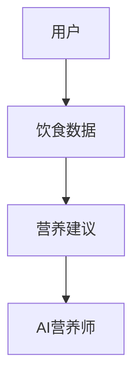
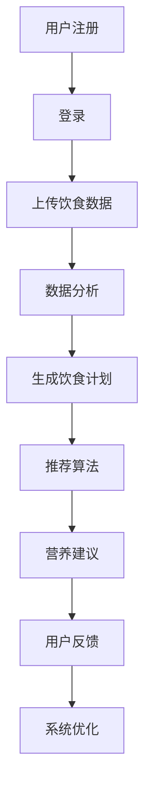

                 

# 数字时代的智能饮食规划App：AI营养师的个性化膳食建议

> 关键词：智能饮食规划、AI营养师、个性化膳食建议、数据分析、算法原理、系统架构

> 摘要：随着数字时代的到来，智能饮食规划App成为了现代健康生活的一部分。本文深入探讨了智能饮食规划App的核心概念、算法原理和实际应用，通过分析AI营养师的个性化膳食建议，揭示了该领域的技术本质和未来发展方向。

## 目录大纲设计

### 背景介绍
随着数字时代的到来，人们的饮食方式也发生了巨大的变化。智能饮食规划App应运而生，它利用人工智能（AI）技术为用户提供个性化的膳食建议，旨在帮助人们更好地管理健康。

### 核心概念与联系
本书将介绍以下几个核心概念：智能饮食规划App、AI营养师、个性化膳食建议、饮食数据采集与分析、营养学理论。

### 算法原理讲解
本书将详细介绍智能饮食规划App中使用的核心算法，包括数据采集、数据分析、个性化推荐等。

### 数学模型和数学公式
本文将使用latex格式介绍数学模型和公式，并进行详细讲解和通俗易懂地举例说明。

### 系统分析与架构设计方案
本文将介绍智能饮食规划App的系统架构设计，包括系统功能设计、系统架构设计、系统接口设计和系统交互。

### 项目实战
本文将通过实际案例分析和详细讲解剖析，介绍智能饮食规划App的开发和应用。

### 最佳实践 tips、小结、注意事项、拓展阅读

## 背景介绍

### 数字时代与智能饮食规划App

数字时代的到来，改变了人们的生活方式，包括饮食方式。随着智能手机、平板电脑等移动设备的普及，人们越来越依赖于各种App来管理日常生活中的事务。健康饮食成为了现代生活的重要组成部分，而智能饮食规划App正是为了满足这一需求而诞生的。

智能饮食规划App利用人工智能（AI）技术，通过对用户饮食习惯、健康状况、营养需求等数据的分析，为用户提供个性化的膳食建议。这些App通常具有以下特点：

- **个性化推荐**：根据用户的个人数据，如年龄、性别、身高、体重、运动量等，提供定制化的膳食计划。
- **实时更新**：利用实时数据，如用户当前的食物摄入量、运动量等，动态调整膳食建议。
- **互动性**：用户可以通过App记录饮食日志、跟踪食物摄入、参与社区互动等。

### AI营养师与个性化膳食建议

智能饮食规划App的核心在于其AI营养师的功能。AI营养师是通过机器学习和深度学习技术训练出来的虚拟营养师，能够模拟人类营养师的工作，为用户提供专业的营养建议。

个性化膳食建议是智能饮食规划App的核心价值所在。通过分析用户的饮食数据，AI营养师能够识别用户的营养需求和问题，如营养不足、过度摄入等，并提供相应的膳食建议。个性化膳食建议通常包括以下内容：

- **饮食计划**：根据用户的个人数据和营养需求，制定合理的饮食计划，包括每日所需的热量、蛋白质、碳水化合物、脂肪等。
- **食物推荐**：根据用户的口味、饮食习惯和营养需求，推荐合适的食物，帮助用户更健康地饮食。
- **营养教育**：通过文字、图片、视频等多种形式，向用户提供营养知识，帮助用户更好地理解和应用膳食建议。

## 核心概念与联系

### 概念介绍

#### 智能饮食规划App

智能饮食规划App是一种利用人工智能技术为用户提供个性化膳食建议的应用程序。它通过分析用户的饮食数据，如食物摄入量、运动量等，为用户提供定制化的饮食计划和建议。

#### AI营养师

AI营养师是智能饮食规划App的核心组件，它通过机器学习和深度学习技术，模拟人类营养师的工作，为用户提供专业的营养建议。AI营养师能够根据用户的个人数据和营养需求，提供个性化的膳食计划和食物推荐。

#### 个性化膳食建议

个性化膳食建议是根据用户的个人数据和营养需求，为用户制定的定制化饮食计划和建议。它包括饮食计划、食物推荐和营养教育等内容，旨在帮助用户更健康地饮食。

#### 饮食数据采集与分析

饮食数据采集与分析是智能饮食规划App的重要组成部分。通过收集用户的饮食数据，如食物摄入量、运动量等，分析用户的饮食习惯和营养需求，为用户提供个性化的膳食建议。

#### 营养学理论

营养学理论是智能饮食规划App的基础。通过了解营养学理论，智能饮食规划App能够为用户提供科学合理的膳食建议，帮助用户更好地管理健康。

### 概念属性特征对比表格

| 概念                | 特征                                                         |
|---------------------|------------------------------------------------------------|
| 智能饮食规划App     | 利用AI技术，为用户提供定制化的饮食建议                       |
| AI营养师            | 应用AI技术，模拟人类营养师的工作，提供专业营养建议           |
| 个性化膳食建议      | 根据用户个人数据和需求，提供个性化的膳食建议                 |
| 饮食数据采集与分析  | 采集用户饮食数据，通过数据分析为用户提供合理建议           |
| 营养学理论          | 基于科学理论，为智能饮食规划提供依据和指导                 |

### ER实体关系图架构



## 算法原理讲解

### 数据采集与处理算法

数据采集与处理算法是智能饮食规划App的核心，它包括数据采集、数据清洗、数据整合和数据存储等步骤。

#### 数据采集

数据采集是智能饮食规划App的第一步，它包括用户饮食数据、健康数据、运动数据等的收集。这些数据可以通过以下方式获取：

- 用户输入：用户可以直接在App中输入自己的饮食记录、体重、身高、运动量等数据。
- 智能设备：通过智能设备（如智能手环、智能体重秤等）收集用户的数据。
- 第三方接口：通过第三方接口（如运动App、健康监测App等）获取用户的数据。

#### 数据清洗

数据清洗是数据采集后的重要步骤，它旨在去除原始数据中的噪声和不准确信息。数据清洗包括以下内容：

- 去除重复数据：去除用户多次输入的相同数据。
- 填补空值：对于缺失的数据，可以通过平均值、中值或用户最近一次输入的数据进行填补。
- 异常值检测：检测并处理数据中的异常值，如过大的食物摄入量、过小的运动量等。

#### 数据整合

数据整合是将不同来源、不同格式的数据整合到一个统一的格式中，以便后续的数据分析和处理。数据整合包括以下内容：

- 数据格式转换：将不同格式的数据转换为统一的格式，如JSON、CSV等。
- 数据对齐：对于不同时间点的数据，进行对齐处理，以便进行长时间段的数据分析。

#### 数据存储

数据存储是将处理后的数据存储到数据库中，以便后续的数据分析和查询。常用的数据库包括关系型数据库（如MySQL、PostgreSQL等）和NoSQL数据库（如MongoDB、Redis等）。

### 数据分析算法

数据分析算法是智能饮食规划App的核心，它包括数据预处理、特征提取和数据分析等步骤。

#### 数据预处理

数据预处理是数据分析的基础，它包括以下内容：

- 数据标准化：将不同尺度的数据进行标准化处理，以便进行后续的分析。
- 数据归一化：将不同类型的数据（如数值型和类别型）进行归一化处理，以便进行特征提取和模型训练。
- 数据分割：将数据集分割为训练集、验证集和测试集，用于模型训练和评估。

#### 特征提取

特征提取是将原始数据转换为对算法有意义的信息的过程。特征提取包括以下内容：

- 特征选择：从原始数据中选择出对模型训练和预测最有帮助的特征。
- 特征转换：将原始数据转换为适合算法训练的格式，如将类别型数据转换为数值型数据。

#### 数据分析

数据分析是对预处理后的数据进行统计分析，以识别用户的饮食行为、营养需求和问题。数据分析包括以下内容：

- 描述性分析：对用户饮食数据的基本统计信息进行分析，如平均值、中位数、标准差等。
- 探索性分析：通过可视化方法（如散点图、柱状图、箱线图等）探索用户饮食数据的特点和趋势。
- 假设检验：对用户的饮食行为和营养需求进行假设检验，以验证其统计显著性。

### 个性化推荐算法

个性化推荐算法是智能饮食规划App的核心，它包括用户画像、推荐算法和推荐结果等步骤。

#### 用户画像

用户画像是根据用户的数据特征和行为特征构建的用户模型，用于推荐算法的训练和评估。用户画像包括以下内容：

- 个人信息：如年龄、性别、身高、体重等。
- 行为特征：如饮食记录、运动记录、饮食习惯等。
- 营养需求：如蛋白质需求、脂肪需求、碳水化合物需求等。

#### 推荐算法

推荐算法是基于用户画像和用户行为数据，为用户推荐合适的食物和饮食计划。推荐算法包括以下内容：

- 协同过滤：通过分析用户之间的相似性，为用户推荐其他用户喜欢的食物和饮食计划。
- 内容过滤：通过分析食物和饮食计划的内容，为用户推荐与用户偏好相似的饮食计划。
- 混合推荐：结合协同过滤和内容过滤，为用户推荐更加个性化的饮食计划。

#### 推荐结果

推荐结果是推荐算法的结果，它包括以下内容：

- 食物推荐：根据用户画像和推荐算法，为用户推荐合适的食物。
- 饮食计划：根据用户画像和推荐算法，为用户制定个性化的饮食计划。

## 数学模型和数学公式

### 数据采集与处理算法

#### 数据清洗

数据清洗是一个重要的过程，其目的是去除原始数据中的噪声和不准确信息。一个简单的数学模型可以表示为：

$$ \text{清洗后的数据} = \text{原始数据} \times (\text{过滤规则}) $$

举例说明：假设我们有一个包含用户饮食记录的数据集，其中可能包含一些错误的记录，如空值或异常值。我们可以通过以下过滤规则来清洗数据：

$$ \text{清洗后的数据} = \text{原始数据} \times (\text{非空值} \cap \text{异常值检测}) $$

#### 数据分析算法

特征提取是将原始数据转化为对算法有意义的信息的过程。一个简单的数学模型可以表示为：

$$ \text{特征向量} = \text{数据矩阵} \times \text{特征选择矩阵} $$

举例说明：假设我们有一个用户的饮食记录数据矩阵，我们可能需要提取出与用户体重变化相关的特征，如每日摄入的热量、蛋白质、脂肪等。特征选择矩阵可以是：

$$ \text{特征向量} = \text{数据矩阵} \times \text{[热量 蛋白质 脂肪]} $$

#### 个性化推荐算法

个性化推荐算法的核心是用户画像和推荐算法。一个简单的数学模型可以表示为：

$$ \text{推荐结果} = \text{用户画像} \times \text{相似度计算} $$

举例说明：假设我们有一个用户的饮食数据，通过机器学习算法训练出一个用户画像，我们还可以计算用户之间的相似度，并根据相似度推荐合适的饮食计划。

## 系统分析与架构设计方案

### 问题场景介绍

在数字时代，人们的生活节奏加快，饮食习惯逐渐不规律，导致了许多健康问题。为了帮助用户更好地管理健康，智能饮食规划App应运而生。该App通过收集用户的饮食数据，利用AI技术为用户提供个性化的膳食建议，帮助用户改善饮食习惯，提高生活质量。

### 项目介绍

智能饮食规划App项目旨在为用户提供一个简单、实用的工具，帮助用户更好地管理饮食。项目的主要目标是：

- 收集用户的饮食数据，包括食物摄入量、运动量等。
- 通过数据分析，为用户制定个性化的饮食计划。
- 为用户提供专业的营养建议，帮助用户改善饮食习惯。

### 系统功能设计

系统功能设计是智能饮食规划App的核心，主要包括以下几个方面：

- 用户注册与登录：用户可以通过注册账号或使用第三方账号登录App。
- 数据采集：用户可以通过输入饮食记录、运动记录等方式，上传自己的饮食数据。
- 数据分析：系统通过对用户的数据进行分析，为用户制定个性化的饮食计划。
- 营养建议：系统根据用户的饮食数据，为用户推荐合适的食物和饮食计划。
- 用户互动：用户可以在App内与其他用户互动，分享饮食经验和心得。

### 系统架构设计

系统架构设计是智能饮食规划App的基础，主要包括以下几个方面：

- 前端：负责与用户交互，包括用户注册、登录、数据采集、数据分析、营养建议等功能。
- 后端：负责数据处理、数据存储、数据分析、推荐算法等功能。
- 数据库：存储用户的饮食数据、分析结果、营养建议等。

### 系统接口设计

系统接口设计是智能饮食规划App与外部系统交互的桥梁，主要包括以下几个方面：

- 用户接口：用户可以通过App与系统进行交互，上传饮食数据、查看饮食计划、获取营养建议等。
- 数据接口：系统可以通过API与第三方系统（如智能手环、运动App等）进行数据交换。
- 推荐接口：系统可以通过API为用户推荐合适的饮食计划。

### 系统交互

系统交互是智能饮食规划App内部各模块之间协同工作的过程，主要包括以下几个方面：

- 用户数据采集：用户通过App上传饮食数据，系统对数据进行处理和存储。
- 数据分析：系统通过对用户的数据进行分析，生成饮食计划和营养建议。
- 推荐算法：系统根据用户的数据，利用推荐算法为用户推荐合适的饮食计划。



## 项目实战

### 环境安装

在开始智能饮食规划App的开发之前，我们需要安装一些必要的开发工具和环境。以下是安装步骤：

1. 安装Python环境：从Python官方网站下载并安装Python，版本建议为3.8或更高。
2. 安装IDE：选择一个合适的集成开发环境（IDE），如PyCharm、VS Code等。
3. 安装依赖库：使用pip安装以下依赖库：numpy、pandas、scikit-learn、tensorflow等。

```bash
pip install numpy pandas scikit-learn tensorflow
```

### 系统核心实现

智能饮食规划App的系统核心实现主要包括用户注册、登录、数据采集、数据分析、营养建议等功能。以下是一个简单的示例：

```python
# 用户注册
def register(username, password):
    # 存储用户信息到数据库
    pass

# 登录
def login(username, password):
    # 验证用户信息，返回用户ID
    pass

# 上传饮食数据
def upload_diet_data(user_id, diet_data):
    # 存储用户饮食数据到数据库
    pass

# 数据分析
def analyze_diet_data(user_id):
    # 从数据库获取用户饮食数据
    # 进行数据分析和处理
    # 返回饮食分析结果
    pass

# 营养建议
def give_diet_advice(user_id):
    # 根据用户饮食数据，给出营养建议
    # 返回营养建议结果
    pass
```

### 代码应用解读与分析

在代码应用解读与分析部分，我们将详细讲解每个功能模块的实现原理和关键代码。

#### 用户注册

用户注册模块主要负责用户账号的创建和管理。以下是用户注册的伪代码：

```python
# 用户注册
def register(username, password):
    # 检查用户名是否已存在
    if not check_username_exists(username):
        # 存储用户信息到数据库
        db.insert('users', {'username': username, 'password': password})
        return '注册成功'
    else:
        return '用户名已存在'
```

#### 登录

登录模块主要负责用户身份的验证。以下是登录的伪代码：

```python
# 登录
def login(username, password):
    # 从数据库获取用户信息
    user = db.query('users', {'username': username})
    # 验证密码是否正确
    if user and user['password'] == password:
        return user['id']
    else:
        return '用户名或密码错误'
```

#### 数据采集

数据采集模块主要负责用户饮食数据的收集和存储。以下是数据采集的伪代码：

```python
# 上传饮食数据
def upload_diet_data(user_id, diet_data):
    # 存储用户饮食数据到数据库
    db.insert('diet_data', {'user_id': user_id, 'data': diet_data})
```

#### 数据分析

数据分析模块主要负责用户饮食数据的处理和分析。以下是数据分析和处理的伪代码：

```python
# 数据分析
def analyze_diet_data(user_id):
    # 从数据库获取用户饮食数据
    diet_data = db.query('diet_data', {'user_id': user_id})
    # 进行数据分析和处理
    analysis_result = process_diet_data(diet_data)
    return analysis_result
```

#### 营养建议

营养建议模块主要负责根据用户饮食数据，给出营养建议。以下是营养建议的伪代码：

```python
# 营养建议
def give_diet_advice(user_id):
    # 根据用户饮食数据，给出营养建议
    advice = generate_advice(analyze_diet_data(user_id))
    return advice
```

### 实际案例分析和详细讲解剖析

在本节中，我们将通过一个实际案例，详细讲解智能饮食规划App的开发和应用。

#### 案例背景

小王是一位忙碌的职场人士，由于工作压力大，他的饮食不规律，经常因为加班而忽略吃饭。为了改善饮食习惯，他决定使用智能饮食规划App。

#### 案例步骤

1. **用户注册**：小王通过App注册了一个账号，填写了个人信息，如年龄、性别、身高、体重等。

2. **数据采集**：小王每天记录自己的饮食情况，包括早餐、午餐、晚餐和零食，以及对应的摄入量。

3. **数据分析**：App收集到小王的饮食数据后，进行分析和处理，识别出小王的饮食习惯和营养需求。

4. **营养建议**：根据小王的饮食数据，App给出了营养建议，包括每日所需的热量、蛋白质、碳水化合物、脂肪等。

5. **用户反馈**：小王根据App的建议，调整了自己的饮食计划，并在App内反馈了自己的体验。

6. **系统优化**：App根据小王的反馈，对营养建议进行了优化，提高了个性化推荐的效果。

#### 详细讲解剖析

在本案例中，智能饮食规划App的核心功能得到了充分展示。以下是案例的详细讲解剖析：

1. **用户注册**：用户注册是智能饮食规划App的基础，它为用户管理提供了前提。在小王的案例中，他通过填写个人信息，为后续的数据分析和营养建议奠定了基础。

2. **数据采集**：数据采集是智能饮食规划App的核心，它决定了营养建议的准确性和实用性。小王通过App记录自己的饮食情况，为系统提供了丰富的数据来源。

3. **数据分析**：数据分析是智能饮食规划App的核心，它将用户数据转化为有用的信息。在小王的案例中，App通过对他的饮食数据进行分析，识别出他的饮食习惯和营养需求，为营养建议提供了科学依据。

4. **营养建议**：营养建议是智能饮食规划App的核心功能，它帮助用户改善饮食习惯，提高生活质量。在小王的案例中，App根据他的饮食数据，给出了个性化的营养建议，帮助他更好地管理健康。

5. **用户反馈**：用户反馈是智能饮食规划App不断优化和改进的关键。小王在App内反馈了自己的体验，为系统的优化提供了宝贵的参考。

6. **系统优化**：系统优化是智能饮食规划App持续发展的动力。根据小王的反馈，App对营养建议进行了优化，提高了个性化推荐的效果，为更多用户提供更好的服务。

### 项目小结

智能饮食规划App项目通过实际案例，展示了其在改善饮食习惯、提高生活质量方面的价值。项目的主要成果包括：

- 用户注册：提供了用户管理的基础。
- 数据采集：收集了用户丰富的饮食数据。
- 数据分析：为用户提供了科学的营养建议。
- 营养建议：帮助用户改善饮食习惯，提高生活质量。
- 用户反馈：为系统优化提供了宝贵参考。

未来，智能饮食规划App将继续优化和完善，为用户提供更优质的智能服务。

## 最佳实践 tips

1. **数据采集**：确保数据采集的准确性和完整性，避免因数据缺失或不准确导致的营养建议偏差。
2. **数据分析**：加强对用户数据的分析和挖掘，提高营养建议的科学性和准确性。
3. **用户互动**：鼓励用户参与互动，收集用户反馈，不断优化系统功能和用户体验。
4. **隐私保护**：严格遵守隐私保护法规，确保用户数据的保密性和安全性。

## 小结

智能饮食规划App是数字时代的一个重要应用，它利用人工智能技术为用户提供个性化的膳食建议，帮助用户改善饮食习惯，提高生活质量。本文从背景介绍、核心概念与联系、算法原理讲解、数学模型和数学公式、系统分析与架构设计方案、项目实战等方面，全面探讨了智能饮食规划App的开发与应用。

## 注意事项

1. **数据隐私**：在开发和使用智能饮食规划App时，务必重视用户数据的安全和隐私保护。
2. **算法优化**：不断优化算法，提高营养建议的准确性和个性化程度。
3. **用户体验**：关注用户体验，确保App界面简洁、操作便捷、易于使用。

## 拓展阅读

1. 《人工智能：一种现代的方法》（作者：Stuart Russell & Peter Norvig）：介绍人工智能的基本概念和技术。
2. 《深度学习》（作者：Ian Goodfellow、Yoshua Bengio、Aaron Courville）：深入探讨深度学习理论和应用。
3. 《营养学基础》（作者：Kathleen M.碳水 & Mark S.麦吉）：了解营养学基本原理和营养需求。

