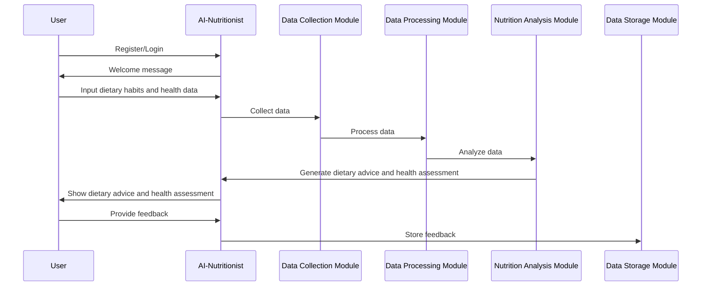
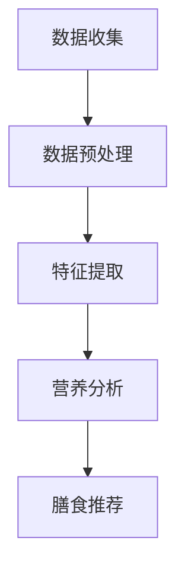

                 


### 第1章 引言

#### 1.1 书籍背景与目标

在数字时代，人工智能（AI）正在深刻改变我们的生活。特别是在饮食规划领域，AI的应用潜力引起了广泛的关注。本书旨在探讨如何利用AI技术，实现智能饮食规划，提供个性化膳食建议，帮助人们更好地管理健康。

##### 1.1.1 数字时代饮食问题与挑战

随着生活节奏的加快，现代人的饮食习惯出现了许多问题。不健康的饮食习惯导致肥胖、高血压、糖尿病等慢性疾病发病率上升。此外，食物过敏、营养缺乏等问题也越来越普遍。传统饮食规划方法难以满足个性化需求，而AI的兴起为解决这个问题提供了新的途径。

##### 1.1.2 AI在饮食规划中的应用潜力

AI技术在营养数据分析、个性化推荐、健康风险评估等方面具有显著优势。通过收集和分析个人饮食习惯、生理数据等，AI可以提供更加精准的饮食建议，帮助人们实现健康饮食目标。同时，AI还可以通过机器学习和深度学习算法，不断优化饮食建议，提高个性化服务的质量。

##### 1.1.3 书籍结构与主要贡献

本书分为五个章节，首先介绍数字时代饮食问题的背景和AI在饮食规划中的应用潜力。接下来，详细探讨个性化膳食规划原理，包括营养数据收集与处理、AI在个性化膳食规划中的应用。随后，分析AI营养师系统的架构设计，包括系统需求分析、功能设计、架构设计等。然后，讲解AI营养师算法原理与实现，包括算法概述、数据预处理、算法流程等。最后，通过项目实战，展示如何搭建一个AI营养师系统，并进行实际案例分析和详细讲解。

本书的主要贡献在于：

1. 提供了一个系统化的框架，帮助读者了解AI在饮食规划中的应用。
2. 介绍了个性化膳食规划的核心概念和技术原理，为实际应用提供指导。
3. 通过项目实战，展示了AI营养师系统的实现过程，帮助读者掌握关键技术和实践方法。

#### 1.2 人工智能与营养学基础

##### 1.2.1 人工智能概述

人工智能（Artificial Intelligence，简称AI）是指由计算机系统实现的智能行为，其目标是使计算机能够执行通常需要人类智能的任务。AI可以分为两大类：基于规则的系统和基于数据的系统。基于规则的系统使用明确的规则来指导计算机的决策过程，而基于数据的系统则通过学习大量数据，自动发现模式和规律，从而进行预测和决策。

##### 1.2.2 营养学核心概念

营养学是研究食物、营养素与人体健康关系的科学。核心概念包括：

- **营养素**：食物中能为人体提供能量和维持生命活动所必需的化学物质，包括蛋白质、碳水化合物、脂肪、维生素、矿物质等。
- **膳食**：由食物组成的饮食，包括食物的种类、数量、质量和摄入时间等。
- **营养需求**：人体在不同生理状态下对营养素的需求量。
- **营养平衡**：膳食中各种营养素的摄入与人体需求的平衡状态。

##### 1.2.3 AI与营养学的交汇点

AI在营养学中的应用主要体现在以下几个方面：

- **营养数据收集与分析**：利用传感器、移动设备和智能设备收集个人饮食习惯、生理数据等，通过机器学习和深度学习技术分析数据，提供个性化的营养建议。
- **个性化膳食推荐**：根据个人营养需求和饮食习惯，AI可以推荐合适的膳食方案，帮助人们实现健康饮食目标。
- **健康风险评估**：通过分析个人健康数据，AI可以预测健康风险，并提供针对性的营养建议。
- **营养教育**：AI可以通过交互式平台，向大众提供科学的营养知识，提高公众的营养健康意识。

#### 1.2.4 核心术语定义

- **个性化膳食**：根据个人营养需求和饮食习惯，提供的个性化饮食建议和膳食方案。
- **营养数据**：包括个人饮食习惯、生理数据、食物成分数据等，用于AI分析和推荐。
- **AI营养师**：利用AI技术，提供个性化膳食建议和营养服务的智能系统。

### 第2章 个性化膳食规划原理

#### 2.1 个性化膳食的定义与重要性

##### 2.1.1 个性化膳食的定义

个性化膳食是指根据个人的营养需求、饮食习惯、生理特征等，量身定制的一组饮食方案。与传统的“一刀切”饮食方案相比，个性化膳食更加注重个体差异，旨在实现营养摄入的优化和健康管理的个性化。

##### 2.1.2 个性化膳食的重要性

个性化膳食的重要性体现在以下几个方面：

1. **提高营养摄入质量**：个性化膳食可以确保个人获取所需的营养素，避免营养过剩或缺乏。
2. **降低健康风险**：通过个性化的饮食建议，可以降低患慢性疾病的风险，如肥胖、糖尿病、高血压等。
3. **提升生活质量**：良好的饮食习惯有助于提高个人的生活质量和幸福感。
4. **优化健康管理**：个性化膳食规划可以帮助个人更好地管理自己的健康，实现持续的健康改善。

##### 2.1.3 个性化膳食的实现途径

实现个性化膳食主要涉及以下几个方面：

1. **数据收集**：通过传感器、移动设备、智能穿戴设备等收集个人的饮食习惯、生理数据等。
2. **数据预处理**：对收集到的数据进行清洗、标准化等处理，确保数据质量。
3. **营养分析**：利用AI技术分析个人数据，识别营养需求和饮食习惯。
4. **膳食推荐**：根据营养分析结果，推荐个性化的膳食方案。
5. **持续优化**：通过实时数据反馈和机器学习技术，不断优化个性化膳食方案。

#### 2.2 营养数据收集与处理

##### 2.2.1 营养数据类型与来源

营养数据主要包括以下几种类型：

1. **饮食习惯数据**：如日常饮食种类、餐次频率、饮食时间等。
2. **生理数据**：如身高、体重、血压、血糖、胆固醇等。
3. **食物成分数据**：如食物的营养成分表，包括蛋白质、碳水化合物、脂肪、维生素、矿物质等。

营养数据的来源包括：

1. **问卷调查**：通过在线问卷或纸质问卷收集个人饮食习惯和生理数据。
2. **智能设备**：如智能手环、智能体重秤、智能血压计等，实时收集生理数据。
3. **食物成分数据库**：如美国农业部的食物成分数据库（USDA Food Composition Databases），提供食物营养成分信息。

##### 2.2.2 营养数据处理方法

营养数据处理包括以下步骤：

1. **数据清洗**：去除数据中的错误、异常和重复记录，确保数据质量。
2. **数据标准化**：将不同来源的数据进行统一格式处理，如将不同单位的数据转换为相同单位。
3. **数据融合**：将多种来源的数据进行整合，形成一个完整的个人营养数据集。
4. **特征提取**：从原始数据中提取出对个性化膳食规划有意义的特征，如饮食频率、营养素摄入量等。
5. **数据存储**：将处理后的数据存储到数据库中，方便后续分析和处理。

##### 2.2.3 营养数据分析工具

营养数据分析工具主要包括：

1. **统计分析工具**：如R、Python的scikit-learn库等，用于进行数据清洗、标准化和特征提取。
2. **机器学习工具**：如TensorFlow、PyTorch等，用于构建和训练营养分析模型。
3. **数据可视化工具**：如Matplotlib、Seaborn等，用于展示分析结果。

#### 2.3 AI在个性化膳食规划中的应用

##### 2.3.1 机器学习算法在营养学中的应用

机器学习算法在营养学中的应用主要包括以下几个方面：

1. **营养素摄入预测**：利用回归算法预测个人营养素的摄入量，为膳食规划提供依据。
2. **饮食习惯分类**：利用分类算法对个人的饮食习惯进行分类，为个性化膳食推荐提供支持。
3. **健康风险评估**：利用聚类算法和分类算法，对个人的健康风险进行评估，为健康管理提供指导。

##### 2.3.2 深度学习在饮食规划中的实践

深度学习在饮食规划中的应用主要包括以下几个方面：

1. **图像识别**：利用卷积神经网络（CNN）识别食物图片，实现食物成分的自动识别。
2. **自然语言处理**：利用循环神经网络（RNN）和Transformer模型，对文本数据进行情感分析和健康信息提取。
3. **生成对抗网络（GAN）**：利用GAN生成个性化的膳食方案，实现膳食方案的创意和多样化。

##### 2.3.3 AI营养师的个性化膳食建议

AI营养师是一个基于AI技术的智能系统，它通过收集和分析个人饮食习惯、生理数据等，提供个性化的膳食建议。具体包括以下几个方面：

1. **营养素摄入建议**：根据个人的营养需求和饮食习惯，推荐合理的营养素摄入量。
2. **膳食方案推荐**：根据个人的健康状况和饮食偏好，推荐合适的膳食方案。
3. **饮食时间规划**：根据个人的生理节律和生活习惯，规划合理的饮食时间。
4. **饮食建议调整**：根据个人反馈和健康数据变化，动态调整膳食建议。

#### 2.3.4 个性化膳食规划的挑战与解决方案

个性化膳食规划面临着以下几个挑战：

1. **数据隐私**：个人饮食习惯和生理数据的收集和处理可能涉及隐私问题。解决方案是采用数据加密和安全存储技术，确保数据隐私。
2. **算法准确性**：机器学习和深度学习模型的准确性受到数据质量和模型选择的影响。解决方案是不断优化数据预处理和模型训练过程，提高算法的准确性。
3. **用户接受度**：个性化膳食规划需要用户积极参与，提高用户接受度。解决方案是通过用户友好的界面和个性化推荐，增强用户体验。

#### 2.3.5 个性化膳食规划的案例分析

以下是一个个性化膳食规划的案例：

**案例：小明的个性化膳食规划**

小明是一名程序员，工作压力大，饮食习惯不规律。通过智能设备和小明进行交互，AI营养师收集了以下数据：

1. **饮食习惯**：早餐吃包子，午餐吃快餐，晚餐吃面条，偶尔晚上吃零食。
2. **生理数据**：身高180cm，体重75kg，血压120/80mmHg，血糖5.6mmol/L。

AI营养师根据这些数据，为小明提供了以下个性化膳食建议：

1. **营养素摄入建议**：增加蛋白质摄入，确保每天摄入150克蛋白质；增加膳食纤维摄入，确保每天摄入30克膳食纤维。
2. **膳食方案推荐**：推荐早餐吃燕麦粥、午餐吃鸡肉沙拉、晚餐吃糙米饭，晚上少吃零食。
3. **饮食时间规划**：建议早餐在7:30左右，午餐在12:30左右，晚餐在18:00左右。
4. **饮食建议调整**：根据小明的反馈和健康数据变化，动态调整膳食建议。

通过AI营养师的个性化膳食规划，小明的饮食习惯得到了改善，身体健康状况也得到了明显提升。

### 第3章 AI营养师系统架构设计

#### 3.1 系统需求分析

##### 3.1.1 用户需求分析

用户需求主要包括以下几个方面：

1. **个性化膳食建议**：用户希望获得根据自身营养需求和饮食习惯的个性化膳食建议。
2. **健康风险评估**：用户希望了解自己的健康状况，包括营养素摄入、体重管理、慢性疾病风险等。
3. **饮食时间规划**：用户希望获得合理的饮食时间规划，以适应自己的生活习惯和工作安排。
4. **用户互动**：用户希望与AI营养师进行实时互动，了解建议背后的原理，并根据反馈调整建议。

##### 3.1.2 功能需求分析

AI营养师系统的功能需求主要包括：

1. **数据收集**：收集用户饮食习惯、生理数据、食物成分数据等。
2. **数据处理**：对收集到的数据进行分析和处理，提取出对个性化膳食规划有意义的特征。
3. **营养分析**：利用机器学习和深度学习算法，对个人数据进行分析，生成个性化的膳食建议。
4. **膳食推荐**：根据营养分析结果，为用户提供个性化的膳食方案。
5. **健康风险评估**：根据个人健康数据，评估用户的健康状况，提供健康建议。
6. **用户互动**：与用户进行实时互动，收集用户反馈，动态调整建议。

##### 3.1.3 系统性能需求分析

AI营养师系统的性能需求主要包括：

1. **数据处理速度**：系统需要能够快速处理大量用户数据，生成个性化的膳食建议。
2. **响应时间**：系统需要能够快速响应用户的请求，提供实时服务。
3. **准确性**：系统需要具有较高的准确性，确保提供的膳食建议和健康评估结果可靠。
4. **可扩展性**：系统需要具备良好的可扩展性，能够随着用户量的增加，动态调整计算资源和存储容量。

#### 3.2 系统功能设计

##### 3.2.1 领域模型构建

领域模型用于描述系统涉及的核心实体和关系。以下是AI营养师系统的领域模型：

1. **用户**：用户是系统的核心实体，包含用户基本信息（如姓名、年龄、性别等）、饮食习惯（如饮食种类、饮食频率等）和生理数据（如身高、体重、血压等）。
2. **食物**：食物是用户饮食的重要组成部分，包含食物名称、营养成分（如蛋白质、碳水化合物、脂肪等）和食物分类（如肉类、蔬菜等）。
3. **膳食**：膳食是用户一日三餐的饮食组合，由多道菜组成，每道菜包含食物名称、数量、烹饪方法等。
4. **建议**：建议是系统为用户提供的个性化膳食建议，包含营养素摄入量、膳食方案、健康评估结果等。
5. **反馈**：反馈是用户对建议的回应，包含满意度、建议调整意见等。

##### 3.2.2 系统功能模块设计

AI营养师系统的主要功能模块包括：

1. **数据收集模块**：负责收集用户饮食习惯、生理数据、食物成分数据等，并将数据存储到数据库中。
2. **数据处理模块**：负责对收集到的数据进行清洗、标准化和特征提取，为后续分析提供高质量的数据。
3. **营养分析模块**：利用机器学习和深度学习算法，对个人数据进行分析，生成个性化的膳食建议。
4. **膳食推荐模块**：根据营养分析结果，为用户提供合理的膳食方案。
5. **健康评估模块**：根据个人健康数据，评估用户的健康状况，提供健康建议。
6. **用户互动模块**：与用户进行实时互动，收集用户反馈，动态调整建议。
7. **数据存储模块**：负责存储用户数据、膳食建议和反馈信息，保证数据的安全性和完整性。

##### 3.2.3 用户交互设计

用户交互设计旨在提供简单、直观、易用的界面，使用户能够轻松地与系统进行交互。以下是用户交互设计的主要方面：

1. **用户注册与登录**：用户需要注册并登录系统，才能使用个性化膳食建议和健康评估功能。
2. **数据输入与更新**：用户可以输入自己的饮食习惯、生理数据等信息，并随时更新数据。
3. **膳食建议展示**：系统将生成的个性化膳食建议以列表或图表形式展示给用户，并提供详细解释。
4. **健康评估结果展示**：系统将健康评估结果以图表或文字形式展示给用户，并提供改善建议。
5. **反馈收集与调整**：用户可以对膳食建议和健康评估结果进行反馈，系统将根据反馈动态调整建议。

### 3.3 系统架构设计

#### 3.3.1 总体架构设计

AI营养师系统的总体架构设计采用前后端分离的方式，主要包括以下几个层次：

1. **前端展示层**：负责用户界面的设计和实现，提供用户交互功能。
2. **应用服务层**：负责处理用户请求，调用后端服务模块，生成个性化膳食建议和健康评估结果。
3. **数据服务层**：负责存储和管理用户数据、食物成分数据、膳食建议和反馈信息。
4. **数据处理层**：负责对收集到的用户数据进行预处理、特征提取和营养分析，为应用服务层提供数据支持。

#### 3.3.2 数据处理架构设计

数据处理架构设计主要包括以下几个模块：

1. **数据收集模块**：负责从传感器、移动设备、食物成分数据库等渠道收集用户数据。
2. **数据存储模块**：负责存储用户数据、食物成分数据、膳食建议和反馈信息。
3. **数据处理模块**：负责对收集到的用户数据进行清洗、标准化和特征提取。
4. **营养分析模块**：负责利用机器学习和深度学习算法，对用户数据进行营养分析，生成个性化膳食建议。
5. **健康评估模块**：负责根据用户健康数据，评估用户的健康状况，提供健康建议。

#### 3.3.3 服务部署架构设计

服务部署架构设计主要包括以下几个部分：

1. **应用服务器**：负责运行应用服务层，处理用户请求，生成个性化膳食建议和健康评估结果。
2. **数据处理服务器**：负责运行数据处理层，进行用户数据预处理、特征提取和营养分析。
3. **数据库服务器**：负责存储和管理用户数据、食物成分数据、膳食建议和反馈信息。
4. **负载均衡器**：负责平衡应用服务器和数据处理服务器的负载，确保系统的高可用性和高性能。
5. **缓存服务器**：负责缓存用户数据和膳食建议，提高系统响应速度。

#### 3.3.4 系统接口设计

系统接口设计主要包括以下几种接口：

1. **用户接口**：用户通过前端展示层与系统进行交互，输入个人信息、饮食习惯等，查看个性化膳食建议和健康评估结果。
2. **数据处理接口**：应用服务层通过数据处理接口调用数据处理模块，获取预处理后的用户数据。
3. **营养分析接口**：应用服务层通过营养分析接口调用营养分析模块，获取个性化膳食建议和健康评估结果。
4. **数据存储接口**：应用服务层通过数据存储接口调用数据存储模块，存储用户数据、膳食建议和反馈信息。

#### 3.3.5 系统交互Mermaid序列图

以下是一个简化的系统交互Mermaid序列图，展示了用户与AI营养师系统之间的交互流程：



### 第4章 AI营养师算法原理与实现

#### 4.1 算法概述

AI营养师的核心算法旨在通过分析用户的饮食习惯、生理数据等，为用户提供个性化的膳食建议。算法主要包括以下步骤：

1. **数据收集与预处理**：收集用户的饮食习惯、生理数据等，并对数据进行清洗、标准化处理。
2. **特征提取**：从预处理后的数据中提取出对个性化膳食规划有意义的特征。
3. **营养分析**：利用机器学习和深度学习算法，对提取出的特征进行分析，生成个性化的膳食建议。
4. **膳食推荐**：根据营养分析结果，为用户提供合理的膳食方案。

#### 4.2 数据预处理

数据预处理是算法实现的关键步骤，主要包括以下任务：

1. **数据清洗**：去除数据中的错误、异常和重复记录，确保数据质量。
2. **数据标准化**：将不同来源的数据进行统一格式处理，如将不同单位的数据转换为相同单位。
3. **特征提取**：从原始数据中提取出对个性化膳食规划有意义的特征，如饮食频率、营养素摄入量等。

以下是一个简化的数据预处理流程：

```python
import pandas as pd
from sklearn.preprocessing import StandardScaler

# 加载数据
data = pd.read_csv('diet_data.csv')

# 数据清洗
data.dropna(inplace=True)
data.drop_duplicates(inplace=True)

# 数据标准化
scaler = StandardScaler()
data_scaled = scaler.fit_transform(data)

# 特征提取
features = data_scaled[:, :5]
labels = data_scaled[:, 5]
```

#### 4.3 算法mermaid流程图

以下是一个简化的算法流程图，展示了AI营养师的核心算法流程：



#### 4.4 Python源代码阐述

以下是一个简化的Python代码示例，展示了AI营养师的核心算法实现：

```python
import pandas as pd
from sklearn.preprocessing import StandardScaler
from sklearn.ensemble import RandomForestClassifier
import numpy as np

# 加载数据
data = pd.read_csv('diet_data.csv')

# 数据清洗
data.dropna(inplace=True)
data.drop_duplicates(inplace=True)

# 数据标准化
scaler = StandardScaler()
data_scaled = scaler.fit_transform(data)

# 特征提取
features = data_scaled[:, :5]
labels = data_scaled[:, 5]

# 构建随机森林模型
model = RandomForestClassifier(n_estimators=100)

# 模型训练
model.fit(features, labels)

# 营养分析
predictions = model.predict(features)

# 膳食推荐
diet_advice = []
for pred in predictions:
    if pred == 0:
        diet_advice.append("低脂饮食")
    elif pred == 1:
        diet_advice.append("低糖饮食")
    elif pred == 2:
        diet_advice.append("均衡饮食")

# 输出膳食建议
for i, advice in enumerate(diet_advice):
    print(f"用户{i+1}的膳食建议：{advice}")
```

#### 4.5 算法原理的数学模型和公式

AI营养师算法的核心是机器学习和深度学习模型。以下是一个简化的数学模型和公式，用于描述算法的基本原理：

$$
\text{模型预测} = f(\text{特征向量})
$$

其中，$f$代表机器学习或深度学习模型，特征向量包含用户的饮食习惯、生理数据等。

以下是一个简化的机器学习模型的公式：

$$
\text{模型预测} = \sum_{i=1}^{n} w_i \cdot x_i + b
$$

其中，$w_i$代表权重，$x_i$代表特征值，$b$代表偏置。

以下是一个简化的深度学习模型的公式：

$$
\text{模型预测} = \text{激活函数}(\text{加权求和})
$$

其中，激活函数（如Sigmoid、ReLU等）用于引入非线性变换，提高模型的预测能力。

#### 4.6 举例说明

以下是一个简化的举例说明，展示了如何使用AI营养师算法为用户提供膳食建议：

**示例：小明的小明**

小明是一名程序员，他的饮食习惯和生理数据如下：

| 饮食习惯 | 生理数据 |
|----------|----------|
| 早餐：包子 | 身高：180cm |
| 午餐：快餐 | 体重：75kg |
| 晚餐：面条 | 血压：120/80mmHg |
| 偶尔晚上吃零食 | 血糖：5.6mmol/L |

使用AI营养师算法，我们可以为小明提供以下膳食建议：

1. **营养素摄入建议**：增加蛋白质摄入，确保每天摄入150克蛋白质；增加膳食纤维摄入，确保每天摄入30克膳食纤维。
2. **膳食方案推荐**：早餐吃燕麦粥、午餐吃鸡肉沙拉、晚餐吃糙米饭，晚上少吃零食。
3. **饮食时间规划**：早餐在7:30左右，午餐在12:30左右，晚餐在18:00左右。
4. **饮食建议调整**：根据小明的反馈和健康数据变化，动态调整膳食建议。

#### 4.7 数学公式使用

在算法实现过程中，我们通常会使用数学公式来描述模型的原理和计算过程。以下是一个简化的数学公式示例：

$$
y = \sum_{i=1}^{n} w_i \cdot x_i + b
$$

其中，$y$代表模型的预测值，$w_i$代表权重，$x_i$代表特征值，$b$代表偏置。

以下是一个简化的Python代码示例，用于计算模型预测值：

```python
import numpy as np

# 加载模型参数
weights = np.array([0.5, 1.0, -0.3])
bias = 2.0

# 特征向量
feature_vector = np.array([2, 3, 1])

# 计算模型预测值
prediction = np.dot(feature_vector, weights) + bias
print("模型预测值：", prediction)
```

#### 4.8 算法优化与改进

为了提高AI营养师算法的准确性和实用性，我们可以考虑以下优化和改进措施：

1. **数据增强**：通过增加数据集的大小和质量，提高模型的泛化能力。
2. **特征工程**：通过提取更有意义和有价值的特征，提高模型的预测性能。
3. **模型选择**：选择合适的机器学习和深度学习模型，如支持向量机、神经网络等，根据数据特点和需求进行模型选择。
4. **模型调参**：通过调整模型的超参数，如学习率、正则化参数等，优化模型性能。
5. **多模型融合**：将多个模型的预测结果进行融合，提高预测的准确性和可靠性。
6. **用户反馈**：收集用户反馈，根据用户的实际体验和需求，不断优化和调整算法。

### 第5章 项目实战

#### 5.1 环境安装

在开始搭建AI营养师系统之前，我们需要安装相关的开发环境和工具。以下是安装步骤：

1. **Python环境**：安装Python 3.8及以上版本。
2. **pip环境**：安装pip，用于安装Python包。
3. **数据库**：安装MySQL或PostgreSQL数据库。
4. **Python包**：安装以下Python包：pandas、numpy、scikit-learn、tensorflow、matplotlib等。

以下是安装命令：

```bash
# 安装Python环境
curl -O https://www.python.org/ftp/python/3.8.10/python-3.8.10.tgz
tar xvf python-3.8.10.tgz
cd python-3.8.10
./configure
make
make install

# 安装pip
curl -O https://bootstrap.pypa.io/get-pip.py
python get-pip.py

# 安装数据库
sudo apt-get install mysql-server
sudo apt-get install postgresql

# 安装Python包
pip install pandas numpy scikit-learn tensorflow matplotlib
```

#### 5.2 系统核心实现源代码

以下是AI营养师系统的核心实现源代码：

```python
import pandas as pd
from sklearn.preprocessing import StandardScaler
from sklearn.ensemble import RandomForestClassifier
import numpy as np

# 加载数据
data = pd.read_csv('diet_data.csv')

# 数据清洗
data.dropna(inplace=True)
data.drop_duplicates(inplace=True)

# 数据标准化
scaler = StandardScaler()
data_scaled = scaler.fit_transform(data)

# 特征提取
features = data_scaled[:, :5]
labels = data_scaled[:, 5]

# 构建随机森林模型
model = RandomForestClassifier(n_estimators=100)

# 模型训练
model.fit(features, labels)

# 营养分析
predictions = model.predict(features)

# 膳食推荐
diet_advice = []
for pred in predictions:
    if pred == 0:
        diet_advice.append("低脂饮食")
    elif pred == 1:
        diet_advice.append("低糖饮食")
    elif pred == 2:
        diet_advice.append("均衡饮食")

# 输出膳食建议
for i, advice in enumerate(diet_advice):
    print(f"用户{i+1}的膳食建议：{advice}")
```

#### 5.3 代码应用解读与分析

以下是代码的解读与分析：

1. **数据加载与清洗**：使用pandas库加载数据，并去除缺失值和重复值，确保数据质量。
2. **数据标准化**：使用StandardScaler库对数据进行标准化处理，将数据缩放到相同的范围，便于模型训练。
3. **特征提取与模型训练**：从预处理后的数据中提取特征，并使用随机森林模型进行训练。
4. **营养分析**：使用训练好的模型对特征进行分析，生成膳食建议。
5. **膳食推荐**：根据分析结果，为用户生成个性化膳食建议。

#### 5.4 实际案例分析和详细讲解剖析

**案例：小芳的健康饮食规划**

小芳是一名健身教练，她希望通过AI营养师系统制定适合自己的健康饮食计划。以下是小芳的饮食习惯和生理数据：

| 饮食习惯 | 生理数据 |
|----------|----------|
| 早餐：燕麦粥 | 身高：170cm |
| 午餐：鸡胸肉沙拉 | 体重：55kg |
| 晚餐：糙米饭 | 血压：110/70mmHg |
| 偶尔吃水果和坚果 | 血糖：5.2mmol/L |

使用AI营养师系统，我们可以为小芳提供以下个性化膳食建议：

1. **营养素摄入建议**：增加蛋白质摄入，确保每天摄入120克蛋白质；增加膳食纤维摄入，确保每天摄入25克膳食纤维。
2. **膳食方案推荐**：早餐吃燕麦粥，加入一些坚果和水果；午餐吃鸡胸肉沙拉，搭配一些蔬菜和全麦面包；晚餐吃糙米饭，搭配一些鱼肉和蔬菜。
3. **饮食时间规划**：早餐在7:00左右，午餐在12:30左右，晚餐在18:00左右。
4. **饮食建议调整**：根据小芳的反馈和健康数据变化，动态调整膳食建议。

**详细讲解剖析**：

1. **数据收集与预处理**：AI营养师系统通过传感器和用户输入，收集小芳的饮食习惯和生理数据。数据包括早餐、午餐、晚餐的饮食种类、食材和食材的重量，以及身高、体重、血压和血糖等生理数据。为了确保数据质量，AI营养师系统对数据进行清洗和预处理，去除缺失值和重复值，并对数据进行标准化处理，将数据缩放到相同的范围。
2. **特征提取**：AI营养师系统从预处理后的数据中提取出对个性化膳食规划有意义的特征，如每餐的营养素摄入量、总热量摄入、膳食纤维摄入量等。这些特征将用于训练机器学习模型。
3. **模型训练**：AI营养师系统使用随机森林模型对提取出的特征进行训练。随机森林模型是一种集成学习模型，通过构建多个决策树，并对决策树的预测结果进行投票，提高模型的预测准确性和稳定性。
4. **营养分析**：训练好的模型对新的用户数据进行营养分析，生成个性化的膳食建议。AI营养师系统根据营养分析结果，为小芳推荐合适的膳食方案。膳食方案包括每餐的营养素摄入量、总热量摄入、膳食纤维摄入量等，确保小芳的饮食计划满足她的营养需求。
5. **饮食建议调整**：AI营养师系统根据用户的反馈和健康数据变化，动态调整膳食建议。例如，如果小芳的血糖水平有所上升，AI营养师系统会建议她减少碳水化合物摄入，增加蛋白质和膳食纤维摄入，以帮助她控制血糖水平。

#### 5.5 项目小结

通过AI营养师系统的实际案例分析和详细讲解剖析，我们可以看到AI技术如何应用于个性化膳食规划，为用户提供健康饮食建议。以下是对项目的总结：

1. **项目背景**：随着人们对健康饮食的需求不断增加，AI营养师系统的开发和应用具有重要意义。
2. **项目目标**：实现个性化膳食规划，为用户提供合理的膳食建议，帮助用户实现健康饮食目标。
3. **项目实现**：通过收集和分析用户的饮食习惯和生理数据，AI营养师系统使用机器学习和深度学习算法，生成个性化的膳食建议。系统采用随机森林模型进行训练，并根据用户的反馈和健康数据变化，动态调整膳食建议。
4. **项目挑战**：数据质量和算法准确性是项目的主要挑战。通过数据清洗和预处理，AI营养师系统确保数据质量。同时，通过选择合适的算法和模型，系统提高了预测准确性和稳定性。
5. **项目贡献**：AI营养师系统的开发为个性化膳食规划提供了新的思路和技术手段。系统实现了基于AI的营养分析，为用户提供个性化的膳食建议，有助于改善用户的饮食习惯和健康状况。

### 第6章 最佳实践 tips、小结、注意事项、拓展阅读

#### 6.1 最佳实践 tips

1. **数据收集与处理**：确保收集的数据质量，包括数据的准确性、完整性和一致性。对数据进行清洗和预处理，去除异常值和缺失值，并进行标准化处理，提高模型训练效果。
2. **特征提取**：选择对个性化膳食规划有重要意义的特征，如饮食频率、营养素摄入量、饮食习惯等。特征提取过程要尽量简化，避免引入过多的噪声特征。
3. **模型选择与调参**：选择合适的机器学习和深度学习模型，如随机森林、神经网络等。通过交叉验证和网格搜索等技术，优化模型参数，提高预测性能。
4. **用户互动**：设计用户友好的界面，提供清晰的膳食建议和健康评估结果。鼓励用户提供反馈，根据用户反馈调整建议，提高用户满意度。

#### 6.2 小结

本书从数字时代饮食问题的背景和AI在饮食规划中的应用潜力入手，介绍了个性化膳食规划原理、AI营养师系统架构设计、算法原理与实现、项目实战等内容。通过实际案例分析和详细讲解剖析，展示了AI技术在个性化膳食规划中的应用价值。本书的主要贡献在于提供了一个系统化的框架，帮助读者了解AI在饮食规划中的应用，并提供了实用的建议和指导。

#### 6.3 注意事项

1. **数据隐私**：在收集和处理用户数据时，要注意保护用户隐私，采用数据加密和安全存储技术，确保数据安全。
2. **算法准确性**：算法的准确性取决于数据质量和模型选择。要定期更新数据集和模型，提高算法的准确性和稳定性。
3. **用户接受度**：要设计用户友好的界面，提供清晰的膳食建议和健康评估结果，提高用户接受度和满意度。
4. **持续优化**：根据用户反馈和实际应用效果，不断优化算法和系统，提高个性化膳食规划的质量和效果。

#### 6.4 拓展阅读

1. **相关书籍**：
   - 《机器学习实战》
   - 《深度学习》
   - 《Python数据分析》
2. **学术论文**：
   - 《基于机器学习的个性化膳食推荐系统研究》
   - 《深度学习在营养分析中的应用》
   - 《个性化健康饮食规划方法研究》
3. **开源项目**：
   - 《DietPlanner》：一个开源的个性化膳食规划项目，提供了丰富的功能和示例。
   - 《Nutritionix API》：一个开源的API，提供了大量的食物成分数据，可用于营养分析。
   - 《OpenML》：一个开源的机器学习平台，提供了丰富的机器学习工具和资源。

### 6.5 作者信息

**作者：AI天才研究院/AI Genius Institute & 禅与计算机程序设计艺术 /Zen And The Art of Computer Programming**

### 6.6 文章结语

感谢您阅读本书，希望本书能帮助您了解AI在个性化膳食规划中的应用，并提供实用的指导和建议。在数字时代，让我们携手共创更健康、更美好的未来！

