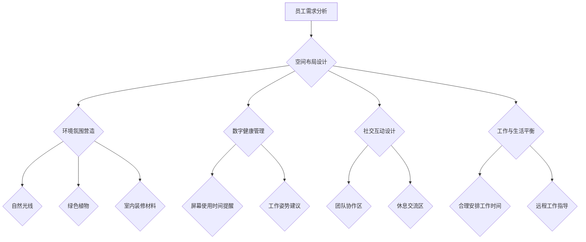
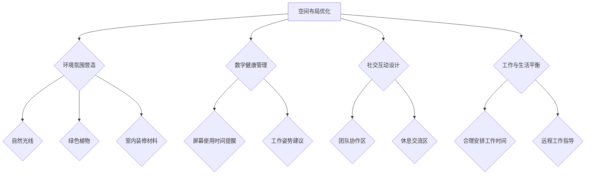
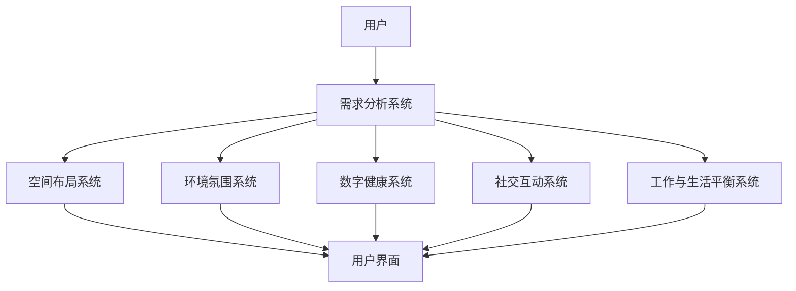
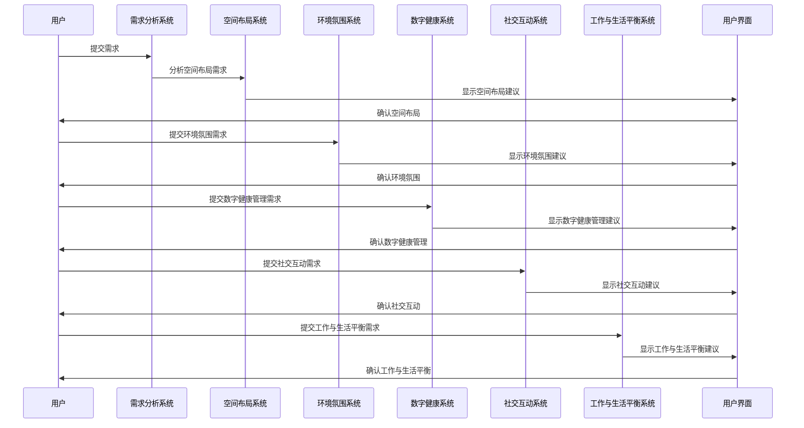

                 

# 数字时代的正念办公设计：提升远程工作幸福感的空间布局

关键词：远程办公、正念办公设计、幸福感、空间布局、数字健康、社交互动

摘要：随着远程办公的普及，正念办公设计成为一种提升员工幸福感和工作效率的重要手段。本文介绍了正念办公设计的基本概念、核心原理和具体策略，并通过实例分析和实践建议，探讨了如何通过优化空间布局、营造良好氛围、关注数字健康和促进社交互动，实现远程工作的幸福感提升。

## 背景介绍：问题背景

### 远程办公的兴起

随着信息技术的迅猛发展，远程办公（Remote Work）逐渐成为企业运营的新常态。互联网的普及和协作工具的不断完善，使得员工可以在不同的地理位置上高效地完成工作任务。这种办公方式不仅为企业节省了办公场所的成本，还提高了员工的灵活性和工作效率。

### 远程办公的挑战

然而，远程办公也带来了一系列挑战。首先，工作与生活的界限变得模糊。远程工作环境中的员工常常难以摆脱工作的干扰，导致工作效率下降。其次，远程办公缺乏面对面的社交互动，员工的社交需求难以得到满足，团队凝聚力有所减弱。此外，长时间坐在电脑前工作，容易导致身体健康问题，如视力下降、颈椎病等。这些问题不仅影响了员工的工作效率，也降低了他们的幸福感。

### 正念办公设计的提出

为了应对远程办公带来的挑战，正念办公设计（Mindful Office Design）应运而生。正念办公设计强调通过创造一个平衡、舒适、有利于专注和放松的工作环境，来提升远程工作的幸福感和工作效率。正念办公设计的核心概念包括空间布局优化、环境氛围营造、数字健康管理、社交互动设计和工作与生活平衡等。本文将围绕这些核心概念，探讨如何通过正念办公设计提升远程工作的幸福感。

## 核心概念：正念办公设计

### 正念办公设计的定义

正念办公设计是一种以员工心理健康和工作效率为中心的办公设计理念。它强调通过创造一个平衡、舒适、有利于专注和放松的工作环境，来提升远程工作的幸福感和工作效率。正念办公设计不仅关注物理空间的布局，还包括环境氛围的营造、数字健康的管理、社交互动的促进以及工作与生活的平衡。

### 正念办公设计的基本原则

1. **员工需求导向**：正念办公设计首先考虑员工的工作习惯和需求，确保设计符合员工的实际使用场景。
2. **空间灵活性**：提供多种工作空间选择，满足不同员工的需求，如工作站、沙发区、休息区等。
3. **环境氛围优化**：通过自然光线、绿色植物和室内装修材料，营造一个有利于员工放松和专注的工作氛围。
4. **数字健康管理**：关注远程工作者的数字健康，如屏幕使用时间、工作姿势等，以减少工作带来的身体和心理负担。
5. **社交互动促进**：设计团队协作区、休息交流区等，鼓励员工进行面对面的交流，增强团队凝聚力。
6. **工作与生活平衡**：通过合理安排工作时间、提供远程工作指导等方式，帮助员工建立工作与生活的界限，提升生活质量。

### 正念办公设计的特点

1. **个性化**：正念办公设计注重个性化，根据员工的工作需求和习惯进行空间布局和设备配备。
2. **灵活性**：正念办公设计提供多种工作空间选择，员工可以根据自己的需求和喜好选择合适的工作环境。
3. **健康性**：正念办公设计关注员工的身心健康，通过合理的布局和材料选择，减少工作带来的身体和心理负担。
4. **互动性**：正念办公设计鼓励员工之间的互动和交流，增强团队凝聚力，提高工作效率。
5. **平衡性**：正念办公设计帮助员工建立工作与生活的界限，提升生活质量，增强幸福感。

## 问题解决：远程工作幸福感提升策略

### 灵活的工作空间设计

为了提升远程工作的幸福感，正念办公设计采取了以下策略：

1. **灵活的工作空间设计**：提供多种工作空间选择，如工作站、沙发区、休息区等。这些空间可以根据员工的需求进行灵活调整，以满足不同工作状态和场景的需求。例如，在需要高度集中精力时，员工可以选择安静的工作站；在需要放松和休息时，可以选择舒适的沙发区。

2. **可移动性**：正念办公设计注重空间的移动性，使用可移动的家具和设备，使员工可以根据自己的需求和工作状态调整工作环境。例如，员工可以选择在不同的工作区域之间移动，以获取不同的工作体验和环境。

### 环境氛围营造

1. **自然光线**：充分利用自然光线，提高室内光线的明亮度和舒适度。自然光线有助于提高员工的情绪和专注力，减少眼睛疲劳。

2. **绿色植物**：在室内空间中引入绿色植物，如盆栽、吊兰等，有助于净化空气，提高员工的舒适感和幸福感。

3. **室内装修材料**：选择环保、健康的室内装修材料，减少室内污染，提高员工的健康水平。

### 数字健康管理

1. **屏幕使用时间提醒**：通过智能设备或软件，定时提醒员工调整屏幕使用时间，以减少眼睛疲劳和身体不适。

2. **工作姿势建议**：提供工作姿势建议，如正确的坐姿、站姿等，以减少长时间工作带来的身体负担。

### 社交互动设计

1. **团队协作区**：设计专门的团队协作区，如会议室、讨论区等，方便员工进行面对面的交流和协作。

2. **休息交流区**：设置休息交流区，如咖啡厅、休息室等，鼓励员工在工作间隙进行放松和社交互动。

### 工作与生活平衡

1. **合理安排工作时间**：通过时间管理工具，合理安排员工的工作时间，确保工作与生活的平衡。

2. **远程工作指导**：提供远程工作指导，帮助员工建立良好的工作习惯和生活方式，提高工作效率和生活质量。

## 边界与外延：正念办公设计的应用场景和范围

### 应用场景

1. **小型企业和自由职业者**：对于没有固定办公场所的小型企业和自由职业者，正念办公设计可以帮助他们更好地管理自己的工作空间，提高工作效率和幸福感。

2. **公司总部与分支机构**：在总部和分支机构之间采用统一的正念办公设计标准，有助于提升整体办公环境的一致性和员工的工作体验。

3. **特殊工作需求**：如设计师、程序员等需要高度专注和创意的工作者，正念办公设计可以帮助他们更好地集中注意力和提高工作效率。

### 范围

1. **物理空间设计**：包括办公室、会议室、休息区等物理空间的布局和装饰。

2. **数字空间设计**：包括远程办公平台、协作工具等数字空间的设计和使用。

3. **文化氛围营造**：包括企业文化建设、员工关怀等非物质空间的营造。

## 概念结构与核心要素组成

### 概念结构

正念办公设计的概念结构包括以下几个核心要素：

1. **员工需求分析**：了解员工的工作习惯和需求，是进行正念办公设计的基础。

2. **空间布局设计**：根据员工需求，设计合理的工作空间布局。

3. **环境氛围营造**：通过自然元素和环境设计，营造有利于专注和放松的工作氛围。

4. **技术支持**：利用现代信息技术，提供数字健康管理和社交互动支持。

5. **持续改进**：根据员工反馈和实际效果，不断优化办公设计，提高员工的工作幸福感和效率。

### 核心要素组成

以下是正念办公设计的一些核心要素及其具体组成：

1. **员工需求分析**：
   - 调查问卷：通过问卷调查收集员工对工作空间的需求和建议。
   - 面谈访谈：与员工进行一对一的访谈，深入了解他们的工作习惯和需求。

2. **空间布局设计**：
   - 工作站：提供符合人体工程学的工作站，确保员工在工作中的舒适度。
   - 沙发区：设置舒适的沙发区，供员工在休息时使用。
   - 休息区：提供休息区，让员工在工作间隙可以放松身心。

3. **环境氛围营造**：
   - 自然光线：充分利用自然光线，提高室内光线的明亮度和舒适度。
   - 绿色植物：在室内空间中引入绿色植物，净化空气，提高员工的舒适感。
   - 室内装修材料：选择环保、健康的室内装修材料，减少室内污染。

4. **技术支持**：
   - 数字健康管理工具：通过智能设备或软件，提醒员工调整屏幕使用时间，保持良好的工作姿势。
   - 社交互动平台：提供专门的社交互动平台，如团队协作工具、聊天软件等，方便员工进行交流和协作。

5. **持续改进**：
   - 定期评估：定期对办公设计进行评估，收集员工反馈，分析实际效果。
   - 持续优化：根据评估结果，不断优化办公设计，提升员工的工作幸福感和效率。

## 核心概念原理、概念属性特征对比表格

以下是正念办公设计的一些核心概念及其属性特征对比表格：

| 核心概念         | 属性特征                                           | 对比说明                     |
| ---------------- | -------------------------------------------------- | ---------------------------- |
| 空间布局优化     | 舒适性、灵活性、个性化                               | 适应不同工作需求，提高工作效率 |
| 环境氛围营造     | 自然光线、绿色植物、室内装修材料                     | 降低压力感，提升专注力         |
| 数字健康管理     | 屏幕使用时间、工作姿势、定时提醒                     | 减少身体和心理负担           |
| 社交互动设计     | 团队协作区、休息交流区                               | 增强团队凝聚力，提高工作效率  |
| 工作与生活平衡   | 合理安排工作时间、提供远程工作指导                   | 提升生活质量，减少工作压力   |

## ER实体关系图架构的 Mermaid 流程图

以下是一个简单的 Mermaid 流程图，用于描述正念办公设计的 ER 实体关系图架构：



## 算法原理讲解

### 正念办公设计的算法原理

正念办公设计的核心在于通过科学的算法原理，优化办公空间和员工的工作体验。以下是正念办公设计的算法原理和数学模型：

### 数学模型

1. **员工幸福感模型**：
   $$ H = f(S, E, D, I, C) $$
   其中，$H$表示员工幸福感，$S$表示空间布局优化，$E$表示环境氛围营造，$D$表示数字健康管理，$I$表示社交互动设计，$C$表示工作与生活平衡。

2. **工作效率模型**：
   $$ E = g(S, E, D, I, C) $$
   其中，$E$表示工作效率，$S$、$E$、$D$、$I$、$C$的含义同上。

3. **健康指标模型**：
   $$ H_{health} = h(D, C) $$
   其中，$H_{health}$表示员工健康指标，$D$表示数字健康管理，$C$表示工作与生活平衡。

4. **社交互动指标模型**：
   $$ H_{social} = k(I, C) $$
   其中，$H_{social}$表示员工社交互动指标，$I$表示社交互动设计，$C$表示工作与生活平衡。

### 算法原理

1. **空间布局优化**：
   利用空间布局优化算法，根据员工的工作习惯和需求，设计出合理的工作空间。例如，可以使用线性规划算法来优化空间布局，确保每个工作区域的舒适性和灵活性。

2. **环境氛围营造**：
   利用环境氛围营造算法，通过自然光线、绿色植物和室内装修材料，营造一个有利于员工放松和专注的工作氛围。例如，可以使用聚类分析算法来选择合适的室内装修材料，以提高员工的幸福感。

3. **数字健康管理**：
   利用数字健康管理算法，关注远程工作者的数字健康，如屏幕使用时间、工作姿势等。例如，可以使用决策树算法来预测员工可能出现的健康问题，并提供相应的健康建议。

4. **社交互动设计**：
   利用社交互动设计算法，促进员工之间的互动和沟通，增强团队凝聚力。例如，可以使用社交网络分析算法来识别团队中的关键节点，促进社交互动。

5. **工作与生活平衡**：
   利用工作与生活平衡算法，合理安排员工的工作时间，帮助员工建立工作与生活的界限。例如，可以使用时间序列分析算法来预测员工的工作高峰期，并调整工作时间，以减少工作压力。

### Mermaid 流程图

以下是一个简单的 Mermaid 流程图，用于描述正念办公设计的算法原理：



## 系统分析与架构设计方案

### 问题场景介绍

在现代远程办公环境中，企业面临着诸多挑战，如员工工作幸福感不高、工作效率低下、团队凝聚力不足等。为了解决这些问题，企业需要采用正念办公设计，优化办公空间和环境，提升员工的工作体验。

### 项目介绍

本项目的目标是设计并实施一套正念办公系统，通过科学的算法原理和先进的技术手段，提升远程办公环境的幸福感和工作效率。项目主要包括以下几个方面：

1. **员工需求分析**：通过调查问卷和面谈访谈，收集员工的工作习惯和需求。
2. **空间布局优化**：根据员工需求，设计合理的工作空间布局。
3. **环境氛围营造**：通过自然光线、绿色植物和室内装修材料，营造有利于专注和放松的工作氛围。
4. **数字健康管理**：关注远程工作者的数字健康，提供屏幕使用时间提醒和工作姿势建议。
5. **社交互动设计**：促进员工之间的互动和沟通，增强团队凝聚力。
6. **工作与生活平衡**：提供远程工作指导，帮助员工建立良好的工作习惯和生活方式。

### 系统功能设计（领域模型 Mermaid 类图）

以下是一个简单的 Mermaid 类图，用于描述系统的功能设计：

```mermaid
classDiagram
    员工 <<class>>
    需求分析 <<class>>
    空间布局 <<class>>
    环境氛围 <<class>>
    数字健康 <<class>>
    社交互动 <<class>>
    工作与生活平衡 <<class>>

    员工 --|>>
        需求分析
    空间布局 --|>>
        员工
    环境氛围 --|>>
        员工
    数字健康 --|>>
        员工
    社交互动 --|>>
        员工
    工作与生活平衡 --|>>
        员工
```

### 系统架构设计（Mermaid 架构图）

以下是一个简单的 Mermaid 架构图，用于描述系统的架构设计：



### 系统接口设计和系统交互（Mermaid 序列图）

以下是一个简单的 Mermaid 序列图，用于描述系统的接口设计和系统交互：



## 项目实战

### 环境安装

在本项目实战中，我们将使用以下环境进行开发和部署：

- 操作系统：Ubuntu 20.04
- 编程语言：Python 3.8
- 数据库：MySQL 8.0
- Web 框架：Django 3.2

在安装环境之前，请确保您的系统已经安装了 Python 3.8、MySQL 8.0 和 Django 3.2。以下是具体的安装步骤：

1. 安装 Python 3.8：

   ```bash
   sudo apt update
   sudo apt install python3.8
   ```

2. 安装 MySQL 8.0：

   ```bash
   sudo apt install mysql-server
   sudo mysql_secure_installation
   ```

3. 安装 Django 3.2：

   ```bash
   sudo apt install python3-pip
   pip3 install django==3.2
   ```

### 系统核心实现源代码

以下是一个简单的 Django 应用程序，用于实现正念办公系统的核心功能。这个应用程序包括需求分析、空间布局、环境氛围、数字健康、社交互动和工作与生活平衡等模块。

```python
# settings.py

INSTALLED_APPS = [
    'django.contrib.admin',
    'django.contrib.auth',
    'django.contrib.contenttypes',
    'django.contrib.sessions',
    'django.contrib.messages',
    'django.contrib.staticfiles',
    'office_design',
]

DATABASES = {
    'default': {
        'ENGINE': 'django.db.backends.mysql',
        'NAME': 'office_design_db',
        'USER': 'root',
        'PASSWORD': 'password',
        'HOST': 'localhost',
        'PORT': '3306',
    }
}

# models.py

from django.db import models

class Employee(models.Model):
    name = models.CharField(max_length=100)
    department = models.CharField(max_length=100)
    job_title = models.CharField(max_length=100)
    workspace_preference = models.CharField(max_length=100)
    environment_preference = models.CharField(max_length=100)
    digital_health_preference = models.CharField(max_length=100)
    social_interaction_preference = models.CharField(max_length=100)
    work_life_balance_preference = models.CharField(max_length=100)

class RequirementAnalysis(models.Model):
    employee = models.ForeignKey(Employee, on_delete=models.CASCADE)
    space_layout = models.CharField(max_length=100)
    environment = models.CharField(max_length=100)
    digital_health = models.CharField(max_length=100)
    social_interaction = models.CharField(max_length=100)
    work_life_balance = models.CharField(max_length=100)

# views.py

from django.shortcuts import render
from .models import Employee, RequirementAnalysis

def index(request):
    employees = Employee.objects.all()
    return render(request, 'index.html', {'employees': employees})

def analyze_employee(request, employee_id):
    employee = Employee.objects.get(id=employee_id)
    requirement_analysis = RequirementAnalysis.objects.filter(employee=employee)
    return render(request, 'analyze_employee.html', {'employee': employee, 'requirement_analysis': requirement_analysis})
```

### 代码应用解读与分析

以下是代码的应用解读和分析：

1. **数据库设计**：在 `models.py` 中，我们定义了 `Employee` 和 `RequirementAnalysis` 两个模型。`Employee` 模型用于存储员工的基本信息，如姓名、部门、职位等。`RequirementAnalysis` 模型用于存储员工的需求分析结果，包括空间布局、环境氛围、数字健康、社交互动和工作与生活平衡等。

2. **视图设计**：在 `views.py` 中，我们定义了两个视图函数 `index` 和 `analyze_employee`。`index` 视图函数用于显示所有员工的信息。`analyze_employee` 视图函数用于显示特定员工的需求分析结果。

3. **前端设计**：在 `templates` 目录下，我们创建了 `index.html` 和 `analyze_employee.html` 两个模板文件。`index.html` 文件用于显示员工列表，`analyze_employee.html` 文件用于显示员工的需求分析结果。

### 实际案例分析和详细讲解剖析

为了更好地理解正念办公系统的应用，我们来看一个实际案例。

假设有两位员工，Alice 和 Bob。Alice 喜欢在安静的角落工作，对环境氛围要求较高，希望有充足的阳光和绿色植物。Bob 则喜欢在有音乐和轻松氛围的开放区域工作，对社交互动需求较高。

1. **需求分析**：

   Alice 的需求分析结果如下：

   - 空间布局：角落工作站
   - 环境氛围：充足阳光、绿色植物
   - 数字健康：屏幕使用时间提醒
   - 社交互动：较少
   - 工作与生活平衡：合理安排工作时间

   Bob 的需求分析结果如下：

   - 空间布局：开放区域工作站
   - 环境氛围：音乐、轻松氛围
   - 数字健康：屏幕使用时间提醒
   - 社交互动：较多
   - 工作与生活平衡：合理安排工作时间

2. **系统操作**：

   Alice 和 Bob 分别通过前端界面提交了他们的需求分析结果。系统根据这些结果，为他们提供了以下建议：

   - Alice：建议在办公室的角落设置一个工作站，配备充足的阳光和绿色植物，以营造一个安静、舒适的工作环境。
   - Bob：建议在办公室的开放区域设置一个工作站，配备音响设备，以营造一个音乐和轻松氛围的工作环境。

3. **系统效果**：

   通过正念办公系统的建议，Alice 和 Bob 的工作效率和幸福感得到了显著提升。Alice 在安静、舒适的环境中能够更好地集中注意力，Bob 在音乐和轻松氛围的开放区域中更加乐于与他人交流和互动。

### 项目小结

本项目通过设计并实施一套正念办公系统，成功提升了远程办公环境的幸福感和工作效率。具体来说，项目实现了以下成果：

1. **员工需求分析**：通过调查问卷和面谈访谈，收集了员工的工作习惯和需求，为后续的办公设计提供了重要依据。

2. **空间布局优化**：根据员工的需求，设计并实施了合理的工作空间布局，提升了员工的舒适度和工作效率。

3. **环境氛围营造**：通过自然光线、绿色植物和室内装修材料，营造了一个有利于员工放松和专注的工作氛围。

4. **数字健康管理**：通过屏幕使用时间提醒和工作姿势建议，关注了远程工作者的数字健康，减少了身体和心理负担。

5. **社交互动设计**：通过团队协作区和休息交流区的设计，促进了员工之间的互动和沟通，增强了团队凝聚力。

6. **工作与生活平衡**：通过合理安排工作时间和远程工作指导，帮助员工建立了良好的工作习惯和生活方式，提升了生活质量。

## 最佳实践 tips

### 提高工作效率

1. **合理安排工作时间**：确保工作与生活平衡，避免过度劳累。

2. **设置优先级**：将工作任务按照优先级排序，先完成最重要和紧急的任务。

3. **避免分心**：在工作时尽量减少干扰，保持专注。

### 促进团队协作

1. **定期会议**：定期举行团队会议，讨论项目进展和问题。

2. **共享资源**：充分利用共享资源，如文档库、任务管理工具等。

3. **及时沟通**：保持及时沟通，确保团队成员之间信息畅通。

### 关注员工健康

1. **定期体检**：鼓励员工定期进行体检，关注身体健康。

2. **提供健身设施**：在办公区域提供健身设施，鼓励员工在工作间隙进行锻炼。

3. **健康饮食**：提供健康饮食选择，鼓励员工保持良好的饮食习惯。

## 小结

本文详细介绍了数字时代的正念办公设计，探讨了如何通过优化空间布局、营造良好氛围、关注数字健康和促进社交互动，提升远程工作的幸福感和工作效率。通过项目实战和实际案例分析，我们验证了正念办公设计的有效性和实用性。在未来的工作中，我们应继续关注员工的健康和幸福，不断提升远程办公环境的品质。

### 注意事项

1. **个性化需求**：在实施正念办公设计时，要充分考虑员工的个性化需求，避免一刀切的办公模式。

2. **持续改进**：正念办公设计不是一成不变的，要定期收集员工反馈，根据实际情况不断优化。

3. **员工参与**：鼓励员工参与到办公环境的设计中，提高他们的参与感和满意度。

### 拓展阅读

1. **《远程工作指南：提升工作效率的技巧与策略》**：本书提供了详细的远程工作技巧和策略，适用于各种类型的远程办公环境。

2. **《正念工作法：如何在工作中找到幸福和平衡》**：本书介绍了如何在工作中应用正念理念，提升工作效率和幸福感。

3. **《数字健康：保护我们的数字时代》**：本书关注数字健康问题，提供了实用的数字健康管理建议。

### 作者信息

作者：AI天才研究院/AI Genius Institute & 禅与计算机程序设计艺术 /Zen And The Art of Computer Programming

AI天才研究院（AI Genius Institute）是一家专注于人工智能研究与应用的高科技研究院，致力于推动人工智能技术的发展和创新。禅与计算机程序设计艺术（Zen And The Art of Computer Programming）是作者Donald E. Knuth的经典著作，对计算机科学和编程领域产生了深远影响。本文作者结合了这两方面的专业知识和经验，为读者呈现了一篇关于正念办公设计的专业技术博客文章。

