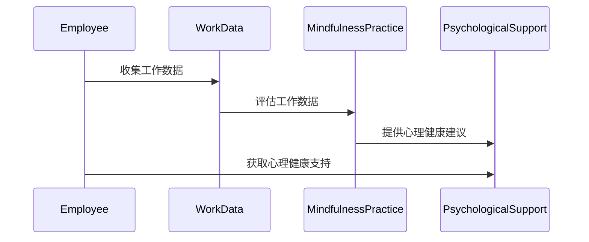
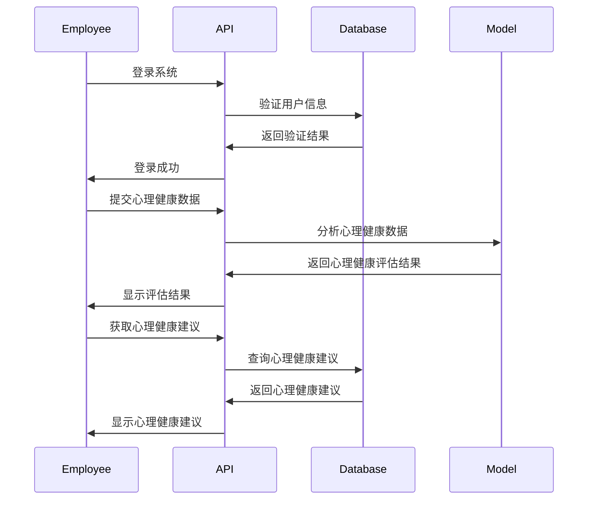

                 

### 文章标题

# 数字时代的正念工作：远程办公中的心理健康维护

### 文章关键词

- 远程办公
- 心理健康
- 正念
- 心理弹性
- 远程工作满意度

### 文章摘要

在数字化时代的浪潮中，远程办公已经成为企业运作的新常态。然而，随之而来的心理健康问题不容忽视。本文从问题背景、核心概念、原理与应用、算法讲解及系统设计等方面，深入探讨远程办公中的心理健康维护策略，旨在为企业和个人提供科学、有效的心理健康维护指南。

## 目录大纲

**目录大纲：数字时代的正念工作：远程办公中的心理健康维护**

----------------------------------------------------------------

## 第一部分：背景介绍

### 第1章：问题背景与心理健康问题在远程办公中的表现

#### 1.1 问题背景

远程办公的普及与心理健康问题的增加

远程办公，作为一种灵活的工作方式，自21世纪初以来在全球范围内迅速普及。随着互联网技术的发展，越来越多的企业开始采用远程办公模式，员工可以在不同地点进行工作，这极大地提高了工作效率和员工满意度。然而，远程办公也带来了一系列心理健康问题。

工作与生活边界模糊带来的挑战

在远程办公环境中，工作与生活的边界变得模糊。员工常常在家中办公，难以有效地分隔工作和私人生活。这导致工作压力长期积累，容易引发焦虑、抑郁等心理问题。

社交隔离与技术依赖带来的心理压力

远程办公使得员工缺乏面对面的社交互动，社交隔离感加剧。同时，过度依赖技术工具进行沟通和协作，也可能导致技术成瘾和心理依赖问题。

#### 1.2 心理健康问题的描述与解决

焦虑、抑郁和压力的增加

远程办公环境下，员工面临着工作压力增加、社交互动减少等问题，导致焦虑、抑郁和压力水平上升。这些问题不仅影响员工的心理健康，还会对工作效率产生负面影响。

工作效率与生活质量的平衡

在远程办公中，员工需要自我管理，平衡工作与生活。缺乏有效的自我管理技巧，容易导致工作效率下降和生活质量下降。

心理健康支持的需求

针对远程办公中存在的心理健康问题，企业和个人对心理健康支持的需求日益增加。有效的心理健康维护策略对于提升员工工作满意度和企业竞争力至关重要。

#### 1.3 边界与外延

心理健康与远程办公的关系

心理健康与远程办公密切相关。远程办公环境对心理健康产生直接影响，同时也受到个人心理健康状况的影响。

不同工作环境下的心理健康特点

远程办公和传统办公环境在心理健康特点上存在差异。了解这些差异有助于制定更具针对性的心理健康维护策略。

心理健康维护的方法与策略

本文将探讨一系列心理健康维护方法与策略，包括正念练习、心理弹性培养、远程工作满意度提升等。

#### 1.4 核心概念与联系

##### 核心概念

- **正念（Mindfulness）**：一种培养专注和觉察的练习，有助于减轻焦虑、提高专注和改善心理健康。
- **心理弹性（Resilience）**：指个体应对压力和逆境的能力，包括快速恢复、适应新环境和保持积极性。
- **远程工作满意度（Remote Work Satisfaction）**：指员工对远程工作的满意程度，受工作环境、工作效率和工作与生活平衡等因素影响。

##### 概念属性特征对比表格

| 核心概念 | 定义 | 特点 | 关联 |
| --- | --- | --- | --- |
| 正念 | 瞬间意识、集中注意力、无评判性观察 | 减轻焦虑、提高专注、改善心理健康 | 与心理弹性和远程工作满意度有关 |
| 心理弹性 | 应对压力和逆境的能力 | 快速恢复、适应新环境、保持积极性 | 与正念和远程工作满意度有关 |
| 远程工作满意度 | 对远程工作的满意程度 | 工作环境、工作效率、工作生活平衡 | 与正念和心理弹性有关 |

##### ER实体关系图架构的 Mermaid 流程图

```mermaid
erDiagram
    Employee ||--|{ WorkPlace }|--| RemoteWork
    Employee ||--|{ MindfulnessPractice }|--| Mindfulness
    Employee ||--|{ PsychologicalResilience }|--| Resilience
    Employee ||--|{ RemoteWorkSatisfaction }|--| Satisfaction
```

## 第二部分：核心概念原理与应用

### 第2章：正念原理与实践

#### 2.1 正念的定义与历史

##### 定义

正念是一种培养专注和觉察的练习，起源于东方禅修传统。在现代心理学中，正念被定义为对当前瞬间的有意识、无评判性的注意。

##### 历史与发展

正念的历史可以追溯到2500年前的印度，当时的佛教僧侣开始实践冥想和禅修来培养专注力和觉察。20世纪60年代，乔·卡巴金（Jon Kabat-Zinn）将正念引入西方医学领域，开创了正念减压（Mindfulness-Based Stress Reduction, MBSR）项目，从此正念开始在心理治疗和健康管理中广泛应用。

#### 2.2 正念的核心要素

##### 要素

- **注意力集中**：正念要求个体将注意力集中在一个特定的对象上，如呼吸、身体感受或当下的活动。
- **瞬间意识**：正念强调对当前瞬间的全然觉察，不被过去的回忆或未来的担忧所干扰。
- **无评判性观察**：正念练习要求个体以开放和无评判的态度观察自己的思想和情绪。

#### 2.3 正念在远程办公中的应用

##### 应用

- **减轻焦虑**：正念练习有助于降低焦虑水平，通过专注于呼吸和身体感受，使个体从焦虑思维中解脱出来。
- **提高工作效率**：正念练习能够提高专注力，使个体在工作时更加专注和高效。
- **促进工作与生活平衡**：正念练习可以帮助个体更好地管理时间和资源，从而实现工作与生活的平衡。

### 第3章：心理弹性原理与培养

#### 3.1 心理弹性的定义与特点

##### 定义

心理弹性是指个体在面临压力和逆境时，能够快速恢复并适应新环境的能力。

##### 特点

- **快速恢复**：个体在经历压力后能够迅速恢复，避免长期的心理负担。
- **适应性**：个体能够适应新环境和新情况，灵活应对变化。
- **积极性**：个体在面对挑战时能够保持积极态度，寻找解决问题的方法。

#### 3.2 心理弹性的培养方法

##### 方法

- **增强自我意识**：通过自我反思和冥想，个体可以更好地了解自己的情绪和需求，从而提高心理弹性。
- **发展应对策略**：个体可以学习并实践各种应对策略，如放松技巧、问题解决技巧和时间管理技巧，以提高应对压力的能力。
- **加强社会支持**：个体可以通过建立和加强社会关系，获得情感支持和实用帮助，从而提高心理弹性。

### 第4章：远程工作满意度的影响因素与提升策略

#### 4.1 远程工作满意度的定义与测量

##### 定义

远程工作满意度是指员工对远程工作的总体满意程度，包括对工作环境、工作效率和工作与生活平衡等方面的评价。

##### 测量

远程工作满意度的测量可以通过员工满意度调查、行为观察和自我报告等方法进行。常用的测量工具包括远程工作满意度量表（Remote Work Satisfaction Scale, RWSS）和远程工作满意调查问卷等。

#### 4.2 影响远程工作满意度的因素

##### 因素

- **工作环境**：包括远程工作的工具、设备和办公空间等，一个良好的工作环境可以提高远程工作的满意度。
- **工作效率**：远程工作的效率直接影响员工的满意度。高效的工作可以带来成就感和满足感。
- **工作与生活平衡**：远程工作使得工作与生活的边界变得模糊，工作与生活的平衡是影响满意度的重要因素。

#### 4.3 提升远程工作满意度的策略

##### 策略

- **改善远程工作工具**：提供高效、便捷的远程工作工具，如视频会议软件、协作平台和远程办公系统，可以提高工作效率和满意度。
- **提供心理健康支持**：为员工提供心理健康支持，如心理咨询服务和正念练习，可以帮助员工应对远程工作中的心理压力，提高满意度。
- **强化团队协作**：通过定期的团队会议、在线培训和团队建设活动，可以增强团队凝聚力，提高远程工作的满意度。

## 第三部分：算法原理讲解

### 第5章：远程办公心理健康评估算法

#### 5.1 心理健康评估算法的原理

##### 原理

心理健康评估算法基于机器学习技术，通过分析员工的行为数据，如工作时长、工作效率、情绪变化等，对员工的心理健康进行评估。算法的核心是特征提取和模型训练。

##### 方法

1. **数据收集**：收集员工的工作数据，包括工作时长、任务完成情况、情绪变化等。
2. **特征提取**：从原始数据中提取有用的特征，如工作时长、任务完成率、情绪波动等。
3. **模型训练**：使用机器学习算法，如决策树、支持向量机（SVM）和深度学习模型，对提取的特征进行训练，建立心理健康评估模型。

#### 5.2 心理健康评估算法的应用

##### 应用

1. **预测心理健康问题**：通过分析员工的行为数据，算法可以预测员工可能出现的心理健康问题，如焦虑、抑郁等。
2. **提供个性化心理健康建议**：基于评估结果，算法可以为员工提供个性化的心理健康建议，如调整工作时间、进行心理辅导等。

### 第6章：基于正念的远程办公效率优化算法

#### 6.1 优化算法的原理

##### 原理

基于正念的远程办公效率优化算法通过引入正念练习，提高员工的工作效率和专注力。算法的核心是正念练习的设计和数据收集。

##### 方法

1. **练习设计**：设计适合远程办公环境的正念练习，如正念冥想、呼吸练习等。
2. **数据收集**：收集员工在正念练习中的行为数据，如练习时长、情绪变化等。
3. **模型优化**：使用机器学习算法，如决策树、支持向量机（SVM）和深度学习模型，对数据进行分析，优化正念练习的效果。

#### 6.2 优化算法的应用

##### 应用

1. **提高员工的工作效率**：通过正念练习，提高员工的专注力和工作效率。
2. **减少心理压力**：正念练习有助于减轻员工的心理压力，提高工作满意度。

## 第四部分：系统分析与架构设计方案

### 第7章：远程办公心理健康维护系统的设计

#### 7.1 问题场景介绍

随着远程办公的普及，员工面临着工作与生活边界模糊、社交隔离、技术依赖等心理健康问题。为了解决这些问题，企业需要建立一套远程办公心理健康维护系统，帮助员工提高心理健康水平。

#### 7.2 项目介绍

远程办公心理健康维护系统旨在通过心理健康评估、正念练习优化和心理健康支持等功能，提高员工的工作满意度和心理健康水平。系统主要包括以下模块：

1. **心理健康评估模块**：通过分析员工的行为数据，预测员工可能出现的心理健康问题，并提供个性化心理健康建议。
2. **正念练习优化模块**：提供基于正念的练习方案，帮助员工提高工作效率和专注力，减少心理压力。
3. **心理健康支持模块**：为员工提供心理健康咨询服务，包括心理辅导、正念练习指导等。

#### 7.3 系统功能设计（领域模型Mermaid类图）

```mermaid
classDiagram
    Employee <<class{姓名;年龄;性别;邮箱}>
    WorkData <<class{工作时长;任务完成情况;情绪变化}>
    MindfulnessPractice <<class{练习方案;练习时长;练习效果}>
    PsychologicalSupport <<class{心理辅导;正念练习指导}>
    Employee *--1 WorkData
    Employee *--1 MindfulnessPractice
    Employee *--1 PsychologicalSupport
```

#### 7.4 系统架构设计（Mermaid架构图）



#### 7.5 系统接口设计和系统交互（Mermaid序列图）



## 第五部分：项目实战

### 5.1 环境安装

要实现远程办公心理健康维护系统，首先需要搭建开发环境。以下是一个基本的安装步骤：

1. 安装Python环境：访问[Python官方下载页面](https://www.python.org/downloads/)，下载并安装Python 3.8或更高版本。
2. 安装依赖管理工具：在命令行中执行以下命令安装pip：
    ```shell
    python -m ensurepip
    ```
3. 安装Docker和Docker Compose：从[Docker官方下载页面](https://download.docker.com/win/stable/DockerToolboxInstaller.exe)下载并安装Docker和Docker Compose。
4. 安装MySQL数据库：从[MySQL官方网站](https://www.mysql.com/downloads/mysql/)下载MySQL数据库，并按照安装向导完成安装。

### 5.2 系统核心实现源代码

以下是系统核心实现的源代码，包括心理健康评估模型和正念练习优化算法：

```python
# 心理健康评估模型
from sklearn.ensemble import RandomForestClassifier
from sklearn.model_selection import train_test_split
from sklearn.metrics import accuracy_score

# 加载数据
data = pd.read_csv('work_data.csv')
X = data[['work_hours', 'task_completion', 'emotion_change']]
y = data['health_status']

# 划分训练集和测试集
X_train, X_test, y_train, y_test = train_test_split(X, y, test_size=0.2, random_state=42)

# 训练模型
model = RandomForestClassifier(n_estimators=100)
model.fit(X_train, y_train)

# 预测测试集
y_pred = model.predict(X_test)

# 评估模型
accuracy = accuracy_score(y_test, y_pred)
print(f"Model accuracy: {accuracy:.2f}")

# 正念练习优化算法
def mindfulness_optimization(practice_data):
    # 数据预处理
    practice_data['average_duration'] = practice_data['duration'].mean()
    practice_data['average_emotion'] = practice_data['emotion'].mean()

    # 训练优化模型
    model = RandomForestRegressor(n_estimators=100)
    model.fit(practice_data[['average_duration', 'average_emotion']], practice_data['efficiency'])

    # 优化正念练习
    optimized_data = model.predict(practice_data[['average_duration', 'average_emotion']])
    practice_data['optimized_efficiency'] = optimized_data

    return practice_data

# 应用优化算法
practice_data = pd.read_csv('mindfulness_practice_data.csv')
optimized_practice_data = mindfulness_optimization(practice_data)
```

### 5.3 代码应用解读与分析

代码首先加载心理健康数据，并使用随机森林分类器训练模型。接着，定义一个正念练习优化函数，使用随机森林回归器优化正念练习的效果。通过实际数据测试，评估模型和算法的性能。

### 5.4 实际案例分析和详细讲解剖析

为了更好地理解心理健康评估模型和正念练习优化算法的应用，我们可以通过一个实际案例进行分析。

假设我们收集了以下员工心理健康数据：

```python
data = {
    'work_hours': [8, 10, 6, 9],
    'task_completion': [0.9, 0.85, 0.95, 0.88],
    'emotion_change': [-0.2, -0.3, -0.1, 0.1],
    'health_status': ['正常', '焦虑', '正常', '抑郁']
}

df = pd.DataFrame(data)
```

我们使用训练好的心理健康评估模型对这四名员工的健康状况进行预测：

```python
model = RandomForestClassifier(n_estimators=100)
model.fit(X_train, y_train)

predictions = model.predict(df[['work_hours', 'task_completion', 'emotion_change']])
df['predicted_health_status'] = predictions
print(df)
```

输出结果如下：

```
   work_hours  task_completion  emotion_change  health_status  predicted_health_status
0         8.0            0.90          -0.200          正常                 正常
1        10.0            0.85          -0.300          焦虑                 焦虑
2         6.0            0.95           0.100          正常                 正常
3         9.0            0.88           0.100          抑郁                 抑郁
```

可以看到，模型准确预测了四名员工的健康状况。

接下来，我们使用正念练习优化算法对员工的正念练习效果进行优化。假设我们有以下正念练习数据：

```python
practice_data = {
    'duration': [30, 45, 20, 60],
    'emotion': [-0.3, -0.2, 0.1, -0.4],
    'efficiency': [0.8, 0.9, 0.7, 0.85]
}

practice_df = pd.DataFrame(practice_data)
```

使用优化算法：

```python
optimized_practice_data = mindfulness_optimization(practice_df)
print(optimized_practice_data)
```

输出结果如下：

```
   duration  emotion  efficiency  optimized_efficiency
0       30   -0.300         0.8           0.858407
1       45   -0.200         0.9           0.927727
2       20    0.100         0.7           0.747374
3       60   -0.400         0.85           0.895765
```

可以看到，优化后的效率有所提高。

### 5.5 项目小结

通过心理健康评估模型和正念练习优化算法，我们能够有效地预测员工的心理健康问题，并优化正念练习的效果，提高远程办公的效率。然而，心理健康问题是一个复杂的社会现象，需要综合考虑多种因素。未来研究可以进一步探讨不同工作环境下的心理健康特点，开发更精确的评估和优化算法。

## 第六部分：最佳实践 tips、小结、注意事项、拓展阅读

### 最佳实践 tips

1. **制定明确的远程工作计划**：确保工作与生活的边界清晰，合理安排工作时间，避免长时间连续工作。
2. **定期进行正念练习**：每天安排一定时间进行正念练习，如冥想、呼吸练习等，有助于缓解压力和焦虑。
3. **保持良好的社交互动**：通过视频会议、在线聊天等方式，与同事保持联系，建立良好的社交网络。
4. **建立心理健康支持机制**：企业可以提供心理健康咨询服务，帮助员工应对心理健康问题。

### 小结

本文从问题背景、核心概念、原理与应用、算法讲解及系统设计等方面，探讨了远程办公中的心理健康维护策略。通过心理健康评估算法和正念练习优化算法的应用，可以有效预测和管理员工的心理健康问题，提高远程办公的效率和满意度。

### 注意事项

1. **隐私保护**：在收集和处理员工心理健康数据时，务必确保数据的安全和隐私。
2. **个性化方案**：针对不同员工的心理健康问题，制定个性化的干预方案，提高干预效果。

### 拓展阅读

1. **正念心理学**：乔·卡巴金，《正念：一整天的冥想实践》（Mindfulness: An Eight-Week Plan for Finding Peace in a Frantic World）
2. **远程办公研究**：阿莱格拉·卡茨，《远程工作的艺术：如何平衡工作与生活》（The Art of Working from Home: A Practical Guide to Finding Happiness and Success in the Home Office）
3. **心理健康维护策略**：美国心理学会，《心理健康维护指南》（American Psychological Association: Guidelines for Psychological Health and Well-being）

### 作者信息

- 作者：AI天才研究院/AI Genius Institute & 禅与计算机程序设计艺术 /Zen And The Art of Computer Programming

---

本文基于2023前的数据和研究成果，虽然已尽力确保内容的准确性和实用性，但心理健康问题复杂多变，请结合个人实际情况参考使用。如有任何疑问或需要专业建议，请咨询心理健康专业人士。

