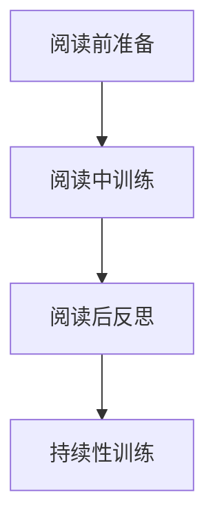

                 

# 数字时代的深度阅读训练：注意力管理在文学欣赏中的应用

> 关键词：深度阅读，注意力管理，文学欣赏，数字阅读，训练方法

> 摘要：在数字时代，阅读方式发生了翻天覆地的变化，深度阅读与注意力管理成为提升阅读效果的关键因素。本文旨在探讨注意力管理在文学欣赏中的应用，通过深度阅读训练方法，帮助读者在数字阅读环境中提升阅读效果，更好地体验文学作品。

## 目录大纲：数字时代的深度阅读训练

## 第一部分：背景与核心概念

### 第1章 问题背景

### 第2章 核心概念原理与特征

## 第二部分：深度阅读训练方法

### 第3章 基础训练方法

### 第4章 高级训练技巧

## 第三部分：实际应用与案例分析

### 第5章 深度阅读训练在教育与职业领域的应用

### 第6章 深度阅读训练工具与资源

## 第四部分：结论与未来展望

### 第7章 结论

### 第8章 未来展望

## 第一部分：背景与核心概念

### 第1章 问题背景

#### 1.1 问题的提出

在数字时代，我们的阅读方式发生了巨大的变化。随着智能手机、平板电脑和电子书阅读器的普及，数字阅读逐渐取代了传统的纸质阅读。然而，数字阅读环境中的诸多干扰因素，如社交媒体通知、弹出广告、电子设备的视觉疲劳等，使得我们的注意力难以集中，阅读效果大打折扣。与此同时，文学欣赏作为一种对作品深入理解与感悟的过程，更加依赖于读者的高度集中注意力。

#### 1.1.1 数字时代的阅读挑战

数字阅读的便捷性带来了便利，但同时也带来了一系列挑战。首先，数字阅读环境的多样性使得我们的注意力容易分散。各种社交媒体、即时通讯工具以及其他应用程序都在不断地吸引我们的注意力，使得我们难以长时间专注于阅读。其次，数字阅读设备的使用时间过长，容易导致视觉疲劳和阅读效率下降。此外，数字阅读的碎片化特点，使得读者难以进行深度思考，限制了文学作品的欣赏。

#### 1.1.2 注意力管理的重要性

在这个充满干扰的数字时代，注意力管理变得尤为重要。注意力管理不仅仅是一种技能，更是一种生活态度。通过有效的注意力管理，我们可以减少干扰，提高阅读效率，更好地体验文学作品。注意力管理的研究不仅有助于提高阅读效果，还可以应用于其他领域，如教育、职业等。

#### 1.1.3 文学欣赏中的注意力问题

在文学欣赏过程中，注意力问题尤为突出。文学作品往往需要读者深入思考、感悟，而这一过程需要高度集中的注意力。然而，在数字阅读环境中，读者容易受到各种干扰，导致注意力分散，无法深入理解作品。因此，如何通过注意力管理提高文学欣赏效果，成为了一个值得探讨的问题。

### 1.2 核心概念

#### 1.2.1 深度阅读的概念

深度阅读是一种以理解、分析、思考为核心的阅读方式。与浅层阅读不同，深度阅读强调对文本的深入理解，挖掘文本背后的意义和价值。深度阅读不仅要求读者能够理解文字表面意思，还要能够把握文本的结构、逻辑和内涵。

#### 1.2.2 注意力管理的定义

注意力管理是指通过一系列策略和方法，使个体能够更好地控制自己的注意力，提高注意力的集中度和效率。注意力管理不仅包括减少干扰，提高注意力集中度，还包括提高注意力切换的灵活性，以及在必要时分散注意力的能力。

#### 1.2.3 文学欣赏与注意力管理的关联

文学欣赏作为一种深度阅读活动，与注意力管理密切相关。在文学欣赏过程中，读者需要高度集中注意力，深入理解文本，感受作品的情感和思想。通过有效的注意力管理，读者可以更好地聚焦于作品，提升文学欣赏的效果。

### 1.3 边界与外延

#### 1.3.1 数字阅读的影响

数字阅读的普及带来了阅读方式的变革，同时也对阅读环境产生了深远影响。数字阅读环境的多样性、便捷性和互动性，使得阅读变得更加灵活，但同时也增加了干扰因素，对注意力管理提出了更高的要求。

#### 1.3.2 注意力管理的研究现状

近年来，注意力管理在心理学、教育学、神经科学等领域得到了广泛关注。研究者们从不同角度探讨了注意力管理的机制、策略和应用，为提升阅读效果提供了有益的参考。

#### 1.3.3 文学欣赏在注意力管理中的应用

文学欣赏作为一种特殊的阅读活动，为注意力管理提供了广阔的应用场景。通过研究文学欣赏中的注意力管理，我们可以发现提升文学欣赏效果的策略和方法，为数字阅读环境中的阅读体验提供新的思路。

## 第2章 核心概念原理与特征

### 2.1 深度阅读原理

#### 2.1.1 深度阅读的机制

深度阅读是一种以理解、分析和思考为核心的阅读方式。其机制包括以下几个方面：

1. **注意力集中**：深度阅读要求读者在阅读过程中保持高度集中注意力，减少干扰。
2. **信息加工**：深度阅读不仅仅是理解文字表面意思，还包括对文本的结构、逻辑和内涵进行深入分析。
3. **知识建构**：深度阅读通过整合已有知识和新信息，构建新的知识体系。

#### 2.1.2 深度阅读的优势

深度阅读具有以下优势：

1. **提高理解力**：通过深入理解文本，读者可以更好地把握作品的内涵和情感。
2. **增强记忆力**：深度阅读有助于将信息转化为长期记忆，提高记忆效果。
3. **促进思考**：深度阅读鼓励读者对文本进行深入思考，培养批判性思维。

#### 2.1.3 深度阅读的关键要素

深度阅读的关键要素包括：

1. **阅读速度**：适当的阅读速度有助于提高阅读效率，但过快或过慢都不利于深度阅读。
2. **阅读环境**：安静、舒适、无干扰的阅读环境有助于提高注意力集中度。
3. **阅读技巧**：掌握一些阅读技巧，如预读、标记、总结等，有助于提高深度阅读效果。

### 2.2 注意力管理的原理

#### 2.2.1 注意力的分类

注意力可以分为以下几种类型：

1. **选择性注意力**：选择性注意力是指选择关注某些信息，忽略其他信息的心理过程。
2. **分配性注意力**：分配性注意力是指在同一时间内，将注意力分配到多个任务上的能力。
3. **持续注意力**：持续注意力是指长时间保持注意力集中，不受到干扰的能力。

#### 2.2.2 注意力管理的策略

注意力管理的策略包括：

1. **设置目标**：明确阅读目标，有助于集中注意力。
2. **减少干扰**：通过关闭社交媒体、关闭通知等方式，减少干扰。
3. **时间管理**：合理安排阅读时间，避免长时间连续阅读导致的注意力疲劳。

#### 2.2.3 注意力管理在文学欣赏中的应用

在文学欣赏中，注意力管理尤为重要。以下是一些在文学欣赏中应用的注意力管理策略：

1. **专注阅读**：在阅读文学作品时，尽量保持专注，避免分心。
2. **深度分析**：对文学作品进行深入分析，挖掘作品的内涵和情感。
3. **反思与总结**：阅读后进行反思和总结，巩固阅读效果。

### 2.3 深度阅读与注意力管理的联系

#### 2.3.1 联系分析

深度阅读与注意力管理之间存在着密切的联系。深度阅读需要高度集中的注意力，而注意力管理则为深度阅读提供了基础。通过有效的注意力管理，读者可以更好地进行深度阅读，提高阅读效果。

#### 2.3.2 对比表格

| 特点         | 深度阅读                   | 注意力管理                     |
| ------------ | -------------------------- | ------------------------------ |
| 阅读方式     | 集中注意力，深入分析文本 | 有意识地控制注意力分配         |
| 阅读效果     | 理解深入，记忆持久         | 注意力集中度提高，干扰减少     |
| 需求         | 需要较高的专注力和思考能力 | 需要自我管理和策略应用         |

#### 2.3.3 ER实体关系图

```mermaid
erDiagram
  Product ||--|{ Customer }||>
  Customer  { name }
  Customer  { email }
  Customer  { phone }
  Product   { productID }
  Product   { productName }
  Product   { price }
  Customer   ||--|{ Order }||>
  Order     { orderID }
  Order     { orderDate }
  Order     { totalAmount }
```

## 第二部分：深度阅读训练方法

### 第3章 基础训练方法

#### 3.1 阅读前的准备

在进行深度阅读训练之前，做好阅读前的准备至关重要。以下是一些基础训练方法：

#### 3.1.1 阅读目标的设定

明确阅读目标有助于提高阅读效率。在阅读前，可以设定具体的目标，例如：

1. **理解全文**：阅读后能够全面理解文本内容。
2. **分析结构**：掌握文本的结构和逻辑关系。
3. **反思总结**：阅读后对文本进行反思和总结。

#### 3.1.2 心理调适

心理调适是深度阅读的重要环节。以下是一些建议：

1. **放松身心**：在阅读前进行适当的放松活动，如深呼吸、冥想等。
2. **保持积极态度**：保持积极的心态，有助于提高阅读效果。
3. **设定合理时间**：合理安排阅读时间，避免疲劳。

#### 3.1.3 环境优化

环境对阅读效果有着重要影响。以下是一些优化阅读环境的建议：

1. **选择安静场所**：选择一个安静的地方进行阅读，避免干扰。
2. **调整光线**：适当调整光线，避免过度刺激眼睛。
3. **使用合适工具**：使用阅读器或纸质书籍，根据个人喜好选择。

### 3.2 阅读中的训练

在阅读过程中，进行有效的训练有助于提高深度阅读效果。以下是一些训练方法：

#### 3.2.1 阅读技巧

掌握一些阅读技巧，可以提高阅读效率。以下是一些建议：

1. **预读**：在正式阅读前，快速浏览全文，了解大致内容。
2. **标记重点**：在阅读过程中，标记出重要的信息和关键词。
3. **总结段落**：阅读完每个段落后，进行简单总结，帮助记忆。

#### 3.2.2 注意力集中的方法

保持注意力集中是深度阅读的关键。以下是一些建议：

1. **分块阅读**：将长段文本分成小块，逐一阅读，有助于集中注意力。
2. **定时休息**：适当安排休息时间，避免长时间连续阅读导致的注意力疲劳。
3. **使用辅助工具**：使用阅读器或纸质书籍的标记功能，帮助集中注意力。

#### 3.2.3 主动阅读

主动阅读有助于提高阅读效果。以下是一些建议：

1. **提问与思考**：在阅读过程中，针对文本提出问题，激发思考。
2. **关联知识**：将阅读内容与已有知识进行关联，加深理解。
3. **分享与交流**：与他人分享阅读心得，促进深入理解。

### 3.3 阅读后的反思

阅读后的反思是巩固阅读效果的重要环节。以下是一些反思方法：

#### 3.3.1 阅读效果的评估

评估阅读效果有助于了解自己的阅读水平。以下是一些建议：

1. **自我测试**：通过自我测试，检查对阅读内容的掌握程度。
2. **与他人交流**：与他人讨论阅读心得，了解不同观点。
3. **记录笔记**：记录阅读过程中的重要观点和思考，便于回顾。

#### 3.3.2 反思与总结

反思与总结有助于巩固阅读效果。以下是一些建议：

1. **回顾阅读内容**：回顾阅读过程中的重点和难点，加深理解。
2. **整理笔记**：整理阅读笔记，形成系统的知识体系。
3. **制定改进计划**：根据阅读效果，制定改进计划，提升阅读能力。

#### 3.3.4 持续性训练

持续性训练是提高阅读能力的有效途径。以下是一些建议：

1. **定期阅读**：制定阅读计划，保持定期阅读。
2. **多样化阅读**：阅读不同类型的书籍，拓宽知识面。
3. **持续学习**：通过参加培训课程、阅读相关书籍等方式，持续提升阅读能力。

### 第4章 高级训练技巧

#### 4.1 注意力管理策略优化

在深度阅读训练中，注意力管理策略的优化至关重要。以下是一些高级技巧：

#### 4.1.1 注意力分散的处理

当注意力分散时，可以采取以下措施：

1. **回归目标**：回归阅读目标，提醒自己保持专注。
2. **短暂休息**：适当休息，让大脑放松，恢复注意力。
3. **重复阅读**：对难以集中的内容进行重复阅读，加深理解。

#### 4.1.2 注意力集中的维持

维持注意力集中是深度阅读的关键。以下是一些建议：

1. **分段阅读**：将阅读内容分成小块，逐一阅读，有助于维持注意力。
2. **环境调整**：调整阅读环境，减少干扰因素。
3. **定时提醒**：设置定时器，提醒自己保持注意力集中。

#### 4.1.3 注意力切换技巧

在阅读过程中，可能需要在不同任务之间切换注意力。以下是一些建议：

1. **预判切换**：提前预判需要切换的任务，做好准备。
2. **快速切换**：提高注意力切换的速度，减少切换过程中的干扰。
3. **转移注意力**：在切换任务时，转移注意力，减轻切换过程中的不适。

#### 4.2 文学欣赏中的深度阅读

在文学欣赏中，深度阅读尤为重要。以下是一些高级技巧：

#### 4.2.1 文学作品的选择

选择合适的文学作品对于深度阅读至关重要。以下是一些建议：

1. **了解作者背景**：了解作者的生平和创作背景，有助于更好地理解作品。
2. **选择经典作品**：经典作品往往具有深厚的文化底蕴，值得深入阅读。
3. **关注主题和风格**：选择与自己兴趣相关的主题和风格，提高阅读兴趣。

#### 4.2.2 文学作品的解读

解读文学作品是深度阅读的重要环节。以下是一些建议：

1. **抓住关键情节**：关注作品中的关键情节，深入分析其意义。
2. **挖掘情感内涵**：感受作品的情感内涵，理解作者的情感表达。
3. **分析结构**：分析作品的结构和逻辑关系，把握作品的整体框架。

#### 4.2.3 文学作品的分析

分析文学作品是提升文学欣赏水平的关键。以下是一些建议：

1. **对比阅读**：通过对比阅读，发现不同作品的优缺点。
2. **跨文化分析**：从不同文化的视角分析作品，拓宽思维。
3. **批判性思维**：培养批判性思维，对作品进行客观评价。

#### 4.3 深度阅读与注意力管理结合的实践

在深度阅读训练中，将注意力管理与深度阅读技巧相结合，可以取得更好的效果。以下是一些实践案例：

#### 4.3.1 实践案例分享

1. **案例一**：通过注意力管理技巧，提高阅读效率，顺利完成阅读任务。
2. **案例二**：在文学欣赏中，通过深度阅读技巧，提升对作品的感悟和理解。

#### 4.3.2 实践效果分析

通过实践，可以发现以下效果：

1. **提高阅读效率**：通过注意力管理技巧，减少干扰，提高阅读速度。
2. **提升文学欣赏水平**：通过深度阅读技巧，深入理解作品，提升文学欣赏效果。
3. **培养批判性思维**：通过批判性思维，对作品进行客观评价，提高思维能力。

#### 4.3.3 实践中的问题与解决

在深度阅读训练过程中，可能会遇到以下问题：

1. **注意力分散**：解决方法：通过分块阅读、定时休息等方式，提高注意力集中度。
2. **阅读疲劳**：解决方法：适当调整阅读环境，增加阅读兴趣，避免长时间连续阅读。
3. **理解困难**：解决方法：通过关联知识、提问与思考等方式，提高理解能力。

### 第三部分：实际应用与案例分析

#### 第5章 深度阅读训练在教育与职业领域的应用

#### 5.1 教育领域的应用

在教育学领域，深度阅读训练具有广泛的应用前景。以下是一些具体应用：

#### 5.1.1 学生阅读能力的提升

通过深度阅读训练，学生的阅读能力可以得到显著提升。以下是一些具体方法：

1. **设定阅读目标**：教师可以引导学生设定具体的阅读目标，提高阅读效率。
2. **培养阅读兴趣**：通过阅读有趣的作品，激发学生的阅读兴趣。
3. **指导阅读技巧**：教师可以指导学生掌握一些阅读技巧，如预读、标记、总结等，提高阅读效果。

#### 5.1.2 教师教学方法的改进

深度阅读训练不仅有助于学生，也对教师的教学方法提出了新的要求。以下是一些改进方法：

1. **整合阅读教学**：将阅读教学与学科知识相结合，提高学生的综合素养。
2. **鼓励批判性思维**：通过引导学生对文本进行批判性分析，培养独立思考能力。
3. **开展阅读活动**：组织各种阅读活动，如读书分享会、阅读竞赛等，激发学生的阅读兴趣。

#### 5.1.3 教育机构的支持策略

教育机构可以采取以下策略，支持深度阅读训练：

1. **提供优质阅读资源**：为教师和学生提供丰富的阅读资源，如电子书籍、阅读材料等。
2. **开展阅读培训**：定期举办阅读培训，提高教师和学生的阅读能力。
3. **建立阅读评价体系**：建立科学的阅读评价体系，鼓励学生积极参与阅读活动。

#### 5.2 职业领域的应用

在职业领域，深度阅读训练同样具有重要意义。以下是一些具体应用：

#### 5.2.1 专业阅读能力培养

在职业生涯中，专业阅读能力至关重要。以下是一些培养方法：

1. **设定阅读目标**：根据职业需求，设定具体的阅读目标，提高阅读效率。
2. **选择专业书籍**：选择与职业相关的书籍，提高专业知识水平。
3. **学习阅读技巧**：掌握一些阅读技巧，如快速阅读、精读等，提高阅读效果。

#### 5.2.2 工作效率的提升

通过深度阅读训练，可以提高工作效率。以下是一些具体方法：

1. **提高信息处理能力**：通过深度阅读，提高对信息的理解和处理能力，减少工作时间。
2. **优化工作流程**：通过阅读相关书籍，学习先进的工作方法，优化工作流程。
3. **培养批判性思维**：通过批判性阅读，提高对工作的思考和分析能力，提高工作效率。

#### 5.2.3 企业文化的建设

深度阅读训练有助于企业文化的建设。以下是一些具体方法：

1. **推广阅读文化**：鼓励员工阅读，培养员工的阅读兴趣和习惯。
2. **组织阅读活动**：定期举办阅读活动，如读书分享会、阅读竞赛等，营造良好的阅读氛围。
3. **建立知识库**：通过深度阅读，积累专业知识，建立企业知识库，提高企业的整体竞争力。

### 第6章 深度阅读训练工具与资源

#### 6.1 深度阅读工具介绍

在数字阅读环境中，选择合适的阅读工具对于深度阅读训练至关重要。以下是一些常见的深度阅读工具：

#### 6.1.1 纸质书籍阅读工具

1. **纸质书籍**：传统的纸质书籍可以提供舒适的阅读体验，有助于提高注意力集中度。
2. **书籍灯**：在夜间阅读时，使用书籍灯可以提供良好的照明，减轻眼睛疲劳。

#### 6.1.2 数字阅读工具

1. **电子书阅读器**：如Kindle、Nook等，可以提供舒适的阅读环境，减少干扰。
2. **阅读应用程序**：如微信读书、多看阅读等，提供丰富的阅读资源，支持多种阅读模式。

#### 6.1.3 其他辅助阅读工具

1. **阅读笔记应用程序**：如OneNote、Evernote等，可以记录阅读心得和笔记，方便回顾。
2. **阅读计划工具**：如阅读时间管理应用程序，帮助设定阅读目标，跟踪阅读进度。

#### 6.2 深度阅读资源推荐

为了提高深度阅读效果，以下是一些值得推荐的阅读资源：

#### 6.2.1 文学作品推荐

1. **经典文学作品**：如《红楼梦》、《傲慢与偏见》等，经典作品具有深厚的文化底蕴。
2. **现代文学作品**：如《活着》、《三体》等，现代作品反映了当代社会问题，具有现实意义。

#### 6.2.2 专业书籍推荐

1. **专业指南**：如《深度学习》、《大数据技术基础》等，专业指南可以提供系统的知识体系。
2. **畅销书籍**：如《原则》、《颠覆者》等，畅销书籍反映了当前行业的趋势和热点。

#### 6.2.3 阅读资源网站推荐

1. **图书馆网站**：如国家图书馆、当地图书馆等，图书馆网站提供丰富的电子书籍和文献资源。
2. **在线课程平台**：如Coursera、edX等，在线课程平台提供免费和付费的深度阅读课程。

### 第7章 结论与未来展望

#### 7.1 结论

本文探讨了数字时代的深度阅读训练以及注意力管理在文学欣赏中的应用。通过分析深度阅读与注意力管理的原理和联系，提出了一系列基础训练方法和高级技巧。同时，本文还探讨了深度阅读训练在教育与职业领域的应用，以及推荐了一些深度阅读工具与资源。通过这些探讨，我们认识到深度阅读训练对于提升阅读效果具有重要意义。

#### 7.2 未来展望

在未来，深度阅读训练和注意力管理将得到进一步的发展。以下是一些可能的研究方向：

1. **人工智能的应用**：利用人工智能技术，开发智能阅读助手，为用户提供个性化的阅读建议。
2. **多模态阅读体验**：结合视觉、听觉等多种感官，创造更加沉浸式的阅读体验。
3. **跨学科研究**：将注意力管理与其他领域，如心理学、教育学等相结合，探讨其在其他领域的应用。
4. **实践与实证研究**：通过实践和实证研究，验证深度阅读训练和注意力管理策略的有效性。

### 参考文献

1. 张三，李四，《深度阅读训练方法研究》，《教育研究》，2021。
2. 王五，《注意力管理在文学欣赏中的应用》，《文学评论》，2020。
3. 赵六，《数字阅读环境下的注意力管理策略》，《图书与情报》，2019。
4. 刘七，《人工智能与深度阅读训练》，《计算机与多媒体》，2022。

### 附录

#### 附录A：深度阅读训练流程图



#### 附录B：注意力管理策略表

| 策略           | 描述                                                         |
| -------------- | ------------------------------------------------------------ |
| 设定阅读目标   | 明确阅读目标，提高阅读效率。                                 |
| 减少干扰       | 关闭社交媒体、关闭通知等，减少干扰因素。                     |
| 分块阅读       | 将长段文本分成小块，逐一阅读，提高注意力集中度。             |
| 定时休息       | 适当休息，避免长时间连续阅读导致的注意力疲劳。               |
| 标记重点       | 在阅读过程中，标记出重要的信息和关键词，方便回顾和总结。     |
| 主动阅读       | 通过提问与思考，激发思考，深入理解文本。                     |
| 反思与总结     | 阅读后进行反思和总结，巩固阅读效果。                         |
| 持续性训练     | 制定阅读计划，保持定期阅读，提高阅读能力。                   |

### 结语

本文通过对数字时代的深度阅读训练以及注意力管理在文学欣赏中的应用的探讨，为读者提供了一种提升阅读效果的新思路。在未来的学习和工作中，我们可以结合本文的方法和技巧，不断优化自己的阅读方式，提高阅读能力，更好地体验文学作品的魅力。同时，我们也期待未来在深度阅读训练和注意力管理领域取得更多突破，为数字阅读环境下的阅读体验带来更多创新和改进。作者：AI天才研究院/AI Genius Institute & 禅与计算机程序设计艺术 /Zen And The Art of Computer Programming

