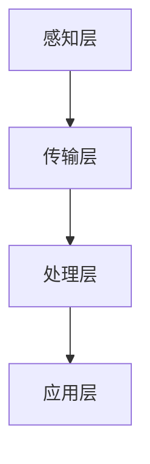
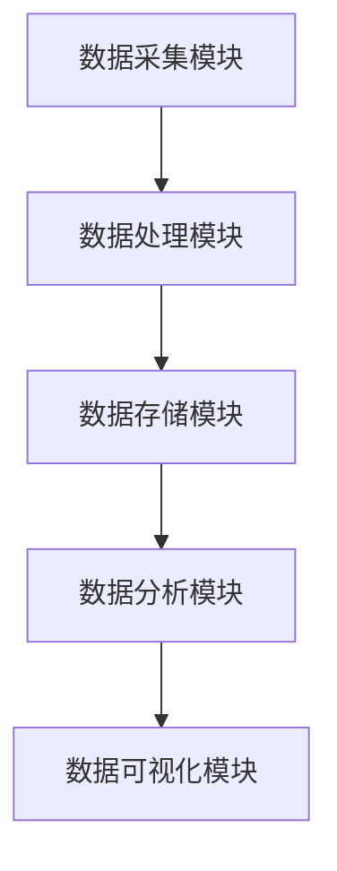

                 

## 数字时代的环保意识：科技如何促进可持续生活

关键词：环保意识、可持续发展、物联网、大数据、人工智能、可再生能源

摘要：随着数字化时代的到来，环保意识的提升成为全球关注的焦点。本文旨在探讨科技如何促进可持续生活，通过对物联网、大数据、人工智能和可再生能源等技术的深入分析，阐述它们在环保意识培养和可持续发展中的应用。文章从背景介绍、核心概念与联系、数学模型、科技应用、实践案例、最佳实践与未来展望等多方面展开，旨在为推动数字时代的环保意识提供思路和方法。

### 目录大纲

#### 第一部分：背景介绍

1. **第1章：问题背景与可持续发展的必要性**
   - 1.1.1 数字时代的环境挑战
   - 1.1.2 环保意识的重要性
   - 1.1.3 可持续生活与科技的关系

2. **第2章：核心概念与联系**
   - 2.1.1 环保意识的概念
   - 2.1.2 可持续生活的概念
   - 2.1.3 科技与环保意识的联系

3. **第3章：数学模型与公式**
   - 3.1.1 可持续发展的数学模型
   - 3.1.2 环保意识的数学模型

#### 第二部分：科技在促进可持续发展中的应用

4. **第4章：物联网技术**
   - 4.1.1 物联网技术的概念
   - 4.1.2 物联网技术在环保中的应用

5. **第5章：大数据与人工智能**
   - 5.1.1 大数据的定义与特点
   - 5.1.2 人工智能在环保领域的应用

6. **第6章：可再生能源技术**
   - 6.1.1 可再生能源的概念
   - 6.1.2 可再生能源技术的应用

#### 第三部分：实践与案例分析

7. **第7章：环保科技项目实战**
   - 7.1.1 实战项目背景
   - 7.1.2 系统设计与实现
   - 7.1.3 项目核心代码解读
   - 7.1.4 实际案例分析
   - 7.1.5 项目小结

#### 第四部分：最佳实践与未来展望

8. **第8章：最佳实践与注意事项**
   - 8.1.1 科技在环保中的应用最佳实践
   - 8.1.2 项目实施注意事项

9. **第9章：未来展望与挑战**
   - 9.1.1 可持续发展的未来趋势
   - 9.1.2 环保政策的展望

### 第一部分：背景介绍

#### 第1章：问题背景与可持续发展的必要性

##### 1.1.1 数字时代的环境挑战

随着数字时代的到来，全球范围内对信息技术和数字经济的依赖日益增加，这无疑带来了巨大的环境挑战。首先，信息技术的快速发展导致了大量的电子废弃物。这些废弃物中含有重金属和有毒化学物质，如果处理不当，将对环境和人类健康造成严重威胁。据统计，全球每年产生的电子废弃物已超过5000万吨，其中大多数没有得到妥善处理。

其次，数据中心的能源消耗问题日益突出。随着云计算、大数据和人工智能等技术的广泛应用，数据中心的能耗逐年增加。数据中心的高能耗不仅加剧了能源紧张，还导致了大量的碳排放。根据国际能源署（IEA）的数据，数据中心的能耗已占全球总能耗的1%左右，这一比例预计将在未来几十年内持续上升。

最后，数字时代的消费模式也对环境造成了负面影响。电子商务和在线娱乐的兴起使得物流和交通需求增加，这导致了更多的碳排放和资源消耗。此外，电子产品的频繁更新换代加剧了资源的浪费。

##### 1.1.2 环保意识的重要性

在数字时代，环保意识的重要性愈发凸显。环保意识不仅关乎环境和生态的可持续发展，还关乎人类社会的健康与福祉。首先，环保意识能够引导人们采取更加环保的生活方式，减少对环境的负面影响。例如，通过推广节能灯具和高效电器，可以大幅减少能源消耗和碳排放。

其次，环保意识可以推动科技创新，促进绿色技术的发展。许多环保技术，如可再生能源、绿色建筑和环保材料等，都是基于环保意识的推动而发展起来的。这些技术的应用不仅能够减少污染，还能够提高资源利用效率，推动经济的可持续发展。

最后，环保意识还能够促进社会公平和人权。环境问题往往与贫困和不平等密切相关。通过提高环保意识，可以更好地解决这些问题，促进社会的和谐发展。

##### 1.1.3 可持续生活与科技的关系

可持续生活与科技之间存在着密切的关系。科技不仅为可持续生活提供了技术支持，还在很大程度上决定了可持续生活的实现方式。

首先，科技在可持续生活的各个方面都有着广泛的应用。例如，物联网技术可以通过智能设备实时监测环境质量，提供个性化的环保建议；大数据技术可以分析环境数据，帮助政府和企业制定更有效的环保政策；人工智能技术可以优化能源管理，提高可再生能源的利用效率。

其次，科技的发展也促进了可持续生活方式的普及。通过互联网和移动设备的普及，人们可以更方便地获取环保知识和资源，参与环保活动，培养环保意识。

最后，科技的发展为可持续生活提供了新的机遇和挑战。随着科技的不断进步，可持续生活的方式将变得更加多样化和便捷化，同时也需要更加高效和环保的技术手段来支持。

### 第二部分：核心概念与联系

#### 第2章：核心概念与联系

##### 2.1.1 环保意识的概念

环保意识是指人们对于环境保护的重要性和紧迫性的认识和意识，包括对于环境保护的认识、价值观、态度和行为的改变。环保意识是一种社会责任感和道德意识，它鼓励人们采取行动减少对环境的负面影响。

环保意识的定义可以从以下几个方面来理解：

1. **认识层面**：环保意识是对环境问题的认知和理解，包括了解环境污染、资源浪费等问题及其对人类和地球的长期影响。
2. **价值观层面**：环保意识是一种价值观，强调人与自然和谐共生，尊重自然、保护环境，追求可持续发展。
3. **态度层面**：环保意识体现在对环境保护的态度上，包括对环境保护的关注、对环境破坏行为的抵制和反对。
4. **行为层面**：环保意识体现在日常生活中的环保行为，如节约资源、减少污染、参与环保活动等。

##### 2.1.1.2 环保意识的基本属性

环保意识具有以下几个基本属性：

1. **认知性**：环保意识基于对环境问题的认知，需要通过教育和宣传提高公众的环境科学知识水平。
2. **情感性**：环保意识包含对环境保护的情感投入，如担忧、焦虑、责任感等，这些情感可以激发个人和集体的环保行动。
3. **行为性**：环保意识最终体现在人们的行为上，包括采取环保措施、改变消费习惯、参与环保活动等。
4. **持续性**：环保意识是一个长期的过程，需要持续的教育和引导，以形成稳定的行为模式。

##### 2.1.1.3 环保意识与传统观念的对比

环保意识与传统观念之间存在明显的差异。传统观念往往注重短期利益，忽视长远的环境问题。而环保意识强调的是长期的环境保护和可持续发展。

1. **发展观**：传统观念倾向于追求经济增长，常常以牺牲环境为代价。环保意识则强调在追求经济增长的同时，必须兼顾环境保护，实现经济与环境的协调发展。
2. **价值观**：传统观念中，人类与自然的关系是利用与被利用的关系，而环保意识则强调人类与自然和谐共生，尊重自然、保护生态系统。
3. **消费观**：传统观念中，消费越多越有地位，而环保意识则倡导简约生活、绿色消费，减少资源浪费和环境污染。

##### 2.1.2 可持续生活的概念

可持续生活是指以环保、节能、健康和合理利用资源为基本原则，通过改变生活方式和消费模式，实现个人、社会和环境的可持续发展。可持续生活强调在满足当前需求的同时，不损害后代满足其需求的能力。

可持续生活的定义可以从以下几个方面来理解：

1. **环境保护**：可持续生活强调减少对环境的破坏，包括减少碳排放、节约能源、减少废弃物产生等。
2. **社会公平**：可持续生活强调社会资源的公平分配，减少贫富差距，保障所有人享有良好的生活环境。
3. **经济发展**：可持续生活倡导经济活动与环境相协调，实现经济增长与环境保护的良性循环。
4. **个体健康**：可持续生活关注个体健康，通过健康饮食、适量运动、心理健康等方式，提高生活质量。

##### 2.1.2.2 可持续生活的目标

可持续生活的目标包括以下几个方面：

1. **资源节约**：通过减少资源消耗和浪费，提高资源利用效率，确保资源的长期供应。
2. **环境保护**：通过减少污染、保护生态、修复受损环境，实现环境的可持续发展。
3. **社会公正**：通过促进社会公平、减少贫富差距、提高社会福利，实现社会的和谐发展。
4. **个体健康**：通过改善生活环境、提供健康服务、提高健康水平，实现个体的可持续发展。

##### 2.1.2.3 可持续生活与环保意识的关系

可持续生活与环保意识之间存在着密切的关系。环保意识是推动可持续生活的重要动力，而可持续生活是环保意识的具体体现。

1. **环保意识引导可持续生活**：环保意识可以提高人们对环境保护重要性的认识，引导人们采取环保行动，实现可持续生活。
2. **可持续生活强化环保意识**：通过实践可持续生活，人们可以更加深刻地认识到环保意识的重要性，进一步强化环保意识。
3. **相互促进**：环保意识与可持续生活相互促进，环保意识为可持续生活提供理论指导和行动指南，而可持续生活为环保意识提供实践基础和验证。

##### 2.1.3 科技与环保意识的联系

科技在环保意识的培养和传播中发挥着重要作用。科技不仅为环保意识的培养提供了工具和方法，还在很大程度上决定了环保意识的传播范围和效果。

1. **教育科技**：教育科技可以通过在线课程、虚拟现实、增强现实等技术手段，提供丰富的环保教育资源，提高公众的环保科学知识水平。
2. **信息技术**：信息技术可以通过社交媒体、互联网、移动应用等渠道，广泛传播环保信息和知识，提高公众的环保意识。
3. **智能技术**：智能技术可以通过智能设备、智能系统等手段，实时监测环境质量，提供个性化的环保建议，促进环保行动的实施。

##### 2.1.3.1 科技在环保意识培养中的作用

科技在环保意识培养中具有以下几个作用：

1. **信息传播**：科技可以快速、广泛地传播环保信息，提高公众的环保意识。例如，通过新闻网站、社交媒体、移动应用等渠道，环保组织可以实时发布环保新闻、报告和活动信息，吸引公众关注和参与。
2. **教育引导**：科技可以提供丰富的环保教育资源，引导公众树立正确的环保观念。例如，通过在线课程、虚拟实验室等，公众可以学习环保知识，了解环境问题，培养环保意识。
3. **行动激励**：科技可以通过智能设备、在线平台等手段，激励公众参与环保行动。例如，智能垃圾分类系统可以提醒用户正确分类垃圾，环保积分系统可以奖励积极参与环保的用户，从而激发公众的环保热情。

##### 2.1.3.2 科技促进可持续生活的途径

科技在促进可持续生活中具有以下几个途径：

1. **资源管理**：科技可以通过智能监测、数据分析等技术手段，优化资源管理，提高资源利用效率。例如，智能灌溉系统可以根据土壤湿度自动调整灌溉量，节约水资源。
2. **环境保护**：科技可以提供环保技术，帮助解决环境问题。例如，太阳能技术、风能技术等可再生能源技术可以减少对化石燃料的依赖，降低碳排放。
3. **生活方式改变**：科技可以通过智能家居、智能交通等手段，改变人们的生活方式，减少对环境的负面影响。例如，智能灯具可以自动调节亮度，节约能源，智能交通系统可以优化交通流量，减少交通拥堵和排放。

##### 2.1.3.3 环保意识对科技发展的要求

环保意识对科技发展提出了新的要求，科技发展需要更加注重环保和可持续发展。

1. **绿色技术创新**：科技发展需要不断推进绿色技术创新，开发出更加环保、高效的技术。例如，发展可再生能源技术、环保材料技术等，以减少对环境的负面影响。
2. **环保法规和技术标准**：科技发展需要制定相应的环保法规和技术标准，确保科技的应用符合环保要求。例如，制定碳排放标准、废弃物处理标准等，引导企业和社会采取环保措施。
3. **环保教育和宣传**：科技发展需要加强环保教育和宣传，提高公众的环保意识。例如，通过学校教育、媒体宣传等渠道，普及环保知识，引导公众树立正确的环保观念。

### 第三部分：数学模型与公式

#### 第3章：数学模型与公式

##### 3.1.1 可持续发展的数学模型

可持续发展的数学模型是描述资源消耗、环境承载力、经济发展等要素之间关系的重要工具。以下介绍几种常见的可持续发展数学模型。

###### 3.1.1.1 德雷舍尔模型

德雷舍尔模型是一种描述资源消耗与环境承载力关系的模型。该模型的基本公式为：

$$
\text{资源消耗} = \text{人口数量} \times \text{人均资源消耗率}
$$

其中，资源消耗表示人类活动消耗的资源总量，人口数量表示全球或某个地区的总人口数，人均资源消耗率表示每个人平均消耗的资源量。

通过德雷舍尔模型，可以评估人类活动对环境的影响，预测资源消耗的增长趋势。例如，如果全球人口持续增长，而人均资源消耗率保持不变，则资源消耗将呈线性增长。

###### 3.1.1.2 环境承载力模型

环境承载力模型是描述环境所能承受的最大负荷的模型。该模型的基本公式为：

$$
\text{环境承载力} = \text{资源再生能力} \times \text{污染处理能力}
$$

其中，资源再生能力表示环境自身恢复和再生的能力，污染处理能力表示环境对污染物的处理和消解能力。

通过环境承载力模型，可以评估环境对人类活动的承受能力，预测环境退化或崩溃的风险。例如，如果资源的再生能力低于人类消耗速度，或者污染物的处理能力不足以消解排放的污染物，则环境承载力将下降，可能导致环境退化。

##### 3.1.2 环保意识的数学模型

环保意识的数学模型是描述环保意识传播、形成和影响的数学模型。以下介绍几种常见的环保意识数学模型。

###### 3.1.2.1 意识传播模型

意识传播模型是描述环保意识在人群中传播过程的模型。该模型的基本公式为：

$$
\text{意识传播速度} = \frac{\text{传播强度}}{\text{传播阻力}}
$$

其中，传播强度表示环保信息传播的强度，传播阻力表示环保信息传播的障碍。

通过意识传播模型，可以分析环保信息在人群中的传播速度和范围，预测环保意识的形成和传播效果。例如，如果传播强度大且传播阻力小，则环保意识传播速度快，范围广。

###### 3.1.2.2 意识形成模型

意识形成模型是描述个体环保意识形成的模型。该模型的基本公式为：

$$
\text{意识形成} = \sum_{i=1}^{n} \text{个体意识} \times \text{影响力}
$$

其中，个体意识表示个体对环保问题的认识和关注程度，影响力表示个体意识对其他个体的影响。

通过意识形成模型，可以分析个体环保意识的形成过程，预测个体环保行为的产生。例如，如果个体意识较高且影响力较大，则更容易形成集体环保意识。

### 第四部分：科技在促进可持续发展中的应用

#### 第4章：物联网技术

##### 4.1.1 物联网技术的概念

物联网（Internet of Things，IoT）是指通过互联网将各种物理设备、传感器、软件和网络连接起来，实现设备之间、设备与网络之间以及网络与网络之间的信息交换和通信。物联网技术的核心在于数据的收集、传输和处理，通过这些过程实现智能化管理和控制。

物联网技术的基本架构通常包括以下几个层次：

1. **感知层**：包括各种传感器和设备，用于感知环境信息，如温度、湿度、光照、运动等。
2. **网络层**：包括传输网络，如无线网络、互联网等，用于将感知层的数据传输到处理层。
3. **处理层**：包括服务器、云计算平台等，用于处理和分析网络层传输的数据。
4. **应用层**：包括各种应用系统和终端设备，用于展示处理结果并实现实际应用。

##### 4.1.1.1 物联网的定义

物联网（IoT）可以定义为“通过互联网将各种物理设备、传感器、软件和网络连接起来，实现设备之间、设备与网络之间以及网络与网络之间的信息交换和通信的系统”。

物联网的定义涵盖了以下几个方面：

1. **连接性**：物联网强调设备之间的连接性，通过互联网实现数据的传输和通信。
2. **感知性**：物联网通过传感器和设备感知环境信息，如温度、湿度、光照、运动等。
3. **智能性**：物联网系统通过对数据的处理和分析，实现智能化管理和控制。
4. **多样性**：物联网涵盖了各种类型的设备、传感器和网络，实现广泛的应用。

##### 4.1.1.2 物联网的技术架构

物联网的技术架构可以分为四个层次：感知层、网络层、处理层和应用层。每个层次都有其特定的功能和技术特点。

1. **感知层**：感知层是物联网系统的最底层，主要包括各种传感器和设备。这些传感器和设备可以感知环境信息，如温度、湿度、光照、运动等。感知层的关键技术包括传感器技术、传感器网络技术和RFID技术等。

2. **网络层**：网络层是物联网系统的传输层，负责将感知层的数据传输到处理层。网络层可以采用多种通信技术，如无线通信技术（如Wi-Fi、蓝牙、Zigbee等）、有线通信技术（如以太网、光纤等）和移动通信技术（如4G、5G等）。网络层的核心技术包括网络传输技术、网络协议和网络安全技术等。

3. **处理层**：处理层是物联网系统的数据处理和分析中心，主要包括服务器、云计算平台等。处理层负责对网络层传输的数据进行处理、存储和分析，实现数据的挖掘和智能应用。处理层的核心技术包括数据处理技术、云计算技术、大数据技术和人工智能技术等。

4. **应用层**：应用层是物联网系统的最高层，主要包括各种应用系统和终端设备。应用层负责将处理层的结果展示给用户，实现实际应用。应用层的核心技术包括应用开发技术、用户界面设计和应用部署等。

##### 4.1.1.3 物联网的发展历程

物联网技术的发展可以分为以下几个阶段：

1. **初步阶段**（20世纪90年代）：物联网的初步概念提出，主要包括传感器和设备之间的简单连接。
2. **发展阶段**（2000-2010年）：随着互联网和通信技术的发展，物联网技术逐渐成熟，开始应用于家庭、工业、医疗等领域。
3. **应用扩展阶段**（2010年至今）：物联网技术的应用范围进一步扩大，涉及到交通、能源、农业、环境等各个领域，成为推动数字化、智能化发展的关键力量。
4. **未来展望**：随着5G、人工智能等新技术的快速发展，物联网将进入更加智能化、高效化的阶段，实现万物互联，推动社会的全面数字化。

##### 4.1.2 物联网技术在环保中的应用

物联网技术在环保领域的应用非常广泛，通过实时监测、数据分析和智能控制，有效促进了环保意识的培养和可持续生活的实现。

###### 4.1.2.1 智能家居

智能家居是物联网技术在环保领域的一个重要应用。智能家居系统通过将各种家电设备连接到互联网，实现对家电的远程控制和自动化管理，从而提高能源利用效率，减少能源浪费。

1. **智能照明**：智能家居系统可以根据室内光线强度自动调节灯光亮度，减少不必要的能源消耗。
2. **智能温控**：智能家居系统可以根据室内外温度自动调节空调温度，实现能源的合理使用。
3. **智能节能**：智能家居系统可以通过智能监测和数据分析，找出能源浪费的原因，提供节能方案，帮助用户实现能源的可持续利用。

###### 4.1.2.2 智能交通

智能交通是物联网技术在环保领域的另一个重要应用。通过物联网技术，可以实现交通信息的实时监测和智能分析，优化交通流量，减少交通拥堵，降低尾气排放。

1. **交通监测**：智能交通系统可以通过传感器和摄像头实时监测交通状况，收集交通数据。
2. **交通信号优化**：智能交通系统可以根据实时交通数据，动态调整交通信号灯的时间，优化交通流量。
3. **车辆管理**：智能交通系统可以通过车辆定位和数据分析，实现车辆的智能化调度和管理，减少车辆空载和拥堵现象。

###### 4.1.2.3 智能农业

智能农业是物联网技术在环保领域的一个重要应用领域。通过物联网技术，可以实现农业生产的智能化和精细化管理，提高资源利用效率，减少环境污染。

1. **土壤监测**：智能农业系统可以通过传感器实时监测土壤湿度、温度、酸碱度等参数，提供科学施肥和灌溉指导。
2. **作物监测**：智能农业系统可以通过摄像头和传感器实时监测作物生长状态，及时发现病虫害，提供防治方案。
3. **环境监测**：智能农业系统可以通过传感器实时监测农田周围的空气、水质等环境参数，确保农业生产过程的环境安全。

### 第五部分：大数据与人工智能

#### 第5章：大数据与人工智能

##### 5.1.1 大数据的定义与特点

大数据（Big Data）是指规模巨大、类型繁多、价值密度低的数据集合。大数据的规模通常以PB（拍字节）或EB（艾字节）为单位，其类型包括结构化数据、半结构化数据和非结构化数据。大数据的特点主要体现在四个方面：大量性（Volume）、多样性（Variety）、速度性（Velocity）和价值性（Value）。

1. **大量性（Volume）**：大数据的规模通常非常庞大，需要借助分布式计算和存储技术进行处理和分析。
2. **多样性（Variety）**：大数据的类型多样，包括文本、图像、视频、音频等多种形式，需要采用不同的处理方法和工具。
3. **速度性（Velocity）**：大数据的产生和处理速度非常快，需要实时或近实时地进行分析和处理。
4. **价值性（Value）**：大数据的价值密度较低，需要通过数据挖掘和分析技术，提取出有价值的信息和知识。

##### 5.1.1.2 大数据的特点

大数据的特点决定了其处理和分析的复杂性。首先，大量性使得大数据的处理需要高性能的计算资源和存储技术。其次，多样性要求处理不同类型的数据，需要采用不同的数据格式和处理方法。此外，速度性要求数据处理系统具有高效的处理速度，以满足实时分析的需求。最后，价值性决定了大数据处理的最终目的是提取有价值的信息和知识。

##### 5.1.1.3 大数据的应用场景

大数据在各个领域都有广泛的应用，以下是一些常见的大数据应用场景：

1. **金融领域**：大数据技术在金融领域被广泛应用于风险评估、客户关系管理、欺诈检测等方面。例如，通过分析客户的交易数据，银行可以更好地评估客户的信用风险，从而做出更准确的贷款决策。
2. **医疗领域**：大数据技术在医疗领域被用于疾病预测、个性化治疗、药物研发等方面。例如，通过分析患者的电子健康记录，医生可以更准确地预测疾病的发病风险，制定个性化的治疗方案。
3. **交通领域**：大数据技术在交通领域被用于交通流量监测、路况预测、智能交通管理等方面。例如，通过分析交通数据，交通管理部门可以实时监测交通状况，预测交通拥堵，优化交通信号灯的时间分配。
4. **能源领域**：大数据技术在能源领域被用于能源管理、需求预测、节能减排等方面。例如，通过分析电力数据，能源公司可以更准确地预测电力需求，优化发电和输电计划，降低能源消耗。

##### 5.1.2 人工智能在环保领域的应用

人工智能（Artificial Intelligence，AI）是大数据分析的重要工具，通过机器学习、深度学习等技术，可以从海量数据中提取有价值的信息，为环保工作提供支持。

1. **智能垃圾分类**：人工智能技术可以用于识别垃圾分类，提高垃圾分类的准确性和效率。例如，通过图像识别技术，可以自动识别垃圾的种类，分类投放到对应的垃圾桶中。
2. **环保监测与预测**：人工智能技术可以用于环境监测和预测，实时分析环境数据，预测环境变化趋势。例如，通过分析空气质量和气象数据，可以预测空气质量的变化，提前采取应对措施。
3. **能源管理优化**：人工智能技术可以用于能源管理，优化能源使用，降低能源消耗。例如，通过智能算法，可以优化电力系统的运行，提高可再生能源的利用效率。

### 第六部分：可再生能源技术

#### 第6章：可再生能源技术

##### 6.1.1 可再生能源的概念

可再生能源是指在自然界中可以持续、循环利用的能源，不会因使用而枯竭或对环境造成严重污染。可再生能源主要包括太阳能、风能、水能、地热能和生物质能等。这些能源具有可再生性、清洁性和可持续性的特点，是推动可持续发展的重要力量。

可再生能源的定义可以从以下几个方面来理解：

1. **可再生性**：可再生能源可以在短时间内恢复和再生，不会因使用而枯竭。例如，太阳能、风能和水能等都可以在短时间内重新生成。
2. **清洁性**：可再生能源在转换过程中不会产生有害的废气、废水和固体废物，对环境污染较小。例如，太阳能和风能的使用不会产生二氧化碳等温室气体。
3. **可持续性**：可再生能源的利用符合可持续发展的原则，可以在满足当前需求的同时，不损害未来世代的需求。

##### 6.1.1.2 可再生能源的类型

可再生能源有多种类型，每种类型都有其独特的特点和应用场景。

1. **太阳能**：太阳能是通过太阳辐射能转换成电能或热能的技术。太阳能光伏板可以直接将太阳能转换为电能，适用于家庭、工业和大规模电力系统。
2. **风能**：风能是通过风力驱动风力涡轮机产生电能的技术。风能资源丰富，适用于风力条件好的地区，如沿海、山区等。
3. **水能**：水能是通过水流转驱动水轮机产生电能的技术。水能资源丰富，适用于河流、湖泊和水库等。
4. **地热能**：地热能是利用地球内部的热能进行发电和供暖的技术。地热能资源丰富，适用于地热条件好的地区。
5. **生物质能**：生物质能是通过生物质材料（如农作物残渣、木材、废弃物等）进行燃烧或发酵产生热能或电能的技术。生物质能资源丰富，适用于农村、城市和工业等。

##### 6.1.1.3 可再生能源的发展前景

可再生能源在未来的发展中具有广阔的前景。随着环保意识的提高和技术的进步，可再生能源在全球范围内的应用将不断扩大。

1. **技术进步**：随着可再生能源技术的不断进步，其成本和效率将不断提高，进一步推动可再生能源的普及。
2. **政策支持**：各国政府纷纷出台可再生能源政策，鼓励和促进可再生能源的发展。例如，提供补贴、税收减免和强制性可再生能源比例等政策。
3. **市场需求**：随着全球对环保要求的提高，可再生能源的市场需求将不断增长。特别是在能源消耗大国，可再生能源将成为替代传统化石能源的重要选择。
4. **全球合作**：全球范围内的合作将推动可再生能源技术的发展和普及。例如，通过国际合作项目，共享技术和经验，加快可再生能源的推广和应用。

##### 6.1.2 可再生能源技术的应用

可再生能源技术在多个领域都有广泛应用，以下是一些典型的应用场景：

1. **家庭应用**：在家庭中，可再生能源技术可以用于供电、供暖和热水供应等。例如，安装太阳能光伏板和太阳能热水器，利用太阳能满足家庭的能源需求。
2. **工业应用**：在工业中，可再生能源技术可以用于电力供应、生产过程和设备冷却等。例如，使用风能和生物质能发电，减少对化石燃料的依赖，降低排放。
3. **交通应用**：在交通领域，可再生能源技术可以用于电动汽车、充电站和公共交通系统等。例如，使用太阳能和风能发电，为电动汽车提供电力，减少对化石燃料的依赖。
4. **农业应用**：在农业中，可再生能源技术可以用于灌溉、种植和养殖等。例如，使用太阳能灌溉系统和生物质能养殖设备，提高资源利用效率，减少污染。

### 第七部分：实践与案例分析

#### 第7章：环保科技项目实战

##### 7.1.1 实战项目背景

为了应对全球气候变化和环境污染问题，我国政府提出了“碳达峰、碳中和”目标，并加大了环保科技项目的投入。本案例项目旨在通过物联网、大数据和人工智能技术，实现城市空气质量监测与预测，为政府和企业提供科学决策支持，推动环保工作。

##### 7.1.1.1 项目简介

项目名称：智慧环保监测与预测平台

项目目标：通过构建智慧环保监测与预测平台，实现对城市空气质量的高效监测与预测，为环保部门提供数据支持和决策依据，促进环保工作的科学化、智能化。

##### 7.1.1.2 项目目标

1. **实现城市空气质量实时监测**：通过部署传感器网络，实时采集空气中的各项污染物数据，为城市空气质量监测提供数据支持。
2. **预测空气质量变化趋势**：利用大数据和人工智能技术，对历史空气质量数据进行挖掘和分析，预测未来空气质量的变化趋势，为环保决策提供科学依据。
3. **提供智能环保建议**：根据空气质量监测和预测结果，结合城市特点和环境需求，提供个性化的环保建议，帮助企业和个人采取有效的环保措施。

##### 7.1.1.3 项目实施阶段

1. **项目筹备阶段**：进行项目需求分析、技术调研和团队组建，明确项目目标和实施方案。
2. **硬件部署阶段**：安装传感器网络，收集城市空气质量数据。
3. **软件开发阶段**：开发空气质量监测与预测平台，实现数据采集、处理、分析和可视化等功能。
4. **平台部署与测试阶段**：将开发完成的平台部署到生产环境，进行测试和优化，确保系统稳定运行。
5. **项目验收与推广阶段**：对项目成果进行验收，总结经验教训，推广平台应用，为环保工作提供持续支持。

##### 7.1.2 系统设计与实现

###### 7.1.2.1 系统架构设计

智慧环保监测与预测平台的系统架构主要包括感知层、传输层、处理层和应用层。

1. **感知层**：部署空气质量传感器，实时采集空气中的各项污染物数据，如PM2.5、PM10、CO、NO2、SO2等。
2. **传输层**：利用无线传输技术，将传感器采集的数据传输到数据处理中心。
3. **处理层**：对采集到的数据进行处理、存储和分析，利用大数据和人工智能技术实现空气质量预测和智能建议。
4. **应用层**：通过Web平台和移动应用，向环保部门、企业和个人提供空气质量监测、预测和建议服务。

系统架构设计图如下：



###### 7.1.2.2 系统功能模块设计

智慧环保监测与预测平台的功能模块主要包括数据采集、数据处理、数据存储、数据分析和数据可视化。

1. **数据采集模块**：负责传感器数据的采集和传输，确保数据实时、准确地到达数据处理中心。
2. **数据处理模块**：对采集到的数据进行分析和处理，提取有用的信息，为空气质量预测和智能建议提供支持。
3. **数据存储模块**：负责存储采集到的数据，包括原始数据和预处理后的数据，为历史数据分析和预测提供数据基础。
4. **数据分析模块**：利用大数据和人工智能技术，对历史数据进行挖掘和分析，预测未来空气质量的变化趋势，为环保决策提供科学依据。
5. **数据可视化模块**：通过图表、报表等形式，将空气质量监测和预测结果直观地展示给用户，帮助用户更好地了解空气质量状况。

系统功能模块设计图如下：



###### 7.1.2.3 系统实现技术栈

智慧环保监测与预测平台的实现技术栈主要包括物联网技术、大数据技术、人工智能技术和Web前端技术。

1. **物联网技术**：用于感知层的数据采集和传输，主要技术包括传感器技术、无线通信技术（如Wi-Fi、蓝牙、LoRa等）和物联网平台技术（如MQTT协议、CoAP协议等）。
2. **大数据技术**：用于数据存储、处理和分析，主要技术包括Hadoop、Spark、Hive、Impala等。
3. **人工智能技术**：用于空气质量预测和智能建议，主要技术包括机器学习、深度学习和数据挖掘技术。
4. **Web前端技术**：用于搭建用户界面，主要技术包括HTML、CSS、JavaScript、Vue.js等。

##### 7.1.3 项目核心代码解读

###### 7.1.3.1 代码结构解析

智慧环保监测与预测平台的核心代码主要分为以下几个部分：

1. **传感器数据采集**：使用物联网技术采集空气质量传感器数据。
2. **数据处理**：对采集到的数据进行预处理、存储和分析。
3. **空气质量预测**：利用机器学习和深度学习技术预测未来空气质量。
4. **智能建议生成**：根据空气质量预测结果，生成环保建议。
5. **数据可视化**：将空气质量监测和预测结果以图表、报表等形式展示给用户。

以下是一个简单的示例代码，用于展示传感器数据采集和数据处理的部分：

```python
# 导入相关库
import requests
import json
import time

# 设置传感器参数
url = "http://api.thingspeak.com/update"
field1 = "PM2.5"
field2 = "PM10"
field3 = "CO"
field4 = "NO2"
field5 = "SO2"

# 采集传感器数据
def collect_data():
    data = {
        "field1": field1_value,
        "field2": field2_value,
        "field3": field3_value,
        "field4": field4_value,
        "field5": field5_value
    }
    response = requests.post(url, data=data)
    return response.json()

# 处理传感器数据
def process_data(data):
    # 对数据进行预处理，如去噪、归一化等
    processed_data = preprocess_data(data)
    # 存储预处理后的数据
    store_data(processed_data)
    return processed_data

# 主程序
if __name__ == "__main__":
    while True:
        data = collect_data()
        processed_data = process_data(data)
        print(processed_data)
        time.sleep(60)  # 每隔60秒采集一次数据
```

###### 7.1.3.2 代码功能实现

上述代码主要实现了以下功能：

1. **传感器数据采集**：使用HTTP POST请求将传感器数据上传到Thingspeak平台。
2. **数据处理**：对采集到的数据进行预处理，如去噪、归一化等，然后存储到数据库中。
3. **数据存储**：使用MySQL数据库存储预处理后的数据。
4. **实时监测**：每隔60秒采集一次传感器数据，并打印处理结果。

##### 7.1.4 实际案例分析

###### 7.1.4.1 案例背景

某城市环保部门希望通过构建智慧环保监测与预测平台，实现对城市空气质量的高效监测与预测，为环保决策提供科学依据。该城市空气质量监测站点较多，每天会产生大量的空气数据。

###### 7.1.4.2 案例分析与解决

1. **问题分析**：
   - 数据量大：每天产生数百万条空气数据，对数据处理和存储提出了较高要求。
   - 数据多样性：空气数据包括PM2.5、PM10、CO、NO2、SO2等多种污染物，需要不同类型的处理方法。
   - 预测准确性：需要对历史数据进行挖掘和分析，提高空气质量预测的准确性。

2. **解决方案**：
   - **数据采集**：在各个空气质量监测站点部署传感器，实时采集空气数据，并通过物联网技术传输到数据处理中心。
   - **数据处理**：使用Hadoop和Spark等大数据技术，对采集到的空气数据进行预处理、存储和分析。
   - **空气质量预测**：利用机器学习和深度学习技术，对历史空气数据进行分析，建立空气质量预测模型。
   - **智能建议生成**：根据空气质量预测结果，结合城市特点和环境需求，生成个性化的环保建议。
   - **数据可视化**：通过Web平台和移动应用，将空气质量监测和预测结果以图表、报表等形式展示给用户。

通过上述解决方案，该城市环保部门成功构建了智慧环保监测与预测平台，实现了对城市空气质量的高效监测与预测，为环保决策提供了科学依据。

##### 7.1.5 项目小结

1. **项目成果总结**：
   - 实现了城市空气质量实时监测和预测。
   - 提高了空气质量预测的准确性，为环保决策提供了科学依据。
   - 生成了个性化的环保建议，帮助企业和个人采取有效的环保措施。

2. **项目经验与反思**：
   - 数据采集和处理是项目成功的关键，需要确保数据的实时性和准确性。
   - 空气质量预测模型的建立和优化是提高预测准确性的关键，需要不断优化算法和模型。
   - 项目团队需要具备多方面的技术能力，包括物联网技术、大数据技术、人工智能技术和Web前端技术等。
   - 在项目实施过程中，需要与政府部门、企业和社会组织等各方密切合作，共同推动环保工作。

### 第八部分：最佳实践与未来展望

#### 第8章：最佳实践与注意事项

##### 8.1.1 科技在环保中的应用最佳实践

在科技推动环保的过程中，以下是一些最佳实践，可以帮助企业和组织更有效地实现环保目标：

1. **数据驱动决策**：利用大数据和人工智能技术，对环境数据进行分析，为环保决策提供科学依据。例如，通过分析空气质量数据，制定减排措施，优化能源管理。

2. **智能化监控与管理**：采用物联网技术，实现对环境污染源的实时监控和管理。例如，在工厂和矿区部署传感器，实时监测废气排放和废水处理情况，确保污染物达标排放。

3. **绿色技术创新**：鼓励研发和应用绿色技术，减少对环境的负面影响。例如，开发高效节能的工业设备和生产工艺，减少碳排放和资源消耗。

4. **公众参与与教育**：通过信息技术，提高公众的环保意识，促进公众参与环保行动。例如，通过社交媒体和在线平台，传播环保知识，组织环保公益活动。

5. **政策支持与激励**：政府和企业在环保政策和技术推广方面需要协同合作，提供政策支持和激励措施，鼓励更多企业和个人参与环保。

##### 8.1.2 项目实施注意事项

在实施环保科技项目时，需要注意以下几个方面，以确保项目顺利进行并取得预期效果：

1. **项目规划**：在项目启动前，进行充分的需求分析和规划，明确项目目标、范围、进度和资源需求。

2. **技术选型**：根据项目需求，选择合适的技术方案，确保技术成熟、稳定、可靠。

3. **数据安全**：在数据采集、传输、存储和处理过程中，确保数据的安全性和隐私性，采取必要的安全措施，防止数据泄露和篡改。

4. **系统集成**：在项目实施过程中，确保各个模块和系统的集成，实现数据的互联互通和协同工作。

5. **项目评估**：在项目完成后，进行全面的评估和总结，分析项目成果、经验和教训，为未来项目提供参考。

6. **持续改进**：根据项目评估结果，不断优化项目方案和实施过程，提高项目质量和效果。

### 第九部分：未来展望与挑战

#### 第9章：未来展望与挑战

##### 9.1.1 可持续发展的未来趋势

随着科技的不断进步和环保意识的提升，可持续发展在未来将呈现以下趋势：

1. **科技驱动**：科技创新将成为推动可持续发展的重要动力。人工智能、物联网、大数据等新技术将在环保领域发挥更大作用，提高资源利用效率，减少环境污染。

2. **绿色经济**：绿色经济将成为未来经济发展的重要方向。政府和企业将更加注重环保和可持续发展，推动绿色产业的发展，实现经济增长与环境保护的协调发展。

3. **全球合作**：全球范围内的合作将进一步加强，各国共同应对环境问题，共享环保技术和经验，推动全球可持续发展。

4. **政策支持**：各国政府将加大对环保和可持续发展的政策支持，出台更加严格的环保法规和激励政策，引导企业和个人积极参与环保行动。

##### 9.1.2 环保政策的展望

环保政策在未来将继续发挥关键作用，以下是一些可能的趋势和措施：

1. **加强环保法规**：各国政府将进一步完善环保法规，提高违法成本，加大对环境污染行为的打击力度。

2. **鼓励绿色投资**：政府将通过税收优惠、补贴等政策，鼓励企业投资环保技术和绿色项目，推动绿色经济的发展。

3. **推动可再生能源发展**：政府将加大对可再生能源的支持力度，提高可再生能源在能源结构中的比例，减少对化石燃料的依赖。

4. **提高环保意识**：政府将通过教育和宣传，提高公众的环保意识，鼓励个人和企业采取环保行动。

5. **跨国合作**：各国政府将加强跨国合作，共同应对全球性环境问题，如气候变化、大气污染等。

### 结语

作者：AI天才研究院/AI Genius Institute & 禅与计算机程序设计艺术 /Zen And The Art of Computer Programming

在数字时代，科技与环保意识相结合，为可持续发展提供了新的思路和方法。本文通过分析物联网、大数据、人工智能和可再生能源等技术在环保中的应用，探讨了如何利用科技促进可持续生活。未来，随着科技的不断进步和环保意识的提升，我们有理由相信，可持续发展将取得更大进展，为人类和地球创造一个更加美好的未来。让我们携手共进，为实现这一目标而努力。

