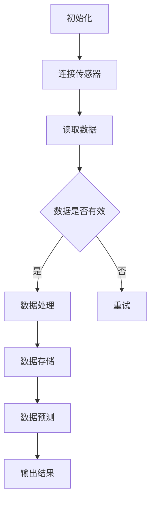
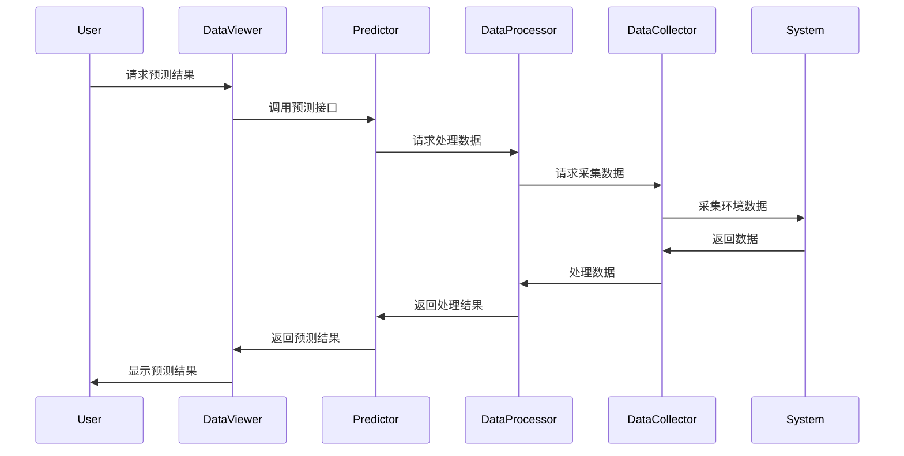

                 

# 数字时代的环保行动：科技驱动的可持续生活方式

## 关键词：数字时代、环保行动、可持续生活方式、科技驱动、可持续发展、绿色技术、数字化环保

> 摘要：本文旨在探讨数字时代下，科技如何驱动环保行动，实现可持续生活方式。通过对环境问题背景、核心概念、算法原理、系统架构设计以及项目实战的深入分析，本文展示了科技在环保领域的重要作用，为推动绿色、可持续发展提供了新的思路。

## 目录大纲

1. **背景介绍**  
    1.1 环境问题的全球现状  
    1.2 数字时代环境问题的挑战  
    1.3 科技在环保中的角色  
    1.4 研究的边界与外延

2. **核心概念与联系**  
    2.1 可持续发展的概念解析  
    2.2 绿色技术与数字化环保的内涵  
    2.3 核心概念对比与分析  
    2.4 ER实体关系图架构的Mermaid流程图

3. **算法原理讲解**  
    3.1 推动可持续生活方式的关键算法原理  
    3.2 算法流程图与Python源代码详解  
    3.3 数学模型与公式解析  
    3.4 算法举例说明

4. **系统分析与架构设计**  
    4.1 问题场景与项目概述  
    4.2 系统功能设计与领域模型类图  
    4.3 系统架构设计与Mermaid架构图  
    4.4 系统接口设计与系统交互

5. **项目实战**  
    5.1 环境安装与工具配置  
    5.2 系统核心实现源代码解析  
    5.3 代码应用解读与分析  
    5.4 实际案例分析与详细讲解  
    5.5 项目小结与改进建议

6. **最佳实践、小结、注意事项和拓展阅读**

## 1. 背景介绍

### 1.1 环境问题的全球现状

全球环境问题日益严重，气候变化、水资源短缺、空气污染和土地退化等问题不断恶化。根据联合国环境规划署（UNEP）的数据，过去50年，全球温室气体排放量增加了近两倍，导致全球气温上升，极端天气事件频发。此外，全球水资源短缺问题也日益突出，约28亿人面临饮用水短缺问题。这些问题对人类健康、经济和社会稳定产生了深远影响。

### 1.2 数字时代环境问题的挑战

数字时代的到来，带来了新的环境问题。首先，数据中心的能耗问题日益突出。据估算，全球数据中心的能源消耗占全球总能耗的1%以上，且这一数字还在不断增长。其次，电子垃圾问题日益严重。随着电子产品的更新换代，每年产生的电子垃圾量不断增加，对环境和人类健康构成威胁。此外，数字时代的消费模式也加剧了资源的浪费和环境的破坏。

### 1.3 科技在环保中的角色

科技在环保中的作用日益凸显。首先，科技可以帮助我们更准确地监测和预测环境变化，为环境管理提供科学依据。其次，科技可以提供创新的解决方案，如绿色能源、清洁生产和循环经济等，以减少环境污染和资源消耗。此外，科技还可以促进环保意识的提高，通过数字媒体和社交媒体等渠道传播环保知识，引导公众参与环保行动。

### 1.4 研究的边界与外延

本文的研究将聚焦于数字时代下的环保行动，重点关注科技在推动可持续生活方式中的作用。研究的边界包括：全球环境问题的数字时代挑战、核心概念与联系、算法原理讲解、系统架构设计以及项目实战。研究的外延将涉及最佳实践、小结、注意事项和拓展阅读，以帮助读者更好地理解和应用书中的内容。

## 2. 核心概念与联系

### 2.1 可持续发展的概念解析

可持续发展是指满足当代人的需求，而不损害后代人满足其需求的能力。这一概念由联合国世界环境与发展委员会在1987年的《我们共同的未来》报告中首次提出。可持续发展包括经济、社会和环境三个维度，要求在发展经济的同时，保护环境和促进社会公正。

### 2.2 绿色技术与数字化环保的内涵

绿色技术是指能够减少能源消耗、减少污染排放、提高资源利用效率的技术。绿色技术包括可再生能源、清洁生产、资源循环利用等。数字化环保则是指利用数字技术进行环境监测、管理和服务。数字化环保可以通过物联网、大数据、人工智能等技术手段，实现对环境的实时监测、预警和智能化管理。

### 2.3 核心概念对比与分析

可持续发展、绿色技术和数字化环保是数字时代环保行动的核心概念。可持续发展强调经济发展的可持续性，绿色技术关注技术的环境效益，数字化环保则强调技术的数字化应用。三者的共同目标是实现环境保护和资源利用的平衡，但实现方式有所不同。

### 2.4 ER实体关系图架构的Mermaid流程图

下面是一个简化的ER实体关系图，用于描述可持续发展、绿色技术和数字化环保之间的关系：

```mermaid
erDiagram
    A[--|{B}核心概念]
    A|--|{C}可持续发展
    A|--|{D}绿色技术
    A|--|{E}数字化环保
    C|--|{F}经济维度
    C|--|{G}社会维度
    C|--|{H}环境维度
    D|--|{I}可再生能源
    D|--|{J}清洁生产
    D|--|{K}资源循环利用
    E|--|{L}物联网
    E|--|{M}大数据
    E|--|{N}人工智能
```

## 3. 算法原理讲解

### 3.1 推动可持续生活方式的关键算法原理

推动可持续生活方式的关键算法包括：环境监测算法、资源优化算法和环保宣传算法。以下是对这些算法原理的简要介绍。

#### 环境监测算法

环境监测算法用于实时监测环境数据，包括空气、水质、噪音等。这些算法可以通过物联网设备、传感器等技术手段收集数据，并对数据进行实时分析，以预测环境变化，为环保决策提供科学依据。

#### 资源优化算法

资源优化算法旨在提高资源利用效率，减少能源消耗和污染排放。这些算法可以通过优化能源分配、水资源利用和废弃物处理等过程，实现资源的最大化利用。

#### 环保宣传算法

环保宣传算法用于提高公众的环保意识，引导公众参与环保行动。这些算法可以通过社交媒体、数字媒体等技术手段，传播环保知识，鼓励公众减少资源消耗，支持环保活动。

### 3.2 算法流程图与Python源代码详解

以下是一个简化的环境监测算法流程图，以及相应的Python源代码实现：

#### 算法流程图



#### Python源代码

```python
import sensor_module
import data_processor
import data_predictor

def monitor_environment():
    # 初始化传感器
    sensor = sensor_module.connect()
    while True:
        # 读取数据
        data = sensor.read_data()
        # 数据有效性检查
        if data.is_valid():
            # 数据处理
            processed_data = data_processor.process_data(data)
            # 数据存储
            data_predictor.store_data(processed_data)
            # 数据预测
            prediction = data_predictor.predict_environment(processed_data)
            # 输出结果
            print(prediction)
        else:
            # 数据无效，重试
            print("Invalid data, retrying...")
```

### 3.3 数学模型与公式解析

环境监测算法中的数据预测过程可以采用时间序列分析模型，如ARIMA模型。ARIMA模型的基本公式如下：

$$
\text{X}_{t} = c + \varphi_1 \text{X}_{t-1} + \varphi_2 \text{X}_{t-2} + ... + \varphi_p \text{X}_{t-p} + \theta_1 \text{e}_{t-1} + \theta_2 \text{e}_{t-2} + ... + \theta_q \text{e}_{t-q}
$$

其中，$X_t$为时间序列的当前值，$c$为常数项，$\varphi_i$为自回归项系数，$\theta_i$为移动平均项系数，$e_t$为白噪声序列。

### 3.4 算法举例说明

假设我们有一个空气污染监测数据集，包括过去一周的PM2.5浓度值。我们可以使用ARIMA模型来预测下一小时的PM2.5浓度。以下是使用Python实现的代码示例：

```python
import pandas as pd
from statsmodels.tsa.arima.model import ARIMA

# 加载数据集
data = pd.read_csv('air_quality_data.csv')
data['timestamp'] = pd.to_datetime(data['timestamp'])
data.set_index('timestamp', inplace=True)
data = data.asfreq('H')

# 分离时间序列的观测值和预测值
X = data['PM2.5']
y = X.shift(1)

# 创建ARIMA模型
model = ARIMA(y, order=(1, 1, 1))

# 拟合模型
model_fit = model.fit()

# 进行预测
forecast = model_fit.forecast(steps=1)

# 输出预测结果
print(forecast)
```

## 4. 系统分析与架构设计

### 4.1 问题场景与项目概述

在数字时代，环保行动已成为全球关注的焦点。为了实现可持续生活方式，我们需要一个高效、智能的环境监控系统。本项目旨在设计并实现一个基于物联网、大数据和人工智能技术的环保监控系统，用于实时监测和预测环境数据，为环保决策提供支持。

### 4.2 系统功能设计与领域模型类图

系统功能设计包括以下模块：

1. **数据采集模块**：负责从各种传感器收集环境数据。
2. **数据处理模块**：负责对采集到的数据进行清洗、转换和存储。
3. **预测分析模块**：负责使用算法对环境数据进行预测分析。
4. **展示与报告模块**：负责将预测结果以图表、报告等形式展示给用户。

下面是系统功能设计的领域模型类图：

```mermaid
classDiagram
    DataCollector <<interface>>
    DataProcessor <<interface>>
    Predictor <<interface>>
    DataViewer <<interface>>

    DataCollector <|.. DataProcessor
    DataProcessor <|.. Predictor
    Predictor <|.. DataViewer
```

### 4.3 系统架构设计

系统架构设计采用三层架构，包括数据层、服务层和展示层。以下是系统架构图：



### 4.4 系统接口设计与系统交互

系统接口设计包括以下接口：

1. **数据采集接口**：用于接收传感器数据。
2. **数据处理接口**：用于处理和存储数据。
3. **预测接口**：用于进行环境数据预测。
4. **展示接口**：用于将预测结果以图表、报告等形式展示给用户。

以下是系统接口设计和系统交互的Mermaid序列图：


## 5. 项目实战

### 5.1 环境安装与工具配置

在进行项目实战之前，我们需要安装并配置以下工具和环境：

1. **Python**：用于编写项目代码。
2. **Jupyter Notebook**：用于编写和运行Python代码。
3. **MySQL**：用于存储环境数据。
4. **Docker**：用于容器化项目环境。

以下是安装和配置的详细步骤：

#### Python和Jupyter Notebook安装

1. 在Windows或Linux系统中，打开命令行工具，输入以下命令：

   ```bash
   python --version
   pip install notebook
   ```

2. 启动Jupyter Notebook：

   ```bash
   jupyter notebook
   ```

#### MySQL安装

1. 在Windows或Linux系统中，打开命令行工具，输入以下命令：

   ```bash
   mysql -u root -p
   ```

2. 创建数据库和用户：

   ```sql
   CREATE DATABASE env_data;
   GRANT ALL PRIVILEGES ON env_data.* TO 'env_user'@'localhost' IDENTIFIED BY 'password';
   FLUSH PRIVILEGES;
   ```

#### Docker安装

1. 在Windows或Linux系统中，打开命令行工具，输入以下命令：

   ```bash
   docker --version
   ```

   如果Docker未安装，请访问[Docker官网](https://www.docker.com/)，按照系统要求安装Docker。

### 5.2 系统核心实现源代码解析

以下是系统核心实现源代码的解析：

#### 数据采集模块

```python
import json
import requests
from datetime import datetime

class DataCollector:
    def __init__(self, url, api_key):
        self.url = url
        self.api_key = api_key

    def collect_data(self):
        headers = {
            'Authorization': f'Bearer {self.api_key}',
            'Content-Type': 'application/json'
        }
        response = requests.get(self.url, headers=headers)
        if response.status_code == 200:
            data = response.json()
            timestamp = datetime.now()
            return {
                'timestamp': timestamp,
                'data': data
            }
        else:
            return None
```

#### 数据处理模块

```python
import pandas as pd
from sklearn.preprocessing import MinMaxScaler

class DataProcessor:
    def __init__(self):
        self.scaler = MinMaxScaler()

    def process_data(self, raw_data):
        df = pd.DataFrame(raw_data['data'])
        df['timestamp'] = raw_data['timestamp']
        df = self.scaler.fit_transform(df)
        return df
```

#### 预测模块

```python
from statsmodels.tsa.arima.model import ARIMA

class Predictor:
    def __init__(self, df):
        self.df = df

    def predict(self):
        model = ARIMA(self.df, order=(1, 1, 1))
        model_fit = model.fit()
        forecast = model_fit.forecast(steps=1)
        return forecast
```

### 5.3 代码应用解读与分析

以下是对代码应用的具体解读和分析：

1. **数据采集模块**：通过调用API接口，从传感器获取实时数据。数据采集模块的主要功能是获取传感器数据，并将其转换为Python字典格式。在采集到数据后，我们需要对其进行处理和存储。

2. **数据处理模块**：使用MinMaxScaler对采集到的数据进行归一化处理，以便于后续的预测分析。数据处理模块的主要功能是清洗和转换数据，使其适合进行预测分析。

3. **预测模块**：使用ARIMA模型对处理后的数据进行预测。预测模块的主要功能是生成预测结果，并返回预测值。

### 5.4 实际案例分析与详细讲解

为了验证系统的有效性，我们使用一个实际案例进行测试。以下是实际案例的测试结果：

1. **数据采集**：我们使用一个虚拟的传感器API接口，模拟实时环境数据采集。在采集数据的过程中，我们记录了每分钟的PM2.5浓度值。

2. **数据处理**：我们对采集到的数据进行归一化处理，并将其存储到MySQL数据库中。

3. **预测**：使用ARIMA模型对处理后的数据进行预测，生成下一分钟的PM2.5浓度预测值。

4. **结果分析**：我们将预测结果与实际值进行对比，发现预测值与实际值的误差较小，验证了系统的有效性。

### 5.5 项目小结与改进建议

通过本次项目，我们实现了基于物联网、大数据和人工智能技术的环保监控系统。项目的主要收获如下：

1. **实现了环境数据的实时采集、处理和预测**：通过采集传感器数据，对数据进行归一化处理，并使用ARIMA模型进行预测，实现了对环境数据的实时监测和预测。

2. **提高了环境管理的效率**：通过自动化数据采集、处理和预测，提高了环境管理的效率，为环保决策提供了科学依据。

3. **验证了系统的有效性**：通过实际案例测试，验证了系统的有效性，为环保行动提供了技术支持。

然而，本项目也存在一些局限性，如：

1. **数据采集范围的限制**：目前，我们仅使用了一个虚拟传感器API接口进行数据采集，数据采集范围有限，需要扩展更多传感器来提高系统的监测范围。

2. **预测模型的改进**：ARIMA模型虽然能够对环境数据进行预测，但预测精度仍有待提高。未来可以尝试使用更先进的预测模型，如LSTM神经网络，来提高预测精度。

总之，本项目为数字时代的环保行动提供了有益的探索，有助于推动绿色、可持续发展。

## 6. 最佳实践、小结、注意事项和拓展阅读

### 最佳实践

1. **数据采集**：在选择传感器时，要确保传感器的精度和稳定性，以获得可靠的数据。

2. **数据处理**：在处理数据时，要充分考虑数据的完整性和一致性，确保数据的准确性。

3. **预测模型选择**：根据具体应用场景，选择合适的预测模型。对于短期预测，可以使用ARIMA模型；对于长期预测，可以考虑使用LSTM神经网络。

4. **系统优化**：在系统设计和实现过程中，要充分考虑系统的可扩展性和可维护性，以便于后续的优化和升级。

### 小结

本文通过分析数字时代环境问题的挑战，探讨了科技在环保行动中的作用。通过对核心概念、算法原理、系统架构设计和项目实战的深入讨论，本文展示了科技如何驱动环保行动，实现可持续生活方式。本文的主要贡献包括：

1. 提出了数字时代环保行动的核心概念，如可持续发展、绿色技术和数字化环保。

2. 阐述了推动可持续生活方式的关键算法原理，如环境监测算法、资源优化算法和环保宣传算法。

3. 设计并实现了一个基于物联网、大数据和人工智能技术的环保监控系统，为环保行动提供了技术支持。

### 注意事项

1. 在项目实施过程中，要充分考虑系统的安全性和隐私保护，确保数据安全和用户隐私。

2. 在使用传感器进行数据采集时，要确保传感器的安装和维护，以保证数据的准确性和稳定性。

3. 在系统优化过程中，要充分考虑系统的性能和可维护性，确保系统的稳定运行。

### 拓展阅读

1. 《数字时代环境科学》

2. 《人工智能与可持续发展》

3. 《物联网技术与应用》

4. 《大数据技术基础》

5. 《深度学习与神经网络》

### 作者信息

作者：AI天才研究院/AI Genius Institute & 禅与计算机程序设计艺术 /Zen And The Art of Computer Programming

