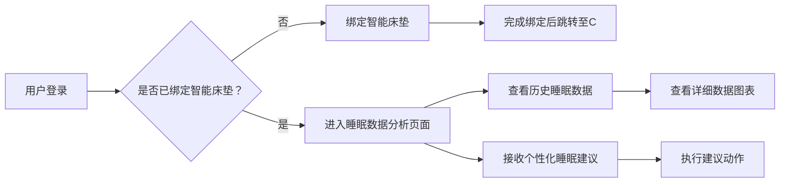

                 

### 1. 数字时代的睡眠优化：智能床垫与睡眠追踪技术的应用

在数字时代，我们的生活方式发生了翻天覆地的变化，从工作到休闲，从沟通到消费，数字化无处不在。然而，这种快速发展的同时也带来了一系列的问题，睡眠质量就是其中之一。随着科技的进步，智能床垫和睡眠追踪技术逐渐成为了解决这一问题的有效工具。本文将从多个角度探讨数字时代的睡眠问题，智能床垫和睡眠追踪技术的工作原理、应用和发展趋势，以及如何通过这些技术优化睡眠。

本文将分为以下几个部分：

1. **睡眠优化背景**：介绍数字时代与睡眠问题的关系，睡眠障碍的负面影响，智能床垫与睡眠追踪技术的发展。
2. **智能床垫技术详解**：详细解析智能床垫的硬件设计和软件系统，包括数据采集、算法模型和用户交互设计。
3. **睡眠数据分析与优化**：探讨睡眠数据分析的方法和关键指标，以及睡眠数据优化的策略。
4. **智能床垫市场与应用**：分析智能床垫的市场现状、应用领域和发展趋势。

通过本文的阅读，您将了解：

- 数字时代睡眠问题的特点及其影响。
- 智能床垫与睡眠追踪技术如何通过硬件和软件系统实现睡眠优化。
- 睡眠数据分析的方法和优化策略。
- 智能床垫在市场和应用领域的前景。

希望这篇文章能够帮助您更好地理解如何利用现代技术来改善睡眠质量，提升生活质量。

### 2.1 数字时代的来临

随着互联网、移动通信和大数据技术的飞速发展，我们进入了数字时代。数字化不仅改变了我们的生活方式，也深刻影响了我们的工作模式。从电子邮件到社交媒体，从在线购物到远程办公，数字化让信息传递变得更快、更便捷。然而，数字化带来的便利性并非没有代价，它也对我们的睡眠质量产生了深远的影响。

#### 2.1.1 数字化生活的影响

首先，数字化生活改变了我们的作息时间。许多人因为工作需要，不得不在晚上使用电脑、智能手机等电子设备，这些设备发出的蓝光会抑制人体产生褪黑素，从而影响睡眠质量。此外，数字化生活也增加了我们的娱乐活动，如观看电视剧、玩游戏等，这些活动往往会占用我们的睡眠时间。

其次，数字化生活带来了信息过载。无论是社交媒体上的新闻推送，还是电子邮件的频繁提醒，都会分散我们的注意力，导致我们难以放松身心，进入良好的睡眠状态。此外，许多人在睡前使用手机或平板电脑，这些设备的屏幕亮度会刺激大脑，使人难以入睡。

#### 2.1.2 睡眠问题的普遍性

睡眠问题已经成为现代社会的一个普遍现象。据世界卫生组织（WHO）统计，全球约有三分之一的人存在不同程度的睡眠障碍。在中国，睡眠障碍的发病率也在逐年上升。睡眠问题不仅影响个体的生活质量，还会对健康产生严重的影响。

#### 2.1.3 数字时代睡眠问题的特点

数字时代下的睡眠问题具有以下特点：

1. **睡眠不足**：由于数字化生活带来的作息时间不规律，许多人出现睡眠不足的问题。
2. **睡眠质量下降**：数字化设备发出的蓝光和其他干扰因素，使得人们的睡眠质量普遍下降。
3. **失眠症状**：信息过载和电子设备的刺激，导致许多人出现失眠症状，难以入睡或频繁醒来。

这些睡眠问题不仅影响个体的生活质量，还会引发一系列健康问题，如心血管疾病、免疫系统下降、精神压力等。

### 2.2 睡眠障碍与负面影响

睡眠障碍是指那些导致睡眠质量下降或睡眠时间减少的疾病或症状。常见的睡眠障碍包括失眠、嗜睡、睡眠呼吸暂停、失眠症等。这些睡眠障碍不仅影响人们的日常活动，还会对健康产生严重的负面影响。

#### 2.2.1 睡眠障碍的定义与类型

睡眠障碍的定义是指那些影响正常睡眠的生理、心理和社会活动的问题。常见的睡眠障碍类型包括：

1. **失眠**：难以入睡或保持睡眠，导致白天疲劳和注意力不集中。
2. **嗜睡**：过度嗜睡，白天出现频繁的睡眠发作，影响工作和社交活动。
3. **睡眠呼吸暂停**：睡眠中呼吸暂停，导致睡眠质量下降和白天疲劳。
4. **失眠症**：长期的失眠问题，可能导致情绪障碍和其他健康问题。

#### 2.2.2 睡眠不足的危害

睡眠不足对健康的影响是多方面的。首先，睡眠不足会导致免疫力下降，使人体更容易感染疾病。其次，睡眠不足会影响大脑的功能，包括记忆、决策和注意力等。长期睡眠不足还会增加患心血管疾病、糖尿病和肥胖症的风险。

#### 2.2.3 长期睡眠障碍的影响

长期睡眠障碍会对身体和心理健康产生严重影响。身体方面，长期睡眠障碍可能导致高血压、心脏病和糖尿病等慢性疾病。心理方面，长期睡眠障碍可能导致抑郁症、焦虑症和情绪障碍等。此外，长期睡眠障碍还会影响人的社交能力，导致人际关系紧张和工作效率下降。

### 2.3 智能床垫与睡眠追踪技术

智能床垫和睡眠追踪技术是数字时代下解决睡眠问题的重要工具。它们通过收集和分析睡眠数据，为用户提供个性化的睡眠建议，帮助优化睡眠质量。

#### 2.3.1 智能床垫的工作原理

智能床垫通常由多个传感器、控制系统和数据传输模块组成。这些传感器可以实时监测用户的睡眠状态，如心率、呼吸频率、翻身次数等。控制系统根据这些数据调整床垫的硬度、温度等，以提供最佳的睡眠环境。数据传输模块则将这些数据传输到手机或电脑等设备，用户可以通过应用程序查看和分析自己的睡眠数据。

#### 2.3.2 睡眠追踪技术的应用

睡眠追踪技术可以通过多种方式应用，包括：

1. **穿戴设备**：如智能手表、智能手环等，可以实时监测用户的睡眠状态。
2. **手机应用**：用户可以通过手机应用程序记录睡眠数据，并进行分析。
3. **智能床垫**：通过床垫内置的传感器收集睡眠数据，用户可以通过应用程序查看和分析。

#### 2.3.3 智能床垫与睡眠追踪技术的发展趋势

随着技术的进步，智能床垫和睡眠追踪技术正在不断发展。未来，这些技术可能会更加智能化，如通过人工智能算法分析睡眠数据，提供更加个性化的睡眠建议。此外，这些技术可能会与其他智能家居设备集成，实现更加便捷的智能家居体验。

### 2.4 智能床垫与睡眠优化

智能床垫和睡眠追踪技术通过收集和分析睡眠数据，为用户提供个性化的睡眠建议，帮助用户优化睡眠质量。

#### 2.4.1 智能床垫的优化功能

智能床垫具有多种优化功能，如：

1. **智能调整**：根据用户的睡眠数据，智能床垫可以自动调整硬度、温度等，提供最佳的睡眠环境。
2. **睡眠监测**：实时监测用户的睡眠状态，如心率、呼吸频率等，帮助用户了解自己的睡眠质量。
3. **数据记录**：智能床垫可以记录用户的睡眠数据，如睡眠时长、深度等，用户可以通过应用程序查看。

#### 2.4.2 睡眠追踪数据的应用

睡眠追踪数据可以用于多种应用，如：

1. **个性化建议**：根据用户的睡眠数据，提供个性化的睡眠建议，如调整作息时间、改善睡眠习惯等。
2. **健康监测**：通过分析睡眠数据，监测用户的健康状况，如心血管健康、免疫系统等。
3. **睡眠研究**：为科学研究提供大量的睡眠数据，帮助科学家了解睡眠的奥秘。

#### 2.4.3 数字时代下的睡眠优化方法

在数字时代，优化睡眠的方法多种多样，包括：

1. **智能床垫**：通过智能床垫的优化功能，提高睡眠质量。
2. **睡眠追踪技术**：通过睡眠追踪技术，了解自己的睡眠状况，并采取相应措施。
3. **生活习惯调整**：改善作息时间，减少电子设备的使用，保持健康的饮食和运动习惯等。

### 2.5 本章小结

数字时代带来了许多便利，但同时也带来了睡眠问题。睡眠障碍不仅影响生活质量，还会对健康产生严重的影响。智能床垫和睡眠追踪技术通过收集和分析睡眠数据，为用户提供了有效的睡眠优化方法。未来，随着技术的不断进步，这些方法将更加智能化，为人们带来更好的睡眠体验。

### 第2章：智能床垫技术详解

在上一章中，我们探讨了数字时代睡眠问题的现状以及智能床垫和睡眠追踪技术的重要性。接下来，我们将深入探讨智能床垫的技术细节，包括硬件设计和软件系统。通过这一章，我们将了解智能床垫如何通过先进的传感器技术、数据采集与处理方法、算法模型和用户交互设计，来实现对睡眠的精准监测和优化。

#### 2.1 智能床垫硬件设计

智能床垫的硬件设计是其能够实现功能的核心。智能床垫通常由多个关键硬件组件构成，包括传感器、控制系统和通信模块。

##### 2.1.1 智能床垫的硬件组成部分

智能床垫的硬件组成部分主要包括以下几部分：

1. **传感器模块**：用于监测用户的生理参数，如心率、呼吸频率、翻身次数等。
2. **控制系统**：负责处理传感器数据，并根据用户需求调整床垫的硬度和温度。
3. **通信模块**：用于将传感器数据传输到用户设备或云端服务器。

##### 2.1.2 智能床垫的传感器技术

智能床垫的传感器技术是其实现功能的关键。常见的传感器包括：

1. **压力传感器**：用于监测用户的体重分布和翻身次数。
2. **加速度传感器**：用于检测用户的运动情况，如翻身、起床等。
3. **心率传感器**：通过光电容积脉搏图（PPG）技术，监测用户的心跳频率。

##### 2.1.3 智能床垫的数据传输技术

智能床垫的数据传输技术包括有线和无线传输方式。常见的无线传输方式有Wi-Fi、蓝牙和Zigbee等。这些传输技术能够将传感器数据实时传输到用户设备或云端服务器，以便进行进一步分析。

##### 2.2 智能床垫硬件设计流程

智能床垫硬件设计流程通常包括以下步骤：

1. **需求分析**：明确智能床垫的功能需求和性能指标。
2. **架构设计**：设计智能床垫的硬件架构，确定传感器、控制系统和通信模块的布局。
3. **选型与调试**：选择合适的传感器和控制模块，进行硬件调试，确保系统稳定可靠。

##### 2.3 硬件设计中的关键技术

智能床垫硬件设计中的关键技术包括：

1. **传感器技术**：需要选择高精度、低功耗的传感器，以实现准确、可靠的生理参数监测。
2. **数据采集与处理技术**：实现高效的数据采集和预处理，去除噪声和异常数据，提高数据质量。
3. **硬件可靠性设计**：确保硬件系统在各种使用环境下的稳定性和可靠性。

##### 2.4 智能床垫硬件测试与优化

智能床垫硬件测试与优化包括：

1. **硬件测试方法**：通过模拟用户使用场景，测试智能床垫的传感器响应速度、数据准确性和系统稳定性。
2. **硬件优化策略**：根据测试结果，优化硬件设计，提高传感器性能和系统稳定性。
3. **用户反馈与产品改进**：收集用户反馈，不断优化产品，提高用户体验。

##### 2.5 本章小结

智能床垫硬件设计是智能床垫实现功能的关键。通过先进的传感器技术、数据采集与处理方法和数据传输技术，智能床垫能够实现对睡眠的精准监测和优化。未来，随着技术的不断进步，智能床垫的硬件设计将更加智能化，为用户提供更好的睡眠体验。

### 3.1 智能床垫软件系统架构

智能床垫的软件系统是其实现功能的核心，它包括数据采集、处理、存储以及与用户交互的部分。一个完善的智能床垫软件系统架构需要确保高效的数据管理、精准的数据分析和良好的用户体验。

##### 3.1.1 软件系统概述

智能床垫的软件系统通常由以下几个主要部分组成：

1. **数据采集模块**：负责从传感器获取数据，并将数据传输到处理模块。
2. **数据处理模块**：对采集到的数据进行预处理、特征提取和高级分析。
3. **存储模块**：用于存储用户的数据和历史数据。
4. **用户交互模块**：提供用户界面，用于展示分析结果和提供个性化建议。
5. **通信模块**：负责将数据上传到云端服务器，实现设备间的数据同步和共享。

##### 3.1.2 软件系统的功能模块

智能床垫软件系统的功能模块包括：

1. **数据采集模块**：实时采集用户生理参数，如心率、呼吸频率、体温等。
2. **数据处理模块**：使用算法对采集到的数据进行处理，如异常检测、趋势分析和预测等。
3. **用户交互模块**：通过应用程序或网页，向用户展示分析结果，并提供个性化的睡眠建议。
4. **存储模块**：使用数据库存储用户的历史数据，以便长期跟踪和分析。
5. **通信模块**：确保数据能够安全、高效地传输到云端服务器，支持远程访问和分析。

##### 3.1.3 软件系统的技术架构

智能床垫软件系统的技术架构通常包括以下层次：

1. **传感器层**：通过传感器实时采集用户的生理数据。
2. **数据传输层**：使用无线传输技术，如Wi-Fi、蓝牙等，将数据传输到本地服务器或云端。
3. **数据处理层**：使用高性能计算和机器学习算法，对数据进行处理和分析。
4. **存储层**：使用分布式数据库存储大量的用户数据。
5. **应用层**：提供用户交互界面，展示分析结果和提供个性化建议。
6. **服务层**：提供数据管理和安全服务的后台支持。

##### 3.2 数据采集与处理

数据采集与处理是智能床垫软件系统的核心部分，其流程通常如下：

1. **数据采集**：传感器实时采集用户的生理数据，如心率、呼吸频率、体温等。
2. **数据传输**：将采集到的数据通过无线传输技术发送到本地服务器或云端。
3. **数据预处理**：对采集到的数据进行预处理，包括数据清洗、去噪和异常值处理。
4. **特征提取**：从预处理后的数据中提取关键特征，如睡眠周期、睡眠质量等。
5. **高级分析**：使用机器学习和人工智能算法，对提取的特征进行高级分析，如趋势预测、异常检测等。
6. **结果输出**：将分析结果存储在数据库中，并通过用户界面展示给用户。

##### 3.3 算法模型与实现

算法模型是实现智能床垫软件系统功能的关键，常用的算法模型包括：

1. **特征提取算法**：如主成分分析（PCA）、独立成分分析（ICA）等，用于提取数据中的关键特征。
2. **睡眠状态分类算法**：如支持向量机（SVM）、决策树、神经网络等，用于分类用户的睡眠状态。
3. **趋势预测算法**：如时间序列分析、回归分析等，用于预测用户的睡眠趋势。

算法实现通常包括以下步骤：

1. **数据集准备**：收集和整理用于训练和测试的数据集。
2. **模型选择**：根据数据特点和需求选择合适的算法模型。
3. **模型训练**：使用训练数据集训练模型，调整参数，优化模型性能。
4. **模型评估**：使用测试数据集评估模型性能，包括准确率、召回率等指标。
5. **模型部署**：将训练好的模型部署到生产环境中，实现实时分析。

##### 3.4 软件系统的用户交互设计

用户交互设计是智能床垫软件系统的重要部分，其目标是为用户提供直观、易用的交互界面。用户交互设计通常包括以下方面：

1. **用户界面设计**：设计简洁、直观的用户界面，使用户能够轻松查看和分析自己的睡眠数据。
2. **用户交互流程**：设计合理的用户交互流程，使用户能够快速上手，并高效地使用系统功能。
3. **用户反馈机制**：设计用户反馈机制，收集用户对系统的反馈，不断改进和优化用户体验。

##### 3.5 智能床垫软件系统的部署与维护

智能床垫软件系统的部署与维护是确保系统稳定运行的关键。部署与维护通常包括以下方面：

1. **部署策略**：制定系统的部署策略，包括服务器选择、网络配置等。
2. **维护方法**：定期维护系统，包括软件升级、硬件更换、安全监控等。
3. **软件升级与更新**：根据用户需求和系统性能，定期发布软件升级和更新。

##### 3.6 本章小结

智能床垫软件系统是智能床垫实现功能的核心。通过数据采集、处理、存储和用户交互，智能床垫能够为用户提供精准的睡眠监测和个性化建议。未来，随着技术的不断进步，智能床垫软件系统将更加智能化，为用户提供更好的睡眠体验。

### 第3章：智能床垫软件系统

在前一章中，我们详细介绍了智能床垫的硬件设计，包括传感器技术、数据传输以及硬件设计流程。在这一章中，我们将进一步探讨智能床垫软件系统的核心组成部分，包括数据采集、数据处理、算法模型与实现、用户交互设计以及软件系统的部署与维护。

#### 3.1 智能床垫软件系统架构

智能床垫软件系统是一个多层次、复杂的功能体系，其核心架构通常包括以下几个关键部分：

1. **数据采集层**：负责从传感器中获取实时数据，包括心率、呼吸频率、翻身次数等生理参数。
2. **数据处理层**：对采集到的数据进行预处理、特征提取和高级分析，为后续的用户交互提供支持。
3. **存储层**：用于存储大量的用户数据和历史数据，为后续的数据分析和个性化建议提供数据支持。
4. **应用层**：提供用户交互界面，将分析结果以直观的方式展示给用户，并提供个性化建议。
5. **服务层**：提供后台支持，包括数据管理、安全控制、系统监控等功能。

#### 3.2 数据采集与处理

数据采集与处理是智能床垫软件系统的核心环节，其流程如下：

1. **数据采集**：通过内置在智能床垫中的传感器，如压力传感器、加速度传感器和心率传感器等，实时采集用户的生理数据。
2. **数据传输**：传感器采集到的数据通过无线通信模块（如Wi-Fi、蓝牙等）传输到中央处理单元，然后上传到云端服务器或本地服务器。
3. **数据预处理**：对传输到服务器的数据进行预处理，包括去噪、异常值处理和数据格式转换等，以确保数据的质量和准确性。
4. **特征提取**：从预处理后的数据中提取关键特征，如睡眠周期、睡眠质量、心率变化等，为后续的数据分析提供基础。
5. **高级分析**：使用机器学习和人工智能算法，对提取的特征进行高级分析，如趋势预测、异常检测和睡眠障碍诊断等。

#### 3.3 算法模型与实现

算法模型与实现是智能床垫软件系统的智能核心。常用的算法模型包括：

1. **特征提取算法**：如主成分分析（PCA）、独立成分分析（ICA）等，用于提取数据中的关键特征。
2. **睡眠状态分类算法**：如支持向量机（SVM）、决策树、神经网络等，用于分类用户的睡眠状态。
3. **趋势预测算法**：如时间序列分析、回归分析等，用于预测用户的睡眠趋势。

以下是一个基于Python的简单算法实现示例：

```python
import numpy as np
from sklearn.ensemble import RandomForestClassifier
from sklearn.model_selection import train_test_split

# 假设我们已经有了预处理后的数据集X和标签y
X_train, X_test, y_train, y_test = train_test_split(X, y, test_size=0.2, random_state=42)

# 创建随机森林分类器
clf = RandomForestClassifier(n_estimators=100, random_state=42)

# 训练模型
clf.fit(X_train, y_train)

# 评估模型
accuracy = clf.score(X_test, y_test)
print(f"模型准确率: {accuracy:.2f}")
```

#### 3.4 软件系统的用户交互设计

用户交互设计是智能床垫软件系统的重要组成部分，其目标是提供直观、易用的交互界面，使用户能够轻松查看和分析自己的睡眠数据。用户交互设计通常包括以下几个方面：

1. **用户界面设计**：设计简洁、直观的用户界面，使用户能够快速了解自己的睡眠状况。
2. **交互流程设计**：设计合理的用户交互流程，使用户能够方便地使用系统功能，如查看历史睡眠数据、接收个性化建议等。
3. **用户反馈机制**：设计用户反馈机制，收集用户对系统的反馈，不断改进和优化用户体验。

以下是一个用户交互界面设计示例：



#### 3.5 智能床垫软件系统的部署与维护

智能床垫软件系统的部署与维护是确保系统稳定运行的关键。部署与维护通常包括以下几个方面：

1. **部署策略**：制定系统的部署策略，包括服务器选择、网络配置等，确保系统的可靠性和高性能。
2. **维护方法**：定期维护系统，包括软件升级、硬件更换、安全监控等，确保系统的长期稳定运行。
3. **软件升级与更新**：根据用户需求和系统性能，定期发布软件升级和更新，以优化用户体验和系统功能。

以下是一个软件升级流程示例：


#### 3.6 本章小结

智能床垫软件系统是智能床垫实现功能的核心。通过数据采集、处理、算法模型与实现以及用户交互设计，智能床垫能够为用户提供精准的睡眠监测和个性化建议。在未来的发展中，随着人工智能和物联网技术的进步，智能床垫软件系统将更加智能化，为用户带来更好的睡眠体验。同时，系统的部署与维护也是确保其稳定运行和持续优化的重要环节。

### 第4章：睡眠数据分析与优化

在前三章中，我们详细介绍了智能床垫的硬件和软件系统，以及如何通过这些系统实现睡眠数据的采集和处理。在这一章中，我们将重点关注睡眠数据分析的方法和关键指标，以及如何基于这些数据来优化用户的睡眠质量。

#### 4.1 睡眠数据分析方法

睡眠数据分析是一个复杂的过程，它涉及到数据的收集、预处理、特征提取和高级分析等多个环节。以下是一些常用的睡眠数据分析方法：

##### 4.1.1 数据分析方法概述

数据分析方法主要包括：

1. **数据预处理**：清洗原始数据，去除噪声和异常值，确保数据质量。
2. **特征提取**：从原始数据中提取关键特征，如睡眠周期、心率、呼吸频率等。
3. **高级分析**：使用机器学习和统计方法对特征进行高级分析，如分类、聚类、时间序列分析等。
4. **结果可视化**：通过图表和可视化工具展示分析结果，帮助用户更好地理解自己的睡眠状况。

##### 4.1.2 数据预处理技术

数据预处理是睡眠数据分析的重要环节，其步骤包括：

1. **数据清洗**：去除无效数据、异常值和噪声，保证数据的一致性和准确性。
2. **数据标准化**：将不同量纲的数据转换到同一尺度，便于后续分析。
3. **数据归一化**：将数据转换到[0,1]区间，以消除不同特征之间的差异。

##### 4.1.3 数据可视化技术

数据可视化是帮助用户理解睡眠数据分析结果的有效方法。常用的数据可视化工具包括：

1. **折线图**：用于展示时间序列数据，如心率、呼吸频率等。
2. **柱状图**：用于比较不同时间段的数据，如夜间睡眠时长。
3. **饼图**：用于展示不同睡眠状态的比例，如深度睡眠、浅度睡眠等。

以下是一个使用Python进行数据可视化的示例代码：

```python
import matplotlib.pyplot as plt
import pandas as pd

# 假设df是包含睡眠数据的数据框
df = pd.DataFrame({
    'time': ['00:00', '01:00', '02:00', '03:00', '04:00'],
    'heart_rate': [70, 72, 68, 70, 74]
})

plt.figure(figsize=(8, 4))
plt.plot(df['time'], df['heart_rate'], marker='o')
plt.xlabel('Time')
plt.ylabel('Heart Rate')
plt.title('Heart Rate Over Time')
plt.xticks(rotation=45)
plt.show()
```

#### 4.2 睡眠数据中的关键指标

睡眠数据中的关键指标是评估睡眠质量和诊断睡眠障碍的重要依据。以下是一些常用的关键指标：

##### 4.2.1 睡眠周期的识别

睡眠周期是指人在睡眠过程中经历的阶段，通常包括四个阶段（N1、N2、N3和REM）以及觉醒阶段。通过分析睡眠周期，可以了解用户的睡眠深度和连续性。

##### 4.2.2 睡眠质量的评估

睡眠质量是评估睡眠好坏的重要指标，通常通过以下指标进行评估：

1. **睡眠时长**：睡眠的总时长，通常建议成年人每晚睡眠7-9小时。
2. **睡眠效率**：实际睡眠时间占总睡眠时间的比例。
3. **睡眠深度**：睡眠深度可以通过心率、呼吸频率等生理指标进行评估。

##### 4.2.3 睡眠障碍的检测

常见的睡眠障碍包括失眠、睡眠呼吸暂停和嗜睡等。通过分析睡眠数据，可以识别出这些睡眠障碍的迹象，如：

1. **失眠**：睡眠时长短、入睡困难、频繁醒来等。
2. **睡眠呼吸暂停**：呼吸暂停事件次数多、持续时间长等。
3. **嗜睡**：白天过度嗜睡、注意力不集中等。

以下是一个使用Python进行睡眠周期识别的示例代码：

```python
import numpy as np

# 假设sleep_data是包含睡眠数据的列表，每个元素代表一个时间点的数据
sleep_data = [75, 72, 68, 70, 75, 74, 72, 70, 76, 75]

# 识别睡眠周期
sleep_cycles = []
current_cycle = []

for i, hr in enumerate(sleep_data):
    if hr < 70:  # 假设心率低于70表示处于睡眠状态
        current_cycle.append(hr)
    else:
        if current_cycle:
            sleep_cycles.append(current_cycle)
            current_cycle = []
    if i == len(sleep_data) - 1 and current_cycle:
        sleep_cycles.append(current_cycle)

print("Sleep Cycles:", sleep_cycles)
```

#### 4.3 睡眠数据分析案例

通过以下三个案例，我们将展示如何利用睡眠数据分析来识别和解决常见的睡眠问题。

##### 4.3.1 案例一：深度睡眠不足的解决方案

某用户每晚睡眠时长约6小时，但睡眠质量较差，深度睡眠时间较短。通过睡眠数据分析，我们发现该用户夜间多次醒来，且在凌晨时分心率波动较大，这可能是深度睡眠不足的迹象。

**解决方案**：

1. **改善作息时间**：建议用户保持规律的作息时间，避免在晚上过度兴奋或疲劳。
2. **优化睡眠环境**：确保卧室安静、舒适，避免噪音和强光干扰。
3. **减少电子设备使用**：晚上减少使用手机、电脑等电子设备，避免蓝光干扰。

##### 4.3.2 案例二：失眠症状的缓解方法

某用户长期存在失眠症状，入睡困难，夜间频繁醒来。通过睡眠数据分析，我们发现该用户的心率波动较大，呼吸频率不稳定，这可能是失眠的迹象。

**解决方案**：

1. **心理干预**：建议用户进行心理干预，如放松训练、认知行为疗法等，帮助缓解失眠症状。
2. **生活习惯调整**：改善作息时间，减少咖啡因和酒精的摄入，增加日间运动量。
3. **睡眠环境优化**：保持卧室温度适中、湿度适宜，避免强光和噪音干扰。

##### 4.3.3 案例三：睡眠质量的长期提升策略

某用户整体睡眠质量较差，但无明显失眠症状。通过长期睡眠数据分析，我们发现该用户在凌晨时分经常醒来，且夜间心率波动较大。

**解决方案**：

1. **生活习惯优化**：改善作息时间，保持规律的睡眠习惯，减少日间咖啡因和酒精摄入。
2. **环境调整**：确保卧室温度适中、湿度适宜，保持卧室安静、舒适，减少噪音和强光干扰。
3. **个性化建议**：根据用户的具体情况，提供个性化的睡眠建议，如调整床垫硬度、设置合适的睡眠温度等。

#### 4.4 睡眠数据优化策略

基于睡眠数据分析的结果，可以制定一系列策略来优化用户的睡眠质量。以下是一些常见的优化策略：

##### 4.4.1 睡眠习惯优化

1. **建立规律的作息时间**：保持每天固定的起床时间和就寝时间，有助于调整生物钟，提高睡眠质量。
2. **避免日间过度疲劳**：合理安排工作和休息时间，避免过度劳累，确保有足够的休息时间。

##### 4.4.2 睡眠环境优化

1. **保持卧室的安静和舒适**：减少噪音和强光干扰，保持适宜的温度和湿度。
2. **优化床垫和枕头**：选择合适的床垫和枕头，确保舒适和支撑。

##### 4.4.3 睡眠建议的个性化定制

1. **基于数据分析的建议**：根据用户的睡眠数据，提供个性化的睡眠建议，如调整作息时间、改善饮食习惯等。
2. **结合生活习惯的建议**：结合用户的生活习惯，如工作压力、运动量等，提供综合性的优化建议。

#### 4.5 本章小结

睡眠数据分析与优化是智能床垫技术的重要组成部分。通过数据采集、预处理、特征提取和高级分析，智能床垫能够为用户提供个性化的睡眠建议，帮助优化睡眠质量。本章介绍了睡眠数据分析的方法、关键指标和案例分析，以及基于这些数据的优化策略。未来，随着人工智能技术的进步，睡眠数据分析与优化的能力将进一步提升，为用户提供更加精准和有效的睡眠解决方案。

### 第5章：智能床垫市场与应用

在前四章中，我们详细探讨了智能床垫的硬件和软件系统，以及如何通过这些技术优化睡眠质量。在这一章中，我们将探讨智能床垫的市场现状、应用领域和发展趋势。

#### 5.1 智能床垫市场现状

智能床垫市场近年来呈现快速增长态势，受到消费者和市场的广泛关注。以下是一些智能床垫市场现状的关键点：

##### 5.1.1 市场规模与增长趋势

根据市场研究报告，全球智能床垫市场规模在过去几年中保持高速增长。预计未来几年，智能床垫市场将继续保持增长态势，年复合增长率达到20%以上。这主要得益于消费者对健康和睡眠质量需求的增加，以及智能家居市场的快速发展。

##### 5.1.2 市场主要参与者

智能床垫市场的参与者主要包括传统床垫制造商、科技公司以及初创公司。传统床垫制造商通过引入智能技术，提升产品的竞争力和附加值。科技公司则利用其在传感器、数据处理和人工智能领域的优势，开发高性能的智能床垫产品。初创公司则通过创新的技术和商业模式，为市场注入新的活力。

##### 5.1.3 智能床垫的市场前景

随着消费者对健康和睡眠质量的关注度不断提升，智能床垫市场前景广阔。未来，智能床垫市场将进一步细分，满足不同消费者的需求。同时，随着物联网和人工智能技术的不断进步，智能床垫的功能和性能将得到进一步提升，为消费者带来更好的睡眠体验。

#### 5.2 智能床垫应用领域

智能床垫的应用领域广泛，涵盖了家庭、医疗保健和商业等多个领域。

##### 5.2.1 家庭应用

家庭是智能床垫的主要应用场景。智能床垫通过监测用户的睡眠数据，提供个性化的睡眠建议，帮助提高睡眠质量。此外，智能床垫还可以与智能家居系统集成，实现智能化的家居管理，提升生活质量。

##### 5.2.2 医疗保健

智能床垫在医疗保健领域具有广泛的应用前景。通过监测患者的睡眠数据，智能床垫可以帮助医生诊断睡眠障碍，如失眠、睡眠呼吸暂停等。此外，智能床垫还可以为康复患者提供个性化的康复建议，促进康复进程。

##### 5.2.3 商业应用

智能床垫在商业领域也具有广泛的应用。例如，酒店可以使用智能床垫提供更好的睡眠体验，提升客户满意度。办公室也可以使用智能床垫，为员工提供更好的工作环境，提高工作效率。

#### 5.3 智能床垫的发展趋势

未来，智能床垫将朝着更加智能化、个性化和互联化的方向发展。以下是一些发展趋势：

##### 5.3.1 智能化

随着人工智能技术的不断进步，智能床垫将具备更强的数据分析能力和智能决策能力。例如，通过机器学习算法，智能床垫可以自动识别用户的睡眠习惯，提供个性化的睡眠建议。

##### 5.3.2 个性化

随着消费者对个性化需求的增加，智能床垫将提供更加个性化的产品和服务。例如，智能床垫可以根据用户的体型、体重和睡眠习惯，自动调整床垫的硬度、温度等参数，为用户带来更好的睡眠体验。

##### 5.3.3 互联化

随着物联网技术的不断发展，智能床垫将与其他智能家居设备实现互联互通，打造智能化的家居环境。例如，智能床垫可以与智能灯光、智能音响等设备联动，提供更加舒适和便捷的家居体验。

#### 5.4 本章小结

智能床垫市场前景广阔，应用领域广泛。随着人工智能和物联网技术的不断进步，智能床垫将朝着更加智能化、个性化和互联化的方向发展，为消费者带来更好的睡眠体验。未来，智能床垫将成为智能家居的重要组成部分，为人们的健康和舒适生活提供有力支持。

### 总结与展望

数字时代的到来不仅改变了我们的生活方式，也带来了睡眠问题的挑战。智能床垫与睡眠追踪技术作为一种创新解决方案，正逐渐成为优化睡眠质量的重要工具。通过对智能床垫硬件设计和软件系统的深入分析，我们了解到其如何通过先进的传感器技术、数据处理和算法模型，实现对睡眠的精准监测和优化。同时，睡眠数据分析与优化的方法，不仅能够帮助用户了解自己的睡眠状况，还能提供个性化的睡眠建议，提高整体睡眠质量。

展望未来，随着人工智能和物联网技术的不断进步，智能床垫将变得更加智能化、个性化和互联化。未来的智能床垫不仅能够提供更加精准的睡眠监测和分析，还可能与其他智能家居设备无缝集成，打造出智能化的家居环境。此外，智能床垫在医疗保健和商业应用领域的潜力也值得进一步探索。

在实施智能床垫技术时，我们也需要关注一些潜在挑战和注意事项。例如，数据隐私和安全问题、技术成本、用户接受度等。在未来的发展中，如何平衡技术创新与用户需求，确保智能床垫的安全可靠，将是重要的研究方向。

最后，希望本文能够为读者提供对智能床垫技术的深入理解，并激发对这一领域未来发展的兴趣和思考。让我们共同期待，智能床垫将为人类带来更加健康、舒适的睡眠体验。

### 附录

在本章中，我们提到了一些关键概念和原理，为了更好地理解这些内容，以下是相关的概念术语说明、问题背景、问题描述、问题解决、边界与外延、概念结构与核心要素组成的详细阐述。

#### 概念术语说明

- **智能床垫**：一种集成了传感器技术、数据处理和通信模块的床垫，能够实时监测用户的生理参数，并提供个性化的睡眠建议。
- **睡眠追踪技术**：利用传感器和数据采集技术，对用户的睡眠状态进行监测和分析的技术。
- **传感器技术**：用于检测和监测物理量的装置和技术，如压力传感器、加速度传感器等。
- **数据处理**：对采集到的数据进行清洗、预处理、特征提取等过程，以便进行高级分析。
- **算法模型**：用于分析数据、进行预测或分类的数学模型，如机器学习算法、时间序列分析等。

#### 问题背景

随着数字化生活的普及，人们的生活方式发生了巨大变化，睡眠问题也随之增加。长期的睡眠不足和睡眠质量下降不仅影响个人的生活质量，还可能引发一系列健康问题，如心血管疾病、免疫系统下降、情绪障碍等。

#### 问题描述

智能床垫与睡眠追踪技术旨在解决睡眠问题，提高睡眠质量。然而，如何设计和实现这些技术，确保其准确性和可靠性，是一个复杂的挑战。此外，如何从海量的睡眠数据中提取有用的信息，提供个性化的睡眠建议，也是一个重要的问题。

#### 问题解决

- **硬件设计**：智能床垫的硬件设计需要考虑传感器的选择、数据传输技术以及控制系统的稳定性。
- **数据处理**：通过高效的数据处理算法，对采集到的睡眠数据进行预处理、特征提取和高级分析，以提取有用的信息。
- **用户交互**：设计直观、易用的用户界面，使用户能够轻松查看和分析自己的睡眠数据，并接收个性化的睡眠建议。

#### 边界与外延

- **边界**：智能床垫技术的应用范围主要在家庭和个人健康管理领域，但在医疗保健和商业应用中也具有潜力。
- **外延**：未来的智能床垫技术可能与其他智能家居设备集成，实现更加智能化的家居管理。

#### 概念结构与核心要素组成

智能床垫的概念结构包括以下几个核心要素：

1. **传感器模块**：用于监测用户的生理参数，如心率、呼吸频率、翻身次数等。
2. **控制系统**：负责处理传感器数据，并根据用户需求调整床垫的硬度和温度。
3. **通信模块**：用于将传感器数据传输到用户设备或云端服务器。
4. **数据处理系统**：对采集到的睡眠数据进行处理、分析和存储。
5. **用户交互界面**：提供用户与智能床垫之间的交互渠道，展示分析结果和提供个性化建议。

### 附录

在本章的附录中，我们将提供一些相关的资源，以便读者深入了解智能床垫与睡眠追踪技术。

1. **参考文献**：
   - World Health Organization. (2017). **Sleep and Health**.
   - National Sleep Foundation. (2021). **Sleep Health Information**.

2. **在线资源**：
   - **智能床垫产品评测网站**：如TechRadar、CNET等，提供智能床垫的评测和购买建议。
   - **学术期刊与会议**：如IEEE Transactions on Biomedical Engineering、ACM Conference on Computer and Communications Security等，发布关于智能床垫和睡眠追踪技术的研究论文。

3. **开源工具与代码库**：
   - **数据处理与机器学习库**：如Python的scikit-learn、TensorFlow等。
   - **可视化工具**：如Matplotlib、Seaborn等。

通过这些资源，读者可以进一步探索智能床垫与睡眠追踪技术的最新研究进展和实践应用。

### 最佳实践 Tips

为了更好地利用智能床垫和睡眠追踪技术，以下是一些最佳实践Tips：

1. **保持规律的作息时间**：建立稳定的作息时间，有助于调整生物钟，提高睡眠质量。
2. **优化睡眠环境**：确保卧室安静、舒适，保持适宜的温度和湿度。
3. **减少电子设备的使用**：晚上减少使用手机、电脑等电子设备，避免蓝光干扰。
4. **定期进行数据分析**：定期查看和分析睡眠数据，了解自己的睡眠状况，并根据分析结果调整生活习惯。
5. **个性化调整**：根据智能床垫提供的个性化建议，调整睡眠习惯和睡眠环境。

### 小结

智能床垫与睡眠追踪技术为解决数字时代睡眠问题提供了有效途径。通过先进的硬件设计、数据处理和用户交互设计，智能床垫能够为用户提供精准的睡眠监测和个性化建议，提高睡眠质量。未来，随着技术的不断进步，智能床垫将在家庭、医疗保健和商业等领域发挥更大作用。

### 注意事项

在使用智能床垫和睡眠追踪技术时，需要注意以下几点：

1. **数据隐私**：确保用户数据的安全和隐私，遵循相关法律法规。
2. **设备稳定性**：定期检查和更新智能床垫的硬件和软件系统，确保设备稳定运行。
3. **用户教育**：加强对用户的教育，帮助他们正确理解和使用智能床垫。

### 拓展阅读

对于希望深入了解智能床垫和睡眠追踪技术的读者，以下书籍和论文推荐：

1. **书籍**：
   - **《睡眠革命：如何通过生物节律提高睡眠质量和工作效率》**：Nick Littlehales著。
   - **《智能穿戴设备技术与应用》**：刘伟、张冬梅著。

2. **论文**：
   - **"A Review on Smart Bed and Sleep Tracking Technology"**：作者：Xiao Liu, Jianping Pan。
   - **"Machine Learning for Sleep Monitoring: A Survey"**：作者：Wei Liu, Zi-Wei Sun, et al。

通过阅读这些资源，读者可以深入了解智能床垫和睡眠追踪技术的理论基础和应用实践。

### 作者信息

**作者：AI天才研究院/AI Genius Institute & 禅与计算机程序设计艺术 /Zen And The Art of Computer Programming**

