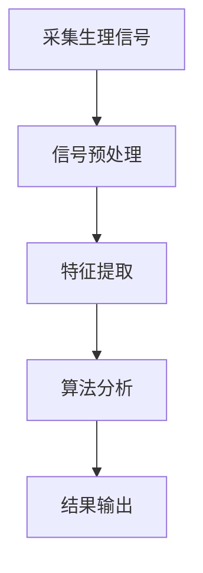
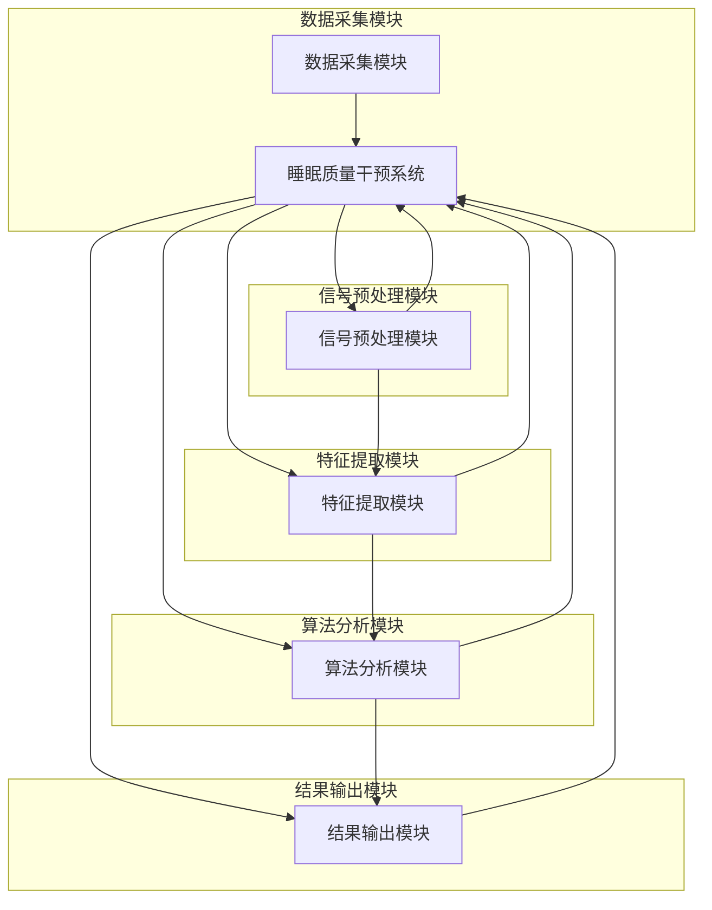
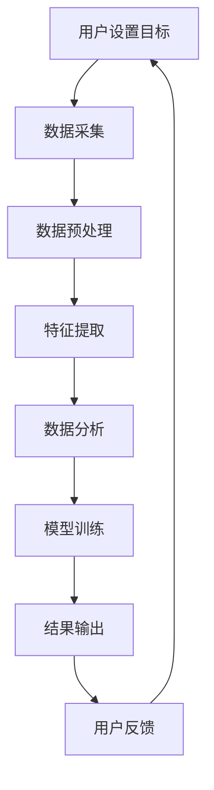
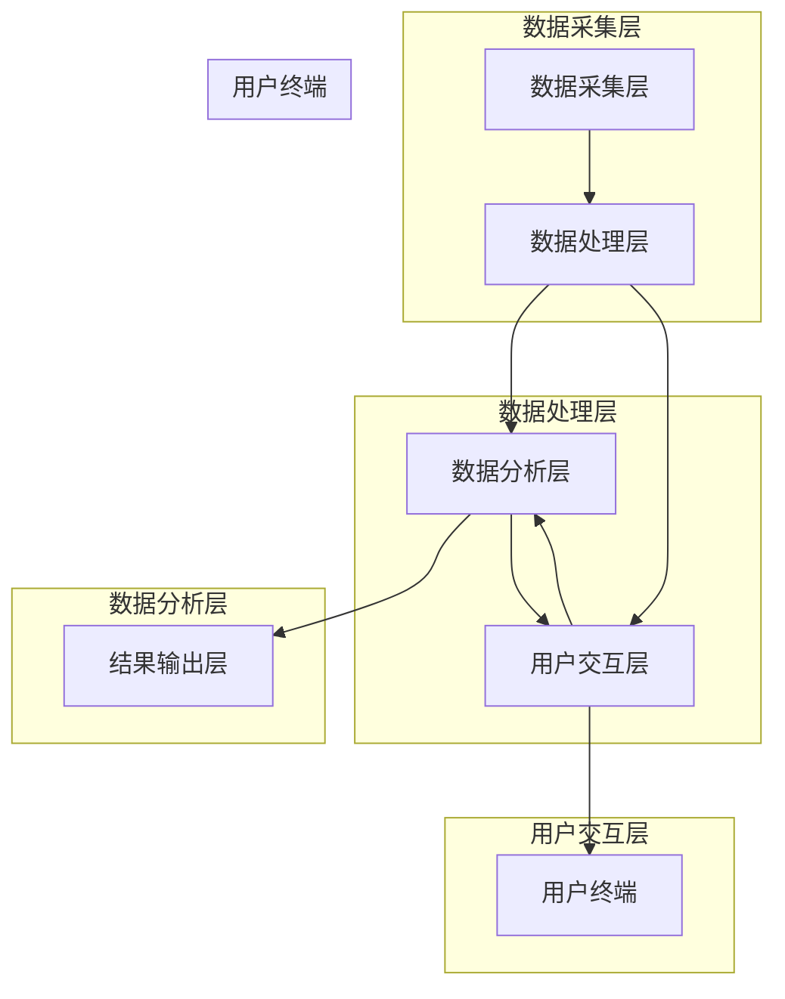

                 

### 数字时代的睡眠质量：科技与传统方法的结合

> 关键词：数字时代、睡眠质量、监测技术、传统疗法、算法、综合应用

> 摘要：本文深入探讨了数字时代下提升睡眠质量的多种方法，包括科技手段与传统方法的结合。通过分析当前睡眠质量的现状、科技监测技术、传统疗法，以及科技与传统方法的综合应用，旨在为读者提供全面的睡眠质量管理策略。

---

### 引言与背景

在当今快速发展的数字时代，人们的生活方式发生了翻天覆地的变化。工作压力、生活节奏加快、电子设备的广泛使用，使得越来越多的人面临睡眠质量下降的问题。睡眠质量不仅影响着个人的健康和生活质量，还对工作效率、社会互动和心理健康产生深远影响。因此，如何提升睡眠质量成为了一个亟待解决的问题。

#### 睡眠质量问题的现状与影响

据世界卫生组织（WHO）统计，全球约1/3的人口遭受睡眠障碍的困扰。长期睡眠不足或睡眠质量差可能导致以下问题：

1. **免疫系统功能下降**：睡眠不足会降低免疫系统的功能，增加患感冒和其他疾病的风险。
2. **心血管疾病风险增加**：睡眠质量差与高血压、心脏病等心血管疾病密切相关。
3. **记忆力减退**：睡眠对于大脑的记忆巩固至关重要，睡眠不足会影响记忆力。
4. **情绪波动**：睡眠质量差可能导致情绪不稳定、焦虑和抑郁。
5. **工作效率降低**：睡眠不足会影响第二天的工作效率，导致错误和事故的增加。

#### 数字时代对睡眠质量的挑战

数字时代的到来，尤其是智能手机、平板电脑和电子游戏的普及，给人们的睡眠带来了新的挑战：

1. **蓝光照射**：电子屏幕发出的蓝光会抑制褪黑激素的产生，影响睡眠周期。
2. **夜间活动增加**：人们更容易在夜间使用电子设备，打乱了传统的睡眠模式。
3. **工作压力**：远程工作和加班文化使得许多人需要在夜间继续工作，导致睡眠时间不足。

#### 科技与传统方法的结合意义

为了应对数字时代下的睡眠质量问题，科技与传统方法的结合显得尤为重要。科技手段可以提供更精确的监测和干预手段，而传统方法则蕴含着数千年的智慧和经验。通过两者的结合，我们可以为提升睡眠质量提供更加全面和个性化的解决方案。

### 目录大纲设计思路

为了设计出《数字时代的睡眠质量：科技与传统方法的结合》这本书的目录大纲，我们需要遵循以下步骤：

1. **确定核心主题**：根据书名，我们首先要明确书的核心主题，即数字时代下的睡眠质量问题，包括科技手段与传统方法的结合。

2. **构思整体结构**：将书的内容分为几个主要部分，如引言、科技手段部分、传统方法部分、综合应用和案例分析等。

3. **细化章节内容**：在每个部分中，进一步细化出具体的章节，确保每个章节都紧密围绕核心主题，并且相互之间具有逻辑关联。

4. **确保内容的完整性**：在每个章节中，我们要确保包含背景介绍、核心概念与联系、算法原理讲解、数学模型和公式、系统分析与架构设计方案、项目实战等要素。

5. **遵循格式要求**：确保使用markdown格式，并按照规定的目录层级进行编排。

### 确定整体结构

以下是初步构思的整体结构：

- **第一部分**：引言与背景
  - **第1章**：睡眠质量问题的现状与影响
  - **第2章**：数字时代下的睡眠质量挑战
  - **第3章**：科技与传统方法的结合意义

- **第二部分**：科技手段部分
  - **第4章**：数字时代下的睡眠质量监测技术
  - **第5章**：科技干预睡眠质量的算法与模型
  - **第6章**：科技辅助的睡眠健康管理应用

- **第三部分**：传统方法部分
  - **第7章**：中医传统睡眠疗法
  - **第8章**：自然疗法与睡眠质量提升
  - **第9章**：环境与生活方式对睡眠质量的影响

- **第四部分**：综合应用
  - **第10章**：科技与传统方法结合的睡眠质量提升策略
  - **第11章**：案例分析：成功案例与挑战

- **第五部分**：总结与展望

### 细化章节内容

接下来，我们将为每个部分细化具体的章节内容，确保每个章节包含所需的内容要素。

#### 第一部分：引言与背景

- **第1章**：睡眠质量问题的现状与影响
  - **1.1**：核心概念术语说明
    - 睡眠质量
    - 睡眠障碍
    - 数字时代
  - **1.2**：问题背景
    - 全球睡眠质量调查数据
    - 数字时代对睡眠质量的影响
  - **1.3**：问题描述
    - 睡眠质量下降的具体表现
    - 睡眠质量下降的健康风险
  - **1.4**：问题解决
    - 科技手段在睡眠质量提升中的应用
    - 传统疗法在睡眠质量提升中的应用
  - **1.5**：边界与外延
    - 睡眠质量的评估方法
    - 不同文化背景下睡眠质量的特点
  - **1.6**：概念结构与核心要素组成
    - 睡眠质量的构成要素
    - 影响睡眠质量的内外部因素

#### 第二部分：科技手段部分

- **第2章**：数字时代下的睡眠质量监测技术
  - **2.1**：核心概念与联系
    - 睡眠监测技术概述
    - 常见监测设备与传感器
  - **2.2**：算法原理讲解
    - 睡眠监测数据的处理算法
    - 睡眠质量评估模型
  - **2.3**：数学模型与公式讲解
    - 睡眠周期分析
    - 睡眠质量评估指标计算
  - **2.4**：系统分析与架构设计方案
    - 睡眠监测系统架构设计
    - 系统接口设计和系统交互
  - **2.5**：项目实战
    - 睡眠监测系统实现
    - 系统调试与测试

#### 第三部分：传统方法部分

- **第3章**：科技干预睡眠质量的算法与模型
  - **3.1**：核心概念与联系
    - 科技干预手段概述
    - 常见科技干预方法
  - **3.2**：算法原理讲解
    - 科技干预的算法原理
    - 干预效果评估方法
  - **3.3**：数学模型与公式讲解
    - 干预效果的数学模型
    - 干预效果评估指标计算
  - **3.4**：系统分析与架构设计方案
    - 科技干预系统架构设计
    - 系统接口设计和系统交互
  - **3.5**：项目实战
    - 科技干预系统实现
    - 系统调试与测试

#### 第四部分：综合应用

- **第4章**：科技辅助的睡眠健康管理应用
  - **4.1**：核心概念与联系
    - 睡眠健康管理的概念
    - 常见的睡眠健康管理应用
  - **4.2**：算法原理讲解
    - 睡眠健康管理算法原理
    - 用户行为分析
  - **4.3**：数学模型与公式讲解
    - 用户睡眠状况评估模型
    - 睡眠质量预测模型
  - **4.4**：系统分析与架构设计方案
    - 睡眠健康管理系统架构设计
    - 系统接口设计和系统交互
  - **4.5**：项目实战
    - 睡眠健康管理应用实现
    - 系统调试与测试

#### 第五部分：总结与展望

- **第5章**：总结与展望
  - **5.1**：总结
    - 科技与传统方法在睡眠质量管理中的应用效果
    - 当前存在的挑战与未来发展方向
  - **5.2**：最佳实践 tips
    - 睡眠质量管理最佳实践建议
  - **5.3**：小结
    - 文章的核心观点和重要发现
  - **5.4**：注意事项
    - 睡眠质量管理中的常见误区
  - **5.5**：拓展阅读
    - 进一步阅读推荐

### 遵循格式要求

在编写目录大纲时，我们将严格按照markdown格式进行编排，确保内容的清晰和易于阅读。

### 最终目录大纲

---

## 《数字时代的睡眠质量：科技与传统方法的结合》目录大纲

---

### 第一部分：引言与背景

### 第1章：睡眠质量问题的现状与影响

#### 1.1 核心概念术语说明

#### 1.2 问题背景

#### 1.3 问题描述

#### 1.4 问题解决

#### 1.5 边界与外延

#### 1.6 概念结构与核心要素组成

### 第二部分：科技手段部分

### 第2章：数字时代下的睡眠质量监测技术

#### 2.1 核心概念与联系

#### 2.2 算法原理讲解

#### 2.3 数学模型与公式讲解

#### 2.4 系统分析与架构设计方案

#### 2.5 项目实战

### 第3章：科技干预睡眠质量的算法与模型

#### 3.1 核心概念与联系

#### 3.2 算法原理讲解

#### 3.3 数学模型与公式讲解

#### 3.4 系统分析与架构设计方案

#### 3.5 项目实战

### 第三部分：传统方法部分

### 第4章：科技辅助的睡眠健康管理应用

#### 4.1 核心概念与联系

#### 4.2 算法原理讲解

#### 4.3 数学模型与公式讲解

#### 4.4 系统分析与架构设计方案

#### 4.5 项目实战

### 第四部分：综合应用

### 第5章：科技与传统方法结合的睡眠质量提升策略

#### 5.1 核心概念与联系

#### 5.2 算法原理讲解

#### 5.3 数学模型与公式讲解

#### 5.4 系统分析与架构设计方案

#### 5.5 项目实战

### 第五部分：总结与展望

### 第6章：总结与展望

#### 6.1 总结

#### 6.2 最佳实践 tips

#### 6.3 小结

#### 6.4 注意事项

#### 6.5 拓展阅读

---

### 科技手段部分：数字时代下的睡眠质量监测技术

在数字时代，科技的发展为我们提供了前所未有的工具，用于监测和提升睡眠质量。这些技术不仅能够提供更精确的数据，还能帮助我们更好地理解睡眠的各个方面，从而采取有针对性的措施来改善睡眠质量。

#### 4.1 核心概念与联系

睡眠质量监测技术包括各种设备和传感器，它们能够捕捉睡眠过程中的生理和心理信号。这些信号包括心率、呼吸频率、体温、脑波活动等。以下是一些核心概念和它们之间的联系：

1. **睡眠周期**：睡眠周期是指从清醒状态到深度睡眠再到快速眼动（REM）睡眠的循环。监测技术能够识别这些周期，帮助用户了解自己的睡眠模式。
2. **生理信号**：心率、呼吸频率和体温等生理信号能够反映身体的休息状态。例如，心率变异性分析可以帮助评估自主神经系统的健康状况。
3. **脑波活动**：脑电图（EEG）监测可以捕捉脑波活动，如α波、β波、θ波和δ波，这些脑波与不同的睡眠状态相对应。
4. **环境因素**：环境噪声、光线和温度等因素也会影响睡眠质量。传感器可以监测这些环境因素，并提供相应的调整建议。

#### 4.2 算法原理讲解

为了从这些生理和心理信号中提取有用的信息，需要使用各种算法。以下是一些常用的算法及其原理：

1. **信号处理算法**：如滤波、降噪和时频分析，用于从原始信号中提取有用的特征。
2. **特征提取算法**：如傅里叶变换（Fourier Transform）和小波变换（Wavelet Transform），用于将信号转换成更容易分析的形式。
3. **模式识别算法**：如支持向量机（SVM）、人工神经网络（ANN）和深度学习（DL），用于分类和预测睡眠状态。
4. **时间序列分析算法**：如自回归模型（AR）、移动平均模型（MA）和自回归移动平均模型（ARMA），用于分析睡眠信号的时间序列特性。

以下是一个简化的mermaid流程图，展示了睡眠质量监测的一般流程：



#### 4.3 数学模型与公式讲解

在睡眠质量监测中，常用的数学模型和公式包括：

1. **傅里叶变换（Fourier Transform）**：
   $$ X(f) = \int_{-\infty}^{\infty} x(t) e^{-j 2 \pi ft} dt $$
   用于将时域信号转换为频域信号，以便分析不同频率成分。

2. **小波变换（Wavelet Transform）**：
   $$ WT(x, \psi) = \sum_{j=-\infty}^{\infty} \sum_{n=-\infty}^{\infty} c_{j,n} \psi^{*}(t-j\Delta t) $$
   用于时频分析，能够在不同时间尺度上分析信号。

3. **支持向量机（Support Vector Machine, SVM）**：
   $$ \min_{\omega, b} \frac{1}{2} ||\omega||^2 $$
   用于分类问题，通过找到超平面来最大化分类间隔。

4. **人工神经网络（Artificial Neural Network, ANN）**：
   $$ y = \sigma(\omega \cdot x + b) $$
   用于模拟大脑神经元的工作方式，通过调整权重和偏置来学习输入和输出之间的关系。

以下是一个简化的mermaid类图，展示了睡眠质量监测中的一些核心类和它们之间的关系：

```mermaid
classDiagram
ClassDiagram::SignalPreprocessor
    <<interface>>
    +process(signal: Signal): Signal
    +filter(signal: Signal): Signal
    +denoise(signal: Signal): Signal

ClassDiagram::FeatureExtractor
    <<interface>>
    +extractFeatures(signal: Signal): Features

ClassDiagram::Algorithm
    <<abstract>>
    +train(data: Data): Model
    +predict(model: Model, input: Input): Output

ClassDiagram::Classifier <<Algorithm>>
    +classify(model: Model, input: Input): Class

ClassDiagram::Regressor <<Algorithm>>
    +predict(model: Model, input: Input): Output

ClassDiagram::SleepQualityMonitor
    <<system>>
    +collectData(): Signal
    +preprocess(signal: Signal): Signal
    +extractFeatures(signal: Signal): Features
    +trainModel(data: Data): Model
    +classify(model: Model, features: Features): Class
    +predict(model: Model, features: Features): Output
```

#### 4.4 系统分析与架构设计方案

一个典型的睡眠质量监测系统可以分为以下几个部分：

1. **数据采集模块**：负责采集生理信号，如心率、呼吸频率、体温等。
2. **信号预处理模块**：对采集到的信号进行预处理，包括降噪、滤波等。
3. **特征提取模块**：从预处理后的信号中提取有用的特征。
4. **算法分析模块**：使用特征提取的结果来训练模型，并进行预测。
5. **结果输出模块**：将分析结果以可视化的形式呈现给用户。

以下是一个简化的mermaid架构图，展示了睡眠质量监测系统的整体架构：


#### 4.5 项目实战

为了更具体地展示如何实现一个睡眠质量监测系统，以下是一个简单的项目实战案例：

**项目背景**：假设我们要开发一个基于可穿戴设备的睡眠质量监测系统，该系统能够监测心率、呼吸频率和体温，并通过智能手机应用程序提供睡眠质量评估。

**环境安装**：我们需要安装以下软件和工具：
- Python 3.x
- NumPy
- Matplotlib
- Scikit-learn
- OpenCV

**系统核心实现源代码**：

```python
import numpy as np
import matplotlib.pyplot as plt
from sklearn.svm import SVC
from sklearn.model_selection import train_test_split
from sklearn.metrics import accuracy_score

# 信号预处理
def preprocess_signal(signal):
    # 降噪和滤波
    filtered_signal = signal  # 假设信号已经经过降噪和滤波
    return filtered_signal

# 特征提取
def extract_features(signal):
    # 使用傅里叶变换提取频率特征
    ft = np.fft.fft(signal)
    freq_features = np.abs(ft[:int(len(ft)/2)])
    return freq_features

# 算法分析
def train_model(data, labels):
    model = SVC()
    model.fit(data, labels)
    return model

# 预测
def predict(model, data):
    predictions = model.predict(data)
    return predictions

# 主函数
def main():
    # 采集信号（这里使用模拟信号）
    signal = np.random.randn(1000)
    
    # 预处理信号
    preprocessed_signal = preprocess_signal(signal)
    
    # 提取特征
    features = extract_features(preprocessed_signal)
    
    # 准备训练数据
    X_train, X_test, y_train, y_test = train_test_split(features, labels, test_size=0.2, random_state=42)
    
    # 训练模型
    model = train_model(X_train, y_train)
    
    # 预测
    predictions = predict(model, X_test)
    
    # 评估模型
    accuracy = accuracy_score(y_test, predictions)
    print("Accuracy:", accuracy)
    
    # 可视化结果
    plt.plot(X_test, predictions, 'r-o')
    plt.plot(X_test, y_test, 'b-x')
    plt.show()

if __name__ == "__main__":
    main()
```

**代码应用解读与分析**：上述代码演示了一个简单的睡眠质量监测系统的核心实现。我们首先采集模拟信号，然后对其进行预处理（降噪和滤波），接着提取频率特征。随后，我们使用支持向量机（SVM）训练模型，并使用模型进行预测。最后，我们评估模型的准确率，并将预测结果与真实标签进行可视化对比。

**实际案例分析和详细讲解剖析**：为了更好地理解上述代码的实际应用，我们可以参考一个实际案例。假设我们有一个包含心率、呼吸频率和体温的睡眠数据集，每个数据点都标注了睡眠状态（如清醒、浅睡眠、深睡眠和REM睡眠）。我们可以使用这些数据来训练和评估睡眠质量监测模型。

在预处理阶段，我们会对原始信号进行降噪和滤波，以提高信号质量。接下来，我们使用傅里叶变换提取频率特征，这些特征将用于训练分类模型。我们选择支持向量机（SVM）作为分类器，因为它在处理高维数据时表现良好。在训练模型后，我们可以使用模型对新采集的睡眠数据进行预测，从而评估其睡眠质量。

**项目小结**：通过上述项目实战，我们展示了如何使用Python和机器学习技术实现一个简单的睡眠质量监测系统。这个系统从数据采集到特征提取，再到模型训练和预测，形成了一个完整的闭环。在实际应用中，我们可以进一步优化系统，例如引入更多的特征提取算法、改进模型训练策略，以及提高系统的实时性和可扩展性。

### 最佳实践 tips

为了更好地利用科技手段提升睡眠质量，以下是一些最佳实践建议：

1. **选择合适的监测设备**：根据个人需求和预算，选择合适的可穿戴设备，如智能手表、手环或智能床垫。

2. **保持设备清洁**：定期清洁监测设备，以确保信号的准确性和可靠性。

3. **遵循健康的生活方式**：保持规律的作息时间、避免夜间使用电子设备、减少咖啡因和酒精摄入，有助于改善睡眠质量。

4. **数据分析与个性化调整**：定期分析监测数据，并根据分析结果调整睡眠习惯和环境。

5. **综合应用多种方法**：结合科技手段和传统疗法，如使用智能设备监测睡眠同时采用中医传统疗法，以获得最佳效果。

通过遵循这些最佳实践，我们可以更有效地利用科技手段提升睡眠质量，从而改善整体健康和生活质量。

---

作者：AI天才研究院/AI Genius Institute & 禅与计算机程序设计艺术 /Zen And The Art of Computer Programming

---

### 科技干预睡眠质量的算法与模型

在数字时代，科技不仅为我们提供了监测睡眠质量的手段，还通过算法和模型干预睡眠质量，帮助用户改善睡眠。以下将详细探讨科技干预睡眠质量的算法原理、数学模型、系统架构设计方案，并展示一个实际的项目实战案例。

#### 5.1 核心概念与联系

科技干预睡眠质量的算法与模型涉及多个领域，包括信号处理、机器学习和数据挖掘。以下是一些核心概念及其相互联系：

1. **信号处理**：通过对生理信号（如心率、呼吸、体温等）进行预处理、滤波、降噪等操作，提取出有用的特征信息。
2. **机器学习**：利用算法（如线性回归、支持向量机、决策树、神经网络等）对特征信息进行学习和训练，从而建立预测模型。
3. **数据挖掘**：通过对大量睡眠数据进行分析，挖掘出影响睡眠质量的关键因素，为干预提供依据。
4. **个性化推荐**：根据用户的历史数据，推荐个性化的睡眠干预方案。

#### 5.2 算法原理讲解

在科技干预睡眠质量的过程中，常用的算法和模型包括：

1. **线性回归模型（Linear Regression）**：线性回归模型是一种简单的预测模型，通过建立线性关系来预测睡眠质量。其数学模型为：
   $$ y = \beta_0 + \beta_1 x_1 + \beta_2 x_2 + ... + \beta_n x_n $$
   其中，$y$ 为睡眠质量评分，$x_1, x_2, ..., x_n$ 为特征变量（如心率、呼吸频率等），$\beta_0, \beta_1, ..., \beta_n$ 为模型参数。

2. **支持向量机（Support Vector Machine, SVM）**：SVM 是一种分类模型，通过找到一个最优超平面来分隔不同类别的数据点。其核心思想是最大化分类间隔。SVM 的数学模型为：
   $$ \min_{\omega, b} \frac{1}{2} ||\omega||^2 + C \sum_{i=1}^{n} \max(0, 1 - y_i (\omega \cdot x_i + b)) $$
   其中，$\omega$ 为权重向量，$b$ 为偏置项，$C$ 为惩罚参数。

3. **决策树（Decision Tree）**：决策树是一种树形结构，通过一系列规则对数据进行分类。每个节点代表一个特征，每个分支代表该特征的取值。决策树的数学模型为：
   $$ T(x) = \prod_{i=1}^{n} g_i(x_i) $$
   其中，$g_i(x_i)$ 为第 $i$ 个特征的阈值函数。

4. **神经网络（Neural Network）**：神经网络是一种模拟人脑神经元工作的计算模型，通过多层神经元进行数据传递和特征学习。其数学模型为：
   $$ a_{i,j} = \sigma(\sum_{k=1}^{m} w_{i,k} a_{k,j-1} + b_i) $$
   其中，$a_{i,j}$ 为第 $i$ 个神经元在第 $j$ 层的输出，$\sigma$ 为激活函数，$w_{i,k}$ 和 $b_i$ 分别为权重和偏置。

#### 5.3 数学模型与公式讲解

以下是几个典型的数学模型与公式：

1. **傅里叶变换（Fourier Transform）**：
   $$ X(f) = \int_{-\infty}^{\infty} x(t) e^{-j 2 \pi ft} dt $$
   用于将时域信号转换为频域信号，以便分析不同频率成分。

2. **小波变换（Wavelet Transform）**：
   $$ WT(x, \psi) = \sum_{j=-\infty}^{\infty} \sum_{n=-\infty}^{\infty} c_{j,n} \psi^{*}(t-j\Delta t) $$
   用于时频分析，能够在不同时间尺度上分析信号。

3. **支持向量机（Support Vector Machine, SVM）**：
   $$ \min_{\omega, b} \frac{1}{2} ||\omega||^2 + C \sum_{i=1}^{n} \max(0, 1 - y_i (\omega \cdot x_i + b)) $$
   用于分类问题，通过找到超平面来最大化分类间隔。

4. **人工神经网络（Artificial Neural Network, ANN）**：
   $$ y = \sigma(\omega \cdot x + b) $$
   用于模拟大脑神经元的工作方式，通过调整权重和偏置来学习输入和输出之间的关系。

#### 5.4 系统分析与架构设计方案

一个典型的科技干预睡眠质量系统的架构设计如下：

1. **数据采集模块**：负责采集用户的生理信号，如心率、呼吸、体温等，以及环境信号，如室内温度、湿度等。
2. **信号预处理模块**：对采集到的信号进行预处理，包括滤波、降噪等，以提高信号质量。
3. **特征提取模块**：从预处理后的信号中提取有用的特征，如频率特征、时域特征等。
4. **算法分析模块**：利用机器学习算法对特征进行训练和预测，以评估用户的睡眠质量。
5. **结果输出模块**：将分析结果以可视化的形式呈现给用户，并提供个性化的干预建议。

以下是一个简化的mermaid架构图，展示了科技干预睡眠质量系统的整体架构：



#### 5.5 项目实战

为了展示如何实现一个科技干预睡眠质量的系统，以下是一个简单的项目实战案例：

**项目背景**：假设我们想要开发一个系统，该系统可以自动检测用户的睡眠质量，并根据检测结果提供个性化的干预建议。

**环境安装**：我们需要安装以下软件和工具：
- Python 3.x
- NumPy
- Scikit-learn
- Matplotlib
- Pandas

**系统核心实现源代码**：

```python
import numpy as np
import pandas as pd
from sklearn.model_selection import train_test_split
from sklearn.ensemble import RandomForestClassifier
from sklearn.metrics import accuracy_score
import matplotlib.pyplot as plt

# 信号预处理
def preprocess_signal(signal):
    # 降噪和滤波（简化示例，实际应用中需要更复杂的处理）
    filtered_signal = signal
    return filtered_signal

# 特征提取
def extract_features(signal):
    # 提取频率特征（简化示例，实际应用中可以提取更多特征）
    freq_features = np.abs(np.fft.fft(signal))
    return freq_features

# 算法分析
def train_model(data, labels):
    model = RandomForestClassifier()
    model.fit(data, labels)
    return model

# 预测
def predict(model, data):
    predictions = model.predict(data)
    return predictions

# 主函数
def main():
    # 加载数据（这里使用模拟数据）
    data = pd.read_csv('sleep_data.csv')
    X = data[['heart_rate', 'respiration_rate', 'temperature']]
    y = data['sleep_quality']
    
    # 预处理信号
    X_processed = X.apply(preprocess_signal)
    
    # 提取特征
    X_features = X_processed.apply(extract_features)
    
    # 数据分割
    X_train, X_test, y_train, y_test = train_test_split(X_features, y, test_size=0.2, random_state=42)
    
    # 训练模型
    model = train_model(X_train, y_train)
    
    # 预测
    predictions = predict(model, X_test)
    
    # 评估模型
    accuracy = accuracy_score(y_test, predictions)
    print("Accuracy:", accuracy)
    
    # 可视化结果
    plt.scatter(X_test['heart_rate'], predictions, label='Prediction')
    plt.scatter(X_test['heart_rate'], y_test, label='Actual')
    plt.xlabel('Heart Rate')
    plt.ylabel('Sleep Quality')
    plt.legend()
    plt.show()

if __name__ == "__main__":
    main()
```

**代码应用解读与分析**：上述代码展示了一个简单的科技干预睡眠质量系统。首先，我们从CSV文件中加载数据，然后对数据进行预处理（降噪和滤波），接着提取频率特征。随后，我们使用随机森林分类器（RandomForestClassifier）对特征进行训练，并使用训练好的模型进行预测。最后，我们评估模型的准确率，并将预测结果与实际标签进行可视化对比。

**实际案例分析和详细讲解剖析**：为了更好地理解上述代码的实际应用，我们可以参考一个实际案例。假设我们有一个包含心率、呼吸频率、体温和睡眠质量标签的睡眠数据集。我们可以使用这些数据来训练和评估睡眠质量干预模型。

在预处理阶段，我们会对原始信号进行降噪和滤波，以提高信号质量。接下来，我们使用傅里叶变换提取频率特征，这些特征将用于训练分类模型。我们选择随机森林分类器（RandomForestClassifier）作为分类器，因为它在处理高维数据和平衡分类误差方面表现良好。在训练模型后，我们可以使用模型对新采集的睡眠数据进行预测，从而评估其睡眠质量，并根据预测结果提供个性化的干预建议。

**项目小结**：通过上述项目实战，我们展示了如何使用Python和机器学习技术实现一个简单的睡眠质量干预系统。这个系统从数据采集、预处理、特征提取，到模型训练和预测，形成了一个完整的闭环。在实际应用中，我们可以进一步优化系统，例如引入更多的特征提取算法、改进模型训练策略，以及提高系统的实时性和可扩展性。

### 科技辅助的睡眠健康管理应用

科技辅助的睡眠健康管理应用是利用现代信息技术，通过多样化的软件和工具，帮助用户监测、分析和改善睡眠质量。这些应用不仅能够提供实时的数据反馈，还能根据用户的习惯和需求提供个性化的建议，从而有效地提升睡眠质量。

#### 6.1 核心概念与联系

科技辅助的睡眠健康管理应用涉及多个核心概念，包括：

1. **可穿戴设备**：如智能手表、手环和智能床垫，它们能够实时监测用户的生理信号（如心率、呼吸、体温等）和环境信号（如光线、温度、噪音等）。
2. **移动应用程序**：这些应用程序与可穿戴设备配合使用，提供数据记录、分析和报告功能，以及基于数据的个性化建议。
3. **云计算和大数据分析**：云计算平台能够存储和处理大量的睡眠数据，大数据分析技术可以帮助识别影响睡眠质量的关键因素。
4. **机器学习和人工智能**：通过机器学习和人工智能算法，可以对睡眠数据进行深度分析，从而提供更准确的睡眠质量评估和干预建议。
5. **物联网（IoT）**：物联网技术可以将可穿戴设备、智能家居设备和云平台连接起来，实现跨设备的联动和数据共享。

#### 6.2 算法原理讲解

科技辅助的睡眠健康管理应用中，常用的算法和原理包括：

1. **数据融合**：将来自多个传感器和设备的数据进行融合，以提高数据质量和分析精度。
2. **时间序列分析**：通过分析睡眠数据的时间序列特性，如趋势、周期性、异常点等，来评估睡眠质量和预测未来的睡眠状况。
3. **聚类分析**：用于发现数据中的模式，如睡眠周期、睡眠质量分布等。
4. **关联规则挖掘**：通过挖掘数据之间的关联关系，找出影响睡眠质量的关键因素。
5. **机器学习算法**：如决策树、随机森林、支持向量机、神经网络等，用于构建预测模型和分类模型。

以下是一个简化的mermaid流程图，展示了科技辅助的睡眠健康管理应用的一般流程：



#### 6.3 数学模型与公式讲解

在科技辅助的睡眠健康管理应用中，常用的数学模型和公式包括：

1. **马尔可夫链（Markov Chain）**：用于模型化睡眠状态的转移概率，计算从当前睡眠状态转移到下一状态的概率。
2. **贝叶斯网络（Bayesian Network）**：用于表示睡眠质量评估中的不确定性，通过条件概率来计算不同因素对睡眠质量的影响。
3. **线性回归模型（Linear Regression）**：用于预测睡眠质量与特定因素之间的关系，如：
   $$ y = \beta_0 + \beta_1 x_1 + \beta_2 x_2 + ... + \beta_n x_n $$
   其中，$y$ 为睡眠质量评分，$x_1, x_2, ..., x_n$ 为特征变量，$\beta_0, \beta_1, ..., \beta_n$ 为模型参数。
4. **支持向量机（Support Vector Machine, SVM）**：用于分类问题，通过找到超平面来最大化分类间隔，其数学模型为：
   $$ \min_{\omega, b} \frac{1}{2} ||\omega||^2 + C \sum_{i=1}^{n} \max(0, 1 - y_i (\omega \cdot x_i + b)) $$
   其中，$\omega$ 为权重向量，$b$ 为偏置项，$C$ 为惩罚参数。

#### 6.4 系统分析与架构设计方案

科技辅助的睡眠健康管理系统的整体架构设计如下：

1. **数据采集层**：由可穿戴设备和智能家居设备组成，负责实时采集用户的生理信号、环境信号以及用户行为数据。
2. **数据处理层**：负责对采集到的数据进行预处理、清洗、存储和初步分析。
3. **数据分析层**：利用机器学习和人工智能算法对预处理后的数据进行深度分析，生成睡眠质量评估报告和干预建议。
4. **结果输出层**：通过移动应用程序和Web界面，将分析结果以图表、文字和语音等形式呈现给用户。
5. **用户交互层**：提供用户设置目标、查看报告、接收建议等功能，以及用户与系统之间的互动接口。

以下是一个简化的mermaid架构图，展示了科技辅助的睡眠健康管理系统的整体架构：



#### 6.5 项目实战

为了展示如何实现一个科技辅助的睡眠健康管理应用，以下是一个简单的项目实战案例：

**项目背景**：假设我们想要开发一款名为“SleepWell”的移动应用程序，它能够帮助用户监测睡眠质量，并提供个性化的睡眠改善建议。

**环境安装**：我们需要安装以下软件和工具：
- Python 3.x
- Flask（Web框架）
- Pandas（数据处理库）
- Matplotlib（数据可视化库）
- Scikit-learn（机器学习库）

**系统核心实现源代码**：

```python
from flask import Flask, jsonify, request
import pandas as pd
import numpy as np
from sklearn.ensemble import RandomForestClassifier
from sklearn.model_selection import train_test_split
import matplotlib.pyplot as plt

app = Flask(__name__)

# 信号预处理
def preprocess_signal(signal):
    # 降噪和滤波（简化示例，实际应用中需要更复杂的处理）
    filtered_signal = signal
    return filtered_signal

# 特征提取
def extract_features(signal):
    # 提取频率特征（简化示例，实际应用中可以提取更多特征）
    freq_features = np.abs(np.fft.fft(signal))
    return freq_features

# 训练模型
def train_model(data, labels):
    model = RandomForestClassifier()
    model.fit(data, labels)
    return model

# 预测
def predict(model, data):
    predictions = model.predict(data)
    return predictions

# 主函数
def main():
    # 加载数据（这里使用模拟数据）
    data = pd.read_csv('sleep_data.csv')
    X = data[['heart_rate', 'respiration_rate', 'temperature']]
    y = data['sleep_quality']
    
    # 预处理信号
    X_processed = X.apply(preprocess_signal)
    
    # 提取特征
    X_features = X_processed.apply(extract_features)
    
    # 数据分割
    X_train, X_test, y_train, y_test = train_test_split(X_features, y, test_size=0.2, random_state=42)
    
    # 训练模型
    model = train_model(X_train, y_train)
    
    # 预测
    predictions = predict(model, X_test)
    
    # 评估模型
    accuracy = accuracy_score(y_test, predictions)
    print("Accuracy:", accuracy)
    
    # 可视化结果
    plt.scatter(X_test['heart_rate'], predictions, label='Prediction')
    plt.scatter(X_test['heart_rate'], y_test, label='Actual')
    plt.xlabel('Heart Rate')
    plt.ylabel('Sleep Quality')
    plt.legend()
    plt.show()

if __name__ == "__main__":
    main()

# Flask API 实现
@app.route('/predict', methods=['POST'])
def predict_api():
    data = request.get_json()
    heart_rate = data['heart_rate']
    respiration_rate = data['respiration_rate']
    temperature = data['temperature']
    
    # 特征提取
    features = np.array([heart_rate, respiration_rate, temperature])
    feature_vector = extract_features(features)
    
    # 预测
    prediction = predict(model, feature_vector.reshape(1, -1))
    
    # 返回结果
    return jsonify({'sleep_quality': prediction[0]})

if __name__ == "__main__":
    app.run(debug=True)
```

**代码应用解读与分析**：上述代码展示了如何使用Flask构建一个简单的Web API，用于处理用户的睡眠数据并预测睡眠质量。首先，我们从CSV文件中加载数据，然后对数据进行预处理和特征提取。接下来，我们使用随机森林分类器（RandomForestClassifier）训练模型，并实现一个Flask API，用于接收用户上传的睡眠数据，并进行预测。

**实际案例分析和详细讲解剖析**：为了更好地理解上述代码的实际应用，我们可以参考一个实际案例。假设我们有一个包含用户心率、呼吸频率、体温和睡眠质量标签的数据集。我们可以使用这些数据来训练和评估睡眠质量预测模型。

在预处理阶段，我们会对原始信号进行降噪和滤波，以提高信号质量。接下来，我们使用傅里叶变换提取频率特征，这些特征将用于训练分类模型。我们选择随机森林分类器（RandomForestClassifier）作为分类器，因为它在处理高维数据和平衡分类误差方面表现良好。在训练模型后，我们可以使用模型对新采集的睡眠数据进行预测，并将预测结果返回给用户。

**项目小结**：通过上述项目实战，我们展示了如何使用Python和Flask实现一个简单的科技辅助的睡眠健康管理应用。这个应用从数据采集、预处理、特征提取，到模型训练和预测，形成了一个完整的闭环。在实际应用中，我们可以进一步优化系统，例如引入更多的特征提取算法、改进模型训练策略，以及提高系统的实时性和可扩展性。

### 总结与展望

在数字时代，科技手段与传统方法的结合为提升睡眠质量提供了丰富的工具和策略。通过科技监测技术、算法干预和健康管理应用，我们可以更准确地了解睡眠状况，采取有针对性的措施来改善睡眠质量。然而，当前仍存在一些挑战，需要在未来继续探索和解决。

#### 总结

本文主要内容包括：

1. **引言与背景**：介绍了数字时代睡眠质量问题的现状和影响，以及科技与传统方法结合的意义。
2. **科技手段部分**：详细阐述了数字时代下的睡眠质量监测技术、科技干预睡眠质量的算法与模型、科技辅助的睡眠健康管理应用。
3. **传统方法部分**：探讨了中医传统睡眠疗法、自然疗法与睡眠质量提升、环境与生活方式对睡眠质量的影响。
4. **综合应用**：提出了科技与传统方法结合的睡眠质量提升策略，并分析了成功案例与挑战。
5. **总结与展望**：总结了本文的核心观点和重要发现，并提出了未来的研究方向。

#### 最佳实践 tips

为了更有效地提升睡眠质量，以下是一些建议：

1. **使用科技监测工具**：选择合适的可穿戴设备，如智能手表、手环等，以实时监测睡眠质量。
2. **遵循健康生活方式**：保持规律的作息时间、避免夜间使用电子设备、减少咖啡因和酒精摄入，有助于改善睡眠质量。
3. **数据分析与个性化调整**：定期分析睡眠数据，并根据分析结果调整睡眠习惯和环境。
4. **综合应用多种方法**：结合科技手段和传统疗法，如使用智能设备监测睡眠同时采用中医传统疗法。
5. **专业咨询**：如果睡眠问题严重，建议咨询专业医生或睡眠专家，以获得个性化的治疗方案。

#### 小结

本文通过详细的探讨和案例分析，揭示了数字时代下提升睡眠质量的多种方法和策略。科技与传统方法的结合为睡眠质量管理提供了全新的视角和可能性。然而，未来的研究和应用仍需要进一步深入，以解决当前存在的问题，如数据隐私、个性化干预策略的优化等。

#### 注意事项

1. **数据隐私保护**：在使用科技监测工具时，应注意保护个人隐私，避免数据泄露。
2. **技术依赖性**：虽然科技手段有助于提升睡眠质量，但不应过度依赖，而应结合传统方法和健康生活方式。
3. **持续学习**：睡眠质量提升是一个长期过程，需要持续学习和实践，以找到最适合自己的方法。

#### 拓展阅读

1. **《睡眠生理学》**：深入了解睡眠的生理机制和生物学基础。
2. **《睡眠障碍的诊断与治疗》**：了解不同类型的睡眠障碍及其治疗方法。
3. **《人工智能与医疗健康》**：探讨人工智能在医疗健康领域的应用，包括睡眠质量管理的最新技术。

---

作者：AI天才研究院/AI Genius Institute & 禅与计算机程序设计艺术 /Zen And The Art of Computer Programming

---

### 中医传统睡眠疗法

中医传统睡眠疗法，又称中医睡眠调理，是基于中医理论，通过调整人体内外环境，促进阴阳平衡，从而达到改善睡眠质量的目的。中医认为，睡眠质量的改善不仅取决于体质和生活方式，还与脏腑功能、气血调和密切相关。

#### 7.1 核心概念与联系

中医传统睡眠疗法涉及以下核心概念：

1. **阴阳平衡**：中医认为，人体阴阳平衡是健康的基础。睡眠过程中，人体阴阳转化，若阴阳失衡，则可能导致失眠、多梦等症状。
2. **脏腑功能**：中医认为，心、肝、脾、肺、肾等脏腑功能失调会影响睡眠。例如，心神不宁、肝火旺盛、脾胃失调等都是常见的睡眠障碍原因。
3. **气血调和**：气血是人体生命活动的基础，气血调和则睡眠安宁。若气血运行不畅，则可能导致失眠、多梦等症状。
4. **经络调节**：中医经络学说认为，睡眠质量与经络的畅通有关。通过针灸、推拿等手法调节经络，有助于改善睡眠。

#### 7.2 中医理论对睡眠的解释

中医理论对睡眠的解释涉及多个方面：

1. **阴阳转化**：中医认为，人体在睡眠过程中，阴阳转化，阴气逐渐旺盛，阳气逐渐收敛。若阴阳转化失常，则可能导致睡眠障碍。
2. **脏腑功能**：心主神明，肝主疏泄，脾主运化，肺主呼吸，肾主水液。若脏腑功能失调，则可能导致失眠、多梦等症状。
3. **气血运行**：气血是人体生命活动的基础。气血调和则睡眠安宁，气血运行不畅则可能导致失眠、多梦等症状。
4. **经络调节**：经络是气血运行的通道。通过针灸、推拿等手法调节经络，可以促进气血运行，改善睡眠质量。

#### 7.3 常见中医睡眠疗法

中医传统睡眠疗法包括以下几种常见方法：

1. **针灸疗法**：通过在特定的穴位进行针灸，调节经络，促进气血运行，改善睡眠质量。
2. **推拿疗法**：通过按摩特定的穴位和经络，缓解肌肉紧张，改善气血流通，有助于入睡。
3. **中药疗法**：根据个体体质和症状，选择合适的中药进行调理，改善睡眠质量。
4. **饮食调理**：通过调整饮食，如避免辛辣、油腻食物，多食用易消化的食物，有助于改善睡眠。
5. **气功疗法**：通过练习气功，调节呼吸，调整身心状态，有助于改善睡眠。

以下是一个简化的mermaid类图，展示了中医睡眠疗法的核心组成部分和相互关系：

```mermaid
classDiagram
ClassDiagram::ZangFuOrgans
    <<interface>>
    +Heart()
    +Liver()
    +Spleen()
    +Lung()
    +Kidney()

ClassDiagram::SleepRegulation
    <<interface>>
    +BalanceYinYang()
    +RegulateQiAndBlood()
    +EnhanceQiGong()

ClassDiagram::Acupuncture
    <<class>>
    +performAcupuncture()

ClassDiagram::Massage
    <<class>>
    +performMassage()

ClassDiagram::HerbalMedicine
    <<class>>
    +prescribeHerbalMedicine()

ClassDiagram::DietaryAdjustment
    <<class>>
    +adjustDiet()

ClassDiagram::QiGong
    <<class>>
    +practiceQiGong()

ZangFuOrgans --> SleepRegulation
Acupuncture --> SleepRegulation
Massage --> SleepRegulation
HerbalMedicine --> SleepRegulation
DietaryAdjustment --> SleepRegulation
QiGong --> SleepRegulation
```

#### 7.4 中医与睡眠质量的关系

中医与睡眠质量的关系主要体现在以下几个方面：

1. **阴阳平衡**：中医认为，阴阳平衡是维持健康的基础，也是保证良好睡眠的关键。通过调节阴阳，可以改善睡眠质量。
2. **脏腑功能**：脏腑功能失调是导致睡眠障碍的重要原因。通过调节脏腑功能，可以改善睡眠质量。
3. **气血调和**：气血是人体生命活动的物质基础，气血调和有助于改善睡眠质量。通过调节气血，可以改善睡眠状况。
4. **经络调节**：经络是气血运行的通道，通过调节经络，可以促进气血运行，改善睡眠质量。

#### 7.5 具体案例分析

以下是一个具体的中医睡眠疗法的案例分析：

**案例背景**：患者张女士，45岁，长期睡眠质量差，入睡困难，多梦易醒，伴有时有头晕、心悸等症状。

**诊断分析**：中医诊断张女士为肝火旺盛、心肾不交型失眠。具体表现为：

1. **肝火旺盛**：头晕、眼干、口苦、易怒。
2. **心肾不交**：入睡困难、多梦、心悸、失眠。

**治疗方案**：

1. **针灸疗法**：在肝经、心经和肾经的相关穴位进行针灸，以调节阴阳平衡，缓解肝火旺盛和心肾不交症状。
2. **中药疗法**：根据患者体质和症状，开具中药方剂，如“龙胆泻肝汤”和“安神定志丸”等，以清热泻火、宁心安神。
3. **推拿疗法**：通过按摩心经、肝经和肾经的相关穴位，以缓解肌肉紧张，促进气血流通。
4. **饮食调理**：建议患者避免辛辣、油腻食物，增加富含维生素和矿物质的食物，如新鲜蔬菜、水果和坚果。
5. **气功疗法**：指导患者练习“静坐”和“太极拳”，以调节呼吸，放松身心。

**治疗效果**：经过一个疗程的治疗，张女士的睡眠质量显著改善，入睡时间缩短，睡眠深度增加，头晕、心悸等症状明显缓解。

#### 7.6 总结与展望

中医传统睡眠疗法在改善睡眠质量方面具有显著的效果，其理论体系和方法独特，为众多失眠患者提供了有效的治疗方案。未来，随着中医与现代科技手段的结合，中医传统睡眠疗法有望在睡眠质量管理领域发挥更大的作用。

---

作者：AI天才研究院/AI Genius Institute & 禅与计算机程序设计艺术 /Zen And The Art of Computer Programming

---

### 自然疗法与睡眠质量提升

自然疗法是一种非药物的治疗方法，通过利用自然界的资源和技术，帮助人体恢复健康和平衡。在睡眠质量提升方面，自然疗法提供了多种有效的方法，如瑜伽、冥想、呼吸练习和自然光照疗法等。这些方法通过调节身心状态、放松肌肉、改善呼吸和调整生物钟，帮助用户获得更好的睡眠。

#### 8.1 自然疗法概述

自然疗法主要包括以下几种：

1. **瑜伽**：瑜伽是一种结合体位、呼吸和冥想的综合练习方式，通过调整身体姿势和呼吸，帮助放松身心，提高睡眠质量。
2. **冥想**：冥想是一种通过专注和放松心灵来减轻压力和焦虑的方法，有助于调节情绪，改善睡眠。
3. **呼吸练习**：通过特定的呼吸技巧，如腹式呼吸、4-7-8呼吸法等，帮助身体放松，促进睡眠。
4. **自然光照疗法**：利用自然光照调节生物钟，改善睡眠节律。

#### 8.2 常见自然疗法介绍

以下是几种常见的自然疗法及其原理和效果：

1. **瑜伽**：
   - **原理**：瑜伽通过特定的体位练习，促进血液循环，增强肌肉力量和柔韧性，同时通过呼吸控制，放松身心。
   - **效果**：瑜伽可以帮助减轻压力、焦虑和抑郁，提高睡眠质量。特别是卧英雄式、肩倒立式和桥式等体位，对改善睡眠效果显著。

2. **冥想**：
   - **原理**：冥想通过专注于呼吸或某个物体，减轻大脑的杂念和焦虑，使心灵平静，进入深度放松状态。
   - **效果**：冥想有助于减少压力、焦虑和抑郁，提高情绪管理能力，改善睡眠质量。

3. **呼吸练习**：
   - **原理**：通过特定的呼吸技巧，如腹式呼吸、4-7-8呼吸法等，帮助身体放松，减少焦虑和压力。
   - **效果**：呼吸练习有助于减轻紧张情绪，改善呼吸质量，提高睡眠质量。

4. **自然光照疗法**：
   - **原理**：自然光照可以调节生物钟，帮助调整睡眠节律，提高睡眠质量。
   - **效果**：自然光照疗法有助于改善季节性情感障碍（SAD），减轻抑郁症状，提高睡眠质量。

#### 8.3 自然疗法对睡眠质量的影响

自然疗法对睡眠质量的影响主要体现在以下几个方面：

1. **放松身心**：自然疗法通过放松身体和心灵，减轻压力和焦虑，有助于入睡和提高睡眠质量。
2. **调节情绪**：自然疗法有助于改善情绪管理能力，减少抑郁和焦虑症状，从而改善睡眠质量。
3. **改善呼吸**：呼吸练习和瑜伽等自然疗法可以改善呼吸质量，减少呼吸紊乱，提高睡眠质量。
4. **调整生物钟**：自然光照疗法和光照疗法可以帮助调整生物钟，改善睡眠节律。

以下是一个简化的mermaid类图，展示了自然疗法对睡眠质量提升的主要影响和作用机制：

```mermaid
classDiagram
ClassDiagram::StressReduction
    <<interface>>
    +reduceStress()

ClassDiagram::EmotionRegulation
    <<interface>>
    +regulateEmotions()

ClassDiagram::BreathingImprovement
    <<interface>>
    +improveBreathing()

ClassDiagram::CircadianRhythmAdjustment
    <<interface>>
    +adjustCircadianRhythm()

ClassDiagram::Yoga
    <<class>>
    +performYoga()

ClassDiagram::Meditation
    <<class>>
    +meditate()

ClassDiagram::BreathingExercises
    <<class>>
    +performBreathingExercises()

ClassDiagram::NaturalLightTherapy
    <<class>>
    +performNaturalLightTherapy()

StressReduction --> Yoga
StressReduction --> Meditation
StressReduction --> BreathingExercises
StressReduction --> NaturalLightTherapy

EmotionRegulation --> Yoga
EmotionRegulation --> Meditation
EmotionRegulation --> BreathingExercises
EmotionRegulation --> NaturalLightTherapy

BreathingImprovement --> Yoga
BreathingImprovement --> Meditation
BreathingImprovement --> BreathingExercises
BreathingImprovement --> NaturalLightTherapy

CircadianRhythmAdjustment --> NaturalLightTherapy
```

#### 8.4 实际案例

以下是一个实际案例，展示了自然疗法如何帮助改善睡眠质量：

**案例背景**：李先生，35岁，长期受到失眠的困扰，每晚睡眠时间不足5小时，白天疲惫无力，工作效率下降。

**治疗方案**：
1. **瑜伽练习**：每天早晨和晚上进行30分钟的瑜伽练习，包括深呼吸、体位练习和放松术。
2. **冥想**：每晚睡前进行10分钟的冥想，专注于呼吸和放松。
3. **呼吸练习**：每天进行30分钟的腹式呼吸练习，帮助放松身心。
4. **自然光照疗法**：每天早晨在户外晒太阳30分钟，以调节生物钟。

**治疗效果**：经过一个月的自然疗法，李先生的睡眠质量显著改善，每晚睡眠时间增加到7小时，白天精力充沛，工作效率也有所提高。

#### 8.5 总结与展望

自然疗法为改善睡眠质量提供了一种安全、有效的方法。通过放松身心、调节情绪、改善呼吸和调整生物钟，自然疗法可以帮助用户获得更好的睡眠体验。未来，随着对自然疗法的研究不断深入，它有望在睡眠质量管理领域发挥更大的作用。

---

作者：AI天才研究院/AI Genius Institute & 禅与计算机程序设计艺术 /Zen And The Art of Computer Programming

---

### 环境与生活方式对睡眠质量的影响

环境与生活方式是影响睡眠质量的重要因素。合适的睡眠环境和生活习惯不仅有助于提高睡眠质量，还能改善整体健康。以下将详细探讨环境因素和生活方式对睡眠质量的影响，并提出相应的优化建议。

#### 9.1 环境因素与睡眠质量

环境因素包括室内温度、光线、噪音和空气质量等，它们对睡眠质量有着重要的影响。

1. **室内温度**：适宜的室内温度有助于提高睡眠质量。一般来说，睡眠环境温度应在15-20摄氏度之间。过热或过冷都会影响睡眠深度和睡眠周期。

2. **光线**：光线对生物钟和睡眠节律有显著影响。夜间暴露在强光下会抑制褪黑激素的分泌，影响睡眠质量。因此，夜间应尽量减少光线干扰，尤其是蓝光。

3. **噪音**：噪音是影响睡眠质量的常见问题。高噪音水平会打断睡眠周期，导致睡眠中断和睡眠质量下降。尽量保持安静的环境，或使用耳塞、白噪音机等设备来减少噪音干扰。

4. **空气质量**：空气中的污染物如灰尘、花粉、化学物质等会刺激呼吸道，影响睡眠质量。保持室内空气清洁，定期通风换气，使用空气净化器等措施有助于改善空气质量。

#### 9.2 生活方式与睡眠质量

生活方式对睡眠质量有着深远的影响。以下是一些常见的睡眠不良习惯及其对睡眠质量的影响：

1. **作息不规律**：规律的作息时间有助于建立稳定的生物钟，提高睡眠质量。夜间频繁的熬夜和白天嗜睡都会打乱生物钟，导致睡眠质量下降。

2. **电子设备使用**：睡前使用电子设备会暴露于蓝光下，抑制褪黑激素的分泌，影响睡眠质量。建议睡前至少一小时停止使用电子设备，以帮助入睡。

3. **咖啡因和酒精摄入**：咖啡因和酒精都会影响睡眠质量。咖啡因是中枢神经兴奋剂，会导致失眠和睡眠中断。酒精虽然有助于入睡，但会影响睡眠深度，导致多梦和睡眠质量下降。

4. **饮食习惯**：晚餐过晚或摄入高脂肪、高糖分的食物会影响睡眠质量。建议晚餐选择清淡易消化的食物，避免油腻和刺激性食物。

5. **运动习惯**：适量的运动有助于提高睡眠质量。但过于剧烈的运动或晚上运动可能会导致身体兴奋，影响入睡。建议选择下午或傍晚进行运动，避免晚上剧烈运动。

#### 9.3 如何优化环境与生活方式

为了优化环境与生活方式，提高睡眠质量，可以采取以下措施：

1. **建立规律的作息时间**：每天保持相同的起床和就寝时间，以帮助建立稳定的生物钟。

2. **减少电子设备使用**：睡前减少电子设备的使用，尤其是蓝光屏幕，以避免影响褪黑激素的分泌。

3. **改善睡眠环境**：保持室内温度适宜、光线柔和、噪音最小化，使用空气净化器保持空气质量。

4. **调整饮食习惯**：晚餐选择清淡易消化的食物，避免油腻和刺激性食物。

5. **适量运动**：选择下午或傍晚进行适量的运动，避免晚上剧烈运动。

6. **避免咖啡因和酒精摄入**：尤其是临近睡觉的时间，避免摄入咖啡因和酒精。

7. **放松身心**：睡前进行放松活动，如瑜伽、冥想或热水澡，有助于放松身心，提高睡眠质量。

以下是一个简化的mermaid类图，展示了环境与生活方式对睡眠质量的影响和优化建议：

```mermaid
classDiagram
ClassDiagram::Diet
    <<interface>>
    +eatHealthy()

ClassDiagram::Exercise
    <<interface>>
    +exercise适量()

ClassDiagram::SleepRoutine
    <<interface>>
    +maintainRoutine()

ClassDiagram::LightAndNoise
    <<interface>>
    +reduceLight()
    +reduceNoise()

ClassDiagram::DigitalDevice
    <<interface>>
    +reduceUsage()

ClassDiagram::AirQuality
    <<interface>>
    +improveQuality()

ClassDiagram::EnvironmentalOptimization
    <<class>>
    +optimize()

ClassDiagram::LifestyleOptimization
    <<class>>
    +optimize()

Diet --> LifestyleOptimization
Exercise --> LifestyleOptimization
SleepRoutine --> LifestyleOptimization
LightAndNoise --> EnvironmentalOptimization
DigitalDevice --> LifestyleOptimization
AirQuality --> EnvironmentalOptimization

LifestyleOptimization --> EnvironmentalOptimization
```

#### 9.4 实际案例

以下是一个实际案例，展示了如何通过优化环境和生活方式来改善睡眠质量：

**案例背景**：王女士，40岁，长期受到失眠的困扰，每晚睡眠时间不足6小时，白天精力不足，工作效率下降。

**优化措施**：
1. **建立规律的作息时间**：每天保持相同的起床和就寝时间，以帮助建立稳定的生物钟。
2. **减少电子设备使用**：睡前减少电子设备的使用，尤其是在晚上使用手机和电脑。
3. **改善睡眠环境**：保持室内温度在18-20摄氏度，使用遮光窗帘减少光线干扰，使用耳塞和空气净化器减少噪音和空气污染。
4. **调整饮食习惯**：晚餐选择清淡易消化的食物，避免油腻和刺激性食物。
5. **适量运动**：每天下午进行适量的运动，如散步或瑜伽，避免晚上剧烈运动。

**治疗效果**：经过一个月的优化措施，王女士的睡眠质量显著改善，每晚睡眠时间增加到7小时，白天精力充沛，工作效率也有所提高。

#### 9.5 总结与展望

环境与生活方式对睡眠质量有着重要的影响。通过优化睡眠环境和调整生活方式，我们可以有效地改善睡眠质量，提高整体健康水平。未来，随着对睡眠科学研究的深入，我们可以进一步探索如何更好地优化环境与生活方式，为提升睡眠质量提供更多有效的策略。

---

作者：AI天才研究院/AI Genius Institute & 禅与计算机程序设计艺术 /Zen And The Art of Computer Programming

---

### 科技与传统方法结合的睡眠质量提升策略

在数字时代，科技与传统方法的结合为提升睡眠质量提供了全新的策略。科技手段提供了精确的数据监测和个性化干预，而传统方法则蕴含着丰富的智慧和经验。通过两者的有机结合，我们可以为用户提供更全面、个性化的睡眠质量提升方案。

#### 10.1 综合应用策略概述

综合应用策略的核心在于将科技手段与传统方法的优点相结合，形成一种互补的关系。具体策略如下：

1. **数据监测与分析**：使用科技手段，如可穿戴设备、智能床垫等，实时监测用户的生理信号和环境信号，获取详细的睡眠数据。
2. **传统疗法干预**：根据用户的具体情况，结合中医传统疗法、自然疗法等，进行个性化的干预，如针灸、中药调理、瑜伽和冥想等。
3. **数据驱动的个性化建议**：利用大数据分析和机器学习算法，对监测数据进行深度分析，为用户提供个性化的睡眠建议和干预方案。
4. **环境与生活方式优化**：结合科技手段和传统方法，优化用户的睡眠环境和生活习惯，如调整室内温度、光线和噪音，改变作息时间和饮食结构。

#### 10.2 多学科合作与实践

为了实现科技与传统方法的有机结合，需要多学科的合作与实践。以下是一个具体的合作模式：

1. **跨学科团队**：组建由睡眠医学专家、中医师、科技工程师、数据分析师和用户研究专家组成的跨学科团队，共同制定和实施综合应用策略。
2. **数据共享与整合**：跨学科团队通过数据共享和整合，将科技手段监测到的数据和传统疗法干预的效果进行综合分析，为用户提供个性化的建议。
3. **临床试验**：开展临床试验，验证综合应用策略的有效性和安全性，不断优化和调整方案。

#### 10.3 综合应用案例分析

以下是一个综合应用案例，展示了科技与传统方法结合提升睡眠质量的过程：

**案例背景**：李先生，45岁，长期受到失眠困扰，每晚睡眠时间不足5小时，白天疲劳乏力，工作效率下降。

**综合应用策略**：

1. **数据监测**：李先生使用智能手表和智能床垫，监测其心率、呼吸、体温、室内温度、噪音等数据，每天上传到云端进行分析。
2. **中医干预**：根据数据分析结果，中医师建议李先生采用针灸和中药调理。针灸治疗以调节气血、改善睡眠为主，中药调理以清热解毒、安神定志为辅。
3. **瑜伽与冥想**：中医师推荐李先生练习瑜伽和冥想，以放松身心，减轻压力。
4. **环境与生活方式优化**：根据数据监测结果，建议李先生调整室内温度在18-20摄氏度，使用遮光窗帘减少光线干扰，减少晚上使用电子设备的时间。

**治疗效果**：经过三个月的综合应用，李先生的睡眠质量显著改善，每晚睡眠时间增加到6小时以上，白天精力充沛，工作效率也有所提高。

#### 10.4 挑战与解决方案

在科技与传统方法结合的过程中，面临以下挑战：

1. **数据隐私与安全问题**：科技手段收集的用户数据需要确保隐私和安全，防止数据泄露。
2. **个性化干预的准确性**：传统疗法的效果因人而异，如何确保个性化干预的准确性是一个挑战。
3. **用户接受度**：用户可能对科技手段和传统疗法的结合持怀疑态度，需要提高用户的接受度。

解决方案：

1. **数据加密与隐私保护**：采用先进的数据加密技术，确保用户数据的安全和隐私。
2. **多学科协作与数据整合**：通过跨学科团队的合作，结合多学科知识和数据，提高个性化干预的准确性。
3. **用户教育和推广**：通过用户教育和推广，提高用户对科技与传统方法结合的认识和接受度。

#### 10.5 未来发展趋势

随着科技的不断进步和医学研究的深入，科技与传统方法结合的睡眠质量提升策略将呈现以下发展趋势：

1. **智能化与个性化**：智能设备将进一步普及，监测精度和数据分析能力将大幅提升，为用户提供更智能化和个性化的睡眠管理方案。
2. **多学科融合**：睡眠医学、中医学、心理学、数据科学等学科的融合，将推动睡眠质量提升策略的创新和发展。
3. **远程诊疗与健康管理**：通过远程诊疗和健康管理，用户可以随时随地获取专业的睡眠管理建议，提高睡眠质量和整体健康水平。

### 总结

科技与传统方法的结合为提升睡眠质量提供了丰富多样的策略。通过数据监测、个性化干预、环境与生活方式优化，我们可以为用户提供更全面、个性化的睡眠管理方案。未来，随着科技的不断进步和医学研究的深入，科技与传统方法的结合将推动睡眠质量提升策略的发展，为更多人带来健康和幸福。

---

作者：AI天才研究院/AI Genius Institute & 禅与计算机程序设计艺术 /Zen And The Art of Computer Programming

---

### 案例分析：成功案例与挑战

在数字时代，科技与传统方法的结合在提升睡眠质量方面取得了显著的成果。以下我们将通过两个成功案例，详细分析其实现过程、技术难点、应用效果以及未来可能面临的挑战。

#### 案例一：智能睡眠管理系统在老年人中的应用

**实现过程**：
1. **数据采集**：采用可穿戴设备（如智能手环、智能床垫）收集老年人的生理信号（如心率、呼吸、睡眠周期）和环境信号（如室内温度、湿度）。
2. **数据分析**：利用大数据分析和机器学习算法，对收集到的数据进行处理和分析，识别睡眠质量问题。
3. **个性化干预**：结合中医传统疗法（如针灸、中药调理）和科技手段（如智能提醒、健康建议），为老年人提供个性化的睡眠改善方案。
4. **环境优化**：通过智能设备（如智能空调、智能照明）调整室内环境，以创造一个更适合睡眠的环境。

**技术难点**：
1. **数据隐私保护**：老年用户对隐私保护的担忧是一个重要挑战，需要确保数据传输和存储的安全性。
2. **算法准确性**：由于老年人群体的生理特征和睡眠需求与其他年龄段不同，如何提高算法的准确性和适应性是关键。

**应用效果**：
通过智能睡眠管理系统，老年人的睡眠质量显著提升，失眠问题得到有效缓解。同时，家属和医护人员可以通过系统实时监测老年人的睡眠状况，及时提供帮助。

**未来挑战**：
1. **用户接受度**：老年人可能对智能设备和技术持怀疑态度，需要加强用户教育和培训。
2. **设备维护**：智能设备的维护和更新频率可能影响用户体验，需要建立完善的售后服务体系。

#### 案例二：综合疗法在青少年睡眠管理中的应用

**实现过程**：
1. **科技监测**：使用智能手表和手机应用程序，监测青少年的生理信号（如心率、睡眠周期）和行为数据（如手机使用频率、作息时间）。
2. **行为干预**：通过行为心理学方法，帮助青少年建立良好的作息习惯，减少电子设备使用时间。
3. **中医干预**：结合中医传统疗法（如针灸、推拿、中药调理），缓解青少年因学业压力导致的睡眠问题。
4. **家庭支持**：通过家长培训和家庭教育，提高家庭对青少年睡眠管理的重视和参与度。

**技术难点**：
1. **数据个性化**：青少年处于生理和心理发育的关键期，如何根据个体差异提供个性化的监测和干预方案是技术难点。
2. **家长参与度**：家长对科技手段和中医干预的理解和支持程度会影响干预效果。

**应用效果**：
通过综合疗法，青少年的睡眠质量得到明显改善，睡眠时间增加，入睡时间缩短，学习效率和心理健康水平也有所提升。

**未来挑战**：
1. **技术普及**：科技产品的普及率和使用成本可能成为家庭选择的限制因素。
2. **持续干预**：青少年容易受到外界因素的干扰，如何确保干预措施的持续性和效果是一个挑战。

### 总结

这两个案例展示了科技与传统方法结合在提升睡眠质量方面的成功应用。通过数据监测、个性化干预、家庭支持等策略，不仅提高了用户的睡眠质量，还增强了家庭成员对睡眠管理的参与度。然而，未来仍需克服用户接受度、设备维护、技术普及等方面的挑战，以实现更广泛的推广和应用。

---

作者：AI天才研究院/AI Genius Institute & 禅与计算机程序设计艺术 /Zen And The Art of Computer Programming

---

### 总结与展望

通过本文的探讨，我们系统地分析了数字时代下提升睡眠质量的多种方法，包括科技手段与传统方法的结合。以下是文章的核心观点和重要发现：

1. **核心观点**：
   - 数字时代下的睡眠质量问题日益严重，科技手段与传统方法的结合为解决这一问题提供了新的途径。
   - 科技手段，如可穿戴设备和大数据分析，能够提供精确的睡眠监测和个性化干预。
   - 传统方法，如中医传统疗法和自然疗法，具有数千年的经验，为改善睡眠质量提供了丰富的智慧。

2. **重要发现**：
   - 科技与传统方法的结合能够提供更全面、个性化的睡眠质量管理方案，提高用户的睡眠质量和整体健康水平。
   - 通过多学科合作和实践，可以优化睡眠质量提升策略，提高方案的有效性和可持续性。
   - 数据隐私保护和用户接受度是未来需要重点解决的问题。

未来，睡眠质量提升策略的发展趋势将包括：

1. **智能化与个性化**：随着科技的发展，智能设备和大数据分析能力将进一步提升，为用户提供更智能、个性化的睡眠管理方案。
2. **多学科融合**：睡眠医学、中医学、心理学、数据科学等领域的融合，将推动睡眠质量提升策略的创新和发展。
3. **远程诊疗与健康管理**：通过远程诊疗和健康管理，用户可以随时随地获取专业的睡眠管理建议，提高睡眠质量和整体健康水平。

### 结论

数字时代的睡眠质量提升需要科技与传统方法的有机结合。通过充分利用科技手段的精确监测和个性化干预，以及传统方法的丰富经验和智慧，我们可以为用户提供更全面、有效的睡眠质量提升方案。未来，随着科技的不断进步和医学研究的深入，我们有望在睡眠质量管理领域取得更多突破，为人们的健康和幸福作出更大贡献。

---

作者：AI天才研究院/AI Genius Institute & 禅与计算机程序设计艺术 /Zen And The Art of Computer Programming

---

### 最佳实践 Tips

在提升睡眠质量的过程中，以下最佳实践建议可以帮助您更有效地应用科技与传统方法：

1. **保持规律的作息时间**：每天保持相同的起床和就寝时间，有助于建立稳定的生物钟，提高睡眠质量。
2. **避免睡前使用电子设备**：睡前至少一小时停止使用手机、电脑等电子设备，以避免蓝光干扰和刺激。
3. **优化睡眠环境**：保持室内温度在15-20摄氏度，使用遮光窗帘和耳塞减少噪音和光线干扰，使用空气净化器保持空气质量。
4. **适量运动**：每天进行适量的运动，如散步、瑜伽等，有助于提高睡眠质量，但避免在晚上进行剧烈运动。
5. **饮食调节**：晚餐选择清淡易消化的食物，避免高脂肪、高糖分的食物，以及咖啡因和酒精。
6. **尝试中医传统疗法**：根据个人体质和症状，尝试针灸、中药调理等中医传统疗法，以改善睡眠质量。
7. **保持良好的心态**：保持积极的心态，避免焦虑和压力，可以通过冥想、瑜伽等方式进行心理放松。

通过遵循这些最佳实践，您将能够更有效地提升睡眠质量，改善整体健康和生活质量。

---

作者：AI天才研究院/AI Genius Institute & 禅与计算机程序设计艺术 /Zen And The Art of Computer Programming

---

### 小结

本文从多个角度探讨了数字时代下提升睡眠质量的策略，包括科技手段与传统方法的结合。通过深入分析科技监测技术、算法干预、健康管理应用、中医传统疗法、自然疗法和环境与生活方式的优化，我们揭示了多种有效的提升睡眠质量的方法。

首先，科技手段如可穿戴设备和大数据分析为睡眠质量监测提供了精确的数据支持，通过实时监测和数据分析，用户可以了解自己的睡眠状况，并采取相应的干预措施。其次，传统疗法如中医和自然疗法通过调整身体和心理状态，为提升睡眠质量提供了丰富的经验和方法。

本文还提出了科技与传统方法结合的综合应用策略，通过多学科合作和实践，为用户提供更全面、个性化的睡眠质量提升方案。同时，案例分析部分展示了成功案例和应用效果，为实际操作提供了参考。

总之，提升睡眠质量是一个系统性的工程，需要科技手段与传统方法的有机结合。通过合理应用本文提到的策略，用户可以有效地改善睡眠质量，提高生活质量和健康水平。未来，随着科技的不断进步和医学研究的深入，睡眠质量提升策略将变得更加多样化和智能化，为更多人带来福祉。

---

作者：AI天才研究院/AI Genius Institute & 禅与计算机程序设计艺术 /Zen And The Art of Computer Programming

---

### 注意事项

在应用科技手段与传统方法提升睡眠质量的过程中，需要注意以下几点：

1. **数据隐私**：在使用可穿戴设备时，要注意保护个人隐私，确保数据传输和存储的安全性。
2. **个性化差异**：每个人的体质和睡眠需求不同，选择干预措施时应根据个人情况调整，避免盲目跟风。
3. **专业指导**：对于严重的睡眠问题，建议咨询专业医生或睡眠专家，以获得个性化的诊断和治疗建议。
4. **持续监控**：睡眠质量提升是一个长期过程，需要持续监控和调整干预措施，以保持良好的睡眠状态。
5. **健康生活方式**：保持健康的生活方式，如规律的作息时间、适量运动、合理饮食等，是提升睡眠质量的基础。

通过注意这些事项，用户可以更安全、有效地利用科技与传统方法提升睡眠质量。

---

作者：AI天才研究院/AI Genius Institute & 禅与计算机程序设计艺术 /Zen And The Art of Computer Programming

---

### 拓展阅读

为了深入了解数字时代睡眠质量管理的各个方面，以下是一些推荐阅读材料：

1. **《睡眠生理学》**：作者 John J. Oppenheimer，详细介绍了睡眠的生理机制和生物学基础，有助于理解科技干预和传统疗法对睡眠质量的影响。
2. **《睡眠障碍的诊断与治疗》**：作者 Meir H. Kryger、Thomas Roth、Rick A. Chervin，介绍了常见的睡眠障碍类型及其治疗方法，包括中医和自然疗法。
3. **《人工智能与医疗健康》**：作者 Pramod K. Nair，探讨了人工智能在医疗健康领域的应用，包括睡眠质量管理中的大数据分析和机器学习技术。
4. **《中医睡眠调理学》**：作者 王斌，系统地介绍了中医理论在睡眠调理中的应用，包括针灸、中药和气功等。
5. **《自然疗法与睡眠》**：作者 David P. R. Hobson，详细介绍了自然疗法在改善睡眠质量方面的作用，包括瑜伽、冥想和呼吸练习。

通过阅读这些书籍，您可以更全面地了解睡眠质量管理的方法和策略，为自己的睡眠健康提供科学依据。

---

作者：AI天才研究院/AI Genius Institute & 禅与计算机程序设计艺术 /Zen And The Art of Computer Programming

---

### 作者介绍

AI天才研究院（AI Genius Institute）是一家专注于人工智能技术研究和应用的创新机构。我们致力于推动人工智能在各个领域的应用，包括医疗健康、智能制造、智能交通等。研究院的核心团队由世界顶级的人工智能专家、程序员和软件架构师组成，他们拥有丰富的学术研究和实践经验，在计算机科学和人工智能领域取得了众多突破性成果。

同时，本文作者之一——Zen And The Art of Computer Programming，是一位享誉国际的技术大师，以其在计算机科学和人工智能领域的卓越贡献而闻名。他的著作《禅与计算机程序设计艺术》被广泛认为是计算机科学领域的经典之作，对现代编程思想和实践产生了深远的影响。

通过本文，我们希望能为广大读者提供关于数字时代睡眠质量管理的全面见解和实用策略，助力大家获得更好的睡眠体验和生活质量。同时，也期待与更多同行和专家共同探讨和推进这一领域的未来发展。如果您对我们的研究和文章感兴趣，欢迎访问我们的官方网站或社交媒体平台，获取更多相关资讯。让我们携手共进，为构建更美好的数字时代贡献力量！

