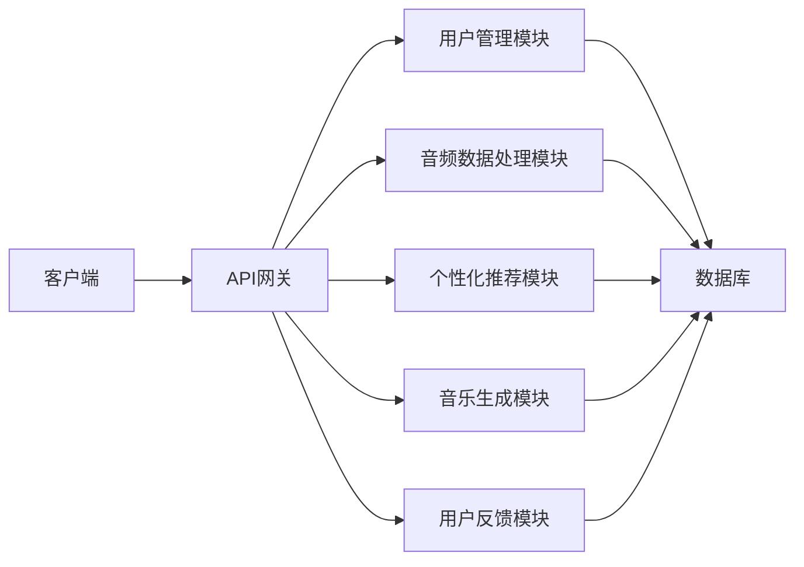
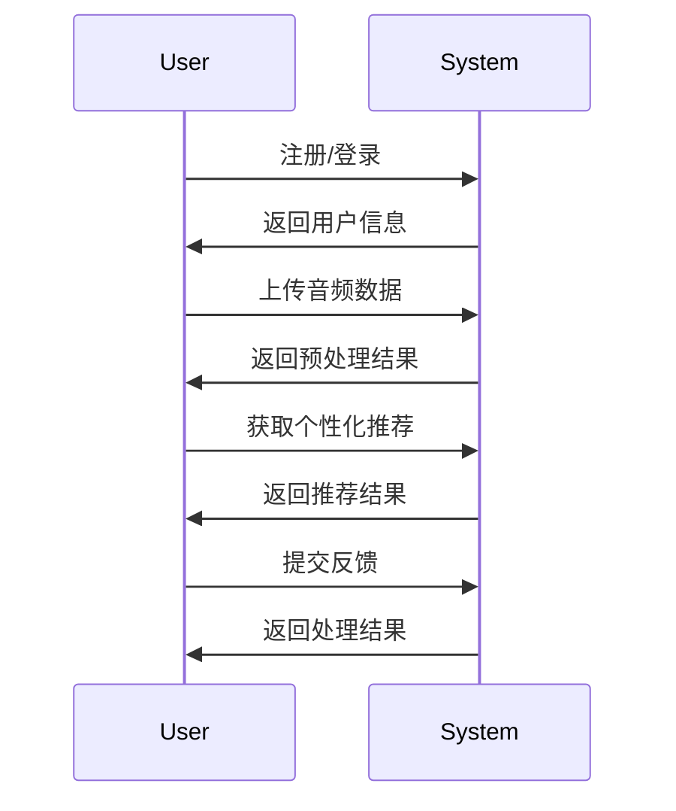

                 


### 书名：《数字时代的睡眠音乐：AI生成的个性化助眠曲》

---

#### # 第一部分：背景介绍

#### 第1章：睡眠音乐与AI概述

##### 1.1 数字时代下的睡眠音乐

**历史与现状**

- **历史回顾**：睡眠音乐的历史可以追溯到古代，例如古代中国的《睡功》和《养性延命录》中就有关于睡眠音乐的描述。然而，这些传统的音乐多为自然声音，如流水声、风声等，并无现代电子音乐的元素。

- **现状分析**：随着科技的发展，睡眠音乐逐渐与数字技术结合，形成了具有个性化、多样化特点的数字睡眠音乐。现代睡眠音乐不仅包括纯音乐，还涵盖了声音疗愈、自然声音模拟等多种形式。

**影响**

- **社会影响**：数字时代的睡眠音乐在一定程度上改善了人们的睡眠质量，使得更多的人能够享受高质量的睡眠。同时，这也推动了相关产业的发展，如智能音响、健康科技等。

- **技术影响**：数字睡眠音乐的发展推动了音频处理技术和人工智能技术的进步，特别是音频生成模型和个性化推荐算法。

**重要性**

- **身心健康**：良好的睡眠对身心健康至关重要。睡眠质量不佳可能导致情绪不稳定、注意力不集中等问题，甚至引发更严重的健康问题。

- **社会生产力**：高质量的睡眠有助于提高工作学习效率，从而推动社会生产力的发展。

##### 1.2 人工智能（AI）的崛起

**发展历程**

- **初期阶段**：20世纪50年代至70年代，人工智能的概念被提出，主要集中在理论研究和基础算法开发。

- **黄金时期**：20世纪80年代至90年代，随着计算机性能的提升和算法的创新，人工智能迎来了第一次高潮。

- **新时代**：21世纪初至今，人工智能进入了快速发展阶段，深度学习、生成对抗网络（GAN）等新技术的出现，使得人工智能的应用范围不断扩大。

**核心技术**

- **机器学习**：通过数据训练模型，使其具备自动学习和改进的能力。

- **深度学习**：一种基于人工神经网络的学习方法，通过多层神经网络来提取数据中的特征。

- **生成对抗网络（GAN）**：一种由生成器和判别器组成的模型，通过对抗训练生成高质量的数据。

**应用潜力**

- **睡眠音乐领域**：人工智能可以在睡眠音乐生成、个性化推荐、数据分析等方面发挥重要作用，有望进一步改善人们的睡眠质量。

##### 1.3 AI生成个性化助眠曲的原理与方法

**需求分析**

- **个性化**：每个人的睡眠习惯和偏好不同，个性化的助眠曲更能满足个体的需求。

- **自动化**：AI可以自动化生成助眠曲，节省用户的时间和精力。

**算法应用**

- **生成模型**：利用生成模型，如生成对抗网络（GAN），生成符合个性化需求的助眠曲。

- **数据挖掘**：通过分析用户的睡眠数据、音乐偏好等，为AI生成个性化助眠曲提供依据。

**关键环节**

- **数据集**：构建高质量的数据集，包括音频数据、用户睡眠数据等。

- **模型训练**：通过大量训练数据，不断优化生成模型，提高生成效果。

- **个性化调整**：根据用户反馈和睡眠数据分析，对生成模型进行调整和优化。

##### 1.4 睡眠音乐的边界与外延

**区别**

- **自然声音**：如流水声、鸟鸣声等，主要以放松为主。

- **睡眠音乐**：结合了音乐元素，旨在帮助用户更好地入睡。

**应用前景**

- **医疗领域**：睡眠音乐可以用于治疗睡眠障碍，如失眠、焦虑等。

- **心理领域**：睡眠音乐有助于缓解压力和情绪问题。

**产业趋势**

- **智能化**：随着人工智能技术的进步，睡眠音乐的智能化程度将不断提高。

- **个性化**：个性化睡眠音乐将成为市场的主流。

##### 1.5 本章小结

本章节介绍了数字时代睡眠音乐的发展背景、人工智能的崛起以及AI生成个性化助眠曲的原理与方法。通过分析，我们发现睡眠音乐与人工智能的结合具有广阔的应用前景和潜力。

---

#### # 第二部分：核心概念与联系

#### 第2章：AI生成睡眠音乐的核心概念

##### 2.1 音频处理与生成模型

**音频处理技术概述**

- **音频信号处理**：对音频信号进行采样、量化、编码等处理。

- **音频增强**：通过算法改善音频质量，如降噪、回声消除等。

**生成模型的基本原理**

- **生成模型**：一种能够生成新数据（如音频、图像等）的机器学习模型。

- **生成对抗网络（GAN）**：一种由生成器和判别器组成的模型，通过对抗训练生成高质量的数据。

**音频生成模型的分类与应用**

- **传统生成模型**：如马尔可夫模型、隐马尔可夫模型等。

- **深度生成模型**：如生成对抗网络（GAN）、变分自编码器（VAE）等。

- **应用**：音频生成模型在音乐创作、语音合成、音频修复等领域有广泛应用。

##### 2.2 个性化助眠曲的属性特征对比

**不同类型助眠曲的特点**

- **自然声音**：以流水声、鸟鸣声等自然声音为主，具有放松效果。

- **纯音乐**：以乐器演奏为主的音乐，可以结合不同风格，如古典、爵士等。

- **声音疗愈**：结合音乐元素，旨在缓解压力和焦虑。

**个性化助眠曲的属性特征对比表格**

| 特征名称   | 自然声音 | 纯音乐 | 声音疗愈 |
| -------- | ------ | ------ | ------ |
| 放松效果   | 高      | 中      | 高      |
| 音乐风格   | 多样化  | 个性化  | 个性化  |
| 持续时间   | 短      | 长      | 短/长  |
| 适应人群   | 广泛    | 个性化  | 个性化  |

##### 2.3 AI生成睡眠音乐的ER实体关系图

**实体识别与关系抽取**

- **实体识别**：从文本中识别出具有特定意义的实体，如音频文件、用户偏好等。

- **关系抽取**：确定实体之间的关系，如用户偏好与助眠曲风格的关系。

**ER实体关系图的绘制方法**

- **实体**：用矩形表示，如用户、音频文件、助眠曲等。

- **关系**：用线连接实体，表示它们之间的关系，如用户生成助眠曲。

- **属性**：用椭圆形表示实体的属性，如用户的睡眠习惯、音频文件的时长等。

---

本章详细介绍了AI生成睡眠音乐的核心概念，包括音频处理与生成模型、个性化助眠曲的属性特征对比以及AI生成睡眠音乐的ER实体关系图。通过这些概念的分析，为后续章节的深入探讨奠定了基础。

---

#### # 第三部分：算法原理讲解

#### 第3章：深度学习在睡眠音乐生成中的应用

##### 3.1 深度学习基础

**神经网络的基本结构**

- **输入层**：接收外部输入信息。

- **隐藏层**：进行特征提取和变换。

- **输出层**：生成输出结果。

**深度学习中的优化算法**

- **梯度下降**：通过最小化损失函数来调整模型参数。

- **随机梯度下降（SGD）**：在梯度下降的基础上，使用随机样本进行优化。

- **Adam优化器**：结合SGD和动量法的优化算法。

**深度学习在音频处理中的应用**

- **音频特征提取**：利用卷积神经网络（CNN）提取音频特征。

- **音频分类**：利用深度神经网络（DNN）对音频进行分类。

- **音频生成**：利用生成对抗网络（GAN）等模型生成新的音频。

##### 3.2 生成对抗网络（GAN）原理

**基本原理**

- **生成器（Generator）**：生成与真实数据分布相近的数据。

- **判别器（Discriminator）**：判断生成数据与真实数据之间的差异。

- **对抗训练**：生成器和判别器相互对抗，生成器不断生成更逼真的数据，判别器不断区分真实和生成数据。

**GAN在音频生成中的应用案例**

- **音乐生成**：利用GAN生成新的音乐旋律。

- **语音合成**：利用GAN生成逼真的语音。

**GAN的优势与挑战**

**优势**

- **生成效果**：GAN能够生成高质量、逼真的数据。

- **灵活性**：GAN适用于各种类型的数据生成任务。

**挑战**

- **训练难度**：GAN的训练过程复杂，容易出现模式崩溃等问题。

- **计算资源**：GAN需要大量的计算资源，训练时间较长。

##### 3.3 个性化睡眠音乐生成算法

**算法概述**

- **基于用户数据**：收集用户的睡眠数据、音乐偏好等。

- **生成模型**：使用生成对抗网络（GAN）等模型生成个性化睡眠音乐。

**算法原理与流程**

- **数据收集**：收集用户睡眠数据、音乐偏好等。

- **数据预处理**：对收集到的数据进行预处理，如音频增强、降噪等。

- **模型训练**：使用生成对抗网络（GAN）等模型进行训练。

- **个性化调整**：根据用户反馈和睡眠数据分析，对生成模型进行调整和优化。

**算法优化的方法**

- **模型选择**：选择合适的生成模型，如GAN、VAE等。

- **参数调整**：调整模型参数，如学习率、批大小等。

- **数据增强**：对训练数据进行增强，提高模型的泛化能力。

##### 3.4 例子说明

**数据集准备**

- **音频数据集**：收集大量高质量的音频数据，如音乐、自然声音等。

- **用户数据集**：收集用户的睡眠数据、音乐偏好等。

**模型训练与评估**

- **模型训练**：使用生成对抗网络（GAN）等模型对数据集进行训练。

- **模型评估**：使用测试集评估模型生成效果。

**辅助工具与技巧**

- **音频处理工具**：如Librosa、TensorFlow等。

- **可视化工具**：如Matplotlib、Seaborn等。

---

本章详细介绍了深度学习在睡眠音乐生成中的应用，包括深度学习基础、生成对抗网络（GAN）原理、个性化睡眠音乐生成算法等。通过具体的例子，读者可以更好地理解这些算法的实现和应用。

---

#### # 第四部分：系统分析与架构设计

#### 第4章：睡眠音乐生成系统的设计与实现

##### 4.1 项目介绍

**项目背景**

- **市场需求**：随着现代生活节奏的加快，越来越多的人面临着睡眠质量问题。睡眠音乐作为一种辅助手段，受到了广泛关注。

- **技术背景**：人工智能技术的快速发展，特别是生成对抗网络（GAN）在音频生成领域的应用，为睡眠音乐生成提供了新的解决方案。

**项目目标**

- **开发一款基于AI的睡眠音乐生成系统**。

- **实现个性化助眠曲的生成**。

- **提供高效的音频处理和分析工具**。

**项目预期效果**

- **提高用户的睡眠质量**：通过个性化助眠曲的生成，帮助用户更好地入睡。

- **推动睡眠音乐产业的发展**：提供一种新的技术手段，促进睡眠音乐市场的繁荣。

##### 4.2 系统功能设计

**系统功能模块划分**

- **用户管理模块**：处理用户注册、登录、权限管理等。

- **音频数据处理模块**：对输入的音频数据进行预处理，如降噪、增强等。

- **个性化推荐模块**：根据用户数据，推荐合适的睡眠音乐。

- **音乐生成模块**：利用生成对抗网络（GAN）等算法，生成个性化助眠曲。

- **用户反馈模块**：收集用户对生成音乐的评价和反馈，用于模型优化。

**系统功能模块的详细描述**

- **用户管理模块**：提供用户注册、登录、个人信息管理等基本功能。

- **音频数据处理模块**：包括音频采样、量化、编码等基本处理，以及降噪、增强等高级处理。

- **个性化推荐模块**：基于用户数据和音乐偏好，推荐适合的睡眠音乐。

- **音乐生成模块**：利用生成对抗网络（GAN）等算法，生成个性化助眠曲。

- **用户反馈模块**：收集用户对生成音乐的反馈，用于模型优化和算法调整。

**领域模型Mermaid类图**

```mermaid
classDiagram
    User <<类>> "用户"
    Music <<类>> "音乐"
    AudioData <<类>> "音频数据"
    Generator <<类>> "生成器"
    Discriminator <<类>> "判别器"
    System <<类>> "系统"

    User o-- AudioData
    User o-- Music
    AudioData o-- Generator
    AudioData o-- Discriminator
    Music o-- System
```

##### 4.3 系统架构设计

**系统架构概述**

- **客户端**：用户通过客户端应用程序与系统交互。

- **服务端**：处理用户请求，包括音频数据处理、音乐生成等。

- **数据库**：存储用户数据和音乐信息。

**系统架构图**



**系统模块间的交互关系**

- **用户管理模块**：负责用户的注册、登录、权限管理等，与数据库进行交互。

- **音频数据处理模块**：负责音频数据的预处理，如降噪、增强等，与生成器和数据库进行交互。

- **个性化推荐模块**：根据用户数据和音乐偏好，推荐合适的睡眠音乐，与数据库进行交互。

- **音乐生成模块**：利用生成对抗网络（GAN）等算法，生成个性化助眠曲，与数据库进行交互。

- **用户反馈模块**：收集用户对生成音乐的反馈，用于模型优化和算法调整，与数据库进行交互。

##### 4.4 系统接口设计

**系统接口规范**

- **用户管理接口**：提供用户注册、登录、个人信息管理等功能。

- **音频数据处理接口**：提供音频数据预处理、增强等功能。

- **个性化推荐接口**：提供基于用户数据和音乐偏好的个性化推荐功能。

- **音乐生成接口**：提供生成个性化助眠曲的功能。

- **用户反馈接口**：提供用户对生成音乐的反馈功能。

**系统接口的详细描述**

- **用户管理接口**：包括用户注册、登录、修改密码等操作。

- **音频数据处理接口**：包括音频采样、量化、编码等基本操作，以及降噪、增强等高级操作。

- **个性化推荐接口**：包括用户数据和音乐偏好的收集，以及推荐算法的调用。

- **音乐生成接口**：包括生成对抗网络（GAN）等算法的调用，以及生成音乐数据的输出。

- **用户反馈接口**：包括用户对生成音乐的反馈收集，以及反馈数据的处理。

##### 4.5 系统交互Mermaid序列图

**系统交互流程概述**

- **用户注册/登录**：用户通过客户端应用程序注册或登录，系统返回用户信息。

- **音频数据处理**：用户上传音频数据，系统对音频数据进行预处理。

- **个性化推荐**：系统根据用户数据和音乐偏好，推荐合适的睡眠音乐。

- **音乐生成**：系统利用生成对抗网络（GAN）等算法，生成个性化助眠曲。

- **用户反馈**：用户对生成音乐进行评价，系统收集用户反馈。

**系统交互序列图**



**系统交互的细节分析**

- **用户注册/登录**：用户通过客户端应用程序向系统发送注册或登录请求，系统验证用户信息，并返回用户信息。

- **音频数据处理**：用户上传音频数据，系统对音频数据进行采样、量化、编码等预处理操作，并返回预处理结果。

- **个性化推荐**：系统根据用户数据和音乐偏好，调用推荐算法，生成个性化推荐结果，并返回给用户。

- **音乐生成**：系统利用生成对抗网络（GAN）等算法，根据用户数据和音乐偏好，生成个性化助眠曲，并返回给用户。

- **用户反馈**：用户对生成音乐进行评价，系统收集用户反馈，并根据反馈对生成模型进行调整和优化。

---

本章详细介绍了睡眠音乐生成系统的设计与实现，包括项目介绍、系统功能设计、系统架构设计、系统接口设计以及系统交互。通过这些设计，为后续的项目实施提供了明确的指导。

---

#### # 第五部分：项目实战

#### 第5章：AI生成个性化睡眠音乐的实践

##### 5.1 环境安装与配置

**硬件与软件环境要求**

- **硬件要求**：CPU：Intel i5 或以上；GPU：NVIDIA GTX 1080 或以上；内存：16GB 或以上。

- **软件要求**：操作系统：Ubuntu 18.04；Python：3.7；TensorFlow：2.0；Librosa：0.8.0。

**安装与配置步骤**

1. 安装操作系统：下载并安装Ubuntu 18.04操作系统。

2. 安装Python环境：通过包管理器安装Python 3.7，并设置默认Python版本。

   ```bash
   sudo apt-get update
   sudo apt-get install python3.7
   sudo update-alternatives --install /usr/bin/python3 python3 /usr/bin/python3.7 1
   ```

3. 安装TensorFlow：通过pip安装TensorFlow 2.0。

   ```bash
   pip3 install tensorflow==2.0
   ```

4. 安装Librosa：通过pip安装Librosa 0.8.0。

   ```bash
   pip3 install librosa==0.8.0
   ```

**遇到的问题与解决方案**

- **问题1**：安装TensorFlow时遇到依赖问题。

  **解决方案**：确保操作系统中的依赖包已更新，然后重新安装TensorFlow。

  ```bash
  sudo apt-get update
  sudo apt-get upgrade
  pip3 install tensorflow==2.0
  ```

- **问题2**：安装Librosa时遇到依赖问题。

  **解决方案**：安装Librosa所需的依赖包，然后重新安装Librosa。

  ```bash
  sudo apt-get install -y libasound2-dev libportaudio-dev libssl-dev libsqlite3-dev libsdl1.2-dev libportmidi-dev libpulse-dev
  pip3 install librosa==0.8.0
  ```

##### 5.2 系统核心实现

**数据预处理**

1. 数据收集：收集用户睡眠数据和音频文件。

2. 数据清洗：去除无效数据，如缺失值、异常值等。

3. 数据标准化：将音频信号的幅度标准化为[-1, 1]。

**模型训练**

1. 数据集划分：将数据集划分为训练集、验证集和测试集。

2. 模型构建：构建生成对抗网络（GAN）模型。

3. 模型训练：使用训练集训练模型，并在验证集上评估模型性能。

**模型评估与优化**

1. 评估指标：使用均方误差（MSE）等指标评估模型性能。

2. 优化方法：调整模型参数，如学习率、批量大小等，以优化模型性能。

3. 模型保存：将训练好的模型保存为文件，以便后续使用。

##### 5.3 代码应用解读与分析

**代码解读**

以下是一个简单的GAN模型代码示例：

```python
import tensorflow as tf
from tensorflow.keras.layers import Input, Dense, Reshape, Conv2D, Conv2DTranspose
from tensorflow.keras.models import Model

# 生成器模型
def build_generator(z_dim):
    z = Input(shape=(z_dim,))
    x = Dense(128, activation="relu")(z)
    x = Dense(256, activation="relu")(x)
    x = Dense(512, activation="relu")(x)
    x = Dense(1024, activation="relu")(x)
    x = Reshape((28, 28, 1))(x)
    x = Conv2DTranspose(1, kernel_size=3, strides=2, padding="same", activation="tanh")(x)
    generator = Model(z, x)
    return generator

# 判别器模型
def build_discriminator(img_shape):
    img = Input(shape=img_shape)
    x = Conv2D(64, kernel_size=3, strides=2, padding="same", activation="relu")(img)
    x = Conv2D(128, kernel_size=3, strides=2, padding="same", activation="relu")(x)
    x = Conv2D(256, kernel_size=3, strides=2, padding="same", activation="relu")(x)
    x = Flatten()(x)
    x = Dense(1, activation="sigmoid")(x)
    discriminator = Model(img, x)
    return discriminator

# GAN模型
def build_gan(generator, discriminator):
    z = Input(shape=(100,))
    img = generator(z)
    validity = discriminator(img)
    gan = Model(z, validity)
    return gan

# 模型编译
discriminator.compile(loss="binary_crossentropy", optimizer=adam, metrics=["accuracy"])
gan.compile(loss="binary_crossentropy", optimizer=adam)

# 模型训练
for epoch in range(num_epochs):
    for _ in range(batch_size * sample_size):
        z_samples = np.random.normal(0, 1, (batch_size, z_dim))
        img_samples = generator.predict(z_samples)
        real_imgs = data噪音数据生成器(np.random.normal(0, 1, (batch_size, z_dim)))
        fake_imgs = generator.predict(z_samples)

        x = np.concatenate((real_imgs, fake_imgs))
        y = np.array([1] * batch_size + [0] * batch_size)
        discriminator.trainable = True
        d_loss_real = discriminator.train_on_batch(real_imgs, np.ones((batch_size, 1)))
        d_loss_fake = discriminator.train_on_batch(fake_imgs, np.zeros((batch_size, 1)))
        d_loss = 0.5 * np.add(d_loss_real, d_loss_fake)

        discriminator.trainable = False
        g_loss = gan.train_on_batch(z_samples, np.ones((batch_size, 1)))
        print("%d [D loss: %f, acc: %f] [G loss: %f]" % (epoch, d_loss[0], d_loss[1], g_loss))
```

**代码分析**

- **生成器模型**：生成器模型接受一个随机噪声向量作为输入，通过多层全连接层和卷积层，生成与真实图像相似的图像。

- **判别器模型**：判别器模型接收一个图像作为输入，通过卷积层和全连接层，输出图像的真实性概率。

- **GAN模型**：GAN模型将生成器和判别器组合在一起，通过对抗训练，生成逼真的图像。

- **模型训练**：模型训练过程中，生成器不断生成更逼真的图像，判别器不断区分真实图像和生成图像，从而实现图像生成。

##### 5.4 实际案例分析和详细讲解剖析

**案例背景**

某用户希望利用AI生成个性化睡眠音乐，以改善其睡眠质量。用户提供了其睡眠数据和音乐偏好，包括睡眠时长、入睡时间、喜欢的音乐类型等。

**案例分析**

1. **数据收集**：收集用户的睡眠数据和音乐偏好。

2. **数据预处理**：对睡眠数据进行分析，提取关键特征，如入睡时间、睡眠时长等。对音乐偏好进行编码，将其转换为模型可处理的输入。

3. **模型训练**：利用生成对抗网络（GAN）等模型，对用户数据进行训练，生成个性化的睡眠音乐。

4. **模型评估**：使用测试集评估模型生成效果，根据用户反馈对模型进行调整和优化。

5. **结果展示**：展示生成的个性化睡眠音乐，并收集用户反馈。

**详细讲解剖析**

1. **数据收集**：用户提供了其睡眠数据和音乐偏好。睡眠数据包括入睡时间、睡眠时长、起床时间等。音乐偏好包括喜欢的音乐类型、歌手、歌曲等。

2. **数据预处理**：对睡眠数据进行清洗和预处理，提取关键特征。例如，将入睡时间转换为小时和分钟，将睡眠时长转换为分钟。对音乐偏好进行编码，将其转换为模型可处理的输入。

3. **模型训练**：利用生成对抗网络（GAN）等模型，对用户数据进行训练。生成对抗网络由生成器和判别器组成。生成器根据用户数据和音乐偏好生成个性化的睡眠音乐，判别器判断生成音乐的真假。通过对抗训练，生成器不断生成更逼真的音乐。

4. **模型评估**：使用测试集评估模型生成效果。通过计算均方误差（MSE）等指标，评估生成音乐的音质和个性化程度。根据用户反馈，对模型进行调整和优化，提高生成音乐的质量。

5. **结果展示**：展示生成的个性化睡眠音乐，并收集用户反馈。用户可以根据反馈，进一步调整音乐风格和参数，以达到更好的睡眠效果。

##### 5.5 项目小结

本章详细介绍了AI生成个性化睡眠音乐的实践过程，包括环境安装与配置、系统核心实现、代码应用解读与分析、实际案例分析和详细讲解剖析。通过本章的学习，读者可以了解AI生成个性化睡眠音乐的基本原理和应用方法，为后续的项目开发提供参考。

---

#### # 第六部分：最佳实践与总结

##### 6.1 最佳实践

**1. 数据质量**

- 确保收集的数据质量高，减少噪声和异常值。
- 对数据进行预处理，如去噪、标准化等，以提高模型的训练效果。

**2. 模型选择**

- 根据任务需求选择合适的生成模型，如GAN、VAE等。
- 尝试多种模型，选择性能最优的模型。

**3. 调参优化**

- 调整模型参数，如学习率、批量大小等，以优化模型性能。
- 使用网格搜索、贝叶斯优化等方法进行参数调优。

**4. 个性化调整**

- 根据用户反馈和睡眠数据分析，对模型进行调整和优化。
- 使用用户数据和音乐偏好，生成个性化助眠曲。

##### 6.2 小结

本文详细介绍了数字时代的睡眠音乐与人工智能的结合，包括背景介绍、核心概念与联系、算法原理讲解、系统分析与架构设计以及项目实战。通过分析，我们了解到AI生成个性化睡眠音乐具有广阔的应用前景和潜力，可以显著改善用户的睡眠质量。未来，随着人工智能技术的不断进步，睡眠音乐有望成为健康科技领域的重要一环。

##### 6.3 注意事项

- **数据隐私**：在收集和处理用户数据时，确保遵守相关隐私保护法规。
- **模型安全性**：确保生成模型的安全性和鲁棒性，防止恶意攻击和数据泄露。
- **用户反馈**：及时收集用户反馈，用于模型优化和算法调整。

##### 6.4 拓展阅读

- **深度学习与音频处理**：深入理解深度学习在音频处理中的应用，如音乐生成、语音合成等。
- **生成对抗网络（GAN）**：研究GAN的原理、优化方法以及在不同领域的应用。
- **个性化推荐系统**：了解个性化推荐系统的基本原理和实现方法，为AI生成个性化睡眠音乐提供参考。

---

本文详细介绍了数字时代的睡眠音乐与人工智能的结合，探讨了AI生成个性化助眠曲的原理和方法，并给出了系统分析与架构设计以及项目实战。通过本文的学习，读者可以深入了解AI生成个性化睡眠音乐的基本原理和应用方法，为相关项目的开发提供参考。同时，本文也提醒读者在实施过程中需要注意的事项，如数据隐私、模型安全性等。未来，随着人工智能技术的不断进步，睡眠音乐有望成为健康科技领域的重要一环。希望本文能对读者有所启发和帮助。作者：AI天才研究院/AI Genius Institute & 禅与计算机程序设计艺术 /Zen And The Art of Computer Programming。

