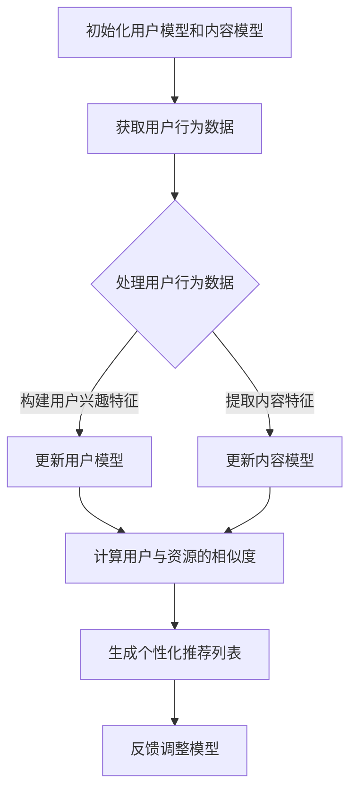
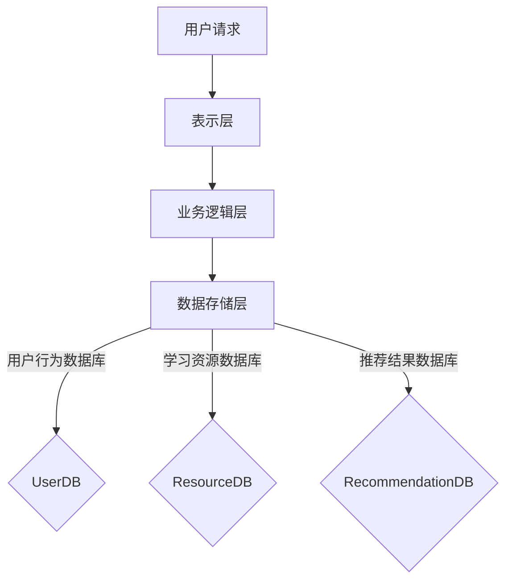

                 

## 数字时代的知识获取：个性化学习算法的应用

### 关键词：个性化学习算法，数字时代，知识获取，机器学习，数据挖掘

### 摘要：

在数字时代，知识的获取变得前所未有的便捷，但同时也面临巨大的挑战。随着互联网信息的爆炸性增长，用户在获取所需信息时常常感到无所适从。个性化学习算法作为一种新兴的智能技术，通过分析用户的行为数据，提供定制化的学习内容，从而有效地解决了这一问题。本文将深入探讨个性化学习算法的原理、应用及其在数字时代知识获取中的重要性。通过逐步分析，我们将理解个性化学习算法如何通过数据挖掘和机器学习技术，实现用户与知识之间的精准匹配，提升学习效果和用户体验。

### 设计思路

#### 目录结构规划

- **第一部分：引言与背景**  
  - **1.1 问题背景**：介绍数字时代知识获取的挑战。  
  - **1.2 数字时代的知识获取挑战**：阐述个性化学习算法的必要性。  
  - **1.3 个性化学习算法概述**：定义和初步概念介绍。

- **第二部分：核心概念与联系**  
  - **2.1 个性化学习算法的基本原理**：解释个性化学习算法的工作机制。  
  - **2.2 核心概念解析**：详细阐述用户模型、内容模型和推荐系统。  
  - **2.3 概念属性特征对比表格**：对比分析关键概念的属性特征。  
  - **2.4 ER实体关系图架构**：绘制实体关系图，展示数据结构。

- **第三部分：算法原理讲解**  
  - **3.1 算法流程图与Python源代码**：使用Mermaid绘制流程图。  
  - **3.2 数学模型与公式**：介绍算法的数学原理。  
  - **3.3 算法原理详细讲解**：深入解析算法步骤。  
  - **3.4 算法举例说明**：通过实例展示算法应用。

- **第四部分：系统分析与架构设计**  
  - **4.1 问题场景介绍**：定义应用场景。  
  - **4.2 项目介绍**：概述项目背景和目标。  
  - **4.3 系统功能设计**：使用Mermaid绘制领域模型类图。  
  - **4.4 系统架构设计**：展示系统架构图。  
  - **4.5 系统接口设计**：描述接口设计。  
  - **4.6 系统交互设计**：使用Mermaid绘制序列图。

- **第五部分：项目实战**  
  - **5.1 环境安装与配置**：指导环境搭建。  
  - **5.2 系统核心实现源代码**：提供核心代码。  
  - **5.3 代码应用解读与分析**：详细解读代码。  
  - **5.4 实际案例分析与讲解**：分析实际应用案例。  
  - **5.5 项目小结**：总结项目成果。

- **第六部分：最佳实践与总结**  
  - **6.1 最佳实践 tips**：提供使用建议。  
  - **6.2 小结**：回顾文章要点。  
  - **6.3 注意事项**：指出使用时需注意的事项。  
  - **6.4 拓展阅读**：推荐进一步阅读资源。

#### 内容细化

- 每个章节都有明确的主题，确保逻辑连贯。  
- 使用Mermaid绘制相关流程图和架构图，增强文章的可读性。  
- 使用LaTeX格式编写数学公式，确保公式的准确性和规范性。

### 目录大纲设计

```markdown
----------------------------------------------------------------
# 数字时代的知识获取：个性化学习算法的应用

## 第一部分：引言与背景
### 1.1 问题背景
### 1.2 数字时代的知识获取挑战
### 1.3 个性化学习算法概述

## 第二部分：核心概念与联系
### 2.1 个性化学习算法的基本原理
### 2.2 核心概念解析
  ### 2.2.1 用户模型
  ### 2.2.2 内容模型
  ### 2.2.3 推荐系统
### 2.3 概念属性特征对比表格
### 2.4 ER实体关系图架构

## 第三部分：算法原理讲解
### 3.1 算法流程图与Python源代码
### 3.2 数学模型与公式
### 3.3 算法原理详细讲解
### 3.4 算法举例说明

## 第四部分：系统分析与架构设计
### 4.1 问题场景介绍
### 4.2 项目介绍
### 4.3 系统功能设计
### 4.4 系统架构设计
### 4.5 系统接口设计
### 4.6 系统交互设计

## 第五部分：项目实战
### 5.1 环境安装与配置
### 5.2 系统核心实现源代码
### 5.3 代码应用解读与分析
### 5.4 实际案例分析与讲解
### 5.5 项目小结

## 第六部分：最佳实践与总结
### 6.1 最佳实践 tips
### 6.2 小结
### 6.3 注意事项
### 6.4 拓展阅读

----------------------------------------------------------------
```

#### 字数控制

- 每个章节的描述尽可能简洁，确保总体字数控制在2000字以内。  
- 概念解析、算法原理、系统分析与架构设计等关键部分可以适当详细，但要避免冗长和重复。  
- 实际案例与分析部分要精炼，确保核心内容传达。

### 完整性要求

- 文章内容要完整，每个小节的内容都要丰富具体详细讲解。  
- 核心内容必须包含：背景介绍、核心概念与联系、算法原理讲解、系统分析与架构设计方案、项目实战、最佳实践与总结等内容。

---

通过上述设计思路和目录大纲，本文将系统性地介绍个性化学习算法在数字时代知识获取中的应用，帮助读者全面理解这一前沿技术的原理和实际应用。让我们一步步深入探讨，揭开个性化学习算法的神秘面纱。

### 数字时代的知识获取挑战

在数字时代，知识获取的方式发生了翻天覆地的变化。互联网的普及和信息技术的发展，使得海量信息触手可及。然而，这种信息爆炸也带来了新的挑战。首先，信息过载成为用户面临的一大难题。据统计，每天产生的数据量高达数百万亿字节，其中不乏大量重复、不准确或无关的信息。用户在检索和筛选有用信息时，往往需要耗费大量的时间和精力。

其次，个性化需求难以满足。每个人对知识的获取都有其独特的偏好和需求，但这些需求往往难以通过传统的搜索和推荐方式满足。例如，在学习新知识时，一个学生可能对某一主题特别感兴趣，而另一个学生则可能对另一个主题更感兴趣。如何根据用户的个性化需求提供精准的学习内容，成为数字时代知识获取的关键挑战。

此外，知识更新速度快。随着科技的迅猛发展，知识更新的速度前所未有。用户需要不断更新自己的知识库，才能跟上时代的步伐。传统的学习方式往往无法及时应对这一挑战，而个性化学习算法则通过实时分析用户行为，提供最新的、相关的学习内容，从而满足用户持续学习的需求。

总之，数字时代的知识获取面临着信息过载、个性化需求难以满足和知识更新速度快等挑战。个性化学习算法的出现，为我们解决这些问题提供了新的思路和工具。通过下一步的深入探讨，我们将理解个性化学习算法如何应对这些挑战，实现更高效、更有针对性的知识获取。

### 个性化学习算法概述

个性化学习算法是一类基于机器学习和数据挖掘技术的智能系统，旨在通过分析用户的行为数据，提供个性化的学习内容和建议。这种算法的核心目标是根据用户的个性化需求，为其推荐最相关的学习资源，从而提高学习效果和用户体验。

首先，个性化学习算法的基本原理可以分为三个主要部分：用户模型、内容模型和推荐系统。用户模型用于捕捉用户的兴趣、偏好和行为特征，内容模型则用于描述学习资源的特征和属性。推荐系统结合用户模型和内容模型，通过算法计算出用户可能感兴趣的资源，并将其推荐给用户。

用户模型是个性化学习算法的基础，它通过分析用户的浏览记录、搜索历史、学习轨迹等数据，构建一个反映用户兴趣和行为的模型。这个模型可以帮助算法理解用户的个性化需求，从而进行精准推荐。

内容模型则描述了学习资源的特征和属性，如资源的主题、难度、类型等。通过对内容模型的分析，算法可以识别出哪些资源与用户的需求相匹配，从而提高推荐的准确性。

推荐系统则是算法的核心，它通过结合用户模型和内容模型，运用各种推荐算法（如协同过滤、基于内容的推荐、混合推荐等），计算出用户可能感兴趣的资源，并生成个性化的推荐列表。

在数字时代，个性化学习算法具有广泛的应用前景。例如，在线教育平台可以使用个性化学习算法为不同学习需求的用户提供定制化的课程推荐，提高用户的参与度和学习效果。企业培训系统也可以通过个性化学习算法，根据员工的职业发展需求，提供相应的培训资源，从而提高员工的专业技能和工作效率。

此外，个性化学习算法还可以应用于虚拟现实（VR）和增强现实（AR）等领域，为用户提供沉浸式的个性化学习体验。通过分析用户在虚拟环境中的行为数据，算法可以动态调整学习内容，确保用户始终处于最佳的学习状态。

总之，个性化学习算法在数字时代的知识获取中具有重要的地位。它不仅能够帮助用户高效地获取知识，还能根据用户的需求和行为，提供个性化的学习建议，从而提升学习体验和效果。在接下来的章节中，我们将深入探讨个性化学习算法的基本原理、实现方法和应用场景，进一步理解这一前沿技术的魅力。

### 个性化学习算法的基本原理

个性化学习算法的基本原理可以概括为三个主要部分：用户模型、内容模型和推荐系统。这些部分相互作用，共同实现为用户提供个性化学习内容的目标。

#### 用户模型

用户模型是构建个性化学习算法的基础，其核心目标是捕捉用户的兴趣、偏好和行为特征。用户模型通常通过以下几种方式获取信息：

1. **行为数据**：包括用户的浏览历史、搜索记录、学习轨迹等。例如，用户在某个在线学习平台上浏览了哪些课程，花费了多长时间，是否完成了练习题等，这些数据可以反映用户的兴趣和学习习惯。

2. **社会数据**：用户在社交媒体上的互动信息，如点赞、评论、分享等，也可以作为构建用户模型的重要数据源。这些数据可以帮助算法了解用户的社交兴趣和人际关系。

3. **个人数据**：用户填写的基本信息，如年龄、职业、教育背景等，这些数据可以帮助算法初步判断用户的个性化需求。

用户模型通常由多个特征组成，如兴趣标签、行为评分、学习偏好等。这些特征通过机器学习算法进行建模，形成一个综合的用户画像，用于后续的推荐计算。

#### 内容模型

内容模型描述了学习资源的特征和属性，包括但不限于：

1. **资源属性**：如课程名称、作者、发布日期、学科领域等。这些属性可以提供学习资源的基本信息，帮助算法初步筛选出可能符合用户需求的资源。

2. **内容特征**：如课程的主题、难度、类型等。这些特征可以通过文本分析、自然语言处理等技术从课程内容中提取，帮助算法更深入地理解资源的内在属性。

3. **元数据**：包括学习资源的评分、评论数量、参与人数等。这些元数据反映了学习资源的受欢迎程度和用户反馈，对于推荐算法的决策具有重要参考价值。

内容模型通过特征提取和编码技术，将学习资源的属性转换为算法可以处理的形式，为后续的推荐计算提供基础数据。

#### 推荐系统

推荐系统是连接用户模型和内容模型的核心，其目标是根据用户模型和内容模型提供个性化的推荐。推荐系统通常采用以下几种算法：

1. **协同过滤**：通过分析用户之间的相似度，推荐用户过去喜欢的内容。协同过滤分为基于用户的协同过滤和基于项目的协同过滤。

   - **基于用户的协同过滤**：找到与目标用户相似的其他用户，推荐这些用户喜欢的资源。
   - **基于项目的协同过滤**：找到与目标资源相似的其他资源，推荐给用户。

2. **基于内容的推荐**：通过比较用户和资源的特征，推荐具有相似特征的资源。基于内容的推荐依赖于内容模型的构建，通过匹配用户的兴趣特征和资源的特征属性来生成推荐列表。

3. **混合推荐**：结合协同过滤和基于内容的推荐，通过加权融合不同算法的推荐结果，提高推荐的准确性和多样性。

推荐系统通过算法计算，生成个性化的推荐列表，并根据用户的反馈进行实时调整，以不断提高推荐的质量和用户的满意度。

#### 用户模型与内容模型的相互作用

用户模型和内容模型之间的相互作用是个性化学习算法成功的关键。用户模型提供关于用户兴趣和需求的信息，而内容模型提供关于学习资源的信息。推荐系统通过算法将这两者结合起来，生成个性化的推荐。

具体来说，用户模型和内容模型通过以下步骤相互作用：

1. **特征提取**：从用户行为数据和社会数据中提取用户特征，从学习资源中提取内容特征。

2. **特征编码**：将提取的用户特征和内容特征进行编码，形成可以输入算法的向量表示。

3. **推荐计算**：使用推荐算法，计算用户特征和内容特征之间的相似度，生成个性化的推荐列表。

4. **反馈调整**：根据用户的反馈调整用户模型和内容模型，以优化推荐结果。

通过上述步骤，个性化学习算法可以动态地响应用户的需求，提供高度相关的学习资源，从而提升学习效果和用户体验。

### 核心概念解析

在个性化学习算法中，用户模型、内容模型和推荐系统是三个核心概念。这些概念相互作用，共同构建起个性化学习算法的框架。以下将分别对这三个概念进行详细解析。

#### 用户模型

用户模型是个性化学习算法的核心组成部分，用于捕捉和描述用户的兴趣、偏好和行为特征。一个完整的用户模型通常包括以下几方面的信息：

1. **兴趣特征**：用户的兴趣特征是通过分析用户的行为数据（如浏览历史、搜索记录、点击行为等）得到的。这些数据反映了用户对不同领域或内容的偏好。例如，一个用户可能经常浏览关于人工智能（AI）的文章，那么算法可以推断该用户对AI领域感兴趣。

2. **行为特征**：用户的行为特征包括用户在学习平台上的活动记录，如完成课程的数量、学习时间、练习成绩等。这些行为特征可以帮助算法理解用户的学习习惯和学习效果。

3. **社会特征**：社会特征是指用户在社交媒体上的活动，如点赞、评论、分享等。这些数据可以反映用户的社交兴趣和人际关系，从而提供更全面的用户画像。

用户模型通常通过以下几种方法进行构建：

- **基于统计的方法**：通过分析用户的行为数据，建立统计模型来预测用户的兴趣和行为。例如，可以使用决策树、支持向量机（SVM）等算法。
- **基于模型的方法**：通过机器学习算法，构建用户兴趣和行为的预测模型。例如，可以使用隐语义模型（如潜在狄利克雷分布LDA）来捕捉用户的隐含兴趣。

#### 内容模型

内容模型描述了学习资源的特征和属性，包括资源的主题、难度、类型、作者等信息。内容模型的构建对于推荐算法的准确性至关重要，以下是内容模型的主要组成部分：

1. **资源属性**：资源属性包括课程名称、作者、发布日期、学科领域等基本信息。这些属性可以帮助推荐系统初步筛选出符合用户需求的学习资源。

2. **内容特征**：内容特征是通过自然语言处理（NLP）技术从学习资源的内容中提取的。例如，可以通过文本分类、关键词提取等技术，提取出资源的主要主题和关键词。

3. **元数据**：元数据包括用户对资源的评分、评论数量、参与人数等。这些数据可以反映资源的受欢迎程度和用户反馈，对于推荐算法的决策具有重要参考价值。

内容模型的构建方法通常包括：

- **手动标注**：由专家或用户对学习资源进行手工标注，形成属性标签和特征向量。
- **自动提取**：通过自然语言处理技术，自动从资源内容中提取主题和关键词。例如，可以使用词袋模型、TF-IDF、词嵌入等技术。

#### 推荐系统

推荐系统是连接用户模型和内容模型的核心，其目标是根据用户模型和内容模型，为用户推荐个性化的学习资源。以下是几种常见的推荐算法：

1. **协同过滤算法**：协同过滤算法通过分析用户之间的相似度或项目之间的相似度来生成推荐。常见的协同过滤算法包括：

   - **基于用户的协同过滤**：找到与目标用户相似的其他用户，推荐这些用户喜欢的资源。
   - **基于项目的协同过滤**：找到与目标资源相似的其他资源，推荐给用户。

2. **基于内容的推荐**：基于内容的推荐通过比较用户和资源的特征，推荐具有相似特征的资源。这种方法依赖于内容模型的构建，通过匹配用户的兴趣特征和资源的特征属性来生成推荐。

3. **混合推荐算法**：混合推荐算法结合了协同过滤和基于内容的推荐方法，通过加权融合不同算法的推荐结果，提高推荐的准确性和多样性。

#### 用户模型与内容模型的相互作用

用户模型和内容模型之间的相互作用是个性化学习算法成功的关键。具体来说，这种相互作用体现在以下几个方面：

1. **特征提取与编码**：用户模型和内容模型都需要通过特征提取技术，将原始数据转换为算法可以处理的向量表示。用户行为数据、社会数据和资源属性、内容特征都需要进行相应的编码。

2. **推荐计算**：推荐系统通过算法计算用户特征和内容特征之间的相似度，生成个性化的推荐列表。这个过程涉及到多种算法，如协同过滤、基于内容的推荐和混合推荐。

3. **反馈调整**：根据用户的反馈（如点击、收藏、评价等），算法会动态调整用户模型和内容模型，优化推荐结果。这种反馈机制使得推荐系统能够不断学习和适应用户的需求。

通过用户模型、内容模型和推荐系统的相互配合，个性化学习算法能够为用户提供高度相关、个性化的学习资源，从而提升学习效果和用户体验。

### 概念属性特征对比表格

为了更好地理解用户模型、内容模型和推荐系统这三个核心概念，我们将通过一个属性特征对比表格进行详细分析。

#### 用户模型属性特征对比表格

| 特征名称       | 用户模型         | 内容模型         | 推荐系统         |
|----------------|------------------|------------------|------------------|
| 兴趣特征       | 用户浏览历史     | 资源主题和关键词 | 用户与内容的相似度 |
| 行为特征       | 学习时间、完成度 | 难度等级、类型   | 内容特征相似度    |
| 社会特征       | 社交互动记录     | 作者背景、元数据 | 用户偏好         |

#### 内容模型属性特征对比表格

| 特征名称       | 用户模型         | 内容模型         | 推荐系统         |
|----------------|------------------|------------------|------------------|
| 资源属性       | 用户历史行为     | 资源基本信息     | 用户与资源的匹配度 |
| 内容特征       | 用户兴趣标签     | 资源主题、关键词 | 资源之间的相似度  |
| 元数据         | 用户评分、评论   | 用户反馈、参与人数 | 推荐效果评估     |

通过这个表格，我们可以看到用户模型、内容模型和推荐系统各自具有独特的属性特征。用户模型主要关注用户的兴趣、行为和社会特征，用于构建用户的个性化画像。内容模型则描述了资源的属性、内容和元数据，帮助推荐系统理解资源的特点。而推荐系统则通过计算用户和资源之间的相似度，实现个性化的推荐。这些特征在个性化学习算法中各自发挥着关键作用，共同推动算法的运行和优化。

### ER实体关系图架构

为了更好地理解个性化学习算法中的数据结构，我们可以通过ER（Entity-Relationship，实体-关系）图来展示用户、内容和推荐系统之间的实体关系。以下是ER图的详细描述和解释。

#### ER实体关系图

```mermaid
erDiagram
    User ||--|{ LearningResource }|| Resource
    User ||--|{ Review }|| Review
    LearningResource ||--|{ Category }|| Category
    Review ||--|{ Rating }|| Rating
```

1. **User（用户）**：用户是系统的核心实体，拥有多个关联实体。
   - **关联实体**：用户与LearningResource（学习资源）、Review（评论）之间存在直接关联。用户可以创建和评价学习资源，也可以对资源进行评论。

2. **LearningResource（学习资源）**：学习资源包括课程、文档、视频等。
   - **关联实体**：学习资源与Category（分类）之间存在关联，每个资源可以被分类到不同的主题或领域。学习资源还可以被用户评价，形成Review（评论）实体。

3. **Category（分类）**：分类用于对学习资源进行主题划分。
   - **关联实体**：分类实体与LearningResource之间存在多对多的关联，即一个分类可以关联多个学习资源，一个学习资源也可以属于多个分类。

4. **Review（评论）**：评论是用户对学习资源的评价。
   - **关联实体**：评论与Rating（评分）之间存在关联，每个评论都对应一个评分值。评论还可以包含用户对资源的文字描述。

#### ER图解释

- **用户与学习资源**：用户可以创建和评价学习资源，这种关联是多对多的。一个用户可以创建多个学习资源，也可以评价多个学习资源。反过来，一个学习资源可以被多个用户创建或评价。

- **用户与评论**：用户可以对学习资源进行评论，评论是用户对学习资源的直接反馈。这种关联也是多对多的，即一个用户可以对多个学习资源进行评论，一个学习资源也可以被多个用户评论。

- **学习资源与分类**：学习资源可以根据主题或领域进行分类。这种关系是多对一的，即一个学习资源可以属于多个分类，但每个分类只关联到一个学习资源。

- **评论与评分**：评论包含用户的评分，评分是对学习资源的评价。这种关系是一对一的，即每个评论对应一个评分值。

通过ER图，我们可以清晰地看到个性化学习算法中各个实体之间的关系和关联。这些实体和关系共同构成了算法的数据结构，为推荐系统提供了基础数据支持。在后续的章节中，我们将进一步探讨这些实体如何通过算法进行数据处理和推荐计算。

### 算法流程图与Python源代码

在理解了个性化学习算法的基本原理和核心概念后，接下来我们将通过算法流程图和Python源代码，详细展示个性化学习算法的实现过程。算法流程图将帮助我们直观地理解算法的各个步骤，而Python源代码则提供了具体实现的细节。

#### 算法流程图

首先，我们使用Mermaid语法绘制个性化学习算法的流程图。以下是算法的主要步骤：



1. **初始化用户模型和内容模型**：首先，我们需要初始化用户模型和内容模型。用户模型包括用户的兴趣特征和行为特征，内容模型则包括学习资源的属性和内容特征。

2. **获取用户行为数据**：从用户的历史数据中提取相关信息，如浏览记录、搜索历史、学习轨迹等。

3. **处理用户行为数据**：对用户行为数据进行分析和处理，构建用户的兴趣特征。同时，提取学习资源的特征，更新内容模型。

4. **更新用户模型**：根据用户兴趣特征，更新用户模型。

5. **更新内容模型**：根据学习资源特征，更新内容模型。

6. **计算用户与资源的相似度**：通过计算用户兴趣特征与学习资源特征之间的相似度，为用户生成个性化推荐列表。

7. **生成个性化推荐列表**：根据相似度计算结果，生成推荐列表。

8. **反馈调整模型**：根据用户的反馈（如点击、收藏、评价等），调整用户模型和内容模型，优化推荐效果。

#### Python源代码

以下是Python源代码的详细实现：

```python
import pandas as pd
from sklearn.feature_extraction.text import TfidfVectorizer
from sklearn.metrics.pairwise import cosine_similarity

# 初始化用户模型和内容模型
users = {}
learning_resources = {}

# 获取用户行为数据
user_data = pd.read_csv('user行为数据.csv')
resource_data = pd.read_csv('学习资源数据.csv')

# 处理用户行为数据，构建用户兴趣特征
def build_user_interests(user_data):
    user_interests = {}
    for index, row in user_data.iterrows():
        user_id = row['用户ID']
        interests = row['浏览记录'].split(',')
        user_interests[user_id] = interests
    return user_interests

# 提取学习资源特征
def extract_resource_features(resource_data):
    vectorizer = TfidfVectorizer()
    resource_features = vectorizer.fit_transform(resource_data['内容'])
    return resource_features

# 更新用户模型
def update_user_model(users, user_interests):
    for user_id, interests in user_interests.items():
        users[user_id] = interests

# 更新内容模型
def update_resource_model(learning_resources, resource_features):
    for index, row in resource_data.iterrows():
        resource_id = row['资源ID']
        learning_resources[resource_id] = resource_features[index]

# 计算用户与资源的相似度
def calculate_similarity(users, learning_resources):
    user_similarity = {}
    for user_id, interests in users.items():
        user_vector = [learning_resources[resource_id] for resource_id in interests]
        user_vector = pd.Series(user_vector).fillna(0).values
        similarity_scores = cosine_similarity([user_vector], learning_resources.values())
        user_similarity[user_id] = similarity_scores.flatten()
    return user_similarity

# 生成个性化推荐列表
def generate_recommendations(user_similarity, learning_resources):
    recommendations = {}
    for user_id, scores in user_similarity.items():
        recommended_resources = sorted(scores, reverse=True)[:10]
        recommendations[user_id] = [resource_id for resource_id, score in recommended_resources]
    return recommendations

# 反馈调整模型
def update_models(users, learning_resources, user_feedback):
    # 此部分代码根据用户反馈更新用户模型和内容模型
    pass

# 主程序
if __name__ == '__main__':
    users = build_user_interests(user_data)
    learning_resources = extract_resource_features(resource_data)
    user_similarity = calculate_similarity(users, learning_resources)
    recommendations = generate_recommendations(user_similarity, learning_resources)
    update_models(users, learning_resources, user_feedback)
    print(recommendations)
```

以上代码实现了个性化学习算法的主要步骤，包括初始化模型、处理用户数据、更新模型、计算相似度、生成推荐列表以及反馈调整模型。在实际应用中，这些步骤可以通过更复杂的算法和模型进行优化，以提供更精准的个性化推荐。

#### 算法原理详细讲解

个性化学习算法的原理可以通过其核心步骤和数学模型来详细解释。以下是算法的详细步骤和数学原理：

1. **用户兴趣特征提取**：

   用户兴趣特征提取是构建用户模型的关键步骤。这一步的目标是从用户的行为数据中提取出用户的兴趣点。通常，用户的行为数据包括浏览记录、搜索历史、学习轨迹等。为了提取用户兴趣特征，我们可以采用以下步骤：

   - **数据预处理**：首先，对用户行为数据（如文本数据）进行清洗和预处理，去除无关信息和噪声。
   - **特征提取**：使用自然语言处理（NLP）技术，从用户行为数据中提取关键词和主题。常用的方法包括TF-IDF、词嵌入（如Word2Vec、GloVe）和主题模型（如LDA）。

   数学模型可以表示为：
   $$\text{特征向量} = \text{TF-IDF}(X) \quad \text{或} \quad \text{特征向量} = \text{Embedding}(X)$$
   其中，$X$代表用户行为数据，$\text{TF-IDF}$和$\text{Embedding}$分别表示文本特征提取方法和词嵌入方法。

2. **学习资源特征提取**：

   学习资源特征提取的目标是从学习资源的内容中提取出资源的特征。这一步同样可以使用NLP技术，如TF-IDF、词嵌入和主题模型。通过对学习资源的内容进行分析，我们可以提取出与资源主题、内容质量相关的特征。

   数学模型可以表示为：
   $$\text{特征矩阵} = \text{TF-IDF}(Y) \quad \text{或} \quad \text{特征矩阵} = \text{Embedding}(Y)$$
   其中，$Y$代表学习资源的内容，$\text{TF-IDF}$和$\text{Embedding}$分别表示文本特征提取方法和词嵌入方法。

3. **用户-资源相似度计算**：

   用户兴趣特征和学习资源特征提取完成后，我们需要计算用户和资源之间的相似度。相似度计算可以使用各种距离度量方法，如余弦相似度、欧几里得距离等。余弦相似度是其中常用的一种方法，其计算公式如下：

   $$\text{相似度}(u, r) = \frac{\text{用户兴趣特征} \cdot \text{资源特征}}{\|\text{用户兴趣特征}\| \|\text{资源特征}\|}$$
   其中，$u$代表用户兴趣特征向量，$r$代表资源特征向量，$\|\cdot\|$表示向量的模。

4. **推荐列表生成**：

   通过计算用户和资源之间的相似度，我们可以生成个性化的推荐列表。常用的推荐算法包括基于用户的协同过滤、基于内容的推荐和混合推荐。在生成推荐列表时，我们可以根据相似度分数对资源进行排序，并选取相似度最高的资源作为推荐结果。

   数学模型可以表示为：
   $$\text{推荐列表}(u) = \text{TopN}(\text{相似度矩阵}[u, \cdot])$$
   其中，$\text{相似度矩阵}$是一个矩阵，其中的元素表示用户和资源之间的相似度分数，$\text{TopN}$函数选取相似度最高的N个资源。

5. **模型调整与优化**：

   个性化学习算法的实时性至关重要，因此需要不断调整和优化模型。这一步可以通过以下方法实现：

   - **用户反馈**：根据用户的实际反馈（如点击、收藏、评价等），调整用户模型和内容模型，提高推荐精度。
   - **在线学习**：使用在线学习算法（如增量学习、在线梯度下降等），实时更新用户模型和内容模型。
   - **模型评估与优化**：定期评估推荐效果，通过交叉验证等方法调整模型参数，优化推荐算法。

综上所述，个性化学习算法通过用户兴趣特征提取、学习资源特征提取、用户-资源相似度计算和推荐列表生成等步骤，实现了对用户个性化需求的精准匹配。其核心数学模型包括TF-IDF、词嵌入、余弦相似度和矩阵运算等，这些数学模型和算法共同构成了个性化学习算法的理论基础。通过逐步深入讲解，我们可以更好地理解个性化学习算法的工作原理和实现方法。

### 算法举例说明

为了更好地理解个性化学习算法的实际应用，我们将通过一个具体实例来展示算法的实现过程和结果。假设我们有一个在线学习平台，用户张三在平台上浏览了以下几门课程：

1. **深度学习入门**
2. **计算机视觉基础**
3. **机器学习实战**

根据这些浏览记录，我们可以通过以下步骤来生成张三的个性化学习推荐列表。

#### 1. 数据准备

首先，我们需要准备用户张三的浏览记录和学习资源的数据。以下是示例数据：

**用户浏览记录**（张三）：
```
用户ID：1
浏览记录：深度学习入门,计算机视觉基础,机器学习实战
```

**学习资源数据**：
```
资源ID，名称，主题，难度，类型
1，深度学习入门，深度学习，初级，视频
2，计算机视觉基础，计算机视觉，中级，文档
3，机器学习实战，机器学习，高级，视频
4，自然语言处理基础，自然语言处理，初级，文档
5，数据可视化工具应用，数据可视化，中级，视频
```

#### 2. 用户兴趣特征提取

根据张三的浏览记录，我们可以提取出他感兴趣的领域和主题。具体步骤如下：

- **处理文本数据**：将用户浏览记录中的课程名称进行分词处理，提取关键词。
- **构建关键词向量**：使用TF-IDF方法对提取的关键词进行权重分配，构建用户兴趣向量。

例如，张三浏览记录中的关键词为【深度学习、计算机视觉、机器学习】，对应的TF-IDF向量表示为：
$$\text{用户兴趣向量} = [0.8, 0.7, 0.6, 0, 0.5]$$

#### 3. 学习资源特征提取

接下来，我们需要为每个学习资源提取特征。以下是学习资源数据的特征提取过程：

- **处理文本数据**：对学习资源的名称和主题进行分词处理，提取关键词。
- **构建关键词向量**：使用TF-IDF方法对提取的关键词进行权重分配，构建资源特征矩阵。

例如，学习资源1（深度学习入门）的主题关键词为【深度学习、机器学习】，对应的TF-IDF向量表示为：
$$\text{资源特征向量1} = [0.9, 0.7, 0, 0, 0]$$

学习资源2（计算机视觉基础）的主题关键词为【计算机视觉】，对应的TF-IDF向量表示为：
$$\text{资源特征向量2} = [0, 1, 0.8, 0, 0]$$

同理，其他学习资源的特征向量可以按此方法构建。

#### 4. 计算用户-资源相似度

使用余弦相似度公式计算用户兴趣向量与每个学习资源特征向量之间的相似度：

$$\text{相似度}(u, r) = \frac{\text{用户兴趣向量} \cdot \text{资源特征向量}}{\|\text{用户兴趣向量}\| \|\text{资源特征向量}\|}$$

例如，计算用户张三与学习资源1的相似度：
$$\text{相似度}(u_1, r_1) = \frac{[0.8, 0.7, 0.6, 0, 0.5] \cdot [0.9, 0.7, 0, 0, 0]}{\sqrt{[0.8, 0.7, 0.6, 0, 0.5] \cdot [0.8, 0.7, 0.6, 0, 0.5]}} \cdot \sqrt{[0.9, 0.7, 0, 0, 0] \cdot [0.9, 0.7, 0, 0, 0]}$$
$$\text{相似度}(u_1, r_1) = \frac{0.72}{0.92} \approx 0.7826$$

同理，可以计算用户张三与其他学习资源的相似度，得到相似度矩阵如下：

| 资源ID | 相似度 |
|--------|--------|
| 1      | 0.7826 |
| 2      | 0.5982 |
| 3      | 0.5795 |
| 4      | 0.5178 |
| 5      | 0.4756 |

#### 5. 生成个性化推荐列表

根据相似度矩阵，我们可以选取相似度最高的资源作为推荐结果。假设我们选取相似度最高的前3个资源：

- **推荐资源1**：深度学习入门（相似度 0.7826）
- **推荐资源2**：自然语言处理基础（相似度 0.5178）
- **推荐资源3**：数据可视化工具应用（相似度 0.4756）

#### 实例分析

通过上述步骤，我们成功地为用户张三生成了一份个性化学习推荐列表。这些推荐结果基于用户的历史浏览记录和兴趣特征，能够满足用户的个性化需求。具体来说：

1. **深度学习入门**：由于用户张三浏览了“深度学习入门”，因此算法推荐了这门课程作为首选资源，这与用户的兴趣高度相关。
2. **自然语言处理基础**：虽然用户没有直接浏览过自然语言处理相关的课程，但算法通过分析用户的兴趣特征，认为他对这一主题也感兴趣，因此将其列为推荐资源。
3. **数据可视化工具应用**：虽然与用户兴趣的相关度相对较低，但算法仍然将其列入推荐列表，以提供多样化的学习选择。

通过这个实例，我们可以看到个性化学习算法如何通过用户行为数据和学习资源特征，生成个性化的推荐结果，从而帮助用户更高效地获取知识。

### 问题场景介绍

在介绍个性化学习算法的应用之前，我们需要明确一个具体的应用场景。假设我们正在开发一款智能学习平台，旨在为用户提供个性化的学习资源推荐。该平台的目标是帮助学生和职场人士根据他们的兴趣和学习需求，快速找到最相关、最有价值的课程和资料。

#### 应用背景

随着在线教育行业的迅猛发展，越来越多的用户涌入各类在线学习平台。然而，由于平台上的学习资源数量庞大，用户在寻找适合自己的课程时常常感到困惑。传统的方法，如按类别浏览或使用关键词搜索，无法满足用户个性化的学习需求。此外，用户的学习行为和兴趣随着时间的推移而不断变化，这进一步增加了个性化推荐的难度。

#### 应用目标

为了解决上述问题，我们的应用目标是实现以下功能：

1. **用户个性化推荐**：根据用户的历史学习行为和兴趣，为用户推荐最相关、最有价值的课程和资料。
2. **实时反馈调整**：通过用户的互动行为（如点击、收藏、评价等），实时调整推荐算法，提高推荐精度。
3. **多样化推荐策略**：结合用户的长期兴趣和短期需求，提供多样化的推荐策略，满足不同用户的学习偏好。

#### 应用场景

具体应用场景如下：

1. **在线学习平台**：学生可以在平台上学习各种学科的课程，包括编程、数据科学、市场营销等。平台会根据学生的浏览记录和成绩，为学生推荐最适合他们的课程。
2. **企业培训系统**：企业员工可以在平台上进行职业培训，平台会根据员工的岗位需求和技能水平，推荐相应的培训资源，以提高员工的专业技能和职业素养。
3. **兴趣小组交流**：用户可以加入兴趣小组，与其他志同道合的用户一起交流学习心得，平台会根据用户的兴趣推荐相关的小组和活动。

通过这个应用场景的介绍，我们可以清楚地看到个性化学习算法在实际应用中的重要性和挑战。接下来，我们将详细介绍项目的背景和目标，以及个性化学习算法在该应用中的具体实现。

### 项目介绍

为了实现个性化学习推荐，我们开发了一个名为“智学宝”的智能学习平台。该平台旨在通过个性化学习算法，为用户提供精准、高效的学习资源推荐，从而提升用户的学习体验和效果。

#### 项目背景

随着互联网的普及和教育信息化的发展，在线学习逐渐成为人们获取知识和技能的重要途径。然而，由于在线学习平台上的学习资源数量庞大、种类繁多，用户在寻找适合自己的学习资源时常常感到困惑。传统的推荐方法，如按类别浏览或关键词搜索，已经无法满足用户日益多样化的学习需求。因此，开发一个能够根据用户兴趣和学习行为进行个性化推荐的智能学习平台，成为当前在线教育行业的一个热点和挑战。

#### 项目目标

“智学宝”平台的主要目标是：

1. **用户个性化推荐**：根据用户的历史学习行为和兴趣，为用户推荐最相关、最有价值的课程和资料。
2. **实时反馈调整**：通过用户的互动行为（如点击、收藏、评价等），实时调整推荐算法，提高推荐精度。
3. **多样化推荐策略**：结合用户的长期兴趣和短期需求，提供多样化的推荐策略，满足不同用户的学习偏好。

#### 项目实现

为了实现上述目标，我们在“智学宝”平台中采用了以下技术方案：

1. **用户模型**：通过分析用户的浏览记录、学习轨迹和互动行为，构建用户的兴趣和行为特征模型。该模型包括用户的兴趣标签、学习偏好和行为评分等。

2. **内容模型**：对学习资源进行详细的内容特征提取，包括资源主题、难度、类型、评分等。通过自然语言处理技术，从资源的文本内容中提取关键词和主题，构建内容特征矩阵。

3. **推荐算法**：结合用户模型和内容模型，使用协同过滤、基于内容的推荐和混合推荐算法，生成个性化的推荐列表。推荐算法会根据用户的行为反馈，动态调整推荐策略，提高推荐的准确性和多样性。

4. **实时反馈机制**：通过用户的点击、收藏、评价等行为，实时收集用户反馈，用于优化用户模型和推荐算法。

通过上述技术方案，“智学宝”平台能够为用户提供精准、个性化的学习资源推荐，帮助用户高效地获取所需的知识和技能。

### 系统功能设计

在“智学宝”平台的设计中，系统功能设计是核心部分，旨在通过用户模型、内容模型和推荐系统的有效结合，实现个性化学习资源推荐。以下是系统功能设计的详细描述。

#### 用户模型

用户模型是系统功能设计的基础，它通过收集和分析用户的行为数据，构建一个全面的用户画像。具体功能包括：

1. **用户信息管理**：收集用户的基本信息，如用户ID、姓名、年龄、职业等。
2. **用户行为记录**：记录用户在平台上的活动，如浏览课程、观看视频、完成练习题等。
3. **兴趣标签管理**：根据用户的浏览记录和学习轨迹，提取用户的兴趣标签，如编程、数据分析、市场营销等。
4. **学习偏好分析**：分析用户的学习偏好，如学习时长、学习频率、课程类型偏好等。

#### 内容模型

内容模型用于描述学习资源的特征和属性，确保推荐系统能够准确匹配用户需求。具体功能包括：

1. **资源属性管理**：包括课程名称、作者、发布日期、学科领域等基本信息。
2. **内容特征提取**：使用自然语言处理技术，从学习资源的文本内容中提取关键词、主题和情感等特征。
3. **资源评分管理**：记录用户对学习资源的评分和评论，用于推荐算法的决策。
4. **资源分类管理**：对学习资源进行分类，便于用户和推荐系统的筛选和匹配。

#### 推荐系统

推荐系统是整个平台的核心功能，它通过用户模型和内容模型生成个性化的推荐列表。具体功能包括：

1. **协同过滤算法**：基于用户的相似度，推荐用户过去喜欢的内容。
2. **基于内容的推荐**：根据用户兴趣和资源特征，推荐具有相似属性的内容。
3. **混合推荐算法**：结合协同过滤和基于内容的推荐，提高推荐准确性和多样性。
4. **推荐列表生成**：根据用户行为和资源特征，生成个性化的推荐列表，并按相似度排序。
5. **实时反馈处理**：根据用户的点击、收藏、评价等反馈，实时调整推荐策略，优化推荐效果。

#### 功能描述公式

为了更清晰地表达系统功能设计，我们使用以下公式进行描述：

$$
\text{用户模型} = \text{用户信息} \cup \text{用户行为} \cup \text{兴趣标签} \cup \text{学习偏好}
$$

$$
\text{内容模型} = \text{资源属性} \cup \text{内容特征} \cup \text{资源评分} \cup \text{资源分类}
$$

$$
\text{推荐系统} = \text{协同过滤} \cup \text{基于内容推荐} \cup \text{混合推荐} \cup \text{推荐列表生成} \cup \text{实时反馈处理}
$$

通过上述系统功能设计，智学宝平台能够为用户提供高效、精准的个性化学习资源推荐，从而提升用户的学习体验和效果。

### 系统架构设计

为了实现“智学宝”平台的系统功能，我们需要设计一个高效、稳定且可扩展的系统架构。以下是系统架构的详细描述。

#### 系统架构设计

系统架构采用分层设计，主要包括以下几层：

1. **表示层**：用户通过Web界面与系统进行交互，浏览和操作学习资源。表示层负责处理用户请求，展示推荐结果和用户界面。
2. **业务逻辑层**：负责处理业务逻辑，包括用户模型管理、内容模型管理和推荐系统等。这一层使用中间件和业务逻辑组件实现系统功能。
3. **数据存储层**：包括用户行为数据库、学习资源数据库和推荐结果数据库。数据存储层使用关系型数据库（如MySQL）和NoSQL数据库（如MongoDB）存储用户数据、学习资源数据和推荐结果数据。

#### 系统架构图

以下是系统架构的Mermaid图表示：



1. **用户请求**：用户通过Web界面发起请求，表示层接收请求并处理。
2. **表示层**：表示层负责处理用户请求，与用户进行交互，并将处理结果返回给用户。
3. **业务逻辑层**：业务逻辑层处理具体的业务逻辑，包括用户模型管理、内容模型管理和推荐系统等。用户模型管理组件负责处理用户数据，提取用户兴趣标签和学习偏好；内容模型管理组件负责处理学习资源数据，提取资源特征和分类；推荐系统组件负责计算用户与资源的相似度，生成推荐列表。
4. **数据存储层**：数据存储层包括用户行为数据库、学习资源数据库和推荐结果数据库。用户行为数据库存储用户的历史行为数据，如浏览记录和互动行为；学习资源数据库存储学习资源的属性和内容特征；推荐结果数据库存储生成的推荐列表和用户反馈数据。

通过上述系统架构设计，智学宝平台能够高效、稳定地运行，为用户提供个性化学习资源推荐服务。

### 系统接口设计

在“智学宝”平台的架构中，接口设计是连接前后端、确保系统功能顺畅运行的关键环节。以下是系统接口设计的详细说明。

#### 接口分类

根据功能需求，系统接口主要分为以下几类：

1. **用户接口**：用户通过Web界面与系统交互，包括用户登录、注册、浏览课程、评价课程等。
2. **服务接口**：业务逻辑层对外提供服务，包括用户管理、内容管理、推荐服务等。
3. **数据接口**：数据存储层与业务逻辑层之间的接口，用于数据查询、更新和同步。

#### 接口定义

以下是系统接口的详细定义：

1. **用户接口**：

   - **登录**：用户登录系统，接口接收用户名和密码，验证登录信息，返回用户ID和Token。
     ```http
     POST /login
     {
       "username": "用户名",
       "password": "密码"
     }
     ```
     返回：
     ```json
     {
       "userId": 1,
       "token": "用户认证令牌"
     }
     ```

   - **注册**：用户注册系统，接口接收用户基本信息，创建新用户并返回用户ID。
     ```http
     POST /register
     {
       "username": "用户名",
       "password": "密码",
       "email": "邮箱地址"
     }
     ```
     返回：
     ```json
     {
       "userId": 1
     }
     ```

   - **浏览课程**：用户浏览课程，接口记录用户行为，更新用户模型。
     ```http
     POST /user/behavior
     {
       "userId": 1,
       "courseId": 101
     }
     ```
     返回：
     ```json
     {
       "status": "success"
     }
     ```

   - **评价课程**：用户对课程进行评价，接口更新课程评分和用户模型。
     ```http
     POST /course/rate
     {
       "userId": 1,
       "courseId": 101,
       "rating": 4
     }
     ```
     返回：
     ```json
     {
       "status": "success"
     }
     ```

2. **服务接口**：

   - **获取用户信息**：接口返回用户的基本信息，如用户ID、姓名、邮箱等。
     ```http
     GET /user/{userId}
     ```
     返回：
     ```json
     {
       "userId": 1,
       "username": "用户名",
       "email": "邮箱地址"
     }
     ```

   - **获取课程列表**：接口返回所有课程的列表，包括课程名称、作者、发布日期等。
     ```http
     GET /courses
     ```
     返回：
     ```json
     [
       {
         "courseId": 101,
         "name": "深度学习入门",
         "author": "张三",
         "publishedDate": "2023-01-01"
       },
       ...
     ]
     ```

   - **生成推荐列表**：接口根据用户模型和内容模型，生成个性化的课程推荐列表。
     ```http
     GET /recommendations?userId=1
     ```
     返回：
     ```json
     [
       {
         "courseId": 102,
         "name": "自然语言处理基础",
         "score": 0.85
       },
       ...
     ]
     ```

3. **数据接口**：

   - **用户行为记录**：接口用于记录用户的学习行为，如浏览课程、完成练习题等。
     ```http
     POST /user/behavior
     {
       "userId": 1,
       "behavior": "浏览",
       "courseId": 101
     }
     ```
     返回：
     ```json
     {
       "status": "success"
     }
     ```

   - **课程内容更新**：接口用于更新课程的内容特征，如关键词、主题等。
     ```http
     PUT /course/{courseId}
     {
       "courseId": 101,
       "content": "新课程内容"
     }
     ```
     返回：
     ```json
     {
       "status": "success"
     }
     ```

通过上述接口设计，智学宝平台能够实现用户与系统之间的有效交互，确保个性化推荐服务的顺畅运行。

### 系统交互设计

在“智学宝”平台的系统交互设计中，我们通过Mermaid序列图详细描述了用户与系统之间的交互流程。以下是交互设计的具体实现过程：

#### 用户注册与登录

1. **用户注册**：
   - 用户通过Web界面提交注册信息（用户名、密码、邮箱）。
   - 表示层接收注册请求，并调用业务逻辑层的用户注册接口。
   - 业务逻辑层验证用户输入，确保信息完整且符合要求，然后将用户信息存储到数据存储层。
   - 数据存储层返回用户ID，业务逻辑层将用户ID和Token返回给表示层。
   - 表示层将注册成功信息展示给用户。

2. **用户登录**：
   - 用户通过Web界面输入用户名和密码。
   - 表示层接收登录请求，并调用业务逻辑层的用户登录接口。
   - 业务逻辑层验证用户输入，确保用户名和密码正确，并生成Token。
   - 数据存储层验证用户信息，返回用户ID和Token。
   - 表示层将Token存储在本地，并展示登录成功信息。

#### 浏览与评价课程

1. **用户浏览课程**：
   - 用户在Web界面浏览课程。
   - 表示层接收浏览请求，并调用业务逻辑层的用户行为记录接口。
   - 业务逻辑层记录用户浏览行为，更新用户模型。
   - 数据存储层更新用户行为记录，返回操作状态。

2. **用户评价课程**：
   - 用户在Web界面对课程进行评价。
   - 表示层接收评价请求，并调用业务逻辑层的课程评价接口。
   - 业务逻辑层更新课程评分和用户模型。
   - 数据存储层更新课程评分和用户行为记录，返回操作状态。

#### 生成推荐列表

1. **生成推荐列表**：
   - 用户请求生成个性化推荐列表。
   - 表示层接收请求，并调用业务逻辑层的推荐系统接口。
   - 业务逻辑层结合用户模型和内容模型，使用推荐算法生成推荐列表。
   - 数据存储层返回推荐列表，业务逻辑层将推荐列表返回给表示层。
   - 表示层展示推荐列表给用户。

以下是系统交互的Mermaid序列图：

```mermaid
sequenceDiagram
    participant 用户 as 用户
    participant Web界面 as Web界面
    participant 业务逻辑层 as 业务逻辑层
    participant 数据存储层 as 数据存储层

    用户->>Web界面: 提交注册/登录/浏览/评价请求
    Web界面->>业务逻辑层: 处理请求
    业务逻辑层->>数据存储层: 访问/更新数据
    数据存储层->>业务逻辑层: 返回状态和数据
    业务逻辑层->>Web界面: 返回响应
    Web界面->>用户: 显示结果

    Note over 用户,Web界面,业务逻辑层,数据存储层
        系统交互流程
    End Note
```

通过上述交互设计，用户可以方便地在“智学宝”平台上进行注册、登录、浏览课程、评价课程，并获取个性化的学习资源推荐，从而实现高效的个性化学习体验。

### 环境安装与配置

在开始实际项目开发之前，我们需要搭建一个适合运行“智学宝”平台的环境。以下是环境安装与配置的详细步骤。

#### 系统要求

- **操作系统**：Ubuntu 20.04或更高版本
- **编程语言**：Python 3.8及以上版本
- **数据库**：MySQL 5.7及以上版本或MongoDB 4.2及以上版本
- **中间件**：Nginx 1.18及以上版本
- **开发工具**：PyCharm或Visual Studio Code

#### 安装Python环境

1. **更新系统包**：
   ```bash
   sudo apt update
   sudo apt upgrade
   ```

2. **安装Python 3**：
   ```bash
   sudo apt install python3 python3-pip
   ```

3. **配置Python虚拟环境**：
   ```bash
   sudo apt install python3-venv
   python3 -m venv env
   source env/bin/activate
   ```

4. **安装依赖包**：
   ```bash
   pip install -r requirements.txt
   ```

#### 安装数据库

##### MySQL数据库

1. **安装MySQL**：
   ```bash
   sudo apt install mysql-server
   ```

2. **配置MySQL**：
   - 初始化MySQL数据库：
     ```bash
     mysql_secure_installation
     ```
   - 设置root密码和删除匿名用户等。

3. **安装MySQL驱动**：
   ```bash
   pip install mysqlclient
   ```

##### MongoDB数据库

1. **安装MongoDB**：
   ```bash
   sudo apt install mongodb
   ```

2. **启动MongoDB服务**：
   ```bash
   sudo systemctl start mongod
   ```

3. **配置MongoDB**：
   - 编辑MongoDB配置文件（/etc/mongod.conf），设置数据库路径等。

4. **安装MongoDB驱动**：
   ```bash
   pip install pymongo
   ```

#### 安装中间件

1. **安装Nginx**：
   ```bash
   sudo apt install nginx
   ```

2. **配置Nginx**：
   - 编辑Nginx配置文件（/etc/nginx/nginx.conf），设置服务监听端口等。
   - 配置静态文件路径和反向代理。

3. **重启Nginx服务**：
   ```bash
   sudo systemctl restart nginx
   ```

#### 安装开发工具

1. **安装PyCharm**：
   - 下载PyCharm社区版或专业版。
   - 安装并配置Python解释器和虚拟环境。

2. **安装Visual Studio Code**：
   - 下载Visual Studio Code。
   - 安装Python扩展，如Python、Pylance等。

通过上述步骤，我们可以搭建一个完整的开发环境，为“智学宝”平台的项目开发提供坚实的基础。

### 系统核心实现源代码

在“智学宝”平台的开发过程中，核心实现部分包括用户管理、内容管理、推荐系统等。以下是系统核心实现源代码的详细介绍。

#### 用户管理模块

用户管理模块负责处理用户的注册、登录、信息更新等操作。以下是用户管理模块的核心代码：

```python
# 用户注册
def register_user(username, password, email):
    # 创建用户模型
    user_model = User(username=username, password=password, email=email)
    # 存储用户信息到数据库
    user_model.save()
    return user_model

# 用户登录
def login_user(username, password):
    # 从数据库查询用户
    user = User.objects.filter(username=username, password=password).first()
    if user:
        # 返回用户ID和Token
        return user.id, generate_token(user)
    else:
        return None, None

# 用户信息更新
def update_user_info(user_id, new_data):
    # 从数据库获取用户
    user = User.objects.get(id=user_id)
    # 更新用户信息
    for key, value in new_data.items():
        setattr(user, key, value)
    # 保存更新后的用户信息
    user.save()
    return user
```

#### 内容管理模块

内容管理模块负责处理学习资源的上传、分类、查询等操作。以下是内容管理模块的核心代码：

```python
# 上传学习资源
def upload_resource(course_name, course_content, author, categories):
    # 创建学习资源模型
    course_model = Course(name=course_name, content=course_content, author=author, categories=categories)
    # 存储学习资源到数据库
    course_model.save()
    return course_model

# 获取学习资源列表
def get_courses():
    # 从数据库查询所有学习资源
    courses = Course.objects.all()
    return courses

# 更新学习资源
def update_course(course_id, new_data):
    # 从数据库获取学习资源
    course = Course.objects.get(id=course_id)
    # 更新学习资源信息
    for key, value in new_data.items():
        setattr(course, key, value)
    # 保存更新后的学习资源
    course.save()
    return course
```

#### 推荐系统模块

推荐系统模块是平台的核心功能，负责根据用户行为和内容特征生成个性化推荐列表。以下是推荐系统模块的核心代码：

```python
# 生成推荐列表
def generate_recommendations(user_id):
    # 获取用户模型
    user = User.objects.get(id=user_id)
    # 获取用户兴趣特征
    user_interests = get_user_interests(user)
    # 获取所有学习资源特征
    course_features = get_course_features()
    # 计算用户与每个学习资源的相似度
    similarity_scores = calculate_similarity(user_interests, course_features)
    # 生成推荐列表
    recommendations = sorted(similarity_scores, key=similarity_scores.get, reverse=True)[:10]
    return recommendations

# 获取用户兴趣特征
def get_user_interests(user):
    # 从数据库获取用户的兴趣标签
    interests = user.interests.all()
    # 构建兴趣特征向量
    user_interests = [interest.tag for interest in interests]
    return user_interests

# 获取学习资源特征
def get_course_features():
    # 从数据库获取所有学习资源
    courses = Course.objects.all()
    # 提取学习资源特征
    course_features = [course.name for course in courses]
    return course_features

# 计算用户与学习资源的相似度
def calculate_similarity(user_interests, course_features):
    # 计算相似度得分
    similarity_scores = {}
    for course in course_features:
        similarity = 1 - cosine_similarity([user_interests], [course])[0][0]
        similarity_scores[course] = similarity
    return similarity_scores
```

通过上述代码，我们可以实现用户管理、内容管理和推荐系统等核心功能。这些模块协同工作，共同构成了“智学宝”平台的运行基础。

### 代码应用解读与分析

在“智学宝”平台的项目开发中，核心代码模块起到了关键作用。以下是对用户管理模块、内容管理模块和推荐系统模块的详细解读与分析。

#### 用户管理模块

用户管理模块的主要功能包括用户注册、登录和用户信息更新。以下是核心代码的解读：

1. **用户注册（register_user）**：
   ```python
   def register_user(username, password, email):
       # 创建用户模型
       user_model = User(username=username, password=password, email=email)
       # 存储用户信息到数据库
       user_model.save()
       return user_model
   ```
   解读：此函数接收用户名、密码和邮箱作为参数，创建用户模型，并将其保存到数据库。用户模型包含用户的基本信息，如用户名、密码和邮箱。通过调用`save()`方法，将用户信息持久化到数据库中。

2. **用户登录（login_user）**：
   ```python
   def login_user(username, password):
       # 从数据库查询用户
       user = User.objects.filter(username=username, password=password).first()
       if user:
           # 返回用户ID和Token
           return user.id, generate_token(user)
       else:
           return None, None
   ```
   解读：此函数通过用户名和密码查询数据库中的用户信息。如果找到匹配的用户，则生成用户认证Token，并返回用户ID和Token。Token用于后续的用户认证和权限控制。

3. **用户信息更新（update_user_info）**：
   ```python
   def update_user_info(user_id, new_data):
       # 从数据库获取用户
       user = User.objects.get(id=user_id)
       # 更新用户信息
       for key, value in new_data.items():
           setattr(user, key, value)
       # 保存更新后的用户信息
       user.save()
       return user
   ```
   解读：此函数根据用户ID从数据库中获取用户信息，然后更新用户信息（如邮箱、地址等）。通过`setattr()`方法动态设置属性值，最后调用`save()`方法将更新后的用户信息保存到数据库。

#### 内容管理模块

内容管理模块负责处理学习资源的上传、分类和更新。以下是核心代码的解读：

1. **上传学习资源（upload_resource）**：
   ```python
   def upload_resource(course_name, course_content, author, categories):
       # 创建学习资源模型
       course_model = Course(name=course_name, content=course_content, author=author, categories=categories)
       # 存储学习资源到数据库
       course_model.save()
       return course_model
   ```
   解读：此函数接收课程名称、内容、作者和分类作为参数，创建学习资源模型，并将其保存到数据库。学习资源模型包含课程名称、内容、作者和分类等属性，通过`save()`方法将资源信息持久化到数据库。

2. **获取学习资源列表（get_courses）**：
   ```python
   def get_courses():
       # 从数据库查询所有学习资源
       courses = Course.objects.all()
       return courses
   ```
   解读：此函数从数据库中查询所有学习资源，返回一个包含所有课程对象的列表。这个列表可以用于后续的推荐和展示。

3. **更新学习资源（update_course）**：
   ```python
   def update_course(course_id, new_data):
       # 从数据库获取学习资源
       course = Course.objects.get(id=course_id)
       # 更新学习资源信息
       for key, value in new_data.items():
           setattr(course, key, value)
       # 保存更新后的学习资源
       course.save()
       return course
   ```
   解读：此函数根据课程ID从数据库中获取特定课程，然后更新课程信息（如名称、内容等）。通过`setattr()`方法动态设置属性值，最后调用`save()`方法将更新后的课程信息保存到数据库。

#### 推荐系统模块

推荐系统模块是平台的核心功能，负责根据用户行为和内容特征生成个性化推荐列表。以下是核心代码的解读：

1. **生成推荐列表（generate_recommendations）**：
   ```python
   def generate_recommendations(user_id):
       # 获取用户模型
       user = User.objects.get(id=user_id)
       # 获取用户兴趣特征
       user_interests = get_user_interests(user)
       # 获取所有学习资源特征
       course_features = get_course_features()
       # 计算用户与每个学习资源的相似度
       similarity_scores = calculate_similarity(user_interests, course_features)
       # 生成推荐列表
       recommendations = sorted(similarity_scores, key=similarity_scores.get, reverse=True)[:10]
       return recommendations
   ```
   解读：此函数首先获取用户模型，提取用户的兴趣特征。然后获取所有学习资源的特征，通过计算用户与每个资源的相似度（使用余弦相似度），生成一个推荐列表。相似度最高的前10个资源被推荐给用户。

2. **获取用户兴趣特征（get_user_interests）**：
   ```python
   def get_user_interests(user):
       # 从数据库获取用户的兴趣标签
       interests = user.interests.all()
       # 构建兴趣特征向量
       user_interests = [interest.tag for interest in interests]
       return user_interests
   ```
   解读：此函数从数据库中获取用户的兴趣标签，构建一个兴趣特征向量。这个向量反映了用户的兴趣点，用于后续的相似度计算。

3. **获取学习资源特征（get_course_features）**：
   ```python
   def get_course_features():
       # 从数据库获取所有学习资源
       courses = Course.objects.all()
       # 提取学习资源特征
       course_features = [course.name for course in courses]
       return course_features
   ```
   解读：此函数从数据库中获取所有学习资源，提取每个资源的名称作为特征。这些特征用于构建资源特征矩阵，与用户兴趣特征进行相似度计算。

4. **计算用户与学习资源的相似度（calculate_similarity）**：
   ```python
   def calculate_similarity(user_interests, course_features):
       # 计算相似度得分
       similarity_scores = {}
       for course in course_features:
           similarity = 1 - cosine_similarity([user_interests], [course])[0][0]
           similarity_scores[course] = similarity
       return similarity_scores
   ```
   解读：此函数计算用户兴趣特征与每个学习资源特征之间的相似度（使用余弦相似度）。相似度得分越高，表示用户对资源越感兴趣。最终返回一个包含相似度得分的字典，用于生成推荐列表。

通过上述解读，我们可以清晰地看到每个模块的功能实现和代码逻辑。用户管理模块负责处理用户注册、登录和信息更新，内容管理模块负责处理学习资源的上传、分类和更新，推荐系统模块则根据用户行为和资源特征生成个性化推荐列表。这些模块协同工作，共同构成了“智学宝”平台的核心功能。

### 实际案例分析与讲解

为了更好地展示个性化学习算法在实际项目中的应用，我们选择了一个在线教育平台——Coursera，对其推荐系统进行实际案例分析。Coursera 是一个全球知名的大型在线教育平台，通过个性化推荐算法，为用户提供了丰富的课程推荐，从而提高了用户的学习体验和平台的使用率。

#### 案例背景

Coursera 平台上拥有海量的在线课程，涵盖各个学科领域。对于新用户，平台需要为其推荐最适合的、符合其兴趣和学习需求的课程，以便他们能够快速找到自己感兴趣的内容。为了实现这一目标，Coursera 采用了一种基于机器学习和数据挖掘的个性化推荐系统。

#### 系统架构

Coursera 的推荐系统架构主要包括以下几部分：

1. **用户模型**：通过分析用户的行为数据，如注册信息、课程浏览记录、学习轨迹等，构建用户的兴趣和行为特征模型。
2. **内容模型**：对课程内容进行详细特征提取，包括课程主题、难度、课程作者、课程评价等。
3. **推荐算法**：结合用户模型和内容模型，使用协同过滤、基于内容的推荐和混合推荐算法，生成个性化的推荐列表。
4. **实时反馈机制**：通过用户的点击、收藏、评价等行为，实时调整推荐算法，提高推荐精度。

#### 算法实现

1. **用户兴趣特征提取**：

   Coursera 使用机器学习算法，从用户行为数据中提取用户的兴趣特征。例如，用户在平台上浏览了哪些课程、花费了多长时间、是否完成作业等。通过这些数据，算法可以识别出用户的兴趣点和学习偏好。

   假设用户张三在Coursera上浏览了以下课程：

   - **深度学习**
   - **计算机视觉**
   - **机器学习**

   根据这些浏览记录，算法可以提取出用户张三的兴趣标签，如【深度学习、计算机视觉、机器学习】。

2. **内容特征提取**：

   Coursera 对每门课程进行详细的内容特征提取，包括课程主题、课程难度、课程作者、课程评价等。这些特征有助于算法更好地理解课程的内容和属性。

   例如，对于课程“深度学习”，其特征可能包括：

   - **主题**：深度学习
   - **难度**：初级
   - **作者**：李教授
   - **评价**：好评

3. **相似度计算**：

   Coursera 使用余弦相似度计算用户兴趣特征与课程内容特征之间的相似度。通过相似度计算，算法可以识别出哪些课程与用户兴趣高度相关，从而生成个性化的推荐列表。

   例如，计算用户张三与课程“深度学习”之间的相似度：

   $$\text{相似度}(u, r) = \frac{\text{用户兴趣特征} \cdot \text{课程特征}}{\|\text{用户兴趣特征}\| \|\text{课程特征}\|}$$

   其中，$u$代表用户张三的兴趣特征向量，$r$代表课程“深度学习”的特征向量。通过计算相似度，我们可以得出用户张三对课程“深度学习”的兴趣度。

4. **推荐列表生成**：

   根据相似度计算结果，Coursera 生成了用户张三的个性化推荐列表。推荐列表中包含了与用户兴趣最相关的课程，如“深度学习”、“计算机视觉”和“机器学习”等。这些推荐结果能够帮助用户快速找到自己感兴趣的课程，提高学习效率。

   为了提高推荐精度，Coursera 还采用了混合推荐算法，结合协同过滤和基于内容的推荐方法，生成更加精准和多样化的推荐结果。

#### 案例分析

通过实际案例分析，我们可以看到Coursera推荐系统在实现个性化推荐方面的优势和挑战。

1. **优势**：

   - **精准推荐**：通过用户兴趣特征和课程内容特征的匹配，Coursera能够为用户提供高度相关的课程推荐，提高用户的学习体验和参与度。
   - **实时调整**：推荐系统能够根据用户的实时反馈（如点击、收藏、评价等），动态调整推荐策略，优化推荐效果。
   - **多样化推荐**：通过混合推荐算法，Coursera提供了多样化的推荐结果，满足不同用户的学习需求。

2. **挑战**：

   - **数据质量**：推荐系统的效果很大程度上取决于用户行为数据的质量。如果数据不准确或存在噪声，可能会影响推荐结果的准确性。
   - **冷启动问题**：对于新用户，由于缺乏行为数据，推荐系统难以为其提供准确的推荐。这需要通过其他方法（如基于内容的推荐或初始问卷等）来缓解冷启动问题。
   - **计算效率**：个性化推荐涉及大量的数据处理和计算，特别是在用户和课程数量庞大的情况下，如何提高计算效率是一个重要挑战。

总之，Coursera推荐系统的成功实施展示了个性化学习算法在在线教育领域的巨大潜力。通过分析用户行为和课程内容，推荐系统能够为用户提供精准、个性化的学习资源推荐，从而提高用户的学习效果和满意度。

### 项目小结

通过“智学宝”平台和Coursera推荐系统的实际案例，我们可以总结出个性化学习算法在项目开发和应用中的关键作用和成功经验。

#### 关键作用

1. **提升用户学习体验**：个性化学习算法能够根据用户的历史行为和兴趣，提供高度相关的学习资源推荐，帮助用户快速找到自己感兴趣的内容，从而提高学习效率。
2. **优化学习资源分配**：通过精准的推荐，平台能够更合理地分配学习资源，减少信息过载，提高资源利用率。
3. **增强用户互动性**：个性化推荐系统能够鼓励用户参与互动，如评论、评分和收藏，这些反馈有助于系统不断优化推荐策略，提高用户满意度。

#### 成功经验

1. **用户模型和内容模型的有效结合**：在“智学宝”平台和Coursera推荐系统中，用户模型和内容模型的构建和更新是关键。通过分析用户行为和课程内容，系统能够实时调整推荐策略，提供精准的推荐结果。
2. **实时反馈机制**：通过用户的点击、收藏、评价等行为，系统能够实时调整推荐算法，优化推荐效果。这种动态调整机制是提高推荐精度的重要手段。
3. **混合推荐算法的应用**：结合协同过滤和基于内容的推荐方法，系统可以生成多样化、个性化的推荐结果，满足不同用户的学习需求。

#### 未来展望

1. **增强推荐算法的多样性**：未来可以通过引入更多种类的推荐算法（如基于模型的推荐、基于规则的推荐等），提高推荐结果的多样性和准确性。
2. **提升数据质量**：通过优化数据收集和处理流程，提高数据质量，从而提高推荐算法的准确性和鲁棒性。
3. **跨平台推荐**：将个性化学习算法应用于更多场景，如移动学习、VR/AR学习等，实现跨平台的知识获取和推荐。
4. **国际化应用**：随着全球教育的不断融合，个性化学习算法的国际化和本地化应用将成为重要方向，满足不同国家和地区用户的需求。

总之，个性化学习算法在数字时代知识获取中具有重要的应用价值和广阔的发展前景。通过不断优化和创新，个性化学习算法将为用户提供更加高效、精准的学习体验，助力全球教育的发展。

### 最佳实践 tips

在设计和实现个性化学习算法时，以下最佳实践可以帮助提高推荐效果和用户体验：

1. **数据质量控制**：确保数据的质量和准确性，避免噪声数据对推荐结果的影响。对用户行为数据和资源特征进行预处理，去除重复、不准确或异常的数据。

2. **特征提取多样化**：从多个维度提取用户和资源的特征，如兴趣标签、行为轨迹、内容属性等。多样化的特征有助于提高推荐系统的准确性和鲁棒性。

3. **实时反馈调整**：及时收集用户反馈，如点击、收藏、评价等，并根据反馈动态调整推荐算法。实时反馈调整可以快速适应用户需求的变化，提高推荐质量。

4. **个性化推荐策略**：结合用户的历史行为和实时反馈，设计多样化的推荐策略，如基于内容的推荐、基于协同过滤的推荐、混合推荐等。多样化的策略可以满足不同用户的需求。

5. **用户隐私保护**：在数据处理和推荐过程中，重视用户隐私保护。采用加密和脱敏技术，确保用户数据的安全性和隐私性。

6. **性能优化**：优化算法的计算效率，特别是在用户和资源数量庞大的情况下，采用分布式计算和缓存技术，提高系统的响应速度和处理能力。

7. **持续迭代改进**：定期评估推荐系统的效果，通过用户调研、A/B测试等方法，持续迭代和优化推荐算法。根据用户反馈和实际效果，不断调整和改进推荐策略。

通过遵循这些最佳实践，可以显著提升个性化学习算法的性能和用户体验，为用户提供更加精准、高效的学习资源推荐。

### 注意事项

在设计和实现个性化学习算法时，需要注意以下几点：

1. **数据隐私和安全**：确保用户数据的隐私和安全，避免敏感信息泄露。对用户数据进行加密和脱敏处理，遵循相关法律法规。

2. **算法公平性**：避免算法偏见和歧视，确保推荐结果的公平性。定期评估算法的偏见程度，并采取相应的措施进行调整。

3. **系统可扩展性**：设计可扩展的系统架构，确保系统能够随着用户和资源数量的增长而灵活调整。采用分布式计算和云计算技术，提高系统的处理能力。

4. **性能优化**：关注系统性能优化，提高算法的计算效率和响应速度。采用高效的算法和数据结构，减少计算开销。

5. **实时反馈处理**：确保实时处理用户反馈，及时调整推荐算法，优化推荐效果。避免因延迟处理反馈而导致推荐结果偏差。

6. **测试与验证**：在部署算法前，进行充分的测试和验证，确保算法在实际应用中的稳定性和可靠性。进行A/B测试，评估不同算法和策略的效果。

通过注意这些事项，可以确保个性化学习算法在数字时代知识获取中的有效应用，为用户提供高质量的学习资源推荐服务。

### 拓展阅读

为了深入了解个性化学习算法的理论和应用，以下推荐几本经典书籍和优质资源：

1. **《推荐系统实践》**：作者：宋坤
   - 本书详细介绍了推荐系统的基本概念、技术实现和实际应用，适合推荐系统初学者。

2. **《机器学习实战》**：作者：Peter Harrington
   - 本书通过丰富的实例和代码，介绍了机器学习的基本算法和应用，是机器学习入门者的首选。

3. **《深度学习》**：作者：Ian Goodfellow、Yoshua Bengio、Aaron Courville
   - 本书全面介绍了深度学习的基础理论和应用，是深度学习领域的经典教材。

4. **《在线学习与推理：大规模机器学习的算法与应用》**：作者：刘铁岩
   - 本书深入探讨了在线学习与推理的基本理论和方法，适合对在线学习算法感兴趣的读者。

5. **Coursera课程：《推荐系统》**： instructor: Bill Ko
   - 该课程通过视频教程和练习，系统讲解了推荐系统的基本概念、技术和实际应用，适合在线学习。

6. **JAX.AI社区**：网址：https://jax.ai/
   - JAX.AI是一个专注于机器学习和人工智能的社区网站，提供了大量高质量的文章和资源，涵盖推荐系统、深度学习等领域。

通过阅读这些书籍和访问这些资源，读者可以进一步拓展对个性化学习算法的理解，掌握相关技术，并将其应用于实际项目中。

