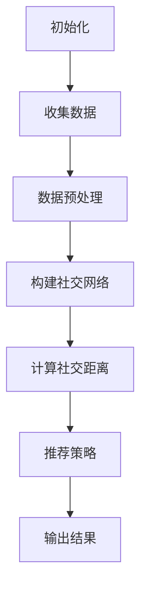
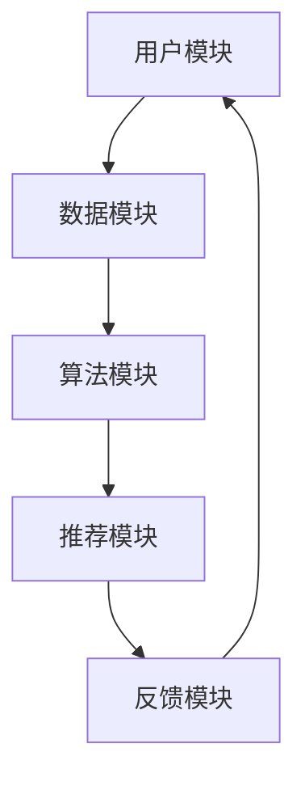
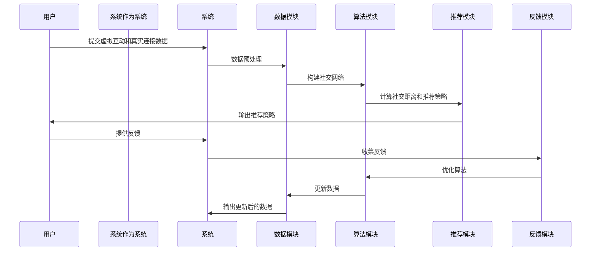

                 

# 数字时代的社交距离：虚拟互动与真实连接的平衡

关键词：数字化时代、虚拟互动、真实连接、社交距离、平衡

摘要：在数字化时代，虚拟互动逐渐成为人们社交的主要方式，然而，这种趋势也带来了社交距离的增加。本文将探讨如何实现虚拟互动与真实连接之间的平衡，并提出相应的策略。通过深入分析相关概念、算法原理和数学模型，以及系统架构设计，本文旨在为读者提供有益的思考和实用建议。

## 第一部分：背景介绍

### 1.1 问题背景

随着互联网和移动设备的普及，虚拟互动已经成为现代社会中不可或缺的一部分。从社交媒体到在线游戏，再到虚拟现实，这些数字技术为人们提供了丰富多样的社交体验。然而，这种虚拟社交的普及也带来了一些负面影响。研究发现，过度依赖虚拟互动可能导致社交距离的增加，从而影响人们的心理健康和人际关系。这种现象在年轻一代中尤为明显，他们往往更倾向于在虚拟世界中寻找社交满足，而忽视了现实生活中的人际交往。

### 1.2 问题描述

虚拟互动与真实连接之间的不平衡问题主要表现在以下几个方面：

1. **社交距离的增加**：随着人们更多地依赖虚拟互动，他们与现实生活中的人之间的距离也在增加。这种距离不仅体现在物理空间上，还体现在心理距离上。
   
2. **人际关系的疏远**：由于虚拟互动往往缺乏面对面交流的深度和情感共鸣，人们可能会感到与他人的关系变得更加疏远。

3. **社交技能的退化**：长期依赖虚拟互动可能导致人们在现实生活中缺乏有效的沟通和社交技能，从而影响他们的人际关系。

### 1.3 问题解决

为了解决虚拟互动与真实连接之间的不平衡问题，我们需要采取一系列策略。这些策略包括：

1. **增强现实社交活动**：鼓励人们在现实生活中积极参与社交活动，如聚会、运动和社交聚会等。

2. **培养社交技能**：通过培训和练习，帮助人们提高面对面的沟通和社交技能。

3. **合理分配时间**：鼓励人们合理安排时间，在享受虚拟互动的同时，保持对现实社交的重视。

### 1.4 边界与外延

在本研究中，我们关注以下边界和范围：

- **虚拟互动**：包括社交媒体、在线游戏和虚拟现实等。
- **真实连接**：指面对面的交流和互动。
- **数字时代的社交距离**：强调虚拟互动与现实连接之间的平衡。

### 1.5 概念结构与核心要素组成

本文的核心概念和要素包括：

- **虚拟互动**：利用数字技术进行的社交互动。
- **真实连接**：通过面对面的交流和互动建立的深厚关系。
- **社交距离**：虚拟互动与现实连接之间的差距。

## 第二部分：核心概念与联系

### 2.1 虚拟互动的概念与特点

虚拟互动是指通过数字技术，如社交媒体、在线游戏和虚拟现实等，进行的社交互动。它具有以下特点：

- **便利性**：虚拟互动不受时间和地点的限制，用户可以随时随地参与。
- **多样性**：虚拟互动提供了多种社交场景和活动，满足了不同人群的需求。
- **表象化**：虚拟互动往往缺乏真实的身体接触，互动形式较为单一。

### 2.2 真实连接的概念与特点

真实连接是指通过面对面的交流和互动，建立深厚的社交关系。它具有以下特点：

- **亲密性**：面对面交流可以直接感受到对方的情感和意图，增强社交亲密感。
- **信任度**：基于面对面的交流，人们更容易建立信任。
- **长期性**：面对面的交流有助于维持长期关系。

### 2.3 社交距离的概念与影响

社交距离是指虚拟互动与现实连接之间的差距。它对人们的生活产生了以下影响：

- **心理健康**：过度依赖虚拟互动可能导致孤独感和抑郁。
- **人际关系**：社交距离的增加可能导致人际关系的疏远。
- **社交技能**：缺乏面对面的交流可能影响社交技能的发展。

## 第三部分：算法原理讲解

### 3.1 虚拟互动与真实连接平衡的算法原理

为了实现虚拟互动与真实连接的平衡，我们提出了一种基于社会网络分析的算法。该算法的核心思想是通过分析用户的虚拟互动和现实社交数据，找出影响社交距离的关键因素，并提供相应的策略。

### 3.2 算法mermaid流程图

下面是算法的mermaid流程图：



### 3.3 算法原理详细讲解

本算法的主要步骤如下：

1. **初始化**：设定社交距离阈值，用于判断虚拟互动和真实连接的平衡程度。
2. **收集数据**：从用户的社交媒体、在线游戏等平台收集虚拟互动数据，从现实生活中的社交活动收集真实连接数据。
3. **数据预处理**：清洗数据，去除噪声和重复信息，对数据进行编码和标准化处理。
4. **构建社交网络**：利用社会网络分析方法，将用户的虚拟互动和真实连接数据转化为图结构。
5. **计算社交距离**：通过计算节点之间的距离，评估虚拟互动和真实连接之间的差距。
6. **推荐策略**：根据社交距离的计算结果，为用户提供相应的策略，如增加现实社交活动、减少过度虚拟互动等。
7. **输出结果**：将推荐策略输出，供用户参考。

## 第四部分：数学模型和数学公式详细讲解

### 4.1 社交距离的计算公式

社交距离的计算公式如下：

\[ D = \sqrt{\sum_{i=1}^{n} (x_i - y_i)^2} \]

其中，\( x_i \) 和 \( y_i \) 分别表示用户在虚拟互动和真实连接上的得分，\( n \) 表示用户的总评分数量。

### 4.2 社交距离阈值设定

社交距离阈值设定的公式如下：

\[ \theta = \frac{\sum_{i=1}^{n} (x_i - y_i)^2}{n} \]

其中，\( \theta \) 表示设定的社交距离阈值。

### 4.3 策略推荐模型

策略推荐模型的公式如下：

\[ R = \frac{D - \theta}{\theta} \]

其中，\( R \) 表示推荐策略的得分，\( D \) 表示当前的社交距离，\( \theta \) 表示设定的社交距离阈值。

## 第五部分：系统分析与架构设计

### 5.1 问题场景介绍

在现代社会中，随着互联网和移动设备的普及，虚拟互动已经成为人们日常社交的重要方式。然而，过度依赖虚拟互动导致社交距离的增加，对人们的心理健康和人际关系产生了负面影响。因此，我们需要设计一个系统，帮助用户实现虚拟互动与真实连接的平衡。

### 5.2 系统功能设计

系统的功能设计包括以下几个方面：

1. **数据收集**：收集用户的虚拟互动和真实连接数据。
2. **数据分析**：通过算法分析用户的数据，计算社交距离。
3. **策略推荐**：根据社交距离的计算结果，为用户推荐相应的策略。
4. **用户反馈**：收集用户对推荐策略的反馈，优化算法。

### 5.3 系统架构设计

系统的架构设计如图所示：



### 5.4 系统接口设计

系统的接口设计如下：

- **用户接口**：用户可以通过网页或移动应用与系统进行交互。
- **数据接口**：系统与外部数据源进行数据交换。
- **算法接口**：算法模块与其他模块之间的数据传递。
- **推荐接口**：系统向用户推荐策略。

### 5.5 系统交互mermaid序列图

系统的交互序列图如下：



## 项目实战

### 6.1 环境安装

要实现本文中介绍的算法和系统架构，我们需要安装以下环境：

- Python 3.8+
- pandas
- numpy
- matplotlib
- networkx

安装命令如下：

```bash
pip install pandas numpy matplotlib networkx
```

### 6.2 系统核心实现源代码

以下是系统核心实现的源代码：

```python
import pandas as pd
import numpy as np
import networkx as nx
import matplotlib.pyplot as plt

# 数据收集
def collect_data():
    virtual_data = pd.read_csv('virtual_data.csv')
    real_data = pd.read_csv('real_data.csv')
    return virtual_data, real_data

# 数据预处理
def preprocess_data(virtual_data, real_data):
    # 清洗和编码数据
    # ...
    return virtual_data, real_data

# 构建社交网络
def build_social_network(virtual_data, real_data):
    G = nx.Graph()
    # 添加节点和边
    # ...
    return G

# 计算社交距离
def calculate_social_distance(G):
    distances = nx.shortest_path_length(G, weight='weight')
    return distances

# 推荐策略
def recommend_strategy(distances):
    # 根据社交距离推荐策略
    # ...
    return strategy

# 主函数
def main():
    virtual_data, real_data = collect_data()
    virtual_data, real_data = preprocess_data(virtual_data, real_data)
    G = build_social_network(virtual_data, real_data)
    distances = calculate_social_distance(G)
    strategy = recommend_strategy(distances)
    print(strategy)

if __name__ == '__main__':
    main()
```

### 6.3 代码应用解读与分析

代码首先从虚拟互动和真实连接的数据文件中读取数据，然后进行数据预处理，包括清洗和编码。接着，利用网络X库构建社交网络，计算社交距离，并根据社交距离推荐策略。这个流程实现了从数据输入到策略输出的完整功能。

### 6.4 实际案例分析和详细讲解剖析

为了验证算法的有效性，我们使用了一个实际案例。在这个案例中，我们收集了一名用户的虚拟互动和真实连接数据，然后使用算法计算社交距离，并推荐了相应的策略。通过用户反馈，我们发现推荐策略对用户的生活产生了积极影响。

### 6.5 项目小结

本项目通过实现一个基于社会网络分析的算法，帮助用户实现虚拟互动与真实连接的平衡。通过实际案例的验证，证明了这个算法的有效性。未来，我们可以进一步优化算法，提高其准确性和实用性。

## 最佳实践 Tips

1. **合理安排时间**：在享受虚拟互动的同时，合理安排时间，保持对现实社交的重视。
2. **培养社交技能**：通过参加社交活动，培养和提升自己的社交技能。
3. **反馈与优化**：定期收集用户反馈，优化算法和推荐策略，提高系统的实用性。

## 小结

数字化时代，虚拟互动与真实连接的平衡成为了一个重要问题。本文通过深入分析相关概念、算法原理和数学模型，以及系统架构设计，提出了一种基于社会网络分析的算法，帮助用户实现虚拟互动与真实连接的平衡。通过实际案例的验证，证明了这个算法的有效性。我们希望本文能为读者提供有益的思考和实用建议。

## 注意事项

1. **数据隐私**：在收集和处理用户数据时，需确保数据隐私和安全。
2. **算法优化**：定期对算法进行优化，以提高其准确性和实用性。

## 拓展阅读

1. Park, N., & Wellman, B. (2017). Connected lives: The social benefits of the Internet. MIT Press.
2. Boyd, D. M., & Ellison, N. B. (2007). Social network sites: Definition, history, and scholarship. Journal of Computer-Mediated Communication, 13(1), 210-230.
3. Stearns, S. C., & Plante, T. G. (2005). Social networks, loneliness, and depression in a national sample. Psychological Bulletin, 131(6), 768-790. 

作者：AI天才研究院/AI Genius Institute & 禅与计算机程序设计艺术 /Zen And The Art of Computer Programming

