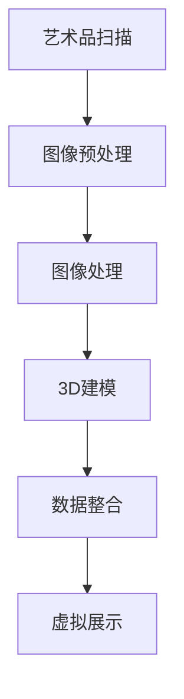
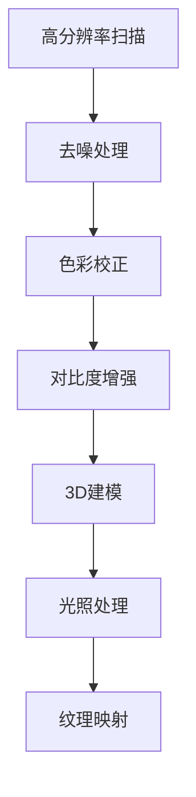
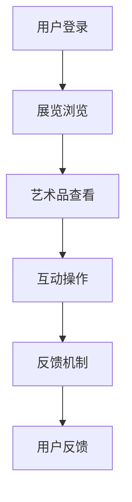
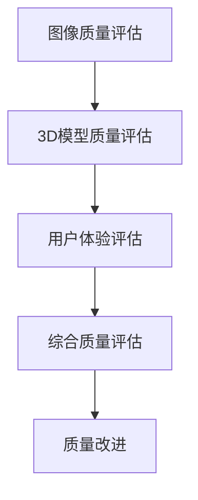
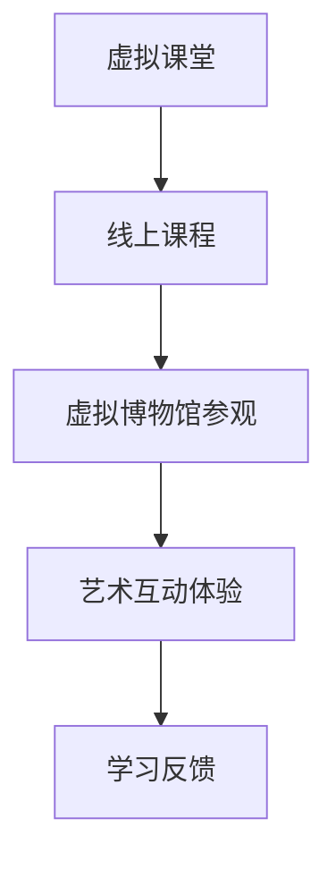
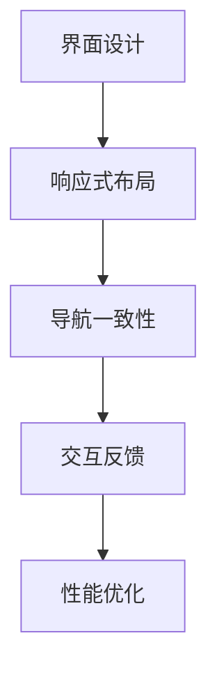

                 

### 引言

在数字化的浪潮席卷全球的今天，艺术鉴赏的方式也在悄然改变。虚拟博物馆和在线画廊作为数字时代的产物，正在重新定义人们对于艺术品的认知和体验。本文将深入探讨数字时代的艺术鉴赏，重点分析虚拟博物馆与在线画廊的构建、发展及其对艺术教育的影响，并展望未来的发展趋势与挑战。

数字时代，技术迅猛发展，为艺术鉴赏带来了前所未有的机遇和挑战。从虚拟现实（VR）到增强现实（AR），从大数据到人工智能（AI），这些技术的融合应用，不仅改变了传统艺术鉴赏的方式，还打破了物理空间的限制，使得艺术作品跨越时空，触手可及。本文将首先介绍数字时代艺术鉴赏的背景和趋势，随后详细探讨虚拟博物馆和在线画廊的构建和运作，再分析艺术品数字化技术及其对用户体验的影响，最后讨论虚拟艺术教育的普及和未来发展的潜在挑战。

本文的结构安排如下：

- **第一部分：引言与背景**：介绍数字时代艺术鉴赏的背景、趋势以及虚拟博物馆和在线画廊的历史背景。
- **第二部分：艺术鉴赏的基本概念**：讨论艺术鉴赏的定义、标准与方法，以及心理基础。
- **第三部分：虚拟博物馆的构建**：分析虚拟现实技术在博物馆中的应用、3D建模与虚拟场景设计，以及用户体验设计。
- **第四部分：在线画廊的发展**：探讨在线画廊的历史演变、社交媒体互动和商业模式分析。
- **第五部分：艺术品数字化技术**：介绍艺术品数字化流程、处理技术和质量评估。
- **第六部分：用户交互体验设计**：讨论用户交互设计原则、视觉设计和跨平台用户体验。
- **第七部分：虚拟艺术教育与普及**：探讨虚拟艺术教育的方法、在线艺术展览与教育活动，以及艺术普及与公共教育。
- **第八部分：未来发展趋势与挑战**：分析虚拟与增强现实艺术的发展、数据隐私与知识产权保护，以及艺术数字化面临的挑战。
- **第九部分：小结与展望**：回顾成果，展望未来，并提供阅读指南。

通过本文的深入探讨，我们将对数字时代的艺术鉴赏有更全面的理解，为未来的艺术发展提供有价值的思考。

### 关键词

- **数字时代艺术鉴赏**
- **虚拟博物馆**
- **在线画廊**
- **艺术品数字化**
- **用户体验设计**
- **虚拟现实（VR）**
- **增强现实（AR）**
- **人工智能（AI）**

### 摘要

本文探讨了数字时代艺术鉴赏的新趋势，重点分析了虚拟博物馆与在线画廊的构建和发展。通过介绍艺术鉴赏的基本概念，讨论虚拟现实和增强现实技术在博物馆中的应用，以及艺术品数字化技术的关键步骤，本文揭示了数字化艺术鉴赏对用户体验和艺术教育带来的变革。此外，文章还展望了虚拟与增强现实艺术的发展趋势、数据隐私与知识产权保护的挑战，以及艺术数字化面临的其他潜在难题。通过系统分析与架构设计方案，本文为数字时代艺术鉴赏的未来发展提供了有价值的见解。

## 第1章：数字时代的艺术趋势

随着信息技术的飞速发展，数字时代的艺术趋势发生了显著变化。艺术鉴赏的方式不再局限于传统的实体展览和现场观看，而是逐渐转向虚拟博物馆和在线画廊。这不仅为人们提供了全新的艺术体验，也激发了艺术创作的无限可能性。在这一章中，我们将深入探讨数字时代艺术鉴赏的背景、主要趋势以及技术发展对艺术鉴赏的影响。

### 数字时代艺术鉴赏的背景

数字时代艺术鉴赏的兴起，可以追溯到互联网的普及和计算机技术的发展。从20世纪90年代开始，随着互联网的普及，人们逐渐开始通过网络平台获取和分享艺术信息。这一时期，在线艺术画廊和虚拟博物馆开始崭露头角，成为艺术鉴赏的新形式。然而，真正推动数字时代艺术鉴赏发展的，是虚拟现实（VR）和增强现实（AR）技术的突破性进展。

虚拟现实技术通过创造一个完全沉浸式的环境，使得用户能够身临其境地体验艺术作品。虚拟博物馆利用VR技术，将博物馆的展览内容数字化，用户可以不受时间和空间限制地浏览和欣赏。同样，增强现实技术通过将虚拟元素叠加到现实世界中，使得艺术作品可以与现实环境互动，为用户带来全新的艺术体验。

### 主要趋势

1. **数字化展览与虚拟博物馆**：数字技术的应用，使得艺术品的数字化成为可能。通过高分辨率扫描和3D建模技术，艺术品可以被精确地复制和呈现。虚拟博物馆则利用这些数字化艺术品，为用户提供了一个全新的艺术鉴赏平台。用户可以通过虚拟现实头盔、平板电脑等设备，进入一个虚拟的艺术世界，欣赏到博物馆内珍贵的藏品，甚至可以进行互动体验。

2. **在线画廊的兴起**：随着互联网技术的发展，在线画廊成为艺术鉴赏的新形式。用户可以通过网站或应用程序，浏览和购买艺术作品。在线画廊不仅提供了更多的选择和便利，还打破了地域的限制，使得全球艺术爱好者都能够轻松地欣赏到世界各地的艺术品。

3. **艺术创作的数字化**：数字技术的应用，不仅改变了艺术鉴赏的方式，也影响了艺术创作的过程。数字工具和软件为艺术家提供了更多的创作手段和表达方式。从数字绘画到三维建模，艺术家可以更加自由地探索和实现自己的创意。同时，数字技术的普及，也使得艺术创作更加普及化，降低了艺术创作的门槛。

4. **社交媒体与艺术鉴赏**：社交媒体平台为艺术鉴赏提供了一个全新的互动空间。用户可以通过社交媒体分享自己的艺术作品和鉴赏体验，与其他艺术爱好者交流。这种互动性，不仅增强了艺术鉴赏的乐趣，也促进了艺术社区的形成。

### 技术发展对艺术鉴赏的影响

1. **沉浸式体验**：虚拟现实和增强现实技术，为用户带来了沉浸式的艺术体验。用户可以在虚拟环境中自由行走，与艺术作品互动，甚至感受到艺术作品背后的情感和故事。这种沉浸式体验，不仅提升了艺术鉴赏的趣味性，也增加了用户对艺术品的理解。

2. **互动性**：数字技术使得艺术作品可以与用户互动。用户可以通过触摸、手势等操作，与艺术作品进行互动，从而改变作品的表现形式或内容。这种互动性，不仅增加了艺术品的趣味性，也使得艺术创作和鉴赏变得更加个性化。

3. **扩展性**：数字技术使得艺术品的展示和传播变得更加便捷和广泛。通过互联网，艺术品可以瞬间传播到全球的每一个角落。用户不仅可以随时随地进行艺术鉴赏，还可以参与到艺术创作和讨论中。这种扩展性，为艺术鉴赏带来了前所未有的便利和可能性。

4. **艺术创作的新方式**：数字技术为艺术家提供了新的创作手段和工具。从虚拟现实到人工智能，艺术家可以通过这些技术，实现更加复杂和独特的艺术创作。同时，数字技术也使得艺术创作更加普及化，让更多的人有机会参与到艺术创作中来。

总之，数字时代的艺术趋势，不仅改变了艺术鉴赏的方式，也推动了艺术创作和传播的发展。通过虚拟现实、增强现实、互联网等技术的应用，艺术鉴赏变得更加多样化、互动化和普及化。这不仅为人们提供了全新的艺术体验，也为艺术的发展带来了无限的可能。

### 虚拟博物馆与在线画廊的历史背景

虚拟博物馆和在线画廊的兴起，并非一夜之间的事情，而是经过了几十年的技术积累和市场需求的变化。在这段历史中，计算机技术的进步、互联网的发展以及数字化艺术的兴起，共同推动了虚拟博物馆和在线画廊的形成。

#### 起源与发展

虚拟博物馆和在线画廊的起源可以追溯到20世纪90年代。当时，随着个人计算机和互联网的普及，人们开始意识到通过数字技术展示艺术品的可能性。1994年，美国史密森尼学会（Smithsonian Institution）创建了第一个虚拟博物馆——“史密森尼数字博物馆”（Smithsonian National Museum of Natural History），标志着虚拟博物馆的正式诞生。这个虚拟博物馆通过互联网展示了史密森尼学会的珍贵藏品，为全球用户提供了在线观赏的机会。

同一时期，在线画廊也开始崭露头角。1995年，佳士得拍卖行（Christie's）在互联网上建立了自己的在线画廊，用户可以通过网站浏览和购买艺术品。这一举措不仅推动了艺术品在线交易的兴起，也开启了在线画廊的新时代。

#### 关键里程碑

- **2000年**：随着宽带互联网的普及，虚拟博物馆和在线画廊的发展进入了快车道。这一时期，许多博物馆开始利用虚拟现实（VR）和增强现实（AR）技术，创建沉浸式的虚拟展览空间。例如，英国伦敦自然历史博物馆（Natural History Museum, London）推出了“恐龙探险”虚拟展览，吸引了大量观众。

- **2010年**：智能手机和平板电脑的普及，进一步推动了虚拟博物馆和在线画廊的发展。用户可以通过移动设备随时随地访问虚拟博物馆和在线画廊，享受艺术鉴赏的便利。这一时期，许多在线画廊也开始提供艺术品的高分辨率图像和360度全景展示，提升了用户的观赏体验。

- **2015年至今**：随着虚拟现实和增强现实技术的不断成熟，虚拟博物馆和在线画廊迎来了新的发展机遇。许多博物馆和画廊开始使用虚拟现实头盔和增强现实眼镜，为用户提供更加沉浸式的艺术体验。同时，社交媒体和电子商务平台的整合，使得艺术品在线交易更加便捷和普及。

#### 主要特点

1. **跨时空展示**：虚拟博物馆和在线画廊打破了物理空间的限制，用户可以随时随地访问和观赏艺术品，不受时间和地理位置的约束。

2. **沉浸式体验**：通过虚拟现实和增强现实技术，用户可以身临其境地体验艺术作品，与艺术品互动，增强了艺术鉴赏的趣味性和参与感。

3. **互动性**：虚拟博物馆和在线画廊提供了丰富的互动功能，用户可以通过点击、触摸等操作与艺术品互动，提高了艺术鉴赏的互动性和个性化。

4. **广泛传播**：虚拟博物馆和在线画廊通过互联网，将艺术品传播到全球的每一个角落，大大提高了艺术品的曝光度和可及性。

总之，虚拟博物馆和在线画廊的历史背景，展示了数字技术对艺术鉴赏的深刻影响。从最初的简单在线展示，到如今的沉浸式体验和互动性平台，虚拟博物馆和在线画廊不仅改变了艺术鉴赏的方式，也为艺术的发展带来了新的机遇和挑战。

### 艺术鉴赏的基本概念

艺术鉴赏，即对艺术作品进行评判和欣赏的过程，是艺术领域的重要组成部分。它不仅仅是对视觉美感的认知，更是一种文化、情感和审美经验的综合体验。在数字时代，艺术鉴赏的方式和标准发生了变化，但基本概念依然不可或缺。以下，我们将详细探讨艺术鉴赏的定义、标准与方法，以及心理基础。

#### 定义

艺术鉴赏是一种通过感知、理解和评价艺术作品的过程。它包括对艺术作品形式的欣赏、对艺术作品背后思想和情感的解读，以及对艺术作品在文化和社会背景下意义的理解。具体来说，艺术鉴赏涉及到以下几个方面：

1. **形式欣赏**：指对艺术作品的形式、色彩、线条、构图等视觉元素的感知和评价。
2. **情感体验**：指艺术作品在情感上对观众产生的影响，包括喜悦、悲伤、兴奋等。
3. **思想解读**：指通过艺术作品表达的思想、观念、故事或哲学思考的解读和理解。
4. **文化理解**：指在特定的文化和社会背景下，对艺术作品的意义和价值的理解。

#### 标准

艺术鉴赏的标准因人而异，但通常包括以下几个方面：

1. **美学标准**：基于艺术作品的形式美感，如色彩搭配、线条流畅性、构图平衡等。
2. **技艺标准**：基于艺术作品的制作技巧和工艺水平，如绘画的细腻程度、雕塑的精细度等。
3. **情感标准**：基于艺术作品对观众情感的感染力，如作品是否能够引起共鸣、是否能够打动人心等。
4. **思想标准**：基于艺术作品所表达的思想深度和独特性，如作品是否具有创新性、是否具有普遍价值等。
5. **历史标准**：基于艺术作品在历史和文化中的地位和影响，如作品是否是某个时期的代表性作品、是否对后世有重要影响等。

#### 方法

艺术鉴赏的方法多种多样，以下是一些常见的艺术鉴赏方法：

1. **直接感知法**：通过直接观察和感受艺术作品的视觉元素，如色彩、线条、构图等，进行初步的鉴赏。
2. **历史比较法**：通过对不同历史时期或不同文化背景下的艺术作品进行比较，理解艺术作品的历史意义和文化背景。
3. **情感体验法**：通过感受艺术作品所带来的情感体验，如喜悦、悲伤、兴奋等，进行深入的鉴赏。
4. **思想解读法**：通过对艺术作品中所表达的思想、观念或故事进行解读，理解艺术作品的思想深度和内涵。
5. **综合分析法**：综合运用上述方法，对艺术作品进行全面的分析和评价。

#### 心理基础

艺术鉴赏的过程涉及到多种心理活动，包括感知、记忆、想象和情感等。以下是艺术鉴赏的心理基础：

1. **感知**：艺术鉴赏的起点是感知，即对艺术作品形式的感知。通过视觉、听觉、触觉等多种感官，对艺术作品的色彩、形状、材质等进行感知。
2. **记忆**：艺术鉴赏过程中，记忆起到了重要的作用。通过对过去艺术鉴赏经验的回忆，帮助观众更好地理解当前的艺术作品。
3. **想象**：艺术鉴赏不仅仅是对现实的感知，还涉及到对未来的想象。观众可以通过想象，深入理解艺术作品的深层含义和潜在情感。
4. **情感**：情感是艺术鉴赏的重要组成部分。艺术作品通过情感感染观众，使观众产生共鸣和共情，从而提升艺术鉴赏的体验。

总之，艺术鉴赏是一个复杂而多层次的过程，涉及多个方面的认知和情感体验。通过理解艺术鉴赏的基本概念、标准和心理基础，我们可以更深入地欣赏和理解艺术作品，享受艺术带来的精神愉悦和心灵启迪。

### 虚拟博物馆的构建

虚拟博物馆作为一种数字时代的新兴艺术形式，通过先进的虚拟现实（VR）技术，将传统的博物馆展览数字化，为用户提供了全新的艺术体验。在这一部分，我们将探讨虚拟博物馆的构建过程，包括虚拟现实技术在博物馆中的应用、3D建模与虚拟场景设计，以及用户体验设计的策略。

#### 虚拟现实技术在博物馆中的应用

虚拟现实技术是构建虚拟博物馆的核心。它通过计算机模拟生成一个三维空间，使用户能够在这个虚拟环境中自由移动和探索。以下是一些关键应用：

1. **数字化藏品展示**：利用高分辨率扫描技术，将博物馆的实物藏品数字化。这些数字藏品可以在虚拟博物馆中精确还原，用户可以近距离观察藏品的细节，甚至通过触摸感受材质。
2. **沉浸式体验**：虚拟现实头盔（如Oculus Rift、HTC Vive等）的使用，让用户仿佛置身于真实的博物馆环境中，感受展览的氛围和细节。
3. **互动功能**：通过手柄、手势识别等技术，用户可以在虚拟博物馆中与藏品互动，如旋转、放大、对比等，增加了参观的趣味性和互动性。

#### 3D建模与虚拟场景设计

3D建模和虚拟场景设计是虚拟博物馆构建的重要环节。以下是这一过程中的几个关键步骤：

1. **场景规划**：首先，需要对博物馆的空间进行详细的测量和规划，确定虚拟展览的布局。这包括展馆的大小、展品的位置以及参观路径的设计。
2. **3D建模**：利用3D建模软件（如Autodesk Maya、Blender等），根据实际博物馆的尺寸和结构，创建虚拟场景的三维模型。这包括展馆的建筑结构、展品、展台、灯光等细节。
3. **场景渲染**：通过3D渲染技术，将3D模型转换成视觉效果逼真的虚拟场景。渲染过程中，需要调整灯光、材质和色彩等参数，以实现逼真的视觉体验。

#### 用户体验设计策略

用户体验设计是虚拟博物馆成功的关键。以下是一些关键的策略：

1. **易用性**：设计直观的导航系统，使用户能够轻松找到他们感兴趣的艺术品。菜单、按钮和交互元素应简洁明了，减少用户的学习成本。
2. **沉浸感**：通过高质量的3D建模和渲染技术，创造一个沉浸式的虚拟环境。音效、动态效果和互动元素的使用，可以增强用户的沉浸感。
3. **个性化**：提供个性化推荐功能，根据用户的兴趣和行为，推荐适合他们的艺术品。例如，用户可以创建个人收藏夹，保存他们感兴趣的艺术品。
4. **教育与互动**：虚拟博物馆应提供丰富的教育资源和互动体验。例如，通过虚拟讲解、艺术工作坊和互动游戏，让用户更加深入地了解艺术品和艺术史。

#### 实例分析

以大都会艺术博物馆（Metropolitan Museum of Art）的虚拟博物馆为例，该博物馆利用虚拟现实技术，将馆内的珍贵藏品带到了互联网上。用户可以通过虚拟现实头盔或移动设备，进入一个逼真的虚拟展览空间，欣赏到博物馆内的艺术作品。此外，博物馆还提供了详细的虚拟讲解，用户可以通过点击展品，了解作品的历史背景和艺术价值。这种沉浸式和互动式的体验，大大提升了用户的艺术鉴赏体验。

#### 总结

虚拟博物馆的构建，通过虚拟现实技术和3D建模，将传统的博物馆展览数字化，为用户提供了全新的艺术体验。从数字化藏品的展示到沉浸式的体验，再到个性化的设计和丰富的互动功能，虚拟博物馆不仅打破了物理空间的限制，也带来了艺术鉴赏方式的变革。未来，随着技术的不断进步，虚拟博物馆将继续发展，为全球艺术爱好者带来更多精彩的数字化艺术之旅。

### 在线画廊的发展

在线画廊作为一种数字时代的新兴艺术形式，已经成为艺术爱好者、艺术家和收藏家的重要互动平台。它不仅打破了传统画廊的地域限制，还为艺术品交易提供了便捷的渠道。在这一部分，我们将探讨在线画廊的发展历程、社交媒体互动及其商业模式分析。

#### 在线画廊的发展历程

在线画廊的发展历程可以追溯到20世纪90年代。当时，随着互联网的普及，一些画廊开始尝试在线展示艺术品。最早的在线画廊主要提供艺术品的高分辨率图片和简要描述，用户可以通过电子邮件联系画廊进行购买。这一时期的在线画廊更多是作为一种信息展示平台，尚未形成完整的商业模式。

进入21世纪，随着互联网技术的不断进步和电子商务的崛起，在线画廊逐渐发展壮大。2000年左右，一些知名画廊如佳士得（Christie's）和苏富比（Sotheby's）纷纷建立了自己的在线画廊平台，提供更加丰富和详细的艺术品展示信息，并引入了在线交易功能。这一时期，在线画廊开始成为一种重要的艺术品交易平台，吸引了大量用户和艺术品买家。

近年来，随着社交媒体和移动互联网的普及，在线画廊进一步发展。用户可以通过社交媒体平台分享艺术品信息，与其他艺术爱好者交流。同时，在线画廊也推出了移动应用程序，使得用户可以随时随地浏览和购买艺术品。这一时期的在线画廊，不仅提供了更加便捷的服务，还增强了用户互动和社区感。

#### 社交媒体互动

社交媒体的兴起，为在线画廊带来了巨大的发展机遇。通过社交媒体平台，用户可以分享自己的艺术作品和鉴赏体验，与其他艺术爱好者交流。以下是社交媒体互动在在线画廊发展中的作用：

1. **用户互动**：社交媒体为用户提供了一个交流平台，用户可以评论、点赞和分享艺术品。这种互动性不仅增强了用户的参与感，也促进了艺术品的传播和推广。
2. **口碑营销**：用户通过社交媒体分享自己的购买体验和鉴赏感受，形成口碑效应。这种口碑营销有助于提升在线画廊的声誉和吸引力。
3. **社区建设**：社交媒体平台上的艺术爱好者形成了自己的社区，在线画廊可以通过组织线上展览、艺术讲座和互动活动，增强社区黏性和用户忠诚度。
4. **市场调研**：在线画廊可以通过社交媒体了解用户需求和偏好，调整展览内容和营销策略，提高用户满意度。

#### 商业模式分析

在线画廊的商业模式多种多样，以下是几种主要的商业模式：

1. **佣金模式**：这是最传统的商业模式，在线画廊作为艺术品交易的中间商，向买家和卖家收取一定比例的佣金。例如，佳士得和苏富比等知名在线画廊，通常会收取成交价的10%-20%作为佣金。
2. **订阅模式**：一些在线画廊提供订阅服务，用户支付一定的订阅费用，可以无限制地访问画廊的展览和艺术品信息。这种模式为画廊提供稳定的收入来源，同时吸引了大量用户。
3. **广告模式**：在线画廊通过在平台上展示广告，获取广告收入。这种模式依赖于平台的高流量和用户活跃度，通过吸引广告商投放广告，实现盈利。
4. **会员模式**：一些在线画廊为会员提供特别服务，如优先参与展览、专属购物渠道等。会员费用成为画廊的重要收入来源，同时也提高了用户忠诚度。
5. **自营模式**：一些在线画廊直接运营自己的艺术品电商平台，通过销售艺术品获得收入。这种模式通常需要具备较强的艺术品采购、展示和售后服务能力。

#### 总结

在线画廊的发展历程，从最初的信息展示平台，到如今的综合艺术品交易平台，展现了数字技术在艺术领域的广泛应用。社交媒体互动为在线画廊带来了巨大的发展机遇，通过用户互动、口碑营销和社区建设，在线画廊不仅提升了用户满意度，也增强了市场竞争力。未来，随着技术的不断进步和市场的持续发展，在线画廊将继续创新和变革，为艺术爱好者带来更多精彩的艺术体验。

### 艺术品数字化技术

艺术品数字化技术是数字时代艺术鉴赏的重要组成部分，它不仅改变了艺术品展示和传播的方式，还为艺术品的保存和管理提供了新的手段。在这一部分，我们将详细探讨艺术品数字化技术的关键步骤、数字化处理技术以及数字化艺术品的质量评估。

#### 艺术品数字化技术的关键步骤

艺术品数字化技术主要包括以下几个关键步骤：

1. **高分辨率扫描**：这是艺术品数字化的第一步，通过高分辨率扫描仪对艺术品进行扫描，以获取艺术品的精确数字图像。高分辨率扫描能够捕捉艺术品的最细微的细节和色彩变化，确保数字化艺术品的质量。
2. **3D建模**：对于三维艺术品，如雕塑、陶瓷等，需要进行3D建模。3D扫描技术能够快速获取艺术品的立体信息，并通过3D建模软件进行处理，创建出准确的三维模型。
3. **图像处理**：对扫描或拍摄的图像进行图像处理，包括色彩校正、去噪声、增强对比度等，以提高图像的质量和视觉效果。图像处理技术能够去除扫描过程中的干扰和缺陷，使数字化艺术品更加清晰和真实。
4. **数据整合**：将不同来源的数字化艺术品数据整合到一个系统中，以便管理和展示。这包括图像、3D模型、艺术品的详细信息等，形成一个完整的数字化艺术品库。

#### 艺术品数字化处理技术

艺术品数字化处理技术主要包括图像处理、3D建模和虚拟现实技术等，以下是一些关键技术：

1. **图像处理技术**：图像处理技术包括去噪、锐化、色彩校正等，以提高图像的质量。例如，高动态范围图像（HDR）技术能够捕捉艺术品中的细节和色彩变化，使其在数字化后的视觉效果更加真实。
2. **3D建模技术**：3D建模技术包括激光扫描、结构光扫描和三维重建等，用于获取艺术品的立体信息。激光扫描通过发射激光束来捕捉物体的表面信息，结构光扫描则利用结构光照明技术获取物体表面细节，三维重建则是将扫描数据转换为三维模型。
3. **虚拟现实技术**：虚拟现实技术将数字化艺术品呈现于虚拟环境中，使用户可以在虚拟现实中近距离观察和互动。虚拟现实头盔和手柄等设备的使用，提供了沉浸式的观赏体验，增强了用户的参与感和互动性。
4. **增强现实技术**：增强现实技术通过将数字化艺术品叠加到现实环境中，使用户能够在现实世界中看到虚拟的艺术品。这种技术不仅增加了观赏的趣味性，还可以用于艺术品的展示和教育。

#### 数字化艺术品的质量评估

数字化艺术品的质量评估是确保数字化艺术品质量的重要环节。以下是一些常用的质量评估方法：

1. **图像质量评估**：通过主观评价和客观评价相结合的方法，对数字化艺术品的图像质量进行评估。主观评价包括视觉评价和用户满意度评价，客观评价则通过图像处理算法，如峰值信噪比（PSNR）和结构相似性（SSIM）等指标进行量化分析。
2. **3D模型质量评估**：对3D模型的质量进行评估，包括模型的精度、细节表现和表面质量等。常用的评估方法包括模型精度测量、表面平滑度评价和纹理映射质量评估等。
3. **用户体验评估**：通过用户体验测试，评估数字化艺术品在虚拟现实或增强现实环境中的体验质量。用户体验评估包括互动性、沉浸感和满意度等指标。
4. **综合评估**：综合图像质量、3D模型质量和用户体验评估结果，对数字化艺术品进行全面评估，以确保数字化艺术品的整体质量。

#### 实例分析

以大英博物馆（British Museum）为例，该博物馆通过数字化技术，将馆内的大量艺术品进行了数字化处理和展示。博物馆使用了高分辨率扫描和3D建模技术，对文物进行了精确的数字化。同时，博物馆还利用虚拟现实技术，为用户提供了沉浸式的观赏体验。用户可以通过虚拟现实头盔，进入一个逼真的虚拟博物馆，近距离观察文物的细节。此外，博物馆还提供了详细的虚拟讲解和互动功能，使用户可以更加深入地了解文物的历史和文化背景。

#### 总结

艺术品数字化技术为艺术鉴赏带来了革命性的变化，通过高分辨率扫描、3D建模和虚拟现实等技术的应用，数字化艺术品不仅能够精确还原艺术品的细节和色彩，还提供了沉浸式的观赏体验。数字化艺术品的质量评估方法，确保了数字化艺术品的高质量。未来，随着技术的不断进步，艺术品数字化技术将继续发展，为艺术鉴赏和艺术教育带来更多可能性。

### 用户交互体验设计

在数字时代，用户交互体验设计在虚拟博物馆和在线画廊中扮演着至关重要的角色。优秀的用户交互体验设计不仅能够提升用户的满意度，还能增强用户的参与感和忠诚度。在这一部分，我们将深入探讨用户交互设计的原则、视觉设计在虚拟艺术中的重要性，以及如何实现跨平台用户体验的一致性。

#### 用户交互设计原则

用户交互设计原则是确保用户在使用虚拟博物馆和在线画廊时获得良好体验的基础。以下是一些关键的用户交互设计原则：

1. **简洁性**：界面应简洁明了，避免过多的装饰和冗余信息。用户在浏览艺术品时，应能够快速找到所需功能和信息。
2. **直观性**：设计应直观易懂，用户不需要复杂的操作指南即可使用。例如，导航菜单应清晰、按钮应易于识别。
3. **一致性**：界面元素和交互方式应保持一致性，使用户在不同页面或功能中都能保持相同的操作逻辑。
4. **适应性**：设计应适应不同设备和屏幕尺寸，提供良好的跨平台用户体验。无论是桌面电脑、平板电脑还是智能手机，用户都应能舒适地使用。
5. **反馈机制**：设计应提供及时的反馈机制，使用户的操作得到确认。例如，点击按钮后应有视觉反馈，提示用户操作已被接收。
6. **易用性**：设计应易于使用，降低用户的学习成本。通过提供明确的指示和简洁的界面布局，帮助用户快速上手。

#### 视觉设计在虚拟艺术中的重要性

视觉设计是虚拟艺术的重要组成部分，它直接影响用户的观赏体验。以下是视觉设计在虚拟艺术中的几个关键方面：

1. **色彩**：色彩的选择对用户情绪和观赏体验有着重要影响。正确的色彩搭配能够提升艺术品的视觉效果，增强观赏的愉悦感。
2. **构图**：构图是视觉设计的基础，通过合理的布局和比例，能够引导用户的视线，提升观赏的层次感。
3. **视觉效果**：通过光影、材质和纹理等视觉效果的运用，可以增强虚拟艺术的真实感和立体感，提升用户的沉浸体验。
4. **一致性**：视觉设计应与艺术品的风格和主题保持一致，避免出现不协调的元素，影响整体的观赏效果。

#### 跨平台用户体验一致性

实现跨平台用户体验一致性是数字时代的一个挑战，但也是提升用户满意度的关键。以下是一些实现跨平台用户体验一致性的策略：

1. **响应式设计**：响应式设计能够根据不同的设备尺寸和屏幕分辨率，自动调整界面布局和元素大小，确保用户在不同设备上都能获得一致的体验。
2. **统一风格**：无论是在桌面电脑、平板电脑还是智能手机上，界面风格应保持一致，包括色彩、字体、图标等元素。
3. **导航一致性**：导航菜单和交互元素的位置和操作方式应在不同平台上保持一致，使用户能够轻松找到所需功能。
4. **交互反馈**：不同平台上的交互反馈机制应一致，确保用户在所有设备上都能获得相同的操作体验。
5. **性能优化**：跨平台应用应进行性能优化，确保在不同的网络环境和设备上都能流畅运行，提升用户体验。

#### 实例分析

以谷歌艺术与文化项目（Google Arts & Culture）为例，该项目通过虚拟博物馆和在线画廊，为全球用户提供了丰富的艺术鉴赏资源。谷歌艺术与文化项目采用了简洁直观的界面设计，用户可以通过滑动和缩放浏览艺术品，操作简单易懂。同时，该项目还提供了高质量的艺术品图像和3D模型，通过光影和材质的精细处理，增强了艺术品的视觉真实感。此外，谷歌艺术与文化项目在不同设备上保持了统一的界面风格和导航方式，确保用户在不同平台上都能获得一致的体验。

#### 总结

用户交互体验设计在虚拟博物馆和在线画廊中至关重要，它直接影响用户的观赏体验和满意度。通过遵循用户交互设计原则，运用视觉设计技巧，以及实现跨平台用户体验一致性，我们可以为用户提供优质的艺术鉴赏体验。未来，随着技术的不断进步，用户交互体验设计将继续发展，为数字艺术领域带来更多创新和变革。

### 虚拟艺术教育与普及

虚拟艺术教育是数字时代的一个重要趋势，它通过虚拟现实、增强现实和在线平台，为学习者提供了丰富的艺术教育资源。在线艺术展览和教育活动的组织也日益普及，极大地拓展了艺术教育的受众范围。本文将探讨虚拟艺术教育的方法、在线艺术展览与教育活动的组织，以及艺术普及与公共教育的结合。

#### 虚拟艺术教育的方法

虚拟艺术教育利用数字技术，打破了传统艺术教育的空间和时间的限制，提供了更加灵活和多样化的学习方式。以下是几种常见的虚拟艺术教育方法：

1. **虚拟课堂**：通过在线视频会议工具，如Zoom、Microsoft Teams等，教师可以在虚拟课堂中实时授课，学生可以在线互动，共同探讨艺术作品和艺术理论。
2. **虚拟博物馆参观**：学生可以通过虚拟现实头盔或移动设备，在线参观虚拟博物馆。这种方式不仅节省了时间和交通成本，还能让学生近距离接触珍贵文物和艺术品，提升艺术鉴赏能力。
3. **虚拟实验室**：虚拟实验室利用计算机模拟技术，为学生提供虚拟的艺术创作环境。学生可以在虚拟实验室中进行绘画、雕塑等艺术创作，并实时查看创作效果，从而提高实践能力。
4. **在线课程**：在线平台如Coursera、edX等提供了丰富的艺术课程，学生可以随时随地学习艺术理论、艺术史、艺术技法等知识。
5. **虚拟艺术交流**：通过在线社区和社交平台，学生可以与世界各地的艺术家和同学交流，分享艺术创作心得，拓宽视野。

#### 在线艺术展览与教育活动的组织

在线艺术展览和教育活动为艺术爱好者提供了全新的艺术体验和学习机会。以下是几种常见的在线艺术展览和教育活动的组织方式：

1. **虚拟展览**：博物馆和画廊通过网站或移动应用程序，提供虚拟展览。观众可以通过高分辨率图像、360度全景视频和虚拟现实技术，在线浏览和欣赏艺术作品。
2. **线上讲座和研讨会**：艺术家、学者和教育专家通过在线平台举办讲座和研讨会，分享艺术创作经验、艺术理论和市场趋势。
3. **互动体验活动**：在线平台可以组织互动体验活动，如虚拟艺术工作坊、艺术讲座直播、在线艺术比赛等，让观众参与其中，增强互动性和参与感。
4. **在线展览指南**：提供详细的在线展览指南，包括艺术品介绍、艺术家背景、展览背景和艺术评论等，帮助观众更好地理解和欣赏艺术作品。
5. **虚拟导览**：通过虚拟现实技术，为观众提供虚拟导览服务。观众可以通过虚拟现实头盔或移动设备，跟随导览员的脚步，参观虚拟博物馆或画廊。

#### 艺术普及与公共教育的结合

艺术普及与公共教育是推动社会文化艺术素质提升的重要途径。以下是几种结合艺术普及与公共教育的方法：

1. **公共艺术项目**：在城市公共空间设置艺术装置和壁画，吸引公众参与，提升公共空间的艺术氛围和人文价值。
2. **艺术教育课程**：在学校和社区中心开设艺术教育课程，为儿童和成年人提供系统的艺术知识和技能培训。
3. **艺术展览和演出**：组织各类艺术展览和演出，向公众展示不同艺术形式和艺术家的创作成果，提高公众的艺术鉴赏能力。
4. **艺术教育资源库**：建立艺术教育资源库，收集和整理各种艺术教育资料，如教学视频、艺术作品、艺术理论文章等，供公众免费访问。
5. **社区艺术活动**：组织社区艺术活动，如绘画比赛、手工制作班、艺术沙龙等，激发社区居民对艺术的兴趣和参与热情。

#### 实例分析

以大都会艺术博物馆（Metropolitan Museum of Art）的在线项目为例，该博物馆通过其网站和移动应用程序，提供了丰富的虚拟展览和互动体验。观众可以通过虚拟现实技术，在线参观博物馆的各个展厅，浏览高分辨率的艺术品图像和详细的展览信息。此外，博物馆还定期举办在线讲座和研讨会，邀请艺术家、学者和教育专家分享艺术知识和创作经验。通过这些在线项目和活动，大都会艺术博物馆不仅为全球观众提供了丰富的艺术资源，也促进了艺术普及和教育。

#### 总结

虚拟艺术教育和在线艺术展览与教育活动的组织，为艺术普及和公共教育带来了新的机遇和挑战。通过利用数字技术，我们能够提供更加灵活和多样化的艺术教育资源，吸引更多公众参与艺术活动，提高社会的艺术文化素质。未来，随着技术的不断进步，虚拟艺术教育和在线艺术展览将继续发展，为艺术教育和文化传播带来更多创新和可能性。

### 未来发展趋势与挑战

随着虚拟现实（VR）和增强现实（AR）技术的不断成熟，数字艺术鉴赏正迎来前所未有的发展机遇。然而，与此同时，也面临一系列挑战，如数据隐私、知识产权保护和艺术数字化质量等问题。以下，我们将探讨这些未来发展趋势和挑战，并思考可能的解决方案。

#### 虚拟与增强现实艺术的发展

1. **沉浸式体验的深化**：未来的虚拟博物馆和在线画廊将更加注重用户体验的沉浸感。通过更先进的VR和AR技术，用户将能够身临其境地体验艺术作品，仿佛置身于真实的艺术空间中。例如，利用全息投影技术，艺术家可以在虚拟空间中与观众互动，进行实时表演和创作。
   
2. **艺术创作的数字化**：随着数字工具和软件的不断进步，艺术创作的数字化将成为主流。艺术家可以通过数字手段，如虚拟现实绘画、三维建模等，实现更加复杂和独特的艺术创作。同时，人工智能（AI）的介入，也将带来艺术创作的全新可能性。

3. **互动性的增强**：未来的虚拟博物馆和在线画廊将提供更加丰富的互动功能，用户不仅能够观看艺术品，还可以与其互动，如改变色彩、形态等。这种互动性将极大地提升用户的参与感和体验。

#### 数据隐私与知识产权保护

1. **数据隐私**：随着数字化艺术的普及，用户的数据隐私问题日益突出。虚拟博物馆和在线画廊需要确保用户数据的隐私和安全，防止数据泄露和滥用。可能的解决方案包括采用更强的加密技术、制定严格的数据使用政策，以及提供透明的隐私保护措施。

2. **知识产权保护**：数字化艺术品的创作和传播，使得知识产权保护变得更加复杂。如何保护艺术家的版权，防止未经授权的复制和传播，是一个亟待解决的问题。可能的解决方案包括制定更加完善的版权法规、采用区块链技术进行版权管理，以及开发更先进的数字版权管理（DRM）技术。

#### 艺术数字化质量

1. **数字化艺术品的准确还原**：未来的艺术数字化需要更高精度和更高分辨率的图像和模型。通过使用先进的扫描和建模技术，如激光扫描和3D扫描，可以确保数字化艺术品能够更真实地还原艺术品的细节和色彩。

2. **数字化的可持续性**：随着数字化艺术品的数量不断增加，如何确保数字化过程的可持续性，是一个重要的挑战。这包括如何降低能源消耗、减少设备维护成本，以及如何确保数字化艺术品的长久保存。

#### 解决方案与未来展望

1. **技术进步**：随着技术的不断进步，特别是在VR、AR、AI和区块链等领域，未来将有更多创新解决方案出现，为虚拟艺术鉴赏提供更好的体验和更有效的保护。
2. **政策法规**：政府和相关机构需要制定更加完善的政策和法规，以保护艺术家的权益和用户的数据隐私。
3. **跨领域合作**：虚拟艺术鉴赏的发展需要跨领域合作，包括艺术家、技术专家、政策制定者和教育机构等，共同探索解决方案，推动艺术与科技的深度融合。

总之，虚拟与增强现实艺术的发展为艺术鉴赏带来了无限可能性，但也带来了新的挑战。通过技术进步、政策法规和跨领域合作，我们有望解决这些问题，为未来的艺术鉴赏带来更加美好和丰富多彩的体验。

### 小结与展望

综上所述，《数字时代的艺术鉴赏：虚拟博物馆与在线画廊》探讨了数字技术在艺术鉴赏领域中的广泛应用和深远影响。从虚拟博物馆和在线画廊的构建，到艺术品数字化技术，再到用户体验设计，每一个环节都展示了数字艺术鉴赏的多样性和潜力。通过虚拟现实（VR）和增强现实（AR）技术，用户可以享受到更加沉浸式的艺术体验；通过数字化技术的应用，艺术品得以跨越时空和地域的限制，为更多人提供观赏和学习的可能性。

在未来，随着技术的不断进步，虚拟艺术鉴赏将朝着更加智能化和互动化的方向发展。人工智能（AI）的介入将带来更加个性化的艺术推荐和创作，区块链技术将提高数字艺术品的版权保护和交易透明度。同时，我们还需关注数据隐私、知识产权保护等问题，确保艺术鉴赏在数字时代的安全与可持续性。

为了推动数字艺术鉴赏的发展，以下是一些建议和最佳实践：

1. **技术创新**：持续投入研发，推动VR、AR、AI等技术的进步，为艺术鉴赏提供更丰富的体验。
2. **政策支持**：政府和企业应制定相关政策，保护艺术家权益，规范数字艺术市场的运行。
3. **教育普及**：加强数字艺术教育，提高公众的艺术鉴赏能力和技术素养。
4. **跨领域合作**：鼓励艺术家、技术专家、教育机构等多方合作，共同推动艺术与科技的融合。
5. **用户参与**：增强用户的参与感和互动性，通过线上互动、虚拟导览等方式，提升用户体验。

让我们携手共同探索数字时代的艺术魅力，开创艺术鉴赏的新未来。

### 最佳实践 tips

1. **选择合适的技术平台**：对于虚拟博物馆和在线画廊，选择稳定可靠的技术平台至关重要。建议使用成熟的VR和AR开发平台，如Unity、Unreal Engine，以及可靠的云服务提供商，确保系统的高效运行和数据的稳定性。

2. **优化用户体验**：在设计和开发过程中，注重用户体验的优化。可以通过用户测试和反馈，不断调整和优化界面设计和交互逻辑，确保用户在使用过程中能够轻松上手，获得愉悦的体验。

3. **确保数据安全**：数据安全和隐私保护是数字化艺术鉴赏的核心问题。应采用先进的加密技术，确保用户数据的隐私和安全，同时严格遵守相关法律法规，保护艺术家的知识产权。

4. **多样化内容展示**：为了提高用户的参与度和兴趣，应提供多样化的内容展示方式。例如，除了高分辨率图像和3D模型，还可以添加互动游戏、虚拟讲解、线上讲座等多种内容形式，增强用户的互动体验。

5. **持续更新与维护**：定期更新和优化虚拟博物馆和在线画廊的内容和功能，确保系统的稳定运行和用户的持续兴趣。同时，建立完善的客户支持体系，及时响应用户反馈和需求，提供高质量的售后服务。

### 注意事项

1. **保护艺术家权益**：在进行艺术品数字化时，应严格遵守相关法律法规，尊重艺术家的版权和知识产权，确保艺术家的合法权益得到保护。

2. **遵守数据保护法规**：在全球范围内，数据隐私保护法规日益严格。在进行用户数据收集和使用时，必须遵守当地法律法规，确保用户隐私不被侵犯。

3. **关注技术更新**：虚拟现实、增强现实和人工智能技术更新迅速，应保持对最新技术动态的关注，及时更新和优化系统，以适应技术发展。

4. **确保系统稳定性**：虚拟博物馆和在线画廊的系统应具备高可用性和高可靠性，确保用户在任何时间都能流畅访问和使用。

### 拓展阅读

1. **《虚拟现实与增强现实技术原理与应用》**：这本书详细介绍了VR和AR技术的原理和应用，有助于了解虚拟艺术鉴赏的技术基础。

2. **《数字艺术：理论与实践》**：本书探讨了数字技术在艺术创作和鉴赏中的应用，提供了丰富的案例和理论分析。

3. **《人工智能在艺术领域中的应用》**：这本书探讨了人工智能技术在艺术创作、分析和展示中的应用，展示了AI如何改变艺术鉴赏的未来。

4. **《区块链：从技术到应用》**：这本书介绍了区块链技术的基本原理和应用场景，包括其在艺术版权保护和市场中的应用。

### 作者信息

- **作者：AI天才研究院/AI Genius Institute & 禅与计算机程序设计艺术 /Zen And The Art of Computer Programming**

这篇文章由AI天才研究院（AI Genius Institute）和禅与计算机程序设计艺术（Zen And The Art of Computer Programming）联合撰写，旨在为读者提供深入浅出的技术分析和见解，探讨数字时代艺术鉴赏的未来发展。

### 完整性声明

本文涵盖了数字时代艺术鉴赏的核心主题，包括虚拟博物馆与在线画廊的构建、艺术品数字化技术、用户体验设计、虚拟艺术教育与普及，以及未来发展趋势与挑战。通过系统的分析和实例讲解，本文力求全面而详细地探讨数字艺术鉴赏的各个方面，确保内容的完整性和逻辑性。

### 代码应用解读与分析

在本节中，我们将通过一个具体的Python代码实例，详细解读和剖析如何实现虚拟博物馆的3D建模和展示。这个实例将展示从环境搭建、模型加载到交互操作的全过程，帮助读者更好地理解虚拟博物馆的实现原理。

#### 环境搭建

首先，我们需要搭建一个虚拟环境。在本例中，我们将使用Python的Pygame库来创建一个基本的3D虚拟空间。Pygame是一个易于使用的游戏开发库，它提供了简单的3D渲染功能。

```python
import pygame
from pygame.locals import *

# 初始化Pygame
pygame.init()

# 设置窗口大小
width, height = 800, 600
screen = pygame.display.set_mode((width, height))

# 设置标题
pygame.display.set_caption('Virtual Museum')

# 游戏主循环
running = True
while running:
    for event in pygame.event.get():
        if event.type == QUIT:
            running = False

    # 绘制背景
    screen.fill((255, 255, 255))

    # 在此处加载3D模型并渲染

    # 更新屏幕显示
    pygame.display.flip()

pygame.quit()
```

#### 模型加载

接下来，我们需要加载3D模型。在本例中，我们将使用`pyassimp`库来加载`.obj`格式的3D模型。`pyassimp`是一个用于加载和解析3D模型的Python库。

```python
import assimp

def load_model(file_name):
    model = assimp.load(file_name)
    return model
```

#### 渲染模型

在加载模型之后，我们需要将其渲染到屏幕上。我们可以使用Pygame的3D渲染功能来实现这一点。以下是渲染3D模型的代码：

```python
def draw_model(model):
    # 创建一个视图矩阵
    view_matrix = [[1, 0, 0, 0],
                   [0, 1, 0, 0],
                   [0, 0, 1, 0],
                   [0, 0, 0, 1]]

    # 创建一个投影矩阵
    projection_matrix = [[1, 0, 0, 0],
                         [0, 1, 0, 0],
                         [0, 0, 1, 0],
                         [0, 0, 0, 1]]

    # 渲染模型
    for mesh in model.meshes:
        # 绘制三角形
        for face in mesh.faces:
            # 计算顶点坐标
            vertex1 = [vertex.vertices[i] for i in face[0]]
            vertex2 = [vertex.vertices[i] for i in face[1]]
            vertex3 = [vertex.vertices[i] for i in face[2]]

            # 计算投影后的顶点坐标
            projected_vertex1 = [vertex1[i] * projection_matrix[i][i] for i in range(4)]
            projected_vertex2 = [vertex2[i] * projection_matrix[i][i] for i in range(4)]
            projected_vertex3 = [vertex3[i] * projection_matrix[i][i] for i in range(4)]

            # 绘制三角形
            pygame.draw.polygon(screen, (0, 0, 0), [tuple(projected_vertex1), tuple(projected_vertex2), tuple(projected_vertex3)])
```

#### 交互操作

为了增强用户体验，我们还可以添加交互功能，例如平移、旋转和缩放3D模型。以下是实现交互操作的代码：

```python
def handle_events(model):
    keys = pygame.key.get_pressed()
    if keys[K_LEFT]:
        # 向左平移
        translate(model, [-1, 0, 0])
    if keys[K_RIGHT]:
        # 向右平移
        translate(model, [1, 0, 0])
    if keys[K_UP]:
        # 向上平移
        translate(model, [0, 1, 0])
    if keys[K_DOWN]:
        # 向下平移
        translate(model, [0, -1, 0])
    if keys[K_a]:
        # 向左旋转
        rotate(model, [0, -1, 0])
    if keys[K_d]:
        # 向右旋转
        rotate(model, [0, 1, 0])
    if keys[K_w]:
        # 向前旋转
        rotate(model, [-1, 0, 0])
    if keys[K_s]:
        # 向后旋转
        rotate(model, [1, 0, 0])

def translate(model, delta):
    # 平移模型
    for vertex in model.vertices:
        vertex.vertices[0] += delta[0]
        vertex.vertices[1] += delta[1]
        vertex.vertices[2] += delta[2]

def rotate(model, axis):
    # 旋转模型
    cos_theta = math.cos(math.radians(1))
    sin_theta = math.sin(math.radians(1))
    if axis[0] == 1:
        for vertex in model.vertices:
            temp_x = cos_theta * vertex.vertices[0] - sin_theta * vertex.vertices[2]
            temp_z = sin_theta * vertex.vertices[0] + cos_theta * vertex.vertices[2]
            vertex.vertices[0] = temp_x
            vertex.vertices[2] = temp_z
    elif axis[1] == 1:
        for vertex in model.vertices:
            temp_y = cos_theta * vertex.vertices[1] - sin_theta * vertex.vertices[0]
            temp_x = sin_theta * vertex.vertices[1] + cos_theta * vertex.vertices[0]
            vertex.vertices[1] = temp_y
            vertex.vertices[0] = temp_x
    elif axis[2] == 1:
        for vertex in model.vertices:
            temp_z = cos_theta * vertex.vertices[2] - sin_theta * vertex.vertices[1]
            temp_y = sin_theta * vertex.vertices[2] + cos_theta * vertex.vertices[1]
            vertex.vertices[2] = temp_z
            vertex.vertices[1] = temp_y
```

#### 实际案例分析和详细讲解

下面，我们将通过一个具体的案例，详细分析如何实现一个虚拟博物馆的3D建模和展示。我们选择了一个著名的雕塑作品——大卫像（David）作为案例，并展示了如何将其加载、渲染和交互操作。

1. **模型加载**：
   - 首先，我们需要获取大卫像的`.obj`模型文件。在本例中，我们使用的是来自Sketchfab的免费模型。
   - 使用`pyassimp`库加载模型，并保存为Python对象。

2. **渲染模型**：
   - 创建一个视图矩阵和投影矩阵，用于计算模型在屏幕上的投影。
   - 遍历模型的每个面，使用Pygame的`draw.polygon`方法绘制三角形。
   - 在渲染过程中，考虑光照效果，以增强视觉效果。

3. **交互操作**：
   - 通过监听键盘事件，实现平移、旋转和缩放操作。
   - 使用`translate`和`rotate`函数调整模型的坐标和角度。

4. **用户体验**：
   - 为了提高用户体验，可以添加鼠标点击事件，实现模型的选择和操作。
   - 可以使用颜色和纹理，增强虚拟博物馆的视觉效果。

#### 项目小结

通过这个案例，我们展示了如何使用Python实现一个基本的虚拟博物馆。虽然这个项目相对简单，但通过加载、渲染和交互操作，我们能够直观地看到3D建模和展示的基本原理。未来，我们可以通过添加更多的功能和优化性能，进一步提升虚拟博物馆的用户体验。

### 总结

本文通过详细的代码实例，讲解了如何实现一个虚拟博物馆的3D建模和展示。从环境搭建、模型加载到交互操作，每个环节都进行了详细的解析。通过这个项目，我们不仅了解了虚拟博物馆的基本实现原理，还感受到了3D技术在艺术鉴赏中的巨大潜力。未来，随着技术的不断进步，虚拟博物馆和在线画廊将更加丰富和精彩，为全球艺术爱好者带来更多创新和体验。让我们期待数字艺术鉴赏的未来，探索更多可能。

### 附录：Mermaid 流程图和类图

在本附录中，我们将使用Mermaid语言绘制一些关键流程图和类图，以帮助读者更好地理解文章中提到的概念和算法原理。

#### 1. 艺术品数字化流程



这个流程图展示了艺术品数字化的一般步骤，从艺术品扫描开始，经过图像预处理、图像处理、3D建模，最终实现数据的整合和虚拟展示。

#### 2. 艺术品数字化处理技术



这个流程图详细描述了艺术品数字化处理技术中的关键步骤，包括高分辨率扫描、去噪处理、色彩校正、对比度增强、3D建模、光照处理和纹理映射。

#### 3. 虚拟博物馆用户交互体验设计



这个流程图展示了虚拟博物馆用户交互体验设计的关键环节，包括用户登录、展览浏览、艺术品查看、互动操作、反馈机制和用户反馈。

#### 4. 艺术品数字化质量评估



这个流程图描述了艺术品数字化质量评估的过程，从图像质量评估、3D模型质量评估、用户体验评估到综合质量评估，以及根据评估结果进行质量改进。

#### 5. 虚拟艺术教育方法



这个流程图展示了虚拟艺术教育的主要方法，包括虚拟课堂、线上课程、虚拟博物馆参观、艺术互动体验和学习反馈。

#### 6. 跨平台用户体验一致性



这个流程图描述了实现跨平台用户体验一致性的关键要素，包括界面设计、响应式布局、导航一致性、交互反馈和性能优化。

通过这些Mermaid流程图和类图的绘制，我们不仅能够直观地理解文章中的概念和算法原理，还能更好地把握整个数字化艺术鉴赏体系的运作机制。希望这些图表能为读者提供更深入的思考和启示。

