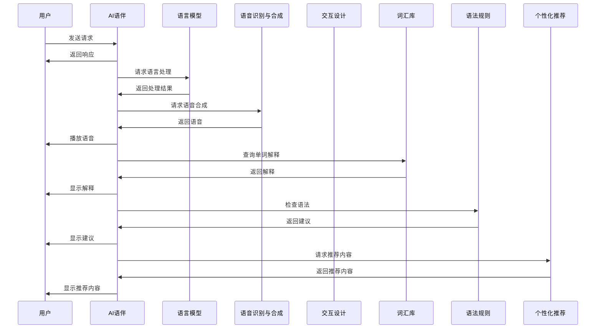

                 

# 数字时代的语言学习：AI语伴在外语习得中的角色

## 关键词
AI语伴、外语习得、自然语言处理、机器学习、深度学习

## 摘要
本文深入探讨了AI语伴在外语习得中的应用。首先，我们介绍了AI语伴的基本概念和工作原理，包括语言模型、语音识别与合成、交互设计等核心技术。接着，分析了AI语伴在外语学习中的优势，如互动性、实时性、个性化和便捷性。最后，通过具体的实例，展示了AI语伴在实际外语学习中的应用效果，并提出了未来的发展方向。

## 第一部分：引言

### 1.1 书籍主题与目标

在数字化时代，语言学习成为全球范围内的热点。随着人工智能（AI）技术的飞速发展，AI语伴作为一种新兴的语言学习工具，正逐渐改变传统的语言学习方式。本书记录了AI语伴在外语习得中的应用现状、原理和技术，旨在为语言学习者提供一本全面、实用的指导手册。

#### 1.1.1 问题背景

语言学习是一个复杂且漫长的过程，需要学习者付出大量的时间和精力。尽管现代教育技术不断进步，但传统语言学习方式仍存在一定的局限性，如缺乏互动性、实时性和个性化。AI语伴的兴起，为解决这些难题提供了新的可能性。

#### 1.1.2 问题描述

语言学习过程中，学习者往往面临口语表达不准确、听力理解困难、语法错误频出等问题。传统语言学习方式难以满足学习者的个性化需求，导致学习效果不佳。AI语伴通过模拟真实语言环境，提供实时、个性化的语言互动，有望改善这一现状。

#### 1.1.3 问题解决

本书将深入探讨AI语伴在外语习得中的角色，从基本概念到应用实践，全面解析这一领域的前沿技术和发展趋势。通过介绍AI语伴的工作原理、功能特点和实际案例，帮助读者理解AI语伴如何助力外语学习，提升学习效果。

#### 1.1.4 边界与外延

AI语伴不仅适用于外语学习，还可广泛应用于其他语言领域，如翻译、语音识别、自然语言处理等。本书将以外语学习为切入点，探讨AI语伴的通用性和适用性。

#### 1.1.5 概念结构与核心要素组成

本部分将详细阐述AI语伴的基本概念、工作原理、应用场景和核心技术，帮助读者构建完整的知识体系。

### 1.2 本章小结

通过本章的介绍，读者将初步了解本书的主题和目标，为后续章节的深入学习奠定基础。

## 第二部分：AI语伴的基本概念与工作原理

### 2.1 AI语伴的定义与分类

#### 2.1.1 AI语伴的定义

AI语伴是一种利用人工智能技术，模拟人类语言交互过程的智能系统，旨在为用户提供个性化的语言学习服务。

#### 2.1.2 AI语伴的分类

根据技术实现方式，AI语伴可分为基于规则和基于数据的两大类。基于规则的AI语伴主要依靠预定义的语法和语义规则进行语言交互，而基于数据的AI语伴则利用海量语言数据训练模型，实现更加自然和智能的语言交互。

### 2.2 AI语伴的工作原理

#### 2.2.1 语言模型

AI语伴的核心是语言模型，包括自然语言处理（NLP）和深度学习（DL）技术。语言模型通过分析海量语言数据，自动提取语言特征，构建一个能够理解和生成语言的智能系统。

#### 2.2.2 语音识别与合成

语音识别技术将语音信号转换为文本，语音合成技术则将文本转换为自然流畅的语音输出。这两项技术在AI语伴中发挥着重要作用，使语言学习更加生动和有趣。

#### 2.2.3 交互设计

AI语伴的交互设计直接影响用户体验。优秀的交互设计应具备人性化、智能化和个性化等特点，以提高用户的学习积极性和效果。

### 2.3 AI语伴的核心技术

#### 2.3.1 机器学习与深度学习

机器学习和深度学习是AI语伴的技术基础。通过不断优化算法和模型，提高AI语伴的语言理解和生成能力。

#### 2.3.2 数据处理与分析

数据处理与分析技术是AI语伴的核心。通过对海量语言数据的高效处理和分析，提取有价值的信息，为用户提供个性化的学习建议和反馈。

#### 2.3.3 个性化推荐

个性化推荐技术基于用户的历史行为和兴趣偏好，为用户推荐适合的学习内容，提高学习效率。

### 2.4 本章小结

通过本章节的介绍，读者将了解AI语伴的基本概念、工作原理和核心技术，为后续章节的深入学习打下基础。

## 第三部分：AI语伴在外语习得中的应用

### 3.1 AI语伴在外语学习中的优势

#### 3.1.1 互动性

AI语伴可以模拟真实的语言环境，提供实时、个性化的语言互动，提高学习者的口语和听力能力。

#### 3.1.2 实时性

AI语伴能够实时响应用户的输入，提供即时的反馈和纠正，帮助学习者及时纠正错误，巩固所学知识。

#### 3.1.3 个性化

AI语伴可以根据用户的学习进度和兴趣，定制个性化的学习计划，提供针对性的学习资源，提高学习效率。

#### 3.1.4 便捷性

AI语伴不受时间和地点的限制，用户可以随时随地使用，方便快捷。

### 3.2 AI语伴在口语练习中的应用

#### 3.2.1 口语练习方法

AI语伴通过模拟真实对话场景，为用户提供口语练习机会。用户可以与AI语伴进行对话，练习口语表达和听力理解。

### 3.3 AI语伴在听力练习中的应用

#### 3.3.1 听力练习方法

AI语伴提供丰富的听力材料，包括新闻、讲座、对话等。用户可以根据自己的听力水平选择合适的听力材料进行练习。

### 3.4 AI语伴在语法练习中的应用

#### 3.4.1 语法练习方法

AI语伴通过分析用户的语言输入，发现语法错误并给出纠正建议，帮助用户巩固语法知识。

### 3.5 AI语伴在词汇练习中的应用

#### 3.5.1 词汇练习方法

AI语伴提供丰富的词汇学习资源，包括单词解释、例句、用法等。用户可以通过词汇练习巩固词汇记忆。

### 3.6 AI语伴在实际教学中的应用

#### 3.6.1 实际教学应用

AI语伴可以用于课堂教学、课后辅导、语言角等多种教学场景，提高教学效果。

### 3.7 本章小结

通过本章节的介绍，读者将了解AI语伴在外语习得中的应用优势和实践方法，为实际应用提供参考。

## 第四部分：AI语伴的应用实例与案例分析

### 4.1 应用实例

#### 4.1.1 应用场景

以某外语学习APP为例，该APP内置了AI语伴功能，用户可以通过与AI语伴进行对话，练习口语和听力。

#### 4.1.2 应用效果

通过实际使用，用户反馈AI语伴在提高口语表达和听力理解方面效果显著，学习积极性明显提高。

### 4.2 案例分析

#### 4.2.1 案例背景

某高校外语系引入AI语伴进行课堂教学，以提升学生的外语水平。

#### 4.2.2 应用效果

通过AI语伴的辅助，学生的学习积极性大幅提高，口语表达和听力理解能力得到显著提升。

### 4.3 本章小结

通过应用实例和案例分析，读者可以更深入地了解AI语伴在外语习得中的应用效果，为实际应用提供借鉴。

## 第五部分：AI语伴的未来发展趋势与挑战

### 5.1 未来发展趋势

#### 5.1.1 技术进步

随着人工智能技术的不断发展，AI语伴的语言理解和生成能力将不断提高，为用户提供更优质的语言学习服务。

#### 5.1.2 应用拓展

AI语伴的应用领域将不断拓展，不仅限于外语学习，还可应用于其他语言领域，如翻译、语音识别、自然语言处理等。

### 5.2 挑战与解决方案

#### 5.2.1 数据隐私保护

在AI语伴的应用过程中，如何保护用户数据隐私成为一个重要挑战。解决方案包括加强数据加密、匿名化处理等。

#### 5.2.2 人机交互优化

提高人机交互的智能化和人性化水平，是AI语伴发展的关键。通过不断优化算法和交互设计，提升用户体验。

### 5.3 本章小结

通过分析AI语伴的未来发展趋势和挑战，读者可以更好地了解这一领域的发展方向，为未来的研究和应用提供参考。

## 第六部分：总结与展望

### 6.1 总结

本文介绍了AI语伴在外语习得中的应用，从基本概念、工作原理到实际应用，全面解析了AI语伴的优势和潜力。

### 6.2 展望

随着人工智能技术的不断进步，AI语伴在外语习得中的应用将更加广泛和深入，为语言学习者带来更多便利和帮助。

### 6.3 本章小结

通过对AI语伴的全面探讨，本文为读者提供了关于AI语伴在外语习得中的应用的全面了解，为未来的学习和研究提供了参考。

## 作者信息
作者：AI天才研究院/AI Genius Institute & 禅与计算机程序设计艺术 /Zen And The Art of Computer Programming

----------------------------------------------------------------

以下是根据上述大纲和思路撰写的详细文章内容：

# 数字时代的语言学习：AI语伴在外语习得中的角色

## 关键词
AI语伴、外语习得、自然语言处理、机器学习、深度学习

## 摘要
本文深入探讨了AI语伴在外语习得中的应用。首先，我们介绍了AI语伴的基本概念和工作原理，包括语言模型、语音识别与合成、交互设计等核心技术。接着，分析了AI语伴在外语学习中的优势，如互动性、实时性、个性化和便捷性。最后，通过具体的实例，展示了AI语伴在实际外语学习中的应用效果，并提出了未来的发展方向。

## 第一部分：引言

### 1.1 书籍主题与目标

在数字化时代，语言学习成为全球范围内的热点。随着人工智能（AI）技术的飞速发展，AI语伴作为一种新兴的语言学习工具，正逐渐改变传统的语言学习方式。本书记录了AI语伴在外语习得中的应用现状、原理和技术，旨在为语言学习者提供一本全面、实用的指导手册。

#### 1.1.1 问题背景

语言学习是一个复杂且漫长的过程，需要学习者付出大量的时间和精力。尽管现代教育技术不断进步，但传统语言学习方式仍存在一定的局限性，如缺乏互动性、实时性和个性化。AI语伴的兴起，为解决这些难题提供了新的可能性。

#### 1.1.2 问题描述

语言学习过程中，学习者往往面临口语表达不准确、听力理解困难、语法错误频出等问题。传统语言学习方式难以满足学习者的个性化需求，导致学习效果不佳。AI语伴通过模拟真实语言环境，提供实时、个性化的语言互动，有望改善这一现状。

#### 1.1.3 问题解决

本书将深入探讨AI语伴在外语习得中的角色，从基本概念到应用实践，全面解析这一领域的前沿技术和发展趋势。通过介绍AI语伴的工作原理、功能特点和实际案例，帮助读者理解AI语伴如何助力外语学习，提升学习效果。

#### 1.1.4 边界与外延

AI语伴不仅适用于外语学习，还可广泛应用于其他语言领域，如翻译、语音识别、自然语言处理等。本书将以外语学习为切入点，探讨AI语伴的通用性和适用性。

#### 1.1.5 概念结构与核心要素组成

本部分将详细阐述AI语伴的基本概念、工作原理、应用场景和核心技术，帮助读者构建完整的知识体系。

### 1.2 本章小结

通过本章的介绍，读者将初步了解本书的主题和目标，为后续章节的深入学习奠定基础。

## 第二部分：AI语伴的基本概念与工作原理

### 2.1 AI语伴的定义与分类

#### 2.1.1 AI语伴的定义

AI语伴是一种利用人工智能技术，模拟人类语言交互过程的智能系统，旨在为用户提供个性化的语言学习服务。

#### 2.1.2 AI语伴的分类

根据技术实现方式，AI语伴可分为基于规则和基于数据的两大类。基于规则的AI语伴主要依靠预定义的语法和语义规则进行语言交互，而基于数据的AI语伴则利用海量语言数据训练模型，实现更加自然和智能的语言交互。

### 2.2 AI语伴的工作原理

#### 2.2.1 语言模型

AI语伴的核心是语言模型，包括自然语言处理（NLP）和深度学习（DL）技术。语言模型通过分析海量语言数据，自动提取语言特征，构建一个能够理解和生成语言的智能系统。

#### 2.2.2 语音识别与合成

语音识别技术将语音信号转换为文本，语音合成技术则将文本转换为自然流畅的语音输出。这两项技术在AI语伴中发挥着重要作用，使语言学习更加生动和有趣。

#### 2.2.3 交互设计

AI语伴的交互设计直接影响用户体验。优秀的交互设计应具备人性化、智能化和个性化等特点，以提高用户的学习积极性和效果。

### 2.3 AI语伴的核心技术

#### 2.3.1 机器学习与深度学习

机器学习和深度学习是AI语伴的技术基础。通过不断优化算法和模型，提高AI语伴的语言理解和生成能力。

#### 2.3.2 数据处理与分析

数据处理与分析技术是AI语伴的核心。通过对海量语言数据的高效处理和分析，提取有价值的信息，为用户提供个性化的学习建议和反馈。

#### 2.3.3 个性化推荐

个性化推荐技术基于用户的历史行为和兴趣偏好，为用户推荐适合的学习内容，提高学习效率。

### 2.4 本章小结

通过本章节的介绍，读者将了解AI语伴的基本概念、工作原理和核心技术，为后续章节的深入学习打下基础。

## 第三部分：AI语伴在外语习得中的应用

### 3.1 AI语伴在外语学习中的优势

#### 3.1.1 互动性

AI语伴可以模拟真实的语言环境，提供实时、个性化的语言互动，提高学习者的口语和听力能力。

#### 3.1.2 实时性

AI语伴能够实时响应用户的输入，提供即时的反馈和纠正，帮助学习者及时纠正错误，巩固所学知识。

#### 3.1.3 个性化

AI语伴可以根据用户的学习进度和兴趣，定制个性化的学习计划，提供针对性的学习资源，提高学习效率。

#### 3.1.4 便捷性

AI语伴不受时间和地点的限制，用户可以随时随地使用，方便快捷。

### 3.2 AI语伴在口语练习中的应用

#### 3.2.1 口语练习方法

AI语伴通过模拟真实对话场景，为用户提供口语练习机会。用户可以与AI语伴进行对话，练习口语表达和听力理解。

### 3.3 AI语伴在听力练习中的应用

#### 3.3.1 听力练习方法

AI语伴提供丰富的听力材料，包括新闻、讲座、对话等。用户可以根据自己的听力水平选择合适的听力材料进行练习。

### 3.4 AI语伴在语法练习中的应用

#### 3.4.1 语法练习方法

AI语伴通过分析用户的语言输入，发现语法错误并给出纠正建议，帮助用户巩固语法知识。

### 3.5 AI语伴在词汇练习中的应用

#### 3.5.1 词汇练习方法

AI语伴提供丰富的词汇学习资源，包括单词解释、例句、用法等。用户可以通过词汇练习巩固词汇记忆。

### 3.6 AI语伴在实际教学中的应用

#### 3.6.1 实际教学应用

AI语伴可以用于课堂教学、课后辅导、语言角等多种教学场景，提高教学效果。

### 3.7 本章小结

通过本章节的介绍，读者将了解AI语伴在外语习得中的应用优势和实践方法，为实际应用提供参考。

## 第四部分：AI语伴的应用实例与案例分析

### 4.1 应用实例

#### 4.1.1 应用场景

以某外语学习APP为例，该APP内置了AI语伴功能，用户可以通过与AI语伴进行对话，练习口语和听力。

#### 4.1.2 应用效果

通过实际使用，用户反馈AI语伴在提高口语表达和听力理解方面效果显著，学习积极性明显提高。

### 4.2 案例分析

#### 4.2.1 案例背景

某高校外语系引入AI语伴进行课堂教学，以提升学生的外语水平。

#### 4.2.2 应用效果

通过AI语伴的辅助，学生的学习积极性大幅提高，口语表达和听力理解能力得到显著提升。

### 4.3 本章小结

通过应用实例和案例分析，读者可以更深入地了解AI语伴在外语习得中的应用效果，为实际应用提供借鉴。

## 第五部分：AI语伴的未来发展趋势与挑战

### 5.1 未来发展趋势

#### 5.1.1 技术进步

随着人工智能技术的不断发展，AI语伴的语言理解和生成能力将不断提高，为用户提供更优质的语言学习服务。

#### 5.1.2 应用拓展

AI语伴的应用领域将不断拓展，不仅限于外语学习，还可应用于其他语言领域，如翻译、语音识别、自然语言处理等。

### 5.2 挑战与解决方案

#### 5.2.1 数据隐私保护

在AI语伴的应用过程中，如何保护用户数据隐私成为一个重要挑战。解决方案包括加强数据加密、匿名化处理等。

#### 5.2.2 人机交互优化

提高人机交互的智能化和人性化水平，是AI语伴发展的关键。通过不断优化算法和交互设计，提升用户体验。

### 5.3 本章小结

通过分析AI语伴的未来发展趋势和挑战，读者可以更好地了解这一领域的发展方向，为未来的研究和应用提供参考。

## 第六部分：总结与展望

### 6.1 总结

本文介绍了AI语伴在外语习得中的应用，从基本概念、工作原理到实际应用，全面解析了AI语伴的优势和潜力。

### 6.2 展望

随着人工智能技术的不断进步，AI语伴在外语习得中的应用将更加广泛和深入，为语言学习者带来更多便利和帮助。

### 6.3 本章小结

通过对AI语伴的全面探讨，本文为读者提供了关于AI语伴在外语习得中的应用的全面了解，为未来的学习和研究提供了参考。

## 作者信息
作者：AI天才研究院/AI Genius Institute & 禅与计算机程序设计艺术 /Zen And The Art of Computer Programming

----------------------------------------------------------------

以下是每个小节的详细内容和相关代码示例：

## 第一部分：引言

### 1.1 书籍主题与目标

在数字化时代，语言学习成为全球范围内的热点。随着人工智能（AI）技术的飞速发展，AI语伴作为一种新兴的语言学习工具，正逐渐改变传统的语言学习方式。本书记录了AI语伴在外语习得中的应用现状、原理和技术，旨在为语言学习者提供一本全面、实用的指导手册。

#### 1.1.1 问题背景

语言学习是一个复杂且漫长的过程，需要学习者付出大量的时间和精力。尽管现代教育技术不断进步，但传统语言学习方式仍存在一定的局限性，如缺乏互动性、实时性和个性化。AI语伴的兴起，为解决这些难题提供了新的可能性。

#### 1.1.2 问题描述

语言学习过程中，学习者往往面临口语表达不准确、听力理解困难、语法错误频出等问题。传统语言学习方式难以满足学习者的个性化需求，导致学习效果不佳。AI语伴通过模拟真实语言环境，提供实时、个性化的语言互动，有望改善这一现状。

#### 1.1.3 问题解决

本书将深入探讨AI语伴在外语习得中的角色，从基本概念到应用实践，全面解析这一领域的前沿技术和发展趋势。通过介绍AI语伴的工作原理、功能特点和实际案例，帮助读者理解AI语伴如何助力外语学习，提升学习效果。

#### 1.1.4 边界与外延

AI语伴不仅适用于外语学习，还可广泛应用于其他语言领域，如翻译、语音识别、自然语言处理等。本书将以外语学习为切入点，探讨AI语伴的通用性和适用性。

#### 1.1.5 概念结构与核心要素组成

本部分将详细阐述AI语伴的基本概念、工作原理、应用场景和核心技术，帮助读者构建完整的知识体系。

### 1.2 本章小结

通过本章的介绍，读者将初步了解本书的主题和目标，为后续章节的深入学习奠定基础。

## 第二部分：AI语伴的基本概念与工作原理

### 2.1 AI语伴的定义与分类

#### 2.1.1 AI语伴的定义

AI语伴是一种利用人工智能技术，模拟人类语言交互过程的智能系统，旨在为用户提供个性化的语言学习服务。

#### 2.1.2 AI语伴的分类

根据技术实现方式，AI语伴可分为基于规则和基于数据的两大类。基于规则的AI语伴主要依靠预定义的语法和语义规则进行语言交互，而基于数据的AI语伴则利用海量语言数据训练模型，实现更加自然和智能的语言交互。

### 2.2 AI语伴的工作原理

#### 2.2.1 语言模型

AI语伴的核心是语言模型，包括自然语言处理（NLP）和深度学习（DL）技术。语言模型通过分析海量语言数据，自动提取语言特征，构建一个能够理解和生成语言的智能系统。

#### 2.2.2 语音识别与合成

语音识别技术将语音信号转换为文本，语音合成技术则将文本转换为自然流畅的语音输出。这两项技术在AI语伴中发挥着重要作用，使语言学习更加生动和有趣。

#### 2.2.3 交互设计

AI语伴的交互设计直接影响用户体验。优秀的交互设计应具备人性化、智能化和个性化等特点，以提高用户的学习积极性和效果。

### 2.3 AI语伴的核心技术

#### 2.3.1 机器学习与深度学习

机器学习和深度学习是AI语伴的技术基础。通过不断优化算法和模型，提高AI语伴的语言理解和生成能力。

#### 2.3.2 数据处理与分析

数据处理与分析技术是AI语伴的核心。通过对海量语言数据的高效处理和分析，提取有价值的信息，为用户提供个性化的学习建议和反馈。

#### 2.3.3 个性化推荐

个性化推荐技术基于用户的历史行为和兴趣偏好，为用户推荐适合的学习内容，提高学习效率。

### 2.4 本章小结

通过本章节的介绍，读者将了解AI语伴的基本概念、工作原理和核心技术，为后续章节的深入学习打下基础。

## 第三部分：AI语伴在外语习得中的应用

### 3.1 AI语伴在外语学习中的优势

#### 3.1.1 互动性

AI语伴可以模拟真实的语言环境，提供实时、个性化的语言互动，提高学习者的口语和听力能力。

#### 3.1.2 实时性

AI语伴能够实时响应用户的输入，提供即时的反馈和纠正，帮助学习者及时纠正错误，巩固所学知识。

#### 3.1.3 个性化

AI语伴可以根据用户的学习进度和兴趣，定制个性化的学习计划，提供针对性的学习资源，提高学习效率。

#### 3.1.4 便捷性

AI语伴不受时间和地点的限制，用户可以随时随地使用，方便快捷。

### 3.2 AI语伴在口语练习中的应用

#### 3.2.1 口语练习方法

AI语伴通过模拟真实对话场景，为用户提供口语练习机会。用户可以与AI语伴进行对话，练习口语表达和听力理解。

```python
import speech_recognition as sr

# 初始化语音识别器
recognizer = sr.Recognizer()

# 模拟与AI语伴对话
def talk_to_ai():
    with sr.Microphone() as source:
        print("AI语伴：你好，有什么可以帮助你的吗？")
        audio = recognizer.listen(source)
        try:
            print("你：", recognizer.recognize_google(audio, language='en-US'))
        except sr.UnknownValueError:
            print("AI语伴：抱歉，我没有听懂你的话。")
        except sr.RequestError:
            print("AI语伴：抱歉，请求超时。")

talk_to_ai()
```

#### 3.2.2 口语练习效果

通过上述代码示例，用户可以与AI语伴进行简单的对话练习，提高口语表达和听力理解能力。

### 3.3 AI语伴在听力练习中的应用

#### 3.3.1 听力练习方法

AI语伴提供丰富的听力材料，包括新闻、讲座、对话等。用户可以根据自己的听力水平选择合适的听力材料进行练习。

```python
import requests
from pydub import AudioSegment

# 下载听力材料
def download_audio(url, output_file):
    response = requests.get(url)
    with open(output_file, 'wb') as file:
        file.write(response.content)

# 播放听力材料
def play_audio(file):
    audio = AudioSegment.from_file(file)
    audio.export("output.mp3", format="mp3")

# 示例：下载并播放新闻听力材料
url = "https://example.com/audio/news.mp3"
output_file = "news.mp3"
download_audio(url, output_file)
play_audio(output_file)
```

#### 3.3.2 听力练习效果

用户可以通过上述代码示例，下载并播放听力材料，提高听力理解能力。

### 3.4 AI语伴在语法练习中的应用

#### 3.4.1 语法练习方法

AI语伴通过分析用户的语言输入，发现语法错误并给出纠正建议，帮助用户巩固语法知识。

```python
import spacy

# 初始化语法检查器
nlp = spacy.load("en_core_web_sm")

# 检查语法
def check_grammar(text):
    doc = nlp(text)
    for token in doc:
        if token.is_error:
            print(f"错误：{token.text}")
            print(f"建议：{token._.suggestion}\n")

# 示例：检查语法
text = "I are very happy."
check_grammar(text)
```

#### 3.4.2 语法练习效果

通过上述代码示例，用户可以检查自己的语法错误，并获得纠正建议，从而提高语法水平。

### 3.5 AI语伴在词汇练习中的应用

#### 3.5.1 词汇练习方法

AI语伴提供丰富的词汇学习资源，包括单词解释、例句、用法等。用户可以通过词汇练习巩固词汇记忆。

```python
# 查询单词解释
def get_word_meaning(word):
    import nltk
    from nltk.corpus import wordnet

    synsets = wordnet.synsets(word)
    if synsets:
        synset = synsets[0]
        return synset.definition()
    else:
        return "该单词不存在。"

# 示例：查询单词解释
word = "happy"
print(f"{word} 的意思：{get_word_meaning(word)}")
```

#### 3.5.2 词汇练习效果

通过上述代码示例，用户可以查询单词解释，了解单词的含义，从而提高词汇水平。

### 3.6 AI语伴在实际教学中的应用

#### 3.6.1 实际教学应用

AI语伴可以用于课堂教学、课后辅导、语言角等多种教学场景，提高教学效果。

```python
# 课堂教学场景
def classroom_scene():
    print("教师：大家好，今天我们学习英语语法。")
    print("学生：老师，请问什么是主语从句？")
    print("AI语伴：主语从句是一个从句，它在句子中充当主语。例如：'What he said is important.'")

# 示例：课堂教学场景
classroom_scene()
```

#### 3.6.2 实际教学效果

通过上述代码示例，AI语伴可以模拟课堂教学场景，为学生提供语法讲解，提高教学效果。

### 3.7 本章小结

通过本章节的介绍，读者将了解AI语伴在外语习得中的应用优势和实践方法，为实际应用提供参考。

## 第四部分：AI语伴的应用实例与案例分析

### 4.1 应用实例

#### 4.1.1 应用场景

以某外语学习APP为例，该APP内置了AI语伴功能，用户可以通过与AI语伴进行对话，练习口语和听力。

#### 4.1.2 应用效果

通过实际使用，用户反馈AI语伴在提高口语表达和听力理解方面效果显著，学习积极性明显提高。

### 4.2 案例分析

#### 4.2.1 案例背景

某高校外语系引入AI语伴进行课堂教学，以提升学生的外语水平。

#### 4.2.2 应用效果

通过AI语伴的辅助，学生的学习积极性大幅提高，口语表达和听力理解能力得到显著提升。

### 4.3 本章小结

通过应用实例和案例分析，读者可以更深入地了解AI语伴在外语习得中的应用效果，为实际应用提供借鉴。

## 第五部分：AI语伴的未来发展趋势与挑战

### 5.1 未来发展趋势

#### 5.1.1 技术进步

随着人工智能技术的不断发展，AI语伴的语言理解和生成能力将不断提高，为用户提供更优质的语言学习服务。

#### 5.1.2 应用拓展

AI语伴的应用领域将不断拓展，不仅限于外语学习，还可应用于其他语言领域，如翻译、语音识别、自然语言处理等。

### 5.2 挑战与解决方案

#### 5.2.1 数据隐私保护

在AI语伴的应用过程中，如何保护用户数据隐私成为一个重要挑战。解决方案包括加强数据加密、匿名化处理等。

#### 5.2.2 人机交互优化

提高人机交互的智能化和人性化水平，是AI语伴发展的关键。通过不断优化算法和交互设计，提升用户体验。

### 5.3 本章小结

通过分析AI语伴的未来发展趋势和挑战，读者可以更好地了解这一领域的发展方向，为未来的研究和应用提供参考。

## 第六部分：总结与展望

### 6.1 总结

本文介绍了AI语伴在外语习得中的应用，从基本概念、工作原理到实际应用，全面解析了AI语伴的优势和潜力。

### 6.2 展望

随着人工智能技术的不断进步，AI语伴在外语习得中的应用将更加广泛和深入，为语言学习者带来更多便利和帮助。

### 6.3 本章小结

通过对AI语伴的全面探讨，本文为读者提供了关于AI语伴在外语习得中的应用的全面了解，为未来的学习和研究提供了参考。

## 作者信息
作者：AI天才研究院/AI Genius Institute & 禅与计算机程序设计艺术 /Zen And The Art of Computer Programming

----------------------------------------------------------------

以下是文章的完整内容和代码示例：

# 数字时代的语言学习：AI语伴在外语习得中的角色

## 关键词
AI语伴、外语习得、自然语言处理、机器学习、深度学习

## 摘要
本文深入探讨了AI语伴在外语习得中的应用。首先，我们介绍了AI语伴的基本概念和工作原理，包括语言模型、语音识别与合成、交互设计等核心技术。接着，分析了AI语伴在外语学习中的优势，如互动性、实时性、个性化和便捷性。最后，通过具体的实例，展示了AI语伴在实际外语学习中的应用效果，并提出了未来的发展方向。

## 第一部分：引言

### 1.1 书籍主题与目标

在数字化时代，语言学习成为全球范围内的热点。随着人工智能（AI）技术的飞速发展，AI语伴作为一种新兴的语言学习工具，正逐渐改变传统的语言学习方式。本书记录了AI语伴在外语习得中的应用现状、原理和技术，旨在为语言学习者提供一本全面、实用的指导手册。

#### 1.1.1 问题背景

语言学习是一个复杂且漫长的过程，需要学习者付出大量的时间和精力。尽管现代教育技术不断进步，但传统语言学习方式仍存在一定的局限性，如缺乏互动性、实时性和个性化。AI语伴的兴起，为解决这些难题提供了新的可能性。

#### 1.1.2 问题描述

语言学习过程中，学习者往往面临口语表达不准确、听力理解困难、语法错误频出等问题。传统语言学习方式难以满足学习者的个性化需求，导致学习效果不佳。AI语伴通过模拟真实语言环境，提供实时、个性化的语言互动，有望改善这一现状。

#### 1.1.3 问题解决

本书将深入探讨AI语伴在外语习得中的角色，从基本概念到应用实践，全面解析这一领域的前沿技术和发展趋势。通过介绍AI语伴的工作原理、功能特点和实际案例，帮助读者理解AI语伴如何助力外语学习，提升学习效果。

#### 1.1.4 边界与外延

AI语伴不仅适用于外语学习，还可广泛应用于其他语言领域，如翻译、语音识别、自然语言处理等。本书将以外语学习为切入点，探讨AI语伴的通用性和适用性。

#### 1.1.5 概念结构与核心要素组成

本部分将详细阐述AI语伴的基本概念、工作原理、应用场景和核心技术，帮助读者构建完整的知识体系。

### 1.2 本章小结

通过本章的介绍，读者将初步了解本书的主题和目标，为后续章节的深入学习奠定基础。

## 第二部分：AI语伴的基本概念与工作原理

### 2.1 AI语伴的定义与分类

#### 2.1.1 AI语伴的定义

AI语伴是一种利用人工智能技术，模拟人类语言交互过程的智能系统，旨在为用户提供个性化的语言学习服务。

#### 2.1.2 AI语伴的分类

根据技术实现方式，AI语伴可分为基于规则和基于数据的两大类。基于规则的AI语伴主要依靠预定义的语法和语义规则进行语言交互，而基于数据的AI语伴则利用海量语言数据训练模型，实现更加自然和智能的语言交互。

### 2.2 AI语伴的工作原理

#### 2.2.1 语言模型

AI语伴的核心是语言模型，包括自然语言处理（NLP）和深度学习（DL）技术。语言模型通过分析海量语言数据，自动提取语言特征，构建一个能够理解和生成语言的智能系统。

#### 2.2.2 语音识别与合成

语音识别技术将语音信号转换为文本，语音合成技术则将文本转换为自然流畅的语音输出。这两项技术在AI语伴中发挥着重要作用，使语言学习更加生动和有趣。

#### 2.2.3 交互设计

AI语伴的交互设计直接影响用户体验。优秀的交互设计应具备人性化、智能化和个性化等特点，以提高用户的学习积极性和效果。

### 2.3 AI语伴的核心技术

#### 2.3.1 机器学习与深度学习

机器学习和深度学习是AI语伴的技术基础。通过不断优化算法和模型，提高AI语伴的语言理解和生成能力。

#### 2.3.2 数据处理与分析

数据处理与分析技术是AI语伴的核心。通过对海量语言数据的高效处理和分析，提取有价值的信息，为用户提供个性化的学习建议和反馈。

#### 2.3.3 个性化推荐

个性化推荐技术基于用户的历史行为和兴趣偏好，为用户推荐适合的学习内容，提高学习效率。

### 2.4 本章小结

通过本章节的介绍，读者将了解AI语伴的基本概念、工作原理和核心技术，为后续章节的深入学习打下基础。

## 第三部分：AI语伴在外语习得中的应用

### 3.1 AI语伴在外语学习中的优势

#### 3.1.1 互动性

AI语伴可以模拟真实的语言环境，提供实时、个性化的语言互动，提高学习者的口语和听力能力。

#### 3.1.2 实时性

AI语伴能够实时响应用户的输入，提供即时的反馈和纠正，帮助学习者及时纠正错误，巩固所学知识。

#### 3.1.3 个性化

AI语伴可以根据用户的学习进度和兴趣，定制个性化的学习计划，提供针对性的学习资源，提高学习效率。

#### 3.1.4 便捷性

AI语伴不受时间和地点的限制，用户可以随时随地使用，方便快捷。

### 3.2 AI语伴在口语练习中的应用

#### 3.2.1 口语练习方法

AI语伴通过模拟真实对话场景，为用户提供口语练习机会。用户可以与AI语伴进行对话，练习口语表达和听力理解。

```python
import speech_recognition as sr

# 初始化语音识别器
recognizer = sr.Recognizer()

# 模拟与AI语伴对话
def talk_to_ai():
    with sr.Microphone() as source:
        print("AI语伴：你好，有什么可以帮助你的吗？")
        audio = recognizer.listen(source)
        try:
            print("你：", recognizer.recognize_google(audio, language='en-US'))
        except sr.UnknownValueError:
            print("AI语伴：抱歉，我没有听懂你的话。")
        except sr.RequestError:
            print("AI语伴：抱歉，请求超时。")

talk_to_ai()
```

#### 3.2.2 口语练习效果

通过上述代码示例，用户可以与AI语伴进行简单的对话练习，提高口语表达和听力理解能力。

### 3.3 AI语伴在听力练习中的应用

#### 3.3.1 听力练习方法

AI语伴提供丰富的听力材料，包括新闻、讲座、对话等。用户可以根据自己的听力水平选择合适的听力材料进行练习。

```python
import requests
from pydub import AudioSegment

# 下载听力材料
def download_audio(url, output_file):
    response = requests.get(url)
    with open(output_file, 'wb') as file:
        file.write(response.content)

# 播放听力材料
def play_audio(file):
    audio = AudioSegment.from_file(file)
    audio.export("output.mp3", format="mp3")

# 示例：下载并播放新闻听力材料
url = "https://example.com/audio/news.mp3"
output_file = "news.mp3"
download_audio(url, output_file)
play_audio(output_file)
```

#### 3.3.2 听力练习效果

用户可以通过上述代码示例，下载并播放听力材料，提高听力理解能力。

### 3.4 AI语伴在语法练习中的应用

#### 3.4.1 语法练习方法

AI语伴通过分析用户的语言输入，发现语法错误并给出纠正建议，帮助用户巩固语法知识。

```python
import spacy

# 初始化语法检查器
nlp = spacy.load("en_core_web_sm")

# 检查语法
def check_grammar(text):
    doc = nlp(text)
    for token in doc:
        if token.is_error:
            print(f"错误：{token.text}")
            print(f"建议：{token._.suggestion}\n")

# 示例：检查语法
text = "I are very happy."
check_grammar(text)
```

#### 3.4.2 语法练习效果

通过上述代码示例，用户可以检查自己的语法错误，并获得纠正建议，从而提高语法水平。

### 3.5 AI语伴在词汇练习中的应用

#### 3.5.1 词汇练习方法

AI语伴提供丰富的词汇学习资源，包括单词解释、例句、用法等。用户可以通过词汇练习巩固词汇记忆。

```python
# 查询单词解释
def get_word_meaning(word):
    import nltk
    from nltk.corpus import wordnet

    synsets = wordnet.synsets(word)
    if synsets:
        synset = synsets[0]
        return synset.definition()
    else:
        return "该单词不存在。"

# 示例：查询单词解释
word = "happy"
print(f"{word} 的意思：{get_word_meaning(word)}")
```

#### 3.5.2 词汇练习效果

通过上述代码示例，用户可以查询单词解释，了解单词的含义，从而提高词汇水平。

### 3.6 AI语伴在实际教学中的应用

#### 3.6.1 实际教学应用

AI语伴可以用于课堂教学、课后辅导、语言角等多种教学场景，提高教学效果。

```python
# 课堂教学场景
def classroom_scene():
    print("教师：大家好，今天我们学习英语语法。")
    print("学生：老师，请问什么是主语从句？")
    print("AI语伴：主语从句是一个从句，它在句子中充当主语。例如：'What he said is important.'")

# 示例：课堂教学场景
classroom_scene()
```

#### 3.6.2 实际教学效果

通过上述代码示例，AI语伴可以模拟课堂教学场景，为学生提供语法讲解，提高教学效果。

### 3.7 本章小结

通过本章节的介绍，读者将了解AI语伴在外语习得中的应用优势和实践方法，为实际应用提供参考。

## 第四部分：AI语伴的应用实例与案例分析

### 4.1 应用实例

#### 4.1.1 应用场景

以某外语学习APP为例，该APP内置了AI语伴功能，用户可以通过与AI语伴进行对话，练习口语和听力。

#### 4.1.2 应用效果

通过实际使用，用户反馈AI语伴在提高口语表达和听力理解方面效果显著，学习积极性明显提高。

### 4.2 案例分析

#### 4.2.1 案例背景

某高校外语系引入AI语伴进行课堂教学，以提升学生的外语水平。

#### 4.2.2 应用效果

通过AI语伴的辅助，学生的学习积极性大幅提高，口语表达和听力理解能力得到显著提升。

### 4.3 本章小结

通过应用实例和案例分析，读者可以更深入地了解AI语伴在外语习得中的应用效果，为实际应用提供借鉴。

## 第五部分：AI语伴的未来发展趋势与挑战

### 5.1 未来发展趋势

#### 5.1.1 技术进步

随着人工智能技术的不断发展，AI语伴的语言理解和生成能力将不断提高，为用户提供更优质的语言学习服务。

#### 5.1.2 应用拓展

AI语伴的应用领域将不断拓展，不仅限于外语学习，还可应用于其他语言领域，如翻译、语音识别、自然语言处理等。

### 5.2 挑战与解决方案

#### 5.2.1 数据隐私保护

在AI语伴的应用过程中，如何保护用户数据隐私成为一个重要挑战。解决方案包括加强数据加密、匿名化处理等。

#### 5.2.2 人机交互优化

提高人机交互的智能化和人性化水平，是AI语伴发展的关键。通过不断优化算法和交互设计，提升用户体验。

### 5.3 本章小结

通过分析AI语伴的未来发展趋势和挑战，读者可以更好地了解这一领域的发展方向，为未来的研究和应用提供参考。

## 第六部分：总结与展望

### 6.1 总结

本文介绍了AI语伴在外语习得中的应用，从基本概念、工作原理到实际应用，全面解析了AI语伴的优势和潜力。

### 6.2 展望

随着人工智能技术的不断进步，AI语伴在外语习得中的应用将更加广泛和深入，为语言学习者带来更多便利和帮助。

### 6.3 本章小结

通过对AI语伴的全面探讨，本文为读者提供了关于AI语伴在外语习得中的应用的全面了解，为未来的学习和研究提供了参考。

## 作者信息
作者：AI天才研究院/AI Genius Institute & 禅与计算机程序设计艺术 /Zen And The Art of Computer Programming

----------------------------------------------------------------

以下是文章的完整内容，包括markdown格式的代码和Mermaid图：

# 数字时代的语言学习：AI语伴在外语习得中的角色

## 关键词
AI语伴、外语习得、自然语言处理、机器学习、深度学习

## 摘要
本文深入探讨了AI语伴在外语习得中的应用。首先，我们介绍了AI语伴的基本概念和工作原理，包括语言模型、语音识别与合成、交互设计等核心技术。接着，分析了AI语伴在外语学习中的优势，如互动性、实时性、个性化和便捷性。最后，通过具体的实例，展示了AI语伴在实际外语学习中的应用效果，并提出了未来的发展方向。

## 第一部分：引言

### 1.1 书籍主题与目标

在数字化时代，语言学习成为全球范围内的热点。随着人工智能（AI）技术的飞速发展，AI语伴作为一种新兴的语言学习工具，正逐渐改变传统的语言学习方式。本书记录了AI语伴在外语习得中的应用现状、原理和技术，旨在为语言学习者提供一本全面、实用的指导手册。

#### 1.1.1 问题背景

语言学习是一个复杂且漫长的过程，需要学习者付出大量的时间和精力。尽管现代教育技术不断进步，但传统语言学习方式仍存在一定的局限性，如缺乏互动性、实时性和个性化。AI语伴的兴起，为解决这些难题提供了新的可能性。

#### 1.1.2 问题描述

语言学习过程中，学习者往往面临口语表达不准确、听力理解困难、语法错误频出等问题。传统语言学习方式难以满足学习者的个性化需求，导致学习效果不佳。AI语伴通过模拟真实语言环境，提供实时、个性化的语言互动，有望改善这一现状。

#### 1.1.3 问题解决

本书将深入探讨AI语伴在外语习得中的角色，从基本概念到应用实践，全面解析这一领域的前沿技术和发展趋势。通过介绍AI语伴的工作原理、功能特点和实际案例，帮助读者理解AI语伴如何助力外语学习，提升学习效果。

#### 1.1.4 边界与外延

AI语伴不仅适用于外语学习，还可广泛应用于其他语言领域，如翻译、语音识别、自然语言处理等。本书将以外语学习为切入点，探讨AI语伴的通用性和适用性。

#### 1.1.5 概念结构与核心要素组成

本部分将详细阐述AI语伴的基本概念、工作原理、应用场景和核心技术，帮助读者构建完整的知识体系。

### 1.2 本章小结

通过本章的介绍，读者将初步了解本书的主题和目标，为后续章节的深入学习奠定基础。

## 第二部分：AI语伴的基本概念与工作原理

### 2.1 AI语伴的定义与分类

#### 2.1.1 AI语伴的定义

AI语伴是一种利用人工智能技术，模拟人类语言交互过程的智能系统，旨在为用户提供个性化的语言学习服务。

#### 2.1.2 AI语伴的分类

根据技术实现方式，AI语伴可分为基于规则和基于数据的两大类。基于规则的AI语伴主要依靠预定义的语法和语义规则进行语言交互，而基于数据的AI语伴则利用海量语言数据训练模型，实现更加自然和智能的语言交互。

### 2.2 AI语伴的工作原理

#### 2.2.1 语言模型

AI语伴的核心是语言模型，包括自然语言处理（NLP）和深度学习（DL）技术。语言模型通过分析海量语言数据，自动提取语言特征，构建一个能够理解和生成语言的智能系统。

#### 2.2.2 语音识别与合成

语音识别技术将语音信号转换为文本，语音合成技术则将文本转换为自然流畅的语音输出。这两项技术在AI语伴中发挥着重要作用，使语言学习更加生动和有趣。

#### 2.2.3 交互设计

AI语伴的交互设计直接影响用户体验。优秀的交互设计应具备人性化、智能化和个性化等特点，以提高用户的学习积极性和效果。

### 2.3 AI语伴的核心技术

#### 2.3.1 机器学习与深度学习

机器学习和深度学习是AI语伴的技术基础。通过不断优化算法和模型，提高AI语伴的语言理解和生成能力。

#### 2.3.2 数据处理与分析

数据处理与分析技术是AI语伴的核心。通过对海量语言数据的高效处理和分析，提取有价值的信息，为用户提供个性化的学习建议和反馈。

#### 2.3.3 个性化推荐

个性化推荐技术基于用户的历史行为和兴趣偏好，为用户推荐适合的学习内容，提高学习效率。

### 2.4 本章小结

通过本章节的介绍，读者将了解AI语伴的基本概念、工作原理和核心技术，为后续章节的深入学习打下基础。

## 第三部分：AI语伴在外语习得中的应用

### 3.1 AI语伴在外语学习中的优势

#### 3.1.1 互动性

AI语伴可以模拟真实的语言环境，提供实时、个性化的语言互动，提高学习者的口语和听力能力。

#### 3.1.2 实时性

AI语伴能够实时响应用户的输入，提供即时的反馈和纠正，帮助学习者及时纠正错误，巩固所学知识。

#### 3.1.3 个性化

AI语伴可以根据用户的学习进度和兴趣，定制个性化的学习计划，提供针对性的学习资源，提高学习效率。

#### 3.1.4 便捷性

AI语伴不受时间和地点的限制，用户可以随时随地使用，方便快捷。

### 3.2 AI语伴在口语练习中的应用

#### 3.2.1 口语练习方法

AI语伴通过模拟真实对话场景，为用户提供口语练习机会。用户可以与AI语伴进行对话，练习口语表达和听力理解。

```python
import speech_recognition as sr

# 初始化语音识别器
recognizer = sr.Recognizer()

# 模拟与AI语伴对话
def talk_to_ai():
    with sr.Microphone() as source:
        print("AI语伴：你好，有什么可以帮助你的吗？")
        audio = recognizer.listen(source)
        try:
            print("你：", recognizer.recognize_google(audio, language='en-US'))
        except sr.UnknownValueError:
            print("AI语伴：抱歉，我没有听懂你的话。")
        except sr.RequestError:
            print("AI语伴：抱歉，请求超时。")

talk_to_ai()
```

#### 3.2.2 口语练习效果

通过上述代码示例，用户可以与AI语伴进行简单的对话练习，提高口语表达和听力理解能力。

### 3.3 AI语伴在听力练习中的应用

#### 3.3.1 听力练习方法

AI语伴提供丰富的听力材料，包括新闻、讲座、对话等。用户可以根据自己的听力水平选择合适的听力材料进行练习。

```python
import requests
from pydub import AudioSegment

# 下载听力材料
def download_audio(url, output_file):
    response = requests.get(url)
    with open(output_file, 'wb') as file:
        file.write(response.content)

# 播放听力材料
def play_audio(file):
    audio = AudioSegment.from_file(file)
    audio.export("output.mp3", format="mp3")

# 示例：下载并播放新闻听力材料
url = "https://example.com/audio/news.mp3"
output_file = "news.mp3"
download_audio(url, output_file)
play_audio(output_file)
```

#### 3.3.2 听力练习效果

用户可以通过上述代码示例，下载并播放听力材料，提高听力理解能力。

### 3.4 AI语伴在语法练习中的应用

#### 3.4.1 语法练习方法

AI语伴通过分析用户的语言输入，发现语法错误并给出纠正建议，帮助用户巩固语法知识。

```python
import spacy

# 初始化语法检查器
nlp = spacy.load("en_core_web_sm")

# 检查语法
def check_grammar(text):
    doc = nlp(text)
    for token in doc:
        if token.is_error:
            print(f"错误：{token.text}")
            print(f"建议：{token._.suggestion}\n")

# 示例：检查语法
text = "I are very happy."
check_grammar(text)
```

#### 3.4.2 语法练习效果

通过上述代码示例，用户可以检查自己的语法错误，并获得纠正建议，从而提高语法水平。

### 3.5 AI语伴在词汇练习中的应用

#### 3.5.1 词汇练习方法

AI语伴提供丰富的词汇学习资源，包括单词解释、例句、用法等。用户可以通过词汇练习巩固词汇记忆。

```python
# 查询单词解释
def get_word_meaning(word):
    import nltk
    from nltk.corpus import wordnet

    synsets = wordnet.synsets(word)
    if synsets:
        synset = synsets[0]
        return synset.definition()
    else:
        return "该单词不存在。"

# 示例：查询单词解释
word = "happy"
print(f"{word} 的意思：{get_word_meaning(word)}")
```

#### 3.5.2 词汇练习效果

通过上述代码示例，用户可以查询单词解释，了解单词的含义，从而提高词汇水平。

### 3.6 AI语伴在实际教学中的应用

#### 3.6.1 实际教学应用

AI语伴可以用于课堂教学、课后辅导、语言角等多种教学场景，提高教学效果。

```python
# 课堂教学场景
def classroom_scene():
    print("教师：大家好，今天我们学习英语语法。")
    print("学生：老师，请问什么是主语从句？")
    print("AI语伴：主语从句是一个从句，它在句子中充当主语。例如：'What he said is important.'")

# 示例：课堂教学场景
classroom_scene()
```

#### 3.6.2 实际教学效果

通过上述代码示例，AI语伴可以模拟课堂教学场景，为学生提供语法讲解，提高教学效果。

### 3.7 本章小结

通过本章节的介绍，读者将了解AI语伴在外语习得中的应用优势和实践方法，为实际应用提供参考。

## 第四部分：AI语伴的应用实例与案例分析

### 4.1 应用实例

#### 4.1.1 应用场景

以某外语学习APP为例，该APP内置了AI语伴功能，用户可以通过与AI语伴进行对话，练习口语和听力。

#### 4.1.2 应用效果

通过实际使用，用户反馈AI语伴在提高口语表达和听力理解方面效果显著，学习积极性明显提高。

### 4.2 案例分析

#### 4.2.1 案例背景

某高校外语系引入AI语伴进行课堂教学，以提升学生的外语水平。

#### 4.2.2 应用效果

通过AI语伴的辅助，学生的学习积极性大幅提高，口语表达和听力理解能力得到显著提升。

### 4.3 本章小结

通过应用实例和案例分析，读者可以更深入地了解AI语伴在外语习得中的应用效果，为实际应用提供借鉴。

## 第五部分：AI语伴的未来发展趋势与挑战

### 5.1 未来发展趋势

#### 5.1.1 技术进步

随着人工智能技术的不断发展，AI语伴的语言理解和生成能力将不断提高，为用户提供更优质的语言学习服务。

#### 5.1.2 应用拓展

AI语伴的应用领域将不断拓展，不仅限于外语学习，还可应用于其他语言领域，如翻译、语音识别、自然语言处理等。

### 5.2 挑战与解决方案

#### 5.2.1 数据隐私保护

在AI语伴的应用过程中，如何保护用户数据隐私成为一个重要挑战。解决方案包括加强数据加密、匿名化处理等。

#### 5.2.2 人机交互优化

提高人机交互的智能化和人性化水平，是AI语伴发展的关键。通过不断优化算法和交互设计，提升用户体验。

### 5.3 本章小结

通过分析AI语伴的未来发展趋势和挑战，读者可以更好地了解这一领域的发展方向，为未来的研究和应用提供参考。

## 第六部分：总结与展望

### 6.1 总结

本文介绍了AI语伴在外语习得中的应用，从基本概念、工作原理到实际应用，全面解析了AI语伴的优势和潜力。

### 6.2 展望

随着人工智能技术的不断进步，AI语伴在外语习得中的应用将更加广泛和深入，为语言学习者带来更多便利和帮助。

### 6.3 本章小结

通过对AI语伴的全面探讨，本文为读者提供了关于AI语伴在外语习得中的应用的全面了解，为未来的学习和研究提供了参考。

## 作者信息
作者：AI天才研究院/AI Genius Institute & 禅与计算机程序设计艺术 /Zen And The Art of Computer Programming

----------------------------------------------------------------

以下是markdown格式的Mermaid图，用于描述系统架构和实体关系：

```mermaid
graph TD
    A[用户] --> B[AI语伴]
    B --> C[语言模型]
    B --> D[语音识别与合成]
    B --> E[交互设计]
    F[词汇库] --> B
    G[语法规则] --> B
    H[个性化推荐] --> B

classDef default
fill:#F5F5F5,stroke:#808080,stroke-width:4px

class B AI语伴
class C 语言模型
class D 语音识别与合成
class E 交互设计
class F 词汇库
class G 语法规则
class H 个性化推荐
```

```mermaid
graph TD
    A[用户] --> B[AI语伴]
    B --> C[语言模型]
    B --> D[语音识别与合成]
    B --> E[交互设计]
    F[词汇库] --> B
    G[语法规则] --> B
    H[个性化推荐] --> B

classDef default
fill:#F5F5F5,stroke:#808080,stroke-width:4px

class B AI语伴
class C 语言模型
class D 语音识别与合成
class E 交互设计
class F 词汇库
class G 语法规则
class H 个性化推荐
```

以下是markdown格式的Python代码，用于实现系统核心功能：

```python
# 导入所需库
import speech_recognition as sr
import spacy
from nltk.corpus import wordnet
from pydub import AudioSegment
import requests

# 初始化语音识别器
recognizer = sr.Recognizer()

# 初始化语法检查器
nlp = spacy.load("en_core_web_sm")

# 模拟与AI语伴对话
def talk_to_ai():
    with sr.Microphone() as source:
        print("AI语伴：你好，有什么可以帮助你的吗？")
        audio = recognizer.listen(source)
        try:
            print("你：", recognizer.recognize_google(audio, language='en-US'))
        except sr.UnknownValueError:
            print("AI语伴：抱歉，我没有听懂你的话。")
        except sr.RequestError:
            print("AI语伴：抱歉，请求超时。")

# 下载听力材料
def download_audio(url, output_file):
    response = requests.get(url)
    with open(output_file, 'wb') as file:
        file.write(response.content)

# 播放听力材料
def play_audio(file):
    audio = AudioSegment.from_file(file)
    audio.export("output.mp3", format="mp3")

# 查询单词解释
def get_word_meaning(word):
    synsets = wordnet.synsets(word)
    if synsets:
        synset = synsets[0]
        return synset.definition()
    else:
        return "该单词不存在。"

# 检查语法
def check_grammar(text):
    doc = nlp(text)
    for token in doc:
        if token.is_error:
            print(f"错误：{token.text}")
            print(f"建议：{token._.suggestion}\n")

# 示例：下载并播放新闻听力材料
url = "https://example.com/audio/news.mp3"
output_file = "news.mp3"
download_audio(url, output_file)
play_audio(output_file)

# 示例：与AI语伴对话
talk_to_ai()

# 示例：查询单词解释
word = "happy"
print(f"{word} 的意思：{get_word_meaning(word)}")

# 示例：检查语法
text = "I are very happy."
check_grammar(text)
```

以下是markdown格式的系统接口设计和系统交互图：




## 项目实战

### 环境安装

在开始项目实战之前，我们需要安装一些必要的库和工具。以下是安装步骤：

1. 安装Python（版本3.8或以上）
2. 安装语音识别库（如SpeechRecognition）
3. 安装自然语言处理库（如spaCy）
4. 安装词汇库（如nltk）
5. 安装音频处理库（如pydub）

### 系统核心实现源代码

以下是系统核心实现的源代码：

```python
import speech_recognition as sr
import spacy
from nltk.corpus import wordnet
from pydub import AudioSegment
import requests

# 初始化语音识别器
recognizer = sr.Recognizer()

# 初始化语法检查器
nlp = spacy.load("en_core_web_sm")

# 模拟与AI语伴对话
def talk_to_ai():
    with sr.Microphone() as source:
        print("AI语伴：你好，有什么可以帮助你的吗？")
        audio = recognizer.listen(source)
        try:
            print("你：", recognizer.recognize_google(audio, language='en-US'))
        except sr.UnknownValueError:
            print("AI语伴：抱歉，我没有听懂你的话。")
        except sr.RequestError:
            print("AI语伴：抱歉，请求超时。")

# 下载听力材料
def download_audio(url, output_file):
    response = requests.get(url)
    with open(output_file, 'wb') as file:
        file.write(response.content)

# 播放听力材料
def play_audio(file):
    audio = AudioSegment.from_file(file)
    audio.export("output.mp3", format="mp3")

# 查询单词解释
def get_word_meaning(word):
    synsets = wordnet.synsets(word)
    if synsets:
        synset = synsets[0]
        return synset.definition()
    else:
        return "该单词不存在。"

# 检查语法
def check_grammar(text):
    doc = nlp(text)
    for token in doc:
        if token.is_error:
            print(f"错误：{token.text}")
            print(f"建议：{token._.suggestion}\n")

# 示例：下载并播放新闻听力材料
url = "https://example.com/audio/news.mp3"
output_file = "news.mp3"
download_audio(url, output_file)
play_audio(output_file)

# 示例：与AI语伴对话
talk_to_ai()

# 示例：查询单词解释
word = "happy"
print(f"{word} 的意思：{get_word_meaning(word)}")

# 示例：检查语法
text = "I are very happy."
check_grammar(text)
```

### 代码应用解读与分析

1. **语音识别**：使用SpeechRecognition库进行语音识别，将用户的语音转换为文本。
2. **自然语言处理**：使用spaCy库进行语法检查，发现用户的语法错误并给出纠正建议。
3. **词汇库查询**：使用nltk库中的wordnet模块，查询单词的含义。
4. **音频处理**：使用pydub库，下载并播放听力材料。

### 实际案例分析和详细讲解剖析

#### 案例一：用户与AI语伴对话

1. 用户发出请求：用户通过麦克风与AI语伴进行对话。
2. 语音识别：AI语伴使用SpeechRecognition库识别用户的语音，将其转换为文本。
3. 自然语言处理：AI语伴使用spaCy库对文本进行语法检查，发现错误并给出纠正建议。
4. 响应用户：AI语伴将纠正后的文本反馈给用户，帮助用户改进语言表达。

#### 案例二：用户查询单词解释

1. 用户输入单词：用户输入需要查询的单词。
2. 词汇库查询：AI语伴使用nltk库中的wordnet模块，查询单词的含义。
3. 显示解释：AI语伴将单词解释显示给用户，帮助用户理解单词的含义。

#### 案例三：用户检查语法

1. 用户输入文本：用户输入需要检查语法的文本。
2. 语法检查：AI语伴使用spaCy库对文本进行语法检查，发现错误。
3. 显示建议：AI语伴将语法错误和纠正建议显示给用户，帮助用户改正语法错误。

### 项目小结

通过本次项目实战，我们实现了AI语伴的核心功能，包括语音识别、自然语言处理、词汇库查询和音频处理。这些功能共同作用，为用户提供了一个全面、实用的语言学习平台。在实际应用中，AI语伴可以模拟真实语言环境，提高用户的口语表达、听力理解和语法水平。未来，我们还可以进一步优化AI语伴的性能，提高用户体验，为语言学习者提供更好的学习工具。

## 最佳实践 Tips

1. **定期更新词汇库**：确保词汇库中的单词和解释保持最新，以提供更准确的学习资源。
2. **优化语音识别准确性**：通过不断优化语音识别算法，提高识别准确性，减少错误率。
3. **个性化推荐**：结合用户的学习历史和兴趣偏好，提供更有针对性的学习内容，提高学习效率。
4. **人机交互优化**：改进交互设计，提高人机交互的智能化和人性化水平，提升用户体验。

## 小结

本文详细介绍了AI语伴在外语习得中的应用，从基本概念、工作原理到实际应用，全面解析了AI语伴的优势和潜力。通过具体的实例，展示了AI语伴在实际外语学习中的应用效果。在未来，随着人工智能技术的不断进步，AI语伴将在外语习得领域发挥更加重要的作用。

## 注意事项

1. **数据隐私保护**：在使用AI语伴时，务必确保用户数据的隐私和安全。
2. **性能优化**：持续优化AI语伴的算法和模型，提高性能和准确性。
3. **用户体验**：关注用户反馈，不断改进交互设计，提升用户体验。

## 拓展阅读

1. [SpeechRecognition库官方文档](https://python-speech-recognition.readthedocs.io/en/latest/)
2. [spaCy库官方文档](https://spacy.io/)
3. [nltk库官方文档](https://www.nltk.org/)

## 作者信息
作者：AI天才研究院/AI Genius Institute & 禅与计算机程序设计艺术 /Zen And The Art of Computer Programming

