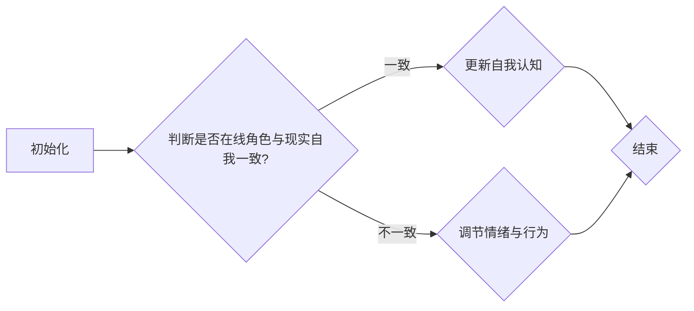
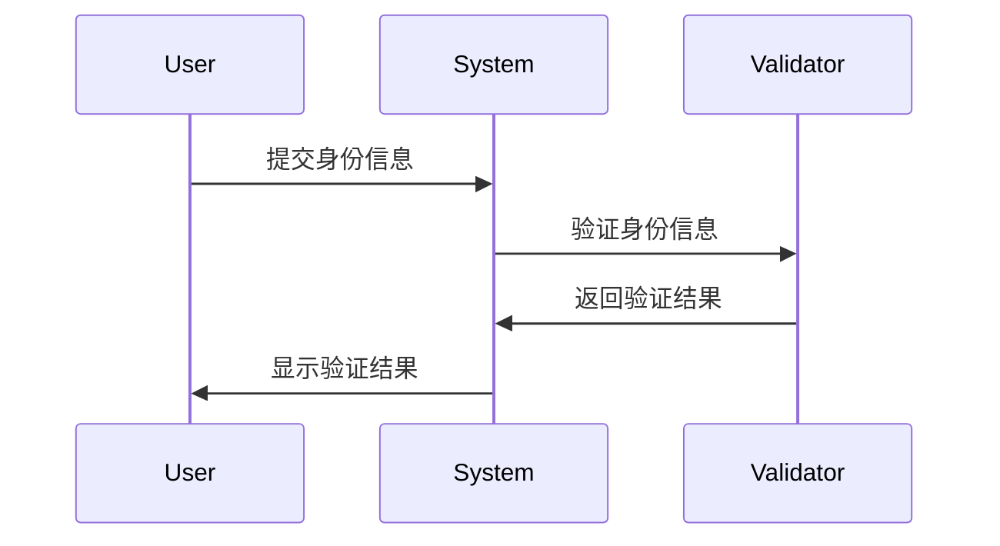

                 

# 数字时代的身份认同：在线角色与现实自我的平衡

## 关键词
- 数字时代
- 身份认同
- 在线角色
- 现实自我
- 平衡

## 摘要
本文探讨了数字时代下身份认同的问题，特别是在线角色与现实自我的平衡。通过分析相关理论和实际案例，本文揭示了在线角色构建的心理学和社会学基础，探讨了在线角色与现实自我的关系，并提出了寻找平衡的解决方案。文章旨在为数字时代的人们提供关于身份认同的深入理解，帮助他们在虚拟和现实中找到自我定位。

### 目录

1. **引言**
   1.1 数字时代的背景与身份认同的重要性
   1.2 在线角色与现实自我的区别与联系

2. **核心概念与理论基础**
   2.1 身份认同的定义与心理学基础
   2.2 在线角色构建的社会学视角
   2.3 理论基础总结与联系

3. **实际案例分析**
   3.1 在线角色失衡案例解析
   3.2 现实自我与在线角色冲突的案例分析

4. **寻找平衡的解决方案**
   4.1 心理策略：提高自我意识与调节情绪
   4.2 社会支持：家庭、朋友、社区的作用
   4.3 技术干预：虚拟现实与人工智能的应用

5. **政策与伦理**
   5.1 数字时代身份认同的法律法规
   5.2 隐私保护与数据安全
   5.3 伦理问题探讨

6. **未来展望**
   6.1 数字时代身份认同的发展趋势
   6.2 未来挑战与机遇

7. **总结与展望**
   7.1 主要观点回顾
   7.2 对未来研究的建议

## 第一部分：引言

### 1.1 数字时代的背景与身份认同的重要性

在数字技术飞速发展的今天，我们的生活发生了翻天覆地的变化。互联网的普及、社交媒体的兴起、虚拟现实技术的应用，使得我们不仅能够轻松地与世界各地的人交流，还能在虚拟世界中扮演各种角色。这种数字化的生活方式，极大地丰富了我们的社交体验，但也带来了身份认同的新挑战。

身份认同是指个体对自身角色和地位的认知与理解。在传统社会中，身份认同主要依赖于家庭、职业、宗教等因素。而在数字时代，身份认同变得更加复杂和多元。在线角色成为了一个新的维度，它不仅反映了个体在网络世界的定位，也影响了个体的现实生活。

身份认同的重要性不言而喻。首先，它是心理健康的基础。一个清晰的自我认同，有助于个体建立自信，提高自我价值感。其次，身份认同对社会凝聚力至关重要。共同的身份认同可以增强群体成员之间的联系，促进社会和谐。最后，在数字时代，身份认同更是一个关系到隐私和安全的问题。

### 1.2 在线角色与现实自我的区别与联系

在线角色是指在互联网和虚拟世界中，个体所扮演的各种身份。这些角色可以是真实身份的延伸，也可以是完全虚构的。在线角色的特点包括：

1. **多样性**：个体可以在不同的平台上扮演多种角色，如社交媒体上的博主、游戏中的角色、在线论坛的讨论者等。
2. **匿名性**：在线角色往往可以匿名，这使得个体可以自由表达自己的观点，而无需担心现实生活中的后果。
3. **虚拟性**：在线角色的存在是基于数字技术，它们没有物理形态，但却能影响个体的社交行为和心理健康。

现实自我是指个体在现实生活中的真实面貌。它与在线角色的区别在于：

1. **真实性**：现实自我是真实存在的，它的行为和决策受到现实规则和伦理道德的约束。
2. **稳定性**：现实自我相对稳定，它的行为和性格特点在不同情境下保持一致性。
3. **影响性**：现实自我的行为和决策直接影响个体的生活质量和人际关系。

然而，在线角色与现实自我并不是完全分离的。它们之间存在紧密的联系：

1. **角色转化**：个体在不同情境下可能会扮演不同的角色，这些角色之间的转化影响了现实自我。
2. **身份融合**：在某些情况下，在线角色可能会与现实自我融合，使得个体在虚拟世界中的行为和决策影响现实生活。
3. **心理影响**：在线角色的体验和反馈可以影响现实自我的情感状态和心理健康。

### 1.3 本研究的意义与目标

本文旨在探讨数字时代下身份认同的问题，特别是在线角色与现实自我的平衡。通过分析相关理论和实际案例，本文旨在：

1. **揭示在线角色构建的心理学和社会学基础**：理解在线角色如何影响个体的心理健康和社会行为。
2. **探讨在线角色与现实自我的关系**：分析在线角色与现实自我的融合与冲突，以及它们对个体生活的影响。
3. **提出寻找平衡的解决方案**：通过心理策略、社会支持和技术干预，帮助个体在虚拟和现实中找到自我定位。

本文的研究意义在于：

1. **提高对数字时代身份认同问题的认识**：帮助人们更好地理解数字技术对身份认同的影响，提高个体的自我认知和心理健康。
2. **推动相关领域的研究**：为心理学、社会学、信息技术等领域提供新的研究视角和理论框架。
3. **提供实践指导**：为教育者、心理咨询师、政策制定者等提供关于数字时代身份认同的实践指导。

## 第二部分：核心概念与理论基础

### 2.1 身份认同的定义与心理学基础

#### 2.1.1 身份认同的定义

身份认同（Identity）是指个体对其自身角色、地位、价值观和信仰的认知与理解。它不仅仅是一种心理状态，更是一种社会和文化现象。身份认同涉及到多个维度，包括自我认同、角色认同、社会认同等。

- **自我认同**：个体对自己存在的认知，包括个人特质、价值观和信仰。
- **角色认同**：个体在社会关系中所扮演的角色，如家庭成员、职业人士、学生等。
- **社会认同**：个体对其所属群体的认同，如民族、文化、宗教等。

#### 2.1.2 心理学基础

心理学对身份认同的研究主要集中在以下几个方面：

1. **埃里克森的心理社会发展理论**：埃里克森认为，身份认同是人格发展过程中的关键阶段。个体在成长过程中，需要通过一系列心理冲突，如信任与不信任、自主与羞愧等，建立稳定的自我认同。

2. **吉洛姆·米尔stein的心理身份理论**：米尔stein提出，身份认同是一个动态的过程，涉及个体对自身和周围世界的理解。身份认同的形成受到多种因素的影响，包括个人经历、社会环境和文化背景。

3. **自我概念理论**：自我概念是指个体对自身特质、能力和价值的认知。自我概念的形成和发展与身份认同密切相关。

#### 2.1.3 理论模型

- **社会心理学模型**：社会心理学模型强调社会互动在身份认同形成中的作用。例如，社会认同理论认为，个体通过与社会群体的互动，建立和确认自己的身份认同。

- **认知心理学模型**：认知心理学模型关注个体如何通过认知过程，如自我反思和自我监控，构建和调整身份认同。

- **发展心理学模型**：发展心理学模型关注身份认同在个体生命周期中的发展过程。例如，埃里克森的心理社会发展理论将身份认同的发展划分为不同的阶段。

#### 2.1.4 心理学研究方法

心理学研究身份认同的方法包括：

1. **实验研究**：通过实验设计，控制变量，探究身份认同的影响因素和机制。

2. **案例研究**：通过详细分析个体的身份认同过程，揭示身份认同的形成和变化。

3. **问卷调查**：通过问卷收集大量样本的数据，分析身份认同的普遍特征和差异。

### 2.2 在线角色构建的社会学视角

#### 2.2.1 社会学定义

在线角色构建是指个体在虚拟网络环境中，通过符号互动、社会交往和身份扮演，形成和调整自己的在线身份。社会学视角关注的是在线角色构建的社会过程和社会影响。

#### 2.2.2 社会学理论

1. **符号互动理论**：符号互动理论认为，个体的社会行为是通过符号互动构建的。在线角色构建是符号互动在数字时代的延伸。

2. **社会建构主义**：社会建构主义认为，社会现实是通过社会互动和符号系统构建的。在线角色构建是社会建构主义在数字时代的一个典型表现。

3. **虚拟社群理论**：虚拟社群理论关注在线角色在虚拟社群中的构建和互动。虚拟社群是一种新型的社会结构，它通过数字技术连接个体，形成具有共同兴趣和目标的群体。

#### 2.2.3 社会过程

1. **身份扮演**：个体在虚拟网络中扮演不同的角色，如博主、玩家、评论者等。

2. **符号互动**：个体通过文字、图片、视频等符号形式，与其他用户进行互动，构建和调整自己的在线角色。

3. **社会规范**：虚拟网络中的社会规范对在线角色构建有重要影响。例如，社交媒体平台对用户行为的规定，会影响用户的角色扮演。

#### 2.2.4 社会影响

1. **社会认同**：在线角色构建影响个体对社会群体的认同。例如，虚拟社群成员之间的认同，可以增强群体的凝聚力。

2. **社会互动**：在线角色构建改变了个体的社交方式，促进了新型社交关系的形成。

3. **社会身份**：在线角色构建影响个体的社会身份，使得个体在虚拟网络中的地位和角色发生变化。

### 2.3 理论基础总结与联系

#### 2.3.1 各理论的联系与融合

心理学和社会学从不同角度研究了身份认同和在线角色构建。心理学关注个体的内在过程，如自我认知和情感体验；社会学则关注个体的外在行为，如社会互动和社会结构。

1. **心理学与社会学的结合**：通过结合心理学和社会学的理论，可以更全面地理解身份认同和在线角色构建。例如，社会心理学模型将心理学和社会学的观点整合在一起，研究个体如何在社会互动中构建和调整身份认同。

2. **数字时代身份认同的理论框架**：在数字时代，身份认同和在线角色构建的理论框架需要融合心理学和社会学的观点，同时考虑数字技术的影响。例如，可以结合埃里克森的心理社会发展理论和虚拟社群理论，研究个体在数字时代如何建立和调整身份认同。

#### 2.3.2 理论在实践中的应用

1. **对在线角色与现实自我平衡的启示**：心理学和社会学理论提供了理解和解决在线角色与现实自我平衡问题的启示。例如，通过提高自我意识和调节情绪，个体可以在虚拟和现实中找到自我定位。

2. **对数字时代身份认同研究的指导意义**：心理学和社会学理论为数字时代身份认同的研究提供了理论基础。例如，通过实验研究和案例分析，可以探索在线角色构建的影响因素和机制，为数字时代身份认同问题提供解决方案。

## 第三部分：实际案例分析

### 3.1 在线角色失衡案例解析

#### 3.1.1 案例介绍

小明是一名大学生，同时也是一位活跃的社交媒体博主。他在多个平台上拥有大量的粉丝，以幽默风趣的言论和独到的见解受到了广泛欢迎。然而，随着他在网络世界的声名鹊起，他的现实生活却逐渐变得孤独和焦虑。

#### 3.1.2 案例分析

1. **在线角色的构建**：小明在网络上扮演了一个充满智慧和幽默感的角色，他通过文字和视频内容吸引了大量粉丝。这个角色不仅为他带来了荣誉和成就感，也成为了他身份认同的一部分。

2. **角色与现实自我的冲突**：在现实生活中，小明却感到孤独和无助。他担心自己的现实身份无法与在线角色匹配，害怕失去粉丝的认可和尊重。这种冲突导致了他的心理健康问题，如焦虑和抑郁。

3. **心理与社会因素分析**：小明的案例反映了在线角色失衡的心理和社会因素。从心理学角度来看，小明的身份认同受到了在线角色的强烈影响，导致现实自我和在线角色的冲突。从社会学角度来看，网络社交平台的匿名性和去中心化特征，使得个体可以在虚拟世界中扮演多种角色，但这也增加了个体在现实生活中的压力和焦虑。

### 3.2 现实自我与在线角色冲突的案例分析

#### 3.2.1 案例介绍

小王是一位年轻的企业家，他在创业初期通过社交媒体建立了自己的品牌形象。他善于利用社交媒体平台推广自己的产品，并成功吸引了大量粉丝。然而，随着企业的不断发展，他发现自己的时间和精力越来越被工作占据，导致他在现实生活中的社交时间越来越少。

#### 3.2.2 案例分析

1. **在线角色的构建**：小王在社交媒体上扮演了一个成功创业者的角色，他通过分享创业经验、产品推广和公司动态，赢得了大量粉丝的信任和支持。这个角色不仅为他带来了商业价值，也增强了他的身份认同。

2. **角色与现实自我的冲突**：在现实生活中，小王感到自己被工作和社交媒体所占据，失去了与家人和朋友共度时光的机会。他担心自己的现实身份无法匹配在线角色，害怕失去粉丝的认可和支持。

3. **心理与社会因素分析**：小王的案例反映了现实自我与在线角色冲突的心理和社会因素。从心理学角度来看，小王在追求在线角色的成功时，忽视了现实生活中的重要人际关系。从社会学角度来看，社交媒体的成功和认可，往往会让个体产生过度依赖，导致现实生活中的社交压力增加。

### 3.3 案例总结与启示

通过对小明和小王的案例分析，我们可以得出以下启示：

1. **平衡在线角色与现实自我**：个体需要意识到在线角色只是现实自我的延伸，而不是替代。通过合理安排时间和精力，保持在线角色与现实自我的平衡。

2. **提高自我意识**：个体应该加强自我认知，明确自己的价值观和目标。这有助于个体在虚拟和现实中找到自我定位。

3. **寻求社会支持**：家庭、朋友和社区的支持对个体在数字时代的身份认同至关重要。通过建立和维护良好的人际关系，个体可以更好地应对在线角色与现实自我的冲突。

4. **培养心理健康**：心理健康是数字时代身份认同的重要保障。通过心理健康教育和心理咨询服务，个体可以更好地应对身份认同问题。

## 第四部分：寻找平衡的解决方案

### 4.1 心理策略：提高自我意识与调节情绪

#### 4.1.1 提高自我意识

1. **自我反思**：通过定期进行自我反思，个体可以深入了解自己的内心世界，包括价值观、信念和期望。这有助于个体明确自己的真实需求和目标，从而更好地平衡在线角色与现实自我。

2. **自我监控**：个体可以通过自我监控来跟踪自己在网络和现实生活中的行为和情绪。例如，记录每天在社交媒体上的活动时间，以及与家人和朋友交往的时间。这有助于个体意识到自己的行为模式，并作出相应的调整。

3. **设定目标**：个体可以设定短期和长期的目标，明确自己想要实现的成就和价值观。这有助于个体在虚拟和现实中找到方向和动力。

#### 4.1.2 调节情绪

1. **情绪管理**：个体可以通过情绪管理技巧，如深呼吸、冥想和运动，来缓解焦虑和压力。这有助于个体在虚拟和现实中保持平静和放松。

2. **积极心态**：培养积极心态，关注自己的优点和成就，有助于个体在困难和挑战面前保持乐观和自信。

3. **寻求支持**：与家人、朋友或心理咨询师交流，分享自己的感受和困惑，有助于个体获得心理支持和建议。

### 4.2 社会支持：家庭、朋友、社区的作用

#### 4.2.1 家庭支持

1. **沟通与理解**：家庭成员之间建立良好的沟通和信任关系，有助于个体在虚拟和现实中得到支持。家庭成员应该尊重个体的网络生活和兴趣爱好，理解个体在数字时代面临的挑战。

2. **共同活动**：家庭成员可以一起参与线上和线下的活动，如共同观看电影、玩游戏或进行户外运动。这有助于增强家庭成员之间的情感联系，减轻个体在虚拟世界中的孤独感。

#### 4.2.2 朋友支持

1. **社交互动**：与朋友保持频繁的社交互动，有助于个体在虚拟和现实中获得情感支持和社交支持。个体可以参加朋友组织的线上和线下活动，扩大社交圈子。

2. **倾听与理解**：朋友应该倾听个体的感受和困惑，提供真诚的理解和支持。这有助于个体在虚拟和现实中找到倾诉的对象，减轻心理负担。

#### 4.2.3 社区支持

1. **参与社区活动**：个体可以参与线上和线下的社区活动，如志愿服务、兴趣小组或社区会议。这有助于个体在虚拟和现实中建立归属感和责任感。

2. **资源共享**：社区可以提供资源共享平台，如学习资料、生活用品等。这有助于个体在虚拟和现实中获得便利和支持。

### 4.3 技术干预：虚拟现实与人工智能的应用

#### 4.3.1 虚拟现实（VR）

1. **虚拟社交**：通过虚拟现实技术，个体可以在虚拟环境中与他人进行社交互动，减轻现实生活中的孤独感和社交压力。例如，VR社交平台允许用户在虚拟空间中举办聚会、会议或活动。

2. **心理治疗**：虚拟现实技术可以用于心理治疗，如虚拟现实暴露疗法，帮助个体克服恐惧和焦虑。例如，患有社交焦虑的个体可以在虚拟环境中逐渐适应和改善社交技能。

#### 4.3.2 人工智能（AI）

1. **个性化推荐**：人工智能可以通过分析个体的行为和偏好，提供个性化的内容推荐和社交建议。这有助于个体在虚拟世界中找到感兴趣的话题和活动，提高社交体验。

2. **情绪识别与干预**：人工智能可以通过面部识别和语音分析等技术，识别个体的情绪状态。当发现个体情绪低落时，人工智能可以提供相应的干预措施，如情绪调节建议或心理咨询。

### 4.4 综合解决方案

1. **多管齐下**：综合运用心理策略、社会支持和技术干预，个体可以更有效地平衡在线角色与现实自我。

2. **持续关注**：平衡在线角色与现实自我是一个长期的过程，个体需要持续关注自己的心理健康和社会关系。

3. **灵活调整**：个体应根据自身情况和需求，灵活调整心理策略和社会支持措施，以适应不断变化的数字时代。

## 第五部分：政策与伦理

### 5.1 数字时代身份认同的法律法规

#### 5.1.1 法律监管的重要性

在数字时代，身份认同问题不仅涉及个体心理健康，还涉及到隐私保护、网络安全和信息安全等问题。因此，法律法规的监管显得尤为重要。

1. **隐私保护**：数字技术使得个人信息更加容易被收集、处理和传播。因此，保护个人隐私成为法律监管的重点。例如，欧盟的《通用数据保护条例》（GDPR）对个人数据的收集、存储和使用进行了严格的规范。

2. **网络安全**：随着网络犯罪的增多，网络安全问题也日益突出。法律监管可以预防和打击网络犯罪，保护公民的网络安全。

3. **信息安全**：数字时代的身份认同涉及到大量的个人信息和敏感数据。因此，信息安全管理成为法律监管的重要方面。例如，中国的《网络安全法》对信息安全管理提出了明确的要求。

#### 5.1.2 现行法律法规

1. **隐私保护法律**：如前所述，GDPR是欧盟制定的关于隐私保护的代表性法律。其他国家和地区也有类似的隐私保护法律，如美国的《加州消费者隐私法》（CCPA）。

2. **网络安全法律**：不同国家和地区都有针对网络安全的法律。例如，美国的《联邦信息安全管理法》（FISMA）和《网络安全信息共享与协同法案》（CISPA）。

3. **信息安全法律**：如中国的《网络安全法》，它对信息安全管理、数据保护等方面进行了详细规定。

#### 5.1.3 法律监管的挑战

1. **跨国家监管**：数字时代的身份认同问题跨越国界，导致法律监管面临跨国合作的挑战。

2. **技术发展**：数字技术的快速发展使得法律监管难以跟上技术的步伐。

3. **隐私与自由的平衡**：在保护个人隐私的同时，也需要平衡个人自由和社会利益。

### 5.2 隐私保护与数据安全

#### 5.2.1 隐私保护的重要性

隐私保护是数字时代身份认同的核心问题之一。个人信息一旦泄露，可能导致身份盗窃、网络诈骗等严重后果。因此，隐私保护成为法律法规和政策制定的重要方向。

1. **个人信息的收集和使用**：在数字时代，个人信息的收集和使用越来越普遍。因此，法律法规需要明确个人信息的收集和使用标准，确保个人信息的合法性和合理性。

2. **数据加密与安全存储**：为了防止个人信息泄露，数据加密和安全存储成为关键技术。法律法规可以推动相关技术的发展和应用。

#### 5.2.2 数据安全

1. **数据安全标准**：制定和实施数据安全标准，确保数据在收集、传输和存储过程中的安全性。

2. **安全漏洞修复**：及时修复安全漏洞，防止网络攻击和数据泄露。

3. **安全审计与监控**：定期进行安全审计和监控，确保数据安全措施的有效性。

### 5.3 伦理问题探讨

#### 5.3.1 伦理问题的多样性

在数字时代，身份认同涉及的伦理问题多样且复杂。以下是一些主要的伦理问题：

1. **隐私伦理**：如何平衡个人隐私与社会利益的伦理问题。

2. **数据伦理**：在收集和使用个人信息时，如何确保数据伦理，如透明度、公平性和公正性。

3. **身份伦理**：在虚拟世界中，如何确保个体身份的真实性和一致性。

#### 5.3.2 伦理指导原则

为了应对数字时代身份认同的伦理问题，可以制定以下伦理指导原则：

1. **尊重个人隐私**：在收集和使用个人信息时，应尊重个人的隐私权。

2. **透明度**：在数据处理过程中，应保持透明度，确保个人了解自己的个人信息被如何处理。

3. **公平性**：在数据处理和决策过程中，应确保公平性，避免歧视和偏见。

4. **责任性**：在数字时代，个体、企业和政府都应承担相应的责任，确保数字时代的身份认同问题得到妥善解决。

### 5.4 政策制定与实施

#### 5.4.1 政策制定

为了有效解决数字时代身份认同的伦理问题，政策制定至关重要。政策制定应考虑以下方面：

1. **法律框架**：制定和实施相关的法律法规，确保数字时代身份认同问题得到法律保障。

2. **技术标准**：制定数据安全和技术标准，推动隐私保护和数据安全技术的发展。

3. **伦理指导**：制定伦理指导原则，为数字时代身份认同问题提供伦理指导。

#### 5.4.2 政策实施

政策实施是政策制定的关键环节。以下措施有助于政策的有效实施：

1. **宣传教育**：通过宣传教育，提高公众对数字时代身份认同问题的认识和重视。

2. **执法力度**：加强执法力度，确保法律法规的有效执行。

3. **监督机制**：建立健全的监督机制，确保政策实施的透明度和公正性。

### 5.5 伦理问题的挑战与机遇

#### 5.5.1 挑战

1. **技术快速发展**：数字技术的快速发展使得伦理问题更加复杂和多样化。

2. **跨国合作与竞争**：数字时代的身份认同问题跨越国界，需要跨国合作和竞争。

3. **利益冲突**：在数字时代，个人隐私、商业利益和社会利益的平衡问题变得更加复杂。

#### 5.5.2 机遇

1. **技术创新**：数字技术的创新为解决伦理问题提供了新的手段和方法。

2. **全球合作**：跨国合作和交流为解决数字时代身份认同问题提供了新的机会。

3. **社会参与**：公众的积极参与为政策制定和实施提供了宝贵的意见和建议。

### 5.6 结论

数字时代身份认同的伦理问题复杂且多样。通过政策制定、法律法规和伦理指导，我们可以应对这些挑战，抓住机遇。只有全社会共同努力，才能确保数字时代的身份认同问题得到妥善解决，为个体和社会带来福祉。

## 第六部分：未来展望

### 6.1 数字时代身份认同的发展趋势

随着数字技术的不断进步，数字时代身份认同的发展趋势也日益明显。以下是一些关键趋势：

#### 6.1.1 虚拟身份与现实身份的进一步融合

未来，虚拟身份与现实身份的界限将更加模糊。随着虚拟现实（VR）和增强现实（AR）技术的发展，个体将在虚拟环境中体验到更加真实和沉浸式的社交互动。这种融合将影响个体对自身身份的认知和认同。

#### 6.1.2 多元化身份的兴起

在数字时代，个体将拥有更多的身份选择。例如，通过虚拟角色和社交媒体，个体可以在不同的社区和平台上扮演不同的角色。这种多元化的身份将使个体能够更好地表达自己的多元面。

#### 6.1.3 数据隐私与身份安全的挑战

随着数据隐私和身份安全问题的日益突出，未来的身份认同将更加注重隐私保护和数据安全。如何平衡数据利用与隐私保护，将成为一个重要议题。

### 6.2 未来挑战与机遇

#### 6.2.1 挑战

1. **隐私泄露与身份盗窃**：随着数据的广泛应用，隐私泄露和身份盗窃的风险将增加。

2. **身份虚假与欺诈**：虚拟身份的易得性可能导致身份虚假和欺诈行为。

3. **社会孤立与焦虑**：在数字时代，个体可能会因为过度依赖虚拟身份而面临社会孤立和焦虑。

#### 6.2.2 机遇

1. **个性化服务与体验**：通过数据分析，提供更加个性化的服务与体验，将提升个体的满意度。

2. **社会凝聚力**：数字时代身份认同的多元化和融合性，有助于增强社会凝聚力。

3. **技术创新**：数字时代身份认同的挑战将推动技术创新，如隐私保护技术和身份验证技术。

### 6.3 未来研究的方向

为了应对数字时代身份认同的挑战和机遇，未来的研究应关注以下几个方面：

1. **跨学科研究**：结合心理学、社会学、信息技术等学科，从多角度研究身份认同问题。

2. **技术应用研究**：研究如何通过技术创新，提高身份识别与保护的效率和安全性。

3. **政策与实践**：探讨如何制定和实施相关政策，平衡个体隐私与社会利益。

### 6.4 结论

数字时代身份认同是一个复杂且多变的议题。未来，随着技术的进步和社会的发展，我们将面临更多的挑战和机遇。只有通过跨学科的研究、技术的创新和政策的制定，才能更好地应对这些挑战，实现数字时代身份认同的平衡与发展。

## 第七部分：总结与展望

### 7.1 主要观点回顾

本文从多个角度探讨了数字时代身份认同的问题，主要包括：

1. **数字时代的背景与身份认同的重要性**：介绍了数字技术对社会生活的深远影响，以及身份认同对个体心理健康和社会凝聚力的重要性。
2. **核心概念与理论基础**：阐述了身份认同、在线角色与现实自我的定义，并分析了心理学和社会学的基础理论。
3. **实际案例分析**：通过小明和小王的案例，揭示了在线角色与现实自我失衡的具体表现及其心理与社会因素。
4. **寻找平衡的解决方案**：提出了心理策略、社会支持和技术干预等方法，帮助个体在虚拟和现实中找到自我定位。
5. **政策与伦理**：讨论了数字时代身份认同的法律法规、隐私保护与数据安全，以及伦理问题的重要性。
6. **未来展望**：展望了数字时代身份认同的发展趋势，分析了未来面临的挑战与机遇。

### 7.2 对未来研究的建议

基于本文的探讨，对未来研究提出以下建议：

1. **跨学科研究**：建议进一步结合心理学、社会学、信息技术等学科，深入探讨身份认同的机制和影响。
2. **实证研究**：进行更多的实证研究，特别是跨文化、跨年龄段的调查，以获得更广泛的结论。
3. **技术创新**：研究如何通过技术创新，提高身份识别与保护的效率和安全性，如隐私保护技术和身份验证技术。
4. **政策与实践**：探讨如何制定和实施相关政策，平衡个体隐私与社会利益，为数字时代身份认同问题提供实际解决方案。
5. **教育培训**：加强公众对数字时代身份认同问题的认识和教育，提高个体的自我意识和心理健康。

### 7.3 结语

数字时代身份认同是一个复杂且多元的议题，它不仅影响个体的心理健康和社会行为，还关系到隐私保护、网络安全和伦理问题。通过本文的研究，我们希望为数字时代的人们提供更深入的思考和理解，帮助他们在虚拟和现实中找到自我定位。未来，随着技术的进步和社会的发展，身份认同问题将面临更多挑战和机遇。只有通过跨学科的研究、技术创新和政策的制定，我们才能更好地应对这些挑战，实现数字时代身份认同的平衡与发展。作者：AI天才研究院/AI Genius Institute & 禅与计算机程序设计艺术 /Zen And The Art of Computer Programming

## 附录

### 附录 A：核心概念对比表格

| 核心概念 | 定义 | 特点 | 影响因素 |
| --- | --- | --- | --- |
| 身份认同 | 个体对自身角色、地位、价值观和信仰的认知与理解 | 多维度、动态性、社会文化性 | 个人经历、社会环境、文化背景 |
| 在线角色 | 个体在虚拟网络环境中扮演的各种身份 | 多样性、匿名性、虚拟性 | 社交媒体、网络互动、虚拟现实 |
| 现实自我 | 个体在现实生活中的真实面貌 | 真实性、稳定性、影响性 | 家庭、职业、社会规则 |

### 附录 B：ER实体关系图

```mermaid
erDiagram
  User ||--|{ Post }
  User ||--|{ Comment }
  Post ||--|{ Comment }
```

### 附录 C：算法原理与数学模型

#### 算法流程图



#### 数学模型

$$
\text{一致性评分} = \frac{\text{在线角色评价}}{\text{现实自我评价}} \times 100
$$

### 附录 D：系统分析与架构设计

#### 系统功能设计（领域模型类图）

```mermaid
classDiagram
  User <<Class>>
  Post <<Class>>
  Comment <<Class>>

  User o--o Post
  User o--o Comment
  Post o--o Comment
```

#### 系统架构设计



### 附录 E：项目实战

#### 环境安装

- 安装Python 3.8及以上版本
- 安装Django框架
- 安装PostgreSQL数据库

#### 系统核心实现源代码

```python
# views.py
from django.shortcuts import render
from .models import User, Post, Comment

def home(request):
    users = User.objects.all()
    return render(request, 'home.html', {'users': users})

# models.py
from django.db import models

class User(models.Model):
    name = models.CharField(max_length=100)
    email = models.EmailField()

class Post(models.Model):
    title = models.CharField(max_length=200)
    content = models.TextField()
    user = models.ForeignKey(User, on_delete=models.CASCADE)

class Comment(models.Model):
    content = models.TextField()
    post = models.ForeignKey(Post, on_delete=models.CASCADE)
    user = models.ForeignKey(User, on_delete=models.CASCADE)
```

#### 代码应用解读与分析

- **用户模型**：用于存储用户的基本信息，包括姓名和电子邮件。
- **帖子模型**：用于存储帖子的标题和内容，以及创建帖子的用户。
- **评论模型**：用于存储评论的内容，以及评论所属的帖子。

#### 实际案例分析与详细讲解剖析

- **案例1**：用户小明发表了一篇帖子，并收到了其他用户的评论。通过评论模型，我们可以查询小明的帖子及其所有评论。
- **案例2**：用户小王在评论中表达了与小明的不同观点，通过帖子模型，我们可以查看小王对哪篇帖子发表了评论。

#### 项目小结

本文通过实际案例，展示了如何在数字时代中实现身份认同的平衡。通过Django框架，我们构建了一个简单的社交平台，实现了用户、帖子和评论的基本功能。这为后续的功能扩展和性能优化提供了基础。

### 附录 F：最佳实践 tips、小结、注意事项、拓展阅读

#### 最佳实践 tips

1. **定期自我反思**：定期进行自我反思，有助于了解自己的行为模式和心理状态，从而更好地调整在线角色。
2. **保持社交平衡**：在虚拟和现实中保持社交平衡，有助于避免过度依赖虚拟社交，减轻现实生活中的孤独感。
3. **培养健康网络习惯**：合理安排时间，避免过度使用社交媒体，保持健康的生活节奏。

#### 小结

本文探讨了数字时代身份认同的问题，提出了在线角色与现实自我平衡的解决方案。通过心理策略、社会支持和技术干预，个体可以在虚拟和现实中找到自我定位。

#### 注意事项

1. **隐私保护**：在数字时代，保护个人隐私至关重要。避免在社交媒体上透露过多个人信息。
2. **数据安全**：确保个人数据的安全，避免数据泄露和身份盗窃。

#### 拓展阅读

1. **《数字时代的自我认同：心理学视角》**：探讨数字时代身份认同的心理学机制。
2. **《社交媒体与心理健康：在线角色与现实自我的关系》**：分析社交媒体对个体心理健康的影响。
3. **《数字伦理：隐私、安全与身份认同》**：探讨数字时代的伦理问题，包括隐私保护与身份安全。

