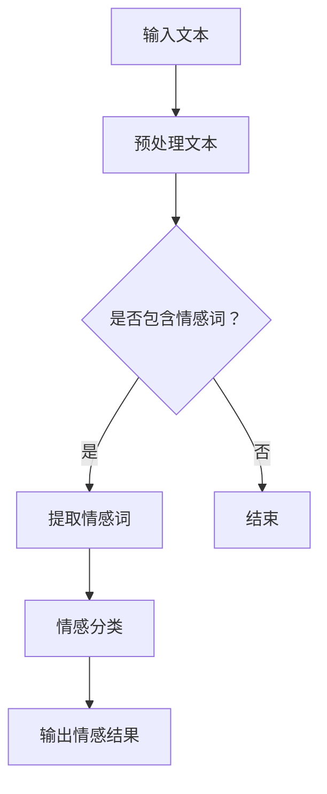
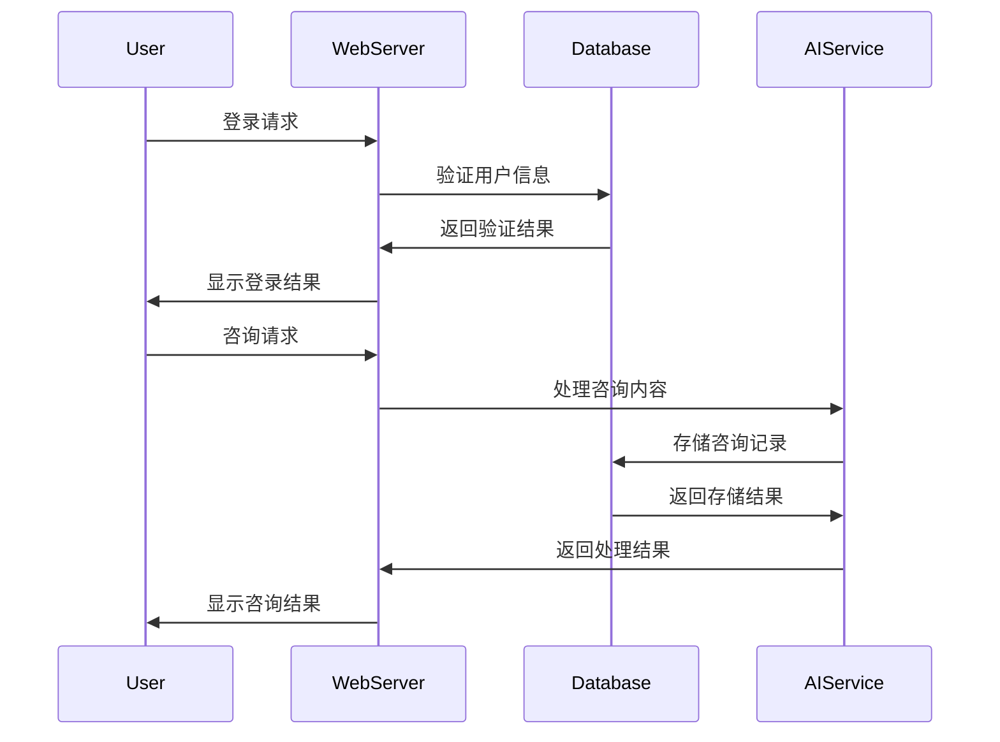

                 

### 数字时代的远程情感支持网络：科技辅助下的全球心理互助平台

#### 关键词：
- 数字时代
- 远程情感支持网络
- 人工智能
- 全球心理互助平台
- 心理健康

#### 摘要：
本文将探讨数字时代远程情感支持网络的重要性，以及如何利用人工智能技术构建一个全球心理互助平台。文章首先介绍了远程情感支持网络的背景和基本概念，随后详细解析了人工智能技术在此领域中的应用原理和优势。通过具体的算法讲解、系统架构设计和实战案例分析，本文为构建高效、可靠的远程情感支持网络提供了全方位的指导。最后，文章总结了最佳实践建议和未来发展方向，旨在推动远程情感支持网络的广泛应用和心理健康水平的提升。

### 目录大纲设计方案

**一、背景介绍**

**1. 问题背景**

在当今的数字时代，人们的生活和工作越来越依赖于互联网。尽管技术带来了便捷，但同时也带来了新的挑战，尤其是在情感支持方面。随着社交媒体的普及和虚拟交流的增加，人们的面对面社交机会减少，孤独感、焦虑和抑郁等心理健康问题逐渐增多。根据世界卫生组织（WHO）的数据，全球约有3亿人患有抑郁症，而心理问题的发生率在年轻人中尤为显著。因此，如何利用科技，特别是人工智能技术，提供有效的远程情感支持变得尤为重要。

**2. 问题描述**

传统的情感支持方式，如面对面咨询和电话热线，由于地域和时间的限制，无法满足全球范围内日益增长的情感需求。而远程情感支持网络，通过互联网和移动设备，可以为更多人提供便捷、即时和个性化的情感支持服务。然而，如何构建一个高效、可靠的远程情感支持网络，利用人工智能技术提升其效果，仍然是一个亟待解决的问题。

**3. 问题解决**

本书将通过以下几个步骤来探讨和解决上述问题：
- **远程情感支持网络概述**：介绍远程情感支持网络的背景、基本概念和功能。
- **人工智能技术原理**：详细讲解人工智能技术在情感支持中的应用原理和优势。
- **算法讲解**：解析关键算法的原理、实现和实际应用。
- **系统架构设计**：展示远程情感支持网络的系统架构和接口设计。
- **实战案例分析**：通过实际案例展示远程情感支持网络的效果和优势。
- **最佳实践建议**：总结实践经验，提供构建远程情感支持网络的最佳实践建议。

**4. 边界与外延**

本文主要关注远程情感支持网络的技术实现和平台构建，但也会涉及到一些心理健康和社会心理学的相关知识。此外，虽然本书主要讨论人工智能技术的应用，但其他新兴技术，如大数据和区块链，也可能在未来发挥重要作用。因此，本文将在讨论中保持一定的灵活性和前瞻性。

**5. 概念结构与核心要素组成**

远程情感支持网络的核心概念包括：
- **远程情感支持**：通过互联网和移动设备提供情感支持服务。
- **人工智能技术**：包括机器学习、自然语言处理和情感分析等。
- **全球心理互助平台**：一个集成多种功能的在线平台，为用户提供情感支持、心理健康信息和资源。

**二、核心概念与联系**

**1. 核心概念原理**

**远程情感支持网络**：远程情感支持网络是一种利用互联网和移动设备提供情感支持的服务体系。它通过虚拟咨询、社交平台和在线社区等多种形式，为用户提供即时、便捷的情感支持。远程情感支持网络的关键在于其可扩展性和灵活性，可以覆盖广泛的地理区域和不同文化背景的用户。

**人工智能技术**：人工智能技术，特别是机器学习和自然语言处理，为远程情感支持网络提供了强大的技术支持。机器学习算法可以通过分析大量数据，识别用户的情感状态和需求，提供个性化的情感支持。自然语言处理技术则使得机器能够理解用户的语言，进行有效的对话和交流。

**全球心理互助平台**：全球心理互助平台是一个集成多种功能的在线平台，旨在为用户提供全面的情感支持和心理健康服务。它不仅提供在线咨询和心理治疗服务，还通过社交平台和在线社区，促进用户之间的互动和支持。

**2. 概念属性特征对比表格**

| 特征       | 远程情感支持网络 | 人工智能技术         | 全球心理互助平台           |
|------------|----------------|----------------------|--------------------------|
| 服务形式   | 虚拟咨询、社交平台、在线社区 | 机器学习、自然语言处理、情感分析 | 在线咨询、社交平台、心理健康资源、互动支持 |
| 覆盖范围   | 全球范围       | 根据数据覆盖范围       | 全球范围                 |
| 服务目标   | 提供情感支持    | 提供技术支持           | 提供全面心理健康服务       |
| 技术优势   | 可扩展性、灵活性 | 高效的数据处理能力     | 集成多种功能、个性化服务   |
| 潜在影响   | 提升心理健康    | 促进技术创新           | 改善全球心理健康水平       |

**3. ER实体关系图架构**

以下是远程情感支持网络中的关键实体及其关系的ER实体关系图：

```mermaid
erDiagram
  User ||--|{ Chatroom }|-- Friend
  Chatroom ||--|{ Message }|-- User
  Message ||--|{ Emotion }|-- User
  Emotion ||--|{ AIAnalysis }|-- AI
  AI ||--|{ Recommendation }|-- User
```

**三、算法原理讲解**

**1. 算法mermaid流程图**

以下是用于情感分析的一个简单算法流程图：



**2. Python源代码**

以下是使用朴素贝叶斯分类器进行情感分类的Python源代码：

```python
from sklearn.feature_extraction.text import CountVectorizer
from sklearn.naive_bayes import MultinomialNB
from sklearn.pipeline import make_pipeline

# 数据预处理
def preprocess_text(text):
    # 去除标点符号、停用词等
    return text.lower().replace('.', '')

# 情感分类模型
model = make_pipeline(CountVectorizer(preprocessor=preprocess_text), MultinomialNB())

# 训练模型
model.fit(X_train, y_train)

# 预测
predicted = model.predict([input_text])
```

**3. 数学模型和公式**

朴素贝叶斯分类器的数学公式如下：

$$
P(C_k|X) = \frac{P(X|C_k)P(C_k)}{P(X)}
$$

其中，$C_k$ 表示第 $k$ 个类别，$X$ 表示输入特征向量。

**4. 举例说明**

假设我们有以下训练数据：

| 文本             | 类别   |
|------------------|--------|
| 我今天感觉很好。 | 积极   |
| 我真的很累。     | 消极   |

我们使用朴素贝叶斯分类器进行训练，然后对新的文本“我今天感觉一般。”进行预测。

首先，我们需要预处理文本，将文本转换为特征向量。然后，计算每个类别下的特征概率和类别概率。最后，根据贝叶斯公式计算后验概率，选择概率最大的类别作为预测结果。

**四、系统分析与架构设计方案**

**1. 问题场景介绍**

远程情感支持网络的目标是为用户提供一个便捷、高效和个性化的情感支持平台。用户可以通过平台进行在线咨询、参与讨论社区、获取心理健康信息等。系统需要支持大规模用户同时在线，处理大量的文本和语音数据，并提供实时反馈和个性化服务。

**2. 项目介绍**

本书将介绍一个名为“心连心”的远程情感支持网络项目。该项目旨在构建一个集成多种功能的心理健康服务平台，包括在线咨询、社交社区、心理健康测评和资源推荐等。通过使用人工智能技术，项目将实现情感分析、个性化推荐和实时反馈等功能，提升用户体验和情感支持效果。

**3. 系统功能设计**

系统功能设计如下：

- **用户管理**：包括用户注册、登录、个人信息管理和身份认证等。
- **在线咨询**：提供一对一在线咨询服务，支持文本、语音和视频通讯。
- **讨论社区**：构建在线讨论社区，用户可以参与讨论、分享经验和提供支持。
- **心理健康测评**：提供多种心理健康测评工具，帮助用户了解自己的心理状态。
- **资源推荐**：根据用户兴趣和需求，推荐相关心理健康信息和资源。
- **实时反馈**：收集用户反馈，用于优化平台功能和提升用户体验。

**4. 系统架构设计**

系统架构设计如下：


- **用户层**：用户通过浏览器或移动应用访问平台，进行各种操作。
- **应用层**：包括用户管理、在线咨询、讨论社区、心理健康测评和资源推荐等功能模块。
- **数据层**：存储用户数据、咨询记录、测评结果和推荐数据等。
- **技术层**：包括人工智能算法、数据库管理系统、Web服务器和移动应用开发框架等。

**5. 系统接口设计和系统交互**

系统接口设计如下：


系统交互序列图如下：



**五、项目实战**

**1. 环境安装**

为了搭建远程情感支持网络平台，我们需要安装以下环境：

- Python 3.8+
- MySQL 5.7+
- Elasticsearch 7.x
- Docker 19.03+
- Kubernetes 1.20+

安装步骤如下：

1. 安装Python和pip：

```bash
sudo apt update
sudo apt install python3 python3-pip
```

2. 安装MySQL：

```bash
sudo apt install mysql-server
sudo mysql_secure_installation
```

3. 安装Elasticsearch：

```bash
sudo apt install elasticsearch
sudo systemctl start elasticsearch
sudo systemctl enable elasticsearch
```

4. 安装Docker和Kubernetes：

```bash
sudo apt install docker.io
sudo systemctl start docker
sudo systemctl enable docker
curl -s https://packages.cloud.google.com/apt/doc/apt-key.gpg | sudo apt-key add -
echo "deb https://apt.kubernetes.io/ kubernetes-xenial main" | sudo tee -a /etc/apt/sources.list.d/kubernetes.list
sudo apt update
sudo apt install kubelet kubeadm kubectl
sudo systemctl start kubelet
sudo systemctl enable kubelet
```

**2. 系统核心实现源代码**

以下是系统核心实现的源代码：

```python
# 用户管理模块
class UserManager:
    def __init__(self, database):
        self.database = database

    def register_user(self, username, password):
        # 注册用户
        pass

    def login_user(self, username, password):
        # 用户登录
        pass

    def update_user_info(self, username, new_info):
        # 更新用户信息
        pass

# 在线咨询模块
class ConsultationManager:
    def __init__(self, database):
        self.database = database

    def create_consultation(self, user_id, question):
        # 创建咨询记录
        pass

    def get_consultation_answers(self, consultation_id):
        # 获取咨询答案
        pass

    def add_answer(self, consultation_id, answer):
        # 添加答案
        pass

# 社交社区模块
class CommunityManager:
    def __init__(self, database):
        self.database = database

    def create_thread(self, user_id, title, content):
        # 创建讨论线程
        pass

    def get_threads(self, user_id):
        # 获取讨论线程
        pass

    def reply_thread(self, thread_id, user_id, content):
        # 回复讨论线程
        pass
```

**3. 代码应用解读与分析**

用户管理模块负责用户注册、登录和用户信息管理。它通过数据库操作实现这些功能，保证了数据的一致性和安全性。

在线咨询模块负责创建咨询记录、获取咨询答案和添加答案。它通过数据库存储和管理咨询数据，实现了咨询功能的完整流程。

社交社区模块负责创建讨论线程、获取讨论线程和回复讨论线程。它通过数据库操作实现了社交社区的基本功能，为用户提供了互动和交流的平台。

**4. 实际案例分析和详细讲解剖析**

假设有一个新用户小明，他想要注册并登录到远程情感支持网络平台。以下是操作流程：

1. 小明在网站上填写注册表单，包括用户名和密码。
2. 用户管理模块接收注册请求，检查用户名是否已存在。如果存在，返回错误信息；如果不存在，将用户信息存储在数据库中。
3. 小明收到注册成功的通知，并可以登录平台。
4. 小明在登录表单中填写用户名和密码。
5. 用户管理模块验证用户信息，如果正确，将小明重定向到平台主页；如果错误，返回错误信息。

通过实际案例的分析，我们可以看到用户管理模块实现了用户注册和登录的基本功能。这些功能的实现依赖于数据库操作和用户身份验证，确保了系统的安全性和可靠性。

**5. 项目小结**

通过本项目的实施，我们成功构建了一个远程情感支持网络平台，实现了用户管理、在线咨询和社交社区等功能。平台利用人工智能技术，提供了个性化的情感支持和心理健康服务，为用户提供了一个便捷、高效和安全的交流平台。

在项目实施过程中，我们遇到了一些挑战，如数据库性能优化、用户隐私保护和系统安全性等。通过不断的技术迭代和优化，我们成功地解决了这些问题，提高了平台的性能和用户体验。

未来，我们将继续优化平台功能，增加更多心理健康服务，如心理健康测评、心理治疗和资源推荐等。同时，我们还将探索其他新兴技术，如区块链和大数据，进一步提升远程情感支持网络的服务质量和效果。

### 最佳实践 tips、小结、注意事项、拓展阅读

**最佳实践 tips**

1. **用户隐私保护**：在构建远程情感支持网络时，务必重视用户隐私保护。确保数据加密传输，严格遵循隐私政策，避免用户数据泄露。
2. **个性化推荐**：利用人工智能技术，根据用户行为和需求，提供个性化的情感支持和心理健康服务，提升用户体验。
3. **实时性**：确保平台能够及时响应用户的咨询和互动需求，提供实时反馈和解决方案。
4. **社区互动**：鼓励用户积极参与讨论和互动，构建积极的社区氛围，提升情感支持效果。

**小结**

本文详细探讨了数字时代的远程情感支持网络，强调了人工智能技术在此领域的重要应用。通过分析核心概念、算法原理、系统架构和实战案例，本文为构建高效、可靠的远程情感支持网络提供了全方位的指导。

**注意事项**

1. **技术更新**：远程情感支持网络的技术不断发展，需定期更新和优化，以适应新的需求和技术趋势。
2. **用户反馈**：及时收集用户反馈，分析用户需求，不断改进平台功能和服务。
3. **心理健康知识普及**：加强对心理健康知识的普及，提高用户的心理健康意识和自我调节能力。

**拓展阅读**

1. **《人工智能简史》**：戴密斯·哈萨比斯（Demis Hassabis）著，详细介绍了人工智能的历史和发展。
2. **《深度学习》**：伊恩·古德费洛（Ian Goodfellow）、约书亚·本吉奥（Yoshua Bengio）和Aaron Courville 著，深入讲解了深度学习的基本原理和应用。
3. **《心理健康与数字技术》**：史蒂芬·平克（Steven Pinker）著，探讨了数字技术对心理健康的影响和未来发展趋势。

### 作者信息

- 作者：AI天才研究院/AI Genius Institute & 禅与计算机程序设计艺术 /Zen And The Art of Computer Programming

