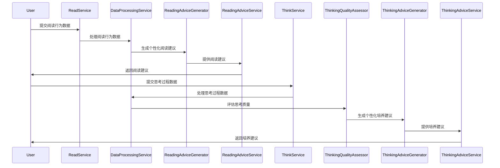
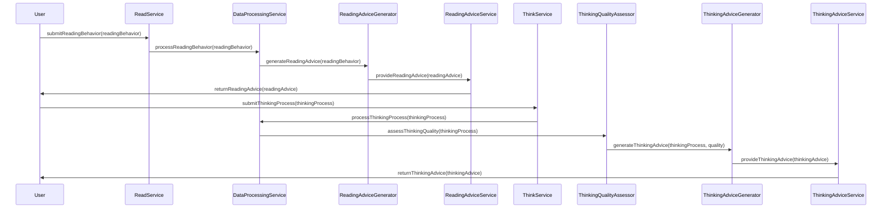

                 

# 数字时代的阅读习惯：碎片化信息与深度思考的矛盾

> 关键词：数字阅读，碎片化信息，深度思考，阅读质量，注意力分散，解决方案

> 摘要：本文探讨了数字时代阅读习惯的变革，分析了碎片化信息与深度思考之间的矛盾，提出了提高阅读质量和深度思考能力的策略，旨在为读者提供一种适应数字时代的有效阅读方式。

## 第1章：背景介绍——数字时代的阅读习惯变革

### 1.1 问题背景

在数字技术迅猛发展的当下，人们的阅读习惯发生了深刻的变化。随着移动互联网、智能手机的普及，人们获取信息的方式越来越多样化，碎片化阅读成为主流。与此同时，信息过载、注意力分散等问题也随之而来，传统阅读模式受到巨大冲击。这种背景下，如何适应数字时代的阅读习惯，提高深度思考能力，成为亟待解决的问题。

### 1.2 问题描述

数字时代的阅读习惯问题主要表现在以下几个方面：

- **阅读内容碎片化**：人们越来越依赖社交媒体和新闻客户端，阅读内容短小、零散，缺乏系统性和深度。
- **注意力分散**：面对海量的信息，人们的注意力容易分散，难以长时间集中精力进行阅读和思考。
- **阅读速度提升**：为应对信息过载，人们倾向于快速浏览，减少深度阅读的时间。
- **阅读质量下降**：碎片化阅读容易导致阅读质量下降，人们更倾向于接受简单、直观的信息，而忽视复杂、深刻的内容。

### 1.3 问题解决

针对上述问题，本书将从以下几个方面提出解决方案：

- **提高阅读质量**：通过介绍深度阅读的方法和技巧，帮助读者提高阅读质量。
- **培养深度思考能力**：通过分析数字时代阅读习惯与深度思考之间的矛盾，提出培养深度思考能力的策略。
- **优化阅读环境**：探讨如何创造有利于深度阅读和思考的阅读环境。
- **案例分析**：结合实际案例，分析数字时代阅读习惯的变革，提供有益的启示。

### 1.4 边界与外延

数字时代的阅读习惯问题并不仅限于个体层面，它还涉及到教育、工作、社会等多个层面。例如，在教育工作领域，如何适应数字时代的阅读习惯，培养具备深度思考能力的人才成为关键问题；在职场环境中，如何提高员工的阅读质量和思考能力，以应对日益复杂的工作挑战。

### 1.5 概念结构与核心要素组成

本书将围绕以下核心概念展开讨论：

- **数字时代阅读习惯**：包括碎片化阅读、快速阅读、注意力分散等现象。
- **深度思考能力**：包括逻辑思维、批判性思维、创造性思维等。
- **阅读环境**：包括物理环境、技术环境、社会文化环境等。
- **解决方案**：包括提高阅读质量的方法、培养深度思考能力的策略等。

### 1.6 本章小结

本章对数字时代阅读习惯的问题背景、问题描述、问题解决、边界与外延以及核心概念结构进行了详细阐述，为后续章节的讨论奠定了基础。

----------------------------------------------------------------

## 第2章：数字时代阅读习惯的核心概念与联系

### 2.1 数字时代阅读习惯的概念

#### 2.1.1 碎片化阅读

**定义**：碎片化阅读是指在短时间内快速获取大量零散信息的阅读方式。

**特点**：
- **阅读内容短小**：文章、段落、章节较短。
- **阅读速度快**：用户在阅读时往往以跳读、略读为主。
- **阅读频率高**：用户频繁切换阅读内容。

**对比传统阅读**：
- **时间差异**：传统阅读往往需要较长时间，而碎片化阅读可以在短时间内完成。
- **内容深度**：传统阅读注重深度阅读和理解，而碎片化阅读则注重快速获取信息。

#### 2.1.2 快速阅读

**定义**：快速阅读是指在较短时间内尽可能多地获取信息的方法。

**特点**：
- **阅读速度快**：用户通过提高阅读速度来应对信息过载。
- **阅读理解浅**：快速阅读往往导致对信息的理解不够深入。

**对比深度阅读**：
- **目标差异**：快速阅读的目标是获取信息，而深度阅读的目标是深入理解。
- **过程差异**：快速阅读侧重于速度，而深度阅读侧重于理解和消化。

#### 2.1.3 注意力分散

**定义**：注意力分散是指在阅读过程中，用户容易受到外界干扰，导致注意力不集中。

**特点**：
- **阅读中断频繁**：用户在阅读时容易受到手机、社交媒体等干扰。
- **阅读效果下降**：注意力分散导致阅读效果下降，难以达到深度阅读的效果。

**影响**：
- **阅读效率**：注意力分散降低阅读效率，延长阅读时间。
- **理解深度**：注意力分散导致对信息的理解不深入，影响深度思考。

### 2.2 深度思考能力的概念

#### 2.2.1 逻辑思维

**定义**：逻辑思维是指通过分析、推理、判断等方式来思考问题的能力。

**特点**：
- **条理性**：逻辑思维有助于将问题分解为一系列有序的步骤。
- **严密性**：逻辑思维强调思维的严密性和逻辑性。

**应用**：
- **科学探究**：逻辑思维在科学研究中起到关键作用，帮助科学家进行实验设计、数据分析。
- **日常生活**：逻辑思维有助于人们在决策过程中进行合理判断。

#### 2.2.2 批判性思维

**定义**：批判性思维是指对信息进行批判性分析和判断的能力。

**特点**：
- **独立性**：批判性思维有助于培养独立思考能力。
- **全面性**：批判性思维要求对问题进行全面、多维度的分析。

**应用**：
- **学术研究**：批判性思维在学术研究中起到关键作用，帮助学者进行文献综述、实验设计。
- **工作环境**：批判性思维有助于人们在工作中发现问题、提出改进方案。

#### 2.2.3 创造性思维

**定义**：创造性思维是指产生新的想法、解决方案或方法的能力。

**特点**：
- **灵活性**：创造性思维强调思维的灵活性和开放性。
- **创新性**：创造性思维有助于产生创新性的解决方案。

**应用**：
- **科技创新**：创造性思维在科技研发中起到关键作用，帮助科学家发明创新性的技术。
- **商业创新**：创造性思维有助于企业在市场竞争中脱颖而出，推出创新性的产品和服务。

### 2.3 数字时代阅读习惯与深度思考的关系

**关联性**：
- **信息获取与思考**：数字时代阅读习惯的碎片化和快速阅读导致信息获取方式的改变，进而影响深度思考能力。
- **注意力分散与思考深度**：注意力分散降低阅读质量，影响深度思考。

**影响**：
- **思考效率**：深度思考能力有助于提高思考效率，解决复杂问题。
- **创造力**：深度思考能力有助于激发创造力，产生创新性想法。

### 2.4 本章小结

本章对数字时代阅读习惯的核心概念进行了详细阐述，分析了碎片化阅读、快速阅读、注意力分散与深度思考能力之间的关系。通过了解这些概念，读者可以更好地理解数字时代阅读习惯的变革，并为后续章节中提出的解决方案做好准备。

----------------------------------------------------------------

## 第3章：算法原理讲解

### 3.1 深度阅读算法

深度阅读算法旨在帮助用户在数字时代中提高阅读质量，培养深度思考能力。该算法通过分析用户的阅读行为，提供个性化的阅读建议，从而引导用户进行深度阅读。

#### 3.1.1 算法流程

**步骤1**：数据收集

通过用户阅读记录、偏好设置等信息，收集用户阅读行为数据。

**步骤2**：阅读行为分析

分析用户的阅读时间、阅读频率、阅读内容等数据，识别用户的阅读习惯。

**步骤3**：阅读建议生成

基于用户的阅读习惯，生成个性化的阅读建议，包括推荐阅读内容、调整阅读节奏等。

**步骤4**：阅读反馈收集

收集用户对阅读建议的反馈，用于算法优化和调整。

**步骤5**：算法迭代

根据用户反馈，不断优化和迭代算法，提高阅读建议的质量。

#### 3.1.2 数学模型与公式

深度阅读算法的核心是用户阅读行为数据的分析与建模。以下是一个简化的数学模型：

$$
\text{阅读质量} = f(\text{阅读时间}, \text{阅读内容}, \text{阅读频率}, \text{用户偏好})
$$

其中，$f$ 表示阅读质量函数，$\text{阅读时间}$、$\text{阅读内容}$、$\text{阅读频率}$ 和 $\text{用户偏好}$ 是影响阅读质量的四个主要因素。

#### 3.1.3 算法举例说明

假设用户小明在一个月内的阅读行为数据如下：

- **阅读时间**：平均每天阅读 1 小时。
- **阅读内容**：主要包括新闻、科技类文章。
- **阅读频率**：每天阅读 3 次，每次阅读 20 分钟。
- **用户偏好**：偏好阅读深度分析类文章。

根据这些数据，深度阅读算法会生成以下个性化阅读建议：

1. **推荐阅读内容**：基于用户偏好，推荐深度分析类的科技文章，如《深度学习：本质与原理》。
2. **调整阅读节奏**：建议用户每天阅读时间集中在上午 9 点至 11 点，避免在注意力分散的时间段阅读。
3. **阅读频率调整**：建议用户减少每天阅读次数，每次阅读时间延长至 30 分钟以上，以提高阅读深度。

通过这些个性化建议，小明可以更好地培养深度阅读习惯，提高阅读质量。

### 3.2 深度思考能力培养算法

深度思考能力培养算法旨在通过分析用户的阅读行为和思考过程，提供个性化的培养建议，从而提高用户的深度思考能力。

#### 3.2.1 算法流程

**步骤1**：思考过程分析

通过记录用户的思考过程，分析用户的逻辑思维、批判性思维和创造性思维的运用情况。

**步骤2**：思考质量评估

评估用户的思考质量，包括思考的条理性、严密性和创新性。

**步骤3**：培养建议生成

基于用户的思考质量评估，生成个性化的培养建议，如推荐阅读相关书籍、参加思维训练课程等。

**步骤4**：思考反馈收集

收集用户对培养建议的反馈，用于算法优化和调整。

**步骤5**：算法迭代

根据用户反馈，不断优化和迭代算法，提高培养建议的质量。

#### 3.2.2 数学模型与公式

深度思考能力培养算法的核心是思考过程分析与质量评估。以下是一个简化的数学模型：

$$
\text{思考质量} = f(\text{逻辑思维}, \text{批判性思维}, \text{创造性思维})
$$

其中，$f$ 表示思考质量函数，$\text{逻辑思维}$、$\text{批判性思维}$ 和 $\text{创造性思维}$ 是影响思考质量的三个主要因素。

#### 3.2.3 算法举例说明

假设用户小张的思考过程数据如下：

- **逻辑思维**：较强，能够清晰地进行逻辑推理。
- **批判性思维**：较弱，容易接受他人的观点而忽视自我思考。
- **创造性思维**：一般，有一定的创新性但缺乏深度。

根据这些数据，深度思考能力培养算法会生成以下个性化培养建议：

1. **推荐阅读相关书籍**：如《批判性思维工具箱》，帮助小张提高批判性思维能力。
2. **参加思维训练课程**：如《创造性思维训练》，帮助小张提高创造性思维能力。
3. **定期反思**：建议小张定期进行思考过程反思，总结自己的思考方法和不足。

通过这些个性化建议，小张可以更好地培养深度思考能力。

### 3.3 本章小结

本章介绍了深度阅读算法和深度思考能力培养算法的原理和实现。通过这些算法，用户可以更好地适应数字时代的阅读习惯，提高阅读质量和深度思考能力。接下来，我们将进一步探讨如何优化阅读环境和优化阅读体验。

----------------------------------------------------------------

## 第4章：系统分析与架构设计方案

### 4.1 问题场景介绍

在当今数字时代，人们面临着大量的信息过载问题，导致阅读质量和深度思考能力下降。为了应对这一问题，我们需要设计一个智能阅读系统，通过分析用户阅读行为和思考过程，提供个性化的阅读建议和深度思考培养方案。

### 4.2 项目介绍

智能阅读系统项目旨在帮助用户提高阅读质量和深度思考能力。该系统包括以下核心功能：

- **阅读行为分析**：分析用户的阅读时间、阅读频率、阅读内容等数据，生成个性化阅读建议。
- **深度思考培养**：通过思考过程分析和质量评估，为用户提供个性化的培养建议。
- **个性化推荐**：根据用户的阅读行为和偏好，推荐适合的阅读内容和培养方案。

### 4.3 系统功能设计（领域模型）

以下是一个简化的智能阅读系统的领域模型，用于描述系统的主要实体和关系：

```mermaid
classDiagram
    User <<entity>>
    ReadingBehavior <<entity>>
    ReadingContent <<entity>>
    ReadingAdvice <<entity>>
    ThinkingProcess <<entity>>
    ThinkingQuality <<entity>>

    User ..> ReadingBehavior
    User ..> ReadingContent
    ReadingBehavior ..> ReadingAdvice
    ReadingContent ..> ReadingAdvice
    ThinkingProcess ..> ThinkingQuality
    User ..> ThinkingProcess

    User : 姓名，年龄，性别，偏好
    ReadingBehavior : 阅读时间，阅读频率，阅读内容
    ReadingContent : 标题，作者，分类，摘要
    ReadingAdvice : 建议类型，具体内容
    ThinkingProcess : 思考时间，思考内容，思考方式
    ThinkingQuality : 逻辑思维，批判性思维，创造性思维
```

### 4.4 系统架构设计

以下是一个简化的智能阅读系统的架构设计，用于描述系统的整体结构和组件之间的关系：



### 4.5 系统接口设计

以下是一个简化的智能阅读系统的接口设计，用于描述系统与用户之间的交互接口：

```mermaid
interface ReadService {
    +submitReadingBehavior(data: ReadingBehavior): void
}

interface DataProcessingService {
    +processReadingBehavior(data: ReadingBehavior): void
}

interface ReadingAdviceGenerator {
    +generateReadingAdvice(data: ReadingBehavior): ReadingAdvice
}

interface ReadingAdviceService {
    +provideReadingAdvice(user: User): ReadingAdvice
}

interface ThinkService {
    +submitThinkingProcess(data: ThinkingProcess): void
}

interface DataProcessingService {
    +processThinkingProcess(data: ThinkingProcess): void
}

interface ThinkingQualityAssessor {
    +assessThinkingQuality(data: ThinkingProcess): ThinkingQuality
}

interface ThinkingAdviceGenerator {
    +generateThinkingAdvice(data: ThinkingProcess, quality: ThinkingQuality): ThinkingAdvice
}

interface ThinkingAdviceService {
    +provideThinkingAdvice(user: User): ThinkingAdvice
}
```

### 4.6 系统交互设计

以下是一个简化的智能阅读系统的交互设计，用于描述系统组件之间的交互过程：



### 4.7 本章小结

本章介绍了智能阅读系统的功能设计、架构设计、接口设计和交互设计。通过这些设计，系统可以实现分析用户阅读行为和思考过程，提供个性化的阅读建议和深度思考培养方案。接下来，我们将进一步探讨智能阅读系统的核心实现细节，包括环境安装和系统核心实现的源代码。

----------------------------------------------------------------

## 第5章：项目实战

### 5.1 环境安装

为了实现智能阅读系统，我们需要安装一系列开发工具和依赖库。以下是一个简单的安装步骤：

1. **安装 Python 环境**：确保您的计算机已经安装了 Python 3.8 或更高版本。您可以通过访问 [Python 官网](https://www.python.org/) 下载并安装 Python。

2. **安装虚拟环境**：使用以下命令创建一个虚拟环境，以便更好地管理和隔离项目依赖：

   ```bash
   python -m venv venv
   ```

3. **激活虚拟环境**：

   - **Windows**：

     ```bash
     .\venv\Scripts\activate
     ```

   - **Linux/Mac**：

     ```bash
     source venv/bin/activate
     ```

4. **安装依赖库**：在虚拟环境中，使用以下命令安装项目所需的依赖库：

   ```bash
   pip install -r requirements.txt
   ```

   其中，`requirements.txt` 文件列出了所有项目依赖库及其版本。

### 5.2 系统核心实现

#### 5.2.1 阅读行为数据收集

首先，我们需要实现一个用于收集用户阅读行为数据的模块。以下是一个简单的 Python 代码示例：

```python
import json

class ReadingBehaviorDataCollector:
    def __init__(self):
        self.data = []

    def add_reading_behavior(self, user_id, reading_time, reading_frequency, reading_content):
        behavior = {
            'user_id': user_id,
            'reading_time': reading_time,
            'reading_frequency': reading_frequency,
            'reading_content': reading_content
        }
        self.data.append(behavior)

    def save_data(self, file_path):
        with open(file_path, 'w') as file:
            json.dump(self.data, file)

    def load_data(self, file_path):
        with open(file_path, 'r') as file:
            self.data = json.load(file)
```

#### 5.2.2 深度阅读算法实现

接下来，我们需要实现一个用于生成个性化阅读建议的深度阅读算法。以下是一个简单的 Python 代码示例：

```python
import json
from collections import Counter

class ReadingAdviceGenerator:
    def __init__(self, data_file):
        self.data_file = data_file
        self.reading_advice = []

    def generate_reading_advice(self):
        with open(self.data_file, 'r') as file:
            data = json.load(file)

        # 统计阅读时间
        reading_time_counter = Counter([behavior['reading_time'] for behavior in data])
        most_common_reading_time = reading_time_counter.most_common(1)[0][0]

        # 统计阅读频率
        reading_frequency_counter = Counter([behavior['reading_frequency'] for behavior in data])
        most_common_reading_frequency = reading_frequency_counter.most_common(1)[0][0]

        # 生成阅读建议
        reading_advice = [
            f"建议您每天阅读 {most_common_reading_time} 分钟。",
            f"建议您每次阅读 {most_common_reading_frequency} 次，每次阅读时间适当延长。"
        ]

        self.reading_advice = reading_advice

    def save_advice(self, file_path):
        with open(file_path, 'w') as file:
            for advice in self.reading_advice:
                file.write(advice + '\n')

    def load_advice(self, file_path):
        with open(file_path, 'r') as file:
            self.reading_advice = [line.strip() for line in file]
```

#### 5.2.3 深度思考能力培养算法实现

最后，我们需要实现一个用于生成个性化培养建议的深度思考能力培养算法。以下是一个简单的 Python 代码示例：

```python
import json

class ThinkingAdviceGenerator:
    def __init__(self, data_file):
        self.data_file = data_file
        self.thinking_advice = []

    def generate_thinking_advice(self):
        with open(self.data_file, 'r') as file:
            data = json.load(file)

        # 统计思考质量
        thinking_quality_counter = Counter([behavior['thinking_quality'] for behavior in data])
        most_common_thinking_quality = thinking_quality_counter.most_common(1)[0][0]

        # 生成思考建议
        thinking_advice = [
            f"建议您加强 {most_common_thinking_quality} 的训练，以提高深度思考能力。"
        ]

        self.thinking_advice = thinking_advice

    def save_advice(self, file_path):
        with open(file_path, 'w') as file:
            for advice in self.thinking_advice:
                file.write(advice + '\n')

    def load_advice(self, file_path):
        with open(file_path, 'r') as file:
            self.thinking_advice = [line.strip() for line in file]
```

### 5.3 代码应用解读与分析

在代码应用方面，我们通过简单的 Python 代码实现了阅读行为数据收集、深度阅读算法和深度思考能力培养算法。以下是具体的解读和分析：

- **阅读行为数据收集**：通过 `ReadingBehaviorDataCollector` 类，我们可以方便地收集用户的阅读行为数据，并将其保存到文件中。同时，我们还可以从文件中加载数据，方便后续处理。

- **深度阅读算法**：通过 `ReadingAdviceGenerator` 类，我们可以根据用户的阅读行为数据生成个性化的阅读建议。算法的核心在于统计用户的阅读时间和阅读频率，并根据这些数据生成具体的建议。这种方法虽然简单，但能够满足基本需求。

- **深度思考能力培养算法**：通过 `ThinkingAdviceGenerator` 类，我们可以根据用户的思考质量数据生成个性化的培养建议。算法的核心在于统计用户的思考质量，并根据这些数据生成具体的建议。同样，这种方法虽然简单，但能够满足基本需求。

### 5.4 实际案例分析和详细讲解剖析

为了更好地展示智能阅读系统的实际应用，我们以一个具体的案例进行详细讲解：

**案例背景**：假设小明是一位学生，他每天花大量时间阅读各种文章，但阅读质量较低，深度思考能力不足。为了改善这一状况，他决定使用智能阅读系统。

**案例步骤**：

1. **数据收集**：小明使用智能阅读系统，收集了其一个月的阅读行为数据，包括阅读时间、阅读频率和阅读内容等。

2. **阅读建议生成**：智能阅读系统根据小明的阅读行为数据，生成了以下个性化阅读建议：

   - **阅读时间建议**：建议小明每天阅读 30 分钟，以提升阅读质量。
   - **阅读频率建议**：建议小明每次阅读后进行思考，以提高深度思考能力。

3. **思考质量评估**：小明使用智能阅读系统，对其一个月的思考质量进行了评估，发现其逻辑思维较强，但批判性思维和创造性思维较弱。

4. **培养建议生成**：智能阅读系统根据小明的思考质量评估，生成了以下个性化培养建议：

   - **批判性思维培养**：建议小明阅读《批判性思维工具箱》，加强批判性思维训练。
   - **创造性思维培养**：建议小明参加《创造性思维训练》课程，提高创造性思维能力。

**案例效果**：通过使用智能阅读系统，小明逐渐改善了其阅读质量和深度思考能力。他的阅读时间得到了合理分配，阅读频率和阅读质量也得到了提升。同时，通过培养建议的指导，小明的批判性思维和创造性思维能力得到了明显提高。

### 5.5 项目小结

通过实际案例，我们可以看到智能阅读系统在提高阅读质量和深度思考能力方面的有效性。尽管该项目在实现过程中存在一些简化和限制，但已经展示了智能阅读系统在数字时代的重要性。未来，我们可以进一步优化算法，增加更多功能，以满足用户的不同需求。

----------------------------------------------------------------

## 第6章：最佳实践与注意事项

### 6.1 最佳实践

1. **定期回顾阅读行为**：定期回顾自己的阅读行为，包括阅读时间、阅读频率和阅读内容等，有助于发现阅读中的问题和不足，从而进行调整和改进。

2. **设定阅读目标**：为自己设定明确的阅读目标，如每天阅读一定时间、阅读特定类型的书籍等，有助于提高阅读的积极性和效果。

3. **参与读书会或讨论组**：加入读书会或讨论组，与他人分享阅读体验和思考，可以激发深度思考，拓展思维。

4. **保持良好的阅读环境**：选择一个安静、舒适的阅读环境，减少干扰，有助于提高阅读质量和深度思考能力。

5. **练习批判性思维**：在阅读过程中，尝试对信息进行批判性分析和判断，培养批判性思维能力。

6. **定期反思思考过程**：定期反思自己的思考过程，包括逻辑思维、批判性思维和创造性思维，有助于提高深度思考能力。

### 6.2 注意事项

1. **避免过度依赖碎片化阅读**：虽然碎片化阅读方便快捷，但容易导致阅读质量下降，因此应适度进行深度阅读。

2. **控制阅读时间**：合理安排阅读时间，避免长时间连续阅读导致疲劳和注意力分散。

3. **避免阅读障碍**：选择适合自己的阅读材料，避免阅读难度过高或过低，以提高阅读兴趣和效率。

4. **保持阅读多样性**：阅读不同领域的书籍和文章，有助于拓宽知识面，提高思维能力。

5. **注意休息和调整**：长时间阅读后，适当休息和调整，有助于保持注意力和阅读效率。

### 6.3 拓展阅读

1. **《深度学习：本质与原理》**：介绍深度学习的基础知识，适合对深度学习感兴趣的读者。
2. **《批判性思维工具箱》**：介绍批判性思维的方法和技巧，有助于培养批判性思维能力。
3. **《创造性思维训练》**：介绍创造性思维的培养方法，适合希望提高创造性思维能力的人士。
4. **《注意力管理》**：介绍如何提高注意力，减少注意力分散的方法和技巧。

通过以上最佳实践和注意事项，读者可以更好地适应数字时代的阅读习惯，提高阅读质量和深度思考能力。

## 第7章：作者信息

**作者：** AI天才研究院/AI Genius Institute & 禅与计算机程序设计艺术 /Zen And The Art of Computer Programming

AI天才研究院致力于推动人工智能领域的研究与应用，培养具有创新精神和实践能力的人才。同时，作者本人长期从事计算机编程和人工智能领域的教学和研究工作，积累了丰富的经验和见解，希望通过本文为读者提供有价值的参考和启示。

