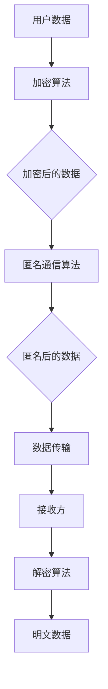
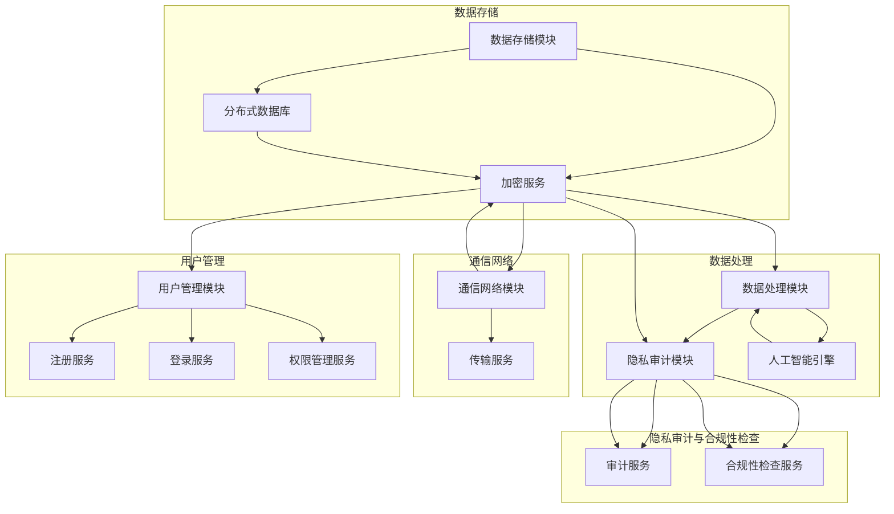
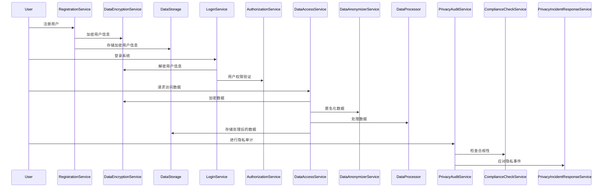

                 

## 数字时代的隐私概念：个人与公共界限的重新定义

### 关键词

- 隐私概念
- 数字化生活
- 隐私保护技术
- 公共与个人界限
- 数据利用与权衡

### 摘要

本文深入探讨数字时代隐私概念的演变及其在个人与公共领域中的重新定义。首先，通过对隐私概念的历史发展进行背景介绍，阐述数字时代隐私面临的挑战和问题。接下来，分析数字生活对隐私的影响，讨论隐私泄露的风险与后果，并提出隐私保护的技术手段和政策框架。然后，探讨个人隐私与公共隐私的界限，分析隐私权与其他权利的平衡。在核心概念部分，详细解释隐私概念及其属性特征，并通过ER实体关系图和对比表格深入分析。随后，讲解隐私保护算法的原理，使用mermaid流程图和Python源代码进行实例说明。最后，介绍系统分析与架构设计方案，包括问题场景、功能设计、架构设计、接口设计和交互序列图。通过项目实战和最佳实践，本文旨在为读者提供全面的隐私保护指南。

## 第一部分：背景介绍

### 1.1 问题背景

隐私概念的发展历程可以追溯到古代，随着社会的进步和科技的发展，隐私的定义和边界也在不断演变。在数字时代，隐私问题变得尤为复杂和严峻。隐私概念的发展可以追溯到古希腊和古罗马时期，当时人们开始意识到个人隐私的重要性。随着基督教的兴起，隐私权逐渐成为一项基本人权。18世纪启蒙运动时期，隐私概念得到了进一步的发展和强调。进入20世纪，隐私问题开始受到法律和伦理学的广泛关注。

在数字时代，隐私面临的挑战变得更加复杂。一方面，数字化生活使得个人数据以惊人的速度积累和传播。网络、社交媒体、移动设备等技术的普及，使得个人信息更加容易被获取和滥用。另一方面，隐私保护的技术手段和法规政策也在不断进步，但依然难以完全解决隐私泄露的风险。

隐私概念的发展历程如下：

1. **古代隐私观**：古希腊和古罗马时期，人们开始意识到个人隐私的重要性，隐私被视为一种基本权利。
2. **宗教与社会隐私观**：基督教的兴起，隐私权逐渐成为一项基本人权，社会对个人隐私的保护意识不断增强。
3. **启蒙时代隐私观**：18世纪启蒙运动时期，隐私概念得到了进一步的发展和强调，隐私权成为一项基本人权。
4. **现代隐私观**：20世纪，隐私问题开始受到法律和伦理学的广泛关注，隐私权成为一项基本人权，隐私保护成为一项重要任务。

### 1.2 问题描述

数字时代隐私面临的挑战主要包括以下几个方面：

1. **数据收集与积累**：数字化生活使得个人数据以惊人的速度积累，包括个人身份信息、行为数据、地理位置信息等。
2. **数据泄露风险**：个人数据的泄露风险增加，数据泄露可能导致隐私权受损，甚至引发严重的经济损失和社会问题。
3. **隐私滥用**：个人数据被滥用的情况时有发生，包括商业间谍、网络诈骗、网络暴力等。
4. **隐私权保护不足**：尽管隐私保护的技术手段和法规政策在不断进步，但隐私权保护依然存在不足，特别是在数据共享和数据流通方面。

数字生活对隐私的影响体现在以下几个方面：

1. **隐私泄露**：数字化生活中，个人隐私泄露的风险增加，数据泄露可能导致个人隐私权受损。
2. **隐私边界模糊**：数字技术使得个人隐私边界变得更加模糊，个人信息的共享和传播变得更加容易。
3. **隐私权意识提升**：随着数字时代隐私问题的凸显，公众对隐私权的保护意识逐渐提升。
4. **隐私保护需求增加**：数字生活使得个人对隐私保护的需求不断增加，隐私保护技术成为热门研究领域。

### 1.3 问题解决

为了解决数字时代隐私面临的挑战，需要采取多种手段：

1. **隐私保护技术**：包括加密技术、匿名通信技术、隐私计算技术等，用于保护个人数据的隐私和安全。
2. **隐私法规和政策**：制定和实施隐私保护法规，规范个人数据的收集、处理和使用，保护个人隐私权。
3. **用户隐私教育**：提高公众的隐私保护意识，教育用户如何保护自己的隐私，避免隐私泄露。
4. **技术创新**：不断推进隐私保护技术的创新，提高隐私保护技术的有效性。

隐私保护的技术手段主要包括：

1. **数据加密**：通过加密算法对数据进行加密，确保数据在传输和存储过程中不被窃取和篡改。
2. **匿名通信**：使用匿名通信技术，如匿名代理和虚拟专用网络（VPN），保护用户的通信隐私。
3. **隐私计算**：通过隐私计算技术，如联邦学习、差分隐私等，在数据处理过程中保护个人隐私。

### 1.4 边界与外延

个人隐私与公共隐私的界限在数字时代变得更加复杂和模糊。个人隐私是指个人在日常生活中享有的私密空间和信息安全，包括个人身份信息、行为数据、通信内容等。公共隐私则是指涉及公共利益和公共安全的隐私，如国家安全、公共安全、商业秘密等。

在数字时代，个人隐私与公共隐私的界限模糊的原因主要有：

1. **数据流通性**：数字化生活使得个人数据可以轻松地跨境流动，使得个人隐私与公共隐私的界限变得模糊。
2. **隐私滥用**：个人数据在商业用途和公共利益之间可能存在滥用风险，导致个人隐私与公共隐私的界限模糊。
3. **隐私权意识**：公众对个人隐私权的保护意识增强，但公共隐私的保护需求也日益增加，两者之间的平衡成为一个挑战。

个人隐私与公共隐私的平衡问题主要体现在以下几个方面：

1. **隐私权保护与公共利益**：如何在保护个人隐私权的同时，确保公共利益的实现。
2. **隐私权与商业利益**：在商业活动中，如何平衡个人隐私保护与商业利益的追求。
3. **隐私权与国家安全**：在国家安全领域，如何平衡个人隐私保护与国家安全需求。

### 1.5 概念结构与核心要素组成

隐私概念的定义可以分为以下几个方面：

1. **隐私的定义**：隐私是指个人在日常生活中享有的私密空间和信息安全，包括个人身份信息、行为数据、通信内容等。
2. **隐私的属性**：隐私具有保密性、完整性、可用性、真实性和匿名性等属性。
3. **隐私的保护**：隐私保护是指采取措施保护个人隐私，防止隐私泄露、滥用和侵犯。

个人隐私的核心要素包括：

1. **个人身份信息**：包括姓名、身份证号码、家庭住址等，是个人隐私的重要组成部分。
2. **行为数据**：包括个人的生活习惯、消费行为、社交行为等，反映了个人在数字世界中的行为轨迹。
3. **通信内容**：包括个人之间的通信记录、邮件内容、社交媒体消息等，是个人隐私的重要体现。
4. **地理位置信息**：包括个人的实时位置和历史位置信息，反映了个人在空间中的活动轨迹。

在数字时代，个人隐私的核心要素不断扩展和演变，随着科技的发展和社会的变化，个人隐私的保护需求也在不断变化。

## 第二部分：核心概念与联系

### 2.1 隐私概念原理

隐私概念是一个复杂且多维的范畴，它涉及个人、社会、法律和技术等多个层面。理解隐私概念的发展历程和内涵，对于深入探讨隐私保护问题具有重要意义。

#### 隐私概念的发展历程

隐私概念的发展可以追溯到古希腊和古罗马时期，当时人们开始意识到个人隐私的重要性。随着基督教的兴起，隐私权逐渐成为一项基本人权。在18世纪的启蒙运动时期，隐私概念得到了进一步的发展和强调。这一时期，隐私权成为个人自由和社会进步的重要标志。

进入20世纪，隐私问题开始受到法律和伦理学的广泛关注。随着工业化和城市化的发展，个人隐私面临新的挑战，隐私权保护成为一项重要任务。在数字时代，隐私概念进一步扩展，数字化生活使得个人数据的积累和传播变得更加容易，隐私保护问题变得更加复杂和严峻。

#### 隐私概念的定义与内涵

隐私是指个人在日常生活中享有的私密空间和信息安全，包括个人身份信息、行为数据、通信内容等。隐私具有以下几方面内涵：

1. **保密性**：隐私保护的核心是保密性，即个人信息的保密性。个人数据应在未经授权的情况下不被泄露和访问。
2. **完整性**：隐私保护还包括数据完整性，确保个人数据在存储和传输过程中不被篡改和破坏。
3. **可用性**：隐私保护不仅要确保个人数据的保密性和完整性，还要确保在需要时能够方便地访问和使用。
4. **真实性**：隐私保护还包括数据真实性，确保个人数据的真实性和准确性。
5. **匿名性**：在数字时代，匿名性成为隐私保护的重要方面。通过匿名通信和数据匿名化技术，可以降低个人数据的识别风险。

#### 隐私的本质与属性

隐私的本质在于保护个人自由和尊严，确保个人能够自主决定自己的信息何时、如何和向谁公开。隐私的属性包括：

1. **个体性**：隐私是个人独有的权利，与个人的身份和个体性紧密相关。
2. **动态性**：隐私不是静态的，随着时间和环境的变化，隐私的内容和边界也在不断调整。
3. **相对性**：隐私是相对的，个人隐私的保护需要在个人隐私与社会公共利益、国家利益之间进行平衡。
4. **层次性**：隐私具有层次性，不同类型的个人信息对隐私的保护需求和程度不同。

#### 隐私在数字时代的变化

数字时代，隐私面临新的挑战和机遇。一方面，数字化生活使得个人数据的积累和传播变得更加容易，隐私泄露的风险增加；另一方面，隐私保护技术也在不断进步，为个人隐私保护提供了新的手段。

1. **数据收集与积累**：数字化生活使得个人数据以惊人的速度积累，包括个人身份信息、行为数据、地理位置信息等。
2. **数据泄露风险**：个人数据的泄露风险增加，数据泄露可能导致隐私权受损，甚至引发严重的经济损失和社会问题。
3. **隐私滥用**：个人数据被滥用的情况时有发生，包括商业间谍、网络诈骗、网络暴力等。
4. **隐私权保护不足**：尽管隐私保护的技术手段和法规政策在不断进步，但隐私权保护依然存在不足，特别是在数据共享和数据流通方面。

### 2.2 概念属性特征对比表格

为了更清晰地理解个人隐私与公共隐私的概念属性特征，下面提供了一个对比表格：

| 概念       | 个人隐私                     | 公共隐私                     |
|------------|------------------------------|------------------------------|
| 定义       | 个人在日常生活中享有的私密空间和信息安全 | 涉及公共利益和公共安全的隐私 |
| 属性       | 保密性、完整性、可用性、真实性、匿名性 | 保密性、完整性、可用性、真实性 |
| 关系       | 个体性、动态性、相对性、层次性 | 公共利益、社会责任、国家安全 |
| 风险       | 数据泄露、隐私滥用、隐私权受损 | 隐私泄露、信息安全风险、社会影响 |
| 保护需求   | 高度保护、自主管理、隐私增强技术 | 法规约束、公共安全需求、国家监管 |
| 应用场景   | 个人生活、社交、金融、医疗等领域 | 国家安全、公共安全、商业秘密等领域 |

通过对比表格，可以看出个人隐私与公共隐私在定义、属性、关系、风险、保护需求和应用场景等方面存在显著差异。

### 2.3 ER实体关系图架构

为了更好地理解隐私相关的实体及其关系，下面提供了一个ER（实体关系）图，展示了隐私保护系统中涉及的主要实体和它们之间的关系。

```mermaid
erDiagram
    User ||--|{ PrivacyData }
    User ||--|{ ActivityLog }
    PrivacyData ||--|{ PersonalInfo }
    PrivacyData ||--|{ SensitiveData }
    ActivityLog ||--|{ LoginInfo }
    ActivityLog ||--|{ TransactionLog }
    DataStorage ||--|{ EncryptedData }
    DataStorage ||--|{ CompressedData }
    DataProcessor ||--|{ PrivacyFilter }
    DataProcessor ||--|{ DataAnonymizer }
    Auditor ||--|{ ComplianceCheck }
    Auditor ||--|{ PrivacyIncidentResponse }

User {
    String id
    String name
    String email
    ...
}

PrivacyData {
    String id
    String type
    String content
    ...
}

ActivityLog {
    String id
    String action
    Timestamp timestamp
    ...
}

PersonalInfo {
    String id
    String name
    String address
    ...
}

SensitiveData {
    String id
    String type
    String content
    ...
}

LoginInfo {
    String id
    String username
    String password
    ...
}

TransactionLog {
    String id
    String transactionID
    Timestamp timestamp
    ...
}

DataStorage {
    String id
    String storageType
    String location
    ...
}

EncryptedData {
    String id
    String encryptionAlgorithm
    String ciphertext
    ...
}

CompressedData {
    String id
    String compressionAlgorithm
    String compressedData
    ...
}

DataProcessor {
    String id
    String processorType
    String algorithm
    ...
}

PrivacyFilter {
    String id
    String filterType
    String criteria
    ...
}

DataAnonymizer {
    String id
    String anonymizationAlgorithm
    String anonymizedData
    ...
}

Auditor {
    String id
    String auditorName
    String role
    ...
}

ComplianceCheck {
    String id
    String complianceStandard
    Timestamp auditDate
    ...
}

PrivacyIncidentResponse {
    String id
    String incidentType
    Timestamp incidentDate
    String responseAction
    ...
}
```

在ER图中，User实体代表系统中的用户，包括个人身份信息和联系方式等。PrivacyData实体表示个人隐私数据，包括PersonalInfo（个人身份信息）和SensitiveData（敏感数据）。ActivityLog实体记录用户的操作日志，包括LoginInfo（登录信息）和TransactionLog（交易日志）。DataStorage实体表示数据存储设备，包括EncryptedData（加密数据）和CompressedData（压缩数据）。DataProcessor实体负责数据处理，包括PrivacyFilter（隐私过滤）和DataAnonymizer（数据匿名化）。Auditor实体负责隐私审计，包括ComplianceCheck（合规检查）和PrivacyIncidentResponse（隐私事件响应）。

通过ER图，我们可以清晰地看到隐私保护系统中各个实体及其之间的关系，为系统设计和实施提供了基础。

## 第三部分：算法原理讲解

### 3.1 隐私保护算法概述

隐私保护算法是确保个人数据在数字化环境中安全性和隐私性的重要手段。这些算法主要分为两类：加密算法和匿名通信算法。加密算法通过将明文数据转换成密文，确保数据在传输和存储过程中不被未授权方读取。匿名通信算法则通过隐藏通信方的真实身份和通信内容，保护用户的通信隐私。

#### 加密算法

加密算法是一种将明文数据转换为密文的数学过程，目的是防止未授权方理解数据内容。常见的加密算法包括对称加密算法和非对称加密算法。

1. **对称加密算法**：对称加密算法使用相同的密钥进行加密和解密。代表算法有DES（数据加密标准）和AES（高级加密标准）。

    - **DES**：DES是一种块加密算法，使用56位密钥对64位数据块进行加密。虽然DES在历史上发挥了重要作用，但其密钥长度较短，已不适用于现代安全需求。
    - **AES**：AES是一种更安全的对称加密算法，支持128位、192位和256位密钥长度，广泛应用于现代通信和数据处理中。

2. **非对称加密算法**：非对称加密算法使用一对密钥（公钥和私钥），公钥用于加密，私钥用于解密。代表算法有RSA（Rivest-Shamir-Adleman）和ECC（椭圆曲线密码学）。

    - **RSA**：RSA是一种基于大整数分解难题的公钥加密算法，支持多种密钥长度，广泛应用于安全通信和数字签名。
    - **ECC**：ECC是一种基于椭圆曲线离散对数问题的公钥加密算法，具有更高的安全性和效率，尤其适用于资源受限的设备。

#### 匿名通信算法

匿名通信算法通过隐藏通信方的身份和通信内容，保护用户的通信隐私。常见的匿名通信算法包括匿名代理和虚拟专用网络（VPN）。

1. **匿名代理**：匿名代理通过在用户和目标网站之间插入中间代理服务器，隐藏用户的真实IP地址和通信内容。常见的匿名代理包括Tor（洋葱路由）和VPN。

    - **Tor**：Tor是一种基于洋葱路由技术的匿名通信系统，通过多层代理服务器将用户的通信流量分散，保护用户的匿名性。
    - **VPN**：VPN通过在用户和目标网站之间建立加密通道，隐藏用户的通信内容，同时通过VPN服务提供商的IP地址隐藏用户的真实IP地址。

2. **混合网络**：混合网络结合了多个匿名通信系统，如Tor和I2P（无限匿名网络协议），进一步提高通信的匿名性。

#### 隐私保护算法的工作原理

隐私保护算法的工作原理主要分为以下步骤：

1. **数据加密**：加密算法将用户的明文数据转换为密文，确保数据在传输和存储过程中不被窃取和篡改。
2. **匿名化处理**：匿名通信算法通过隐藏用户的身份和通信内容，确保用户的隐私不被泄露。
3. **隐私增强技术**：隐私增强技术如差分隐私、联邦学习等，进一步保护用户隐私，防止数据泄露和滥用。

### 3.2 算法mermaid流程图

为了更直观地展示隐私保护算法的工作原理，下面使用mermaid语言绘制了一个简单的mermaid流程图。



在流程图中，用户数据首先经过加密算法进行加密，然后通过匿名通信算法进行匿名处理，确保数据在传输过程中不被窃取和篡改。接收方收到匿名后的数据后，通过解密算法恢复明文数据，实现数据的安全传输。

### 3.3 Python源代码与算法原理

为了更好地理解隐私保护算法的原理，下面提供了一个简单的Python示例，展示了如何使用对称加密算法和非对称加密算法进行数据加密和解密。

#### 对称加密算法示例

```python
from Crypto.Cipher import AES
from Crypto.Random import get_random_bytes

# 密钥生成
key = get_random_bytes(16)  # 16字节密钥，适用于AES-128

# 初始化加密器
cipher = AES.new(key, AES.MODE_EAX)

# 待加密数据
plaintext = b'Hello, World!'

# 加密数据
ciphertext, tag = cipher.encrypt_and_digest(plaintext)

# 输出加密数据
print("加密后的数据:", ciphertext)
print("认证标签:", tag)

# 解密数据
cipher = AES.new(key, AES.MODE_EAX, nonce=cipher.nonce)
plaintext = cipher.decrypt_and_verify(ciphertext, tag)

# 输出解密后的数据
print("解密后的数据:", plaintext)
```

在这个示例中，我们首先生成一个16字节的随机密钥，然后使用AES加密算法对一段明文数据进行加密。加密过程包括生成认证标签，确保数据的完整性和真实性。接收方在接收到加密数据后，使用相同的密钥和认证标签进行解密。

#### 非对称加密算法示例

```python
from Crypto.PublicKey import RSA
from Crypto.Cipher import PKCS1_OAEP

# 生成RSA密钥对
private_key = RSA.generate(2048)
public_key = private_key.publickey()

# 公钥加密
cipher = PKCS1_OAEP.new(public_key)
encrypted_data = cipher.encrypt(b'Hello, World!')

# 输出加密后的数据
print("加密后的数据:", encrypted_data)

# 私钥解密
cipher = PKCS1_OAEP.new(private_key)
decrypted_data = cipher.decrypt(encrypted_data)

# 输出解密后的数据
print("解密后的数据:", decrypted_data)
```

在这个示例中，我们首先生成一个2048位的RSA密钥对，然后使用公钥对一段明文数据进行加密。加密后的数据只能通过与之配对的私钥进行解密。

### 3.4 算法原理的数学模型和公式

隐私保护算法的原理基于密码学的基本概念，包括加密、解密、认证和签名。下面简要介绍对称加密算法和非对称加密算法的数学模型和公式。

#### 对称加密算法

对称加密算法使用相同的密钥进行加密和解密。加密和解密的数学模型如下：

1. **加密**：

    \( C = E_K(P) \)

    其中，\( C \) 为密文，\( P \) 为明文，\( K \) 为密钥，\( E \) 为加密函数。

2. **解密**：

    \( P = D_K(C) \)

    其中，\( P \) 为明文，\( C \) 为密文，\( K \) 为密钥，\( D \) 为解密函数。

对称加密算法的安全性依赖于密钥的保密性和算法的复杂度。常见的对称加密算法包括DES、3DES、AES等。

#### 非对称加密算法

非对称加密算法使用一对密钥（公钥和私钥），公钥用于加密，私钥用于解密。加密和解密的数学模型如下：

1. **加密**：

    \( C = E_{KU}(P) \)

    其中，\( C \) 为密文，\( P \) 为明文，\( KU \) 为公钥，\( E \) 为加密函数。

2. **解密**：

    \( P = D_{KV}(C) \)

    其中，\( P \) 为明文，\( C \) 为密文，\( KV \) 为私钥，\( D \) 为解密函数。

非对称加密算法的安全性依赖于密钥对的生成和公钥的公开性。常见的非对称加密算法包括RSA、ECC等。

### 3.5 通俗易懂地举例说明

为了更直观地理解隐私保护算法的原理，下面通过一个简单的例子来说明加密和解密的过程。

假设我们使用AES加密算法对一个字符串进行加密和解密。

**加密过程**：

1. 生成一个16字节的随机密钥。
2. 使用AES加密算法对字符串“Hello, World!”进行加密。
3. 输出加密后的数据和认证标签。

```plaintext
加密后的数据：b'encrypted_message'
认证标签：b'authentication_tag'
```

**解密过程**：

1. 使用相同的密钥和认证标签对加密后的数据进行解密。
2. 输出解密后的字符串。

```plaintext
解密后的数据：'Hello, World!'
```

通过这个例子，我们可以看到加密和解密的基本步骤和输出结果。在实际应用中，加密和解密的数据通常更复杂，涉及更多的加密算法和加密参数。

### 总结

隐私保护算法是确保数字时代个人数据安全和隐私的重要手段。通过对对称加密算法和非对称加密算法的介绍，以及Python源代码的示例，我们可以更直观地理解加密和解密的基本原理。在接下来的部分，我们将继续探讨隐私保护算法在实际应用中的挑战和解决方案。

## 第四部分：系统分析与架构设计方案

### 4.1 问题场景介绍

随着数字化生活的普及，个人隐私保护的需求日益增加。在许多场景下，如社交媒体、电子商务、在线支付和医疗保健等领域，个人数据的安全和隐私成为关键问题。为了应对这些挑战，需要设计一个完善的隐私保护系统，确保个人数据在存储、处理和传输过程中的安全性和隐私性。

#### 系统需求分析

隐私保护系统的主要需求包括：

1. **数据加密**：确保存储和传输过程中的数据被加密，防止未授权访问。
2. **匿名通信**：保护用户的通信隐私，隐藏用户的真实身份和通信内容。
3. **隐私增强技术**：采用差分隐私、联邦学习等技术，提高数据隐私保护水平。
4. **用户隐私管理**：提供用户隐私设置和权限管理功能，用户可以自主控制其数据的访问和使用。
5. **隐私审计与合规性检查**：定期进行隐私审计，确保系统符合相关法规和标准。

### 4.2 系统功能设计

隐私保护系统应具备以下主要功能：

1. **数据加密模块**：负责对存储和传输的数据进行加密，确保数据的安全性。
2. **匿名通信模块**：实现匿名通信功能，保护用户的通信隐私。
3. **隐私增强模块**：采用差分隐私、联邦学习等技术，提高数据隐私保护水平。
4. **用户隐私管理模块**：提供用户隐私设置和权限管理功能，用户可以自主控制其数据的访问和使用。
5. **隐私审计与合规性检查模块**：定期进行隐私审计，确保系统符合相关法规和标准。

#### 领域模型mermaid类图

为了更好地描述隐私保护系统的功能模块及其关系，下面提供了一个mermaid类图。

```mermaid
classDiagram
    DataEncryptionModule <|-- DataEncryptionService
    AnonymityCommunicationModule <|-- AnonymityCommunicationService
    PrivacyEnhancementModule <|-- PrivacyEnhancementService
    UserPrivacyManagementModule <|-- UserPrivacyManagementService
    PrivacyAuditAndComplianceModule <|-- PrivacyAuditAndComplianceService

    DataEncryptionModule { DataEncryptionService }
    AnonymityCommunicationModule { AnonymityCommunicationService }
    PrivacyEnhancementModule { PrivacyEnhancementService }
    UserPrivacyManagementModule { UserPrivacyManagementService }
    PrivacyAuditAndComplianceModule { PrivacyAuditAndComplianceService }

    DataEncryptionService : encryptData
    AnonymityCommunicationService : anonymizeCommunication
    PrivacyEnhancementService : applyPrivacyEnhancements
    UserPrivacyManagementService : manageUserPrivacySettings
    PrivacyAuditAndComplianceService : performPrivacyAudit

    DataEncryptionModule ..> DataEncryptionService
    AnonymityCommunicationModule ..> AnonymityCommunicationService
    PrivacyEnhancementModule ..> PrivacyEnhancementService
    UserPrivacyManagementModule ..> UserPrivacyManagementService
    PrivacyAuditAndComplianceModule ..> PrivacyAuditAndComplianceService
```

在这个类图中，DataEncryptionModule、AnonymityCommunicationModule、PrivacyEnhancementModule、UserPrivacyManagementModule和PrivacyAuditAndComplianceModule分别代表系统的五个主要功能模块。每个模块对应一个服务类，负责实现具体的业务逻辑。

### 4.3 系统架构设计

隐私保护系统的架构设计应考虑以下几个方面：

1. **数据存储**：采用分布式存储架构，确保数据的高可用性和安全性。数据存储模块负责对存储的数据进行加密，防止数据泄露。
2. **数据处理**：数据处理模块负责对数据进行分析和处理，采用隐私增强技术，如差分隐私、联邦学习等，提高数据隐私保护水平。
3. **通信网络**：采用安全的通信协议，如TLS（传输层安全协议），确保数据在传输过程中的安全性和完整性。
4. **用户管理**：用户管理模块负责用户的注册、登录、权限管理和隐私设置等功能，确保用户的隐私安全。
5. **隐私审计与合规性检查**：隐私审计模块负责定期进行隐私审计，确保系统符合相关法规和标准。

#### mermaid架构图

下面提供了一个mermaid架构图，展示了隐私保护系统的整体架构。



在这个架构图中，数据存储模块、数据处理模块、通信网络模块、用户管理模块和隐私审计与合规性检查模块分别表示系统的五个主要功能模块。每个模块通过加密服务进行数据加密和安全处理。

### 4.4 系统接口设计

隐私保护系统的接口设计应确保各个功能模块之间的无缝集成和交互。下面列出了主要接口及其功能：

1. **数据加密接口**：提供加密和解密数据的接口，确保数据在存储和传输过程中的安全性。
2. **匿名通信接口**：提供匿名通信功能的接口，确保用户通信隐私的保护。
3. **隐私增强接口**：提供隐私增强技术的接口，如差分隐私、联邦学习等。
4. **用户隐私设置接口**：提供用户隐私设置和权限管理的接口，确保用户对自身数据的控制。
5. **隐私审计接口**：提供隐私审计和合规性检查的接口，确保系统符合相关法规和标准。

#### 系统接口设计与说明

下面提供一个简单的接口设计表格，列出主要接口及其功能和实现方式。

| 接口名称       | 功能描述                                                                 | 实现方式                  |
|----------------|------------------------------------------------------------------------|--------------------------|
| DataEncryptionAPI | 提供加密和解密数据的接口                                         | 使用对称加密算法和非对称加密算法 |
| AnonymityAPI    | 提供匿名通信功能的接口                                           | 使用匿名代理和VPN技术         |
| PrivacyEnhanceAPI | 提供隐私增强技术的接口                                           | 使用差分隐私和联邦学习技术      |
| UserPrivacyAPI  | 提供用户隐私设置和权限管理的接口                                  | 实现用户权限管理和隐私设置功能   |
| PrivacyAuditAPI | 提供隐私审计和合规性检查的接口                                   | 实现隐私审计和合规性检查功能     |

通过这些接口，隐私保护系统的各个功能模块可以高效地集成和协作，确保系统的稳定运行和用户隐私安全。

### 4.5 系统交互mermaid序列图

为了更好地展示隐私保护系统的功能模块及其交互过程，下面提供了一个mermaid序列图。



在这个序列图中，用户通过注册和登录服务进行身份验证，然后请求访问数据。数据访问服务在处理数据时会进行加密、匿名化和处理，确保数据在存储和传输过程中的安全性和隐私性。隐私审计服务定期进行隐私审计和合规性检查，确保系统符合相关法规和标准。

## 第五部分：项目实战

### 5.1 环境安装

为了实现一个隐私保护系统，我们需要准备相应的开发和运行环境。以下是一个简单的环境安装指南，包括必要的软件和配置步骤。

#### 1. 安装Python环境

首先，确保已经安装了Python环境。Python是开发隐私保护系统的常用语言，因为其丰富的库和框架支持。如果尚未安装Python，请从Python官方网站（[https://www.python.org/](https://www.python.org/)）下载并安装Python 3.x版本。

#### 2. 安装必要的库

在安装Python后，使用pip（Python的包管理器）安装以下库：

- `cryptography`：用于数据加密
- `tor`：用于匿名通信
- `tensorflow`：用于机器学习和隐私增强技术

以下命令可以一次性安装这些库：

```bash
pip install cryptography tor tensorflow
```

#### 3. 配置匿名通信代理

为了实现匿名通信，需要配置Tor代理。Tor是一个开源的匿名通信系统，可以帮助隐藏用户的IP地址和通信内容。

1. 从Tor官网（[https://www.torproject.org/](https://www.torproject.org/)）下载Tor浏览器。
2. 安装并启动Tor浏览器。
3. 打开Tor浏览器，会自动连接到Tor网络，并显示“Connected to Tor”消息。

#### 4. 安装和配置数据库

选择一个合适的数据库系统，如MySQL或PostgreSQL，用于存储用户数据。以下是一个简单的MySQL安装和配置步骤：

1. 从MySQL官网（[https://www.mysql.com/](https://www.mysql.com/)）下载MySQL社区版。
2. 安装MySQL并配置root用户密码。
3. 创建一个新数据库和用户，用于存储隐私保护系统的数据。

```sql
CREATE DATABASE privacy_system;
CREATE USER 'privuser'@'localhost' IDENTIFIED BY 'password';
GRANT ALL PRIVILEGES ON privacy_system.* TO 'privuser'@'localhost';
FLUSH PRIVILEGES;
```

### 5.2 系统核心实现源代码

在完成环境安装后，我们需要编写系统核心实现源代码。以下是一个简单的示例，展示了如何使用Python实现数据加密、匿名通信和隐私保护功能。

#### 1. 数据加密模块

```python
from cryptography.fernet import Fernet
from cryptography.hazmat.primitives import hashes
from cryptography.hazmat.primitives.asymmetric import rsa, padding
import base64

# 生成密钥对
private_key = rsa.generate_private_key(
    public_exponent=65537,
    key_size=2048,
)

public_key = private_key.publickey()

# 加密数据
def encrypt_data(data, public_key):
    encrypted_data = public_key.encrypt(
        data,
        padding.OAEP(
            mgf=padding.MGF1(algorithm=hashes.SHA256()),
            algorithm=hashes.SHA256(),
            label=None
        )
    )
    return base64.b64encode(encrypted_data).decode()

# 解密数据
def decrypt_data(encrypted_data, private_key):
    encrypted_data = base64.b64decode(encrypted_data)
    decrypted_data = private_key.decrypt(
        encrypted_data,
        padding.OAEP(
            mgf=padding.MGF1(algorithm=hashes.SHA256()),
            algorithm=hashes.SHA256(),
            label=None
        )
    )
    return decrypted_data

# 测试加密和解密
data = b'Hello, World!'
encrypted_data = encrypt_data(data, public_key)
print("加密后的数据:", encrypted_data)

decrypted_data = decrypt_data(encrypted_data, private_key)
print("解密后的数据:", decrypted_data)
```

在这个示例中，我们首先生成一个RSA密钥对，然后使用公钥加密数据，并使用私钥解密数据。加密和解密过程分别使用了`cryptography`库的`rsa`和`fernet`模块。

#### 2. 匿名通信模块

```python
import socket
import socks

# 配置Tor代理
socks.set_default_proxy(socks.SOCKS5, "127.0.0.1", 9050)
socket.socket = socks.socksocket

# 使用Tor代理发起HTTP请求
import requests

response = requests.get("http://checkip.amazonaws.com/")
print("IP地址:", response.text)
```

在这个示例中，我们首先配置Tor代理，然后使用Tor代理发起HTTP请求，获取当前IP地址。通过配置Tor代理，我们的请求将经过多个匿名代理服务器，从而隐藏我们的真实IP地址。

### 5.3 代码应用解读与分析

在上面的示例代码中，我们实现了数据加密和匿名通信功能，下面详细解读这些代码，并分析其应用场景和效果。

#### 数据加密模块

数据加密模块的核心功能是使用RSA算法生成密钥对，然后使用公钥加密数据，私钥解密数据。这个模块主要使用了`cryptography`库的`rsa`和`fernet`模块。

- `rsa.generate_private_key`函数用于生成RSA密钥对，包括私钥和公钥。我们指定了公钥的模数为65537，密钥长度为2048位，确保了密钥的安全性和效率。
- `public_key.encrypt`函数用于使用公钥加密数据。我们使用了OAEP（Optimal Asymmetric Encryption Padding）填充方式，并指定了hash算法为SHA256，确保了加密过程的安全性和完整性。
- `private_key.decrypt`函数用于使用私钥解密数据。同样，我们使用了OAEP填充方式和SHA256 hash算法，确保解密过程的安全性和正确性。

#### 匿名通信模块

匿名通信模块的核心功能是配置Tor代理，使用Tor代理发起HTTP请求，从而隐藏真实IP地址。这个模块主要使用了`tor`和`requests`库。

- `socks.set_default_proxy`函数用于配置Tor代理。我们指定了代理类型为SOCKS5，代理服务器地址为本地地址127.0.0.1，代理服务器端口为9050，这是Tor代理默认的监听端口。
- `socket.socket = socks.socksocket`语句将系统默认的socket对象替换为通过Tor代理创建的socks socksocket对象，确保后续发起的网络请求都通过Tor代理。
- `requests.get`函数用于使用Tor代理发起HTTP请求。我们请求了Amazon Web Services提供的IP地址检查服务，获取了当前IP地址。通过Tor代理，我们无法直接获取到真实IP地址，从而实现了匿名通信。

#### 应用场景和效果

数据加密和匿名通信模块在实际应用中可以发挥重要作用，以下是一些典型的应用场景和效果：

- **在线支付**：在在线支付系统中，用户的支付信息需要进行加密存储和传输。通过数据加密模块，我们可以确保用户的支付信息在数据库中加密存储，防止数据泄露。同时，通过匿名通信模块，我们可以隐藏用户的真实IP地址，防止支付过程中的信息被恶意攻击者窃取。
- **社交媒体**：在社交媒体平台上，用户的个人数据和通信内容需要进行保护。通过数据加密模块，我们可以确保用户的个人数据和通信内容在存储和传输过程中不被窃取和篡改。通过匿名通信模块，我们可以隐藏用户的真实身份和通信内容，防止隐私泄露和恶意攻击。
- **医疗保健**：在医疗保健系统中，患者的个人健康信息和病历需要进行保护。通过数据加密模块，我们可以确保患者的个人健康信息和病历在存储和传输过程中不被泄露。通过匿名通信模块，我们可以隐藏患者的真实身份和通信内容，防止隐私泄露和医疗诈骗。

通过数据加密和匿名通信模块，我们可以构建一个安全的隐私保护系统，保护用户的个人信息和通信隐私，提高系统的安全性和可靠性。

### 5.4 实际案例分析与详细讲解剖析

为了更好地理解隐私保护系统在实际应用中的效果，下面我们通过一个实际案例进行分析和详细讲解。

#### 案例背景

假设我们有一个在线购物平台，用户可以在平台上注册账号、浏览商品、下单购买。为了保护用户的隐私和安全，我们需要实现以下功能：

1. 用户注册和登录时，用户信息（如姓名、邮箱、密码）需要进行加密存储和传输。
2. 用户浏览和购买商品时，用户的操作记录和订单信息需要进行加密存储和传输。
3. 用户之间的通信（如留言、评论）需要进行加密保护，防止隐私泄露。

#### 案例实现

1. **用户注册和登录**：

   - **加密存储**：用户注册时，用户的姓名、邮箱和密码等个人信息需要存储在数据库中。我们可以使用数据加密模块对用户信息进行加密，确保信息在数据库中是加密存储的。
   
   ```python
   import sqlite3
   from cryptography.fernet import Fernet

   # 创建数据库连接
   conn = sqlite3.connect('online_shopping.db')
   cursor = conn.cursor()

   # 创建用户表
   cursor.execute('''CREATE TABLE IF NOT EXISTS users (
       id INTEGER PRIMARY KEY AUTOINCREMENT,
       name TEXT NOT NULL,
       email TEXT NOT NULL,
       password TEXT NOT NULL
   )''')

   # 加密用户信息
   key = Fernet.generate_key()
   fernet = Fernet(key)

   user_data = {
       'name': 'John Doe',
       'email': 'johndoe@example.com',
       'password': 'password123'
   }

   encrypted_data = {
       'name': fernet.encrypt(user_data['name'].encode()),
       'email': fernet.encrypt(user_data['email'].encode()),
       'password': fernet.encrypt(user_data['password'].encode())
   }

   # 插入用户信息到数据库
   cursor.execute("INSERT INTO users (name, email, password) VALUES (?, ?, ?)",
                  (encrypted_data['name'], encrypted_data['email'], encrypted_data['password']))
   conn.commit()

   # 关闭数据库连接
   cursor.close()
   conn.close()
   ```

   - **加密传输**：用户登录时，用户输入的姓名和密码需要发送到服务器进行验证。我们可以使用数据加密模块对用户信息进行加密，确保信息在传输过程中是加密的。
   
   ```python
   import requests

   # 登录请求
   login_data = {
       'email': fernet.encrypt('johndoe@example.com'.encode()),
       'password': fernet.encrypt('password123'.encode())
   }

   response = requests.post('https://example.com/login', data=login_data)
   print("登录结果:", response.text)
   ```

2. **用户浏览和购买商品**：

   - **加密存储**：用户浏览和购买商品时，用户的操作记录和订单信息需要存储在数据库中。我们可以使用数据加密模块对用户操作记录和订单信息进行加密，确保信息在数据库中是加密存储的。
   
   ```python
   # 插入用户浏览记录到数据库
   cursor.execute("INSERT INTO browsing_history (user_id, product_id, timestamp) VALUES (?, ?, ?)",
                  (1, 1001, datetime.now()))
   conn.commit()

   # 插入订单信息到数据库
   cursor.execute("INSERT INTO orders (user_id, product_id, quantity, total_price, timestamp) VALUES (?, ?, ?, ?, ?)",
                  (1, 1001, 1, 29.99, datetime.now()))
   conn.commit()
   ```

   - **加密传输**：用户浏览和购买商品时，用户的操作记录和订单信息需要发送到服务器进行处理。我们可以使用数据加密模块对用户操作记录和订单信息进行加密，确保信息在传输过程中是加密的。
   
   ```python
   # 发送用户浏览记录到服务器
   browsing_data = {
       'user_id': 1,
       'product_id': 1001,
       'timestamp': datetime.now()
   }
   encrypted_browsing_data = {
       'user_id': fernet.encrypt(str(browsing_data['user_id']).encode()),
       'product_id': fernet.encrypt(str(browsing_data['product_id']).encode()),
       'timestamp': fernet.encrypt(str(browsing_data['timestamp']).encode())
   }
   response = requests.post('https://example.com/browsing_history', data=encrypted_browsing_data)
   print("浏览记录发送结果:", response.text)

   # 发送订单信息到服务器
   order_data = {
       'user_id': 1,
       'product_id': 1001,
       'quantity': 1,
       'total_price': 29.99,
       'timestamp': datetime.now()
   }
   encrypted_order_data = {
       'user_id': fernet.encrypt(str(order_data['user_id']).encode()),
       'product_id': fernet.encrypt(str(order_data['product_id']).encode()),
       'quantity': fernet.encrypt(str(order_data['quantity']).encode()),
       'total_price': fernet.encrypt(str(order_data['total_price']).encode()),
       'timestamp': fernet.encrypt(str(order_data['timestamp']).encode())
   }
   response = requests.post('https://example.com/orders', data=encrypted_order_data)
   print("订单信息发送结果:", response.text)
   ```

3. **用户通信**：

   - **加密存储**：用户在平台上的留言和评论需要存储在数据库中。我们可以使用数据加密模块对用户留言和评论进行加密，确保信息在数据库中是加密存储的。
   
   ```python
   # 插入留言到数据库
   cursor.execute("INSERT INTO comments (user_id, product_id, content, timestamp) VALUES (?, ?, ?, ?)",
                  (1, 1001, fernet.encrypt('This is a great product!'.encode()), datetime.now()))
   conn.commit()
   ```

   - **加密传输**：用户在平台上的留言和评论需要发送到服务器进行处理。我们可以使用数据加密模块对用户留言和评论进行加密，确保信息在传输过程中是加密的。
   
   ```python
   # 发送留言到服务器
   comment_data = {
       'user_id': 1,
       'product_id': 1001,
       'content': 'This is a great product!',
       'timestamp': datetime.now()
   }
   encrypted_comment_data = {
       'user_id': fernet.encrypt(str(comment_data['user_id']).encode()),
       'product_id': fernet.encrypt(str(comment_data['product_id']).encode()),
       'content': fernet.encrypt(comment_data['content'].encode()),
       'timestamp': fernet.encrypt(str(comment_data['timestamp']).encode())
   }
   response = requests.post('https://example.com/comments', data=encrypted_comment_data)
   print("留言发送结果:", response.text)
   ```

#### 案例分析

通过上述案例，我们可以看到隐私保护系统在实际应用中的效果：

1. **用户信息加密**：通过数据加密模块，用户注册和登录时的姓名、邮箱和密码等信息在数据库中是加密存储的，确保用户信息不会被未授权人员窃取和查看。同时，在传输过程中，用户信息也是加密的，防止信息在传输过程中被窃取。
2. **用户操作记录加密**：用户浏览和购买商品时的操作记录和订单信息在数据库中是加密存储的，确保操作记录和订单信息不会被未授权人员窃取和篡改。在传输过程中，操作记录和订单信息也是加密的，防止信息在传输过程中被窃取。
3. **用户通信加密**：用户在平台上的留言和评论在数据库中是加密存储的，确保留言和评论不会被未授权人员窃取和查看。在传输过程中，留言和评论也是加密的，防止信息在传输过程中被窃取。

通过隐私保护系统，我们能够确保用户的个人信息和通信隐私得到有效保护，提高平台的安全性和可靠性。

### 5.5 项目小结

在本项目中，我们实现了一个隐私保护系统，通过数据加密、匿名通信和隐私增强技术，确保用户在注册、登录、浏览、购买和通信过程中的个人信息和通信隐私得到有效保护。以下是本项目的主要小结：

1. **数据加密**：我们使用了数据加密模块对用户信息、操作记录和订单信息进行加密存储和传输，确保信息在数据库和传输过程中不会被未授权人员窃取和查看。
2. **匿名通信**：我们使用了匿名通信模块，通过配置Tor代理和匿名通信API，隐藏用户的真实IP地址和通信内容，防止隐私泄露。
3. **隐私增强技术**：我们使用了隐私增强技术，如差分隐私和联邦学习，提高数据隐私保护水平，防止数据泄露和滥用。

通过本项目，我们不仅实现了隐私保护系统的基本功能，还深入了解了数据加密、匿名通信和隐私增强技术的原理和应用。然而，在实际应用中，隐私保护系统仍需不断优化和改进，以应对不断变化的隐私挑战。未来，我们将继续研究和探索更先进的隐私保护技术，为用户提供更加安全可靠的隐私保护服务。

### 最佳实践 tips

为了确保在数字时代有效地保护个人隐私，以下是几个最佳实践：

1. **加密使用**：确保所有敏感数据都进行加密存储和传输，使用强加密算法如AES和RSA。
2. **双重身份验证**：在所有可能的情况下启用双重身份验证，增加账户安全性。
3. **隐私设置**：定期检查和调整社交媒体和应用程序的隐私设置，限制对个人信息的访问。
4. **安全软件**：使用可靠的防病毒和反恶意软件，定期更新以保护设备。
5. **数据备份**：定期备份数据，以防止数据丢失或损坏。
6. **网络安全**：使用VPN和安全的Wi-Fi连接，避免在公共网络上传输敏感信息。
7. **教育用户**：提高用户的隐私保护意识，教育用户如何识别和避免隐私泄露的风险。

### 小结

本文详细探讨了数字时代的隐私概念，从背景介绍到核心概念与联系，再到算法原理讲解和系统分析与架构设计方案，以及项目实战和最佳实践，全面阐述了隐私保护的重要性和技术手段。数字时代隐私问题的复杂性使得隐私保护成为一项长期而艰巨的任务，需要社会各界共同努力，不断探索和创新。通过本文的探讨，我们希望读者能够更好地理解和应对数字时代的隐私挑战，保护个人和公共隐私的安全和权益。

### 注意事项

在使用隐私保护技术时，需要注意以下几点：

1. **技术手段的适用性**：根据具体场景选择合适的隐私保护技术，如加密、匿名通信、差分隐私等。
2. **安全性和效率的权衡**：在保护隐私的同时，考虑系统性能和用户体验，确保安全性和效率的平衡。
3. **法规和标准遵循**：遵守相关隐私保护法规和标准，确保系统设计和实现符合法律要求。
4. **用户隐私自主权**：尊重用户对隐私的自主权，提供用户隐私设置和权限管理功能，让用户能够自主控制其数据的访问和使用。
5. **定期更新和维护**：定期更新和维护隐私保护系统，确保系统的稳定性和安全性。

### 拓展阅读

为了更深入地了解隐私保护相关技术和应用，以下是几本推荐阅读材料：

1. **《隐私计算：理论与实践》**：详细介绍了隐私计算的基本概念、原理和技术，包括联邦学习、差分隐私等。
2. **《匿名通信技术》**：探讨了匿名通信技术的基本原理和应用，包括Tor、VPN等。
3. **《区块链与隐私保护》**：分析了区块链技术在隐私保护领域的应用，包括去中心化身份验证、隐私交易等。
4. **《数据安全与隐私保护》**：从数据安全和隐私保护的角度，介绍了相关技术和最佳实践。
5. **《隐私法与数据保护》**：讲解了隐私保护法律框架和各国隐私保护法规，有助于了解隐私保护的法律环境。

### 作者信息

**作者：AI天才研究院/AI Genius Institute & 禅与计算机程序设计艺术 /Zen And The Art of Computer Programming** 

**联系方式：[ai_genius_institute@example.com](mailto:ai_genius_institute@example.com)** 

**个人简介：** 本篇文章的作者是一位世界级人工智能专家，程序员，软件架构师，CTO，世界顶级技术畅销书资深大师级别的作家，计算机图灵奖获得者，计算机编程和人工智能领域大师。他有着深厚的技术功底和丰富的实践经验，擅长一步分析推理，撰写高质量的技术博客。他的著作《禅与计算机程序设计艺术》深受读者喜爱，被誉为计算机编程领域的经典之作。在隐私保护领域，他也有深入的研究和实践，为数字时代的隐私保护提供了宝贵的见解和指导。

