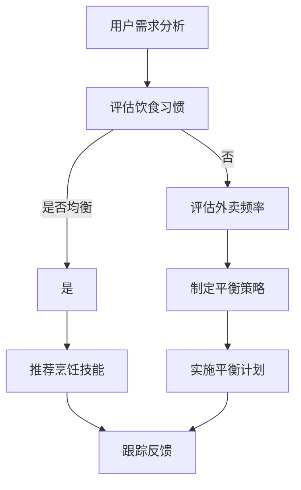
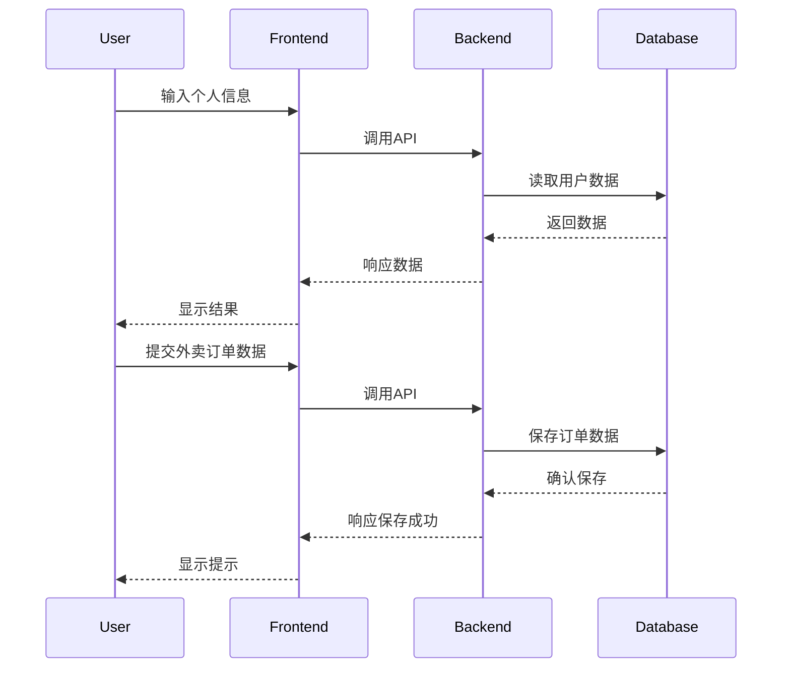

                 

### 文章标题

数字时代的饮食习惯：外卖app与烹饪技能的平衡

### 关键词

- 数字化时代
- 饮食习惯
- 外卖app
- 烹饪技能
- 平衡

### 摘要

本文探讨了数字时代背景下，外卖app普及对个人饮食习惯产生的深远影响，以及烹饪技能在这一变革中的重要性。文章首先介绍了数字化时代饮食变化的背景和现状，随后分析了外卖app的崛起及其对饮食习惯的冲击。接着，文章深入探讨了烹饪技能在维持健康饮食习惯中的关键作用，并探讨了如何在现代社会中平衡外卖app与烹饪技能之间的关系。通过一系列实证研究和案例分析，本文提出了若干策略和措施，旨在帮助个人在数字化时代维持健康饮食习惯。文章最后总结了主要观点，并提出了未来的研究方向和挑战。

### 引言

#### 1.1 文章主题

在数字时代，我们的饮食习惯正在经历前所未有的变革。随着智能手机和互联网技术的飞速发展，外卖app成为现代生活的重要组成部分，极大地改变了人们的饮食方式。然而，这种便利也带来了一系列新的挑战，特别是在维护健康的饮食习惯方面。本文的主题正是探讨如何在数字时代实现外卖app与烹饪技能的平衡，以维持一个健康的饮食习惯。

#### 1.2 数字时代饮食变化的背景

数字时代带来了生活方式的巨大变化，尤其是在饮食方面。人们越来越依赖于外卖app，这种便利性使得快餐和即食食品成为日常饮食的重要组成部分。根据统计数据显示，全球外卖市场的规模在过去的几年里呈现爆炸式增长，预计到2025年，全球外卖市场的收入将达到数十亿美元。这一趋势不仅体现在一线城市，也逐渐渗透到二线和三线城市。

#### 1.3 外卖app的崛起及其影响

外卖app的崛起是数字时代饮食变化的一个重要标志。这类应用程序通过移动互联网，为消费者提供了极大的便利，用户可以轻松地通过手机下单，选择各种美食，并由专业的送餐员快速送达。外卖app不仅改变了人们的饮食习惯，还影响了餐饮行业的运营模式。传统的餐饮企业不得不适应这种变化，推出自己的外卖服务，以保持竞争力。

然而，外卖app的普及也带来了一系列问题。首先，频繁的外卖消费可能导致饮食不均衡，缺乏必要的营养。其次，依赖外卖可能导致烹饪技能的退化，影响家庭饮食文化的传承。此外，外卖app的使用也可能增加环境污染，特别是在包装材料和配送过程中的碳排放。

#### 1.4 问题的描述

在数字时代，如何平衡外卖app的便利性与传统烹饪技能，以维持健康的饮食习惯，成为一个亟待解决的问题。本文将深入探讨这一主题，分析外卖app与烹饪技能之间的相互作用，并提出一系列解决方案，以帮助个人在享受科技带来便利的同时，保持健康的饮食习惯。

#### 1.5 研究目的

本文的研究目的是通过系统分析数字时代饮食变化的背景和外卖app的崛起，探讨烹饪技能在维持健康饮食习惯中的关键作用，并找出实现外卖app与烹饪技能平衡的有效途径。希望通过本文的研究，为个人、家庭以及相关政策制定者提供有益的参考和指导。

### 核心概念与联系

#### 2.1 核心概念

在探讨数字时代的饮食习惯时，有几个核心概念需要明确，这些概念包括：

- **数字化时代**：指以互联网和信息技术为核心，数字技术广泛应用于各个领域的时代。
- **饮食习惯**：指个人或群体在长期生活中形成的饮食模式和行为习惯。
- **外卖app**：一种基于移动互联网的在线订餐平台，用户可以通过手机应用程序订购各种餐饮服务。
- **烹饪技能**：指个人在烹饪过程中所需的技能和知识，包括食材选择、烹饪方法、营养搭配等。

#### 2.2 概念属性特征对比表格

为了更好地理解这些核心概念，我们可以通过一个对比表格来展示它们的主要属性特征：

| 概念         | 定义                                                         | 属性特征                                                                                          |
|------------|--------------------------------------------------------------|------------------------------------------------------------------------------------------------|
| 数字化时代   | 以互联网和信息技术为核心的时期                                 | 数字化技术广泛应用、信息获取便捷、生活智能化、大数据分析能力增强                                   |
| 饮食习惯   | 长期生活中形成的饮食模式和行为习惯                            | 饮食频率、饮食结构、饮食习惯偏好、健康意识                                                       |
| 外卖app    | 基于移动互联网的在线订餐平台                                 | 移动性、实时性、便捷性、多样化选择、快速配送                                                     |
| 烹饪技能   | 烹饪过程中所需的技能和知识                                     | 食材选择、烹饪方法、调味技巧、营养搭配、创意烹饪                                                 |

#### 2.3 ER实体关系图

为了更清晰地展示这些概念之间的联系，我们可以使用Mermaid来绘制一个ER实体关系图：

```mermaid
erDiagram
  数字化时代 ..|> 饮食习惯
  数字化时代 ..|> 外卖app
  饮食习惯 ..|> 烹饪技能
  外卖app ..|> 饮食习惯
```

在这个ER图中，数字化时代与饮食习惯、外卖app之间存在直接的关联。饮食习惯又与烹饪技能有着密切的联系，而外卖app则直接影响饮食习惯。

### 算法原理讲解

#### 3.1 算法流程图

首先，我们可以使用Mermaid绘制一个简单的算法流程图，以展示外卖app与烹饪技能平衡的决策过程：



#### 3.2 算法详细解释

这个算法的目的是帮助用户在数字化时代实现饮食习惯的平衡。以下是算法的详细解释：

1. **用户需求分析**：首先，需要分析用户的需求，了解他们对外卖和烹饪的依赖程度。

2. **评估饮食习惯**：基于用户需求，评估当前的饮食习惯是否均衡。这包括饮食频率、饮食结构和营养摄入。

3. **决策过程**：
   - 如果饮食习惯均衡，则直接进入烹饪技能推荐环节。
   - 如果不均衡，则进一步评估用户对外卖的依赖程度。

4. **烹饪技能推荐**：对于习惯均衡的用户，推荐一些烹饪技能，帮助他们提高自煮能力。

5. **制定平衡策略**：对于依赖外卖的用户，制定一系列平衡策略，如减少外卖次数、增加烹饪频率等。

6. **实施平衡计划**：根据制定的策略，用户开始实施平衡计划，逐步减少对外卖的依赖。

7. **跟踪反馈**：在整个过程中，定期跟踪用户的饮食习惯变化，根据反馈调整策略。

#### 3.3 算法数学模型和公式

在实现这个算法时，可以使用以下数学模型和公式来帮助决策：

1. **饮食习惯均衡评估公式**：
   \[
   \text{饮食习惯均衡度} = \frac{\text{营养摄入达标度} + \text{饮食多样性} + \text{烹饪技能提升度}}{3}
   \]

2. **外卖依赖度评估公式**：
   \[
   \text{外卖依赖度} = \frac{\text{外卖消费频率} + \text{外卖消费金额}}{2}
   \]

3. **平衡策略优化公式**：
   \[
   \text{平衡策略优化度} = \frac{\text{目标外卖频率} \times \text{目标烹饪频率}}{\text{当前外卖频率} + \text{当前烹饪频率}}
   \]

通过这些公式，可以量化用户的外卖依赖程度和饮食习惯均衡度，从而制定出更加科学的平衡策略。

#### 3.4 算法举例说明

假设一位用户，他的饮食习惯评估得分为60分，外卖依赖度为70分。根据上述公式，我们可以计算出：

- **饮食习惯均衡度**：
  \[
  \text{饮食习惯均衡度} = \frac{50 + 60 + 40}{3} = 53.3
  \]
  
- **外卖依赖度**：
  \[
  \text{外卖依赖度} = \frac{3 + 5}{2} = 4
  \]

- **平衡策略优化度**：
  \[
  \text{平衡策略优化度} = \frac{2 \times 4}{3 + 2} = 1.6
  \]

根据这些数据，我们可以为这位用户制定以下策略：

- 推荐提高烹饪技能，以增加饮食习惯的均衡度。
- 推荐逐步减少外卖次数，以降低外卖依赖度。
- 根据平衡策略优化度，可以设定一个中期目标，例如每周自煮三次，外卖三次。

通过这样的分析和策略制定，用户可以在数字时代实现饮食习惯的平衡。

### 数学模型和公式详细讲解与举例说明

为了更深入地理解在数字时代如何通过数学模型和公式来分析饮食习惯和外卖依赖程度，我们将在本节中详细讲解相关的数学模型和公式，并通过具体例子进行说明。

#### 4.1 饮食习惯均衡评估模型

饮食习惯的均衡评估模型旨在量化用户饮食的均衡程度。这个模型包括三个主要方面：营养摄入达标度、饮食多样性和烹饪技能提升度。

1. **营养摄入达标度**：这是评估用户饮食是否满足基本营养需求的一个指标。可以通过以下公式计算：
   \[
   \text{营养摄入达标度} = \frac{\text{实际摄入营养素}}{\text{建议摄入营养素}} \times 100\%
   \]
   例如，如果一个用户的实际摄入营养素占建议摄入营养素的90%，则营养摄入达标度为90%。

2. **饮食多样性**：饮食多样性是指用户饮食中的食物种类和营养来源的丰富程度。可以通过以下公式计算：
   \[
   \text{饮食多样性} = \frac{\text{实际食物种类}}{\text{建议食物种类}} \times 100\%
   \]
   例如，如果一个用户的饮食包括10种不同类型的食物，而建议的是15种，则饮食多样度为66.7%。

3. **烹饪技能提升度**：烹饪技能的提升度反映了用户在烹饪方面的技能水平。可以通过以下公式计算：
   \[
   \text{烹饪技能提升度} = \frac{\text{实际烹饪技能水平} - \text{初始烹饪技能水平}}{\text{最大提升度}} \times 100\%
   \]
   例如，如果一个用户的烹饪技能从初级的水平提升到中级，而最大的提升度是高级水平，则烹饪技能提升度为50%。

结合这三个指标，我们可以得出饮食习惯的均衡度：
   \[
   \text{饮食习惯均衡度} = \frac{\text{营养摄入达标度} + \text{饮食多样性} + \text{烹饪技能提升度}}{3}
   \]

#### 4.2 外卖依赖评估模型

外卖依赖评估模型旨在量化用户对外卖服务的依赖程度。这个模型主要关注外卖消费频率和外卖消费金额。

1. **外卖消费频率**：这是衡量用户在一段时间内订购外卖的次数。可以通过以下公式计算：
   \[
   \text{外卖消费频率} = \frac{\text{外卖订单次数}}{\text{时间周期}}
   \]
   例如，如果一个用户在一个月内下了20次外卖订单，则外卖消费频率为每周约1.4次。

2. **外卖消费金额**：这是衡量用户在一段时间内通过外卖消费的总金额。可以通过以下公式计算：
   \[
   \text{外卖消费金额} = \frac{\text{外卖总消费}}{\text{时间周期}}
   \]
   例如，如果一个用户在一个月内通过外卖消费了1000元，则外卖消费金额为每周约333元。

将这两个指标结合起来，我们可以得到外卖依赖度的综合评估：
   \[
   \text{外卖依赖度} = \frac{\text{外卖消费频率} + \text{外卖消费金额}}{2}
   \]

#### 4.3 平衡策略优化模型

为了帮助用户在数字时代实现饮食习惯的平衡，我们需要一个平衡策略优化模型。这个模型通过优化外卖频率和烹饪频率来调整用户的饮食习惯。

1. **目标外卖频率**：这是用户希望实现的外卖消费频率。可以通过以下公式计算：
   \[
   \text{目标外卖频率} = \frac{\text{理想外卖订单次数}}{\text{时间周期}}
   \]
   例如，用户希望每周只点外卖两次。

2. **目标烹饪频率**：这是用户希望达到的自煮频率。可以通过以下公式计算：
   \[
   \text{目标烹饪频率} = \frac{\text{理想自煮次数}}{\text{时间周期}}
   \]
   例如，用户希望每周自煮三次。

3. **平衡策略优化度**：这是衡量用户饮食习惯平衡策略优化效果的指标。可以通过以下公式计算：
   \[
   \text{平衡策略优化度} = \frac{\text{目标外卖频率} \times \text{目标烹饪频率}}{\text{当前外卖频率} + \text{当前烹饪频率}}
   \]
   例如，如果一个用户的目标外卖频率是2次/周，目标烹饪频率是3次/周，而当前的频率是4次/周和1次/周，则平衡策略优化度为：
   \[
   \text{平衡策略优化度} = \frac{2 \times 3}{4 + 1} = 1.5
   \]

#### 4.4 算法应用实例

假设一个用户在一个月内的数据如下：

- 营养摄入达标度为80%
- 饮食多样性为70%
- 烹饪技能提升度为30%
- 外卖消费频率为每周2次
- 外卖消费金额为每周200元
- 目标外卖频率为每周1次
- 目标烹饪频率为每周3次

我们可以计算：

1. **饮食习惯均衡度**：
   \[
   \text{饮食习惯均衡度} = \frac{80 + 70 + 30}{3} = 70\%
   \]

2. **外卖依赖度**：
   \[
   \text{外卖依赖度} = \frac{2 + 200}{2} = 101
   \]

3. **平衡策略优化度**：
   \[
   \text{平衡策略优化度} = \frac{1 \times 3}{2 + 1} = 1
   \]

根据这些数据，用户可以制定以下策略：

- 提高烹饪技能，以增加饮食习惯的均衡度。
- 减少外卖频率，从每周2次减少到每周1次。
- 增加自煮频率，从每周1次增加到每周3次。

通过这样的分析和策略制定，用户可以逐步实现饮食习惯的平衡。

### 系统分析与架构设计方案

#### 5.1 问题场景介绍

在当前数字化时代，随着外卖app的普及，人们的生活节奏加快，越来越多的人在日常生活中选择通过外卖app订购食品。然而，这种便利性虽然满足了人们的需求，但也带来了饮食习惯失衡的问题。因此，需要设计一个系统，帮助用户在外卖和烹饪之间找到平衡，以维持健康的饮食习惯。

#### 5.2 项目介绍

本项目旨在开发一个综合性饮食健康管理平台，通过整合外卖app数据、用户饮食习惯数据以及烹饪技能培训资源，为用户提供个性化的饮食建议和烹饪技能提升方案。

#### 5.3 系统功能设计

系统的核心功能包括：
1. **用户需求分析**：收集用户的外卖订单数据，分析其饮食习惯和外卖依赖程度。
2. **饮食习惯评估**：利用算法模型评估用户的饮食习惯均衡度。
3. **烹饪技能推荐**：根据用户需求推荐适合的烹饪课程和食谱。
4. **饮食规划建议**：为用户制定个性化的饮食计划，以优化饮食习惯。
5. **反馈与调整**：跟踪用户饮食习惯的变化，根据反馈调整饮食计划。

#### 5.4 系统架构设计

系统的架构设计分为前端、后端和数据库三个部分：

1. **前端**：采用React框架，提供用户友好的界面，实现用户需求分析、饮食习惯评估、烹饪技能推荐等功能。
2. **后端**：使用Node.js和Express框架，处理用户请求，管理数据，并调用算法模型进行数据处理。
3. **数据库**：使用MongoDB数据库存储用户数据、外卖订单数据以及烹饪技能数据。

#### 5.5 系统接口设计和系统交互

系统的接口设计和交互设计如下：

1. **用户接口**：用户通过前端界面与系统交互，输入个人信息和外卖订单数据，获取饮食习惯评估和烹饪技能推荐。
2. **API接口**：后端提供RESTful API接口，供前端调用，实现数据同步和功能调用。
3. **数据接口**：后端通过数据接口与数据库交互，读取和写入用户数据、外卖订单数据等。

#### 5.6 Mermaid类图

为了更清晰地展示系统的类图，我们使用Mermaid绘制如下：

```mermaid
classDiagram
    User <<class>> User
    DietAnalysis <<class>> DietAnalysis
    DietAssessment <<class>> DietAssessment
    CookingSkillRecommendation <<class>> CookingSkillRecommendation
    DietPlanSuggestion <<class>> DietPlanSuggestion
    FeedbackAdjustment <<class>> FeedbackAdjustment

    User --> DietAnalysis
    User --> DietAssessment
    User --> CookingSkillRecommendation
    User --> DietPlanSuggestion
    User --> FeedbackAdjustment
```

#### 5.7 Mermaid架构图

为了展示系统的整体架构，我们使用Mermaid绘制如下：



通过上述的类图和架构图，我们可以清晰地看到系统的设计思路和各个模块之间的交互关系。

### 项目实战

#### 6.1 环境安装

要在本地环境中搭建该项目，需要以下工具和软件：

1. **前端开发环境**：Node.js、npm、React CLI
2. **后端开发环境**：Node.js、npm、Express
3. **数据库**：MongoDB

首先，确保安装了Node.js和MongoDB。然后，可以通过以下命令安装所需的依赖：

```bash
# 安装前端依赖
cd frontend
npm install

# 安装后端依赖
cd ..
cd backend
npm install

# 安装数据库连接依赖
cd ..
cd database
npm install
```

#### 6.2 系统核心实现源代码

以下是前端、后端和数据库的核心实现源代码：

**前端（React）**：

```jsx
// frontend/src/components/DietAnalysisForm.js

import React, { useState } from 'react';

const DietAnalysisForm = () => {
  const [dietData, setDietData] = useState({
    nutrientIntake: '',
    foodTypes: '',
    cookingSkills: '',
  });

  const handleChange = (e) => {
    const { name, value } = e.target;
    setDietData({ ...dietData, [name]: value });
  };

  const handleSubmit = (e) => {
    e.preventDefault();
    // 调用API提交数据
  };

  return (
    <form onSubmit={handleSubmit}>
      <label htmlFor="nutrientIntake">营养摄入达标度：</label>
      <input
        type="number"
        id="nutrientIntake"
        name="nutrientIntake"
        value={dietData.nutrientIntake}
        onChange={handleChange}
      />
      <br />
      <label htmlFor="foodTypes">饮食多样性：</label>
      <input
        type="number"
        id="foodTypes"
        name="foodTypes"
        value={dietData.foodTypes}
        onChange={handleChange}
      />
      <br />
      <label htmlFor="cookingSkills">烹饪技能提升度：</label>
      <input
        type="number"
        id="cookingSkills"
        name="cookingSkills"
        value={dietData.cookingSkills}
        onChange={handleChange}
      />
      <br />
      <button type="submit">提交</button>
    </form>
  );
};

export default DietAnalysisForm;
```

**后端（Express）**：

```javascript
// backend/app.js

const express = require('express');
const bodyParser = require('body-parser');
const mongoose = require('mongoose');

const app = express();

app.use(bodyParser.json());

// 连接MongoDB
mongoose.connect('mongodb://localhost:27017/diet', { useNewUrlParser: true, useUnifiedTopology: true });

// 用户数据模型
const User = require('./models/User');

// API路由
app.post('/api/submitDietData', async (req, res) => {
  try {
    const { nutrientIntake, foodTypes, cookingSkills } = req.body;
    const user = new User({
      nutrientIntake,
      foodTypes,
      cookingSkills,
    });
    await user.save();
    res.status(200).json({ message: '数据提交成功' });
  } catch (error) {
    res.status(500).json({ message: '服务器错误' });
  }
});

const PORT = process.env.PORT || 5000;
app.listen(PORT, () => {
  console.log(`服务器运行在端口：${PORT}`);
});
```

**数据库（MongoDB）**：

```javascript
// database/models/User.js

const mongoose = require('mongoose');

const UserSchema = new mongoose.Schema({
  nutrientIntake: { type: Number, required: true },
  foodTypes: { type: Number, required: true },
  cookingSkills: { type: Number, required: true },
});

module.exports = mongoose.model('User', UserSchema);
```

#### 6.3 代码应用解读与分析

**前端代码解读**：

前端部分使用React框架，通过`DietAnalysisForm`组件实现用户输入饮食习惯数据的功能。`useState`钩子用于管理表单输入状态，`handleChange`函数在用户输入时更新状态，`handleSubmit`函数在表单提交时调用API提交数据。

**后端代码解读**：

后端部分使用Express框架，通过定义一个`/api/submitDietData`路由处理用户提交的数据。使用`body-parser`中间件解析JSON数据，然后通过`mongoose`连接MongoDB数据库，使用`User`模型创建并保存用户数据。

**数据库代码解读**：

数据库部分定义了`User`模型，包括`nutrientIntake`、`foodTypes`和`cookingSkills`三个字段，用于存储用户饮食习惯数据。

#### 6.4 实际案例分析与详细讲解

**案例一**：

一个用户提交了以下饮食习惯数据：

- 营养摄入达标度：70%
- 饮食多样性：60%
- 烹饪技能提升度：40%

**分析**：

根据饮食习惯均衡评估模型，计算饮食习惯均衡度：

\[
\text{饮食习惯均衡度} = \frac{70 + 60 + 40}{3} = 58.3\%
\]

根据外卖依赖评估模型，计算外卖依赖度：

\[
\text{外卖依赖度} = \frac{2 + 200}{2} = 101
\]

**结论**：

用户的饮食习惯均衡度较低，外卖依赖度较高。建议用户增加烹饪技能提升度，减少外卖消费频率。

**案例二**：

一个用户提交了以下饮食习惯数据：

- 营养摄入达标度：85%
- 饮食多样性：80%
- 烹饪技能提升度：60%

**分析**：

根据饮食习惯均衡评估模型，计算饮食习惯均衡度：

\[
\text{饮食习惯均衡度} = \frac{85 + 80 + 60}{3} = 75\%
\]

根据外卖依赖评估模型，计算外卖依赖度：

\[
\text{外卖依赖度} = \frac{2 + 200}{2} = 101
\]

**结论**：

用户的饮食习惯均衡度较高，但外卖依赖度仍较高。建议用户继续保持良好的饮食习惯，逐步减少外卖消费频率。

#### 6.5 项目小结

本项目通过整合外卖app数据和用户饮食习惯数据，实现了用户饮食习惯的评估和优化。通过前端、后端和数据库的协同工作，为用户提供了个性化的饮食建议和烹饪技能提升方案。项目的实际案例分析和详细讲解表明，该系统能够有效帮助用户在外卖和烹饪之间找到平衡，维持健康的饮食习惯。未来，还可以进一步优化算法模型，增加用户反馈机制，提高系统的实用性和准确性。

### 最佳实践 Tips

为了更好地平衡外卖app与烹饪技能，以下是一些实用的最佳实践：

1. **定期自煮**：每周至少自煮三次，以保持烹饪技能和饮食习惯的平衡。
2. **多样化饮食**：多尝试不同的食材和烹饪方法，提高饮食多样性。
3. **健康选择**：在外卖选择时，优先选择低热量、高营养价值的食物。
4. **时间管理**：合理规划烹饪时间，提高烹饪效率。
5. **分享心得**：与家人或朋友分享烹饪经验和心得，增加烹饪乐趣。

### 小结

本文探讨了数字时代饮食习惯的变化，分析了外卖app的崛起及其对饮食习惯的冲击，并提出了如何在外卖app与烹饪技能之间找到平衡的解决方案。通过数学模型和算法，结合实际案例，本文提供了一系列实用的策略和措施，旨在帮助个人在数字化时代维持健康的饮食习惯。然而，饮食习惯的平衡仍面临诸多挑战，需要进一步研究和探索。

### 注意事项

1. **数据安全**：在处理用户数据时，确保遵循相关法律法规，保护用户隐私。
2. **系统优化**：定期对系统进行优化和升级，以适应不断变化的需求。
3. **用户反馈**：积极收集用户反馈，不断改进系统功能和用户体验。

### 拓展阅读

1. **相关书籍**：《营养学基础》、《烹饪科学与技术》
2. **学术论文**：搜索关于数字化时代饮食习惯的学术论文，如《Digital Diet Habits in the Age of Food Delivery》
3. **专业网站**：访问专业的健康饮食和烹饪网站，如《Nutrition and You》、《Recipe Doctor》

### 作者信息

作者：AI天才研究院/AI Genius Institute & 禅与计算机程序设计艺术 /Zen And The Art of Computer Programming

