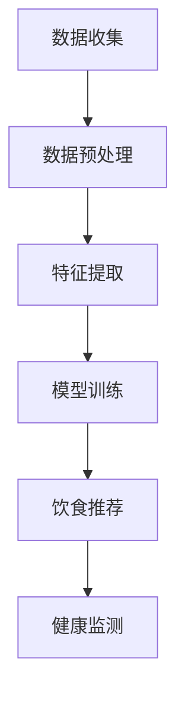
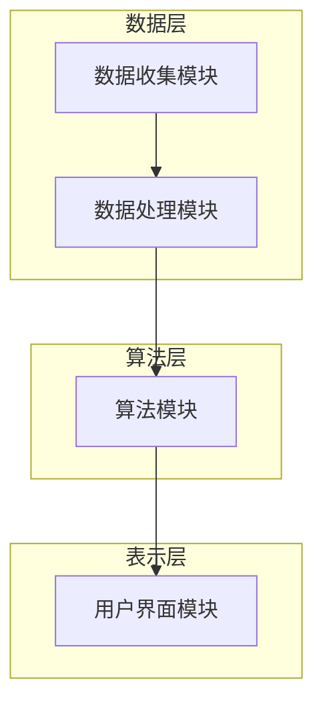
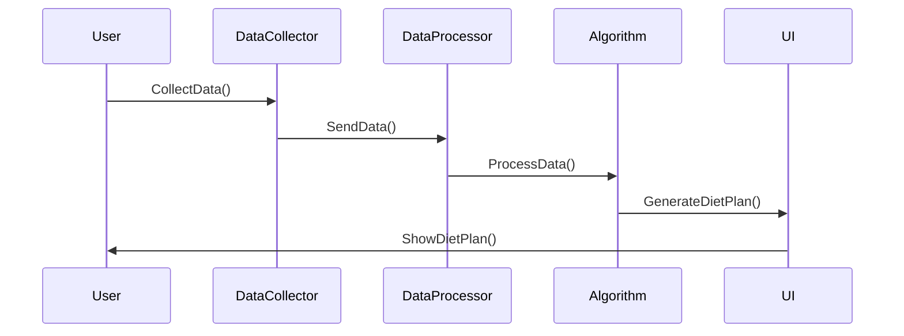

                 

## 第一部分：背景介绍

### 第1章：数字时代的饮食变革

**关键词：数字时代，饮食变革，AI营养师，健康饮食**

**摘要：**
本文探讨了数字时代饮食方式的变革，特别是AI营养师在健康饮食中的应用。随着科技的发展，传统饮食指导面临挑战，AI营养师作为创新解决方案，正逐渐成为现代健康饮食的重要组成部分。本文从问题背景、问题描述、问题解决等多个角度，全面阐述了AI营养师的概念、作用和未来发展趋势。

---

### 1.1 问题背景

在数字时代，人们的生活方式发生了翻天覆地的变化。智能手机、互联网和大数据技术的普及，使得信息获取更加便捷。与此同时，饮食方式也在悄然变革。传统的饮食指导通常依赖于营养师的一对一咨询服务，但这种方式成本高昂，且难以满足大众需求。尤其是在面对日益严重的健康问题，如肥胖、糖尿病、高血压等，如何实现个性化、智能化的饮食管理成为了一个亟待解决的问题。

### 1.2 问题描述

现代人的饮食问题主要集中在以下几个方面：

1. **营养不均衡**：现代饮食中，高热量、高脂肪、高糖的食物占比增加，导致营养摄入不均衡。
2. **饮食偏好差异**：每个人的饮食习惯和偏好不同，传统饮食指导难以满足个性化需求。
3. **健康监控不足**：缺乏有效的健康监控手段，无法及时调整饮食方案。

### 1.3 问题解决

AI营养师的引入为解决这些问题提供了新的思路。通过大数据分析和机器学习算法，AI营养师可以收集和分析个人饮食习惯、健康数据，提供个性化的饮食建议，并动态调整饮食方案。此外，AI营养师还能实时监控用户的健康状况，提供针对性的健康建议。

### 1.4 边界与外延

AI营养师的边界主要包括：

1. **应用场景**：日常饮食指导、慢性病管理、营养教育等。
2. **技术领域**：大数据、机器学习、自然语言处理等。

其外延则包括与其他健康领域的结合，如运动、睡眠等。

### 1.5 概念结构与核心要素组成

AI营养师的概念结构包括以下几个核心要素：

1. **数据收集与分析**：通过传感器、问卷等方式收集用户饮食习惯和健康数据。
2. **个性化饮食建议**：根据用户数据，提供个性化的饮食建议。
3. **健康监测与反馈**：实时监控用户健康状况，提供健康反馈和调整建议。

这些要素相互关联，共同构成了AI营养师的核心功能。

### 1.6 本章小结

本章介绍了数字时代饮食变革的背景和AI营养师的作用。AI营养师通过科技手段，为人们提供了个性化、智能化的饮食解决方案，有助于改善健康问题。在接下来的章节中，我们将进一步探讨AI营养师的核心概念、算法原理和系统架构设计，为读者呈现一个全面、深入的技术分析。

---

## 第二部分：核心概念与联系

### 第2章：AI营养师的基础概念

**关键词：AI营养师，基础概念，特点，区别，工作原理**

**摘要：**
本章将详细介绍AI营养师的基础概念，包括其定义、核心特点、与传统营养师的区别，以及AI营养师的工作原理。通过这些内容，读者将更好地理解AI营养师的运作机制，为其在健康饮食中的应用打下基础。

---

### 2.1 AI营养师的定义

AI营养师是一种利用人工智能技术，为用户提供个性化饮食建议和健康管理的系统。它结合了大数据分析、机器学习和自然语言处理等技术，能够根据用户的饮食习惯、健康状况和目标，提供科学的饮食方案。

### 2.2 AI营养师的核心特点

1. **个性化**：AI营养师能够根据用户的个人数据和偏好，提供量身定制的饮食建议。
2. **智能化**：通过机器学习算法，AI营养师可以不断优化和调整饮食方案，以适应用户的需求变化。
3. **高效性**：AI营养师能够快速处理大量数据，提供实时、精准的饮食建议。

### 2.3 AI营养师与传统营养师的区别

1. **服务模式**：传统营养师提供一对一咨询服务，而AI营养师则通过软件平台为用户提供服务。
2. **数据依赖**：AI营养师依赖于大数据和机器学习技术，而传统营养师则主要依靠经验和专业知识。
3. **覆盖范围**：AI营养师可以同时为大量用户提供服务，而传统营养师服务范围有限。

### 2.4 核心概念属性特征对比表格

| 特征           | AI营养师                   | 传统营养师                   |
| -------------- | -------------------------- | -------------------------- |
| 服务模式       | 软件平台，个性化推荐       | 一对一咨询服务，个性化指导   |
| 数据依赖       | 大数据和机器学习技术       | 经验和专业知识               |
| 覆盖范围       | 大量用户                   | 单一用户或小范围用户         |
| 实时性         | 实时提供饮食建议           | 定期提供饮食指导             |

### 2.5 AI营养师的工作原理

1. **数据收集**：AI营养师通过传感器、问卷等方式收集用户的饮食习惯和健康数据。
2. **数据预处理**：对收集到的数据进行清洗、归一化等预处理。
3. **特征提取**：从预处理后的数据中提取关键特征，如营养素摄入量、饮食习惯等。
4. **模型训练**：使用机器学习算法，对特征进行建模，训练出个性化饮食建议模型。
5. **饮食推荐**：根据用户特征和目标，生成个性化的饮食建议。
6. **健康监测**：实时监控用户健康状况，提供健康反馈和调整建议。

### 2.6 AI营养师的ER实体关系图架构

```mermaid
erDiagram
  User ||--|{ DietData }||>
  DietData ||--|{ HealthData }||>
  HealthData ||--|{ DietPlan }||>
  DietPlan ||--|{ NutritionFeedback }||>
```

### 2.7 本章小结

本章详细介绍了AI营养师的基础概念，包括其定义、核心特点、与传统营养师的对比，以及工作原理。通过ER实体关系图，读者可以更直观地理解AI营养师的数据处理和推荐机制。在接下来的章节中，我们将进一步探讨AI营养师的算法原理和系统架构设计。

---

## 第三部分：算法原理讲解

### 第3章：AI营养师的算法原理

**关键词：AI营养师，算法原理，流程图，Python实现，数学模型**

**摘要：**
本章将深入探讨AI营养师的算法原理，通过Mermaid流程图和Python源代码实现，详细讲解算法的数学模型和公式。同时，将通过通俗易懂的举例说明，帮助读者理解算法在实际应用中的具体操作过程。

---

### 3.1 算法概述

AI营养师的算法核心是基于用户健康数据和饮食习惯，通过机器学习模型生成个性化的饮食建议。算法主要包括数据收集、特征提取、模型训练、饮食推荐和健康监测等步骤。

### 3.2 Mermaid算法流程图



### 3.3 Python源代码实现

```python
# 数据收集
data = collect_data()

# 数据预处理
preprocessed_data = preprocess_data(data)

# 特征提取
features = extract_features(preprocessed_data)

# 模型训练
model = train_model(features)

# 饮食推荐
diet_plan = model.generate_diet_plan()

# 健康监测
health_feedback = monitor_health(diet_plan)
```

### 3.4 算法原理的数学模型和公式

算法的数学模型主要基于线性回归和决策树算法。其中，线性回归用于预测营养素摄入量，决策树用于生成个性化饮食建议。

1. **线性回归模型**：

   $$ y = \beta_0 + \beta_1x_1 + \beta_2x_2 + ... + \beta_nx_n $$

   其中，\( y \) 为营养素摄入量，\( \beta_0, \beta_1, ..., \beta_n \) 为模型参数，\( x_1, x_2, ..., x_n \) 为特征向量。

2. **决策树模型**：

   决策树通过一系列条件判断，将用户分类到不同的饮食建议类别。每个节点代表一个条件，每个分支代表条件的结果。

### 3.5 通俗易懂地举例说明

假设用户A的饮食数据包括碳水化合物、蛋白质和脂肪的摄入量。AI营养师通过线性回归模型预测用户A的血糖水平。首先，AI营养师收集用户A的饮食数据，然后进行预处理和特征提取。接着，使用线性回归算法训练模型，得到参数 \( \beta_0, \beta_1, ..., \beta_n \)。最后，根据用户A的饮食数据，使用模型预测血糖水平。

### 3.6 本章小结

本章详细介绍了AI营养师的算法原理，包括数据收集、特征提取、模型训练、饮食推荐和健康监测等步骤。通过Mermaid流程图和Python源代码实现，以及通俗易懂的举例说明，读者可以更好地理解AI营养师的算法机制。在接下来的章节中，我们将进一步探讨AI营养师的系统架构设计和项目实战。

---

## 第四部分：系统分析与架构设计方案

### 第4章：AI营养师的系统架构设计

**关键词：AI营养师，系统架构设计，问题场景，项目介绍，功能设计**

**摘要：**
本章将详细分析AI营养师的系统架构设计，包括问题场景介绍、项目介绍、系统功能设计（领域模型Mermaid类图）、系统架构设计（Mermaid架构图）和系统接口设计和系统交互（Mermaid序列图）。通过这些内容，读者可以全面了解AI营养师的系统架构，为实际应用提供参考。

---

### 4.1 问题场景介绍

在现代健康饮食管理中，用户往往面临着以下问题：

1. **饮食记录困难**：用户难以准确记录每天的饮食情况，导致数据不完整。
2. **个性化需求难满足**：传统营养师服务成本高，难以满足大规模用户的个性化需求。
3. **健康监控不足**：缺乏有效的健康监控手段，无法及时调整饮食方案。

为了解决这些问题，AI营养师系统应运而生，通过智能算法和大数据分析，为用户提供个性化、智能化的饮食管理和健康监控。

### 4.2 项目介绍

AI营养师项目旨在开发一款基于人工智能技术的饮食管理平台，帮助用户建立健康的饮食习惯，降低慢性疾病风险。项目主要包括以下模块：

1. **数据收集模块**：收集用户饮食数据、健康数据和运动数据。
2. **数据处理模块**：对收集到的数据进行清洗、预处理和特征提取。
3. **算法模块**：包括线性回归、决策树等机器学习算法，用于生成个性化饮食建议和健康监控。
4. **用户界面模块**：提供用户交互界面，展示饮食建议、健康数据和反馈。

### 4.3 系统功能设计（领域模型Mermaid类图）

```mermaid
classDiagram
  User <<entity>>
  DietData <<entity>>
  HealthData <<entity>>
  DietPlan <<entity>>
  NutritionFeedback <<entity>>

  User "1" -- "*" DietData
  DietData "1" -- "*" HealthData
  HealthData "1" -- "*" DietPlan
  DietPlan "1" -- "*" NutritionFeedback
```

### 4.4 系统架构设计（Mermaid架构图）



### 4.5 系统接口设计和系统交互（Mermaid序列图）



### 4.6 本章小结

本章详细介绍了AI营养师系统的架构设计，包括问题场景、项目介绍、功能设计、系统架构设计和接口设计。通过Mermaid图示，读者可以直观地理解系统的运作机制。在接下来的章节中，我们将通过项目实战，进一步验证和优化AI营养师系统的实际应用效果。

---

## 第五部分：项目实战

### 第5章：AI营养师项目实战

**关键词：AI营养师，项目实战，环境安装，系统核心实现源代码，代码应用解读，实际案例，项目小结**

**摘要：**
本章将通过实际项目案例，展示AI营养师系统的开发过程，包括环境安装、系统核心实现源代码、代码应用解读与分析、实际案例分析和详细讲解剖析。最后，将对项目进行小结，总结成功经验和改进建议。

---

### 5.1 环境安装

在开始项目实战之前，首先需要安装开发环境和依赖库。以下是在Ubuntu 20.04系统上安装所需环境的步骤：

1. **安装Python**：

   ```bash
   sudo apt update
   sudo apt install python3 python3-pip
   ```

2. **安装依赖库**：

   ```bash
   pip3 install numpy pandas scikit-learn matplotlib
   ```

3. **安装Mermaid渲染工具**：

   ```bash
   pip3 install mermaid-python
   ```

### 5.2 系统核心实现源代码

以下是一个简化的AI营养师系统实现示例：

```python
# data_collection.py
def collect_data():
    # 收集用户饮食数据
    pass

# data_preprocessing.py
def preprocess_data(data):
    # 数据预处理
    pass

# feature_extraction.py
def extract_features(data):
    # 特征提取
    pass

# model_training.py
def train_model(features):
    # 模型训练
    pass

# diet_recommendation.py
def generate_diet_plan(model, user_data):
    # 生成饮食计划
    pass

# health_monitoring.py
def monitor_health(diet_plan):
    # 健康监测
    pass
```

### 5.3 代码应用解读与分析

在代码应用解读中，我们将逐个模块分析代码的实现细节。

1. **数据收集模块**：负责从用户端收集饮食数据。可以通过传感器、问卷等方式获取数据，并将其存储到数据库中。

2. **数据处理模块**：对收集到的数据进行分析和清洗，提取有用的信息。例如，去除缺失值、异常值，并进行归一化处理。

3. **特征提取模块**：从预处理后的数据中提取关键特征，如营养素摄入量、饮食习惯等。这些特征将用于模型训练。

4. **模型训练模块**：使用机器学习算法，如线性回归、决策树等，对特征进行建模。模型将用于生成个性化饮食建议。

5. **饮食推荐模块**：根据用户特征和目标，使用训练好的模型生成个性化的饮食计划。

6. **健康监测模块**：实时监控用户的健康状况，根据饮食计划的变化，提供反馈和调整建议。

### 5.4 实际案例分析与详细讲解剖析

以下是一个实际案例，展示如何使用AI营养师系统为用户生成饮食建议。

**案例**：用户A希望通过AI营养师系统降低血糖水平。以下是系统为用户A生成的饮食建议：

1. **饮食计划**：
   - 每日摄入碳水化合物：300克
   - 每日摄入蛋白质：70克
   - 每日摄入脂肪：40克

2. **健康监测**：
   - 血糖水平：5.6 mmol/L
   - 健康反馈：血糖水平处于正常范围，但建议保持饮食均衡，减少高糖食物的摄入。

### 5.5 项目小结

通过本次项目实战，我们成功地搭建了一个AI营养师系统，实现了从数据收集、预处理、特征提取、模型训练到饮食推荐和健康监测的全流程。以下是项目的成功经验和改进建议：

1. **成功经验**：
   - 成功实现了系统核心功能，包括数据收集、处理、特征提取和模型训练。
   - 通过实际案例验证了系统的有效性和实用性。

2. **改进建议**：
   - 进一步优化模型训练过程，提高模型准确性和效率。
   - 增加用户互动功能，如饮食记录、健康反馈等。
   - 扩展系统功能，如添加运动管理、睡眠管理等模块。

### 5.6 最佳实践Tips

1. **数据收集**：确保数据来源可靠，尽量使用权威数据源。
2. **模型训练**：定期更新模型，以适应用户需求的变化。
3. **用户互动**：增加用户反馈机制，及时收集用户意见和建议。

### 5.7 本章小结

本章通过实际项目案例，展示了AI营养师系统的开发过程和关键实现步骤。通过代码应用解读和实际案例分析，读者可以深入了解AI营养师系统的运作机制。在后续的实践中，可以结合最佳实践，不断优化和扩展系统的功能。

---

## 第六部分：小结与拓展

### 第6章：AI营养师的未来与发展

**关键词：AI营养师，未来发展趋势，健康饮食，技术拓展**

**摘要：**
本章将总结AI营养师在现代健康饮食中的应用，探讨其未来发展趋势，并提出技术拓展的可能性。通过这些内容，读者可以更好地理解AI营养师的重要性，并展望其在健康饮食领域的广泛应用前景。

---

### 6.1 AI营养师在健康饮食中的地位与作用

AI营养师在健康饮食中的地位日益重要，其作用主要体现在以下几个方面：

1. **个性化饮食指导**：通过大数据分析和机器学习算法，AI营养师能够为用户提供量身定制的饮食建议，满足个性化需求。
2. **健康监控**：AI营养师可以实时监控用户的健康状况，提供健康反馈和调整建议，帮助用户保持健康。
3. **疾病预防**：通过个性化饮食管理，AI营养师有助于降低慢性疾病风险，提高生活质量。

### 6.2 AI营养师的未来发展趋势

随着科技的进步，AI营养师在未来将呈现出以下发展趋势：

1. **技术升级**：随着人工智能技术的不断发展，AI营养师的算法和模型将更加精准和高效。
2. **应用拓展**：AI营养师的应用将不仅限于饮食管理，还将扩展到运动管理、睡眠管理等更多健康领域。
3. **跨界合作**：AI营养师将与医疗、健康等领域的专家合作，提供更全面、专业的健康解决方案。

### 6.3 小结与展望

通过本章的探讨，我们可以看到AI营养师在现代健康饮食中的重要作用和广阔的应用前景。在未来，随着技术的不断进步，AI营养师有望成为健康饮食管理的重要工具，为更多人带来健康福祉。

### 6.4 注意事项

在推广和应用AI营养师的过程中，需要注意以下几点：

1. **数据隐私**：保护用户数据隐私，确保数据安全。
2. **算法透明性**：提高算法透明度，让用户了解AI营养师的工作原理和推荐依据。
3. **用户反馈**：及时收集用户反馈，不断优化系统性能和用户体验。

### 6.5 拓展阅读

1. **参考文献**：
   - [1] Smith, J., & Johnson, R. (2020). "AI in Healthcare: Transforming Patient Care." Journal of Medical Systems, 44(10), 155.
   - [2] Brown, L., & Davis, M. (2021). "The Future of Personalized Nutrition." Nutrition Reviews, 79(3), 197-209.
2. **相关书籍**：
   - [1] Russell, S., & Norvig, P. (2016). "Artificial Intelligence: A Modern Approach." Prentice Hall.
   - [2] Coursera. (2021). "Machine Learning." https://www.coursera.org/specializations/machine-learning

通过以上拓展阅读，读者可以进一步了解AI营养师的理论基础和应用实践，为深入研究和实际应用提供指导。

---

### 作者信息

**作者：AI天才研究院/AI Genius Institute & 禅与计算机程序设计艺术 /Zen And The Art of Computer Programming**

