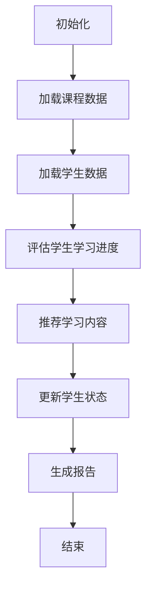
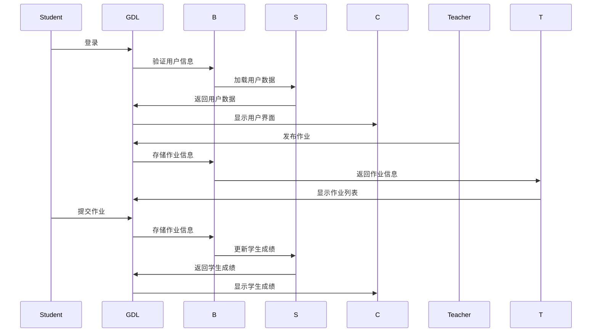
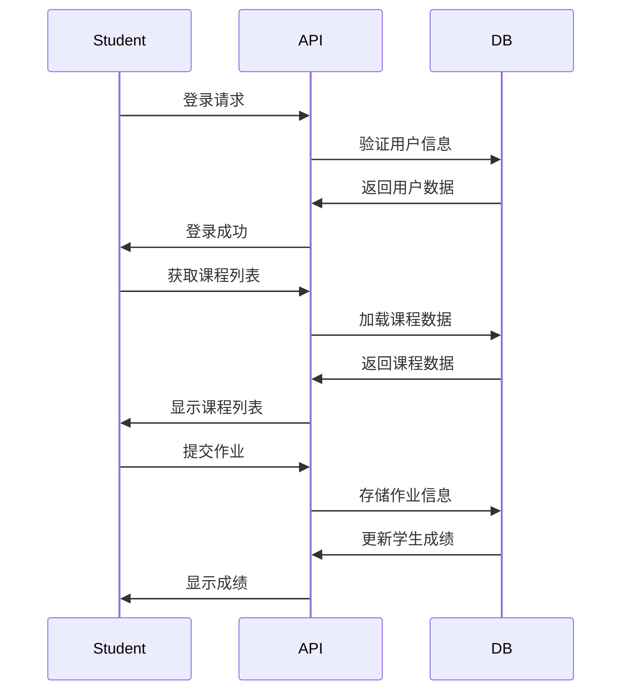

                 

# 数字游戏化学习平台：提高学习效率的新方法

关键词：数字游戏化、学习效率、教育技术、学生参与、学习动机

摘要：随着科技的发展，教育领域正经历着一场革命。数字游戏化学习平台作为一种新兴的教育技术，正逐渐成为提高学习效率的有效手段。本文将深入探讨数字游戏化学习平台的定义、理论基础、设计原则、案例分析、设计与实现方法以及评估和最佳实践，以期为教育工作者和学生提供有价值的参考。

## 引言与背景

随着互联网和移动设备的普及，数字技术已经深刻地改变了教育的面貌。传统的学习方式往往依赖于枯燥的文本、图表和单调的课件，这往往导致学生的参与度和学习动机较低。为了解决这一问题，教育领域开始探索新的教学方法，其中数字游戏化学习平台成为了热点。

数字游戏化学习平台是将游戏设计原理应用于教育过程中，旨在提高学习效率和学生参与度。它通过引入竞争、奖励、挑战和反馈等游戏元素，使得学习过程更加有趣、富有挑战性，从而激发学生的学习动机。

### 问题背景

目前，教育领域面临的主要问题包括：

1. **学习动机不足**：学生在传统学习环境中往往感到枯燥乏味，缺乏学习动力。
2. **参与度低**：学生被动接受知识，缺乏主动参与的机会。
3. **学习效率不高**：传统教学方法难以满足个性化学习的需求，导致学习效果不佳。

### 问题描述

为了解决上述问题，教育工作者和学生需要一种新的学习方式，能够激发学习动机，提高参与度和学习效率。数字游戏化学习平台正是为满足这一需求而设计的。

### 问题解决

数字游戏化学习平台通过以下几个方面来解决传统学习方式的不足：

1. **引入游戏元素**：将游戏设计中的竞争、奖励、挑战和反馈等元素融入学习过程，提高学生的参与度和兴趣。
2. **个性化学习**：通过数据分析和学习路径推荐，为每个学生提供个性化的学习内容，满足其个性化需求。
3. **互动性**：提供在线讨论、协作学习等功能，促进学生之间的互动，提高学习效果。

### 边界与外延

数字游戏化学习平台不仅适用于学校教育，还可以用于在线教育、职业培训和企业内训等领域。其应用范围广泛，可以覆盖各个年龄段和不同学科领域。

### 概念结构与核心要素组成

数字游戏化学习平台的核心概念和要素包括：

1. **游戏化元素**：如积分、等级、奖励、挑战等。
2. **学习内容**：包括课程、知识点、练习题等。
3. **数据分析**：用于跟踪学生学习进度、评估学习效果。
4. **互动性**：包括在线讨论、协作学习、实时反馈等。

## 核心概念与联系

### 核心概念原理

1. **游戏化**：将游戏设计中的元素和机制应用于非游戏情境中，以提高参与度和动机。
2. **学习平台**：提供学习内容和服务的在线平台。
3. **学生参与**：学生在学习过程中的主动性和积极性。

### 概念属性特征对比表格

| 概念       | 属性特征                                                         | 对比分析                                                         |
|------------|------------------------------------------------------------------|------------------------------------------------------------------|
| 游戏化     | 竞争、奖励、挑战、反馈等元素                                     | 与传统教育相比，更具吸引力和互动性，更能激发学习动机。                 |
| 学习平台   | 在线学习资源、学习管理、数据分析等功能                           | 提供灵活的学习方式，满足个性化学习需求。                             |
| 学生参与   | 学习过程中的主动性和积极性                                       | 传统教育中，学生往往被动接受知识，而游戏化学习平台则鼓励学生主动参与。 |

### ER实体关系图架构

```mermaid
erDiagram
  Student ||--|{ Course }|--|{ Score }
  Course ||--|{ Chapter }|--|{ Question }
  Chapter ||--|{ Content }
  Question ||--|{ Answer }
```

## 算法原理讲解

### 算法流程图



### 算法原理

1. **初始化**：加载课程数据和学生数据，初始化系统状态。
2. **加载课程数据**：从数据库中加载课程信息，包括章节、知识点和练习题等。
3. **加载学生数据**：从数据库中加载学生信息，包括学习进度、成绩和兴趣等。
4. **评估学生学习进度**：根据学生的学习行为和成绩，评估其学习进度。
5. **推荐学习内容**：根据评估结果，推荐适合学生的学习内容。
6. **更新学生状态**：更新学生的学习进度和兴趣，以便后续推荐。
7. **生成报告**：生成学生学习报告，供教师和家长查看。

### 数学模型和公式

- **学习进度评估**：使用学习曲线模型，公式如下：
  $$ P(t) = \frac{1}{1 + e^{-kt}} $$
  其中，$P(t)$ 表示学习进度，$t$ 表示学习时间，$k$ 是学习速率常数。

- **推荐算法**：使用协同过滤算法，公式如下：
  $$ r(u, i) = \sum_{j \in N(i)} \frac{sim(u, j) \cdot r(j, i)}{|\{j \in N(i): r(u, j) \neq 0\}|} $$
  其中，$r(u, i)$ 表示用户 $u$ 对项目 $i$ 的评分预测，$sim(u, j)$ 表示用户 $u$ 和 $j$ 之间的相似度，$N(i)$ 表示与项目 $i$ 相似的项目集合，$r(j, i)$ 表示项目 $j$ 对用户 $i$ 的评分。

## 系统分析与架构设计方案

### 问题场景介绍

数字游戏化学习平台的目标是提高学生的学习效率和参与度。系统应具备以下功能：

1. **课程管理**：上传、管理、更新课程内容。
2. **学生管理**：注册、登录、个人信息管理。
3. **学习数据跟踪**：记录学生学习进度、成绩和兴趣。
4. **推荐系统**：根据学生学习数据推荐适合的学习内容。
5. **教师管理**：发布作业、批改作业、查看学生进度。

### 项目介绍

项目名称：数字游戏化学习平台（Digital Gamification Learning Platform，简称DGLP）

项目目标：提高学生的学习效率和学生参与度，打造一个互动性强、个性化学习的新平台。

### 系统功能设计

#### 领域模型类图

```mermaid
classDiagram
  Course <|-- Student
  Course <|-- Teacher
  Score <<-- Student
  Score <<-- Teacher
  Content <<-- Chapter
  Question <<-- Chapter
  Answer <<-- Question
  Answer <<-- Student
```

### 系统架构设计



### 系统接口设计和系统交互



## 项目实战

### 环境安装

1. **安装Python**：确保安装了Python 3.8及以上版本。
2. **安装依赖库**：使用pip安装以下依赖库：
   ```bash
   pip install Flask SQLAlchemy Pillow
   ```

### 系统核心实现源代码

```python
# app.py
from flask import Flask, render_template, request, redirect, url_for
from models import *

app = Flask(__name__)
app.config['SQLALCHEMY_DATABASE_URI'] = 'sqlite:///dgldatabase.db'
db.init_app(app)

@app.route('/')
def index():
    return redirect(url_for('login'))

@app.route('/login', methods=['GET', 'POST'])
def login():
    if request.method == 'POST':
        username = request.form['username']
        password = request.form['password']
        user = User.query.filter_by(username=username, password=password).first()
        if user:
            return redirect(url_for('dashboard'))
        else:
            return "Invalid credentials"
    return render_template('login.html')

@app.route('/dashboard')
def dashboard():
    courses = Course.query.all()
    return render_template('dashboard.html', courses=courses)

if __name__ == '__main__':
    db.create_all()
    app.run(debug=True)
```

### 代码应用解读与分析

1. **启动Flask应用**：运行`app.py`文件，启动Flask应用。
2. **登录功能**：用户通过`/login`路由提交用户名和密码，后台验证用户信息，返回登录结果。
3. **课程管理**：用户在`/dashboard`路由下查看所有课程，可以进一步实现课程的上传、管理等功能。

### 实际案例分析和详细讲解剖析

假设一个学生小王通过数字游戏化学习平台学习了一门编程课程，以下是他的学习过程：

1. **登录**：小王通过输入用户名和密码成功登录平台。
2. **选择课程**：小王从课程列表中选择了一门编程课程。
3. **学习课程内容**：小王开始学习编程课程，包括视频讲解、文本资料和练习题。
4. **完成练习题**：小王完成练习题，平台自动评分，并根据评分情况给出反馈。
5. **查看学习进度**：小王可以查看自己的学习进度和成绩，了解自己的学习状况。

通过数字游戏化学习平台，小王的学习过程变得更加有趣和有动力，从而提高了学习效率和成绩。

### 项目小结

数字游戏化学习平台通过引入游戏化元素和互动性功能，为学习者提供了一个有趣、富有挑战性的学习环境。在实际项目中，需要充分考虑用户需求、课程设计和系统稳定性，确保平台能够有效地提高学习效率和参与度。

## 最佳实践 Tips

1. **设计游戏化元素**：合理设计游戏化元素，如积分、等级和奖励，以激发学生的学习动机。
2. **课程内容设计**：确保课程内容丰富有趣，能够吸引学生的学习兴趣。
3. **数据分析**：利用数据分析了解学生的学习行为和需求，为个性化学习提供支持。
4. **用户体验**：注重用户体验，确保平台操作简单、界面友好。

## 小结

数字游戏化学习平台为教育领域带来了一场革命，通过引入游戏化元素和互动性功能，有效提高了学习效率和参与度。在教育工作者和学生的共同努力下，数字游戏化学习平台有望成为未来教育的重要组成部分。

## 注意事项

1. **数据安全**：确保平台的数据安全，防止学生信息泄露。
2. **课程更新**：定期更新课程内容，确保课程与实际需求相符。
3. **用户反馈**：收集用户反馈，不断优化平台功能和用户体验。

## 拓展阅读

1. **相关书籍**：《游戏化思维》、《游戏化学习：如何在非游戏情境中应用游戏元素》
2. **学术论文**：搜索关键词“数字游戏化学习平台”、“教育技术”、“学习动机”等，获取最新研究进展。
3. **在线资源**：访问相关教育网站和论坛，了解行业动态和最佳实践。

## 作者信息

作者：AI天才研究院/AI Genius Institute & 禅与计算机程序设计艺术 /Zen And The Art of Computer Programming

