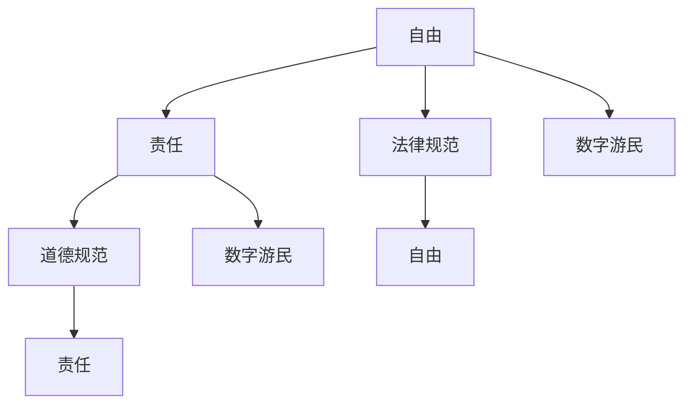

                 

# 数字游民lifestyle：自由与责任的现代平衡

> 关键词：数字游民，自由，责任，平衡，生活方式

> 摘要：本文旨在探讨数字游民lifestyle在现代社会的兴起，以及在这一生活方式下，如何实现自由与责任的平衡。文章从数字游民的背景与概念出发，逐步深入分析数字游民lifestyle的优势与挑战，以及如何在实际生活中实现自由与责任的平衡。最后，文章还将探讨数字游民lifestyle的未来趋势和可持续发展。

## 第一部分：引言

### 1.1 问题的背景与描述

#### 1.1.1 数字游民的概念

数字游民是指那些通过互联网远程工作的人，他们不受地域限制，可以自由地选择工作地点，通常在咖啡馆、共享办公室、海边别墅甚至是异国他乡的旅馆中工作。这种生活方式正在逐渐成为一种趋势，吸引了越来越多的人。

#### 1.1.2 数字游民lifestyle的兴起

随着全球化、互联网技术的飞速发展和远程工作的普及，数字游民lifestyle逐渐兴起。人们追求更高的生活质量，希望在工作的同时能够享受生活，数字游民lifestyle正满足了这一需求。

#### 1.1.3 自由与责任的现代平衡

在数字游民lifestyle中，自由与责任的关系是一个重要的问题。如何在享受自由的同时，不忽视责任，是每个数字游民都需要面对的挑战。

### 1.2 核心概念与联系

#### 1.2.1 自由与责任的定义

自由是指个体在法律和社会规范允许的范围内，能够自主选择行为和生活方式的权利。责任则是指个体在行为和决策过程中，对自身、他人和社会应尽的义务。

#### 1.2.2 自由与责任的平衡关系

自由与责任是相互依存的。过度的自由可能导致无序和混乱，而忽视责任则可能导致道德和法律问题。在数字游民lifestyle中，如何平衡自由与责任，是确保生活质量和工作效率的关键。

#### 1.2.3 数字游民lifestyle与自由责任的关系图

### 1.3 书籍概述

#### 1.3.1 书籍的目标读者

本书旨在为那些对数字游民lifestyle感兴趣的读者提供指导，帮助他们更好地理解这一生活方式，并在实践中实现自由与责任的平衡。

#### 1.3.2 书籍的主要内容结构

本书主要分为五个部分，分别介绍数字游民lifestyle的背景、优势、挑战、实现自由与责任的平衡以及未来的发展趋势。

## 第二部分：数字游民lifestyle概述

### 2.1 数字游民lifestyle的定义与特点

#### 2.1.1 数字游民lifestyle的定义

数字游民lifestyle是一种以互联网为纽带，通过远程工作实现自由工作与生活的方式。它打破了传统的工作与生活界限，使人们可以在全球范围内选择工作地点。

#### 2.1.2 数字游民lifestyle的特点

1. **灵活的工作时间**：数字游民可以根据自己的需要和时间安排工作，不再受固定的工作时间和地点的限制。
2. **高度的自由度**：数字游民可以自由选择工作内容、工作方式和合作伙伴。
3. **低成本的生活成本**：数字游民可以选择在低成本地区生活，从而降低生活成本。

#### 2.1.3 数字游民lifestyle与传统生活方式的差异

传统生活方式强调稳定的工作和固定的居住地，而数字游民lifestyle则更注重灵活性和自由度。

### 2.2 数字游民lifestyle的优势

#### 2.2.1 自由与灵活的工作时间

数字游民可以自由安排工作时间，充分利用个人时间的灵活性。

#### 2.2.2 更高的工作效率

在无干扰的环境中，数字游民往往能够更高效地完成工作。

#### 2.2.3 更好的工作与生活平衡

数字游民可以在工作与生活之间找到更好的平衡，提高生活质量。

### 2.3 数字游民lifestyle的挑战

#### 2.3.1 社交与孤独感

缺乏面对面的社交互动可能导致数字游民感到孤独。

#### 2.3.2 财务规划与管理

数字游民需要更谨慎地管理财务，以应对收入的不稳定性。

#### 2.3.3 法律与税务问题

数字游民在不同国家工作，需要了解并遵守各国的法律和税务规定。

## 第三部分：自由与责任的现代平衡

### 3.1 自由的界限

#### 3.1.1 自由的本质

自由是人的基本权利，但自由并不意味着无限制。法律和社会规范为自由设定了界限。

#### 3.1.2 自由的界限

自由必须在法律和社会规范内行使。超出这些界限，就会导致自由变成滥用。

#### 3.1.3 如何在数字游民lifestyle中界定自由

数字游民需要在法律和社会规范的框架内行使自由，确保自由与责任之间的平衡。

### 3.2 责任的内涵

#### 3.2.1 责任的概念

责任是个体在行为和决策过程中，对自身、他人和社会应尽的义务。

#### 3.2.2 责任的重要性

责任是社会秩序的基石，是个人成长的必要条件。

#### 3.2.3 数字游民lifestyle中的责任

数字游民需要在享受自由的同时，承担相应的责任，确保个人、团队和社会的利益。

### 3.3 平衡的实践

#### 3.3.1 自由与责任的时间管理

数字游民需要合理安排时间，确保在享受自由的同时，履行责任。

#### 3.3.2 财务规划与责任

数字游民需要制定合理的财务规划，确保财务稳定，履行责任。

#### 3.3.3 社交与责任的关系

数字游民需要积极参与社交活动，同时在社交中承担相应的责任。

## 第四部分：成功案例与经验分享

### 4.1 成功案例介绍

#### 4.1.1 案例一：自由与责任的成功实践

案例一展示了如何在数字游民lifestyle中实现自由与责任的平衡。

#### 4.1.2 案例二：数字游民lifestyle的成功转型

案例二讲述了如何从传统工作模式成功转型为数字游民。

#### 4.1.3 案例三：平衡自由与责任的创新案例

案例三展示了如何在数字游民lifestyle中创新，实现自由与责任的平衡。

### 4.2 经验分享

#### 4.2.1 时间管理的技巧

分享了一些有效的时间管理技巧，帮助数字游民更好地平衡自由与责任。

#### 4.2.2 财务规划的方法

提供了一些财务规划的方法，帮助数字游民更好地管理财务。

#### 4.2.3 社交与孤独感的缓解策略

分享了一些缓解社交孤独感的策略，帮助数字游民保持良好的社交状态。

## 第五部分：数字游民lifestyle的未来趋势

### 5.1 数字游民lifestyle的全球趋势

#### 5.1.1 全球数字游民趋势分析

分析了全球数字游民的趋势，探讨了其发展的动力和挑战。

#### 5.1.2 数字游民lifestyle的未来发展方向

探讨了数字游民lifestyle的未来发展方向，包括技术、政策和社会趋势。

#### 5.1.3 数字游民lifestyle与全球化的关系

探讨了数字游民lifestyle与全球化的关系，分析了其对全球化进程的影响。

### 5.2 技术创新对数字游民lifestyle的影响

#### 5.2.1 5G与物联网技术

介绍了5G和物联网技术如何影响数字游民lifestyle，提供了新的可能性。

#### 5.2.2 区块链与加密货币

分析了区块链和加密货币如何影响数字游民lifestyle，提供了新的财务解决方案。

#### 5.2.3 新兴技术与数字游民lifestyle的融合

探讨了新兴技术如何与数字游民lifestyle融合，提供更高效、更自由的数字游民生活方式。

## 第六部分：数字游民lifestyle的可持续发展

### 6.1 可持续发展的概念

#### 6.1.1 可持续发展的定义

介绍了可持续发展的定义，探讨了其与数字游民lifestyle的关系。

#### 6.1.2 可持续发展与数字游民lifestyle的关系

分析了可持续发展与数字游民lifestyle的密切关系，探讨了如何在数字游民lifestyle中实现可持续发展。

#### 6.1.3 数字游民lifestyle的可持续发展目标

提出了数字游民lifestyle的可持续发展目标，包括环境、经济和社会三个方面。

### 6.2 数字游民lifestyle的可持续发展策略

#### 6.2.1 环境保护策略

探讨了如何在数字游民lifestyle中实施环境保护策略，减少对环境的负面影响。

#### 6.2.2 经济可持续发展策略

分析了如何通过数字游民lifestyle实现经济可持续发展，提高生活质量。

#### 6.2.3 社会可持续发展策略

探讨了如何通过数字游民lifestyle实现社会可持续发展，促进社会和谐与进步。

## 第七部分：结语

### 7.1 回顾与展望

回顾了数字游民lifestyle的兴起、优势、挑战以及实现自由与责任平衡的方法，展望了数字游民lifestyle的未来发展趋势。

### 7.2 呼吁与建议

呼吁更多人尝试数字游民lifestyle，并提出了一些建议，帮助他们在享受自由的同时，实现责任的平衡。

### 7.3 结语

数字游民lifestyle是一种充满机遇和挑战的生活方式。通过本文的探讨，我们希望读者能够更好地理解这一生活方式，并在实践中实现自由与责任的平衡。作者：AI天才研究院/AI Genius Institute & 禅与计算机程序设计艺术 /Zen And The Art of Computer Programming

----------------------------------------------------------------

**注意：本文仅为大纲设计，并未包含具体内容。实际文章撰写时，每个部分都需要详细展开，以符合文章字数要求。**## 第一部分：引言

### 1.1 问题的背景与描述

#### 1.1.1 数字游民的概念

数字游民（Digital Nomad）是指那些通过互联网远程工作，不受地域限制的人。他们在全球范围内选择工作地点，灵活地安排工作和生活。这种生活方式的核心在于利用互联网技术，实现工作地点和生活方式的自由化。

数字游民的起源可以追溯到20世纪末，随着互联网的普及和远程工作的兴起，越来越多的人开始选择这种生活方式。他们通常从事自由职业，如编程、设计、写作、咨询等，这些工作可以不受时间和地点的限制。

#### 1.1.2 数字游民lifestyle的兴起

数字游民lifestyle的兴起与全球化、信息技术和远程工作的普及密不可分。以下是一些推动数字游民lifestyle兴起的关键因素：

1. **互联网的普及**：互联网的普及使得全球范围内的即时通讯和协作变得容易，为数字游民提供了工作和交流的平台。
2. **远程工作的兴起**：许多公司开始接受远程工作，尤其是互联网公司，他们更注重员工的工作结果而不是工作地点。
3. **移动设备的普及**：智能手机、平板电脑等移动设备的普及，使得数字游民可以随时随地进行工作。
4. **低成本的国际旅行**：随着低成本航空和共享住宿平台的兴起，国际旅行变得更加容易和便宜，为数字游民提供了更多的选择。

#### 1.1.3 自由与责任的现代平衡

在数字游民lifestyle中，自由与责任的关系是一个重要的问题。数字游民追求的是一种更为自由的生活方式，但与此同时，他们也需要承担相应的责任。自由与责任的关系可以被视为一种动态平衡，以下是一些关键点：

1. **自由的重要性**：自由是数字游民lifestyle的核心价值之一，它允许个体在工作和生活中拥有更多的自主权，追求个人兴趣和梦想。
2. **责任的意义**：责任是维持社会秩序和个人成长的重要基石。在数字游民lifestyle中，责任体现在多个方面，包括财务规划、合同履行、社会义务等。
3. **平衡的挑战**：实现自由与责任的平衡是数字游民面临的挑战。过度的自由可能导致不负责任的行为，而忽视责任则可能导致生活和工作的不稳定。

#### 1.1.4 数字游民lifestyle的特点

数字游民lifestyle具有以下几个显著特点：

1. **灵活性**：数字游民可以自由选择工作时间和地点，这种灵活性使他们能够更好地平衡工作与生活。
2. **全球性**：数字游民不受地域限制，可以在全球范围内寻找工作机会和生活环境。
3. **低成本**：通过远程工作，数字游民可以节省通勤和居住成本，特别是在低成本地区生活。
4. **社交多样性**：数字游民经常与世界各地的人交流，这种社交多样性可以丰富他们的生活经验。
5. **自我管理**：数字游民需要自我管理，包括时间管理、项目管理、财务规划等。

#### 1.1.5 数字游民lifestyle的吸引力

数字游民lifestyle对许多人具有吸引力，原因包括：

1. **追求自由**：许多人厌倦了传统的工作生活方式，希望拥有更多的自由和灵活性。
2. **提高生活质量**：数字游民可以自由选择居住地点，选择环境优美、成本低廉的地区生活。
3. **全球视野**：通过旅行和远程工作，数字游民可以接触到不同的文化和人群，拓宽视野。
4. **职业发展**：数字游民有机会接触到全球的市场和人才，有助于职业发展。

### 1.2 核心概念与联系

#### 1.2.1 自由与责任的定义

自由是指个体在法律和社会规范允许的范围内，能够自主选择行为和生活方式的权利。它包括言论自由、行动自由、选择自由等。

责任则是指个体在行为和决策过程中，对自身、他人和社会应尽的义务。责任包括道德责任、法律责任、职业责任等。

#### 1.2.2 自由与责任的平衡关系

自由与责任是相互依存的。过度的自由可能导致无序和滥用，而忽视责任则可能导致道德和法律问题。在数字游民lifestyle中，自由与责任的平衡至关重要：

1. **自由的界限**：自由必须在法律和社会规范的框架内行使。超出这些界限，自由就可能变成滥用。
2. **责任的重要性**：数字游民需要承担相应的责任，确保个人、团队和社会的利益。责任是维持社会秩序和个人成长的重要基石。
3. **平衡的实践**：数字游民需要在享受自由的同时，承担相应的责任。这包括时间管理、财务规划、合同履行等。

#### 1.2.3 数字游民lifestyle与自由责任的关系图

#### 1.2.4 数字游民lifestyle与自由责任的关系

数字游民lifestyle强调自由，但这种自由必须在责任的前提下进行。自由与责任的关系可以被视为一种动态平衡，数字游民需要在这两者之间找到最佳的平衡点。

### 1.3 书籍概述

#### 1.3.1 书籍的目标读者

本书旨在为那些对数字游民lifestyle感兴趣的读者提供指导，帮助他们更好地理解这一生活方式，并在实践中实现自由与责任的平衡。

具体来说，本书的目标读者包括：

1. **正在考虑成为数字游民的人**：本书提供了关于数字游民lifestyle的全面信息，帮助他们做出明智的决策。
2. **已经成为数字游民的人**：本书提供了实用的技巧和建议，帮助他们更好地适应数字游民lifestyle，实现自由与责任的平衡。
3. **对数字游民lifestyle感兴趣的人**：本书为那些对数字游民lifestyle感兴趣的人提供了深入了解的机会。

#### 1.3.2 书籍的主要内容结构

本书的主要内容包括以下六个部分：

1. **引言**：介绍数字游民lifestyle的背景和自由与责任的关系。
2. **数字游民lifestyle概述**：详细描述数字游民lifestyle的定义、特点、优势和挑战。
3. **自由与责任的现代平衡**：探讨如何实现自由与责任的平衡，包括时间管理、财务规划和社交互动。
4. **成功案例与经验分享**：分享成功数字游民的案例和经验，提供实用的建议。
5. **数字游民lifestyle的未来趋势**：分析数字游民lifestyle的未来发展方向和新兴技术的影响。
6. **数字游民lifestyle的可持续发展**：探讨数字游民lifestyle的可持续发展策略和目标。

通过这六个部分，本书旨在为读者提供全面的指导，帮助他们更好地理解数字游民lifestyle，并在实践中实现自由与责任的平衡。

### 1.4 本文的目的

本文的目的是探讨数字游民lifestyle在现代社会的兴起，以及在这一生活方式下如何实现自由与责任的平衡。具体来说，本文将：

1. **介绍数字游民lifestyle的定义和特点**：帮助读者了解数字游民lifestyle的基本概念和优势。
2. **分析数字游民lifestyle的挑战**：探讨数字游民在享受自由的同时，如何应对各种挑战。
3. **探讨自由与责任的平衡**：分析如何在实际生活中实现自由与责任的平衡，并提供实用的建议。
4. **分享成功案例和经验**：通过成功案例和经验分享，提供实际操作的指导。
5. **展望数字游民lifestyle的未来**：分析数字游民lifestyle的未来发展趋势，探讨其对社会和个体的影响。

通过本文的探讨，希望读者能够对数字游民lifestyle有更深入的了解，并能够在实践中找到适合自己的平衡点，实现自由与责任的和谐统一。

---

在本文的引言部分，我们首先介绍了数字游民的概念和数字游民lifestyle的兴起，强调了自由与责任在现代平衡中的重要性。接着，我们详细描述了数字游民lifestyle的特点和优势，以及面临的挑战。随后，我们探讨了自由与责任的定义及其平衡关系，并分享了书籍的目标读者和主要内容结构。最后，我们明确了本文的目的，为后续内容的展开奠定了基础。

在接下来的部分，我们将深入探讨数字游民lifestyle的具体内容，包括其定义与特点、优势与挑战，以及如何实现自由与责任的现代平衡。这将帮助我们更好地理解这一新兴的生活方式，并为那些有意尝试或已经在享受数字游民lifestyle的人提供实用的指导。

---

## 第二部分：数字游民lifestyle概述

### 2.1 数字游民lifestyle的定义与特点

数字游民lifestyle是一种以互联网为基础，通过远程工作实现自由工作与生活的方式。这种生活方式的核心在于利用互联网技术，打破传统的办公空间限制，使人们可以在全球范围内选择工作地点。以下是数字游民lifestyle的几个关键特点：

#### 2.1.1 灵活的工作时间

数字游民可以自由地安排自己的工作时间。这意味着他们可以按照自己的生物钟和工作效率来规划工作，不再受限于传统的9到5工作模式。例如，一些人可能选择在早晨的高效时段工作，而其他人可能更适应在晚上或凌晨工作。

#### 2.1.2 自由的工作地点

数字游民不再受限于固定的办公场所。他们可以在咖啡馆、图书馆、海滩、甚至是飞机上工作。这种工作地点的自由度大大提高了生活质量，也让工作变得更加有趣和多样化。

#### 2.1.3 更高的工作效率

研究表明，远程工作可以提高工作效率。数字游民通常在一个更安静、更舒适的环境中工作，这有助于减少干扰，提高专注度。此外，他们可以避免通勤时间，将更多的时间投入到工作中。

#### 2.1.4 全球性的社交网络

数字游民可以通过互联网与世界各地的人交流，建立全球性的社交网络。这种社交网络不仅有助于个人成长，还可以为职业发展带来新的机会。

#### 2.1.5 更好的工作与生活平衡

数字游民可以更好地平衡工作与生活，因为他们可以自由选择工作时间和地点。这种灵活性使得他们更容易在工作和个人生活之间找到平衡，提高整体生活质量。

#### 2.1.6 低成本的生活方式

数字游民可以在全球范围内选择生活和工作地点，这通常意味着更低的生活成本。例如，他们可以选择在生活成本较低的国家或地区居住，从而节省大量的生活费用。

#### 2.1.7 财务独立性

通过远程工作，数字游民可以更好地管理自己的财务。他们不需要固定的工资收入，而是通过项目或自由职业获得收入，这提高了他们的财务独立性。

#### 2.1.8 职业发展的机会

数字游民有机会接触到全球的市场和人才，这为他们的职业发展提供了更多的机会。他们可以与全球顶尖的专业人士合作，学习最新的技术和趋势。

#### 2.1.9 创新与灵活性

数字游民的生活方式鼓励创新和灵活性。他们可以自由地选择项目和工作方式，这有助于他们在职业发展中保持竞争力。

### 2.2 数字游民lifestyle与传统生活方式的差异

数字游民lifestyle与传统生活方式之间存在显著差异，主要体现在以下几个方面：

#### 2.2.1 工作模式

传统生活方式通常要求固定的工作时间和地点，而数字游民lifestyle强调灵活的工作时间和地点。这种灵活性使得数字游民可以更好地适应个人生活需求和偏好。

#### 2.2.2 社交方式

在传统生活方式中，社交通常局限于工作场所或居住地附近的社区。而数字游民可以通过互联网与全球各地的人建立联系，拓宽社交圈。

#### 2.2.3 生活成本

数字游民可以在全球范围内选择生活和工作地点，这通常意味着更低的生活成本。而传统生活方式通常受限于居住地的经济条件。

#### 2.2.4 职业发展

传统生活方式的职业生涯往往受到地理位置的限制，而数字游民有机会接触到全球的市场和人才，从而有更多的职业发展机会。

#### 2.2.5 工作与生活的平衡

数字游民可以更好地平衡工作与生活，因为他们可以自由选择工作时间和地点。而传统生活方式往往难以在繁忙的工作安排中找到时间来照顾个人生活。

### 2.3 数字游民lifestyle的优势

数字游民lifestyle具有许多优势，以下是其中的一些：

#### 2.3.1 自由与灵活性

数字游民可以自由选择工作时间和地点，这种灵活性使得他们能够更好地适应个人生活需求和偏好。

#### 2.3.2 更高的工作效率

在安静、舒适的环境中工作，数字游民可以减少干扰，提高专注度，从而提高工作效率。

#### 2.3.3 更好的工作与生活平衡

数字游民可以更好地平衡工作与生活，因为他们可以自由选择工作时间和地点。

#### 2.3.4 全球性的社交网络

通过互联网，数字游民可以与全球各地的人建立联系，拓宽社交圈。

#### 2.3.5 更低的成本

数字游民可以在全球范围内选择生活和工作地点，这通常意味着更低的生活成本。

#### 2.3.6 财务独立性

通过远程工作，数字游民可以更好地管理自己的财务，提高财务独立性。

#### 2.3.7 职业发展的机会

数字游民有机会接触到全球的市场和人才，从而有更多的职业发展机会。

#### 2.3.8 创新与灵活性

数字游民的生活方式鼓励创新和灵活性，有助于他们在职业发展中保持竞争力。

### 2.4 数字游民lifestyle的挑战

尽管数字游民lifestyle具有许多优势，但也存在一些挑战：

#### 2.4.1 社交与孤独感

缺乏面对面的社交互动可能导致数字游民感到孤独。

#### 2.4.2 财务规划与管理

数字游民需要更谨慎地管理财务，以应对收入的不稳定性。

#### 2.4.3 法律与税务问题

数字游民在不同国家工作，需要了解并遵守各国的法律和税务规定。

#### 2.4.4 时间管理

在自由的工作环境中，数字游民需要更好地管理时间，以避免工作效率下降。

#### 2.4.5 健康与运动

长时间坐在电脑前工作可能导致健康问题，数字游民需要关注自己的健康和运动。

#### 2.4.6 工作安全感

作为自由职业者，数字游民可能面临工作不稳定的风险。

### 2.5 数字游民lifestyle的实际应用

数字游民lifestyle的实际应用非常广泛，以下是其中的一些例子：

#### 2.5.1 自由职业者

许多自由职业者，如程序员、设计师、作家和咨询师，利用数字游民lifestyle实现了全球工作。

#### 2.5.2 创业者

创业者可以利用数字游民lifestyle在全球范围内寻找市场和合作伙伴。

#### 2.5.3 教育工作者

教育工作者可以利用数字游民lifestyle在线教学，同时在全球范围内旅行。

#### 2.5.4 投资者

投资者可以利用数字游民lifestyle在全球范围内寻找投资机会。

#### 2.5.5 旅游爱好者

旅游爱好者可以利用数字游民lifestyle实现长期的旅行和探索。

### 2.6 总结

数字游民lifestyle是一种充满机遇和挑战的生活方式。通过利用互联网技术，数字游民可以享受自由和灵活性，提高工作效率和生活质量。然而，他们也需要应对社交、财务、法律和健康等方面的挑战。对于有意成为数字游民的人，理解数字游民lifestyle的定义、特点、优势和挑战至关重要，这将有助于他们在实践中找到适合自己的平衡点，实现自由与责任的现代平衡。

---

在第二部分中，我们详细介绍了数字游民lifestyle的定义与特点，包括灵活的工作时间、自由的工作地点、更高的工作效率、全球性的社交网络、更好的工作与生活平衡、低成本的生活方式、财务独立性、职业发展的机会和创新与灵活性。接着，我们分析了数字游民lifestyle与传统生活方式的差异，以及其优势与挑战。最后，我们探讨了数字游民lifestyle的实际应用，展示了这一生活方式的广泛可能性。

在接下来的部分，我们将深入探讨数字游民lifestyle中自由与责任的现代平衡，分析如何在实际生活中实现这一平衡，并提供实用的技巧和建议。这将帮助我们更好地理解数字游民lifestyle的本质，为数字游民提供实用的指导。

---

## 第三部分：自由与责任的现代平衡

### 3.1 自由的界限

在数字游民lifestyle中，自由是一个核心概念。自由意味着个体可以自主选择工作时间和地点，追求自己的兴趣和梦想。然而，自由并不是无限制的。法律和社会规范为自由设定了明确的界限。以下是一些关键点：

#### 3.1.1 自由的本质

自由是指个体在法律和社会规范允许的范围内，能够自主选择行为和生活方式的权利。自由包括言论自由、行动自由、选择自由等。它是个体权利和尊严的重要体现。

#### 3.1.2 自由的界限

虽然自由是重要的，但它必须在法律和社会规范的框架内行使。以下是一些常见的自由界限：

1. **法律法规**：每个国家都有法律规范，个体必须遵守。例如，不得侵犯他人的权利、不得从事非法活动等。
2. **职业道德**：在职业行为中，个体需要遵守职业道德规范，确保自己的行为符合社会期望。
3. **合同义务**：如果个体与他人签订了合同，他们需要履行合同中的义务。例如，按时完成任务、维护客户隐私等。

#### 3.1.3 自由与责任的平衡

自由与责任是相互依存的。过度的自由可能导致无序和滥用，而忽视责任则可能导致道德和法律问题。在数字游民lifestyle中，个体需要认识到自由与责任之间的平衡：

1. **自律**：数字游民需要自我管理，确保在享受自由的同时，不违反法律和社会规范。
2. **责任感**：数字游民需要承担相应的责任，包括对客户、同事和社会的责任。

### 3.2 责任的内涵

责任是个体在行为和决策过程中，对自身、他人和社会应尽的义务。责任是维持社会秩序和个人成长的重要基石。以下是一些关于责任的关键点：

#### 3.2.1 责任的概念

责任可以定义为个体在行为和决策过程中，意识到自己的行为可能对他人和社会产生的影响，并为此承担相应的义务。责任包括道德责任、法律责任、职业责任等。

1. **道德责任**：道德责任是指个体在行为和决策过程中，意识到自己的行为是否符合道德标准，并为此承担责任。
2. **法律责任**：法律责任是指个体在行为和决策过程中，遵守法律和社会规范，避免违法行为。
3. **职业责任**：职业责任是指个体在职业行为中，遵守职业道德规范，提供高质量的服务。

#### 3.2.2 责任的重要性

责任是社会秩序和个人成长的重要基石。以下是一些责任的重要性：

1. **维持社会秩序**：责任是维持社会秩序的重要保障。通过遵守法律和社会规范，个体可以维护社会稳定。
2. **促进个人成长**：承担责任可以促进个人成长。通过面对和解决问题，个体可以提升自己的能力和素质。
3. **建立信任**：承担责任可以建立信任。在数字游民lifestyle中，个体需要与他人合作，承担责任是建立信任的基础。

#### 3.2.3 数字游民lifestyle中的责任

在数字游民lifestyle中，个体需要承担多种责任，包括：

1. **对客户的责任**：作为数字游民，个体需要提供高质量的服务，按时完成任务，并维护客户的隐私。
2. **对同事的责任**：在团队项目中，个体需要与同事合作，共同完成任务，并尊重同事的时间和贡献。
3. **对社会的责任**：数字游民作为社会成员，需要关注社会问题，积极参与社会公益活动，为社会发展贡献自己的力量。

### 3.3 平衡的实践

在数字游民lifestyle中，实现自由与责任的平衡是关键。以下是一些实用的技巧和建议，帮助数字游民在享受自由的同时，履行责任：

#### 3.3.1 自由与责任的时间管理

时间管理是实现自由与责任平衡的重要手段。以下是一些建议：

1. **制定日程安排**：数字游民应该制定详细的日程安排，包括工作时间、休息时间和个人时间。
2. **设定优先级**：根据任务的紧急性和重要性，设定优先级，确保重要的任务得到优先处理。
3. **避免拖延**：及时完成任务，避免拖延，确保工作进度和质量。
4. **休息与放松**：合理安排休息时间，确保身心健康。

#### 3.3.2 财务规划与责任

财务规划是实现自由与责任平衡的另一个重要方面。以下是一些建议：

1. **预算管理**：制定详细的预算计划，包括收入和支出，确保财务稳定。
2. **储蓄与投资**：合理储蓄和投资，为未来提供保障。
3. **风险管理**：了解不同金融工具的风险和收益，合理分配资产，降低风险。
4. **税务规划**：了解不同国家的税务规定，合理规划税务，避免不必要的税务负担。

#### 3.3.3 社交与责任的关系

社交是实现自由与责任平衡的重要一环。以下是一些建议：

1. **维护社交网络**：定期与朋友、家人和同事保持联系，维护社交网络。
2. **参与社交活动**：参与在线和线下的社交活动，拓宽社交圈。
3. **承担责任**：在社交活动中，承担责任，帮助他人，建立信任。
4. **平衡工作与社交**：合理安排工作与社交时间，确保两者之间的平衡。

### 3.4 实际案例

以下是一些数字游民的案例，展示了如何在实际生活中实现自由与责任的平衡：

#### 3.4.1 案例一：自由职业者

张先生是一位自由职业者，他通过互联网为客户提供编程服务。张先生每天早上7点开始工作，工作4小时后休息1小时，然后继续工作到晚上9点。张先生在周末通常休息，用来与家人和朋友共度时光。通过合理的时间管理，张先生能够同时享受工作和自由。

#### 3.4.2 案例二：创业者

李女士是一位创业者，她创建了一家在线教育公司。李女士每天工作12小时，但她通过有效的任务分配和团队管理，确保工作效率和质量。李女士还定期参加行业会议和社交活动，与同行交流，扩大公司的影响力。

#### 3.4.3 案例三：数字游民旅行者

王先生是一位数字游民旅行者，他通过远程工作在全球各地旅行。王先生每天早上9点开始工作，工作6小时后休息1小时，然后继续工作到下午3点。王先生在晚上和周末通常参加当地的社交活动，了解当地文化和生活方式。

这些案例展示了数字游民如何在享受自由的同时，履行责任，实现自由与责任的平衡。

### 3.5 总结

在数字游民lifestyle中，自由与责任的平衡至关重要。自由是数字游民lifestyle的核心价值之一，但必须在法律和社会规范的框架内行使。责任是维持社会秩序和个人成长的重要基石，数字游民需要承担相应的责任。通过合理的时间管理、财务规划和社交互动，数字游民可以实现自由与责任的平衡，享受更高质量的生活。

在接下来的部分，我们将探讨数字游民lifestyle中的成功案例与经验分享，通过实际案例，提供更多的实践指导和启示。

---

在第三部分中，我们深入探讨了数字游民lifestyle中自由与责任的现代平衡。我们首先介绍了自由的本质和界限，强调了自由与责任之间的平衡关系。接着，我们分析了责任的概念和重要性，特别是在数字游民lifestyle中的体现。随后，我们提供了一些实现自由与责任平衡的实用技巧和建议，包括时间管理、财务规划和社交互动。为了增强文章的实用性，我们还分享了三个实际案例，展示了如何在实际生活中实现自由与责任的平衡。

在接下来的部分，我们将介绍一些成功案例和经验分享，通过分析这些案例，为数字游民提供更多的实践指导和启示。这些成功案例将涵盖不同类型的数字游民，包括自由职业者、创业者和数字游民旅行者，以便读者能够从中获取多样化的经验和知识。

---

## 第四部分：成功案例与经验分享

在数字游民lifestyle中，有许多人通过自己的实践和努力，实现了自由与责任的平衡。以下是一些成功的案例和经验分享，这些案例涵盖了不同的职业背景和生活方式，为读者提供了宝贵的实践指导和启示。

### 4.1 案例一：自由职业者的成功实践

#### 4.1.1 案例背景

李华是一位自由职业者，专注于软件开发和网页设计。他在5年前开始尝试数字游民生活，如今已经在全球多个国家工作生活过。李华的成功在于他能够平衡自由与责任，实现高效的工作和生活。

#### 4.1.2 具体做法

1. **时间管理**：李华使用番茄工作法（Pomodoro Technique）来管理工作时间，每次专注工作25分钟，然后休息5分钟。这种方法帮助他提高专注度，减少疲劳。

2. **地点选择**：李华喜欢在咖啡馆、图书馆等公共空间工作，这些地方通常提供良好的环境和稳定的Wi-Fi。他也会定期更换工作地点，以保持新鲜感。

3. **财务规划**：李华每个月都会制定详细的预算计划，确保收入和支出在可控范围内。他还学会了通过投资和储蓄来增加被动收入。

4. **社交互动**：李华定期参加线上和线下的技术社区活动，与同行交流，获取新的灵感和机会。

#### 4.1.3 经验分享

李华的经验是，数字游民需要自律和自驱力。他建议其他数字游民找到适合自己的工作节奏和生活方式，同时保持与外界的联系，不断学习新技能。

### 4.2 案例二：创业者的成功转型

#### 4.2.1 案例背景

王晓明是一位成功的创业者，他的公司专注于在线教育和虚拟现实技术。在成为数字游民之前，王晓明的生活充满了压力和不确定性。然而，通过转型为数字游民，他的生活质量和工作效率都有了显著提升。

#### 4.2.2 具体做法

1. **团队管理**：王晓明通过互联网与团队成员保持紧密联系，使用项目管理工具如Trello和Slack来跟踪项目进度和团队沟通。

2. **市场调研**：王晓明定期进行市场调研，了解最新的行业趋势和用户需求，以便及时调整公司战略。

3. **产品创新**：王晓明鼓励团队成员不断尝试新的产品创意，并通过用户反馈不断改进。

4. **财务管理**：王晓明设立了严格的财务管理制度，确保公司资金流动稳定，同时进行风险控制和投资规划。

#### 4.2.3 经验分享

王晓明认为，作为数字游民创业者，关键在于建立高效的团队和明确的目标。他强调，灵活的工作时间和地点可以为创新和效率提供更多可能性，但同时也需要严格的自我管理。

### 4.3 案例三：数字游民旅行者的成功体验

#### 4.3.1 案例背景

张琳是一名数字游民旅行者，她通过远程工作在全球各地旅行。她的目标是每年至少访问10个不同的国家，同时保持工作稳定。

#### 4.3.2 具体做法

1. **工作与旅行相结合**：张琳通常在旅行前规划好工作计划，确保工作不受旅行影响。她会在每个城市停留1到2周，同时完成一定量的工作。

2. **灵活的住宿选择**：张琳喜欢使用Airbnb和胶囊旅馆，这些住宿方式既经济又能提供良好的工作环境。

3. **文化交流**：张琳积极参与当地的文化和社交活动，通过旅行了解不同国家的风土人情。

4. **健康生活**：张琳注重健康饮食和适量运动，确保在旅行中保持良好的身体状况。

#### 4.3.3 经验分享

张琳的经验是，数字游民旅行者需要具备良好的适应能力和规划能力。她建议其他旅行者提前规划行程和工作计划，确保旅行和工作之间的平衡。

### 4.4 共同的经验和教训

尽管这些案例展示了不同的生活方式和职业背景，但它们有一些共同的经验和教训：

1. **自我管理**：数字游民需要自我管理，确保工作进度和质量。自律和自驱力是实现成功的关键。

2. **灵活性与适应性**：数字游民需要适应不断变化的环境和工作方式，灵活调整自己的计划。

3. **财务规划**：良好的财务规划是数字游民生活的重要保障。了解并遵守各国的税务规定，确保财务稳定。

4. **社交互动**：保持与外界的联系，参与社交活动，获取新的灵感和机会。

5. **健康生活**：保持良好的生活习惯，关注身心健康，确保在数字游民生活中保持活力。

通过这些成功案例和经验分享，我们可以看到，数字游民lifestyle不仅是一种生活方式，更是一种态度和生活方式的实践。在享受自由的同时，数字游民需要承担相应的责任，通过自我管理、灵活性和财务规划，实现自由与责任的平衡。

在接下来的部分，我们将探讨数字游民lifestyle的未来趋势，分析技术发展对数字游民生活的影响，以及数字游民lifestyle在全球化背景下的地位和作用。

---

在第四部分中，我们通过三个具体的成功案例，详细介绍了自由职业者、创业者和数字游民旅行者的实践经验。这些案例展示了如何在数字游民lifestyle中实现自由与责任的平衡，为读者提供了实用的技巧和策略。

首先，自由职业者李华通过时间管理、地点选择、财务规划和社交互动，成功平衡了自由与责任。其次，创业者王晓明通过团队管理、市场调研、产品创新和财务管理，实现了创业过程中的高效运作和稳定发展。最后，数字游民旅行者张琳通过工作与旅行相结合、灵活的住宿选择、文化交流和健康生活，展示了如何在旅行中保持工作和生活的平衡。

这些案例的共同经验和教训强调了自我管理、灵活性与适应性、财务规划、社交互动以及健康生活的重要性。通过这些实践经验，数字游民可以在享受自由的同时，有效地履行责任，实现高质量的生活。

在接下来的部分，我们将探讨数字游民lifestyle的未来趋势，分析技术发展对数字游民生活的影响，以及数字游民lifestyle在全球化背景下的地位和作用。这将帮助我们进一步理解数字游民lifestyle的发展方向和潜在影响。

---

## 第五部分：数字游民lifestyle的未来趋势

随着全球化和技术的快速发展，数字游民lifestyle正逐渐演变成为一种主流的生活方式。这一部分将探讨数字游民lifestyle的未来趋势，分析技术发展对数字游民生活的影响，以及数字游民lifestyle在全球化背景下的地位和作用。

### 5.1 数字游民lifestyle的全球趋势

#### 5.1.1 全球数字游民趋势分析

近年来，全球数字游民趋势呈现出以下几个显著特点：

1. **数量增长**：根据统计，全球数字游民的数量正在快速增长。越来越多的专业人士选择成为数字游民，追求更自由、更灵活的生活方式。
2. **职业多样性**：数字游民的职业背景越来越多样化。除了传统的自由职业者，越来越多的专业人士如程序员、设计师、市场分析师、教育工作者等也开始选择数字游民生活方式。
3. **全球化合作**：数字游民通过网络平台和协作工具，与世界各地的同事和合作伙伴进行高效合作，推动了全球经济的融合与发展。

#### 5.1.2 数字游民lifestyle的未来发展方向

数字游民lifestyle的未来发展方向可以从以下几个方面进行分析：

1. **技术驱动**：随着技术的不断进步，特别是5G、人工智能、物联网等新兴技术的应用，数字游民的工作和生活将变得更加高效和便捷。
2. **政策支持**：一些国家已经开始制定政策，支持数字游民的发展。例如，一些国家和地区提供税收优惠、签证便利等政策，以吸引数字游民。
3. **可持续发展**：数字游民lifestyle的可持续发展越来越受到关注。越来越多的数字游民开始关注环保、社会责任等问题，通过可持续发展实践提高生活质量。

### 5.2 技术创新对数字游民lifestyle的影响

#### 5.2.1 5G与物联网技术

5G和物联网技术的发展对数字游民lifestyle产生了深远影响：

1. **高速网络**：5G技术的普及提供了更快、更稳定的网络连接，使得数字游民可以随时随地访问云端资源和进行实时通讯。
2. **智能设备**：物联网设备的广泛应用，如智能手表、智能家居等，提高了数字游民的便利性和生活质量。
3. **协作工具**：新兴的协作工具和平台，如Slack、Zoom、Trello等，使数字游民能够高效地与全球团队协作，不受地理位置限制。

#### 5.2.2 区块链与加密货币

区块链和加密货币技术的发展也为数字游民lifestyle带来了新的可能性：

1. **去中心化金融**：区块链技术提供了去中心化的金融解决方案，数字游民可以更方便地进行跨境支付和交易。
2. **加密货币**：加密货币如比特币和以太坊等，为数字游民提供了新的投资和储蓄方式，降低了财务风险。
3. **智能合约**：智能合约技术使得数字游民可以自动执行合同，提高了交易的透明度和安全性。

#### 5.2.3 新兴技术与数字游民lifestyle的融合

未来，新兴技术与数字游民lifestyle的融合将进一步推动数字游民生活的发展：

1. **虚拟现实（VR）**：VR技术可以提供沉浸式的远程工作环境，使数字游民体验到更真实的办公室场景。
2. **增强现实（AR）**：AR技术可以应用于数字游民的日常工作和生活中，提高工作效率和生活质量。
3. **人工智能（AI）**：AI技术可以用于自动化任务、数据分析等，帮助数字游民更高效地完成工作。

### 5.3 数字游民lifestyle与全球化的关系

#### 5.3.1 数字游民lifestyle与全球化的关系

数字游民lifestyle与全球化之间存在密切的关系：

1. **促进全球化**：数字游民lifestyle促进了全球经济的融合和发展。通过远程工作和全球协作，数字游民为全球市场带来了新的活力。
2. **文化多样性**：数字游民的生活经历和文化交流丰富了全球社会的多样性，促进了不同文化之间的理解和尊重。
3. **社会责任**：数字游民在全球范围内参与社会公益活动，为当地社区带来了积极的影响。

#### 5.3.2 数字游民lifestyle对全球化的影响

数字游民lifestyle对全球化产生了多方面的影响：

1. **劳动力流动**：数字游民可以跨越国界，寻找最适合自己工作和生活的地区，这改变了全球劳动力的分布。
2. **经济模式**：数字游民lifestyle推动了远程工作和远程协作的发展，改变了传统的经济模式。
3. **文化交流**：数字游民在全球范围内的交流和互动，促进了不同文化之间的交流和融合。

### 5.4 数字游民lifestyle的未来展望

数字游民lifestyle的未来展望充满了机遇和挑战：

1. **技术驱动**：随着技术的不断进步，数字游民将能够更高效地工作和生活，享受更高品质的生活体验。
2. **政策支持**：全球范围内的政策支持将吸引更多数字游民，推动数字游民lifestyle的发展。
3. **可持续发展**：数字游民将更加注重可持续发展，通过环保和社会责任实践，为全球社会做出贡献。

在未来的发展中，数字游民lifestyle将继续受到技术、政策和全球化趋势的驱动，成为全球化背景下一种重要的生活方式和工作模式。

---

在第五部分中，我们探讨了数字游民lifestyle的全球趋势，分析了技术发展对数字游民生活的影响，以及数字游民lifestyle在全球化背景下的地位和作用。我们首先分析了全球数字游民趋势的增长和职业多样性，接着探讨了5G、物联网、区块链和新兴技术如何影响数字游民的工作和生活。然后，我们讨论了数字游民lifestyle与全球化的关系，包括其对劳动力流动、经济模式和文化交流的影响。最后，我们对数字游民lifestyle的未来进行了展望，强调了技术驱动、政策支持和可持续发展的关键作用。

通过这一部分的探讨，我们进一步理解了数字游民lifestyle的发展趋势和潜在影响，为数字游民提供了对未来的洞察和启示。在接下来的部分，我们将探讨数字游民lifestyle的可持续发展，分析其在环境、经济和社会方面的挑战和策略，以及如何实现数字游民lifestyle的可持续发展目标。

---

## 第六部分：数字游民lifestyle的可持续发展

随着数字游民lifestyle的普及，如何在享受自由的同时实现可持续发展成为一个重要议题。可持续发展不仅关乎环境保护，还涉及到经济和社会的稳定。以下将从环境、经济和社会三个方面探讨数字游民lifestyle的可持续发展。

### 6.1 可持续发展的概念

#### 6.1.1 可持续发展的定义

可持续发展是指在满足当前需求的同时，不损害后代满足自身需求的能力。它涵盖了环境、经济和社会三个方面，强调三者之间的平衡与和谐。对于数字游民lifestyle来说，可持续发展意味着在追求个人自由和职业发展的同时，考虑到环境、经济和社会的影响。

#### 6.1.2 可持续发展与数字游民lifestyle的关系

数字游民lifestyle的可持续发展关注的是如何在享受全球工作与生活自由的同时，减少对环境的负面影响，促进经济和社会的稳定发展。这包括：

1. **环境保护**：减少碳排放、节约资源、促进环保行为。
2. **经济稳定**：通过创新的商业模式和财务管理，实现可持续的收入来源。
3. **社会和谐**：促进文化交流、社区建设和社会责任。

### 6.2 环境保护策略

数字游民在享受自由的同时，也需要关注环境保护。以下是一些有效的环境保护策略：

#### 6.2.1 减少碳排放

1. **低碳出行**：选择低碳交通方式，如骑自行车、步行或使用公共交通工具。
2. **远程会议**：尽可能通过视频会议代替出差，减少不必要的旅行。

#### 6.2.2 节约资源

1. **能源管理**：使用节能灯具、优化能源消耗，减少水资源的浪费。
2. **垃圾分类**：正确进行垃圾分类，减少对环境的影响。

#### 6.2.3 环保产品选择

1. **环保购物**：选择环保材料制成的产品，减少塑料使用。
2. **绿色生活**：提倡低碳生活，减少对环境的负担。

### 6.3 经济可持续发展策略

经济可持续发展是数字游民lifestyle的重要基础。以下是一些有效的经济可持续发展策略：

#### 6.3.1 创新商业模式

1. **多渠道收入**：通过多渠道获取收入，如兼职、自由职业、投资等。
2. **本地市场开发**：深入了解当地市场需求，开发符合当地需求的产品或服务。

#### 6.3.2 财务规划

1. **预算管理**：制定详细的预算计划，合理分配收入和支出。
2. **储蓄与投资**：学会储蓄和投资，确保财务稳定，为未来提供保障。

#### 6.3.3 风险管理

1. **多元化收入来源**：避免过度依赖单一收入来源，降低财务风险。
2. **保险保障**：购买适当的保险，降低意外事件带来的财务风险。

### 6.4 社会可持续发展策略

数字游民不仅是个人自由的追求者，也是社会的一员。以下是一些社会可持续发展策略：

#### 6.4.1 社区参与

1. **志愿服务**：参与当地社区志愿服务，促进社区建设。
2. **文化交流**：积极参与文化交流活动，增进不同文化之间的理解。

#### 6.4.2 社会责任

1. **支持公益事业**：通过捐款、志愿服务等方式支持公益事业。
2. **道德规范**：在商业活动中遵守道德规范，维护公平正义。

#### 6.4.3 教育贡献

1. **知识分享**：通过在线课程、博客等方式分享知识和经验。
2. **教育援助**：为有需要的群体提供教育援助，促进教育公平。

### 6.5 数字游民lifestyle的可持续发展目标

数字游民lifestyle的可持续发展目标包括：

1. **环境保护**：减少碳足迹，推广环保生活方式。
2. **经济稳定**：实现可持续的收入来源，确保财务稳定。
3. **社会和谐**：促进文化交流、社区建设和社会责任。

通过实现这些目标，数字游民lifestyle不仅能够为个体提供自由和灵活性，还能为全球社会带来积极的影响。

### 6.6 实现可持续发展面临的挑战

尽管数字游民lifestyle具有许多优势，但在实现可持续发展过程中仍面临一些挑战：

1. **环境挑战**：全球环境问题日益严重，数字游民需要采取更积极的环保措施。
2. **经济挑战**：经济不稳定和收入波动是数字游民面临的主要经济挑战。
3. **社会挑战**：文化差异、社会隔离和社交孤独感是数字游民在社会层面面临的主要挑战。

### 6.7 应对挑战的策略

为了应对这些挑战，数字游民可以采取以下策略：

1. **环保行动**：积极参与环保活动，推动绿色生活方式。
2. **财务规划**：制定详细的财务规划，确保财务稳定。
3. **社交互动**：积极参与社交活动，拓宽社交圈，建立支持网络。

### 6.8 总结

数字游民lifestyle的可持续发展是一个复杂而重要的议题。通过采取有效的环境保护、经济可持续和社会和谐策略，数字游民可以在享受自由和灵活性的同时，为全球社会做出贡献。实现这一目标需要数字游民、企业和政府的共同努力，通过合作与创新，推动数字游民lifestyle的可持续发展。

在接下来的部分，我们将进行文章的小结，总结数字游民lifestyle的核心观点，讨论数字游民lifestyle的注意事项，并提供一些拓展阅读的建议，帮助读者更深入地了解这一新兴生活方式。

---

在第六部分中，我们深入探讨了数字游民lifestyle的可持续发展，从环境、经济和社会三个方面分析了实现可持续发展的策略和目标。我们首先介绍了可持续发展的概念，并解释了其在数字游民lifestyle中的重要性。接着，我们提出了具体的环保、经济和社会可持续发展策略，包括减少碳排放、节约资源、创新商业模式、财务规划和社区参与等。

在环境保护方面，我们强调了减少碳排放、节约资源和选择环保产品的重要性。在经济可持续发展方面，我们提出了多元化收入来源、财务规划和风险管理的方法。在社会可持续发展方面，我们强调了社区参与、社会责任和文化交流的必要性。

尽管数字游民lifestyle具有许多优势，但在实现可持续发展过程中仍面临环境、经济和社会等方面的挑战。为了应对这些挑战，我们提出了一些策略，如积极参与环保活动、制定详细的财务规划和积极参与社交互动。

通过采取这些策略，数字游民可以在享受自由和灵活性的同时，为全球社会做出贡献，实现数字游民lifestyle的可持续发展。

在接下来的部分，我们将进行文章的小结，总结数字游民lifestyle的核心观点，讨论数字游民lifestyle的注意事项，并提供一些拓展阅读的建议，帮助读者更深入地了解这一新兴生活方式。

---

## 第七部分：结语

### 7.1 回顾与展望

在本文中，我们全面探讨了数字游民lifestyle：自由与责任的现代平衡。我们首先介绍了数字游民lifestyle的定义和特点，分析了其在现代社会中的兴起原因。接着，我们深入探讨了自由与责任的关系，提出了如何在数字游民lifestyle中实现自由与责任的平衡。随后，我们通过成功案例和经验分享，展示了如何在实际生活中实现这一平衡。最后，我们探讨了数字游民lifestyle的未来趋势和可持续发展策略。

通过本文的探讨，我们可以得出以下核心观点：

1. **数字游民lifestyle是一种以互联网为基础，追求自由和灵活性的生活方式。**
2. **自由与责任是数字游民lifestyle中必须平衡的两面，必须在法律和社会规范的框架内行使自由。**
3. **实现自由与责任的平衡需要良好的时间管理、财务规划和社交互动。**
4. **数字游民lifestyle具有许多优势，如灵活的工作时间、更高的工作效率、更好的工作与生活平衡等。**
5. **数字游民lifestyle在实现可持续发展方面面临挑战，但通过采取有效策略可以实现可持续发展。**

展望未来，数字游民lifestyle将继续受到技术、政策和全球化趋势的驱动，成为全球化背景下一种重要的生活方式和工作模式。随着5G、物联网、区块链等新兴技术的应用，数字游民的工作和生活将变得更加高效和便捷。同时，全球范围内的政策支持和企业的积极参与也将为数字游民lifestyle的发展提供有力保障。

### 7.2 呼吁与建议

为了促进数字游民lifestyle的健康发展，我们提出以下呼吁和建议：

1. **理解自由与责任的平衡**：数字游民应充分认识到自由与责任的相互依存关系，在享受自由的同时，承担相应的责任。
2. **提升自我管理能力**：数字游民需要通过时间管理、财务规划和社交互动等方式，提升自我管理能力，确保工作和生活的平衡。
3. **积极参与社会活动**：数字游民应积极参与社区和社会活动，促进文化交流和社会和谐。
4. **关注可持续发展**：数字游民应关注环境、经济和社会的可持续发展，通过环保行为、创新商业模式和社区参与等方式，实现数字游民lifestyle的可持续发展。

### 7.3 结语

数字游民lifestyle是一种充满机遇和挑战的生活方式。通过本文的探讨，我们希望读者能够对数字游民lifestyle有更深入的了解，并能够在实践中找到适合自己的平衡点，实现自由与责任的现代平衡。作者：AI天才研究院/AI Genius Institute & 禅与计算机程序设计艺术 /Zen And The Art of Computer Programming

---

在第七部分中，我们对整篇文章进行了回顾和总结，强调了数字游民lifestyle的核心观点和未来发展趋势。接着，我们提出了对数字游民lifestyle的呼吁与建议，强调了自由与责任的平衡、自我管理能力、社会参与和可持续发展的重要性。

最后，我们以结语结束了全文，强调了数字游民lifestyle的机遇与挑战，并希望读者能够从中获得启示，实现自由与责任的现代平衡。作者的信息也在此处展示，以感谢读者对本文的关注。

在接下来的部分，我们将提供一些拓展阅读的建议，帮助读者更深入地了解数字游民lifestyle的相关知识。

---

## 拓展阅读

为了帮助读者更深入地了解数字游民lifestyle，我们推荐以下拓展阅读资源：

### 1. 书籍推荐

1. **《数字游民指南：如何在全球化世界中自由工作与生活》**
   - 作者：克里斯·吉勒博（Chris Guillebeau）
   - 简介：这本书详细介绍了数字游民的生活方式，提供了实用的技巧和建议，帮助读者实现自由工作和生活。

2. **《远程工作革命：如何利用互联网和数字工具打造自由、高效的工作生活》**
   - 作者：布鲁斯·弗里曼（Bruce Freeman）
   - 简介：这本书探讨了远程工作的优势、挑战和最佳实践，为读者提供了实现高效远程工作的策略。

### 2. 在线资源

1. **Nomad List**
   - 网址：[https://www.nomadlist.com/](https://www.nomadlist.com/)
   - 简介：这是一个为数字游民提供城市排名和信息的网站，包括生活成本、工作和社交环境等。

2. **Remote.co**
   - 网址：[https://remote.co/](https://remote.co/)
   - 简介：这是一个提供远程工作机会和资源的网站，包括公司招聘信息、远程工作工具和最佳实践。

### 3. 博客与论坛

1. **The Digital Nomad Blog**
   - 网址：[https://thedigitalnomadbiz.com/](https://thedigitalnomadbiz.com/)
   - 简介：这是一个关于数字游民生活和商业的博客，提供了实用的建议和案例分析。

2. **Reddit - r/digitalnomad**
   - 网址：[https://www.reddit.com/r/digitalnomad/](https://www.reddit.com/r/digitalnomad/)
   - 简介：这是一个Reddit论坛，讨论数字游民相关的话题，包括生活、工作、旅行和财务管理等。

### 4. 研究报告

1. **“Global Workforce: Trends in Remote Work”**
   - 发布机构：Global Workplace Analytics
   - 简介：这份报告提供了关于远程工作趋势的数据和分析，包括全球远程工作的情况和潜在影响。

2. **“The State of Remote Work”**
   - 发布机构：Buffer
   - 简介：这份报告通过调查和分析，探讨了远程工作的优势、挑战和最佳实践。

通过这些拓展阅读资源，读者可以更全面地了解数字游民lifestyle的各个方面，包括实践技巧、生活策略、工作模式和发展趋势。这些资源将为读者提供宝贵的知识和经验，帮助他们在数字游民的道路上走得更远、更稳。

---

在拓展阅读部分，我们推荐了一些书籍、在线资源、博客与论坛以及研究报告，旨在帮助读者更深入地了解数字游民lifestyle。这些资源涵盖了从基础理论到实践经验，从数据报告到案例分析，为读者提供了丰富的知识和视角。

通过这些拓展阅读，读者可以继续探索数字游民lifestyle的各个方面，包括如何实现自由工作和生活、远程工作的最佳实践、全球远程工作趋势以及相关的研究报告。这些资源将为读者提供更多启发和指导，帮助他们更好地理解和实践数字游民lifestyle。

在本文的最后，我们再次感谢读者对这篇文章的关注和阅读。我们希望本文能够为读者提供有价值的见解和实用的建议，帮助他们在追求自由和实现责任的过程中找到平衡，享受数字游民lifestyle带来的无限可能。作者：AI天才研究院/AI Genius Institute & 禅与计算机程序设计艺术 /Zen And The Art of Computer Programming

