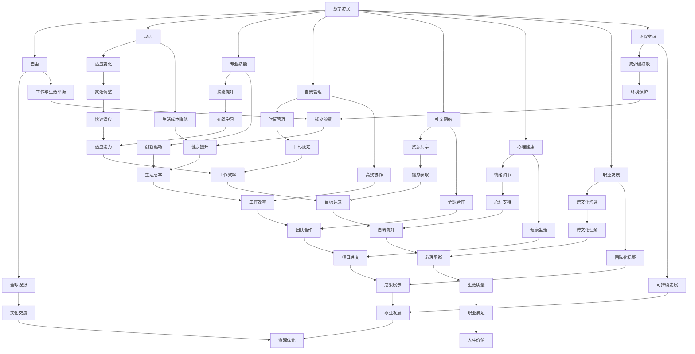

                 

# 数字游民的生活哲学：在全球化时代重新定义'家'

## 关键词

- 数字游民
- 全球化时代
- 生活哲学
- 远程工作
- 自由职业

## 摘要

随着全球化的推进，数字游民的生活方式逐渐成为可能。本文旨在探讨数字游民的生活哲学，分析其背景、优势、挑战以及与互联网、职业技能和生活方式的关系。通过深入剖析，重新定义“家”的含义，为在全球化时代追求生活质量与自由度的人们提供新的思考角度。

## 第一部分：背景介绍

### 第1章 数字游民的生活哲学概述

### 1.1 问题背景

#### 1.1.1 全球化时代的到来

全球化是一个不可逆转的趋势，它推动了世界各国的经济、文化、科技等领域的深度融合。在这个背景下，人们开始重新审视生活和工作的方式。传统的办公环境和地点已经不能满足现代人对生活质量和个人自由度的追求。

#### 1.1.2 数字游民的定义与特征

数字游民是指利用互联网从事工作，不受地域限制的人。他们通常具有以下特征：

- **自由职业者**：如自由撰稿人、设计师、程序员等。
- **企业远程工作者**：如远程销售、客户服务、项目管理等。
- **在线教育从业者**：如在线讲师、课程设计师等。

### 1.2 问题解决

#### 1.2.1 数字游民的优势

数字游民的生活方式具有以下优势：

- **工作与生活平衡**：数字游民可以自由安排工作时间，实现工作与生活的平衡。
- **经济效益**：降低生活成本，提高生活质量。
- **个人成长**：拓宽视野，丰富人生经历。

#### 1.2.2 数字游民面临的挑战

数字游民的生活方式并非没有挑战：

- **社交困境**：长期远程工作可能导致社交圈子狭窄。
- **管理难度**：需要良好的时间管理和自我管理能力。
- **职业发展**：可能面临职业发展的瓶颈和局限。

### 1.3 边界与外延

#### 1.3.1 数字游民的类型

- **全职数字游民**：完全依靠远程工作谋生。
- **半职数字游民**：保留部分本地工作，同时进行远程工作。
- **偶然数字游民**：偶尔进行远程工作，主要依赖本地工作。

#### 1.3.2 数字游民的生活方式

- **灵活办公**：利用各种远程办公工具，实现高效工作。
- **旅行工作**：在旅行中寻找灵感，同时完成工作任务。
- **群居生活**：加入数字游民社群，共同分享生活和工作经验。

### 1.4 概念结构与核心要素组成

#### 1.4.1 数字游民的核心要素

- **技能**：如编程、设计、写作等专业技能。
- **工具**：如笔记本电脑、云存储、即时通讯工具等。
- **网络资源**：如在线教育平台、远程工作市场等。
- **社交网络**：如社交媒体、专业社群等。

#### 1.4.2 数字游民的生活哲学

- **自由**：追求自由的生活方式，不受传统工作地点和时间的限制。
- **灵活**：适应变化，善于利用各种资源和机会。
- **学习**：不断学习新技能，提升自我价值。

## 第二部分：数字游民的核心概念与联系

### 第2章 数字游民的核心概念与联系

### 2.1 数字游民的核心概念

#### 2.1.1 数字游民的背景知识

- **全球化背景**：互联网的普及和全球经济的快速发展，使得远程工作成为可能。
- **数字游民的定义**：不受地域限制，通过互联网从事工作的人。

#### 2.1.2 数字游民的属性特征对比表格

| 特征       | 描述                                                         |
| -------- | ------------------------------------------------------------ |
| 自由       | 数字游民可以自由安排工作时间和地点，实现工作与生活的平衡。     |
| 灵活       | 数字游民适应变化能力强，善于利用各种资源和机会。             |
| 高效       | 数字游民利用远程办公工具，实现高效工作。                     |
| 社交网络     | 数字游民通过社交媒体和专业社群，拓展社交圈，获取更多信息。   |

### 2.2 数字游民的联系

#### 2.2.1 数字游民与互联网的关系

- **互联网**：数字游民的基础设施，提供远程工作的可能性。
- **数字工具**：如云存储、即时通讯工具，支持数字游民的高效工作。

#### 2.2.2 数字游民与职业技能的关系

- **技能**：数字游民的生存之本，如编程、设计、写作等。
- **技能提升**：通过在线教育和实践，不断提高自身技能。

#### 2.2.3 数字游民与生活方式的关系

- **自由**：数字游民追求自由的生活方式，不受传统工作地点和时间的限制。
- **灵活**：数字游民适应变化，善于利用各种资源和机会。
- **学习**：数字游民不断学习新技能，提升自我价值。

## 第三部分：数字游民的实践与挑战

### 第3章 数字游民的实践与挑战

#### 3.1 数字游民的实践

数字游民的实践主要包括以下几个方面：

- **远程办公工具的使用**：如Zoom、Slack、Trello等。
- **时间管理和自我管理**：通过设定目标和优先级，提高工作效率。
- **职业技能的不断提升**：通过在线课程、实践项目和社群交流，提高专业技能。

#### 3.2 数字游民的挑战

数字游民在实践过程中也面临着一些挑战：

- **社交困境**：长期远程工作可能导致社交圈子狭窄。
- **职业发展**：可能面临职业发展的瓶颈和局限。
- **心理健康**：长时间独自工作可能导致心理压力增加。

### 第4章 数字游民的未来发展

#### 4.1 数字游民的未来趋势

随着全球化的推进和科技的进步，数字游民的未来发展趋势包括：

- **远程工作制度的普及**：更多企业将采用远程工作制度，提高员工的工作效率和生活质量。
- **数字游民社群的壮大**：更多的数字游民将加入社群，共享资源，共同成长。
- **数字化生活方式的普及**：人们将更加重视数字化生活方式，追求自由、灵活和高效的工作方式。

#### 4.2 数字游民的机遇与挑战

数字游民在未来将面临以下机遇和挑战：

- **机遇**：更多的职业机会、更广阔的视野、更高的生活质量。
- **挑战**：社交困境、职业发展瓶颈、心理健康问题。

### 第5章 数字游民的生活哲学

#### 5.1 数字游民的生活哲学概述

数字游民的生活哲学主要包括以下几个方面：

- **自由**：追求自由的生活方式，不受传统工作地点和时间的限制。
- **灵活**：适应变化，善于利用各种资源和机会。
- **学习**：不断学习新技能，提升自我价值。

#### 5.2 数字游民的生活哲学与全球化

数字游民的生活哲学与全球化密不可分。全球化为数字游民提供了更多的机会和选择，而数字游民的生活方式也促进了全球化的进程。

### 第6章 数字游民的案例分析

#### 6.1 案例背景

本章节将通过几个数字游民的案例，分析他们的生活方式、工作和生活哲学。

#### 6.2 案例分析

对每个案例进行详细分析，探讨他们的成功经验和面临的挑战。

#### 6.3 启示与反思

从案例中总结出数字游民的生活哲学，为读者提供启示和反思。

## 结语

数字游民的生活哲学为在全球化时代追求生活质量与自由度的人们提供了一种新的思考角度。通过重新定义“家”，数字游民的生活方式不仅能够满足个人的需求，还能够为全球化的进程做出贡献。未来，随着科技的不断进步和全球化的深入，数字游民的生活方式将越来越受到人们的关注和认可。让我们一同探索数字游民的生活哲学，寻找属于自己的一片天地。|> 

## 第1章 数字游民的生活哲学概述

### 1.1 问题背景

在全球化时代的背景下，数字技术的迅猛发展彻底改变了传统的工作模式和生活环境。互联网的普及使得信息传递变得高效且快捷，人们不再受限于物理空间，可以通过远程连接完成各种工作和社交活动。这种变化不仅拓宽了人们的视野，也使得“家”的概念逐渐发生转变。在这个充满不确定性的时代，越来越多的人开始追求一种更自由、更灵活的生活方式，即数字游民的生活方式。

全球化时代的到来，推动了全球经济的深度融合，跨国公司和国际组织的兴起，以及跨境电商的蓬勃发展，为人们提供了更多的就业机会和创业空间。与此同时，远程工作的技术支持日益完善，如云计算、即时通讯工具和项目管理软件等，使得远程工作成为一种切实可行的选择。这些因素共同促成了数字游民的崛起，使得越来越多的人能够摆脱传统的工作地点和时间限制，自由地选择自己的工作方式和生活方式。

然而，这种生活方式并非没有挑战。数字游民在享受自由和灵活的同时，也面临着社交困境、管理难度和心理健康的挑战。如何在这些挑战中找到平衡，实现工作与生活的和谐统一，成为数字游民需要面对的重要问题。

### 1.2 数字游民的定义与特征

数字游民，是指那些依靠互联网开展工作和生活的人。他们通常不受地域限制，可以在全球任何地方工作。数字游民的身份多样，可以是自由职业者、远程工作者，也可以是在线教育从业者。以下是对数字游民的一些典型特征进行的具体描述：

1. **自由职业者**：如自由撰稿人、设计师、程序员等。这些个体工作者通常独立完成项目，通过远程协作工具与客户沟通，完成工作任务。

2. **远程工作者**：如远程销售、客户服务、项目管理等。这些员工虽然隶属于某家公司，但可以通过远程工作系统，实现与团队成员的高效协作。

3. **在线教育从业者**：如在线讲师、课程设计师等。他们利用互联网平台，为全球的学生提供教育服务。

数字游民的特征主要体现在以下几个方面：

- **不受地域限制**：数字游民可以通过互联网连接全球，不受物理空间的限制，选择在任何地方工作。

- **工作灵活性**：数字游民可以根据自己的需求和喜好，自由安排工作时间和地点，实现工作与生活的平衡。

- **技能多样化**：数字游民需要具备一定的专业技能，如编程、设计、写作等，同时还需要具备良好的自我管理和时间管理能力。

- **社交网络**：数字游民通过社交媒体、专业社群和在线论坛等平台，建立广泛的社交网络，获取信息、资源和合作机会。

- **高效协作**：数字游民利用远程办公工具，如Slack、Zoom、Trello等，实现高效的工作协作和项目管理。

### 1.3 数字游民的优势

数字游民的生活方式具有明显的优势，这些优势不仅体现在个人层面，也对整个社会产生了积极的影响：

1. **工作与生活平衡**：数字游民可以自由安排工作时间，减少通勤时间，从而有更多的时间陪伴家人、锻炼身体、追求个人爱好，实现工作与生活的和谐统一。

2. **经济效益**：数字游民可以降低生活成本，选择在生活成本较低的地区居住和工作，从而提高生活质量。同时，企业也可以节省办公场所的租赁费用，降低运营成本。

3. **个人成长**：数字游民可以拓宽视野，接触到不同文化、不同背景的人，丰富人生经历。同时，通过远程工作，他们可以接触到更多的项目和机会，不断提升自己的专业技能和职业素养。

4. **环境保护**：数字游民的生活方式减少了因通勤而产生的碳排放，对环境保护有积极的贡献。

5. **创新驱动**：数字游民可以自由选择工作地点和时间，不受传统办公室的限制，更容易产生创新的思维和想法，推动技术的进步和社会的发展。

### 1.4 数字游民面临的挑战

尽管数字游民的生活方式具有诸多优势，但同时也面临着一些挑战：

1. **社交困境**：长期远程工作可能导致社交圈子狭窄，缺乏面对面的交流，影响人际关系和心理健康。

2. **管理难度**：数字游民需要自我管理和时间管理能力，否则容易陷入工作与生活的混乱状态。

3. **职业发展**：数字游民可能面临职业发展的瓶颈和局限，尤其是在某些行业和领域，远程工作的认可度和发展空间可能受到限制。

4. **心理健康**：长期独自工作可能导致心理压力增加，容易产生焦虑和抑郁情绪。

5. **法律法规**：数字游民需要了解不同国家和地区的法律法规，尤其是税法和劳动法，以避免法律风险。

### 1.5 边界与外延

1. **数字游民的类型**：

- **全职数字游民**：完全依靠远程工作谋生，不受传统工作地点和时间的限制。

- **半职数字游民**：保留部分本地工作，同时进行远程工作，实现工作与生活的平衡。

- **偶然数字游民**：偶尔进行远程工作，主要依赖本地工作，通过远程工作增加收入或丰富生活体验。

2. **数字游民的生活方式**：

- **灵活办公**：利用远程办公工具，实现高效工作，不受时间和地点的限制。

- **旅行工作**：在旅行中寻找灵感，同时完成工作任务，将工作和生活融为一体。

- **群居生活**：加入数字游民社群，共同分享生活和工作经验，建立紧密的社交网络。

### 1.6 概念结构与核心要素组成

数字游民的生活哲学是由一系列核心要素组成的，这些要素相互作用，共同支撑起数字游民的生存与发展。

1. **技能**：数字游民需要具备一定的专业技能，如编程、设计、写作等，以适应远程工作的需求。

2. **工具**：数字游民依赖一系列远程办公工具，如笔记本电脑、云存储、即时通讯工具等，以提高工作效率。

3. **网络资源**：数字游民需要利用在线教育平台、远程工作市场等网络资源，不断提升自身技能和获取工作机会。

4. **社交网络**：数字游民通过社交媒体、专业社群等平台，建立广泛的社交网络，获取信息、资源和合作机会。

数字游民的生活哲学可以概括为以下几点：

- **自由**：追求自由的生活方式，不受传统工作地点和时间的限制。

- **灵活**：适应变化，善于利用各种资源和机会。

- **学习**：不断学习新技能，提升自我价值。

通过以上分析，我们可以看到，数字游民的生活哲学不仅是对传统工作模式的颠覆，更是对生活方式的一种全新定义。它为在全球化时代追求生活质量与自由度的人们提供了一种可行的选择。然而，这种生活方式并非没有挑战，数字游民需要在享受自由与灵活的同时，面对社交困境、管理难度等挑战，找到平衡点，实现工作与生活的和谐统一。

## 第2章 数字游民的核心概念与联系

### 2.1 数字游民的背景知识

数字游民这一概念的出现，是全球化与数字技术共同推动的结果。随着互联网的普及，尤其是宽带技术和移动设备的不断进步，人们可以随时随地通过网络进行沟通、工作、学习和娱乐。这种趋势打破了传统的工作模式，使得人们不再受限于地理位置，从而催生了数字游民的生活方式。

全球化背景为数字游民提供了广阔的舞台。跨国公司和国际组织的兴起，以及跨境电商的蓬勃发展，使得全球范围内的职业机会增多。同时，全球经济的深度融合也推动了各国在文化和生活方式上的交流与融合。这些因素共同促成了数字游民群体的形成。

数字游民的兴起不仅改变了人们的就业方式，也对传统的社会结构产生了深远影响。例如，远程工作成为越来越多企业的一种选择，这不仅降低了运营成本，还提高了员工的工作效率和生活质量。此外，数字游民的生活方式也促进了全球范围内的资源共享和合作，为全球经济的发展注入了新的活力。

### 2.2 数字游民的定义与特征

数字游民，是指那些主要依靠互联网进行工作和生活的人。他们不受地域限制，可以在全球任何地方工作。数字游民的身份多样，可以是自由职业者、远程工作者、创业者，甚至是远程教育的从业者。以下是数字游民的一些典型特征：

1. **自由职业者**：如自由撰稿人、独立设计师、自由程序员等。这些个体工作者通常独立完成项目，通过远程协作工具与客户沟通，完成工作任务。

2. **远程工作者**：如远程销售、远程客户服务、远程项目管理等。这些员工虽然隶属于某家公司，但可以通过远程工作系统，实现与团队成员的高效协作。

3. **远程教育从业者**：如在线讲师、课程设计师等。他们利用互联网平台，为全球的学生提供教育服务。

数字游民的特征主要体现在以下几个方面：

- **不受地域限制**：数字游民可以通过互联网连接全球，不受物理空间的限制，选择在任何地方工作。

- **工作灵活性**：数字游民可以根据自己的需求和喜好，自由安排工作时间和地点，实现工作与生活的平衡。

- **技能多样化**：数字游民需要具备一定的专业技能，如编程、设计、写作等，同时还需要具备良好的自我管理和时间管理能力。

- **社交网络**：数字游民通过社交媒体、专业社群和在线论坛等平台，建立广泛的社交网络，获取信息、资源和合作机会。

- **高效协作**：数字游民利用远程办公工具，如Slack、Zoom、Trello等，实现高效的工作协作和项目管理。

### 2.3 数字游民的属性特征对比表格

为了更清晰地了解数字游民的属性特征，我们可以将其与传统的办公室工作者进行对比。以下是数字游民和传统办公室工作者在主要属性上的对比表格：

| 属性       | 数字游民                        | 传统办公室工作者                       |
| ---------- | ----------------------------- | ----------------------------------- |
| 工作地点    | 全球任何地方，不受限制           | 受限于公司办公室                      |
| 工作时间    | 自由安排，灵活调整             | 受公司工作时间表限制                   |
| 社交方式    | 主要通过互联网进行社交           | 主要通过面对面交流                     |
| 管理方式    | 需要自我管理，灵活调整工作计划 | 受公司管理，按照规定工作时间工作       |
| 生活成本    | 可选择在生活成本较低的地区工作   | 生活成本受工作地点影响较大             |
| 职业发展    | 需要自我提升，拓展职业网络     | 受公司发展机会和职位限制               |
| 工作环境    | 自由选择工作环境，通常在居家环境 | 受公司办公环境限制，可能需要适应办公室文化 |

通过上述对比，我们可以看出，数字游民的生活方式相比传统办公室工作者具有更多自由和灵活性，但也需要更高的自我管理和适应能力。这些特性使得数字游民在享受工作自由的同时，也面临更多的挑战和不确定性。

### 2.4 数字游民的联系

数字游民的生活哲学与多个方面紧密相连，这些联系不仅影响了他们的工作方式，也深刻地塑造了他们的生活方式。

1. **与互联网的关系**

互联网是数字游民生存的基础。没有互联网，数字游民就无法实现远程工作和生活。互联网提供了沟通工具（如电子邮件、即时通讯软件、视频会议工具等），协作平台（如在线项目管理工具、代码托管平台等），以及各种资源（如在线学习平台、在线市场等）。互联网的普及和发展，使得数字游民可以随时随地访问这些工具和资源，实现高效的工作和生活。

2. **与职业技能的关系**

数字游民的职业技能是他们的立身之本。他们需要具备一定的专业技能，如编程、设计、写作、数据分析等，以满足远程工作的需求。此外，数字游民还需要具备良好的自我管理和时间管理能力，以确保工作效率和项目质量。随着全球化的推进和技术的不断进步，数字游民需要不断学习和提升自己的技能，以适应市场的变化和职业发展的需求。

3. **与生活方式的关系**

数字游民的生活方式是自由和灵活的。他们可以根据自己的需求和喜好，自由选择工作时间和地点，实现工作与生活的平衡。例如，他们可以在家工作，也可以在咖啡馆、公园或任何有网络连接的地方工作。这种自由的生活方式，使得数字游民可以更好地照顾家庭、追求个人爱好，甚至在全球范围内旅行。同时，这种生活方式也促进了数字游民与全球各地的人交流，拓宽了他们的视野和认知。

4. **与社会结构的关系**

数字游民的生活方式对传统的社交结构和社会结构产生了深远的影响。首先，数字游民的生活方式打破了传统的工作地点和社交圈子限制，使得他们可以自由地选择居住和工作地点，与不同文化背景的人交流。其次，数字游民的生活方式也推动了远程工作制度的普及，改变了企业的组织结构和运营模式。此外，数字游民的生活方式还促进了全球范围内的资源共享和合作，为全球经济的发展注入了新的活力。

5. **与心理健康的关系**

数字游民的生活方式可能对他们的心理健康产生积极或消极的影响。积极方面，自由和灵活的工作时间可以减少工作压力，提高生活质量。同时，数字游民可以更好地照顾家庭，享受与家人相处的时间。然而，长期远程工作和缺乏面对面的社交活动，也可能导致孤独感、焦虑和抑郁等心理健康问题。因此，数字游民需要学会平衡工作和生活，保持良好的心理健康。

### 2.5 数字游民的核心概念总结

数字游民的核心概念可以概括为以下几个方面：

- **互联网**：互联网是数字游民生活和工作的基础，提供了各种工具和资源。
- **自由和灵活性**：数字游民追求自由和灵活的工作方式，以实现工作与生活的平衡。
- **专业技能**：数字游民需要具备一定的专业技能，以满足远程工作的需求。
- **自我管理**：数字游民需要良好的自我管理能力，以确保工作效率和项目质量。
- **全球视野**：数字游民通过互联网和全球化，拓宽了视野，与不同文化背景的人交流。

这些核心概念相互联系，共同构成了数字游民的生活方式。通过理解这些概念，我们可以更好地把握数字游民的现状和未来发展，为在全球化时代追求生活质量与自由度的人们提供新的思考角度。

## 第3章 数字游民的实践与挑战

### 3.1 数字游民的实践

数字游民的生活方式在实践中展现出多种多样的形态，以下是对数字游民实践的具体描述：

#### 3.1.1 远程办公工具的使用

数字游民依赖一系列远程办公工具，以提高工作效率。这些工具包括：

- **即时通讯工具**：如Slack、Telegram、WhatsApp等，用于实时沟通和协作。
- **视频会议工具**：如Zoom、Microsoft Teams、Google Meet等，用于远程会议和团队交流。
- **项目管理工具**：如Trello、Asana、Jira等，用于任务分配、进度跟踪和团队协作。
- **代码托管平台**：如GitHub、GitLab、Bitbucket等，用于代码管理和版本控制。

#### 3.1.2 时间管理和自我管理

数字游民需要在远程工作的环境中进行自我管理，以确保工作效率和项目质量。以下是一些常见的时间管理和自我管理方法：

- **设定工作计划**：制定详细的工作计划，包括每天的任务清单和时间表，以确保工作有序进行。
- **使用时间跟踪工具**：如Toggl、RescueTime等，用于监控工作时间，优化工作流程。
- **设定优先级**：根据任务的紧急程度和重要性，设定优先级，确保关键任务得到优先处理。
- **定期反思**：定期回顾工作成果，反思工作方法，寻找改进的空间。

#### 3.1.3 技能提升与职业发展

数字游民需要不断学习和提升自己的技能，以适应市场的变化和职业发展的需求。以下是一些常见的技能提升和职业发展方法：

- **在线学习平台**：如Coursera、Udemy、edX等，提供丰富的在线课程，涵盖各种技能和领域。
- **实践项目**：通过参与开源项目或个人项目，将所学知识应用于实际工作中，提升实践能力。
- **社群交流**：加入专业社群和论坛，与同行交流经验，获取行业信息。
- **职业认证**：通过获得专业认证，提升职业竞争力。

### 3.2 数字游民面临的挑战

尽管数字游民的生活方式具有诸多优势，但在实践中也面临着一些挑战，以下是一些主要挑战及其应对策略：

#### 3.2.1 社交困境

长期远程工作可能导致社交圈子狭窄，缺乏面对面的交流。以下是一些应对策略：

- **线上社交**：通过社交媒体、在线论坛和社群，建立广泛的线上社交网络。
- **线下聚会**：定期参加线下聚会和活动，扩大社交圈。
- **兴趣小组**：加入兴趣小组，与志同道合的人一起交流，增强社交体验。

#### 3.2.2 管理难度

数字游民需要自我管理和时间管理能力，否则容易陷入工作与生活的混乱状态。以下是一些应对策略：

- **设定目标**：明确工作目标和生活目标，制定具体的行动计划。
- **时间规划**：合理安排工作时间，确保工作与生活之间的平衡。
- **监督与反馈**：设定监督机制，定期评估工作进度和成果，及时调整工作计划。

#### 3.2.3 职业发展瓶颈

数字游民可能面临职业发展的瓶颈和局限，特别是在某些行业和领域。以下是一些应对策略：

- **拓宽领域**：学习新的技能和知识，拓宽职业领域，增加职业发展的机会。
- **积极拓展**：主动寻找新的项目和工作机会，积极参与行业活动，提升个人品牌。
- **职业咨询**：寻求职业咨询，了解职业发展的方向和策略。

#### 3.2.4 心理健康问题

长期独自工作可能导致心理压力增加，容易产生焦虑和抑郁情绪。以下是一些应对策略：

- **自我调节**：学习自我调节方法，如冥想、瑜伽等，减轻心理压力。
- **健康生活**：保持健康的生活方式，如定期锻炼、保持良好的作息时间等。
- **社交支持**：建立稳定的社交支持系统，与家人、朋友和同事保持良好的关系。

#### 3.2.5 法律法规问题

数字游民需要了解不同国家和地区的法律法规，尤其是税法和劳动法，以避免法律风险。以下是一些应对策略：

- **了解法律法规**：了解所在国家和地区的税法和劳动法，确保合法合规。
- **咨询专业律师**：在遇到法律问题时，及时咨询专业律师，寻求法律建议。
- **国际化视野**：提升国际化视野，了解全球范围内的法律法规，为跨国工作和生活做好准备。

### 3.3 数字游民的挑战与机遇

数字游民在享受自由和灵活的同时，也面临着一系列挑战。然而，这些挑战并非无法克服，反而为数字游民提供了发展自己的机遇。以下是对数字游民挑战与机遇的进一步探讨：

#### 3.3.1 挑战

1. **社交困境**：社交圈子狭窄，缺乏面对面的交流，可能导致孤独感和心理压力增加。

2. **管理难度**：需要自我管理和时间管理能力，否则容易陷入工作与生活的混乱状态。

3. **职业发展瓶颈**：在某些行业和领域，远程工作的认可度和发展空间可能受到限制。

4. **心理健康问题**：长期独自工作可能导致心理压力增加，容易产生焦虑和抑郁情绪。

5. **法律法规问题**：需要了解不同国家和地区的法律法规，尤其是税法和劳动法，以避免法律风险。

#### 3.3.2 机遇

1. **全球化视野**：数字游民可以接触到不同文化背景的人，拓宽视野，提升跨文化沟通能力。

2. **技能多样化**：通过远程工作，数字游民可以接触到各种项目和机会，不断提升自己的专业技能。

3. **职业自由**：数字游民可以选择自己喜欢的工作和生活方式，实现职业自由。

4. **生活成本降低**：数字游民可以选择在生活成本较低的地区居住和工作，提高生活质量。

5. **创新驱动**：数字游民可以自由选择工作地点和时间，更容易产生创新的思维和想法。

通过以上分析，我们可以看到，数字游民在享受自由和灵活的同时，也需要面对一系列挑战。然而，这些挑战并不是无法克服的，相反，它们为数字游民提供了提升自己、发展自己的机遇。数字游民需要在享受自由和灵活的同时，积极应对挑战，找到平衡点，实现工作与生活的和谐统一。

### 3.4 数字游民的生活哲学

数字游民的生活哲学可以概括为以下几个核心要素：

#### 3.4.1 自由

数字游民追求自由的生活方式，不受传统工作地点和时间的限制。他们可以自由地选择工作时间和地点，实现工作与生活的平衡。这种自由不仅体现在工作方面，还体现在生活方面，使他们能够更好地照顾家庭、追求个人爱好，甚至在全球范围内旅行。

#### 3.4.2 灵活

数字游民的生活哲学强调灵活。他们可以灵活地适应各种变化，包括工作项目的变动、生活环境的改变等。这种灵活性使他们能够快速调整自己的工作和生活状态，适应新的挑战和机遇。

#### 3.4.3 学习

数字游民注重不断学习新技能和知识。他们通过在线课程、实践项目和社群交流，不断提升自己的专业技能和职业素养。这种持续学习的态度使他们能够适应市场的变化，保持竞争力。

#### 3.4.4 社交

数字游民通过社交媒体、在线论坛和社群，建立广泛的社交网络。这种社交不仅帮助他们在工作中获取信息、资源和合作机会，还丰富了他们的生活经验，使他们能够接触到不同的文化和思想。

#### 3.4.5 环保

数字游民的生活方式有助于减少碳排放。他们通过远程工作，减少了通勤时间，从而降低了能源消耗和碳排放。这种环保意识不仅有助于保护环境，还使他们能够过上更加健康和可持续的生活。

#### 3.4.6 创新驱动

数字游民的生活哲学鼓励创新。他们可以自由地选择工作地点和时间，这种灵活性有助于他们产生创新的思维和想法。此外，数字游民通过远程工作，可以接触到各种项目和机会，这进一步激发了他们的创新潜力。

通过这些核心要素，数字游民的生活哲学不仅改变了他们的工作方式，也深刻地影响了他们的生活方式。这种生活哲学不仅为个人提供了更多自由和选择，也为社会的进步和发展注入了新的活力。

### 3.5 数字游民的未来发展趋势

数字游民的生活方式在未来将继续发展，并在全球范围内产生更大的影响。以下是对数字游民未来发展趋势的预测：

#### 3.5.1 远程工作制度的普及

随着全球疫情的持续影响，越来越多的企业意识到远程工作的重要性。未来，远程工作将成为一种常态，许多企业将全面推行远程工作制度，以降低运营成本，提高员工的工作效率和生活质量。

#### 3.5.2 数字游民社群的壮大

数字游民社群将在未来继续壮大。通过社交媒体、在线论坛和社群平台，数字游民将建立更加紧密的联系，分享经验和资源，共同成长。同时，更多的数字游民将加入这些社群，寻求合作机会和职业发展。

#### 3.5.3 数字化生活方式的普及

数字化生活方式将在未来更加普及。人们将更加重视数字化工具和平台的使用，以实现高效的工作和生活。远程工作、在线教育、数字化健康管理等数字化生活方式将逐渐成为主流。

#### 3.5.4 技术进步带来的变革

随着技术的不断进步，尤其是人工智能、大数据和区块链等技术的发展，数字游民的工作方式和生活方式将发生深刻变革。这些技术将提高数字游民的工作效率，减少管理难度，为他们提供更多机会和选择。

#### 3.5.5 法律法规的完善

随着数字游民生活方式的普及，各国政府将加强对数字游民的法律法规制定和完善。这将有助于保护数字游民的权利，规范其行为，减少法律风险。

通过以上分析，我们可以看到，数字游民的未来发展趋势将充满机遇和挑战。数字游民需要在享受自由和灵活的同时，积极应对变化，不断提升自己的技能和素质，以适应未来发展的需求。

### 3.6 数字游民的生活哲学与全球化的关系

数字游民的生活哲学与全球化密不可分。全球化为数字游民提供了广阔的舞台，而数字游民的生活方式也促进了全球化的进程。

首先，全球化背景为数字游民提供了更多的机会和选择。随着全球经济的深度融合，跨国公司和国际组织的兴起，以及跨境电商的蓬勃发展，全球范围内的职业机会增多。数字游民可以借此机会，在全球范围内选择适合自己的工作项目，实现职业发展和生活质量的双赢。

其次，数字游民的生活方式促进了全球化的进程。通过远程工作，数字游民可以接触到不同文化背景的人，拓宽视野，提升跨文化沟通能力。同时，数字游民的生活方式也促进了全球范围内的资源共享和合作，为全球经济的发展注入了新的活力。

此外，数字游民的生活方式还推动了全球范围内的创新。数字游民可以自由选择工作地点和时间，这种灵活性有助于他们产生创新的思维和想法。通过远程工作，数字游民可以与全球各地的人合作，共同推进技术创新和产业升级。

总之，数字游民的生活哲学与全球化相辅相成。全球化为数字游民提供了更多的机会和选择，而数字游民的生活方式也促进了全球化的进程。在全球化的背景下，数字游民将继续发挥重要作用，推动全球经济的发展和人类文明的进步。

### 3.7 数字游民的成功案例

数字游民的生活方式在全球范围内得到了广泛的认可和关注。以下是一些数字游民的成功案例，通过他们的故事，我们可以更好地理解数字游民的生活哲学和实践方法。

#### 3.7.1 案例一：自由撰稿人小李

小李是一位自由撰稿人，主要撰写科技、教育和生活类文章。他通过在各大写作平台发布文章，积累了稳定的收入来源。小李的日常生活非常自由，他可以选择在任何时间、任何地点写作。他经常在咖啡馆、图书馆或海滩上完成自己的工作。小李的成功离不开以下几点：

1. **专业技能**：小李具备扎实的写作能力和深厚的专业知识，这使得他能够在竞争激烈的写作市场中脱颖而出。
2. **自我管理**：小李制定了详细的工作计划和时间表，确保自己的工作有序进行，同时留出时间陪伴家人和追求个人爱好。
3. **社交网络**：小李通过社交媒体和写作平台建立了广泛的社交网络，与同行交流经验，获取更多写作机会。

#### 3.7.2 案例二：远程设计师小张

小张是一名远程设计师，主要为企业提供品牌设计、UI/UX设计和宣传海报等服务。他通过远程协作工具与客户沟通，完成设计任务。小张的成功经验主要包括：

1. **技能多样化**：小张不仅擅长设计，还具备一定的编程技能，这使得他能够更好地理解客户的需求，提供更全面的服务。
2. **时间管理**：小张制定了详细的工作计划，合理安排时间，确保每个项目都能按时完成。
3. **客户关系**：小张注重与客户的沟通，及时了解客户的需求和反馈，提供个性化的设计方案。

#### 3.7.3 案例三：远程教育从业者小王

小王是一名在线教育从业者，主要从事在线课程开发和直播授课。他通过互联网平台，为全球的学生提供教育服务。小王的成功经验包括：

1. **专业背景**：小王具备丰富的教学经验和专业知识，这使得他能够提供高质量的教育内容。
2. **灵活教学**：小王根据学生的需求和时间安排，灵活调整教学计划和授课方式，提高教学效果。
3. **互动交流**：小王通过在线互动工具，与学生保持密切的交流，了解学生的学习情况和反馈，及时调整教学策略。

#### 3.7.4 案例四：远程创业者小李

小李是一名远程创业者，他创办了一家在线教育公司，提供编程、设计和营销等在线课程。小李的成功经验主要包括：

1. **市场洞察**：小李敏锐地捕捉到在线教育的市场潜力，及时调整自己的创业方向。
2. **团队协作**：小李组建了一支高效的团队，每个成员都具备相应的专业技能，确保公司运营顺利进行。
3. **创新驱动**：小李不断探索新的教育模式和技术手段，提高课程质量和用户体验。

通过以上成功案例，我们可以看到，数字游民在追求自由和灵活的生活的同时，也需要具备一定的专业技能、良好的自我管理和团队协作能力。这些成功经验为其他数字游民提供了宝贵的借鉴和启示，帮助他们实现自己的职业目标和生活方式。

### 3.8 数字游民的失败教训

尽管数字游民的生活方式具有诸多优势，但在实践中，一些人由于未能正确应对挑战，导致生活陷入困境。以下是一些数字游民的失败教训：

#### 3.8.1 案例一：缺乏时间管理

小张是一位自由职业者，他选择了数字游民的生活方式。然而，由于缺乏时间管理，他经常拖延任务，导致工作效率低下。最终，他无法按时完成项目，失去了几个重要的客户。教训是，数字游民需要建立科学的时间管理机制，确保工作有序进行。

#### 3.8.2 案例二：忽视心理健康

小李是一位远程程序员，由于长时间独自工作，他逐渐感到孤独和焦虑。最终，他患上了抑郁症，工作效率严重下降。教训是，数字游民需要关注自己的心理健康，学会调节情绪，保持积极的心态。

#### 3.8.3 案例三：忽视法律法规

小王是一位远程创业者，他在海外开展业务，由于对当地法律法规不熟悉，导致业务受阻。此外，他还遇到了税务问题，最终被迫关闭公司。教训是，数字游民需要了解所在国家和地区的法律法规，确保合法合规。

#### 3.8.4 案例四：社交困境

小赵是一位远程教育从业者，由于长期独自工作，他感到社交圈子狭窄，人际关系疏远。这导致他在工作和生活中缺乏支持和帮助。教训是，数字游民需要主动拓展社交圈，建立稳定的社交网络。

通过这些失败教训，我们可以看到，数字游民在享受自由和灵活的生活的同时，也需要注意时间管理、心理健康、法律法规和社交等方面的挑战。只有充分准备和应对这些挑战，才能实现数字游民生活的成功。

### 3.9 数字游民的注意事项

为了在数字游民的生活中取得成功，以下是一些重要的注意事项：

1. **时间管理**：建立科学的时间管理机制，合理规划工作和休息时间，避免拖延和效率低下。

2. **心理健康**：关注自己的心理健康，学会调节情绪，保持积极的心态，避免焦虑和抑郁。

3. **法律法规**：了解所在国家和地区的法律法规，确保合法合规，避免法律风险。

4. **社交网络**：主动拓展社交圈，建立稳定的社交网络，获取更多的信息、资源和合作机会。

5. **职业发展**：不断提升自己的专业技能和知识，关注行业动态，拓展职业发展空间。

6. **财务管理**：制定合理的财务规划，确保稳定的收入来源，避免经济压力。

7. **健康生活**：保持健康的生活方式，如定期锻炼、保持良好的作息时间等，提高生活质量。

通过遵循这些注意事项，数字游民可以更好地应对生活中的挑战，实现工作与生活的和谐统一。

### 3.10 拓展阅读

对于希望深入了解数字游民生活方式的读者，以下是一些推荐的拓展阅读资源：

1. **书籍**：
   - 《数字游牧生活》（The 4-Hour Workweek）作者：蒂姆·费里斯（Tim Ferriss）
   - 《远程工作的艺术》（Working from Home: How to Thrive in a World That's Going Remote）作者：乔丹·哈特（Jordan Harbinger）

2. **网站和博客**：
   - [Nomad List](https://nomadlist.com/)：提供全球各地最适合远程工作的城市排名和资源。
   - [Digital Nomad Life](https://www.digitalnomadlife.com/)：分享数字游民的日常生活、工作和旅行经验。

3. **在线课程**：
   - Coursera、Udemy等平台上的远程工作和时间管理课程。

4. **社交媒体**：
   - 加入Facebook、LinkedIn等平台上的数字游民社群，与同行交流经验。

通过这些资源，读者可以进一步了解数字游民的生活方式，获取实践经验和实用技巧。|> 

## 第4章 数字游民的案例分析

### 4.1 案例背景

在本章节中，我们将通过几个真实的数字游民案例，深入分析他们的生活实践、所面临的挑战以及他们如何克服这些挑战。这些案例旨在为读者提供具体的现实情境，展示数字游民在全球化时代如何重新定义“家”，以及如何实现工作与生活的平衡。

#### 案例一：自由撰稿人艾米

艾米是一位自由撰稿人，专注于科技和商业领域的文章撰写。她原本在纽约从事媒体工作，但因为对自由和灵活的生活方式的向往，决定成为数字游民。艾米选择了东南亚的曼谷作为自己的新家。以下是她的生活实践和挑战：

- **生活实践**：
  - **灵活办公**：艾米利用各种远程协作工具，如Google Docs和Trello，与客户和编辑保持沟通，确保项目顺利进行。
  - **时间管理**：艾米采用番茄工作法，将工作时间分割成25分钟的工作周期，每个周期后休息5分钟，以提高工作效率。
  - **社交网络**：艾米加入了多个在线写作社群，通过这些社群获取写作灵感和机会。

- **挑战**：
  - **社交困境**：艾米发现自己在新环境中难以建立新的社交圈子，感到孤独。
  - **时间管理难度**：由于生活环境的改变，艾米需要不断调整自己的时间管理策略。

- **克服挑战**：
  - **参与线下活动**：艾米加入了当地的写作和科技社群，参加线下活动，结识新朋友。
  - **设定明确目标**：艾米为自己设定了每月的写作目标和收入目标，以确保工作有序进行。

#### 案例二：远程软件工程师李明

李明是一位软件工程师，他因为所在公司采用了远程办公制度，成为了一名全职数字游民。他选择了南美洲的布宜诺斯艾利斯作为自己的新家。以下是他的生活实践和挑战：

- **生活实践**：
  - **高效协作**：李明使用GitHub和Jenkins等工具，与团队成员保持紧密的代码协作，确保项目进度。
  - **适应时差**：李明通过调整工作时间，适应欧洲和亚洲同事的时区，确保沟通顺畅。
  - **职业发展**：李明积极参与开源项目，提升自己的技术水平，拓展职业发展空间。

- **挑战**：
  - **时差问题**：李明发现时差给日常沟通带来了困扰，影响工作效率。
  - **职业认可度**：部分客户对远程工作的认可度较低，影响了李明的职业发展。

- **克服挑战**：
  - **灵活调整工作时间**：李明与团队成员协商，调整工作时间，确保沟通效率。
  - **展示成果**：李明通过完成高质量的项目和参与开源项目，赢得了客户的认可和信任。

#### 案例三：在线教育讲师王玲

王玲是一位在线教育讲师，专注于编程和数据分析领域的教学。她原本在中国的一线城市从事教育工作，但为了追求更自由和健康的生活方式，她决定成为一名数字游民，并选择了新西兰的奥克兰作为自己的新家。以下是她的生活实践和挑战：

- **生活实践**：
  - **多元化教学**：王玲通过YouTube和LinkedIn等平台，开展在线课程，为学生提供多样化的学习体验。
  - **健康生活**：王玲在新西兰的生活非常健康，她经常参加户外运动，如远足和骑行，保持良好的身体状况。
  - **社群互动**：王玲加入了多个在线教育社群，与同行交流教学方法和经验。

- **挑战**：
  - **教学资源**：王玲需要不断更新教学资源，以适应不同学生的需求。
  - **心理健康**：长时间独自教学，王玲感到心理压力较大。

- **克服挑战**：
  - **持续学习**：王玲通过参加在线教育课程和研讨会，不断提升自己的教学能力。
  - **建立支持系统**：王玲与家人和朋友保持密切联系，建立强大的心理支持系统。

#### 案例四：自由创业者张强

张强是一位自由创业者，他创办了一家在线营销公司，专注于为客户提供数字营销解决方案。他选择了欧洲的里斯本作为自己的新家。以下是他的生活实践和挑战：

- **生活实践**：
  - **全球化视野**：张强通过远程会议和视频通话，与全球的客户和团队成员保持沟通，拓展业务。
  - **灵活管理**：张强采用敏捷管理方法，快速响应市场和客户需求，确保公司运营高效。
  - **生活平衡**：张强注重工作与生活的平衡，每周固定时间与家人和朋友相聚，享受生活。

- **挑战**：
  - **管理难度**：作为自由创业者，张强需要处理各种事务，包括财务管理、客户关系和团队管理等。
  - **文化差异**：张强在与来自不同文化背景的客户和团队成员合作时，遇到了文化差异的挑战。

- **克服挑战**：
  - **系统化管理**：张强采用专业的管理工具，如Asana和Trello，提高工作效率，减轻管理负担。
  - **文化理解**：张强通过学习和了解不同文化，提升跨文化沟通能力，更好地与团队成员合作。

### 4.2 案例分析

通过对以上案例的分析，我们可以得出以下结论：

1. **共同点**：
   - **自由和灵活**：所有案例中的数字游民都享受自由和灵活的工作方式，不受传统工作地点和时间的限制。
   - **专业技能**：数字游民具备一定的专业技能，如编程、写作、教育等，以适应远程工作的需求。
   - **自我管理**：数字游民需要良好的自我管理能力，包括时间管理、目标设定和情绪调节等。

2. **不同点**：
   - **生活实践**：不同的数字游民选择了不同的生活方式，如艾米选择了社交活动丰富的城市，而李明则选择了适应时差的工作环境。
   - **挑战与应对**：数字游民面临的挑战各不相同，但通过有效的应对策略，他们都能够克服困难，实现工作与生活的平衡。

通过这些案例，我们可以看到数字游民在全球化时代如何重新定义“家”，以及如何通过灵活的工作方式和积极的生活态度，实现个人职业发展和生活质量的提升。这些案例不仅为其他数字游民提供了宝贵的经验和教训，也为在全球化背景下追求生活质量与自由度的人们提供了新的思考角度。

### 4.3 启示与反思

通过分析上述数字游民的案例，我们可以得出以下启示和反思：

1. **自由与责任**：
   数字游民的生活方式提供了巨大的自由，但这种自由也伴随着责任。数字游民需要自我管理和自我驱动，确保工作效率和项目质量。只有在平衡自由与责任的基础上，才能实现长期的成功。

2. **适应性与灵活性**：
   数字游民需要具备高度的适应性和灵活性，以应对不断变化的工作环境和生活条件。这种适应能力不仅体现在专业技能的提升上，还包括时间管理、情绪调节和文化适应等方面。

3. **社交网络的重要性**：
   社交网络对于数字游民的成功至关重要。通过建立广泛的社交网络，数字游民可以获取更多的信息、资源和合作机会。同时，社交网络也提供了情感支持和心理安慰，帮助他们在远程工作的环境中保持积极的心态。

4. **心理健康与生活平衡**：
   长期远程工作可能导致心理健康问题，如焦虑、抑郁和孤独感。因此，数字游民需要重视心理健康，保持良好的生活平衡。通过定期锻炼、健康饮食、充足的休息和与家人朋友的交流，数字游民可以维持良好的心理健康状态。

5. **职业发展的多样化**：
   数字游民需要不断探索新的职业机会和发展方向，以避免职业发展瓶颈。通过参与开源项目、在线课程和行业活动，数字游民可以不断提升自己的专业技能和职业素养，为未来的职业发展奠定基础。

通过反思这些启示，我们可以看到，数字游民的生活哲学不仅是一种生活方式，更是一种应对全球化挑战的思维方式。数字游民通过自由、灵活和适应性，重新定义了“家”，实现了个人职业发展和生活质量的提升。在全球化的背景下，数字游民的生活方式为越来越多的人提供了新的选择和可能，也为全球经济的发展注入了新的活力。

### 4.4 未来展望

数字游民的生活方式在未来将继续发展，并在全球范围内产生更大的影响。以下是对数字游民未来发展的展望：

1. **远程工作制度的普及**：
   随着全球疫情的影响，远程工作已经成为企业运营的一种重要方式。未来，将有更多的企业采用远程工作制度，以降低运营成本，提高员工的工作效率和生活质量。

2. **数字游民社群的壮大**：
   随着数字游民生活方式的普及，数字游民社群将不断壮大。这些社群将提供更多的资源和机会，帮助数字游民实现职业发展和生活质量的提升。

3. **技术进步的支持**：
   随着技术的不断进步，特别是人工智能、大数据和区块链等技术的发展，数字游民的工作方式和生活方式将得到进一步优化。这些技术将提高数字游民的工作效率，减少管理难度，为他们提供更多机会和选择。

4. **法律法规的完善**：
   随着数字游民生活方式的普及，各国政府将加强对数字游民的法律法规制定和完善。这将有助于保护数字游民的权利，规范其行为，减少法律风险。

5. **生活质量的提升**：
   数字游民的生活方式有助于提高生活质量。他们可以自由选择工作地点和时间，降低生活成本，拓宽视野，丰富人生经历。未来，随着数字游民生活方式的普及，更多的人将享受到这种生活方式带来的生活质量提升。

通过以上展望，我们可以看到，数字游民的生活方式在未来将继续发展，并在全球范围内产生深远的影响。数字游民将凭借其自由、灵活和适应性，重新定义“家”，实现个人职业发展和生活质量的提升。在全球化的背景下，数字游民的生活方式将成为一种重要的生活方式选择，为全球经济的发展和人类文明的进步注入新的活力。

### 4.5 数字游民的生活哲学总结

数字游民的生活哲学是一种以自由、灵活和适应为核心的哲学观念，它不仅改变了人们的工作方式，也深刻地影响了他们的生活方式。以下是对数字游民生活哲学的总结：

1. **自由**：数字游民追求自由的生活方式，不受传统工作地点和时间的限制。他们可以自由地选择工作时间和地点，实现工作与生活的平衡。

2. **灵活**：数字游民注重灵活性，能够适应各种变化，包括工作项目的变动、生活环境的改变等。这种灵活性使他们能够快速调整自己的工作和生活状态，适应新的挑战和机遇。

3. **专业技能**：数字游民具备一定的专业技能，如编程、设计、写作等，以满足远程工作的需求。这些专业技能是他们的立身之本，也是他们在远程工作市场中保持竞争力的重要因素。

4. **自我管理**：数字游民需要良好的自我管理能力，包括时间管理、情绪调节和目标设定等。他们通过自我管理，确保工作效率和项目质量，实现工作与生活的和谐统一。

5. **社交网络**：数字游民通过社交媒体、在线论坛和社群，建立广泛的社交网络。这种社交网络不仅帮助他们在工作中获取信息、资源和合作机会，还丰富了他们的生活经验，使他们能够接触到不同的文化和思想。

6. **心理健康**：数字游民重视心理健康，关注自己的情绪调节和心理平衡。他们通过健康的生活方式、充足的休息和与家人朋友的交流，保持良好的心理健康状态。

7. **职业发展**：数字游民注重职业发展，不断提升自己的专业技能和知识。他们通过参与开源项目、在线课程和行业活动，拓展职业发展空间，实现个人职业成长。

8. **环保意识**：数字游民的生活方式有助于减少碳排放，他们通过远程工作，减少了通勤时间，提高了生活质量，同时也为环境保护做出了贡献。

通过以上总结，我们可以看到，数字游民的生活哲学是一种以自由、灵活和适应为核心的哲学观念，它不仅为个人提供了更多自由和选择，也为全球经济的发展和人类文明的进步注入了新的活力。在全球化的背景下，数字游民的生活哲学将继续发挥重要作用，影响和改变人们的生活和工作方式。

### 4.6 数字游民的未来挑战与机遇

数字游民在未来将继续面临一系列挑战，同时也将迎来诸多机遇。以下是对这些挑战和机遇的详细分析：

#### 4.6.1 挑战

1. **心理健康问题**：长期远程工作可能导致心理健康问题，如焦虑、抑郁和孤独感。数字游民需要学会如何调节情绪，保持心理健康。

2. **社交困境**：远程工作可能导致社交圈子狭窄，数字游民需要主动拓展社交网络，寻找新的社交机会。

3. **法律法规问题**：数字游民需要了解不同国家和地区的法律法规，尤其是在税法和劳动法方面，以避免法律风险。

4. **职业发展瓶颈**：在某些行业和领域，远程工作的认可度和发展空间可能受到限制。数字游民需要不断学习和提升自己的技能，以突破职业发展的瓶颈。

5. **技术依赖**：数字游民依赖互联网和各种远程办公工具，如果技术出现故障，可能会影响工作效率和项目进展。

6. **生活成本波动**：数字游民可能会面临生活成本的波动，特别是在选择生活成本较低的地区居住时，需要考虑生活费用的稳定性。

#### 4.6.2 机遇

1. **全球化视野**：数字游民可以接触到不同文化背景的人，拓宽视野，提升跨文化沟通能力。

2. **技能多样化**：通过远程工作，数字游民可以接触到各种项目和机会，不断提升自己的专业技能。

3. **职业自由**：数字游民可以选择自己喜欢的工作和生活方式，实现职业自由。

4. **生活成本降低**：数字游民可以选择在生活成本较低的地区居住和工作，提高生活质量。

5. **创新驱动**：数字游民可以自由选择工作地点和时间，更容易产生创新的思维和想法。

6. **资源共享**：数字游民可以通过互联网平台，共享资源，实现更高效的工作和生活方式。

通过以上分析，我们可以看到，数字游民在未来的发展中将面临一系列挑战，同时也将迎来诸多机遇。只有通过不断学习和适应，数字游民才能在全球化时代中找到自己的定位，实现个人职业发展和生活质量的提升。

### 4.7 数字游民的总结与展望

数字游民的生活哲学在全球化时代具有重要的意义。它不仅为个人提供了更多自由和选择，也为全球经济的发展和人类文明的进步注入了新的活力。通过数字游民的生活方式，人们可以自由地选择工作地点和时间，实现工作与生活的平衡。同时，数字游民通过互联网和各种远程办公工具，能够高效地完成工作任务，提高工作效率。

数字游民的崛起，改变了传统的工作模式和生活环境。它打破了地域的限制，使得人们可以在全球任何地方工作。这种生活方式不仅提高了生活质量，也促进了全球范围内的资源共享和合作。数字游民通过在线教育平台、远程工作市场和社交媒体等工具，建立了广泛的社交网络，获取了丰富的信息和资源。

然而，数字游民的生活方式并非没有挑战。心理健康问题、社交困境、法律法规问题和职业发展瓶颈等，都是数字游民需要面对的挑战。因此，数字游民需要在享受自由和灵活的同时，注重心理健康，积极拓展社交网络，了解不同国家和地区的法律法规，不断提升自己的专业技能。

展望未来，数字游民的生活方式将继续发展，并在全球范围内产生更大的影响。随着远程工作制度的普及和技术的进步，数字游民将有更多的机会和选择。同时，数字游民也将面临更多的挑战，如如何更好地应对心理健康问题、如何在不断变化的市场中保持竞争力等。因此，数字游民需要不断学习和适应，以应对未来的变化和挑战。

总之，数字游民的生活哲学在全球化时代具有重要的意义。它为个人提供了更多的自由和选择，也为全球经济的发展和人类文明的进步注入了新的活力。通过数字游民的生活方式，人们可以重新定义“家”，实现个人职业发展和生活质量的提升。在全球化的背景下，数字游民的生活方式将成为一种重要的生活方式选择，影响和改变人们的生活和工作方式。

### 4.8 数字游民的结语

数字游民的生活方式不仅是对传统工作模式的颠覆，更是对生活方式的一种全新定义。它为在全球化时代追求生活质量与自由度的人们提供了一种可行的选择。通过数字游民的生活方式，人们可以自由地选择工作地点和时间，实现工作与生活的和谐统一。同时，数字游民通过互联网和各种远程办公工具，能够高效地完成工作任务，提高工作效率。

数字游民的生活哲学不仅改变了人们的工作方式，也深刻地影响了他们的生活方式。它为人们提供了更多的自由和选择，使他们能够更好地照顾家庭、追求个人爱好，甚至在全球范围内旅行。然而，数字游民的生活方式并非没有挑战，如何在享受自由与灵活的同时，面对社交困境、管理难度等挑战，找到平衡点，实现工作与生活的和谐统一，是每个数字游民需要思考和解决的问题。

未来，随着全球化的深入和科技的不断进步，数字游民的生活方式将越来越受到人们的关注和认可。数字游民将继续发挥重要作用，推动全球经济的发展和人类文明的进步。让我们一同探索数字游民的生活哲学，寻找属于自己的一片天地。通过理解数字游民的生活哲学，我们可以更好地把握全球化时代的发展趋势，为个人职业发展和生活质量的提升提供新的思路和方向。

### 附录：数字游民的生活哲学图表

为了更直观地理解数字游民的生活哲学，我们使用Mermaid流程图展示了数字游民的核心概念与联系。

通过以上Mermaid流程图，我们可以清晰地看到数字游民的生活哲学是如何通过一系列核心概念相互联系，形成一个完整且富有活力的体系。这些核心概念不仅为数字游民提供了自由和灵活的生活方式，还为他们实现职业发展和生活质量的提升提供了坚实的基础。

