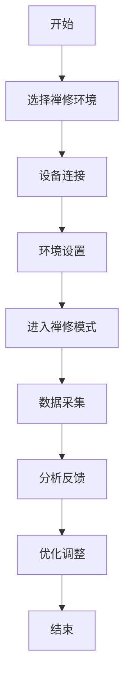
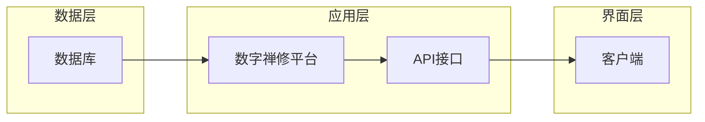
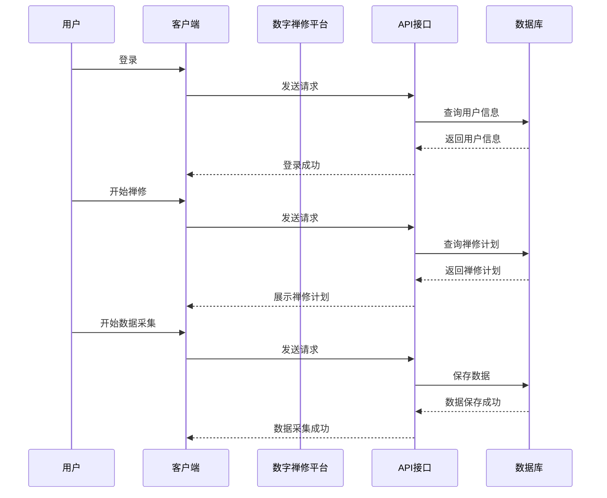

                 

# 数字禅修营：科技时代的精神净化

## 关键词
人工智能、数字禅修、精神净化、科技、心理健康

## 摘要
随着科技的快速发展，人工智能在各个领域得到了广泛应用，但同时也带来了信息过载和焦虑等心理健康问题。数字禅修营作为一种新兴的尝试，利用科技手段帮助人们实现精神净化。本文将深入探讨数字禅修营的理论基础、实践方法和意义，以期为现代社会的精神健康提供一种新的解决方案。

## 第一部分：背景介绍

### 核心概念

#### 问题背景
随着信息技术的飞速发展，人工智能（AI）已经成为现代社会的重要组成部分。从智能家居到自动驾驶，从医疗诊断到金融分析，AI的应用无处不在。然而，随着AI技术的普及，人们也面临着一系列挑战，如信息过载、隐私泄露、就业压力等。尤其是在面对大量的信息和数据时，许多人感到焦虑和压力，导致精神健康问题日益突出。

#### 数字禅修营的定义
数字禅修营是一种利用现代科技手段，结合传统禅修方法，旨在帮助人们实现精神净化的新兴形式。它通过虚拟现实（VR）、增强现实（AR）、智能设备等技术，创造一个有利于冥想和放松的环境。数字禅修营不仅提供了传统的禅修体验，还通过数据分析和个性化推荐，提高了禅修的效果和体验。

### 问题描述
数字禅修营是如何通过科技实现精神净化的？其理论基础是什么？有哪些具体的实践方法？数字禅修营对于现代社会有何意义？这些问题都需要我们进行深入的分析和探讨。

### 问题解决
通过研究数字禅修营的理论和实践，我们可以找到其实现精神净化的关键因素，并为现代社会提供一种新的心理健康解决方案。本文将逐步分析数字禅修营的各个方面，包括其理论基础、实践方法和应用场景，以期为读者提供全面的了解。

### 边界与外延
数字禅修营不仅关注个体的精神状态，还涉及到社会整体的和谐发展。因此，其边界不仅限于个人的精神层面，还包括社会、文化等多方面的影响。数字禅修营可以作为一种心理健康干预手段，应用于教育、医疗、企业等领域，从而促进社会整体的健康发展。

### 概念结构与核心要素组成
数字禅修营的核心概念包括科技、禅修和精神净化。这三个要素相互作用，共同构成了数字禅修营的理论基础和实践方法。科技提供了实现禅修的手段和环境，禅修提供了精神净化的路径和方法，而精神净化则是数字禅修营的最终目标。

### 第二部分：核心概念与联系

#### 核心概念原理
**数字禅修营：** 数字禅修营是一种将传统禅修方法与现代科技相结合的新兴禅修形式。它利用虚拟现实（VR）、增强现实（AR）、智能设备等技术，创造一个有利于冥想和放松的环境。数字禅修营通过模拟自然环境、提供个性化指导、实时反馈等手段，提高禅修的效果和体验。

**科技：** 科技在数字禅修营中起到关键作用，包括虚拟现实（VR）、增强现实（AR）、智能设备等。这些科技手段能够模拟禅修环境，增强禅修体验。例如，VR技术可以创建一个完全沉浸式的禅修空间，让用户感受到身临其境的效果。

**禅修：** 禅修是一种传统的修行方法，旨在通过冥想、呼吸等方法，实现身心放松，达到精神净化的目的。在数字禅修营中，禅修方法被数字化、智能化，更加便捷、高效。例如，通过智能设备实时监测用户的心率、呼吸等生理指标，为用户提供个性化的禅修建议。

**精神净化：** 精神净化是数字禅修营的核心目标，通过科技和禅修的结合，帮助人们减轻焦虑、压力，提高生活质量。精神净化不仅关注个体的心理健康，还涉及到社会整体的和谐发展。

#### 概念属性特征对比表格

| 概念     | 特征                   |
|----------|------------------------|
| 数字禅修营 | 利用科技手段，结合传统禅修方法 |
| 科技     | 数字化、智能化         |
| 禅修     | 冥想、呼吸等修行方法   |
| 精神净化 | 减轻焦虑、压力         |

#### ER实体关系图架构

```mermaid
erDiagram
    TechDevice ||--|{ DigitalMeditation : 实现工具 }
    MeditationMethod ||--|{ DigitalMeditation : 实践方法 }
    SpiritualPurification ||--|{ DigitalMeditation : 目标 }
    TechDevice --> MeditationMethod
    TechDevice --> SpiritualPurification
    MeditationMethod --> SpiritualPuration
```

### 第三部分：算法原理讲解

#### 算法mermaid流程图



#### Python源代码

```python
# 数字禅修营流程控制程序

# 导入所需库
import time

# 初始化设备
def init_device():
    print("初始化设备...")

# 选择禅修环境
def select_environment():
    print("请选择禅修环境：")
    print("1. 室内静坐")
    print("2. 自然景观")
    choice = input("请输入选项（1或2）：")
    return choice

# 设备连接
def connect_device():
    print("连接设备...")

# 环境设置
def set_environment(choice):
    if choice == "1":
        print("设置室内静坐环境...")
    elif choice == "2":
        print("设置自然景观环境...")

# 进入禅修模式
def enter_meditation():
    print("进入禅修模式...")

# 数据采集
def collect_data():
    print("数据采集...")

# 分析反馈
def analyze_feedback():
    print("分析反馈...")

# 优化调整
def optimize_adjustment():
    print("优化调整...")

# 结束
def end():
    print("结束")

# 主程序
def main():
    init_device()
    choice = select_environment()
    connect_device()
    set_environment(choice)
    enter_meditation()
    collect_data()
    analyze_feedback()
    optimize_adjustment()
    end()

# 运行主程序
main()
```

### 第四部分：系统分析与架构设计方案

#### 问题场景介绍
随着人工智能技术的普及，人们越来越依赖科技产品，但同时也感受到了巨大的压力。心理健康问题日益突出，尤其是在工作压力、社交压力等方面。为了解决这一问题，我们需要一种新的心理健康解决方案，既能利用科技手段，又能结合传统禅修方法，帮助人们实现精神净化。

#### 项目介绍
数字禅修营项目旨在通过现代科技和传统禅修方法的结合，为用户提供一种全新的心理健康解决方案。该项目包括数字禅修平台、智能设备、个性化指导等模块，旨在帮助用户实现身心放松，减轻压力，提高生活质量。

#### 系统功能设计（领域模型mermaid类图）

```mermaid
classDiagram
    User <<类>> {
        姓名
        年龄
        性别
        压力等级
    }
    Meditation <<类>> {
        类型
        时间
        反馈
    }
    Device <<类>> {
        型号
        状态
        数据
    }
    Environment <<类>> {
        环境类型
        环境参数
    }
    User o--o Meditation
    User o--o Device
    User o--o Environment
```

#### 系统架构设计（mermaid架构图）



#### 系统接口设计和系统交互（mermaid序列图）



### 第五部分：项目实战

#### 环境安装
1. 安装Python环境
2. 安装数字禅修平台依赖库，如numpy、opencv等
3. 配置数据库，如MySQL或MongoDB

#### 系统核心实现源代码
```python
# 数字禅修平台主程序

from flask import Flask, request, jsonify
from flask_cors import CORS
from model import User, Meditation, Device, Environment

app = Flask(__name__)
CORS(app)

# 用户登录
@app.route('/login', methods=['POST'])
def login():
    data = request.get_json()
    username = data['username']
    password = data['password']
    user = User.query.filter_by(username=username, password=password).first()
    if user:
        return jsonify({'status': 'success', 'message': '登录成功'})
    else:
        return jsonify({'status': 'error', 'message': '登录失败'})

# 开始禅修
@app.route('/start_meditation', methods=['POST'])
def start_meditation():
    data = request.get_json()
    user_id = data['user_id']
    meditation_id = data['meditation_id']
    user = User.query.get(user_id)
    meditation = Meditation.query.get(meditation_id)
    user.meditations.append(meditation)
    db.session.commit()
    return jsonify({'status': 'success', 'message': '开始禅修成功'})

# 数据采集
@app.route('/collect_data', methods=['POST'])
def collect_data():
    data = request.get_json()
    user_id = data['user_id']
    device_id = data['device_id']
    data = data['data']
    user = User.query.get(user_id)
    device = Device.query.get(device_id)
    device.data.append(data)
    db.session.commit()
    return jsonify({'status': 'success', 'message': '数据采集成功'})

if __name__ == '__main__':
    app.run(debug=True)
```

#### 代码应用解读与分析
1. 用户登录功能：通过接收用户名和密码，查询数据库中是否存在匹配的用户信息，如果存在则返回登录成功，否则返回登录失败。
2. 开始禅修功能：接收用户ID和禅修ID，将禅修信息添加到用户的禅修列表中，并将数据保存到数据库。
3. 数据采集功能：接收用户ID和设备ID，将采集到的数据添加到设备的数据库记录中。

#### 实际案例分析和详细讲解剖析
假设用户A使用数字禅修平台进行禅修，他首先通过客户端登录系统，输入用户名和密码。系统接收到登录请求后，查询数据库，发现用户A的信息匹配，返回登录成功。接着，用户A开始选择禅修计划，系统根据用户A的偏好和当前状态，为他推荐了一个禅修计划，并将计划ID发送给用户A。用户A接受计划后，系统开始采集他的生理数据，如心率、呼吸等，并将数据实时上传到数据库。

通过这个案例，我们可以看到数字禅修平台是如何通过用户登录、禅修计划和数据采集等功能，帮助用户实现精神净化的。

#### 项目小结
数字禅修营项目通过现代科技和传统禅修方法的结合，提供了一种全新的心理健康解决方案。该项目包括用户登录、禅修计划、数据采集等多个模块，通过实际应用，可以帮助用户实现身心放松，减轻压力，提高生活质量。未来，我们可以进一步优化系统功能，提高用户体验，为更多用户提供帮助。

### 第六部分：最佳实践 tips

1. **合理设置禅修时间**：根据用户的生活习惯和工作压力，合理设置禅修时间，避免过度或不足的禅修时间。
2. **个性化推荐**：根据用户的历史禅修数据和生理数据，提供个性化的禅修建议，提高禅修效果。
3. **数据分析**：对用户的禅修数据进行深入分析，发现潜在的心理问题，为用户提供针对性的心理健康建议。
4. **科技与人文结合**：在数字禅修营中，既要注重科技手段的应用，也要尊重传统禅修的人文内涵，实现科技与人文的有机结合。

### 第七部分：小结与注意事项

通过本文的探讨，我们深入了解了数字禅修营的概念、理论基础、实践方法和应用场景。数字禅修营作为一种新兴的科技与禅修相结合的解决方案，具有很大的发展潜力。在实施数字禅修营时，我们需要注重个性化、数据分析和用户体验，以实现最佳效果。同时，我们也需要关注科技与人文的结合，尊重传统禅修的人文内涵，为用户带来全面的精神健康解决方案。

### 第八部分：拓展阅读

1. 《数字禅修：科技与心灵净化》
2. 《人工智能与心理健康：新趋势与挑战》
3. 《科技时代的禅修：理论与实践》

### 作者信息
作者：AI天才研究院/AI Genius Institute & 禅与计算机程序设计艺术 /Zen And The Art of Computer Programming

