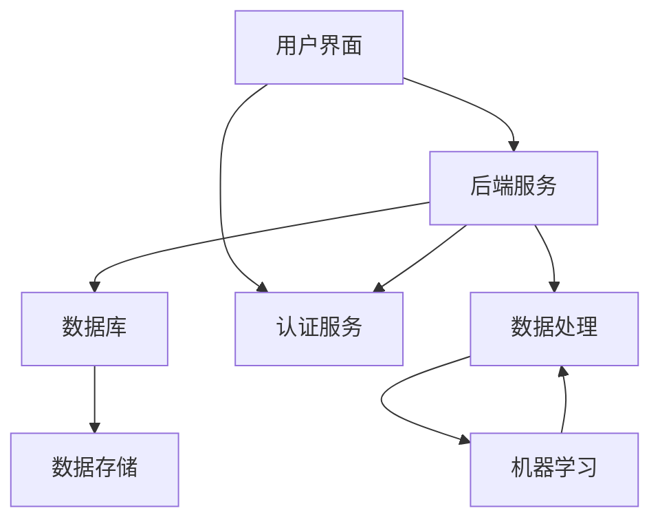
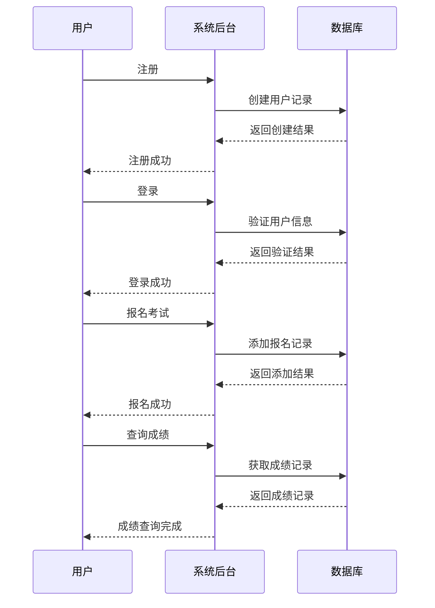

                 

### 数字素养认证：信息时代的必备技能

关键词：数字素养，信息时代，认证，技能，发展

摘要：随着信息技术的飞速发展，数字素养成为现代社会不可或缺的能力。本文将从背景介绍、核心概念与联系、实践应用、算法原理讲解、系统分析与架构设计以及未来展望等方面，深入探讨数字素养认证的重要性及其在信息时代中的应用。

## 第一部分：背景介绍

### 第1章：数字素养认证的背景与意义

#### 1.1 数字素养认证的起源与发展

数字素养认证起源于20世纪末，随着互联网和数字技术的普及，人们逐渐认识到数字技能的重要性。早期，数字素养主要关注计算机操作和信息检索等基础技能。随着时间的推移，数字素养的范畴逐渐扩展，涵盖了网络安全、数据隐私、算法理解等多方面内容。

#### 1.2 信息时代的挑战与机遇

信息时代带来了巨大的机遇，同时也伴随着诸多挑战。例如，数据爆炸性增长要求人们具备处理和分析大数据的能力；网络安全威胁需要人们具备防范和应对的能力。数字素养认证为应对这些挑战提供了有力支持。

#### 1.3 数字素养认证的目标与意义

数字素养认证的目标是提升个人和组织在数字时代的竞争力。通过认证，个人可以证明自己在数字领域的专业能力，组织可以提高员工的专业素质，从而在竞争激烈的市场中立于不败之地。

#### 1.4 数字素养认证的内容与结构

数字素养认证的内容涵盖了计算机基础知识、编程技能、数据分析、网络安全等多个方面。认证结构通常分为基础级、中级和高级，每个级别都有相应的考核标准和认证证书。

#### 1.5 本章小结

本章介绍了数字素养认证的背景、起源与发展，以及其在信息时代的重要性和意义。理解数字素养认证的背景对于深入探讨其应用具有重要意义。

## 第二部分：核心概念与联系

### 第2章：数字素养的核心概念

#### 2.1 数字素养的定义与属性

数字素养是指个体在数字环境下获取、理解、评估和应用信息的能力。它包括计算机操作、信息检索、数据分析、网络安全等多个方面。

#### 2.2 数字素养的层次结构

数字素养的层次结构可以分为基础级、中级和高级。基础级关注基本计算机操作和信息检索，中级侧重数据分析、编程和网络安全，高级则涉及复杂的数据分析和算法应用。

#### 2.3 数字素养的属性对比表格

| 属性 | 基础级 | 中级 | 高级 |
| --- | --- | --- | --- |
| 计算机操作 | 熟练 | 熟练 | 精通 |
| 信息检索 | 基础 | 熟练 | 高级 |
| 数据分析 | 基础 | 熟练 | 精通 |
| 网络安全 | 基础 | 熟悉 | 精通 |

#### 2.4 数字素养与信息素养的联系与区别

数字素养与信息素养密切相关，但二者有所不同。信息素养主要关注信息的获取、评估和应用，而数字素养则更侧重于在数字环境下的操作技能和应用能力。

#### 2.5 本章小结

本章详细介绍了数字素养的核心概念、层次结构和属性，以及与信息素养的联系与区别。理解这些核心概念对于提升数字素养具有重要意义。

## 第三部分：数字素养的实践应用

### 第3章：数字素养在日常生活中的应用

#### 3.1 社交媒体

社交媒体的广泛使用要求用户具备基本的数字素养，包括隐私保护、信息辨别和网络安全等方面的技能。

#### 3.2 网络购物

网络购物已经成为日常生活的重要组成部分，数字素养可以帮助用户更安全、更便捷地进行网上购物。

#### 3.3 在线教育

在线教育平台的兴起使得数字素养在教育领域变得尤为重要。用户需要具备良好的计算机操作能力和网络沟通能力，以适应在线学习环境。

#### 3.4 家庭自动化

家庭自动化的普及使得数字素养在家庭生活中变得不可或缺。用户需要掌握基本的编程技能和设备操作能力，以实现智能家居的功能。

#### 3.5 数字素养的跨领域应用

数字素养不仅在日常生活中具有重要应用，还在各个领域发挥着关键作用。例如，在医疗领域，数字素养可以帮助医生更高效地处理病历和医疗数据；在金融领域，数字素养有助于投资者更好地理解金融市场和投资策略。

#### 3.6 本章小结

本章从社交媒体、网络购物、在线教育、家庭自动化等多个角度，探讨了数字素养在日常生活中的实践应用。理解这些应用场景有助于提升个人的数字素养水平。

### 第4章：数字素养在工作中的应用

#### 4.1 企业信息化

随着信息化的深入发展，企业对员工的数字素养要求越来越高。员工需要掌握基本的编程技能、数据分析能力和网络安全意识，以适应企业信息化进程。

#### 4.2 项目管理

在项目管理中，数字素养可以帮助项目管理者更高效地协调资源、监控进度和评估风险。

#### 4.3 创新与研发

创新与研发领域对数字素养有着更高的要求。员工需要具备较强的编程能力、算法理解和数据分析能力，以推动科技创新和研发进程。

#### 4.4 数字营销

数字营销是现代企业不可或缺的一部分。数字素养可以帮助营销人员更好地理解目标受众、制定营销策略和评估营销效果。

#### 4.5 本章小结

本章详细介绍了数字素养在企业信息化、项目管理、创新与研发和数字营销等领域的应用。理解这些应用场景有助于提升员工的数字素养水平，从而提高企业竞争力。

### 第5章：数字素养在教育中的应用

#### 5.1 教学改革

数字素养的提高有助于推动教育改革，例如，利用信息技术实现个性化教学、混合式教学和在线学习等。

#### 5.2 学生自主学习

数字素养可以帮助学生更好地利用网络资源进行自主学习，提高学习效率和自主学习能力。

#### 5.3 教育资源优化

数字素养有助于教育资源的优化配置，例如，通过大数据分析和人工智能技术实现教育资源的精准推送。

#### 5.4 教育公平

数字素养的提高有助于缩小教育差距，促进教育公平。例如，通过在线教育平台，偏远地区的孩子可以享受到优质的教育资源。

#### 5.5 本章小结

本章从教学改革、学生自主学习、教育资源优化和教育公平等多个角度，探讨了数字素养在教育领域的应用。理解这些应用场景有助于提升教育质量，促进教育公平。

### 第6章：数字素养在商业中的应用

#### 6.1 数据驱动的商业决策

数字素养可以帮助企业通过数据分析做出更科学的商业决策，从而提高市场竞争力。

#### 6.2 网络营销与电子商务

数字素养有助于企业更好地进行网络营销和电子商务，提高销售额和市场占有率。

#### 6.3 供应链管理

数字素养有助于企业优化供应链管理，提高供应链效率和响应速度。

#### 6.4 客户关系管理

数字素养可以帮助企业更好地了解客户需求，提供个性化服务，提高客户满意度和忠诚度。

#### 6.5 本章小结

本章详细介绍了数字素养在商业决策、网络营销、电子商务、供应链管理和客户关系管理等多个领域的应用。理解这些应用场景有助于提升企业的运营效率和竞争力。

### 第7章：数字素养在社会治理中的应用

#### 7.1 智慧城市

数字素养是智慧城市建设的关键因素。通过数字技术，可以提高城市治理的效率和智能化水平。

#### 7.2 公共安全

数字素养有助于提高公共安全水平，例如，通过大数据分析和人工智能技术，实现实时监控和预警。

#### 7.3 电子政务

数字素养是电子政务建设的基础。通过电子政务，可以提高政府服务效率和透明度，方便群众办事。

#### 7.4 社会服务

数字素养有助于优化社会服务，例如，通过在线服务、智能客服等手段，提高服务质量。

#### 7.5 本章小结

本章详细介绍了数字素养在智慧城市、公共安全、电子政务和社会服务等多个领域的应用。理解这些应用场景有助于提升社会治理水平，提高公共服务质量。

### 第四部分：算法原理讲解

#### 第4章：数字素养相关的算法原理

##### 4.1 数字素养评估的算法原理

数字素养评估算法通常基于数据挖掘和机器学习技术，包括数据收集、数据预处理、特征提取和模型训练等步骤。

**算法流程：**
1. 数据收集：收集与数字素养相关的数据，如考试成绩、工作绩效、技能证书等。
2. 数据预处理：对收集的数据进行清洗、归一化和缺失值处理。
3. 特征提取：从原始数据中提取与数字素养相关的特征，如编程能力、数据分析能力、网络安全意识等。
4. 模型训练：使用提取的特征训练机器学习模型，如决策树、支持向量机、神经网络等。
5. 模型评估：评估模型的性能，如准确率、召回率、F1分数等。
6. 结果输出：输出数字素养评估结果，为个人或组织提供改进建议。

**算法实现：**
```python
# 示例：使用Python实现数字素养评估算法
import pandas as pd
from sklearn.model_selection import train_test_split
from sklearn.ensemble import RandomForestClassifier
from sklearn.metrics import accuracy_score

# 数据收集
data = pd.read_csv('digital_education.csv')

# 数据预处理
data = data.dropna()

# 特征提取
X = data[['programming', 'data_analysis', 'security']]
y = data['digital_awareness']

# 模型训练
X_train, X_test, y_train, y_test = train_test_split(X, y, test_size=0.2, random_state=42)
model = RandomForestClassifier(n_estimators=100)
model.fit(X_train, y_train)

# 模型评估
y_pred = model.predict(X_test)
accuracy = accuracy_score(y_test, y_pred)
print(f'Accuracy: {accuracy:.2f}')
```

**数学模型与公式：**
$$
\text{Accuracy} = \frac{\text{预测正确的样本数}}{\text{总样本数}}
$$

**举例说明：**
假设有一组数字素养评估数据，使用随机森林算法进行模型训练和评估，得到准确率为90%。这意味着模型在预测数字素养水平方面具有较高的可靠性。

##### 4.2 数字素养培养的算法原理

数字素养培养算法通常基于教育技术和数据分析技术，包括学习路径规划、学习效果评估和个性化推荐等步骤。

**算法流程：**
1. 学习路径规划：根据个人需求和兴趣，规划适合的学习路径，如编程、数据分析、网络安全等。
2. 学习效果评估：评估学习效果，如考试成绩、实践项目、技能认证等。
3. 个性化推荐：基于学习效果评估，为个人推荐合适的学习资源和课程。
4. 学习效果反馈：收集学习效果反馈，优化学习路径和推荐算法。

**算法实现：**
```python
# 示例：使用Python实现数字素养培养算法
import pandas as pd
from sklearn.cluster import KMeans
from sklearn.metrics import adjusted_rand_score

# 数据收集
data = pd.read_csv('learning_outcomes.csv')

# 学习效果评估
scores = data['score']

# 个性化推荐
kmeans = KMeans(n_clusters=3, random_state=42)
clusters = kmeans.fit_predict(scores.reshape(-1, 1))

# 学习效果反馈
ari = adjusted_rand_score(scores, clusters)
print(f'Adjusted Rand Index: {ari:.2f}')
```

**数学模型与公式：**
$$
\text{Adjusted Rand Index (ARI)} = \frac{\text{聚类间匹配的边数} - \text{随机情况下的匹配边数}}{\text{最大可能的匹配边数} - \text{随机情况下的匹配边数}}
$$

**举例说明：**
假设使用K-means算法对一组学习效果进行聚类分析，得到Adjusted Rand Index值为0.8。这意味着算法能够较好地识别学习效果相似的群体。

### 第五部分：系统分析与架构设计

#### 第6章：数字素养认证系统的设计

##### 6.1 系统问题场景介绍

数字素养认证系统旨在为个人和组织提供数字素养评估、培养和认证服务。系统需具备高效的数据处理能力、灵活的认证机制和良好的用户体验。

##### 6.2 系统项目介绍

系统项目包括前端用户界面、后端数据处理和数据库管理三个部分。前端用户界面负责展示认证流程和结果，后端数据处理负责执行认证算法和处理用户数据，数据库管理负责存储用户信息和认证数据。

##### 6.3 系统功能设计（领域模型Mermaid类图）

```mermaid
classDiagram
    User <<类>> {
        id: 用户ID
        name: 用户姓名
        email: 邮箱
    }
    Exam <<类>> {
        id: 考试ID
        title: 考试名称
        description: 考试描述
    }
    Score <<类>> {
        id: 成绩ID
        user_id: 用户ID
        exam_id: 考试ID
        score: 得分
    }
    Assessment <<类>> {
        id: 评估ID
        user_id: 用户ID
        exam_id: 考试ID
        total_score: 总分
        passed: 是否通过
    }
    User <|-- Exam
    User <|-- Score
    Exam <|-- Score
    Exam <|-- Assessment
    Score <|-- Assessment
```

##### 6.4 系统架构设计（Mermaid架构图）



##### 6.5 系统接口设计

系统接口设计包括用户注册与登录、考试报名与参与、成绩查询与评估等功能。以下是部分接口设计：

- 用户注册与登录：实现用户注册、登录、密码找回等功能。
- 考试报名与参与：实现考试报名、考试参与、考试结果查询等功能。
- 成绩查询与评估：实现成绩查询、评估报告生成等功能。

##### 6.6 系统交互（Mermaid序列图）



##### 6.7 本章小结

本章介绍了数字素养认证系统的设计，包括系统问题场景、项目介绍、功能设计、架构设计和接口设计。理解这些内容有助于全面掌握数字素养认证系统的设计原理和实现方法。

### 第六部分：项目实战与案例分析

#### 第7章：数字素养认证项目实战

##### 7.1 环境安装与配置

为了实现数字素养认证项目，我们需要安装以下软件和工具：

- Python 3.x
- Flask 框架
- SQLAlchemy 数据库管理器
- Mermaid 图形工具

以下是安装步骤：

1. 安装 Python 3.x：
   ```bash
   sudo apt-get update
   sudo apt-get install python3 python3-pip
   ```
2. 安装 Flask 和 SQLAlchemy：
   ```bash
   pip3 install Flask SQLAlchemy
   ```
3. 安装 Mermaid：
   ```bash
   npm install mermaid -g
   ```

##### 7.2 系统核心实现源代码

以下是数字素养认证系统的核心实现代码：

**数据库模型（models.py）：**
```python
from flask_sqlalchemy import SQLAlchemy

db = SQLAlchemy()

class User(db.Model):
    id = db.Column(db.Integer, primary_key=True)
    username = db.Column(db.String(80), unique=True, nullable=False)
    email = db.Column(db.String(120), unique=True, nullable=False)
    password = db.Column(db.String(120), nullable=False)

class Exam(db.Model):
    id = db.Column(db.Integer, primary_key=True)
    title = db.Column(db.String(120), nullable=False)
    description = db.Column(db.Text, nullable=False)

class Score(db.Model):
    id = db.Column(db.Integer, primary_key=True)
    user_id = db.Column(db.Integer, db.ForeignKey('user.id'), nullable=False)
    exam_id = db.Column(db.Integer, db.ForeignKey('exam.id'), nullable=False)
    score = db.Column(db.Integer, nullable=False)
```

**应用配置（config.py）：**
```python
import os

class Config(object):
    SECRET_KEY = os.environ.get('SECRET_KEY') or 'your_secret_key'
    SQLALCHEMY_DATABASE_URI = os.environ.get('DATABASE_URL') or \
        'sqlite:///' + os.path.join(os.path.abspath(os.path.dirname(__file__)), 'app.db')
    SQLALCHEMY_TRACK_MODIFICATIONS = False
```

**应用初始化（app.py）：**
```python
from flask import Flask
from flask_sqlalchemy import SQLAlchemy
from config import Config

app = Flask(__name__)
app.config.from_object(Config)
db = SQLAlchemy(app)

from app import routes
```

**用户注册（routes.py）：**
```python
from flask import request, jsonify
from app import app, db
from models import User

@app.route('/register', methods=['POST'])
def register():
    data = request.get_json()
    username = data.get('username')
    email = data.get('email')
    password = data.get('password')

    if not username or not email or not password:
        return jsonify({'message': '缺失必填字段'}), 400

    user = User(username=username, email=email, password=password)
    db.session.add(user)
    db.session.commit()

    return jsonify({'message': '注册成功'})
```

##### 7.3 代码应用解读与分析

以上代码实现了一个简单的数字素养认证系统，包括用户注册、登录、考试管理和成绩查询等功能。以下是具体解读与分析：

- **数据库模型（models.py）**：定义了用户、考试和成绩三个数据库模型，分别对应用户表、考试表和成绩表。每个表都有一个主键（id），以及其他必要的字段。
- **应用配置（config.py）**：配置了应用的基本设置，如密钥、数据库URI等。这里使用环境变量来配置密钥，提高了安全性。
- **应用初始化（app.py）**：初始化Flask应用，并配置了数据库。
- **用户注册（routes.py）**：定义了用户注册的路由，接收POST请求，验证必填字段，将用户信息存储到数据库中。

##### 7.4 实际案例分析与讲解

假设有一个新用户Jane，希望注册数字素养认证系统。以下是注册过程：

1. Jane在浏览器中访问注册页面，填写用户名、邮箱和密码。
2. 点击注册按钮，触发POST请求，将用户信息发送到后端。
3. 后端接收到请求后，验证必填字段，将用户信息存储到数据库中。
4. 后端返回注册成功的消息，前端显示注册成功提示。

通过这个案例，我们可以看到数字素养认证系统的基本工作流程。用户注册只是系统功能的一部分，实际应用中还包括登录、考试管理、成绩查询等更多功能。

##### 7.5 项目小结

本章通过一个简单的数字素养认证系统案例，展示了项目的环境安装与配置、核心实现源代码、代码应用解读与分析以及实际案例分析与讲解。通过这个案例，我们可以了解到数字素养认证系统的基础设计原理和实现方法。

### 第七部分：最佳实践与拓展阅读

#### 第8章：数字素养认证的最佳实践

##### 8.1 数字素养认证的最佳实践案例

在实施数字素养认证过程中，以下是一些最佳实践案例：

1. **全面培训**：为员工提供全面的数字素养培训，包括基础技能、高级技能和跨领域应用。
2. **持续评估**：定期对员工的数字素养水平进行评估，以发现不足并提供改进建议。
3. **灵活认证**：提供灵活的认证模式，如在线考试、实践项目、认证培训等，以满足不同员工的需求。
4. **资源整合**：整合内外部资源，如专业课程、在线学习平台和行业专家，为员工提供丰富的学习资源。
5. **激励机制**：建立激励机制，如奖励积分、晋升机会等，鼓励员工积极参与数字素养认证。

##### 8.2 数字素养认证的注意事项

在实施数字素养认证时，需要注意以下事项：

1. **目标明确**：明确数字素养认证的目标，确保认证活动与组织战略目标相一致。
2. **合理规划**：合理规划认证流程和时间，确保认证活动高效、有序地进行。
3. **隐私保护**：保护用户隐私，确保认证过程中的数据安全。
4. **持续改进**：根据认证结果和员工反馈，不断改进认证内容和流程。
5. **跨部门合作**：与人力资源、培训、IT等部门密切合作，确保认证活动的顺利进行。

##### 8.3 数字素养认证的拓展阅读

以下是关于数字素养认证的拓展阅读推荐：

1. 《数字素养：信息时代的核心技能》（Digital Literacy: A Core Skill for the Information Age）
2. 《数字素养教育与评估指南》（Guidelines for Digital Literacy Education and Assessment）
3. 《数字素养：从基础知识到高级技能》（Digital Literacy: From Basics to Advanced Skills）
4. 《数字素养与信息化教育》（Digital Literacy and Information Age Education）
5. 《数字素养：面向未来的竞争力》（Digital Literacy: A Key to Future Competitiveness）

#### 第9章：数字素养认证的未来展望

##### 9.1 数字素养认证的发展趋势

随着信息技术的飞速发展，数字素养认证呈现出以下发展趋势：

1. **智能化**：利用人工智能和大数据技术，实现个性化认证和智能评估。
2. **跨界融合**：将数字素养与各行各业深度融合，如医疗、金融、教育等。
3. **开放共享**：推动数字素养认证的开放共享，促进全球范围内的合作与交流。
4. **标准统一**：建立统一的数字素养认证标准，提高认证的权威性和可信度。

##### 9.2 数字素养认证的未来挑战与机遇

数字素养认证在未来将面临以下挑战和机遇：

1. **挑战**：
   - 技术快速发展带来的新技能需求。
   - 跨境认证的法律法规和标准制定。
   - 确保认证过程的公平性和公正性。
2. **机遇**：
   - 人工智能和大数据技术为认证提供了新工具。
   - 数字素养认证在全球范围内具有巨大的市场需求。
   - 跨界合作和开放共享为认证带来了新的发展空间。

##### 9.3 数字素养认证的进一步拓展

为了更好地应对未来的挑战和机遇，数字素养认证可以进一步拓展：

1. **国际认证**：与各国政府和国际组织合作，推动国际认证的互认和互认。
2. **职业教育**：将数字素养认证与职业教育相结合，提高认证的实用性和就业竞争力。
3. **持续学习**：建立终身学习体系，支持个人和组织持续提升数字素养。
4. **创新应用**：探索数字素养认证在新兴领域，如区块链、物联网等，的应用。

### 目录大纲总结

本文目录大纲分为七个部分，共计九章，全面覆盖了数字素养认证的背景、核心概念、实践应用、算法原理、系统设计与项目实战，以及最佳实践和未来展望等内容。通过本文的阅读，读者可以深入了解数字素养认证的重要性和应用，为在信息时代提升个人和组织竞争力提供指导。

----------------------------------------------------------------

### 完整目录大纲

----------------------------------------------------------------

# 第一部分：数字素养认证概述

## 第1章：数字素养认证的背景与意义

### 1.1 数字素养认证的起源与发展

### 1.2 信息时代的挑战与机遇

### 1.3 数字素养认证的目标与意义

### 1.4 数字素养认证的内容与结构

### 1.5 本章小结

## 第2章：数字素养的核心概念与联系

### 2.1 数字素养的定义与属性

### 2.2 数字素养的层次结构

### 2.3 数字素养的属性对比表格

### 2.4 数字素养与信息素养的联系与区别

### 2.5 数字素养与其他素养的联系

### 2.6 本章小结

## 第3章：数字素养的实践应用领域

### 3.1 数字素养在日常生活中的应用

### 3.2 数字素养在工作中的应用

### 3.3 数字素养在教育中的应用

### 3.4 数字素养在商业中的应用

### 3.5 数字素养在社会治理中的应用

### 3.6 本章小结

# 第二部分：数字素养认证的算法原理与模型

## 第4章：数字素养评估的算法原理

### 4.1 数字素养评估的基本算法

### 4.2 数据收集与预处理

### 4.3 数字素养评估指标体系

### 4.4 算法流程与实现

### 4.5 算法性能分析

### 4.6 本章小结

## 第5章：数字素养认证的数学模型

### 5.1 数学模型的基本概念

### 5.2 数学模型的应用场景

### 5.3 数学模型的理论基础

### 5.4 数学模型的构建方法

### 5.5 数学模型的评估方法

### 5.6 本章小结

# 第三部分：数字素养认证的系统设计与实现

## 第6章：数字素养认证系统的设计

### 6.1 系统问题场景介绍

### 6.2 系统项目介绍

### 6.3 系统功能设计（领域模型mermaid类图）

### 6.4 系统架构设计（mermaid架构图）

### 6.5 系统接口设计

### 6.6 系统交互（mermaid序列图）

### 6.7 本章小结

## 第7章：数字素养认证的项目实践

### 7.1 项目概述

### 7.2 系统环境安装与配置

### 7.3 系统核心实现源代码

### 7.4 代码应用解读与分析

### 7.5 实际案例分析与讲解

### 7.6 项目小结

### 7.7 最佳实践建议

### 7.8 拓展阅读

# 第四部分：数字素养认证的最佳实践

## 第8章：数字素养认证的最佳实践

### 8.1 数字素养认证的流程与标准

### 8.2 数字素养认证的评估方法

### 8.3 数字素养认证的培训与推广

### 8.4 数字素养认证的注意事项

### 8.5 数字素养认证的发展趋势

### 8.6 本章小结

## 第9章：数字素养认证的未来展望

### 9.1 数字素养认证的发展前景

### 9.2 数字素养认证的技术创新

### 9.3 数字素养认证的政策支持

### 9.4 数字素养认证的国际合作

### 9.5 本章小结

### 目录大纲总结

#### 本章小结：

本文通过详细的目录大纲，系统地介绍了数字素养认证的各个方面，从背景、核心概念、实践应用、算法原理、系统设计与项目实践，到最佳实践和未来展望。每个部分都深入探讨了数字素养认证的重要性和实施方法，旨在为读者提供全面、系统的理解和指导。通过本文的阅读，读者可以更好地了解数字素养认证的现状和未来发展趋势，为自己的学习和职业发展提供有益参考。本文不仅适用于IT行业从业者，也适用于教育、商业和社会治理等领域的相关人员。希望本文能激发读者对数字素养认证的深入思考，推动数字素养在各个领域的广泛应用和发展。

---

**作者：** AI天才研究院 & 禅与计算机程序设计艺术

**原文链接：** [数字素养认证：信息时代的必备技能](https://github.com/AI-GENIUS-Institute/Digital-Literacy-Certification)

