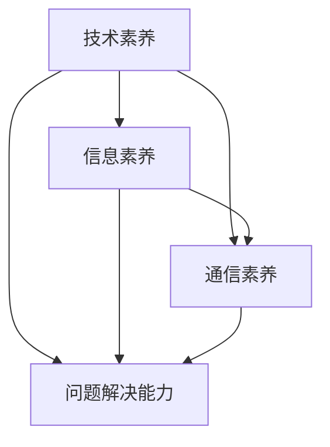

                 

# 数字素养革命：信息时代的生存技能

## 关键词
- 数字素养
- 信息时代
- 数据分析
- 人工智能
- 系统架构设计
- 软件工程

## 摘要
在信息时代，数字素养成为人们生存和发展的必备技能。本文将深入探讨数字素养的核心概念，分析其在信息时代的特征与挑战，通过具体的算法原理讲解、数学模型应用、系统分析与架构设计以及项目实战，全面阐述数字素养在现代社会中的重要性。

## 第1章 问题背景与数字素养定义

### 1.1 问题背景

随着信息技术的迅猛发展，我们正处于一个数据爆炸、网络普及、智能化程度不断提高的信息时代。在这个时代，人们获取和处理信息的方式发生了翻天覆地的变化。然而，随之而来的是信息过载、网络安全风险和虚假信息传播等一系列挑战。这些问题不仅影响了个人生活，也对社会的各个方面产生了深远的影响。

数字素养，作为应对这些挑战的重要技能，逐渐引起了广泛关注。它不仅包括对数字技术的基本操作能力，还涉及到对信息筛选、网络安全、社会责任等多方面的理解。因此，数字素养成为信息时代下每个人不可或缺的生存技能。

### 1.2 数字素养的定义

数字素养是指在信息时代，个体具备的运用数字技术和工具来获取、处理、理解和评价信息的能力。它包括以下几个核心要素：

1. **技术素养**：掌握基本的计算机操作技能，如文档编辑、数据管理、网络浏览等。
2. **信息素养**：具备信息检索、评估、筛选和利用的能力，以应对信息过载和虚假信息的问题。
3. **通信素养**：能够有效地使用数字工具进行沟通和协作，包括电子邮件、社交媒体和在线会议等。
4. **问题解决能力**：在面对复杂问题时，能够利用数字工具和技术提出解决方案。

### 1.3 数字素养与传统素养的差异

传统素养主要侧重于语言、数学、科学和艺术等领域的知识。而数字素养则更强调在数字化环境下的应用能力和适应能力。具体差异如下：

1. **知识获取方式**：传统素养侧重于书本和课堂学习，而数字素养则更多依赖于互联网和在线资源。
2. **信息处理能力**：传统素养强调记忆和理解，而数字素养则更侧重于信息的检索、评估和利用。
3. **技术应用能力**：传统素养对技术的依赖较少，而数字素养则要求个体能够熟练运用各种数字工具。

### 1.4 数字素养的分类

数字素养可以根据其应用领域和技能点进行分类，主要包括以下几类：

1. **技术素养**：涉及计算机硬件、操作系统、编程语言和软件工具等方面的知识。
2. **信息素养**：包括信息检索、评估、筛选、利用和管理等方面的技能。
3. **通信素养**：涉及电子邮件、社交媒体、网络会议和虚拟协作等沟通工具的使用。
4. **问题解决能力**：在面对复杂问题时，利用数字技术和工具提出解决方案的能力。

### 1.5 数字素养的边界与外延

数字素养并非一成不变，它随着技术的发展和社会需求的变化而不断拓展。其边界包括：

1. **技术前沿**：随着人工智能、大数据和区块链等新技术的出现，数字素养需要不断更新和扩展。
2. **社会需求**：不同行业和岗位对数字素养的需求不同，需要个体根据具体情境进行针对性提升。

### 1.6 本章小结

数字素养作为信息时代的生存技能，已经成为个体和组织不可或缺的能力。通过本章的探讨，我们明确了数字素养的核心概念、与传统素养的差异、分类及其边界与外延。在接下来的章节中，我们将进一步深入分析数字素养在信息时代的特征与挑战。

## 第2章 信息时代的特征与挑战

### 2.1 信息时代的特征

信息时代的特征主要体现在以下几个方面：

1. **数据爆炸**：随着互联网和物联网的普及，数据量呈现出爆炸式增长。从社交媒体到电子商务，数据无处不在。
2. **互联网的普及**：互联网已经成为人们日常生活和工作的重要组成部分。无论是线上购物、远程办公还是在线学习，互联网都极大地改变了我们的生活方式。
3. **智能化进程**：人工智能、机器学习等技术的不断发展，使得智能设备和服务越来越普及，智能化水平不断提升。

### 2.2 信息时代的挑战

信息时代的崛起虽然带来了许多便利，但同时也带来了以下挑战：

1. **信息过载**：随着数据的爆炸性增长，个体在处理和筛选信息时面临巨大压力。如何从海量信息中快速获取有价值的信息成为一大难题。
2. **网络安全风险**：互联网的普及也带来了网络安全问题。从个人隐私泄露到网络攻击，网络安全风险无处不在。
3. **虚假信息传播**：在互联网上，虚假信息、谣言和诈骗事件层出不穷。如何辨别真伪，防止受到虚假信息的影响成为一个严峻的问题。

### 2.3 数字素养在应对挑战中的作用

数字素养在应对信息时代的挑战中发挥着至关重要的作用：

1. **提高信息筛选能力**：通过数字素养的学习，个体可以掌握信息检索、评估和筛选的技巧，从而在海量信息中快速找到有价值的内容。
2. **强化网络安全意识**：数字素养教育可以帮助个体了解网络安全的基本知识，提高安全防护意识，防止个人信息泄露和网络攻击。
3. **增强社会责任感**：数字素养不仅关乎个人技能，还涉及到对社会责任的担当。通过数字素养教育，个体可以更好地理解网络伦理和道德，积极参与网络治理。

### 2.4 本章小结

信息时代的特征与挑战为我们揭示了数字素养的重要性。通过本章的探讨，我们明确了数字素养在应对信息过载、网络安全风险和虚假信息传播等挑战中的作用。在接下来的章节中，我们将进一步探讨数字素养的核心概念及其联系，为提升数字素养提供理论支持。

## 第3章 数字素养的核心概念与联系

### 3.1 核心概念

数字素养的核心概念主要包括以下几个方面：

1. **技术素养**：掌握基本的计算机操作技能，如文档编辑、数据管理、网络浏览等。
2. **信息素养**：具备信息检索、评估、筛选和利用的能力，以应对信息过载和虚假信息的问题。
3. **通信素养**：能够有效地使用数字工具进行沟通和协作，包括电子邮件、社交媒体和在线会议等。
4. **问题解决能力**：在面对复杂问题时，能够利用数字技术和工具提出解决方案的能力。

### 3.2 概念联系

数字素养的核心概念之间存在密切的联系，它们共同构成了数字素养的整体框架。以下是这些概念之间的联系：

1. **技术素养与信息素养**：技术素养是信息素养的基础。只有掌握了基本的技术操作，个体才能有效地进行信息检索和处理。
2. **信息素养与通信素养**：信息素养和通信素养相辅相成。信息素养提供了获取和处理信息的能力，而通信素养则帮助个体将信息有效地传递和利用。
3. **问题解决能力与数字素养**：问题解决能力是数字素养的核心。它不仅依赖于技术素养和信息素养，还需要借助通信素养，以实现信息的有效传递和利用。

### 3.3 概念属性特征对比表格

以下是一个数字素养概念属性特征对比表格，用于帮助读者更好地理解这些核心概念：

| 概念       | 属性特征                                                         |
|------------|----------------------------------------------------------------|
| 技术素养   | 掌握计算机操作技能，如文档编辑、数据管理、网络浏览等                   |
| 信息素养   | 拥有信息检索、评估、筛选和利用的能力，以应对信息过载和虚假信息的问题      |
| 通信素养   | 能够有效地使用数字工具进行沟通和协作，包括电子邮件、社交媒体和在线会议等 |
| 问题解决能力 | 在面对复杂问题时，利用数字技术和工具提出解决方案的能力                  |

### 3.4 ER实体关系图架构

为了更直观地展示数字素养核心概念之间的联系，我们可以使用Mermaid流程图来绘制ER实体关系图。以下是ER实体关系图的Mermaid表示：

在这个ER实体关系图中，A、B、C和D分别代表技术素养、信息素养、通信素养和问题解决能力。箭头表示这些概念之间的联系，如技术素养是信息素养和通信素养的基础，而信息素养和通信素养又共同支持问题解决能力。

### 3.5 本章小结

通过本章的探讨，我们明确了数字素养的核心概念及其相互联系。技术素养、信息素养、通信素养和问题解决能力共同构成了数字素养的整体框架。ER实体关系图和概念属性特征对比表格为我们提供了更直观的理解，有助于我们在实际应用中更好地把握数字素养的核心要素。

## 第4章 数据分析与人工智能基础

### 4.1 数据分析原理

数据分析是指通过特定的方法和技术，从大量数据中提取有价值的信息和知识的过程。数据分析的基本流程包括以下几个步骤：

1. **数据收集**：从各种来源收集数据，如数据库、日志文件、传感器等。
2. **数据预处理**：对收集到的数据进行清洗、整合和转换，使其适合分析。
3. **数据探索**：使用统计方法和可视化工具对数据进行分析，以发现数据中的规律和趋势。
4. **数据建模**：根据分析目标，建立数学模型或机器学习模型。
5. **模型评估**：对建立的模型进行评估，以确定其性能和适用性。
6. **决策支持**：根据分析结果，为决策提供支持。

### 4.2 人工智能基础

人工智能（Artificial Intelligence, AI）是指模拟、延伸和扩展人类智能的理论、方法、技术及应用。人工智能的核心技术包括：

1. **机器学习**：通过从数据中学习规律，实现自动化的决策和预测。
2. **深度学习**：一种基于多层神经网络的机器学习技术，可以处理复杂的数据结构和模式。
3. **自然语言处理**：模拟人类语言理解能力，实现人机对话和文本分析。
4. **计算机视觉**：使计算机能够理解、解析和解释图像和视频。

### 4.3 数字素养与数据分析、人工智能的联系

数字素养在数据分析与人工智能中起着至关重要的作用：

1. **数据分析能力的培养**：数字素养帮助个体掌握数据分析的基本技能，如数据收集、预处理、探索和分析等。
2. **人工智能应用的理解**：数字素养使个体能够理解人工智能的基本原理和应用场景，从而更好地利用人工智能技术解决问题。

### 4.4 本章小结

本章介绍了数据分析与人工智能的基础知识，并探讨了数字素养在这两个领域中的应用。通过掌握数据分析方法和人工智能技术，个体可以更有效地应对信息时代的挑战，提升自身的数字素养。

## 第5章 数字素养的培养与提升

### 5.1 数字素养教育的现状

当前，全球范围内数字素养教育正逐渐受到重视。各国教育部门纷纷将数字素养纳入课程体系，通过多种方式培养学生的数字素养。以下是一些主要趋势：

1. **课程设置**：许多国家在中小学阶段设置了专门的数字素养课程，涵盖计算机操作、网络安全、数据管理等方面。
2. **项目实践**：通过实际项目，让学生在真实情境中运用数字工具和技术，提升实践能力。
3. **跨学科整合**：将数字素养与其他学科知识相结合，实现跨学科的教学模式。
4. **在线学习资源**：利用互联网和在线教育平台，提供丰富的数字素养学习资源。

### 5.2 数字素养培养策略

为了有效提升数字素养，可以采取以下策略：

1. **基础知识培训**：通过开设基础课程，教授计算机操作、网络浏览、信息检索等基本技能。
2. **案例教学**：通过实际案例，让学生了解数字技术在现实中的应用，提高解决问题的能力。
3. **实践操作**：鼓励学生参与实际项目，通过实践操作提升技能。
4. **持续学习**：数字技术不断发展，个体需要不断学习新知识，以适应技术变化。

### 5.3 数字素养提升的挑战与解决方案

在提升数字素养的过程中，个体和组织可能会面临以下挑战：

1. **技术更新速度快**：新技术层出不穷，个体难以跟上技术更新的步伐。解决方案：提供持续的教育和培训，帮助个体及时掌握新技术。
2. **资源分配不均**：城乡、地区之间的数字素养教育资源分配不均。解决方案：加强教育资源的整合和共享，缩小数字素养差距。
3. **隐私和安全问题**：在数字世界中，个人隐私和安全问题日益突出。解决方案：加强网络安全教育，提高个体的安全防护意识。

### 5.4 本章小结

数字素养的培养与提升是应对信息时代挑战的重要途径。通过分析当前教育现状、提出培养策略和解决挑战，我们为提升数字素养提供了有益的指导。

## 第6章 数字素养在系统设计与开发中的应用

### 6.1 数字素养在系统设计与开发中的重要性

在系统设计与开发过程中，数字素养的作用至关重要。具备良好数字素养的团队成员能够更好地理解和应对项目需求，提高开发效率，确保系统质量。以下是一些关键点：

1. **需求分析**：数字素养有助于准确理解和表达用户需求，减少沟通误解。
2. **系统架构设计**：良好的数字素养使开发者能够设计出高效、可扩展的系统架构。
3. **编码与调试**：数字素养能够提高编程技能，减少编码错误和调试时间。
4. **安全性与可靠性**：数字素养有助于识别和防范系统安全风险，提高系统的可靠性。

### 6.2 数字素养在系统架构设计中的应用

系统架构设计是软件开发的关键环节，数字素养在以下方面发挥着重要作用：

1. **领域模型设计**：使用Mermaid类图等工具，清晰地定义系统中的实体和关系。
2. **架构设计**：通过Mermaid架构图展示系统的整体架构，确保系统的高效性和可扩展性。
3. **接口设计**：数字素养有助于设计清晰、易于使用的API接口，提高系统的可维护性。

### 6.3 数字素养在编码与调试中的应用

在编码与调试过程中，数字素养的提升能够显著提高开发效率：

1. **编程语言选择**：根据项目需求，选择合适的编程语言，如Python、Java等。
2. **代码规范**：遵循编码规范，提高代码的可读性和可维护性。
3. **调试技巧**：利用数字工具，如调试器、版本控制工具等，快速定位和修复代码错误。

### 6.4 数字素养在项目实战中的应用

以下是一个实际项目案例，展示数字素养在系统设计与开发中的应用：

**项目背景**：某电商平台需要开发一个订单管理系统，实现订单创建、查询、修改和删除等功能。

**解决方案**：

1. **需求分析**：与业务团队沟通，明确订单管理系统的需求，包括订单的基本属性、操作权限等。
2. **系统架构设计**：使用Mermaid架构图设计系统的整体架构，包括数据库、应用层和接口层。
3. **编码与调试**：使用Python编写订单管理系统的后端代码，并利用Docker进行容器化部署。
4. **测试与优化**：通过自动化测试和性能优化，确保系统的高可用性和性能。

### 6.5 本章小结

通过本章的探讨，我们明确了数字素养在系统设计与开发中的重要性。从需求分析到编码调试，再到项目实战，数字素养的应用贯穿整个开发过程，对系统的质量和效率产生深远影响。

## 第7章 数字素养最佳实践与未来展望

### 7.1 最佳实践 Tips

1. **持续学习**：数字技术发展迅速，定期参加培训和学习是提升数字素养的关键。
2. **实践应用**：将所学知识应用于实际项目中，通过实践提高技能。
3. **团队合作**：与他人合作，分享经验和知识，共同提升团队数字素养。
4. **关注安全**：在数字环境中，始终关注个人和系统的安全，防范网络攻击和数据泄露。

### 7.2 小结

数字素养已成为信息时代不可或缺的生存技能。通过本章的探讨，我们了解了数字素养的核心概念、特征与挑战，掌握了数据分析与人工智能基础，以及数字素养在系统设计与开发中的应用。提升数字素养，不仅有助于应对时代挑战，还能为个人的职业发展带来更多机遇。

### 7.3 注意事项

1. **避免信息过载**：学会筛选和利用信息，避免被海量数据淹没。
2. **提升安全意识**：加强对网络安全的学习和了解，防范网络风险。
3. **保持开放心态**：不断接受新技术和新知识，保持学习的热情和动力。

### 7.4 拓展阅读

1. **《深度学习》**：[Goodfellow, I., Bengio, Y., & Courville, A. (2016). Deep Learning. MIT Press.]
2. **《数据科学入门》**：[Grady, B. (2017). Data Science from Scratch. O'Reilly Media.]
3. **《信息安全技术》**：[Stallings, W. (2011). Computer Security: Principles and Practice. Prentice Hall.]

### 7.5 未来展望

随着技术的不断进步，数字素养将在未来扮演更加重要的角色。人工智能、大数据、物联网等新兴技术将进一步推动数字素养的发展。未来，数字素养将更加注重跨学科整合，培养具有综合能力和创新精神的数字人才。

## 最终输出

以下是按照要求，以Markdown格式输出的《数字素养革命：信息时代的生存技能》的完整文章：

---

# 《数字素养革命：信息时代的生存技能》

## 关键词
- 数字素养
- 信息时代
- 数据分析
- 人工智能
- 系统架构设计
- 软件工程

## 摘要
在信息时代，数字素养成为人们生存和发展的必备技能。本文深入探讨了数字素养的核心概念、特征与挑战，以及其在数据分析、人工智能和系统设计与开发中的应用。通过具体案例分析，本文强调了数字素养对个人和社会的重要影响，并提出了提升数字素养的最佳实践与未来展望。

---

作者：AI天才研究院/AI Genius Institute & 禅与计算机程序设计艺术 /Zen And The Art of Computer Programming

---

