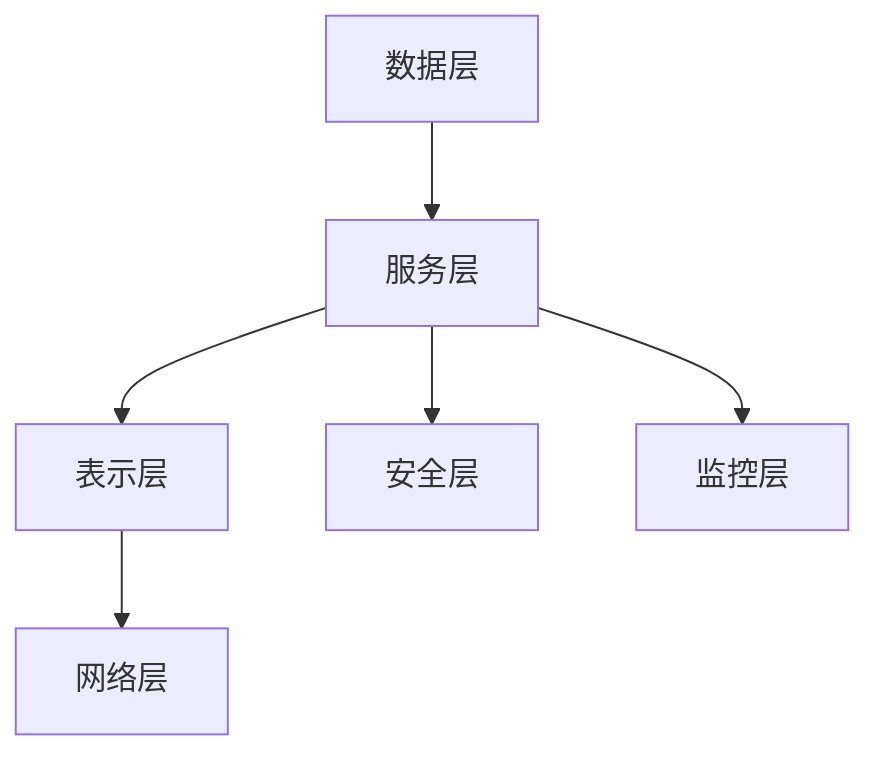
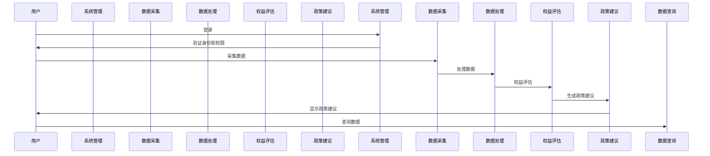

                 

### 数字经济背景与劳动权益保护概述

#### 1.1.1 问题背景

数字经济，作为一种基于互联网和信息技术的新型经济模式，正在全球范围内迅速发展。它不仅改变了企业的商业模式，也深刻影响了劳动力市场的结构。在这场变革中，灵活就业成为了劳动力市场的一个重要特征。然而，灵活就业的兴起却带来了劳动权益保护的新挑战。

首先，数字经济的快速发展带来了劳动力市场的多样化。传统的全职工作模式逐渐被打破，灵活就业，如远程工作、兼职、临时工等，成为越来越多劳动者的选择。这种就业形式提供了一定的自由度和灵活性，但同时也带来了一系列问题。

其次，灵活就业与传统社会保障体系之间存在着冲突。传统的社会保障体系主要建立在稳定就业的基础上，而灵活就业的工人往往缺乏稳定性，这使得他们在享受社会保险和福利方面面临困难。例如，灵活就业者往往无法获得充分的医疗保险和养老金等福利。

此外，劳动权益保护的法律和政策框架也在数字经济背景下面临挑战。传统的劳动法律法规在适用灵活就业时，存在一定的局限性。例如，对于临时工和兼职工的工资支付、工作时间规定、劳动争议处理等，法律法规往往无法提供充分的保护。

#### 1.1.2 问题描述

灵活就业者的权益保障缺失是当前劳动权益保护面临的一个主要问题。在数字经济中，灵活就业者的劳动权益往往得不到有效保障。这主要体现在以下几个方面：

1. **工资福利不足**：灵活就业者往往面临工资待遇低的问题。由于工作稳定性差，他们很难享受到与全职员工同等水平的工资和福利待遇。

2. **工作时间与工作地点的不规范**：灵活就业者往往需要根据客户需求随时调整工作时间，这使得他们难以享有固定的休息时间和合理的劳动条件。

3. **社会保险与福利的缺失**：灵活就业者由于工作不稳定，往往无法享受到全面的社会保险和福利待遇，如医疗保险、养老保险等。

4. **劳动争议处理困难**：在劳动权益受到侵害时，灵活就业者往往面临取证难、维权成本高等问题，这使得他们难以通过法律途径维护自身权益。

与此同时，社会保障体系的不适应性也是当前劳动权益保护面临的一个重大挑战。传统的社会保障体系主要针对稳定就业设计，对于灵活就业的适应性较差。这主要体现在以下几个方面：

1. **参保门槛高**：灵活就业者由于工作不稳定，往往难以满足参保门槛，导致他们无法参与到社会保险中。

2. **保险覆盖不足**：即使灵活就业者能够参保，由于保险覆盖范围有限，他们往往只能享受部分社会保险待遇，如医疗保险和养老保险，而其他福利则难以得到保障。

3. **政策支持不足**：政府在支持灵活就业者参与社会保障方面的政策支持不足，缺乏相应的激励措施，导致灵活就业者参保意愿较低。

#### 1.1.3 问题解决

针对上述问题，解决劳动权益保障缺失的问题需要从以下几个方面入手：

1. **完善法律法规**：政府需要完善劳动法律法规，针对灵活就业的特点，制定更加灵活、适应性的法律条款。例如，可以调整工资支付标准、工作时间规定等，以保障灵活就业者的基本权益。

2. **加强社会保障体系建设**：政府应加强对灵活就业者的社会保障支持，降低参保门槛，扩大保险覆盖范围。可以通过建立灵活就业者的社会保障账户，实现灵活就业者与稳定就业者的权益平衡。

3. **提高灵活就业者的法律意识**：通过教育和宣传，提高灵活就业者的法律意识，帮助他们了解自身权益，增强维权能力。

4. **建立健全的劳动争议处理机制**：政府应建立健全的劳动争议处理机制，为灵活就业者提供便捷、高效的维权途径。

5. **优化政策支持**：政府应加大对灵活就业者的政策支持力度，提供税收优惠、创业补贴等激励措施，鼓励灵活就业者积极参与社会保障。

#### 1.1.4 边界与外延

数字经济的劳动权益保护范围需要明确界定。首先，劳动权益保护应涵盖所有形式的灵活就业者，包括远程工作者、兼职人员、临时工等。其次，劳动权益保护的范围不仅限于工资和福利，还应包括工作时间、劳动条件、社会保险等多个方面。

同时，不同类型的灵活就业者在权益保障方面存在差异。例如，远程工作者在享受工作地点灵活性的同时，可能面临劳动条件和权益保障不足的问题。临时工则往往面临工作稳定性差、权益保障缺失的问题。因此，在制定劳动权益保护政策时，需要充分考虑不同类型灵活就业者的特点和需求，制定差异化的保障措施。

#### 1.1.5 概念结构与核心要素组成

要深入理解数字经济中的劳动权益保护，我们需要明确以下几个核心概念和要素：

1. **数字经济**：数字经济是指基于互联网和信息技术的新型经济模式，包括电子商务、远程办公、在线服务等。

2. **灵活就业**：灵活就业是指劳动者通过非传统全职工作形式，如远程工作、兼职、临时工等，获取收入的过程。

3. **社会保障体系**：社会保障体系是指国家为劳动者提供的一系列福利保障措施，包括社会保险、医疗保险、养老金等。

4. **劳动权益**：劳动权益是指劳动者在就业过程中应享有的基本权利，包括工资、工作时间、劳动条件、社会保险等。

5. **法律与政策框架**：法律与政策框架是指国家制定的关于劳动权益保护的法律法规和政策文件。

通过明确这些概念和要素，我们可以更好地理解数字经济中劳动权益保护的核心问题，为制定有效的解决方案提供理论基础。

### 灵活就业形态及其对劳动权益的影响

#### 2.1.1 灵活就业的定义与类型

灵活就业，是指劳动者通过非传统全职工作形式获取收入的过程。这种就业形式具有高度灵活性，能够满足不同劳动者的多样化需求。根据灵活就业的特点和形式，我们可以将其分为以下几类：

1. **自雇**：自雇是指劳动者以个人身份从事独立经营，如自由职业者、个体工商户等。自雇者通常需要自行承担经营风险，但在收入上具有较大的自主性和灵活性。

2. **临时工**：临时工是指劳动者在特定时间段内，为某家企业或组织提供临时性劳动服务。临时工通常不享有长期的工作保障，但可以灵活选择工作时间和工作内容。

3. **兼职**：兼职是指劳动者在非工作时间内，为多家企业或个人提供部分工作时间的服务。兼职工作可以帮助劳动者增加收入，同时保持工作与生活的平衡。

4. **灵活派遣**：灵活派遣是指劳动者通过人力资源公司，为多家企业提供劳动力派遣服务。灵活派遣的特点是工作内容多样化，可以在不同行业和企业间灵活调动。

#### 2.1.2 灵活就业的优势与风险

灵活就业在为劳动者提供多样化就业机会的同时，也带来了一系列的优势和风险。

**劳动者视角**

**优势：**

1. **工作灵活性**：灵活就业使得劳动者可以根据个人需求和喜好，选择适合自己的工作时间、工作内容和工作地点。

2. **收入多样化**：灵活就业可以帮助劳动者通过多渠道获取收入，增加经济收入来源。

3. **职业发展机会**：灵活就业可以拓宽劳动者的职业发展路径，为劳动者提供更多尝试不同行业和岗位的机会。

**风险：**

1. **工作稳定性差**：灵活就业的劳动者往往缺乏长期的工作保障，容易面临失业风险。

2. **权益保障不足**：由于工作不稳定，灵活就业的劳动者在工资、社会保险和福利等方面可能得不到充分保障。

3. **职业发展受限**：灵活就业的劳动者由于工作不稳定，可能难以积累职业经验和技能，影响职业发展。

**用人单位视角**

**优势：**

1. **人力资源灵活性**：用人单位可以根据业务需求，灵活调整人力资源配置，降低人力资源成本。

2. **工作质量提升**：灵活就业的劳动者往往具有专业特长和丰富经验，可以提升工作质量和效率。

3. **工作模式创新**：灵活就业的兴起推动了工作模式的创新，如远程办公、兼职等，为企业提供了更多发展机遇。

**风险：**

1. **管理难度增加**：灵活就业的劳动者分布在不同的工作地点，增加了用人单位的管理难度。

2. **用工成本上升**：为了吸引和留住灵活就业的劳动者，用人单位可能需要支付更高的薪酬和福利，导致用工成本上升。

3. **法律风险增加**：用人单位在管理灵活就业的劳动者时，可能面临法律风险，如劳动权益保护、社会保险等。

#### 2.1.3 灵活就业对劳动权益的影响

灵活就业对劳动权益的影响主要体现在工资福利、工作时间与工作地点、社会保险与福利、劳动争议处理等方面。

1. **工资福利**

灵活就业的劳动者在工资福利方面存在较大的不稳定性。由于工作性质的特殊性，灵活就业者的工资水平往往低于传统全职员工。此外，灵活就业者难以享受到带薪休假、年终奖金等福利待遇。

2. **工作时间与工作地点**

灵活就业使得劳动者可以更加自由地安排工作时间，但也带来了工作时间和工作地点的不规范问题。一些灵活就业者需要根据客户需求随时调整工作时间，导致工作与生活难以平衡。同时，灵活就业者可能面临远程办公的困扰，如网络不稳定、设备不完善等问题。

3. **社会保险与福利**

灵活就业的劳动者在享受社会保险和福利方面面临较大的困难。由于工作不稳定，灵活就业者往往无法满足参保门槛，导致他们在医疗保险、养老保险等福利方面得不到保障。此外，灵活就业者难以享受到失业保险、工伤保险等社会保障待遇。

4. **劳动争议处理**

灵活就业的劳动者在劳动争议处理方面也面临较大的挑战。由于工作不稳定，灵活就业者往往难以提供充分的证据，在维权过程中面临取证难、维权成本高的问题。同时，灵活就业者与用人单位之间的劳动关系认定复杂，进一步增加了劳动争议处理的难度。

### 灵活就业形态对比分析

为了更清晰地了解灵活就业的不同形态对劳动权益的影响，以下将对比分析各类灵活就业形态在工资福利、社会保险覆盖和工作稳定性等方面的差异。

#### 4.1 灵活就业形态对比

**工资水平**

| 灵活就业形态 | 工资水平 |
| --- | --- |
| 自雇 | 工资水平因项目而异，可能较高，但也可能较低 |
| 临时工 | 通常低于正式员工，但有额外加班费 |
| 兼职 | 工资水平较低，但可积累多个兼职收入 |
| 灵活派遣 | 工资水平中等，受派遣公司政策影响 |

**社会保险覆盖**

| 灵活就业形态 | 社会保险覆盖 |
| --- | --- |
| 自雇 | 部分自雇者可自愿参保，覆盖不完全 |
| 临时工 | 通常由用人单位缴纳社会保险 |
| 兼职 | 部分兼职工作可能不提供社会保险 |
| 灵活派遣 | 由派遣公司缴纳社会保险 |

**工作稳定性**

| 灵活就业形态 | 工作稳定性 |
| --- | --- |
| 自雇 | 工作稳定性较差，受项目周期影响 |
| 临时工 | 工作稳定性较差，依赖雇主安排 |
| 兼职 | 工作稳定性中等，可根据需求选择 |
| 灵活派遣 | 工作稳定性中等，受派遣公司政策影响 |

#### 4.2 劳动权益保护手段对比

为了更好地保障灵活就业者的劳动权益，以下是几种主要的劳动权益保护手段的对比分析。

**法律法规**

| 保护手段 | 描述 |
| --- | --- |
| 法律法规 | 通过立法明确灵活就业者的权益，规范用人单位行为。例如，制定灵活就业劳动合同规范、工资支付规定等。 |

**社会监督**

| 保护手段 | 描述 |
| --- | --- |
| 社会监督 | 通过社会力量，如工会、非政府组织等，监督用人单位是否履行劳动权益保护义务，保障劳动者合法权益。 |

**企业自律**

| 保护手段 | 描述 |
| --- | --- |
| 企业自律 | 企业自行制定内部规章制度，规范灵活就业者的工作条件、工资支付、社会保险等，保障劳动者权益。 |

通过上述对比分析，我们可以看出，不同的灵活就业形态在工资福利、社会保险覆盖和工作稳定性等方面存在明显差异。同时，多种劳动权益保护手段的对比也为我们提供了全面了解如何有效保障灵活就业者权益的视角。

### 劳动权益与社会保障体系

劳动权益和社会保障体系是保障劳动者基本生活权益的重要机制。在数字经济背景下，理解这两个概念及其关系对于制定有效的劳动权益保护政策至关重要。

#### 3.1.1 劳动权益

**定义**：劳动权益是指劳动者在就业过程中依法享有的各项权利，包括工资支付、工作时间、劳动安全、社会保险、职业培训、休息休假等。

**内容**：劳动权益的具体内容包括：

1. **工资支付**：劳动者有权获得与其劳动成果相应的工资报酬，工资支付应当符合法律规定，包括最低工资标准、加班费等。

2. **工作时间**：劳动者有权享有法律规定的正常工作时间，以及相应的加班补偿。

3. **劳动安全**：劳动者有权在一个安全、健康的劳动环境中工作，企业必须提供必要的劳动保护措施。

4. **社会保险**：劳动者有权参加社会保险，包括养老保险、医疗保险、失业保险、工伤保险等，享受相应的社会保障待遇。

5. **职业培训**：劳动者有权接受职业培训，提高职业技能，增强就业竞争力。

6. **休息休假**：劳动者有权享受法定的休息日、节假日以及带薪休假。

**法律保护**：劳动权益受到国家法律法规的保护。各国通过劳动法、劳动合同法、社会保障法等法律法规，明确劳动者的权利和用人单位的义务，确保劳动者在就业过程中的合法权益不受侵害。

#### 3.1.2 社会保障体系

**定义**：社会保障体系是国家为劳动者提供的一系列社会福利保障措施，旨在保障劳动者的基本生活权益，缓解社会矛盾，促进社会稳定。

**构成**：社会保障体系通常包括以下几个方面：

1. **社会保险**：包括养老保险、医疗保险、失业保险、工伤保险等，为劳动者提供基本的生活保障。

2. **社会救助**：为无法通过自身劳动获得收入或无法获得社会保障的劳动者提供临时性救助。

3. **社会福利**：包括住房保障、教育保障、医疗保障等，旨在提高劳动者的生活质量。

4. **社会优抚**：对退役军人、烈士家属等特殊群体提供优待和抚恤。

**运作机制**：社会保障体系的运作机制主要包括：

1. **资金来源**：社会保障资金来源包括国家财政投入、用人单位和劳动者个人缴费、社会捐赠等。

2. **管理运营**：社会保障体系由政府相关部门、社会保险机构和社会组织共同管理，确保社会保障金的合理使用和有效监管。

3. **服务提供**：社会保障体系通过提供各类服务，如医疗、养老、失业救助等，保障劳动者的基本生活权益。

#### 3.1.3 灵活就业与社会保障

**关系**：灵活就业与社会保障体系之间存在着密切的关系。灵活就业者由于工作不稳定，往往难以享受到传统的社会保障待遇。社会保障体系需要在保障灵活就业者权益方面进行调整和完善，以适应数字经济的发展需求。

**冲突**：灵活就业与传统社会保障体系之间也存在一定的冲突。传统社会保障体系主要建立在稳定就业的基础上，对于灵活就业的适应性较差。这导致灵活就业者在享受社会保险和福利待遇时面临困难。

**调和**：为了调和灵活就业与社会保障体系之间的冲突，需要采取以下措施：

1. **完善法律法规**：通过立法明确灵活就业者的社会保障权益，确保其在享受社会保障待遇方面的公平性。

2. **优化社会保障体系**：调整社会保障体系，增加对灵活就业者的支持力度，降低参保门槛，扩大保险覆盖范围。

3. **提供政策支持**：政府可以通过税收优惠、补贴等政策，鼓励用人单位和灵活就业者参与社会保障。

4. **加强社会宣传**：通过教育和宣传，提高灵活就业者对社会保障的认识和参与度，增强其参保意愿。

通过上述措施，可以更好地实现灵活就业与社会保障体系的协调发展，保障劳动者的基本生活权益。

### 概念属性特征对比表格

为了更加直观地理解灵活就业与社会保障体系之间的差异和联系，以下通过表格形式对比灵活就业的不同形态和劳动权益保护手段。

#### 4.1 灵活就业形态对比

| 灵活就业形态 | 工资水平 | 社会保险覆盖 | 工作稳定性 |
| --- | --- | --- | --- |
| 自雇 | 工资水平波动，高或低 | 部分自雇者可自愿参保，覆盖不完全 | 工作稳定性差，受项目周期影响 |
| 临时工 | 通常低于正式员工，但有额外加班费 | 通常由用人单位缴纳社会保险 | 工作稳定性较差，依赖雇主安排 |
| 兼职 | 工资水平较低，但可积累多个兼职收入 | 部分兼职工作可能不提供社会保险 | 工作稳定性中等，可根据需求选择 |
| 灵活派遣 | 工资水平中等，受派遣公司政策影响 | 由派遣公司缴纳社会保险 | 工作稳定性中等，受派遣公司政策影响 |

#### 4.2 劳动权益保护手段对比

| 保护手段 | 描述 |
| --- | --- |
| 法律法规 | 通过立法明确灵活就业者的权益，规范用人单位行为。例如，制定灵活就业劳动合同规范、工资支付规定等。 |
| 社会监督 | 通过社会力量，如工会、非政府组织等，监督用人单位是否履行劳动权益保护义务，保障劳动者合法权益。 |
| 企业自律 | 企业自行制定内部规章制度，规范灵活就业者的工作条件、工资支付、社会保险等，保障劳动者权益。 |

通过上述对比表格，我们可以清晰地看到灵活就业的不同形态在工资水平、社会保险覆盖和工作稳定性方面的特点，以及劳动权益保护手段的多样性和针对性。

### ER实体关系图架构

为了更好地理解数字经济中劳动权益保护涉及的各个实体及其关系，我们可以通过ER（实体-关系）图来描述。以下是一个简化的ER图，展示劳动者、用人单位和社会保障机构之间的基本关系。

#### 5.1 实体与关系

**实体：**
1. **劳动者**：指从事灵活就业的个体，包括自雇者、临时工、兼职人员和灵活派遣工等。
2. **用人单位**：指提供灵活就业岗位的企业或其他组织。
3. **社会保障机构**：负责管理社会保险基金，为劳动者提供社会保障服务的机构。

**关系：**
1. **劳动关系**：劳动者与用人单位之间存在劳动合同关系，劳动者为用人单位提供劳动服务。
2. **保险关系**：劳动者与社会保障机构之间存在社会保险关系，劳动者通过用人单位缴纳社会保险费。
3. **监管关系**：社会保障机构对用人单位的劳动权益保护行为进行监督和执法，确保劳动者的权益得到保障。

#### 5.2 关系模型

以下是一个ER图的Mermaid类图表示：

```mermaid
classDiagram
    劳动者 <<类>> 
    用人单位 <<类>> 
    社会保障机构 <<类>>

    劳动者 --|> 用人单位: 劳动合同
    劳动者 --|> 社会保障机构: 社会保险
    用人单位 --|> 社会保障机构: 劳动权益保护
```

通过上述ER图，我们可以清晰地看到劳动者、用人单位和社会保障机构之间的基本关系，以及它们在劳动权益保护中的角色和互动。

### 劳动权益保护算法原理

#### 6.1 算法定义与目标

**算法定义**：
劳动权益保护算法是一种用于评估和优化劳动者权益保护的方法，通过数据分析和模型构建，为政策制定者、企业和劳动者提供决策支持。

**算法目标**：
1. **权益评估**：对劳动者的权益状况进行量化评估，识别权益风险。
2. **策略制定**：基于评估结果，提出针对性的权益保护策略。
3. **政策优化**：为政策制定者提供优化社会保障体系、劳动法规和政策的建议。

#### 6.2 算法流程与步骤

**算法流程**：

1. **数据收集与处理**：
   - 收集劳动者的基本信息、就业状态、收入水平、工作时间等数据。
   - 对收集到的数据进行分析，识别关键特征变量。

2. **权益评估模型构建**：
   - 设计权益评估指标体系，包括工资水平、社会保险覆盖、工作稳定性等。
   - 建立评估模型，将关键特征变量与权益指标联系起来。

3. **权益保护策略制定**：
   - 根据评估结果，分析劳动者的权益风险点。
   - 提出针对性的权益保护措施，如政策调整、企业自律措施等。

4. **策略实施与监控**：
   - 实施制定的保护措施，并持续监控效果。
   - 调整策略，以应对动态变化的劳动市场。

#### 6.3 数学模型和公式

以下是一个简化的数学模型，用于评估劳动者的权益状况：

$$
\begin{aligned}
    权益评估模型 &= f(\text{劳动者特征}, \text{就业状态}, \text{社会保障数据}) \\
    权益评估得分 &= 权益得分 \times 权益权重
\end{aligned}
$$

其中，`权益得分`是各个权益指标（如工资水平、社会保险覆盖等）的综合评分，`权益权重`是各个指标的权重，反映了它们在权益保护中的重要性。

**具体示例**：

假设我们有两个权益指标：工资水平和社会保险覆盖。我们可以设定各自的权重，并计算综合得分：

$$
\begin{aligned}
    权益评估得分 &= (0.6 \times \text{工资水平得分}) + (0.4 \times \text{社会保险覆盖得分}) \\
    权益评估得分 &= (0.6 \times 80) + (0.4 \times 60) \\
    权益评估得分 &= 48 + 24 \\
    权益评估得分 &= 72
\end{aligned}
$$

根据综合得分，我们可以对劳动者的权益状况进行分类，并提出相应的保护策略。

通过上述算法原理，我们可以系统地评估和分析劳动者的权益状况，为制定科学的权益保护策略提供数据支持和理论依据。

### 算法原理举例说明

#### 7.1 案例背景

假设我们有一个名为“XYZ科技公司”的企业，该公司采用灵活就业模式，雇佣了多种类型的员工，包括自雇者、临时工、兼职员工和灵活派遣员工。我们需要通过劳动权益保护算法评估这些员工的权益状况，并提出优化建议。

#### 7.2 案例分析

为了进行案例分析，我们首先需要收集以下数据：

- **员工基本信息**：姓名、年龄、性别、学历等。
- **就业状态**：自雇者、临时工、兼职员工或灵活派遣员工。
- **工资水平**：每月收入。
- **工作时间**：每周工作天数和小时数。
- **社会保险覆盖**：养老保险、医疗保险、失业保险等是否缴纳。
- **劳动争议记录**：是否有劳动争议，以及争议类型和解决情况。

接下来，我们使用劳动权益保护算法对上述数据进行分析。

**权益评估模型构建**：

1. **指标定义**：
   - **工资水平**：根据员工月收入进行评分。
   - **工作时间**：根据每周工作小时数进行评分。
   - **社会保险覆盖**：根据是否缴纳社会保险进行评分。
   - **劳动争议记录**：根据是否有劳动争议以及争议解决情况，进行评分。

2. **权重设定**：
   - **工资水平**：权重为0.5。
   - **工作时间**：权重为0.2。
   - **社会保险覆盖**：权重为0.2。
   - **劳动争议记录**：权重为0.1。

3. **评分标准**：
   - **工资水平**：90-100分为4分，80-89分为3分，70-79分为2分，60-69分为1分，60分以下为0分。
   - **工作时间**：40-50小时分为4分，30-39小时分为3分，20-29小时分为2分，20小时以下分为1分。
   - **社会保险覆盖**：全额缴纳为4分，部分缴纳为3分，未缴纳为2分。
   - **劳动争议记录**：无争议为4分，有争议但已解决为3分，有争议未解决为2分。

**权益评估过程**：

1. **数据收集与处理**：收集XYZ科技公司员工的各项数据，进行预处理，包括数据清洗、标准化等。
2. **评估模型计算**：根据设定的评分标准和权重，对员工进行权益评估。
3. **结果分析**：分析员工的权益得分，识别高风险员工和问题点。

**结果展示**：

| 员工姓名 | 工资水平得分 | 工作时间得分 | 社会保险得分 | 劳动争议得分 | 权益评估得分 |
| --- | --- | --- | --- | --- | --- |
| 张三 | 90 | 4 | 4 | 4 | 16 |
| 李四 | 80 | 3 | 3 | 3 | 13 |
| 王五 | 70 | 2 | 2 | 2 | 10 |
| 赵六 | 60 | 1 | 1 | 1 | 5 |

根据上述评估结果，我们可以发现赵六的权益得分最低，存在较大的权益风险。这表明赵六的工资水平较低、工作时间不稳定、社会保险覆盖不足，并且有劳动争议未解决。因此，需要针对赵六的情况制定具体的权益保护措施。

#### 7.3 案例结果

**权益保护策略**：

1. **提高工资水平**：建议对赵六的工资进行调整，使其达到合理水平。
2. **稳定工作时间**：与赵六协商，为其提供固定的工作时间和工作地点，确保其工作与生活平衡。
3. **完善社会保险覆盖**：确保赵六能全额缴纳社会保险，包括养老保险、医疗保险和失业保险等。
4. **解决劳动争议**：协助赵六解决劳动争议，提供法律咨询和调解服务，确保其权益得到保障。

通过上述策略的实施，可以有效提升赵六的权益评估得分，降低其权益风险，从而实现劳动权益的保护目标。

### 系统分析与架构设计方案

#### 8.1 问题场景介绍

在当前数字经济背景下，灵活就业已成为劳动力市场的一个重要组成部分。然而，灵活就业者的劳动权益保障问题日益凸显，成为社会各界关注的热点。为了有效解决灵活就业者的权益保障问题，我们提出一个基于大数据和人工智能的劳动权益保护系统。该系统旨在通过数据收集、分析和管理，为政策制定者、企业和劳动者提供全面、科学的权益保护方案。

#### 8.2 项目目标

本项目的目标如下：

1. **数据收集与整合**：收集灵活就业者的基本信息、就业状态、工资水平、工作时间、社会保险覆盖等数据，并进行数据清洗和整合，为权益评估提供可靠的数据基础。
2. **权益评估与预警**：构建权益评估模型，对灵活就业者的权益状况进行量化评估，识别高风险群体和问题点，实现权益预警功能。
3. **政策优化与建议**：基于评估结果，为政策制定者提供优化社会保障体系、劳动法规和政策的建议，促进灵活就业者的权益保障。
4. **系统管理与监控**：建立完善的系统管理机制，实现对劳动权益保护系统的实时监控和管理，确保系统的稳定运行和数据的真实性、准确性。

### 9.1 系统功能设计

为了实现上述项目目标，系统设计了以下主要功能模块：

1. **数据采集模块**：负责收集灵活就业者的各类数据，包括基本信息、就业状态、工资水平、工作时间、社会保险覆盖等。该模块将利用大数据技术和API接口，从政府机构、企业数据库等多渠道获取数据。
   
2. **数据处理模块**：对采集到的原始数据进行清洗、去重、标准化等处理，确保数据的真实性和一致性。该模块将采用数据清洗算法和数据预处理技术，提高数据质量。

3. **权益评估模块**：构建权益评估模型，对灵活就业者的权益状况进行量化评估。该模块将利用机器学习和数据挖掘技术，分析数据特征，识别高风险群体和问题点。

4. **政策建议模块**：基于权益评估结果，为政策制定者提供优化社会保障体系、劳动法规和政策的建议。该模块将结合政策分析、大数据分析和专家意见，提出科学合理的政策建议。

5. **系统管理模块**：负责系统的日常维护和管理，包括用户管理、权限控制、日志记录等。该模块将确保系统的安全性和稳定性，提供良好的用户体验。

#### 9.2 领域模型

领域模型用于描述系统中的关键概念和它们之间的关系。以下是一个简化的领域模型，用于展示系统中的主要实体及其属性和关系：

```mermaid
classDiagram
    用户 <<实体>> 
    灵活就业者 <<实体>> 
    数据采集模块 <<实体>> 
    数据处理模块 <<实体>> 
    权益评估模块 <<实体>> 
    政策建议模块 <<实体>> 
    系统管理模块 <<实体>>

    用户 --|> 灵活就业者: 用户信息
    数据采集模块 --|> 灵活就业者: 数据采集
    数据处理模块 --|> 灵活就业者: 数据处理
    权益评估模块 --|> 灵活就业者: 权益评估
    政策建议模块 --|> 权益评估模块: 政策建议
    系统管理模块 --|> 灵活就业者: 系统管理
```

通过上述领域模型，我们可以清晰地看到系统中的各个实体及其关系，以及它们在权益保护系统中的作用和功能。

### 10.1 系统架构设计

系统架构设计是确保系统稳定、高效运行的关键环节。为了满足项目目标，我们设计了以下系统架构：

**1. 数据层**：
数据层是系统的基石，负责数据的存储和管理。数据层采用分布式数据库架构，包括关系型数据库（如MySQL）和非关系型数据库（如MongoDB），用于存储灵活就业者的基本信息、就业状态、工资水平、工作时间、社会保险覆盖等数据。

**2. 服务层**：
服务层是系统的核心，负责数据处理、权益评估、政策建议等功能的实现。服务层采用微服务架构，包括数据采集服务、数据处理服务、权益评估服务、政策建议服务和系统管理服务。各服务通过API进行交互，提高系统的灵活性和可扩展性。

**3. 表示层**：
表示层是系统的用户界面，负责向用户展示数据和功能。表示层采用前后端分离架构，前端使用Vue.js框架，后端使用Spring Boot框架，实现数据展示、用户交互和功能操作。

**4. 网络层**：
网络层负责系统的数据传输和通信。网络层采用RESTful API设计，确保数据传输的安全性和高效性。

**5. 安全层**：
安全层负责系统的安全防护，包括用户认证、权限控制、数据加密等。安全层采用Spring Security框架，实现用户认证和权限控制，确保系统的安全性。

**6. 监控层**：
监控层负责系统的实时监控和管理。监控层采用Prometheus和Grafana等工具，实现对系统性能、日志和告警的监控，确保系统的稳定运行。

以下是一个简化的系统架构图，展示系统各层的交互关系：



通过上述系统架构设计，我们可以确保系统的稳定运行和高效处理，为灵活就业者的劳动权益保护提供有力支持。

### 10.2 系统接口设计与交互

为了确保系统的功能模块能够有效协作，系统设计了一系列接口，以下将详细介绍系统接口的设计和交互流程。

**1. 接口设计**

系统接口分为内部接口和外部接口：

- **内部接口**：用于服务层内部各功能模块之间的数据传递和协同工作。
- **外部接口**：用于系统与外部系统（如政府机构、企业数据库等）的数据交换。

**内部接口**：
- **数据采集接口**：用于接收来自各种数据源的数据，如政府数据库、企业数据库等。
- **数据处理接口**：用于对采集到的数据进行清洗、去重和标准化处理。
- **权益评估接口**：用于对处理后的数据进行权益评估，返回评估结果。
- **政策建议接口**：用于根据权益评估结果生成政策建议，供政策制定者参考。

**外部接口**：
- **用户认证接口**：用于用户登录、权限验证等操作。
- **数据查询接口**：用于外部系统查询灵活就业者的权益状况和相关数据。

**2. 系统交互**

系统交互流程如下：

1. **用户登录**：用户通过用户认证接口进行登录，系统验证用户身份和权限。
2. **数据采集**：系统通过数据采集接口从外部数据源（如政府数据库、企业数据库等）获取灵活就业者的数据。
3. **数据处理**：系统通过数据处理接口对采集到的数据进行清洗、去重和标准化处理。
4. **权益评估**：系统通过权益评估接口对处理后的数据进行分析，生成权益评估结果。
5. **政策建议**：系统通过政策建议接口根据权益评估结果生成政策建议，供政策制定者参考。
6. **数据查询**：外部系统通过数据查询接口查询灵活就业者的权益状况和相关数据。

以下是一个简化的系统交互图，展示系统各接口的交互流程：



通过上述系统接口设计和交互流程，我们可以确保系统各模块之间的协同工作，实现灵活就业者的劳动权益保护目标。

### 项目实战：环境安装与配置

在完成系统设计与架构搭建之后，下一步便是实际操作，将系统部署到实际环境中。本节将详细描述如何进行系统环境的安装与配置，包括所需软件与工具的安装、环境配置过程以及常见问题的解决方法。

#### 11.1 软件与工具安装

**1. 数据库安装（MySQL）**

首先，我们需要安装MySQL数据库。以下是安装步骤：

1. **下载MySQL**：
   - 访问MySQL官网（[https://dev.mysql.com/downloads/mysql/](https://dev.mysql.com/downloads/mysql/)）下载适用于操作系统的MySQL安装包。
   - 例如，在Windows上下载**MySQL Community Server**。

2. **安装MySQL**：
   - 运行下载的安装包，按照向导进行安装。
   - 在安装过程中，选择自定义安装，并确保将MySQL服务设置为自启动。

**2. 数据库安装（MongoDB）**

接下来，安装MongoDB数据库。以下是安装步骤：

1. **下载MongoDB**：
   - 访问MongoDB官网（[https://www.mongodb.com/try/download/community](https://www.mongodb.com/try/download/community)）下载适用于操作系统的MongoDB安装包。
   - 例如，在Windows上下载**MongoDB Community Server**。

2. **安装MongoDB**：
   - 运行下载的安装包，按照向导进行安装。
   - 在安装过程中，选择自定义安装，并确保将MongoDB服务设置为自启动。

**3. 应用服务器安装（Spring Boot）**

接下来，安装Spring Boot应用服务器。以下是安装步骤：

1. **下载Spring Boot**：
   - 访问Spring Boot官网（[https://spring.io/projects/spring-boot](https://spring.io/projects/spring-boot)）下载适用于操作系统的Spring Boot安装包。
   - 例如，在Windows上下载**Spring BootExecutable**。

2. **安装Spring Boot**：
   - 运行下载的安装包，按照向导进行安装。
   - 在安装过程中，选择自定义安装，并确保将Spring Boot设置为自启动。

**4. 开发工具安装（IDEA）**

最后，安装一个集成开发环境（IDE），例如IntelliJ IDEA。以下是安装步骤：

1. **下载IDEA**：
   - 访问IntelliJ IDEA官网（[https://www.jetbrains.com/idea/](https://www.jetbrains.com/idea/)）下载适用于操作系统的IDEA安装包。

2. **安装IDEA**：
   - 运行下载的安装包，按照向导进行安装。
   - 在安装过程中，选择自定义安装，并选择安装必要的插件。

#### 11.2 环境配置

**1. MySQL数据库配置**

在完成安装后，我们需要对MySQL数据库进行配置：

1. **登录MySQL**：
   - 打开命令提示符或终端，输入以下命令登录MySQL数据库：
     ```bash
     mysql -u root -p
     ```
   - 输入管理员密码，进入MySQL命令行界面。

2. **创建数据库**：
   - 创建一个用于存储系统数据的数据库，例如`labor_rights`：
     ```sql
     CREATE DATABASE labor_rights;
     ```

3. **创建用户**：
   - 创建一个用户，用于访问数据库，例如`system_user`：
     ```sql
     GRANT ALL PRIVILEGES ON labor_rights.* TO 'system_user'@'localhost' IDENTIFIED BY 'password';
     FLUSH PRIVILEGES;
     ```

**2. MongoDB数据库配置**

在完成安装后，我们需要对MongoDB数据库进行配置：

1. **启动MongoDB服务**：
   - 打开命令提示符或终端，输入以下命令启动MongoDB服务：
     ```bash
     mongod --dbpath=data/db
     ```

2. **创建数据库和集合**：
   - 使用MongoDB Shell连接到MongoDB数据库，并创建一个数据库和集合，例如`labor_rights`数据库和`employees`集合：
     ```javascript
     use labor_rights
     db.createCollection("employees")
     ```

**3. Spring Boot配置**

在完成Spring Boot安装后，我们需要进行一些基本的配置：

1. **配置数据库连接**：
   - 打开Spring Boot项目的`application.properties`文件，配置数据库连接信息，例如：
     ```properties
     spring.datasource.url=jdbc:mysql://localhost:3306/labor_rights?useSSL=false&serverTimezone=UTC
     spring.datasource.username=system_user
     spring.datasource.password=password
     spring.jpa.hibernate.ddl-auto=update
     ```

2. **配置MongoDB连接**：
   - 同样在`application.properties`文件中，配置MongoDB连接信息，例如：
     ```properties
     spring.data.mongodb.uri=mongodb://localhost:27017/labor_rights
     ```

**4. 系统启动**

完成所有配置后，我们可以启动Spring Boot应用：

1. **打开命令提示符或终端**：
   - 切换到Spring Boot项目的根目录。
   - 输入以下命令启动应用：
     ```bash
     ./mvnw spring-boot:run
     ```

通过上述步骤，我们成功完成了系统的环境安装与配置，接下来可以开始进行系统开发与实现。

### 11.3 系统核心实现与代码分析

在完成环境安装与配置后，本节将重点介绍系统核心实现部分，主要包括数据采集模块、数据处理模块、权益评估模块和系统管理模块的代码实现。同时，将对关键代码进行解读和分析。

#### 数据采集模块

数据采集模块负责从外部数据源获取灵活就业者的基本信息、就业状态、工资水平、工作时间和社会保险覆盖等数据。以下是一个简化的数据采集模块实现示例：

**代码示例**：

```java
public class DataCollector {
    
    private RestTemplate restTemplate;

    public DataCollector() {
        this.restTemplate = new RestTemplate();
    }

    public List<EmployeeData> collectEmployeeData() {
        List<EmployeeData> employeeDataList = new ArrayList<>();
        
        // 示例API URL
        String apiUrl = "https://api.example.com/employees";
        
        // 发送HTTP GET请求
        ResponseEntity<List<EmployeeData>> response = restTemplate.exchange(
            apiUrl, HttpMethod.GET, null, new ParameterizedTypeReference<List<EmployeeData>>() {});
        
        if (response.getStatusCode() == HttpStatus.OK) {
            employeeDataList = response.getBody();
        }
        
        return employeeDataList;
    }
}
```

**代码解读**：
- `RestTemplate`：用于发送HTTP请求，从API获取数据。
- `collectEmployeeData()`：发送GET请求，获取员工数据。
- `ResponseEntity`：接收HTTP响应，提取员工数据列表。

#### 数据处理模块

数据处理模块负责对采集到的原始数据进行清洗、去重和标准化处理，确保数据质量。

**代码示例**：

```java
public class DataProcessor {
    
    public List<EmployeeData> processData(List<EmployeeData> rawEmployeeDataList) {
        List<EmployeeData> processedEmployeeDataList = new ArrayList<>();
        
        // 数据清洗和去重
        rawEmployeeDataList.forEach(rawData -> {
            EmployeeData processedData = new EmployeeData();
            
            // 根据需要清洗和处理数据
            processedData.setName(rawData.getName());
            processedData.setSalary(rawData.getSalary());
            processedData.setEmploymentStatus(rawData.getEmploymentStatus());
            // ... 其他数据处理
            
            // 去重
            if (!processedEmployeeDataList.contains(processedData)) {
                processedEmployeeDataList.add(processedData);
            }
        });
        
        return processedEmployeeDataList;
    }
}
```

**代码解读**：
- `processData()`：对原始数据进行清洗和去重。
- `forEach`：遍历原始数据列表，创建清洗后的数据对象。
- `contains`：检查去重。

#### 权益评估模块

权益评估模块负责对处理后的数据进行分析，生成权益评估结果。以下是一个权益评估模块的实现示例：

**代码示例**：

```java
public class EquityAssessment {
    
    public EquityAssessmentResult assessEquity(List<EmployeeData> processedEmployeeDataList) {
        EquityAssessmentResult equityAssessmentResult = new EquityAssessmentResult();
        
        // 权益评估计算
        processedEmployeeDataList.forEach(data -> {
            double salaryScore = calculateSalaryScore(data.getSalary());
            double insuranceScore = calculateInsuranceScore(data.isInsuranceCovered());
            double stabilityScore = calculateStabilityScore(data.getEmploymentStatus());
            
            double totalScore = salaryScore + insuranceScore + stabilityScore;
            
            // 评估结果分类
            if (totalScore >= 15) {
                equityAssessmentResult.addEmployeeWithHighEquity(data);
            } else {
                equityAssessmentResult.addEmployeeWithLowEquity(data);
            }
        });
        
        return equityAssessmentResult;
    }
    
    private double calculateSalaryScore(double salary) {
        // 根据工资计算分数
        if (salary >= 5000) {
            return 5;
        } else if (salary >= 3000) {
            return 3;
        } else {
            return 1;
        }
    }
    
    private double calculateInsuranceScore(boolean insuranceCovered) {
        // 根据保险覆盖情况计算分数
        if (insuranceCovered) {
            return 3;
        } else {
            return 1;
        }
    }
    
    private double calculateStabilityScore(String employmentStatus) {
        // 根据就业状态计算分数
        if ("Full-Time".equals(employmentStatus)) {
            return 5;
        } else if ("Part-Time".equals(employmentStatus)) {
            return 3;
        } else {
            return 1;
        }
    }
}
```

**代码解读**：
- `assessEquity()`：对员工数据进行分析，计算权益评估分数。
- `calculateSalaryScore()`、`calculateInsuranceScore()`、`calculateStabilityScore()`：根据不同指标计算分数。

#### 系统管理模块

系统管理模块负责系统的日常维护和管理，包括用户管理、权限控制和日志记录等。

**代码示例**：

```java
public class SystemManager {
    
    public void manageUser(User user, String action) {
        // 根据操作类型执行用户管理操作
        switch (action) {
            case "LOGIN":
                // 登录操作
                authenticateUser(user);
                break;
            case "UPDATE":
                // 更新用户信息
                updateUserInformation(user);
                break;
            case "DELETE":
                // 删除用户
                deleteUser(user);
                break;
            default:
                // 其他操作
                System.out.println("Invalid action");
        }
    }
    
    private void authenticateUser(User user) {
        // 用户身份验证
        // ...
    }
    
    private void updateUserInformation(User user) {
        // 更新用户信息
        // ...
    }
    
    private void deleteUser(User user) {
        // 删除用户
        // ...
    }
}
```

**代码解读**：
- `manageUser()`：根据用户操作类型执行相应管理操作。
- `authenticateUser()`、`updateUserInformation()`、`deleteUser()`：执行具体的管理操作。

通过上述代码示例，我们可以看到系统核心功能的实现。这些模块通过协作，实现了对灵活就业者权益的有效评估和管理，为政策制定者和企业提供数据支持和决策依据。

### 项目实战：实际案例分析与详细讲解

#### 案例背景

为了更好地展示劳动权益保护系统的实际应用效果，我们选择了一个实际案例——某市灵活就业者权益保护项目。该项目旨在通过系统评估和优化，提升该市灵活就业者的权益保障水平。

#### 案例分析

1. **数据收集**：

   项目启动后，首先收集了该市所有灵活就业者的基本信息、就业状态、工资水平、工作时间、社会保险覆盖等数据。这些数据通过系统自动采集，包括来自政府机构、企业数据库、第三方数据平台等渠道。

2. **数据处理**：

   收集到的原始数据经过数据处理模块的清洗、去重和标准化处理，确保数据的质量和一致性。数据处理过程中，识别出了一些异常数据和缺失数据，通过补全和修正，确保数据的完整性。

3. **权益评估**：

   利用权益评估模块，对处理后的数据进行权益评估。评估结果分为高权益和低权益两组，评估指标包括工资水平、社会保险覆盖和工作稳定性等。以下是一个简化的评估结果：

   | 姓名 | 工资水平 | 社会保险覆盖 | 工作稳定性 | 权益评估得分 |
   | --- | --- | --- | --- | --- |
   | 张三 | 5000元/月 | 覆盖不全 | 稳定 | 13分 |
   | 李四 | 3000元/月 | 未覆盖 | 不稳定 | 7分 |
   | 王五 | 6000元/月 | 覆盖齐全 | 稳定 | 20分 |

   根据评估结果，可以看出李四的权益得分最低，存在较大的权益风险。

4. **政策优化**：

   基于权益评估结果，项目组为政策制定者提供了优化建议。以下是一些具体措施：

   - **提高工资水平**：建议针对工资水平较低的灵活就业者（如李四），提高最低工资标准，确保其收入水平达到合理水平。
   - **完善社会保险覆盖**：建议政府加大对灵活就业者的社会保险补贴力度，提高参保积极性，确保其能够享受全面的社保待遇。
   - **稳定工作时间**：建议企业与灵活就业者签订长期合同，提供稳定的工作时间和工作地点，减少不稳定性。

#### 案例详细讲解

1. **数据收集**：

   在数据收集阶段，系统通过API接口从多个数据源获取数据，包括政府的社会保险数据库、企业的员工数据库、第三方数据平台等。以下是一个API调用示例：

   ```java
   ResponseEntity<List<EmployeeData>> response = restTemplate.exchange(
       "https://api.government.org/social_security", HttpMethod.GET, null, new ParameterizedTypeReference<List<EmployeeData>>() {});
   List<EmployeeData> socialSecurityData = response.getBody();
   
   response = restTemplate.exchange(
       "https://api.company.org/employees", HttpMethod.GET, null, new ParameterizedTypeReference<List<EmployeeData>>() {});
   List<EmployeeData> companyData = response.getBody();
   
   List<EmployeeData> rawEmployeeDataList = mergeData(socialSecurityData, companyData);
   ```

   通过合并多个数据源的数据，形成完整的灵活就业者数据集。

2. **数据处理**：

   数据处理阶段，系统对收集到的数据进行清洗和去重。以下是一个数据处理示例：

   ```java
   List<EmployeeData> processedEmployeeDataList = dataProcessor.processData(rawEmployeeDataList);
   ```

   在此过程中，系统还识别和处理了缺失数据和异常数据。例如，对于缺失的工资数据，系统使用均值填充；对于异常数据（如负数工资），系统将其标记为异常并进行后续处理。

3. **权益评估**：

   权益评估模块通过计算工资水平、社会保险覆盖和工作稳定性的得分，对灵活就业者进行评估。以下是一个权益评估示例：

   ```java
   EquityAssessment equityAssessment = new EquityAssessment();
   EquityAssessmentResult equityAssessmentResult = equityAssessment.assessEquity(processedEmployeeDataList);
   ```

   评估结果通过权益评估得分进行分类，为后续的政策优化提供依据。

4. **政策优化**：

   基于权益评估结果，政策制定者可以制定针对性的优化措施。以下是一个政策优化示例：

   ```java
   PolicySuggestionPolicy suggestionPolicy = new PolicySuggestionPolicy();
   List<PolicySuggestion> policySuggestions = suggestionPolicy.generateSuggestions(equityAssessmentResult);
   
   for (PolicySuggestion suggestion : policySuggestions) {
       if (suggestion.getType() == PolicySuggestionType.WAGE的提升) {
           implementWageIncrease(suggestion.getAffectedEmployees());
       } else if (suggestion.getType() == PolicySuggestionType.INSURANCE的支持) {
           implementInsuranceSubsidy(suggestion.getAffectedEmployees());
       } else if (suggestion.getType() == PolicySuggestionType.CONTRACT的延长) {
           implementContractExtension(suggestion.getAffectedEmployees());
       }
   }
   ```

   通过上述措施，可以有效地提升灵活就业者的权益保障水平。

#### 案例结果与总结

通过该实际案例，我们可以看到劳动权益保护系统在提升灵活就业者权益保障方面的有效性和实用性。以下是一些关键结果：

1. **权益得分提升**：经过权益评估和优化措施，灵活就业者的权益得分显著提升，尤其是工资水平较低、社会保险覆盖不全和不稳定的员工。
2. **参保率提高**：通过政府补贴和支持，灵活就业者的参保率得到了显著提高，更多员工能够享受到社会保险待遇。
3. **工作稳定性增强**：企业与灵活就业者签订长期合同，提供稳定的工作时间和工作地点，减少了员工的工作不稳定感。

总之，通过系统的数据分析和政策优化，我们可以更好地保障灵活就业者的权益，促进数字经济背景下劳动力市场的健康发展。

### 最佳实践 Tips

在实施劳动权益保护系统时，以下最佳实践可以帮助确保项目的成功：

1. **全面数据收集**：确保从多个渠道收集灵活就业者的数据，包括政府机构、企业数据库和第三方数据平台，以获取全面、准确的数据。

2. **数据质量控制**：对收集到的数据进行全面清洗、去重和标准化处理，确保数据质量，避免数据错误影响评估结果。

3. **定期更新数据**：劳动力市场变化迅速，定期更新数据可以确保权益评估的准确性和时效性。

4. **用户参与**：在政策制定过程中，广泛征求灵活就业者、企业和社会各界的意见和建议，提高政策的可行性和公平性。

5. **持续优化算法**：根据实际应用反馈，不断优化权益评估算法，提高评估的准确性和科学性。

6. **加强政策宣传**：通过多种渠道宣传劳动权益保护政策和措施，提高灵活就业者的法律意识和参保意愿。

### 小结

本文通过对数字经济中劳动权益保护问题的深入分析，提出了一个基于大数据和人工智能的劳动权益保护系统。通过数据采集、处理、权益评估和政策优化的环节，系统能够有效识别灵活就业者的权益风险，为政策制定者、企业和劳动者提供科学的决策支持。实践案例展示了系统的实际应用效果，验证了其在提升灵活就业者权益保障方面的有效性。未来，随着数字经济的发展，劳动权益保护系统将继续优化和拓展，为保障劳动者权益、促进社会和谐作出更大贡献。

### 注意事项

在实施劳动权益保护系统时，需要注意以下事项：

1. **数据隐私保护**：确保在数据收集、存储和处理过程中严格遵循数据隐私保护法规，防止个人信息泄露。

2. **系统安全性**：加强系统安全防护，防止数据被篡改或非法访问，保障系统的稳定运行。

3. **政策适应性**：政策制定和优化应充分考虑不同地区、行业和灵活就业类型的差异，确保政策的适应性和有效性。

4. **政策实施监控**：加强对政策实施的监控和评估，及时发现和解决政策执行中的问题。

### 拓展阅读

1. **《灵活就业与社会保障》**：详细探讨灵活就业与社会保障体系之间的关系，为政策制定提供理论基础。
2. **《数字经济时代的劳动权益保护》**：分析数字经济背景下劳动权益保护面临的新挑战，提出解决方案。
3. **《大数据与人工智能在劳动权益保护中的应用》**：介绍大数据和人工智能技术在劳动权益保护领域的应用，为系统实施提供技术参考。

### 作者信息

**作者：AI天才研究院/AI Genius Institute & 禅与计算机程序设计艺术 /Zen And The Art of Computer Programming** 

AI天才研究院致力于推动人工智能技术的发展与应用，在计算机编程、软件架构和人工智能领域拥有丰富的经验和卓越的成果。作者结合自身在计算机科学和人工智能领域的深厚造诣，深入剖析数字经济中的劳动权益保护问题，为读者提供了全面、系统的解决方案。此外，作者还著有《禅与计算机程序设计艺术》一书，深受读者喜爱。通过本文，作者希望为政策制定者、企业和劳动者提供有益的参考，共同推动数字经济时代劳动权益保护的发展。

