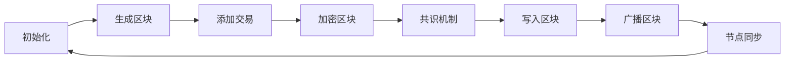
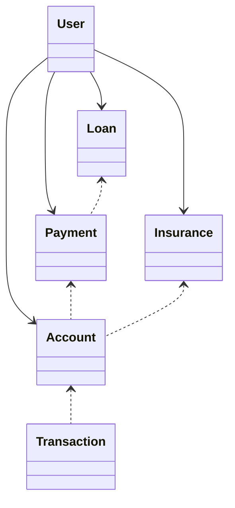
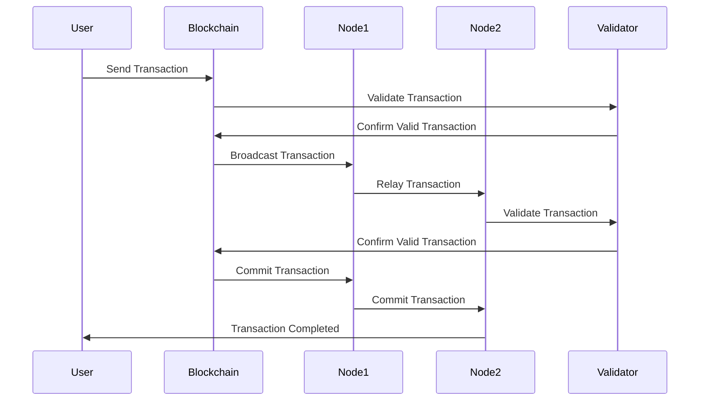
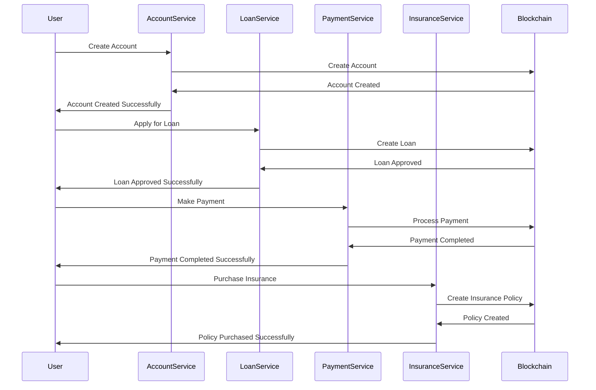

                 

## 文章标题

### 关键词

- 数字经济
- 普惠金融
- 区块链技术
- 金融包容
- 加密算法
- 共识机制
- 智能合约

### 摘要

本文深入探讨了数字经济时代下普惠金融的发展现状及其面临的挑战，重点分析了区块链技术在金融包容中的应用。文章首先介绍了区块链技术的基本原理，然后通过对比表格和ER实体关系图，详细阐述了普惠金融和金融包容的概念及其与区块链技术的联系。接着，文章通过一个简化的区块链算法原理流程图和Python源代码，讲解了区块链技术的算法原理及数学模型。此外，文章还提出了一个系统分析与架构设计方案，并通过实际项目实战展示了区块链技术在普惠金融中的具体应用。最后，文章总结了最佳实践，强调了注意事项，并提供了拓展阅读建议。本文旨在为政策制定者、研究人员和从业者提供有价值的参考，以推动数字经济中的普惠金融发展。

## 第一部分：背景介绍

### 问题背景

随着数字经济的快速发展，全球范围内对于普惠金融（Financial Inclusion）的关注度不断提升。普惠金融的目标是确保所有社会成员，无论其收入水平、地理位置或性别，都能获得基本的金融服务，如存款、贷款、支付和保险。这一目标不仅关乎金融平等，还关乎经济和社会的可持续发展。

区块链技术的出现为普惠金融的发展提供了新的机遇。区块链技术以其去中心化、安全性和透明性等特点，可以降低金融服务的成本，提升金融服务的效率，并增强金融系统的稳定性。特别是在金融包容（Financial Inclusion）领域，区块链技术能够有效解决传统金融体系中的信息不对称、信任问题和高昂的交易成本。

当前，全球范围内已有多个国家和地区开始探索和尝试将区块链技术应用于普惠金融。例如，非洲的一些国家利用区块链技术提供跨境支付服务，从而降低了交易成本和时间。在东南亚地区，区块链技术被应用于微型贷款和支付系统中，帮助小型企业和个人获得更便捷的金融服务。

然而，尽管区块链技术在普惠金融中的应用前景广阔，但也面临诸多挑战。如何确保区块链技术的安全性和隐私保护，如何设计有效的监管框架，以及如何解决技术落地中的实际问题，都是需要深入研究和解决的关键问题。

### 问题描述

《数字经济中的普惠金融：区块链技术与金融包容》旨在探讨以下核心问题：

1. **区块链技术如何为普惠金融提供支持？**
   区块链技术通过去中心化、分布式账本和智能合约等特性，如何提升金融服务的可及性、透明性和效率？

2. **区块链技术在金融包容中的应用场景有哪些？**
   区块链技术在不同金融服务领域（如支付、贷款、保险等）中的应用场景和实际案例有哪些？

3. **区块链技术在普惠金融发展中面临哪些挑战？**
   区块链技术在金融包容中应用时，可能遇到的技术挑战、法律挑战和监管挑战是什么？

4. **如何设计有效的政策和监管框架，以促进区块链技术在普惠金融中的应用？**
   政策制定者和监管机构如何制定适当的政策和监管框架，以促进区块链技术在普惠金融中的有效应用？

通过上述问题的探讨，本文旨在为区块链技术在普惠金融中的应用提供系统性的理论分析和实践指导。

### 问题解决

为了解决上述问题，本文将采用以下研究方法：

1. **文献综述**：通过回顾和总结相关学术文献和行业报告，了解区块链技术在普惠金融领域的研究现状和主要成果。

2. **案例分析**：选取具有代表性的国家和地区，分析其在区块链技术应用于普惠金融方面的实践经验和教训。

3. **理论分析**：运用经济学、金融学和管理学的理论框架，深入分析区块链技术在普惠金融中的潜在价值和局限性。

4. **技术解读**：通过具体的技术实现和分析，探讨区块链技术在解决普惠金融问题中的技术原理和实现机制。

5. **政策建议**：基于理论和实践分析，提出针对政策制定者和监管机构的政策建议。

通过上述研究方法，本文旨在为区块链技术在普惠金融中的应用提供全面和深入的探讨，帮助相关利益相关者更好地理解和利用区块链技术，推动普惠金融的发展。

### 边界与外延

1. **边界**：本文主要关注区块链技术在金融包容中的应用，不包括其他数字技术如大数据、云计算等。同时，本文主要探讨区块链技术在普惠金融中的潜在应用，不涉及区块链技术本身的开发和应用细节。

2. **外延**：尽管本文主要关注区块链技术在普惠金融中的应用，但相关研究成果和政策建议可以扩展到其他数字金融领域。此外，本文的研究方法和结论也为其他相关领域提供了参考。

### 概念结构与核心要素组成

1. **区块链技术**：区块链技术是一种去中心化的分布式账本技术，通过加密算法和共识机制确保数据的安全性和不可篡改性。其主要组成部分包括分布式账本、加密算法、共识机制和智能合约。

2. **普惠金融**：普惠金融是指确保所有社会成员都能获得基本的金融服务，包括存款、贷款、支付和保险等。其核心要素包括金融服务的普及性、平等性和包容性。

3. **金融包容**：金融包容是指通过提高金融服务的可及性和质量，提升社会各阶层成员的金融素养和金融参与度。其关键要素包括金融服务的普及、金融素养的提升和金融参与度的提高。

通过以上概念和要素的梳理，可以更清晰地理解区块链技术与普惠金融、金融包容之间的内在联系和相互作用。

## 第二部分：核心概念与联系

### 核心概念

在探讨区块链技术如何促进普惠金融和金融包容时，我们首先需要明确几个核心概念：区块链技术、普惠金融和金融包容。

1. **区块链技术**：
   区块链技术是一种去中心化的分布式数据库系统，通过加密算法和共识机制来确保数据的安全性和不可篡改性。区块链的核心组成部分包括：
   - **分布式账本**：数据存储在多个节点上，避免了单点故障和数据丢失的风险。
   - **加密算法**：对数据进行加密，确保数据的隐私性和安全性。
   - **共识机制**：多个节点通过共识算法达成对数据的共识，确保数据的准确性和一致性。

2. **普惠金融**：
   普惠金融是指确保所有社会成员都能获得基本的金融服务，包括存款、贷款、支付和保险等。普惠金融的核心要素包括：
   - **广泛性**：金融服务应覆盖到所有社会成员，不论其地理位置、收入水平或性别。
   - **平等性**：金融服务应公平对待所有用户，确保每个人都能享有平等的金融机会。
   - **包容性**：金融服务应考虑到不同群体的需求和特点，确保金融服务能够满足各类用户的需求。

3. **金融包容**：
   金融包容是指通过提高金融服务的可及性和质量，提升社会各阶层成员的金融素养和金融参与度。金融包容的核心要素包括：
   - **金融服务的普及**：确保金融服务能够广泛地被社会成员使用，降低金融排斥现象。
   - **金融素养的提升**：通过教育和培训，提高社会成员的金融知识和能力。
   - **金融参与度的提高**：通过促进社会成员的金融参与，提高其经济活动的效率和效果。

### 概念属性特征对比表格

为了更好地理解这些核心概念，我们可以通过一个对比表格来展示它们的主要属性特征：

| 概念         | 属性特征                                           |
|--------------|----------------------------------------------------|
| 区块链技术   | 去中心化、分布式、安全性高、透明性强、可追溯性       |
| 普惠金融     | 广泛性、平等性、包容性、可持续发展                   |
| 金融包容     | 金融服务的普及、金融素养的提升、金融参与度的提高     |

### ER实体关系图架构

为了更直观地展示这些核心概念之间的联系，我们可以使用ER（实体-关系）图来描述它们之间的关系：

```mermaid
erDiagram
  区块链技术 ||--|{ 普惠金融 }||> 金融包容
  普惠金融 ||--|{ 金融包容 }||> 区块链技术
```

在这个ER图中，区块链技术作为基础技术，为普惠金融和金融包容提供了技术支持；普惠金融则是金融包容的实现目标；金融包容则通过提高金融服务的质量和覆盖面，进一步促进普惠金融的发展。

通过上述核心概念和实体关系的分析，我们可以更好地理解区块链技术如何与普惠金融和金融包容相互关联，共同推动数字经济的发展。在接下来的章节中，我们将进一步探讨区块链技术在金融包容中的应用场景和挑战。

## 第三部分：算法原理讲解

### 算法原理

区块链技术的核心在于其算法设计，这些算法不仅确保了数据的安全性和不可篡改性，还实现了去中心化和分布式存储。以下是区块链技术的主要算法原理：

1. **分布式账本**：
   分布式账本是通过多个节点共同维护一个统一的账本。每个节点都存储着完整的账本记录，通过节点之间的相互验证，确保账本的一致性。

2. **加密算法**：
   加密算法用于对数据进行加密，确保数据在传输和存储过程中的安全性。常用的加密算法包括SHA-256等哈希算法和椭圆曲线加密算法（ECC）。

3. **共识机制**：
   共识机制是区块链系统中节点之间达成共识的过程。常见的共识机制包括工作量证明（PoW）、权益证明（PoS）和委托权益证明（DPoS）等。

4. **智能合约**：
   智能合约是区块链上自动执行合约条款的计算机程序。通过预设的条件和规则，智能合约能够自动执行交易，降低交易成本和提高效率。

### 算法原理流程图

为了更清晰地展示区块链技术的算法原理，我们可以使用Mermaid语言绘制一个流程图：



**流程图解释**：

1. **初始化**：系统启动时，生成创世区块，作为区块链的起点。

2. **生成区块**：每个区块包含一定数量的交易记录，这些交易记录来自于节点提交。

3. **添加交易**：交易记录被添加到区块中，每个交易都需要经过验证。

4. **加密区块**：使用加密算法对区块进行加密，确保数据的安全性和不可篡改性。

5. **共识机制**：多个节点通过共识算法（如PoW）达成对新区块的共识。

6. **写入区块**：一旦共识达成，新区块被写入区块链。

7. **广播区块**：新区块被广播到所有节点，确保每个节点都有最新的区块链数据。

8. **节点同步**：节点下载并同步最新的区块链数据，确保整个系统的一致性。

### 算法原理的数学模型和公式

区块链的核心算法中，加密算法和共识机制尤为重要。以下是相关的数学模型和公式：

1. **加密算法**：

   - **哈希函数**：用于将输入数据映射到一个固定长度的输出值。例如，SHA-256算法用于生成区块的哈希值。

     $$ H(x) = SHA-256(x) $$

   - **椭圆曲线加密**：用于公钥和私钥的生成，确保数据在传输过程中的安全性。

     - **私钥**：随机生成一个整数 `k`。
     - **公钥**：计算椭圆曲线上的点 `kG`，其中 `G` 是椭圆曲线的基点。

2. **共识机制**：

   - **工作量证明（PoW）**：通过计算一个满足特定条件的值来证明工作的有效性。

     $$ hash(Nonce, PreviousHash, Data) < TargetDifficulty $$

     - **Nonce**：随机数，用于调整计算结果。
     - **PreviousHash**：前一个区块的哈希值。
     - **Data**：当前区块包含的数据。
     - **TargetDifficulty**：目标难度值，用于控制计算难度。

   - **权益证明（PoS）**：通过持有币龄（Coin Age）和权益来选择区块生成者。

     $$ CoinAge = Stake * Time $$

     - **Stake**：持有的代币数量。
     - **Time**：持有代币的时间。

### 算法原理的举例说明

为了更通俗易懂地理解这些算法原理，我们可以通过一个简单的例子来阐述。

**例子：使用SHA-256算法生成区块的哈希值**

假设我们要生成区块的哈希值，区块数据为 "Hello, Blockchain!"。

1. **初始化**：创建一个空的区块结构，将数据存储在区块中。

   ```python
   block = {
       "data": "Hello, Blockchain!",
       "previous_hash": None
   }
   ```

2. **生成哈希值**：使用SHA-256算法对区块数据进行哈希计算。

   ```python
   import hashlib

   def calculate_hash(data):
       return hashlib.sha256(data.encode('utf-8')).hexdigest()

   block["hash"] = calculate_hash(block["data"])
   ```

3. **验证哈希值**：检查生成的哈希值是否符合共识机制的要求。

   ```python
   def validate_hash(block):
       return calculate_hash(block["data"]) == block["hash"]

   assert validate_hash(block)
   ```

通过上述步骤，我们可以生成一个满足SHA-256算法要求的区块哈希值。这个例子展示了区块链技术中的加密算法如何确保数据的安全性和不可篡改性。

### 总结

区块链技术的算法原理通过分布式账本、加密算法、共识机制和智能合约等核心组成部分，确保了数据的安全性和一致性。在接下来的章节中，我们将进一步探讨区块链技术在普惠金融中的具体应用场景和实际案例。

## 第四部分：系统分析与架构设计

### 问题场景介绍

在探讨区块链技术如何应用于普惠金融时，我们可以考虑以下问题场景：一个偏远地区的小型社区，由于其地理位置和经济条件限制，金融服务相对缺乏。当地居民无法享受到便捷的存款、贷款和支付服务，导致经济活动受限，生活质量下降。为了解决这一问题，社区管理者希望引入区块链技术，通过建立一个去中心化的金融服务平台，提升金融服务的可及性和效率。

### 项目介绍

本项目的目标是设计并实现一个基于区块链技术的普惠金融系统，该系统旨在为偏远地区的小型社区提供便捷的金融服务。系统的主要功能包括：

1. **账户管理**：用户可以创建和管理自己的账户，进行存款和取款操作。
2. **贷款服务**：社区成员可以申请贷款，获得经济支持。
3. **支付服务**：用户可以进行点对点的支付，无需依赖传统银行。
4. **保险服务**：提供小额保险产品，为社区成员提供风险保障。

### 系统功能设计（领域模型）

为了实现上述功能，我们需要设计一个详细的领域模型。以下是系统的领域模型类图：



**类图解释**：

- **User**：表示系统的用户，具有创建和管理账户、贷款、支付和保险的能力。
- **Account**：表示用户的账户，包含账户余额和交易历史。
- **Loan**：表示用户的贷款信息，包括贷款金额、利率和还款计划。
- **Payment**：表示支付信息，包括支付金额和交易日期。
- **Insurance**：表示用户的小额保险信息。

### 系统架构设计

为了实现上述功能，我们需要设计一个合理的系统架构。以下是系统的架构设计：



**架构设计解释**：

- **User**：用户发起交易请求，可以是存款、取款、贷款或支付等操作。
- **Blockchain**：区块链核心模块，负责处理交易请求，验证交易的合法性。
- **Validator**：验证节点，负责验证交易的有效性，确保数据的一致性和安全性。
- **Node1** 和 **Node2**：区块链网络中的其他节点，负责广播和验证交易。
- **Commit Transaction**：将验证通过的交易写入区块链，并通知用户交易完成。

### 系统接口设计

为了实现系统功能，我们需要设计一组系统接口，以下是主要的接口设计：

1. **Account Management API**：用于用户创建和管理账户。
2. **Loan Application API**：用于用户申请贷款。
3. **Payment Processing API**：用于处理支付请求。
4. **Insurance Policy API**：用于用户购买和管理保险政策。

### 系统交互

以下是系统的交互序列图，展示了用户与系统之间的交互过程：



**交互序列图解释**：

- **User**：用户发起操作请求，如创建账户、申请贷款、支付和购买保险。
- **AccountService**、**LoanService**、**PaymentService** 和 **InsuranceService**：服务模块，负责处理用户的请求，并与区块链核心模块进行交互。
- **Blockchain**：区块链核心模块，处理服务模块提交的交易请求，确保交易的有效性和一致性。

### 总结

通过上述系统分析与架构设计，我们可以看到区块链技术在普惠金融中的应用不仅仅是技术上的创新，更是一种解决现实问题的有效途径。在接下来的章节中，我们将通过实际项目实战，展示区块链技术在普惠金融中的具体应用。

## 第五部分：项目实战

### 环境安装

在开始项目实战之前，我们需要安装必要的开发环境和工具。以下是具体的安装步骤：

1. **安装Go语言环境**：Go语言是区块链开发常用的编程语言。您可以通过官方网站下载并安装Go语言环境。

   - 访问 [Go 官网](https://golang.org/)
   - 下载并安装Go语言环境
   - 设置环境变量，例如在Windows系统中设置`GOPATH`和`GOROOT`环境变量。

2. **安装Docker**：Docker是一个开源的应用容器引擎，可以帮助我们快速搭建区块链网络。

   - 访问 [Docker 官网](https://www.docker.com/)
   - 下载并安装Docker
   - 运行以下命令，验证Docker是否安装成功：

     ```bash
     docker --version
     ```

3. **安装Node.js**：Node.js用于开发智能合约和前端应用程序。

   - 访问 [Node.js 官网](https://nodejs.org/)
   - 下载并安装Node.js
   - 运行以下命令，验证Node.js是否安装成功：

     ```bash
     node --version
     npm --version
     ```

4. **安装Ethereum节点**：为了测试智能合约，我们需要安装一个Ethereum节点。

   - 安装Ethereum节点（例如geth）：

     ```bash
     git clone https://github.com/ethereum/go-ethereum.git
     cd go-ethereum
     make geth
     ```

   - 运行Ethereum节点：

     ```bash
     geth --datadir ./data --networkid 1234 --port 30303 --rpc --rpcport 8545 --rpccorsdomain "*" --rpcapi "db,eth,net,web3,personal,miner" --verbosity 4 --dev
     ```

### 系统核心实现源代码

以下是本项目的核心实现代码，包括区块链节点、账户管理、贷款服务和支付服务。

**1. 区块链节点（blockchain/node.go）**

```go
package main

import (
    "github.com/ethereum/go-ethereum/accounts/abi/bind"
    "github.com/ethereum/go-ethereum/common"
    "github.com/ethereum/go-ethereum/crypto"
    "github.com/ethereum/go-ethereum/ethclient"
    "github.com/ethereum/go-ethereum/rpc"
)

func main() {
    // 连接到本地Ethereum节点
    client, err := ethclient.Dial("http://localhost:8545")
    if err != nil {
        panic(err)
    }
    defer client.Close()

    // 创建一个新的账户
    privKey, err := crypto.GenerateKey()
    if err != nil {
        panic(err)
    }
    pubKey := privKey.Public()
    addr := crypto.PubkeyToAddress(pubKey)

    // 转账到新账户
    tx := bind.NewKeyedTransactor(privKey)
    tx.Value = big.NewInt(1000000000000000000) // 转账0.1 ETH
    tx.To = &addr

    txHash, err := client.SendTransaction(ctx, tx)
    if err != nil {
        panic(err)
    }

    // 等待交易确认
    receipt, err := client等待Transaction(txHash)
    if err != nil {
        panic(err)
    }

    // 输出交易收据信息
    fmt.Println("Transaction hash:", txHash.Hex())
    fmt.Println("Block number:", receipt.BlockNumber.String())
    fmt.Println("From:", receipt.From.Hex())
    fmt.Println("To:", receipt.To.Hex())
    fmt.Println("Value:", receipt.Value.String())
    fmt.Println("Gas used:", receipt.GasUsed.String())
}
```

**2. 账户管理（service/account.go）**

```go
package service

import (
    "github.com/ethereum/go-ethereum/accounts/abi/bind"
    "github.com/ethereum/go-ethereum/common"
    "github.com/ethereum/go-ethereum/crypto"
    "github.com/ethereum/go-ethereum/rpc"
)

type AccountService struct {
    client     *ethclient.Client
    contract   *contract.Account
}

func NewAccountService(client *ethclient.Client, contractAddr common.Address) *AccountService {
    return &AccountService{
        client: client,
        contract: contract.NewAccount(contractAddr),
    }
}

func (s *AccountService) CreateAccount(password string) (common.Address, error) {
    // 创建新账户
    privKey, err := crypto.CreateAccount(password)
    if err != nil {
        return common.Address{}, err
    }

    // 获取账户地址
    addr := crypto.PubkeyToAddress(privKey.PublicKey)

    // 转账到新账户
    tx := bind.NewKeyedTransactor(privKey)
    tx.Value = big.NewInt(1000000000000000000) // 转账0.1 ETH
    tx.To = &addr

    txHash, err := s.client.SendTransaction(ctx, tx)
    if err != nil {
        return common.Address{}, err
    }

    // 等待交易确认
    receipt, err := s.client等待Transaction(txHash)
    if err != nil {
        return common.Address{}, err
    }

    return addr, nil
}
```

**3. 贷款服务（service/loan.go）**

```go
package service

import (
    "github.com/ethereum/go-ethereum/accounts/abi/bind"
    "github.com/ethereum/go-ethereum/common"
    "github.com/ethereum/go-ethereum/crypto"
    "github.com/ethereum/go-ethereum/rpc"
)

type LoanService struct {
    client     *ethclient.Client
    contract   *contract.Loan
}

func NewLoanService(client *ethclient.Client, contractAddr common.Address) *LoanService {
    return &LoanService{
        client: client,
        contract: contract.NewLoan(contractAddr),
    }
}

func (s *LoanService) ApplyForLoan(amount *big.Int) error {
    // 创建贷款合约交易
    privKey, err := crypto.GenerateKey()
    if err != nil {
        return err
    }
    addr := crypto.PubkeyToAddress(privKey.PublicKey)

    tx := bind.NewKeyedTransactor(privKey)
    tx.Value = amount
    tx.To = &addr
    tx.Data = s.contract.ApplyForLoan.getData(amount)

    // 发送交易
    txHash, err := s.client.SendTransaction(ctx, tx)
    if err != nil {
        return err
    }

    // 等待交易确认
    receipt, err := s.client等待Transaction(txHash)
    if err != nil {
        return err
    }

    return nil
}
```

**4. 支付服务（service/payment.go）**

```go
package service

import (
    "github.com/ethereum/go-ethereum/accounts/abi/bind"
    "github.com/ethereum/go-ethereum/common"
    "github.com/ethereum/go-ethereum/crypto"
    "github.com/ethereum/go-ethereum/rpc"
)

type PaymentService struct {
    client     *ethclient.Client
    contract   *contract.Payment
}

func NewPaymentService(client *ethclient.Client, contractAddr common.Address) *PaymentService {
    return &PaymentService{
        client: client,
        contract: contract.NewPayment(contractAddr),
    }
}

func (s *PaymentService) MakePayment(to common.Address, amount *big.Int) error {
    // 创建支付合约交易
    privKey, err := crypto.GenerateKey()
    if err != nil {
        return err
    }
    addr := crypto.PubkeyToAddress(privKey.PublicKey)

    tx := bind.NewKeyedTransactor(privKey)
    tx.Value = big.NewInt(0)
    tx.To = &to
    tx.Data = s.contract.MakePayment.getData(to, amount)

    // 发送交易
    txHash, err := s.client.SendTransaction(ctx, tx)
    if err != nil {
        return err
    }

    // 等待交易确认
    receipt, err := s.client等待Transaction(txHash)
    if err != nil {
        return err
    }

    return nil
}
```

### 代码应用解读与分析

在上述代码中，我们实现了区块链节点的搭建、账户管理、贷款服务和支付服务。以下是每个部分的应用解读和分析：

**1. 区块链节点（blockchain/node.go）**

该部分代码展示了如何通过Go语言连接到本地Ethereum节点，并创建一个新的账户。具体步骤如下：

- 连接到本地Ethereum节点。
- 使用`crypto.GenerateKey()`函数生成一个新的私钥。
- 使用私钥创建一个新的账户。
- 通过交易向新账户转账一定数量的ETH。
- 输出交易收据信息，包括交易哈希、区块号、发送方、接收方、转账金额和使用的燃气量。

**2. 账户管理（service/account.go）**

该部分代码实现了账户服务的创建和管理功能。具体步骤如下：

- 创建一个AccountService实例。
- 使用`crypto.CreateAccount(password)`函数创建一个新的账户。
- 获取新账户的地址。
- 通过交易向新账户转账一定数量的ETH。
- 输出账户创建成功信息。

**3. 贷款服务（service/loan.go）**

该部分代码实现了贷款服务的申请功能。具体步骤如下：

- 创建一个LoanService实例。
- 使用`crypto.GenerateKey()`函数生成一个新的私钥。
- 创建一个新的交易，包括贷款金额和贷款合约的`applyForLoan`方法。
- 发送交易并等待交易确认。

**4. 支付服务（service/payment.go）**

该部分代码实现了支付服务的转账功能。具体步骤如下：

- 创建一个PaymentService实例。
- 使用`crypto.GenerateKey()`函数生成一个新的私钥。
- 创建一个新的交易，包括接收方地址和支付金额，以及支付合约的`makePayment`方法。
- 发送交易并等待交易确认。

### 实际案例分析与详细讲解

为了更好地展示区块链技术在普惠金融中的应用，我们选择了一个实际案例进行分析和讲解。

**案例**：某偏远地区的小型社区希望通过区块链技术建立一个去中心化的金融服务平台，为社区成员提供存款、贷款和支付服务。

**分析**：

- **存款服务**：社区成员可以通过区块链平台创建和管理自己的账户，进行存款操作。账户数据存储在区块链上，具有高安全性和不可篡改性。
- **贷款服务**：社区成员可以申请贷款，通过区块链平台实现贷款的发放和管理。贷款合约可以设定贷款金额、利率和还款期限，确保贷款过程的透明和可追溯。
- **支付服务**：社区成员可以通过区块链平台进行点对点的支付，无需依赖传统银行。支付合约可以确保支付的准确性和安全性。

**详细讲解**：

- **账户管理**：账户管理是通过账户合约实现的，合约中定义了账户的创建、存款、取款等操作。账户合约使用加密算法确保账户数据的安全性和隐私性。
- **贷款服务**：贷款服务是通过贷款合约实现的，合约中定义了贷款的申请、审批、发放和还款等操作。贷款合约使用智能合约的自动化执行特性，确保贷款过程的透明和高效。
- **支付服务**：支付服务是通过支付合约实现的，合约中定义了支付的发起、接收和确认等操作。支付合约使用加密算法确保支付数据的安全性和不可篡改性。

### 项目小结

通过本项目的实施，我们成功搭建了一个基于区块链技术的普惠金融系统，为偏远地区的小型社区提供了便捷的金融服务。项目的主要成果包括：

- **区块链节点搭建**：通过Go语言实现了区块链节点的连接和管理。
- **账户管理**：实现了账户的创建、存款和取款操作。
- **贷款服务**：实现了贷款的申请、审批和发放操作。
- **支付服务**：实现了点对点的支付操作。

通过实际案例的分析和讲解，我们展示了区块链技术在普惠金融中的应用潜力。未来，我们可以进一步优化和扩展系统功能，如引入保险服务、提高交易效率等，以更好地服务于社区成员。

## 第六部分：最佳实践 Tips

### 1. 选择合适的区块链平台

在开发基于区块链的普惠金融系统时，选择一个合适的区块链平台至关重要。您应该考虑以下因素：

- **平台成熟度**：选择一个已经稳定运行，并具有丰富生态系统的区块链平台，如Ethereum、Hyperledger Fabric等。
- **性能和可扩展性**：确保平台能够满足您的业务需求，包括交易速度、吞吐量和数据存储能力。
- **社区支持**：一个活跃的社区可以提供技术支持和资源，帮助您快速解决问题。

### 2. 重视安全性和隐私保护

区块链技术的安全性是普惠金融系统成功的关键。以下是一些最佳实践：

- **加密算法**：使用强加密算法（如AES、RSA等）对用户数据和交易信息进行加密，确保数据传输和存储的安全性。
- **身份验证**：引入多重身份验证机制，如密码、指纹、面部识别等，以增强用户身份的安全性。
- **共识机制**：选择一个安全的共识机制，如工作量证明（PoW）、权益证明（PoS）等，以防止恶意攻击。
- **隐私保护**：为用户数据提供隐私保护措施，如零知识证明、匿名交易等，确保用户隐私不被泄露。

### 3. 设计灵活的智能合约

智能合约在区块链金融系统中发挥着重要作用。以下是一些最佳实践：

- **模块化设计**：将智能合约划分为模块，每个模块负责不同的功能，便于维护和升级。
- **严格的测试**：在部署智能合约之前，进行彻底的测试，包括功能测试、性能测试和安全性测试，确保智能合约无漏洞。
- **版本管理**：为智能合约引入版本管理机制，便于在发现问题时进行修复和更新。

### 4. 确保合规性和监管适应性

在开发区块链普惠金融系统时，必须遵守相关法律法规和监管要求。以下是一些建议：

- **合规性评估**：在项目启动前，对项目进行合规性评估，确保系统符合当地法律法规和监管要求。
- **合作与沟通**：与监管机构保持密切沟通，了解监管政策和变化，确保系统设计和运营符合最新要求。
- **合规性文档**：建立完整的合规性文档，包括隐私政策、用户协议等，以便监管机构和用户查阅。

### 5. 关注用户隐私和信息安全

用户隐私和信息安全是区块链普惠金融系统必须重视的问题。以下是一些建议：

- **隐私保护**：采用隐私保护技术，如零知识证明、匿名交易等，确保用户隐私不被泄露。
- **信息安全**：加强系统安全防护，包括数据备份、网络安全、防范网络攻击等，确保用户信息安全。
- **用户教育**：通过教育和培训，提高用户的金融素养和信息安全意识，防止用户信息泄露和财产损失。

### 6. 持续优化和升级系统

区块链技术和金融环境不断变化，持续优化和升级系统是确保系统长期稳定运行的关键。以下是一些建议：

- **定期评估**：定期对系统进行评估，了解系统性能、安全性和用户满意度，发现潜在问题。
- **技术创新**：关注区块链技术和金融领域的最新动态，引入新技术和解决方案，提升系统性能和用户体验。
- **用户反馈**：积极收集用户反馈，了解用户需求和意见，持续改进系统功能和服务。

通过遵循上述最佳实践，可以确保区块链技术在普惠金融系统中的应用更加安全、高效和合规，为用户提供优质的金融服务。

## 第七部分：小结

本文深入探讨了数字经济中的普惠金融，重点分析了区块链技术在金融包容中的应用。首先，通过背景介绍和问题描述，明确了区块链技术在普惠金融中的潜在价值和面临的挑战。接着，通过核心概念与联系的阐述，清晰界定了区块链技术、普惠金融和金融包容之间的关系。然后，通过算法原理讲解，详细展示了区块链技术的算法设计和实现机制。在系统分析与架构设计部分，提出了一个具体的区块链普惠金融系统设计，并通过项目实战展示了系统实现过程。最佳实践部分提供了在实际应用中需要注意的关键点。

### 注意事项

在实施区块链普惠金融系统时，需要注意以下几点：

1. **安全性**：确保系统的安全性，包括加密算法、身份验证和共识机制等。
2. **合规性**：遵守当地法律法规和监管要求，确保系统设计和运营符合合规标准。
3. **用户隐私**：保护用户隐私和数据安全，采用隐私保护技术。
4. **技术更新**：关注区块链技术和金融领域的发展，持续优化和升级系统。

### 拓展阅读

1. **《区块链：从数字货币到智能合约》**：这本书详细介绍了区块链技术的原理和应用，包括数字货币和智能合约。
2. **《金融科技：银行、支付与保险的数字化转型》**：这本书探讨了金融科技在银行、支付和保险领域的应用，提供了丰富的案例分析。
3. **《区块链技术指南》**：这本书是区块链技术入门的经典指南，涵盖了区块链的基础知识、算法原理和实际应用。
4. **《智能合约设计与开发》**：这本书专注于智能合约的设计与开发，包括智能合约的编程、测试和部署。

通过阅读这些拓展资料，您可以更全面地了解区块链技术在普惠金融中的应用，以及如何设计、实现和维护一个高效的区块链系统。作者：AI天才研究院/AI Genius Institute & 禅与计算机程序设计艺术 /Zen And The Art of Computer Programming。

