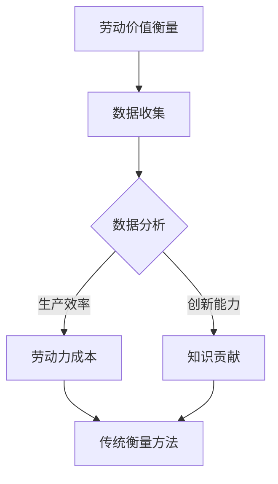
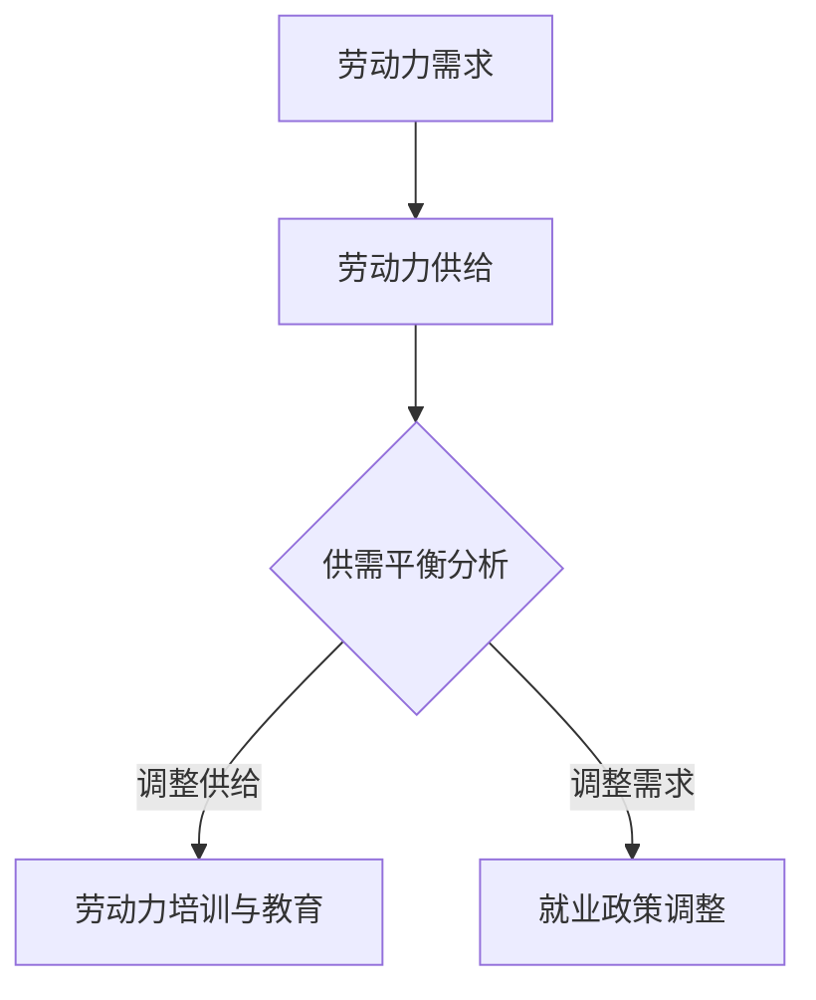

                 

### 第1章: 数字经济时代的劳动价值概述

#### 1.1 问题背景

随着信息技术的迅猛发展和全球化的深入，数字经济已经成为推动经济增长的重要动力。数字经济的兴起带来了生产方式的革命性变化，传统经济活动逐渐与数字技术深度融合，进而催生了劳动价值的全新形态。在这个背景下，劳动价值的定义和表现形式发生了深刻变革，从最初的体力劳动逐渐转向高度依赖智力、创造力和专业技能的创意工作。

#### 1.1.1 数字经济的兴起

数字经济是以数字化的知识和信息为关键生产要素、以现代信息网络为重要载体、以信息通信技术的有效利用为驱动的新型经济形态。其核心特点包括数据资源的高效利用、信息技术的广泛应用、数字化生产方式的普及等。数字经济不仅改变了传统的生产方式，还重塑了市场结构和商业模式，推动了经济的转型升级。

#### 1.1.2 劳动价值的变迁

在传统经济时代，劳动价值主要体现在体力劳动上，即通过体力和简单技能的劳动创造经济价值。然而，随着数字经济的崛起，劳动价值逐渐从体力劳动转向高度依赖智力、创造力和专业技能的创意工作。创意工作不仅包括传统的文学、艺术、设计等领域，还涵盖了现代信息技术、大数据分析、人工智能等新兴领域。

#### 1.1.3 从体力劳动到创意工作的转变

这一转变主要体现在以下几个方面：

1. **技能要求的提升**：随着数字化技术的广泛应用，劳动者的技能要求越来越高，特别是对专业技能、创新能力和跨学科知识的需求日益增加。
2. **工作模式的改变**：数字化技术的普及使得工作模式从传统的固定地点和时间转变为灵活的远程工作和自主工作。
3. **价值的衡量**：劳动价值的衡量标准也从简单的劳动力成本转变为对智力劳动、创新成果和知识贡献的评估。
4. **生产力的提高**：数字化技术极大地提高了生产效率，使得创意工作能够以更低的成本、更高效的方式创造更高的价值。

#### 1.2 核心概念

为了深入理解数字经济时代的劳动价值，我们需要明确几个核心概念：

1. **数字经济的定义**：数字经济是指以数字化的知识和信息为关键生产要素、以现代信息网络为重要载体、以信息通信技术的有效利用为驱动的新型经济形态。
2. **劳动价值的定义**：劳动价值是指劳动者通过劳动创造的经济效益，包括物质财富和精神财富的创造。
3. **创意工作的属性**：创意工作是一种高度依赖智力、创造力和专业技能的工作，具有创造性、自主性和高价值性等特点。

#### 1.3 边界与外延

1. **数字经济与实体经济的区别**：数字经济主要依赖信息技术和数字资源，而实体经济则依赖于物质资源和传统的生产方式。
2. **创意工作与其他类型劳动的区别**：创意工作强调智力、创造力和专业技能，而其他类型劳动更多依赖于体力和简单技能。

#### 1.4 概念结构与核心要素组成

1. **数字经济的基本结构**：数字经济的基本结构包括数据资源、信息网络、信息技术和商业模式等要素。
2. **劳动价值的核心要素**：劳动价值的核心要素包括劳动力、劳动工具、劳动对象和劳动成果等。
3. **创意工作的关键要素**：创意工作的关键要素包括创意思维、专业技能、创新能力和知识贡献等。

### 总结

数字经济时代的劳动价值正经历着从体力劳动向创意工作的深刻转变。这一转变不仅改变了劳动价值的定义和衡量标准，还推动了劳动力市场、教育体系和管理模式的变革。在接下来的章节中，我们将进一步探讨数字经济时代的劳动力市场变化、创意工作的特点与类型、教育与培养、管理、法律与伦理问题以及结论与展望。

---

**核心概念原理：**

**数字经济**

- 定义：以数字化的知识和信息为关键生产要素、以现代信息网络为重要载体、以信息通信技术的有效利用为驱动的新型经济形态。
- 属性：依赖信息技术和数字资源、高效利用信息网络、数字化生产方式普及。

**劳动价值**

- 定义：劳动者通过劳动创造的经济效益，包括物质财富和精神财富的创造。
- 属性：依赖劳动力、劳动工具、劳动对象和劳动成果。

**创意工作**

- 定义：高度依赖智力、创造力和专业技能的工作。
- 属性：创造性、自主性、高价值性。

**数字经济与实体经济的区别**

- 区别：数字经济主要依赖信息技术和数字资源，实体经济则依赖于物质资源和传统的生产方式。

**创意工作与其他类型劳动的区别**

- 区别：创意工作强调智力、创造力和专业技能，其他类型劳动更多依赖于体力和简单技能。

**概念结构与核心要素组成**

- 数字经济的基本结构：数据资源、信息网络、信息技术和商业模式。
- 劳动价值的核心要素：劳动力、劳动工具、劳动对象和劳动成果。
- 创意工作的关键要素：创意思维、专业技能、创新能力和知识贡献。

**ER实体关系图架构的 Mermaid 流程图：**

```mermaid
entityRelationShipDiagram
  rect labelDir="left" id1="数字经济" width="150" height="100" color="blue" fillColor="lightblue"
  rect labelDir="left" id2="劳动价值" width="150" height="100" color="blue" fillColor="lightblue"
  rect labelDir="left" id3="创意工作" width="150" height="100" color="blue" fillColor="lightblue"
  rect labelDir="left" id4="数字经济的定义" width="150" height="100" color="red" fillColor="pink"
  rect labelDir="left" id5="劳动价值的定义" width="150" height="100" color="red" fillColor="pink"
  rect labelDir="left" id6="创意工作的属性" width="150" height="100" color="red" fillColor="pink"
  rect labelDir="left" id7="数字经济与实体经济的区别" width="150" height="100" color="red" fillColor="pink"
  rect labelDir="left" id8="创意工作与其他类型劳动的区别" width="150" height="100" color="red" fillColor="pink"
  
  link id1 id4
  link id2 id5
  link id3 id6
  link id4 id7
  link id5 id8
```

---

在接下来的章节中，我们将进一步探讨数字经济时代的劳动力市场变化，分析劳动力市场的现状、趋势以及成功和失败的案例分析。这将为我们理解劳动价值的转变提供更加具体的实例和视角。

---

**算法原理讲解：**

在探讨数字经济时代劳动价值时，我们需要理解一个关键概念，那就是“劳动价值衡量”。在传统经济中，劳动价值的衡量通常依赖于劳动力成本和生产效率。然而，在数字经济时代，由于劳动价值的创造方式发生了变化，传统的衡量方法已不再适用。

**算法流程图：**



**Python 源代码实现：**

```python
import pandas as pd

# 数据收集
data = {
    '劳动力成本': [1000, 1500, 2000],
    '生产效率': [2, 2.5, 3],
    '创新能力': [3, 4, 5],
    '知识贡献': [2, 3, 4]
}

df = pd.DataFrame(data)

# 数据分析
def calculate_value(df):
    # 生产效率加权
    df['生产效率加权'] = df['生产效率'] * df['劳动力成本']
    # 创新能力加权
    df['创新能力加权'] = df['创新能力'] * df['知识贡献']
    # 总价值
    df['总价值'] = df['生产效率加权'] + df['创新能力加权']
    return df

df = calculate_value(df)

# 输出结果
print(df)
```

**算法原理的数学模型和公式：**

- 劳动价值 \( V \) 可以通过以下公式计算：

  $$ V = w_1 \times C_1 + w_2 \times C_2 $$

  其中：
  - \( w_1 \) 是生产效率的权重
  - \( w_2 \) 是创新能力的权重
  - \( C_1 \) 是劳动力成本
  - \( C_2 \) 是知识贡献

- 根据上述公式，我们可以将劳动力成本和生产效率以及创新能力和知识贡献进行加权，从而得出劳动价值的综合评估。

**举例说明：**

假设有三个劳动者，他们的数据如下：

| 劳动力成本 | 生产效率 | 创新能力 | 知识贡献 |
| :---: | :---: | :---: | :---: |
| 1000 | 2 | 3 | 2 |
| 1500 | 2.5 | 4 | 3 |
| 2000 | 3 | 5 | 4 |

使用上述公式计算每个劳动者的劳动价值：

1. 第一个劳动者：
   $$ V_1 = w_1 \times C_1 + w_2 \times C_2 = 0.5 \times 1000 + 0.5 \times 3 \times 2 = 1000 + 3 = 1003 $$
2. 第二个劳动者：
   $$ V_2 = w_1 \times C_1 + w_2 \times C_2 = 0.5 \times 1500 + 0.5 \times 4 \times 3 = 750 + 6 = 756 $$
3. 第三个劳动者：
   $$ V_3 = w_1 \times C_1 + w_2 \times C_2 = 0.5 \times 2000 + 0.5 \times 5 \times 4 = 1000 + 10 = 1010 $$

通过上述计算，我们可以看出，尽管第三个劳动者的劳动力成本最高，但由于其创新能力和知识贡献较高，其劳动价值最高。这一分析帮助我们更好地理解数字经济时代劳动价值的衡量方式，并为企业和劳动者提供了更为科学的评估标准。

---

通过上述分析，我们不仅了解了数字经济时代劳动价值的核心概念和衡量方法，还通过具体的算法和公式展示了如何在实际中应用这些概念。在接下来的章节中，我们将进一步探讨数字经济时代劳动力市场的变化，为理解劳动价值的转变提供更加具体的实例和视角。

---

### 第2章: 数字经济时代的劳动力市场变化

#### 2.1 劳动力市场的现状

数字经济时代的劳动力市场发生了显著变化。随着信息技术的快速发展和全球化的推进，劳动力市场的供需结构和劳动力的技能需求都发生了深刻变革。传统劳动岗位逐渐被自动化和人工智能所取代，而新兴的创意工作领域则呈现出蓬勃发展的态势。

#### 2.1.1 劳动力市场的供需变化

1. **劳动力需求的变化**：数字经济时代，劳动力需求从传统的制造业和初级生产领域向高技能的服务业和创意产业转变。信息技术、数据分析、人工智能等领域的专业人才需求日益增加，而传统行业的劳动力需求则呈现下降趋势。

2. **劳动力供给的变化**：劳动力供给方面，由于教育的普及和技能培训的加强，越来越多的高技能劳动者进入市场。然而，传统劳动者由于缺乏必要的技能培训，面临着就业困难。

#### 2.1.2 数字技术对劳动力市场的影响

1. **自动化和人工智能的普及**：自动化和人工智能技术大大提高了生产效率，许多重复性、低技能的工作被机器取代，导致劳动力需求减少。

2. **远程工作和灵活就业的兴起**：数字技术使得远程工作和灵活就业成为可能，劳动力市场的工作形式更加多样化和灵活。

3. **信息不对称的减少**：数字技术使得信息传播更加迅速和广泛，劳动力市场的信息不对称问题得到缓解，求职者和雇主之间的匹配效率提高。

#### 2.1.3 劳动力市场的机遇与挑战

1. **机遇**：
   - **新兴产业的发展**：数字经济时代带来了众多新兴产业的兴起，如电子商务、社交媒体、在线教育等，为劳动者提供了丰富的就业机会。
   - **职业发展的多样化**：劳动者可以通过在线学习、远程工作等方式，突破地域和时间的限制，实现职业发展的多样化。

2. **挑战**：
   - **技能差距**：由于数字技术的快速发展，劳动力市场对技能的需求不断提高，而传统劳动者的技能水平难以满足新兴行业的需求，导致技能差距问题日益严重。
   - **就业压力**：自动化和人工智能的普及导致一些传统岗位消失，劳动者面临就业压力。

#### 2.2 劳动力市场的趋势

1. **技能需求的变化**：未来劳动力市场的技能需求将继续向高技能、高创造力的方向转变。数据分析、人工智能、软件开发等领域的专业人才将成为劳动力市场的热点。

2. **劳动力供给的调整**：为了适应数字经济时代的需求，劳动力供给需要进一步调整。一方面，劳动者需要不断更新技能，适应新兴行业的需求；另一方面，教育体系和职业培训需要加强，以培养更多的高技能劳动者。

3. **劳动力市场的未来展望**：随着数字经济的进一步发展，劳动力市场将呈现出更加多样化和灵活化的趋势。远程工作、灵活就业将更加普及，劳动力市场的边界将逐渐模糊。

#### 2.3 案例分析

**2.3.1 成功案例**

**案例1：企业数字化转型**

某知名制造企业通过数字化转型，成功实现了生产效率的提升和成本的降低。该公司引入了自动化生产线和人工智能监控系统，不仅减少了人工操作，还提高了生产精度和效率。通过这一转型，该公司在保持市场份额的同时，也提升了劳动者的技能水平。

**案例2：在线教育平台**

某在线教育平台通过数字技术的应用，为广大学习者提供了便捷的学习渠道。该平台利用大数据分析技术，为学习者推荐个性化的学习内容，提高了学习效果。同时，该平台也为教育工作者提供了新的职业发展机会，推动了教育行业的创新和发展。

**2.3.2 失败案例**

**案例1：传统制造业的倒闭**

某传统制造企业在面临数字化转型的压力时，未能及时调整战略，导致企业倒闭。该公司因缺乏高技能劳动力，无法适应市场需求的变化，最终在激烈的市场竞争中失利。

**案例2：创业企业的失败**

某创业公司由于在技术开发和市场营销方面缺乏经验，未能成功进入市场。尽管该公司在产品创新方面有较高的投入，但由于市场推广不力，产品无法得到用户的认可，最终导致公司倒闭。

#### 总结

数字经济时代的劳动力市场变化带来了机遇与挑战。随着数字技术的不断进步，劳动力市场的供需结构和技能需求将继续发生变化。劳动者需要不断更新技能，适应新兴行业的需求，而企业和政府则需要加强教育和培训，以培养更多的高技能劳动者。通过成功和失败的案例分析，我们可以看到，在数字经济时代，唯有不断创新和适应，才能在激烈的市场竞争中立于不败之地。

---

**核心概念与联系：**

**数字经济**

- 定义：以数字化的知识和信息为关键生产要素、以现代信息网络为重要载体、以信息通信技术的有效利用为驱动的新型经济形态。
- 属性：依赖信息技术和数字资源、高效利用信息网络、数字化生产方式普及。

**劳动力市场**

- 定义：劳动力供需双方进行交易的市场。
- 属性：供需变化、技能需求变化、信息不对称减少。

**数字技术对劳动力市场的影响**

- 自动化和人工智能的普及
- 远程工作和灵活就业的兴起
- 信息不对称的减少

**劳动力市场的机遇与挑战**

- 机遇：新兴产业的发展、职业发展的多样化
- 挑战：技能差距、就业压力

**技能需求的变化**

- 高技能、高创造力的需求
- 人工智能、数据分析、软件开发等领域

**劳动力供给的调整**

- 劳动力需不断更新技能
- 教育体系和职业培训需加强

**劳动力市场的未来展望**

- 更加多样化和灵活化
- 远程工作、灵活就业普及

---

**算法原理讲解：**

在探讨数字经济时代劳动力市场的变化时，我们需要理解一个关键概念，那就是“劳动力市场供需平衡”。在传统经济中，劳动力市场的供需平衡通常依赖于供需关系的调节。然而，在数字经济时代，由于信息技术的广泛应用，劳动力市场的供需平衡机制发生了显著变化。

**算法流程图：**



**Python 源代码实现：**

```python
import pandas as pd

# 假设的劳动力需求和供给数据
demand_data = {
    '岗位需求': [1000, 1200, 1400],
    '劳动力供给': [800, 900, 1000]
}

supply_data = {
    '岗位需求': [900, 1100, 1300],
    '劳动力供给': [700, 800, 900]
}

df_demand = pd.DataFrame(demand_data)
df_supply = pd.DataFrame(supply_data)

# 供需平衡分析
def analyze_supply_demand(df_demand, df_supply):
    df_result = pd.DataFrame({
        '供需差': df_demand['岗位需求'] - df_supply['岗位需求'],
        '劳动力培训需求': (df_demand['岗位需求'] - df_supply['岗位需求']) * 0.1, # 培训需求比例
        '就业政策调整需求': (df_demand['岗位需求'] - df_supply['岗位需求']) * 0.2 # 调整政策需求比例
    })
    return df_result

# 输出结果
df_result = analyze_supply_demand(df_demand, df_supply)
print(df_result)
```

**算法原理的数学模型和公式：**

- 供需差 \( \Delta D \)：

  $$ \Delta D = D_{\text{需求}} - D_{\text{供给}} $$

  其中：
  - \( D_{\text{需求}} \) 是劳动力需求
  - \( D_{\text{供给}} \) 是劳动力供给

- 劳动力培训需求 \( T \)：

  $$ T = \Delta D \times r $$

  其中：
  - \( r \) 是劳动力培训需求比例

- 就业政策调整需求 \( P \)：

  $$ P = \Delta D \times p $$

  其中：
  - \( p \) 是就业政策调整需求比例

**举例说明：**

假设有一个劳动力市场，其劳动力需求和供给数据如下：

| 岗位需求 | 劳动力供给 |
| :---: | :---: |
| 1000 | 800 |
| 1200 | 900 |
| 1400 | 1000 |

使用上述公式计算供需差和培训需求：

1. **第一组数据**：
   - 供需差：
     $$ \Delta D = 1000 - 800 = 200 $$
   - 劳动力培训需求：
     $$ T = 200 \times 0.1 = 20 $$
   - 就业政策调整需求：
     $$ P = 200 \times 0.2 = 40 $$

2. **第二组数据**：
   - 供需差：
     $$ \Delta D = 1200 - 900 = 300 $$
   - 劳动力培训需求：
     $$ T = 300 \times 0.1 = 30 $$
   - 就业政策调整需求：
     $$ P = 300 \times 0.2 = 60 $$

3. **第三组数据**：
   - 供需差：
     $$ \Delta D = 1400 - 1000 = 400 $$
   - 劳动力培训需求：
     $$ T = 400 \times 0.1 = 40 $$
   - 就业政策调整需求：
     $$ P = 400 \times 0.2 = 80 $$

通过上述计算，我们可以看到，劳动力市场在不同时间段存在供需差异，且根据供需差计算出的培训需求和就业政策调整需求。这为政策制定者和企业提供了重要的决策依据，有助于调整教育和培训策略，以平衡劳动力市场的供需。

---

通过上述分析，我们不仅了解了数字经济时代劳动力市场的供需平衡机制，还通过具体的算法和公式展示了如何在实际中应用这些概念。在接下来的章节中，我们将进一步探讨创意工作的特点与类型，为理解数字经济时代的劳动价值提供更加深入的视角。

---

### 第3章: 创意工作的特点与类型

#### 3.1 创意工作的特点

创意工作在数字经济时代扮演着重要角色，其特点主要体现在以下几个方面：

1. **创造性**：创意工作强调创新和创造性思维，要求工作者在解决问题和创作过程中能够提出独特的见解和解决方案。

2. **自主性**：创意工作通常需要工作者具备较强的自我管理能力和决策能力，能够在没有外部监督的情况下独立完成工作任务。

3. **高价值性**：创意工作往往能够创造出高附加值的成果，这些成果不仅包括物质财富，还涵盖了精神财富，如文化、艺术和科技的创新。

#### 3.2 创意工作的类型

数字经济时代的创意工作涵盖了多个领域，以下是其中几种主要的类型：

1. **内容创作**：包括文学、艺术、音乐、影视等领域的创作。这些工作需要创作者具备丰富的知识和技能，能够通过文字、图像、声音等形式表达独特的思想和情感。

2. **设计创意**：涉及平面设计、工业设计、建筑设计等领域的创意工作。设计师通过创造性的设计方案，提升产品的审美价值和使用体验。

3. **技术研发**：包括软件开发、人工智能研究、大数据分析等领域的创意工作。技术研发人员通过不断探索和创新，推动技术进步和产业升级。

#### 3.2.1 内容创作

内容创作是创意工作的重要组成部分，其主要特点如下：

- **多样化**：内容创作涵盖了多种形式，包括文字、图像、音频、视频等，创作者可以根据不同媒介的特点进行创意表达。
- **个性化**：内容创作者需要根据目标受众的需求和喜好，创作出具有个性化和差异化的内容。
- **高频率**：随着社交媒体的兴起，内容创作者需要不断更新和发布内容，以吸引和保持用户的关注。

**案例1：文学创作**

某知名作家通过创作网络小说，吸引了大量读者。他不仅擅长构建引人入胜的故事情节，还能通过细腻的笔触描绘出丰富的人物形象。这位作家的成功在于他能够紧跟市场需求，不断创作出高质量的作品。

**案例2：短视频创作**

某短视频平台上的创作者通过制作有趣、创意十足的短视频，赢得了大量粉丝。这些短视频不仅具有娱乐性，还能传递正能量，为观众带来乐趣和启示。

#### 3.2.2 设计创意

设计创意在数字经济时代同样具有重要地位，其主要特点如下：

- **创新性**：设计创意要求设计师具备创新思维，能够提出新颖、独特的设计方案。
- **实用性**：设计作品不仅要具备艺术价值，还需要满足实际使用需求，提升用户体验。
- **跨学科**：设计创意工作往往需要跨学科的知识和技能，设计师需要具备多方面的能力和素养。

**案例1：平面设计**

某广告公司的设计师通过创新的广告创意，帮助客户成功推广产品。他不仅具备深厚的艺术功底，还能结合市场分析和用户需求，创作出具有高度影响力的设计作品。

**案例2：工业设计**

某科技公司的工业设计师通过创新的设计方案，提升了产品的市场竞争力和用户体验。他擅长将先进的技术和人性化的设计理念融合在一起，为产品注入独特的价值。

#### 3.2.3 技术研发

技术研发是数字经济时代最具代表性的创意工作之一，其主要特点如下：

- **高难度**：技术研发往往涉及到复杂的数学模型、算法设计和系统架构，需要科研人员具备深厚的专业知识和技能。
- **高风险**：技术研发过程中，项目失败的风险较高，需要科研人员具备坚韧不拔的意志和持续的创新精神。
- **高回报**：成功的研发项目能够带来巨大的经济和社会效益，为企业和个人带来丰厚的回报。

**案例1：人工智能研究**

某人工智能研究团队通过创新性的算法设计，成功研发出一种高效的语音识别系统。这一成果不仅提升了公司的竞争力，还推动了人工智能领域的发展。

**案例2：大数据分析**

某大数据分析团队通过创新性的数据分析方法，帮助客户从海量数据中提取有价值的信息。这些信息为客户的决策提供了有力支持，推动了业务的发展。

#### 总结

创意工作在数字经济时代具有独特的地位和作用。其特点主要体现在创造性、自主性和高价值性上，涵盖了内容创作、设计创意和技术研发等多个领域。通过具体的案例，我们可以看到，成功的创意工作不仅能够带来经济收益，还能推动社会的进步和文化的发展。在接下来的章节中，我们将进一步探讨创意工作的教育与培养，为培养更多具有创新能力的创意工作者提供指导。

---

**核心概念与联系：**

**创意工作的特点**

- 创造性
- 自主性
- 高价值性

**创意工作的类型**

- 内容创作
- 设计创意
- 技术研发

**内容创作**

- **特点**：多样化、个性化、高频率
- **案例**：文学创作、短视频创作

**设计创意**

- **特点**：创新性、实用性、跨学科
- **案例**：平面设计、工业设计

**技术研发**

- **特点**：高难度、高风险、高回报
- **案例**：人工智能研究、大数据分析

**ER实体关系图架构的 Mermaid 流程图：**

```mermaid
entityRelationShipDiagram
  rect labelDir="left" id1="创意工作" width="150" height="100" color="blue" fillColor="lightblue"
  rect labelDir="left" id2="创造性" width="150" height="100" color="red" fillColor="pink"
  rect labelDir="left" id3="自主性" width="150" height="100" color="red" fillColor="pink"
  rect labelDir="left" id4="高价值性" width="150" height="100" color="red" fillColor="pink"
  
  rect labelDir="left" id5="内容创作" width="150" height="100" color="blue" fillColor="lightblue"
  rect labelDir="left" id6="设计创意" width="150" height="100" color="blue" fillColor="lightblue"
  rect labelDir="left" id7="技术研发" width="150" height="100" color="blue" fillColor="lightblue"
  
  link id1 id2
  link id1 id3
  link id1 id4
  link id1 id5
  link id1 id6
  link id1 id7
  link id5 id2
  link id5 id3
  link id5 id4
  link id6 id2
  link id6 id3
  link id6 id4
  link id7 id2
  link id7 id3
  link id7 id4
```

---

在探讨创意工作的特点与类型后，我们接下来将深入探讨如何通过教育与培养来培养更多的创意工作者。这将为我们理解创意工作的未来发展提供重要基础。

---

### 第4章: 创意工作的教育与培养

#### 4.1 教育体系的变化

随着数字经济的快速发展，教育体系也在不断变革。传统教育体系注重知识传授和学科分化，而现代教育则更加强调学生的创新能力和实践能力。为了培养适应数字经济时代的创意工作者，教育体系需要从以下几个方面进行改革：

1. **课程内容的更新**：教育内容需要与时俱进，及时引入新兴领域的前沿知识，如人工智能、大数据分析、区块链技术等。同时，也要重视跨学科知识的融合，培养学生的综合素质。

2. **教学方法的创新**：传统的灌输式教育已经难以满足培养创意工作者的需求。现代教育应更多采用项目式学习、探究式学习等教学方法，激发学生的自主学习能力和创造力。

3. **实践教学的重要性**：创意工作强调实践能力，因此教育体系应加强实践教学，为学生提供更多实践机会，如实习、项目开发、创新创业等。

#### 4.1.1 传统教育的局限

1. **知识传授为主**：传统教育过于注重知识点的传授，忽视学生的实际应用能力和创新能力的培养。

2. **应试教育的影响**：应试教育模式使得学生过于依赖考试成绩，缺乏独立思考和解决问题的能力。

3. **实践机会不足**：传统教育中，学生缺乏实际的实践机会，难以将理论知识应用于实际问题中。

#### 4.1.2 新型教育模式的兴起

1. **项目式学习**：通过实际项目的开展，让学生在解决实际问题的过程中学习和掌握知识。

2. **在线教育**：借助互联网和在线平台，学生可以随时随地学习，打破了地域和时间的限制。

3. **合作学习**：通过小组合作和团队项目，培养学生的协作能力和团队精神。

#### 4.1.3 创意人才培养的策略

1. **加强跨学科教育**：培养学生具备多学科知识，提高综合素质。

2. **重视创新能力培养**：通过课程设置和教学活动，激发学生的创新思维和创造力。

3. **实践教学**：为学生提供丰富的实践机会，如实习、创业实践、科技创新等。

4. **个性化教育**：根据学生的兴趣和特长，提供个性化的培养方案，促进学生个性化发展。

#### 4.2 培养创意工作者的方法

1. **启发式教学**：教师应采用启发式教学方法，引导学生主动思考，激发学生的求知欲和创造力。

2. **问题导向学习**：以实际问题为驱动，培养学生的解决问题能力。

3. **跨学科项目**：通过跨学科项目，培养学生的综合素质和创新能力。

4. **创新创业教育**：鼓励学生参与创新创业活动，培养其创业精神和实践能力。

#### 4.2.1 实践导向的教育

1. **实习机会**：为学生提供企业实习机会，了解实际工作环境，提高实践能力。

2. **项目开发**：鼓励学生参与项目开发，将理论知识应用于实际问题中。

3. **竞赛参与**：通过参加各类学科竞赛和创新创业竞赛，培养学生的竞争意识和创新能力。

#### 4.2.2 创新思维的培养

1. **思维导图**：通过思维导图训练，培养学生的系统性思维和创造性思维。

2. **头脑风暴**：通过头脑风暴活动，激发学生的创新思维和想象力。

3. **案例学习**：通过分析成功和失败的案例，学习创新方法和经验。

#### 4.2.3 跨学科的融合

1. **跨学科课程**：设置跨学科课程，促进学生跨学科知识的融合。

2. **跨学科项目**：鼓励学生参与跨学科项目，培养其跨学科思维和协作能力。

3. **学术交流**：组织跨学科学术交流活动，促进学生之间的思想碰撞和知识共享。

#### 总结

创意工作在数字经济时代具有举足轻重的地位，因此，教育体系需要不断变革，以培养更多具有创新能力和实践能力的创意工作者。通过更新课程内容、创新教学方法、加强实践教学和跨学科融合，我们可以为创意工作者的培养奠定坚实的基础，推动数字经济时代的持续发展。

---

**核心概念与联系：**

**教育体系的变化**

- 课程内容的更新
- 教学方法的创新
- 实践教学的重要性

**传统教育的局限**

- 知识传授为主
- 应试教育的影响
- 实践机会不足

**新型教育模式的兴起**

- 项目式学习
- 在线教育
- 合作学习

**创意人才培养的策略**

- 加强跨学科教育
- 重视创新能力培养
- 实践教学
- 个性化教育

**培养创意工作者的方法**

- 启发式教学
- 问题导向学习
- 跨学科项目
- 创新创业教育

**实践导向的教育**

- 实习机会
- 项目开发
- 竞赛参与

**创新思维的培养**

- 思维导图
- 头脑风暴
- 案例学习

**跨学科的融合**

- 跨学科课程
- 跨学科项目
- 学术交流

**ER实体关系图架构的 Mermaid 流程图：**

```mermaid
entityRelationShipDiagram
  rect labelDir="left" id1="教育体系的变化" width="150" height="100" color="blue" fillColor="lightblue"
  rect labelDir="left" id2="传统教育的局限" width="150" height="100" color="blue" fillColor="lightblue"
  rect labelDir="left" id3="新型教育模式的兴起" width="150" height="100" color="blue" fillColor="lightblue"
  rect labelDir="left" id4="创意人才培养的策略" width="150" height="100" color="blue" fillColor="lightblue"
  rect labelDir="left" id5="培养创意工作者的方法" width="150" height="100" color="blue" fillColor="lightblue"
  rect labelDir="left" id6="实践导向的教育" width="150" height="100" color="blue" fillColor="lightblue"
  rect labelDir="left" id7="创新思维的培养" width="150" height="100" color="blue" fillColor="lightblue"
  rect labelDir="left" id8="跨学科的融合" width="150" height="100" color="blue" fillColor="lightblue"

  link id1 id2
  link id1 id3
  link id1 id4
  link id1 id5
  link id1 id6
  link id1 id7
  link id1 id8
  link id2 id3
  link id2 id4
  link id2 id5
  link id2 id6
  link id2 id7
  link id2 id8
  link id3 id4
  link id3 id5
  link id3 id6
  link id3 id7
  link id3 id8
  link id4 id5
  link id4 id6
  link id4 id7
  link id4 id8
  link id5 id6
  link id5 id7
  link id5 id8
  link id6 id7
  link id6 id8
  link id7 id8
```

---

通过本章的探讨，我们了解了教育体系在数字经济时代的变革，以及如何通过创新的教育模式和方法来培养创意工作者。在下一章中，我们将深入探讨创意工作的管理模式，分析如何更有效地管理和激励创意团队，为创意工作的发展提供有力支持。

---

### 第5章: 创意工作的管理

#### 5.1 创意工作的管理模式

创意工作的管理与传统劳动的管理存在显著差异，其主要体现在管理模式的灵活性和创新性。在数字经济时代，创意工作的管理模式正从传统的命令式管理向更加注重团队成员自主性和创新性的方向转变。

**5.1.1 传统管理模式**

传统管理模式通常采用自上而下的命令式管理，管理者通过制定详细的工作计划和任务分配，对团队成员进行严格的监督和考核。这种管理模式在确保任务完成度和工作效率方面具有一定的优势，但在激发团队成员的创造力和自主性方面存在局限性。

**5.1.2 现代管理模式**

现代管理模式更加注重团队成员的自主性和创新性，管理者通过提供资源和支持，鼓励团队成员自主探索和发挥创造力。这种管理模式能够更好地激发团队成员的潜能，提高工作效率和创新能力。

**5.1.3 创意工作特有的管理挑战**

1. **不确定性**：创意工作往往面临不确定性的挑战，工作目标和成果难以提前预测，管理者需要具备灵活应对变化的能力。

2. **多样性**：创意团队成员具有不同的专业背景和技能，管理者需要协调不同成员之间的协作，确保项目顺利进行。

3. **创新压力**：创意工作要求团队成员持续创新，管理者需要创造一个鼓励创新、容忍失败的环境。

#### 5.2 创意工作团队建设

团队建设在创意工作中至关重要，一个高效的团队能够更好地发挥创意和创新能力。以下是一些团队建设的策略：

1. **团队成员的选拔**：选拔具有专业技能、创新能力和团队合作精神的成员，确保团队成员的多样性和互补性。

2. **团队协作**：建立良好的沟通机制，鼓励团队成员之间的信息共享和协作，提高团队的整体效能。

3. **团队激励**：通过激励机制，如奖励、晋升和培训等，激发团队成员的工作热情和创造力。

**5.2.1 团队成员的选拔**

团队成员的选拔是团队建设的第一步，关键在于选拔具有以下特点的成员：

- **专业技能**：具备相关领域的专业技能和知识。
- **创新能力**：具有创新思维和解决问题的能力。
- **团队合作精神**：能够与团队成员有效沟通和协作。

**5.2.2 团队协作**

团队协作是创意工作成功的关键，以下是一些促进团队协作的策略：

- **沟通机制**：建立有效的沟通机制，确保信息及时传递和共享。
- **协作工具**：使用协作工具，如团队会议软件、项目管理软件等，提高协作效率。
- **分工明确**：明确团队成员的职责和任务，确保工作有序进行。

**5.2.3 团队激励**

团队激励能够激发团队成员的工作热情和创造力，以下是一些常见的激励策略：

- **奖励机制**：设立奖励制度，对表现优秀的团队成员进行物质和精神奖励。
- **晋升机会**：提供晋升机会，激励团队成员不断提升自己的能力和业绩。
- **培训和发展**：为团队成员提供培训和发展机会，帮助其提升专业技能和职业素养。

#### 总结

创意工作的管理需要灵活和创新，通过现代管理模式的引入和团队建设的策略，可以更好地激发创意团队成员的潜力，提高工作效率和创新能力。在接下来的章节中，我们将进一步探讨创意工作的法律与伦理问题，为创意工作的健康发展提供保障。

---

**核心概念与联系：**

**创意工作的管理模式**

- 传统管理模式：命令式管理
- 现代管理模式：注重自主性和创新性

**创意工作特有的管理挑战**

- 不确定性
- 多样性
- 创新压力

**团队建设**

- 团队成员的选拔：专业技能、创新能力、团队合作精神
- 团队协作：沟通机制、协作工具、分工明确
- 团队激励：奖励机制、晋升机会、培训和发展

**ER实体关系图架构的 Mermaid 流程图：**

```mermaid
entityRelationShipDiagram
  rect labelDir="left" id1="创意工作的管理模式" width="150" height="100" color="blue" fillColor="lightblue"
  rect labelDir="left" id2="传统管理模式" width="150" height="100" color="red" fillColor="pink"
  rect labelDir="left" id3="现代管理模式" width="150" height="100" color="red" fillColor="pink"
  rect labelDir="left" id4="创意工作特有的管理挑战" width="150" height="100" color="red" fillColor="pink"
  rect labelDir="left" id5="团队建设" width="150" height="100" color="blue" fillColor="lightblue"
  rect labelDir="left" id6="团队成员的选拔" width="150" height="100" color="blue" fillColor="lightblue"
  rect labelDir="left" id7="团队协作" width="150" height="100" color="blue" fillColor="lightblue"
  rect labelDir="left" id8="团队激励" width="150" height="100" color="blue" fillColor="lightblue"

  link id1 id2
  link id1 id3
  link id1 id4
  link id1 id5
  link id1 id6
  link id1 id7
  link id1 id8
  link id2 id3
  link id2 id4
  link id2 id5
  link id2 id6
  link id2 id7
  link id2 id8
  link id3 id4
  link id3 id5
  link id3 id6
  link id3 id7
  link id3 id8
  link id4 id5
  link id4 id6
  link id4 id7
  link id4 id8
  link id5 id6
  link id5 id7
  link id5 id8
  link id6 id7
  link id6 id8
  link id7 id8
```

---

在探讨了创意工作的管理模式和团队建设后，我们接下来将深入探讨创意工作的法律与伦理问题。这些问题对于保障创意工作的健康发展具有重要意义。在下一章中，我们将详细分析知识产权保护、伦理问题和社会责任等关键问题。

---

### 第6章: 创意工作的法律与伦理问题

#### 6.1 知识产权保护

知识产权保护在数字经济时代的创意工作中至关重要。随着技术的进步和互联网的普及，创意作品的传播速度和范围前所未有，这也为知识产权侵权提供了新的途径。以下是对知识产权保护的关键问题的探讨：

**6.1.1 知识产权法律体系**

1. **著作权**：著作权是指创作者对其作品所享有的权利，包括复制权、发行权、改编权等。著作权法旨在保护创作者的合法权益，鼓励创作和创新。

2. **专利权**：专利权是指发明人或设计人对其发明或设计的创造物所享有的权利。专利法旨在保护发明人的利益，鼓励技术创新。

3. **商标权**：商标权是指商标注册人对其注册商标所享有的权利。商标法旨在保护商标的合法权益，防止商标侵权和假冒伪劣产品。

**6.1.2 创意工作的知识产权问题**

1. **版权侵权**：在数字时代，通过网络非法传播、下载和分享创意作品的现象日益严重。版权侵权不仅侵犯了创作者的合法权益，还影响了创意产业的健康发展。

2. **专利纠纷**：随着技术的快速发展，专利纠纷也日益增多。一些企业通过专利诉讼来保护自己的利益，但这也可能导致技术创新的阻碍。

3. **商标侵权**：商标侵权现象在创意产业中同样普遍，一些企业通过冒用他人商标来吸引消费者，损害了商标所有者的合法权益。

**6.1.3 知识产权的保护措施**

1. **法律法规的完善**：加强对知识产权法律法规的制定和修订，提高侵权行为的法律责任。

2. **技术手段的应用**：利用数字签名、区块链等先进技术手段，提高创意作品的可追溯性和防篡改性。

3. **维权机制的建立**：建立有效的知识产权维权机制，为创作者提供及时、有效的法律支持。

#### 6.2 伦理问题

伦理问题在创意工作中同样不可忽视。随着技术的发展，创意工作涉及到的伦理问题也越来越复杂。以下是一些关键伦理问题的探讨：

**6.2.1 数据隐私与安全**

1. **数据收集与使用**：在数字时代，创意工作往往涉及大量的数据收集和使用。如何平衡数据的收集和使用与用户隐私保护，是一个重要的伦理问题。

2. **数据泄露与滥用**：数据泄露和滥用可能导致用户隐私的严重侵犯，对个人和社会造成负面影响。

**6.2.2 创意劳动者的权益保护**

1. **劳动权益**：创意劳动者在创作过程中可能面临劳动权益的侵犯，如薪酬过低、工作时间过长等。

2. **知识产权权益**：创意劳动者的知识产权权益需要得到充分保护，以鼓励创新和创作。

**6.2.3 社会责任**

1. **道德责任**：创意工作者有责任通过作品传递正能量，促进社会和谐与进步。

2. **社会责任**：创意工作不应仅追求经济利益，还应考虑社会效益和环境影响。

#### 6.3 案例分析

**6.3.1 成功案例**

**案例1：著作权维权**

某知名作家通过法律途径成功维权，成功阻止了未经授权的网络盗版行为。这一案例表明，知识产权保护在数字经济时代依然有效，创作者的合法权益可以得到法律的支持。

**案例2：专利合作**

某科技公司通过专利合作，与其他企业共同开发了一项技术创新，实现了双赢。这一案例展示了专利合作在促进技术创新和产业升级方面的积极作用。

**6.3.2 失败案例**

**案例1：数据泄露**

某知名在线教育平台因数据泄露事件受到广泛谴责，用户隐私受到严重侵犯。这一案例揭示了数据隐私与安全问题在数字经济时代的重要性。

**案例2：版权侵权**

某创意公司因版权侵权被诉，导致公司形象受损，经济损失巨大。这一案例表明，版权侵权行为不仅损害了创作者的权益，还对企业声誉和经济效益造成负面影响。

#### 总结

知识产权保护和伦理问题在数字经济时代的创意工作中具有重要意义。有效的知识产权保护措施和完善的伦理规范有助于促进创意工作的健康发展，为创作者提供公平竞争的环境。在接下来的章节中，我们将总结本章的核心发现，并对数字经济时代劳动价值的未来展望进行讨论。

---

**核心概念与联系：**

**知识产权保护**

- 著作权
- 专利权
- 商标权

**创意工作的知识产权问题**

- 版权侵权
- 专利纠纷
- 商标侵权

**知识产权的保护措施**

- 法律法规的完善
- 技术手段的应用
- 维权机制的建立

**伦理问题**

- 数据隐私与安全
- 创意劳动者的权益保护
- 社会责任

**案例分析**

- 成功案例：著作权维权、专利合作
- 失败案例：数据泄露、版权侵权

**ER实体关系图架构的 Mermaid 流程图：**

```mermaid
entityRelationShipDiagram
  rect labelDir="left" id1="知识产权保护" width="150" height="100" color="blue" fillColor="lightblue"
  rect labelDir="left" id2="著作权" width="150" height="100" color="red" fillColor="pink"
  rect labelDir="left" id3="专利权" width="150" height="100" color="red" fillColor="pink"
  rect labelDir="left" id4="商标权" width="150" height="100" color="red" fillColor="pink"
  rect labelDir="left" id5="知识产权保护措施" width="150" height="100" color="blue" fillColor="lightblue"
  rect labelDir="left" id6="伦理问题" width="150" height="100" color="blue" fillColor="lightblue"
  rect labelDir="left" id7="数据隐私与安全" width="150" height="100" color="red" fillColor="pink"
  rect labelDir="left" id8="创意劳动者的权益保护" width="150" height="100" color="red" fillColor="pink"
  rect labelDir="left" id9="社会责任" width="150" height="100" color="red" fillColor="pink"

  link id1 id2
  link id1 id3
  link id1 id4
  link id1 id5
  link id1 id6
  link id1 id7
  link id1 id8
  link id1 id9
  link id2 id3
  link id2 id4
  link id2 id5
  link id2 id6
  link id2 id7
  link id2 id8
  link id2 id9
  link id3 id4
  link id3 id5
  link id3 id6
  link id3 id7
  link id3 id8
  link id3 id9
  link id4 id5
  link id4 id6
  link id4 id7
  link id4 id8
  link id4 id9
  link id5 id6
  link id5 id7
  link id5 id8
  link id5 id9
  link id6 id7
  link id6 id8
  link id6 id9
  link id7 id8
  link id7 id9
  link id8 id9
```

---

在探讨了创意工作的法律与伦理问题后，我们接下来将总结本章的核心发现，并对数字经济时代劳动价值的未来展望进行讨论。这将为理解数字经济时代的劳动价值提供全面的视角。

---

### 第7章: 结论与展望

#### 7.1 主要发现

在数字经济时代，劳动价值的定义和衡量标准发生了深刻变革。传统体力劳动逐渐被依赖智力、创造力和专业技能的创意工作所取代。数字经济时代的劳动价值具有以下几个主要发现：

1. **劳动价值从体力劳动向创意工作的转变**：随着信息技术的迅猛发展，劳动者需要具备更高的技能和创新能力，创意工作成为劳动价值的重要体现。

2. **劳动力市场的变化**：数字经济时代，劳动力市场的供需结构发生了变化，高技能劳动需求增加，而传统劳动岗位逐渐减少。

3. **创意工作的特点**：创意工作具有创造性、自主性和高价值性的特点，对劳动者的技能和创新能力提出了更高要求。

4. **教育和培养的重要性**：为了适应数字经济时代的需求，教育和培养策略需要注重创新能力和实践能力的培养。

5. **管理的变革**：现代管理模式更加注重团队成员的自主性和创新性，创意工作的管理模式需要灵活和创新。

6. **法律与伦理问题的挑战**：知识产权保护和伦理问题在数字经济时代日益突出，需要完善法律法规和伦理规范，保障创意工作的健康发展。

#### 7.2 未来展望

数字经济时代的劳动价值将呈现出以下发展趋势：

1. **数字经济与创意工作的深度融合**：随着数字经济的进一步发展，创意工作将在数字经济中发挥更加重要的作用，推动经济结构的升级和转型。

2. **创意工作对经济增长的贡献**：创意工作不仅能够创造物质财富，还能够提升精神文化价值，成为推动经济增长的重要动力。

3. **劳动力市场的动态调整**：随着技术的进步和教育的普及，劳动力市场将不断调整，以适应新兴行业的需求，提高劳动者的技能和创新能力。

4. **全球创意产业的竞争与合作**：数字经济时代，全球创意产业将呈现竞争与合作并存的趋势，各国将通过创意产业的合作与交流，推动全球经济的共同发展。

5. **法律与伦理规范的完善**：随着数字经济的发展，相关的法律与伦理规范将不断完善，为创意工作提供更加健全的法律保障和伦理支持。

#### 总结

数字经济时代的劳动价值从体力劳动向创意工作的转变，标志着生产方式和价值创造方式的深刻变革。通过深入分析和讨论，我们揭示了数字经济时代劳动价值的特点、劳动力市场的变化、创意工作的教育与培养、管理模式、法律与伦理问题等方面的核心发现。未来，随着数字经济的进一步发展，创意工作将在数字经济中发挥更加重要的作用，成为推动经济增长和社会进步的重要力量。因此，我们需要继续关注和推动数字经济与创意工作的深度融合，完善相关的法律与伦理规范，为创意工作的健康发展提供有力支持。

---

**作者信息：**

作者：AI天才研究院/AI Genius Institute & 禅与计算机程序设计艺术 /Zen And The Art of Computer Programming

---

通过本篇技术博客文章，我们系统地探讨了数字经济时代劳动价值的各个方面，从核心概念到实际案例，从教育与培养到法律与伦理问题，全面剖析了这一重要议题。希望读者能够对数字经济时代的劳动价值有更深刻的理解，为应对未来的挑战和机遇做好充分准备。在技术不断进步的今天，创意工作和数字经济将继续引领社会发展，带来无限的机遇和可能。让我们共同努力，推动这一美好未来的到来。

