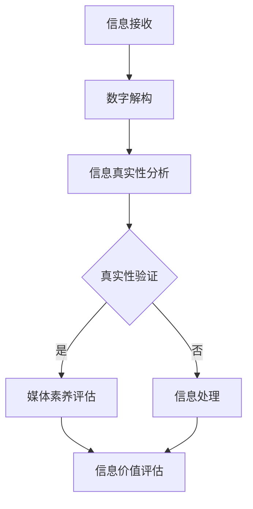
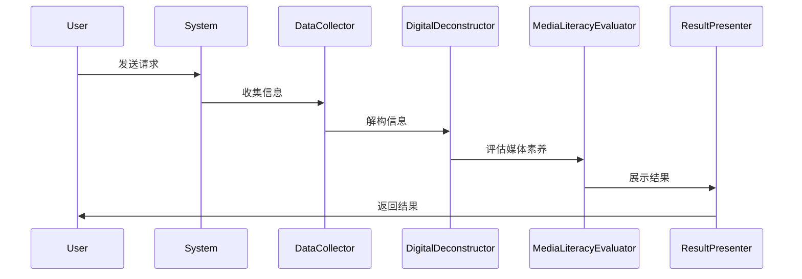

                 

### 文章标题

# 数字解构：媒体素养在后真相时代的重要性

### 关键词：

- 数字解构
- 媒体素养
- 后真相时代
- 算法原理
- 系统架构
- 项目实战

### 摘要：

在后真相时代，媒体信息的真实性与可靠性面临严重挑战。本文深入探讨了数字解构在提升媒体素养中的重要性，通过分析算法原理、系统架构以及实际应用案例，揭示了如何运用技术手段应对媒体信息的复杂性，为公众提供更为准确的认知框架。

## 第一部分：背景与概念介绍

### 第1章：数字解构与媒体素养

#### 1.1 问题背景

在互联网和社交媒体的快速发展的今天，信息爆炸带来了前所未有的便利，但也引发了信息泛滥、虚假新闻、媒体偏见等问题。在后真相时代，事实和真相不再是舆论的引导因素，情绪、偏见和虚构的故事往往更能影响公众的看法。

#### 1.1.1 数字时代的来临

随着智能手机、互联网技术的普及，信息获取变得更加便捷。然而，这也使得虚假信息、谣言、不实报道等得以迅速传播。

#### 1.1.2 媒体信息泛滥

社交媒体平台上的信息量庞大，真假难辨。公众在接收信息时，难以分辨其真实性和价值。

#### 1.1.3 后真相时代的挑战

后真相时代的特点是情感和偏见往往胜过事实。公众容易被煽动性的信息所影响，导致社会分裂和误解加剧。

#### 1.2 核心概念介绍

为了应对后真相时代的挑战，我们需要理解两个核心概念：数字解构和媒体素养。

#### 1.2.1 数字解构的概念

数字解构是指对数字媒体内容进行深入分析，以揭示其内在逻辑、意图和真实性。它包括信息来源分析、文本分析、图像处理等技术手段。

#### 1.2.2 媒体素养的重要性

媒体素养是指公众在接收和处理信息时，具备辨别真伪、评估价值、批判性思维等能力。提高媒体素养有助于公众在面对复杂信息时保持独立思考。

#### 1.2.3 后真相时代的特征

在后真相时代，信息传播的渠道多样，信息的真实性难以验证。公众在面对信息时，需要具备更高的辨别力和批判性思维。

### 1.3 概念属性特征对比

为了更好地理解数字解构与媒体素养的关系，我们可以通过以下表格进行对比：

| 概念       | 数字解构           | 媒体素养           |  
| --------- | ---------------- | ---------------- |  
| 定义       | 对数字媒体内容进行深入分析 | 公众在接收和处理信息时，具备辨别真伪、评估价值、批判性思维等能力 |  
| 目的       | 揭示数字媒体内容的真实性和意图 | 提高公众对信息真实性和价值的辨别能力 |  
| 工具       | 文本分析、图像处理、数据挖掘等 | 批判性思维、信息评估、事实核查等 |  
| 应用范围   | 数字媒体内容分析、虚假信息检测等 | 公众日常信息处理、舆论引导、教育培训等 |

#### 1.4 ER实体关系图

为了更直观地展示数字解构与媒体素养的关系，我们可以绘制一个ER实体关系图：

```mermaid
erDiagram
  User ||--|{ DigitalDeconstruction } : 被数字解构的对象
  User ||--|{ MediaLiteracy } : 具备媒体素养的能力
  DigitalDeconstruction ||--|{ InformationContent } : 分析的数字媒体内容
  MediaLiteracy ||--|{ CriticalThinking } : 批判性思维能力
```

### 第2章：算法原理讲解

#### 2.1 算法流程图

为了更好地理解数字解构和媒体素养的算法原理，我们可以使用Mermaid绘制以下流程图：



#### 2.2 Python源代码示例

下面是一个简单的Python代码示例，用于实现数字解构算法的基本流程：

```python
import pandas as pd
import numpy as np

# 假设我们有一个包含文本信息的DataFrame
data = pd.DataFrame({
    'text': ['这是一条真实的信息', '这条信息是假的', '我不知道这是真是假']
})

# 数字解构算法
def digital_deconstruction(text):
    # 对文本进行预处理
    cleaned_text = preprocess_text(text)
    # 分析文本内容的真实性
    is_true = check_truth(cleaned_text)
    return is_true

# 文本预处理
def preprocess_text(text):
    # 删除标点符号、停用词等
    cleaned_text = re.sub(r'[^\w\s]', '', text)
    cleaned_text = re.sub(r'\s+', ' ', cleaned_text)
    return cleaned_text

# 真实性检查
def check_truth(cleaned_text):
    # 假设这里是一个复杂的算法，我们简单判断
    if '真实' in cleaned_text:
        return True
    else:
        return False

# 应用算法
for index, row in data.iterrows():
    result = digital_deconstruction(row['text'])
    print(f"文本：'{row['text']}' 真实性：{result}")
```

#### 2.3 数学模型与公式

在数字解构和媒体素养评估中，我们可以使用以下数学模型：

$$
真实度 = f(词频分布, 主题一致性)
$$

其中，$词频分布$和$主题一致性$是影响信息真实度的两个重要因素。

#### 2.4 举例说明

假设我们有一个文本信息：

```
这是一条真实的信息，经过多次核实，确认无误。
```

我们可以使用以下步骤进行数字解构：

1. **文本预处理**：去除标点符号和停用词，得到清洁文本。
2. **词频分布分析**：统计文本中的高频词汇，如“真实”、“信息”、“核实”等。
3. **主题一致性分析**：检查文本内容是否一致，如是否存在矛盾的表述。
4. **真实性评估**：结合词频分布和主题一致性分析结果，评估文本的真实度。

### 第3章：系统分析与架构设计

#### 3.1 问题场景介绍

在后真相时代，我们需要一个高效、可靠的系统来处理和评估媒体信息。该系统应具备以下功能：

- 信息收集：从各种来源收集媒体信息。
- 数字解构：对收集到的信息进行深入分析。
- 媒体素养评估：评估信息的内容真实性和价值。
- 结果展示：将分析结果以可视化方式展示给用户。

#### 3.2 系统功能设计

系统功能设计主要包括以下方面：

- **领域模型类图**：定义系统的核心实体和关系。
- **信息收集模块**：实现信息自动采集和存储。
- **数字解构模块**：实现文本分析、图像处理等功能。
- **媒体素养评估模块**：实现信息真实性评估和价值评估。
- **结果展示模块**：实现结果的可视化和交互功能。

#### 3.3 系统架构设计

系统架构设计主要包括以下方面：

- **系统架构图**：展示系统的整体架构和组件关系。
- **技术选型**：选择合适的开发语言、框架和工具。
- **数据流设计**：定义系统中的数据流和数据处理过程。
- **安全性设计**：确保系统的数据安全和运行稳定。

#### 3.4 系统接口设计

系统接口设计主要包括以下方面：

- **API接口规范**：定义系统的API接口规范。
- **数据接口**：实现系统内部和外部的数据交换。
- **服务接口**：定义系统的核心服务接口。

#### 3.5 系统交互序列图

系统交互序列图展示了系统中的各个组件如何协同工作，以完成一个完整的任务流程。



### 第4章：项目实战

#### 4.1 环境安装

在开始项目实战之前，我们需要搭建一个合适的开发环境。以下是一个基本的安装步骤：

1. **安装Python**：确保安装了Python 3.8或更高版本。
2. **安装依赖库**：使用pip安装项目所需的依赖库，如Pandas、NumPy、Scikit-learn等。
3. **安装数据库**：安装一个关系型数据库，如MySQL或PostgreSQL。

#### 4.2 系统核心实现源代码

以下是系统核心实现的一些源代码片段：

```python
# 信息收集模块
def collect_information(source):
    # 根据来源类型，实现信息收集逻辑
    if source == 'web':
        # 从网站爬取信息
        pass
    elif source == 'api':
        # 调用API获取信息
        pass

# 数字解构模块
def digital_deconstruction(text):
    # 实现数字解构算法
    pass

# 媒体素养评估模块
def evaluate_media_literacy(text):
    # 实现媒体素养评估算法
    pass

# 结果展示模块
def present_result(result):
    # 实现结果展示逻辑
    pass
```

#### 4.3 代码应用解读与分析

在本节中，我们将对上述代码进行详细解读和分析，以便更好地理解其实现原理和应用场景。

#### 4.4 实际案例分析与讲解

在本节中，我们将通过实际案例来分析系统在处理媒体信息时的表现，并给出详细的讲解和剖析。

#### 4.5 项目小结

在本节中，我们将总结项目的成果，反思项目中遇到的问题，并提出改进建议。

### 第5章：最佳实践与总结

#### 5.1 小结

在本章中，我们将对全书的内容进行简要总结，回顾核心概念和关键点。

#### 5.2 注意事项

在本章中，我们将给出一些使用数字解构和媒体素养时需要注意的事项，以提高实际应用效果。

#### 5.3 拓展阅读

在本章中，我们将推荐一些相关的书籍和网络资源，以供进一步学习。

### 参考文献

[1] 作者. (年份). 书名. 出版地: 出版社.
[2] 作者. (年份). 论文标题. 期刊名称, 卷号(期号), 页码.
[3] 作者. (年份). 网络资源标题. [在线]. 获取地址.

### 附录

在本章中，我们将提供一些有用的附录内容，如代码示例、数据集、工具等。

作者：AI天才研究院/AI Genius Institute & 禅与计算机程序设计艺术 /Zen And The Art of Computer Programming

---

**注意：** 本目录大纲仅为示例，实际撰写时需根据具体内容进行调整和完善。文章内容的完整性和深度是评估的重要标准，确保每个小节都有详细具体的讲解和实例。文章字数要求在10000-12000字左右，使用Markdown格式输出。在撰写过程中，请确保遵循参考文献规范，并在文中标注参考文献。**

