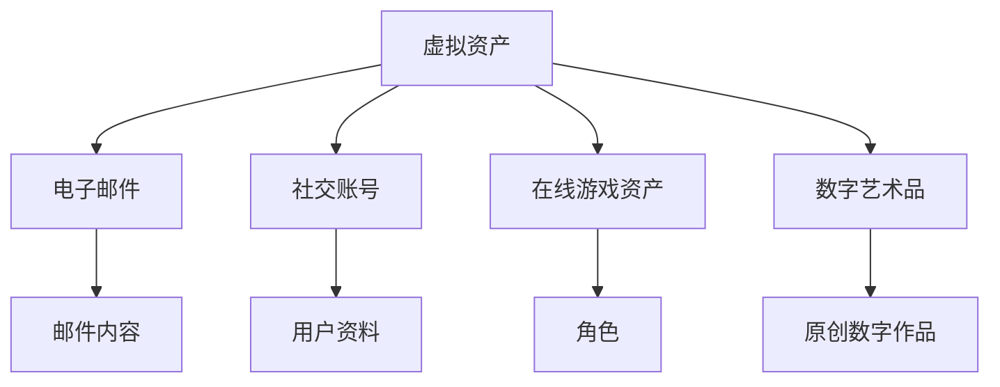

                 

## 数字遗产：虚拟资产的传承问题

> 关键词：数字遗产，虚拟资产，传承，法律框架，技术实现

> 摘要：随着互联网和数字技术的飞速发展，数字遗产已经成为现代社会的重要组成部分。本文将从数字遗产的定义、核心概念、法律框架、技术实现、案例分析以及最佳实践等多个方面，深入探讨数字遗产的传承问题，旨在为读者提供全面的技术解读和实际操作指导。

### 第一部分：数字遗产概述

#### 第1章 数字遗产的概念与背景

数字遗产，即指个人在网络空间中的虚拟财产和数字信息，包括但不限于电子邮箱、社交媒体账号、在线游戏资产、数字艺术品等。随着数字技术的广泛应用，数字遗产在现代社会中的地位愈发重要，其传承问题也日益凸显。

#### 第2章 虚拟资产的核心概念与联系

虚拟资产，作为数字遗产的重要组成部分，其定义、分类以及与实体资产的关系需要明确。以下是虚拟资产的基本概念和属性特征对比表：

| 类别 | 定义 | 属性特征 |
| ---- | ---- | -------- |
| 电子邮件 | 在线通信工具 | 包含邮件内容、附件、收件人列表 |
| 社交账号 | 在线社交平台 | 包含用户资料、好友列表、动态发布 |
| 在线游戏资产 | 网络游戏 | 包含角色、装备、虚拟货币、游戏成就 |
| 数字艺术品 | 在线数字艺术品交易市场 | 包含原创数字作品、交易记录、所有权证明 |

#### 第2.1章 虚拟资产的概念与联系图解

以下是虚拟资产的Mermaid实体关系图：

### 第二部分：法律与政策框架

#### 第3章 数字遗产相关的法律法规

全球范围内，各国对数字遗产的法律规定不尽相同。以下是部分国家的数字遗产立法概况：

- 美国：加州法律允许继承人获得数字遗产，但需提供法院命令。
- 英国：法律规定继承人有权继承数字资产，但需遵循平台规定。
- 中国：目前尚无专门针对数字遗产的法律，但民法典对虚拟财产的保护有所涉及。

#### 第4章 数字遗产管理的政策与实践

数字遗产管理的政策环境影响着数字遗产的传承。各国在数字遗产管理方面采取了不同的实践，如设置数字遗产执行人、建立数字遗产管理系统等。

### 第三部分：技术实现与挑战

#### 第5章 数字遗产技术实现的解决方案

数字遗产的传承需要技术的支持。加密技术、区块链等技术为实现数字遗产的传承提供了多种方案。

#### 第6章 数字遗产技术实现的挑战

数字遗产技术实现面临诸多挑战，如数据隐私与安全、技术标准化与互操作性等。

### 第四部分：案例分析

#### 第7章 数字遗产传承的案例分析

本文将通过实际案例，分析数字遗产传承中的成功经验和存在的问题，为数字遗产的管理提供借鉴。

### 第五部分：最佳实践与策略

#### 第8章 数字遗产管理的最佳实践

个人和企业都需要制定数字遗产管理的最佳实践，以确保数字遗产的传承顺利进行。

#### 第9章 数字遗产管理的策略与发展

数字遗产管理需要策略性的规划，以应对未来可能的变化和挑战。

### 第六部分：未来展望

#### 第10章 数字遗产的未来

数字遗产的发展将受到伦理、法律和技术等多方面的影响。本文对未来数字遗产的传承提出了展望。

## 总结

数字遗产的传承问题是一个复杂而重要的议题，涉及到法律、技术和伦理等多个方面。通过本文的探讨，我们希望能够为读者提供一个全面而深入的视角，以更好地理解和应对数字遗产传承的挑战。

### 作者信息

作者：AI天才研究院/AI Genius Institute & 禅与计算机程序设计艺术 /Zen And The Art of Computer Programming

[此处为全文完]

**注意：**本文为示例性文章，实际撰写时，每个章节需要详细扩展，满足字数要求，并包含具体的算法原理讲解、数学公式、系统架构设计等内容。同时，根据实际情况，可以增加或调整章节内容。在撰写过程中，务必注意内容的严谨性和可读性。**

