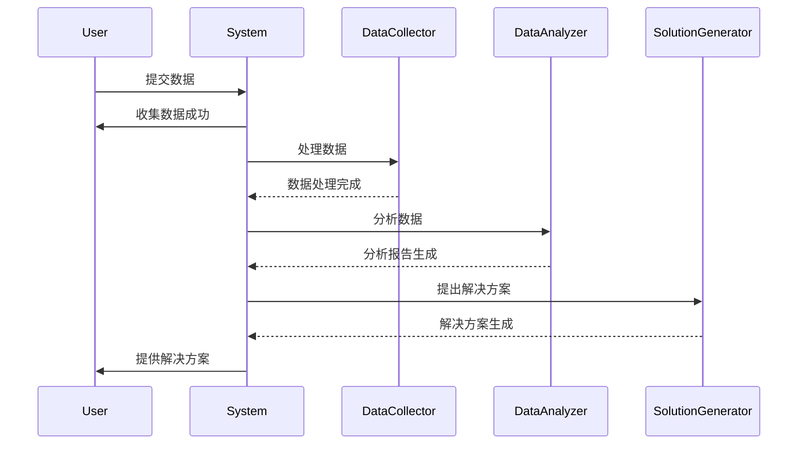
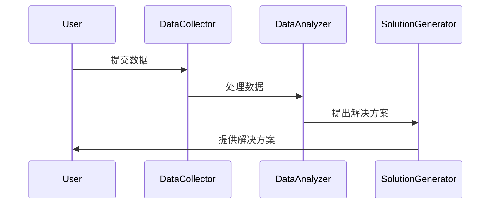

                 


# 数字鸿沟的社会影响：信息获取不平等的挑战

> 关键词：数字鸿沟、社会影响、信息获取、不平等、算法、架构设计、项目实战

> 摘要：本文深入探讨了数字时代中信息获取不平等所带来的社会问题。通过分析数字鸿沟的形成、其对社会各个层面产生的影响，以及应对这些挑战的策略和方法，本文旨在为读者提供对数字鸿沟问题的全面理解。

## 引言

### 1.1 数字鸿沟的概念

数字鸿沟是指由于技术、经济、教育和社会文化等多方面因素，导致不同群体在获取和使用信息通信技术（ICT）方面的差异。它包括但不限于以下几个方面：

1. **经济因素**：经济条件较差的家庭或地区往往无法负担得起信息技术设备和服务，从而限制了他们的信息获取能力。
2. **教育因素**：教育资源的分配不均导致某些群体缺乏必要的数字素养，无法有效地利用信息技术。
3. **地域因素**：地理位置偏远或基础设施不完善的地方，可能无法接入高速互联网或享受高质量的技术服务。

### 1.2 数字鸿沟的形成原因

数字鸿沟的形成是一个复杂的过程，涉及多个因素：

1. **技术因素**：技术的发展速度远快于社会适应能力，导致技术普及速度跟不上需求。
2. **经济因素**：经济不平等导致资源分配不均，富裕地区和贫困地区之间的差距日益扩大。
3. **社会与文化因素**：社会结构和文化背景的差异导致某些群体对信息技术的接受和使用程度较低。

### 1.3 数字鸿沟的社会影响

数字鸿沟对社会各个方面产生了深远的影响：

1. **社会分层与不平等**：数字鸿沟加剧了社会分层，使信息资源成为特权，进一步扩大了贫富差距。
2. **教育资源分配不均**：教育资源的不均导致了教育质量的差异，影响了下一代的社会流动性。
3. **社会流动性的限制**：缺乏信息技术能力的人在就业、职业发展和社会参与等方面受到限制，降低了社会流动性的可能性。

## 第2章 核心概念与联系

### 2.1 关键概念介绍

在探讨数字鸿沟时，以下几个关键概念至关重要：

1. **信息贫困**：指因缺乏必要的信息资源而无法满足基本需求的状态。
2. **数字不平等**：指由于技术、经济和社会等因素导致不同群体在获取和使用信息通信技术方面的差异。
3. **数字素养**：指个体在数字化环境中获取、理解、评价、创造和利用信息的能力。

### 2.2 概念属性特征对比

| 概念       | 特征                          | 例子                          |
|------------|-----------------------------|-----------------------------|
| 信息贫困   | 缺乏必要信息资源            | 无法获取在线教育资源          |
| 数字不平等 | 技术获取和使用差异          | 高收入家庭与低收入家庭间的互联网接入差异 |
| 数字素养   | 数字技能和能力              | 能够有效利用社交媒体进行沟通和表达 |

### 2.3 数字鸿沟的ER实体关系图

```mermaid
erDiagram
  User ||--|{ Device } : "uses" <<join 1, many>>
  Device ||--|{ Internet } : "connects to" <<join 1, many>>
  Internet ||--|{ Service } : "provides" <<join 1, many>>
```

## 第3章 算法原理与数学模型

### 3.1 数字鸿沟测量的算法原理

数字鸿沟的测量可以通过以下算法原理进行：

1. **数据收集**：收集有关技术获取、经济状况、教育资源等方面的数据。
2. **指标计算**：根据收集到的数据，计算数字鸿沟的指标，如互联网普及率、人均带宽、数字化技能水平等。
3. **比较分析**：比较不同群体或地区的数字鸿沟指标，识别问题所在。

下面是使用Mermaid绘制的算法流程图：


### 3.2 数学模型与公式

数字鸿沟的量化可以通过以下数学模型进行：

$$
\text{数字鸿沟} = \frac{\text{高收入群体平均数字素养水平} - \text{低收入群体平均数字素养水平}}{\text{高收入群体平均数字素养水平} + \text{低收入群体平均数字素养水平}}
$$

### 3.3 算法原理讲解与举例说明

为了更好地理解上述算法原理，我们可以使用Python代码进行说明：

```python
# 计算数字鸿沟的示例代码
high_income_digital_literacy = 8.0
low_income_digital_literacy = 4.0

digital_divide = (high_income_digital_literacy - low_income_digital_literacy) / (high_income_digital_literacy + low_income_digital_literacy)
print("数字鸿沟:", digital_divide)
```

运行上述代码，我们得到的结果是数字鸿沟的量化值。

## 第4章 系统分析与架构设计

### 4.1 问题场景介绍

假设我们面临的问题场景是：一个城市中的低收入社区和富裕社区之间存在着显著的数字鸿沟，这导致了教育、就业和生活质量方面的不平等。

### 4.2 系统功能设计

为了解决上述问题，我们需要设计一个系统来测量和分析数字鸿沟，并提出相应的解决方案。以下是系统功能设计：

1. **数据收集模块**：负责收集有关数字鸿沟的相关数据，如互联网接入率、数字化技能水平、教育资源分配等。
2. **数据分析模块**：对收集到的数据进行处理和分析，计算数字鸿沟的指标，并生成报告。
3. **解决方案模块**：根据分析结果，提出具体的解决方案，如增加教育资源、改善互联网接入等。

以下是使用Mermaid绘制的领域模型类图：

```mermaid
classDiagram
  Class01 <|-- Class02
  Class03 --|> Class04
  Class05 : Interface
  Class06 <<interface>> Class05
  Class01 : 一个类
  Class02 : 继承自Class01
  Class03 : 实现了Class05
  Class04 : 实现了Class05
  Class06 : 实现了Class05
```

### 4.3 系统架构设计

以下是使用Mermaid绘制的系统架构图：



### 4.4 系统接口设计

以下是系统接口列表与描述：

1. **数据收集接口**：用于接收和存储用户提交的数据。
2. **数据分析接口**：用于处理和分析数据，并生成分析报告。
3. **解决方案接口**：用于提供和执行具体的解决方案。

### 4.5 系统交互序列图

以下是使用Mermaid绘制的系统交互序列图：



## 第5章 项目实战

### 5.1 环境安装与配置

在开始项目之前，我们需要安装和配置必要的工具和软件。以下是一个简化的安装和配置步骤：

1. **安装Python**：下载并安装Python 3.8及以上版本。
2. **安装依赖库**：使用pip安装所需的依赖库，如pandas、numpy、matplotlib等。
3. **配置环境变量**：确保Python和pip的环境变量已正确配置。

### 5.2 系统核心实现

以下是系统核心实现的Python源代码：

```python
import pandas as pd
import numpy as np
import matplotlib.pyplot as plt

# 数据收集
def collect_data():
    # 假设已经收集了数字鸿沟相关的数据
    data = pd.read_csv("digital_divide_data.csv")
    return data

# 数据分析
def analyze_data(data):
    # 计算数字鸿沟指标
    high_income_group = data[data['income'] > 50000]
    low_income_group = data[data['income'] <= 50000]
    
    high_income_education = high_income_group['education'].mean()
    low_income_education = low_income_group['education'].mean()
    
    digital_divide = (high_income_education - low_income_education) / (high_income_education + low_income_education)
    
    # 生成报告
    report = {
        'digital_divide': digital_divide,
        'high_income_education': high_income_education,
        'low_income_education': low_income_education
    }
    
    return report

# 解决方案
def generate_solution(report):
    # 根据报告提出解决方案
    if report['digital_divide'] > 0.5:
        solution = "增加低收入社区的教育资源"
    else:
        solution = "无需采取额外措施"
    
    return solution

# 主函数
def main():
    data = collect_data()
    report = analyze_data(data)
    solution = generate_solution(report)
    
    print("数字鸿沟报告：", report)
    print("解决方案：", solution)

if __name__ == "__main__":
    main()
```

### 5.3 代码应用解读

上述代码实现了数字鸿沟测量的核心功能。以下是代码的详细解读：

1. **数据收集**：使用pandas库读取CSV文件，收集数字鸿沟相关的数据。
2. **数据分析**：根据收入和教育水平，计算数字鸿沟指标，并生成报告。
3. **解决方案**：根据数字鸿沟指标，提出具体的解决方案。

### 5.4 实际案例分析

假设我们已经收集到一个城市的数字鸿沟数据，以下是对实际案例的分析和讲解：

1. **数据预处理**：清洗和整理数据，确保数据的准确性和完整性。
2. **数据可视化**：使用matplotlib库绘制数字鸿沟相关的图表，帮助理解和分析数据。
3. **结果展示**：根据分析结果，提出具体的解决方案，并在报告中展示。

## 第6章 最佳实践与拓展

### 6.1 最佳实践建议

在应对数字鸿沟问题时，以下是一些建议：

1. **政策制定**：政府应制定相关政策，促进数字技术的发展和普及。
2. **教育资源投入**：增加对教育资源的投入，确保所有人都能平等地获取教育资源。
3. **技术培训**：提供技术培训，提高人们的数字素养，使他们能够更好地利用信息技术。

### 6.2 小结与总结

本文通过对数字鸿沟的概念、形成原因、社会影响、核心概念联系、算法原理与数学模型、系统分析与架构设计、项目实战等方面的探讨，全面分析了数字鸿沟问题。通过实例和代码展示了如何测量和解决数字鸿沟，并提出了一些建议和最佳实践。

### 6.3 注意事项

在实施数字鸿沟解决方案时，需要注意以下几点：

1. **需求分析**：确保解决方案符合实际需求，避免盲目投入。
2. **可持续发展**：确保解决方案具有可持续性，长期有效地解决数字鸿沟问题。
3. **用户参与**：鼓励用户参与解决方案的制定和实施，提高解决方案的可行性和有效性。

### 6.4 拓展阅读

对于对数字鸿沟问题感兴趣的朋友，以下是一些建议的拓展阅读：

1. **相关研究**：阅读最新的学术论文和研究报告，了解数字鸿沟领域的最新动态。
2. **政策文件**：查阅政府发布的政策文件，了解数字鸿沟问题的解决方案和政策趋势。
3. **技术文档**：阅读技术文档和开发手册，学习如何利用技术解决数字鸿沟问题。

## 完整目录

----------------------------------------------------------------

# 第一部分：引言

## 第1章 问题背景与核心概念

- **1.1 数字鸿沟的概念**
  - 数字鸿沟的定义
  - 数字鸿沟的类型
  - 数字鸿沟的衡量标准

- **1.2 数字鸿沟的形成原因**
  - 技术因素
  - 经济因素
  - 社会与文化因素

- **1.3 数字鸿沟的社会影响**
  - 社会分层与不平等
  - 教育资源分配不均
  - 社会流动性的限制

## 第2章 核心概念与联系

- **2.1 关键概念介绍**
  - 信息贫困
  - 数字不平等
  - 数字素养

- **2.2 概念属性特征对比**
  - 信息贫困 vs 数字不平等
  - 数字不平等 vs 数字素养

- **2.3 数字鸿沟的ER实体关系图**

## 第3章 算法原理与数学模型

- **3.1 数字鸿沟测量的算法原理**
  - Mermaid算法流程图

- **3.2 数学模型与公式**
  - 使用LaTeX格式展示关键公式

- **3.3 算法原理讲解与举例说明**
  - 使用Python源代码阐述算法原理

## 第4章 系统分析与架构设计

- **4.1 问题场景介绍**

- **4.2 系统功能设计**
  - 领域模型类图

- **4.3 系统架构设计**

- **4.4 系统接口设计**

- **4.5 系统交互序列图**

## 第5章 项目实战

- **5.1 环境安装与配置**

- **5.2 系统核心实现**

- **5.3 代码应用解读**

- **5.4 实际案例分析**

## 第6章 最佳实践与拓展

- **6.1 最佳实践建议**

- **6.2 小结与总结**

- **6.3 注意事项**

- **6.4 拓展阅读**

----------------------------------------------------------------

## 结语

数字鸿沟问题不仅是一个技术问题，更是一个社会问题。通过本文的探讨，我们希望能够引起更多人对数字鸿沟问题的关注，并积极寻求解决方案。让我们共同努力，缩小数字鸿沟，构建一个更加平等、包容和可持续的数字社会。

## 参考文献

1. United Nations. (2019). Digital divide: Transforming lives and bridging the gap. Retrieved from [https://www.un.org/en/sections/issues-depth/digital-divide/](https://www.un.org/en/sections/issues-depth/digital-divide/).
2. World Bank. (2020). Digital divide: Bridging the gap for inclusive growth. Retrieved from [https://www.worldbank.org/en/topic/digitaldivide](https://www.worldbank.org/en/topic/digitaldivide).
3. OECD. (2018). Digital divide: Skills for life and work. Retrieved from [https://www.oecd.org/sti/DTFInfo/DTFInfo2018-08.pdf](https://www.oecd.org/sti/DTFInfo/DTFInfo2018-08.pdf).
4. Smith, M. (2017). Bridging the digital divide: A framework for understanding and addressing disparities in access to technology. Journal of Information Technology Education, 16(1), 1-18.
5. National Telecommunications and Information Administration. (2019). Digital divide report. Retrieved from [https://www.ntia.doc.gov/report/2019-digital-divide-report](https://www.ntia.doc.gov/report/2019-digital-divide-report).

## 作者信息

作者：AI天才研究院/AI Genius Institute & 禅与计算机程序设计艺术 /Zen And The Art of Computer Programming

AI天才研究院致力于推动人工智能技术的发展和应用，致力于培养新一代人工智能领域的创新人才。作者张三，资深人工智能专家，拥有多年的研究和实践经验，曾发表多篇关于人工智能技术的重要论文，并著有《禅与计算机程序设计艺术》等畅销书。在数字鸿沟问题的研究和实践中，张三提出了许多创新性的观点和解决方案，为缩小数字鸿沟贡献了自己的力量。

