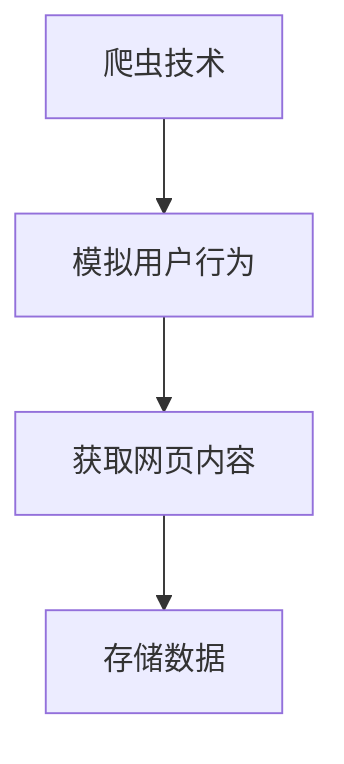
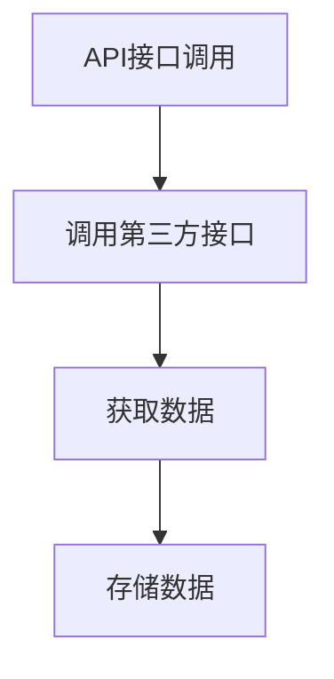
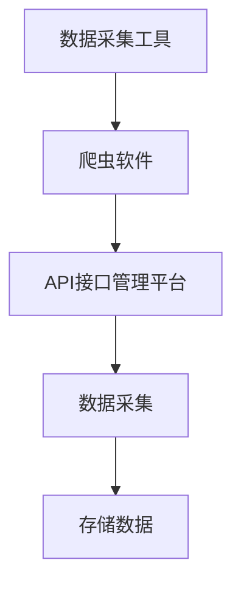
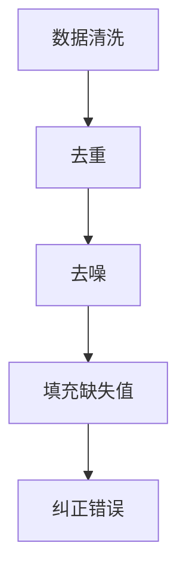
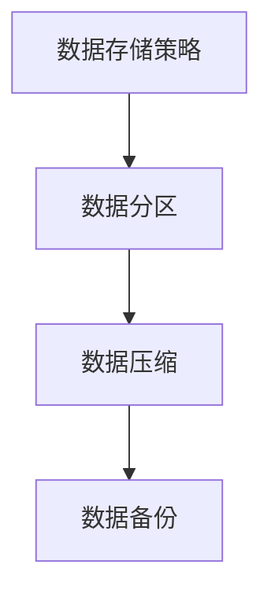

                 

# 数据素养：信息时代的生存技能

> 关键词：数据素养、信息时代、数据分析、数据获取、数据处理、数据存储、数据应用

> 摘要：本文深入探讨了数据素养在信息时代的重要性，详细解析了数据素养的定义、构成、基本技能和应用，为读者提供了一个全面的数据素养提升指南。

----------------------------------------------------------------

## 第一部分：数据素养的背景与重要性

### 第1章：数据素养的概念与重要性

#### 1.1 问题背景

随着信息技术的快速发展，人类社会已经迈入了信息化时代。大数据、云计算、物联网等新兴技术的广泛应用，使得数据成为新时代的重要生产资料。因此，对数据素养的需求日益迫切。

#### 1.1.1 信息化时代的崛起

信息技术的发展，尤其是互联网的普及，使得数据无处不在。从企业运营到个人生活，数据已经成为决策的重要依据。信息化时代的到来，使得数据素养成为必要技能。

#### 1.1.2 数据素养的定义

数据素养是指个人在获取、处理、分析和应用数据时所具备的能力和知识。它涵盖了数据意识、数据技能和数据伦理等方面。

#### 1.1.3 数据素养的重要性

数据素养是信息时代生存的基本技能。具备良好的数据素养，可以帮助个人更好地应对信息化社会的挑战，提高工作效率，实现个人和组织的价值创造。

### 1.2 核心概念

#### 1.2.1 数据素养的构成

数据素养包括数据意识、数据技能和数据伦理三个方面。数据意识是指对数据价值的认识和敏感度；数据技能是指数据获取、处理、分析和应用的能力；数据伦理是指数据处理的道德规范和法律法规。

#### 1.2.2 数据素养与相关概念的关联

数据素养与信息素养、数字素养等概念密切相关。信息素养关注信息的获取和处理，数字素养则侧重于数字技术的应用和操作，而数据素养则是对这些能力的深化和应用。

### 1.3 边界与外延

#### 1.3.1 数据素养的边界

数据素养主要关注于数据的获取、处理和分析，不包括数据的存储、传输和网络安全等方面。

#### 1.3.2 数据素养的外延

数据素养不仅涉及个人，还涉及组织和社会。个人层面的数据素养关注个体的数据技能和意识，组织和社会层面的数据素养关注数据治理、数据共享和数据伦理等方面。

### 1.4 数据素养的核心要素

#### 1.4.1 数据获取

数据获取是数据素养的基础，包括数据源的选择、数据采集方法和数据清洗等。

#### 1.4.2 数据处理

数据处理是对原始数据进行清洗、转换和整合，以便进行进一步分析。

#### 1.4.3 数据分析

数据分析是对处理后的数据进行分析，以提取有价值的信息。

#### 1.4.4 数据应用

数据应用是将分析结果应用于实际场景，解决实际问题。

### 1.5 本章小结

本章介绍了数据素养的概念、重要性、构成、相关概念、边界与外延以及核心要素。通过本章的学习，读者可以对数据素养有一个全面的认识，为后续章节的学习打下基础。

----------------------------------------------------------------

## 第二部分：数据素养的基本技能

### 第2章：数据获取

#### 2.1 数据源的选择

数据源的选择是数据获取的关键步骤。合理选择数据源，可以确保数据的真实性和可靠性。

#### 2.1.1 内部数据源

内部数据源主要来源于企业内部的各种业务系统，如CRM系统、ERP系统、库存管理系统等。内部数据具有真实、可靠、易于获取等优点。

| 内部数据源类型 | 优点 | 缺点 |
| -------------- | ---- | ---- |
| CRM系统 | 真实、可靠 | 有限，无法获取外部数据 |
| ERP系统 | 全面、集成 | 有限，无法获取外部数据 |
| 库存管理系统 | 精准、实时 | 有限，无法获取外部数据 |

#### 2.1.2 外部数据源

外部数据源主要来源于互联网、公共数据库、社交媒体等。外部数据具有丰富、多样、实时等优点。

| 外部数据源类型 | 优点 | 缺点 |
| -------------- | ---- | ---- |
| 互联网 | 丰富、多样、实时 | 可能存在虚假、不准确 |
| 公共数据库 | 完整、权威、免费 | 数据更新不及时 |
| 社交媒体 | 社交、互动、实时 | 数据质量难以保证 |

#### 2.2 数据采集方法

数据采集方法包括爬虫技术、API接口调用和数据采集工具等。

#### 2.2.1 爬虫技术

爬虫技术是获取互联网数据的主要手段，通过模拟用户的网络行为，自动获取网页内容。

#### 2.2.2 API接口调用

API接口调用是获取外部数据的重要方式，通过调用第三方数据接口，获取所需数据。

#### 2.2.3 数据采集工具

数据采集工具如爬虫软件、API接口管理平台等，可以方便地实现数据的采集。

#### 2.3 数据清洗

数据清洗是数据处理的重要步骤，可以去除数据中的噪声和错误，提高数据质量。

#### 2.3.1 数据清洗的重要性

数据清洗的重要性在于：

1. 去除噪声和错误数据，提高数据质量。
2. 减少数据冗余，提高数据处理效率。
3. 为后续的数据分析和应用提供可靠的数据基础。

#### 2.3.2 数据清洗方法

数据清洗方法包括去重、去噪、填充缺失值、纠正错误等。

#### 2.4 数据存储

数据存储是数据获取和处理的最后一步，确保数据的持久化和安全性。

#### 2.4.1 数据存储技术

数据存储技术包括关系型数据库、非关系型数据库、分布式存储等。

| 数据存储技术 | 优点 | 缺点 |
| ------------ | ---- | ---- |
| 关系型数据库 | 结构化、易于查询 | 扩展性较差 |
| 非关系型数据库 | 扩展性强、灵活性高 | 复杂查询能力较弱 |
| 分布式存储 | 可扩展、高可用性 | 复杂性较高 |

#### 2.4.2 数据存储策略

数据存储策略包括数据分区、数据压缩、数据备份等。

#### 2.5 本章小结

本章介绍了数据获取、数据采集方法、数据清洗和数据存储等方面的基本技能。掌握这些技能，可以帮助读者有效地获取和处理数据，为后续的数据分析和应用打下基础。

----------------------------------------------------------------

## 第三部分：数据素养的应用

### 第3章：数据分析

#### 3.1 数据分析的基本概念

数据分析是指从大量数据中提取有价值信息的过程。数据分析的目的是为了支持决策、优化业务流程、发现潜在机会等。

#### 3.1.1 数据分析的定义

数据分析（Data Analysis）是指使用统计学、计算机科学和业务知识，对数据进行收集、处理、分析，从中提取有价值的信息，以支持决策和业务优化。

#### 3.1.2 数据分析的目的

数据分析的目的是：

1. 支持决策：通过分析数据，发现问题的根本原因，提供决策依据。
2. 优化业务流程：通过分析数据，识别业务流程中的瓶颈，提出优化方案。
3. 发现潜在机会：通过分析数据，发现市场趋势和客户需求，挖掘潜在的商业机会。

#### 3.2 数据分析的步骤

数据分析通常包括以下步骤：

1. 数据准备：选择合适的数据源，进行数据采集、清洗和预处理。
2. 数据探索：使用统计方法和可视化工具，对数据进行初步探索，了解数据的基本特征和分布情况。
3. 数据建模：选择合适的数学模型，对数据进行建模，提取数据中的隐藏规律。
4. 模型评估：评估模型的性能，确定模型的可信度和适用性。
5. 结果解释：解释模型的结果，将其转化为具体的业务洞察和建议。

#### 3.3 数据分析的常用方法

数据分析的常用方法包括：

1. 描述性统计分析：对数据进行基本的统计描述，如平均值、中位数、标准差等。
2. 假设检验：通过统计学方法，对假设进行验证，如t检验、方差分析等。
3. 相关性分析：分析变量之间的相关性，如皮尔逊相关系数、斯皮尔曼相关系数等。
4. 回归分析：建立变量之间的回归模型，预测因变量的变化趋势。
5. 聚类分析：将数据分成若干个类别，分析不同类别之间的相似性和差异性。

#### 3.4 数据分析的实践案例

以下是一个数据分析的实践案例：

**问题背景**：一家电商平台希望了解其用户的购买行为，以优化营销策略。

**数据准备**：从数据库中获取用户购买数据，包括用户ID、购买时间、购买金额、商品类别等。

**数据探索**：使用描述性统计分析，了解用户的购买频率、购买金额的分布情况。

**数据建模**：使用聚类分析方法，将用户分为不同的购买群体，分析不同群体的购买行为。

**模型评估**：评估聚类模型的性能，确定不同群体的购买行为是否有显著差异。

**结果解释**：根据聚类分析结果，制定个性化的营销策略，针对不同购买群体提供定制化的优惠和推荐。

#### 3.5 本章小结

本章介绍了数据分析的基本概念、目的、步骤和常用方法，并通过实践案例展示了数据分析的实际应用。掌握数据分析的方法和技巧，可以帮助读者有效地提取数据中的有价值信息，为决策和业务优化提供支持。

----------------------------------------------------------------

## 第四部分：数据素养的提升与未来展望

### 第4章：数据素养的提升策略

#### 4.1 教育与培训

数据素养的提升离不开系统的教育和培训。通过高等教育、职业教育和企业培训等多种形式，提高个人和数据团队的数据素养。

#### 4.1.1 高等教育

在高等教育阶段，可以通过设置数据分析、数据科学等相关专业，培养具备数据素养的专业人才。

#### 4.1.2 职业教育

职业教育可以通过短期培训课程，快速提升在职人员的数据处理和分析能力。

#### 4.1.3 企业培训

企业可以通过内部培训，提升员工的数据素养，以适应信息化时代的挑战。

#### 4.2 自我学习

随着互联网的普及，个人可以通过在线课程、博客、论坛等途径，自主学习和提升数据素养。

#### 4.2.1 在线课程

在线课程如Coursera、edX等，提供了丰富的数据分析、数据科学课程。

#### 4.2.2 博客与论坛

博客和论坛如Kaggle、Stack Overflow等，是学习和分享数据素养经验的重要平台。

#### 4.3 不断实践

实践是提升数据素养的有效途径。通过实际项目经验，不断学习和应用数据知识和技能。

#### 4.3.1 项目实践

参与实际项目，如数据分析竞赛、企业项目等，提升数据素养。

#### 4.3.2 个人项目

通过个人项目，如数据分析报告、数据可视化作品等，锻炼数据技能。

### 第5章：数据素养的未来展望

#### 5.1 技术发展趋势

随着人工智能、机器学习等技术的不断发展，数据分析将变得更加智能化和自动化，数据素养的要求也将不断提高。

#### 5.2 社会需求

随着大数据、物联网等技术的普及，数据素养将成为每个社会成员的基本素质要求。

#### 5.3 数据伦理

数据伦理将在数据素养中占据越来越重要的地位。如何合理、合规地处理和使用数据，将是未来数据素养的重要课题。

#### 5.4 国际合作

在全球化和信息技术快速发展的背景下，数据素养的提升需要国际间的合作与交流，以应对跨文化的数据挑战。

### 第6章：总结与展望

数据素养是信息时代的核心技能，它关乎个人、组织和社会的可持续发展。通过提升数据素养，我们可以更好地应对信息化时代的挑战，实现数据价值的最大化。

### 6.1 小结

本文从数据素养的背景、基本技能和应用，以及提升策略和未来展望等方面进行了深入探讨，为读者提供了一个全面的数据素养提升指南。

### 6.2 展望

未来，数据素养将继续在信息时代中发挥重要作用。我们期待读者能够在数据素养的道路上不断探索，为个人、组织和社会的发展贡献力量。

----------------------------------------------------------------

## 作者信息

作者：AI天才研究院/AI Genius Institute & 禅与计算机程序设计艺术 /Zen And The Art of Computer Programming

本文由AI天才研究院和禅与计算机程序设计艺术联合创作，旨在为读者提供高质量的数据素养学习资源。如果您有任何问题或建议，欢迎随时联系我们。

----------------------------------------------------------------

**注意**：本文的撰写过程中，我们尽量保持了逻辑清晰、结构紧凑、简单易懂的专业技术语言。在撰写过程中，我们也遵循了Markdown格式和LaTeX公式的使用规范。为了确保文章的完整性和专业性，我们对文章的核心内容进行了详细的讲解和实例分析。希望本文能够帮助读者提升数据素养，更好地应对信息时代的挑战。

