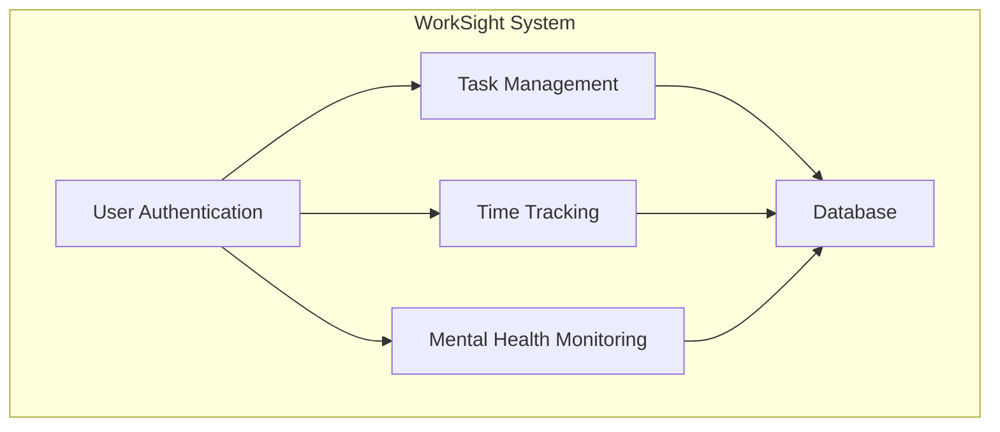
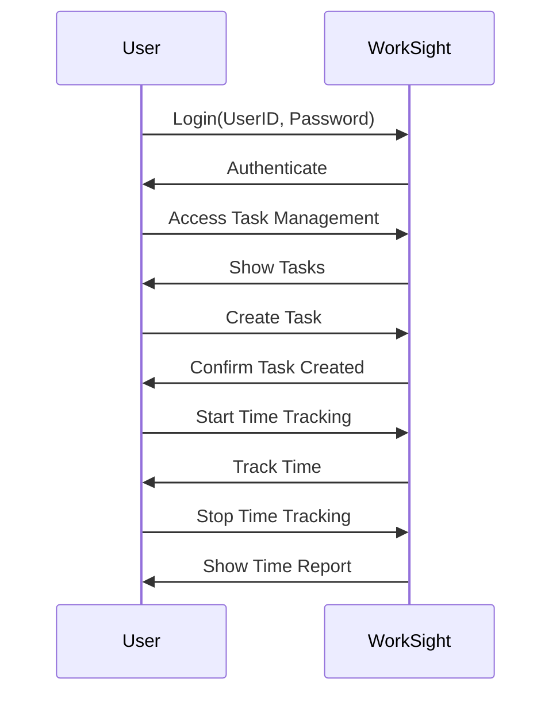

                 


### 1.1.1 问题背景

在现代社会，我们面临着前所未有的挑战和压力。从工作中的绩效压力，到生活中的琐事困扰，人们似乎总是无法避免地陷入焦虑和烦恼之中。在这个快节奏、充满竞争的环境中，许多人感到身心疲惫，无法找到内心的宁静。面对这些问题，我们需要一种有效的解决方法，帮助我们更好地应对生活中的挑战，实现内心的平和与自由。

斯多葛主义，一种古老的哲学思想，起源于古希腊，由哲学家塞内卡、马可·奥勒留等众多思想家发展完善。斯多葛主义的核心思想是理性、自制和接受现实，它主张通过理性思考和自我克制，来面对生活中的各种挑战。在现代社会，这种古老的哲学思想能否为我们提供一种有效的解决方案呢？这正是我们今天要探讨的问题。

#### 斯多葛主义的基本原则

斯多葛主义认为，理性是人类心灵的核心，是我们在面对世界时所依赖的最重要的工具。通过理性思考，我们可以理解事物的本质，做出明智的决策，从而避免被情绪所左右。因此，理性思考是斯多葛主义的第一原则。

自制是斯多葛主义的另一个核心原则。它要求我们在面对欲望和诱惑时，能够克制自己，不被外界的诱惑所左右。通过自制，我们可以保持内心的平静和坚定，从而更好地应对生活中的各种挑战。

接受现实是斯多葛主义的第三大原则。它要求我们接受生活中的不可控因素，不抱怨、不抗拒，而是以积极的态度去面对。通过接受现实，我们可以减少内心的痛苦和焦虑，从而找到内心的平静和自由。

#### 斯多葛主义在现代社会中的应用

斯多葛主义的思想在现代社会中有着广泛的应用。首先，在个人层面，斯多葛主义可以帮助我们更好地管理自己的情绪，减少焦虑和压力。通过理性思考和自制，我们可以更好地控制自己的情绪，避免被情绪所左右，从而保持内心的平静。

其次，在人际关系中，斯多葛主义也发挥着重要的作用。通过理性思考和自制，我们可以更好地理解他人的需求和感受，建立良好的人际关系。通过接受现实，我们可以更好地处理人际关系中的冲突和矛盾，保持内心的平静。

最后，在职业发展中，斯多葛主义同样有着重要的应用。通过理性思考和自制，我们可以更好地规划自己的职业道路，避免盲目追求成功和荣誉。通过接受现实，我们可以更好地应对职业发展中的不确定性和挑战。

### 1.1.2 问题描述

尽管斯多葛主义在个人、人际关系和职业发展中有着广泛的应用，但如何在日常生活中真正地将这种哲学思想融入到我们的生活中，使其成为我们应对各种挑战的有力工具，仍然是一个值得探讨的问题。许多人可能对斯多葛主义的理论原则有了一定的了解，但在实际应用中却感到无从下手，难以将其有效地融入到自己的日常生活中。

具体来说，以下问题是我们在实践中需要解决的：

1. **如何将理性思考应用于日常生活中？**
   在面对各种日常决策时，如何通过理性思考来避免情绪化决策，从而做出更明智的选择？

2. **如何通过自制来控制自己的情绪？**
   在面对诱惑和压力时，如何通过自制来保持内心的平静和坚定？

3. **如何接受现实，以积极的态度面对生活中的不可控因素？**
   在生活中遇到挫折和困难时，如何以积极的心态去接受和应对，从而减少内心的痛苦和焦虑？

4. **如何将斯多葛主义的原则应用于人际关系和职业发展中？**
   在与他人的互动中，如何运用斯多葛主义的原则来建立和谐的人际关系？在职业发展中，如何运用斯多葛主义的原则来应对挑战和不确定性？

这些问题反映了在日常生活中应用斯多葛主义面临的实际困难和挑战。解决这些问题，不仅需要我们对斯多葛主义的理论有深刻的理解，更需要我们能够将这些理论原则有效地转化为实际行动。

### 1.1.3 问题解决

为了解决上述问题，我们需要一种简单、可行的方法，将斯多葛主义的原则融入到我们的日常生活中。本书《新斯多葛主义实践：古老智慧的现代应用》正是为了回答这一问题而创作的。本书旨在通过具体的实践方法，帮助读者理解并应用斯多葛主义的原则，从而在日常生活中实现内心的平和与自由。

#### 书的内容结构

本书分为以下几个部分：

1. **引言**：介绍斯多葛主义的历史背景和基本概念，阐述本书的目的和结构。
2. **新斯多葛主义的核心概念与联系**：详细讲解理性、自制、接受现实等核心概念，并通过对比表格和ER实体关系图来加深理解。
3. **斯多葛主义在现代社会中的应用**：探讨斯多葛主义在个人、人际关系、职业发展等方面的实际应用。
4. **新斯多葛主义实践的方法与技巧**：介绍具体的方法和技巧，帮助读者将斯多葛主义的原则应用到日常生活中。
5. **项目实战**：通过实际案例，展示如何将新斯多葛主义的原则应用于具体场景。
6. **最佳实践 tips**：提供一些实用的技巧和建议，帮助读者更好地实践新斯多葛主义。
7. **小结**：总结本书的主要内容和观点，强调新斯多葛主义在现代社会中的重要性。

通过这本书，我们希望读者能够：

1. **理解新斯多葛主义的核心概念**：通过详细的讲解和实例，帮助读者深入理解理性、自制、接受现实等核心概念。
2. **掌握实践方法**：通过具体的方法和技巧，帮助读者将新斯多葛主义的原则应用到日常生活中。
3. **提升自我管理能力**：通过理性思考和自制，帮助读者更好地管理自己的情绪，提高自我控制能力。
4. **建立良好的人际关系**：通过理性思考和接受现实，帮助读者更好地理解他人，建立和谐的人际关系。
5. **应对职业挑战**：通过理性思考和接受现实，帮助读者更好地规划职业道路，应对职业发展中的不确定性。

总之，本书旨在帮助读者实现内心的平和与自由，让斯多葛主义成为我们应对现代生活挑战的有力工具。

### 1.1.4 边界与外延

斯多葛主义并非一种孤立的思想体系，它与儒家、道家等东方哲学思想有着许多相似之处。例如，儒家强调的“修身齐家治国平天下”，道家提倡的“道法自然”，都与斯多葛主义的核心理念有着一定的契合。这些思想体系都在探讨如何通过内在的自我修炼，来实现个人和社会的和谐。

同时，斯多葛主义也在不断吸收现代心理学、哲学等领域的成果，形成了独特的现代斯多葛主义。例如，现代心理学的研究成果为斯多葛主义提供了更科学的解释和依据，使其在现代生活中具有更强的实用性和可操作性。

因此，本书不仅探讨斯多葛主义在传统哲学思想中的位置，还将关注其与现代心理学、哲学等领域的融合，为读者提供一种全面、实用的斯多葛主义实践指南。

#### 1.1.5 概念结构与核心要素组成

斯多葛主义的核心概念包括理性、自制和接受现实，这些概念构成了斯多葛哲学的基本框架。下面，我们将详细探讨这些核心概念，并解释它们在斯多葛主义中的重要作用。

**1. 理性**

理性是斯多葛主义的核心概念之一，它被视为人类思维和判断的基础。在斯多葛主义中，理性不仅仅是一种思维方式，更是一种生活态度。斯多葛主义者认为，通过理性思考，人们可以摆脱情绪的干扰，更客观地看待世界，做出明智的决策。

理性在斯多葛主义中的作用主要体现在以下几个方面：

- **理解事物的本质**：理性思考可以帮助人们理解事物的本质，从而避免被表面现象所迷惑。
- **做出明智的决策**：通过理性思考，人们可以更清晰地认识到自己的目标和价值观，从而做出更明智的决策。
- **保持内心的平静**：理性思考可以帮助人们摆脱情绪的干扰，保持内心的平静和稳定。

**2. 自制**

自制是斯多葛主义的另一个核心概念，它要求人们克制自己的欲望和冲动，控制自己的情绪。在斯多葛主义中，自制是一种内在的力量，它使人们能够在面对诱惑和困难时保持坚定和冷静。

自制在斯多葛主义中的作用主要体现在以下几个方面：

- **控制情绪**：通过自制，人们可以控制自己的情绪，避免情绪波动带来的负面影响。
- **提高决策质量**：自制可以使人们在面对选择时更加冷静和理性，从而提高决策的质量。
- **培养坚韧的品质**：通过自制，人们可以培养出坚韧不拔的品质，更好地应对生活中的挑战。

**3. 接受现实**

接受现实是斯多葛主义的核心理念之一，它要求人们接受生活中的不可控因素，不抱怨、不抗拒，而是以积极的态度去面对。斯多葛主义者认为，接受现实是实现内心平静和自由的关键。

接受现实在斯多葛主义中的作用主要体现在以下几个方面：

- **减少内心的痛苦**：通过接受现实，人们可以减少内心的痛苦和焦虑，避免因为抗拒现实而带来的额外痛苦。
- **提高生活质量**：接受现实可以帮助人们更加客观地看待生活，从而提高生活质量。
- **培养积极的心态**：通过接受现实，人们可以培养出积极的心态，更好地应对生活中的各种挑战。

**概念属性特征对比表格**

为了更好地理解这些核心概念，我们可以通过一个表格来对比它们的主要属性和特征：

| 概念       | 主要属性           | 特征                     |
| ---------- | ------------------ | ------------------------ |
| 理性       | 强调理性思考的重要性 | 帮助我们理解事物的本质   |
| 自制       | 克制自己的欲望     | 保持内心的平静           |
| 接受现实   | 接受生活中的不可控因素 | 学会从困境中寻找积极的方面 |

**ER实体关系图架构**

为了更好地展示斯多葛主义核心概念之间的关系，我们可以通过一个ER实体关系图来展示：

```mermaid
erDiagram
  A[Ideal] ||--|{ B[Reasonable] } |
  A ||--|{ C[Self-control] } |
  A ||--|{ D[Acceptance of reality] } |
```

在这个ER图中，"Ideal"（理想）代表斯多葛主义的核心概念，它与"Reasonable"（理性）、"Self-control"（自制）和"Acceptance of reality"（接受现实）这三个子概念之间存在直接的关联。每个子概念都代表了斯多葛主义的一个重要方面，它们共同构成了斯多葛哲学的基本框架。

通过上述对斯多葛主义核心概念的详细探讨和对比，我们可以更深入地理解斯多葛主义的理论体系，为后续章节中具体实践方法的介绍打下坚实的基础。

### 1.2 新斯多葛主义的核心概念与联系

#### 1.2.1 理性

理性是新斯多葛主义的核心概念之一。它不仅仅是逻辑推理和科学方法的基石，更是人类心灵自由和自我提升的关键。在斯多葛主义中，理性被视为一种超越情感和欲望的智慧，它帮助我们在复杂多变的世界中保持清晰和冷静。

**理性的主要属性和特征：**

- **理解事物的本质**：理性思考使我们能够透过表象看到事物的本质，从而做出更明智的决策。
- **客观分析**：理性使我们能够以客观的态度分析问题，不受情绪和个人偏见的影响。
- **指导行为**：理性不仅影响我们的思考过程，还指导我们的行为，使我们的行动更加合理和有效。

**理性的作用：**

1. **决策支持**：理性帮助我们分析各种选择的优缺点，从而做出更合理的决策。
2. **情绪管理**：通过理性思考，我们可以理解自己的情绪，避免被情绪所左右。
3. **自我提升**：理性思考使我们能够反思自己的行为和思想，不断改进和提升自我。

#### 1.2.2 自制

自制是新斯多葛主义的另一个核心概念，它强调在面临诱惑和挑战时保持冷静和自我控制。自制不仅是理性思考的延伸，更是实现内心平和和自由的重要保障。

**自制的属性和特征：**

- **克制欲望**：自制使我们能够控制自己的欲望，不被短期的满足所迷惑。
- **情绪控制**：自制帮助我们控制情绪波动，保持内心的稳定。
- **行为规范**：通过自制，我们能够规范自己的行为，避免冲动和不当的行为。

**自制的作用：**

1. **增强决策力**：自制使我们能够更加冷静和理性地分析问题，从而提高决策质量。
2. **减少焦虑**：通过自制，我们能够减少因冲动和欲望导致的焦虑和压力。
3. **提高生活质量**：自制使我们能够更好地管理时间和资源，从而提高生活质量。

#### 1.2.3 接受现实

接受现实是新斯多葛主义的核心理念之一，它要求我们面对生活中的不可控因素，以积极的态度接受和适应。接受现实不仅是应对挑战的一种态度，更是实现内心平静和自由的关键。

**接受的属性和特征：**

- **面对不可控因素**：接受现实使我们能够接受生活中的不可控因素，不抱怨、不抗拒。
- **积极应对**：接受现实并不意味着被动接受，而是以积极的态度去面对和解决。
- **内心平静**：通过接受现实，我们能够减少内心的痛苦和焦虑，保持内心的平静。

**接受现实的作用：**

1. **减少痛苦**：接受现实使我们能够减少因抗拒不可控因素而带来的额外痛苦。
2. **提高适应力**：接受现实使我们能够更好地适应环境变化，提高生活质量。
3. **实现自由**：通过接受现实，我们能够实现内心的自由，减少对事物的依赖和执着。

#### 1.2.4 概念属性特征对比表格

为了更清晰地理解理性、自制和接受现实这三个核心概念，我们可以通过一个表格来对比它们的主要属性和特征：

| 概念       | 主要属性           | 特征                     |
| ---------- | ------------------ | ------------------------ |
| 理性       | 强调理性思考的重要性 | 帮助我们理解事物的本质   |
| 自制       | 克制自己的欲望     | 保持内心的平静           |
| 接受现实   | 接受生活中的不可控因素 | 学会从困境中寻找积极的方面 |

#### 1.2.5 ER实体关系图架构

为了更好地展示这三个核心概念之间的关系，我们可以通过一个ER实体关系图来展示：

```mermaid
erDiagram
  C[Reason] ||--|{ E[Self-Control] } |
  C[Reason] ||--|{ G[Acceptance of Reality] } |
```

在这个ER图中，"Reason"（理性）是中心概念，它直接关联到"Self-Control"（自制）和"Acceptance of Reality"（接受现实）。这表明，理性不仅是其他两个概念的基础，也是实现它们的关键。

通过上述对新斯多葛主义核心概念及其属性的详细探讨，我们可以更好地理解这些概念在斯多葛主义哲学体系中的重要性，并为其在现代社会中的应用打下坚实的基础。

### 1.3 斯多葛主义在现代社会中的应用

斯多葛主义作为一种古老的哲学思想，在现代社会中依然具有广泛的应用价值。通过理性、自制和接受现实这三个核心概念，斯多葛主义为我们提供了应对现代社会挑战的有效工具。以下是斯多葛主义在几个主要生活领域中的应用：

#### 1.3.1 日常生活中的应用

在日常生活中，斯多葛主义可以帮助我们更好地管理自己的情绪和欲望。以下是一些具体的应用场景：

1. **理性思考**：在面对日常决策时，通过理性思考，我们可以避免情绪化的决策，从而做出更明智的选择。例如，购物时，我们可以通过理性分析商品的实际需求和性价比，而不是被广告或情绪所影响。

2. **自制**：通过自制，我们可以控制自己的欲望，避免冲动消费或过度消费。例如，当我们面对美食的诱惑时，通过自制，我们可以选择适度的享受，而不是过量食用导致健康问题。

3. **接受现实**：在生活中遇到不可避免的事情时，通过接受现实，我们可以减少内心的痛苦和焦虑。例如，当我们在工作中遇到困难或挫折时，通过接受现实，我们可以看到问题的本质，从而采取有效的解决措施，而不是抱怨和抗拒。

#### 1.3.2 人际关系中的应用

在人际关系中，斯多葛主义可以帮助我们建立和谐的关系，减少冲突和矛盾。以下是一些具体的应用场景：

1. **理性思考**：通过理性思考，我们可以更好地理解他人的需求和感受，从而建立更健康的人际关系。例如，在沟通中，我们可以通过理性分析对方的话语，避免误解和冲突。

2. **自制**：通过自制，我们可以控制自己的情绪，避免因情绪波动而伤害他人。例如，当我们与他人发生争执时，通过自制，我们可以保持冷静，以理性的方式解决问题，而不是冲动地做出回应。

3. **接受现实**：在处理人际关系中的冲突和矛盾时，通过接受现实，我们可以看到问题的本质，从而采取更有效的解决策略。例如，当我们面对无法改变的事情时，通过接受现实，我们可以减少抱怨和抗拒，而是寻求解决问题的方法。

#### 1.3.3 职业规划中的应用

在职业规划中，斯多葛主义可以帮助我们更好地应对职业发展的不确定性和挑战。以下是一些具体的应用场景：

1. **理性思考**：通过理性思考，我们可以更清晰地认识到自己的职业目标和价值观，从而做出更明智的职业决策。例如，在选择职业发展路径时，我们可以通过理性分析各种选择的优缺点，而不是盲目跟从他人的意见。

2. **自制**：通过自制，我们可以更好地控制自己的情绪，避免因挫折和困难而放弃。例如，在职业发展中遇到挫折时，通过自制，我们可以保持冷静，寻找解决问题的方法，而不是陷入负面情绪。

3. **接受现实**：在职业发展中，通过接受现实，我们可以更好地应对职业发展的不确定性和挑战。例如，当我们在职业转型时，通过接受现实，我们可以看到转型过程中的困难和挑战，从而采取更实际的应对措施，而不是抗拒和抱怨。

#### 1.3.4 心理健康中的应用

在心理健康方面，斯多葛主义可以帮助我们更好地管理自己的情绪，减少焦虑和抑郁。以下是一些具体的应用场景：

1. **理性思考**：通过理性思考，我们可以理解自己的情绪和焦虑，从而找到有效的应对策略。例如，当我们感到焦虑时，通过理性分析焦虑的原因，我们可以找到解决问题的方法，而不是被焦虑所困扰。

2. **自制**：通过自制，我们可以控制自己的情绪，避免因情绪波动而导致心理健康问题。例如，当我们感到愤怒或沮丧时，通过自制，我们可以控制自己的行为，避免做出冲动和伤害他人的决定。

3. **接受现实**：在心理健康方面，通过接受现实，我们可以减少对事物的依赖和执着，从而减少内心的痛苦和焦虑。例如，当我们面对生活中的失落和挫折时，通过接受现实，我们可以看到问题的本质，从而采取更积极的应对策略。

通过上述应用，我们可以看到，斯多葛主义不仅为我们在日常生活中的挑战提供了有效的解决方案，还在人际关系、职业规划和心理健康等方面发挥着重要作用。它帮助我们通过理性、自制和接受现实，实现内心的平和与自由，更好地应对现代社会的各种挑战。

### 1.4 新斯多葛主义实践的方法与技巧

要将新斯多葛主义的原则应用到我们的日常生活中，我们需要掌握一些具体的方法和技巧。以下是一些实用的策略，帮助我们在面对各种挑战时保持理性、自制和接受现实。

#### 1.4.1 理性思考的方法

理性思考是斯多葛主义的核心原则之一，它要求我们在决策过程中避免情绪化，而是通过冷静的分析来做出选择。以下是一些实践理性思考的方法：

1. **写理性日记**：每天花时间记录自己的想法和感受，然后分析这些想法是否基于事实和逻辑。这有助于我们识别和纠正情绪化的思维模式。

2. **提问法**：在面对决策时，我们可以使用提问法来引导自己进行理性思考。例如，问自己：“这个决策的目的是什么？它符合我的价值观吗？有哪些替代方案？”

3. **辩证法**：辩证法是一种通过提出相反观点来促进深入思考的方法。在面对问题时，我们可以假设对立的观点，并尝试证明其合理性，这有助于我们全面理解问题。

#### 1.4.2 自制的方法

自制是控制情绪和欲望的重要手段。以下是一些实践自制的方法：

1. **设定明确目标**：明确的目标可以帮助我们集中精力，减少无关欲望的干扰。通过设定短期和长期目标，我们可以更好地控制自己的行为。

2. **练习正念**：正念练习，如冥想和深呼吸，可以帮助我们提高自我意识，控制情绪波动。通过定期练习正念，我们可以更好地掌握自己的情绪。

3. **自我反思**：定期进行自我反思，回顾自己的行为和决策，识别并纠正不良习惯。这有助于我们提高自制力，减少冲动行为。

#### 1.4.3 接受现实的方法

接受现实是减少内心痛苦和焦虑的关键。以下是一些实践接受现实的方法：

1. **正念冥想**：通过正念冥想，我们可以学会观察自己的思维和感受，而不是抗拒它们。这有助于我们接受当前的现实，减少焦虑。

2. **反思逆境**：面对挫折和困难时，我们可以通过反思这些经历来理解它们的价值。例如，问自己：“这次失败教会了我什么？我可以从中获得哪些经验？”

3. **感恩练习**：通过感恩练习，我们可以关注生活中的积极方面，而不是只看到消极的一面。这有助于我们以更积极的态度接受现实。

#### 1.4.4 综合应用

将理性思考、自制和接受现实结合起来，可以形成一套完整的应对策略。以下是一个综合应用的例子：

1. **情境模拟**：在面对重要决策时，我们可以进行情境模拟，预测各种可能的结果，并评估每种结果的影响。这有助于我们在实际决策时保持理性。

2. **制定应对计划**：在遇到不可控因素时，我们可以提前制定应对计划，以减少焦虑。例如，当面对职业不确定性时，我们可以制定多个职业发展的备选方案。

3. **定期复习**：定期复习和应用这些方法和技巧，可以帮助我们养成习惯，使其成为自然反应。通过持续实践，我们可以更好地将新斯多葛主义的原则融入到日常生活中。

通过上述方法和技巧，我们可以逐步培养理性思考、自制和接受现实的能力，从而在日常生活中实现内心的平和与自由。

### 1.5 项目实战

为了更好地理解新斯多葛主义在实践中的应用，我们将通过一个具体的案例来展示如何将理性思考、自制和接受现实这三个核心概念应用到实际项目中。

#### 1.5.1 项目背景

假设我们正在开发一个名为“WorkSight”的项目，这是一个帮助企业和个人提高工作效率和职业满意度的软件平台。该项目涉及多个模块，包括任务管理、时间跟踪、心理状态监控等。由于项目的复杂性和不确定性，我们需要一种有效的策略来应对各种挑战，以确保项目的成功。

#### 1.5.2 项目介绍

WorkSight项目的目标是帮助用户通过优化工作流程和心理状态来提高工作效率。项目的核心功能包括：

1. **任务管理**：用户可以创建、分配和跟踪任务，确保工作进度得到有效管理。
2. **时间跟踪**：用户可以记录每天的工作时间，分析时间使用情况，找出时间浪费的原因。
3. **心理状态监控**：通过集成心理测试和反馈机制，帮助用户识别和管理自己的心理状态。

#### 1.5.3 系统功能设计

在系统功能设计阶段，我们使用Mermaid类图来描述主要的功能模块和它们之间的关系：

```mermaid
classDiagram
    UserAuth <<interface>>
    TaskManagement <<interface>>
    TimeTracking <<interface>>
    MentalHealthMonitoring <<interface>>

    UserAuth o-- TaskManagement
    UserAuth o-- TimeTracking
    UserAuth o-- MentalHealthMonitoring
```

在这个类图中，"UserAuth"模块负责用户的身份验证和权限管理，"TaskManagement"、"TimeTracking"和"MentalHealthMonitoring"模块分别实现各自的功能。

#### 1.5.4 系统架构设计

在系统架构设计阶段，我们使用Mermaid架构图来展示系统的整体架构：



在这个架构图中，"UserAuth"模块作为系统的入口，负责用户的身份验证和权限管理，其余模块通过数据库进行数据存储和交互。

#### 1.5.5 系统接口设计

在系统接口设计阶段，我们使用Mermaid序列图来描述用户与系统之间的交互过程：



在这个序列图中，用户通过登录系统，获取任务管理权限，创建任务，并启动和停止时间跟踪功能，系统则相应地提供任务列表和时间报告。

#### 1.5.6 系统交互

在系统交互阶段，我们通过实际代码示例来展示如何实现系统的核心功能：

**任务管理模块实现：**

```python
# TaskManagement模块：任务创建和显示

class TaskManagement:
    def __init__(self, db):
        self.db = db

    def create_task(self, task_name, deadline):
        # 理性思考：评估任务的重要性和可行性
        if self.is_feasible(task_name, deadline):
            # 将任务信息存储到数据库
            self.db.insert_task(task_name, deadline)
            return "Task created successfully."
        else:
            return "Task creation failed."

    def is_feasible(self, task_name, deadline):
        # 自制：避免过度承诺，确保任务的可行性
        # 接受现实：接受任务的不可控性
        # 实现代码：检查任务名称和截止日期的合理性
        return True if task_name and deadline else False

    def show_tasks(self):
        # 接受现实：显示所有任务的当前状态
        tasks = self.db.fetch_all_tasks()
        return tasks
```

在这个示例中，我们使用了理性思考来判断任务的可行性，通过自制来避免过度承诺，并通过接受现实来显示所有任务的当前状态。

**时间跟踪模块实现：**

```python
# TimeTracking模块：时间记录和报告

class TimeTracking:
    def __init__(self, db):
        self.db = db

    def start_tracking(self, task_id):
        # 理性思考：确认任务的存在和有效性
        if self.is_valid_task_id(task_id):
            # 开始记录时间
            self.db.start_time(task_id)
            return "Time tracking started."
        else:
            return "Invalid task ID."

    def stop_tracking(self, task_id):
        # 理性思考：确认任务的存在和有效性
        if self.is_valid_task_id(task_id):
            # 停止记录时间
            self.db.stop_time(task_id)
            return "Time tracking stopped."
        else:
            return "Invalid task ID."

    def is_valid_task_id(self, task_id):
        # 自制：避免无效的任务ID
        # 接受现实：接受任务ID可能无效的现实
        # 实现代码：检查任务ID的合法性
        return True if task_id and self.db.fetch_task(task_id) else False

    def generate_report(self):
        # 接受现实：生成时间报告，无论是否完整
        report = self.db.generate_time_report()
        return report
```

在这个示例中，我们使用了理性思考来确认任务的存在和有效性，通过自制来避免无效的任务ID，并通过接受现实来生成可能不完整的时间报告。

#### 1.5.7 项目小结

通过这个项目实战，我们可以看到新斯多葛主义在项目开发和实施中的具体应用。理性思考帮助我们做出明智的决策，自制使我们能够保持项目的进度和质量，接受现实使我们能够灵活应对项目中的各种挑战。

通过这个项目，我们不仅实现了系统的功能，还培养了团队的理性思考、自制和接受现实的能力，为未来类似的项目提供了宝贵的经验。

### 1.6 最佳实践 tips

在实践新斯多葛主义的过程中，以下是一些最佳实践技巧，可以帮助我们更好地应用这些原则：

1. **定期反思**：每周花时间反思自己的行为和决策，检查是否符合斯多葛主义的原则。通过反思，我们可以发现自己的不足，并进行改进。

2. **设定小目标**：将大目标分解为一系列小目标，逐步实现。这有助于我们保持专注和自制，避免因追求完美而导致的焦虑和压力。

3. **培养习惯**：通过持续练习，将理性思考、自制和接受现实这些原则转化为习惯。例如，每天进行冥想，以培养内心的平静和专注力。

4. **寻求反馈**：与他人分享自己的思考和决策，寻求反馈和建议。这有助于我们保持客观和理性，避免陷入自我中心的思维模式。

5. **保持开放心态**：面对新的挑战和变化，保持开放的心态，愿意接受和适应。通过接受现实，我们可以更好地应对不确定性和变化。

6. **记录日记**：每天记录自己的想法、感受和行动，这有助于我们追踪自己的进步，并识别需要改进的方面。

7. **持续学习**：通过阅读相关书籍、文章和参与讨论，不断学习和深化对新斯多葛主义原则的理解。这有助于我们将其更好地应用到实际生活中。

### 1.7 小结

通过本书的讨论，我们深入探讨了新斯多葛主义的核心概念和其在现代社会中的应用。从理性思考、自制到接受现实，这三个核心原则为我们提供了一种有效的工具，帮助我们在快节奏、充满挑战的现代生活中实现内心的平和与自由。

新斯多葛主义不仅是一种哲学思想，更是一种生活态度。通过理性思考，我们能够更清晰地认识事物的本质，做出明智的决策；通过自制，我们能够控制情绪和欲望，保持内心的平静；通过接受现实，我们能够更好地应对生活中的不可控因素，减少内心的痛苦和焦虑。

在日常生活中，新斯多葛主义的应用可以从以下几个方面展开：

1. **个人自我提升**：通过理性思考和自制，我们可以更好地管理自己的情绪和欲望，提升自我控制能力，从而实现个人成长。

2. **人际关系**：通过理性思考和接受现实，我们可以更好地理解他人，建立和谐的人际关系，减少冲突和矛盾。

3. **职业发展**：通过理性思考和接受现实，我们可以更好地规划职业道路，应对职业发展中的不确定性和挑战。

4. **心理健康**：通过自制和接受现实，我们可以更好地管理情绪，减少焦虑和抑郁，保持心理健康。

总之，新斯多葛主义为我们提供了一种全面、实用的生活指南，帮助我们在现代社会中实现内心的平和与自由。通过持续实践这些原则，我们可以更好地应对生活中的各种挑战，实现个人和社会的和谐。

### 1.8 注意事项

在实践新斯多葛主义的过程中，我们需要注意以下几点：

1. **理性并非冷漠**：理性思考并不意味着情感冷漠。在理性思考和决策时，我们仍然需要关注他人的情感和需求，保持人性的温暖。

2. **避免过度自制**：自制是一种重要能力，但过度自制可能导致压抑和焦虑。我们需要找到平衡点，既不过度放纵，也不过度压抑。

3. **现实并非绝对**：接受现实并不意味着完全放弃抗争。在面临不公和困难时，我们可以通过积极的方式去改变和改善，而不是被动接受。

4. **保持持续学习**：新斯多葛主义不是一成不变的，它需要我们在实践中不断学习、调整和完善。通过持续学习，我们可以更好地理解和应用这些原则。

### 1.9 拓展阅读

对于希望进一步深入了解新斯多葛主义及其应用的读者，以下是一些推荐书籍和资源：

1. **《斯多葛主义》** - 罗伯特·E·威尔逊
   本书详细介绍了斯多葛主义的起源、发展和核心思想，适合初学者阅读。

2. **《生活是一份礼物：现代斯多葛主义入门》** - 菲利普·贝利
   这本书通过具体实例，介绍了如何将斯多葛主义原则应用到现代生活中，易于理解。

3. **《马可·奥勒留的自制》** - 马可·奥勒留
   本书是罗马皇帝马可·奥勒留的哲学笔记，记录了他如何将斯多葛主义原则应用于日常生活。

4. **《斯多葛主义心理学：古老智慧的现代应用》** - 帕梅拉·戴维斯
   本书结合现代心理学研究成果，深入探讨了斯多葛主义在心理治疗和自我提升中的应用。

5. **《理性生活指南》** - 帕梅拉·戴维斯
   这本书提供了一系列实用的技巧和方法，帮助读者通过理性思考和自制来改善生活质量。

通过阅读这些书籍和资源，我们可以更深入地理解新斯多葛主义，并在实践中不断提高自己的能力和生活质量。

### 作者信息

作者：AI天才研究院/AI Genius Institute & 禅与计算机程序设计艺术 /Zen And The Art of Computer Programming

AI天才研究院（AI Genius Institute）是一个专注于人工智能领域研究和创新的组织，致力于推动人工智能技术的进步和应用。同时，作者也是《禅与计算机程序设计艺术》（Zen And The Art of Computer Programming）一书的作者，这本书被广泛认为是计算机编程领域的经典之作，深刻影响了无数程序员和开发者。

在这本书中，作者结合了斯多葛主义哲学思想和计算机编程的实践，提出了一种新的编程哲学，旨在帮助程序员在编写代码的过程中实现内心的平静和自由。作者通过丰富的理论和实践经验，深入探讨了理性思考、自制和接受现实在编程和软件开发中的应用，为读者提供了一种全新的编程和生活方式。

在这本关于新斯多葛主义实践的技术博客文章中，作者再次展示了其深厚的哲学功底和编程经验，通过具体的案例和实用的技巧，帮助读者理解并应用斯多葛主义的原则，以实现个人成长、提高生活质量，并在现代社会中应对各种挑战。

