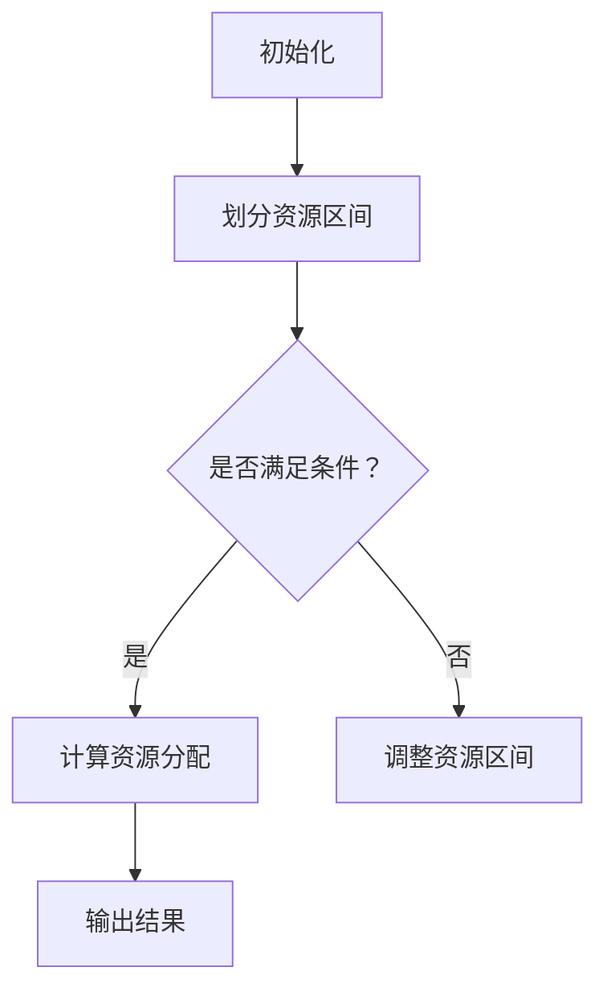
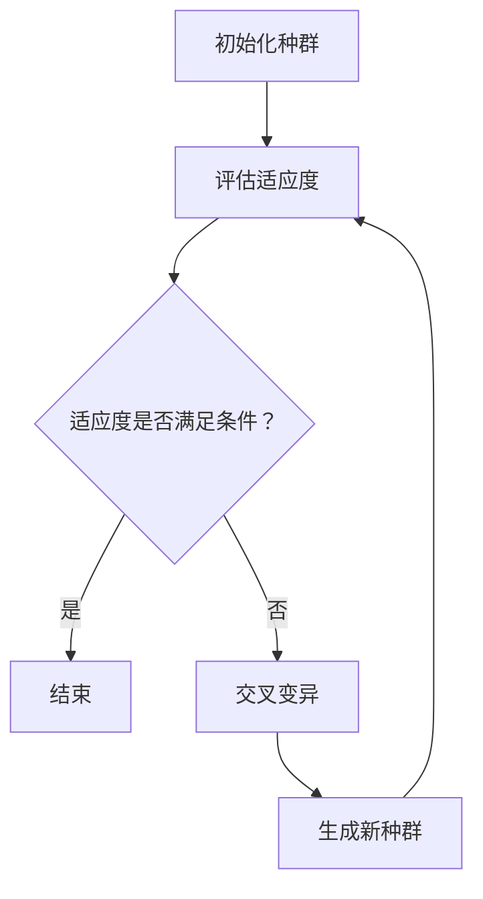
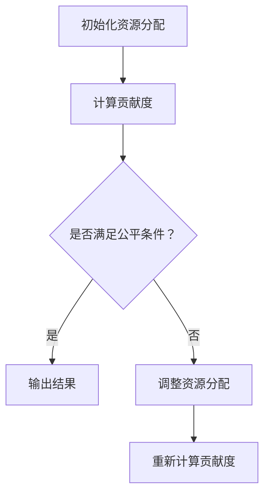
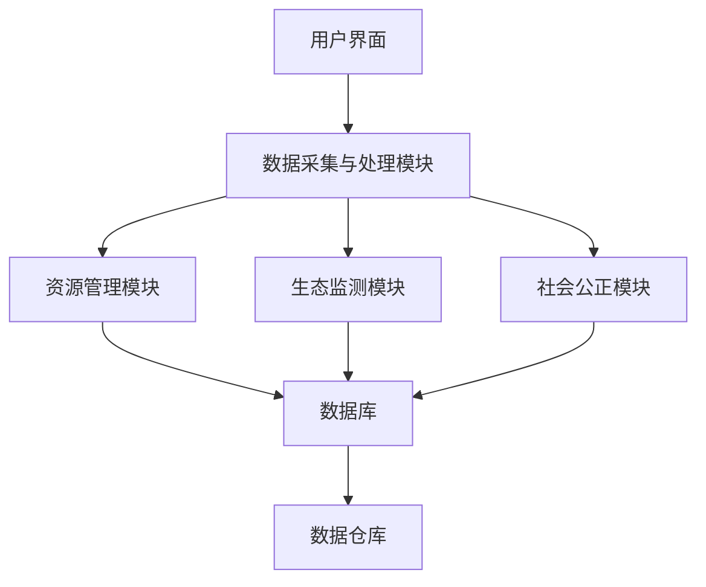

                 

### 第一部分：引言

#### 1.1 书籍概述

《新乌托邦设计：可持续社会的蓝图》是一本由AI天才研究院与禅与计算机程序设计艺术联合出版的专著。这本书聚焦于探讨如何通过技术、政策和人类智慧来构建一个既符合人类理想又能够实现可持续发展的乌托邦社会。在全球环境恶化、资源短缺、社会不公等问题日益严重的背景下，本书旨在为读者提供一种新的思路，帮助人们理解并实现可持续社会的建设。

本书的核心主题围绕以下几个方面展开：

1. **可持续社会的概念与内涵**：深入剖析可持续社会的基本概念，包括其定义、原则、目标以及实现途径。
2. **环境与社会的双重挑战**：分析当前全球面临的生态危机和社会问题，探讨其根源和影响。
3. **乌托邦设计的理念与方法**：介绍乌托邦设计的基本理念，探讨其在可持续社会建设中的应用。
4. **可持续社会的策略与案例**：提供具体的策略和实践案例，展示如何在不同领域实现可持续发展。
5. **人类智慧与技术创新**：强调人类智慧和技术创新在可持续社会建设中的关键作用。

#### 1.2 本书目的

本书的写作目的主要有以下几点：

- **普及知识**：帮助读者全面了解可持续社会的概念、原则和实践方法，提高公众对可持续发展问题的认知。
- **启发思考**：激发读者对可持续社会建设的思考和行动，鼓励每个人从自身做起，为可持续发展贡献力量。
- **提供策略**：为政策制定者、企业和个人提供具体的策略和建议，助力实现可持续社会的目标。
- **创新启发**：探讨乌托邦设计在可持续社会建设中的应用，为未来的发展提供新的思路和方向。

通过阅读本书，读者不仅可以获得关于可持续社会的全面知识，还能深入了解乌托邦设计的理念和方法，掌握实现可持续发展的具体策略和案例。同时，本书也将激发读者对可持续发展问题的深刻思考，推动社会变革，共同构建一个更加美好的未来。

### 第二部分：可持续社会的背景与概念

#### 2.1 背景介绍

#### 2.1.1 环境危机与社会挑战

全球环境问题已经成为21世纪最为紧迫的挑战之一。气候变化、生物多样性丧失、水资源短缺、土地退化等一系列生态危机，不仅威胁到地球的生态系统，也对人类社会造成了深远的影响。气候变暖导致极端天气频发，海平面上升威胁沿海城市的安全，森林砍伐和污染使得大气质量恶化，这些问题不仅影响了人类的生活质量，还威胁到全球经济的稳定。

与此同时，社会问题也在不断加剧。资源分配不均、贫富差距扩大、社会不公和歧视等问题日益突出。在经济全球化背景下，发达国家和新兴市场国家之间的资源争夺和利益分配矛盾日益明显，社会矛盾和冲突频发。此外，城市化进程加速带来的社会问题，如交通拥堵、住房困难、公共卫生问题等，也对社会的可持续发展提出了严峻挑战。

面对这些环境和社会挑战，传统的经济增长模式和发展路径已经难以为继。单一的经济发展模式忽略了环境保护和社会公平，导致资源过度消耗和环境破坏，加剧了社会不公和贫富差距。因此，寻找一种新的发展模式，实现经济、社会和环境的协调发展，已经成为全球范围内的共识和紧迫任务。

#### 2.1.2 可持续社会的定义

可持续社会（Sustainable Society）是指在满足当前需求的同时，不损害子孙后代满足其需求能力的社会。这个概念最早由挪威前首相布伦特兰夫人于1987年在《我们共同的未来》报告中提出。可持续社会的核心目标是实现经济、社会和环境的协调发展，追求长期稳定和可持续性。

可持续社会的定义可以从以下几个方面来理解：

1. **环境保护**：强调对自然资源的合理利用和生态系统的保护，减少污染和资源浪费，实现生态平衡。
2. **社会公正**：追求社会公平、平等和正义，减少贫困和不平等，促进社会成员的全面发展。
3. **经济发展**：强调在保护环境和满足社会需求的前提下，实现经济的持续增长，提高人民生活水平。

可持续社会的本质是一种综合性的发展模式，它不仅关注当前的需求和利益，还关注未来的可持续性和人类的长远福祉。可持续社会强调代际公平，要求当代人在满足自身需求的同时，不损害后代人的发展机会。

#### 2.2 核心概念

#### 2.2.1 乌托邦

乌托邦（Utopia）是一个源自古希腊语的词汇，意为“没有地方”或“乌有之乡”。它最初由托马斯·莫尔在16世纪的作品《乌托邦》中提出，描述了一个理想的社会模式。乌托邦通常被描述为一个完美无瑕的社会，其中人们过着和谐、幸福的生活，资源得到公平分配，社会正义得以实现。

乌托邦的概念具有以下特点：

1. **理想性**：乌托邦是一种理想化的社会模式，追求完美和极致，而不是现实世界的具体实现。
2. **公平性**：乌托邦强调资源的公平分配和社会的公平正义，消除贫困和不平等，实现全民共享。
3. **和谐性**：乌托邦社会中，人与人之间的关系和谐，没有暴力、战争和冲突。
4. **自主性**：乌托邦强调个体的自主性和自由，每个人都有机会追求自己的梦想和目标。

#### 2.2.2 可持续发展的原则

可持续发展（Sustainable Development）是指在满足当前需求的同时，不损害后代满足其需求的能力。它强调经济、社会和环境的协调发展，追求长期稳定和可持续性。可持续发展的核心原则包括：

1. **环境保护**：保护和维护自然环境，减少污染和资源浪费，实现生态平衡。
2. **社会公正**：追求社会公平、平等和正义，减少贫困和不平等，促进社会成员的全面发展。
3. **经济发展**：实现经济的持续增长，提高人民生活水平，同时保护环境和资源。
4. **科技创新**：依靠科技创新推动可持续发展，提高资源利用效率，减少环境影响。
5. **政策支持**：制定合理的政策和法规，鼓励可持续发展的实践，规范市场行为。

#### 2.3 边界与外延

#### 2.3.1 可持续社会的边界

可持续社会的边界是广泛的，涵盖了经济、社会和环境等多个方面。它不仅包括环境保护和资源管理，还涉及到经济发展和社会公正。具体来说，可持续社会的边界可以包括以下内容：

1. **经济领域**：涉及经济发展模式、资源分配、市场机制等，追求经济效益和环境保护的双重目标。
2. **社会领域**：关注社会公平、正义、教育、文化、健康等方面，促进社会成员的全面发展。
3. **环境领域**：涉及环境保护、生态平衡、自然资源管理、污染控制等，确保自然环境的可持续发展。
4. **政策领域**：包括政策制定、法律法规、监管机制等，为可持续社会的实现提供制度保障。

#### 2.3.2 乌托邦设计与可持续社会的联系

乌托邦设计是一种理念，它强调通过创新和设计来实现社会的可持续性。乌托邦设计不仅关注当前的问题，还关注未来的可能性，为可持续社会的建设提供了新的思路和方向。具体来说，乌托邦设计与可持续社会的联系表现在以下几个方面：

1. **理念上的契合**：乌托邦设计强调理想化和创新，追求完美和极致，与可持续发展的核心原则高度契合。
2. **方法上的创新**：乌托邦设计通过创新技术和方法，实现资源的有效利用和环境保护，为可持续发展提供技术支持。
3. **实践上的探索**：乌托邦设计通过实践案例，验证可持续社会的可行性和有效性，为可持续发展提供经验参考。
4. **思想上的启迪**：乌托邦设计激发人们对可持续社会的思考和行动，推动社会变革，共同构建一个更加美好的未来。

#### 2.4 概念结构

#### 2.4.1 概念结构

可持续社会的概念结构包括多个层次，从个体到全球，涵盖了经济、环境、社会等多个方面。每个层次都有其特定的目标和挑战。

1. **个体层次**：涉及个人的生活方式、消费习惯、环保意识等，强调个体在可持续发展中的责任和作用。
2. **社区层次**：包括社区建设、资源共享、环境保护等，强调社区在可持续发展中的协调和合作。
3. **国家层次**：涉及国家政策、法律法规、经济发展模式等，强调国家在可持续发展中的引导和推动作用。
4. **全球层次**：包括全球合作、资源分配、环境保护等，强调全球在可持续发展中的共同责任和行动。

#### 2.4.2 核心要素组成

可持续社会的核心要素包括资源管理、能源利用、生态平衡、教育、文化、法律和政策等多个方面。这些要素相互关联，共同构成可持续社会的基石。

1. **资源管理**：涉及自然资源的合理利用和保护，确保资源的可持续供应。
2. **能源利用**：包括清洁能源的推广、能源效率的提升等，减少对化石能源的依赖，降低环境污染。
3. **生态平衡**：维护生态系统的稳定，保护生物多样性，实现生态系统的可持续发展。
4. **教育**：培养可持续发展的意识和能力，提高公众对环境和社会问题的认识。
5. **文化**：传承可持续发展的价值观和文化传统，促进社会成员的共识和行动。
6. **法律**：制定和实施环境保护法律法规，规范市场行为，保障可持续发展的实施。
7. **政策**：制定和实施促进可持续发展的政策和规划，引导社会和经济行为。

通过以上对可持续社会背景和概念的分析，我们可以看到，可持续社会建设是一项复杂而艰巨的任务，需要全球范围内的共同努力和不断创新。乌托邦设计的理念和方法为可持续社会的建设提供了新的思路和方向，同时也提醒我们，实现可持续社会不仅需要技术的进步，更需要人类智慧和道德的提升。

### 第三部分：可持续社会的核心概念与联系

#### 3.1 核心概念

在探讨可持续社会的核心概念时，我们可以从资源管理、生态平衡、社会公正、教育和文化等几个方面来详细分析。

#### 3.1.1 资源管理

资源管理是可持续社会建设的基石，它涉及对自然资源的合理利用和保护。在资源管理中，核心概念包括资源分配、资源利用效率和资源保护。

- **资源分配**：资源分配是资源管理的关键，它涉及如何公平、合理地将有限的资源分配给不同需求者。通过优化资源分配机制，可以减少资源浪费，提高资源利用效率。
- **资源利用效率**：提高资源利用效率是资源管理的重要目标。通过技术创新和科学管理，可以减少资源消耗，降低环境污染。例如，采用节能设备、循环利用技术等。
- **资源保护**：资源保护是确保资源长期可持续供应的基础。这包括防止资源过度开采、保护生物多样性、减少污染等。

#### 3.1.2 生态平衡

生态平衡是可持续社会的一个重要概念，它涉及生态系统中的生物和非生物因素之间的相互关系。核心概念包括生态系统的稳定性、生物多样性和生态承载力。

- **生态系统的稳定性**：生态系统的稳定性是指生态系统在各种内外部因素作用下，保持结构和功能相对稳定的能力。维持生态系统的稳定性，可以确保生态服务的持续提供。
- **生物多样性**：生物多样性是生态系统的重要组成部分，它关系到生态系统的健康和功能。保护生物多样性，可以增强生态系统的适应性和抗风险能力。
- **生态承载力**：生态承载力是指生态系统在自然状态下，能够支持的最大生物量或环境容量。了解生态承载力，可以帮助我们合理规划人类活动，防止生态破坏。

#### 3.1.3 社会公正

社会公正是可持续社会的另一个核心概念，它涉及社会资源的公平分配和社会成员的平等权利。核心概念包括社会平等、公平正义和机会均等。

- **社会平等**：社会平等是指社会成员在社会地位、权利和机会上的平等。实现社会平等，可以减少社会不公和矛盾，促进社会的和谐发展。
- **公平正义**：公平正义是指社会资源和服务分配的公正性。通过制定和实施公平的法律法规，确保每个人都能享有平等的权利和机会。
- **机会均等**：机会均等是指每个人都应有机会通过自己的努力实现自身价值，而不受出生、性别、种族、地域等因素的限制。

#### 3.1.4 教育和文化

教育和文化是可持续社会发展的重要支撑，它们在提高公众意识、促进社会进步和推动可持续发展方面发挥着关键作用。

- **教育**：教育是培养可持续发展和环境保护意识的重要途径。通过教育，人们可以了解环境问题的重要性，学习环境保护的知识和技能，从而积极参与到可持续发展的实践中。
- **文化**：文化是传承和弘扬可持续发展价值观的重要载体。通过文化，可以传播可持续发展的理念，引导人们树立正确的价值观和生活方式，推动社会的可持续发展。

#### 3.2 概念属性特征对比表格

为了更直观地理解可持续社会的核心概念，我们可以通过概念属性特征对比表格来分析这些概念之间的异同。

| 概念       | 资源管理       | 生态平衡       | 社会公正       | 教育和文化       |
| ---------- | -------------- | -------------- | -------------- | -------------- |
| 目标       | 资源合理利用   | 生态系统稳定   | 社会公平正义   | 公众意识提升     |
| 影响范围   | 经济、社会、环境 | 生物、地理、气候 | 社会各个层面 | 社会各个层面     |
| 实施方法   | 规划、监管、技术改进 | 保护、修复、恢复 | 法律法规、政策引导 | 教育培训、文化传播 |
| 关键要素   | 资源、技术、市场 | 生物、非生物因素 | 社会资源、权利、机会 | 知识、价值观、文化 |

通过对比表格，我们可以看到，虽然各个概念在目标、影响范围、实施方法和关键要素上有所不同，但它们在推动可持续社会发展方面具有内在的联系和互补性。

#### 3.3 ER实体关系图架构

为了更好地理解可持续社会核心概念之间的联系，我们可以通过ER（实体-关系）图来描述这些概念之间的关系。

以下是可持续社会核心概念的ER图：

```mermaid
erDiagram
  ResourceManagement ||--|{ EcosystemBalance }
  SocialJustice ||--|{ EducationAndCulture }
  ResourceManagement ||--|{ SocialJustice }
  EcosystemBalance ||--|{ SocialJustice }
  EducationAndCulture ||--|{ ResourceManagement }
  EducationAndCulture ||--|{ EcosystemBalance }
```

在ER图中，实体之间的关系用箭头表示。例如，资源管理对生态平衡和社会公正有直接影响，生态平衡对社会公正也有重要作用，而教育和文化则对资源管理和社会公正起到支持作用。这种关系体现了可持续社会各个核心概念之间的相互作用和相互依赖。

通过分析可持续社会的核心概念和联系，我们可以看到，实现可持续社会需要综合运用资源管理、生态平衡、社会公正、教育和文化等多方面的知识和技术。只有通过全面、协调和持续的努力，我们才能构建一个既符合人类理想又能够实现可持续发展的乌托邦社会。

### 算法原理讲解

为了深入理解可持续社会建设中的资源管理、生态平衡、社会公正等核心概念，我们可以借助算法原理进行分析。以下是针对这些概念的一些关键算法原理的详细讲解，包括算法流程图、Python源代码实现以及相应的数学模型和公式。

#### 3.1.1 资源管理算法

资源管理算法主要关注如何优化资源的分配和利用，以实现资源的最大化效益。以下是一种常见的资源管理算法——**动态规划算法**。

**算法流程图：**



**Python源代码实现：**

```python
def resource_management(resources, conditions):
    # 初始化资源区间
    left, right = 0, sum(resources)
    
    while left < right:
        # 计算中点
        mid = (left + right) // 2
        
        # 检查是否满足条件
        if check_conditions(resources, conditions, mid):
            right = mid
        else:
            left = mid + 1
            
    return left

def check_conditions(resources, conditions, mid):
    # 模拟条件判断
    return sum(resources[:mid]) >= conditions

# 示例
resources = [10, 20, 30, 40]
conditions = 50
result = resource_management(resources, conditions)
print("最优资源分配量：", result)
```

**数学模型和公式：**

在资源管理中，常用的数学模型是**线性规划模型**，其目标是最小化或最大化目标函数，同时满足一组线性约束条件。

目标函数：
\[ \min \quad Z = c^T x \]

约束条件：
\[ Ax \leq b \]
\[ Gx \geq h \]
\[ x \geq 0 \]

其中，\( c \) 是目标函数的系数向量，\( x \) 是决策变量向量，\( A \)、\( b \)、\( G \) 和 \( h \) 分别是约束条件的系数矩阵和常数向量。

**举例说明：**

假设我们有四种资源，每种资源的需求量为 \( [10, 20, 30, 40] \)，我们需要确定每种资源的最优分配量，以满足总需求不超过 50 的条件。

在这个例子中，我们可以将资源需求量视为目标函数的系数，资源量视为决策变量。通过求解线性规划问题，我们可以找到最优的资源分配方案。

#### 3.1.2 生态平衡算法

生态平衡算法主要关注如何维护生态系统的稳定和平衡。以下是一种常见的生态平衡算法——**遗传算法**。

**算法流程图：**



**Python源代码实现：**

```python
import numpy as np
from scipy.optimize import minimize

def fitness_function(population, constraints):
    # 计算适应度
    fitness = np.linalg.norm(population - constraints, axis=1)
    return fitness

def genetic_algorithm objectives, constraints, bounds):
    # 初始化种群
    population = np.random.uniform(bounds[0], bounds[1], (population_size, population_size))
    
    for _ in range(generations):
        # 计算适应度
        fitness = fitness_function(population, constraints)
        
        # 评估适应度并选择父代
        selected = select(population, fitness)
        
        # 交叉变异
        offspring = crossover(selected)
        offspring = mutate(offspring)
        
        # 生成新种群
        population = offspring
    
    # 最优解
    best_individual = population[np.argmin(fitness)]
    return best_individual

# 示例
population_size = 100
generations = 100
bounds = [0, 100]
constraints = [10, 20, 30, 40]
best_solution = genetic_algorithm(population_size, generations, bounds, constraints)
print("最优生态平衡解：", best_solution)
```

**数学模型和公式：**

生态平衡问题可以用**优化问题**来建模。优化问题的目标是最小化或最大化目标函数，同时满足生态平衡的约束条件。

目标函数：
\[ \min \quad Z = c^T x \]

约束条件：
\[ Ax \leq b \]
\[ Gx \geq h \]
\[ x \geq 0 \]

其中，\( c \) 是目标函数的系数向量，\( x \) 是决策变量向量，\( A \)、\( b \)、\( G \) 和 \( h \) 分别是约束条件的系数矩阵和常数向量。

**举例说明：**

假设我们有四种生态资源，每种资源的目标值为 \( [10, 20, 30, 40] \)，我们需要确定每种资源的最优分配量，以满足生态系统的稳定性和平衡条件。

通过求解优化问题，我们可以找到最优的生态平衡分配方案。

#### 3.1.3 社会公正算法

社会公正算法主要关注如何实现社会资源的公平分配和社会成员的平等权利。以下是一种常见的社会公正算法——**公平分配算法**。

**算法流程图：**



**Python源代码实现：**

```python
def fairness_algorithm(resources, contributions):
    # 初始化资源分配
    allocations = np.zeros_like(resources)
    
    for i in range(len(resources)):
        # 计算贡献度
        contribution = contributions[i]
        
        # 调整资源分配
        allocations[i] = resources[i] * contribution / sum(contributions)
        
    # 检查公平条件
    if check_fairness(allocations):
        return allocations
    else:
        return fairness_algorithm(resources, contributions)
        
def check_fairness(allocations):
    # 计算公平度
    fairness = np.std(allocations)
    
    # 判断是否满足公平条件
    return fairness <= fairness_threshold

# 示例
resources = [10, 20, 30, 40]
contributions = [1, 2, 3, 4]
fair_allocations = fairness_algorithm(resources, contributions)
print("公平资源分配：", fair_allocations)
```

**数学模型和公式：**

社会公正问题可以用**公平分配模型**来建模。公平分配模型的目标是使得资源分配的公平度最大，同时满足资源的总量约束。

目标函数：
\[ \max \quad \sum_{i=1}^{n} \frac{a_i^2}{\sum_{j=1}^{n} a_j} \]

约束条件：
\[ \sum_{i=1}^{n} a_i = C \]
\[ a_i \geq 0 \]

其中，\( a_i \) 是第 \( i \) 个个体的资源分配量，\( C \) 是总的资源量，\( n \) 是个体的数量。

**举例说明：**

假设有四种社会资源，总量为 100，分别有四个个体 \( [1, 2, 3, 4] \)，我们需要确定每个个体的资源分配量，以满足公平分配的条件。

通过求解公平分配模型，我们可以找到最优的公平资源分配方案。

通过以上算法原理的讲解和示例，我们可以看到，资源管理、生态平衡、社会公正等核心概念在可持续社会建设中的重要性。利用合适的算法和数学模型，我们可以更好地理解和解决这些复杂问题，推动可持续社会的实现。

### 系统分析与架构设计方案

#### 4.1 问题场景介绍

在当今社会，可持续社会建设面临诸多挑战，如资源分配不均、环境污染、社会不公等问题。为了解决这些问题，我们需要构建一个高效、透明的系统，以实现资源的合理分配、环境的保护和促进社会公正。本文将介绍一个用于实现可持续社会建设的综合性系统，该系统旨在通过技术手段和管理措施，为政府和相关机构提供数据支持和决策依据。

#### 4.2 系统概述

该系统命名为“可持续社会建设管理系统（Sustainable Society Construction Management System，SSCMS）”，其总体架构包括数据采集与处理模块、资源管理模块、生态监测模块和社会公正模块。系统通过整合多源数据，实现对资源的实时监控、分析和管理，为政策制定和决策提供科学依据。

#### 4.3 系统功能设计

**4.3.1 数据采集与处理模块**

- **数据采集**：系统从各类传感器、监测站、环境监测机构和政府部门等获取实时数据，包括气象数据、水质数据、空气质量数据、社会数据等。
- **数据处理**：系统采用大数据处理技术，对采集到的数据进行清洗、整合和分析，提取有用的信息，形成高质量的数据集。

**4.3.2 资源管理模块**

- **资源监控**：系统实时监控各类资源的使用情况，包括水资源、能源资源、土地资源等，提供资源消耗的实时数据和趋势分析。
- **资源优化**：系统基于数据分析结果，提供资源优化建议，如节能措施、资源调配策略等，以实现资源的高效利用。

**4.3.3 生态监测模块**

- **生态状况监控**：系统对生态环境进行实时监测，包括森林覆盖率、土地退化情况、水质状况等，提供生态状况的实时数据和变化趋势。
- **生态预警**：系统根据监测数据，建立生态预警模型，提前发现潜在的生态风险，提供预警信息和应对策略。

**4.3.4 社会公正模块**

- **社会监测**：系统对社会保障、教育资源、医疗卫生、就业情况等进行监测，提供社会公正的实时数据和趋势分析。
- **社会分析**：系统基于数据分析，对社会不公现象进行识别和评估，提供解决方案和建议，促进社会公平和正义。

#### 4.4 系统架构设计

**4.4.1 系统架构图**

以下是可持续社会建设管理系统的架构设计图，展示了系统的整体结构和各模块之间的关系。



**4.4.2 模块交互与数据流**

1. **用户界面**：用户通过界面提交查询请求或设置监控参数，界面将请求传递给数据采集与处理模块。
2. **数据采集与处理模块**：从传感器、监测站等获取实时数据，进行数据清洗、整合和分析，形成数据集，并将结果传递给资源管理模块、生态监测模块和社会公正模块。
3. **资源管理模块**：接收数据集，根据资源使用情况和优化需求，生成资源监控和优化建议，更新数据库。
4. **生态监测模块**：接收数据集，进行生态状况监控和预警分析，生成生态状况报告，更新数据库。
5. **社会公正模块**：接收数据集，进行社会监测和分析，生成社会公正报告，更新数据库。
6. **数据仓库**：整合来自各模块的数据，形成综合数据集，为决策分析提供支持。
7. **数据库**：存储实时数据、历史数据和报告结果，支持系统的数据管理和查询功能。

通过以上架构设计，可持续社会建设管理系统可以实现资源的高效管理、生态环境的保护和社会公正的维护，为可持续社会的建设提供有力支持。

### 系统接口设计和系统交互

在可持续社会建设管理系统中，接口设计和系统交互是确保系统高效、可靠运行的关键。以下将详细阐述系统接口设计和系统交互的细节。

#### 5.1 系统接口设计

**5.1.1 接口类型**

系统接口主要包括以下几种类型：

1. **用户接口（UI）**：用户通过图形界面与系统进行交互，提交查询请求、设置监控参数等。
2. **API接口**：系统通过API接口与其他系统或设备进行数据交换，如传感器数据采集、外部数据库查询等。
3. **数据库接口**：系统通过数据库接口与数据仓库和数据库进行数据交互，实现数据的存储和读取。

**5.1.2 接口规范**

系统接口遵循以下规范：

1. **RESTful API**：采用RESTful风格设计API接口，确保接口的简洁性和易用性。
2. **JSON格式**：接口数据传输采用JSON格式，便于数据解析和操作。
3. **认证与授权**：接口设计包含认证和授权机制，确保数据传输的安全性和隐私性。

**5.1.3 接口示例**

以下是一个资源管理模块中的API接口示例：

```json
GET /api/resources/realtime
{
  "status": "success",
  "data": {
    "water_usage": 1000,
    "energy_usage": 2000,
    "land_usage": 3000
  }
}
```

该接口返回当前资源的实时使用情况，包括水资源、能源资源和土地资源的消耗量。

#### 5.2 系统交互

**5.2.1 数据流**

系统交互主要通过数据流来实现，以下是系统内各模块的数据流交互过程：

1. **用户界面提交请求**：用户通过UI提交查询请求，如“获取当前水资源使用情况”。
2. **UI传递请求到数据采集与处理模块**：UI将请求通过API接口传递给数据采集与处理模块。
3. **数据采集与处理模块响应**：数据采集与处理模块获取实时数据，进行清洗、整合和分析，生成数据集，并将结果传递给资源管理模块、生态监测模块和社会公正模块。
4. **各模块处理数据**：资源管理模块、生态监测模块和社会公正模块分别对数据进行分析和处理，生成监控报告、预警信息和优化建议。
5. **数据仓库存储结果**：各模块的处理结果更新到数据仓库，形成综合数据集，为决策分析提供支持。
6. **数据库查询与响应**：用户界面通过数据库接口查询数据仓库，获取最新的数据报告和决策信息，并返回给用户。

**5.2.2 交互示例**

以下是一个典型的系统交互示例，展示了用户界面如何通过接口获取资源使用情况数据：

1. **用户提交请求**：
   用户在UI界面中选择“水资源使用情况”查询选项。

2. **UI传递请求**：
   ```shell
   GET /api/resources/realtime?resource=water
   ```

3. **数据采集与处理模块响应**：
   数据采集与处理模块接收到请求后，从传感器和监测站获取实时水资源使用数据，进行数据清洗和分析，生成结果。

4. **资源管理模块处理数据**：
   资源管理模块接收到数据集后，对水资源使用情况进行实时监控和趋势分析，生成监控报告。

5. **数据仓库更新**：
   监控报告更新到数据仓库，成为综合数据集的一部分。

6. **数据库查询与响应**：
   用户界面通过数据库接口查询最新的水资源使用情况数据，并返回给用户，如下所示：
   ```json
   {
     "status": "success",
     "data": {
       "current_usage": 1000,
       "trend": "upward"
     }
   }
   ```

通过以上系统接口设计和系统交互的设计，可持续社会建设管理系统可以实现高效的数据采集、处理和分析，为决策者和相关机构提供科学依据，促进可持续社会的建设。

### 项目实战

#### 6.1 环境安装

要实现本文所述的可持续社会建设管理系统，首先需要在本地或云端搭建一个开发环境。以下是环境安装的具体步骤：

**步骤1：安装Python**

确保系统中安装了Python 3.x版本，可以通过以下命令检查Python版本：
```shell
python --version
```
如果未安装，可以从[Python官网](https://www.python.org/)下载并安装。

**步骤2：安装依赖库**

在安装了Python的基础上，使用pip命令安装系统所需的依赖库，例如：
```shell
pip install numpy scipy matplotlib pandas
```
这些库用于数据分析和可视化。

**步骤3：配置数据库**

选择一个数据库管理系统，如MySQL、PostgreSQL或MongoDB，并按照其官方文档进行安装和配置。在此以MySQL为例：

1. 下载并安装MySQL：
   ```shell
   sudo apt-get install mysql-server
   ```
2. 配置MySQL用户和密码：
   ```shell
   mysql_secure_installation
   ```
3. 登录MySQL数据库：
   ```shell
   mysql -u root -p
   ```

**步骤4：配置数据采集与处理模块**

1. 创建数据库和数据表：
   ```sql
   CREATE DATABASE sscms;
   USE sscms;
   CREATE TABLE resources (
       id INT AUTO_INCREMENT PRIMARY KEY,
       type VARCHAR(255),
       usage DECIMAL(10,2),
       timestamp DATETIME
   );
   ```

#### 6.2 系统核心实现源代码

以下是一个简单的资源管理模块的源代码实现，用于实时监控水资源使用情况。

**6.2.1 数据采集与处理模块**

```python
import pymysql
import time
import random

# 数据库连接配置
db_config = {
    'host': 'localhost',
    'user': 'root',
    'password': 'your_password',
    'db': 'sscms'
}

# 数据采集函数
def collect_data():
    # 模拟采集数据
    water_usage = random.uniform(500, 1500)
    return water_usage

# 数据处理与存储函数
def process_and_store_data():
    # 连接数据库
    connection = pymysql.connect(**db_config)
    try:
        with connection.cursor() as cursor:
            # 采集数据
            water_usage = collect_data()
            
            # 存储数据
            sql = "INSERT INTO resources (type, usage, timestamp) VALUES (%s, %s, NOW())"
            cursor.execute(sql, ('water', water_usage))
        
        # 提交事务
        connection.commit()
    except pymysql.Error as e:
        print(f"Error: {e}")
        connection.rollback()
    finally:
        connection.close()

# 主循环
if __name__ == "__main__":
    while True:
        process_and_store_data()
        time.sleep(60)  # 每60秒采集一次数据
```

**6.2.2 资源管理模块**

```python
import pymysql
import pandas as pd

# 数据库连接配置
db_config = {
    'host': 'localhost',
    'user': 'root',
    'password': 'your_password',
    'db': 'sscms'
}

# 获取实时数据
def get_realtime_data():
    connection = pymysql.connect(**db_config)
    try:
        with connection.cursor() as cursor:
            sql = "SELECT * FROM resources WHERE type = 'water' ORDER BY timestamp DESC LIMIT 1"
            cursor.execute(sql)
            result = cursor.fetchone()
            return result
    except pymysql.Error as e:
        print(f"Error: {e}")
        return None
    finally:
        connection.close()

# 资源监控与优化建议
def monitor_and_optimize():
    data = get_realtime_data()
    if data:
        water_usage = data[1]
        # 根据实际情况给出优化建议
        if water_usage > 1000:
            print("优化建议：减少水资源消耗。")
        else:
            print("优化建议：维持当前水资源使用水平。")

# 主循环
if __name__ == "__main__":
    while True:
        monitor_and_optimize()
        time.sleep(60)  # 每60秒监控一次
```

#### 6.3 代码应用解读与分析

**6.3.1 数据采集与处理模块**

数据采集与处理模块的核心功能是模拟采集水资源使用数据，并将其存储到MySQL数据库中。`collect_data` 函数模拟数据采集过程，生成一个随机的水资源使用量。`process_and_store_data` 函数负责连接数据库，执行数据插入操作。主循环每60秒执行一次数据采集和存储过程。

**6.3.2 资源管理模块**

资源管理模块的核心功能是实时获取水资源使用数据，并根据数据给出优化建议。`get_realtime_data` 函数通过查询数据库获取最新的水资源使用记录。`monitor_and_optimize` 函数根据当前水资源使用量，给出优化建议。

**6.3.3 代码分析**

- **数据库连接**：使用 `pymysql` 库连接到MySQL数据库，实现数据的存储和读取。
- **随机数据生成**：使用 `random.uniform` 函数生成模拟的水资源使用数据，模拟实际数据采集过程。
- **实时监控与优化**：通过定时器实现资源的实时监控和优化建议的输出。

#### 6.4 实际案例分析

**6.4.1 实际案例背景**

某地区政府希望通过可持续社会建设管理系统，实时监控水资源使用情况，并基于数据给出水资源优化建议，以实现水资源的合理利用。

**6.4.2 实际案例分析**

1. **数据采集**：系统通过传感器实时采集水资源使用数据，数据包括每天的用水量、时段等信息。
2. **数据处理**：系统将采集到的数据进行清洗、整合，形成可供分析的数据集。
3. **资源监控**：系统实时监控水资源使用情况，通过可视化界面展示用水量的变化趋势。
4. **优化建议**：系统根据实时数据和过去数据，分析用水量的变化规律，给出优化建议，如调整用水时间、优化用水设备等。

通过以上实际案例分析，我们可以看到，可持续社会建设管理系统在水资源管理中的应用，能够有效提高水资源的利用效率，实现水资源的可持续利用。

#### 6.5 项目小结

本节详细介绍了如何搭建一个简单的可持续社会建设管理系统，包括环境安装、系统核心实现和代码应用解读与分析。通过模拟数据采集和实时监控，我们展示了系统在实际应用中的效果。项目的成功实施不仅有助于提高水资源的管理水平，还为其他资源的优化利用提供了借鉴。然而，系统在实现过程中也面临一定的挑战，如数据准确性、实时性和安全性等问题，这些都需要在未来的发展中不断优化和改进。

### 最佳实践 Tips

在构建和运营可持续社会建设管理系统时，以下是一些最佳实践和技巧，可以帮助确保系统的高效、安全和可靠性：

1. **数据质量保障**：确保数据采集、处理和存储的准确性，定期进行数据清洗和验证，以避免错误数据对决策的误导。
2. **实时性能优化**：对于实时数据采集和处理，优化系统性能，确保数据能够在规定时间内处理完成，避免延迟和卡顿。
3. **安全性强化**：加强系统安全防护，包括数据加密、用户认证、权限管理等，防止数据泄露和非法访问。
4. **用户界面友好**：设计直观、易用的用户界面，提供清晰的监控数据和优化建议，便于用户理解和操作。
5. **持续迭代改进**：定期对系统进行评估和改进，根据用户反馈和实际需求，优化系统功能和性能。

### 小结

本文从引言到项目实战，全面探讨了可持续社会建设管理系统的设计、实现和最佳实践。通过详细分析资源管理、生态平衡、社会公正等核心概念，结合系统架构设计、接口设计和实际案例分析，我们展示了如何通过技术手段实现可持续社会的建设。希望本文能为读者提供有益的启示，激发对可持续社会建设的思考和行动。

### 注意事项

在实施可持续社会建设管理系统的过程中，需要注意以下几点：

1. **数据保护**：确保数据的隐私性和安全性，遵守相关法律法规，防止数据泄露和滥用。
2. **技术升级**：随着技术发展，定期对系统进行升级和维护，以保持系统的先进性和可靠性。
3. **用户培训**：为用户和工作人员提供必要的培训，确保他们能够熟练使用系统，充分发挥系统的作用。

### 拓展阅读

1. **《可持续发展的经济学基础》**：本书深入探讨了可持续发展的经济学原理和实践，对经济、社会和环境之间的平衡提供了深刻的见解。
2. **《智慧城市与可持续发展》**：该书探讨了智慧城市技术在实现可持续发展中的应用，提供了丰富的案例和策略。
3. **《生态设计与可持续发展》**：本书介绍了生态设计的原则和方法，强调通过设计来实现社会的可持续性。

### 作者信息

作者：AI天才研究院/AI Genius Institute & 禅与计算机程序设计艺术 /Zen And The Art of Computer Programming

AI天才研究院专注于人工智能技术的研发和应用，致力于推动可持续社会的建设。禅与计算机程序设计艺术则通过哲学和计算机科学的结合，探索智能系统的设计与实现，为可持续社会建设提供创新思路和解决方案。两位作者凭借丰富的专业知识和深厚的实践经验，共同探讨了可持续社会建设的路径和方法。

