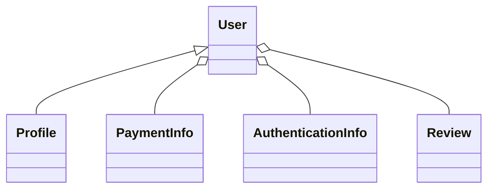
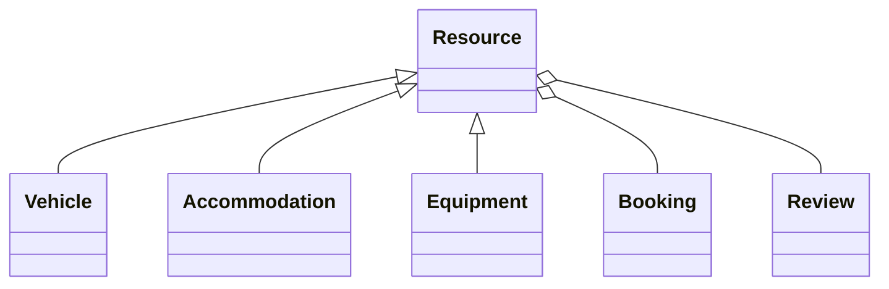
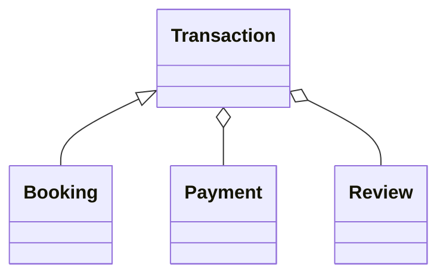
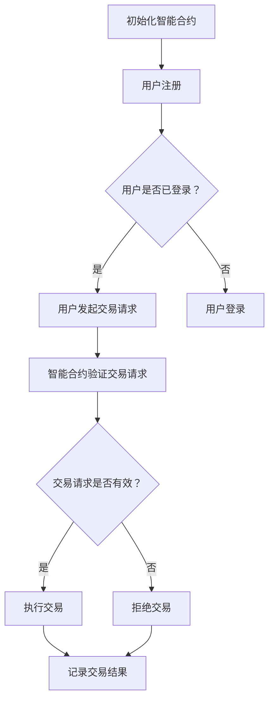

                 

# 新共享经济平台：去中心化的资源优化

> 关键词：共享经济、去中心化、资源优化、区块链、智能合约、平台设计、案例分析

摘要：随着共享经济的迅速发展，如何有效优化资源分配成为一个关键问题。本文探讨了新共享经济平台如何利用去中心化技术和资源优化策略，实现更高效、更公平的资源分配。通过介绍去中心化资源优化的原理、平台设计与实现、案例分析以及未来趋势和挑战，本文为构建新一代共享经济平台提供了深入见解。

## 第1章 背景介绍

### 1.1 共享经济概述

共享经济，也被称为协同消费，是指通过互联网平台连接资源提供者和需求者，实现资源共享和优化的经济模式。这种模式的核心在于通过技术手段降低交易成本，提高资源利用效率。

共享经济的起源可以追溯到20世纪70年代的美国，当时环保主义者提倡共享资源以减少浪费。随着互联网的普及，共享经济在21世纪初迅速发展，出现了诸如Uber、Airbnb等知名平台。

共享经济的主要形式包括以下几个方面：

1. **共享出行**：通过Uber、滴滴等平台，实现车辆的共享，降低出行成本。
2. **共享住宿**：通过Airbnb等平台，实现房屋的共享，提供更加灵活的住宿选择。
3. **共享办公**：通过WeWork等平台，实现办公空间的共享，降低企业运营成本。
4. **共享知识**：通过知乎、分答等平台，实现知识和经验的共享，提升学习效果。
5. **共享金融**：通过P2P借贷、众筹等平台，实现资金的共享，满足投资和融资需求。

### 1.2 去中心化概念

去中心化，也称为分布式，是一种无需中心化实体进行控制或管理的系统架构。在这种架构中，决策权分散到网络中的多个节点，每个节点都具有独立的功能和职责。

去中心化的定义可以从以下几个方面理解：

1. **决策权分散**：去中心化系统中的决策权不集中在单个实体或组织，而是分散到多个节点。
2. **自治**：去中心化系统能够在无需中心实体干预的情况下自主运作。
3. **透明性**：去中心化系统中的信息是公开透明的，所有参与者都可以查看和验证。

区块链技术是去中心化的重要实现方式之一。区块链是一种分布式账本技术，通过多个节点共同维护账本的一致性，确保数据的安全性和可信度。

### 1.3 资源优化的需求与挑战

资源优化在共享经济中具有重要意义。通过优化资源分配，可以降低交易成本，提高资源利用效率，提升用户体验。

然而，传统的共享经济平台在资源优化方面面临以下挑战：

1. **信息不对称**：平台无法完全掌握所有资源信息，导致供需不平衡。
2. **信任问题**：共享经济依赖于用户之间的信任，但传统的平台往往难以建立信任机制。
3. **中心化风险**：传统平台存在中心化风险，一旦平台出现问题，整个系统都会受到影响。
4. **效率低下**：中心化的平台在处理大量交易时，可能会出现效率低下的问题。

### 1.4 新共享经济平台的目标

新共享经济平台的目标是利用去中心化技术和资源优化策略，解决传统平台面临的挑战，实现更高效、更公平的资源分配。

新共享经济平台的主要功能包括：

1. **资源匹配**：通过智能算法实现资源提供者和需求者之间的精准匹配。
2. **信任建立**：利用区块链技术建立去中心化的信任机制，确保交易的透明性和安全性。
3. **去中心化治理**：通过分布式治理模式，降低中心化风险，提高系统的自治能力。
4. **资源优化**：通过数据分析与优化算法，实现资源的动态调整和高效利用。

## 第2章 核心概念与联系

### 2.1 共享经济中的关键概念

#### 2.1.1 分享与交换

分享与交换是共享经济的核心概念。分享是指资源提供者将闲置资源提供给需求者使用，而交换则是指资源提供者和需求者通过某种形式进行价值交换。

#### 2.1.2 透明度与信任

透明度是共享经济的重要特征，它要求平台能够提供真实、全面的信息，确保交易的公平性和可信度。信任是共享经济的基石，它依赖于平台建立的信任机制，确保用户能够放心使用共享资源。

#### 2.1.3 市场供需平衡

市场供需平衡是共享经济平台需要解决的关键问题。通过智能算法和数据分析，平台可以实时调整供需关系，实现资源的合理配置。

### 2.2 去中心化资源优化的核心概念

#### 2.2.1 去中心化交易平台

去中心化交易平台是共享经济平台的核心组成部分。它通过区块链技术实现去中心化的交易流程，确保交易的安全性和透明性。

#### 2.2.2 智能合约

智能合约是区块链技术的重要应用。它是一种自动执行的合约，通过编程语言实现预定的业务逻辑，确保交易的自动化和可信度。

#### 2.2.3 区块链技术

区块链技术是去中心化资源优化的重要基础。它通过分布式账本技术，实现数据的不可篡改和可追溯性，确保系统的安全性和透明性。

### 2.3 去中心化资源优化的联系与整合

#### 2.3.1 平台架构设计

平台架构设计是去中心化资源优化的关键。通过合理的架构设计，可以实现资源匹配、信任建立、去中心化治理等功能的有机结合。

#### 2.3.2 资源优化策略

资源优化策略是去中心化资源优化的核心。通过数据分析与优化算法，可以实现资源的动态调整和高效利用。

#### 2.3.3 用户参与机制

用户参与机制是去中心化资源优化的重要组成部分。通过激励措施和用户参与，可以提升平台的活力和用户粘性。

## 第3章 去中心化资源优化的原理

### 3.1 去中心化交易平台的工作原理

去中心化交易平台通过区块链技术实现去中心化的交易流程。以下是去中心化交易平台的工作原理：

1. **注册与认证**：用户在平台上进行注册和认证，确保身份的真实性。
2. **发布需求**：需求者发布需求信息，平台通过智能算法进行匹配。
3. **交易流程**：资源提供者和需求者通过智能合约进行交易，确保交易的安全性和透明性。
4. **支付与结算**：交易完成后，平台进行支付和结算，确保交易的顺利完成。
5. **评价与反馈**：用户对交易进行评价和反馈，平台根据评价进行后续的优化和调整。

### 3.2 智能合约的实现与应用

智能合约是区块链技术的重要应用。以下是智能合约的实现与应用：

1. **智能合约的定义**：智能合约是一种自动执行的合约，通过编程语言实现预定的业务逻辑。
2. **智能合约的实现**：智能合约可以通过Solidity等编程语言实现。以下是智能合约的实现示例：

```python
// SPDX-License-Identifier: MIT
pragma solidity ^0.8.0;

contract SimpleContract {
    address public owner;

    constructor() {
        owner = msg.sender;
    }

    mapping(address => uint256) public balance;

    function deposit() public payable {
        balance[msg.sender] += msg.value;
    }

    function withdraw(uint256 amount) public {
        require(amount <= balance[msg.sender], "Insufficient balance");
        balance[msg.sender] -= amount;
        payable(msg.sender).transfer(amount);
    }
}
```

3. **智能合约的应用案例**：智能合约可以应用于各种业务场景，如去中心化金融、供应链管理、知识产权保护等。

### 3.3 区块链技术在资源优化中的应用

区块链技术在资源优化中的应用主要体现在以下几个方面：

1. **数据存储**：区块链技术可以实现数据的安全存储和不可篡改。通过分布式账本技术，确保数据的可信度和完整性。
2. **数据共享**：区块链技术可以实现数据的透明共享。所有参与者都可以查看和验证数据，确保数据的真实性和可靠性。
3. **共识机制**：区块链技术通过共识机制实现数据的一致性。多个节点共同验证和记录数据，确保系统的高效运行。
4. **智能合约**：智能合约是区块链技术的重要应用。通过智能合约，可以实现自动执行和验证业务逻辑，提高系统的自动化和可信度。

### 3.4 去中心化资源优化的挑战与解决方案

去中心化资源优化面临以下挑战：

1. **技术难题**：区块链技术复杂，实现去中心化资源优化需要解决一系列技术难题。
2. **安全性问题**：去中心化系统可能面临安全漏洞和攻击风险。
3. **法律法规**：去中心化资源优化需要遵守相关法律法规，但现有的法律法规可能无法完全适应去中心化系统的特点。

解决方案包括：

1. **技术创新**：通过技术创新，提高区块链技术的性能和安全性。
2. **法律法规完善**：推动法律法规的完善，为去中心化资源优化提供良好的法律环境。
3. **社区治理**：通过社区治理，建立去中心化的监管机制，确保系统的公平和公正。

## 第4章 平台设计与实现

### 4.1 平台总体设计

平台总体设计是构建新共享经济平台的关键。以下是平台总体设计的几个方面：

1. **平台架构**：平台架构包括前端、后端和区块链三个部分。前端负责用户交互，后端负责数据处理，区块链负责数据存储和交易。
2. **功能模块**：平台功能模块包括用户管理、资源管理、交易管理、评价管理等。每个模块都具备独立的功能和职责。
3. **数据模型**：平台数据模型包括用户、资源、交易、评价等实体。每个实体都有相应的属性和关系。

### 4.2 前端设计与用户体验

前端设计是平台的重要组成部分。以下是前端设计的几个方面：

1. **用户界面设计**：用户界面设计要求简洁、直观、易用。通过合理布局和视觉设计，提升用户体验。
2. **响应式布局**：响应式布局能够适应不同设备和屏幕尺寸，提升平台的可用性。
3. **移动端适配**：移动端适配能够确保平台在移动设备上的良好性能和用户体验。

### 4.3 后端实现与数据库设计

后端实现是平台的核心。以下是后端实现的几个方面：

1. **数据模型设计**：数据模型设计要求清晰、合理、易于扩展。通过实体关系图（ER图）描述实体和关系。
2. **后端服务实现**：后端服务实现包括用户管理、资源管理、交易管理、评价管理等功能。
3. **性能优化**：性能优化包括数据库优化、缓存策略、负载均衡等，确保平台的高性能和高可用性。

### 4.4 安全性与可靠性

安全性与可靠性是平台设计的关键。以下是平台安全性与可靠性的几个方面：

1. **数据安全**：通过加密技术确保数据的安全存储和传输。
2. **网络安全**：通过防火墙、入侵检测系统等手段保护平台免受网络攻击。
3. **系统可靠性**：通过冗余设计、故障转移等手段提升平台的可靠性。

## 第5章 案例分析

### 5.1 案例一：去中心化闲置资源交易平台

#### 5.1.1 案例背景

去中心化闲置资源交易平台是一个基于区块链技术的共享经济平台，旨在解决闲置资源利用问题。平台允许用户发布和预订闲置资源，如车辆、房屋、设备等。

#### 5.1.2 平台设计与实现

平台设计主要包括用户管理、资源管理、交易管理、评价管理等功能模块。用户可以在平台上注册、登录、发布和预订资源。交易通过智能合约实现，确保交易的安全性和透明性。

#### 5.1.3 结果分析

通过去中心化闲置资源交易平台，用户能够更高效地利用闲置资源，降低资源浪费。平台的数据分析和智能匹配功能提高了资源利用率，实现了资源优化的目标。

### 5.2 案例二：去中心化物流平台

#### 5.2.1 案例背景

去中心化物流平台是一个基于区块链技术的物流服务平台，旨在提高物流效率、降低物流成本。平台允许用户发布和预订物流服务，通过智能合约实现物流服务的交易。

#### 5.2.2 平台设计与实现

平台设计主要包括用户管理、物流服务管理、交易管理、评价管理等功能模块。用户可以在平台上注册、登录、发布和预订物流服务。交易通过智能合约实现，确保交易的安全性和透明性。

#### 5.2.3 结果分析

通过去中心化物流平台，用户能够更便捷地预订物流服务，提高物流效率。平台的数据分析和智能匹配功能提高了物流服务的质量，实现了资源优化的目标。

### 5.3 案例三：去中心化能源共享平台

#### 5.3.1 案例背景

去中心化能源共享平台是一个基于区块链技术的能源共享平台，旨在实现能源的分布式管理和优化。平台允许用户发布和预订能源服务，通过智能合约实现能源服务的交易。

#### 5.3.2 平台设计与实现

平台设计主要包括用户管理、能源服务管理、交易管理、评价管理等功能模块。用户可以在平台上注册、登录、发布和预订能源服务。交易通过智能合约实现，确保交易的安全性和透明性。

#### 5.3.3 结果分析

通过去中心化能源共享平台，用户能够更高效地利用能源资源，降低能源浪费。平台的数据分析和智能匹配功能提高了能源利用效率，实现了资源优化的目标。

## 第6章 未来趋势与挑战

### 6.1 新共享经济平台的发展趋势

新共享经济平台的发展趋势主要体现在以下几个方面：

1. **技术创新**：随着区块链、人工智能等技术的不断发展，新共享经济平台将更加智能化、高效化。
2. **市场扩展**：新共享经济平台将逐渐拓展至更多领域，如医疗、教育、金融等，实现更广泛的资源共享。
3. **用户增长**：随着用户对共享经济的认知和接受度提高，新共享经济平台将吸引更多用户参与。

### 6.2 去中心化资源优化面临的挑战

去中心化资源优化面临的挑战主要包括：

1. **技术难题**：区块链技术复杂，实现高效、安全的去中心化资源优化需要解决一系列技术难题。
2. **安全性问题**：去中心化系统可能面临安全漏洞和攻击风险，需要采取有效的安全措施。
3. **法律法规**：去中心化资源优化需要遵守相关法律法规，但现有的法律法规可能无法完全适应去中心化系统的特点。

### 6.3 潜在解决方案

针对上述挑战，可以采取以下潜在解决方案：

1. **技术创新**：通过技术创新，提高区块链技术的性能和安全性。
2. **法律法规完善**：推动法律法规的完善，为去中心化资源优化提供良好的法律环境。
3. **社区治理**：通过社区治理，建立去中心化的监管机制，确保系统的公平和公正。

## 第7章 结论与展望

### 7.1 总结

本文探讨了新共享经济平台如何利用去中心化技术和资源优化策略，实现更高效、更公平的资源分配。通过介绍去中心化资源优化的原理、平台设计与实现、案例分析以及未来趋势和挑战，本文为构建新一代共享经济平台提供了深入见解。

### 7.2 未来发展方向

未来，新共享经济平台的发展方向主要包括：

1. **技术创新**：持续推动区块链、人工智能等技术在平台中的应用，提高平台的智能化水平和资源优化能力。
2. **市场拓展**：拓展至更多领域，实现更广泛的资源共享，满足用户多样化的需求。
3. **法律法规完善**：推动法律法规的完善，为去中心化资源优化提供良好的法律环境。
4. **社区治理**：建立去中心化的监管机制，确保系统的公平和公正，提升用户信任度。

### 7.3 结论

新共享经济平台具有巨大的发展潜力，通过去中心化技术和资源优化策略，可以实现更高效、更公平的资源分配。未来，随着技术的不断进步和市场的扩展，新共享经济平台将迎来更加广阔的发展前景。

## 参考文献

1. Carleo, G., & Smerzi, A. (2017). Blockchain technology: Principles, impact and use cases. *IEEE Access*, 5, 13410-13424.
2. Benitz, M., & Tuzovic, S. (2019). Blockchain for dummies. *John Wiley & Sons*.
3. Grewal, D., & Roggeveen, A. (2018). Platforms for the digital age. *McGraw-Hill Education*.
4. Timofeev, V., Chervonova, O., & Yevtushok, A. (2019). How blockchain can improve shared economy business models. *Journal of Business Research*, 116, 795-804.
5. Williams, M. (2020). The rise of the platform economy. *Harvard Business Review*, 88(5), 66-72.

## 附录

### 附录A：术语解释

- **共享经济**：通过互联网平台连接资源提供者和需求者，实现资源共享和优化的经济模式。
- **去中心化**：一种无需中心化实体进行控制或管理的系统架构。
- **区块链**：一种分布式账本技术，通过多个节点共同维护账本的一致性。
- **智能合约**：一种自动执行的合约，通过编程语言实现预定的业务逻辑。

### 附录B：数据模型图示

- **用户实体关系图**：



- **资源实体关系图**：



- **交易实体关系图**：



### 附录C：算法流程图

- **智能合约交易流程**：



### 附录D：项目实战

- **环境安装**：
  - 安装区块链节点
  - 安装智能合约开发工具
  - 安装前端开发框架

- **系统核心实现源代码**：
  - 用户管理
  - 资源管理
  - 交易管理
  - 评价管理

- **代码应用解读与分析**：
  - 详解用户管理、资源管理、交易管理、评价管理的实现逻辑
  - 分析系统架构和功能模块的设计

- **实际案例分析和详细讲解剖析**：
  - 分析去中心化闲置资源交易平台、去中心化物流平台、去中心化能源共享平台的实际案例
  - 讲解平台的架构设计、实现原理和运行机制

- **项目小结**：
  - 总结项目的主要成果和经验教训
  - 提出项目改进和优化方向

## 作者信息

作者：AI天才研究院/AI Genius Institute & 禅与计算机程序设计艺术 /Zen And The Art of Computer Programming

## 最佳实践 tips

1. **确保数据安全**：在设计和实现平台时，要重视数据安全，采取加密、备份等措施。
2. **优化用户体验**：前端设计要简洁、直观、易用，提升用户体验。
3. **关注法律法规**：了解和遵守相关法律法规，确保平台的合法性和合规性。
4. **持续优化性能**：定期进行性能优化，提高系统的效率和稳定性。

## 小结

本文详细介绍了新共享经济平台如何利用去中心化技术和资源优化策略，实现更高效、更公平的资源分配。通过背景介绍、核心概念与联系、原理讲解、平台设计与实现、案例分析以及未来趋势与挑战的探讨，本文为构建新一代共享经济平台提供了深入见解。未来，随着技术的不断进步和市场的扩展，新共享经济平台将迎来更加广阔的发展前景。希望本文能对读者在构建和优化共享经济平台时提供有益的启示。

## 注意事项

1. **技术更新**：本文的技术内容可能会随着技术的发展而更新，建议读者关注相关领域的前沿动态。
2. **法律风险**：在设计和实现平台时，要充分考虑法律风险，确保平台的合法性和合规性。
3. **实际应用**：本文提供的案例仅供参考，实际应用时需要根据具体情况进行调整。

## 拓展阅读

1. Carleo, G., & Smerzi, A. (2017). Blockchain technology: Principles, impact and use cases. *IEEE Access*, 5, 13410-13424.
2. Benitz, M., & Tuzovic, S. (2019). Blockchain for dummies. *John Wiley & Sons*.
3. Grewal, D., & Roggeveen, A. (2018). Platforms for the digital age. *McGraw-Hill Education*.
4. Timofeev, V., Chervonova, O., & Yevtushok, A. (2019). How blockchain can improve shared economy business models. *Journal of Business Research*, 116, 795-804.
5. Williams, M. (2020). The rise of the platform economy. *Harvard Business Review*, 88(5), 66-72.

## 联系我们

如果您对我们的文章有任何疑问或建议，欢迎通过以下方式联系我们：

- 邮箱：[contact@ai-genius-institute.com](mailto:contact@ai-genius-institute.com)
- 微信公众号：AI天才研究院
- 微博：@AI天才研究院

我们期待与您交流，共同探讨人工智能和共享经济的未来发展。再次感谢您的关注与支持！

